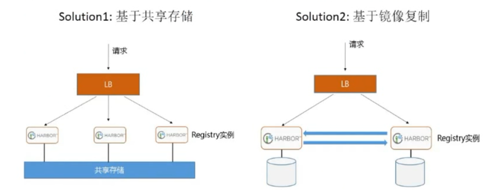

# 28、Docker

## docker介绍

Container 即容器

Docker 即码头工人

​	Docker 是基于 Linux 内核实现，Docker 最早采用 LXC 技术 ，LXC 是 Linux 原生支持的容器技术 ，可 以提供轻量级的虚拟化 ，可以说 docker 就是基于 LXC 发展起来 的，提供 LXC 的高级封装，标准的配 置方法，在LXC的基础之上，docker提供了一系列更强大的功能。而虚拟化技术 KVM(KernelKernelbased Virtual Machine Machine) 基于模块实现， 后来Docker 改为自己研发并开源的 runc 技术运行容 器，彻底抛弃了LXC。

​	Docker 相比虚拟机的交付速度更快，资源消耗更低，Docker 采用客户端/服务端架构，使用远程API来 管理和创建容器，其可以轻松的创建一个轻量级的、可移植的、自给自足的容器，docker 的三大理念是 build(构建)、ship(运输)、 run(运行)，Docker遵从apache 2.0协议，并通过（namespace及cgroup 等）来提供容器的资源隔离与安全保障等，所以Docke容器在运行时不需要类似虚拟机（空运行的虚拟 机占用物理机6-8%性能）的额外资源开销，因此可以大幅提高资源利用率,总而言之Docker是一种用了 新颖方式实现的轻量级虚拟机.类似于VM但是在原理和应用上和VM的差别还是很大的，并且docker的专 业叫法是应用容器(Application Container)。

​	Build, Ship and Run Any App, Anywhere，即通过对应用组件的封装（Packaging）、分发 （Distribution）、部署（Deployment）、运行（Runtime）等生命周期的管理，达到应用组件级别的 “一次封装，到处运行”。这里的应用组件，既可以是一个Web应用，也可以是一套数据库服务，甚至是 一个操作系统。将应用运行在Docker 容器上，可以实现跨平台，跨服务器，只需一次配置准备好相关的 应用环境，即可实现到处运行，保证研发和生产环境的一致性，解决了应用和运行环境的兼容性问题， 从而极大提升了部署效率，减少故障的可能性

**使用Docker 容器化封装应用程序的意义:** 

- 统一基础设施环境-docker环境 
  - 硬件的组成配置 
  - 操作系统的版本 
  - 运行时环境的异构

- 统一程序打包（装箱）方式-docker镜像 
  - java程序 
  - python程序 
  - nodejs程序 
- 统一程序部署（运行）方式-docker容器 
  - java -jar...→ docker run... 
  - python manage.py runserver... → docker run... 
  - npm run dev ... → docker run...

**Docker 和虚拟机，物理主机**


**容器和虚拟机技术比较**


- 传统虚拟机是虚拟出一个主机硬件,并且运行一个完整的操作系统 ,然后在这个系统上安装和运行软件 
- 容器内的应用直接运行在宿主机的内核之上,容器并没有自己的内核,也不需要虚拟硬件,相当轻量化 
- 每个容器间是互相隔离,每个容器内都有一个属于自己的独立文件系统,独立的进程空间,网络空间,用 户空间等,所以在同一个宿主机上的多个容器之间彼此不会相互影响

**容器和虚拟机比较**

- 资源利用率更高: 开销更小,不需要启动单独的虚拟机OS内核占用硬件资源,可以将服务器性能压榨至极致.虚拟机一般会有5-20%的损耗,容器运行基本无损耗,所以生产中一台物理机只能运行数十个虚拟机，但是一般可以运行数百个容器 
- 启动速度更快: 可以在数秒内完成启动 
- 占用空间更小: 容器一般占用的磁盘空间以MB为单位,而虚拟机以GB 
- 集成性更好: 和 CI/CD（持续集成/持续部署）相关技术结合性更好，实现打包镜像发布测试可以一键运行,做到自动化并快速的部署管理,实现高效的开发生命周期

## Docker组成

Docker 官网: http://www.docker.com 

帮助文档链接: https://docs.docker.com/ 

Docker 镜像: https://hub.docker.com/ 

Docker 中文网站: http://www.docker.org.cn/

- Docker 主机(Host): 一个物理机或虚拟机，用于运行Docker服务进程和容器，也称为宿主机，node节点 
- Docker 服务端(Server): Docker守护进程，运行docker容器 docker engine 
- Docker 客户端(Client): 客户端使用 docker 命令或其他工具调用docker API 
- Docker 镜像(Images): 镜像可以理解为创建实例使用的模板,本质上就是一些程序文件的集合 
- Docker 仓库(Registry): 保存镜像的仓库，官方仓库: https://hub.docker.com/，可以搭建私有仓库 harbor 
- Docker 容器(Container): 容器是从镜像生成对外提供服务的一个或一组服务,其本质就是将镜像中 的程序启动后生成的进程


## Namespace

一个宿主机运行了N个容器，多个容器共用一个 OS，必然带来的以下问题: 

- 怎么样保证每个容器都有不同的文件系统并且能互不影响？ 
- 一个docker主进程内的各个容器都是其子进程，那么如果实现同一个主进程下不同类型的子进程？ 
- 各个容器子进程间能相互通信(内存数据)吗？ 
- 每个容器怎么解决IP及端口分配的问题？ 
- 多个容器的主机名能一样吗？ 
- 每个容器都要不要有root用户？
- 怎么解决账户重名问题？


namespace是Linux系统的底层概念，在LInux内核层实现，即有一些不同类型的命名空间被部署在内 核，各个docker容器运行在同一个docker主进程并且共用同一个宿主机系统内核，各docker容器运行在 宿主机的用户空间，每个容器都要有类似于虚拟机一样的相互隔离的运行空间，但是容器技术是在一个 进程内实现运行指定服务的运行环境，并且还可以保护宿主机内核不受其他进程的干扰和影响，如文件 系统空间、网络空间、进程空间等，目前主要通过以下技术实现容器运行空间的相互隔离: 

| **隔离类型**                                                 | **功能**                                                | **系统调用参数** | **内核版本** |
| :----------------------------------------------------------- | :------------------------------------------------------ | :--------------- | :----------- |
| **MNT Namespace(mount)\|MNT  Namespace（挂载）**             | 提供磁盘挂载点和文件系统的隔离能力                      | `CLONE_NEWNS`    | 2.4.19       |
| **PID Namespace(Process Identification) \|PID  Namespace（进程标识）** | 提供进程隔离能力                                        | `CLONE_NEWPID`   | 2.6.24       |
| **IPC Namespace(InterProcess Communication)\|IPC  Namespace（进程间通信）** | 提供进程间通信的隔离能力, 包括信号量,消息队列和共享内存 | `CLONE_NEWIPC`   | 2.6.19       |
| **Net Namespace(network)\|Net  Namespace（网络）**           | 提供网络隔离，包括网络设备、网络栈和端口等              | `CLONE_NEWNET`   | 2.6.29       |
| **UTS Namespace(UNIX Timesharing System)\|UTS  Namespace（UNIX 分时系统）** | 提供内核、主机名和域名的隔离能力                        | `CLONE_NEWUTS`   | 2.6.19       |
| **User Namespace(user)\|User  Namespace（用户）**            | 提供用户隔离能力，包括用户和组                          | `CLONE_NEWUSER`  | 3.8          |

Pid namespace 

- 不同用户的进程就是通过Pid namespace 隔离开的，且不同namespace 中可以有相同Pid。 

- 有了Pid namespace, 每个namespace 中的Pid 能够相互隔离。 

net namespace 

- 网络隔离是通过net namespace 实现的， 每个net namespace 有独立的network devices, IP  addresses, IP routing tables, /proc/net 目录。 

- Docker 默认采用veth 的方式将container 中的虚拟网卡同host 上的一个docker bridge: docker0  连接在一起。 

ipc namespace 

- Container 中进程交互还是采用linux 常见的进程间交互方法（interprocess communication –  IPC）, 包括常见的信号量、消息队列和共享内存。 

- container 的进程间交互实际上还是host上具有相同Pid namespace 中的进程间交互，因此需要在 IPC 资源申请时加入namespace 信息- 每个IPC 资源有一个唯一的32 位ID。

mnt namespace 

- mnt namespace 允许不同namespace 的进程看到的文件结构不同，这样每个namespace 中的进程所看到的文件目录就被隔离开了 。

uts namespace 

- UTS(“UNIX Time-sharing System”) namespace允许每个container 拥有独立的hostname 和 domain name, 使其在网络上可以被视作一个独立的节点而非Host 上的一个进程。 

user namespace 

- 每个container 可以有不同的user 和group id, 也就是说可以在container 内部用container 内部的 用户执行程序而非Host 上的用户。

```
[root@ubuntu2404 ~]#uname -r
6.8.0-48-generic
[root@ubuntu2404 ~]#grep -A10 CONFIG_NAMESPACES /boot/config-6.8.0-48-generic 
CONFIG_NAMESPACES=y
CONFIG_UTS_NS=y
CONFIG_TIME_NS=y
CONFIG_IPC_NS=y
CONFIG_USER_NS=y
CONFIG_PID_NS=y
CONFIG_NET_NS=y
CONFIG_CHECKPOINT_RESTORE=y
CONFIG_SCHED_AUTOGROUP=y
CONFIG_RELAY=y
```

```bash
用法：
 lsns [选项] [<名字空间>]
列出系统名字空间。
选项：
-J, --json             #使用 JSON 输出格式
-l, --list             #使用列表格式的输出
-n, --noheadings       #不打印标题
-o, --output <list>    #定义使用哪个输出列
     --output-all      #output all columns
-p, --task <pid>       #打印进程名字空间
-r, --raw              #使用原生输出格式
-u, --notruncate       #不截断列中的文本
-W, --nowrap           #don't use multi-line representation
-t, --type <name>      #namespace type (mnt, net, ipc, user, pid, uts, cgroup, time)

-h, --help             #display this help
-V, --version          #display version

Available output columns:
         NS 	#名字空间标识符 (inode 号)
       TYPE 	#名字空间类型
       PATH 	#名字空间路径
     NPROCS 	#名字空间中的进程数
        PID 	#名字空间中的最低 PID
       PPID 	#PID 的 PPID
    COMMAND 	#PID 的命令行
        UID 	#PID 的 UID
       USER 	#PID 的用户名
    NETNSID     #网络子系统使用的命名空间 ID
       NSFS     #nsfs挂载点（通常使用网络子系统）
        PNS     #父命名空间标识符（inode 编号）
        ONS     #所有者名称空间标识符（inode 编号）

[root@ubuntu2404 ~]#nsenter --help
用法：
 nsenter [选项] [<程序> [<参数>...]]
以其他程序的名字空间运行某个程序。
选项：
-a, --all              #输入所有命名空间
-t, --target <pid>     #要获取名字空间的目标进程
-m, --mount[=<文件>]    #进入 mount 名字空间
-u, --uts[=<文件>]      #进入 UTS 名字空间(主机名等)
-i, --ipc[=<文件>]      #进入 System V IPC 名字空间
-n, --net[=<文件>]      #进入网络名字空间
-p, --pid[=<文件>]      #进入 pid 名字空间
-C, --cgroup[=<文件>]   #进入 cgroup 名字空间
-U, --user[=<文件>]     #进入用户名字空间
-T, --time[=<file>]    #输入时间命名空间
-S, --setuid <uid>     #设置进入空间中的 uid
-G, --setgid <gid>     #设置进入名字空间中的 gid
    --preserve-credentials #不干涉 uid 或 gid
-r, --root[=<目录>]	  #设置根目录
-w, --wd[=<dir>]       #设置工作目录
-F, --no-fork          #执行 <程序> 前不 fork
-Z, --follow-context   #根据 --target PID 设置 SELinux 环境
-h, --help             #显示此帮助
-V, --version          #显示版本

[root@ubuntu2404 ~]#lsns -l
        NS TYPE   NPROCS   PID USER             COMMAND
4026531834 time      206     1 root             /sbin/init
4026531835 cgroup    206     1 root             /sbin/init
4026531836 pid       206     1 root             /sbin/init
4026531837 user      206     1 root             /sbin/init
4026531838 uts       202     1 root             /sbin/init
4026531839 ipc       206     1 root             /sbin/init
4026531840 net       206     1 root             /sbin/init
4026531841 mnt       200     1 root             /sbin/init
4026531862 mnt         1    29 root             kdevtmpfs
4026532544 mnt         1   496 root             /usr/lib/systemd/systemd-udevd
4026532545 uts         1   496 root             /usr/lib/systemd/systemd-udevd
4026532599 mnt         1   640 systemd-network  /usr/lib/systemd/systemd-networkd
4026532600 mnt         1   692 systemd-timesync /usr/lib/systemd/systemd-timesyncd
4026532601 mnt         1   665 systemd-resolve  /usr/lib/systemd/systemd-resolved
4026532602 uts         1   692 systemd-timesync /usr/lib/systemd/systemd-timesyncd
4026532646 uts         1   930 syslog           /usr/sbin/rsyslogd -n -iNONE
4026532669 mnt         1   826 root             /usr/lib/systemd/systemd-logind
4026532670 uts         1   826 root             /usr/lib/systemd/systemd-logind

```

## Control groups

Linux Cgroups的全称是Linux Control Groups,是Linux内核的一个功能.最早是由Google的工程师（主 要是Paul Menage和Rohit Seth）在2006年发起，最早的名称为进程容器（process containers）。

在2007年时，因为在Linux内核中，容器（container）这个名词有许多不同的意义，为避免混乱，被重命名为cgroup，并且被合并到2.6.24版的内核中去。自那以后，又添加了很多功能。

如果不对一个容器做任何资源限制，则宿主机会允许其占用无限大的内存空间，有时候会因为代码bug 程序会一直申请内存，直到把宿主机内存占完，为了避免此类的问题出现，宿主机有必要对容器进行资源分配限制，比如CPU、内存等

 Cgroups 最主要的作用，就是限制一个进程组能够使用的资源上限，包括CPU、内存、磁盘、网络带宽 等等。此外，还能够对进程进行优先级设置，资源的计量以及资源的控制(比如:将进程挂起和恢复等操作)。

Cgroups在内核层默认已经开启，从CentOS 和 Ubuntu 不同版本对比，显然内核较新的支持的功能更多。

```bash
[root@ubuntu2404 ~]#grep CGROUP /boot/config-6.8.0-48-generic 
CONFIG_CGROUPS=y
# CONFIG_CGROUP_FAVOR_DYNMODS is not set
CONFIG_BLK_CGROUP=y
CONFIG_CGROUP_WRITEBACK=y
CONFIG_CGROUP_SCHED=y
CONFIG_CGROUP_PIDS=y
CONFIG_CGROUP_RDMA=y
CONFIG_CGROUP_FREEZER=y
CONFIG_CGROUP_HUGETLB=y
CONFIG_CGROUP_DEVICE=y
CONFIG_CGROUP_CPUACCT=y
CONFIG_CGROUP_PERF=y
CONFIG_CGROUP_BPF=y
CONFIG_CGROUP_MISC=y
# CONFIG_CGROUP_DEBUG is not set
CONFIG_SOCK_CGROUP_DATA=y
CONFIG_BLK_CGROUP_RWSTAT=y
CONFIG_BLK_CGROUP_PUNT_BIO=y
# CONFIG_BLK_CGROUP_IOLATENCY is not set
CONFIG_BLK_CGROUP_FC_APPID=y
CONFIG_BLK_CGROUP_IOCOST=y
CONFIG_BLK_CGROUP_IOPRIO=y
# CONFIG_BFQ_CGROUP_DEBUG is not set
CONFIG_NETFILTER_XT_MATCH_CGROUP=m
CONFIG_NET_CLS_CGROUP=m
CONFIG_CGROUP_NET_PRIO=y
CONFIG_CGROUP_NET_CLASSID=y
# CONFIG_DEBUG_CGROUP_REF is not set
[root@ubuntu2404 ~]#grep MEMCG /boot/config-6.8.0-48-generic 
CONFIG_MEMCG=y
CONFIG_MEMCG_KMEM=y
```


## 容器管理工具

有了以上的namespace、cgroups就具备了基础的容器运行环境，但是还需要有相应的容器创建与删除 的管理工具、以及怎么样把容器运行起来、容器数据怎么处理、怎么进行启动与关闭等问题需要解决， 于是容器管理技术出现了。目前主要是使用docker，containerd等，早期使用 LXC


### LXC

LXC: Linux Container。可以提供轻量级的虚拟化功能,以便隔离进程和资源,包括一系列容器的管理工具软件,如，lxc-create,lxc-start,lxc-attach等,但这技术功能不完善,目前较少使用 

官方网站: https://linuxcontainers.org/


### docker

Docker 相当于增强版的LXC,功能更为强大和易用,也是当前最主流的容器前端管理工具。

Docker 先启动一个容器也需要一个外部模板，也称为镜像，docke的镜像可以保存在一个公共的地方共 享使用，只要把镜像下载下来就可以使用，最主要的是可以在镜像基础之上做自定义配置并且可以再把 其提交为一个镜像，一个镜像可以被启动为多个容器。


Docker的镜像是分层的，镜像底层为库文件且只读层即不能写入也不能删除数据，从镜像加载启动为一 个容器后会生成一个可写层，其写入的数据会复制到宿主机上对应容器的目录，但是容器内的数据在删 除容器后也会被随之删除。

### pouch

项目网点: https://github.com/alibaba/pouch 

Pouch （小袋子）起源于 2011 年，并于2017年11月19日上午，在中国开源年会现场，阿里巴巴正式开源了基于 Apache 2.0 协议的容器技术 Pouch。Pouch 是一款轻量级的容器技术，拥有快速高效、可移 植性高、资源占用少等特性，主要帮助阿里更快的做到内部业务的交付，同时提高超大规模下数据中心的物理资源利用率。

目前的容器方案大多基于 Linux 内核提供的 cgroup 和 namespace 来实现隔离，然后这样轻量级方案 存在弊端:  

- 容器间，容器与宿主间，共享同一个内核

- 内核实现的隔离资源，维度不足 

面对如此的内核现状，阿里巴巴采取了三个方面的工作，来解决容器的安全问题:  

- 用户态增强容器的隔离维度，比如网络带宽、磁盘使用量等 

- 给内核提交 patch，修复容器的资源可见性问题，cgroup 方面的 bug 

- 实现基于 Hypervisor 的容器，通过创建新内核来实现容器隔离

### Podman

虽然目前 Docker 是管理 Linux 容器最好的工具，注意没有之一，但是podman的横空出现即将改变这一点 

什么是Podman？ 

Podman即Pod Manager tool，从名称上可以看出和kubernets的pod的密切联系，不过就其功能来说，简而言之: alias docker = podman ,是CentOS 8 新集成的功能，或许不久的未来会代替docker 

Podman是一个为 Kubernetes 而生的开源的容器管理工具，原来是 CRI-O（即容器运行时接口CRI 和 开放容器计划OCI） 项目的一部分，后来被分离成一个单独的项目叫 libpod。其可在大多数Linux平台 上使用，它是一种无守护程序的容器引擎，用于在Linux系统上开发，管理和运行任何符合Open  Container Initiative（OCI）标准的容器和容器镜像。 

Podman 提供了一个与Docker兼容的命令行前端，Podman 里面87%的指令都和Docker CLI 相同，因 此可以简单地为Docker CLI别名，即“ alias docker = podman”，事实上，podman使用的一些库也是 docker 的一部分。

官网地址: https://podman.io/ 

项目地址: https://github.com/containers/libpod

### Podman 和docker不同之处

- docker 需要在系统上运行一个守护进程(docker daemon)，这会产生一定的开销，而podman 不需要

- 启动容器的方式不同:  `docker cli` 命令通过API跟 `Docker Engine(引擎)` 交互告诉它我想创建一个container，然后 `docker Engine` 才会调用 `OCI container runtime(runc)` 来启动一个container。这代表 container的process(进程)不会是 `Docker CLI` 的 `child process(子进程)` ，而是 `Docker  Engine` 的 `child process `。 

  `Podman` 是直接给 `OCI containner runtime(runc)` 进行交互来创建container的，所以 `container process` 直接是 `podman 的 child process` 。

- 因为docke有docker daemon，所以docker启动的容器支持 --restart 策略，但是podman不支持 。

- docker需要使用root用户来创建容器。 这可能会产生安全风险，尤其是当用户知道docker run命 令的--privileged选项时。podman既可以由root用户运行，也可以由非特权用户运行。

- docker在Linux上作为守护进程运行扼杀了容器社区的创新。 如果要更改容器的工作方式，则需要 更改docker守护程序并将这些更改推送到上游。 没有守护进程，容器基础结构更加模块化，更容易进行更改。 podman的无守护进程架构更加灵活和安全。

### Containerd 工具

ctr 是由 containerd 提供的一个客户端工具 

nerdctl 是 与 Docker 兼容的CLI for Containerd，其支持Compose 

nerdctl 和 docker命令行语法很相似，学习比较容易 

项目地址：https://github.com/containerd/nerdctl

## Docker 的优势和缺点

### 优势

- 快速部署: 短时间内可以部署成百上千个应用，更快速交付到线上 

- 高效虚拟化: 不需要额外hypervisor支持，基于linux内核实现应用虚拟化，相比虚拟机大幅提高性能和效率 
- 节省开支: 提高服务器利用率，降低IT支出 
- 简化配置: 将运行环境打包保存至容器，使用时直接启动即可 
- 环境统一: 将开发，测试，生产的应用运行环境进行标准化和统一，减少环境不一样带来的各种问题 
- 快速迁移和扩展: 可实现跨平台运行在物理机、虚拟机、公有云等环境，良好的兼容性可以方便将应用从A宿主机迁移到B宿主机，甚至是A平台迁移到B平台
- 更好的实现面向服务的架构,推荐一个容器只运行一个应用,实现分布的应用模型,可以方便的进行横向扩展,符合开发中高内聚,低耦合的要求,减少不同服务之间的相互影响

### 缺点

- 多个容器共用宿主机的内核，各应用之间的隔离不如虚拟机彻底 
- 由于和宿主机之间的进程也是隔离的,需要进入容器查看和调试容器内进程等资源,变得比较困难和繁琐 
- 如果容器内进程需要查看和调试,需要在每个容器内都需要安装相应的工具,这也造成存储空间的重复浪费

## 容器的相关技术

### 容器规范

OCI 官网:https://opencontainers.org/ 

容器技术除了的docker之外，还有coreOS的rkt，还有阿里的Pouch等等 

为了保证容器生态的标准性和健康可持续发展，包括Linux 基金会、Docker、微软、红帽、谷歌和IBM 等公司在2015年6月共同成立了一个叫Open Container Initiative（OCI）的组织，其目的就是制定开放 的标准的容器规范 

目前OCI一共发布了两个规范，分别是runtime spec和 image format spec，有了这两个规范，不同 的容器公司开发的容器只要兼容这两个规范，就可以保证容器的可移植性和相互可操作性。

**容器 runtime**

runtime是真正运行容器的地方，因此为了运行不同的容器runtime需要和操作系统内核紧密合作相互在支持，以便为容器提供相应的运行环境 

对于容器运行时主要有两个级别：Low Level(使用接近内核层) 和 High Level(使用接近用户层)目前，市面上常用的容器引擎有很多，主要有下图的那几种。


dockershim, containerd 和cri-o都是遵循CRI的容器运行时，我们称他们为高层级运行时（High-level  Runtime） 

其他的容器运营厂商最底层的runc仍然是Docker在维护的。 

Google,CoreOS,RedHat都推出自已的运行时:lmctfy,rkt,cri-o,但到目前Docker仍然是最主流的容器引擎 技术。 

runtime 类型:

- Lxc: linux上早期的runtime，在 2013 年 Docker 刚发布的时候,就是采用lxc作为runtime, Docker 把 LXC 复杂的容器创建与使用方式简化为 Docker 自己的一套命令体系。随着Docker的发展，原 有的LXC不能满足Docker的需求,比如跨平台功能 

- Libcontainer: 随着 Docker 的不断发展，重新定义容器的实现标准，将底层实现都抽象化到 Libcontainer 的接口。这就意味着，底层容器的实现方式变成了一种可变的方案，无论是使用namespace、cgroups 技术抑或是使用 systemd 等其他方案，只要实现了 Libcontainer 定义的一 组接口，Docker 都可以运行。这也为 Docker 实现全面的跨平台带来了可能。

- runc: 早期libcontainer是Docker公司控制的一个开源项目，OCI的成立后,Docker把libcontainer 项目移交给了OCI组织,runC就是在libcontainer的基础上进化而来,目前Docker默认的runtime， runc遵守OCI规范 

- rkt: 是CoreOS开发的容器runtime，也符合OCI规范，所以使用rktruntime也可以运行Docker容 器

**Docker 的运行机制**


### 镜像仓库 Registry

统一保存镜像而且是多个不同镜像版本的地方，叫做镜像仓库 

- Docker hub: docker官方的公共仓库，已经保存了大量的常用镜像，可以方便大家直接使用 
- 阿里云，网易等第三方镜像的公共仓库
- Image registry: docker 官方提供的私有仓库部署工具，无web管理界面，目前使用较少 
- Harbor: vmware 提供的自带web界面自带认证功能的镜像私有仓库，目前有很多公司使用

镜像格式

```bash
docker.io/library/alpine
harbor.wang.org/project/centos:7.2.1511
registry.cn-hangzhou.aliyuncs.com/wangxiaochun/busybox:v1.0
172.18.200.101/project/centos: latest
172.18.200.101/project/java-7.0.59:v1
```

### 容器编排工具

当多个容器在多个主机运行的时候，单独管理容器是相当复杂而且很容易出错，而且也无法实现某一台 主机宕机后容器自动迁移到其他主机从而实现高可用的目的，也无法实现动态伸缩的功能，因此需要有 一种工具可以实现统一管理、动态伸缩、故障自愈、批量执行等功能，这就是容器编排引擎

容器编排通常包括容器管理、调度、集群定义和服务发现等功能 

Docker compose : docker 官方实现单机的容器的编排工具 

Docker swarm: docker 官方开发的容器编排引擎,支持overlay network 

Mesos+Marathon: Mesos是Apache下的开源分布式资源管理框架，它被称为是分布式系统的内 核。Mesos最初是由加州大学伯克利分校的AMPLab开发的，后在Twitter得到广泛使用。通用的集 群组员调度平台，mesos(资源分配)与marathon(容器编排平台)一起提供容器编排引擎功能 

Kubernetes: google领导开发的容器编排引擎，内部项目为Borg，且其同时支持 docker 和 CoreOS,当前已成为容器编排工具事实上的标准


## Docker安装和删除

### Docker版本说明

官方网址: https://www.docker.com/

**OS系统版本选择:**  

Docker 目前已经支持多种操作系统的安装运行，比如Ubuntu、CentOS、Redhat、Debian、Fedora，甚至是还支持了Mac和Windows，在linux系统上需要内核版本在3.10或以上

**Docker版本选择:** 

```
github地址: https://github.com/moby/moby
```

如果要布署到 kubernetes上，需要查看相关kubernetes对docker版本要求的说明，比如

```
https://github.com/kubernetes/kubernetes/blob/v1.17.2/CHANGELOG-1.17.md
```


### 安装和删除

官方文档 : https://docs.docker.com/engine/install/ 

阿里云文档: https://developer.aliyun.com/mirror/docker-ce?spm=a2c6h.13651102.0.0.3e221b11guHCWE 

安装方法 

- 内置仓库 
- 官方仓库（国内镜像）
- 二进制安装（离线） 
- 官方脚本

### Ubuntu 包安装和删除Docker

**使用存储库安装`apt`**

在新主机上首次安装 Docker Engine 之前，您需要 需要设置 Docker 存储库。之后，您可以安装和更新 存储库中的 Docker。`apt`

1. 设置 Docker 的存储库。`apt`

   ```bash
   # Add Docker's official GPG key:
   sudo apt-get update
   sudo apt-get install ca-certificates curl
   sudo install -m 0755 -d /etc/apt/keyrings
   sudo curl -fsSL http://download.docker.com/linux/ubuntu/gpg -o /etc/apt/keyrings/docker.asc
   sudo chmod a+r /etc/apt/keyrings/docker.asc
   
   # Add the repository to Apt sources:
   echo \
     "deb [arch=$(dpkg --print-architecture) signed-by=/etc/apt/keyrings/docker.asc] https://download.docker.com/linux/ubuntu \
     $(. /etc/os-release && echo "${UBUNTU_CODENAME:-$VERSION_CODENAME}") stable" | \
     sudo tee /etc/apt/sources.list.d/docker.list > /dev/null
   sudo apt-get update
   ```

2. (1) 安装 Docker 软件包默认安装最新版本。

   ```bash
   $ sudo apt-get install docker-ce docker-ce-cli containerd.io docker-buildx-plugin docker-compose-plugin
   ```

   (2) 安装特定版本。

   ```bash
    #List the available versions:
    $apt-cache madison docker-ce | awk '{ print $3 }'
   
   5:27.5.1-1~ubuntu.24.04~noble
   5:27.5.0-1~ubuntu.24.04~noble
   ```

   选择所需的版本并安装：

   ```bash
   VERSION_STRING=5:27.5.1-1~ubuntu.24.04~noble
   sudo apt-get install docker-ce=$VERSION_STRING docker-ce-cli=$VERSION_STRING containerd.io docker-buildx-plugin docker-compose-plugin
   ```

   

3. 通过运行映像来验证安装是否成功：`hello-world`

   ```bash
   $ sudo docker run hello-world
   ```

   此命令将下载测试映像并在容器中运行它。当 container 运行时，它会打印确认消息并退出。

现在，您已成功安装并启动 Docker Engine。

**删除docker**

```bash
[root@ubuntu ~]#apt purge docker-ce
[root@ubuntu ~]#rm -rf /var/lib/docker
```

**阿里云安装**

**Ubuntu（使用 apt-get 进行安装）**

```bash
# step 1: 安装必要的一些系统工具
sudo apt-get update
sudo apt-get install ca-certificates curl gnupg

# step 2: 信任 Docker 的 GPG 公钥
sudo install -m 0755 -d /etc/apt/keyrings
curl -fsSL https://mirrors.aliyun.com/docker-ce/linux/ubuntu/gpg | sudo gpg --dearmor -o /etc/apt/keyrings/docker.gpg
sudo chmod a+r /etc/apt/keyrings/docker.gpg

# Step 3: 写入软件源信息
echo \
  "deb [arch=$(dpkg --print-architecture) signed-by=/etc/apt/keyrings/docker.gpg] https://mirrors.aliyun.com/docker-ce/linux/ubuntu \
  "$(. /etc/os-release && echo "$VERSION_CODENAME")" stable" | \
  sudo tee /etc/apt/sources.list.d/docker.list > /dev/null
 
# Step 4: 安装Docker
sudo apt-get update
sudo apt-get install docker-ce docker-ce-cli containerd.io docker-buildx-plugin docker-compose-plugin

# 安装指定版本的Docker-CE:
# Step 1: 查找Docker-CE的版本:
# apt-cache madison docker-ce
#   docker-ce | 17.03.1~ce-0~ubuntu-xenial | https://mirrors.aliyun.com/docker-ce/linux/ubuntu xenial/stable amd64 Packages
#   docker-ce | 17.03.0~ce-0~ubuntu-xenial | https://mirrors.aliyun.com/docker-ce/linux/ubuntu xenial/stable amd64 Packages
# Step 2: 安装指定版本的Docker-CE: (VERSION例如上面的17.03.1~ce-0~ubuntu-xenial)
# sudo apt-get -y install docker-ce=[VERSION]

```


范例：**内置仓库安装docker**

```bash
[root@ubuntu2204 ~]#apt update 
[root@ubuntu2204 ~]#apt -y install docker.io
```

范例：**安装指定版本docker**

```bash
# step 1: 安装必要的一些系统工具
[root@ubuntu2204 ~]#apt update 
[root@ubuntu2204 ~]#apt install -y apt-transport-https ca-certificates curl software-properties-common
# step 2: 安装GPG证书
[root@ubuntu2204 ~]#install -m 0755 -d /etc/apt/keyrings
[root@ubuntu2204 ~]#curl -fsSL https://mirrors.aliyun.com/docker-ce/linux/ubuntu/gpg | gpg --dearmor -o /etc/apt/keyrings/docker.gpg
[root@ubuntu2204 ~]#chmod a+r /etc/apt/keyrings/docker.gpg
# Step 3: 写入软件源信息
[root@ubuntu2204 ~]#echo \
  "deb [arch=$(dpkg --print-architecture) signed-by=/etc/apt/keyrings/docker.gpg] https://mirrors.aliyun.com/docker-ce/linux/ubuntu \
  "$(. /etc/os-release && echo "$VERSION_CODENAME")" stable" | \
  tee /etc/apt/sources.list.d/docker.list > /dev/null
# Step 4: 安装指定版本Docker
[root@ubuntu2204 ~]#apt update
[root@ubuntu2204 ~]#apt-cache madison docker-ce | awk '{ print $3 }'
[root@ubuntu2204 ~]#apt install docker-ce=5:27.5.0-1~ubuntu.22.04~jammy docker-ce-cli=5:27.5.0-1~ubuntu.22.04~jammy containerd.io docker-buildx-plugin docker-compose-plugin
```

### centos包安装和删除docker

官方文档: https://docs.docker.com/install/linux/docker-ce/centos/

下载rpm包安装:  

- 官方rpm包下载地址: https://download.docker.com/linux/centos/7/x86_64/stable/Packages/ 

- 阿里镜像下载地址:  https://mirrors.aliyun.com/docker-ce/linux/centos/7/x86_64/stable/Packages/ 

**CentOS （使用 yum 进行安装）**

```bash
# step 1: 安装必要的一些系统工具
sudo yum install -y yum-utils

# Step 2: 添加软件源信息
yum-config-manager --add-repo https://mirrors.aliyun.com/docker-ce/linux/centos/docker-ce.repo

# Step 3: 安装Docker
sudo yum install docker-ce docker-ce-cli containerd.io docker-buildx-plugin docker-compose-plugin

# Step 4: 开启Docker服务
sudo service docker start

# 注意：
# 官方软件源默认启用了最新的软件，您可以通过编辑软件源的方式获取各个版本的软件包。例如官方并没有将测试版本的软件源置为可用，您可以通过以下方式开启。同理可以开启各种测试版本等。
# vim /etc/yum.repos.d/docker-ce.repo
#   将[docker-ce-test]下方的enabled=0修改为enabled=1
#
# 安装指定版本的Docker-CE:
# Step 1: 查找Docker-CE的版本:
# yum list docker-ce.x86_64 --showduplicates | sort -r
#   Loading mirror speeds from cached hostfile
#   Loaded plugins: branch, fastestmirror, langpacks
#   docker-ce.x86_64            17.03.1.ce-1.el7.centos            docker-ce-stable
#   docker-ce.x86_64            17.03.1.ce-1.el7.centos            @docker-ce-stable
#   docker-ce.x86_64            17.03.0.ce-1.el7.centos            docker-ce-stable
#   Available Packages
# Step2: 安装指定版本的Docker-CE: (VERSION例如上面的17.03.0.ce.1-1.el7.centos)
# sudo yum -y install docker-ce-[VERSION]
```

**通过yum源安装:** 

```bash
由于官网的yum源太慢，下面使用阿里云的Yum源进行安装
rm -rf /etc/yum.repos.d/*
#CentOS 7 安装docker依赖三个yum源:Base,Extras,docker-ce
wget -O /etc/yum.repos.d/CentOS-Base.repo http://mirrors.aliyun.com/repo/Centos-7.repo
wget -O /etc/yum.repos.d/epel.repo http://mirrors.aliyun.com/repo/epel-7.repo
wget -O /etc/yum.repos.d/docker-ce.repo https://mirrors.aliyun.com/docker-ce/linux/centos/docker-ce.repo
yum clean all 
yum -y install docker-ce
systemctl enable --now docker
```

**删除 docker**

```bash
[root@centos7 ~]#yum remove docker-ce
#删除docker资源存放的相关文件
[root@centos7 ~]#rm -rf /var/lib/docker
```

### Linux 二进制离线安装

本方法适用于无法上网或无法通过包安装方式安装的主机上安装docker 

安装文档: https://docs.docker.com/install/linux/docker-ce/binaries/ 

二进制安装下载路径 

https://download.docker.com/linux/ 

https://mirrors.aliyun.com/docker-ce/linux/static/stable/x86_64/

范例: 在rocky9上实现二进制安装docker

```bash
[root@ubuntu2204 ~]#wget https://mirrors.aliyun.com/docker-ce/linux/static/stable/x86_64/docker-27.5.1.tgz
[root@ubuntu2204 ~]#scp docker-27.5.1.tgz 10.0.0.10:
root@rocky9-10:~ # ls
anaconda-ks.cfg  docker-27.5.1.tgz
root@rocky9-10:~ # tar xvf docker-27.5.1.tgz 
docker/
docker/runc
docker/containerd
docker/docker-init
docker/dockerd
docker/containerd-shim-runc-v2
docker/docker-proxy
docker/docker
docker/ctr
root@rocky9-10:~ # cp docker/* /usr/local/bin/
root@rocky9-10:~ # dockerd &>/dev/null &
```

### 脚本在线离线安装docker

```powershell
#!/bin/bash

#支持在线和离线安装

DOCKER_VERSION=27.5.1
#DOCKER_VERSION=26.1.4
#DOCKER_VERSION=26.0.0
#DOCKER_VERSION=24.0.7
#DOCKER_VERSION=24.0.5
#DOCKER_VERSION=23.0.3
#DOCKER_VERSION=20.10.19

URL=https://mirrors.tuna.tsinghua.edu.cn
#URL=https://mirrors.aliyun.com
#URL=https://download.docker.com

color () {
    RES_COL=60
    MOVE_TO_COL="echo -en \\033[${RES_COL}G"
    SETCOLOR_SUCCESS="echo -en \\033[1;32m"
    SETCOLOR_FAILURE="echo -en \\033[1;31m"
    SETCOLOR_WARNING="echo -en \\033[1;33m"
    SETCOLOR_NORMAL="echo -en \E[0m"
    echo -n "$1" && $MOVE_TO_COL
    echo -n "["
    if [ $2 = "success" -o $2 = "0" ] ;then
        ${SETCOLOR_SUCCESS}
        echo -n $"  OK  "    
    elif [ $2 = "failure" -o $2 = "1"  ] ;then 
        ${SETCOLOR_FAILURE}
        echo -n $"FAILED"
    else
        ${SETCOLOR_WARNING}
        echo -n $"WARNING"
    fi
    ${SETCOLOR_NORMAL}
    echo -n "]"
    echo 
}

prepare () {
    if [ ! -e docker-${DOCKER_VERSION}.tgz ];then
        #wget ${URL}/docker-ce/linux/static/stable/x86_64/docker-${DOCKER_VERSION}.tgz
        wget ${URL}/docker-ce/linux/static/stable/x86_64/docker-${DOCKER_VERSION}.tgz
    fi
    [ $? -ne 0  ] && { echo "文件下载失败"; exit; }
}

install_docker () {
    tar xf docker-${DOCKER_VERSION}.tgz -C /usr/local/
    cp /usr/local/docker/* /usr/local/bin/
    cat > /lib/systemd/system/docker.service <<-EOF
[Unit]
Description=Docker Application Container Engine
Documentation=https://docs.docker.com
After=network-online.target firewalld.service
Wants=network-online.target

[Service]
Type=notify
# the default is not to use systemd for cgroups because the delegate issues still
# exists and systemd currently does not support the cgroup feature set required
# for containers run by docker
ExecStart=/usr/local/bin/dockerd -H unix://var/run/docker.sock
ExecReload=/bin/kill -s HUP \$MAINPID
# Having non-zero Limit*s causes performance problems due to accounting overhead
# in the kernel. We recommend using cgroups to do container-local accounting.
LimitNOFILE=infinity
LimitNPROC=infinity
LimitCORE=infinity
# Uncomment TasksMax if your systemd version supports it.
# Only systemd 226 and above support this version.
#TasksMax=infinity
TimeoutStartSec=0
# set delegate yes so that systemd does not reset the cgroups of docker containers
Delegate=yes
# kill only the docker process, not all processes in the cgroup
KillMode=process
# restart the docker process if it exits prematurely
Restart=on-failure
StartLimitBurst=3
StartLimitInterval=60s

[Install]
WantedBy=multi-user.target
EOF
    systemctl daemon-reload
}

config_docker () {
    mkdir -p /etc/docker
    tee /etc/docker/daemon.json <<-'EOF'
    {
      "registry-mirrors": ["https://docker.m.daocloud.io","https://docker.1panel.live","https://docker.1ms.run","https://docker.xuanyuan.me"],
      "insecure-registries": ["harbor.wang.org"]
     }
EOF
    #systemctl restart docker

}

start_docker (){
    systemctl enable --now docker
    docker version && color "Docker 安装成功" 0 ||  color "Docker 安装失败" 1
}


config_docker_completion () {
    wget -P /etc/bash_completion.d http://www.wangxiaochun.com:8888/testdir/docker/docker_completion 
    #source /etc/bash_completion.d/docker_completion
}


prepare

install_docker

config_docker

start_docker

config_docker_completion
```

## Docker命令帮助

### **常用命令**

这些是最常用的 Docker 命令：

- **`run`**：从镜像创建并启动一个新容器。
- **`exec`**：在正在运行的容器中执行命令。
- **`ps`**：列出正在运行的容器。
- **`build`**：从 Dockerfile 构建镜像。
- **`pull`**：从 Docker 仓库（如 Docker Hub）下载镜像。
- **`push`**：将镜像上传到 Docker 仓库。
- **`images`**：列出本地存储的所有镜像。
- **`login`**：登录到 Docker 仓库。
- **`logout`**：从 Docker 仓库注销。
- **`search`**：在 Docker Hub 中搜索镜像。
- **`version`**：显示 Docker 版本信息。
- **`info`**：显示 Docker 系统信息。

------

### **管理命令**

这些命令用于管理 Docker 的特定组件：

- **`builder`**：管理构建。
- **`container`**：管理容器（如启动、停止、删除）。
- **`context`**：管理 Docker 上下文（用于切换 Docker 环境）。
- **`image`**：管理镜像（如删除、打标签）。
- **`manifest`**：管理 Docker 镜像清单（用于多架构镜像）。
- **`network`**：管理 Docker 网络。
- **`plugin`**：管理 Docker 插件。
- **`system`**：管理 Docker 系统设置。
- **`trust`**：管理 Docker 镜像的信任设置。
- **`volume`**：管理 Docker 卷。

------

### **Swarm 命令**

这些命令专门用于 Docker Swarm（容器编排工具）：

- **`swarm`**：管理 Docker Swarm（如初始化、加入、离开）。

------

### **其他命令**

这些是 Docker 的其他常用命令：

- **`attach`**：连接到正在运行的容器的输入/输出流。
- **`commit`**：从容器的更改创建新镜像。
- **`cp`**：在容器和本地文件系统之间复制文件/文件夹。
- **`create`**：创建容器但不启动。
- **`diff`**：检查容器文件系统的更改。
- **`events`**：查看 Docker 的实时事件。
- **`export`**：将容器的文件系统导出为 tar 归档文件。
- **`history`**：显示镜像的历史记录。
- **`import`**：从 tar 文件导入文件系统以创建镜像。
- **`inspect`**：显示 Docker 对象（如容器、镜像）的详细信息。
- **`kill`**：强制停止一个或多个正在运行的容器。
- **`load`**：从 tar 文件加载镜像。
- **`logs`**：查看容器的日志。
- **`pause`**：暂停容器中的所有进程。
- **`port`**：列出容器的端口映射。
- **`rename`**：重命名容器。
- **`restart`**：重启一个或多个容器。
- **`rm`**：删除一个或多个容器。
- **`rmi`**：删除一个或多个镜像。
- **`save`**：将一个或多个镜像保存为 tar 文件。
- **`start`**：启动一个或多个已停止的容器。
- **`stats`**：实时显示容器的资源使用统计信息。
- **`stop`**：优雅地停止一个或多个正在运行的容器。
- **`tag`**：为镜像打标签。
- **`top`**：显示容器中正在运行的进程。
- **`unpause`**：恢复容器中的所有进程。
- **`update`**：更新容器的配置。
- **`wait`**：等待容器停止，然后打印其退出代码。

------

### **全局选项**

这些选项可以与任何 Docker 命令一起使用：

- **`--config`**：指定客户端配置文件的路径（默认 `/root/.docker`）。
- **`-c, --context`**：指定要使用的上下文名称。
- **`-D, --debug`**：启用调试模式。
- **`-H, --host`**：指定要连接的 Docker 守护进程套接字。
- **`-l, --log-level`**：设置日志级别（如 `debug`、`info`、`warn`、`error`）。
- **`--tls`**：使用 TLS 加密连接。
- **`--tlsverify`**：使用 TLS 并验证远程连接。
- **`-v, --version`**：显示 Docker 版本信息并退出。

------

### **使用示例**

- 查看某个命令的详细帮助：

  ```
  docker <命令> --help
  ```

  例如

  ```
  docker run --help
  ```

- 查看 Docker 版本：

  ```
  docker --version
  ```

- 列出所有正在运行的容器：

  ```
  docker ps
  ```

## Docker 相关信息和优化配置

### docker 版本信息、

```bash
[root@ubuntu2404 ~]#docker info 
Client: Docker Engine - Community
 Version:    27.5.1
 Context:    default
 Debug Mode: false
 Plugins:
  buildx: Docker Buildx (Docker Inc.)
    Version:  v0.20.0
    Path:     /usr/libexec/docker/cli-plugins/docker-buildx
  compose: Docker Compose (Docker Inc.)
    Version:  v2.32.4
    Path:     /usr/libexec/docker/cli-plugins/docker-compose

Server:
 Containers: 0
  Running: 0
  Paused: 0
  Stopped: 0
 Images: 0
 Server Version: 27.5.1
 Storage Driver: overlay2
  Backing Filesystem: extfs
  Supports d_type: true
  Using metacopy: false
  Native Overlay Diff: true
  userxattr: false
 Logging Driver: json-file
 Cgroup Driver: systemd
 Cgroup Version: 2
 Plugins:
  Volume: local
  Network: bridge host ipvlan macvlan null overlay
  Log: awslogs fluentd gcplogs gelf journald json-file local splunk syslog
 Swarm: inactive
 Runtimes: io.containerd.runc.v2 runc
 Default Runtime: runc
 Init Binary: docker-init
 containerd version: bcc810d6b9066471b0b6fa75f557a15a1cbf31bb
 runc version: v1.2.4-0-g6c52b3f
 init version: de40ad0
 Security Options:
  apparmor
  seccomp
   Profile: builtin
  cgroupns
 Kernel Version: 6.8.0-48-generic
 Operating System: Ubuntu 24.04.1 LTS
 OSType: linux
 Architecture: x86_64
 CPUs: 2
 Total Memory: 1.875GiB
 Name: ubuntu2404.wang.org
 ID: d30e5310-be02-4766-babb-f75b4717a286
 Docker Root Dir: /var/lib/docker
 Debug Mode: false
 Experimental: false
 Insecure Registries:
  127.0.0.0/8
 Live Restore Enabled: false
```

### **Client（客户端信息）**

- **Version**: Docker 客户端版本为 `27.5.1`。
- **Context**: 当前使用的上下文是 `default`（默认上下文）。
- **Debug Mode**: 调试模式未启用（`false`）。
- **Plugins**: 客户端安装的插件：
  - **buildx**: Docker Buildx 插件，用于构建多架构镜像，版本为 `v0.20.0`。
  - **compose**: Docker Compose 插件，用于管理多容器应用，版本为 `v2.32.4`。

------

### **Server（服务端信息）**

- **Containers**: 当前运行的容器数量为 `0`（没有容器在运行）。
  - **Running**: 正在运行的容器数量为 `0`。
  - **Paused**: 暂停的容器数量为 `0`。
  - **Stopped**: 已停止的容器数量为 `0`。
- **Images**: 本地存储的镜像数量为 `0`。
- **Server Version**: Docker 服务端版本为 `27.5.1`（与客户端版本一致）。
- **Storage Driver**: 存储驱动为 `overlay2`，这是 Docker 推荐的存储驱动。
  - **Backing Filesystem**: 底层文件系统为 `extfs`（通常是 ext4）。
  - **Supports d_type**: 支持 `d_type`（目录条目类型），这是 `overlay2` 的必要条件。
  - **Native Overlay Diff**: 启用了原生的 Overlay Diff 功能。
- **Logging Driver**: 日志驱动为 `json-file`，日志会以 JSON 格式存储。
- **Cgroup Driver**: Cgroup 驱动为 `systemd`，这是与 systemd 集成的推荐配置。
- **Cgroup Version**: Cgroup 版本为 `2`。
- **Plugins**: 支持的插件类型：
  - **Volume**: 支持本地卷（`local`）。
  - **Network**: 支持的网络类型包括 `bridge`、`host`、`ipvlan`、`macvlan`、`null` 和 `overlay`。
  - **Log**: 支持的日志驱动包括 `awslogs`、`fluentd`、`gcplogs`、`gelf`、`journald`、`json-file`、`local`、`splunk` 和 `syslog`。
- **Swarm**: Docker Swarm 模式未启用（`inactive`）。
- **Runtimes**: 支持的容器运行时：
  - `io.containerd.runc.v2`
  - `runc`（默认运行时）。
- **Init Binary**: 使用的初始化二进制文件为 `docker-init`。
- **containerd version**: containerd 版本为 `bcc810d6b9066471b0b6fa75f557a15a1cbf31bb`。
- **runc version**: runc 版本为 `v1.2.4-0-g6c52b3f`。
- **init version**: 初始化版本为 `de40ad0`。

------

### **Security Options（安全选项）**

- **apparmor**: 启用了 AppArmor 安全模块。
- **seccomp**: 启用了 seccomp，并使用了内置的安全配置文件（`Profile: builtin`）。
- **cgroupns**: 启用了 Cgroup 命名空间支持。

------

### **系统信息**

- **Kernel Version**: 内核版本为 `6.8.0-48-generic`。
- **Operating System**: 操作系统为 `Ubuntu 24.04.1 LTS`。
- **OSType**: 操作系统类型为 `linux`。
- **Architecture**: 系统架构为 `x86_64`（64 位）。
- **CPUs**: CPU 核心数为 `2`。
- **Total Memory**: 总内存为 `1.875GiB`。
- **Name**: 主机名为 `ubuntu2404.wang.org`。
- **ID**: Docker 实例的唯一 ID 为 `d30e5310-be02-4766-babb-f75b4717a286`。
- **Docker Root Dir**: Docker 数据存储目录为 `/var/lib/docker`。
- **Debug Mode**: 服务端调试模式未启用（`false`）。
- **Experimental**: 实验性功能未启用（`false`）。
- **Insecure Registries**: 配置了不安全仓库地址 `127.0.0.0/8`。
- **Live Restore Enabled**: 实时恢复功能未启用（`false`）。

范例: 解决SWAP报警提示

```
WARNING: No swap limit support  #系统警告信息 (没有开启 swap 资源限制 )
```

```bash
[root@ubuntu2204 ~]#vim /etc/default/grub
GRUB_DEFAULT=0
GRUB_TIMEOUT_STYLE=hidden
GRUB_TIMEOUT=0
GRUB_DISTRIBUTOR=`lsb_release -i -s 2> /dev/null || echo Debian`
GRUB_CMDLINE_LINUX_DEFAULT=""
GRUB_CMDLINE_LINUX="net.ifnames=0 biosdevname=0 swapaccount=1" #修改此行
[root@ubuntu2204 ~]#update-grub
[root@ubuntu2204 ~]#reboot
```

### 查看 docker0 网卡

```bash
[root@ubuntu2204 ~]#ip a
1: lo: <LOOPBACK,UP,LOWER_UP> mtu 65536 qdisc noqueue state UNKNOWN group default qlen 1000
    link/loopback 00:00:00:00:00:00 brd 00:00:00:00:00:00
    inet 127.0.0.1/8 scope host lo
       valid_lft forever preferred_lft forever
    inet6 ::1/128 scope host 
       valid_lft forever preferred_lft forever
2: eth0: <BROADCAST,MULTICAST,UP,LOWER_UP> mtu 1500 qdisc fq_codel state UP group default qlen 1000
    link/ether 00:0c:29:1b:69:05 brd ff:ff:ff:ff:ff:ff
    altname enp2s1
    altname ens33
    inet 10.0.0.100/24 brd 10.0.0.255 scope global eth0
       valid_lft forever preferred_lft forever
    inet6 fe80::20c:29ff:fe1b:6905/64 scope link 
       valid_lft forever preferred_lft forever
3: docker0: <NO-CARRIER,BROADCAST,MULTICAST,UP> mtu 1500 qdisc noqueue state DOWN group default 
    link/ether 02:42:c4:4c:6b:f1 brd ff:ff:ff:ff:ff:ff
    inet 172.17.0.1/16 brd 172.17.255.255 scope global docker0
       valid_lft forever preferred_lft forever
```

### docker 存储引擎

官方文档关于存储引擎的相关文档:  

https://docs.docker.com/storage/storagedriver/ 

https://docs.docker.com/storage/storagedriver/select-storage-driver/

- AUFS: （Advanced Mult-Layered Unification Filesystem，版本2之前旧称AnotherUnionFS）是一种 Union FS ，是文件级的存储驱动。Aufs是之前的UnionFS的重新实现，2006年由Junjiron Okajima开发 

  所谓 UnionFS就是把不同物理位置的目录合并 mount 到同一个目录中。简单来说就是支持将不同目录挂载到一个虚拟文件系统下的。这种可以层层地叠加修改文件。无论底下有多少都是只读的， 最上系统可写的。当需要修改一个文件时， AUFS 创建该文件的一个副本，使用 CoW 将文件从只 读层复制到可写进行修改，结果也保存在Docker 中，底下的只读层就是 image，可写层就是 Container 

  aufs 被拒绝合并到主线 Linux 。其代码被批评为"dense, unreadable, uncommented 密集、不可 读、未注释"。 相反，OverlayFS被合并到 Linux 内核中。在多次尝试将 aufs 合并到主线内核失败 后，作者放弃了 

  AUFS 是 Docker 18.06 及更早版本的首选存储驱动程序，在内核 3.13 上运行 Ubuntu 14.04 时不 支持 overlay2 

- Overlay: 一种 Union FS 文件系统， Linux 内核 3.18 后支持

- Overlay2: Overlay 的升级版，到目前为止，所有 Linux 发行版推荐使用的存储类 型，也是docker 默认使用的存储引擎为overlay2，需要磁盘分区支持d-type功能，因此需要系统磁盘的额外支持,相 对AUFS来说Overlay2 有以下优势: 更简单地设计； 从3.18开始就进入了Linux内核主线；资源消 耗更少

- devicemapper: 因为CentOS 7.2和RHEL 7.2 的之前版本内核版本不支持 overlay2，默认使用的存 储驱动程序，最大数据容量只支持100GB且性能不佳，当前较新版本的CentOS 已经支持 overlay2， 因此推荐使用 overlay2,另外此存储引擎已在Docker Engine 18.09中弃用

- ZFS(Sun -2005)/btrfs(Oracle-2007): 目前没有广泛使用

- vfs: 用于测试环境，适用于无法使用 copy-on -writewrite 时的情况。 此存储驱动程序的性能很 差，通常不建议用于生产

### Docker 优化配置

注意：这种方式只对新建的容器有效的，之前的容器不生效 

范例: 支持官方仓库和私有仓库镜像下载

```bash
[root@ubuntu2404 ~]#cat /etc/docker/daemon.json
{
    "registry-mirrors": [
        "https://docker.m.daocloud.io",
        "https://docker.1panel.live",
        "https://docker.1ms.run",
        "https://docker.xuanyuan.me"
   ],
    "insecure-registries": ["harbor.kang.org"]
}
```

#### **1. 镜像加速器（Registry Mirrors）**

你已经配置了多个镜像加速器，帮助提高 Docker 镜像的下载速度。通常，使用国内的加速器可以显著减少下载时间。以下是你当前的设置：

```json
"registry-mirrors": [
    "https://registry.docker-cn.com",
    "http://hub-mirror.c.163.com",
    "https://docker.mirrors.ustc.edu.cn",
    "https://si7y70hh.mirror.aliyuncs.com/"
]
```

这些镜像加速器配置应该能有效提高镜像拉取的速度。如果你遇到无法访问某个镜像源，可以根据实际情况调整或添加新的加速器。

#### **2. 远程访问配置**

你启用了远程访问 Docker Daemon：

```json
"hosts": ["unix:///var/run/docker.sock", "tcp://10.0.0.10:2375"]
```

这表示 Docker 会监听 `unix:///var/run/docker.sock`（本地套接字）以及 `tcp://10.0.0.10:2375`（TCP 端口）进行远程访问。请注意，启用 TCP 端口对 Docker 进行远程访问时，需要确保此端口没有被外部访问者滥用。建议使用防火墙或其他安全措施来限制访问。

#### **3. 数据目录配置**

你已将 Docker 数据目录指定为 `/data/docker`：

```json
"data-root": "/data/docker"
```

这意味着 Docker 的镜像、容器等数据将存储在 `/data/docker` 目录下。确保该目录有足够的空间并且权限正确。

**注意**：不要混淆 `data-root` 和 `graph`，在 Docker 版本 1.13 及以后，`graph` 配置被 `data-root` 替代。你已经使用了新版的配置，`"graph"` 被注释掉了，这是正确的。

#### **4. 日志设置**

日志文件配置用于限制容器日志文件的大小和数量：

```json
"log-opts": {
   "max-size": "300m",
   "max-file": "2"
}
```

这意味着每个容器的日志文件最多为 300MB，并且保留两个日志文件。日志滚动机制确保不会占用过多磁盘空间。

#### 5**. 最大并发下载/上传**

```json
"max-concurrent-downloads": 10,
"max-concurrent-uploads": 5
```

这些配置限制了 Docker 同时下载和上传镜像的并发数量。你可以根据实际需求进行调整，以控制带宽和资源的使用。

#### **6. 代理配置**

你配置了代理设置，以便 Docker 在使用时能够通过 HTTP 和 HTTPS 代理：

```json
"proxies": {
   "default": {
     "httpProxy": "10.0.0.1:3128",
     "httpsProxy": "10.0.0.1:3129",
     "noProxy": "*.test.example.com,.example.org,127.0.0.0/8"
   },
   "tcp://docker-daemon1.example.com": {
     "noProxy": "*.internal.example.net"
   }
}
```

- **httpProxy** 和 **httpsProxy**：配置了代理服务器地址。
- **noProxy**：指定不通过代理的地址或网段。可以用来排除内部网络、特定的域名等。

#### **7. 容器实时恢复（Live Restore）**

```json
"live-restore": true
```


### 代理配置

```powershell
#!/bin/bash
#

PROXY_SERVER_IP=10.0.0.1
#PROXY_PORT=4780
PROXY_PORT=12334

color () {
    RES_COL=60
    MOVE_TO_COL="echo -en \\033[${RES_COL}G"
    SETCOLOR_SUCCESS="echo -en \\033[1;32m"
    SETCOLOR_FAILURE="echo -en \\033[1;31m"
    SETCOLOR_WARNING="echo -en \\033[1;33m"
    SETCOLOR_NORMAL="echo -en \E[0m"
    echo -n "$1" && $MOVE_TO_COL
    echo -n "["
    if [ $2 = "success" -o $2 = "0" ] ;then
        ${SETCOLOR_SUCCESS}
        echo -n $"  OK  "    
    elif [ $2 = "failure" -o $2 = "1"  ] ;then 
        ${SETCOLOR_FAILURE}
        echo -n $"FAILED"
    else
        ${SETCOLOR_WARNING}
        echo -n $"WARNING"
    fi
    ${SETCOLOR_NORMAL}
    echo -n "]"
    echo 
}

start () {
    [ -d /etc/systemd/system/docker.service.d ] || mkdir -p /etc/systemd/system/docker.service.d
    cat >> /etc/systemd/system/docker.service.d/http-proxy.conf <<EOF
[Service]
Environment="HTTP_PROXY=http://${PROXY_SERVER_IP}:${PROXY_PORT}/"
Environment="HTTPS_PROXY=http://${PROXY_SERVER_IP}:${PROXY_PORT}/"
Environment="NO_PROXY=127.0.0.0/8,172.17.0.0/16,10.0.0.0/24,10.244.0.0/16,192.168.0.0/16,wang.org,cluster.local"
EOF
    systemctl daemon-reload
    systemctl restart docker.service
    systemctl is-active docker.service &> /dev/null
    if [ $? -eq 0 ] ;then 
        color "Docker 服务代理配置完成!" 0  
    else
        color "Docker 服务代理配置失败!" 1
    exit 1
    fi   
}

stop () {
    rm -f /etc/systemd/system/docker.service.d/http-proxy.conf
    systemctl daemon-reload
    systemctl restart docker.service 
    systemctl is-active docker.service &> /dev/null 
    if [ $? -eq 0 ] ;then
        color "Docker 服务代理取消完成!" 0    
    else
        color "Docker 服务代理取消失败!" 1
    exit 1
    fi
   
}

usage () {
    echo "Usage: $(basename $0) start|stop"
    exit 1
}

case $1 in 
start)
    start
    ;;
stop)
    stop
    ;;
*)
    usage
    ;;
esac
```

### 开启远程连接

```bash
#在docker服务端主机开启远程网络连接功能
[root@ubuntu2204 ~]#vim /lib/systemd/system/docker.service 
[Service]
.....
ExecStart=/usr/local/bin/dockerd -H unix://var/run/docker.sock -H 
tcp://0.0.0.0:2375
.......
[root@ubuntu2204 ~]#systemctl daemon-reload
[root@ubuntu2204 ~]#systemctl restart docker.service
#确认端口打开
[root@ubuntu2204 ~]#ss -ntlp|grep dockerd
LISTEN 0      4096               *:2375           *:*   users:
(("dockerd",pid=1937,fd=3))
[root@ubuntu2204 ~]#docker info
.......
  127.0.0.0/8
 Live Restore Enabled: false
 Product License: Community Engine
#显示下面提示
WARNING: API is accessible on http://0.0.0.0:2375 without encryption.
         Access to the remote API is equivalent to root access on the host. 
Refer
         to the 'Docker daemon attack surface' section in the documentation for
         more information: https://docs.docker.com/go/attack-surface/
#在另一台docker客户端主机远程连接服务器
[root@ubuntu2204 ~]#docker -H <docker服务器IP>:2375 version
Client: Docker Engine - Community
 Version:           24.0.6  #本机docker客户端的版本
......
Server: Docker Engine - Community
 Engine:
 Version:          24.0.7  #此处可以看到远程docker服务器的版本,和客户端版本不同
```

案例：存在多个 `ExecStart` 指令

存在 **多个 `ExecStart`** 指令，这导致了 `systemd` 报错并拒绝启动 Docker 服务。`systemd` 只允许一个 `ExecStart` 指令，而你配置了两个。具体如下：

```bash
bash复制编辑ExecStart=/usr/bin/dockerd -H fd:// --containerd=/run/containerd/containerd.sock
ExecStart=/usr/bin/dockerd -H unix://var/run/docker.sock -H tcp://0.0.0.0:2375
```

#### **解决方法：**

你需要将这两个 `ExecStart` 合并成一个。你可以将所有需要的选项合并到一个 `ExecStart` 指令中。比如：

```bash
ExecStart=/usr/bin/dockerd -H unix:///var/run/docker.sock -H tcp://0.0.0.0:2375 --containerd=/run/containerd/containerd.sock
```

范例：通过ssh协议远程连接

```bash
[root@ubuntu2204 ~]#ssh-keygen 
Generating public/private rsa key pair.
Enter file in which to save the key (/root/.ssh/id_rsa): 
Enter passphrase (empty for no passphrase): 
Enter same passphrase again: 
Your identification has been saved in /root/.ssh/id_rsa
Your public key has been saved in /root/.ssh/id_rsa.pub
The key fingerprint is:
SHA256:f2s5kVEv2tPnIzH4kFYrNJa3P+Vp6gNxKLhbQqv1lfI root@ubuntu2204
The key's randomart image is:
+---[RSA 3072]----+
|                 |
|              .  |
|        .   o. . |
|       o . B.+. .|
|      . S + X=oo |
|       = + X+=o +|
|      o = * *o+++|
|     . . . E+= *o|
|           .o+= o|
+----[SHA256]-----+
[root@ubuntu2204 ~]#ssh-copy-id 10.0.0.206
/usr/bin/ssh-copy-id: INFO: Source of key(s) to be installed: "/root/.ssh/id_rsa.pub"
The authenticity of host '10.0.0.206 (10.0.0.206)' can't be established.
ED25519 key fingerprint is SHA256:KW0x3omXWJ3oTItmMLk68QuJS0K8tCXDnylQ1wIrIwk.
This key is not known by any other names
Are you sure you want to continue connecting (yes/no/[fingerprint])? yes
/usr/bin/ssh-copy-id: INFO: attempting to log in with the new key(s), to filter out any that are already installed
/usr/bin/ssh-copy-id: INFO: 1 key(s) remain to be installed -- if you are prompted now it is to install the new keys
root@10.0.0.206's password: 

Number of key(s) added: 1

Now try logging into the machine, with:   "ssh '10.0.0.206'"
and check to make sure that only the key(s) you wanted were added.


[root@ubuntu2204 ~]#docker -H ssh://root@10.0.0.206 version
Client:
 Version:           26.1.3
 API version:       1.45
 Go version:        go1.22.2
 Git commit:        26.1.3-0ubuntu1~22.04.1
 Built:             Mon Oct 14 21:24:40 2024
 OS/Arch:           linux/amd64
 Context:           default

Server: Docker Engine - Community
 Engine:
  Version:          27.5.1
  API version:      1.47 (minimum version 1.24)
  Go version:       go1.22.11
  Git commit:       4c9b3b0
  Built:            Wed Jan 22 13:41:48 2025
  OS/Arch:          linux/amd64
  Experimental:     false
 containerd:
  Version:          1.7.25
  GitCommit:        bcc810d6b9066471b0b6fa75f557a15a1cbf31bb
 runc:
  Version:          1.2.4
  GitCommit:        v1.2.4-0-g6c52b3f
 docker-init:
  Version:          0.19.0
  GitCommit:        de40ad0
```

## 容器镜像管理

### 镜像结构和原理


镜像即创建容器的模版，含有启动容器所需要的文件系统及所需要的内容，因此镜像主要用于方便和快 速的创建并启动容器 

镜像含里面是一层层的文件系统,叫做 Union FS（联合文件系统）,联合文件系统，可以将几层目录挂载 到一起（就像千层饼，洋葱头，俄罗斯套娃一样），形成一个虚拟文件系统,虚拟文件系统的目录结构就 像普通 linux 的目录结构一样，镜像通过这些文件再加上宿主机的内核共同提供了一个 linux 的虚拟环 境，每一层文件系统叫做一层 layer，联合文件系统可以对每一层文件系统设置三种权限，只读 （readonly）、读写（readwrite）和写出（whiteout-able），但是镜像中每一层文件系统都是只读的, 构建镜像的时候，从一个最基本的操作系统开始，每个构建提交的操作都相当于做一层的修改，增加了 一层文件系统，一层层往上叠加，上层的修改会覆盖底层该位置的可见性，这也很容易理解，就像上层 把底层遮住了一样，当使用镜像的时候，我们只会看到一个完全的整体，不知道里面有几层,实际上也不 需要知道里面有几层，结构如下:


一个典型的 Linux文件系统由 bootfs 和 rootfs 两部分组成 

bootfs(boot file system) 主要包含bootloader和kernel，bootloader主要用于引导加载 kernel，Linux 刚启动时会加载bootfs文件系统,当boot加载完成后,kernel 被加载到内存中后接管系统的控制权,bootfs 会被 umount 掉 

rootfs (root file system) 包含的就是典型 Linux 系统中的/dev，/proc，/bin，/etc 等标准目录和文件， 不同的 linux 发行版（如 ubuntu 和 CentOS ) 主要在 rootfs 这一层会有所区别。 

一般的镜像通常都比较小，官方提供的Ubuntu镜像只有60MB多点，而 CentOS 基础镜像也只有200MB 左右，一些其他版本的镜像甚至只有几MB，比如: busybox 才1.22MB，alpine镜像也只有5M左右。镜 像直接调用宿主机的内核，镜像中只提供 rootfs，也就是只需要包括最基本的命令,配置文件和程序库等 相关文件就可以了。 下图就是有两个不同的镜像在一个宿主机内核上实现不同的rootfs。


**容器、镜像和父镜像关系**


范例: 查看镜像的分层结构

```bash
[root@ubuntu2404 ~]#docker image history nginx:latest
[root@ubuntu2404 ~]#docker inspect nginx:latest
```

## 搜索镜像

**官方网站进行镜像的搜索**

```
http://hub.docker.com
http://dockerhub.com
https://hub-stage.docker.com/
```

执行docker search命令进行搜索

格式：

```
docker search [OPTIONS] TERM
Options:
  -f, --filter filter   #根据提供的条件过滤输出。你可以根据镜像的某些属性（如 stars、is-official 等）来过滤搜索结果。例如，过滤只显示官方镜像：
						docker search --filter=is-official TERM
  
  --format string   	#使用 Go 模板格式化输出。这允许你自定义显示的格式，指定需要显示哪些字段。 例如：
						docker search --format "{{.Name}}: {{.Stars}}" TERM
  
  --limit int       	#限制返回的最大结果数量。默认情况下，docker search 会返回 25 个搜索结果，但你可以通过 --limit 来减少这个数量：
						docker search --limit 5 TERM
  
  --no-trunc        	#不截断输出。通常情况下，长字段（如描述信息）可能会被截断，使用此选项后，可以查看完整的描述。
						docker search --no-trunc TERM
```

## Alpine 介绍

Alpine 操作系统是一个面向安全的轻型 Linux 发行版。它不同于通常 Linux 发行版，Alpine 采用了 musl libc 和 busybox 以减小系统的体积和运行时资源消耗，但功能上比 busybox 又完善的多，因此得 到开源社区越来越多的青睐。在保持瘦身的同时，Alpine 还提供了自己的包管理工具 apk，可以通过 ht tps://pkgs.alpinelinux.org/packages 网站上查询包信息，也可以直接通过 apk 命令直接查询和安装各 种软件。

Alpine 由非商业组织维护的，支持广泛场景的 Linux发行版，它特别为资深/重度Linux用户而优化，关 注安全，性能和资源效能。Alpine 镜像可以适用于更多常用场景，并且是一个优秀的可以适用于生产的 基础系统/环境。 

Alpine Docker 镜像也继承了 Alpine Linux 发行版的这些优势。相比于其他 Docker 镜像，它的容量非 常小，仅仅只有 5 MB 左右（对比 Ubuntu 系列镜像接近 200 MB），且拥有非常友好的包管理机制。 官方镜像来自 docker-alpine 项目。 

目前 Docker 官方已开始推荐使用 Alpine 替代之前的 Ubuntu 做为基础镜像环境。这样会带来多个好 处。包括镜像下载速度加快，镜像安全性提高，主机之间的切换更方便，占用更少磁盘空间等。

- Alpine 官网: https://www.alpinelinux.org/ 
- Alpine 官方仓库: https://github.com/alpinelinux 
- Alpine 官方镜像: https://hub.docker.com/_/alpine/ 
- Alpine 官方镜像仓库: https://github.com/gliderlabs/docker-alpine 
- Alpine 阿里云的镜像仓库: https://mirrors.aliyun.com/alpine/

范例：alpine管理软件

```
/ # cat /etc/apk/repositories 
https://dl-cdn.alpinelinux.org/alpine/v3.15/main
https://dl-cdn.alpinelinux.org/alpine/v3.15/community
[root@ubuntu2204 ~]#sed -i 's/dl-cdn.alpinelinux.org/mirrors.ustc.edu.cn/' 
/etc/apk/repositories
#修改源替换成阿里源，将里面 dl-cdn.alpinelinux.org 的 改成 mirrors.aliyun.com
vi /etc/apk/repositories
https://mirrors.ustc.edu.cn/alpine/v3.16/main
https://mirrors.ustc.edu.cn/alpine/v3.16/community
http://mirrors.aliyun.com/alpine/v3.8/main/
http://mirrors.aliyun.com/alpine/v3.8/community/
[root@ubuntu2204 ~]#sed -i 's/mirrors.aliyun.com/mirrors.ustc.edu.cn/' 
repositories 
[root@ubuntu2204 ~]#docker cp repositories alpine-image3.16.2:/etc/apk/repositories
#更新源
apk update = apt update
#安装软件
apk add vim = apt install vim
#删除软件
apk del openssh openntp vim = apt remove openssh 
#安装常见软件
apk update && apk --no-cache add bash curl telnet  wget net-tools pstree zip 
unzip 
#安装常用编译工具
apk update && apk --no-cache add gcc make curl zip unzip net-tools pstree wget
libgcc libc-dev libcurl libc-utils pcre-dev zlib-dev libnfs pcre pcre2 libevent 
libevent-dev iproute2 
#修改时区
apk update && apk --no-cache add tzdata && ln -s 
/usr/share/zoneinfo/Asia/Shanghai /etc/localtime && echo "Asia/Shanghai" > 
/etc/timezone
```

```
/ # apk --help
apk-tools 2.10.4, compiled for x86_64.
Installing and removing packages:
 add       Add PACKAGEs to 'world' and install (or upgrade) them, while
ensuring that all dependencies are met
 del       Remove PACKAGEs from 'world' and uninstall them
System maintenance:
 fix       Repair package or upgrade it without modifying main dependencies
 update   Update repository indexes from all remote repositories
 upgrade   Upgrade currently installed packages to match repositories
 cache     Download missing PACKAGEs to cache and/or delete unneeded files from 
cache
Querying information about packages:
 info     Give detailed information about PACKAGEs or repositories
 list     List packages by PATTERN and other criteria
 dot       Generate graphviz graphs
 policy   Show repository policy for packages
Repository maintenance:
 index     Create repository index file from FILEs
 fetch     Download PACKAGEs from global repositories to a local directory
 verify   Verify package integrity and signature
 manifest Show checksums of package contents
Use apk <command> --help for command-specific help.
Use apk --help --verbose for a full command listing.
This apk has coffee making abilities.
/ # apk add nginx
/ # apk info nginx
nginx-1.16.1-r6 description:
HTTP and reverse proxy server (stable version)
nginx-1.16.1-r6 webpage:
https://www.nginx.org/
nginx-1.16.1-r6 installed size:
1126400
~ # apk manifest nginx
sha1:d21a96358a10b731f8847e6d32799efdc2a7f421 etc/logrotate.d/nginx
sha1:50bd6d3b4f3e6b577d852f12cd6939719d2c2db5 etc/init.d/nginx
sha1:379c1e2a2a5ffb8c91a07328d4c9be2bc58799fd etc/nginx/scgi_params
sha1:da38e2a0dded838afbe0eade6cb837ac30fd8046 etc/nginx/fastcgi_params
sha1:cc2fcdb4605dcac23d59f667889ccbdfdc6e3668 etc/nginx/uwsgi_params
sha1:cbf596ddb3433a8e0d325f3c188bec9c1bb746b3 etc/nginx/fastcgi.conf
sha1:e39dbc36680b717ec902fadc805a302f1cf62245 etc/nginx/mime.types
sha1:e9dddf20f1196bb67eef28107438b60c4060f4d3 etc/nginx/nginx.conf
sha1:7b2a4da1a14166442c10cbf9e357fa9fb53542ca etc/nginx/conf.d/default.conf
sha1:cd7f5dc8ccdc838a2d0107511c90adfe318a81e7 etc/conf.d/nginx
sha1:05f050f6ed86c5e6b48c2d2328e81583315431be usr/sbin/nginx
sha1:c3f02ca81f7f2c6bde3f878b3176f225c7781c7d var/lib/nginx/modules
sha1:0510312d465b86769136983657df98c1854f0b60 var/lib/nginx/run
sha1:35db17c18ce0b9f84a3cc113c8a9e94e19f632b1 var/lib/nginx/logs
sha1:7dd71afcfb14e105e80b0c0d7fce370a28a41f0a var/lib/nginx/html/index.html
sha1:95de71d58b37f9f74bede0e91bc381d6059fc2d7 var/lib/nginx/html/50x.html
~ # ls -l /bin
total 824
lrwxrwxrwx    1 root     root            12 Jan 16 21:52 arch -> /bin/busybox
lrwxrwxrwx    1 root     root            12 Jan 16 21:52 ash -> /bin/busybox
lrwxrwxrwx    1 root     root            12 Jan 16 21:52 base64 -> /bin/busybox
lrwxrwxrwx    1 root     root            12 Jan 16 21:52 bbconfig -> 
/bin/busybox
-rwxr-xr-x    1 root     root        841288 Jan 15 10:36 busybox
lrwxrwxrwx    1 root     root            12 Jan 16 21:52 cat -> /bin/busybox
lrwxrwxrwx    1 root     root            12 Jan 16 21:52 chgrp -> /bin/busybox
lrwxrwxrwx    1 root     root            12 Jan 16 21:52 chmod -> /bin/busybox
lrwxrwxrwx    1 root     root            12 Jan 16 21:52 chown -> /bin/busybox
```

在很多软件官方提供的镜像都使用的是Debian(ubuntu)的系统,比如:nginx,tomcat,mysql,httpd 等,但镜 像内缺少很多常用的调试工具.当需要进入容器内进行调试管理时,可以安装以下常用工具包

```
# apt update #安装软件前需要先更新索引
# apt install procps #提供top,ps,free等命令
# apt install psmisc #提供pstree,killall等命令
# apt install iputils-ping #提供ping命令
# apt install net-tools #提供netstat网络工具等
```

## 下载镜像

`docker pull` 命令用于从 Docker 镜像仓库（如 Docker Hub）下载镜像。你可以指定镜像名称、标签（Tag）或摘要（Digest）来拉取特定的版本。

------

### **基本语法：**

```
docker pull [OPTIONS] NAME[:TAG|@DIGEST]
```

- `NAME`：镜像名称，例如 `nginx`、`ubuntu`。
- `TAG`（可选）：指定拉取的镜像版本，如 `nginx:1.23`。如果省略，默认是 `latest` 版本。
- `@DIGEST`（可选）：可以使用 SHA256 摘要来确保拉取特定版本的镜像。

------

### **常见选项：**

- `-a, --all-tags`
  下载该仓库中所有的已标记（Tag）版本的镜像。例如：

  ```
  docker pull -a ubuntu
  ```

  这将拉取所有 `ubuntu` 相关的标签镜像，而不仅仅是 `latest`。

- `--disable-content-trust`
  跳过镜像内容的签名验证。默认是 `true`（即已禁用），所以一般不需要额外指定此选项。
  强制跳过内容信任检查：

  ```
  docker pull --disable-content-trust=true nginx
  ```

- `--platform string`
  指定要拉取的镜像的平台（适用于支持多架构的平台）。例如：

  ```
  docker pull --platform linux/arm64 ubuntu
  ```

  适用于拉取 `ARM64` 版本的 `Ubuntu` 镜像，而不是默认的 `x86_64` 版本。

- `-q, --quiet`
  静默模式，不输出详细信息，只显示下载进度：

  ```
  docker pull -q nginx
  ```

------

### **示例用法：**

1. **拉取最新的 `nginx` 镜像：**

   ```
   docker pull nginx
   ```

2. **拉取指定版本的 `nginx` 镜像（例如 `1.23.4`）：**

   ```
   docker pull nginx:1.23.4
   ```

3. **拉取所有 `ubuntu` 版本的镜像：**

   ```
   docker pull -a ubuntu
   ```

4. **拉取 `Ubuntu` 的 `ARM64` 版本镜像：**

   ```
   docker pull --platform linux/arm64 ubuntu
   ```

5. **使用 SHA256 摘要拉取镜像（确保拉取的是特定版本）：**

   ```
   docker pull ubuntu@sha256:abcd1234...
   ```

6. **静默拉取 `nginx` 镜像（不显示下载详情）：**

   ```
   docker pull -q nginx
   ```

------

### **其他说明：**

- `docker pull` 会自动检查本地是否已有该镜像的对应版本，如果已存在，则不会重复下载。
- 如果镜像较大，建议使用国内镜像加速器（如 `阿里云`、`网易`、`USTC`）来加速拉取速度。

你可以使用 `docker images` 命令查看已下载的镜像：

```
docker images
```

如果你遇到 `proxyconnect tcp: dial tcp` 相关错误，可能是代理服务器配置问题，建议检查 `/etc/systemd/system/docker.service.d/http-proxy.conf` 或 `~/.docker/config.json` 文件的代理设置。


```bash
[root@ubuntu2404 ~]#docker pull hello-world
Using default tag: latest			#默认下载最新版本
latest: Pulling from library/hello-world
e6590344b1a5: Pull complete 		#分层下载
Digest: sha256:d715f14f9eca81473d9112df50457893aa4d099adeb4729f679006bf5ea12407	#摘要
Status: Downloaded newer image for hello-world:latest
docker.io/library/hello-world:latest	#下载的完整地址
```

### 查看本地镜像

docker images 可以查看下载至本地的镜像

```
https://docs.docker.com/engine/reference/commandline/images/
```

**命令格式**

```
docker images [OPTIONS] [REPOSITORY[:TAG]]
```

**功能：**
列出本地存储的 Docker 镜像（默认只显示顶层镜像，不显示中间层）。

| 选项                  | 说明                                                         |
| --------------------- | ------------------------------------------------------------ |
| `-a, --all`           | 显示所有镜像（包括中间层镜像）                               |
| `--digests`           | 显示镜像的摘要信息（digest）                                 |
| `-f, --filter filter` | 通过条件筛选输出                                             |
| `--format string`     | 使用 Go 模板格式化输出，例如 `--format "{{.Repository}}:{{.Tag}}"` |
| `--no-trunc`          | 不截断输出，完整显示镜像 ID                                  |
| `-q, --quiet`         | 仅显示镜像 ID，不显示其他信息                                |
| `--tree`              | 以树形结构列出多平台镜像（实验性功能）                       |

**执行结果的显示信息说明:** 

```
REPOSITORY      #镜像所属的仓库名称
TAG         	#镜像版本号（标识符），默认为latest
IMAGE ID       	#镜像唯一ID标识,如果ID相同,说明是同一个镜像有多个名称
CREATED      	#镜像在仓库中被创建时间
VIRTUAL SIZE    #镜像的大小
```

docker images --format命令用于指定在输出中显示映像信息的格式。格式字符串由多个占位符组成， 每个占位符代表映像的特定属性。

```bash
#常用的格式占位符：
{{.Repository}}：映像的仓库名称。
{{.Tag}}：映像的标签。
{{.ID}}：映像的ID。
{{.Digest}}：映像的摘要值。
{{.CreatedAt}}：映像的创建时间。
{{.Size}}：映像的大小。
#示例
docker images --format "{{.Repository}}\t{{.Tag}}\t{{.Size}}"
docker images --format "{{.CreatedAt}}\t{{.Repository}}:{{.Tag}}" | sort -k 1 -r
[root@ubuntu2404 ~]#docker images --format "{{.Repository}}:{{.Tag}}"
```

**Repository仓库** 

- 由某特定的docker镜像的所有迭代版本组成的镜像仓库 
- 一个Registry中可以存在多个Repository 
- Repository可分为“顶层仓库”和“用户仓库” 
- Repository用户仓库名称一般格式为“用户名/仓库名” 
- 每个Repository仓库可以包含多个Tag(标签),每个标签对应一个镜像

范例：查看dangling状态的镜像 

dangling images表示TAG为的镜像

```bash
[root@ubuntu2404 ~]#docker images -f dangling=true
REPOSITORY   TAG       IMAGE ID       CREATED         SIZE
<none>       <none>   0584b370e957   11 months ago   141MB
```

范例: 查看指定镜像的详细信息

```
[root@ubuntu2204 ~]#docker inspect alpine:3.16.2
[root@centos8 ~]#podman image inspect alpine
```

### 镜像导出

利用docker save命令可以将从本地镜像导出为一个打包 tar文件，然后复制到其他服务器进行导入使用 

注意：镜像导出支持多个镜像导出

`docker save` 命令用于将一个或多个 Docker 镜像保存为一个 `.tar` 归档文件，以便备份或传输到其他系统。

------

**命令格式**

```
docker save [OPTIONS] IMAGE [IMAGE...]
```

**功能：**
将一个或多个 Docker 镜像保存到 `.tar` 归档文件（默认输出到 `STDOUT`）。

------

**选项解析**

| 选项                  | 说明                                      |
| --------------------- | ----------------------------------------- |
| `-o, --output string` | 指定输出文件路径，否则默认输出到 `STDOUT` |

**常见用法**

```bash
#导出为tar格式
docker save -o /path/file.tar IMAGE1 IMAGE2 ...
docker save IMAGE1 IMAGE2 ... > /path/file.tar
#导出为压缩格式
docker save IMAGE1 IMAGE2 ... | gzip > /path/file.tar.gz
```

**将 `nginx:latest` 镜像保存为 `nginx.tar` 文件**

```
docker save -o nginx.tar nginx:latest
```

这样 `nginx.tar` 文件可以用于迁移或备份。

**保存多个镜像**

```
docker save -o my_images.tar nginx:latest alpine:latest
```

这将 `nginx:latest` 和 `alpine:latest` 一起保存到 `my_images.tar`。

**将镜像流式输出到 `STDOUT` 并压缩**

```
docker save nginx:latest | gzip > nginx.tar.gz
```

这样可以减少存储空间。

**导出所有镜像到一个文件中**

```bash
[root@ubuntu2404 ~]#docker save `docker images | awk 'BEGIN {OFS=":"} NR>1{print $1,$2}'` | gzip > all.tar.gz

#方法1: 使用image ID导出镜像,在导入后的镜像没有REPOSITORY和TAG,显示为<none>
[root@ubuntu2404 ~]#docker save `docker images -qa` -o all.tar

#方法2:将所有镜像导入到一个文件中,此方法导入后可以看REPOSITORY和TAG
[root@ubuntu2404 ~]#docker save `docker images | awk 'NR!=1{print $1":"$2}'` -o all.tar
[root@ubuntu2404 ~]#docker save `docker images | awk 'NR!=1{print $1":"$2}'` | gzip > all.tar.gz
[root@ubuntu2404 ~]#docker save $(docker images --format "{{.Repository}}:{{.Tag}}" | grep -v '<none>') -o all.tar
#方法3:将所有镜像导入到一个文件中,此方法导入后可以看REPOSITORY和TAG
[root@centos8 ~]#docker image save `docker image ls --format "{{.Repository}}:{{.Tag}}"` -o all.tar
[root@centos8 ~]#docker image save `docker image ls --format "{{.Repository}}:{{.Tag}}"` | gzip > all.tar.gz

```

**导出所有镜像至不同的文件中**

```
[root@ubuntu2404 ~]#docker images | awk 'NR!=1{print $1,$2}' | while read repo tag; do 
    safe_repo=$(echo $repo | sed 's|/|_|g')  # 替换 / 为 _
    docker save "$repo:$tag" -o "/opt/${safe_repo}-${tag}.tar"
done
```

### 镜像导入

利用docker load命令可以将镜像导出的打包或压缩文件再导入 

注意：镜像导入只能支持单个镜像导入，不支持多个镜像导入

**`docker load` 语法**

```
docker load [OPTIONS]
```

- **不带参数**：从标准输入（STDIN）加载镜像（适用于 `docker save` 的管道传输）。
- **`-i, --input <文件>`**：从指定的 tar 文件加载镜像。
- **`-q, --quiet`**：安静模式，不显示加载进度。

**常见用法**

```bash
docker load -i /path/file.tar
docker load < /path/file.tar.gz
```

### 删除镜像

docker rmi 命令可以删除本地镜像

**`docker rmi` 语法**

```
docker rmi [OPTIONS] IMAGE [IMAGE...]
```

**常见选项**

- **`-f, --force`** ：强制删除镜像（即使有容器依赖它）。
- **`--no-prune`** ：不删除无标签的父镜像（默认会删除）。

------

**`docker rmi` 使用示例**

**1. 删除指定镜像**

```
docker rmi nginx
```

或者删除特定标签的镜像：

```
docker rmi nginx:latest
```

如果镜像被正在运行的容器使用，可能会失败，可以加 `-f` 强制删除：

```
docker rmi -f nginx:latest
```

**2. 删除多个镜像**

```
docker rmi nginx redis mysql
```

**3. 删除镜像 ID**

```
docker rmi 5f7efc375f58
```

可以用 `docker images` 查询镜像 ID：

```
docker images
```

**4. 删除所有无用的镜像**

删除所有没有被容器使用的镜像：

```
docker image prune -a
```

只删除无标签的 `<none>` 镜像：

```
docker rmi $(docker images -f "dangling=true" -q)
```

**5.删除所有镜像**

```
[root@ubuntu2204 ~]#docker rmi -f `docker images -q
```

------

**`docker rmi` vs `docker image prune`**

| 命令                    | 作用                       |
| ----------------------- | -------------------------- |
| `docker rmi <镜像>`     | 删除指定的 Docker 镜像     |
| `docker rmi -f <镜像>`  | 强制删除指定的 Docker 镜像 |
| `docker image prune`    | 删除未使用的 `<none>` 镜像 |
| `docker image prune -a` | 删除所有未使用的镜像       |

------

💡 **注意**：

- 如果镜像仍然被容器使用（即使容器是停止状态），`docker rmi` 可能会失败。

- 可以先删除依赖该镜像的容器：

  ```
  docker rm $(docker ps -a -q)
  docker rmi $(docker images -q)
  ```

### 清理dangling状态的镜像

dangling images表示TAG为的镜像 

范例：删除dangling状态的镜像

```
#dangling images表示TAG为<none>的镜像
[root@ubuntu2204 ~]#docker images
REPOSITORY   TAG       IMAGE ID       CREATED         SIZE
alpine       latest   9ed4aefc74f6   3 weeks ago     7.05MB
<none>       <none>   0584b370e957   11 months ago   141MB
[root@ubuntu2204 ~]#docker images -q -f dangling=true
0584b370e957
[root@ubuntu2204 ~]#docker rmi -f `docker images -q -f dangling=true`
[root@ubuntu2204 ~]#docker images
REPOSITORY   TAG       IMAGE ID       CREATED       SIZE
alpine       latest   9ed4aefc74f6   3 weeks ago   7.05MB
```

范例: 清除dangling和不再使用的镜像

```
[root@ubuntu1804 ~]#docker image prune -a -f
```

### 镜像打标签

docker tag 可以给镜像打标签，类似于起别名,但通常要遵守一定的命名规范,才可以上传到指定的仓库

```
docker tag SOURCE_IMAGE[:TAG] TARGET_IMAGE[:TAG]

#TARGET_IMAGE[:TAG]格式一般形式
仓库主机FQDN或IP[:端口]/项目名(或用户名)/image名字:版本
```

TAG默认为latest

```
[root@ubuntu2404 ~]#docker images 
alpine                                     latest           b0c9d60fc5e3   4 weeks ago     7.83MB
[root@ubuntu2404 ~]#docker tag alpine alpine:3.11
[root@ubuntu2404 ~]#docker images 1
.REPOSITORY   TAG       IMAGE ID   CREATED   SIZE
[root@ubuntu2404 ~]#docker images 
alpine                                     3.11             b0c9d60fc5e3   4 weeks ago     7.83MB
alpine                                     latest           b0c9d60fc5e3   4 weeks ago     7.83MB
```

### 拉取不可描述的镜像

利用下面网站做代理，可以实现拉取原本从国内可能无法直接访问的镜像

```
https://docker.aityp.com/
https://dockerproxy.com/
https://github.com/DaoCloud/public-image-mirror
https://github.com/kubesre/docker-registry-mirrors/
```

​                                                                                                                                                                                                                                                                                                               

总结: 企业使用镜像及常见操作: 搜索、下载、导出、导入、删除 

命令总结:

```bash
docker search centos
docker pull alpine
docker images
docker save > /opt/centos.tar 	#centos #导出镜像
docker load -i /opt/centos.tar	#导入本地镜像
docker rmi 镜像ID/镜像名称  		#删除指定ID的镜像，此镜像对应容器正启动镜像不能被删除，除非将容器全部关闭
```


## 容器操作命令

### 常用 `docker container` 子命令：

1. **`attach`**
   将本地终端连接到正在运行的容器，以便与容器交互。
   示例：

   ```
   docker container attach <容器ID>
   ```

2. **`commit`**
   从容器的更改创建一个新的镜像。
   示例：

   ```
   docker container commit <容器ID> <新镜像名称>
   ```

3. **`cp`**
   在容器和本地文件系统之间复制文件或文件夹。
   示例：

   ```
   docker container cp <容器ID>:/路径/到/文件 /本地路径
   ```

4. **`create`**
   创建一个新的容器，但不启动它。
   示例：

   ```
   docker container create <镜像名称>
   ```

5. **`exec`**
   在正在运行的容器中执行命令。
   示例：

   ```
   docker container exec -it <容器ID> /bin/bash
   ```

6. **`inspect`**
   显示容器的详细信息。
   示例：

   ```
   docker container inspect <容器ID>
   ```

7. **`kill`**
   强制停止一个正在运行的容器。
   示例：

   ```
   docker container kill <容器ID>
   ```

8. **`logs`**
   获取容器的日志。
   示例：

   ```
   docker container logs <容器ID>
   ```

9. **`ls`**
   列出所有容器（默认只显示正在运行的容器）。
   示例：

   ```
   docker container ls -a
   ```

10. **`pause`**
    暂停一个或多个容器的所有进程。
    示例：

    ```
    docker container pause <容器ID>
    ```

11. **`port`**
    列出容器的端口映射。
    示例：

    ```
    docker container port <容器ID>
    ```

12. **`prune`**
    删除所有已停止的容器。
    示例：

    ```
    docker container prune
    ```

13. **`rename`**
    重命名一个容器。
    示例：

    ```
    docker container rename <旧名称> <新名称>
    ```

14. **`restart`**
    重启一个或多个容器。
    示例：

    ```
    docker container restart <容器ID>
    ```

15. **`rm`**
    删除一个或多个容器。
    示例：

    ```
    docker container rm <容器ID>
    ```

16. **`run`**
    创建并运行一个新的容器。
    示例：

    ```
    docker container run <镜像名称>
    ```

17. **`start`**
    启动一个或多个已停止的容器。
    示例：

    ```
    docker container start <容器ID>
    ```

18. **`stats`**
    实时显示容器的资源使用统计信息。
    示例：

    ```
    docker container stats
    ```

19. **`stop`**
    停止一个或多个正在运行的容器。
    示例：

    ```
    docker container stop <容器ID>
    ```

20. **`top`**
    显示容器中正在运行的进程。
    示例：

    ```
    docker container top <容器ID>
    ```

21. **`unpause`**
    恢复一个或多个暂停的容器。
    示例：

    ```
    docker container unpause <容器ID>
    ```

22. **`update`**
    更新一个或多个容器的配置。
    示例：

    ```
    docker container update <容器ID>
    ```

23. **`wait`**
    等待一个或多个容器停止，然后打印退出代码。
    示例：

    ```
    docker container wait <容器ID>
    ```

### 启动容器

**启动容器流程**


**启动容器用法**

```
docker run --help
```

命令格式:

```bash
docker run [选项] [镜像名] [shell命令] [参数]

#选项:  
-i, --interactive   	Keep STDIN open even if not attached，通常和-t一起使用
-t, --tty           	分配pseudo-TTY，通常和-i一起使用,注意对应的容器必须运行shell才支持进入
-d, --detach        	Run container in background and print container ID,台后运行，默认前台
--name string       	Assign a name to the container
--h, --hostname string 	Container host name 
--rm                 	Automatically remove the container when it exits,注意:此选项会自动删除匿名卷
-p, --publish list   	Publish a container's port(s) to the host
-P, --publish-all   	Publish all exposed ports to random ports
--dns list           	Set custom DNS servers
--entrypoint string 	Overwrite the default ENTRYPOINT of the image
--restart policy  
--privileged         	Give extended privileges to container
-e, --env=[] 			Set environment variables
--env-file=[]       	Read in a line delimited file of environment variables
--sysctl net.ipv4.ip_unprivileged_port_start=0 		#指定容器的内核参数,但不修改宿主机内核
--ulimit ulimit 		#指定ulimit限制配置，比如： --ulimit nofile=10240:10240 
 [shell命令] [参数]   	#使用指定的命令和参数，替换容器默认的命令
```

**--restart 可以指定四种不同的policy**

| policy                  | 说明                                                         |
| ----------------------- | ------------------------------------------------------------ |
| no                      | 默认为no，容器退出时不自动重启；注 意：除此值外，以下三值都和--rm冲突 |
| on-failure[:maxretries] | on-failure[:max-retries] 仅当容器以非零退出状态退出时才重新启动。（可选）限制 Docker 守护进程尝试重新启动的次数。 |
| always                  | 无论退出状态如何，始终重新启动容器。当您指定，always 时，Docker 守护进程将尝试无限期地重新启动容器。无论容器的当前状态如何，容器也将始终在守护进程启动时启动。利用此项可以确保实现开机自动启动容器 |
| unless-stopped          | 无论退出状态如何，始终重新启动容器，但如果容器之前已处于停止状态，则不要在守护进程启动时启动它。 |

如果 docker stop 停止容器后重启宿主机，always选项以外的其它选项的容器都不会随着宿主机启动而 自动启动

**注意: 容器启动后,如果容器内没有前台运行的进程,将自动退出停止**

从容器内退出,并停止容器

```
exit
```

从容器内退出,且容器不停止

```
同时按三个键，ctrl+p+q
```

范例：运行容器

```bash
#启动容器时会自动随机字符作为容器名
[root@ubuntu2404 ~]#docker run nginx:latest
[root@ubuntu2404 ~]#docker ps -a
[root@ubuntu2404 ~]#docker ps -a
CONTAINER ID   IMAGE          COMMAND                  CREATED          STATUS          PORTS     NAMES
57903ebb1ee9   nginx:latest   "/docker-entrypoint.…"   27 seconds ago   Up 26 seconds   80/tcp    magical_nobel
```

范例：一次性运行容器命令

```bash
#启动的容器在执行完shell命令就退出，用于测试
[root@ubuntu2404 ~]#docker run busybox:latest echo 'hello kang'
hello kang
[root@ubuntu2404 ~]#docker ps
CONTAINER ID   IMAGE     COMMAND   CREATED   STATUS    PORTS     NAMES
[root@ubuntu2404 ~]#docker ps -a
CONTAINER ID   IMAGE            COMMAND                  CREATED          STATUS                      PORTS     NAMES
9ee042703e26   busybox:latest   "echo 'hello kang'"      34 seconds ago   Exited (0) 34 seconds ago             amazing_mendel
57903ebb1ee9   nginx:latest     "/docker-entrypoint.…"   3 minutes ago    Exited (0) 3 minutes ago              magical_nobel
```

范例：指定容器名称

```bash
[root@ubuntu2404 ~]#docker run --name a1 alpine
[root@ubuntu2404 ~]#docker ps
CONTAINER ID   IMAGE     COMMAND   CREATED   STATUS    PORTS     NAMES
[root@ubuntu2404 ~]#docker ps -a
CONTAINER ID   IMAGE     COMMAND     CREATED         STATUS                     PORTS     NAMES
f2972989c600   alpine    "/bin/sh"   7 seconds ago   Exited (0) 6 seconds ago             a1
```

范例：运行交互式容器并退出

```bash
[root@ubuntu2404 ~]#docker run -it busybox:latest sh
/ # ls
bin    dev    etc    home   lib    lib64  proc   root   sys    tmp    usr    var
/ # exit
#用exit退出后容器也停止
[root@ubuntu2404 ~]#docker ps -l
CONTAINER ID   IMAGE            COMMAND   CREATED          STATUS                      PORTS     NAMES
d5f1b887cedb   busybox:latest   "sh"      21 seconds ago   Exited (0) 10 seconds ago             elegant_chaum

[root@ubuntu2404 ~]#docker run  -it busybox:latest sh
/ 
#通知按 ctrl+p+q 退出
#用同时按三个键ctrl+p+q退出后容器不会停止
# [root@ubuntu2404 ~]#docker ps -l
CONTAINER ID   IMAGE            COMMAND   CREATED          STATUS          PORTS     NAMES
1c9f1a60e2e7   busybox:latest   "sh"      24 seconds ago   Up 23 seconds             trusting_hertz
```

范例：设置容器内主机名

```bash
[root@ubuntu2404 ~]#docker run -it --name a1 -h a1.hzk.org alpine
/ # hostname 
a1.hzk.org
/ # cat /etc/hosts
127.0.0.1       localhost
::1     localhost ip6-localhost ip6-loopback
fe00::0 ip6-localnet
ff00::0 ip6-mcastprefix
ff02::1 ip6-allnodes
ff02::2 ip6-allrouters
172.17.0.2      a1.hzk.org a1
/ # cat /etc/resolv.conf 
# Generated by Docker Engine.
# This file can be edited; Docker Engine will not make further changes once it
# has been modified.

nameserver 180.76.76.76
nameserver 223.6.6.6
search .

# Based on host file: '/run/systemd/resolve/resolv.conf' (legacy)
# Overrides: []

#运用的宿主机的DNS
```

范例: 一次性运行容器，退出后立即删除，用于测试

```bash
[root@ubuntu2404 ~]#docker run --rm alpine:latest cat /etc/issue
Welcome to Alpine Linux 3.21
Kernel \r on an \m (\l)

[root@ubuntu2404 ~]#docker ps
CONTAINER ID   IMAGE     COMMAND   CREATED   STATUS    PORTS     NAMES
[root@ubuntu2404 ~]#docker ps -a
CONTAINER ID   IMAGE     COMMAND     CREATED         STATUS                       PORTS     NAMES
639518c1996a   alpine    "/bin/sh"   3 minutes ago   Exited (127) 2 minutes ago             a1
```

范例: 创建容器后直接进入并退出 

退出两种方式: 

- exit 容器也停止 
- 按ctrl+p+q 容器不停止

```bash
[root@ubuntu2404 ~]#docker run -it --name a1 alpine:latest 
/ # cat /etc/issue
Welcome to Alpine Linux 3.21
Kernel \r on an \m (\l)

/ # exit
#退出容器,容器也停止运行
[root@ubuntu2404 ~]#docker ps -a
CONTAINER ID   IMAGE           COMMAND     CREATED              STATUS                     PORTS     NAMES
9a494122bbb7   alpine:latest   "/bin/sh"   About a minute ago   Exited (0) 8 seconds ago             a1
[root@ubuntu2404 ~]#docker run -it --name a2 alpine:latest 
/ # ls
bin    dev    etc    home   lib    media  mnt    opt    proc   root   run    sbin   srv    sys    tmp    usr    var
/ 
#同时按ctrl+p+q 三个键退出后,容器不停止
# [root@ubuntu2404 ~]#docker ps -a
CONTAINER ID   IMAGE           COMMAND     CREATED              STATUS                      PORTS     NAMES
9852f009751e   alpine:latest   "/bin/sh"   20 seconds ago       Up 19 seconds                         a2
9a494122bbb7   alpine:latest   "/bin/sh"   About a minute ago   Exited (0) 51 seconds ago             a1
```

**什么是守护式（持续运行）容器:**

- 能够长期运行 
- 无需交互式会话 
- 适合运行应用程序和服务

范例: 启动前台守护式容器

```bash
[root@ubuntu2404 ~]#docker run  --name web1 nginx:latest 
/docker-entrypoint.sh: /docker-entrypoint.d/ is not empty, will attempt to perform configuration
/docker-entrypoint.sh: Looking for shell scripts in /docker-entrypoint.d/
/docker-entrypoint.sh: Launching /docker-entrypoint.d/10-listen-on-ipv6-by-default.sh
10-listen-on-ipv6-by-default.sh: info: Getting the checksum of /etc/nginx/conf.d/default.conf
10-listen-on-ipv6-by-default.sh: info: Enabled listen on IPv6 in /etc/nginx/conf.d/default.conf
/docker-entrypoint.sh: Sourcing /docker-entrypoint.d/15-local-resolvers.envsh
/docker-entrypoint.sh: Launching /docker-entrypoint.d/20-envsubst-on-templates.sh
/docker-entrypoint.sh: Launching /docker-entrypoint.d/30-tune-worker-processes.sh
/docker-entrypoint.sh: Configuration complete; ready for start up
2025/02/11 02:23:47 [notice] 1#1: using the "epoll" event method
2025/02/11 02:23:47 [notice] 1#1: nginx/1.27.4
2025/02/11 02:23:47 [notice] 1#1: built by gcc 12.2.0 (Debian 12.2.0-14) 
2025/02/11 02:23:47 [notice] 1#1: OS: Linux 6.8.0-52-generic
2025/02/11 02:23:47 [notice] 1#1: getrlimit(RLIMIT_NOFILE): 1048576:1048576
2025/02/11 02:23:47 [notice] 1#1: start worker processes
2025/02/11 02:23:47 [notice] 1#1: start worker process 29
2025/02/11 02:23:47 [notice] 1#1: start worker process 30
172.17.0.1 - - [11/Feb/2025:02:24:02 +0000] "GET / HTTP/1.1" 200 615 "-" "curl/8.5.0" "-"
[root@ubuntu2404 ~]#curl 172.17.0.2
<!DOCTYPE html>
<html>
<head>
<title>Welcome to nginx!</title>
<style>
html { color-scheme: light dark; }
body { width: 35em; margin: 0 auto;
font-family: Tahoma, Verdana, Arial, sans-serif; }
</style>
</head>
<body>
<h1>Welcome to nginx!</h1>
<p>If you see this page, the nginx web server is successfully installed and
working. Further configuration is required.</p>

<p>For online documentation and support please refer to
<a href="http://nginx.org/">nginx.org</a>.<br/>
Commercial support is available at
<a href="http://nginx.com/">nginx.com</a>.</p>

<p><em>Thank you for using nginx.</em></p>
</body>
</html>
```

范例: 启动后台守护式容器

```bash
[root@ubuntu2404 ~]#docker run -d --name web2 nginx:latest 
3a4fdd761c0094b0075c804cc9710a5826aa66cc385d9374f03396859efc85e5
[root@ubuntu2404 ~]#docker ps
CONTAINER ID   IMAGE          COMMAND                  CREATED              STATUS              PORTS     NAMES
3a4fdd761c00   nginx:latest   "/docker-entrypoint.…"   About a minute ago   Up About a minute   80/tcp    web2
e0f6a23d4eae   nginx:latest   "/docker-entrypoint.…"   2 minutes ago        Up 2 minutes        80/tcp    web1
[root@ubuntu2404 ~]#curl 172.17.0.3
<!DOCTYPE html>
<html>
<head>
<title>Welcome to nginx!</title>
<style>
html { color-scheme: light dark; }
body { width: 35em; margin: 0 auto;
font-family: Tahoma, Verdana, Arial, sans-serif; }
</style>
</head>
<body>
<h1>Welcome to nginx!</h1>
<p>If you see this page, the nginx web server is successfully installed and
working. Further configuration is required.</p>

<p>For online documentation and support please refer to
<a href="http://nginx.org/">nginx.org</a>.<br/>
Commercial support is available at
<a href="http://nginx.com/">nginx.com</a>.</p>

<p><em>Thank you for using nginx.</em></p>
</body>
</html>
```

范例：开机自启动容器

```bash
#默认容器不会自启动
[root@ubuntu2404 ~]#docker run -d --name web01 -p 80:80 nginx:latest 
6569fd108a4ec6904e46a2aa23803a329104dbf1f8032cb29c20e6cdeae4cb86
[root@ubuntu2404 ~]#docker ps 
CONTAINER ID   IMAGE          COMMAND                  CREATED         STATUS         PORTS                               NAMES
6569fd108a4e   nginx:latest   "/docker-entrypoint.…"   7 seconds ago   Up 6 seconds   0.0.0.0:80->80/tcp, :::80->80/tcp   web01
[root@ubuntu2404 ~]#reboot 
[root@ubuntu2404 ~]#docker ps -a
CONTAINER ID   IMAGE          COMMAND                  CREATED              STATUS                          PORTS     NAMES
6569fd108a4e   nginx:latest   "/docker-entrypoint.…"   About a minute ago   Exited (0) 53 seconds ago                 web01

#设置容器总是运行
[root@ubuntu2404 ~]#docker run -d --name web01 --restart=always -p 80:80 nginx:latest 
340105361a352676e7151dd20eefae59dbb31f60726d32d92c41e8ce4456a321
[root@ubuntu2404 ~]#docker ps
CONTAINER ID   IMAGE          COMMAND                  CREATED         STATUS         PORTS                               NAMES
340105361a35   nginx:latest   "/docker-entrypoint.…"   4 seconds ago   Up 3 seconds   0.0.0.0:80->80/tcp, :::80->80/tcp   web01
[root@ubuntu2404 ~]#reboot 
[root@ubuntu2404 ~]#docker ps 
CONTAINER ID   IMAGE          COMMAND                  CREATED          STATUS        PORTS                               NAMES
340105361a35   nginx:latest   "/docker-entrypoint.…"   45 seconds ago   Up 1 second   0.0.0.0:80->80/tcp, :::80->80/tcp   web01
```

**--privileged 选项**

--privileged 选项被引入docker。使用该参数，container内的root拥有真正的root权限。 否则，container内的root只是外部的一个普通用户权限。privileged启动的容器，可以看到很多host上 的设备，并且可以执行mount。甚至允许你在docker容器中启动docker容器。

范例：使用--privileged 让容器获取 root 权限

```bash
[root@ubuntu2404 ~]#docker run --name pod-test -d wangxiaochun/pod-test:v0.1
cec5e0f8905edbc553f907408820703fda6c8888d82d7ae0ac229505dbc9b8d4
[root@ubuntu2404 ~]#docker exec -it pod-test sh
[root@cec5e0f8905e /]# iptables -vnL
iptables v1.8.3 (legacy): can't initialize iptables table `filter': Permission denied (you must be root)
Perhaps iptables or your kernel needs to be upgraded.
[root@cec5e0f8905e /]# sysctl -w net.ipv4.ip_forward=0
sysctl: error setting key 'net.ipv4.ip_forward': Read-only file system
[root@cec5e0f8905e /]# exit

#加--privileged选项再创建容器
[root@ubuntu2404 ~]#docker run --name pod-test --privileged -d wangxiaochun/pod-test:v0.1
e97251b83409b753389f7e9e818e1c18e7a43d458123b1264531b9e5c33c8ccb
[root@ubuntu2404 ~]#docker ps
CONTAINER ID   IMAGE                        COMMAND                  CREATED          STATUS          PORTS     NAMES
e97251b83409   wangxiaochun/pod-test:v0.1   "/bin/sh -c 'python3…"   12 seconds ago   Up 12 seconds             pod-test
[root@ubuntu2404 ~]#docker exec -it pod-test sh
[root@e97251b83409 /]# 
[root@e97251b83409 /]# iptables -vnL
Chain INPUT (policy ACCEPT 0 packets, 0 bytes)
 pkts bytes target     prot opt in     out     source               destination         

Chain FORWARD (policy ACCEPT 0 packets, 0 bytes)
 pkts bytes target     prot opt in     out     source               destination         

Chain OUTPUT (policy ACCEPT 0 packets, 0 bytes)
 pkts bytes target     prot opt in     out     source               destination         
[root@e97251b83409 /]# sysctl -w net.ipv4.ip_forward=0
net.ipv4.ip_forward = 0
[root@e97251b83409 /]# exit
```

范例：修改容器的内核参数

```bash
[root@ubuntu2204 ~]#docker run --name pod-test -d wangxiaochun/pod-test:v0.1 
[root@ubuntu2204 ~]#docker exec pod-test sysctl net.ipv4.icmp_echo_ignore_all
net.ipv4.icmp_echo_ignore_all = 0
[root@ubuntu2204 ~]#docker rm -f pod-test 
pod-test
[root@ubuntu2204 ~]#docker run --name pod-test --sysctl net.ipv4.icmp_echo_ignore_all=1 -d wangxiaochun/pod-test:v0.1 
[root@ubuntu2204 ~]#docker exec pod-test sysctl net.ipv4.icmp_echo_ignore_all
net.ipv4.icmp_echo_ignore_all = 1
```

范例：指定 ulimit 配置

```bash
[root@ubuntu2404 ~]#cat /proc/`pidof dockerd`/limits
Limit                     Soft Limit           Hard Limit           Units     
Max cpu time              unlimited            unlimited            seconds   
Max file size             unlimited            unlimited            bytes     
Max data size             unlimited            unlimited            bytes     
Max stack size            8388608              unlimited            bytes     
Max core file size        unlimited            unlimited            bytes     
Max resident set          unlimited            unlimited            bytes     
Max processes             unlimited            unlimited            processes 
Max open files            524288               524288               files     
Max locked memory         8388608              8388608              bytes     
Max address space         unlimited            unlimited            bytes     
Max file locks            unlimited            unlimited            locks     
Max pending signals       7397                 7397                 signals   
Max msgqueue size         819200               819200               bytes     
Max nice priority         0                    0                    
Max realtime priority     0                    0                    
Max realtime timeout      unlimited            unlimited            us        
[root@ubuntu2404 ~]#docker run --rm alpine:latest sh -c "ulimit -a"
core file size (blocks)         (-c) unlimited
data seg size (kb)              (-d) unlimited
scheduling priority             (-e) 0
file size (blocks)              (-f) unlimited
pending signals                 (-i) 7397
max locked memory (kb)          (-l) 8192
max memory size (kb)            (-m) unlimited
open files                      (-n) 1048576
POSIX message queues (bytes)    (-q) 819200
real-time priority              (-r) 0
stack size (kb)                 (-s) 8192
cpu time (seconds)              (-t) unlimited
max user processes              (-u) unlimited
virtual memory (kb)             (-v) unlimited
file locks                      (-x) unlimited

在 Linux 中，ulimit 允许你设置进程的资源限制，分为 软限制（soft limit） 和 硬限制（hard limit）。
软限制（soft limit）：当前生效的限制，用户可以在不超出硬限制的情况下增加它。
硬限制（hard limit）：最大允许的限制，普通用户不能超过它，只有 root 或管理员可以增大它。
#10000为soft,10240为hard,注意：ulimit soft limit must be less than or equal to hard limit
表示 软限制不能超过硬限制。
```

### 查看容器信息

#### 显示当前存在容器

```
docker ps [OPTIONS]
docker container ls [OPTIONS]
选项:  
-a, --all            	显示所有容器（默认显示正在运行）
-q, --quiet           	仅显示数字 ID
-s, --size           	显示文件总大小
-f, --filter filter   	根据提供的条件过滤输出
-l, --latest         	显示最新创建的容器（包括所有状态）
-n, --last int       	显示最后创建的 n 个容器（包括所有状态）（默认 -1）
--format             	按格式输出信息
```

docker ps --format 命令中，你可以使用不同的占位符来指定要在输出中显示的容器信息。

```bash
#以下是一些常用的占位符：
{{.ID}}：容器的ID。
{{.Image}}：容器使用的映像名称。
{{.Command}}：容器的启动命令。
{{.CreatedAt}}：容器的创建时间。
{{.RunningFor}}：容器运行的时间。
{{.Ports}}：容器的端口映射信息。
{{.Status}}：容器的状态。
{{.Size}}：容器的大小。
{{.Names}}：容器的名称。
{{.Label}}：容器的标签。

#示例
docker ps --format "{{.ID}}\t{{.Image}}\t{{.Status}}"
```

范例

```bash
#显示运行的容器
[root@ubuntu2404 ~]#docker ps
CONTAINER ID   IMAGE          COMMAND                  CREATED         STATUS         PORTS     NAMES
24b51f1bad9e   nginx:latest   "/docker-entrypoint.…"   7 seconds ago   Up 7 seconds   80/tcp    web01

#显示全部容器，包括退出状态的容器
[root@ubuntu2404 ~]#docker ps -a
CONTAINER ID   IMAGE                        COMMAND                  CREATED          STATUS                        PORTS     NAMES
24b51f1bad9e   nginx:latest                 "/docker-entrypoint.…"   15 seconds ago   Up 14 seconds                 80/tcp    web01
e97251b83409   wangxiaochun/pod-test:v0.1   "/bin/sh -c 'python3…"   43 minutes ago   Exited (137) 36 minutes ago             pod-test

#只显示容器ID
[root@ubuntu2404 ~]#docker ps -a -q
24b51f1bad9e
e97251b83409

#显示容器大小
[root@ubuntu2404 ~]#docker ps -a -s
CONTAINER ID   IMAGE                        COMMAND                  CREATED          STATUS                        PORTS     NAMES      SIZE
24b51f1bad9e   nginx:latest                 "/docker-entrypoint.…"   37 seconds ago   Up 37 seconds                 80/tcp    web01      1.09kB (virtual 192MB)
e97251b83409   wangxiaochun/pod-test:v0.1   "/bin/sh -c 'python3…"   43 minutes ago   Exited (137) 37 minutes ago             pod-test   51B (virtual 92.7MB)

#显示最新创建的容器(停止的容器也能显示)
[root@ubuntu2404 ~]#docker ps -l
CONTAINER ID   IMAGE          COMMAND                  CREATED          STATUS          PORTS     NAMES
24b51f1bad9e   nginx:latest   "/docker-entrypoint.…"   49 seconds ago   Up 49 seconds   80/tcp    web01
```

范例: 显示指定状态的容器

```powershell
[root@ubuntu2404 ~]#docker ps 
CONTAINER ID   IMAGE          COMMAND                  CREATED         STATUS         PORTS     NAMES
24b51f1bad9e   nginx:latest   "/docker-entrypoint.…"   2 minutes ago   Up 2 minutes   80/tcp    web01
[root@ubuntu2404 ~]#docker ps  -a
CONTAINER ID   IMAGE                        COMMAND                  CREATED          STATUS                        PORTS     NAMES
24b51f1bad9e   nginx:latest                 "/docker-entrypoint.…"   2 minutes ago    Up 2 minutes                  80/tcp    web01
e97251b83409   wangxiaochun/pod-test:v0.1   "/bin/sh -c 'python3…"   45 minutes ago   Exited (137) 39 minutes ago             pod-test

#查看退出状态的容器
[root@ubuntu2404 ~]#docker ps -f 'status=exited'
CONTAINER ID   IMAGE                        COMMAND                  CREATED          STATUS                        PORTS     NAMES
e97251b83409   wangxiaochun/pod-test:v0.1   "/bin/sh -c 'python3…"   46 minutes ago   Exited (137) 39 minutes ago             pod-test

#查看正在运行状态的容器
[root@ubuntu2404 ~]#docker ps -f 'status=running'
CONTAINER ID   IMAGE          COMMAND                  CREATED         STATUS         PORTS     NAMES
24b51f1bad9e   nginx:latest   "/docker-entrypoint.…"   3 minutes ago   Up 3 minutes   80/tcp    web01
```

#### 查看容器内的进程

```
docker top CONTAINER [ps OPTIONS]
```

范例：

```
[root@ubuntu2404 ~]#docker run -d nginx:latest
97191ef4958c45fbfcbc1a90cda840398d5a0e0e30ad9bea3d703fe0e1d31d88
[root@ubuntu2404 ~]#docker top 97191ef49
UID                 PID                 PPID                C                   STIME               TTY                 TIME                CMD
root                3390                3369                0                   11:37               ?                   00:00:00            nginx: master process nginx -g daemon off;
message+            3432                3390                0                   11:37               ?                   00:00:00            nginx: worker process
message+            3433                3390                0                   11:37               ?                   00:00:00            nginx: worker process

[root@ubuntu2404 ~]#docker run -d alpine /bin/sh -c 'i=1;while true;do echo hello$i;let i++;sleep 1;done'
b1159174949b0334933dc5d008f8abfac273852de0585768a34311f063a7a58e
[root@ubuntu2404 ~]#docker top b1159
UID                 PID                 PPID                C                   STIME               TTY                 TIME                CMD
root                4199                4176                0                   11:41               ?                   00:00:00            /bin/sh -c i=1;while true;do echo hello$i;let i++;sleep 1;done
root                4280                4199                0                   11:41               ?                   00:00:00            sleep 1
```

#### 查看容器资源使用情况

```
Usage:  docker stats [OPTIONS] [CONTAINER...]

Display a live stream of container(s) resource usage statistics

Aliases:
  docker container stats, docker stats
  
Options:
  -a, --all             显示所有容器（默认显示正在运行）
      --format string   使用自定义模板格式化输出：
                        'table':            以带有列标题的表格格式打印输出（默认）
                        'table TEMPLATE':   使用给定的 Go 模板以表格格式打印输出
                        'json':             以 JSON 格式打印
                        'TEMPLATE':         使用给定的 Go 模板打印输出。
                        Refer to https://docs.docker.com/go/formatting/ for more information about formatting output with templates
      --no-stream       禁用流统计并仅提取第一个结果
      --no-trunc        不要截断输出
```

```
[root@ubuntu2404 ~]#docker stats 251c7c7cf2aa
```

```
#默认启动elasticsearch会使用较多的内存
docker run -d --name elasticsearch -p 9200:9200 -p 9300:9300 -e "discovery.type=single-node" elasticsearch:7.6.2
#限制内存使用大小
docker run -d --name elasticsearch -p 9200:9200 -p 9300:9300 -e "discovery.type=single-node" -e ES_JAVA_OPTS="-Xms64m -Xmx128m" elasticsearch:7.6.2
```

#### 查看容器的详细信息

```
Usage:  docker inspect [OPTIONS] NAME|ID [NAME|ID...]

Return low-level information on Docker objects

Options:
  -f, --format string   使用自定义模板格式化输出：
                        'json':             以 JSON 格式打印
                        'TEMPLATE':         使用给定的 Go 模板打印输出。
                        Refer to https://docs.docker.com/go/formatting/ for more information about formatting output with templates
  -s, --size            如果类型为容器，则显示文件总大小
      --type string     返回指定类型的 JSON
```

```bash
[root@ubuntu2404 ~]#docker ps
CONTAINER ID   IMAGE                 COMMAND                  CREATED         STATUS         PORTS                                                                                  NAMES
2b1bcb89f506   elasticsearch:7.6.2   "/usr/local/bin/dock…"   4 minutes ago   Up 4 minutes   0.0.0.0:9200->9200/tcp, :::9200->9200/tcp, 0.0.0.0:9300->9300/tcp, :::9300->9300/tcp   elasticsearch

[root@ubuntu2404 ~]#docker inspect 2b1b
[
    {
        "Id": "2b1bcb89f5062c6d427bcf114c02b051cdde2290a9303c4a048c82645f14b770",
        "Created": "2025-02-11T04:15:36.209143167Z",
        "Path": "/usr/local/bin/docker-entrypoint.sh",
        "Args": [
            "eswrapper"
        ],
        "State": {
            "Status": "running",
            "Running": true,
            "Paused": false,
            "Restarting": false,
            "OOMKilled": false,
            "Dead": false,
            "Pid": 7098,
            "ExitCode": 0,
            "Error": "",
            "StartedAt": "2025-02-11T04:15:36.301464316Z",
            "FinishedAt": "0001-01-01T00:00:00Z"
        },
        "Image": "sha256:f29a1ee41030e3963026369105f3bee76d75fdecbeca07932ac054126be7bff9",
        "ResolvConfPath": "/data/docker/containers/2b1bcb89f5062c6d427bcf114c02b051cdde2290a9303c4a048c82645f14b770/resolv.conf",
        "HostnamePath": "/data/docker/containers/2b1bcb89f5062c6d427bcf114c02b051cdde2290a9303c4a048c82645f14b770/hostname",
        "HostsPath": "/data/docker/containers/2b1bcb89f5062c6d427bcf114c02b051cdde2290a9303c4a048c82645f14b770/hosts",
        "LogPath": "/data/docker/containers/2b1bcb89f5062c6d427bcf114c02b051cdde2290a9303c4a048c82645f14b770/2b1bcb89f5062c6d427bcf114c02b051cdde2290a9303c4a048c82645f14b770-json.log",
        "Name": "/elasticsearch",
        "RestartCount": 0,
        "Driver": "overlay2",
        "Platform": "linux",
        "MountLabel": "",
        "ProcessLabel": "",
        "AppArmorProfile": "docker-default",
        "ExecIDs": null,
        "HostConfig": {
            "Binds": null,
            "ContainerIDFile": "",
            "LogConfig": {
                "Type": "json-file",
                "Config": {
                    "max-file": "2",
                    "max-size": "300m"
                }
            },
            "NetworkMode": "bridge",
            "PortBindings": {
                "9200/tcp": [
                    {
                        "HostIp": "",
                        "HostPort": "9200"
                    }
                ],
                "9300/tcp": [
                    {
                        "HostIp": "",
                        "HostPort": "9300"
                    }
                ]
            },
            "RestartPolicy": {
                "Name": "no",
                "MaximumRetryCount": 0
            },
            "AutoRemove": false,
            "VolumeDriver": "",
            "VolumesFrom": null,
            "ConsoleSize": [
                42,
                188
            ],
            "CapAdd": null,
            "CapDrop": null,
            "CgroupnsMode": "private",
            "Dns": [],
            "DnsOptions": [],
            "DnsSearch": [],
            "ExtraHosts": null,
            "GroupAdd": null,
            "IpcMode": "private",
            "Cgroup": "",
            "Links": null,
            "OomScoreAdj": 0,
            "PidMode": "",
            "Privileged": false,
            "PublishAllPorts": false,
            "ReadonlyRootfs": false,
            "SecurityOpt": null,
            "UTSMode": "",
            "UsernsMode": "",
            "ShmSize": 67108864,
            "Runtime": "runc",
            "Isolation": "",
            "CpuShares": 0,
            "Memory": 0,
            "NanoCpus": 0,
            "CgroupParent": "",
            "BlkioWeight": 0,
            "BlkioWeightDevice": [],
            "BlkioDeviceReadBps": [],
            "BlkioDeviceWriteBps": [],
            "BlkioDeviceReadIOps": [],
            "BlkioDeviceWriteIOps": [],
            "CpuPeriod": 0,
            "CpuQuota": 0,
            "CpuRealtimePeriod": 0,
            "CpuRealtimeRuntime": 0,
            "CpusetCpus": "",
            "CpusetMems": "",
            "Devices": [],
            "DeviceCgroupRules": null,
            "DeviceRequests": null,
            "MemoryReservation": 0,
            "MemorySwap": 0,
            "MemorySwappiness": null,
            "OomKillDisable": null,
            "PidsLimit": null,
            "Ulimits": [],
            "CpuCount": 0,
            "CpuPercent": 0,
            "IOMaximumIOps": 0,
            "IOMaximumBandwidth": 0,
            "MaskedPaths": [
                "/proc/asound",
                "/proc/acpi",
                "/proc/kcore",
                "/proc/keys",
                "/proc/latency_stats",
                "/proc/timer_list",
                "/proc/timer_stats",
                "/proc/sched_debug",
                "/proc/scsi",
                "/sys/firmware",
                "/sys/devices/virtual/powercap"
            ],
            "ReadonlyPaths": [
                "/proc/bus",
                "/proc/fs",
                "/proc/irq",
                "/proc/sys",
                "/proc/sysrq-trigger"
            ]
        },
        "GraphDriver": {
            "Data": {
                "LowerDir": "/data/docker/overlay2/c0b782aba69a60ace5e8df7fdb5bb30ac057f9b8dec0e4630c3537d04517bb14-init/diff:/data/docker/overlay2/439de8faa1177505f3c605fc0d171acddae5dc2b56c83eaba890ab605357d89a/diff:/data/docker/overlay2/58d9beec8a953271186426b635bc24410e830031312e5d4cff988d013f2d4b26/diff:/data/docker/overlay2/c7cb62270c0ce70f2fcea7a7f7b38d90b73f27f4e1649db7148d58d81053a1ed/diff:/data/docker/overlay2/38ddd0916eacb673af498ca9d949cb5d308a5755e5bf55a9273c9847d0fef41f/diff:/data/docker/overlay2/cf46190c0f8a80ea118d19bcd990c12b352bbf351fa0ab649a0360050a76f0a1/diff:/data/docker/overlay2/f8a9c3816e8b379fe97123667467aa0fa5a69a0cd241ad58a3a5e93ab83605f8/diff:/data/docker/overlay2/d9726cde61f30168ad9bd28bd4aa0af1119fe4d11ca3498f3a20d2f6ad5bdc51/diff",
                "MergedDir": "/data/docker/overlay2/c0b782aba69a60ace5e8df7fdb5bb30ac057f9b8dec0e4630c3537d04517bb14/merged",
                "UpperDir": "/data/docker/overlay2/c0b782aba69a60ace5e8df7fdb5bb30ac057f9b8dec0e4630c3537d04517bb14/diff",
                "WorkDir": "/data/docker/overlay2/c0b782aba69a60ace5e8df7fdb5bb30ac057f9b8dec0e4630c3537d04517bb14/work"
            },
            "Name": "overlay2"
        },
        "Mounts": [],
        "Config": {
            "Hostname": "2b1bcb89f506",
            "Domainname": "",
            "User": "",
            "AttachStdin": false,
            "AttachStdout": false,
            "AttachStderr": false,
            "ExposedPorts": {
                "9200/tcp": {},
                "9300/tcp": {}
            },
            "Tty": false,
            "OpenStdin": false,
            "StdinOnce": false,
            "Env": [
                "discovery.type=single-node",
                "ES_JAVA_OPTS=-Xms64m -Xmx128m",
                "PATH=/usr/share/elasticsearch/bin:/usr/local/sbin:/usr/local/bin:/usr/sbin:/usr/bin:/sbin:/bin",
                "ELASTIC_CONTAINER=true"
            ],
            "Cmd": [
                "eswrapper"
            ],
            "Image": "elasticsearch:7.6.2",
            "Volumes": null,
            "WorkingDir": "/usr/share/elasticsearch",
            "Entrypoint": [
                "/usr/local/bin/docker-entrypoint.sh"
            ],
            "OnBuild": null,
            "Labels": {
                "org.label-schema.build-date": "2020-03-26T06:34:37.794943Z",
                "org.label-schema.license": "Elastic-License",
                "org.label-schema.name": "Elasticsearch",
                "org.label-schema.schema-version": "1.0",
                "org.label-schema.url": "https://www.elastic.co/products/elasticsearch",
                "org.label-schema.usage": "https://www.elastic.co/guide/en/elasticsearch/reference/index.html",
                "org.label-schema.vcs-ref": "ef48eb35cf30adf4db14086e8aabd07ef6fb113f",
                "org.label-schema.vcs-url": "https://github.com/elastic/elasticsearch",
                "org.label-schema.vendor": "Elastic",
                "org.label-schema.version": "7.6.2",
                "org.opencontainers.image.created": "2020-03-26T06:34:37.794943Z",
                "org.opencontainers.image.documentation": "https://www.elastic.co/guide/en/elasticsearch/reference/index.html",
                "org.opencontainers.image.licenses": "Elastic-License",
                "org.opencontainers.image.revision": "ef48eb35cf30adf4db14086e8aabd07ef6fb113f",
                "org.opencontainers.image.source": "https://github.com/elastic/elasticsearch",
                "org.opencontainers.image.title": "Elasticsearch",
                "org.opencontainers.image.url": "https://www.elastic.co/products/elasticsearch",
                "org.opencontainers.image.vendor": "Elastic",
                "org.opencontainers.image.version": "7.6.2"
            }
        },
        "NetworkSettings": {
            "Bridge": "",
            "SandboxID": "6c61e98ee3d1cb2277f7f654b25f9550b12cf14a7f609c597e9bab932a18da21",
            "SandboxKey": "/var/run/docker/netns/6c61e98ee3d1",
            "Ports": {
                "9200/tcp": [
                    {
                        "HostIp": "0.0.0.0",
                        "HostPort": "9200"
                    },
                    {
                        "HostIp": "::",
                        "HostPort": "9200"
                    }
                ],
                "9300/tcp": [
                    {
                        "HostIp": "0.0.0.0",
                        "HostPort": "9300"
                    },
                    {
                        "HostIp": "::",
                        "HostPort": "9300"
                    }
                ]
            },
            "HairpinMode": false,
            "LinkLocalIPv6Address": "",
            "LinkLocalIPv6PrefixLen": 0,
            "SecondaryIPAddresses": null,
            "SecondaryIPv6Addresses": null,
            "EndpointID": "47473175c4c72dc917a908d8e83198b49c7b2b1d71191fac4581a956a77808c4",
            "Gateway": "172.17.0.1",
            "GlobalIPv6Address": "",
            "GlobalIPv6PrefixLen": 0,
            "IPAddress": "172.17.0.2",
            "IPPrefixLen": 16,
            "IPv6Gateway": "",
            "MacAddress": "02:42:ac:11:00:02",
            "Networks": {
                "bridge": {
                    "IPAMConfig": null,
                    "Links": null,
                    "Aliases": null,
                    "MacAddress": "02:42:ac:11:00:02",
                    "DriverOpts": null,
                    "NetworkID": "4694fe82ca93fde77feb97743af738f25b46db2152902deba3a0cda1f1eafa93",
                    "EndpointID": "47473175c4c72dc917a908d8e83198b49c7b2b1d71191fac4581a956a77808c4",
                    "Gateway": "172.17.0.1",
                    "IPAddress": "172.17.0.2",
                    "IPPrefixLen": 16,
                    "IPv6Gateway": "",
                    "GlobalIPv6Address": "",
                    "GlobalIPv6PrefixLen": 0,
                    "DNSNames": null
                }
            }
        }
    }
]
```

```bash
[root@ubuntu2404 ~]#docker inspect --format "{{.Created}}" elasticsearch
2025-02-11T04:15:36.209143167Z

[root@ubuntu2404 ~]#docker inspect --format "{{.NetworkSettings.Networks.bridge.IPAddress}}" elasticsearch
172.17.0.2
```

#### 查看容器的日志

```
Usage:  docker logs [OPTIONS] CONTAINER

Fetch the logs of a container

Aliases:
  docker container logs, docker logs

Options:
      --details        显示提供给日志的额外详细信息
  -f, --follow         跟踪日志输出
      --since string   显示自时间戳以来的日志 (e.g. "2013-01-02T13:23:37Z") 或相对日志 (e.g. "42m" for 42 minutes)
  -n, --tail string    从日志末尾显示的行数（默认“全部”）
  -t, --timestamps     显示时间戳
      --until string   显示时间戳之前的日志 (e.g. "2013-01-02T13:23:37Z") 或相对时间戳 (e.g. "42m" for 42 minutes)
```

范例：查看容器日志

```bash
[root@ubuntu2404 ~]#docker run --name test01 registry.cn-beijing.aliyuncs.com/wangxiaochun/alpine:3.20.0 /bin/sh -c 'i=1;while true;do echo hello$i;let i++;sleep 2;done'
[root@ubuntu2404 ~]#docker logs test01 -f

[root@ubuntu2404 ~]#docker run -d --name a1 alpine:latest /bin/sh -c 'i=1;while true;do echo hello$i;let i++;sleep 2;done'
d9300fb4b4f43353840607e751ae21f98afbb34c8166b09220923f77df26989b
[root@ubuntu2404 ~]#docker logs --tail 1 -t a1
2025-02-11T04:47:40.495271629Z hello3
[root@ubuntu2404 ~]#docker logs a1 -f
hello1
hello2
hello3
hello4
hello5
```

范例：查看httpd服务日志

```bash
[root@ubuntu2404 ~]#docker pull httpd
Using default tag: latest
latest: Pulling from library/httpd
c29f5b76f736: Already exists 
830a84f99cc8: Pull complete 
4f4fb700ef54: Pull complete 
a1a1b409f475: Pull complete 
35b1ecb71608: Pull complete 
80350326cd93: Pull complete 
Digest: sha256:3195404327ecd95b2fa0a5d4eac1f2206bb12996fb2561393f91254759e422b9
Status: Downloaded newer image for httpd:latest
docker.io/library/httpd:latest
[root@ubuntu2404 ~]#docker run -d --name web1 -p 80:80 httpd
7c9b48c6105374a94ac5e507fcb079f5e7edc1782aabec89c72a672cb4be6461
[root@ubuntu2404 ~]#docker logs web1
AH00558: httpd: Could not reliably determine the server's fully qualified domain name, using 172.17.0.3. Set the 'ServerName' directive globally to suppress this message
AH00558: httpd: Could not reliably determine the server's fully qualified domain name, using 172.17.0.3. Set the 'ServerName' directive globally to suppress this message
[Tue Feb 11 04:50:30.946342 2025] [mpm_event:notice] [pid 1:tid 1] AH00489: Apache/2.4.63 (Unix) configured -- resuming normal operations
[Tue Feb 11 04:50:30.947777 2025] [core:notice] [pid 1:tid 1] AH00094: Command line: 'httpd -D FOREGROUND'
[root@ubuntu2404 ~]#docker logs web1 -f
AH00558: httpd: Could not reliably determine the server's fully qualified domain name, using 172.17.0.3. Set the 'ServerName' directive globally to suppress this message
AH00558: httpd: Could not reliably determine the server's fully qualified domain name, using 172.17.0.3. Set the 'ServerName' directive globally to suppress this message
[Tue Feb 11 04:50:30.946342 2025] [mpm_event:notice] [pid 1:tid 1] AH00489: Apache/2.4.63 (Unix) configured -- resuming normal operations
[Tue Feb 11 04:50:30.947777 2025] [core:notice] [pid 1:tid 1] AH00094: Command line: 'httpd -D FOREGROUND'
10.0.0.206 - - [11/Feb/2025:04:51:11 +0000] "GET / HTTP/1.1" 200 45
10.0.0.206 - - [11/Feb/2025:04:51:13 +0000] "GET / HTTP/1.1" 200 45
10.0.0.206 - - [11/Feb/2025:04:51:14 +0000] "GET / HTTP/1.1" 200 45
10.0.0.206 - - [11/Feb/2025:04:51:15 +0000] "GET / HTTP/1.1" 200 45
```

范例：查看nginx服务日志

```bash
[root@ubuntu2404 ~]#docker run -d --name web1 -p 80:80 nginx
7087c47b669c9a52f4729399d0029447977774a275f9359ebddfa9fc3f2871d6
[root@ubuntu2404 ~]#docker logs web1
/docker-entrypoint.sh: /docker-entrypoint.d/ is not empty, will attempt to perform configuration
/docker-entrypoint.sh: Looking for shell scripts in /docker-entrypoint.d/
/docker-entrypoint.sh: Launching /docker-entrypoint.d/10-listen-on-ipv6-by-default.sh
10-listen-on-ipv6-by-default.sh: info: Getting the checksum of /etc/nginx/conf.d/default.conf
10-listen-on-ipv6-by-default.sh: info: Enabled listen on IPv6 in /etc/nginx/conf.d/default.conf
/docker-entrypoint.sh: Sourcing /docker-entrypoint.d/15-local-resolvers.envsh
/docker-entrypoint.sh: Launching /docker-entrypoint.d/20-envsubst-on-templates.sh
/docker-entrypoint.sh: Launching /docker-entrypoint.d/30-tune-worker-processes.sh
/docker-entrypoint.sh: Configuration complete; ready for start up
2025/02/11 04:53:06 [notice] 1#1: using the "epoll" event method
2025/02/11 04:53:06 [notice] 1#1: nginx/1.27.4
2025/02/11 04:53:06 [notice] 1#1: built by gcc 12.2.0 (Debian 12.2.0-14) 
2025/02/11 04:53:06 [notice] 1#1: OS: Linux 6.8.0-52-generic
2025/02/11 04:53:06 [notice] 1#1: getrlimit(RLIMIT_NOFILE): 1048576:1048576
2025/02/11 04:53:06 [notice] 1#1: start worker processes
2025/02/11 04:53:06 [notice] 1#1: start worker process 29
2025/02/11 04:53:06 [notice] 1#1: start worker process 30
[root@ubuntu2404 ~]#docker logs web1 -f
/docker-entrypoint.sh: /docker-entrypoint.d/ is not empty, will attempt to perform configuration
/docker-entrypoint.sh: Looking for shell scripts in /docker-entrypoint.d/
/docker-entrypoint.sh: Launching /docker-entrypoint.d/10-listen-on-ipv6-by-default.sh
10-listen-on-ipv6-by-default.sh: info: Getting the checksum of /etc/nginx/conf.d/default.conf
10-listen-on-ipv6-by-default.sh: info: Enabled listen on IPv6 in /etc/nginx/conf.d/default.conf
/docker-entrypoint.sh: Sourcing /docker-entrypoint.d/15-local-resolvers.envsh
/docker-entrypoint.sh: Launching /docker-entrypoint.d/20-envsubst-on-templates.sh
/docker-entrypoint.sh: Launching /docker-entrypoint.d/30-tune-worker-processes.sh
/docker-entrypoint.sh: Configuration complete; ready for start up
2025/02/11 04:53:06 [notice] 1#1: using the "epoll" event method
2025/02/11 04:53:06 [notice] 1#1: nginx/1.27.4
2025/02/11 04:53:06 [notice] 1#1: built by gcc 12.2.0 (Debian 12.2.0-14) 
2025/02/11 04:53:06 [notice] 1#1: OS: Linux 6.8.0-52-generic
2025/02/11 04:53:06 [notice] 1#1: getrlimit(RLIMIT_NOFILE): 1048576:1048576
2025/02/11 04:53:06 [notice] 1#1: start worker processes
2025/02/11 04:53:06 [notice] 1#1: start worker process 29
2025/02/11 04:53:06 [notice] 1#1: start worker process 30
10.0.0.206 - - [11/Feb/2025:04:53:26 +0000] "GET / HTTP/1.1" 200 615 "-" "curl/8.5.0" "-"
10.0.0.206 - - [11/Feb/2025:04:53:27 +0000] "GET / HTTP/1.1" 200 615 "-" "curl/8.5.0" "-"
```

### 删除容器

docker rm 可以删除容器，即使容器正在运行当中，也可以被强制删除掉

```bash
Usage:  docker rm [OPTIONS] CONTAINER [CONTAINER...]
		docker container rm [OPTIONS] CONTAINER [CONTAINER...]
Remove one or more containers

Aliases:
  docker container rm, docker container remove, docker rm

Options:
  -f, --force     #强制删除正在运行的容器（使用 SIGKILL）
  -l, --link      #移除指定链接
  -v, --volumes   #删除与容器关联的匿名卷
```

```bash
#删除停止的容器
Usage:  docker container prune [OPTIONS]

Remove all stopped containers

Options:
      --filter filter   #提供过滤值 (e.g. "until=<timestamp>")
  -f, --force           #不提示确认
```

范例：

```bash
[root@ubuntu2404 ~]#docker ps -a
CONTAINER ID   IMAGE     COMMAND                  CREATED          STATUS                      PORTS     NAMES
5e30c6e254fa   alpine    "/bin/sh"                27 seconds ago   Exited (0) 27 seconds ago             kind_goldwasser
f5b4b63b03a8   nginx     "/docker-entrypoint.…"   37 seconds ago   Up 37 seconds               80/tcp    youthful_meitner
[root@ubuntu2404 ~]#docker rm 5e30
5e30
[root@ubuntu2404 ~]#docker ps -a
CONTAINER ID   IMAGE     COMMAND                  CREATED              STATUS              PORTS     NAMES
f5b4b63b03a8   nginx     "/docker-entrypoint.…"   About a minute ago   Up About a minute   80/tcp    youthful_meitner
[root@ubuntu2404 ~]#docker rm -f youthful_meitner
youthful_meitner
[root@ubuntu2404 ~]#docker ps -a
CONTAINER ID   IMAGE     COMMAND   CREATED   STATUS    PORTS     NAMES
```

范例：删除所有容器

```bash
[root@ubuntu2404 ~]#docker ps -a
CONTAINER ID   IMAGE     COMMAND                  CREATED          STATUS                        PORTS     NAMES
af4e70c08783   httpd     "httpd-foreground"       9 seconds ago    Up 9 seconds                  80/tcp    recursing_mahavira
8a82ad66bd72   nginx     "/docker-entrypoint.…"   16 seconds ago   Up 16 seconds                 80/tcp    adoring_wing
087e99fcde6e   nginx     "/docker-entrypoint.…"   27 seconds ago   Exited (127) 26 seconds ago             hardcore_chandrasekhar
[root@ubuntu2404 ~]#docker rm -f `docker ps -a -q`
[root@ubuntu2404 ~]#docker ps -a -q | xargs docker rm -f
af4e70c08783
8a82ad66bd72
087e99fcde6e
```

范例：删除指定容器

```
[root@ubuntu2404 ~]#docker ps -a
CONTAINER ID   IMAGE     COMMAND                  CREATED          STATUS                        PORTS     NAMES
1764dd7120ec   nginx     "/docker-entrypoint.…"   37 minutes ago   Exited (127) 37 minutes ago             thirsty_kare
[root@ubuntu2404 ~]#docker rm -f `docker ps -qf status=exited`
1764dd7120ec

```

### 容器的启动和停止

格式

```
docker start|stop|restart|pause|unpause 容器ID
```

批量正常启动或关闭所有容器

```
docker start $(docker ps -aq)  
docker stop $(docker ps -aq)
```

范例

```
[root@ubuntu2404 ~]#docker run -d --name web1 nginx
9e23953996f7022605e0da5a847e2c575a0be2b7987aee5a385d70138a9a24e1
[root@ubuntu2404 ~]#docker ps -a
CONTAINER ID   IMAGE     COMMAND                  CREATED         STATUS         PORTS     NAMES
9e23953996f7   nginx     "/docker-entrypoint.…"   6 seconds ago   Up 5 seconds   80/tcp    web1
[root@ubuntu2404 ~]#docker stop  web1 
web1
[root@ubuntu2404 ~]#docker ps -a
CONTAINER ID   IMAGE     COMMAND                  CREATED          STATUS                      PORTS     NAMES
9e23953996f7   nginx     "/docker-entrypoint.…"   29 seconds ago   Exited (0) 11 seconds ago             web1
[root@ubuntu2404 ~]#docker start web1 
web1
[root@ubuntu2404 ~]#docker ps -a
CONTAINER ID   IMAGE     COMMAND                  CREATED          STATUS         PORTS     NAMES
9e23953996f7   nginx     "/docker-entrypoint.…"   47 seconds ago   Up 6 seconds   80/tcp    web1
[root@ubuntu2404 ~]#docker restart web1 
web1
[root@ubuntu2404 ~]#docker ps -a
CONTAINER ID   IMAGE     COMMAND                  CREATED              STATUS         PORTS     NAMES
9e23953996f7   nginx     "/docker-entrypoint.…"   About a minute ago   Up 6 seconds   80/tcp    web1
```

范例：启动并进入容器

```bash
[root@ubuntu2404 ~]#docker run --name c1 -it ubuntu bash
root@66abad11c938:/# ls
bin  boot  dev  etc  home  lib  lib64  media  mnt  opt  proc  root  run  sbin  srv  sys  tmp  usr  var
root@66abad11c938:/# exit
exit
[root@ubuntu2404 ~]#docker ps -a
CONTAINER ID   IMAGE     COMMAND   CREATED          STATUS                      PORTS     NAMES
66abad11c938   ubuntu    "bash"    19 seconds ago   Exited (0) 10 seconds ago             c1 
[root@ubuntu2404 ~]#docker start c1
c1
[root@ubuntu2404 ~]#docker ps -a
CONTAINER ID   IMAGE     COMMAND   CREATED          STATUS         PORTS     NAMES
66abad11c938   ubuntu    "bash"    45 seconds ago   Up 7 seconds             c1
[root@ubuntu2404 ~]#docker stop c1
c1
[root@ubuntu2404 ~]#docker ps -a
CONTAINER ID   IMAGE     COMMAND   CREATED              STATUS                       PORTS     NAMES
66abad11c938   ubuntu    "bash"    About a minute ago   Exited (137) 5 seconds ago             c1
#启动并进入容器
[root@ubuntu2404 ~]#docker start -i c1
root@66abad11c938:/# ls
bin  boot  dev  etc  home  lib  lib64  media  mnt  opt  proc  root  run  sbin  srv  sys  tmp  usr  var
root@66abad11c938:/# exit
exit
[root@ubuntu2404 ~]#docker ps -a
CONTAINER ID   IMAGE     COMMAND   CREATED              STATUS                     PORTS     NAMES
66abad11c938   ubuntu    "bash"    About a minute ago   Exited (0) 8 seconds ago             c1
```

范例：启动和停止所有容器

```bash
[root@ubuntu2404 ~]#docker rm -f `docker ps -qa`
66abad11c938
[root@ubuntu2404 ~]#docker run -d --name web1 nginx
bff2e1b5732d5e832483a0510b4b8b81128bd07ead4525c33bf0a2bfadd1b584
[root@ubuntu2404 ~]#docker run -d --name web2 nginx
1fd426c4bb6ba0cf0352183be1b6b2dd44ce59d3fa34e29677ebbf0a9affb992
[root@ubuntu2404 ~]#docker ps -a
CONTAINER ID   IMAGE     COMMAND                  CREATED          STATUS         PORTS     NAMES
1fd426c4bb6b   nginx     "/docker-entrypoint.…"   6 seconds ago    Up 5 seconds   80/tcp    web2
bff2e1b5732d   nginx     "/docker-entrypoint.…"   10 seconds ago   Up 9 seconds   80/tcp    web1
[root@ubuntu2404 ~]#docker stop `docker ps -qa`
1fd426c4bb6b
bff2e1b5732d
[root@ubuntu2404 ~]#docker ps -a
CONTAINER ID   IMAGE     COMMAND                  CREATED          STATUS                     PORTS     NAMES
1fd426c4bb6b   nginx     "/docker-entrypoint.…"   33 seconds ago   Exited (0) 6 seconds ago             web2
bff2e1b5732d   nginx     "/docker-entrypoint.…"   37 seconds ago   Exited (0) 6 seconds ago             web1
[root@ubuntu2404 ~]#docker start `docker ps -qa`
1fd426c4bb6b
bff2e1b5732d
[root@ubuntu2404 ~]#docker ps -a
CONTAINER ID   IMAGE     COMMAND                  CREATED              STATUS         PORTS     NAMES
1fd426c4bb6b   nginx     "/docker-entrypoint.…"   About a minute ago   Up 8 seconds   80/tcp    web2
bff2e1b5732d   nginx     "/docker-entrypoint.…"   About a minute ago   Up 8 seconds   80/tcp    web1
```

范例：暂停和恢复容器

```bash
[root@ubuntu2404 ~]#docker run  -d --name n1 nginx
c7d80459f446d2bbed04d02f2ef794d0b61b65db7f2802aa6d0a81cdf7113750
[root@ubuntu2404 ~]#docker top n1
UID                 PID                 PPID                C                   STIME               TTY                 TIME                CMD
root                16661               16639               0                   14:37               ?                   00:00:00            nginx: master process nginx -g daemon off;
message+            16704               16661               0                   14:37               ?                   00:00:00            nginx: worker process
message+            16705               16661               0                   14:37               ?                   00:00:00            nginx: worker process
[root@ubuntu2404 ~]#ps aux|grep nginx
root       16661  0.1  0.3  11452  7424 ?        Ss   14:37   0:00 nginx: master process nginx -g daemon off;
message+   16704  0.0  0.1  11948  3176 ?        S    14:37   0:00 nginx: worker process
message+   16705  0.0  0.1  11948  3176 ?        S    14:37   0:00 nginx: worker process
root       16769  0.0  0.1   9640  2304 pts/7    S+   14:37   0:00 grep --color=auto nginx
[root@ubuntu2404 ~]#docker top n1
UID                 PID                 PPID                C                   STIME               TTY                 TIME                CMD
root                16661               16639               0                   14:37               ?                   00:00:00            nginx: master process nginx -g daemon off;
message+            16704               16661               0                   14:37               ?                   00:00:00            nginx: worker process
message+            16705               16661               0                   14:37               ?                   00:00:00            nginx: worker process
[root@ubuntu2404 ~]#docker pause n1
n1
[root@ubuntu2404 ~]#docker ps
CONTAINER ID   IMAGE     COMMAND                  CREATED              STATUS                       PORTS     NAMES
c7d80459f446   nginx     "/docker-entrypoint.…"   About a minute ago   Up About a minute (Paused)   80/tcp    n1
[root@ubuntu2404 ~]#ps aux | grep nginx
root       16661  0.0  0.3  11452  7424 ?        Ss   14:37   0:00 nginx: master process nginx -g daemon off;
message+   16704  0.0  0.1  11948  3176 ?        S    14:37   0:00 nginx: worker process
message+   16705  0.0  0.1  11948  3176 ?        S    14:37   0:00 nginx: worker process
root       16854  0.0  0.1   9640  2304 pts/7    S+   14:38   0:00 grep --color=auto nginx
[root@ubuntu2404 ~]#docker unpause n1
n1
[root@ubuntu2404 ~]#ps aux | grep nginx
root       16661  0.0  0.3  11452  7424 ?        Ss   14:37   0:00 nginx: master process nginx -g daemon off;
message+   16704  0.0  0.1  11948  3304 ?        S    14:37   0:00 nginx: worker process
message+   16705  0.0  0.1  11948  3304 ?        S    14:37   0:00 nginx: worker process
root       16917  0.0  0.1   9640  2304 pts/7    S+   14:38   0:00 grep --color=auto nginx
```

范例: 容器的暂停和恢复

```bash
[root@ubuntu2404 ~]#docker run -itd centos
656e605bb268962189e6071500610a7833f1750312f74b8d348fbdacd9f8c6d4
[root@ubuntu2404 ~]#docker ps -a
CONTAINER ID   IMAGE     COMMAND                  CREATED         STATUS         PORTS     NAMES
656e605bb268   centos    "/bin/bash"              6 seconds ago   Up 6 seconds             quirky_herschel
[root@ubuntu2404 ~]#docker pause quirky_herschel 
quirky_herschel
[root@ubuntu2404 ~]#docker ps -a
CONTAINER ID   IMAGE     COMMAND                  CREATED          STATUS                   PORTS     NAMES
656e605bb268   centos    "/bin/bash"              41 seconds ago   Up 41 seconds (Paused)             quirky_herschel
[root@ubuntu2404 ~]#docker unpause quirky_herschel 
quirky_herschel
[root@ubuntu2404 ~]#docker ps -a
CONTAINER ID   IMAGE     COMMAND                  CREATED              STATUS              PORTS     NAMES
656e605bb268   centos    "/bin/bash"              About a minute ago   Up About a minute             quirky_herschel
```

### 给正在运行的容器发信号

docker kill 可以给容器发信号,默认号SIGKILL,即9信号

```bash
Usage:  docker kill [OPTIONS] CONTAINER [CONTAINER...]

Kill one or more running containers

Aliases:
  docker container kill, docker kill

Options:
  -s, --signal string   #发送给容器的信号
```

```bash
[root@ubuntu2404 ~]#docker ps -a
CONTAINER ID   IMAGE     COMMAND                  CREATED          STATUS          PORTS     NAMES
55c29768be00   nginx     "/docker-entrypoint.…"   5 seconds ago    Up 5 seconds    80/tcp    web2
256b375184ea   nginx     "/docker-entrypoint.…"   18 seconds ago   Up 17 seconds   80/tcp    web1
[root@ubuntu2404 ~]#docker kill web1 
web1
[root@ubuntu2404 ~]#docker ps -a
CONTAINER ID   IMAGE     COMMAND                  CREATED          STATUS                       PORTS     NAMES
55c29768be00   nginx     "/docker-entrypoint.…"   23 seconds ago   Up 23 seconds                80/tcp    web2
256b375184ea   nginx     "/docker-entrypoint.…"   36 seconds ago   Exited (137) 5 seconds ago             web1

#重新加载配置
[root@ubuntu2404 ~]#docker kill -s 1 web2 
web2
[root@ubuntu2404 ~]#docker ps -a
CONTAINER ID   IMAGE     COMMAND                  CREATED          STATUS                        PORTS     NAMES
55c29768be00   nginx     "/docker-entrypoint.…"   44 seconds ago   Up 44 seconds                 80/tcp    web2
256b375184ea   nginx     "/docker-entrypoint.…"   57 seconds ago   Exited (137) 26 seconds ago             web1
```

范例: 关闭所有容器

```bash
[root@ubuntu2404 ~]#docker ps -a
CONTAINER ID   IMAGE     COMMAND                  CREATED          STATUS                        PORTS     NAMES
55c29768be00   nginx     "/docker-entrypoint.…"   44 seconds ago   Up 44 seconds                 80/tcp    web2
256b375184ea   nginx     "/docker-entrypoint.…"   57 seconds ago   Exited (137) 26 seconds ago             web
#强制关闭所有运行中的容器
[root@ubuntu2404 ~]#docker kill `docker ps -qa`
55c29768be00
256b375184ea
```

### **进入正在运行的容器**

注意：容器只有正在运行状态时，才能进入

#### 使用 attach命令

docker attach 容器名，attach 类似于vnc，操作会在同一个容器的多个会话界面同步显示，所有使用此 方式进入容器的操作都是同步显示的，且使用exit退出后容器自动关闭，不推荐使用，需要进入到有 shell环境的容器

```
docker attach [OPTIONS] CONTAINER
```

范例：

```bash
[root@ubuntu2404 ~]#docker run  -it centos
[root@9765c00f414b /]# cat /etc/redhat-release 
CentOS Linux release 8.4.2105
[root@9765c00f414b /]# 
#ctrl+p+q 退出
[root@ubuntu2404 ~]#docker ps
CONTAINER ID   IMAGE     COMMAND       CREATED          STATUS          PORTS     NAMES
9765c00f414b   centos    "/bin/bash"   34 seconds ago   Up 33 seconds             adoring_lichterman
[root@ubuntu2404 ~]#docker attach 9765
[root@9765c00f414b /]# cat /etc/redhat-release 
CentOS Linux release 8.4.2105
[root@9765c00f414b /]# cat /etc/redhat-release 
CentOS Linux release 8.4.2105
#同时在第二个终端attach到同一个容器，执行命令，可以在前一终端看到显示图面是同步的
```

#### 使用exec命令

在运行中的容器启动新进程,可以执行单次命令，以及进入容器 

测试环境使用此方式，使用exit退出,但容器还在运行，此为推荐方式

```bash
Usage:  docker exec [OPTIONS] CONTAINER COMMAND [ARG...]

Execute a command in a running container

Aliases:
  docker container exec, docker exec

Options:
  -d, --detach               #分离模式：在后台运行命令
      --detach-keys string   #覆盖分离容器的按键顺序
  -e, --env list             #设置环境变量
      --env-file list        #读取环境变量文件
  -i, --interactive          #即使未连接，也要保持 STDIN 开放
      --privileged           #授予命令扩展权限
  -t, --tty                  #分配伪 TTY
  -u, --user string          #用户名或 UID（格式：“<name|uid>[:<group|gid>]”）
  -w, --workdir string       #容器内的工作目录
  
  #常见用法
docker exec -it 容器ID sh|bash
```

范例

```bash
[root@ubuntu2404 ~]#docker run -itd centos
47ce272a9872e4e50e00140f988699463c3cb012acea5b8718ddcfa1953053ac
[root@ubuntu2404 ~]#docker ps 
CONTAINER ID   IMAGE     COMMAND       CREATED         STATUS         PORTS     NAMES
47ce272a9872   centos    "/bin/bash"   6 seconds ago   Up 5 seconds             unruffled_leavitt
#执行一次性命令
[root@ubuntu2404 ~]#docker exec 47ce cat /etc/redhat-release
CentOS Linux release 8.4.2105

#进入容器，执行命令，exit退出但容器不停止
[root@ubuntu2404 ~]#docker exec -it 47ce bash
[root@47ce272a9872 /]# cat /etc/redhat-release 
CentOS Linux release 8.4.2105
[root@47ce272a9872 /]# exit
exit
[root@ubuntu2404 ~]#docker ps
CONTAINER ID   IMAGE     COMMAND       CREATED              STATUS              PORTS     NAMES
47ce272a9872   centos    "/bin/bash"   About a minute ago   Up About a minute             unruffled_leavitt
```

### 暴露所有容器端口

容器启动后,默认处于预定义的NAT网络中,所以外部网络的主机无法直接访问容器中网络服务

docker run -P 可以将事先容器预定义的所有端口映射宿主机的网卡的随机端口，默认从32768开始 使用随机端口 时,当停止容器后再启动可能会导致端口发生变化

```bash
-P , --publish-all= true | false默认为false

#示例:
docker run -P docker.io/nginx  #映射容器所有暴露端口至随机本地端口
```

docker port 可以查看容器的端口映射关系

格式

```
docker port CONTAINER [PRIVATE_PORT[/PROTO]]
```

范例

```bash
[root@ubuntu2404 ~]#docker run -P -d nginx
7ea3d88fe0f5aedb8c7cf7442a810a9c91715e29250a8dbde9003bcaa0dcd3da
[root@ubuntu2404 ~]#docker port 7ea3
80/tcp -> 0.0.0.0:32769
80/tcp -> [::]:32769

[root@ubuntu2404 ~]#docker port 7ea3 80/tcp
0.0.0.0:32769
[::]:32769
```

范例

```bash
[root@ubuntu2404 ~]#docker pull nginx
Using default tag: latest
latest: Pulling from library/nginx
Digest: sha256:91734281c0ebfc6f1aea979cffeed5079cfe786228a71cc6f1f46a228cde6e34
Status: Image is up to date for nginx:latest
docker.io/library/nginx:latest
[root@ubuntu2404 ~]#docker ps -a
CONTAINER ID   IMAGE     COMMAND   CREATED   STATUS    PORTS     NAMES
[root@ubuntu2404 ~]#ss -ntl
State                 Recv-Q                Send-Q                               Local Address:Port                                 Peer Address:Port                Process                
LISTEN                0                     4096                                    127.0.0.54:53                                        0.0.0.0:*                                          
LISTEN                0                     4096                                 127.0.0.53%lo:53                                        0.0.0.0:*                                          
LISTEN                0                     4096                                             *:2375                                            *:*                                          
LISTEN                0                     4096                                             *:22                                              *:*   
#前台启动的会话窗口无法进行其他操作，除非退出，但是退出后容器也会退出
[root@ubuntu2404 ~]#docker run -P nginx
/docker-entrypoint.sh: /docker-entrypoint.d/ is not empty, will attempt to perform configuration
/docker-entrypoint.sh: Looking for shell scripts in /docker-entrypoint.d/
/docker-entrypoint.sh: Launching /docker-entrypoint.d/10-listen-on-ipv6-by-default.sh
10-listen-on-ipv6-by-default.sh: info: Getting the checksum of /etc/nginx/conf.d/default.conf
10-listen-on-ipv6-by-default.sh: info: Enabled listen on IPv6 in /etc/nginx/conf.d/default.conf
/docker-entrypoint.sh: Sourcing /docker-entrypoint.d/15-local-resolvers.envsh
/docker-entrypoint.sh: Launching /docker-entrypoint.d/20-envsubst-on-templates.sh
/docker-entrypoint.sh: Launching /docker-entrypoint.d/30-tune-worker-processes.sh
/docker-entrypoint.sh: Configuration complete; ready for start up
2025/02/11 07:03:54 [notice] 1#1: using the "epoll" event method
2025/02/11 07:03:54 [notice] 1#1: nginx/1.27.4
2025/02/11 07:03:54 [notice] 1#1: built by gcc 12.2.0 (Debian 12.2.0-14) 
2025/02/11 07:03:54 [notice] 1#1: OS: Linux 6.8.0-52-generic
2025/02/11 07:03:54 [notice] 1#1: getrlimit(RLIMIT_NOFILE): 1048576:1048576
2025/02/11 07:03:54 [notice] 1#1: start worker processes
2025/02/11 07:03:54 [notice] 1#1: start worker process 29
2025/02/11 07:03:54 [notice] 1#1: start worker process 30
172.17.0.1 - - [11/Feb/2025:07:04:42 +0000] "GET / HTTP/1.1" 200 615 "-" "curl/8.5.0" "-"
[root@ubuntu2404 ~]#ss -ntl
State                 Recv-Q                Send-Q                               Local Address:Port                                 Peer Address:Port                Process                
LISTEN                0                     4096                                    127.0.0.54:53                                        0.0.0.0:*                                          
LISTEN                0                     4096                                 127.0.0.53%lo:53                                        0.0.0.0:*                                          
LISTEN                0                     4096                                       0.0.0.0:32770                                     0.0.0.0:*                                          
LISTEN                0                     4096                                             *:2375                                            *:*                                          
LISTEN                0                     4096                                          [::]:32770                                        [::]:*                                          
LISTEN                0                     4096                                             *:22                                              *:*                                          
[root@ubuntu2404 ~]#docker ps 
CONTAINER ID   IMAGE     COMMAND                  CREATED          STATUS          PORTS                                       NAMES
61c74e8922d9   nginx     "/docker-entrypoint.…"   35 seconds ago   Up 34 seconds   0.0.0.0:32770->80/tcp, [::]:32770->80/tcp   agitated_mendel
[root@ubuntu2404 ~]#curl 127.0.0.1:32770
<!DOCTYPE html>
<html>
<head>
<title>Welcome to nginx!</title>
<style>
html { color-scheme: light dark; }
body { width: 35em; margin: 0 auto;
font-family: Tahoma, Verdana, Arial, sans-serif; }
</style>
</head>
<body>
<h1>Welcome to nginx!</h1>
<p>If you see this page, the nginx web server is successfully installed and
working. Further configuration is required.</p>

<p>For online documentation and support please refer to
<a href="http://nginx.org/">nginx.org</a>.<br/>
Commercial support is available at
<a href="http://nginx.com/">nginx.com</a>.</p>

<p><em>Thank you for using nginx.</em></p>
</body>
</html>

#自动生成Iptables规则
[root@ubuntu2404 ~]#iptables -vnL -t nat
Chain PREROUTING (policy ACCEPT 92 packets, 19748 bytes)
 pkts bytes target     prot opt in     out     source               destination         
    8   512 DOCKER     0    --  *      *       0.0.0.0/0            0.0.0.0/0            ADDRTYPE match dst-type LOCAL

Chain INPUT (policy ACCEPT 0 packets, 0 bytes)
 pkts bytes target     prot opt in     out     source               destination         

Chain OUTPUT (policy ACCEPT 235 packets, 15863 bytes)
 pkts bytes target     prot opt in     out     source               destination         
    7   420 DOCKER     0    --  *      *       0.0.0.0/0           !127.0.0.0/8          ADDRTYPE match dst-type LOCAL

Chain POSTROUTING (policy ACCEPT 242 packets, 16283 bytes)
 pkts bytes target     prot opt in     out     source               destination         
    0     0 MASQUERADE  0    --  *      !docker0  172.17.0.0/16        0.0.0.0/0           
    0     0 MASQUERADE  6    --  *      *       172.17.0.2           172.17.0.2           tcp dpt:80

Chain DOCKER (2 references)
 pkts bytes target     prot opt in     out     source               destination         
    0     0 RETURN     0    --  docker0 *       0.0.0.0/0            0.0.0.0/0           
    0     0 DNAT       6    --  !docker0 *       0.0.0.0/0            0.0.0.0/0            tcp dpt:32770 to:172.17.0.2:80
```

**端口映射的本质就是利用NAT技术实现的**

```bash
[root@ubuntu2404 ~]#iptables -S
-P INPUT ACCEPT
-P FORWARD DROP
-P OUTPUT ACCEPT
-N DOCKER
-N DOCKER-ISOLATION-STAGE-1
-N DOCKER-ISOLATION-STAGE-2
-N DOCKER-USER
-A FORWARD -j DOCKER-USER
-A FORWARD -j DOCKER-ISOLATION-STAGE-1
-A FORWARD -o docker0 -m conntrack --ctstate RELATED,ESTABLISHED -j ACCEPT
-A FORWARD -o docker0 -j DOCKER
-A FORWARD -i docker0 ! -o docker0 -j ACCEPT
-A FORWARD -i docker0 -o docker0 -j ACCEPT
-A DOCKER -d 172.17.0.2/32 ! -i docker0 -o docker0 -p tcp -m tcp --dport 80 -j ACCEPT
-A DOCKER-ISOLATION-STAGE-1 -i docker0 ! -o docker0 -j DOCKER-ISOLATION-STAGE-2
-A DOCKER-ISOLATION-STAGE-1 -j RETURN
-A DOCKER-ISOLATION-STAGE-2 -o docker0 -j DROP
-A DOCKER-ISOLATION-STAGE-2 -j RETURN
-A DOCKER-USER -j RETURN
[root@ubuntu2404 ~]#iptables -S -t nat
-P PREROUTING ACCEPT
-P INPUT ACCEPT
-P OUTPUT ACCEPT
-P POSTROUTING ACCEPT
-N DOCKER
-A PREROUTING -m addrtype --dst-type LOCAL -j DOCKER
-A OUTPUT ! -d 127.0.0.0/8 -m addrtype --dst-type LOCAL -j DOCKER
-A POSTROUTING -s 172.17.0.0/16 ! -o docker0 -j MASQUERADE
-A POSTROUTING -s 172.17.0.2/32 -d 172.17.0.2/32 -p tcp -m tcp --dport 80 -j MASQUERADE
-A DOCKER -i docker0 -j RETURN
-A DOCKER ! -i docker0 -p tcp -m tcp --dport 32770 -j DNAT --to-destination 172.17.0.2:80
```

### 指定端口映射

docker run -p 可以将容器的预定义的指定端口映射到宿主机的相应端口 

注意: 多个容器映射到宿主机的端口不能冲突，但容器内使用的端口可以相同 

方式1: 容器80端口映射宿主机本地随机端口

```
docker run  -p 80 --name nginx-test-port1 nginx
```

方式2: 容器80端口映射到宿主机本地端口81

```
docker run  -p 81:80 --name nginx-test-port2 nginx
```

方式3: 宿主机本地IP:宿主机本地端口:容器端口

```
docker run  -p 10.0.0.100:82:80 --name nginx-test-port3 docker.io/nginx
```

方式4: 宿主机本地IP:宿主机本地随机端口:容器端口，默认从32768开始

```
docker run -p 10.0.0.100::80 --name nginx-test-port4 docker.io/nginx
```

方式5: 宿主机本机ip:宿主机本地端口:容器端口/协议，默认为tcp协议

```
docker run  -p 10.0.0.100:83:80/udp --name nginx-test-port5 docker.io/nginx
```

方式6: 一次性映射多个端口+协议

```
docker run  -p 8080:80/tcp -p 8443:443/tcp -p 53:53/udp --name nginx-test-port6 nginx
```

范例

```bash
[root@ubuntu2404 ~]#docker run  -d -p 8080:80 -p 8443:443 -p 8053:53/udp nginx
de479968c5e8dccbbc2efc360de9cd9bff348384b31c605476a7877dd2dd5fc8
[root@ubuntu2404 ~]#docker ps 
CONTAINER ID   IMAGE     COMMAND                  CREATED         STATUS         PORTS                                                                                                                         NAMES
de479968c5e8   nginx     "/docker-entrypoint.…"   6 seconds ago   Up 5 seconds   0.0.0.0:8053->53/udp, [::]:8053->53/udp, 0.0.0.0:8080->80/tcp, [::]:8080->80/tcp, 0.0.0.0:8443->443/tcp, [::]:8443->443/tcp   nervous_nightingale
                                                                                    agitated_mendel
[root@ubuntu2404 ~]#ss -tnulp
Netid        State         Recv-Q         Send-Q                 Local Address:Port                  Peer Address:Port        Process                                                       
udp          UNCONN        0              0                            0.0.0.0:8053                       0.0.0.0:*            users:(("docker-proxy",pid=21293,fd=4))                      
udp          UNCONN        0              0                         127.0.0.54:53                         0.0.0.0:*            users:(("systemd-resolve",pid=611,fd=16))                    
udp          UNCONN        0              0                      127.0.0.53%lo:53                         0.0.0.0:*            users:(("systemd-resolve",pid=611,fd=14))                    
udp          UNCONN        0              0                               [::]:8053                          [::]:*            users:(("docker-proxy",pid=21301,fd=4))                      
tcp          LISTEN        0              4096                      127.0.0.54:53                         0.0.0.0:*            users:(("systemd-resolve",pid=611,fd=17))                    
tcp          LISTEN        0              4096                         0.0.0.0:8080                       0.0.0.0:*            users:(("docker-proxy",pid=21307,fd=4))                      
tcp          LISTEN        0              4096                   127.0.0.53%lo:53                         0.0.0.0:*            users:(("systemd-resolve",pid=611,fd=15))                    
tcp          LISTEN        0              4096                         0.0.0.0:32770                      0.0.0.0:*            users:(("docker-proxy",pid=21098,fd=4))                      
tcp          LISTEN        0              4096                         0.0.0.0:8443                       0.0.0.0:*            users:(("docker-proxy",pid=21335,fd=4))                      
tcp          LISTEN        0              4096                            [::]:8080                          [::]:*            users:(("docker-proxy",pid=21323,fd=4))                      
tcp          LISTEN        0              4096                               *:2375                             *:*            users:(("dockerd",pid=843,fd=4))                             
tcp          LISTEN        0              4096                            [::]:32770                         [::]:*            users:(("docker-proxy",pid=21105,fd=4))                      
tcp          LISTEN        0              4096                               *:22                               *:*            users:(("sshd",pid=851,fd=3),("systemd",pid=1,fd=92))        
tcp          LISTEN        0              4096                            [::]:8443                          [::]:*            users:(("docker-proxy",pid=21343,fd=4))                      
[root@ubuntu2404 ~]#iptables -vnL -t nat
Chain PREROUTING (policy ACCEPT 102 packets, 22038 bytes)
 pkts bytes target     prot opt in     out     source               destination         
    8   512 DOCKER     0    --  *      *       0.0.0.0/0            0.0.0.0/0            ADDRTYPE match dst-type LOCAL

Chain INPUT (policy ACCEPT 0 packets, 0 bytes)
 pkts bytes target     prot opt in     out     source               destination         

Chain OUTPUT (policy ACCEPT 235 packets, 15863 bytes)
 pkts bytes target     prot opt in     out     source               destination         
    7   420 DOCKER     0    --  *      *       0.0.0.0/0           !127.0.0.0/8          ADDRTYPE match dst-type LOCAL

Chain POSTROUTING (policy ACCEPT 242 packets, 16283 bytes)
 pkts bytes target     prot opt in     out     source               destination         
    0     0 MASQUERADE  0    --  *      !docker0  172.17.0.0/16        0.0.0.0/0           
    0     0 MASQUERADE  6    --  *      *       172.17.0.2           172.17.0.2           tcp dpt:80
    0     0 MASQUERADE  17   --  *      *       172.17.0.3           172.17.0.3           udp dpt:53
    0     0 MASQUERADE  6    --  *      *       172.17.0.3           172.17.0.3           tcp dpt:80
    0     0 MASQUERADE  6    --  *      *       172.17.0.3           172.17.0.3           tcp dpt:443

Chain DOCKER (2 references)
 pkts bytes target     prot opt in     out     source               destination         
    0     0 RETURN     0    --  docker0 *       0.0.0.0/0            0.0.0.0/0           
    0     0 DNAT       6    --  !docker0 *       0.0.0.0/0            0.0.0.0/0            tcp dpt:32770 to:172.17.0.2:80
    0     0 DNAT       17   --  !docker0 *       0.0.0.0/0            0.0.0.0/0            udp dpt:8053 to:172.17.0.3:53
    0     0 DNAT       6    --  !docker0 *       0.0.0.0/0            0.0.0.0/0            tcp dpt:8080 to:172.17.0.3:80
    0     0 DNAT       6    --  !docker0 *       0.0.0.0/0            0.0.0.0/0            tcp dpt:8443 to:172.17.0.3:443
```

范例：查看端口映射关系

```bash
[root@ubuntu2404 ~]#docker run  --name web01 -P -d nginx
58e61b9c94284977533f072d5f373e1b77930b6dc397e29b410a578f9d907cf6
[root@ubuntu2404 ~]#docker ps
CONTAINER ID   IMAGE     COMMAND                  CREATED         STATUS         PORTS                                       NAMES
58e61b9c9428   nginx     "/docker-entrypoint.…"   7 seconds ago   Up 6 seconds   0.0.0.0:32771->80/tcp, [::]:32771->80/tcp   web01
[root@ubuntu2404 ~]#docker port web01 
80/tcp -> 0.0.0.0:32771
80/tcp -> [::]:32771
```

范例：实现wordpress应用

```powershell
[root@ubuntu2404 ~]#docker run -p 3306:3306 -e MYSQL_ROOT_PASSWORD=123456 -e MYSQL_DATABASE=wordpress -e MYSQL_USER=wordpress -e MYSQL_PASSWORD=123456 --name mysql -d --restart=always registry.cn-beijing.aliyuncs.com/wangxiaochun/mysql:8.0.29-oracle

[root@ubuntu2404 ~]#docker run -d -p 80:80 --name wordpress --restart=always registry.cn-beijing.aliyuncs.com/wangxiaochun/wordpress:php8.2-apache
```

**实战案例: 修改已经创建的容器的端口映射关系**

```bash
[root@ubuntu1804 ~]#docker run -d -p 80:80 --name nginx01 nginx
dc5d7c1029e582a3e05890fd18565367482232c151bba09ca27e195d39dbcc24
[root@ubuntu1804 ~]#docker port nginx01
80/tcp -> 0.0.0.0:80
[root@ubuntu1804 ~]#lsof -i:80
COMMAND   PID USER   FD   TYPE DEVICE SIZE/OFF NODE NAME
docker-pr 2364 root   4u IPv6  35929     0t0 TCP *:http (LISTEN)
#查看容器的ID
[root@ubuntu1804 ~]#docker inspect nginx01 --format "{{.Id}}"
[root@ubuntu1804 ~]#docker ps --no-trunc --format "{{.ID}}\t{{.Names}}" |grep 
nginx01
#dc5d7c1029e582a3e05890fd18565367482232c151bba09ca27e195d39dbcc24是容器的ID
[root@ubuntu1804 ~]#ls 
/var/lib/docker/containers/dc5d7c1029e582a3e05890fd18565367482232c151bba09ca27e1
95d39dbcc24/
checkpoints                                                               
hostconfig.json mounts
config.v2.json                                                             
hostname         resolv.conf
dc5d7c1029e582a3e05890fd18565367482232c151bba09ca27e195d39dbcc24-json.log hosts 
          resolv.conf.hash
[root@ubuntu1804 ~]#systemctl stop docker
[root@ubuntu1804 ~]#vim 
/var/lib/docker/containers/dc5d7c1029e582a3e05890fd18565367482232c151bba09ca27e1
95d39dbcc24/hostconfig.json
"PortBindings":{"80/tcp":[{"HostIp":"","HostPort":"80"}]}
#PortBindings后80/tcp对应的是容器内部的80端口，HostPort对应的是映射到宿主机的端口80 修改此
处为8000
"PortBindings":{"80/tcp":[{"HostIp":"","HostPort":"8000"}]} 
[root@ubuntu1804 ~]#systemctl start docker
[root@ubuntu1804 ~]#docker start nginx01
[root@ubuntu1804 ~]#docker port nginx01
80/tcp -> 0.0.0.0:8000
```

###  **传递运行命令**

容器需要有一个前台运行的进程才能保持容器的运行，可以在构建镜像的时候指定容器启动时运行的前 台命令，也可以通过启动容器时传递运行参数实现

容器里的PID为1的守护进程的实现方式 

- 服务类: 如: Nginx，Tomcat，Apache ，但服务不能停 
- 命令类: 如: tail -f /etc/hosts ，主要用于测试环境，注意: 不要tail -f <服务访问日志> 会产生不 必要的磁盘IO

范例：

```bash
[root@ubuntu2404 ~]#docker run -d alpine
64c9fc91d92a8ea1473fdc0dbdabcf10c34871d7a9ab99fb9a190eaf4e8a514c
[root@ubuntu2404 ~]#docker ps -a
CONTAINER ID   IMAGE     COMMAND     CREATED         STATUS                     PORTS     NAMES
64c9fc91d92a   alpine    "/bin/sh"   6 seconds ago   Exited (0) 6 seconds ago             awesome_haibt
[root@ubuntu2404 ~]#docker run -d alpine tail -f /etc/hosts
fce642f16b0b37ad4a09e5d2aea8997113d81feb5a5906874cfe578eda0b7d76
[root@ubuntu2404 ~]#docker ps -a
CONTAINER ID   IMAGE     COMMAND                CREATED              STATUS                          PORTS     NAMES
fce642f16b0b   alpine    "tail -f /etc/hosts"   8 seconds ago        Up 7 seconds                              naughty_galois
64c9fc91d92a   alpine    "/bin/sh"              About a minute ago   Exited (0) About a minute ago             awesome_haibt
[root@ubuntu2404 ~]#docker exec -it fce642 sh
/ # ps aux
PID   USER     TIME  COMMAND
    1 root      0:00 tail -f /etc/hosts
    7 root      0:00 sh
   13 root      0:00 ps aux
/ # exit
[root@ubuntu2404 ~]#docker ps -a
CONTAINER ID   IMAGE     COMMAND                CREATED              STATUS                     PORTS     NAMES
fce642f16b0b   alpine    "tail -f /etc/hosts"   About a minute ago   Up About a minute                    naughty_galois
64c9fc91d92a   alpine    "/bin/sh"              2 minutes ago        Exited (0) 2 minutes ago             awesome_haibt
```

### 容器内部的hosts文件

容器会自动将容器的ID加入自已的/etc/hosts文件中，并解析成容器的IP

```bash
[root@ubuntu2404 ~]#docker run -it centos /bin/bash
[root@79323d523d94 /]# cat /etc/hosts
127.0.0.1       localhost
::1     localhost ip6-localhost ip6-loopback
fe00::0 ip6-localnet
ff00::0 ip6-mcastprefix
ff02::1 ip6-allnodes
ff02::2 ip6-allrouters
172.17.0.3      79323d523d94
[root@79323d523d94 /]# hostname
79323d523d94
[root@79323d523d94 /]# ping 79323d523d94
PING 79323d523d94 (172.17.0.3) 56(84) bytes of data.
64 bytes from 79323d523d94 (172.17.0.3): icmp_seq=1 ttl=64 time=0.073 ms
64 bytes from 79323d523d94 (172.17.0.3): icmp_seq=2 ttl=64 time=0.038 ms
^C
--- 79323d523d94 ping statistics ---
2 packets transmitted, 2 received, 0% packet loss, time 1002ms
rtt min/avg/max/mdev = 0.038/0.055/0.073/0.019 ms
[root@79323d523d94 /]# exit
exit
```

范例: 修改容器的 hosts文件

```
[root@ubuntu2404 ~]#docker run  -it --rm --add-host www.hzk.com:6.6.6.6 --add-host www.hzk.org:8.8.8.8 busybox
/ # cat /etc/hosts
127.0.0.1       localhost
::1     localhost ip6-localhost ip6-loopback
fe00::0 ip6-localnet
ff00::0 ip6-mcastprefix
ff02::1 ip6-allnodes
ff02::2 ip6-allrouters
6.6.6.6 www.hzk.com
8.8.8.8 www.hzk.org
172.17.0.2      f0d0ae1b8e03
/ # exit
```

### 指定容器 DNS

容器的dns服务器，默认采用宿主机的dns 地址， 

注意:如果当前主机为DNS服务器,则网卡配置指向本机的IP而非127.0.0.1,否则会造成此主机的上的 Docker 容器无法获取宿主机的DNS地址配置 

可以用下面方式指定其它的DNS地址

- 修改宿主机的DNS地址址配置
- 在容器启动时加选项 --dns=x.x.x.x
- 在/etc/docker/daemon.json 文件中指定
- 修改service文件中 dockerd --dns 

范例: 容器的DNS默认从宿主机的DNS获取

```bash
[root@ubuntu2404 ~]#resolvectl status
Global
         Protocols: -LLMNR -mDNS -DNSOverTLS DNSSEC=no/unsupported
  resolv.conf mode: stub

Link 2 (eth0)
    Current Scopes: DNS
         Protocols: +DefaultRoute -LLMNR -mDNS -DNSOverTLS DNSSEC=no/unsupported
Current DNS Server: 223.6.6.6
       DNS Servers: 180.76.76.76 223.6.6.6

Link 3 (docker0)
    Current Scopes: none
         Protocols: -DefaultRoute -LLMNR -mDNS -DNSOverTLS DNSSEC=no/unsupported
[root@ubuntu2404 ~]#docker run  -it --rm centos bash
[root@96d30573d249 /]# cat /etc/resolv.conf 
# Generated by Docker Engine.
# This file can be edited; Docker Engine will not make further changes once it
# has been modified.

nameserver 180.76.76.76
nameserver 223.6.6.6
search .

# Based on host file: '/run/systemd/resolve/resolv.conf' (legacy)
# Overrides: []
[root@96d30573d249 /]# exit
exit
```

范例: 指定DNS地址

```bash
[root@ubuntu2404 ~]#docker run -it --rm --dns 1.1.1.1 --dns 8.8.8.8 centos bash
[root@584653d827cb /]# cat /etc/resolv.conf 
.# Generated by Docker Engine.
# This file can be edited; Docker Engine will not make further changes once it
# has been modified.

nameserver 1.1.1.1
nameserver 8.8.8.8
search .

# Based on host file: '/run/systemd/resolve/resolv.conf' (legacy)
# Overrides: [nameservers]
[root@584653d827cb /]# exit
exit
```

范例：指定domain名

```bash
[root@ubuntu2404 ~]#docker run -it --rm --dns 1.1.1.1 --dns 8.8.8.8 --dns-search a.com --dns-search b.com busybox
/ # cat /etc/resolv.conf 
# Generated by Docker Engine.
# This file can be edited; Docker Engine will not make further changes once it
# has been modified.

nameserver 1.1.1.1
nameserver 8.8.8.8
search a.com b.com

# Based on host file: '/run/systemd/resolve/resolv.conf' (legacy)
# Overrides: [nameservers search]
/ # exit
```

范例: 配置文件指定DNS和搜索domain名

```bash
[root@ubuntu2404 ~]#vim /etc/docker/daemon.json 
[root@ubuntu2404 ~]#cat /etc/docker/daemon.json
{
    "registry-mirrors": [
        "https://docker.m.daocloud.io",
        "https://docker.1panel.live",
        "https://docker.1ms.run",
        "https://docker.xuanyuan.me"
   ],
    "log-opts": {
      "max-size": "300m",
      "max-file": "2"
    },
    "max-concurrent-downloads": 10,
    "max-concurrent-uploads": 5,
    "data-root": "/data/docker", 

    "proxies": {
        "http-proxy": "http://10.0.0.1:12334",
        "https-proxy": "http://10.0.0.1:12334",
        "no-proxy": "127.0.0.1,localhost,.mycompany.com"
    },

    "storage-driver": "overlay2",
    "registry-mirrors": ["https://si7y70hh.mirror.aliyuncs.com"],
    "dns" : [  "114.114.114.114", "119.29.29.29"],
    "dns-search": [ "kang.com", "kang.org"]
}
[root@ubuntu2404 ~]#systemctl  restart docker
[root@ubuntu2404 ~]#docker run -it --rm centos bash 
[root@eb4a5ab81a92 /]# cat /etc/resolv.conf 
# Generated by Docker Engine.
# This file can be edited; Docker Engine will not make further changes once it
# has been modified.

nameserver 114.114.114.114
nameserver 119.29.29.29
search kang.com kang.org

# Based on host file: '/run/systemd/resolve/resolv.conf' (legacy)
# Overrides: [nameservers search]
[root@eb4a5ab81a92 /]# exit
exit
```

```bash
#用--dns指定优先级更高
[root@ubuntu2404 ~]#docker run -it --rm --dns 8.8.8.8 --dns 8.8.4.4 centos bash
[root@468ff213b5af /]# cat /etc/resolv.conf 
# Generated by Docker Engine.
# This file can be edited; Docker Engine will not make further changes once it
# has been modified.

nameserver 8.8.8.8
nameserver 8.8.4.4
search kang.com kang.org

# Based on host file: '/run/systemd/resolve/resolv.conf' (legacy)
# Overrides: [nameservers search]
[root@468ff213b5af /]# exit
exit
```

### 容器内和宿主机之间复制文件

```powershell
Usage:  docker cp [OPTIONS] CONTAINER:SRC_PATH DEST_PATH|-
        docker cp [OPTIONS] SRC_PATH|- CONTAINER:DEST_PATH

Copy files/folders between a container and the local filesystem

Use '-' as the source to read a tar archive from stdin
and extract it to a directory destination in a container.
Use '-' as the destination to stream a tar archive of a
container source to stdout.

Aliases:
  docker container cp, docker cp

Options:
  -a, --archive       #存档模式（复制所有uid/gid信息）
  -L, --follow-link   #始终遵循 SRC_PATH 中的符号链接
  -q, --quiet         #复制期间抑制进度输出。如果没有连接终端，则会自动抑制进度输出
```

范例： 复制容器的文件至宿主机

```bash
[root@ubuntu2404 ~]#docker run -it --name b1 busybox sh
#新开起一个终端
[root@ubuntu2404 ~]#docker cp b1:/bin/busybox /usr/local/bin/
[root@ubuntu2404 ~]#busybox ls
```

范例：

```bash
[root@ubuntu2404 ~]#docker run -itd centos 
0cf9983a637cc32de41d245575273b0b1cf7b3753e87a2d8bd9282eb0dc27094
[root@ubuntu2404 ~]#docker ps 
CONTAINER ID   IMAGE     COMMAND       CREATED         STATUS         PORTS     NAMES
0cf9983a637c   centos    "/bin/bash"   4 seconds ago   Up 3 seconds             suspicious_cannon

#将容器内文件复制到宿主机
[root@ubuntu2404 ~]#docker cp -a 0cf9:/etc/centos-release .
Successfully copied 2.05kB to /root/.
[root@ubuntu2404 ~]#cat centos-release 
CentOS Linux release 8.4.2105

#将宿主机文件复制到容器内
[root@ubuntu2404 ~]#docker cp /etc/issue 0cf9:/root/
Successfully copied 2.05kB to 0cf9:/root/
[root@ubuntu2404 ~]#docker exec 1311 cat /root/issue
Error response from daemon: No such container: 1311
[root@ubuntu2404 ~]#docker exec 0cf9 cat /root/issue
Ubuntu 24.04.1 LTS \n \l
```

### 传递环境变量

有些容器运行时，需要传递变量，可以使用 -e <参数> 或 --env-file <参数文件> 实现

范例：指定环境变量给 wordpress 和MySQL

```bash
[root@ubuntu2404 ~]#docker run  -p 3306:3306 -e MYSQL_ROOT_PASSWORD=123456 -e MYSQL_DATABASE=wordpress -e MYSQL_USER=wordpress -e MYSQL_PASSWORD=123456 --name mysql -d --restart=always registry.cn-beijing.aliyuncs.com/wangxiaochun/mysql:8.0.29-oracle
15a0705d9021af9f112a621936fb060d59a1286b807fdec33c70b52cf3413a7b
[root@ubuntu2404 ~]#docker run -d -p 80:80 --name wordpress -e WORDPRESS_DB_HOST=10.0.0.206 -e WORDPRESS_DB_USER=wordpress -e WORDPRESS_DB_PASSWORD=123456 -e WORDPRESS_DB_NAME=wordpress --restart=always registry.cn-beijing.aliyuncs.com/wangxiaochun/wordpress:php8.2-apache
4930dc3b9a7f0c6d1e89e6bc44fa0b8ae9cadb2354979b7ab2b34a2341f7e33e
```

范例: 传递变量创建MySQL

变量参考链接: https://hub.docker.com/_/mysql

```bash
#MySQL容器运行时需要指定root的口令
[root@ubuntu2404 ~]#docker run --name mysql01 registry.cn-beijing.aliyuncs.com/wangxiaochun/mysql:8.0.29-oracle 
2025-02-11 08:54:16+00:00 [Note] [Entrypoint]: Entrypoint script for MySQL Server 8.0.29-1.el8 started.
2025-02-11 08:54:16+00:00 [Note] [Entrypoint]: Switching to dedicated user 'mysql'
2025-02-11 08:54:16+00:00 [Note] [Entrypoint]: Entrypoint script for MySQL Server 8.0.29-1.el8 started.
2025-02-11 08:54:16+00:00 [ERROR] [Entrypoint]: Database is uninitialized and password option is not specified
    You need to specify one of the following:
    - MYSQL_ROOT_PASSWORD
    - MYSQL_ALLOW_EMPTY_PASSWORD
    - MYSQL_RANDOM_ROOT_PASSWORD
#示例1:指定环境变量
[root@ubuntu2404 ~]#docker run  -d --name mysql01 -e MYSQL_ALLOW_EMPTY_PASSWORD=yes -e TZ=Asia/shanghai registry.cn-beijing.aliyuncs.com/wangxiaochun/mysql:8.0.29-oracle 
33f422c65d910a882b533cbe99d5096ad737935471ca7fbefb73147fe9ad0f08
#确认变量生效
[root@ubuntu2404 ~]#docker exec -it mysql01 sh
sh-4.4# data
sh: data: command not found
sh-4.4# date
Tue Feb 11 08:56:56 Asia 2025
sh-4.4# mysql
Welcome to the MySQL monitor.  Commands end with ; or \g.
Your MySQL connection id is 8
Server version: 8.0.29 MySQL Community Server - GPL

Copyright (c) 2000, 2022, Oracle and/or its affiliates.

Oracle is a registered trademark of Oracle Corporation and/or its
affiliates. Other names may be trademarks of their respective
owners.

Type 'help;' or '\h' for help. Type '\c' to clear the current input statement.

mysql> exit
Bye
sh-4.4# exit
exit

#示例2
[root@ubuntu2404 ~]#docker run  --name mysql01 -e MYSQL_ROOT_PASSWORD=123456 -e MYSQL_DATABASES -e MYSQL_USER=wpuser -e MYSQL_PASSWORD=123456 -d -p 3306:3306 registry.cn-beijing.aliyuncs.com/wangxiaochun/mysql:8.0.29-oracle 
12e1c6aa1c1b8fab097a94a8ca87a534e267c87de3d50ccc8c0594231911362f

[root@ubuntu2404 ~]#cat mysql/mysql-test.cnf
[mysqld]
server-id=100
log-bin=mysql-bin
[root@ubuntu2404 ~]#cat env.list
MYSQL_ROOT_PASSWORD=123456
MYSQL_DATABASE=wordpress
MYSQL_USER=wpuser
MYSQL_PASSWORD=wppass
[root@ubuntu2404 ~]#docker run --name mysdl-test2 --env-file=env.list -d -p 3307:3306 registry.cn-beijing.aliyuncs.com/wangxiaochun/mysql:8.0.29-oracle 
c9c68e53cf3c4f429096e6deba85414cf82eb93ab91feca1cee152aa8d434335
```

### 清除不再使用的数据

```bash
#dangling images表示TAG为<none>的镜像
[root@ubuntu2404 ~]#docker system  prune 
WARNING! This will remove:
  - all stopped containers
  - all networks not used by at least one container
  - all dangling images
  - unused build cache

Are you sure you want to continue? [y/N] y
Total reclaimed space: 0B

#清除没有运行的镜像
[root@ubuntu2404 ~]#docker system prune -f -a


[root@ubuntu2404 ~]#docker system df
TYPE            TOTAL     ACTIVE    SIZE      RECLAIMABLE
Images          0         0         0B        0B
Containers      0         0         0B        0B
Local Volumes   8         0         1.173GB   1.173GB (100%)
Build Cache     0         0         0B        0B
[root@ubuntu2404 ~]#docker system info
Client: Docker Engine - Community
 Version:    27.5.1
 Context:    default
 Debug Mode: false
 Plugins:
  buildx: Docker Buildx (Docker Inc.)
    Version:  v0.20.0
    Path:     /usr/libexec/docker/cli-plugins/docker-buildx
  compose: Docker Compose (Docker Inc.)
    Version:  v2.32.4
    Path:     /usr/libexec/docker/cli-plugins/docker-compose

Server:
 Containers: 0
  Running: 0
  Paused: 0
  Stopped: 0
 Images: 0
 Server Version: 27.5.1
 Storage Driver: overlay2
  Backing Filesystem: extfs
  Supports d_type: true
  Using metacopy: false
  Native Overlay Diff: true
  userxattr: false
 Logging Driver: json-file
 Cgroup Driver: systemd
 Cgroup Version: 2
 Plugins:
  Volume: local
  Network: bridge host ipvlan macvlan null overlay
  Log: awslogs fluentd gcplogs gelf journald json-file local splunk syslog
 Swarm: inactive
 Runtimes: io.containerd.runc.v2 runc
 Default Runtime: runc
 Init Binary: docker-init
 containerd version: bcc810d6b9066471b0b6fa75f557a15a1cbf31bb
 runc version: v1.2.4-0-g6c52b3f
 init version: de40ad0
 Security Options:
  apparmor
  seccomp
   Profile: builtin
  cgroupns
 Kernel Version: 6.8.0-52-generic
 Operating System: Ubuntu 24.04.1 LTS
 OSType: linux
 Architecture: x86_64
 CPUs: 2
 Total Memory: 1.875GiB
 Name: ubuntu2404.wang.org
 ID: 3c12c622-f75b-40d8-82e7-a13fe1af2b3b
 Docker Root Dir: /data/docker
 Debug Mode: false
 HTTP Proxy: http://10.0.0.1:12334
 HTTPS Proxy: http://10.0.0.1:12334
 No Proxy: 127.0.0.1,localhost,.mycompany.com
 Experimental: false
 Insecure Registries:
  127.0.0.0/8
 Registry Mirrors:
  https://si7y70hh.mirror.aliyuncs.com/
 Live Restore Enabled: false

[DEPRECATION NOTICE]: API is accessible on http://0.0.0.0:2375 without encryption.
         Access to the remote API is equivalent to root access on the host. Refer
         to the 'Docker daemon attack surface' section in the documentation for
         more information: https://docs.docker.com/go/attack-surface/
In future versions this will be a hard failure preventing the daemon from starting! Learn more at: https://docs.docker.com/go/api-security/
```

### 导出和导出容器文件系统

`docker export` 和 `docker save `都可以用于将 Docker 的容器/镜像导出到本地文件系统，但是它们 用途和效果是不同的：

docker export：此命令是用于将一个运行的或者停止的容器的文件系统导出为一个 tar 归档文件。需 要注意的是， docker export 不会包含该容器的历史（也就是每个层的变更），并且也不会包含容器 的环境变量、元数据和其他相关的配置信息。这意味着如果你导入一个用 docker export 导出的 tar  文件并运行，你得到的将是一个新的、干净的容器，没有之前容器的运行历史和配置(比如:默认的启动命 令会丢失)。

docker save：此命令用于将一个或多个镜像导出为一个 tar 归档文件。与 docker export 不同， docker save 会完整地保存镜像的所有内容，包括每一层的变更、所有的元数据、所有的标签等。这 意味着如果你导入一个用 docker save 导出的 tar 文件并运行，你得到的将是一个与原镜像完全一样 的新镜像，包括所有的历史和配置。

总结来说， `docker export` 是用来导出容器的文件系统，而 `docker save` 是用来导出镜像的全部内 容。

```bash
[root@ubuntu2404 ~]#docker run -d --name web01 nginx
722292a4a381aba75c36a3a7150b7fc337a18dd83ac15d73680e0c7effa79865
[root@ubuntu2404 ~]#docker export web01 -o nginx.tar
[root@ubuntu2404 ~]#ls
all.tar.gz  nginx.tar  set_docker_proxy.sh
[root@ubuntu2404 ~]#tar tvf nginx.tar |head
-rwxr-xr-x 0/0               0 2025-02-11 17:30 .dockerenv
lrwxrwxrwx 0/0               0 2025-02-03 08:00 bin -> usr/bin
drwxr-xr-x 0/0               0 2024-12-31 18:25 boot/
drwxr-xr-x 0/0               0 2025-02-11 17:30 dev/
-rwxr-xr-x 0/0               0 2025-02-11 17:30 dev/console
drwxr-xr-x 0/0               0 2025-02-11 17:30 dev/pts/
drwxr-xr-x 0/0               0 2025-02-11 17:30 dev/shm/
drwxr-xr-x 0/0               0 2025-02-06 08:26 docker-entrypoint.d/
-rwxr-xr-x 0/0            2125 2025-02-06 08:26 docker-entrypoint.d/10-listen-on-ipv6-by-default.sh
-rwxr-xr-x 0/0             389 2025-02-06 08:26 docker-entrypoint.d/15-local-resolvers.envsh
[root@ubuntu2404 ~]#docker import nginx.tar nginx:v1.22
sha256:b09d8b4d2d31958163fd12db30ef6a1549886c9dc177f3bd0217cb9ad3059a11
[root@ubuntu2404 ~]#docker images
REPOSITORY                                 TAG              IMAGE ID       CREATED          SIZE
nginx                                      v1.22            b09d8b4d2d31   11 seconds ago   190MB
nginx                                      latest           97662d24417b   5 days ago       192MB
```

### 实战案例

#### 实战案例: 利用 Docker 快速部署自动化运维平台

**项目说明**

Spug （家麻雀）面向中小型企业设计的轻量级无 Agent 的自动化运维平台，整合了主机管理、主机批 量执行、主机在线终端、文件在线上传下载、应用发布部署、在线任务计划、配置中心、监控、报警等 一系列功能

**特性**

- 批量执行: 主机命令在线批量执行 
- 在线终端: 主机支持浏览器在线终端登录 
- 文件管理: 主机文件在线上传下载 
- 任务计划: 灵活的在线任务计划 
- 发布部署: 支持自定义发布部署流程 
- 配置中心: 支持 KV、文本、json 等格式的配置 
- 监控中心: 支持站点、端口、进程、自定义等监控 
- 报警中心: 支持短信、邮件、钉钉、微信等报警方式 
- 优雅美观: 基于 Ant Design 的 UI 界面 
- 开源免费: 前后端代码完全开源

官网地址:

```
https://www.spug.cc
https://www.spug.dev/ #旧域名
```

使用文档：

```
https://spug.cc/docs/about-spug/
https://www.spug.dev/docs/about-spug/   #旧域名
```

GitHub 链接：https://github.com/openspug/spug 

gitee链接: https://gitee.com/openspug/spug

**部署过程**

官方说明:

```
https://www.spug.cc/docs/install-docker/
https://www.spug.dev/docs/install-docker/ #旧域名
```

```bash
#拉取镜像
[root@ubuntu2404 ~]#docker pull registry.aliyuncs.com/openspug/spug
#注意：官方镜像无法重置用户密码
[root@ubuntu1804 ~]# docker pull openspug/spug-service

#启动容器
[root@ubuntu2404 ~]#docker run -d --restart=always --name=spug -p 80:80 registry.aliyuncs.com/openspug/spug
4091df5baaeaac9ec93d7d339701203b9155f7c026511cf8cecbfc2a91eb0ded
# 持久化存储启动命令：
# mydata指的是本地磁盘路径，也可以是其他目录，但需要保证映射的本地磁盘路径已经存在，/data是容器内代码和数据初始化存储的路径
$ docker run -d --restart=always --name=spug -p 80:80 -v /mydata/:/data registry.aliyuncs.com/openspug/spug

#初始化
#以下操作会创建一个用户名为 admin 密码为 123456 的管理员账户，可自行替换管理员账户。
[root@ubuntu2404 ~]#docker exec spug init_spug admin 123456

```

#### 实战案例：两个容器运行Wordpress博客系统

```bash
#方法一
[root@ubuntu2404 ~]#docker run -d --name mysql -e MYSQL_ROOT_PASSWORD=123456 -e MYSQL_DATABASE=wordpress -e MYSQL_USER=wordpress -e MYSQL_PASSWORD=123456 registry.cn-beijing.aliyuncs.com/wangxiaochun/mysql:8.0.29-oracle
f0c7e3a22c95a94f7061e0bde16289ba872491ddbbb7efc99059b718e12ccfe8
#连接数据库的信息通过环境变量指定，MySQL容器重启IP可能会发生变化
[root@ubuntu2404 ~]#docker run -d --name wordpress -p 80:80 -e WORDPRESS_DB_HOST=`docker inspect mysql --format "{{.NetworkSettings.bridge.IPAddress}}"` -e WORDPRESS_DB_USER=wordpress -e WORDPRESS_DB_PASSWORD=123456 -e WORDPRESS_DB_NAME=wordpress registry.cn-beijing.aliyuncs.com/wangxiaochun/wordpress:php8.2-apache
template parsing error: template: :1:18: executing "" at <.NetworkSettings.bridge.IPAddress>: map has no entry for key "bridge"
70fffbb93ccaa845ad94f857c31c50ead390fb156534cff7e1db9e48d2e30b78
[root@ubuntu2404 ~]#docker ps -a
CONTAINER ID   IMAGE                                                                   COMMAND                  CREATED          STATUS          PORTS                               NAMES
70fffbb93cca   registry.cn-beijing.aliyuncs.com/wangxiaochun/wordpress:php8.2-apache   "docker-entrypoint.s…"   7 seconds ago    Up 6 seconds    0.0.0.0:80->80/tcp, :::80->80/tcp   wordpress
f0c7e3a22c95   registry.cn-beijing.aliyuncs.com/wangxiaochun/mysql:8.0.29-oracle       "docker-entrypoint.s…"   11 seconds ago   Up 10 seconds   3306/tcp, 33060/tcp                 mysql
```

```bash
#方法二 需要初始化人为输入连接数据库信息
[root@ubuntu2404 ~]#docker run -d --name mysql -p 3306:3306 -e MYSQL_ROOT_PASSWORD=123456 -e MYSQL_DATABASE=wordpress -e MYSQL_USER=wordpress -e MYSQL_PASSWORD=123456 registry.cn-beijing.aliyuncs.com/wangxiaochun/mysql:8.0.29-oracle
7e08f5ff924bd5f0f71b0d8c6a2da6e7bdb9739273f36a785d27826c639649b5
#连接数据库的主机：宿主机的IP
[root@ubuntu2404 ~]#docker run -d --name wordpress -p 80:80 registry.cn-beijing.aliyuncs.com/wangxiaochun/wordpress:php8.2-apache 
44a2a8780a43d6cd3959d2e8cbd2d2de6e073b0d83fac23e07fba19a47635370
[root@ubuntu2404 ~]#docker ps -a
CONTAINER ID   IMAGE                                                                   COMMAND                  CREATED          STATUS          PORTS                                                  NAMES
44a2a8780a43   registry.cn-beijing.aliyuncs.com/wangxiaochun/wordpress:php8.2-apache   "docker-entrypoint.s…"   9 seconds ago    Up 9 seconds    0.0.0.0:80->80/tcp, :::80->80/tcp                      wordpress
7e08f5ff924b   registry.cn-beijing.aliyuncs.com/wangxiaochun/mysql:8.0.29-oracle       "docker-entrypoint.s…"   41 seconds ago   Up 41 seconds   0.0.0.0:3306->3306/tcp, :::3306->3306/tcp, 33060/tcp   mysql
```

### 查看 docker run 启动参数命令

忘记之前启动一个容器的启动命令是什么，现在需要找回来 docker run 的运行参数，可以使用 runlike  工具实现

```
https://github.com/lavie/runlike
```

安装 runlike

```BASH
#安装方式1: pip
apt install -y python3-pip
pip3 install runlike

[root@ubuntu2204 ~]#docker run -e MYSQL_ROOT_PASSWORD=123456 -e MYSQL_DATABASE=wordpress -e MYSQL_USER=wordpress -e MYSQL_PASSWORD=123456 --name mysql -d -v /data/mysql:/var/lib/mysql --restart=always registry.cn-beijing.aliyuncs.com/wangxiaochun/mysql:8.0.29-oracle
[root@ubuntu2204 ~]#runlike -p mysql
docker run --name=mysql \
        --hostname=4a62b4c3ed6f \
        --mac-address=02:42:ac:11:00:02 \
        --volume /data/mysql:/var/lib/mysql \
        --env=MYSQL_ROOT_PASSWORD=123456 \
        --env=MYSQL_DATABASE=wordpress \
        --env=MYSQL_USER=wordpress \
        --env=MYSQL_PASSWORD=123456 \
        --network=bridge \
        --expose=3306 \
        --expose=33060 \
        --restart=always \
        --runtime=runc \
        --detach=true \
        registry.cn-beijing.aliyuncs.com/wangxiaochun/mysql:8.0.29-oracle \
        mysqld
```

```bash
#安装方法2: by docker
[root@ubuntu2404 ~]#alias runlike="docker run --rm -v /var/run/docker.sock:/var/run/docker.sock assaflavie/runlike"
[root@ubuntu2404 ~]#runlike -p mysql
Unable to find image 'assaflavie/runlike:latest' locally
latest: Pulling from assaflavie/runlike
1f3e46996e29: Already exists 
6b4543eb003e: Pull complete 
4f4fb700ef54: Pull complete 
1b9b66b6f015: Pull complete 
7df855c4e32d: Pull complete 
a9b6742bd2d5: Pull complete 
d9af9ba02f40: Pull complete 
1193bea83fc8: Pull complete 
9dcae3e6f1bf: Pull complete 
3046ca50013a: Pull complete 
baa527fc0c68: Pull complete 
259974ebed9b: Pull complete 
d985a58df362: Pull complete 
dbc1f0abe9fe: Pull complete 
ade5902f2573: Pull complete 
9e2d2c1f1e03: Pull complete 
2357e5c7d777: Pull complete 
e4413ba596cb: Pull complete 
bc6e8e3df7b3: Pull complete 
Digest: sha256:97958af7e79cbb00ba53a648517a1111af7d36e2411bdce3e560060bc5fa16b6
Status: Downloaded newer image for assaflavie/runlike:latest
docker run --name=mysql \
        --hostname=7e08f5ff924b \
        --mac-address=02:42:ac:11:00:02 \
        --volume /var/lib/mysql \
        --env=MYSQL_PASSWORD=123456 \
        --env=MYSQL_ROOT_PASSWORD=123456 \
        --env=MYSQL_DATABASE=wordpress \
        --env=MYSQL_USER=wordpress \
        --network=bridge \
        -p 3306:3306 \
        --expose=33060 \
        --log-opt max-size=300m \
        --log-opt max-file=2 \
        --runtime=runc \
        --detach=true \
        registry.cn-beijing.aliyuncs.com/wangxiaochun/mysql:8.0.29-oracle \
        mysqld
```

## 基于CRIU实现容器热迁移

### 容器热迁移

```
https://docs.docker.com/reference/cli/docker/checkpoint/
```

Docker容器热迁移是指在不停止或中断容器的情况下，将正在运行的Docker容器从一个主机迁移到另一 个主机的过程。此过程确保了服务的高可用性，特别适用于负载均衡和故障转移场景。 

Docker容器热迁移广泛应用于各种需要高可用性、负载均衡和故障转移的场景，如云计算平台、微服务 架构、在线服务系统等。通过容器热迁移，可以在不中断服务的情况下实现容器的迁移和扩展，提高系 统的灵活性和可靠性。

### CRIU 说明

```
https://criu.org/Main_Page
```

CRIU(Checkpoint/Restore In Userspace)是一款 Linux 软件。它可以冻结正在运行的容器（或单个应用 程序）并将其状态检查点到磁盘。保存的数据可用于恢复应用程序并完全按照冻结期间的方式运行它。 使用此功能，现在可以进行应用程序或容器实时迁移、快照、远程调试和许多其他操作。 CRIU 最初是 Virtuozzo 的一个项目，并在社区的巨大帮助下发展壮大。它目前被 OpenVZ、LXC/LXD、 Docker、Podman 和其他软件使用（集成到其中），并打包用于许多 Linux 发行版。

### 容器热迁移案例

**环境准备**

- 安装 criu  
- 安装 docker  
- 配置 docker 支持CRIU

**ubuntu**

```bash
#Ubuntu24.04默认没有criu包,需要添加安装源
[root@ubuntu2404 ~]#add-apt-repository ppa:criu/ppa -y && apt update && apt -y install criu docker.io
[root@ubuntu2404 ~]#criu check
Looks good.

[root@ubuntu2404 ~]#criu --version
Version: 4.0
[root@ubuntu2404 ~]#docker checkpoint
docker checkpoint is only supported on a Docker daemon with experimental features enabled
[root@ubuntu2404 ~]#cat > /etc/docker/daemon.json <<EOF
{
    "registry-mirrors": [
        "https://docker.1ms.run",
        "https://docker.xuanyuan.me"
   ],
     "experimental": true
}
EOF

[root@ubuntu2404 ~]#systemctl restart docker
```

```bash
Usage:  docker checkpoint COMMAND

Manage checkpoints

Commands:
  create      #从正在运行的容器创建检查点
  ls          #列出容器的检查点
  rm          #删除检查点
```

**RockyLinux**

```BASH
#在所有相关的主机上安装相关工具
[root@rocky9 ~]#yum -y install criu
[root@rocky9 ~]#criu --version
Version: 3.18
[root@rocky9 ~]#yum install -y yum-utils device-mapper-persistent-data lvm2
[root@rocky9 ~]#yum-config-manager --add-repo http://mirrors.aliyun.com/docker-ce/linux/centos/docker-ce.repo
[root@rocky9 ~]:~ # yum-config-manager --add-repo http://mirrors.aliyun.com/docker-ce/linux/centos/docker-ce.repo
Adding repo from: http://mirrors.aliyun.com/docker-ce/linux/centos/docker-ce.repo
[root@rocky9 ~]#yum -y install docker-ce
[root@rocky9 ~]#systemctl enable --now docker
[root@rocky9 ~]#systemctl restart docker
#默认没有开启checkpoint功能
[root@rocky9 ~]#docker checkpoint
docker checkpoint is only supported on a Docker daemon with experimental features 
enabled
[root@rocky9 ~]#echo "{\"experimental\": true}" >> /etc/docker/daemon.json
[root@rocky9 ~]#systemctl restart docker
[root@rocky9 ~]#docker checkpoint 
```

启动运行一个需要热迁移的容器

```bash
[root@ubuntu2404 ~]#docker run --name cr -d registry.cn-beijing.aliyuncs.com/wangxiaochun/busybox:1.32.0 /bin/sh -c 'i=0; while true; do echo $i `date +%F_%T` ; i=$(expr $i + 1); sleep 1; done'
Unable to find image 'registry.cn-beijing.aliyuncs.com/wangxiaochun/busybox:1.32.0' locally
1.32.0: Pulling from wangxiaochun/busybox
ea97eb0eb3ec: Pull complete 
Digest: sha256:31a54a0cf86d7354788a8265f60ae6acb4b348a67efbcf7c1007dd3cf7af05ab
Status: Downloaded newer image for registry.cn-beijing.aliyuncs.com/wangxiaochun/busybox:1.32.0
ed0d1e120eae344fe2a60ffd04886da7776bde251b33c885e600f072071e4883
[root@ubuntu2404 ~]#docker logs -f cr 
0 2025-02-11_12:02:10
1 2025-02-11_12:02:11
2 2025-02-11_12:02:12
3 2025-02-11_12:02:13
4 2025-02-11_12:02:14
5 2025-02-11_12:02:15
```

备份

```bash
#创建checkpoint快照
#方法1:checkpoint数据指定生成文件所在目录
[root@ubuntu2404 ~]#docker checkpoint create --checkpoint-dir /srv/ cr checkpoint1
checkpoint1
[root@ubuntu2404 ~]#ls /srv/
checkpoint1
[root@ubuntu2404 ~]#ls /srv/checkpoint1/
cgroup.img    descriptors.json  files.img   ids-1.img      ipcns-var-11.img  mountpoints-13.img  pages-1.img  seccomp.img              tmpfs-dev-58.tar.gz.img  tmpfs-dev-61.tar.gz.img
core-1.img    fdinfo-2.img      fs-1.img    ids-399.img    mm-1.img          pagemap-1.img       pages-2.img  timens-0.img             tmpfs-dev-59.tar.gz.img  tmpfs-dev-62.tar.gz.img
core-399.img  fdinfo-3.img      fs-399.img  inventory.img  mm-399.img        pagemap-399.img     pstree.img   tmpfs-dev-55.tar.gz.img  tmpfs-dev-60.tar.gz.img  utsns-12.img
[root@ubuntu2404 ~]#docker checkpoint ls cr 
CHECKPOINT NAME

#需要指定路径
[root@ubuntu2404 ~]#docker checkpoint ls cr --checkpoint-dir /srv/
CHECKPOINT NAME
checkpoint1

#方法2: checkpoint数据保存在默认路径/var/lib/docker/containers/<container_id>/checkpoints/
root@rocky9-10:~ # docker checkpoint create cr checkpoint1
checkpoint1
root@rocky9-10:~ # tree /var/lib/docker/containers/192607d63e47c8f0ec687fb1f5610db26b2e0715c58ea49509225c6221a556ac/checkpoints/
/var/lib/docker/containers/192607d63e47c8f0ec687fb1f5610db26b2e0715c58ea49509225c6221a556ac/checkpoints/
└── checkpoint1
    ├── cgroup.img
    ├── core-1.img
    ├── core-270.img
    ├── descriptors.json
    ├── fdinfo-2.img
    ├── fdinfo-3.img
    ├── files.img
    ├── fs-1.img
    ├── fs-270.img
    ├── ids-1.img
    ├── ids-270.img
    ├── inventory.img
    ├── ipcns-var-11.img
    ├── mm-1.img
    ├── mm-270.img
    ├── mountpoints-13.img
    ├── pagemap-1.img
    ├── pagemap-270.img
    ├── pages-1.img
    ├── pages-2.img
    ├── pstree.img
    ├── seccomp.img
    ├── timens-0.img
    ├── tmpfs-dev-52.tar.gz.img
    ├── tmpfs-dev-55.tar.gz.img
    ├── tmpfs-dev-56.tar.gz.img
    ├── tmpfs-dev-57.tar.gz.img
    ├── tmpfs-dev-58.tar.gz.img
    ├── tmpfs-dev-59.tar.gz.img
    └── utsns-12.img

1 directory, 30 files
root@rocky9-10:~ # docker ps -l
CONTAINER ID   IMAGE                                                          COMMAND                  CREATED         STATUS                        PORTS     NAMES
192607d63e47   registry.cn-beijing.aliyuncs.com/wangxiaochun/busybox:1.32.0   "/bin/sh -c 'i=0; wh…"   2 minutes ago   Exited (137) 50 seconds ago             cr

#确认创建checkpoint
root@rocky9-10:~ # docker ps -l
CONTAINER ID   IMAGE                                                          COMMAND                  CREATED         STATUS                        PORTS     NAMES
192607d63e47   registry.cn-beijing.aliyuncs.com/wangxiaochun/busybox:1.32.0   "/bin/sh -c 'i=0; wh…"   2 minutes ago   Exited (137) 50 seconds ago             cr
root@rocky9-10:~ # docker checkpoint ls cr 
CHECKPOINT NAME
checkpoint1
root@rocky9-10:~ # docker checkpoint rm cr checkpoint1
```

**还原**

```bash
#在第二台主机上准备2.1
#用相同的命令创建和前面主机同样的容器,注意:只创建不运行
[root@ubuntu2204 ~]#docker create --name cr registry.cn-beijing.aliyuncs.com/wangxiaochun/busybox:1.32.0 /bin/sh -c 'i=0; while true; do echo $i `date +%F_%T` ; i=$(expr $i + 1); sleep 1; done'                                                  
Unable to find image 'registry.cn-beijing.aliyuncs.com/wangxiaochun/busybox:1.32.0' locally
1.32.0: Pulling from wangxiaochun/busybox
ea97eb0eb3ec: Pull complete 
Digest: sha256:31a54a0cf86d7354788a8265f60ae6acb4b348a67efbcf7c1007dd3cf7af05ab
Status: Downloaded newer image for registry.cn-beijing.aliyuncs.com/wangxiaochun/busybox:1.32.0
8ec1c61d11fc9b35da10ebad9bb9b361647f11b502b5ae8698fd6c365ad2a39d
[root@ubuntu2204 ~]#docker ps -l
CONTAINER ID   IMAGE                                                          COMMAND                  CREATED         STATUS    PORTS     NAMES
8ec1c61d11fc   registry.cn-beijing.aliyuncs.com/wangxiaochun/busybox:1.32.0   "/bin/sh -c 'i=0; wh…"   6 seconds ago   Created             cr
[root@ubuntu2204 ~]#docker checkpoint ls cr
CHECKPOINT NAME
[root@ubuntu2204 ~]#docker inspect --format "{{.ID}}" cr
8ec1c61d11fc9b35da10ebad9bb9b361647f11b502b5ae8698fd6c365ad2a39d
[root@ubuntu2204 ~]#ls /var/lib/docker/containers/	
8ec1c61d11fc9b35da10ebad9bb9b361647f11b502b5ae8698fd6c365ad2a39d/
[root@ubuntu2204 ~]#ls /var/lib/docker/containers/8ec1c61d11fc9b35da10ebad9bb9b361647f11b502b5ae8698fd6c365ad2a39d/
checkpoints  config.v2.json  hostconfig.json
[root@ubuntu2204 ~]#cd /var/lib/docker/containers/8ec1c61d11fc9b35da10ebad9bb9b361647f11b502b5ae8698fd6c365ad2a39d/checkpoints/
[root@ubuntu2204 checkpoints]#rsync -av 10.0.0.206:/srv/checkpoint1 .
receiving incremental file list
./
cgroup.img
core-1.img
core-399.img
descriptors.json
fdinfo-2.img
fdinfo-3.img
files.img
fs-1.img
fs-399.img
ids-1.img
ids-399.img
inventory.img
ipcns-var-11.img
mm-1.img
mm-399.img
mountpoints-13.img
pagemap-1.img
pagemap-399.img
pages-1.img
pages-2.img
pstree.img
seccomp.img
timens-0.img
tmpfs-dev-55.tar.gz.img
tmpfs-dev-58.tar.gz.img
tmpfs-dev-59.tar.gz.img
tmpfs-dev-60.tar.gz.img
tmpfs-dev-61.tar.gz.img
tmpfs-dev-62.tar.gz.img
utsns-12.img

sent 597 bytes  received 134,574 bytes  270,342.00 bytes/sec
total size is 132,571  speedup is 0.98

[root@ubuntu2404 checkpoints]#docker checkpoint ls cr
CHECKPOINT NAME
checkpoint1
[root@ubuntu2404 checkpoints]#docker start --checkpoint checkpoint1 cr
[root@ubuntu2404 checkpoints]#docker logs -f cr
131 2025-02-11_12:50:35
132 2025-02-11_12:50:36
133 2025-02-11_12:50:37
134 2025-02-11_12:50:38
135 2025-02-11_12:50:39
136 2025-02-11_12:50:40
137 2025-02-11_12:50:41
138 2025-02-11_12:50:42
139 2025-02-11_12:50:43
```

## Docker 镜像制作和管理

### Docker 镜像说明


**镜像中有没有内核**

镜像为了更小和运行效率，镜像中是不包含内核的，而使用宿主机的内核 

镜像本身则只提供应用所依赖的根文件系统和相关文件，即系统运行所必要的文件目录，比如: /sys,  /dev/，/proc，/bin，/etc等目录 

基于内核的名称空间实现容器的各种资源隔离

**容器中的程序后台运行会导致此容器启动后立即退出**

当容器启动时，它会运行一个指定的初始化主程序，通常是容器的PID 1。如果这个主进程退出或停止， 容器也会相应地退出和停止。 

在Docker容器中的初始化进程可以被Dockerfile中的ENTRYPOINT或CMD指令所指明；也可以被docker  run命令的启动参数所覆盖。 

如果主进程以后台方式运行，因为容器认为主进程已经完成，它就会停止整个容器。 

Docker容器如果希望启动后能持续运行,就必须有一个能前台并持续运行的进程，如果在容器中启动传统 的服务，如:httpd,php-fpm等均为后台进程模式运行,就导致 docker 在前台没有运行的应用,这样的容器 启动后会立即退出。所以一般会将服务程序以前台方式运行

对于有一些可能不知道怎么实现前台运行的程序,只需要在启动该程序之后添加类似于 tail ，top 这种可 以前台运行的程序即可.  

比较常用的方法，如 `tail -f /etc/hosts `。

范例：

```bash
#httpd
ENTRYPOINT [ "/usr/sbin/apache2" ]  
CMD ["-D", "FOREGROUND"]

#nginx
ENTRYPOINT [ "/usr/sbin/nginx", "-g", "daemon off;" ]

#用脚本运行容器
cat run_haproxy.sh
#!/bin/bash
haproxy -f /etc/haproxy/haproxy.cfg
tail -f /etc/hosts

tail -n1 Dockerfile 
CMD ["run_haproxy.sh"]
```

### 制作镜像方式

Docker 镜像制作类似于虚拟机的镜像（模版）制作，即按照公司的实际业务需求将需要安装的软件、相 关配置等基础环境配置完成，然后将其做成镜像，最后再批量从镜像批量生成容器实例，这样可以极大 的简化相同环境的部署工作. 

Docker的镜像制作分为手动制作（基于容器）和自动制作(基于DockerFile)，企业通常都是基于 Dockerfile制作镜像

```bash
docker commit #通过修改现有容器,将之手动构建为镜像
docker build  #通过Dockerfile文件,批量构建为镜像
docker import 容器tar文件 REPOSITORY[:TAG] #从tar文件生成镜像,tar文件可以通过docker export 容器 -o tar文件
```

### 将现有容器通过 docker commit 手动构建镜像

**基于容器手动制作镜像步骤**

```bash
Usage:  docker commit [OPTIONS] CONTAINER [REPOSITORY[:TAG]]

Create a new image from a container's changes

Aliases:
  docker container commit, docker commit

Options:
  -a, --author string    作者 (e.g., "John Hannibal Smith <hannibal@a-team.com>")
  -c, --change list      将 Dockerfile 指令应用于创建的镜像
  -m, --message string   提交消息
  -p, --pause            提交期间暂停容器（默认 true）
#说明:
制作镜像和CONTAINER状态无关,停止状态也可以制作镜像
如果没有指定[REPOSITORY[:TAG]],REPOSITORY和TAG都为<none>
提交的时候标记TAG号: 生产当中常用，后期可以根据TAG标记创建不同版本的镜像以及创建不同版本的容器
```

**基于容器手动制作镜像步骤具体如下:**  

1. 下载一个系统的官方基础镜像，如: CentOS 或 Ubuntu  
2. 基于基础镜像启动一个容器,并进入到容器  
3. 在容器里面做配置操作 
   - 安装基础命令 
   - 配置运行环境 
   - 安装服务和配置服务 
   - 放业务程序代码 
4. 交为一个新镜像 docker commit 
5. 基于自己的的镜像创建容器并测试访问

 **实战案例: 基于 busybox 制作 httpd 镜像**

```bash
[root@ubuntu2404 ~]#docker commit -a "kang<root@hzk.com>" -c 'CMD ["/bin/httpd","-f","-v","-h","/data/html"]' -c "EXPOSE 80" b1 httpd-busybox:v1.0
sha256:cf9512cb94aeeafd10082f0aa7bf9205178c8ecded4474a3e569e08d02848945
[root@ubuntu2404 ~]#docker images
REPOSITORY                                              TAG       IMAGE ID       CREATED          SIZE
httpd-busybox                                           v1.0      cf9512cb94ae   10 seconds ago   4.27MB
busybox                                                 latest    af4709625109   4 months ago     4.27MB
registry.cn-beijing.aliyuncs.com/wangxiaochun/busybox   1.32.0    219ee5171f80   4 years ago      1.23MB
[root@ubuntu2404 ~]#docker run -d -P --name httpd01 httpd-busybox:v1.0
6f1822ddad71a6cb707b4e4c8a0e9fc323ab105b8025d546ce305adcdd6cf5f9
[root@ubuntu2404 ~]#docker inspect -f "{{.NetworkSettings.Networks.bridge.IPAddress}}" httpd01
172.17.0.2
[root@ubuntu2404 ~]#docker inspect -f "{{.Config.Cmd}}" httpd01
[/bin/httpd -f -v -h /data/html]
[root@ubuntu2404 ~]#docker exec -it httpd01 sh
/ # pstree -p
httpd(1)
/ # ps aux
PID   USER     TIME  COMMAND
    1 root      0:00 /bin/httpd -f -v -h /data/html
    7 root      0:00 sh
   14 root      0:00 ps aux
/ # exit

[root@ubuntu2404 ~]#curl 172.17.0.2
httpd website in busybox

#再次制作镜像v2.0版
[root@ubuntu2404 ~]#docker commit -a "kang<root@hzk.com>" b1 httpd-busybox:v2.0
sha256:7d8dc28d2d3db90a1152c777caf29e900c07d37bd09521fc0a462af2ac04561a
[root@ubuntu2404 ~]#docker run -d --name web2 -p 81:80 httpd-busybox:v2.0 /bin/httpd -fv -h /data/html
430c02a9bd36f4b5ddf104565c6ad61efe21205e7fe339ca9b6b0bd548cbcaba
```

**实战案例: 基于官方镜像生成的容器制作 tomcat 镜像**

下载官方的tomcat镜像并运行

```
[root@ubuntu2404 ~]#docker run -d -p 8080:8080 tomcat
Unable to find image 'tomcat:latest' locally
latest: Pulling from library/tomcat
5a7813e071bf: Pull complete 
8dbbbc6af9dc: Pull complete 
a10b6847b9f1: Pull complete 
dcc1c5ea3c7d: Pull complete 
91e6cc55403a: Pull complete 
86eff6412766: Pull complete 
4f4fb700ef54: Pull complete 
2c7db07c0cf6: Pull complete 
Digest: sha256:46e15fe7d4656cbfdabda58ea67a5ab22a0be706821fcf8b96d0a5a583b2cd47
Status: Downloaded newer image for tomcat:latest
2686395423bccef9e254554d4580c777fb87bd874e7b8be894de3f7c05b4689a
[root@ubuntu2404 ~]#docker ps
CONTAINER ID   IMAGE     COMMAND             CREATED              STATUS              PORTS                                       NAMES
2686395423bc   tomcat    "catalina.sh run"   About a minute ago   Up About a minute   0.0.0.0:8080->8080/tcp, :::8080->8080/tcp   dreamy_solomon
[root@ubuntu2404 ~]#curl -I 127.0.0.1:8080
HTTP/1.1 404 
Content-Type: text/html;charset=utf-8
Content-Language: en
Content-Length: 682
Date: Tue, 11 Feb 2025 13:44:00 GMT
```

修改容器

```bash
[root@ubuntu2404 ~]#docker exec -it 2686 bash
root@2686395423bc:/usr/local/tomcat# ls
bin           conf             filtered-KEYS  LICENSE  native-jni-lib  README.md      RUNNING.txt  upstream-KEYS  webapps.dist
BUILDING.txt  CONTRIBUTING.md  lib            logs     NOTICE          RELEASE-NOTES  temp         webapps        work
root@2686395423bc:/usr/local/tomcat# ls webapps
root@2686395423bc:/usr/local/tomcat# ls webapps.dist/
docs  examples  host-manager  manager  ROOT
root@2686395423bc:/usr/local/tomcat# cp -a webapps.dist/* webapps/
root@2686395423bc:/usr/local/tomcat# ls webapps
docs  examples  host-manager  manager  ROOT
root@2686395423bc:/usr/local/tomcat# exit 
exit
[root@ubuntu2404 ~]#curl -I 127.0.0.1:8080
HTTP/1.1 200 
Content-Type: text/html;charset=UTF-8
Date: Tue, 11 Feb 2025 13:48:23 GMT
```

提交新镜像

```bash
[root@ubuntu2404 ~]#docker commit -m "add webapps app" -a "hzk" 2686 tomcat:9.0.37-v1
sha256:7352bc63304e931c47e7e811d78ae7fe5cc32b042c44d864178aebfe31bf78a7
[root@ubuntu2404 ~]#docker images
REPOSITORY                                              TAG         IMAGE ID       CREATED          SIZE
tomcat                                                  9.0.37-v1   7352bc63304e   6 seconds ago    516MB
httpd-busybox                                           v2.0        7d8dc28d2d3d   12 minutes ago   4.27MB
httpd-busybox                                           v1.0        cf9512cb94ae   23 minutes ago   4.27MB
tomcat                                                  latest      3c65deadf104   23 hours ago     511MB
busybox                                                 latest      af4709625109   4 months ago     4.27MB
registry.cn-beijing.aliyuncs.com/wangxiaochun/busybox   1.32.0      219ee5171f80   4 years ago      1.23MB
[root@ubuntu2404 ~]#docker history tomcat:9.0.37-v1 
IMAGE          CREATED          CREATED BY                                      SIZE      COMMENT
7352bc63304e   24 seconds ago   catalina.sh run                                 5.39MB    add webapps app
3c65deadf104   23 hours ago     CMD ["catalina.sh" "run"]                       0B        buildkit.dockerfile.v0
<missing>      23 hours ago     ENTRYPOINT []                                   0B        buildkit.dockerfile.v0
<missing>      23 hours ago     EXPOSE map[8080/tcp:{}]                         0B        buildkit.dockerfile.v0
<missing>      23 hours ago     RUN /bin/sh -c set -eux;  nativeLines="$(cat…   0B        buildkit.dockerfile.v0
<missing>      23 hours ago     RUN /bin/sh -c set -eux;   savedAptMark="$(a…   63.6MB    buildkit.dockerfile.v0
<missing>      23 hours ago     ENV TOMCAT_SHA512=860701b16fcf0ab4674ff8c0a6…   0B        buildkit.dockerfile.v0
<missing>      23 hours ago     ENV TOMCAT_VERSION=11.0.3                       0B        buildkit.dockerfile.v0
<missing>      23 hours ago     ENV TOMCAT_MAJOR=11                             0B        buildkit.dockerfile.v0
<missing>      23 hours ago     ENV LD_LIBRARY_PATH=/usr/local/tomcat/native…   0B        buildkit.dockerfile.v0
<missing>      23 hours ago     ENV TOMCAT_NATIVE_LIBDIR=/usr/local/tomcat/n…   0B        buildkit.dockerfile.v0
<missing>      23 hours ago     WORKDIR /usr/local/tomcat                       0B        buildkit.dockerfile.v0
<missing>      23 hours ago     RUN /bin/sh -c mkdir -p "$CATALINA_HOME" # b…   0B        buildkit.dockerfile.v0
<missing>      23 hours ago     ENV PATH=/usr/local/tomcat/bin:/opt/java/ope…   0B        buildkit.dockerfile.v0
<missing>      23 hours ago     ENV CATALINA_HOME=/usr/local/tomcat             0B        buildkit.dockerfile.v0
<missing>      11 days ago      CMD ["jshell"]                                  0B        buildkit.dockerfile.v0
<missing>      11 days ago      ENTRYPOINT ["/__cacert_entrypoint.sh"]          0B        buildkit.dockerfile.v0
<missing>      11 days ago      COPY --chmod=755 entrypoint.sh /__cacert_ent…   5.31kB    buildkit.dockerfile.v0
<missing>      11 days ago      RUN /bin/sh -c set -eux;     echo "Verifying…   0B        buildkit.dockerfile.v0
<missing>      11 days ago      RUN /bin/sh -c set -eux;     ARCH="$(dpkg --…   307MB     buildkit.dockerfile.v0
<missing>      11 days ago      ENV JAVA_VERSION=jdk-21.0.6+7                   0B        buildkit.dockerfile.v0
<missing>      11 days ago      RUN /bin/sh -c set -eux;     apt-get update;…   62.8MB    buildkit.dockerfile.v0
<missing>      11 days ago      ENV LANG=en_US.UTF-8 LANGUAGE=en_US:en LC_AL…   0B        buildkit.dockerfile.v0
<missing>      11 days ago      ENV PATH=/opt/java/openjdk/bin:/usr/local/sb…   0B        buildkit.dockerfile.v0
<missing>      11 days ago      ENV JAVA_HOME=/opt/java/openjdk                 0B        buildkit.dockerfile.v0
<missing>      2 weeks ago      /bin/sh -c #(nop)  CMD ["/bin/bash"]            0B        
<missing>      2 weeks ago      /bin/sh -c #(nop) ADD file:6df775300d76441aa…   78.1MB    
<missing>      2 weeks ago      /bin/sh -c #(nop)  LABEL org.opencontainers.…   0B        
<missing>      2 weeks ago      /bin/sh -c #(nop)  LABEL org.opencontainers.…   0B        
<missing>      2 weeks ago      /bin/sh -c #(nop)  ARG LAUNCHPAD_BUILD_ARCH     0B        
<missing>      2 weeks ago      /bin/sh -c #(nop)  ARG RELEASE                  0B        
[root@ubuntu2404 ~]#docker inspect tomcat:9.0.37-v1 |tail -n20
        "RootFS": {
            "Type": "layers",
            "Layers": [
                "sha256:4b7c01ed0534d4f9be9cf97d068da1598c6c20b26cb6134fad066defdb6d541d",
                "sha256:3359bc3d7a6a1f94c063d743f3ebd025e299dfbbbb1d48afe18a90e4d5e1f36f",
                "sha256:f844dcf94898d99c5a27de863a79e15d5353a6802f1804d01475be0e7b23221f",
                "sha256:39cf0ac89a5a18bb69e6cc51b9f37eb9025b0bc85a7433d2ef85256810804361",
                "sha256:4e5b554b734518d308942fd75da104b3dc27a25676fa51ce8d36a40e4a5f2491",
                "sha256:4e3a285d61db72ed652be123655fb2ac2c5f57be27da5580a3c3a695459de0be",
                "sha256:5f70bf18a086007016e948b04aed3b82103a36bea41755b6cddfaf10ace3c6ef",
                "sha256:a9c7c5cf8145488858c15f28d5eb595d43d7f3c91c95770e4d302525fa98633b",
                "sha256:5f70bf18a086007016e948b04aed3b82103a36bea41755b6cddfaf10ace3c6ef",
                "sha256:ea0dc1ba4dea9b59e36721b0cc152e2231688618eefe8a0d9e04763034e079cc"
            ]
        },
        "Metadata": {
            "LastTagTime": "2025-02-11T21:49:55.032687867+08:00"
        }
    }
]
[root@ubuntu2404 ~]#docker rm -f 2686
2686
[root@ubuntu2404 ~]#docker ps
CONTAINER ID   IMAGE     COMMAND   CREATED   STATUS    PORTS     NAMES
```

利用新镜像启动容器

```bash
[root@ubuntu2404 ~]#docker run -d -p 8080:8080 --name tomcat tomcat:9.0.37-v1
10d68de786bd9145d1d9599aacd2c2b0339db67550277515545b6150deba0a7b
[root@ubuntu2404 ~]#docker ps
CONTAINER ID   IMAGE              COMMAND             CREATED         STATUS         PORTS                                       NAMES
10d68de786bd   tomcat:9.0.37-v1   "catalina.sh run"   6 seconds ago   Up 6 seconds   0.0.0.0:8080->8080/tcp, :::8080->8080/tcp   tomcat
```

测试新镜像启动的容器

浏览器访问 http://10.0.0.100:8080/ 可以看到tomcat页面


**实战案例: 基于Ubuntu的基础镜像利用 apt 安装手动制作 nginx 的镜像**

```bash
#启动Ubuntu基础镜像并实现相关的配置
[root@ubuntu2404 ~]#docker run -it -p 80 --name ubuntu_nginx ubuntu bash
Unable to find image 'ubuntu:latest' locally
latest: Pulling from library/ubuntu
5a7813e071bf: Pull complete 
Digest: sha256:72297848456d5d37d1262630108ab308d3e9ec7ed1c3286a32fe09856619a782
Status: Downloaded newer image for ubuntu:latest
root@9cf431f7ab8d:/# cat /etc/os-release 
PRETTY_NAME="Ubuntu 24.04.1 LTS"
NAME="Ubuntu"
VERSION_ID="24.04"
VERSION="24.04.1 LTS (Noble Numbat)"
VERSION_CODENAME=noble
ID=ubuntu
ID_LIKE=debian
HOME_URL="https://www.ubuntu.com/"
SUPPORT_URL="https://help.ubuntu.com/"
BUG_REPORT_URL="https://bugs.launchpad.net/ubuntu/"
PRIVACY_POLICY_URL="https://www.ubuntu.com/legal/terms-and-policies/privacy-policy"
UBUNTU_CODENAME=noble
LOGO=ubuntu-logo
root@adb2a12099fe:/# apt update
root@adb2a12099fe:/# apt install nginx
root@5ec6a457520d:/# echo Nginx Website in Docker > /var/www/html/index.html
root@5ec6a457520d:/# exit
exit

#提交为镜像
[root@ubuntu2404 ~]#docker commit -a 'hzk' -m 'ubuntu-nginx:24.04' ubuntu_nginx nginx_ubuntu24.04:v1
sha256:e6043cb85f417d43a0b170f99d42bd0c4eae2a9d60ae97622ea5404075090911
[root@ubuntu2404 ~]#docker images
REPOSITORY                                              TAG       IMAGE ID       CREATED         SIZE
nginx_ubuntu24.04                                       v1        e6043cb85f41   7 seconds ago   132MB
ubuntu                                                  latest    a04dc4851cbc   2 weeks ago     78.1MB
registry.cn-beijing.aliyuncs.com/wangxiaochun/busybox   1.32.0    219ee5171f80   4 years ago     1.23MB
```

```bash
#从制作的新镜像启动容器并测试访问
[root@ubuntu2404 ~]#docker run -d -p 80 --name web01 nginx_ubuntu24.04:v1 nginx -g 'daemon off;'
cab58547d61cafad19d3b656800d3874fbb8870c2d7db181d99d0a118b0ef5e5
[root@ubuntu2404 ~]#docker ps
CONTAINER ID   IMAGE                  COMMAND                  CREATED         STATUS         PORTS                                       NAMES
cab58547d61c   nginx_ubuntu24.04:v1   "nginx -g 'daemon of…"   7 seconds ago   Up 6 seconds   0.0.0.0:32771->80/tcp, [::]:32771->80/tcp   web01
[root@ubuntu2404 ~]#docker port web01 
80/tcp -> 0.0.0.0:32771
80/tcp -> [::]:32771
[root@ubuntu2404 ~]#curl 127.0.0.1:32771
Nginx Website in Docker
```

### 利用 DockerFile 文件执行 docker build 自动构建镜像

```bash
#按照业务类型或系统类型等方式划分创建目录环境，方便后期镜像比较多的时候进行分类
[root@ubuntu2404 ~]#mkdir /data/dockerfile/{web/{nginx,apache,tomcat,jdk},system/{centos,ubuntu,alpine,debian}} -p
[root@ubuntu2404 ~]#tree /data/dockerfile/
/data/dockerfile/
├── system
│   ├── alpine
│   ├── centos
│   ├── debian
│   └── ubuntu
└── web
    ├── apache
    ├── jdk
    ├── nginx
    └── tomcat

11 directories, 0 files
```

dockerfile 文件中的有18个指令,但最常见指令:

```
FROM
LABEL
RUN
ADD
COPY
CMD
ENTRYPOINT
ENV
EXPOSE
USER
VOLUME
WORKDIR
```

####  

#### FROM: 指定基础镜像

定制镜像，需要先有一个基础镜像，在这个基础镜像上进行定制。 

FROM 就是指定基础镜像，此指令通常必需放在Dockerfile文件第一个非注释行。后续的指令都是运行 于此基准镜像所提供的运行环境 

基础镜像可以是任何可用镜像文件，默认情况下，docker build会在docker主机上查找指定的镜像文 件，在其不存在时，则会从Docker Hub Registry上拉取所需的镜像文件.如果找不到指定的镜像文件， docker build会返回一个错误信息

**如何选择合适的镜像呢？**

对于不同的软件官方都提供了相关的docker镜像，比如: nginx、redis、mysql、httpd、tomcat等服务 类的镜像，也有操作系统类，如: centos、ubuntu、debian等。建议使用官方镜像，比较安全。

```
FROM [--platform=<platform>] <image> [AS <name>]
FROM [--platform=<platform>] <image>[:<tag>] [AS <name>]
FROM [--platform=<platform>] <image>[@<digest>] [AS <name>]

#说明:  
--platform 指定镜像的平台，比如: linux/amd64, linux/arm64, or windows/amd64
tag 和 digest是可选项，如果不指定，默认为latest
```

**说明: 关于scratch 镜像**


```
FROM scratch
参考链接:
https://hub.docker.com/_/scratch?tab=description
https://docs.docker.com/develop/develop-images/baseimages/
该镜像是一个空的镜像，可以用于构建busybox等超小镜像，可以说是真正的从零开始构建属于自己的镜像
该镜像在构建基础镜像（例如debian和busybox）或超最小镜像（仅包含一个二进制文件及其所需内容，例如:hello-world）的上下文中最有用。
```

范例:

```bash
FROM scratch #所有镜像的起源镜像，相当于JAVA中Object类
FROM ubuntu
FROM ubuntu:bionic
FROM debian:buster-slim
```

#### LABEL: 指定镜像元数据

可以指定镜像元数据，如: 镜像作者等

```
LABEL <key>=<value> <key>=<value> <key>=<value> ...
```

一个镜像可以有多个label ,还可以写在一行中,即多标签写法,可以减少镜像的层数

范例: 多标签写法

```bash
#一行格式
LABEL multi.label1="value1" multi.label2="value2" other="value3"

#多行格式
LABEL multi.label1="value1" \
      multi.label2="value2" \
      other="value3"
```

docker inspect 命令可以查看LABEL

```
"Labels": {
    "com.example.vendor": "ACME Incorporated"
    "com.example.label-with-value": "foo",
    "version": "1.0",
    "description": "This text illustrates that label-values can span multiple lines.",
    "multi.label1": "value1",
    "multi.label2": "value2",
    "other": "value3"
},
```

#### MAINTAINER: 指定维护者信息

此指令已过时，用LABEL代替

```
MAINTAINER <name>
```

范例：

```bash
MAINTAINER wangxiaochun <root@wangxiaochun.com>
#用LABEL代替
LABEL maintainer="wangxiaochun <root@wangxiaochun.com>"
```

#### RUN: 执行 shell 命令

**RUN** 指令用来在**构建镜像阶段**需要执行 FROM 指定镜像所支持的Shell命令。 

通常各种基础镜像一般都支持丰富的shell命令 

注意: RUN 可以写多个，每一个RUN指令都会建立一个镜像层，所以尽可能合并成一条指令,比如将多个 shell命令通过 && 连接一起成为在一条指令 

每个RUN都是独立运行的,和前一个RUN无关

```bash
#shell 格式: 相当于 /bin/sh -c <命令> 此种形式支持环境变量
RUN <命令> 

#如果想使用其它shell,可以用SHELL指令指定不同的shell
SHELL ["/bin/bash", "-c"]
RUN <命令> 

#exec 格式: 此种形式不支持环境变量,注意:是双引号,不能是单引号
RUN ["executable","param1","param2"...] 

#exec格式可以指定其它shell
RUN ["/bin/bash","-c","echo hello wang"]
```

说明:

```bash
shell格式中，<command>通常是一个shell命令，且以"/bin/sh -c”来运行它，这意味着此进程在容器中的PID不为1，不能接收Unix信号，因此，当使用docker stop <container>命令停止容器时，此进程接收不到SIGTERM信号

exec格式中的参数是一个JSON格式的数组，其中<executable>为要运行的命令，后面的<paramN>为传递给命令的选项或参数;然而，此种格式指定的命令不会以"/bin/sh -c"来发起，因此常见的shell操作如变量替换以及通配符(?,*等)替换将不会进行;不过，如果要运行的命令依赖于此shell特性的话，可以将其替换为类似下面的格式。
RUN ["/bin/bash", "-c", "<executable>", "<param1>"]
```

**关于 shell 和 exec 形式** 

- **Shell解释**： 

  - Shell形式：命令通过Shell解释，这意味着可以使用Shell特性，例如环境变量替换、管道和重 定向。 

  - Exec形式：命令直接执行，不经过Shell。因此，没有Shell特性支持。 

- **可移植性和安全性**： 

  - Shell形式：由于依赖Shell解释，可能会受到Shell注入攻击或其他Shell相关的问题。 

  - Exec形式：更安全和可移植，因为命令直接执行，不依赖Shell。 

- **性能**： 

  - Shell形式：需要额外启动一个Shell进程，可能略有性能开销。 

  - Exec形式：直接执行命令，通常更高效。 

- **复杂命令**： 

  - Shell形式：适合编写复杂的命令或使用Shell特性的场景。

  - Exec形式：适合简单的命令或不需要Shell功能的场景。

范例：shell 和 exec 格式比较

```bash
[root@ubuntu2404 alpine]#vim Dockerfile 
FROM registry.cn-beijing.aliyuncs.com/wangxiaochun/alpine:3.20.0
LABEL maintailer="hzk<root@hzk.com>"
RUN sed -i 's#dl-cdn.alpinelinux.org#mirrors.tuna.tsinghua.edu.cn#' /etc/apk/repositories
RUN apk add bash
RUN echo {1..10} > a.txt
RUN ["bash","-c","echo {1..10} > b.txt"]
[root@ubuntu2404 alpine]#docker build -t alpine:v0.1 .
[root@ubuntu2404 alpine]#docker images
REPOSITORY                                              TAG           IMAGE ID       CREATED         SIZE
alpine                                                  v0.1          24c7ed8e456a   5 seconds ago   12.1MB
[root@ubuntu2404 alpine]#docker run -it --name a1 alpine:v0.1
[root@ubuntu2404 alpine]#docker run -it --name a1 alpine:v0.1
/ # cat a.txt
{1..10}
/ # cat b.txt
1 2 3 4 5 6 7 8 9 10
```

范例：调整时区

```bash
[root@ubuntu2404 alpine]#vim Dockerfile 
[root@ubuntu2404 alpine]#cat Dockerfile 
FROM alpine:3.19.1
LABEL maintailer="hzk<root@hzk.com>" author="kang" class="m61"
RUN sed -i 's#dl-cdn.alpinelinux.org#mirrors.tuna.tsinghua.edu.cn#' /etc/apk/repositories \
    && apk update \
    && apk --no-cache add curl bash tzdata \
    && ln -s /usr/share/zoneinfo/Asia/Shanghai /etc/localtime
[root@ubuntu2404 alpine]#docker build -t alpine:v0.2 .
[root@ubuntu2404 alpine]#docker images
REPOSITORY                                              TAG           IMAGE ID       CREATED          SIZE             
alpine                                                  v0.2          1bc4f6305ba0   15 seconds ago   17.2MB
alpine                                                  v0.1          24c7ed8e456a   15 hours ago     12.1MB
```

范例: 多个前后RUN 命令独立无关和shell命令不同

```bash
[root@ubuntu2404 alpine]#cat Dockerfile 
FROM alpine:3.19.1
LABEL maintailer="hzk<root@hzk.com>" author="kang" class="m61"
RUN sed -i 's#dl-cdn.alpinelinux.org#mirrors.tuna.tsinghua.edu.cn#' /etc/apk/repositories \
    && apk update \
    && apk --no-cache add curl bash tzdata \
    && ln -s /usr/share/zoneinfo/Asia/Shanghai /etc/localtime
RUN mkdir /app

RUN cd /app
RUN echo "hello" > world.txt

RUN cd /app && echo "hello" > world.txt

[root@ubuntu2404 alpine]#docker build -t alpine:v0.3 .
[root@ubuntu2404 alpine]#docker run --name a1 -it alpine:v0.3 
/ # cat world.txt 
hello
/ # cat /app/world.txt 
hello
```

#### ENV: 设置环境变量

ENV 可以定义环境变量和值，会被后续指令(如:ENV,ADD,COPY,RUN等)通过$KEY或${KEY}进行引用，并在容器运行时保持

```bash
#变量赋值格式1
ENV <key> <value>   #此格式只能对一个key赋值,<key>之后的所有内容均会被视作其<value>的组成部分
#变量赋值格式2
ENV <key1>=<value1> <key2>=<value2> \  #此格式可以支持多个key赋值,定义多个变量建议使用,减少镜像层
 	<key3>=<value3> ...
 
#如果<value>中包含空格，可以以反斜线\进行转义，也可通过对<value>加引号进行标识;另外，反斜线也可用于续行

#只使用一次变量
RUN <key>=<value> <command>
    
#引用变量
RUN $key .....
```

如果运行容器时如果需要修改变量,可以执行下面通过基于 exec 机制实现

注意: 下面方式只影响容器运行时环境,而不影响构建镜像的过程,即只能覆盖docker run时的环境变量,而不会影响docker build时环境变量的值

```
docker run -e|--env <key>=<value>
#说明
-e, --env list   			#Set environment variables
    --env-file filename     #Read in a file of environment variables
```

示例: 两种格式功能相同

```
#格式1
ENV myName="John Doe" myDog=Rex\ The\ Dog \
    myCat=fluffy

#格式2
ENV myName John Doe
ENV myDog Rex The Dog
ENV myCat fluffy
```

范例：

```bash
[root@ubuntu2404 alpine]#cat Dockerfile 
FROM alpine:3.19.1
LABEL maintailer="hzk<root@hzk.com>" author="kang" class="m61"
RUN sed -i 's#dl-cdn.alpinelinux.org#mirrors.tuna.tsinghua.edu.cn#' /etc/apk/repositories \
    && apk update \
    && apk --no-cache add curl bash tzdata \
    && ln -s /usr/share/zoneinfo/Asia/Shanghai /etc/localtime
ENV NAME=kang VERSION=1.2.1
RUN touch /${NAME}-${VERSION}.log
[root@ubuntu2404 alpine]#vim Dockerfile 
[root@ubuntu2404 alpine]#docker build -t alpine:v0.5 .
[root@ubuntu2404 alpine]#docker run --name a1 -it alpine:v0.5
/ # ls
bin             etc             kang-1.2.1.log  media           opt             root            sbin            sys             usr
dev             home            lib             mnt             proc            run             srv             tmp             var
[root@ubuntu2404 alpine]#docker run  -e NAME=he -e VERSION=2.0 alpine:v0.5 ls -l
total 68
...
-rw-r--r--    1 root     root             0 Feb 13 13:31 kang-1.2.1.log
...

[root@ubuntu2404 alpine]#docker run  -e NAME=he -e VERSION=2.0 alpine:v0.5 env
PATH=/usr/local/sbin:/usr/local/bin:/usr/sbin:/usr/bin:/sbin:/bin
HOSTNAME=bed9eb5dacc8
NAME=he
VERSION=2.0
HOME=/root
```

#### COPY: 复制文本

复制本地宿主机的文件到容器中

```bash
COPY [OPTIONS] [--chown=<user>:<group>] <src>... <dest>
COPY [OPTIONS] [--chown=<user>:<group>] ["<src>",... "<dest>"] #路径中有空白字符时,建议使用此格式
```

说明：

- 可以是多个,可以使用通配符，通配符规则满足Go的filepath.Match 规则 filepath.Match 参考链接: https://golang.org/pkg/path/filepath/#Match 
- 必须是build上下文中的相对路径(为 Dockerfile 所在目录的相对路径），**不能是其父目录中的文件** 
- 如果是目录，则其内部文件或子目录会被递归复制，**但目录自身不会被复制** 
- 如果指定了多个, 或在中使用了通配符，则必须是一个目 录，**且必须以 / 结尾** 
- 可以是绝对路径或者是 `WORKDIR` 指定的相对路径 
- 使用 COPY 指令，源文件的各种元数据都会保留。比如读、写、执行权限、文件变更时间等 
- 如果事先不存在，它将会被自动创建，这包括其父目录路径,即递归创建目录

范例: 

```bash
COPY hom* /mydir/    
COPY hom?.txt /mydir/

COPY --from=build /myapp /usr/bin/
```

#### ADD: 复制和解包文件

该命令可认为是增强版的COPY，不仅支持COPY，还支持自动解压缩。可以将复制指定的 到容器中的

```
ADD [--chown=<user>:<group>] <src>... <dest>
ADD [--chown=<user>:<group>] ["<src>",... "<dest>"] 
```

说明: 

- 可以是Dockerfile所在目录的一个相对路径；也可是一个 URL；还可是一个 tar 文件（自动解压） 
- 可以是绝对路径或者是 WORKDIR 指定的相对路径 如果是目录，只复制目录中的内容，而非目录本身 
- 如果是一个 URL ，下载后的文件权限自动设置为 600  
- 如果为URL且不以/结尾，则指定的文件将被下载并直接被创建为,如果以 / 结尾，则文件名URL指定 的文件将被直接下载并保存为/< filename> 
- 如果是一个本地文件系统上的打包文件,如: gz, bz2 ,xz ，它将被解包 ，其行为类似于"tar -x"命令, 但是通过URL获取到的tar文件将不会自动展开 
- 如果有多个，或其间接或直接使用了通配符，则必须是一个以/结尾的目录路径;如果不以/结尾，则 其被视作一个普通文件，的内容将被直接写入到

范例：

```bash
[root@ubuntu2404 nginx]#cat Dockerfile 
FROM alpine:3.19.1
LABEL author=kang version=0.1 mail=root@hzk.com
ENV VERSION=1.27.4
ADD nginx-$VERSION.tar.gz /usr/local/src
RUN sed -i 's/dl-cdn.alpinelinux.org/mirrors.ustc.edu.cn/' /etc/apk/repositories \
    && apk update \
    && apk --no-cache add tzdata   gcc make curl zip unzip net-tools pstree wget libgcc libc-dev libcurl libc-utils pcre-dev zlib-dev libnfs pcre pcre2 libevent libevent-dev iproute2 \
    && cd /usr/local/src/nginx-$VERSION \
    && ./configure --prefix=/apps/nginx \
    && make \
    && make install \
    && addgroup -g 888 -S www \
    && adduser -s /sbin/nologin -S -D -u 888 -G www www \
    && rm -rf /usr/local/src/nginx-$VERSION \
    && ln -s /apps/nginx/sbin/nginx /usr/local/bin
COPY nginx.conf /apps/nginx/conf/nginx.conf
```

#### CMD: 容器启动命令


一个容器中通常需要一个持续运行的业务主进程 

CMD 用来指定启动容器时默认执行的一个初始命令 

如果容器内没有一个持续运行的前台进程,容器会停止 

所以一般CMD 指定的命令为持续运行且为前台命令,如果有多个命令,需要保证有一个命令是前台并持续 运行的

- 如果docker run没有指定任何的执行命令或者dockerfile里面也没有ENTRYPOINT命令，那么开启 容器时就会使用执行CMD指定的默认的命令 
- RUN 命令是在构建镜像时执行的命令 
- 每个 Dockerfile 只能有一条 CMD 命令。如指定了多条，只有最后一条被执行 
- 如果用户启动容器时用 docker run xxx 指定运行的命令，则会覆盖 CMD 指定的命令

```bash
#格式1:使用exec形式，推荐方式，第一个参数必须是命令的全路径,此种形式不支持环境变量,注意:是双引号,不能是单引号
CMD ["executable","param1","param2"] 

#格式2:shell形式,默认/bin/sh 中执行，提供给需要交互的应用；此种形式支持环境变量,相当于执行/bin/sh -c "command param1 param2"
CMD command param1 param2 

#指定不同的shell
#方法1
SHELL ["/bin/bash", "-c"]
CMD command param1 param2

#方法2
CMD ["/bin/bash", "-c","executable","param1","param2"]

#格式3:使用exec形式,提供给 ENTRYPOINT 命令的充当其参数
CMD ["param1","param2"] 
```

范例: 

```
CMD ["nginx", "-g", "daemon off;"]
CMD ["/apps/nginx/sbin/nginx", "-g","daemon off;"]

#如下格式报错
CMD /apps/nginx/sbin/nginx -g ”daemon off;"
```

范例：通过CMD基于alpine编译安装Nginx并结合脚本实现启动容器时的定制功能

```bash
[root@ubuntu2404 nginx]#cat Dockerfile 
FROM alpine:3.19.1
LABEL author=kang version=0.1 mail=root@hzk.com
ENV VERSION=1.27.4
ADD nginx-$VERSION.tar.gz /usr/local/src
RUN sed -i 's/dl-cdn.alpinelinux.org/mirrors.ustc.edu.cn/' /etc/apk/repositories \
    && apk update \
    && apk --no-cache add tzdata   gcc make curl zip unzip net-tools pstree wget libgcc libc-dev libcurl libc-utils pcre-dev zlib-dev libnfs pcre pcre2 libevent libevent-dev iproute2 \
    && cd /usr/local/src/nginx-$VERSION \
    && ./configure --prefix=/apps/nginx \
    && make \
    && make install \
    && addgroup -g 888 -S www \
    && adduser -s /sbin/nologin -S -D -u 888 -G www www \
    && rm -rf /usr/local/src/nginx-$VERSION \
    && ln -s /apps/nginx/sbin/nginx /usr/local/bin
COPY nginx.conf /apps/nginx/conf/nginx.conf
CMD ["nginx","-g","daemon off;"]
[root@ubuntu2404 nginx]#cat nginx.conf 

worker_processes  auto;
user www;
events {
    worker_connections  1024;
}


http {
    include       mime.types;
    default_type  application/octet-stream;
    sendfile        on;
    keepalive_timeout  65;
    server {
        listen       80;
        server_name  localhost;
        location / {
            root   html;
            index  index.html index.htm;
        }
        error_page   500 502 503 504  /50x.html;
        location = /50x.html {
            root   html;
        }
    }
}
[root@ubuntu2404 nginx]#tree
.
├── Dockerfile
├── nginx-1.27.4.tar.gz
└── nginx.conf
```

#### ENTRYPOINT: 入口点

功能类似于CMD，配置容器启动后执行的命令及参数

```bash
# 使用 exec 执行,注意:是双引号,不能是单引号
ENTRYPOINT ["executable", "param1", "param2"...]

# shell中执行
ENTRYPOINT command param1 param2

#在脚本中结常使用变量的高级赋值格式
${key:-word}
${key:+word}
```

- ENTRYPOINT 不能被 docker run 提供的参数覆盖，而是追加,即如果docker run 命令有参数，那么参数全部都会作为ENTRYPOINT的参数 
- 如果docker run 后面没有额外参数，但是dockerfile中有CMD命令（即上面CMD的第三种用 法），即Dockerfile中即有CMD也有ENTRYPOINT,那么CMD的全部内容会作为ENTRYPOINT的参数 
- 如果docker run 后面有额外参数，同时Dockerfile中即有CMD也有ENTRYPOINT,那么docker run 后面的参数覆盖掉CMD参数内容,最终作为ENTRYPOINT的参数 
- 可以通过docker run --entrypoint string 参数在运行时替换,注意string不要加空格 
- 使用CMD要在运行时重新写命令本身,然后在后面才能追加运行参数，ENTRYPOINT则可以运行时无需重写命令就可以直接接受新参数 
- 每个 Dockerfile 中只能有一个 ENTRYPOINT，当指定多个时，只有最后一个生效 
- 通常ENTRYPOINT指令配合脚本,主要用于为CMD指令提供环境配

范例

```bash
[root@ubuntu2404 nginx]#tree 
.
├── Dockerfile
├── init.sh
├── nginx-1.27.4.tar.gz
└── nginx.conf

1 directory, 4 files
[root@ubuntu2404 nginx]#cat Dockerfile 
FROM alpine:3.19.1
LABEL author=kang version=0.1 mail=root@hzk.com
ENV VERSION=1.27.4
ADD nginx-$VERSION.tar.gz /usr/local/src
RUN sed -i 's/dl-cdn.alpinelinux.org/mirrors.ustc.edu.cn/' /etc/apk/repositories \
    && apk update \
    && apk --no-cache add tzdata   gcc make curl  bash zip unzip net-tools pstree wget libgcc libc-dev libcurl libc-utils pcre-dev zlib-dev libnfs pcre pcre2 libevent libevent-dev iproute2 \
    && cd /usr/local/src/nginx-$VERSION \
    && ./configure --prefix=/apps/nginx \
    && make \
    && make install \
    && addgroup -g 888 -S www \
    && adduser -s /sbin/nologin -S -D -u 888 -G www www \
    && rm -rf /usr/local/src/nginx-$VERSION \
    && ln -s /apps/nginx/sbin/nginx /usr/local/bin
COPY nginx.conf /apps/nginx/conf/nginx.conf
COPY init.sh /usr/loacl/bin/init.sh
EXPOSE 80 443
ENTRYPOINT ["bash","/usr/loacl/bin/init.sh"]
CMD ["nginx","-g","daemon off;"]
[root@ubuntu2404 nginx]#cat init.sh 
#!/bin/bash
#
mkdir /apps/nginx/conf.d/ /data/website -p
#注意：alpine镜像没有bash，此处使用sh
cat > /apps/nginx/conf.d/www.conf <<EOF
server {
   server_name ${HOST:-"www.hzk.com"};
   listen ${PORT:-80};
   root   /data/website;
}
EOF
echo $HOST > /data/website/index.html

exec "$@"

[root@ubuntu2404 nginx]#cat nginx.conf | grep -Ev '^*#|^$'
grep: warning: * at start of expression
worker_processes  auto;
user www;
events {
    worker_connections  1024;
}
http {
    include       mime.types;
    default_type  application/octet-stream;
    sendfile        on;
    keepalive_timeout  65;
    server {
        listen       80;
        server_name  localhost;
        location / {
            root   html;
            index  index.html index.htm;
        }
        error_page   500 502 503 504  /50x.html;
        location = /50x.html {
            root   html;
        }
    }
    include /apps/nginx/conf.d/*.conf;
}
```

##### CMD和ENTRYPOINT区别

```
1 只有CMD， docker run image xxx
2 只有ENTRYPOINT， docker run image xxx
3 同时有CMD和ENTRYPOINT， CMD成为ENTRYPOINT的参数， CMD负责程序的启动命令， ENTRYPOINT负责环境初始化 一般是一个脚本 里面有 exec "$@"
```


#### SHELL: 指定 Shell 类型

```
SHELL ["executable", "parameters"]
```

该指令允许默认 shell 用于 shell 形式的 要覆盖的命令。 

Linux 上的默认 shell 是 ["/bin/sh", "-c"] 

Windows 上的默认 shell 是["cmd", "/S", "/C"]

该指令可以多次出现。每条指令都覆盖 所有先前的指令，并影响所有后续指令。

范例：

```bash
[root@ubuntu2404 nginx]#cat Dockerfile 
FROM alpine:3.19.1
LABEL author=kang version=0.1 mail=root@hzk.com
ENV VERSION=1.27.4
ADD nginx-$VERSION.tar.gz /usr/local/src
RUN sed -i 's/dl-cdn.alpinelinux.org/mirrors.ustc.edu.cn/' /etc/apk/repositories \
    && apk update \
    && apk --no-cache add tzdata   gcc make curl  bash zip unzip net-tools pstree wget libgcc libc-dev libcurl libc-utils pcre-dev zlib-dev libnfs pcre pcre2 libevent libevent-dev iproute2 \
    && cd /usr/local/src/nginx-$VERSION \
    && ./configure --prefix=/apps/nginx \
    && make \
    && make install \
    && addgroup -g 888 -S www \
    && adduser -s /sbin/nologin -S -D -u 888 -G www www \
    && rm -rf /usr/local/src/nginx-$VERSION \
    && ln -s /apps/nginx/sbin/nginx /usr/local/bin
SHELL ["/bin/bash","-c"]
COPY nginx.conf /apps/nginx/conf/nginx.conf
COPY init.sh /usr/loacl/bin/init.sh
EXPOSE 80 443
ENTRYPOINT ["/usr/loacl/bin/init.sh"]
CMD ["nginx","-g","daemon off;"]
```


#### ARG: 构建参数

ARG指令在build 构建阶段指定变量 

和ENV不同的是，容器运行时并不存在ARG定义的环境变量

```
ARG <name>[=<default value>]
```

如果和ENV同名，ENV覆盖ARG变量 

可以用 docker build --build-arg <参数名>=<值> 来覆盖

范例：指定构建变量

```
[root@ubuntu1804 ~]#cat Dockerfile
FROM openjdk:8-jdk-alpine
ARG JAR_FILE
COPY ${JAR_FILE} app.jar
EXPOSE 8000
ENTRYPOINT["java","-jar","/app.jar"]
[root@ubuntu1804 ~]#docker build --build-arg JAR_FILE=myapp1.jar -t myapp1:v1.0 . 
[root@ubuntu1804 ~]#docker build --build-arg JAR_FILE=myapp2.jar -t myapp2:v1.0 . 
```

说明: ARG 和 FROM

```bash
#FROM指令支持ARG指令放在第一个FROM之前声明变量

#示例:
ARG  CODE_VERSION=latest
FROM base:${CODE_VERSION}
CMD /code/run-app
FROM extras:${CODE_VERSION}
CMD /code/run-extras

#在FROM之前声明的ARG在构建阶段之外，所以它不能在FROM之后的任何指令中使用。 要使用在第一个FROM之前声明的ARG的默认值，请在构建阶段内使用没有值的ARG指令

#示例:
ARG VERSION=latest
FROM busybox:$VERSION
ARG VERSION
RUN echo $VERSION > image_version

[root@ubuntu2404 tomcat]#docker build -t busybox:v0.1 .
[root@ubuntu2404 tomcat]#docker run -it busybox:v0.1
/ # cat image_version 
latest
```


#### VOLUME: 匿名卷

在容器中创建一个可以从本地主机或其他容器挂载的挂载点，一般用来存放数据库和需要保持的数据 等，默认会将宿主机上的目录挂载至VOLUME 指令指定的容器目录。即使容器后期被删除，此宿主机的 目录仍会保留，从而实现容器数据的持久保存。

宿主机目录为

```
/var/lib/docker/volumes/<volume_id>/_data
```

语法: 

```bash
VOLUME <容器内路径>
VOLUME ["<容器内路径1>", "<容器内路径2>"...]
    
注意: 
<容器内路径>如果在容器内不存在,在创建容器时会自动创建
<容器内路径>如果是存在的,同时目录内有内容,将会把此目录的内容复制到宿主机的实际目录
```

注意:  

- Dockerfile中的VOLUME实现的是匿名数据卷,无法指定宿主机路径和容器目录的挂载关系 
- 通过docker rm -fv <容器ID> 可以删除容器的同时删除VOLUME指定的卷

范例: 在容器创建两个/data/ ,/data2的挂载点

```
VOLUME [ "/data1","/data2" ]
```

范例：

```bash
[root@ubuntu2404 alpine]#cat Dockerfile 
FROM alpine:3.19.1
LABEL maintailer="hzk<root@hzk.com>" author="kang" class="m61"
RUN sed -i 's#dl-cdn.alpinelinux.org#mirrors.tuna.tsinghua.edu.cn#' /etc/apk/repositories \
    && ln -s /usr/share/zoneinfo/Asia/Shanghai /etc/localtime
RUN touch /${NAME}-${VERSION}.log
VOLUME [ "/testdata","/testdata2" ]
[root@ubuntu2404 alpine]#docker build -t busybox:v0.2 .
[root@ubuntu2404 alpine]#docker run -it --name b1 busybox:v0.2 
/ # df
/dev/mapper/ubuntu--vg-ubuntu--lv
                     101590008  19108048  77275332  20% /testdata
/dev/mapper/ubuntu--vg-ubuntu--lv
                     101590008  19108048  77275332  20% /testdata2

[root@ubuntu2404 alpine]#ls /var/lib/docker/volumes/5e8e1b426820c2830932f27a18fec31baf12e3172ba7aae2525d52c3a027b8f4/_data
f1.txt
[root@ubuntu2404 alpine]#ls /var/lib/docker/volumes/bebab1355f4d3a995ed91f256cfe07ace90be1bcfea2f427c09b611db5d2bac8/_data
f2.txt
```


#### EXPOSE: 暴露端口

指定服务端的容器需要对外暴露(监听)的端口号，以实现容器与外部通信。 

EXPOSE 仅仅是声明容器打算使用什么端口而已,并不会真正暴露端口,即不会自动在宿主进行端口映射 

因此，在启动容器时需要通过 -P 或 -p ，Docker 主机才会真正分配一个端口转发到指定暴露的端口才可使用 

**注意: 即使 Dockerfile 没有 EXPOSE 端口指令,也可以通过docker run -p 临时暴露容器内程序真正监听的端口**,所以EXPOSE 相当于指定默认的暴露端口,可以通过docker run -P 进行真正暴露

```bash
EXPOSE <port>[/ <protocol>] [<port>[/ <protocol>] ..]
    
#说明
<protocol>用于指定传输层协议，可为tcp或udp二者之一，默认为TCP协议
```

范例

```
EXPOSE 80 443
EXPOSE 11211/udp 11211/tcp
```

#### WORKDIR: 指定工作目录

为后续的 RUN、CMD、ENTRYPOINT 指令配置工作目录，当容器运行后，进入容器内WORKDIR指定的默认目录 

WORKDIR 指定工作目录（或称当前目录），以后各层的当前目录就被改为指定的目录，如该目录不存在，WORKDIR 会自行创建

**注意: 在RUN可以生效,在CMD、ENTRYPOINT可能会有问题**

```bash
WORKDIR /path/to/workdir
```

范例：

```bash
#两次RUN独立运行,不在同一个目录
RUN cd /app 
RUN echo "hello" > world.txt

#如果想实现相同目录
RUN cd /app && echo "hello" > world.txt

#可以使用WORKDIR
WORKDIR /app
RUN echo "hello" > world.txt
```

可以使用多个 WORKDIR 指令，后续命令如果参数是相对路径，则会基于之前命令指定的路径。例如

```
WORKDIR /a
WORKDIR b
WORKDIR c
RUN pwd

#则最终路径为 /a/b/c
```

#### ONBUILD: 子镜像引用父镜像的指令

可以用来配置当构建当前镜像的子镜像时，会自动触发执行的指令,但在当前镜像构建时,并不会执行,即 延迟到子镜像构建时才执行

```
ONBUILD [INSTRUCTION]
```


#### USER: 指定当前用户

指定运行容器的用户名或 UID，在后续dockerfile中的 RUN ，CMD和ENTRYPOINT指令时使用此用户 

当服务不需要管理员权限时，可以通过该命令指定运行用户 

这个用户必须是事先建立好的，否则无法切换 

如果没有指定 USER,默认是 root 身份执行

```bash
USER <user>[:<group>] 
USER <UID>[:<GID>]
```

范例：

```bash
RUN groupadd -r mysql && useradd -r -g mysql mysql
USER mysql
```

#### HEALTHCHECK: 健康检查

检查容器的健康性

```bash
HEALTHCHECK [选项] CMD <命令> 	  #设置检查容器健康状况的命令,如果命令执行失败,则返回1,即unhealthy
HEALTHCHECK NONE 				 #如果基础镜像有健康检查指令，使用这行可以屏蔽掉其健康检查指令

HEALTHCHECK 支持下列选项:  
--interval=<间隔>   				#两次健康检查的间隔，默认为 30 秒
--timeout=<时长>    				#健康检查命令运行超时时间，如果超过这个时间，本次健康检查就被视为失败，默认 30 秒
--retries=<次数>    				#当连续失败指定次数后，则将容器状态视为 unhealthy，默认3次
--start-period=<FDURATION> 		 #容器启动后多久进行健康性检查，default: 0s

#检查结果返回值:
0  #success   the container is healthy and ready for use
1  #unhealthy   the container is not working correctly
2  #reserved   do not use this exit code
```

范例：

```bash
FROM nginx
RUN apt-get update && apt-get install -y curl && rm -rf /var/lib/apt/lists/*
HEALTHCHECK --interval=5s --timeout=3s CMD curl -fs http://localhost/ 
```

范例：

```bash
#如果健康性检查成功,STATUS会显示 (healthy) 
[root@centos8 nginx-1.18]#docker ps 
CONTAINER ID       IMAGE                     COMMAND                 CREATED   
          STATUS                   PORTS                         NAMES
fad976015cad       nginx-centos7.9:v1.18-11   "/apps/nginx/sbin/ng…"   6
seconds ago       Up 5 seconds (healthy)   0.0.0.0:80->80/tcp, 443/tcp   n1
#如果健康性检查不通过,STATUS会显示(unhealthy) 
[root@centos8 nginx-1.18]#docker ps 
CONTAINER ID       IMAGE                     COMMAND                 CREATED                STATUS                         PORTS                         NAMES
fad976015cad       nginx-centos7.9:v1.18-11   "/apps/nginx/sbin/ng…"   About a             minute ago   Up About a minute (unhealthy)   0.0.0.0:80->80/tcp, 443/tcp   n1
#查看健康状态
[root@centos8 ~]#docker inspect -f '{{.State.Health.Status}}' n1
unhealthy
#以json格式显示
[root@centos8 ~]#docker inspect -f '{{json .State.Health}}' n1
{"Status":"unhealthy","FailingStreak":120,"Log":[{"Start":"2021-01-
12T23:26:55.897317224+08:00","End":"2021-01-
12T23:26:56.117988749+08:00","ExitCode":22,"Output":""},{"Start":"2021-01-
12T23:27:01.121614252+08:00","End":"2021-01-
12T23:27:01.358263627+08:00","ExitCode":22,"Output":""},{"Start":"2021-01-
12T23:27:06.362034898+08:00","End":"2021-01-
12T23:27:06.596203379+08:00","ExitCode":22,"Output":""},{"Start":"2021-01-
12T23:27:11.597954624+08:00","End":"2021-01-
12T23:27:11.857543947+08:00","ExitCode":22,"Output":""},{"Start":"2021-01-
12T23:27:16.861453605+08:00","End":"2021-01-
12T23:27:17.115885101+08:00","ExitCode":22,"Output":""}]}

[root@centos8 ~]#docker inspect -f '{{json .State.Health}}' n1 | python3 -m 
json.tool
{
    "Status": "unhealthy",
    "FailingStreak": 136,
    "Log": [
       {
            "Start": "2021-01-12T23:28:19.950974202+08:00",
            "End": "2021-01-12T23:28:20.204912349+08:00",
            "ExitCode": 22,
            "Output": ""
       },
       {
            "Start": "2021-01-12T23:28:25.208822104+08:00",
            "End": "2021-01-12T23:28:25.491441522+08:00",
            "ExitCode": 22,
            "Output": ""
       },
       {
            "Start": "2021-01-12T23:28:30.495419338+08:00",
            "End": "2021-01-12T23:28:30.714133496+08:00",
            "ExitCode": 22,
            "Output": ""
       },
       {
            "Start": "2021-01-12T23:28:35.718450539+08:00",
            "End": "2021-01-12T23:28:35.988073766+08:00",
            "ExitCode": 22,
            "Output": ""
       },
       {
            "Start": "2021-01-12T23:28:40.993098183+08:00",
            "End": "2021-01-12T23:28:41.260442962+08:00",
            "ExitCode": 22,
            "Output": ""
       }
   ]
}
```


#### STOPSIGNAL: 退出容器的信号

该 `STOPSIGNAL` 指令设置将被发送到容器退出的系统调用信号。它指定在docker stop 停止容器时发送 给主进程的信号。 

默认情况下，Docker 在停止容器时会发送 SIGTERM 信号来终止容器中的主进程，但你可以通过 `STOPSIGNAL` 指令来更改这个行为。 

该信号可以是与内核syscall表中的位置匹配的有效无符号数字（例如9），也可以是SIGNAME格式的信 号名称（例如SIGKILL） 

主要功能：

- 指定停止信号：通过在 Dockerfile 中使用 STOPSIGNAL 指令，你可以指定在执行 docker stop 命令时发送给主进程的信号。例如，如果你希望使用 SIGINT 信号而不是默认的 SIGTERM ，可以 在 Dockerfile 中这样写：

  ```
  Dockerfile
  STOPSIGNAL SIGINT
  ```

- 优雅停止容器：有些进程在接收到特定的信号（如 SIGTERM ）时可能不会立刻终止，而是会进行 一些清理工作。在这种情况下，选择合适的停止信号可以确保应用程序有足够的时间进行清理操作 并优雅地停止。

  配置方法

  ```bash
  STOPSIGNAL signal
  
  #Nginx的镜像
  #https://github.com/nginxinc/docker-nginx/blob/e78cf70ce7b73a0c9ea734c9cf8aaaa283c1cc5a/mainline/debian/Dockerfile
  
  ......
  STOPSIGNAL SIGQUIT
  ENTRYPOINT ["/docker-entrypoint.sh"]
  EXPOSE 80
  CMD ["nginx", "-g", "daemon off;"]
  ```

  使用示例： 

  假设你有一个应用程序，它在收到 SIGQUIT 信号时会立即终止，而在收到 SIGTERM 信号时则会执行一 些清理工作。你可以在 Dockerfile 中指定 STOPSIGNAL 为 SIGQUIT ，以确保容器能快速终止：

  ```
  Dockerfile
  STOPSIGNAL SIGQUIT
  ```

  这样，在你运行 docker stop 时，Docker 会发送 SIGQUIT 信号，而不是默认的 SIGTERM 信号

#### .dockerignore文件

与.gitignore文件类似，生成构建上下文时Docker客户端应忽略的文件和文件夹指定模式 

.dockerignore 使用 Go 的文件路径规则 filepath.Match

**完整的语法**

```bash
#     #以#开头的行为注释
*     #匹配任何非分隔符字符序列
?     #匹配任何单个非分隔符
\\    #表示 \
**    #匹配任意数量的目录（包括零）例如，**/*.go将排除在所有目录中以.go结尾的所有文件，包括构建上下文的根。
!     #表示取反，可用于排除例外情况
```

范例:

```bash
#排除 test 目录下的所有文件
test/*
#排除 md 目录下的 xttblog.md 文件
md/xttblog.md
#排除 xttblog 目录下的所有 .md 的文件
xttblog/*.md
#排除以 xttblog 为前缀的文件和文件夹
xttblog?
#排除所有目录下的 .sql 文件夹
**/*.sql 
```

范例: 

```bash
#除了README的md不排外，排除所有md文件，但不排除README-secret.md
*.md
!README*.md
README-secret.md
#除了所有README的md文件以外的md都排除
*.md
README-secret.md
!README*.md
```

范例：

```bash
[root@ubuntu2404 alpine]#cat Dockerfile 
FROM alpine:3.19.1
LABEL maintailer="hzk<root@hzk.com>" author="kang" class="m61"
RUN sed -i 's#dl-cdn.alpinelinux.org#mirrors.tuna.tsinghua.edu.cn#' /etc/apk/repositories \
    && ln -s /usr/share/zoneinfo/Asia/Shanghai /etc/localtime \
    && mkdir /data -p
COPY test.* /data
[root@ubuntu2404 alpine]#cat .dockerignore 
test.*
!test.conf
[root@ubuntu2404 alpine]#touch test.{log,txt,conf,bak}
[root@ubuntu2404 alpine]#ls
！  Dockerfile  test.bak  test.conf  test.log  test.txt
[root@ubuntu2404 alpine]#docker build -t alpine:v2.3 .
[root@ubuntu2404 alpine]#docker run -it --name a1 alpine:v2.3
/ # ls /data/
test.conf
```

#### Dockerfile 构建过程和指令总结

Dockerfile 构建过程 

- 从基础镜像运行一个容器 
- 执行一条指令，对容器做出修改 
- 执行类似docker commit的操作，提交一个新的中间镜像层(可以利用中间层镜像创建容器进行调试和排错) 
- 再基于刚提交的镜像运行一个新容器 
- 执行Dockerfile中的下一条指令，直至所有指令执行完毕

Dockerfile 指令总结


#### 构建镜像docker build 命令

docker build命令使用Dockerfile文件创建镜像

```bash
docker build [OPTIONS] PATH | URL | -
说明:  
PATH | URL | -     		#可以使是本地路径，也可以是URL路径。若设置为 - ，则从标准输入获取Dockerfile的内容
-f, --file string  		#Dockerfile文件名,默认为 PATH/Dockerfile
--force-rm   			#总是删除中间层容器,创建镜像失败时，删除临时容器
--no-cache   			#不使用之前构建中创建的缓存
-q  --quiet=false  		#不显示Dockerfile的RUN运行的输出结果
--rm=true   			#创建镜像成功时，删除临时容器
-t --tag list   		#设置注册名称、镜像名称、标签。格式为 <注册名称>/<镜像名称>:<标签>（标签默认为latest）
```

```
docker build .
docker build /usr/local/src/nginx
docker build -f /path/to/a/Dockerfile .
docker build -t shykes/myapp .
docker build -t shykes/myapp:1.0.2 -t shykes/myapp:latest .
docker build -t test/myapp .
docker build -t nginx:v1 /usr/local/src/nginx
```

查看镜像的构建历史: 

```
docker history 镜像ID
```

范例：

```
[root@ubuntu2404 alpine]#docker history nginx:v1.8
IMAGE          CREATED         CREATED BY                                      SIZE      COMMENT
0fd86c34df21   3 hours ago     CMD ["nginx" "-g" "daemon off;"]                0B        buildkit.dockerfile.v0
<missing>      3 hours ago     ENTRYPOINT ["bash" "/usr/loacl/bin/init.sh"]    0B        buildkit.dockerfile.v0
<missing>      3 hours ago     EXPOSE map[443/tcp:{} 80/tcp:{}]                0B        buildkit.dockerfile.v0
<missing>      3 hours ago     COPY init.sh /usr/loacl/bin/init.sh # buildk…   299B      buildkit.dockerfile.v0
<missing>      4 hours ago     COPY nginx.conf /apps/nginx/conf/nginx.conf …   2.71kB    buildkit.dockerfile.v0
<missing>      4 hours ago     RUN /bin/sh -c sed -i 's/dl-cdn.alpinelinux.…   216MB     buildkit.dockerfile.v0
<missing>      6 hours ago     ADD nginx-1.27.4.tar.gz /usr/local/src # bui…   7.53MB    buildkit.dockerfile.v0
<missing>      6 hours ago     ENV VERSION=1.27.4                              0B        buildkit.dockerfile.v0
<missing>      6 hours ago     LABEL author=kang version=0.1 mail=root@hzk.…   0B        buildkit.dockerfile.v0
<missing>      12 months ago   /bin/sh -c #(nop)  CMD ["/bin/sh"]              0B        
<missing>      12 months ago   /bin/sh -c #(nop) ADD file:37a76ec18f9887751…   7.38MB
```

#### 从镜像导出对应的 Dockerfile

范例：Docker 安装 whaler

```
# alias export docker image to dockerfile
alias whaler="docker run -t --rm -v /var/run/docker.sock:/var/run/docker.sock:ro pegleg/whaler"
```

```
[root@ubuntu2404 alpine]#whaler nginx:v1.8 
Analyzing nginx:v1.8
Docker Version: 
GraphDriver: overlay2
Environment Variables
|PATH=/usr/local/sbin:/usr/local/bin:/usr/sbin:/usr/bin:/sbin:/bin
|VERSION=1.27.4

Open Ports
|443
|80

Image user
|User is root

Potential secrets:
unable to parse history from json file 
```

### 利用 DockerFile 自动构建镜像案例

#### 制作基于 Alpine 自定义镜像的 Nginx 镜像

```bash
[root@ubuntu2404 nginx]#tree
.
├── Dockerfile
├── init.sh
├── nginx-1.27.4.tar.gz
└── nginx.conf

1 directory, 4 files
[root@ubuntu2404 nginx]#cat Dockerfile 
FROM alpine:3.19.1
LABEL author=kang version=0.1 mail=root@hzk.com
ENV VERSION=1.27.4
ADD nginx-$VERSION.tar.gz /usr/local/src
RUN sed -i 's/dl-cdn.alpinelinux.org/mirrors.ustc.edu.cn/' /etc/apk/repositories \
    && apk update \
    && apk --no-cache add tzdata   gcc make curl  bash zip unzip net-tools pstree wget libgcc libc-dev libcurl libc-utils pcre-dev zlib-dev libnfs pcre pcre2 libevent libevent-dev iproute2 \
    && cd /usr/local/src/nginx-$VERSION \
    && ./configure --prefix=/apps/nginx \
    && make \
    && make install \
    && addgroup -g 888 -S www \
    && adduser -s /sbin/nologin -S -D -u 888 -G www www \
    && rm -rf /usr/local/src/nginx-$VERSION \
    && ln -s /apps/nginx/sbin/nginx /usr/local/bin
SHELL ["/bin/bash","-c"]
COPY nginx.conf /apps/nginx/conf/nginx.conf
COPY init.sh /usr/loacl/bin/init.sh
EXPOSE 80 443
ENTRYPOINT ["/usr/loacl/bin/init.sh"]
CMD ["nginx","-g","daemon off;"]
[root@ubuntu2404 nginx]#cat init.sh 
#!/bin/bash
#
mkdir /apps/nginx/conf.d/ /data/website -p
#注意：alpine镜像没有bash，此处使用sh
cat > /apps/nginx/conf.d/www.conf <<EOF
server {
   server_name ${HOST:-"www.hzk.com"};
   listen ${PORT:-80};
   root   /data/website;
}
EOF
echo $HOST > /data/website/index.html

exec "$@"

[root@ubuntu2404 nginx]#cat nginx.conf 

#user  nobody;
worker_processes  auto;
user www;

#error_log  logs/error.log;
#error_log  logs/error.log  notice;
#error_log  logs/error.log  info;

#pid        logs/nginx.pid;


events {
    worker_connections  1024;
}


http {
    include       mime.types;
    default_type  application/octet-stream;

    #log_format  main  '$remote_addr - $remote_user [$time_local] "$request" '
    #                  '$status $body_bytes_sent "$http_referer" '
    #                  '"$http_user_agent" "$http_x_forwarded_for"';

    #access_log  logs/access.log  main;

    sendfile        on;
    #tcp_nopush     on;

    #keepalive_timeout  0;
    keepalive_timeout  65;

    #gzip  on;

    server {
        listen       80;
        server_name  localhost;

        #charset koi8-r;

        #access_log  logs/host.access.log  main;

        location / {
            root   html;
            index  index.html index.htm;
        }

        #error_page  404              /404.html;

        # redirect server error pages to the static page /50x.html
        #
        error_page   500 502 503 504  /50x.html;
        location = /50x.html {
            root   html;
        }

        # proxy the PHP scripts to Apache listening on 127.0.0.1:80
        #
        #location ~ \.php$ {
        #    proxy_pass   http://127.0.0.1;
        #}

        # pass the PHP scripts to FastCGI server listening on 127.0.0.1:9000
        #
        #location ~ \.php$ {
        #    root           html;
        #    fastcgi_pass   127.0.0.1:9000;
        #    fastcgi_index  index.php;
        #    fastcgi_param  SCRIPT_FILENAME  /scripts$fastcgi_script_name;
        #    include        fastcgi_params;
        #}

        # deny access to .htaccess files, if Apache's document root
        # concurs with nginx's one
        #
        #location ~ /\.ht {
        #    deny  all;
        #}
    }


    # another virtual host using mix of IP-, name-, and port-based configuration
    #
    #server {
    #    listen       8000;
    #    listen       somename:8080;
    #    server_name  somename  alias  another.alias;

    #    location / {
    #        root   html;
    #        index  index.html index.htm;
    #    }
    #}


    # HTTPS server
    #
    #server {
    #    listen       443 ssl;
    #    server_name  localhost;

    #    ssl_certificate      cert.pem;
    #    ssl_certificate_key  cert.key;

    #    ssl_session_cache    shared:SSL:1m;
    #    ssl_session_timeout  5m;

    #    ssl_ciphers  HIGH:!aNULL:!MD5;
    #    ssl_prefer_server_ciphers  on;

    #    location / {
    #        root   html;
    #        index  index.html index.htm;
    #    }
    #}
    include /apps/nginx/conf.d/*.conf;
}
```

#### 生产案例: 基于 Ubuntu 基础镜像制作 Nginx 镜像

```bash
#下载ubuntu1804镜像
[root@ubuntu2404 ~]#docker pull ubuntu:18.04
[root@ubuntu2404 nginx]#cat Dockerfile 
FROM ubuntu:18.04

LABEL maintainer="hzk <root@hzk.com>"

# 设置版本变量
ENV VERSION=1.24.0

# 更新 apt 包索引并安装依赖包
RUN apt-get update && \
    apt-get install -y \
    tzdata \
    gcc \
    make \
    curl \
    bash \
    zip \
    unzip \
    net-tools \
    procps \
    wget \
    libgcc1 \
    libc-dev \
    libcurl4-openssl-dev \
    libpcre3-dev \
    zlib1g-dev \
    libnfs-dev \
    iproute2

# 下载并解压 Nginx 源码
RUN mkdir -p /usr/local/src && \
    cd /usr/local/src && \
    wget http://nginx.org/download/nginx-$VERSION.tar.gz && \
    tar -zxvf nginx-$VERSION.tar.gz && \
    rm -f nginx-$VERSION.tar.gz

# 编译并安装 Nginx
RUN cd /usr/local/src/nginx-$VERSION && \
    ./configure --prefix=/apps/nginx && \
    make && \
    make install

# 创建 www 用户和组
RUN groupadd -g 888 www && \
    useradd -g www -s /sbin/nologin -u 888 www

# 修改 Nginx 配置文件中的用户
RUN sed -i 's/user  nginx;/user  www;/' /apps/nginx/conf/nginx.conf

# 清理源码目录并创建软链接
RUN rm -rf /usr/local/src/nginx-$VERSION && \
    ln -s /apps/nginx/sbin/nginx /usr/local/bin

# 配置端口和文件
EXPOSE 80 443

# 启动 Nginx
CMD ["nginx", "-g", "daemon off;"]
```


### 多阶段构建

```bash
#第一次构建，执行编译等，用于生成必要的程序
FROM <image> [AS <name>]

#第二次构建
FROM <image>
COPY --from=<name>] src dest
COPY --from=0 src dest
```

范例:多阶段构建实现基于Alpine的Nginx的编译安装

```bash
[root@ubuntu2404 nginx]#tree
.
├── Dockerfile
├── init.sh
├── nginx-1.27.4.tar.gz
└── nginx.conf

1 directory, 4 files
[root@ubuntu2404 nginx]#cat Dockerfile 
FROM alpine:3.19.1
LABEL author=kang version=0.1 mail=root@hzk.com
ENV VERSION=1.27.4
ADD nginx-$VERSION.tar.gz /usr/local/src
RUN sed -i 's/dl-cdn.alpinelinux.org/mirrors.ustc.edu.cn/' /etc/apk/repositories \
    && apk update \
    && apk --no-cache add tzdata   gcc make curl  bash zip unzip net-tools pstree wget libgcc libc-dev libcurl libc-utils pcre-dev zlib-dev libnfs pcre pcre2 libevent libevent-dev iproute2 \
    && cd /usr/local/src/nginx-$VERSION \
    && ./configure --prefix=/apps/nginx \
    && make \
    && make install \
    && rm -rf /usr/local/src/nginx-$VERSION


FROM alpine:3.19.1
COPY --from=0 /apps/nginx /apps/nginx
COPY --from=0 /usr/lib/libpcre.so.1 /usr/lib/libpcre.so.1 
COPY nginx.conf /apps/nginx/conf/nginx.conf
COPY init.sh /usr/local/bin/init.sh
RUN addgroup -g 888 -S www \
    && adduser -s /sbin/nologin -S -D -u 888 -G www www \
    && ln -s /apps/nginx/sbin/nginx /usr/local/bin \
    && ln -sf /dev/stdout /apps/nginx/logs/access.log \
    && ln -sf /dev/stderr /apps/nginx/logs/error.log \
    && chmod +x /usr/local/bin/init.sh 
EXPOSE 80 443
ENTRYPOINT ["/usr/local/bin/init.sh"]
CMD ["nginx","-g","daemon off;"]
[root@ubuntu2404 nginx]#cat init.sh 
#!/bin/sh
#
mkdir /apps/nginx/conf.d/ /data/website -p
#注意：alpine镜像没有bash，此处使用sh
cat > /apps/nginx/conf.d/www.conf <<EOF
server {
   server_name ${HOST:-"www.hzk.com"};
   listen ${PORT:-80};
   root   /data/website;
}
EOF
echo $HOST > /data/website/index.html

exec "$@"

[root@ubuntu2404 nginx]#cat nginx.conf
grep: warning: * at start of expression
worker_processes  auto;
user www;
events {
    worker_connections  1024;
}
http {
    include       mime.types;
    default_type  application/octet-stream;
    sendfile        on;
    keepalive_timeout  65;
    server {
        listen       80;
        server_name  localhost;
        location / {
            root   html;
            index  index.html index.htm;
        }
        error_page   500 502 503 504  /50x.html;
        location = /50x.html {
            root   html;
        }
    }
    include /apps/nginx/conf.d/*.conf;
}
```


## Docker 数据管理

### Docker容器的分层

容器的数据分层目录

- LowerDir:  image 镜像层,即镜像本身，只读 
- UpperDir:  容器的上层,可读写 ,容器变化的数据存放在此处 
- MergedDir:  容器的文件系统，使用Union FS（联合文件系统）将lowerdir 和 upperdir 合并完成 后给容器使用,最终呈现给用户的统一视图 
- WorkDir:  容器在宿主机的工作目录,挂载后内容会被清空，且在使用过程中其内容用户不可见

```bash
        "GraphDriver": {
            "Data": {
                "LowerDir": "/var/lib/docker/overlay2/8701da3560d1cd206b5bea8edd6493119ad6351d5d7a7edbfc35b7a7f28eafb1-init/diff:/var/lib/docker/overlay2/4l3umw5st3fydiyv4r3okzfj1/diff:/var/lib/docker/overlay2/utrn2a61fh0g139ysoh6w38ks/diff:/var/lib/docker/overlay2/sb0s4abk5891ru5f2q4kpb49p/diff:/var/lib/docker/overlay2/j8s58unx8vz0wbyzuf0kucz9p/diff:/var/lib/docker/overlay2/ygms5k83yux1geympie4of9r7/diff:/var/lib/docker/overlay2/43b608c00f5d7947afe263478ac4437d5f73a4f84f4b1ac66b756c85bd1e5584/diff",
                "MergedDir": "/var/lib/docker/overlay2/8701da3560d1cd206b5bea8edd6493119ad6351d5d7a7edbfc35b7a7f28eafb1/merged",
                "UpperDir": "/var/lib/docker/overlay2/8701da3560d1cd206b5bea8edd6493119ad6351d5d7a7edbfc35b7a7f28eafb1/diff",
                "WorkDir": "/var/lib/docker/overlay2/8701da3560d1cd206b5bea8edd6493119ad6351d5d7a7edbfc35b7a7f28eafb1/work"
            },
        "Name": "overlay2"
```

```bash
[root@ubuntu2404 ~]#ll /var/lib/docker/overlay2/8701da3560d1cd206b5bea8edd6493119ad6351d5d7a7edbfc35b7a7f28eafb1-init/
total 32
drwx--x---   4 root root  4096 Feb 15 15:38 ./
drwx--x--- 100 root root 12288 Feb 15 15:38 ../
-rw-------   1 root root     0 Feb 15 15:38 committed
drwxr-xr-x   4 root root  4096 Feb 15 15:38 diff/
-rw-r--r--   1 root root    26 Feb 15 15:38 link
-rw-r--r--   1 root root   173 Feb 15 15:38 lower
drwx------   3 root root  4096 Feb 15 15:38 work/
```

范例：

```bash
[root@ubuntu2404 ~]#docker run --name a1 -it alpine:3.19.1
/ # dd if=/dev/zero of=/test.img bs=1M count=10
10+0 records in
10+0 records out
10485760 bytes (10.0MB) copied, 0.014878 seconds, 672.1MB/s

[root@ubuntu2404 ~]#find /var/lib/docker/overlay2/3562964fd915456f5d74ff1c6b52a991f56e6edaaed3852e6c6dd371e46f6cef/ -name test.img -ls
   433946  10240 -rw-r--r--   1 root     root     10485760 Feb 15 15:42 /var/lib/docker/overlay2/3562964fd915456f5d74ff1c6b52a991f56e6edaaed3852e6c6dd371e46f6cef/merged/test.img
   433946  10240 -rw-r--r--   1 root     root     10485760 Feb 15 15:42 /var/lib/docker/overlay2/3562964fd915456f5d74ff1c6b52a991f56e6edaaed3852e6c6dd371e46f6cef/diff/test.img
   
   
overlay on /var/lib/docker/overlay2/3562964fd915456f5d74ff1c6b52a991f56e6edaaed3852e6c6dd371e46f6cef/merged type overlay (rw,relatime,lowerdir=/var/lib/docker/overlay2/l/VELXEBJAYULYXIFDCDDXLM3CJ7:/var/lib/docker/overlay2/l/BMEDLNDTC5OE53EWOB7TAZQ2MC,upperdir=/var/lib/docker/overlay2/3562964fd915456f5d74ff1c6b52a991f56e6edaaed3852e6c6dd371e46f6cef/diff,workdir=/var/lib/docker/overlay2/3562964fd915456f5d74ff1c6b52a991f56e6edaaed3852e6c6dd371e46f6cef/work,nouserxattr)
nsfs on /run/docker/netns/0d2cf6c147c4 type nsfs (rw)
```

### 哪些数据需要持久化

有状态的协议

```
有状态协议就是就通信双方要记住双方，并且共享一些信息。而无状态协议的通信每次都是独立的，与上一次的通信没什么关系。 
"状态”可以理解为“记忆”，有状态对应有记忆，无状态对应无记忆
```


- 左侧是无状态的http请求服务，右侧为有状态 

- 下层为不需要存储的服务，上层为需要存储的部分服务

### 容器数据持久保存方式

如果要将写入到容器的数据永久保存，则需要将容器中的数据保存到宿主机的指定目录 

Docker 提供了多种方法将宿主机的文件系统挂载到容器内，包括以下几种主要方式：

- 绑定挂载（Bind Mount） 

  这种方式可以将指定的宿主机上的任意文件或目录挂载到容器内。与卷不同，绑定挂载依赖于宿主 机的文件系统结构。 

  因此，如果你在 Docker CLI 或 Docker API 中使用绑定挂载，你需要知道宿主机上的文件或目录的 具体路径。 

  另外，由于绑定挂载可以访问宿主机上的任意文件和目录，使用这种方式可能会有一定的安全风 险。

- 卷（Volume） 

  这是 Docker 推荐的挂载方式。卷是完全由 Docker 管理的文件目录，可以在容器之间共享和重 用。在创建卷时，Docker 创建了一个目录在宿主机上，然后将这个目录挂载到容器内。卷的主要 优点是你可以使用 Docker CLI 或 Docker API 来备份、迁移或者恢复卷，而无需关心卷在宿主机上 的具体位置。

  卷分为匿名卷和命名卷

- tmpfs 挂载： 

  此方式并不算一种持久化方案 

  tmpfs 挂载不与宿主机上的任何文件或目录相关联，而是将一个内存空间的临时文件系统挂载到容器的某个目录下。 

  这种方式的主要优点是它提供了一个高速且安全的挂载方式，因为 tmpfs 挂载通常驻留在宿主机的内存中，且在容器停止后会被自动删除。 

  tmpfs 挂载是临时的，只存留在容器宿主机的内存中。当容器停止时，tmpfs 挂载文件路径将被删 除，在那里写入的文件不会被持久化。

范例：tmpfs挂载

```bash
[root@ubuntu2404 ~]#docker run -it --tmpfs /data --name a1 alpine:3.19.1 
/ # df /data
Filesystem           1K-blocks      Used Available Use% Mounted on
tmpfs                   983020         0    983020   0% /data
 #宿主机内存空间
[root@ubuntu2404 ~]#df /data/
Filesystem                        1K-blocks     Used Available Use% Mounted on
/dev/mapper/ubuntu--vg-ubuntu--lv 101590008 19755704  76627676  21% /
[root@ubuntu2404 ~]#free -hh
               total        used        free      shared  buff/cache   available
Mem:           1.9Gi       487Mi       716Mi       1.0Mi       887Mi       1.4Gi
Swap:          2.0Gi          0B       2.0Gi
/ # dd if=/dev/zero of=/data/test.img bs=1M count=500
500+0 records in
500+0 records out
524288000 bytes (500.0MB) copied, 2.144561 seconds, 233.1MB/s
/ # ls -lh /data/test.img 
-rw-r--r--    1 root     root      500.0M Feb 15 07:59 /data/test.img
#宿主机内存消耗了500M
[root@ubuntu2404 ~]#free -hh
               total        used        free      shared  buff/cache   available
Mem:           1.9Gi       974Mi       228Mi       501Mi       1.4Gi       945Mi
Swap:          2.0Gi          0B       2.0Gi
```

Docker的卷（Volume）类型分为两种: 

- 数据卷(Data Volume):  直接将宿主机目录挂载至容器的指定的目录 ，推荐使用此种方式，此方式较常用 
- 数据卷容器(Data Volume Container):  间接使用宿主机空间，数据卷容器是将宿主机的目录挂载至 一个专门的数据卷容器，然后让其他容器通过数据卷容器读写宿主机的数据 ，此方式不常用

## 数据卷(data volume)

### 数据卷特点和使用（文件对文件，目录对目录）

数据卷实际上就是宿主机上的目录或者是文件，可以被直接mount到容器当中使用   

实际生成环境中，需要针对不同类型的服务、不同类型的数据存储要求做相应的规划，最终保证服务的 可扩展性、稳定性以及数据的安全性

### 数据卷使用场景  

- 数据库 
- 日志输出
- 静态web页面 
- 应用配置文件 
- 多容器间目录或文件共享

### 数据卷的特点

- 数据卷是目录或者文件，并且可以在多个容器之间共同使用,实现容器之间共享和重用 
- 对数据卷更改数据在所有容器里面会立即更新。 
- 数据卷的数据可以持久保存，即使删除使用使用该容器卷的容器也不影响。 
- 在容器里面的写入数据不会影响到镜像本身,即数据卷的变化不会影响镜像的更新 
- 依赖于宿主机目录，宿主机出问题，上面容器会受影响，当宿主机较多时，不方便统一管理 
- 匿名和命名数据卷在容器启动时初始化，如果容器使用的镜像在挂载点包含了数据，会拷贝到新初 始化的数据卷中

### 数据卷分类

启动容器时，可以指定使用数据卷实现容器数据的持久化,数据卷有三种 

- 指定宿主机目录或文件: 指定宿主机的具体路径和容器路径的挂载关系，此方式不会创建数据卷 
- 匿名卷:  不指定数据名称,只指定容器内目录路径充当挂载点,docker自动指定宿主机的路径进行挂载，此方式会创建匿名数据卷,Dockerfile中VOLUME指定的卷即为此种 
- 命名卷:  指定数据卷的名称和容器路径的挂载关系，此方式会创建命名数据卷

### 数据卷使用方法

docker run 命令的以下格式可以实现数据卷

```bash
-v, --volume=[host-src:]container-dest[:<options>]
<options>
ro 		从容器内对此数据卷是只读，不写此项默认为可读可写
rw 		从容器内对此数据卷可读可写,此为默认值
host-src 		宿主机目录如果不存在,会自动创建
container-dest 	容器目录如果不存在,会自动创建
```

**方式1: 绑定挂载（Bind Mount）**

```bash
#指定宿主机目录或文件格式: 
-v <宿主机绝对路径的目录（文件）或者相对路径的文件>:<容器目录或文件>[:ro]  #将宿主机目录挂载容器目录，两个目录都可自动创建
#注意：如果初始容器中有旧数据，将被宿主机目录覆盖
#注意:如果挂载文件,必须指定文件的相对（以.开头的相对路径）或绝对路径,否则会将目录名或文件名当成命名卷
```

**方式2: 匿名卷**

```bash
#匿名卷,只指定容器内路径,没有指定宿主机路径信息,宿主机自动生成/var/lib/docker/volumes/<卷ID>/_data目录,并挂载至容器指定路径
#注意：如果初始容器中有旧数据，将被复制到宿主机数据卷目录
-v <容器内路径>

#示例:
docker run --name nginx -v /etc/nginx nginx
```

**方式3: 命名卷**

```bash
#命名卷将固定的存放在/var/lib/docker/volumes/<卷名>/_data
#注意：如果初始容器中有旧数据，将被复制到宿主机数据卷目录

-v <卷名>:<容器目录路径>
#可以通过以下命令事先创建,如可没有事先创建卷名,docker run时也会自动创建卷
docker volume  create <卷名>

#示例:
docker volume  create vol1  #也可以事先不创建
docker run -d  -p 80:80 --name nginx01 -v vol1:/usr/share/nginx/html  nginx
```

**docker rm 的 -v和--rm 选项可以删除容器时，同时删除相关联的匿名卷**

```bash
-v, --volumes   #删除与容器关联的卷
```

### 管理数据卷命令

```bash
Usage:  docker volume COMMAND

Manage volumes

Commands:
  create      #创建卷
  inspect     #显示一个或多个卷的详细信息
  ls          #列出卷
  prune       #删除未使用的本地卷
  rm          #删除一个或多个卷
```

**查看数据卷的挂载关系**

```bash
docker inspect --format="{{.Mounts}}"  <容器ID>
```

范例: 删除所有数据卷

```
[root@ubuntu1804 ~]#docker volume rm `docker volume ls -q`
```

范例：创建命名卷并删除

```bash
[root@ubuntu2404 ~]#docker volume create mysql-vol
mysql-vol
[root@ubuntu2404 ~]#docker volume ls
DRIVER    VOLUME NAME
local     mysql-vol
[root@ubuntu2404 ~]#docker volume rm mysql-vol 
mysql-vol
[root@ubuntu2404 ~]#docker volume ls
DRIVER    VOLUME NAME
```

范例：删除不再使用的数据卷

```
[root@ubuntu2404 ~]#docker volume prune -f
WARNING! This will remove anonymous local volumes not used by at least one container.
Are you sure you want to continue? [y/N] y
Deleted Volumes:
5e8e1b426820c2830932f27a18fec31baf12e3172ba7aae2525d52c3a027b8f4
bebab1355f4d3a995ed91f256cfe07ace90be1bcfea2f427c09b611db5d2bac8

Total reclaimed space: 108B
```

**关于匿名数据卷和命名数据卷**

```
命名卷就是有名字的卷，使用 docker volume create <卷名> 形式创建并命名的卷；而匿名卷就是没名字的卷，一般是 docker run -v /data 这种不指定卷名的时候所产生，或者 Dockerfile 里面的定义直接使用的。

有名字的卷，在用过一次后，以后挂载容器的时候还可以使用，因为有名字可以指定。所以一般需要保存的数据使用命名卷保存。
而匿名卷则是随着容器建立而建立，随着容器消亡而淹没于卷列表中（对于 docker run 匿名卷不会被自动删除）。 因此匿名卷只存放无关紧要的临时数据，随着容器消亡，这些数据将失去存在的意义。

Dockerfile中指定VOLUME为匿名数据卷,其目的只是为了将某个路径确定为卷。

按照最佳实践的要求，不应该在容器存储层内进行数据写入操作，所有写入应该使用卷。如果定制镜像的时候，就可以确定某些目录会发生频繁大量的读写操作，那么为了避免在运行时由于用户疏忽而忘记指定卷，导致容器发生存储层写入的问题，就可以在 Dockerfile 中使用 VOLUME 来指定某些目录为匿名卷。这样即使用户忘记了指定卷，也不会产生不良的后果。
这个设置可以在运行时覆盖。通过 docker run 的 -v 参数或者 docker-compose.yml 的 volumes 指定。使用命名卷的好处是可以复用，其它容器可以通过这个命名数据卷的名字来指定挂载，共享其内容（不过要注意并发访问的竞争问题）。

比如，Dockerfile 中说 VOLUME /data，那么如果直接 docker run，其 /data 就会被挂载为匿名卷，向 /data 写入的操作不会写入到容器存储层，而是写入到了匿名卷中。但是如果运行时 docker run -v mydata:/data，这就覆盖了 /data 的挂载设置，要求将 /data 挂载到名为 mydata 的命名卷中。所以说 Dockerfile 中的 VOLUME 实际上是一层保险，确保镜像运行可以更好的遵循最佳实践，不向容器存储层内进行写入操作。
```

### 实战案例: 目录数据卷

```bash
#在宿主机创建容器所使用的目录
[root@ubuntu2404 ~]#mkdir /data/testdir
[root@ubuntu2404 ~]#echo Test page on host > /data/testdir/index.html
[root@ubuntu2404 ~]#docker run -it --rm nginx sh
#查看容器相关目录路径
# nginx -T | grep root
nginx: the configuration file /etc/nginx/nginx.conf syntax is ok
nginx: configuration file /etc/nginx/nginx.conf test is successful
        root   /usr/share/nginx/html;
        root   /usr/share/nginx/html;
    #    root           html;
    # deny access to .htaccess files, if Apache's document root
#引用宿主机的数据卷启动容器
[root@ubuntu2404 nginx]#docker run -it --name web01 -p 80:80 -v /data/testdir/index.html:/usr/share/nginx/html/index.html nginx

[root@ubuntu2404 ~]#curl 10.0.0.206
Test page on host

#进入到容器内测试写入数据
[root@ubuntu2404 ~]#docker exec -it web01 sh
# cd /usr/share/nginx/html/ 
# ls
index.html
# touch b.txt
# touch a.txt
在宿主机查看再修改数据
[root@ubuntu2404 ~]#ls /data/testdir/
a.txt  b.txt  index.html
[root@ubuntu2404 ~]#touch /data/testdir/{c..e}.txt
[root@ubuntu2404 ~]#ls /data/testdir/
a.txt  b.txt  c.txt  d.txt  e.txt  index.html

# ls
a.txt  b.txt  c.txt  d.txt  e.txt  index.html

#只读方法挂载数据卷
默认数据卷为可读可写，加ro选项，可以实现只读挂载，对于不希望容器修改的数据，比如:  配置文件，脚本等，可以用此方式挂载
[root@ubuntu2404 nginx]#docker run -it --name web01 -p 80:80 -v /data/testdir:/usr/share/nginx/html/:ro nginx
[root@ubuntu2404 ~]#docker exec -it web01 sh
# cd /usr/share/nginx/html/
# touch 1.txt
touch: cannot touch '1.txt': Read-only file system

#删除容器
删除容器后，宿主机的数据卷还存在，可继续给新的容器使用
```


### 实战案例: 匿名数据卷

```bash
[root@ubuntu2404 ~]#docker ps -a
CONTAINER ID   IMAGE     COMMAND   CREATED   STATUS    PORTS     NAMES
[root@ubuntu2404 ~]#docker volume ls
DRIVER    VOLUME NAME

 #利用匿名数据卷创建容器
 [root@ubuntu2404 ~]#docker run -d -p 80:80 --name nginx -v /usr/share/nginx/html nginx
4cee5f4f0c5a28e7485ee3cd8eaa92757db9a25c7bc93a3312c18b670bae4bf2
[root@ubuntu2404 ~]#curl 127.0.0.1
<!DOCTYPE html>
<html>
<head>
<title>Welcome to nginx!</title>
<style>
html { color-scheme: light dark; }
body { width: 35em; margin: 0 auto;
font-family: Tahoma, Verdana, Arial, sans-serif; }
</style>
</head>
<body>
<h1>Welcome to nginx!</h1>
<p>If you see this page, the nginx web server is successfully installed and
working. Further configuration is required.</p>

<p>For online documentation and support please refer to
<a href="http://nginx.org/">nginx.org</a>.<br/>
Commercial support is available at
<a href="http://nginx.com/">nginx.com</a>.</p>

<p><em>Thank you for using nginx.</em></p>
</body>
</html>

 #查看自动生成的匿名数据卷
 [root@ubuntu2404 ~]#docker volume ls
DRIVER    VOLUME NAME
local     21c60f2e6a39c5af0a3d2ec88a4c7796a3813660f67abefd45530a9a845eb9a4

 #查看匿名数据卷的详细信息
 [root@ubuntu2404 ~]#docker volume inspect 21c60f2e6a39c5af0a3d2ec88a4c7796a3813660f67abefd45530a9a845eb9a4
[
    {
        "CreatedAt": "2025-02-15T17:46:13+08:00",
        "Driver": "local",
        "Labels": {
            "com.docker.volume.anonymous": ""
        },
        "Mountpoint": "/var/lib/docker/volumes/21c60f2e6a39c5af0a3d2ec88a4c7796a3813660f67abefd45530a9a845eb9a4/_data",
        "Name": "21c60f2e6a39c5af0a3d2ec88a4c7796a3813660f67abefd45530a9a845eb9a4",
        "Options": null,
        "Scope": "local"
    }
]
[root@ubuntu2404 ~]#docker inspect --format="{{.Mounts}}"  nginx
[{volume 21c60f2e6a39c5af0a3d2ec88a4c7796a3813660f67abefd45530a9a845eb9a4 /var/lib/docker/volumes/21c60f2e6a39c5af0a3d2ec88a4c7796a3813660f67abefd45530a9a845eb9a4/_data /usr/share/nginx/html local  true }]
[root@ubuntu2404 ~]#ls /var/lib/docker/volumes/21c60f2e6a39c5af0a3d2ec88a4c7796a3813660f67abefd45530a9a845eb9a4/_data
50x.html  index.html
[root@ubuntu2404 ~]#echo Anonymous Volume > /var/lib/docker/volumes/21c60f2e6a39c5af0a3d2ec88a4c7796a3813660f67abefd45530a9a845eb9a4/_data/index.html 
[root@ubuntu2404 ~]#curl 127.0.0.1
Anonymous Volume
#删除容器不会删除匿名数据卷
[root@ubuntu2404 ~]#docker rm nginx -f
nginx
[root@ubuntu2404 ~]#docker volume ls
DRIVER    VOLUME NAME
local     21c60f2e6a39c5af0a3d2ec88a4c7796a3813660f67abefd45530a9a845eb9a4
[root@ubuntu2404 ~]#ls /var/lib/docker/volumes/21c60f2e6a39c5af0a3d2ec88a4c7796a3813660f67abefd45530a9a845eb9a4/_data
50x.html  index.html
[root@ubuntu2404 ~]#cat /var/lib/docker/volumes/21c60f2e6a39c5af0a3d2ec88a4c7796a3813660f67abefd45530a9a845eb9a4/_data/index.html 
Anonymous Volume

#删除匿名数据卷
[root@ubuntu2404 ~]#docker volume ls
DRIVER    VOLUME NAME
local     21c60f2e6a39c5af0a3d2ec88a4c7796a3813660f67abefd45530a9a845eb9a4
[root@ubuntu2404 ~]#docker volume rm 21c60f2e6a39c5af0a3d2ec88a4c7796a3813660f67abefd45530a9a845eb9a4 
21c60f2e6a39c5af0a3d2ec88a4c7796a3813660f67abefd45530a9a845eb9a4
[root@ubuntu2404 ~]#docker volume ls
DRIVER    VOLUME NAME
```


### 实战案例: 命名数据卷

```bash
#创建命名数据卷
[root@ubuntu2404 ~]#docker volume create vol1
vol1
[root@ubuntu2404 ~]#docker volume ls
DRIVER    VOLUME NAME
local     vol1
[root@ubuntu2404 ~]#docker inspect vol1 
[
    {
        "CreatedAt": "2025-02-15T18:02:41+08:00",
        "Driver": "local",
        "Labels": null,
        "Mountpoint": "/var/lib/docker/volumes/vol1/_data",
        "Name": "vol1",
        "Options": null,
        "Scope": "local"
    }
]
#使用命名数据卷创建容器
[root@ubuntu2404 ~]#docker run -d -p 80:80 --name web01 -v vol1:/usr/share/nginx/html nginx
543d4fddeff863d3afd4965b129bf4b3cf06cced2634d13ecbbfac347b3dcd6d
[root@ubuntu2404 ~]#curl 127.1
<!DOCTYPE html>
<html>
<head>
<title>Welcome to nginx!</title>
<style>
html { color-scheme: light dark; }
body { width: 35em; margin: 0 auto;
font-family: Tahoma, Verdana, Arial, sans-serif; }
</style>
</head>
<body>
<h1>Welcome to nginx!</h1>
<p>If you see this page, the nginx web server is successfully installed and
working. Further configuration is required.</p>

<p>For online documentation and support please refer to
<a href="http://nginx.org/">nginx.org</a>.<br/>
Commercial support is available at
<a href="http://nginx.com/">nginx.com</a>.</p>

<p><em>Thank you for using nginx.</em></p>
</body>
</html>

#显示命名数据卷
[root@ubuntu2404 ~]#docker volume ls
DRIVER    VOLUME NAME
local     vol1
[root@ubuntu2404 ~]#docker volume inspect vol1 
[
    {
        "CreatedAt": "2025-02-15T18:02:41+08:00",
        "Driver": "local",
        "Labels": null,
        "Mountpoint": "/var/lib/docker/volumes/vol1/_data",
        "Name": "vol1",
        "Options": null,
        "Scope": "local"
    }
]
[root@ubuntu2404 ~]#docker inspect --format="{{.Mounts}}" web01 
[{volume vol1 /var/lib/docker/volumes/vol1/_data /usr/share/nginx/html local z true }]

[root@ubuntu2404 ~]#ls /var/lib/docker/volumes/vol1/_data
50x.html  index.html

[root@ubuntu2404 ~]#echo nginx vil1 website > /var/lib/docker/volumes/vol1/_data/index.html
[root@ubuntu2404 ~]#curl 127.1
nginx vil1 website
```

**创建容器时自动创建命名数据卷**

```
[root@ubuntu2404 ~]#docker run -d -p 80:80 --name web01 -v vol2:/usr/share/nginx/html nginx
93f42744b0bc2fd81681ed328540a2e32c93f1d8bcda1e8e3af3496a1888d2a7
[root@ubuntu2404 ~]#docker volume ls
DRIVER    VOLUME NAME
local     vol1
local     vol2
```

###  删除数据卷

```bash
#删除指定的命名数据卷
[root@ubuntu2404 ~]#docker volume rm vol1
 #清理全部不再使用的卷
[root@ubuntu2404 ~]#docker volume  prune -f
```

### 实战案例：实现 wordpress 持久化

```bash
[root@ubuntu2404 nginx]#mkdir /data/mysql
[root@ubuntu2404 ~]#docker run -p 3306:3306 -e MYSQL_ROOT_PASSWORD=123456 -e MYSQL_DATABASE=wordpress -e MYSQL_USER=wordpress -e MYSQL_PASSWORD=123456 --name mysql -d -v /data/mysql:/var/lib/mysql --restart=always mysql:8.0.29-oracle
[root@ubuntu2404 ~]#docker run -d -p 80:80 --name wordpess -v /data/wordpress:/var/www/html --restart=always wordpress:php8.2-apache
#注意：数据库服务器的地址要输入宿主机的IP，不能是127.0.0.1或localhost

```

### 数据卷容器


在Dockerfile中创建的是匿名数据卷,无法直接实现多个容器之间共享数据 

数据卷容器主要的功能是可以让数据在多个docker容器之间共享 

如下图所示: 即可以让B容器和C容器都可以访问A容器的内容，即可以实现A，B，C 三个容器之间的数据 读写共享。


相当于先要创建一个后台运行的容器作为 Server，用于提供数据卷，这个卷可以为其他容器提供数据存储服务，其他使用此卷的容器作为client端 ，但此方法并不常使用 

缺点:  因为依赖一个 Server  的容器，所以此 Server 容器出了问题，其它 Client容器都会受影响

### 使用数据卷容器

启动容器时，指定使用数据卷容器 

docker run 命令的以下选项可以实现数据卷容器，格式如下:  

```bash
--volumes-from <数据卷容器>     #从指定容器中挂载卷
```

```
#创建一个数据卷容器 Server
先创建一个挂载宿主机的数据目录的容器，且可以无需启动


关闭卷容器Server测试能否启动新容器 
关闭卷容器Server，仍然可以创建新的client容器及访问旧的client容器


删除源卷容器Server，访问client和创建新的client容器 
删除数据卷容器后，旧的client 容器仍能访问，但无法再创建新的client容器
删除数据卷容器后，旧的client 容器仍能访问，但无法再创建基于数据卷容器的新的client容器,但可以创建基于已创建的Client容器的Client容器

重新创建容器卷 Server 
重新创建容器卷容器后，还可继续创建新client 容器
```

### 实战案例: 利用数据卷容器备份指定容器的数据卷实现

由于匿名数据卷在宿主机中的存储位置不确定,所以为了方便的备份匿名数据卷,可以利用数据卷容器实现 数据卷的备份


```bash
#在执行备份命令容器上执行备份方式
docker run -it --rm --volumes-from [container name] -v $(pwd):/backup ubuntu
 root@ca5bb2c1f877:/#tar cvf /backup/backup.tar [container data volume]
 #说明
[container name]            
[container data volume]     
#表示需要备份的匿名数据卷的容器
#表示容器内的需要备份的匿名数据卷对应的目录
#还原方式
docker run -it --rm --volumes-from [container name] -v $(pwd):/backup ubuntu
root@ca5bb2c1f877:/#tar xvf /backup/backup.tar -C [container data volume]
```

范例：

```
#创建需要备份的匿名数据卷容器
[root@ubuntu2404 ~]#docker run -it -v /datavolume1 --name volume-server alpine:3.19.1 sh
/ # ls
bin          dev          home         media        opt          root         sbin         sys          usr
datavolume1  etc          lib          mnt          proc         run          srv          tmp          var
/ # touch /datavolume1/kang.txt
/ # exit
[root@ubuntu2404 ~]#docker ps
CONTAINER ID   IMAGE     COMMAND   CREATED   STATUS    PORTS     NAMES
 #可以看到数据卷对应的宿主机目录
 [root@ubuntu2404 ~]#docker run -it --rm --volumes-from volume-server -v ~/backup:/backup --name backup-server alpine:3.19.1
/ # ls 
backup       datavolume1  etc          lib          mnt          proc         run          srv          tmp          var
bin          dev          home         media        opt          root         sbin         sys          usr
/ # ls datavolume1/kang.txt 
datavolume1/kang.txt
/ # cd /datavolume1/
/datavolume1 # tar cvf /backup/data.tar .
./
./kang.txt
/datavolume1 # exit
[root@ubuntu2404 ~]# ls ~/backup/
data.tar

#删除容器的数据
[root@ubuntu2404 ~]#docker start -i volume-server 
/ # rm -rf /datavolume1/*
/ # ls /datavolume1/
/ # exit

#进行还原
[root@ubuntu2404 ~]#docker run --rm --volumes-from volume-server -v  ~/backup:/backup --name backup-server alpine:3.19.1 tar xvf /backup/data.tar -C /datavolume1/
./
./kang.txt

#验证是否还原
 [root@ubuntu2404 ~]#docker start -i volume-server 
/ # ls /datavolume1/
kang.txt
```

范例： 利用数据卷容器备份MySQL数据库

```bash
#MySQL容器默认使用了匿名卷
[root@ubuntu1804 ~]#docker run -d  --name mysql -p 3306:3306 -e MYSQL_ROOT_PASSWORD=123456  mysql:5.7.30
[root@ubuntu1804 ~]#docker volume ls
 DRIVER              VOLUME NAME
 local               
897bd48c5c5e2067627d5c6d10dad17d4793132a638986c16f36820663728ee1
#备份数据库
[root@ubuntu1804 ~]#docker run -it --rm --volumes-from mysql  -v $(pwd):/backup 
registry.cn-beijing.aliyuncs.com/wangxiaochun/alpine:3.20.0 tar cvf /backup/mysql.tar -C  /var/lib/mysql
#删除数据库文件
[root@ubuntu1804 ~]#rm -rf /var/lib/docker/volumes/897bd48c5c5e2067627d5c6d10dad17d4793132a638986c16f36820663728ee1/_data/*
#还原数据库
[root@ubuntu1804 ~]#docker run -it --rm --volumes-from mysql  -v $(pwd):/backup alpine:3.20.0 tar xvf  /backup/mysql.tar -C  /
```

### 数据卷容器总结

将提供卷的容器Server 删除，已经运行的容器Client依然可以使用挂载的卷，因为容器是通过挂载访问 数据的，但是无法创建新的卷容器客户端，但是再把卷容器Server创建后即可正常创建卷容器Client， 此方式可以用于线上共享数据目录等环境，因为即使数据卷容器被删除了，其他已经运行的容器依然可 以挂载使用

由此可知, 数据卷容器的功能只是将数据挂载信息传递给了其它使用数据卷容器的容器,而数据卷容器本 身并不提供数据存储功能

数据卷容器可以作为共享的方式为其他容器提供文件共享，类似于NFS共享，可以在生产中启动一个实 例挂载本地的目录，然后其他的容器分别挂载此容器的目录，即可保证各容器之间的数据一致性

数据卷容器的 Server 和 Client 可以不使用同一个镜像生成 

当创建Client容器时,会复制Server容器的数据卷信息,后续Server容器状态和存在与否,都不会影响Client容器使用的数据卷 

当Server容器删除后,不能再基于Server容器创建新的Client容器,但可以基于已存在的Client容器来创建新的Client容器 

最终实现了多个客户端容器共享相同的持久化宿主机的存储方案

## Docker 网络管理

### Docker的默认的网络通信


#### Docker安装后默认的网络设置

Docker服务安装完成之后，默认在每个宿主机会生成一个名称为docker0的网卡其IP地址都是 172.17.0.1/16

```
[root@ubuntu2404 ~]#ip a
1: lo: <LOOPBACK,UP,LOWER_UP> mtu 65536 qdisc noqueue state UNKNOWN group default qlen 1000
    link/loopback 00:00:00:00:00:00 brd 00:00:00:00:00:00
    inet 127.0.0.1/8 scope host lo
       valid_lft forever preferred_lft forever
    inet6 ::1/128 scope host noprefixroute 
       valid_lft forever preferred_lft forever
2: eth0: <BROADCAST,MULTICAST,UP,LOWER_UP> mtu 1500 qdisc fq_codel state UP group default qlen 1000
    link/ether 00:0c:29:80:38:a4 brd ff:ff:ff:ff:ff:ff
    altname enp2s1
    altname ens33
    inet 10.0.0.206/24 brd 10.0.0.255 scope global eth0
       valid_lft forever preferred_lft forever
    inet6 fe80::20c:29ff:fe80:38a4/64 scope link 
       valid_lft forever preferred_lft forever
3: docker0: <NO-CARRIER,BROADCAST,MULTICAST,UP> mtu 1500 qdisc noqueue state DOWN group default 
    link/ether 02:42:09:30:9f:34 brd ff:ff:ff:ff:ff:ff
    inet 172.17.0.1/16 brd 172.17.255.255 scope global docker0
       valid_lft forever preferred_lft forever
    inet6 fe80::42:9ff:fe30:9f34/64 scope link 
       valid_lft forever preferred_lft forever
```

```
[root@ubuntu2404 ~]#apt -y install bridge-utils
[root@ubuntu2404 ~]#brctl show
bridge name     bridge id               STP enabled     interfaces
docker0         8000.024209309f34       no              veth196091d
                                                        veth2c98383
                                                        veth6af470e
                                                        vetha1e9182
                                                        vethaf67c51
                                                        vethb5f735d
                                                        vethd63bc35
                                                        vethd81f034
                                                        vethec5ce19
                                                        vethee09c62
                                                        vethf89bdce
```

### 创建容器后的网络配置

veth（Virtual Ethernet）是Linux内核中的一种虚拟网络设备，通常用于连接两个网络命名空间。veth 设备总是成对出现，当在一个网络命名空间中创建veth设备时，会同时创建两个端点。veth设备的两个端点可以被看作是一个虚拟的以太网电缆，任何发送到其中一个端点的数据包都会被立即从另一个端点传出。以下是veth设备的一些主要特性：

1. **命名空间间通信**：veth设备主要用于连接不同的网络命名空间，允许它们之间进行通信。这使得在一个隔离的环境中运行的进程可以与外部世界交互，而不会影响到其它网络命名空间。
2. **成对出现**：veth设备总是成对创建的，形成一个虚拟的双向通道。当数据包发送到一个端点时，它会从另一个端点出来。因此，你可以把veth设备看作是一个虚拟的以太网电缆。
3. **灵活性**：veth设备的两个端点可以分别位于不同的网络命名空间中，甚至可以在同一命名空间中。 这为设置复杂的网络拓扑提供了很大的灵活性。
4. **和其他网络设备相互操作**：veth设备可以和Linux的其他网络设备（如bridge、veth pair、 physical NIC等）一起使用，创建复杂的网络配置。

veth设备在一些网络虚拟化技术中被广泛使用，例如Docker容器。每一个Docker容器都有自己的网络 命名空间，Docker使用veth设备连接容器的网络命名空间和主机的网络命名空间，使得容器可以和外部 网络进行通信。 

每次新建容器后

- 宿主机多了一个虚拟网卡vethxxxxx，和容器的网卡组合成一个网卡，比如:  137:  veth8ca6d43@if136，而在容器内的网卡名为136，可以看出和宿主机的网卡之间的关联
- 容器会自动获取一个172.17.0.0/16网段的随机地址，默认从172.17.0.2开始，第二次容器为 172.17.0.3，以此类推
- 容器获取的地址并不固定,每次容器重启,可能会发生地址变化

范例：veth特性

```bash
[root@ubuntu2404 ~]#ip netns add c1-net
[root@ubuntu2404 ~]#ip netns add c2-net
[root@ubuntu2404 ~]#ip link add eth1 type veth peer eth2
[root@ubuntu2404 ~]#ip link set eth1 netns c1-net
[root@ubuntu2404 ~]#ip link set eth2 netns c2-net
[root@ubuntu2404 ~]#ip netns exec c1-net ip a a 1.1.1.1/24 dev eth1
[root@ubuntu2404 ~]#ip netns exec c2-net ip a a 1.1.1.2/24 dev eth2
[root@ubuntu2404 ~]#ip netns exec c1-net ip link set eth1 up
[root@ubuntu2404 ~]#ip netns exec c2-net ip link set eth2 up
[root@ubuntu2404 ~]#ip netns exec c1-net ping -c1 1.1.1.2
PING 1.1.1.2 (1.1.1.2) 56(84) bytes of data.
64 bytes from 1.1.1.2: icmp_seq=1 ttl=64 time=9.05 ms

--- 1.1.1.2 ping statistics ---
1 packets transmitted, 1 received, 0% packet loss, time 0ms
rtt min/avg/max/mdev = 9.050/9.050/9.050/0.000 ms
[root@ubuntu2404 ~]#ip netns exec c2-net ping 1.1.1.1
PING 1.1.1.1 (1.1.1.1) 56(84) bytes of data.
64 bytes from 1.1.1.1: icmp_seq=1 ttl=64 time=0.015 ms

--- 1.1.1.1 ping statistics ---
2 packets transmitted, 2 received, 0% packet loss, time 1021ms
rtt min/avg/max/mdev = 0.015/0.059/0.104/0.044 ms
[root@ubuntu2404 ~]#ip netns exec c1-net ping 1.1.1.1
PING 1.1.1.1 (1.1.1.1) 56(84) bytes of data
#启劝lo可以实现ping通信自身
[root@ubuntu2404 ~]#ip netns exec c1-net ip link set lo up
[root@ubuntu2404 ~]#ip netns exec c1-net ping -c1 1.1.1.1
PING 1.1.1.1 (1.1.1.1) 56(84) bytes of data.
64 bytes from 1.1.1.1: icmp_seq=1 ttl=64 time=0.013 ms

--- 1.1.1.1 ping statistics ---
1 packets transmitted, 1 received, 0% packet loss, time 0ms
rtt min/avg/max/mdev = 0.013/0.013/0.013/0.000 ms
```


范例:  veth 桥接

```bash
#创建网桥
[root@ubuntu2404 ~]#ip link add br0 type bridge

#创建虚拟网卡对veth
[root@ubuntu2404 ~]#ip link add veth1 type veth peer veth1-eth0

#veth桥接
[root@ubuntu2404 ~]#ip link set veth1-eth0 master br0

#查看桥接
[root@ubuntu2404 ~]#ip link show master br0
207: veth1-eth0@veth1: <BROADCAST,MULTICAST,M-DOWN> mtu 1500 qdisc noop master br0 state DOWN mode DEFAULT group default qlen 1000
    link/ether 06:30:db:7f:c1:25 brd ff:ff:ff:ff:ff:ff
    
#veth桥接
[root@ubuntu2404 ~]#ip link set veth1 master br0

[root@ubuntu2404 ~]#ip link show master br0
207: veth1-eth0@veth1: <BROADCAST,MULTICAST,M-DOWN> mtu 1500 qdisc noop master br0 state DOWN mode DEFAULT group default qlen 1000
    link/ether 06:30:db:7f:c1:25 brd ff:ff:ff:ff:ff:ff
208: veth1@veth1-eth0: <BROADCAST,MULTICAST,M-DOWN> mtu 1500 qdisc noop master br0 state DOWN mode DEFAULT group default qlen 1000
    link/ether de:65:81:66:61:76 brd ff:ff:ff:ff:ff:ff
```

```bash
#删除
sudo ip link set veth1-eth0 down
sudo ip link set veth1 down
sudo ip link delete veth1-eth0
sudo ip link delete veth1
sudo ip link set br0 down
sudo ip link delete br0
```


#### 创建第一个容器后的网络状态

范例:  创建容器，容器自动获取IP地址

```bash
[root@ubuntu2404 nginx]#ip a
1: lo: <LOOPBACK,UP,LOWER_UP> mtu 65536 qdisc noqueue state UNKNOWN group default qlen 1000
    link/loopback 00:00:00:00:00:00 brd 00:00:00:00:00:00
    inet 127.0.0.1/8 scope host lo
       valid_lft forever preferred_lft forever
    inet6 ::1/128 scope host noprefixroute 
       valid_lft forever preferred_lft forever
2: eth0: <BROADCAST,MULTICAST,UP,LOWER_UP> mtu 1500 qdisc fq_codel state UP group default qlen 1000
    link/ether 00:0c:29:80:38:a4 brd ff:ff:ff:ff:ff:ff
    altname enp2s1
    altname ens33
    inet 10.0.0.206/24 brd 10.0.0.255 scope global eth0
       valid_lft forever preferred_lft forever
    inet6 fe80::20c:29ff:fe80:38a4/64 scope link 
       valid_lft forever preferred_lft forever
3: docker0: <BROADCAST,MULTICAST,UP,LOWER_UP> mtu 1500 qdisc noqueue state UP group default 
    link/ether 02:42:09:30:9f:34 brd ff:ff:ff:ff:ff:ff
    inet 172.17.0.1/16 brd 172.17.255.255 scope global docker0
       valid_lft forever preferred_lft forever
    inet6 fe80::42:9ff:fe30:9f34/64 scope link 
       valid_lft forever preferred_lft forever
206: br0: <BROADCAST,MULTICAST> mtu 1500 qdisc noop state DOWN group default qlen 1000
    link/ether 66:cd:ad:45:21:d1 brd ff:ff:ff:ff:ff:ff
207: veth1-eth0@veth1: <BROADCAST,MULTICAST,M-DOWN> mtu 1500 qdisc noop master br0 state DOWN group default qlen 1000
    link/ether 06:30:db:7f:c1:25 brd ff:ff:ff:ff:ff:ff
208: veth1@veth1-eth0: <BROADCAST,MULTICAST,M-DOWN> mtu 1500 qdisc noop master br0 state DOWN group default qlen 1000
    link/ether de:65:81:66:61:76 brd ff:ff:ff:ff:ff:ff
210: veth37ea096@if209: <BROADCAST,MULTICAST,UP,LOWER_UP> mtu 1500 qdisc noqueue master docker0 state UP group default 
    link/ether 8e:10:de:4a:7c:be brd ff:ff:ff:ff:ff:ff link-netnsid 2
    inet6 fe80::8c10:deff:fe4a:7cbe/64 scope link 
       valid_lft forever preferred_lft forever
[root@ubuntu2404 ~]#docker run -it --rm alpine:3.19.1 sh
/ # ip a
1: lo: <LOOPBACK,UP,LOWER_UP> mtu 65536 qdisc noqueue state UNKNOWN qlen 1000
    link/loopback 00:00:00:00:00:00 brd 00:00:00:00:00:00
    inet 127.0.0.1/8 scope host lo
       valid_lft forever preferred_lft forever
    inet6 ::1/128 scope host 
       valid_lft forever preferred_lft forever
209: eth0@if210: <BROADCAST,MULTICAST,UP,LOWER_UP,M-DOWN> mtu 1500 qdisc noqueue state UP 
    link/ether 02:42:ac:11:00:02 brd ff:ff:ff:ff:ff:ff
    inet 172.17.0.2/16 brd 172.17.255.255 scope global eth0
       valid_lft forever preferred_lft forever
/ # cat /etc/hosts 
127.0.0.1       localhost
::1     localhost ip6-localhost ip6-loopback
fe00::0 ip6-localnet
ff00::0 ip6-mcastprefix
ff02::1 ip6-allnodes
ff02::2 ip6-allrouters
172.17.0.2      fe5d654dd8ec

[root@ubuntu2404 nginx]#docker ps
CONTAINER ID   IMAGE           COMMAND   CREATED         STATUS         PORTS     NAMES
fe5d654dd8ec   alpine:3.19.1   "sh"      2 minutes ago   Up 2 minutes             confident_chandrasekhar
```

范例:  新建一个容器，在宿主机的会生成一个新网卡，和容器成对儿的出现

```bash
[root@ubuntu2404 nginx]#docker run -it ubuntu bash
root@bebd3b90c49b:/# apt update && apt install ethtool iproute2 -y
root@bebd3b90c49b:/# ip a
1: lo: <LOOPBACK,UP,LOWER_UP> mtu 65536 qdisc noqueue state UNKNOWN group default qlen 1000
    link/loopback 00:00:00:00:00:00 brd 00:00:00:00:00:00
    inet 127.0.0.1/8 scope host lo
       valid_lft forever preferred_lft forever
    inet6 ::1/128 scope host 
       valid_lft forever preferred_lft forever
#if212 表示容器的eth0网卡对应宿主机的212号网卡
211: eth0@if212: <BROADCAST,MULTICAST,UP,LOWER_UP> mtu 1500 qdisc noqueue state UP group default 
    link/ether 02:42:ac:11:00:03 brd ff:ff:ff:ff:ff:ff link-netnsid 0
    inet 172.17.0.3/16 brd 172.17.255.255 scope global eth0
       valid_lft forever preferred_lft forever
#查看容器的类型为veth
root@bebd3b90c49b:/# ethtool -i eth0
driver: veth
version: 1.0
firmware-version: 
expansion-rom-version: 
bus-info: 
supports-statistics: yes
supports-test: no
supports-eeprom-access: no
supports-register-dump: no
supports-priv-flags: no
#查看容器网卡和宿主机网卡的对应关系
root@bebd3b90c49b:/# ethtool -S eth0
NIC statistics:
     peer_ifindex: 212		#表示对应宿主机的212号网卡
     rx_queue_0_xdp_packets: 0
     rx_queue_0_xdp_bytes: 0
     rx_queue_0_drops: 0
     rx_queue_0_xdp_redirect: 0
     rx_queue_0_xdp_drops: 0
     rx_queue_0_xdp_tx: 0
     rx_queue_0_xdp_tx_errors: 0
     tx_queue_0_xdp_xmit: 0
     tx_queue_0_xdp_xmit_errors: 0
     rx_pp_alloc_fast: 0
     rx_pp_alloc_slow: 0
     rx_pp_alloc_slow_ho: 0
     rx_pp_alloc_empty: 0
     rx_pp_alloc_refill: 0
     rx_pp_alloc_waive: 0
     rx_pp_recycle_cached: 0
     rx_pp_recycle_cache_full: 0
     rx_pp_recycle_ring: 0
     rx_pp_recycle_ring_full: 0
     rx_pp_recycle_released_ref: 0
     
#宿主机查看8号网卡    
[root@ubuntu2404 ~]#ip a
1: lo: <LOOPBACK,UP,LOWER_UP> mtu 65536 qdisc noqueue state UNKNOWN group default qlen 1000
    link/loopback 00:00:00:00:00:00 brd 00:00:00:00:00:00
    inet 127.0.0.1/8 scope host lo
       valid_lft forever preferred_lft forever
    inet6 ::1/128 scope host noprefixroute 
       valid_lft forever preferred_lft forever
2: eth0: <BROADCAST,MULTICAST,UP,LOWER_UP> mtu 1500 qdisc fq_codel state UP group default qlen 1000
    link/ether 00:0c:29:80:38:a4 brd ff:ff:ff:ff:ff:ff
    altname enp2s1
    altname ens33
    inet 10.0.0.206/24 brd 10.0.0.255 scope global eth0
       valid_lft forever preferred_lft forever
    inet6 fe80::20c:29ff:fe80:38a4/64 scope link 
       valid_lft forever preferred_lft forever
3: docker0: <BROADCAST,MULTICAST,UP,LOWER_UP> mtu 1500 qdisc noqueue state UP group default 
    link/ether 02:42:09:30:9f:34 brd ff:ff:ff:ff:ff:ff
    inet 172.17.0.1/16 brd 172.17.255.255 scope global docker0
       valid_lft forever preferred_lft forever
    inet6 fe80::42:9ff:fe30:9f34/64 scope link 
       valid_lft forever preferred_lft forever
212: vethe3557a9@if211: <BROADCAST,MULTICAST,UP,LOWER_UP> mtu 1500 qdisc noqueue master docker0 state UP group default 
    link/ether 32:75:cf:99:ed:6a brd ff:ff:ff:ff:ff:ff link-netnsid 3
    inet6 fe80::3075:cfff:fe99:ed6a/64 scope link 
       valid_lft forever preferred_lft forever
 
#查看宿主机网卡类型
[root@ubuntu2404 ~]#ethtool -i vethe3557a9 
driver: veth
version: 1.0
firmware-version: 
expansion-rom-version: 
bus-info: 
supports-statistics: yes
supports-test: no
supports-eeprom-access: no
supports-register-dump: no
supports-priv-flags: no

#查看宿主机网卡和容器的对应关系
[root@ubuntu2404 ~]#ethtool -S vethe3557a9 
NIC statistics:
     peer_ifindex: 211		#对应容器的211号网卡
     rx_queue_0_xdp_packets: 0
     rx_queue_0_xdp_bytes: 0
     rx_queue_0_drops: 0
     rx_queue_0_xdp_redirect: 0
     rx_queue_0_xdp_drops: 0
     rx_queue_0_xdp_tx: 0
     rx_queue_0_xdp_tx_errors: 0
     tx_queue_0_xdp_xmit: 0
     tx_queue_0_xdp_xmit_errors: 0
     rx_pp_alloc_fast: 0
     rx_pp_alloc_slow: 0
     rx_pp_alloc_slow_ho: 0
     rx_pp_alloc_empty: 0
     rx_pp_alloc_refill: 0
     rx_pp_alloc_waive: 0
     rx_pp_recycle_cached: 0
     rx_pp_recycle_cache_full: 0
     rx_pp_recycle_ring: 0
     rx_pp_recycle_ring_full: 0
     rx_pp_recycle_released_ref: 0 
     
#范例:  查看新建容器后桥接状态    
[root@ubuntu2404 ~]#brctl show
bridge name     bridge id               STP enabled     interfaces
docker0         8000.024209309f34       no              vethe3557a9
```

#### 创建第二个容器后面的网络状态

范例:  再次创建第二个容器

```bash
[root@ubuntu2404 ~]#docker run -it --rm alpine:3.19.1 sh
/ # ip a
1: lo: <LOOPBACK,UP,LOWER_UP> mtu 65536 qdisc noqueue state UNKNOWN qlen 1000
    link/loopback 00:00:00:00:00:00 brd 00:00:00:00:00:00
    inet 127.0.0.1/8 scope host lo
       valid_lft forever preferred_lft forever
    inet6 ::1/128 scope host 
       valid_lft forever preferred_lft forever
213: eth0@if214: <BROADCAST,MULTICAST,UP,LOWER_UP,M-DOWN> mtu 1500 qdisc noqueue state UP 
    link/ether 02:42:ac:11:00:02 brd ff:ff:ff:ff:ff:ff
    inet 172.17.0.2/16 brd 172.17.255.255 scope global eth0
       valid_lft forever preferred_lft forever
/ # cat /etc/hosts 
127.0.0.1       localhost
::1     localhost ip6-localhost ip6-loopback
fe00::0 ip6-localnet
ff00::0 ip6-mcastprefix
ff02::1 ip6-allnodes
ff02::2 ip6-allrouters
172.17.0.2      68a02766fd6c
/ # ping 68a02766fd6c
PING 68a02766fd6c (172.17.0.2): 56 data bytes
64 bytes from 172.17.0.2: seq=0 ttl=64 time=0.326 ms
64 bytes from 172.17.0.2: seq=1 ttl=64 time=0.047 ms

[root@ubuntu2404 nginx]#docker ps
.CONTAINER ID   IMAGE           COMMAND   CREATED              STATUS              PORTS     NAMES
68a02766fd6c   alpine:3.19.1   "sh"      About a minute ago   Up About a minute             crazy_hawking

#范例:新建第二个容器后宿主机又多了一个虚拟网卡
[root@ubuntu2404 nginx]#ip a
1: lo: <LOOPBACK,UP,LOWER_UP> mtu 65536 qdisc noqueue state UNKNOWN group default qlen 1000
    link/loopback 00:00:00:00:00:00 brd 00:00:00:00:00:00
    inet 127.0.0.1/8 scope host lo
       valid_lft forever preferred_lft forever
    inet6 ::1/128 scope host noprefixroute 
       valid_lft forever preferred_lft forever
2: eth0: <BROADCAST,MULTICAST,UP,LOWER_UP> mtu 1500 qdisc fq_codel state UP group default qlen 1000
    link/ether 00:0c:29:80:38:a4 brd ff:ff:ff:ff:ff:ff
    altname enp2s1
    altname ens33
    inet 10.0.0.206/24 brd 10.0.0.255 scope global eth0
       valid_lft forever preferred_lft forever
    inet6 fe80::20c:29ff:fe80:38a4/64 scope link 
       valid_lft forever preferred_lft forever
3: docker0: <BROADCAST,MULTICAST,UP,LOWER_UP> mtu 1500 qdisc noqueue state UP group default 
    link/ether 02:42:09:30:9f:34 brd ff:ff:ff:ff:ff:ff
    inet 172.17.0.1/16 brd 172.17.255.255 scope global docker0
       valid_lft forever preferred_lft forever
    inet6 fe80::42:9ff:fe30:9f34/64 scope link 
       valid_lft forever preferred_lft forever
213: eth0@if214: <BROADCAST,MULTICAST,UP,LOWER_UP,M-DOWN> mtu 1500 qdisc noqueue state UP 
    link/ether 02:42:ac:11:00:02 brd ff:ff:ff:ff:ff:ff
    inet 172.17.0.2/16 brd 172.17.255.255 scope global eth0
       valid_lft forever preferred_lft forever
214: vethbaa5e32@if213: <BROADCAST,MULTICAST,UP,LOWER_UP> mtu 1500 qdisc noqueue master docker0 state UP group default 
    link/ether 72:68:c1:f9:6f:5f brd ff:ff:ff:ff:ff:ff link-netnsid 2
    inet6 fe80::7068:c1ff:fef9:6f5f/64 scope link 
       valid_lft forever preferred_lft forever
```

### 容器间的通信

#### 同一个宿主机的不同容器可相互通信

默认情况下

- 同一个宿主机的不同容器之间可以相互通信

  ```bash
  dockerd --icc	#启用容器间通信（默认 true）
  --icc=false		#此配置可以禁止同一个宿主机的容器之间通
  ```

- 不同宿主机之间的容器IP地址重复，默认不能相互通信

范例:  同一个宿主机的容器之间访问

```bash
[root@ubuntu2404 ~]#docker run -it --rm alpine:3.19.1 sh
/ # ip a
1: lo: <LOOPBACK,UP,LOWER_UP> mtu 65536 qdisc noqueue state UNKNOWN qlen 1000
    link/loopback 00:00:00:00:00:00 brd 00:00:00:00:00:00
    inet 127.0.0.1/8 scope host lo
       valid_lft forever preferred_lft forever
    inet6 ::1/128 scope host 
       valid_lft forever preferred_lft forever
217: eth0@if218: <BROADCAST,MULTICAST,UP,LOWER_UP,M-DOWN> mtu 1500 qdisc noqueue state UP 
    link/ether 02:42:ac:11:00:02 brd ff:ff:ff:ff:ff:ff
    inet 172.17.0.2/16 brd 172.17.255.255 scope global eth0
       valid_lft forever preferred_lft forever
/ # ping 172.17.0.2
PING 172.17.0.2 (172.17.0.2): 56 data bytes
64 bytes from 172.17.0.2: seq=0 ttl=64 time=0.185 ms
64 bytes from 172.17.0.2: seq=1 ttl=64 time=0.046 ms
^C
--- 172.17.0.2 ping statistics ---
2 packets transmitted, 2 packets received, 0% packet loss
round-trip min/avg/max = 0.046/0.115/0.185 ms
/ # ping 172.17.0.3
PING 172.17.0.3 (172.17.0.3): 56 data bytes
64 bytes from 172.17.0.3: seq=0 ttl=64 time=0.136 ms
64 bytes from 172.17.0.3: seq=1 ttl=64 time=0.116 ms
^C
--- 172.17.0.3 ping statistics ---
2 packets transmitted, 2 packets received, 0% packet loss
round-trip min/avg/max = 0.116/0.126/0.136 ms
[root@ubuntu2404docker run -it --rm alpine:3.19.1 sh
/ # ip a
1: lo: <LOOPBACK,UP,LOWER_UP> mtu 65536 qdisc noqueue state UNKNOWN qlen 1000
    link/loopback 00:00:00:00:00:00 brd 00:00:00:00:00:00
    inet 127.0.0.1/8 scope host lo
       valid_lft forever preferred_lft forever
    inet6 ::1/128 scope host 
       valid_lft forever preferred_lft forever
219: eth0@if220: <BROADCAST,MULTICAST,UP,LOWER_UP,M-DOWN> mtu 1500 qdisc noqueue state UP 
    link/ether 02:42:ac:11:00:03 brd ff:ff:ff:ff:ff:ff
    inet 172.17.0.3/16 brd 172.17.255.255 scope global eth0
       valid_lft forever preferred_lft forever
/ # ping 172.17.0.2
PING 172.17.0.2 (172.17.0.2): 56 data bytes
64 bytes from 172.17.0.2: seq=0 ttl=64 time=0.059 ms
64 bytes from 172.17.0.2: seq=1 ttl=64 time=0.089 ms
^C
--- 172.17.0.2 ping statistics ---
2 packets transmitted, 2 packets received, 0% packet loss
round-trip min/avg/max = 0.059/0.074/0.089 ms
/ # ping 172.17.0.3
PING 172.17.0.3 (172.17.0.3): 56 data bytes
64 bytes from 172.17.0.3: seq=0 ttl=64 time=0.187 ms
64 bytes from 172.17.0.3: seq=1 ttl=64 time=0.099 ms
^C
--- 172.17.0.3 ping statistics ---
2 packets transmitted, 2 packets received, 0% packet loss
round-trip min/avg/max = 0.099/0.143/0.187 ms'

[root@ubuntu2404 ~]#ip a
1: lo: <LOOPBACK,UP,LOWER_UP> mtu 65536 qdisc noqueue state UNKNOWN group default qlen 1000
    link/loopback 00:00:00:00:00:00 brd 00:00:00:00:00:00
    inet 127.0.0.1/8 scope host lo
       valid_lft forever preferred_lft forever
    inet6 ::1/128 scope host noprefixroute 
       valid_lft forever preferred_lft forever
2: eth0: <BROADCAST,MULTICAST,UP,LOWER_UP> mtu 1500 qdisc fq_codel state UP group default qlen 1000
    link/ether 00:0c:29:80:38:a4 brd ff:ff:ff:ff:ff:ff
    altname enp2s1
    altname ens33
    inet 10.0.0.206/24 brd 10.0.0.255 scope global eth0
       valid_lft forever preferred_lft forever
    inet6 fe80::20c:29ff:fe80:38a4/64 scope link 
       valid_lft forever preferred_lft forever
3: docker0: <BROADCAST,MULTICAST,UP,LOWER_UP> mtu 1500 qdisc noqueue state UP group default 
    link/ether 02:42:09:30:9f:34 brd ff:ff:ff:ff:ff:ff
    inet 172.17.0.1/16 brd 172.17.255.255 scope global docker0
       valid_lft forever preferred_lft forever
    inet6 fe80::42:9ff:fe30:9f34/64 scope link 
       valid_lft forever preferred_lft forever
218: vethd0fbfc7@if217: <BROADCAST,MULTICAST,UP,LOWER_UP> mtu 1500 qdisc noqueue master docker0 state UP group default 
    link/ether 5a:f3:9a:15:88:80 brd ff:ff:ff:ff:ff:ff link-netnsid 2
    inet6 fe80::58f3:9aff:fe15:8880/64 scope link 
       valid_lft forever preferred_lft forever
220: veth98c20db@if219: <BROADCAST,MULTICAST,UP,LOWER_UP> mtu 1500 qdisc noqueue master docker0 state UP group default 
    link/ether c2:8c:cb:aa:0a:58 brd ff:ff:ff:ff:ff:ff link-netnsid 3
    inet6 fe80::c08c:cbff:feaa:a58/64 scope link 
       valid_lft forever preferred_lft forever
[root@ubuntu2404 ~]#brctl show
bridge name     bridge id               STP enabled     interfaces
docker0         8000.024209309f34       no              veth98c20db
                                                        vethd0fbfc7
```

#### 禁止同一个宿主机的不同容器间通信

范例: 同一个宿主机不同容器间禁止通信

```bash
#dockerd 的 --icc=false 选项可以禁止同一个宿主机的不同容器间通信
[root@ubuntu2404 ~]#vim /lib/systemd/system/docker.service
ExecStart=/usr/bin/dockerd -H unix:///var/run/docker.sock -H tcp://0.0.0.0:2375 --containerd=/run/containerd/containerd.sock --icc=false
[root@ubuntu2404 ~]#systemctl daemon-reload
[root@ubuntu2404 ~]#systemctl restart docker
#创建两个容器,测试无法通信
[root@ubuntu2404 ~]#docker run -it --name test1 --rm alpine  sh
/ # hostname -i
172.17.0.2
[root@ubuntu2404 ~]#docker run -it --name test2 --rm alpine  sh
/ # hostname -i
172.17.0.3
/ # ping 172.17.0.2
PING 172.17.0.2 (172.17.0.2): 56 data bytes
^C
--- 172.17.0.2 ping statistics ---
3 packets transmitted, 0 packets received, 100% packet loss

#添加--icc选项，本质上就是修改iptables规则 -A FORWARD -i docker0 -o docker0 -j  ACCEPT修改为DROP
#本机iptables规则
[root@ubuntu2404 ~]#iptables -S
-P INPUT ACCEPT
-P FORWARD DROP
-P OUTPUT ACCEPT
-N DOCKER
-N DOCKER-ISOLATION-STAGE-1
-N DOCKER-ISOLATION-STAGE-2
-N DOCKER-USER
-A FORWARD -j DOCKER-USER
-A FORWARD -j DOCKER-ISOLATION-STAGE-1
-A FORWARD -o docker0 -m conntrack --ctstate RELATED,ESTABLISHED -j ACCEPT
-A FORWARD -o docker0 -j DOCKER
-A FORWARD -i docker0 ! -o docker0 -j ACCEPT
-A FORWARD -i docker0 -o docker0 -j DROP
-A DOCKER-ISOLATION-STAGE-1 -i docker0 ! -o docker0 -j DOCKER-ISOLATION-STAGE-2
-A DOCKER-ISOLATION-STAGE-1 -j RETURN
-A DOCKER-ISOLATION-STAGE-2 -o docker0 -j DROP
-A DOCKER-ISOLATION-STAGE-2 -j RETURN
-A DOCKER-USER -j RETURN

#没有添加--icc选项
[root@ubuntu2404 ~]#iptables -S
-P INPUT ACCEPT
-P FORWARD DROP
-P OUTPUT ACCEPT
-N DOCKER
-N DOCKER-ISOLATION-STAGE-1
-N DOCKER-ISOLATION-STAGE-2
-N DOCKER-USER
-A FORWARD -j DOCKER-USER
-A FORWARD -j DOCKER-ISOLATION-STAGE-1
-A FORWARD -o docker0 -m conntrack --ctstate RELATED,ESTABLISHED -j ACCEPT
-A FORWARD -o docker0 -j DOCKER
-A FORWARD -i docker0 ! -o docker0 -j ACCEPT
-A FORWARD -i docker0 -o docker0 -j ACCEPT
-A DOCKER-ISOLATION-STAGE-1 -i docker0 ! -o docker0 -j DOCKER-ISOLATION-STAGE-2
-A DOCKER-ISOLATION-STAGE-1 -j RETURN
-A DOCKER-ISOLATION-STAGE-2 -o docker0 -j DROP
-A DOCKER-ISOLATION-STAGE-2 -j RETURN
-A DOCKER-USER -j RETURN
```

### 修改默认docker0网桥的网络配置

默认docker后会自动生成一个docker0的网桥,使用的IP是172.17.0.1/16,可能和宿主机的网段发生冲突, 可以将其修改为其它网段的地址,避免冲突

范例: 将docker0的IP修改为指定IP

```bash
#方法一
[root@ubuntu2404 ~]#vim /etc/docker/daemon.json 
[root@ubuntu2404 ~]#cat /etc/docker/daemon.json
{
    "bip":"192.168.100.1/24",
    "registry-mirrors": [
        "https://docker.1ms.run",
        "https://docker.xuanyuan.me"
   ],
     "experimental": true
}
[root@ubuntu2404 ~]#systemctl restart docker.service 
[root@ubuntu2404 ~]#ip a
1: lo: <LOOPBACK,UP,LOWER_UP> mtu 65536 qdisc noqueue state UNKNOWN group default qlen 1000
    link/loopback 00:00:00:00:00:00 brd 00:00:00:00:00:00
    inet 127.0.0.1/8 scope host lo
       valid_lft forever preferred_lft forever
    inet6 ::1/128 scope host noprefixroute 
       valid_lft forever preferred_lft forever
2: eth0: <BROADCAST,MULTICAST,UP,LOWER_UP> mtu 1500 qdisc fq_codel state UP group default qlen 1000
    link/ether 00:0c:29:6e:ce:15 brd ff:ff:ff:ff:ff:ff
    altname enp2s1
    altname ens33
    inet 10.0.0.205/24 brd 10.0.0.255 scope global eth0
       valid_lft forever preferred_lft forever
    inet6 fe80::20c:29ff:fe6e:ce15/64 scope link 
       valid_lft forever preferred_lft forever
3: docker0: <NO-CARRIER,BROADCAST,MULTICAST,UP> mtu 1500 qdisc noqueue state DOWN group default 
    link/ether 02:42:b7:bd:f2:08 brd ff:ff:ff:ff:ff:ff
    inet 192.168.100.1/24 brd 192.168.100.255 scope global docker0
       valid_lft forever preferred_lft forever
    inet6 fe80::42:b7ff:febd:f208/64 scope link 
       valid_lft forever preferred_lft forever
       
       
#方法二
[root@ubuntu2404 ~]#vim /lib/systemd/system/docker.service 
ExecStart=/usr/local/bin/dockerd -H unix://var/run/docker.sock --bip=192.168.200.1/24
[root@ubuntu2404 ~]#systemctl daemon-reload
[root@ubuntu2404 ~]#systemctl restart docker.service 
[root@ubuntu2404 ~]#ip a
1: lo: <LOOPBACK,UP,LOWER_UP> mtu 65536 qdisc noqueue state UNKNOWN group default qlen 1000
    link/loopback 00:00:00:00:00:00 brd 00:00:00:00:00:00
    inet 127.0.0.1/8 scope host lo
       valid_lft forever preferred_lft forever
    inet6 ::1/128 scope host noprefixroute 
       valid_lft forever preferred_lft forever
2: eth0: <BROADCAST,MULTICAST,UP,LOWER_UP> mtu 1500 qdisc fq_codel state UP group default qlen 1000
    link/ether 00:0c:29:6e:ce:15 brd ff:ff:ff:ff:ff:ff
    altname enp2s1
    altname ens33
    inet 10.0.0.205/24 brd 10.0.0.255 scope global eth0
       valid_lft forever preferred_lft forever
    inet6 fe80::20c:29ff:fe6e:ce15/64 scope link 
       valid_lft forever preferred_lft forever
3: docker0: <NO-CARRIER,BROADCAST,MULTICAST,UP> mtu 1500 qdisc noqueue state DOWN group default 
    link/ether 02:42:b7:bd:f2:08 brd ff:ff:ff:ff:ff:ff
    inet 192.168.200.1/24 brd 192.168.200.255 scope global docker0
       valid_lft forever preferred_lft forever
    inet6 fe80::42:b7ff:febd:f208/64 scope link 
       valid_lft forever preferred_lft forever
#注意两种方法不可混用,否则将无法启动docker服务
```

### 修改默认网络设置使用自定义网桥

新建容器默认使用docker0的网络配置,可以修改默认指向自定义的网桥网络 

范例:  用自定义的网桥代替默认的docker0

```bash
[root@ubuntu2404 ~]#apt -y install bridge-utils 
Reading package lists... Done
Building dependency tree... Done
Reading state information... Done
bridge-utils is already the newest version (1.7.1-1ubuntu2).
The following package was automatically installed and is no longer required:
  python3-netifaces
Use 'apt autoremove' to remove it.
0 upgraded, 0 newly installed, 0 to remove and 0 not upgraded.
#给网桥添加IP，用于给容器分配置IP，如果不指定IP，会自动向后续网段，默认是172.17.0.0/16
[root@ubuntu2404 ~]#brctl addbr br0
[root@ubuntu2404 ~]#ip a a 192.168.100.1/24 dev br0
[root@ubuntu2404 ~]#brctl show
bridge name     bridge id               STP enabled     interfaces
br0             8000.66cdad4521d1       no
docker0         8000.024209309f34       no
[root@ubuntu2404 ~]#ip a
1: lo: <LOOPBACK,UP,LOWER_UP> mtu 65536 qdisc noqueue state UNKNOWN group default qlen 1000
    link/loopback 00:00:00:00:00:00 brd 00:00:00:00:00:00
    inet 127.0.0.1/8 scope host lo
       valid_lft forever preferred_lft forever
    inet6 ::1/128 scope host noprefixroute 
       valid_lft forever preferred_lft forever
2: eth0: <BROADCAST,MULTICAST,UP,LOWER_UP> mtu 1500 qdisc fq_codel state UP group default qlen 1000
    link/ether 00:0c:29:80:38:a4 brd ff:ff:ff:ff:ff:ff
    altname enp2s1
    altname ens33
    inet 10.0.0.206/24 brd 10.0.0.255 scope global eth0
       valid_lft forever preferred_lft forever
    inet6 fe80::20c:29ff:fe80:38a4/64 scope link 
       valid_lft forever preferred_lft forever
3: docker0: <NO-CARRIER,BROADCAST,MULTICAST,UP> mtu 1500 qdisc noqueue state DOWN group default 
    link/ether 02:42:09:30:9f:34 brd ff:ff:ff:ff:ff:ff
    inet 172.17.0.1/16 brd 172.17.255.255 scope global docker0
       valid_lft forever preferred_lft forever
    inet6 fe80::42:9ff:fe30:9f34/64 scope link 
       valid_lft forever preferred_lft forever
225: br0: <BROADCAST,MULTICAST> mtu 1500 qdisc noop state DOWN group default qlen 1000
    link/ether 66:cd:ad:45:21:d1 brd ff:ff:ff:ff:ff:ff
    inet 192.168.100.1/24 scope global br0
       valid_lft forever preferred_lft forever
       

[root@ubuntu2404 ~]#vim /lib/systemd/system/docker.servic
ExecStart=/usr/bin/dockerd -H unix:///var/run/docker.sock -H tcp://0.0.0.0:2375 --containerd=/run/containerd/containerd.sock -b br011
[root@ubuntu2404 ~]#systemctl daemon-reload
[root@ubuntu2404 ~]#systemctl restart docker.service 
[root@ubuntu2404 ~]#ps -ef | grep dockerd
root       42498       1  0 12:57 ?        00:00:00 /usr/bin/dockerd -H unix:///var/run/docker.sock -H tcp://0.0.0.0:2375 --containerd=/run/containerd/containerd.sock -b br0
root       42705   41545  0 12:58 pts/3    00:00:00 grep --color=auto dockerd
[root@ubuntu2404 ~]#docker run -it alpine sh
/ # hostname -i
192.168.100.2
/ # ping www.baidu.com
PING www.baidu.com (220.181.111.1): 56 data bytes
64 bytes from 220.181.111.1: seq=0 ttl=127 time=4.832 ms
64 bytes from 220.181.111.1: seq=1 ttl=127 time=5.290 ms
```

### 容器名称互联

新建容器时，docker会自动分配容器名称，容器ID和IP地址，导致容器名称，容器ID和IP都不固定，那 么如何区分不同的容器，实现和确定目标容器的通信呢？解决方案是给容器起个固定的名称，容器之间 通过固定名称实现确定目标的通信

有两种固定名称:   

- 容器名称 
- 容器名称的别名

注意:  两种方式都最少需要两个容器才能实现

#### 容器名称介绍

即在同一个宿主机上的容器之间可以通过自定义的容器名称相互访问，比如:  一个业务前端静态页面是 使用nginx，动态页面使用的是tomcat，另外还需要负载均衡调度器，如:  haproxy 对请求调度至nginx 和tomcat的容器，由于容器在启动的时候其内部IP地址是DHCP 随机分配的，而给容器起个固定的名 称，则是相对比较固定的，因此比较适用于此场景

**注意: 如果被引用的容器地址变化,必须重启当前容器才能生效**

#### 容器名称实现

docker run 创建容器，可使用--link选项实现容器名称的引用，其本质就是在容器内的/etc/hosts中添加--link后指定的容器的IP和主机名的对应关系，从而实现名称解析

```bash
--link list           						   #Add link to another container                        
格式:  
docker run --name <容器名称>                  	#先创建指定名称的容器
docker run --link <目标通信的容器ID或容器名称>    #再创建容器时引用上面容器的名称
```

#### 实战案例1: 使用容器名称进行容器间通信

```
#1. 先创建第一个指定容器名称的容器
[root@ubuntu2404 ~]#docker run -it --name a1 --rm alpine sh
/ # cat /etc/hosts
127.0.0.1       localhost
::1     localhost ip6-localhost ip6-loopback
fe00::0 ip6-localnet
ff00::0 ip6-mcastprefix
ff02::1 ip6-allnodes
ff02::2 ip6-allrouters
172.17.0.2      cbd87db5f813
/ # ip a
1: lo: <LOOPBACK,UP,LOWER_UP> mtu 65536 qdisc noqueue state UNKNOWN qlen 1000
    link/loopback 00:00:00:00:00:00 brd 00:00:00:00:00:00
    inet 127.0.0.1/8 scope host lo
       valid_lft forever preferred_lft forever
    inet6 ::1/128 scope host 
       valid_lft forever preferred_lft forever
230: eth0@if231: <BROADCAST,MULTICAST,UP,LOWER_UP,M-DOWN> mtu 1500 qdisc noqueue state UP 
    link/ether 02:42:ac:11:00:02 brd ff:ff:ff:ff:ff:ff
    inet 172.17.0.2/16 brd 172.17.255.255 scope global eth0
       valid_lft forever preferred_lft forever
/ # ping 172.17.0.2
PING 172.17.0.2 (172.17.0.2): 56 data bytes
64 bytes from 172.17.0.2: seq=0 ttl=64 time=0.027 ms
64 bytes from 172.17.0.2: seq=1 ttl=64 time=0.044 ms
^C
--- 172.17.0.2 ping statistics ---
2 packets transmitted, 2 packets received, 0% packet loss
round-trip min/avg/max = 0.027/0.035/0.044 ms
/ # ping a1
ping: bad address 'a1'
/ # ping cbd87db5f813
PING cbd87db5f813 (172.17.0.2): 56 data bytes
64 bytes from 172.17.0.2: seq=0 ttl=64 time=0.026 ms
64 bytes from 172.17.0.2: seq=1 ttl=64 time=0.076 ms
^C
--- cbd87db5f813 ping statistics ---
2 packets transmitted, 2 packets received, 0% packet loss
round-trip min/avg/max = 0.026/0.051/0.076 ms
/ # 

2. 新建第二个容器时引用第一个容器的名称
会自动将第一个主机的名称加入/etc/hosts文件,从而可以利用第一个容器名称进行访问
[root@ubuntu2404 ~]#docker run -it --name a2 --link a1 alpine sh
/ # env
HOSTNAME=893b9b3ab18c
SHLVL=1
HOME=/root
A1_NAME=/a2/a1
TERM=xterm
PATH=/usr/local/sbin:/usr/local/bin:/usr/sbin:/usr/bin:/sbin:/bin
PWD=/
/ # cat /etc/hosts
127.0.0.1       localhost
::1     localhost ip6-localhost ip6-loopback
fe00::0 ip6-localnet
ff00::0 ip6-mcastprefix
ff02::1 ip6-allnodes
ff02::2 ip6-allrouters
172.17.0.2      a1 cbd87db5f813
172.17.0.3      893b9b3ab18c
/ # ping a1
PING a1 (172.17.0.2): 56 data bytes
64 bytes from 172.17.0.2: seq=0 ttl=64 time=0.200 ms
64 bytes from 172.17.0.2: seq=1 ttl=64 time=0.109 ms
^C
--- a1 ping statistics ---
2 packets transmitted, 2 packets received, 0% packet loss
round-trip min/avg/max = 0.109/0.154/0.200 ms
/ # ping a2
ping: bad address 'a2'
/ # ping 893b9b3ab18c
PING 893b9b3ab18c (172.17.0.3): 56 data bytes
64 bytes from 172.17.0.3: seq=0 ttl=64 time=0.101 ms
^C
--- 893b9b3ab18c ping statistics ---
1 packets transmitted, 1 packets received, 0% packet loss
round-trip min/avg/max = 0.101/0.101/0.101 ms
/ # ping cbd87db5f813
PING cbd87db5f813 (172.17.0.2): 56 data bytes
64 bytes from 172.17.0.2: seq=0 ttl=64 time=0.073 ms
^C
--- cbd87db5f813 ping statistics ---
1 packets transmitted, 1 packets received, 0% packet loss
round-trip min/avg/max = 0.073/0.073/0.073 ms
/ # 

[root@ubuntu2404 ~]#docker ps 
CONTAINER ID   IMAGE     COMMAND   CREATED              STATUS              PORTS     NAMES
893b9b3ab18c   alpine    "sh"      About a minute ago   Up About a minute             a2
cbd87db5f813   alpine    "sh"      3 minutes ago        Up 3 minutes                  a1
```

#### 实战案例2: 实现 wordpress 和 MySQL 两个容器互连

范例：

```bash
[root@ubuntu2404 ~]#docker run -d --name mysql -e MYSQL_ROOT_PASSWORD=123456 -e MYSQL_DATABASE=wordpress -e MYSQL_USER=wordpress -e MYSQL_PASSWORD=123456 mysql:8.0.29-oracle 
7632436f4420b9416114f1274086048d175805161d951c95c811c547ba862787


#wordpress 两种方法
#方法一
[root@ubuntu2404 ~]#docker run -p 80:80 --name wordpress --link mysql -e WORDPRESS_DB_HOST=mysql -e WORDPRESS_DB_NAME=wordpress -e WORDPRESS_DB_USER=wordpress -e WORDPRESS_DB_PASSWORD=123456  -d wordpress:php8.2-apache

#方法二
[root@ubuntu2404 ~]#docker run -p 80:80 --name wordpress --link mysql -d wordpress:php8.2-apache
```

范例：

```bash
[root@ubuntu2404 ~]#tree lamp_docker/
.lamp_docker/
├── env_mysql.list
├── env_wordpress.list
└── mysql
    └── mysql_test.cnf

2 directories, 3 files
[root@ubuntu2404 ~]#cat lamp_docker/env_mysql.list 
MYSQL_ROOT_PASSWORD=123456
MYSQL_DATABASE=wordpress
MYSQL_USER=wpuser
MYSQL_PASSWORD=wppass
[root@ubuntu2404 ~]#cat lamp_docker/env_wordpress.list 
WORDPRESS_DB_HOST=mysql:3306
WORDPRESS_DB_NAME=wordpress
WORDPRESS_DB_USER=wpuser
WORDPRESS_DB_PASSWORD=wppass
WORDPRESS_TABLE_PREFIX=wp_
[root@ubuntu2404 ~]#cat lamp_docker/mysql/mysql_test.cnf 
[mysqld]
server-id=100
log-bin=mysql-bin

[root@ubuntu2404 ~]#docker run --name mysql -v /root/lamp_docker/mysql/:/etc/mysql/conf.d -v /data/mysql:/var/lib/mysql --env-file=/root/lamp_docker/env_mysql.list -d -p 3306:3306 mysql:8.0.29-oracle

[root@ubuntu2404 ~]#docker run -d   --name wordpress  --link mysql -v /data/wordpress:/var/www/html/wp-content --env-file=/root/lamp_docker/env_wordpress.list -p 80:80 wordpress:php8.2-apache

```

### 通过自定义容器别名互联

#### 容器别名介绍

自定义的容器名称可能后期会发生变化，那么一旦名称发生变化，容器内程序之间也必须要随之发生变 化，比如:程序通过固定的容器名称进行服务调用，但是容器名称发生变化之后再使用之前的名称肯定是 无法成功调用，每次都进行更改的话又比较麻烦，因此可以使用自定义别名的方式解决，即容器名称可以随意更改，只要不更改别名即可

#### 容器别名实现

```bash
docker run --name <容器名称>                                                       
#先创建指定名称的容器
docker run --name <容器名称> --link <目标容器名称>:"<容器别名1>  <容器别名2> ..."       
#给上面创建的容器起别名,来创建新容器
```

#### 实战案例: 使用容器别名

范例:  创建第三个容器，引用前面创建的容器，并起别名

```
[root@ubuntu1804 ~]#docker run -it  --rm --name server3  --link server1:server1
alias  alpine:3.11 sh
 / # env
 HOSTNAME=395d8c3392ee
 SHLVL=1
 HOME=/root
 TERM=xterm
 SERVER1-ALIAS_NAME=/server3/server1-alias
 PATH=/usr/local/sbin:/usr/local/bin:/usr/sbin:/usr/bin:/sbin:/bin
 PWD=/
 / # cat /etc/hosts
127.0.0.1   localhost
 ::1 localhost ip6-localhost ip6-loopback
 fe00::0 ip6-localnet
 ff00::0 ip6-mcastprefix
 ff02::1 ip6-allnodes
 ff02::2 ip6-allrouters
 172.17.0.2  server1-alias cdb5173003f5 server1
 172.17.0.4  d9622c6831f7
 / # ping server1
 PING server1 (172.17.0.2): 56 data bytes
 64 bytes from 172.17.0.2: seq=0 ttl=64 time=0.101 ms
 ^C--- server1 ping statistics --
1 packets transmitted, 1 packets received, 0% packet loss
 round-trip min/avg/max = 0.101/0.101/0.101 ms
 / # ping server1-alias
 PING server1-alias (172.17.0.2): 56 data bytes
 64 bytes from 172.17.0.2: seq=0 ttl=64 time=0.073 ms
 ^C--- server1-alias ping statistics --
1 packets transmitted, 1 packets received, 0% packet loss
 round-trip min/avg/max = 0.073/0.073/0.073 ms
 / # 
```

范例:  创建第四个容器，引用前面创建的容器，并起多个别名

```bash
[root@ubuntu1804 ~]#docker run -it  --rm --name server4  --link 
server1:"server1-alias1 server1-alias2"  alpine:3.11 sh
 / # cat /etc/hosts
 127.0.0.1   localhost
 ::1 localhost ip6-localhost ip6-loopback
 fe00::0 ip6-localnet
 ff00::0 ip6-mcastprefix
 ff02::1 ip6-allnodes
 ff02::2 ip6-allrouters
 172.17.0.2  server1-alias1 server1-alias2 cdb5173003f5 server1
 172.17.0.5  db3d2f084c05
 / # ping server1
 PING server1 (172.17.0.2): 56 data bytes
 64 bytes from 172.17.0.2: seq=0 ttl=64 time=0.107 ms
 ^C--- server1 ping statistics --
1 packets transmitted, 1 packets received, 0% packet loss
 round-trip min/avg/max = 0.107/0.107/0.107 ms
 / # ping server1-alias1
 PING server1-alias1 (172.17.0.2): 56 data bytes
 64 bytes from 172.17.0.2: seq=0 ttl=64 time=0.126 ms
 ^C--- server1-alias1 ping statistics --
1 packets transmitted, 1 packets received, 0% packet loss
 round-trip min/avg/max = 0.126/0.126/0.126 ms
 / # ping server1-alias2
 PING server1-alias2 (172.17.0.2): 56 data bytes
 64 bytes from 172.17.0.2: seq=0 ttl=64 time=0.124 ms
 ^C
 --- server1-alias2 ping statistics ---
1 packets transmitted, 1 packets received, 0% packet loss
 round-trip min/avg/max = 0.124/0.124/0.124 ms
 / #
```

## Docker 网络连接模式

Docker 的网络支持 5 种网络模式:  

- none 
- host 
- bridge 
- container 
- network-name

范例:  查看默认的网络模式有三个

```bash
[root@ubuntu2404 ~]#docker network ls
NETWORK ID     NAME      DRIVER    SCOPE
f51027758123   bridge    bridge    local
81d948f61e14   host      host      local
699ff106fbea   none      null      local
```

### 网络模式指定

默认新建的容器使用Bridge模式，创建容器时，docker run 命令使用以下选项指定网络模式

```bash
docker run --network <mode>
docker run --net=<mode>

<mode>:  可是以下值
none
bridge
host
container:<容器名或容器ID>
<自定义网络名称>
```

### Bridge网络模式


本模式是docker的默认模式，即不指定任何模式就是bridge模式，也是使用比较多的模式，此模式创建 的容器会为每一个容器分配自己的网络 IP 等信息，并将容器连接到一个虚拟网桥与外界通信 

可以和外部网络之间进行通信，通过SNAT访问外网，使用DNAT可以让容器被外部主机访问，所以此模 式也称为NAT模式 

此模式宿主机需要启动ip_forward功能 

bridge网络模式特点

- 网络资源隔离:  不同宿主机的容器无法直接通信，各自使用独立网络 
- 无需手动配置:  容器默认自动获取172.17.0.0/16的IP地址，此地址可以修改 
- 可访问外网:  利用宿主机的物理网卡，SNAT连接外网 
- 外部主机无法直接访问容器:  可以通过配置DNAT接受外网的访问 
- 低性能较低:  因为可通过NAT，网络转换带来更的损耗
- 端口管理繁琐:  每个容器必须手动指定唯一的端口，容器产生端口冲容

#### Bridge 模式的默认设置

```bash
[root@ubuntu2404 ~]#docker network inspect bridge 
[
    {
        "Name": "bridge",
        "Id": "f510277581239ccc7290f1e93624d324a184016bff1e15157ffe946f41070e3e",
        "Created": "2025-02-16T13:06:51.465682622+08:00",
        "Scope": "local",
        "Driver": "bridge",
        "EnableIPv6": false,
        "IPAM": {
            "Driver": "default",
            "Options": null,
            "Config": [
                {
                    "Subnet": "172.17.0.0/16",
                    "Gateway": "172.17.0.1"
                }
            ]
        },
        "Internal": false,
        "Attachable": false,
        "Ingress": false,
        "ConfigFrom": {
            "Network": ""
        },
        "ConfigOnly": false,
        "Containers": {},
        "Options": {
            "com.docker.network.bridge.default_bridge": "true",
            "com.docker.network.bridge.enable_icc": "true",
            "com.docker.network.bridge.enable_ip_masquerade": "true",
            "com.docker.network.bridge.host_binding_ipv4": "0.0.0.0",
            "com.docker.network.bridge.name": "docker0",
            "com.docker.network.driver.mtu": "1500"
        },
        "Labels": {}
    }
]
```

范例:  宿主机的网络状态

```bash
#安装docker后.默认启用ip_forward
[root@ubuntu2404 ~]#cat /proc/sys/net/ipv4/ip_forward
1
[root@ubuntu2404 ~]#sysctl -a | grep ip_forward
net.ipv4.ip_forward = 1
net.ipv4.ip_forward_update_priority = 1
net.ipv4.ip_forward_use_pmtu = 0
[root@ubuntu2404 ~]#iptables -vnL
Chain INPUT (policy ACCEPT 0 packets, 0 bytes)
 pkts bytes target     prot opt in     out     source               destination         

Chain FORWARD (policy DROP 0 packets, 0 bytes)
 pkts bytes target     prot opt in     out     source               destination         
 2767 1955K DOCKER-USER  0    --  *      *       0.0.0.0/0            0.0.0.0/0           
 2767 1955K DOCKER-ISOLATION-STAGE-1  0    --  *      *       0.0.0.0/0            0.0.0.0/0           
 2225 1394K ACCEPT     0    --  *      docker0  0.0.0.0/0            0.0.0.0/0            ctstate RELATED,ESTABLISHED
   83  4708 DOCKER     0    --  *      docker0  0.0.0.0/0            0.0.0.0/0           
  459  556K ACCEPT     0    --  docker0 !docker0  0.0.0.0/0            0.0.0.0/0           
   43  2628 ACCEPT     0    --  docker0 docker0  0.0.0.0/0            0.0.0.0/0           

Chain OUTPUT (policy ACCEPT 0 packets, 0 bytes)
 pkts bytes target     prot opt in     out     source               destination         

Chain DOCKER (1 references)
 pkts bytes target     prot opt in     out     source               destination         

Chain DOCKER-ISOLATION-STAGE-1 (1 references)
 pkts bytes target     prot opt in     out     source               destination         
  459  556K DOCKER-ISOLATION-STAGE-2  0    --  docker0 !docker0  0.0.0.0/0            0.0.0.0/0           
 2767 1955K RETURN     0    --  *      *       0.0.0.0/0            0.0.0.0/0           

Chain DOCKER-ISOLATION-STAGE-2 (1 references)
 pkts bytes target     prot opt in     out     source               destination         
    0     0 DROP       0    --  *      docker0  0.0.0.0/0            0.0.0.0/0           
  459  556K RETURN     0    --  *      *       0.0.0.0/0            0.0.0.0/0           

Chain DOCKER-USER (1 references)
 pkts bytes target     prot opt in     out     source               destination         
13417  118M RETURN     0    --  *      *       0.0.0.0/0            0.0.0.0/0 
```

范例:  通过宿主机的物理网卡利用SNAT访问外部网络

```bash
#在另一台主机上建立httpd服务器
[root@ubuntu2404 ~]#docker run --name web01 -p 80:80 nginx
[root@ubuntu2404 ~]#curl 127.1
<!DOCTYPE html>
<html>
<head>
<title>Welcome to nginx!</title>
<style>
html { color-scheme: light dark; }
body { width: 35em; margin: 0 auto;
font-family: Tahoma, Verdana, Arial, sans-serif; }
</style>
</head>
<body>
<h1>Welcome to nginx!</h1>
<p>If you see this page, the nginx web server is successfully installed and
working. Further configuration is required.</p>

<p>For online documentation and support please refer to
<a href="http://nginx.org/">nginx.org</a>.<br/>
Commercial support is available at
<a href="http://nginx.com/">nginx.com</a>.</p>

<p><em>Thank you for using nginx.</em></p>
</body>
</html>
[root@ubuntu2404 ~]#docker run -it --rm alpine sh
/ # ip a
1: lo: <LOOPBACK,UP,LOWER_UP> mtu 65536 qdisc noqueue state UNKNOWN qlen 1000
    link/loopback 00:00:00:00:00:00 brd 00:00:00:00:00:00
    inet 127.0.0.1/8 scope host lo
       valid_lft forever preferred_lft forever
    inet6 ::1/128 scope host 
       valid_lft forever preferred_lft forever
250: eth0@if251: <BROADCAST,MULTICAST,UP,LOWER_UP,M-DOWN> mtu 1500 qdisc noqueue state UP 
    link/ether 02:42:ac:11:00:02 brd ff:ff:ff:ff:ff:ff
    inet 172.17.0.2/16 brd 172.17.255.255 scope global eth0
       valid_lft forever preferred_lft forever
/ # ping 10.0.0.205
PING 10.0.0.205 (10.0.0.205): 56 data bytes
64 bytes from 10.0.0.205: seq=0 ttl=63 time=1.461 ms
64 bytes from 10.0.0.205: seq=1 ttl=63 time=0.476 ms
^C
--- 10.0.0.205 ping statistics ---
2 packets transmitted, 2 packets received, 0% packet loss
round-trip min/avg/max = 0.476/0.968/1.461 ms
/ # ping www.baidu.com
PING www.baidu.com (220.181.111.1): 56 data bytes
64 bytes from 220.181.111.1: seq=0 ttl=127 time=4.459 ms
64 bytes from 220.181.111.1: seq=1 ttl=127 time=5.990 ms
^C
--- www.baidu.com ping statistics ---
2 packets transmitted, 2 packets received, 0% packet loss
round-trip min/avg/max = 4.459/5.224/5.990 ms
/ # traceroute 10.0.0.205
traceroute to 10.0.0.205 (10.0.0.205), 30 hops max, 46 byte packets
 1  172.17.0.1 (172.17.0.1)  0.006 ms  0.005 ms  0.002 ms
 2  10.0.0.205 (10.0.0.205)  0.272 ms  0.216 ms  0.153 ms
/ # wget -qO - 10.0.0.205
<!DOCTYPE html>
<html>
<head>
<title>Welcome to nginx!</title>
<style>
html { color-scheme: light dark; }
body { width: 35em; margin: 0 auto;
font-family: Tahoma, Verdana, Arial, sans-serif; }
</style>
</head>
<body>
<h1>Welcome to nginx!</h1>
<p>If you see this page, the nginx web server is successfully installed and
working. Further configuration is required.</p>

<p>For online documentation and support please refer to
<a href="http://nginx.org/">nginx.org</a>.<br/>
Commercial support is available at
<a href="http://nginx.com/">nginx.com</a>.</p>

<p><em>Thank you for using nginx.</em></p>
</body>
</html>
/ # route -n
Kernel IP routing table
Destination     Gateway         Genmask         Flags Metric Ref    Use Iface
0.0.0.0         172.17.0.1      0.0.0.0         UG    0      0        0 eth0
172.17.0.0      0.0.0.0         255.255.0.0     U     0      0        0 eth0
```

### Host 模式


如果指定host模式启动的容器，那么新创建的容器不会创建自己的虚拟网卡，而是直接使用宿主机的网 卡和IP地址，因此在容器里面查看到的IP信息就是宿主机的信息，访问容器的时候直接使用宿主机IP+容 器端口即可，不过容器内除网络以外的其它资源，如:  文件系统、系统进程等仍然和宿主机保持隔离 

此模式由于直接使用宿主机的网络无需转换，网络性能最高，但是各容器内使用的端口不能相同，适用 于运行容器端口比较固定的业务

Host网络特点：

- 使用参数 --network host 指定 
- 共享宿主机网络 
- 各容器网络无隔离 
- 网络性能无损耗 
- 网络故障排除相对简单 
- 容易产生端口冲突 
- 网络资源无法分别统计 
- 不支持端口映射

范例：

```bash
[root@ubuntu2404 ~]#ifconfig 
docker0: flags=4099<UP,BROADCAST,MULTICAST>  mtu 1500
        inet 172.17.0.1  netmask 255.255.0.0  broadcast 172.17.255.255
        inet6 fe80::42:9ff:fe30:9f34  prefixlen 64  scopeid 0x20<link>
        ether 02:42:09:30:9f:34  txqueuelen 0  (Ethernet)
        RX packets 5288  bytes 944517 (944.5 KB)
        RX errors 0  dropped 0  overruns 0  frame 0
        TX packets 7697  bytes 116632531 (116.6 MB)
        TX errors 0  dropped 0 overruns 0  carrier 0  collisions 0

eth0: flags=4163<UP,BROADCAST,RUNNING,MULTICAST>  mtu 1500
        inet 10.0.0.206  netmask 255.255.255.0  broadcast 10.0.0.255
        inet6 fe80::20c:29ff:fe80:38a4  prefixlen 64  scopeid 0x20<link>
        ether 00:0c:29:80:38:a4  txqueuelen 1000  (Ethernet)
        RX packets 816889  bytes 1074560066 (1.0 GB)
        RX errors 0  dropped 0  overruns 0  frame 0
        TX packets 182603  bytes 15755136 (15.7 MB)
        TX errors 0  dropped 0 overruns 0  carrier 0  collisions 0

lo: flags=73<UP,LOOPBACK,RUNNING>  mtu 65536
        inet 127.0.0.1  netmask 255.0.0.0
        inet6 ::1  prefixlen 128  scopeid 0x10<host>
        loop  txqueuelen 1000  (Local Loopback)
        RX packets 602  bytes 61772 (61.7 KB)
        RX errors 0  dropped 0  overruns 0  frame 0
        TX packets 602  bytes 61772 (61.7 KB)
        TX errors 0  dropped 0 overruns 0  carrier 0  collisions 0

[root@ubuntu2404 ~]#route -n
Kernel IP routing table
Destination     Gateway         Genmask         Flags Metric Ref    Use Iface
0.0.0.0         10.0.0.2        0.0.0.0         UG    0      0        0 eth0
10.0.0.0        0.0.0.0         255.255.255.0   U     0      0        0 eth0
172.17.0.0      0.0.0.0         255.255.0.0     U     0      0        0 docker0
#打开容器前确认宿主机的80/tcp端口没有打开
[root@ubuntu2404 ~]#ss -tnulp | grep 80

#创建host模式的容器
[root@ubuntu2404 ~]#docker run -d --network host --name web01 nginx
0d8763cd038057632d32838fba1695e3b3a8c836d7b4b8c7536893aa80f072b6              
[root@ubuntu2404 ~]#ss -tnulp | grep 80
tcp   LISTEN 0      511          0.0.0.0:80        0.0.0.0:*    users:(("nginx",pid=47957,fd=6),("nginx",pid=47956,fd=6),("nginx",pid=47920,fd=6))
tcp   LISTEN 0      511             [::]:80           [::]:*    users:(("nginx",pid=47957,fd=7),("nginx",pid=47956,fd=7),("nginx",pid=47920,fd=7))

#远程访问
[root@ubuntu2404 ~]#curl 10.0.0.206
<!DOCTYPE html>
<html>
<head>
<title>Welcome to nginx!</title>
<style>
html { color-scheme: light dark; }
body { width: 35em; margin: 0 auto;
font-family: Tahoma, Verdana, Arial, sans-serif; }
</style>
</head>
<body>
<h1>Welcome to nginx!</h1>
<p>If you see this page, the nginx web server is successfully installed and
working. Further configuration is required.</p>

<p>For online documentation and support please refer to
<a href="http://nginx.org/">nginx.org</a>.<br/>
Commercial support is available at
<a href="http://nginx.com/">nginx.com</a>.</p>

<p><em>Thank you for using nginx.</em></p>
</body>
</html>
```

### None 模式

在使用 none 模式后，Docker 容器不会进行任何网络配置，没有网卡、没有IP也没有路由，因此默认无 法与外界通信，需要手动添加网卡配置IP等，所以极少使用 

none 模式特点

- 使用参数 --network none 指定 
- 默认无网络功能，无法和外部通信 
- 无法实现端口映射 
- 适用于测试环境

范例：

```bash
[root@ubuntu2404 ~]#docker run -d --network none -p 80:80 --name web1 nginx:v2.8 
0a099a3d094a9f8f58e4ac0e0c1af635befa348cc7876ad8870ee1d16296a7e9
[root@ubuntu2404 ~]#docker exec -it web1 sh
/ # ip a
1: lo: <LOOPBACK,UP,LOWER_UP> mtu 65536 qdisc noqueue state UNKNOWN qlen 1000
    link/loopback 00:00:00:00:00:00 brd 00:00:00:00:00:00
    inet 127.0.0.1/8 scope host lo
       valid_lft forever preferred_lft forever
    inet6 ::1/128 scope host 
       valid_lft forever preferred_lft forever
/ # route -n
Kernel IP routing table
Destination     Gateway         Genmask         Flags Metric Ref    Use Iface
/ # netstat -tnulp
Active Internet connections (only servers)
Proto Recv-Q Send-Q Local Address           Foreign Address         State       PID/Program name    
tcp        0      0 0.0.0.0:80              0.0.0.0:*               LISTEN      1/nginx: master pro
/ # ping www.baidu.com
ping: bad address 'www.baidu.com'

/ # ping 172.17.0.1
PING 172.17.0.1 (172.17.0.1): 56 data bytes
ping: sendto: Network unreachable
```

### Container 模式


使用此模式创建的容器需指定和一个已经存在的容器共享一个网络，而不是和宿主机共享网络，新创建 的容器不会创建自己的网卡也不会配置自己的IP，而是和一个被指定的已经存在的容器共享IP和端口范 围，因此这个容器的端口不能和被指定容器的端口冲突，除了网络之外的文件系统、进程信息等仍然保 持相互隔离，两个容器的进程可以通过lo网卡进行通信

Container 模式特点 

- 使用参数 –-network container:名称或ID 指定 
- 与宿主机网络空间隔离 
- 空器间共享网络空间,直接使用对方的网络 
- 第一个容器的网络可能是bridge，或none，或者host，而第二个容器模式依赖于第一个容器，它们共享网络 
- 如果第一个容器停止，将导致无法创建第二个容器 
- 第二个容器可以直接使用127.0.0.1访问第一个容器 
- 适合频繁的容器间的网络通信 
- 默认不支持端口映射，较少使用

范例： 通过容器模式实现 wordpress

```bash
#MySQL提前为wordpress暴露端口
[root@ubuntu2404 ~]#docker run -d  -p 80:80 -e MYSQL_ROOT_PASSWORD=123456 -e MYSQL_DATABASE=wordpress -e MYSQL_USER=wordpress -e MYSQL_PASSWORD=123456 --name mysql  --restart=always mysql:8.0.29-oracle
[root@ubuntu2404 ~]#docker run -d  --network container:mysql  --name wordpress --restart=always wordpress:php8.2-apache
#注意：数据库主机地址为127.0.0.1或wordpress容器的IP，不支持localhost
```

### 自定义网络模式

除了以上的网络模式，也可以自定义网络，使用自定义的网段地址，网关等信息 

可以使用自定义网络模式,实现不同集群应用的独立网络管理,而互不影响,而且在网一个网络内,可以直接 利用容器名相互访问，非常便利

**注意: 自定义网络内的容器可以直接通过容器名进行相互的访问,而无需使用 --link**

#### 自定义网络实现

```
Usage:  docker network COMMAND

Manage networks

Commands:
  connect     将容器连接到网络
  create      创建网络
  disconnect  断开容器与网络的连接
  inspect     显示一个或多个网络的详细信息
  ls          列出网络
  prune       删除所有未使用的网络
  rm          删除一个或多个网络
```

创建自定义网络: 

```bash
#man docker-network-create
docker network create -d <mode> --subnet <CIDR> --gateway <网关> <自定义网络名称>

#注意mode不支持host和none,默认是bridge模式
-d <mode> 可省略，默认为bridge,支持bridge,overlay，macvlan等driver模式
```

查看自定义网络信息

```bash
docker network inspect <自定义网络名称或网络ID>
```

引用自定义网络

```
docker run --network  <自定义网络名称> <镜像名称>
docker run --net  <自定义网络名称> --ip <指定静态IP> <镜像名称>
#注意：静态IP只支持自定义网络模型

#指定自定义网络中的容器的别名
docker run --network  <自定义网络名称> --network-alias list  <镜像名称>
```

删除自定义网络

```
doccker network rm <自定义网络名称或网络ID>
```

内置的三个网络无法删除


**实战案例: 自定义网络**

```bash
#创建自定义的网络
[root@ubuntu2404 ~]#docker network create -d bridge --subnet 172.27.0.0/24 --gateway 172.27.0.1 test-net
52213aba3c4b37e1a37eeebcc9c1a677da4e03ca61115c127e21f500b2f07a68
[root@ubuntu2404 ~]#docker network ls
NETWORK ID     NAME       DRIVER    SCOPE
f51027758123   bridge     bridge    local
81d948f61e14   host       host      local
699ff106fbea   none       null      local
52213aba3c4b   test-net   bridge    local
[root@ubuntu2404 ~]#docker inspect test-net 
[
    {
        "Name": "test-net",
        "Id": "52213aba3c4b37e1a37eeebcc9c1a677da4e03ca61115c127e21f500b2f07a68",
        "Created": "2025-02-16T15:01:55.757094087+08:00",
        "Scope": "local",
        "Driver": "bridge",
        "EnableIPv6": false,
        "IPAM": {
            "Driver": "default",
            "Options": {},
            "Config": [
                {
                    "Subnet": "172.27.0.0/24",
                    "Gateway": "172.27.0.1"
                }
            ]
        },
        "Internal": false,
        "Attachable": false,
        "Ingress": false,
        "ConfigFrom": {
            "Network": ""
        },
        "ConfigOnly": false,
        "Containers": {},
        "Options": {},
        "Labels": {}
    }
]

[root@ubuntu2404 ~]#ip a
1: lo: <LOOPBACK,UP,LOWER_UP> mtu 65536 qdisc noqueue state UNKNOWN group default qlen 1000
    link/loopback 00:00:00:00:00:00 brd 00:00:00:00:00:00
    inet 127.0.0.1/8 scope host lo
       valid_lft forever preferred_lft forever
    inet6 ::1/128 scope host noprefixroute 
       valid_lft forever preferred_lft forever
#新添加了一个虚拟网卡
258: br-52213aba3c4b: <NO-CARRIER,BROADCAST,MULTICAST,UP> mtu 1500 qdisc noqueue state DOWN group default 
    link/ether 02:42:c3:51:43:1e brd ff:ff:ff:ff:ff:ff
    inet 172.27.0.1/24 brd 172.27.0.255 scope global br-52213aba3c4b
       valid_lft forever preferred_lft forever
2: eth0: <BROADCAST,MULTICAST,UP,LOWER_UP> mtu 1500 qdisc fq_codel state UP group default qlen 1000
    link/ether 00:0c:29:80:38:a4 brd ff:ff:ff:ff:ff:ff
    altname enp2s1
    altname ens33
    inet 10.0.0.206/24 brd 10.0.0.255 scope global eth0
       valid_lft forever preferred_lft forever
    inet6 fe80::20c:29ff:fe80:38a4/64 scope link 
       valid_lft forever preferred_lft forever
3: docker0: <NO-CARRIER,BROADCAST,MULTICAST,UP> mtu 1500 qdisc noqueue state DOWN group default 
    link/ether 02:42:09:30:9f:34 brd ff:ff:ff:ff:ff:ff
    inet 172.17.0.1/16 brd 172.17.255.255 scope global docker0
       valid_lft forever preferred_lft forever
    inet6 fe80::42:9ff:fe30:9f34/64 scope link 
       valid_lft forever preferred_lft forever
       
[root@ubuntu2404 ~]#brctl show
bridge name     bridge id               STP enabled     interfaces
br-52213aba3c4b         8000.0242c351431e       no
docker0         8000.024209309f34       no
[root@ubuntu2404 ~]#route -n
Kernel IP routing table
Destination     Gateway         Genmask         Flags Metric Ref    Use Iface
0.0.0.0         10.0.0.2        0.0.0.0         UG    0      0        0 eth0
10.0.0.0        0.0.0.0         255.255.255.0   U     0      0        0 eth0
172.17.0.0      0.0.0.0         255.255.0.0     U     0      0        0 docker0
172.27.0.0      0.0.0.0         255.255.255.0   U     0      0        0 br-52213aba3c4b
```

```bash
#利用自定义的网络创建容器
[root@ubuntu2404 ~]#docker run -it --rm --network test-net alpine sh
/ # ip a
1: lo: <LOOPBACK,UP,LOWER_UP> mtu 65536 qdisc noqueue state UNKNOWN qlen 1000
    link/loopback 00:00:00:00:00:00 brd 00:00:00:00:00:00
    inet 127.0.0.1/8 scope host lo
       valid_lft forever preferred_lft forever
    inet6 ::1/128 scope host 
       valid_lft forever preferred_lft forever
259: eth0@if260: <BROADCAST,MULTICAST,UP,LOWER_UP,M-DOWN> mtu 1500 qdisc noqueue state UP 
    link/ether 02:42:ac:1b:00:02 brd ff:ff:ff:ff:ff:ff
    inet 172.27.0.2/24 brd 172.27.0.255 scope global eth0
       valid_lft forever preferred_lft forever
/ # route -n
Kernel IP routing table
Destination     Gateway         Genmask         Flags Metric Ref    Use Iface
0.0.0.0         172.27.0.1      0.0.0.0         UG    0      0        0 eth0
172.27.0.0      0.0.0.0         255.255.255.0   U     0      0        0 eth0
/ # cat /etc/resolv.conf 
# Generated by Docker Engine.
# This file can be edited; Docker Engine will not make further changes once it
# has been modified.

nameserver 127.0.0.11
search .
options edns0 trust-ad ndots:0

# Based on host file: '/etc/resolv.conf' (internal resolver)
# ExtServers: [host(127.0.0.53)]
# Overrides: []
# Option ndots from: internal
/ # ping -c1 www.baidu.com
PING www.baidu.com (220.181.111.1): 56 data bytes
64 bytes from 220.181.111.1: seq=0 ttl=127 time=4.253 ms

--- www.baidu.com ping statistics ---
1 packets transmitted, 1 packets received, 0% packet loss
round-trip min/avg/max = 4.253/4.253/4.253 ms


[root@ubuntu2404 ~]#docker inspect test-net 
[
    {
        "Name": "test-net",
        "Id": "52213aba3c4b37e1a37eeebcc9c1a677da4e03ca61115c127e21f500b2f07a68",
        "Created": "2025-02-16T15:01:55.757094087+08:00",
        "Scope": "local",
        "Driver": "bridge",
        "EnableIPv6": false,
        "IPAM": {
            "Driver": "default",
            "Options": {},
            "Config": [
                {
                    "Subnet": "172.27.0.0/24",
                    "Gateway": "172.27.0.1"
                }
            ]
        },
        "Internal": false,
        "Attachable": false,
        "Ingress": false,
        "ConfigFrom": {
            "Network": ""
        },
        "ConfigOnly": false,
        "Containers": {
            "96d8a04c662787cafb57aa5b78b5669fc49b3ea134e3948a9c555d11ecf12fdf": {
                "Name": "zealous_poitras",
                "EndpointID": "3311a45d74c3889e0180daf1c26d443eb62e57041a9a9954f51ce9889f407584",
                "MacAddress": "02:42:ac:1b:00:02",
                "IPv4Address": "172.27.0.2/24",
                "IPv6Address": ""
            }
        },
        "Options": {},
        "Labels": {}
    }
]
```

####  实战案例: 利用自定义网络实现 Redis Cluster

```bash
#创建自定义网络
[root@ubuntu2404 ~]#docker network create net-redis --subnet 172.18.0.0/16
dc7cc739cbe368a2604627a356f066ccf2fb46bb920344ed618e8c78e50e7b83
[root@ubuntu2404 ~]#docker inspect net-redis 
[
    {
        "Name": "net-redis",
        "Id": "dc7cc739cbe368a2604627a356f066ccf2fb46bb920344ed618e8c78e50e7b83",
        "Created": "2025-02-16T15:09:18.028604177+08:00",
        "Scope": "local",
        "Driver": "bridge",
        "EnableIPv6": false,
        "IPAM": {
            "Driver": "default",
            "Options": {},
            "Config": [
                {
                    "Subnet": "172.18.0.0/16"
                }
            ]
        },
        "Internal": false,
        "Attachable": false,
        "Ingress": false,
        "ConfigFrom": {
            "Network": ""
        },
        "ConfigOnly": false,
        "Containers": {},
        "Options": {},
        "Labels": {}
    }
]

#创建6个redis容器配置
[root@ubuntu2404 ~]#for port in {1..6};do 
mkdir -p /data/redis/node-${port}/conf
cat  >> /data/redis/node-${port}/conf/redis.conf << EOF
port 6379
bind 0.0.0.0
masterauth 123456 
requirepass 123456
cluster-enabled yes
cluster-config-file nodes.conf
cluster-node-timeout 5000
cluster-announce-ip 172.18.0.1${port}
cluster-announce-port 6379
cluster-announce-bus-port 16379
appendonly yes
EOF
done
[root@ubuntu2404 ~]#tree /data/redis
/data/redis
├── node-1
│   └── conf
│       └── redis.conf
├── node-2
│   └── conf
│       └── redis.conf
├── node-3
│   └── conf
│       └── redis.conf
├── node-4
│   └── conf
│       └── redis.conf
├── node-5
│   └── conf
│       └── redis.conf
└── node-6
    └── conf
        └── redis.conf

13 directories, 6 files

#创建6个 redis 容器
[root@ubuntu2404 ~]#for port in {1..6};do
docker run -p 637${port}:6379 -p 1667${port}:16379 --name redis-${port} \
-v /data/redis/node-${port}/data:/data \
-v /data/redis/node-${port}/conf/redis.conf:/etc/redis/redis.conf \
-d --net net-redis --ip 172.18.0.1${port} redis:5.0.9-alpine3.11 redis-server /etc/redis/redis.conf
done
264abe77566256943901128aa6a0f07c8f9bc7b8e5ee73731d1e22d47b89aba0
f5c80578cc58e058fdf490321170adaa863f352efa1851dbc738c4163a629860
ec13f0f293200ce8bf062ab9f2df125a82ae490510d8514e75de0e3e704839f4
c1a8dd9cade7ce53bdc2ddbe6da51114bdfb740253f48eb1a757e737bbc87fd8
f7721e46ff30a78276b600675663945ba6e9a8ce7c52763abc427c923aab5bdd
e9ae97ba2d06c4cfeaeae0b046b898fe9be9349b2557c1246c681c791bc1ec0a

[root@ubuntu2404 ~]#docker exec -it redis-1 /bin/sh
/data # redis-cli -a 123456
Warning: Using a password with '-a' or '-u' option on the command line interface may not be safe.
127.0.0.1:6379> exit
/data # echo {1..10}
{1..10}
/data # echo $-
smi
/data # redis-cli -a 123456 --cluster create 172.18.0.11:6379 172.18.0.12:6379 172.18.0.13:6379 172.18.0.14:6379 172.18.0.15:6379 172.18.0.16:6379 --cluster-replicas 1
Warning: Using a password with '-a' or '-u' option on the command line interface may not be safe.
>>> Performing hash slots allocation on 6 nodes...
Master[0] -> Slots 0 - 5460
Master[1] -> Slots 5461 - 10922
Master[2] -> Slots 10923 - 16383
Adding replica 172.18.0.15:6379 to 172.18.0.11:6379
Adding replica 172.18.0.16:6379 to 172.18.0.12:6379
Adding replica 172.18.0.14:6379 to 172.18.0.13:6379
M: 73bab8095c807ec8ae3ae2cf7aa08de288af6263 172.18.0.11:6379
   slots:[0-5460] (5461 slots) master
M: b8560e7f88440a276dc6e5736ed9e3c6f293fc65 172.18.0.12:6379
   slots:[5461-10922] (5462 slots) master
M: 03d88d52f6132782a38e0ef4c43fc65195124bcc 172.18.0.13:6379
   slots:[10923-16383] (5461 slots) master
S: 1202ec1e1e8de7038132dfe9acda17f024f88887 172.18.0.14:6379
   replicates 03d88d52f6132782a38e0ef4c43fc65195124bcc
S: d584b6d6a6ac564b7d5fb80a671ba30a9ed7e17d 172.18.0.15:6379
   replicates 73bab8095c807ec8ae3ae2cf7aa08de288af6263
S: 200df756cf1a6dca5f8b796a384cb2d16f781484 172.18.0.16:6379
   replicates b8560e7f88440a276dc6e5736ed9e3c6f293fc65
Can I set the above configuration? (type 'yes' to accept): yes
>>> Nodes configuration updated
>>> Assign a different config epoch to each node
>>> Sending CLUSTER MEET messages to join the cluster
Waiting for the cluster to join
...
>>> Performing Cluster Check (using node 172.18.0.11:6379)
M: 73bab8095c807ec8ae3ae2cf7aa08de288af6263 172.18.0.11:6379
   slots:[0-5460] (5461 slots) master
   1 additional replica(s)
S: d584b6d6a6ac564b7d5fb80a671ba30a9ed7e17d 172.18.0.15:6379
   slots: (0 slots) slave
   replicates 73bab8095c807ec8ae3ae2cf7aa08de288af6263
M: b8560e7f88440a276dc6e5736ed9e3c6f293fc65 172.18.0.12:6379
   slots:[5461-10922] (5462 slots) master
   1 additional replica(s)
S: 1202ec1e1e8de7038132dfe9acda17f024f88887 172.18.0.14:6379
   slots: (0 slots) slave
   replicates 03d88d52f6132782a38e0ef4c43fc65195124bcc
M: 03d88d52f6132782a38e0ef4c43fc65195124bcc 172.18.0.13:6379
   slots:[10923-16383] (5461 slots) master
   1 additional replica(s)
S: 200df756cf1a6dca5f8b796a384cb2d16f781484 172.18.0.16:6379
   slots: (0 slots) slave
   replicates b8560e7f88440a276dc6e5736ed9e3c6f293fc65
[OK] All nodes agree about slots configuration.
>>> Check for open slots...
>>> Check slots coverage...
[OK] All 16384 slots covered.

#测试访问 redis cluster
/data # redis-cli  -a 123456 -c
Warning: Using a password with '-a' or '-u' option on the command line interface may not be safe.
127.0.0.1:6379> CLUSTER INFO
cluster_state:ok
cluster_slots_assigned:16384
cluster_slots_ok:16384
cluster_slots_pfail:0
cluster_slots_fail:0
cluster_known_nodes:6
cluster_size:3
cluster_current_epoch:6
cluster_my_epoch:1
cluster_stats_messages_ping_sent:87
cluster_stats_messages_pong_sent:90
cluster_stats_messages_sent:177
cluster_stats_messages_ping_received:85
cluster_stats_messages_pong_received:87
cluster_stats_messages_meet_received:5
cluster_stats_messages_received:177
127.0.0.1:6379> CLUSTER NODES
#看到172.18.0.{11,12,13}为master,172.18.0.{14,15,16}为slave
#以下为master/slave关系
#172.18.0.11<--->172.18.0.15
#172.18.0.12<--->172.18.0.14
#172.18.0.13<--->172.18.0.16
d584b6d6a6ac564b7d5fb80a671ba30a9ed7e17d 172.18.0.15:6379@16379 slave 73bab8095c807ec8ae3ae2cf7aa08de288af6263 0 1739690342531 5 connected
73bab8095c807ec8ae3ae2cf7aa08de288af6263 172.18.0.11:6379@16379 myself,master - 0 1739690341000 1 connected 0-5460
b8560e7f88440a276dc6e5736ed9e3c6f293fc65 172.18.0.12:6379@16379 master - 0 1739690343032 2 connected 5461-10922
1202ec1e1e8de7038132dfe9acda17f024f88887 172.18.0.14:6379@16379 slave 03d88d52f6132782a38e0ef4c43fc65195124bcc 0 1739690342029 4 connected
03d88d52f6132782a38e0ef4c43fc65195124bcc 172.18.0.13:6379@16379 master - 0 1739690342531 3 connected 10923-16383
200df756cf1a6dca5f8b796a384cb2d16f781484 172.18.0.16:6379@16379 slave b8560e7f88440a276dc6e5736ed9e3c6f293fc65 0 1739690343534 6 connected

```

### 同一个宿主机之间不同网络的容器通信


```bash
[root@ubuntu2404 ~]#brctl show
bridge name     bridge id               STP enabled     interfaces
br-18b6ee05c164         8000.024291e6066d       no
docker0         8000.024209309f34       no
[root@ubuntu2404 ~]#ip a
1: lo: <LOOPBACK,UP,LOWER_UP> mtu 65536 qdisc noqueue state UNKNOWN group default qlen 1000
    link/loopback 00:00:00:00:00:00 brd 00:00:00:00:00:00
    inet 127.0.0.1/8 scope host lo
       valid_lft forever preferred_lft forever
    inet6 ::1/128 scope host noprefixroute 
       valid_lft forever preferred_lft forever
2: eth0: <BROADCAST,MULTICAST,UP,LOWER_UP> mtu 1500 qdisc fq_codel state UP group default qlen 1000
    link/ether 00:0c:29:80:38:a4 brd ff:ff:ff:ff:ff:ff
    altname enp2s1
    altname ens33
    inet 10.0.0.206/24 brd 10.0.0.255 scope global eth0
       valid_lft forever preferred_lft forever
    inet6 fe80::20c:29ff:fe80:38a4/64 scope link 
       valid_lft forever preferred_lft forever
3: docker0: <NO-CARRIER,BROADCAST,MULTICAST,UP> mtu 1500 qdisc noqueue state DOWN group default 
    link/ether 02:42:09:30:9f:34 brd ff:ff:ff:ff:ff:ff
    inet 172.17.0.1/16 brd 172.17.255.255 scope global docker0
       valid_lft forever preferred_lft forever
    inet6 fe80::42:9ff:fe30:9f34/64 scope link 
       valid_lft forever preferred_lft forever
274: br-18b6ee05c164: <NO-CARRIER,BROADCAST,MULTICAST,UP> mtu 1500 qdisc noqueue state DOWN group default 
    link/ether 02:42:91:e6:06:6d brd ff:ff:ff:ff:ff:ff
    inet 172.27.0.1/24 brd 172.27.0.255 scope global br-18b6ee05c164
       valid_lft forever preferred_lft forever
       

[root@ubuntu2404 ~]#docker run -it --rm --name test1 alpine sh
/ # ip a
1: lo: <LOOPBACK,UP,LOWER_UP> mtu 65536 qdisc noqueue state UNKNOWN qlen 1000
    link/loopback 00:00:00:00:00:00 brd 00:00:00:00:00:00
    inet 127.0.0.1/8 scope host lo
       valid_lft forever preferred_lft forever
    inet6 ::1/128 scope host 
       valid_lft forever preferred_lft forever
275: eth0@if276: <BROADCAST,MULTICAST,UP,LOWER_UP,M-DOWN> mtu 1500 qdisc noqueue state UP 
    link/ether 02:42:ac:11:00:02 brd ff:ff:ff:ff:ff:ff
    inet 172.17.0.2/16 brd 172.17.255.255 scope global eth0
       valid_lft forever preferred_lft forever
/ # ping 172.17.0.2		#无法ping 通默认的网络容器
PING 172.17.0.2 (172.17.0.2): 56 data bytes
64 bytes from 172.17.0.2: seq=0 ttl=64 time=0.080 ms
64 bytes from 172.17.0.2: seq=1 ttl=64 time=0.075 ms
^C
--- 172.17.0.2 ping statistics ---
2 packets transmitted, 2 packets received, 0% packet loss
round-trip min/avg/max = 0.075/0.077/0.080 ms
PING 172.27.0.2 (172.27.0.2): 56 data bytes
^C
--- 172.27.0.2 ping statistics ---
2 packets transmitted, 0 packets received, 100% packet loss
[root@ubuntu2404 ~]#docker run -it --rm --network test-net --name test2 alpine sh
/ # ip a
1: lo: <LOOPBACK,UP,LOWER_UP> mtu 65536 qdisc noqueue state UNKNOWN qlen 1000
    link/loopback 00:00:00:00:00:00 brd 00:00:00:00:00:00
    inet 127.0.0.1/8 scope host lo
       valid_lft forever preferred_lft forever
    inet6 ::1/128 scope host 
       valid_lft forever preferred_lft forever
277: eth0@if278: <BROADCAST,MULTICAST,UP,LOWER_UP,M-DOWN> mtu 1500 qdisc noqueue state UP 
    link/ether 02:42:ac:1b:00:02 brd ff:ff:ff:ff:ff:ff
    inet 172.27.0.2/24 brd 172.27.0.255 scope global eth0
       valid_lft forever preferred_lft forever
/ # ping 172.17.0.2		#无法ping 通默认的网络容器
PING 172.17.0.2 (172.17.0.2): 56 data bytes			
^C
--- 172.17.0.2 ping statistics ---
2 packets transmitted, 0 packets received, 100% packet loss

```

#### 实战案例 1: 修改iptables实现同一宿主机上的不同网络的容器间通信

```bash
#确认开启ip_forward
[root@ubuntu2404 ~]#sysctl -a | grep ip_forward
net.ipv4.ip_forward = 1
net.ipv4.ip_forward_update_priority = 1
net.ipv4.ip_forward_use_pmtu = 0
#默认网络和自定义网络是两个不同的网桥
[root@ubuntu2404 ~]#brctl show
bridge name     bridge id               STP enabled     interfaces
br-18b6ee05c164         8000.024291e6066d       no              vethe9bb0a0
docker0         8000.024209309f34       no              veth2e836d7

[root@ubuntu2404 ~]#iptables -vnL
Chain INPUT (policy ACCEPT 0 packets, 0 bytes)
 pkts bytes target     prot opt in     out     source               destination         

Chain FORWARD (policy DROP 0 packets, 0 bytes)
 pkts bytes target     prot opt in     out     source               destination         
   16  1344 DOCKER-USER  0    --  *      *       0.0.0.0/0            0.0.0.0/0           
   16  1344 DOCKER-ISOLATION-STAGE-1  0    --  *      *       0.0.0.0/0            0.0.0.0/0           
    0     0 ACCEPT     0    --  *      br-18b6ee05c164  0.0.0.0/0            0.0.0.0/0            ctstate RELATED,ESTABLISHED
    0     0 DOCKER     0    --  *      br-18b6ee05c164  0.0.0.0/0            0.0.0.0/0           
    0     0 ACCEPT     0    --  br-18b6ee05c164 !br-18b6ee05c164  0.0.0.0/0            0.0.0.0/0           
    0     0 ACCEPT     0    --  br-18b6ee05c164 br-18b6ee05c164  0.0.0.0/0            0.0.0.0/0           
 3019 2687K ACCEPT     0    --  *      docker0  0.0.0.0/0            0.0.0.0/0            ctstate RELATED,ESTABLISHED
   98  5488 DOCKER     0    --  *      docker0  0.0.0.0/0            0.0.0.0/0           
 1185  661K ACCEPT     0    --  docker0 !docker0  0.0.0.0/0            0.0.0.0/0           
   43  2628 ACCEPT     0    --  docker0 docker0  0.0.0.0/0            0.0.0.0/0           

Chain OUTPUT (policy ACCEPT 0 packets, 0 bytes)
 pkts bytes target     prot opt in     out     source               destination         

Chain DOCKER (2 references)
 pkts bytes target     prot opt in     out     source               destination         

Chain DOCKER-ISOLATION-STAGE-1 (1 references)
 pkts bytes target     prot opt in     out     source               destination         
   14  1176 DOCKER-ISOLATION-STAGE-2  0    --  br-18b6ee05c164 !br-18b6ee05c164  0.0.0.0/0            0.0.0.0/0           
 1187  661K DOCKER-ISOLATION-STAGE-2  0    --  docker0 !docker0  0.0.0.0/0            0.0.0.0/0           
35814   39M RETURN     0    --  *      *       0.0.0.0/0            0.0.0.0/0           

Chain DOCKER-ISOLATION-STAGE-2 (2 references)
 pkts bytes target     prot opt in     out     source               destination         
    2   168 DROP       0    --  *      br-18b6ee05c164  0.0.0.0/0            0.0.0.0/0           
   14  1176 DROP       0    --  *      docker0  0.0.0.0/0            0.0.0.0/0           
 1186  661K RETURN     0    --  *      *       0.0.0.0/0            0.0.0.0/0           

Chain DOCKER-USER (1 references)
 pkts bytes target     prot opt in     out     source               destination         
46480  154M RETURN     0    --  *      *       0.0.0.0/0            0.0.0.0/0   


[root@ubuntu2404 ~]#iptables -S
-P INPUT ACCEPT
-P FORWARD DROP
-P OUTPUT ACCEPT
-N DOCKER
-N DOCKER-ISOLATION-STAGE-1
-N DOCKER-ISOLATION-STAGE-2
-N DOCKER-USER
-A FORWARD -j DOCKER-USER
-A FORWARD -j DOCKER-ISOLATION-STAGE-1
-A FORWARD -o br-18b6ee05c164 -m conntrack --ctstate RELATED,ESTABLISHED -j ACCEPT
-A FORWARD -o br-18b6ee05c164 -j DOCKER
-A FORWARD -i br-18b6ee05c164 ! -o br-18b6ee05c164 -j ACCEPT
-A FORWARD -i br-18b6ee05c164 -o br-18b6ee05c164 -j ACCEPT
-A FORWARD -o docker0 -m conntrack --ctstate RELATED,ESTABLISHED -j ACCEPT
-A FORWARD -o docker0 -j DOCKER
-A FORWARD -i docker0 ! -o docker0 -j ACCEPT
-A FORWARD -i docker0 -o docker0 -j ACCEPT
-A DOCKER-ISOLATION-STAGE-1 -i br-18b6ee05c164 ! -o br-18b6ee05c164 -j DOCKER-ISOLATION-STAGE-2
-A DOCKER-ISOLATION-STAGE-1 -i docker0 ! -o docker0 -j DOCKER-ISOLATION-STAGE-2
-A DOCKER-ISOLATION-STAGE-1 -j RETURN
-A DOCKER-ISOLATION-STAGE-2 -o br-18b6ee05c164 -j DROP			#注意此行规则
-A DOCKER-ISOLATION-STAGE-2 -o docker0 -j DROP			#注意此行规则
-A DOCKER-ISOLATION-STAGE-2 -j RETURN
-A DOCKER-USER -j RETURN

[root@ubuntu2404 ~]#iptables-save > iptables.rule
#方法一
[root@ubuntu2404 ~]#vim iptables.rule
-A DOCKER-ISOLATION-STAGE-2 -o br-18b6ee05c164 -j ACCEPT
-A DOCKER-ISOLATION-STAGE-2 -o docker0 -j ACCEPT

#方法2：在FORWARD链第一行添加下面一行
-A FORWARD -j ACCEPT
 
#方法3：执行下面命令
[root@ubuntu1804 ~]#iptables -I DOCKER-ISOLATION-STAGE-2  -j ACCEPT

[root@ubuntu1804 ~]#iptables-restore < iptables.rule

#测试通信
```

#### 实战案例 2: 通过解决docker network connect 实现同一个宿主机不同网 络的容器间通信

可以使用docker network connect命令实现同一个宿主机不同网络的容器间相互通信

```bash
[root@ubuntu2404 ~]#docker network connect --help

Usage:  docker network connect [OPTIONS] NETWORK CONTAINER

Connect a container to a network

Options:
      --alias strings           #为容器添加网络范围的别名
      --driver-opt strings      #网络驱动程序选项
      --ip string               #IPv4 地址 (e.g., "172.30.100.104")
      --ip6 string              #IPv4 地址 (e.g., "2001:db8::33")
      --link list               #添加指向另一个容器的链接
      --link-local-ip strings   #为容器添加链接本地地址
      
#将CONTAINER与指定的NETWORK断开连接,使此CONTAINER可以与CONTAINER中的其它容器进行无法通信
#如果将容器从自定义的网络删除，将加入默认的网络，即docker0网桥中，获取172.17.0.0/16
#如果将容器从默认的网络docker0删除，将加入none网络
Usage:  docker network disconnect [OPTIONS] NETWORK CONTAINER

Disconnect a container from a network

Options:
  -f, --force   #强制容器断开网络
```

让默认网络中容器test1可以连通自定义网络test-net的容器test2

```bash
[root@ubuntu2404 ~]#docker network connect test-net test1 

#在test1容器中可以看到新添加了一个网卡,并且分配了test-net网络的IP信息
/ # ip a
1: lo: <LOOPBACK,UP,LOWER_UP> mtu 65536 qdisc noqueue state UNKNOWN qlen 1000
    link/loopback 00:00:00:00:00:00 brd 00:00:00:00:00:00
    inet 127.0.0.1/8 scope host lo
       valid_lft forever preferred_lft forever
    inet6 ::1/128 scope host 
       valid_lft forever preferred_lft forever
275: eth0@if276: <BROADCAST,MULTICAST,UP,LOWER_UP,M-DOWN> mtu 1500 qdisc noqueue state UP 
    link/ether 02:42:ac:11:00:02 brd ff:ff:ff:ff:ff:ff
    inet 172.17.0.2/16 brd 172.17.255.255 scope global eth0
       valid_lft forever preferred_lft forever
279: eth1@if280: <BROADCAST,MULTICAST,UP,LOWER_UP,M-DOWN> mtu 1500 qdisc noqueue state UP 
    link/ether 02:42:ac:1b:00:03 brd ff:ff:ff:ff:ff:ff
    inet 172.27.0.3/24 brd 172.27.0.255 scope global eth1
       valid_lft forever preferred_lft forever
/ # ping -c1 172.27.0.2
PING 172.27.0.2 (172.27.0.2): 56 data bytes
64 bytes from 172.27.0.2: seq=0 ttl=64 time=0.095 ms

--- 172.27.0.2 ping statistics ---
1 packets transmitted, 1 packets received, 0% packet loss
round-trip min/avg/max = 0.095/0.095/0.095 ms


#在test2容器中没有变化,仍然无法连接test1

/ # ip a
1: lo: <LOOPBACK,UP,LOWER_UP> mtu 65536 qdisc noqueue state UNKNOWN qlen 1000
    link/loopback 00:00:00:00:00:00 brd 00:00:00:00:00:00
    inet 127.0.0.1/8 scope host lo
       valid_lft forever preferred_lft forever
    inet6 ::1/128 scope host 
       valid_lft forever preferred_lft forever
277: eth0@if278: <BROADCAST,MULTICAST,UP,LOWER_UP,M-DOWN> mtu 1500 qdisc noqueue state UP 
    link/ether 02:42:ac:1b:00:02 brd ff:ff:ff:ff:ff:ff
    inet 172.27.0.2/24 brd 172.27.0.255 scope global eth0
       valid_lft forever preferred_lft forever

/ # ping -c1 172.17.0.2
PING 172.17.0.2 (172.17.0.2): 56 data bytes

--- 172.17.0.2 ping statistics ---
1 packets transmitted, 0 packets received, 100% packet loss
```

让自定义网络中容器test2可以连通默认网络的容器test1

```bash
[root@ubuntu2404 ~]#docker network connect bridge test2 
[root@ubuntu2404 ~]#docker network inspect bridge 
[
    {
        "Name": "bridge",
        "Id": "f510277581239ccc7290f1e93624d324a184016bff1e15157ffe946f41070e3e",
        "Created": "2025-02-16T13:06:51.465682622+08:00",
        "Scope": "local",
        "Driver": "bridge",
        "EnableIPv6": false,
        "IPAM": {
            "Driver": "default",
            "Options": null,
            "Config": [
                {
                    "Subnet": "172.17.0.0/16",
                    "Gateway": "172.17.0.1"
                }
            ]
        },
        "Internal": false,
        "Attachable": false,
        "Ingress": false,
        "ConfigFrom": {
            "Network": ""
        },
        "ConfigOnly": false,
        "Containers": {
            "325b2e9b6da8929287ec9c256d67f9f72128f613cde88179cf5014c066a996be": {
                "Name": "test1",
                "EndpointID": "12dd9021cab1f68d4138518de6393a745d73d190190fbb3db870ba2f07f5ac11",
                "MacAddress": "02:42:ac:11:00:02",
                "IPv4Address": "172.17.0.2/16",
                "IPv6Address": ""
            },
            "32dacbc893ee99446b85ab6694d5cc816f939515db0a28d78926976c5d729e66": {
                "Name": "test2",
                "EndpointID": "3b51809f8e37933d562d918e3e97d3099987140db9b5239bbe5cd573282126c9",
                "MacAddress": "02:42:ac:11:00:03",
                "IPv4Address": "172.17.0.3/16",
                "IPv6Address": ""
            }
        },
        "Options": {
            "com.docker.network.bridge.default_bridge": "true",
            "com.docker.network.bridge.enable_icc": "true",
            "com.docker.network.bridge.enable_ip_masquerade": "true",
            "com.docker.network.bridge.host_binding_ipv4": "0.0.0.0",
            "com.docker.network.bridge.name": "docker0",
            "com.docker.network.driver.mtu": "1500"
        },
        "Labels": {}
    }
]

/ # ping -c1 172.17.0.2
PING 172.17.0.2 (172.17.0.2): 56 data bytes
64 bytes from 172.17.0.2: seq=0 ttl=64 time=0.065 ms

--- 172.17.0.2 ping statistics ---
1 packets transmitted, 1 packets received, 0% packet loss
round-trip min/avg/max = 0.065/0.065/0.065 ms
/ # ip a
1: lo: <LOOPBACK,UP,LOWER_UP> mtu 65536 qdisc noqueue state UNKNOWN qlen 1000
    link/loopback 00:00:00:00:00:00 brd 00:00:00:00:00:00
    inet 127.0.0.1/8 scope host lo
       valid_lft forever preferred_lft forever
    inet6 ::1/128 scope host 
       valid_lft forever preferred_lft forever
277: eth0@if278: <BROADCAST,MULTICAST,UP,LOWER_UP,M-DOWN> mtu 1500 qdisc noqueue state UP 
    link/ether 02:42:ac:1b:00:02 brd ff:ff:ff:ff:ff:ff
    inet 172.27.0.2/24 brd 172.27.0.255 scope global eth0
       valid_lft forever preferred_lft forever
281: eth1@if282: <BROADCAST,MULTICAST,UP,LOWER_UP,M-DOWN> mtu 1500 qdisc noqueue state UP 
    link/ether 02:42:ac:11:00:03 brd ff:ff:ff:ff:ff:ff
    inet 172.17.0.3/16 brd 172.17.255.255 scope global eth1
       valid_lft forever preferred_lft forever
```

断开不同网络中容器的通信

```bash
[root@ubuntu2404 ~]#docker network disconnect test-net test1 
#在容器test1中无法和test2通信
#在容器test2中仍能和test1通信

#将test2 断开和默认网络中其它容器的通信
[root@ubuntu2404 ~]#docker network disconnect bridge test2 
```

### 实现跨宿主机的容器之间网络互联

同一个宿主机之间的各个容器之间是可以直接通信的，但是如果访问到另外一台宿主机的容器，默认是不能通信的 

可以通过很多方法实现跨宿主机的容器通信

方式1: 利用桥接实现跨宿主机的同一网段二层网络的容器间互联


```bash
#第一个主机
[root@ubuntu2404 ~]#docker network create mynet --subnet 172.30.0.0/16
ab5ad8157159ae8691234ef292776181b690ad359b0d2bdf40bdce2724dfa2de
[root@ubuntu2404 ~]#docker run -it --network mynet --ip 172.30.0.101 --name c1 alpine
/ # 
[root@ubuntu2404 ~]#docker network ls
NETWORK ID     NAME       DRIVER    SCOPE
f51027758123   bridge     bridge    local
81d948f61e14   host       host      local
ab5ad8157159   mynet      bridge    local
699ff106fbea   none       null      local
[root@ubuntu2404 ~]#brctl addif br-ab5ad8157159 eth1
[root@ubuntu2404 ~]#ip link set eth1 up
```

```bash
#第二个主机
[root@ubuntu2404 ~]#docker network create mynet --subnet 172.30.0.0/16
89ebfc111a328a273af161c341f6fe439d5b6e66949bba2907cffb273580589b
[root@ubuntu2404 ~]#docker run -it --network mynet --ip 172.30.0.102 --name c2 alpine
/ # 
[root@ubuntu2404 ~]#docker network ls
NETWORK ID     NAME      DRIVER    SCOPE
d85ace76c929   bridge    bridge    local
6c76e5d3ad02   host      host      local
89ebfc111a32   mynet     bridge    local
3c969478cf8e   none      null      local
[root@ubuntu2404 ~]#brctl addif br-89ebfc111a32 eth1
[root@ubuntu2404 ~]#ip link set eth1 up
```

测试可以通信

范例2：


```bash
#分别将两个宿主机都执行下面操作
[root@ubuntu2404 ~]#apt -y install bridge-utils
[root@ubuntu2404 ~]#brctl addif docker0 eth0
#在两个宿主机上各启动一个容器,需要确保IP不同,相互测试访问
#第一个宿主机的容器
[root@ubuntu1804 ~]#docker run -it --name b1 busybox 
/ # hostname -i
172.17.0.2
/ # httpd -h /data/html/ -f -v
[::ffff:172.17.0.3]:42488:response:200
#第二个宿主机的容器
[root@ubuntu1804 ~]#docker run -it --name b2 busybox 
/ # hostname -i
172.17.0.3
/#wget-q0 - http://172.17.0.2
httpd website in busybox
```

方式2: 利用NAT实现跨主机的不同网段三层网络的容器间互联


跨主机互联是说A宿主机的容器可以访问B主机上的容器，但是前提是保证各宿主机之间的网络是可以相互通信的，然后各容器才可以通过宿主机访问到对方的容器 

实现原理:  是在宿主机做一个网络路由就可以实现A宿主机的容器访问B主机的容器的目的 

注意:  此方式只适合小型网络环境，复杂的网络或者大型的网络可以使用其它网络插件比如： Google 开源的 Kubernetes 网络插件Flannel和Calico 进行互联

```bash
#方法1
[root@ubuntu1804 ~]#vim vim /lib/systemd/system/docker.service
ExecStart=/usr/bin/dockerd -H fd:// --containerd=/run/containerd/containerd.sock --bip=192.168.100.1/24
[root@ubuntu1804 ~]#systemctl daemon-reload ;systemctl restart docker
#方法2
[root@ubuntu1804 ~]#vim /etc/docker/daemon.json 
[root@ubuntu1804 ~]#cat /etc/docker/daemon.json
{
	"bip": "192.168.100.1/24",
	"registry-mirrors": ["https://si7y70hh.mirror.aliyuncs.com"]
}
```

```bash
#第一台主机启动容器
[root@ubuntu2404docker run -it --name a2 --rm alpine she sh
/ # ip a
1: lo: <LOOPBACK,UP,LOWER_UP> mtu 65536 qdisc noqueue state UNKNOWN qlen 1000
    link/loopback 00:00:00:00:00:00 brd 00:00:00:00:00:00
    inet 127.0.0.1/8 scope host lo
       valid_lft forever preferred_lft forever
    inet6 ::1/128 scope host 
       valid_lft forever preferred_lft forever
287: eth0@if288: <BROADCAST,MULTICAST,UP,LOWER_UP,M-DOWN> mtu 1500 qdisc noqueue state UP 
    link/ether 02:42:c0:a8:64:02 brd ff:ff:ff:ff:ff:ff
    inet 192.168.100.2/24 brd 192.168.100.255 scope global eth0
       valid_lft forever preferred_lft forever
/ # route -n
Kernel IP routing table
Destination     Gateway         Genmask         Flags Metric Ref    Use Iface
0.0.0.0         192.168.100.1   0.0.0.0         UG    0      0        0 eth0
192.168.100.0   0.0.0.0         255.255.255.0   U     0      0        0 eth0

#第二个宿主机启动容器
[root@ubuntu2404 ~]#docker run -it --name a1 --rm alpine sh
/ # ip a
1: lo: <LOOPBACK,UP,LOWER_UP> mtu 65536 qdisc noqueue state UNKNOWN qlen 1000
    link/loopback 00:00:00:00:00:00 brd 00:00:00:00:00:00
    inet 127.0.0.1/8 scope host lo
       valid_lft forever preferred_lft forever
    inet6 ::1/128 scope host 
       valid_lft forever preferred_lft forever
14: eth0@if15: <BROADCAST,MULTICAST,UP,LOWER_UP,M-DOWN> mtu 1500 qdisc noqueue state UP 
    link/ether 02:42:c0:a8:c8:02 brd ff:ff:ff:ff:ff:ff
    inet 192.168.200.2/24 brd 192.168.200.255 scope global eth0
       valid_lft forever preferred_lft forever
/ # route -n
Kernel IP routing table
Destination     Gateway         Genmask         Flags Metric Ref    Use Iface
0.0.0.0         192.168.200.1   0.0.0.0         UG    0      0        0 eth0
192.168.200.0   0.0.0.0         255.255.255.0   U     0      0        0 eth0

#在第一台宿主机添加静态路由和iptables规则
#添加路由
[root@ubuntu2404 ~]#route add -net 192.168.200.0/24 gw 10.0.0.205
#修改iptables规则
[root@ubuntu2404 ~]#iptables -A FORWARD -s 10.0.0.0/24 -j ACCEPT

#或者修改FORWARD默认规则
[root@ubuntu1804 ~]#iptables -P FORWARD ACCEPT

#在第二台宿主机添加静态路由和iptables规则
[root@ubuntu2404 ~]#iptables -A FORWARD -s 10.0.0.0/24 -j ACCEPT
[root@ubuntu2404 ~]#route add -net 192.168.100.0/24 gw 10.0.0.206
```

测试可以通信


## Docker Compose 容器单机编排

github地址:   https://github.com/docker/compose 

官方地址:   https://docs.docker.com/compose/

### 安装和准备

即通过docker 内置子命令实现, 此方式无需专门安装独立的 docker-compose 工具 

注意：此方式需要配置官方仓库才支持，Ubuntu内置仓库没有此插件包

#### 使用存储库安装

1. 设置存储库。在以下位置可找到特定于发行版的说明：

   [Ubuntu](https://docs.docker.com/engine/install/ubuntu/#install-using-the-repository) | [CentOS](https://docs.docker.com/engine/install/centos/#set-up-the-repository) | [Debian](https://docs.docker.com/engine/install/debian/#install-using-the-repository) | [树莓派操作系统](https://docs.docker.com/engine/install/raspberry-pi-os/#install-using-the-repository)| [Fedora](https://docs.docker.com/engine/install/fedora/#set-up-the-repository) | [RHEL](https://docs.docker.com/engine/install/rhel/#set-up-the-repository) | [SLES](https://docs.docker.com/engine/install/sles/#set-up-the-repository)。

2. 更新软件包索引，并安装最新版本的 Docker Compose：

   - 对于 Ubuntu 和 Debian，运行：

     ```console
     $ sudo apt-get update
     $ sudo apt-get install docker-compose-plugin
     ```

   - 对于基于 RPM 的发行版，运行：

     ```console
     $ sudo yum update
     $ sudo yum install docker-compose-plugin
     ```

3. 通过检查版本来验证 Docker Compose 是否正确安装。

   ```console
   $ docker compose version
   ```

   预期输出：

   ```text
   Docker Compose version vN.N.N
   ```

   `vN.N.N`代表最新版本的占位文本在哪里。

**更新 Docker Compose**

要更新 Docker Compose 插件，请运行以下命令：

- 对于 Ubuntu 和 Debian，运行：

  ```console
  $ sudo apt-get update
  $ sudo apt-get install docker-compose-plugin
  ```

- 对于基于 RPM 的发行版，运行

  ```console
  $ sudo yum update
  $ sudo yum install docker-compose-plugin
  ```


#### 手动安装插件

> 此选项需要您手动管理升级。建议您设置 Docker 的存储库以便于维护。

1. 要下载并安装 Docker Compose CLI 插件，请运行：

   ```console
   DOCKER_CONFIG=${DOCKER_CONFIG:-$HOME/.docker}
   mkdir -p $DOCKER_CONFIG/cli-plugins
   curl -SL https://github.com/docker/compose/releases/download/v2.33.0/docker-compose-linux-x86_64 -o $DOCKER_CONFIG/cli-plugins/docker-compose
   ```

   此命令为目录下的活动用户下载并安装最新版本的 Docker Compose `$HOME`。

   安装：

   - 为系统上的*所有用户*进行 Docker Compose ，将其替换`~/.docker/cli-plugins`为`/usr/local/lib/docker/cli-plugins`。
   - 不同版本的 Compose，`v2.33.0`请用您想要使用的 Compose 版本替换。
   - 对于不同的架构，请`x86_64`用 [您想要的架构](https://github.com/docker/compose/releases)替换。

2. 将可执行权限应用于二进制文件：

   ```console
   $ chmod +x $DOCKER_CONFIG/cli-plugins/docker-compose
   ```

   或者，如果你选择为所有用户安装 Compose：

   ```console
   $ sudo chmod +x /usr/local/lib/docker/cli-plugins/docker-compose
   ```

3. 测试安装。

   ```console
   $ docker compose version
   ```

   预期输出：

   ```text
   Docker Compose version v2.33.0
   ```

#### **在Ubuntu22.04 安装docker-compose插件**

**方法1：通过 Compose plugin 形式安装**

```bash
[root@ubuntu2404 ~]#curl -fsSL https://mirrors.aliyun.com/docker-ce/linux/ubuntu/gpg | sudo apt-key add -
[root@ubuntu2204 ~]#add-apt-repository "deb [arch=amd64] https://mirrors.aliyun.com/docker-ce/linux/ubuntu $(lsb_release -cs) stable"
[root@ubuntu2204 ~]#apt update
[root@ubuntu2204 ~]#apt-get install docker-compose-plugin
[root@ubuntu2204 ~]#docker version
```

**方法2: 在线直接从包仓库安装**

```
#ubuntu安装,此为默认版本
[root@ubuntu2204 ~]#apt list  docker-compose
正在列表... 完成
docker-compose/jammy 1.29.2-1 all
 [root@ubuntu1804 ~]#apt -y install docker-compose
 [root@ubuntu1804 ~]#docker-compose --version
 docker-compose version 1.17.1, build unknown
 #CentOS7安装，依赖EPEL源
[root@centos7 ~]#yum -y install docker-compose
 [root@centos7 ~]#docker-compose --version
 docker-compose version 1.18.0, buil 8dd22a9 
```

**方法3: 离线安装，直接从github或国内镜像站下载安装对应版本**

参看说明:   https://github.com/docker/compose/releases 

此方法安装版本可方便指定，推荐方法，但网络下载较慢

```
[root@ubuntu1804 ~]#curl -L https://github.com/docker/compose/releases/download/1.25.3/docker-compose-`uname -s`-`uname -m` -o /usr/local/bin/docker-compose
#从国内镜像站下载
[root@ubuntu1804 ~]#curl -L https://get.daocloud.io/docker/compose/releases/download/1.25.3/docker-compose-$(uname -s)-$(uname -m) -o /usr/local/bin/docker-compose
[root@ubuntu1804 ~]#chmod +x /usr/local/bin/docker-compose
[root@ubuntu1804 ~]#ldd /usr/local/bin/docker-compose
不是动态可执行文件
```

**方法4: 在线通过 pip安装**

python-pip 包将安装一个 pip 的命令，pip 命令是一个python 安装包的安装工具，其类似于ubuntu 的 apt 或者 redhat 的yum，但是pip 只安装 python 相关的安装包，可以在多种操作系统安装和使用pip 此方式当前安装的版本较新，为docker_compose-1.25.3，

推荐使用

```
Ubuntu:   
# apt  update 
# apt  install -y  python-pip 

CentOS:   
# yum install epel-release 
# yum install -y python-pip 
# pip install --upgrade pip 
```

```bash
 #配置加速
#方法1
[root@ubuntu2204 ~]#apt install python3-pip
[root@ubuntu2004 ~]#python3 -m pip config set global.index-url https://pypi.tuna.tsinghua.edu.cn/simple
[root@ubuntu2404 ~]#cat /root/.config/pip/pip.conf
[global]
index-url = https://pypi.tuna.tsinghua.edu.cn/simple
#方法2
[root@ubuntu2004 ~]#mkdir ~/.pip
[root@ubuntu2004 ~]#cat > ~/.pip/pip.conf <<-EOF
[global]
index-url = https://pypi.tuna.tsinghua.edu.cn/simple
EOF
[root@ubuntu2004 ~]#apt -y install python3-pip
[root@ubuntu2004 ~]#pip3 install --upgrade pip
[root@ubuntu2004 ~]#pip3 install docker-compose
[root@ubuntu2004 ~]#docker-compose --version
docker-compose version 1.27.4, build unknown
#基于python2安装docker-compose
[root@ubuntu1804 ~]#apt -y install python-pip
[root@ubuntu1804 ~]#pip install docker-compose
[root@ubuntu1804 ~]#docker-compose --version
docker-compose version 1.25.3, build unknown
```


### 命令格式

```bash
docker-compose --help
 Define and run multi-container applications with Docker.
 Usage:
  docker-compose [-f <arg>...] [options] [COMMAND] [ARGS...]
  docker-compose -h|--help

#选项说明:  
-f，–file FILE #指定Compose 模板文件，默认为docker-compose.yml|yaml
-p，–project-name NAME #指定项目名称，默认将使用当前所在目录名称作为项目名。
--verbose   #显示更多输出信息
--log-level LEVEL    #定义日志级别 (DEBUG, INFO, WARNING, ERROR, CRITICAL) --no-ansi #不显示ANSI 控制字符
-v, --version #显示版本


#以下为命令选项，需要在docker-compose.yml|yaml 文件所在在目录里执行 
config  -q #查看当前配置，没有错误不输出任何信息 
up #创建并启动容器
build  #构建镜像 
bundle #从当前docker compose 文件生成一个以<当前目录>为名称的json格式的Docker Bundle 备
份文件
create #创建服务 
down #停止和删除所有容器、网络、镜像和卷 
events #从容器接收实时事件，可以指定json 日志格式
exec #进入指定容器进行操作 
help #显示帮助细信息 
images #显示镜像信息
kill #强制终止运行中的容器 
logs #查看容器的日志 
pause #暂停服务 
port #查看端口 
ps #列出容器
pull #重新拉取镜像，镜像发生变化后，需要重新拉取镜像
push #上传镜像 
restart #重启服务
rm #删除已经停止的服务 
run #一次性运行容器 
scale  #设置指定服务运行的容器个数，新版已废弃
start #启动服务
stop #停止服务
top #显示容器运行状态 
unpause #取消暂定 
```

### docker run 转化为docker compose

```
 https://www.composerize.com/
```

### docker compose 启动单个容器

注意:  使用Docker compose之前，先要安装docker 

**创建 docker compose文件**

```
[root@ubuntu2404 ~]#mkdir /data/docker-compose
[root@ubuntu2404 ~]#cd /data/docker-compose/
```

```bash
#前台启动
[root@ubuntu1804 docker-compose]#docker-compose up
 Pulling service-nginx-web (harbor.wang.org/example/nginx-centos7-base:1.6.1)...
 ERROR: Get https://harbor.wang.org/v2/: dial tcp 10.0.0.102:443: connect: 
connection refused
 [root@ubuntu1804 docker-compose]#vim /lib/systemd/system/docker.service 
ExecStart=/usr/bin/dockerd -H fd:// --containerd=/run/containerd/containerd.sock --insecure-registry harbor.wang.org 
[root@ubuntu1804 docker-compose]#systemctl daemon-reload 
[root@ubuntu1804 docker-compose]#systemctl restart docker
 [root@ubuntu1804 docker-compose]#docker-compose up
 Pulling service-nginx-web (10.0.0.102/example/nginx-centos7-base:1.6.1)...
 1.6.1: Pulling from example/nginx-centos7-base
 f34b00c7da20: Pull complete
 544476d462f7: Pull complete
 39345915aa1b: Pull complete
 d5376f2bbd9e: Pull complete
 4596aecee927: Pull complete
 1617b995c379: Pull complete
 d00df95be654: Pull complete
 Digest: sha256:82e9e7d8bf65e160ba79a92bb25ae42cbbf791092d1e09fb7de25f91b31a21ff
 Status: Downloaded newer image for 10.0.0.102/example/nginx-centos7-base:1.6.1
 Creating nginx-web ... done
 Attaching to nginx-web
 #以上是前台执行不退出
```

**删除容器**

```bash
#只删除停止的容器
[root@ubuntu1804 docker-compose]#docker-compose rm
 Going to remove nginx-web
 Are you sure? [yN] y
 Removing nginx-web ... done
 [root@ubuntu1804 docker-compose]#docker-compose up -d
 Creating nginx-web ... done
 [root@ubuntu1804 docker-compose]#docker-compose rm
 No stopped containers
 #停止并删除容器及镜像
[root@ubuntu1804 docker-compose]#docker-compose down
 Stopping nginx-web ... done
 Removing nginx-web ... done
 [root@ubuntu1804 docker-compose]#docker-compose ps 
Name   Command   State   Ports-----------------------------
[root@ubuntu1804 docker-compose]#docker ps -a
 CONTAINER ID        IMAGE               COMMAND             CREATED             
STATUS              PORTS               NAMES
 #也会自动删除镜像
[root@ubuntu1804 docker-compose]#docker-compose  images
 Container   Repository   Tag   Image Id   Size-------------------------------------------
```

**后台执行**

```bash
[root@ubuntu1804 docker-compose]#docker-compose  up -d
```

**停止和启动与日志查看**

```
#停止
[root@ubuntu1804 docker-compose]#docker-compose stop

#启动
[root@ubuntu1804 docker-compose]#docker-compose start 

#执行上面操作时，可以同时开一个终端，观察日事件
[root@ubuntu1804 docker-compose]#docker-compose events
 2020-02-04 15:38:13.253822 container kill 
5d92e4da8679a973145e5b4db364ae8cf8596a03c4fd0b3b6a28213a2f155be6 
(image=harbor.wang.org/example/nginx-centos7-base:1.6.1, name=nginx-web)
 2020-02-04 15:38:13.531208 container die 
5d92e4da8679a973145e5b4db364ae8cf8596a03c4fd0b3b6a28213a2f155be6 
(image=harbor.wang.org/example/nginx-centos7-base:1.6.1, name=nginx-web)
 2020-02-04 15:38:13.631137 container stop 
5d92e4da8679a973145e5b4db364ae8cf8596a03c4fd0b3b6a28213a2f155be6 
(image=harbor.wang.org/example/nginx-centos7-base:1.6.1, name=nginx-web)
 2020-02-04 15:38:15.137495 container start 
5d92e4da8679a973145e5b4db364ae8cf8596a03c4fd0b3b6a28213a2f155be6 
(image=harbor.wang.org/example/nginx-centos7-base:1.6.1, name=nginx-web)
 2020-02-04 15:38:15.137546 container restart 
5d92e4da8679a973145e5b4db364ae8cf8596a03c4fd0b3b6a28213a2f155be6 
(image=10.0.0.102/example/nginx-centos7-base:1.6.1, name=nginx-web)

 #以json格式显示日志
[root@ubuntu1804 docker-compose]#docker-compose events --json
 {"time": "2020-02-04T15:48:22.423539", "type": "container", "action": "kill", 
"id": "19d72e9bc85842d8879d7dcf2a3d2defd79a5a0c3c3d974ddfbbbc6e95bf910b", 
"service": "service-nginx-web", "attributes": {"name": "nginx-web", "image": 
"10.0.0.102/example/nginx-centos7-base:1.6.1"}}
 {"time": "2020-02-04T15:48:22.537200", "type": "container", "action": 
```

**暂停和恢复**

```bash
#暂停
[root@ubuntu1804 docker-compose]#docker-compose  pause
#恢复
[root@ubuntu1804 docker-compose]#docker-compose  unpause
```


### docker compose 启动多个容器

**指定同时启动容器的数量**

```
[root@ubuntu1804 docker-compose]#vim docker-compose.yml 
[root@ubuntu1804 docker-compose]#cat docker-compose.yml
 service-nginx-web:
  image: 10.0.0.102/example/nginx-centos7-base:1.6.1
 #  container_name: nginx-web #同时启动多个同一镜像的容器，不要指定容器名称，否则会冲突
  expose:- 80 - 443
 #  ports:                    #同时启动多个同一镜像的容器，不要指定端口号，否则会冲突
 #    - "80:80"
 #    - "443:443"
 #再加一个service
 service-tomcat:
  image: 10.0.0.102/example/tomcat-base:v8.5.50
```

```bash
docker-compose  up -d --scale service-nginx web=2
```


### 实战案例: 实现 Wordpress 应用

```bash
[root@ubuntu2404 docker-compose]#cat /etc/docker/daemon.json
{
    "registry-mirrors": [
        "https://docker.1ms.run",
        "https://docker.xuanyuan.me",
        "https://si7y70hh.mirror.aliyuncs.com"
    ],
    "experimental": true
}
[root@ubuntu2404 docker-compose]#systemctl daemon-reload 
[root@ubuntu2404 docker-compose]#systemctl restart docker.service 

[root@ubuntu2404 docker-compose]#cat docker-compose.yaml 


#拉取镜像
[root@ubuntu2404 docker-compose]#docker compose pull
[root@ubuntu2404 docker-compose]#docker compose images 
CONTAINER                    REPOSITORY          TAG                 IMAGE ID            SIZE
docker-compose-mysql-1       mysql               8.0.29-oracle       33037edcac9b        444MB
docker-compose-nginx-1       nginx               1.24.0              6c0218f16876        142MB
docker-compose-wordpress-1   wordpress           6.1-php8.0-fpm      916d5305bb7c        604MB

```


### 实战案例: 搭建运维平台 Spug

```
[root@ubuntu2404 docker-compoes]#vim docker-compose.yaml 
[root@ubuntu2404 docker-compoes]#cat docker-compose.yaml
version: "3.3"
services:
  db:
    image: mariadb:10.8.2
    container_name: spug-db
    restart: always
    command: --port 3306 --character-set-server=utf8mb4 --collation-server=utf8mb4_unicode_ci
    volumes:
      - /data/spug/mysql:/var/lib/mysql
    environment:
      - MYSQL_DATABASE=spug
      - MYSQL_USER=spug
      - MYSQL_PASSWORD=spug.cc
      - MYSQL_ROOT_PASSWORD=spug.cc
  spug:
    image: openspug/spug-service
    container_name: spug
    privileged: true
    restart: always
    volumes:
      - /data/spug/service:/data/spug
      - /data/spug/repos:/data/repos
    ports:
      # 如果80端口被占用可替换为其他端口，例如: - "8000:80"
      - "80:80"
    environment:
      - MYSQL_DATABASE=spug
      - MYSQL_USER=spug
      - MYSQL_PASSWORD=spug.cc
      - MYSQL_HOST=db
      - MYSQL_PORT=3306
    depends_on:
      - db
```

### 实战案例：RuoYI 微服务项目

```
https://gitee.com/y_project/RuoYi-Cloud/blob/master/docker/docker-compose.yml
```

### 使用 Json 格式文件

```
yaml 转 json ; json 转 yaml
https://www.bejson.com/json/json2yaml/
```

## Docker 仓库管理

### 官方 Docker 仓库

https://hub.docker.com/repositories/kang620

将自制的镜像上传至docker仓库； https://hub.docker.com/

#### 注册账户

访问hub.docker.com注册账户，并登录

#### 使用用户仓库管理镜像

每个注册用户都可以上传和管理自已的镜像

**用户登录**

```bash
Usage:  docker login [OPTIONS] [SERVER]

Authenticate to a registry.
Defaults to Docker Hub if no server is specified.

Options:
  -p, --password string   #密码
      --password-stdin    #从标准输入中获取密码
  -u, --username string   #用户名
```

范例：

```bash
#登录docker官方仓库方法
[root@ubuntu2404 ~]#docker login -u 2352136389@qq.com
Password: 
WARNING! Your password will be stored unencrypted in /root/.docker/config.json.
Configure a credential helper to remove this warning. See
https://docs.docker.com/engine/reference/commandline/login/#credential-stores

Login Succeeded
```

```bash
#登录成功后,自动生成验证信息,下次会自动登录,而无需手动登录
[root@ubuntu2404 ~]#cat .docker/config.json 
{
        "auths": {
                "https://index.docker.io/v1/": {
                        "auth": "MjM1MjEzNjM4OUBxcS5jb206SHprMDQwNjIwLg=="
                }
        }
}
```

**上传镜像到官网**

```bash
[root@ubuntu2404 ~]#docker tag nginx:v3.1 docker.io/kang620/nginx:v3.1
[root@ubuntu2404 ~]#docker push docker.io/kang620/nginx:v3.1
The push refers to repository [docker.io/kang620/nginx]
4dde1dfcaa67: Pushed 
26e228f2afde: Pushed 
1c9de5355c43: Pushed 
a00b6837df27: Pushed 
786bbf176acf: Pushed 
d4fc045c9e3a: Pushed 
v3.1: digest: sha256:7ae9ccdcd95c1cc46d768d332c1be105ce36cf492395a444920831b035100ae2 size: 1572
```

**下载镜像**

```bash
[root@ubuntu2404 ~]#docker pull kang620/nginx:v3.1
v3.1: Pulling from kang620/nginx
4abcf2066143: Pull complete 
2ab8292dbd2d: Pull complete 
5c9be597ea03: Pull complete 
fb63f4635d41: Pull complete 
012881bb3ee1: Pull complete 
da6251656c5f: Pull complete 
Digest: sha256:7ae9ccdcd95c1cc46d768d332c1be105ce36cf492395a444920831b035100ae2
Status: Downloaded newer image for kang620/nginx:v3.1
docker.io/kang620/nginx:v3.1
[root@ubuntu2404 ~]#docker images 
REPOSITORY                                              TAG              IMAGE ID       CREATED         SIZE
kang620/nginx                                           v3.1             37457c5ef8a0   2 days ago      11.7MB
```


### 阿里云镜像仓库

用浏览器访问 http://cr.console.aliyun.com，输入注册的用户信息登录网站

1. **登录阿里云Docker Registry**

```
$ docker login --username=hezhaokang crpi-3ui7iibgz56vc6mp.cn-hangzhou.personal.cr.aliyuncs.com
```

用于登录的用户名为阿里云账号全名，密码为开通服务时设置的密码。

您可以在访问凭证页面修改凭证密码。

2. **从Registry中拉取镜像**

```
$ docker pull crpi-3ui7iibgz56vc6mp.cn-hangzhou.personal.cr.aliyuncs.com/kang620/kang:[镜像版本号]
```

3. **将镜像推送到Registry**

```
$ docker login --username=hezhaokang crpi-3ui7iibgz56vc6mp.cn-hangzhou.personal.cr.aliyuncs.com$ docker tag [ImageId] crpi-3ui7iibgz56vc6mp.cn-hangzhou.personal.cr.aliyuncs.com/kang620/kang:[镜像版本号]$ docker push crpi-3ui7iibgz56vc6mp.cn-hangzhou.personal.cr.aliyuncs.com/kang620/kang:[镜像版本号]
```

请根据实际镜像信息替换示例中的[ImageId]和[镜像版本号]参数。

4. **选择合适的镜像仓库地址**

从ECS推送镜像时，可以选择使用镜像仓库内网地址。推送速度将得到提升并且将不会损耗您的公网流量。

如果您使用的机器位于VPC网络，请使用 crpi-3ui7iibgz56vc6mp-vpc.cn-hangzhou.personal.cr.aliyuncs.com 作为Registry的域名登录。

5. **示例**

使用"docker tag"命令重命名镜像，并将它通过专有网络地址推送至Registry。

```
$ docker imagesREPOSITORY                                                         TAG                 IMAGE ID            CREATED             VIRTUAL SIZEregistry.aliyuncs.com/acs/agent                                    0.7-dfb6816         37bb9c63c8b2        7 days ago          37.89 MB$ docker tag 37bb9c63c8b2 crpi-3ui7iibgz56vc6mp-vpc.cn-hangzhou.personal.cr.aliyuncs.com/acs/agent:0.7-dfb6816
```

使用 "docker push" 命令将该镜像推送至远程。

```
$ docker push crpi-3ui7iibgz56vc6mp-vpc.cn-hangzhou.personal.cr.aliyuncs.com/acs/agent:0.7-dfb6816
```

**上传镜像前先登录阿里云**

```bash
[root@ubuntu2404 ~]#docker login --username=hezhaokang crpi-3ui7iibgz56vc6mp.cn-hangzhou.personal.cr.aliyuncs.com
Password: 
WARNING! Your password will be stored unencrypted in /root/.docker/config.json.
Configure a credential helper to remove this warning. See
https://docs.docker.com/engine/reference/commandline/login/#credential-stores

Login Succeede

#登录密码保存在~/.docker/config.json文件中，下次将不会需要再输入密码登录
[root@ubuntu2404 ~]#cat .docker/config.json 
{
        "auths": {
                "crpi-3ui7iibgz56vc6mp.cn-hangzhou.personal.cr.aliyuncs.com": {
                        "auth": "aGV6aGFva2FuZzpIemswNDA2MjAu"
                }
        }
}
```

**给上传的镜像打标签**

```bash
[root@ubuntu2404 ~]#docker tag kang620/nginx:v3.1 crpi-3ui7iibgz56vc6mp.cn-hangzhou.personal.cr.aliyuncs.com/kang620/nginx:v3.1
```

**上传镜像至阿里云**

```bash
[root@ubuntu2404 ~]#docker push crpi-3ui7iibgz56vc6mp.cn-hangzhou.personal.cr.aliyuncs.com/kang620/nginx:v3.1
The push refers to repository [crpi-3ui7iibgz56vc6mp.cn-hangzhou.personal.cr.aliyuncs.com/kang620/nginx]
4dde1dfcaa67: Pushed 
26e228f2afde: Pushed 
1c9de5355c43: Pushed 
a00b6837df27: Pushed 
786bbf176acf: Pushed 
d4fc045c9e3a: Pushed 
v3.1: digest: sha256:7ae9ccdcd95c1cc46d768d332c1be105ce36cf492395a444920831b035100ae2 size: 1572
```

**拉取镜像**

```bash
[root@ubuntu2204 ~]#docker pull crpi-3ui7iibgz56vc6mp.cn-hangzhou.personal.cr.aliyuncs.com/kang620/nginx:v3.1
v3.1: Pulling from kang620/nginx
4abcf2066143: Pull complete 
2ab8292dbd2d: Pull complete 
5c9be597ea03: Pull complete 
fb63f4635d41: Pull complete 
012881bb3ee1: Pull complete 
da6251656c5f: Pull complete 
Digest: sha256:7ae9ccdcd95c1cc46d768d332c1be105ce36cf492395a444920831b035100ae2
Status: Downloaded newer image for crpi-3ui7iibgz56vc6mp.cn-hangzhou.personal.cr.aliyuncs.com/kang620/nginx:v3.1
crpi-3ui7iibgz56vc6mp.cn-hangzhou.personal.cr.aliyuncs.com/kang620/nginx:v3.1
```

### 私有云单机仓库 Docker Registry

官方文档地址:   https://docs.docker.com/registry/  

官方github 地址:   https://github.com/docker/distribution  


环境:  三台主机 

10.0.0.100:  充当registry仓库服务器 

10.0.0.206:  上传镜像 

10.0.0.205:  下载镜像

```powershell
100
[root@ubuntu2204 ~]#docker pull registry:2.8.3
2.8.3: Pulling from library/registry
44cf07d57ee4: Pull complete 
bbbdd6c6894b: Pull complete 
8e82f80af0de: Pull complete 
3493bf46cdec: Pull complete 
6d464ea18732: Pull complete 
Digest: sha256:a3d8aaa63ed8681a604f1dea0aa03f100d5895b6a58ace528858a7b332415373
Status: Downloaded newer image for registry:2.8.3
docker.io/library/registry:2.8.3
[root@ubuntu2204 ~]#docker images
REPOSITORY                                              TAG             IMAGE ID       CREATED         SIZE
registry                                                2.8.3           26b2eb03618e   16 months ago   25.4MB
```

#### 搭建单机仓库

**创建授权用户密码使用目录**

```bash
#创建registry用户，用于上传和下载镜像
[root@ubuntu2204 ~]#mkdir -p /etc/docker/auth -p
[root@ubuntu2204 ~]#apt -y install apache2-utils 
[root@ubuntu2204 ~]#vim /etc/docker/auth/registry
[root@ubuntu2204 ~]#cat /etc/docker/auth/registry
kang:$2y$05$nlRIIYEUBTSLdN2PkzodUue4ry7X/UyscpkkEufTDhEdI8nsyJMR6
```

**启动docker registry 容器**

```bash
[root@ubuntu2204 ~]#docker run -d -p 5000:5000 --restart=always --name registry -v /etc/docker/auth:/auth -e "REGISTRY_AUTH=htpasswd" -e "REGISTRY_AUTH_HTPASSWD_REALM=Registry Realm" -e REGISTRY_AUTH_HTPASSWD_PATH=/auth/registry registry:2.8.3
9fcda3487039f92e88e37865facf55afa03c9605de23e623eea175ff86d767a8
[root@ubuntu2204 ~]#docker ps
CONTAINER ID   IMAGE            COMMAND                  CREATED         STATUS         PORTS                                       NAMES
9fcda3487039   registry:2.8.3   "/entrypoint.sh /etc…"   4 seconds ago   Up 3 seconds   0.0.0.0:5000->5000/tcp, :::5000->5000/tcp   registry

[root@ubuntu2204 ~]#ss -tnl
State                 Recv-Q                Send-Q                               Local Address:Port                                 Peer Address:Port                Process                
LISTEN                0                     4096                                       0.0.0.0:5000                                      0.0.0.0:*                                          
LISTEN                0                     4096                                     127.0.0.1:33393                                     0.0.0.0:*                                          
LISTEN                0                     4096                                 127.0.0.53%lo:53                                        0.0.0.0:*                                          
LISTEN                0                     128                                        0.0.0.0:22                                        0.0.0.0:*                                          
LISTEN                0                     4096                                          [::]:5000                                         [::]:*                                          
LISTEN                0                     128                                           [::]:22                                           [::]:*   
```

#### 登录仓库

```bash
#直接登录报错
[root@ubuntu2204 ~]#docker login 10.0.0.100:5000
Username: kang
Password: 
Error response from daemon: Get "https://10.0.0.100:5000/v2/": net/http: request canceled while waiting for connection (Client.Timeout exceeded while awaiting headers)
```

```bash
#修改配置让docker login支持http协议
#方法1
[root@ubuntu2204 ~]#vim /lib/systemd/system/docker.service 
ExecStart=/usr/bin/dockerd -H fd:// --containerd=/run/containerd/containerd.sock --insecure-registry 10.0.0.100:5000
#方法2：修改下面文件
[root@ubuntu1804 ~]#vim  /etc/docker/daemon.json 
{
	"registry-mirrors": ["https://si7y70hh.mirror.aliyuncs.com"],
	"insecure-registries": ["10.0.0.100:5000"]
} 
```

```bash
#登录
[root@ubuntu2204 ~]#docker run -d -p 5000:5000 --restart=always --name registry -v /etc/docker/auth:/auth -e "REGISTRY_AUTH=htpasswd" -e "REGISTRY_AUTH_HTPASSWD_REALM=Registry Realm" -e REGISTRY_AUTH_HTPASSWD_PATH=/auth/registry registry:2.8.3
7f7f22aa5e9c13c2d609e1a397c6f0208a517bf1cc2cefd6bdcf3ff380c7f054
[root@ubuntu2204 ~]#docker login 10.0.0.100:5000
Username: kang
```

### Docker 之分布式仓库 Harbor

vmware 官方开源服务:  https://vmware.github.io/

harbor 官方github 地址:  https://github.com/vmware/harbor 

harbor 官方网址:    https://goharbor.io/ 

harbor 官方文档:    https://goharbor.io/docs/

github文档:  https://github.com/goharbor/harbor/tree/master/docs

**功能介绍**

- 基于角色的访问控制:  用户与Docker镜像仓库通过“项目”进行组织管理，一个用户可以对多个镜像仓库在同一命名空间（project）里有不同的权限 
- 镜像复制:  镜像可在多个Registry实例中复制（同步）。尤其适合于负载均衡，高可用，混合云和多云的场景 
- 图形化用户界面:  用户可以通过浏览器来浏览，检索当前Docker镜像仓库，管理项目和命名空间 
- AD/LDAP 支:  Harbor可以集成企业内部已有的AD/LDAP，用于鉴权认证管理 
- 审计管理:  所有针对镜像仓库的操作都可以被记录追溯，用于审计管理 
- 国际化:  已拥有英文、中文、德文、日文和俄文的本地化版本。更多的语言将会添加进来 
- RESTful API:  提供给管理员对于Harbor更多的操控, 使得与其它管理软件集成变得更容易 
- 部署简单:  提供在线和离线两种安装工具， 也可以安装到vSphere平台(OVA方式)虚拟设备


#### 安装harbor

下载地址:   https://github.com/vmware/harbor/releases

安装文档:   

```bash
https://goharbor.io/docs/2.12.0/install-config/
https://github.com/goharbor/harbor/blob/master/docs/install-config/_index.md
https://goharbor.io/docs/2.10.0/install-config/
```

环境要求： Harbor docs | Harbor Installation Prerequisites (goharbor.io)

环境准备:  共四台主机 

- 两台主机harbor服务器，地址:  10.0.0.206|205 
- 两台主机harbor客户端上传和下载镜像

安装完整过程

```bash
[root@ubuntu2404 ~]#apt update;apt install -y docker.io docker-compose python3-pip
[root@ubuntu2404 ~]#ls
harbor-offline-installer-v2.12.2.tgz
[root@ubuntu2404 ~]#tar xf harbor-offline-installer-v2.12.2.tgz -C /usr/local/
[root@ubuntu2404 harbor]#cp harbor.yml.tmpl harbor.yml
[root@ubuntu2404 harbor]#ls
common.sh  harbor.v2.12.2.tar.gz  harbor.yml  harbor.yml.tmpl  install.sh  LICENSE  prepare
[root@ubuntu2404 harbor]#vim harbor.yml
hostname: 10.0.0.206
harbor_admin_password: 123456
data_volume: /data/harbor
#如果不使用https，还需要将下面行注释掉
# https related config
#https:
  # https port for harbor, default is 443
  #port: 443
  # The path of cert and key files for nginx
  #certificate: /your/certificate/path
  #private_key: /your/private/key/path
  # enable strong ssl ciphers (default: false)
  # strong_ssl_ciphers: false
[root@ubuntu2404 harbor]#mkdir /data/harbor -p
[root@ubuntu2404 harbor]#bash install.sh 
[root@ubuntu2404 harbor]#cat /lib/systemd/system/harbor.service 
 [Unit]
 Description=Harbor
 After=docker.service systemd-networkd.service systemd-resolved.service
 Requires=docker.service
 Documentation=http://github.com/vmware/harbor
 [Service]
 Type=simple
 Restart=on-failure
 RestartSec=5
 ExecStart=/usr/bin/docker-compose -f  /usr/local/harbor/docker-compose.yml up
 ExecStop=/usr/bin/docker-compose -f /usr/local/harbor/docker-compose.yml down
 [Install]
 WantedBy=multi-user.target

[root@ubuntu2404 harbor]#systemctl daemon-reload 
[root@ubuntu2404 harbor]#systemctl enable harbor.service 
Created symlink /etc/systemd/system/multi-user.target.wants/harbor.service → /usr/lib/systemd/system/harbor.service.
[root@ubuntu2404 harbor]#systemctl restart harbor.service 
[root@ubuntu2404 harbor]#systemctl status harbor.service 
```

#### 先安装docker compose

```
#docker compose 必须先于harbor安装，否则会报以下错误
[root@ubuntu2404 ~]#/usr/local/harbor/install.sh 

[Step 0]: checking installation environment ...

Note: docker version: 27.5.1
✖ Need to install docker-compose(1.7.1+) by yourself first and run this script again

[root@ubuntu2404 ~]#
```

范例：Ubuntu24.04内置仓库安装docker-compose

```bash
[root@ubuntu2404 ~]#apt update && apt  install -y  python3-pip
[root@ubuntu2404 ~]#python3 -m pip config set global.index-url 
https://pypi.tuna.tsinghua.edu.cn/simple
[root@ubuntu2404 ~]#apt update && apt install -y  docker.io docker-compose
[root@ubuntu2404 ~]#docker-compose version
docker-compose version 1.29.2, build unknown
docker-py version: 5.0.3
CPython version: 3.12.3
OpenSSL version: OpenSSL 3.0.13 30 Jan 2024
```

**下载Harbor安装包并解压缩**

方法:  下载离线完整安装包,推荐使用

```bash
[root@ubuntu2404 ~]#wget https://github.com/goharbor/harbor/releases/download/v2.12.2/harbor-offline-installer-v2.12.2.tgz
```

解压缩离线包

```bash
[root@ubuntu2404 ~]#mkdir /apps -p
[root@ubuntu2404 ~]#ls /apps/
harbor-offline-installer-v2.12.2.tgz
[root@ubuntu2404 ~]#ls /usr/local/harbor/
common  common.sh  docker-compose.yml  harbor.v2.12.2.tar.gz  harbor.yml  install.sh  LICENSE  prepare
#新版配置文件为yml格式
[root@ubuntu2404~]#mv /usr/local/harbor/harbor.yml.tmpl /usr/local/harbor/harbor.yml
[root@ubuntu2404 ~]#cat /usr/local/harbor/harbor.yml | grep -Ev "^*#|^$"
grep: warning: * at start of expression
hostname: 10.0.0.206
harbor_admin_password: 123456
data_volume: /data/harbor
#如果不使用https，还需要将下面行注释掉
# https related config
#https:
  # https port for harbor, default is 443
  #port: 443
  # The path of cert and key files for nginx
  #certificate: /your/certificate/path
  #private_key: /your/private/key/path
  # enable strong ssl ciphers (default: false)
  # strong_ssl_ciphers: false
  
#可选项
ui_url_protocol = http 				#默认即可,如果修改为https,需要指定下面证书路径
ssl_cert = /data/cert/server.crt 	#默认即可,https时，需指定下面证书文件路径
ss_cert_key = /data/cert/server.key #默认即可,https时，需指定下面私钥文件路径
```

运行 harbor 安装脚本

```bash
--with-trivy:
Trivy 是一个由 Aqua Security 开发的开源漏洞扫描器，用于检测容器镜像（如 Docker 镜像）中的已知漏洞。
使用 --with-trivy 选项，你将在 Harbor 中启用 Trivy 的集成。这意味着你可以在 Harbor 中直接扫描你的镜像以查找潜在的漏洞。

#新版下面选项废弃--with-chartmuseum:
Chartmuseum 是一个用于存储和分发 Helm 包的轻量级 Helm Chart 仓库。Helm 是一个 Kubernetes 的包管理器，用于定义、安装和升级 Kubernetes 应用程序。
使用 --with-chartmuseum 选项，你将在 Harbor 中启用 Chartmuseum 的集成。这样，你就可以在 Harbor 中存储、管理和分发 Helm Charts 了。

#注意，harbor从2.8.0开始已经不支持chartmuseum--with-notary:
Notary 是一个用于对 Docker 镜像进行签名和验证的工具，以确保镜像的完整性和来源。
使用 --with-notary 选项，你将在 Harbor 中启用 Notary 的集成。这样，你可以使用 Notary 来对你的镜像进行签名，并使用 Harbor 的验证功能来确保只有经过签名的镜像才能被推送到仓库或从仓库中拉取。
```

范例：

```bash
#先安装python
[root@ubuntu2404 ~]#apt install python3
[root@ubuntu2404 ~]#/usr/local/harbor/install.sh
```

#### 实现开机自动启动 harbor

方法1: 通过service文件实现

```bash
[root@ubuntu2404 ~]#vim /lib/systemd/system/harbor.service
[Unit]
Description=Harbor
After=docker.service systemd-networkd.service systemd-resolved.service
Requires=docker.service
Documentation=http://github.com/vmware/harbor

[Service]
Type=simple
Restart=on-failure
RestartSec=5
ExecStart=/usr/bin/docker-compose -f  /usr/local/harbor/docker-compose.yml up
ExecStop=/usr/bin/docker-compose -f /usr/local/harbor/docker-compose.yml down

[Install]
WantedBy=multi-user.target

[root@ubuntu2404 ~]#systemctl daemon-reload 
[root@ubuntu2404 ~]#systemctl start harbor.service 
[root@ubuntu2404 ~]#systemctl enable harbor.service 
```

#### 实战案例: 一键安装Harbor脚本

```bash
[root@ubuntu2404 ~]#wget https://github.com/goharbor/harbor/releases/download/v2.12.2/harbor-offline-installer-v2.12.2.tgz

[root@ubuntu2404 ~]#cat install_harbor.sh 
#!/bin/bash

HARBOR_VERSION=2.12.2
#HARBOR_VERSION=2.12.0
#HARBOR_VERSION=2.11.1
#HARBOR_VERSION=2.11.0
#HARBOR_VERSION=2.10.2
#HARBOR_VERSION=2.9.1
#HARBOR_VERSION=2.9.0
#HARBOR_VERSION=2.8.2
#HARBOR_VERSION=2.7.1
#HARBOR_VERSION=2.7.0
#HARBOR_VERSION=2.6.1
#HARBOR_VERSION=2.6.0

GITHUB_PROXY=https://mirror.ghproxy.com/

HARBOR_BASE=/usr/local

#HARBOR_NAME=harbor.wang.org
HARBOR_NAME=`hostname -I|awk '{print $1}'`
#HARBOR_NAME=10.0.0.200

DOCKER_VERSION="26.1.3"
#DOCKER_VERSION="24.0.0"
#DOCKER_VERSION="20.10.20"
#DOCKER_VERSION="19.03.14"
DOCKER_URL="http://mirrors.ustc.edu.cn"
#DOCKER_URL="https://mirrors.tuna.tsinghua.edu.cn"

DOCKER_COMPOSE_VERSION=2.27.1
#DOCKER_COMPOSE_VERSION=2.18.1
#DOCKER_COMPOSE_VERSION=2.6.1
#DOCKER_COMPOSE_VERSION=1.29.2
DOCKER_COMPOSE_FILE=docker-compose-linux-x86_64


HARBOR_ADMIN_PASSWORD=123456

HARBOR_IP=`hostname -I|awk '{print $1}'`


COLOR_SUCCESS="echo -e \\033[1;32m"
COLOR_FAILURE="echo -e \\033[1;31m"
END="\033[m"

. /etc/os-release
UBUNTU_DOCKER_VERSION="5:${DOCKER_VERSION}~3-0~${ID}-${UBUNTU_CODENAME}"

color () {
    RES_COL=60
    MOVE_TO_COL="echo -en \\033[${RES_COL}G"
    SETCOLOR_SUCCESS="echo -en \\033[1;32m"
    SETCOLOR_FAILURE="echo -en \\033[1;31m"
    SETCOLOR_WARNING="echo -en \\033[1;33m"
    SETCOLOR_NORMAL="echo -en \E[0m"
    echo -n "$1" && $MOVE_TO_COL
    echo -n "["
    if [ $2 = "success" -o $2 = "0" ] ;then
        ${SETCOLOR_SUCCESS}
        echo -n $"  OK  "    
    elif [ $2 = "failure" -o $2 = "1"  ] ;then 
        ${SETCOLOR_FAILURE}
        echo -n $"FAILED"
    else
        ${SETCOLOR_WARNING}
        echo -n $"WARNING"
    fi
    ${SETCOLOR_NORMAL}
    echo -n "]"
    echo 
}


install_docker(){
    if [ $ID = "centos" -o $ID = "rocky" ];then
        if [ $VERSION_ID = "7" ];then
            cat >  /etc/yum.repos.d/docker.repo  <<EOF
[docker]
name=docker
gpgcheck=0
#baseurl=https://mirrors.aliyun.com/docker-ce/linux/centos/7/x86_64/stable/
baseurl=${DOCKER_URL}/docker-ce/linux/centos/7/x86_64/stable/
EOF
        else     
            cat >  /etc/yum.repos.d/docker.repo  <<EOF
[docker]
name=docker
gpgcheck=0
#baseurl=https://mirrors.aliyun.com/docker-ce/linux/centos/8/x86_64/stable/
baseurl=${DOCKER_URL}/docker-ce/linux/centos/8/x86_64/stable/
EOF
        fi
       yum clean all 
        ${COLOR_FAILURE} "Docker有以下版本"${END}
        yum list docker-ce --showduplicates
        ${COLOR_FAILURE}"5秒后即将安装: docker-"${DOCKER_VERSION}" 版本....."${END}
        ${COLOR_FAILURE}"如果想安装其它Docker版本，请按ctrl+c键退出，修改版本再执行"${END}
        sleep 5
        yum -y install docker-ce-$DOCKER_VERSION docker-ce-cli-$DOCKER_VERSION  \
            || { color "Base,Extras的yum源失败,请检查yum源配置" 1;exit; }
    else
        dpkg -s docker-ce &> /dev/null && $COLOR"Docker已安装，退出" 1 && exit
        apt  update || { color "更新包索引失败" 1 ; exit 1; }  
        apt  -y install docker.io
    fi
    if [ $? -eq 0 ];then
        color "安装软件包成功"  0
    else
        color "安装软件包失败，请检查网络配置" 1
        exit
    fi
        
    mkdir -p /etc/docker
    tee /etc/docker/daemon.json <<-'EOF'
{
          "registry-mirrors": ["https://si7y70hh.mirror.aliyuncs.com"],
          "insecure-registries": ["harbor.wang.org"]
}
EOF
    systemctl daemon-reload
    systemctl enable docker
    systemctl restart docker
    docker version && color "Docker 安装成功" 0 ||  color "Docker 安装失败" 1
    echo 'alias rmi="docker images -qa|xargs docker rmi -f"' >> ~/.bashrc
    echo 'alias rmc="docker ps -qa|xargs docker rm -f"' >> ~/.bashrc
}


install_docker_compose(){
    if [ $ID = "centos" -o $ID = "rocky" ];then
        ${COLOR_SUCCESS}"开始安装 Docker compose....."${END}
        sleep 1
        if [ ! -e  ${DOCKER_COMPOSE_FILE} ];then
            curl -L ${GITHUB_PROXY}https://github.com/docker/compose/releases/download/v${DOCKER_COMPOSE_VERSION}/${DOCKER_COMPOSE_FILE} -o /usr/bin/docker-compose
            #curl -L https://get.daocloud.io/docker/compose/releases/download/v${DOCKER_COMPOSE_VERSION}/docker-compose-$(uname -s)-$(uname -m) -o /usr/bin/docker-compose
        else
            mv ${DOCKER_COMPOSE_FILE} /usr/bin/docker-compose
        fi
        chmod +x /usr/bin/docker-compose
    else 
        apt -y install docker-compose python3-pip
    fi
    if docker-compose --version ;then
        ${COLOR_SUCCESS}"Docker Compose 安装完成"${END} 
    else
        ${COLOR_FAILURE}"Docker compose 安装失败"${END}
        exit
    fi
}

install_harbor(){
    ${COLOR_SUCCESS}"开始安装 Harbor....."${END}
    sleep 1
    if  [ ! -e  harbor-offline-installer-v${HARBOR_VERSION}.tgz ] ;then
        wget ${GITHUB_PROXY}https://github.com/goharbor/harbor/releases/download/v${HARBOR_VERSION}/harbor-offline-installer-v${HARBOR_VERSION}.tgz || ${COLOR_FAILURE} "下载失败!" ${END}
    fi
    [ -d ${HARBOR_BASE} ] ||  mkdir ${HARBOR_BASE}
    tar xvf harbor-offline-installer-v${HARBOR_VERSION}.tgz  -C ${HARBOR_BASE}
    cd ${HARBOR_BASE}/harbor
    cp harbor.yml.tmpl harbor.yml
    sed -ri "/^hostname/s/reg.mydomain.com/${HARBOR_NAME}/" harbor.yml
    sed -ri "/^https/s/(https:)/#\1/" harbor.yml
    sed -ri "s/(port: 443)/#\1/" harbor.yml
    sed -ri "/certificate:/s/(.*)/#\1/" harbor.yml
    sed -ri "/private_key:/s/(.*)/#\1/" harbor.yml
    sed -ri "s/Harbor12345/${HARBOR_ADMIN_PASSWORD}/" harbor.yml
    sed -i 's#^data_volume: /data#data_volume: /data/harbor#' harbor.yml
    #mkdir -p /data/harbor
    #{HARBOR_BASE}/harbor/install.sh --with-chartmuseum && ${COLOR_SUCCESS}"Harbor 安装完成"${END} ||  ${COLOR_FAILURE}"Harbor 安装失败"${END}
    ${HARBOR_BASE}/harbor/install.sh && ${COLOR_SUCCESS}"Harbor 安装完成"${END} ||  ${COLOR_FAILURE}"Harbor 安装失败"${END}
    cat > /lib/systemd/system/harbor.service <<EOF
[Unit]
Description=Harbor
After=docker.service systemd-networkd.service systemd-resolved.service
Requires=docker.service
Documentation=http://github.com/vmware/harbor

[Service]
Type=simple
Restart=on-failure
RestartSec=5
ExecStart=/usr/bin/docker-compose -f  ${HARBOR_BASE}/harbor/docker-compose.yml up
ExecStop=/usr/bin/docker-compose -f ${HARBOR_BASE}/harbor/docker-compose.yml down

[Install]
WantedBy=multi-user.target
EOF

    systemctl daemon-reload 
    systemctl enable  harbor &>/dev/null ||  ${COLOR}"Harbor已配置为开机自动启动"${END}
    if [ $?  -eq 0 ];then  
        echo 
        color "Harbor安装完成!" 0
        echo "-------------------------------------------------------------------"
        echo -e "请访问链接: \E[32;1mhttp://${HARBOR_IP}/\E[0m" 
                echo -e "用户和密码: \E[32;1madmin/${HARBOR_ADMIN_PASSWORD}\E[0m" 
    else
        color "Harbor安装失败!" 1
        exit
    fi
    echo "$HARBOR_IP     $HARBOR_NAME"   >> /etc/hosts
}


docker info  &> /dev/null  && ${COLOR_FAILURE}"Docker已安装"${END} || install_docker

docker-compose --version &> /dev/null && ${COLOR_FAILURE}"Docker Compose已安装"${END} || install_docker_compose

install_harbor
```


#### 使用单主机 Harbor

**建立项目**

harbor上必须先建立项目，才能上传镜像

#### 创建用户和项目授权

**用户角色** 

- 项目管理员：可以创建和删除项目 
- 维护人员：可以上传，删除镜像，但无法删除项目 
- 开发者：可以上传镜像，但无法删除镜像 
- 访客，受限访客：无法上传镜像

**创建用户**

项目管理——>用户管理——>创建用户

在项目内对用户授权，注意：至少是开发者以上才能上传镜像


项目——>kang——>成员

#### 命令行登录 Harbor

```bash
#方法1
[root@ubuntu2204 ~]#vim /lib/systemd/system/docker.service
[root@ubuntu2204 ~]#cat /lib/systemd/system/docker.service
ExecStart=/usr/bin/dockerd -H fd:// --containerd=/run/containerd/containerd.sock --insecure-registry 10.0.0.206 --insecure-registry 10.0.0.205

#方法二
[root@ubuntu1804 ~]#vim  /etc/docker/daemon.json 
{
	"registry-mirrors": ["https://si7y70hh.mirror.aliyuncs.com"],
	"insecure-registries": ["10.0.0.206:80"，"10.0.0.205:80"]  		#说明:":80"可省略
}

[root@ubuntu2204 ~]#systemctl daemon-reload 
[root@ubuntu2204 ~]#systemctl restart docker.service
[root@ubuntu2204 ~]#docker login 10.0.0.206
Username: kang
Password: 
WARNING! Your password will be stored unencrypted in /root/.docker/config.json.
Configure a credential helper to remove this warning. See
https://docs.docker.com/engine/reference/commandline/login/#credential-stores

Login Succeeded
[root@ubuntu2204 ~]#cat .docker/config.json 
{
        "auths": {
                "10.0.0.205": {
                        "auth": "YWRtaW46MTIzNDU2"
                },
                "10.0.0.206": {
                        "auth": "a2FuZzpIemswNDA2MjAu"
                }
        }
}
```

**给本地镜像打标签并上传到 Harbor**

```bash
Harbor主机IP/项目名/image名:版本
#如果不事先建立项目，上传镜像失败
```


**修改 Harbor 配置**

后期如果修改harbor配置，比如:  修改IP地址等，可执行以下步骤生效

```bash
#停止容器
[root@ubuntu2404 ~]#cd /usr/local/harbor/
[root@ubuntu2404 harbor]#docker compose stop
#所有相关容器都退出
[root@ubuntu2404 harbor]#docker ps -a
CONTAINER ID   IMAGE                                 COMMAND                  CREATED       STATUS                        PORTS     NAMES
4f42afacc95c   goharbor/harbor-jobservice:v2.12.2    "/harbor/entrypoint.…"   2 hours ago   Exited (0) 46 seconds ago               harbor-jobservice
b5d4f06809ae   goharbor/nginx-photon:v2.12.2         "nginx -g 'daemon of…"   2 hours ago   Exited (0) 46 seconds ago               nginx
9c3cf64752df   goharbor/harbor-core:v2.12.2          "/harbor/entrypoint.…"   2 hours ago   Exited (0) 46 seconds ago               harbor-core
ab2f45a0c122   goharbor/harbor-portal:v2.12.2        "nginx -g 'daemon of…"   2 hours ago   Exited (0) 46 seconds ago               harbor-portal
29c2ef9ee650   goharbor/harbor-db:v2.12.2            "/docker-entrypoint.…"   2 hours ago   Exited (0) 46 seconds ago               harbor-db
e5cb547b1b0c   goharbor/redis-photon:v2.12.2         "redis-server /etc/r…"   2 hours ago   Exited (0) 46 seconds ago               redis
efd105c09958   goharbor/harbor-registryctl:v2.12.2   "/home/harbor/start.…"   2 hours ago   Exited (1) 46 seconds ago               registryctl
a6d9b4246e30   goharbor/registry-photon:v2.12.2      "/home/harbor/entryp…"   2 hours ago   Exited (2) 46 seconds ago               registry
35835ab3c5e7   goharbor/harbor-log:v2.12.2           "/bin/sh -c /usr/loc…"   2 hours ago   Exited (137) 36 seconds ago             harbor-log

#修改配置
[root@ubuntu2404 harbor]#vim harbor.yml 

#更新配置
[root@ubuntu2404 harbor]#/usr/local/harbor/prepare 

#重新启动docker compose
[root@ubuntu2404 harbor]#docker compose start

#相关容器自动启动
[root@ubuntu2404 harbor]#docker ps -a
CONTAINER ID   IMAGE                                 COMMAND                  CREATED       STATUS                             PORTS                                     NAMES
4f42afacc95c   goharbor/harbor-jobservice:v2.12.2    "/harbor/entrypoint.…"   2 hours ago   Up 27 seconds (health: starting)                                             harbor-jobservice
b5d4f06809ae   goharbor/nginx-photon:v2.12.2         "nginx -g 'daemon of…"   2 hours ago   Up 27 seconds (health: starting)   0.0.0.0:80->8080/tcp, [::]:80->8080/tcp   nginx
9c3cf64752df   goharbor/harbor-core:v2.12.2          "/harbor/entrypoint.…"   2 hours ago   Up 28 seconds (health: starting)                                             harbor-core
ab2f45a0c122   goharbor/harbor-portal:v2.12.2        "nginx -g 'daemon of…"   2 hours ago   Up 29 seconds (health: starting)                                             harbor-portal
29c2ef9ee650   goharbor/harbor-db:v2.12.2            "/docker-entrypoint.…"   2 hours ago   Up 29 seconds (health: starting)                                             harbor-db
e5cb547b1b0c   goharbor/redis-photon:v2.12.2         "redis-server /etc/r…"   2 hours ago   Up 29 seconds (health: starting)                                             redis
efd105c09958   goharbor/harbor-registryctl:v2.12.2   "/home/harbor/start.…"   2 hours ago   Up 29 seconds (health: starting)                                             registryctl
a6d9b4246e30   goharbor/registry-photon:v2.12.2      "/home/harbor/entryp…"   2 hours ago   Up 29 seconds (health: starting)                                             registry
35835ab3c5e7   goharbor/harbor-log:v2.12.2           "/bin/sh -c /usr/loc…"   2 hours ago   Up 29 seconds (health: starting)   127.0.0.1:1514->10514/tcp                 harbor-log
```


#### harbor高可用



Harbor支持基于策略的Docker镜像复制功能，这类似于MySQL的主从同步，其可以实现不同的数据中心、不同的运行环境之间同步镜像，并提供友好的管理界面，大大简化了实际运维中的镜像管理工作， 已经有用很多互联网公司使用harbor搭建内网docker仓库的案例，并且还有实现了双向复制功能

**在源harbor上仓库管理中新建目标实现到目标harbor服务器的单向复制**

参考第一台harbor服务器的项目名称，在第二台harbor服务器上新建与之同名的项目，此步可以不执行，首次同步时会自动生成

**哪台harbor是源主机,就先在此主机上新建目标**

参考第一台主机信息,新建复制（同步）目标信息,将第一台主机设为复制的目标 

将第一台harbor设为复制的目标服务器，即实现Harbor2 到 harbor1 的单向复制

系统管理——>仓库管理——>新建目标

**输入第一台harbor服务器上的主机10.0.0.106,目标名example（不是项目名，随意定义）和用户信息 及密码admin**

注意：需要使用admin用户，如果使用开发者用户，无法实现镜像的删除同步

**在源harbor上新建复制规则实现到目标harbor的单向复制**

在第二台harbor上建立复制的目标主机,将第二台harbor上面的镜像复制到第一台harbor上

系统管理——>复制管理——>新建规则

较新版本触发模式支持：手动，定时和事件驱动（自动）


**在源harbor上仓库管理中手动执行复制实现初始的同步**

注意：首次只能手动执行复制才能实现全量同步，上传镜像会导致只会触发增量同步

系统管理——>复制管理——>选择要复制的镜像——>复制


**以上操作，只是实现了从第二台harbor主机10.0.0.106到第一台harbor主机10.0.105的单向同步 在第一台harbor上再执行下面操作，才实现双向同步**


**上传镜像观察是否可以双高同步**


#### 配置 Nginx 做为反向代理

```bash
10.0.0.205	Harbor1
10.0.0.206	Harbor2
10.0.0.101	nginx

#docker部署nginx
#配置 Nginx 做为反向代理
[root@ubuntu2204 ~]#cat harbor.kang.org.conf 
upstream harbor {
 #ip_hash;
    hash $remote_addr;
    server 10.0.0.206:80;
    server 10.0.0.205:80;
 }
 
 server {
    server_name harbor.kang.org;
    client_max_body_size 10g;
    location / {
        proxy_pass http://harbor;
    }
 }

[root@ubuntu2204 ~]#docker run -p 80:80 -v ./www.hzk.com.conf:/etc/nginx/conf.d/www.hzk.com.conf --name web01 nginx
[root@ubuntu2204 ~]#cat /etc/docker/daemon.json 
{
  "insecure-registries": ["www.hzk.com"]
}
[root@ubuntu2204 ~]#docker login www.hzk.com
Username: kang
Password: 
WARNING! Your password will be stored unencrypted in /root/.docker/config.json.
Configure a credential helper to remove this warning. See
https://docs.docker.com/engine/reference/commandline/login/#credentials-store

Login Succeeded


#包安装Nginx实现反向代理
[root@ubuntu2204 ~]#apt update && apt install nginx -y
[root@ubuntu2204 ~]#cat /etc/nginx/conf.d/www.hzk.com.conf 
upstream harbor {
    hash $remote_addr;
    server 10.0.0.206:80;
    server 10.0.0.205:80;
}
server {
    listen 80;
    server_name www.hzk.com;
    client_max_body_size 10g;
    location / {
        proxy_pass http://harbor;
    }
}


[root@ubuntu2204 ~]#cat /etc/docker/daemon.json 
{
  "insecure-registries": ["www.hzk.com"]
}
[root@ubuntu2204 ~]#docker login www.hzk.com
Username: admin
Password: 
WARNING! Your password will be stored unencrypted in /root/.docker/config.json.
Configure a credential helper to remove this warning. See
https://docs.docker.com/engine/reference/commandline/login/#credential-stores

Login Succeeded
```

```bash
#自动生成密钥脚本
[root@ubuntu2404 ~]#cat certificate.sh 
#!/bin/bash

SITE_NAME=www.wang.org
CA_SUBJECT="/O=wang/CN=ca.wang.org"
SUBJECT="/C=CN/ST=henan/L=zhengzhou/O=wang/CN=$SITE_NAME"
SERIAL=34
EXPIRE=202002
FILE=$SITE_NAME

openssl req  -x509 -newkey rsa:2048 -subj $CA_SUBJECT -keyout ca.key -nodes -days 202002 -out ca.crt

openssl req -newkey rsa:2048 -nodes -keyout ${FILE}.key  -subj $SUBJECT -out ${FILE}.csr

openssl x509 -req -in ${FILE}.csr  -CA ca.crt -CAkey ca.key -set_serial $SERIAL  -days $EXPIRE -out ${FILE}.crt

chmod 600 ${FILE}.key ca.key
```


```bash
#创建证书相关数据的目录
[root@ubuntu2404 harbor]#cd /data/harbor/
[root@ubuntu2404 harbor]#mkdir certs
[root@ubuntu2404 harbor]#cd certs/
#生成ca的私钥
[root@ubuntu2404 certs]#openssl genrsa -out ca.key 4096
[root@ubuntu2404 certs]#ls
ca.key
#生成ca的自签名证书
[root@ubuntu2404 certs]#openssl req -x509 -new -nodes -sha512 -days 3650 \
-subj "/C=CN/ST=Beijing/L=Beijing/O=example/OU=Personal/CN=ca.hzk.com" \
-key ca.key \
-out ca.crt
[root@ubuntu2404 certs]#ls
ca.crt  ca.key
#生成harbor主机的私钥
[root@ubuntu2404 certs]#openssl genrsa -out www.hzk.com.key 4096
[root@ubuntu2404 certs]#ls
ca.crt  ca.key  www.hzk.com.key
#生成harbor主机的证书申请，注意：CN的名称一定是访问harbor的主机域名
[root@ubuntu2404 certs]#openssl req -sha512 -new \
-subj "/C=CN/ST=Beijing/L=Beijing/O=example/OU=Personal/CN=www.hzk.com" \
-key www.hzk.com.key \
-out www.hzk.com.csr
[root@ubuntu2404 certs]#ls
ca.crt  ca.key  www.hzk.com.csr  www.hzk.com.key
#创建x509 v3 扩展文件(新版新增加的要求) 
[root@ubuntu2404 certs]#cat v3.ext 
authorityKeyIdentifier=keyid,issuer
basicConstraints=CA:FALSE
keyUsage = digitalSignature, nonRepudiation, keyEncipherment, dataEncipherment
extendedKeyUsage = serverAuth
subjectAltName = @alt_names
[alt_names]
DNS.1=www.hzk.com
#给harbor主机颁发证书
[root@ubuntu2404 certs]#openssl x509 -req -sha512 -days 3650 \
-extfile v3.ext \
-CA ca.crt -CAkey ca.key -CAcreateserial \
-in www.hzk.com.csr \
-out www.hzk.com.crt
Certificate request self-signature ok
subject=C = CN, ST = Beijing, L = Beijing, O = example, OU = Personal, CN = www.hzk.com
[root@ubuntu2404 certs]#ls
ca.crt  ca.key  ca.srl  v3.ext  www.hzk.com.crt  www.hzk.com.csr  www.hzk.com.key
#合成pem文件
[root@ubuntu2404 certs]#cat www.hzk.com.crt ca.crt > www.hzk.com.pem
[root@ubuntu2404 certs]#ls
ca.crt  ca.key  ca.srl  v3.ext  www.hzk.com.crt  www.hzk.com.csr  www.hzk.com.key  www.hzk.com.pem

[root@ubuntu2404 ~]#cat www.hzk.com.conf 
upstream harbor {
    hash $remote_addr;
    server 10.0.0.206:80;
    #server 10.0.0.205:80;
}
server {
    listen 80;
    server_name www.hzk.com;
    rewrite (.*) https://$server_name$1;
}
server {
    listen 443 ssl;
    server_name harbor.wang.org;
    ssl_certificate     /etc/nginx/conf.d/www.hzk.com.pem;
    ssl_certificate_key /etc/nginx/conf.d/www.hzk.com.key;
    client_max_body_size 10g;
    location / {
        proxy_pass http://harbor;
    }
}

[root@ubuntu2404 ~]#docker run -p 80:80 -p 443:443 -v ./www.hzk.com.conf:/etc/nginx/conf.d/www.hzk.com.conf -v ./www.hzk.com.pem:/etc/nginx/conf.d/www.hzk.com.pem -v ./www.hzk.com.key:/etc/nginx/conf.d/www.hzk.com.key --name web01 nginx

#测试可以访问
```

```bash
#错误1：需要额外的v3.ext的内容
[root@ubuntu2204 ~]#docker login harbor.wang.org -u wang -p Magedu123
WARNING! Using --password via the CLI is insecure. Use --password-stdin.Error response from daemon: Get "https://harbor.wang.org/v2/": tls: failed to verify certificate: x509: certificate relies on legacy Common Name field, use SANs instead

#错误2：证书不信任导致
[root@ubuntu2404 certs]#docker login www.hzk.com
Username: admin
Password: 
Error response from daemon: Get "https://www.hzk.com/v2/": tls: failed to verify certificate: x509: certificate signed by unknown authority
#说明
/etc/nginx/conf.d/harbor.wang.org.pem是由harbor.wang.org.crt 和ca.crt合并生成harbor.wang.org.crt 生成参考上面

[root@ubuntu2404 ~]#docker login www.hzk.com
Username: admin
Password: 
Error response from daemon: Get "https://www.hzk.com/v2/": tls: failed to verify certificate: x509: certificate signed by unknown authority


#错误1的解决方法
cat > v3.ext <<-EOF
 authorityKeyIdentifier=keyid,issuer
 basicConstraints=CA:FALSE
 keyUsage = digitalSignature, nonRepudiation, keyEncipherment, dataEncipherment
 extendedKeyUsage = serverAuth
 subjectAltName = @alt_names

 [alt_names]
 DNS.1=harbor.wang.org
 EOF
 
penssl x509 -req -sha512 -days 3650 -extfile v3.ext -CA ca.crt -CAkey ca.key -CAcreateserial -in www.hzk.com.csr -out www.hzk.com.crt

cat harbor.wang.org.crt ca.crt > harbor.wang.org.pem


#错误2的解决方法：在docker 客户端生成目录和放证书文件实现信任
[root@ubuntu2204 ~]#mkdir /etc/docker/certs.d/www.hzk.com -p
[root@ubuntu2404 www.hzk.com]#mv /data/harbor/certs/www.hzk.com.crt .
[root@ubuntu2404 www.hzk.com]#ls
www.hzk.com.crt
[root@ubuntu2404 www.hzk.com]#docker login www.hzk.com
Username: admin 
Password: 
WARNING! Your password will be stored unencrypted in /root/.docker/config.json.
Configure a credential helper to remove this warning. See
https://docs.docker.com/engine/reference/commandline/login/#credentials-store

Login Succeeded


#证书不信任
[root@ubuntu2204 ~]#curl https://www.hzk.com
curl: (60) SSL certificate problem: self-signed certificate in certificate chain
More details here: https://curl.se/docs/sslcerts.html

curl failed to verify the legitimacy of the server and therefore could not
establish a secure connection to it. To learn more about this situation and
how to fix it, please visit the web page mentioned above.

#解决办法
#互联网中的证书都放在/etc/ssl/certs/ca-certificates.crt
#把/data/harbor/certs/www.hzk.com.crt文件追加到/etc/ssl/certs/ca-certificates.crt
#或者把ca.crt文件导入
[root@ubuntu2404 ~]#rm -rf .docker/
[root@ubuntu2404 ~]#docker login www.hzk.com
Username: admin
Password: 
Error response from daemon: Get "https://www.hzk.com/v2/": tls: failed to verify certificate: x509: certificate signed by unknown authority
[root@ubuntu2404 ~]#systemctl restart docker.service 
[root@ubuntu2404 ~]#docker login www.hzk.com
Username: admin  
Password: 
WARNING! Your password will be stored unencrypted in /root/.docker/config.json.
Configure a credential helper to remove this warning. See
https://docs.docker.com/engine/reference/commandline/login/#credentials-store

Login Succeeded
```


Harbor 安全 Https 配置

```bash
#创建证书相关数据的目录
[root@ubuntu2404 harbor]#cd /data/harbor/
[root@ubuntu2404 harbor]#mkdir certs
[root@ubuntu2404 harbor]#cd certs/
#生成ca的私钥
[root@ubuntu2404 certs]#openssl genrsa -out ca.key 4096
[root@ubuntu2404 certs]#ls
ca.key
#生成ca的自签名证书
[root@ubuntu2404 certs]#openssl req -x509 -new -nodes -sha512 -days 3650 \
-subj "/C=CN/ST=Beijing/L=Beijing/O=example/OU=Personal/CN=ca.hzk.com" \
-key ca.key \
-out ca.crt
[root@ubuntu2404 certs]#ls
ca.crt  ca.key
#生成harbor主机的私钥
[root@ubuntu2404 certs]#openssl genrsa -out www.hzk.com.key 4096
[root@ubuntu2404 certs]#ls
ca.crt  ca.key  www.hzk.com.key
#生成harbor主机的证书申请，注意：CN的名称一定是访问harbor的主机域名
[root@ubuntu2404 certs]#openssl req -sha512 -new \
-subj "/C=CN/ST=Beijing/L=Beijing/O=example/OU=Personal/CN=www.hzk.com" \
-key www.hzk.com.key \
-out www.hzk.com.csr
[root@ubuntu2404 certs]#ls
ca.crt  ca.key  www.hzk.com.csr  www.hzk.com.key
#创建x509 v3 扩展文件(新版新增加的要求) 
[root@ubuntu2404 certs]#cat v3.ext 
authorityKeyIdentifier=keyid,issuer
basicConstraints=CA:FALSE
keyUsage = digitalSignature, nonRepudiation, keyEncipherment, dataEncipherment
extendedKeyUsage = serverAuth
subjectAltName = @alt_names
[alt_names]
DNS.1=www.hzk.com
#给harbor主机颁发证书
[root@ubuntu2404 certs]#openssl x509 -req -sha512 -days 3650 \
-extfile v3.ext \
-CA ca.crt -CAkey ca.key -CAcreateserial \
-in www.hzk.com.csr \
-out www.hzk.com.crt
Certificate request self-signature ok
subject=C = CN, ST = Beijing, L = Beijing, O = example, OU = Personal, CN = www.hzk.com
[root@ubuntu2404 certs]#ls
ca.crt  ca.key  ca.srl  v3.ext  www.hzk.com.crt  www.hzk.com.csr  www.hzk.com.key
#合成pem文件
[root@ubuntu2404 certs]#cat www.hzk.com.crt ca.crt > www.hzk.com.pem
[root@ubuntu2404 certs]#ls
ca.crt  ca.key  ca.srl  v3.ext  www.hzk.com.crt  www.hzk.com.csr  www.hzk.com.key  www.hzk.com.pem

#配置 Harbor 服务器使用证书
[root@ubuntu2404 harbor]#cat /usr/local/harbor/harbor.yml
hostname: www.hzk.com
https:
  # https port for harbor, default is 443
  port: 443
  # The path of cert and key files for nginx
  certificate: /data/harbor/certs/www.hzk.com.crt
  private_key: /data/harbor/certs/www.hzk.com.key
  # enable strong ssl ciphers (default: false)
  # strong_ssl_ciphers: false

#使上面的配置生效
cd /usr/local/harbor/
./prepare
docker-compose down -v
docker-compose up -d
```

客户端连接方法和上面的一样


## Docker 的资源限制

默认情况下，容器没有资源的使用限制，可以使用主机内核调度程序允许的尽可能多的资源 

Docker 提供了控制容器使用资源的方法,可以限制容器使用多少内存或 CPU等， 在docker run 命令的 运行时配置标志实现资源限制功能。

 其中许多功能都要求宿主机的内核支持，要检查是否支持这些功能，可以使用docker info 命令 ，如果 内核中的某项特性可能会在输出结尾处看到警告， 如下所示:  

```
WARNING: No swap limit support  #没有启用 swap 限制功能会出现此提示警报
```

### 修改内核参数

```
[root@ubuntu1804 ~]#vim /etc/default/grub
GRUB_CMDLINE_LINUX="cgroup_enable=memory net.ifnames=0 swapaccount=1" 
```

1. **`cgroup_enable=memory`**：
   - 启用内存控制组（cgroup）支持。
   - 这是 Docker 和 Kubernetes 等容器技术依赖的功能，用于限制和管理容器的内存使用。
   - 如果未启用此选项，容器可能无法正确限制内存使用。
2. **`net.ifnames=0`**：
   - 禁用网络接口的预测性命名规则。
   - 默认情况下，Linux 会为网络接口分配类似 `ens33`、`enp0s3` 的命名。启用此选项后，网络接口会恢复为传统的命名方式（如 `eth0`、`eth1`）。
   - 这对于某些依赖于传统命名的脚本或工具非常有用。
3. **`swapaccount=1`**：
   - 启用 Swap 内存的 cgroup 支持。
   - 允许系统对容器的 Swap 使用进行统计和限制。
   - 如果未启用此选项，容器可能会绕过 Swap 限制，导致内存管理问题。

###  OOM （Out of Memory Exception）

对于 Linux 主机，如果没有足够的内存来执行其他重要的系统任务，将会抛出OOM (Out of Memory  Exception,内存溢出、内存泄漏、内存异常 )，随后系统会开始杀死进程以释放内存， 凡是运行在宿主机 的进程都有可能被 kill ，包括 Dockerd和其它的应用程序， 如果重要的系统进程被 Kill，会导致和该进 程相关的服务全部宕机。通常越消耗内存比较大的应用越容易被kill，比如:  MySQL数据库，Java程序等

产生 OOM 异常时， Dockerd尝试通过调整 Docker 守护程序上的 OOM 优先级来减轻这些风险，以便 它比系统上的其他进程更不可能被杀死但是每个容器 的 OOM 优先级并未调整， 这使得单个容器被杀死 的可能性比 Docker守护程序或其他系统进程被杀死的可能性更大，不推荐通过在守护程序或容器上手动 设置-- oom -score-adj为极端负数，或通过在容器上设置 -- oom-kill-disable来绕过这些安全措施

**OOM 优先级机制:**   

linux会为每个进程计算一个分数，最终将分数最高的kill 

```
/proc/PID/oom_score_adj 
#范围为 -1000 到 1000，值越高容易被宿主机 kill掉，如果将该值设置为 -1000 ，则进程永远不会被宿主机 kernel kill 

/proc/PID/oom_adj 
#该设置参数是为了和旧版本的 Linux 内核兼容的旧接口文件，范围为 -17 到+15 ，会被线性映射到 oom_score_adj，取值越高越容易被干掉，如果是 -17 ， 则表示不能被 kill， root可读写，

/proc/PID/oom_score 
#这个值是系统综合进程的内存消耗量，只读文件，取值范围0 –- 1000，0代表never kill，1000代表aways kill，值越大，进程被选中的概率越大。
#oom_score = 占用消耗内存/总内存 *1000
#内存消耗=常驻内存RSS + 进程页面 +交换内存
#总内存=总的物理内存 +交换分区
#消耗内存越多得分越高，容易被宿主机 kernel 强制杀死 

#当内存紧张的时候，内核通过 oom = oom_score + oom_score_adj 计算出分数最高的进程，向其发送关闭信号
```

### Stress-ng 压力测试工具

包安装

```
[root@centos7 ~]#yum -y install stress-ng
[root@ubuntu1804 ~]#apt update &&  apt -y install stress-ng
```

容器安装

```
[root@ubuntu1804 ~]#docker pull registry.cn-beijing.aliyuncs.com/wangxiaochun/stress-ng
```


### 容器的内存限制

官文文档:  https://docs.docker.com/config/containers/resource_constraints/

内存相关选项

docker run 运行容器使用以下设置大部分的选项取正整数，跟着一个后缀 b ，k， m，g，，表示字 节，千字节，兆字节或千兆字节

| Option                 | Description                                                  |
| :--------------------- | :----------------------------------------------------------- |
| `-m` or `--memory=`    | T容器可以使用的最大内存量。如果设置此选项，则允许的最小值为 `6m`（6 兆字节）。也就是说，您必须将该值设置为至少 6 兆字节。 |
| `--memory-swap`*       | 允许此容器交换到磁盘的内存量,必须先用-m 对内存限制才可以使用 |
| `--memory-swappiness`  | 设置容器使用交换分区的倾向性，值越高表示越倾向于使用swap分 区，范围为0-100，0为能不用就不用，100为能用就用，N表示内存使 用率达到N%时，就会使用swap空间 |
| `--memory-reservation` | 允许您指定小于“--memory”的软限制，当 Docker 检测到主机上的争用或内存不足时，该限制将被激活。如果您使用“--memory-reservation”，则必须将其设置为低于“--memory”才能使其优先。由于这是软限制，因此它不能保证容器不会超出限制。 |
| `--kernel-memory`      | 容器可以使用的最大内核内存量，最小为 4m，由于内核内存与用户空 间内存隔离，因此无法与用户空间内存直接交换，因此内核内存不足的 容器可能会阻塞宿主机资源，这会对主机和其他容器或者其他服务进程 产生影响，因此不建议设置内核内存大小 |
| `--oom-kill-disable`   | 默认情况下，如果发生内存不足 (OOM) 错误，内核会终止容器中的进程。要更改此行为，请使用 `--oom-kill-disable` 选项。仅在您还设置了 `-m/--memory` 选项的容器上禁用 OOM 终止程序。如果未设置 `-m` 标志，主机可能会耗尽内存，内核可能需要终止主机系统的进程以释放内存。 |

### Swap 限制

**kubernets 对swap的要求** 

K8s 1.8.3更新日志:    

宿主机开启交换分区，会在安装之前的预检查环节提示相应错误信息:

 docker run 命令可以使用--memory-swap 选项控制swap的使用

```bash
--memory-swap #只有在设置了 --memory 后才会有意义。使用 Swap,可以让容器将超出限制部分的内存置换到磁盘上，WARNING:  经常将内存交换到磁盘的应用程序会降低性能
```

不同的--memory-swap 设置会产生不同的效果:

| --menory-swap | --memory | 功能                                                         |
| ------------- | -------- | ------------------------------------------------------------ |
| 正数S         | 正数M    | 容器可用内存总空间为S,其中ram为M,swap为 S-M,若S=M,则无可用swap资源 |
| 0             | 正数S    | 相当于未设置swap(unset)                                      |
| unset         | 正数S    | 若主机(Docker Host) 启用于swap , 则容器的可用swap 为2*M      |
| -1            | 正数S    | 若主机(Docker Host)启用了swap ,则容器可使用最大至主机上所 有swap空间 |

```bash
-memory-swap #值为正数， 那么--memory 和--memory-swap 都必须要设置，--memory-swap 表示你能使用的内存和 swap 分区大小的总和，例如:   --memory=300m, --memory-swap=1g, 那么该容器能够使用 300m 物理内存和 700m swap，即--memory 是实际物理内存大小值不变，而 swap 的实际大小计算方式为(--memory-swap)-(--memory)=容器可用 swap
--memory-swap #如果设置为 0，则忽略该设置，并将该值视为未设置，即未设置交换分区 
--memory-swap #如果等于--memory 的值，并且--memory 设置为正整数，容器无权访问 swap -memory-swap #如果未设置，如果宿主机开启了 swap，则实际容器的swap 值最大为 2x( -memory)，即两倍于物理内存大小，例如，如果--memory="300m"与--memory-swap没有设置，该容器可以使用300m总的内存和600m交撒空间,但是并不准确(在容器中使用free 命令所看到的 swap 空间并不精确，毕竟每个容器都可以看到具体大小，宿主机的 swap 是有上限的，而且不是所有容器看到的累计大小)
--memory-swap #如果设置为-1，如果宿主机开启了 swap，则容器可以使用主机上 swap 的最大空间
```

**注意:  在容器中执行free命令看到的是宿主机的内存和swap使用，而非容器自身的swap使用情况**

使用 stress-ng 测试内存限制

```bash
#启动 2 个工作线程 默认情况下，每个工作线程会占用 256MB 内存
[root@ubuntu2404 ~]#docker run --name c1 -it --rm registry.cn-beijing.aliyuncs.com/wangxiaochun/stress-ng --vm 2

#因上一个命令是前台执行，下面在另一个终端窗口中执行，可以看到占用512M左右内存
[root@ubuntu2404]#docker stats 
CONTAINER ID   NAME      CPU %     MEM USAGE / LIMIT     MEM %     NET I/O       BLOCK I/O   PIDS
0b5deb7b50ca   c1        419.24%   525.8MiB / 1.875GiB   27.39%    1.02kB / 0B   0B / 0B     5
```

```bash
#限制内存最大值300m
[root@ubuntu2404 ~]#docker run --name c1 -it -m 300m --rm registry.cn-beijing.aliyuncs.com/wangxiaochun/stress-ng --vm 2
[root@ubuntu2404 ~]#docker stats 
CONTAINER ID   NAME      CPU %     MEM USAGE / LIMIT   MEM %     NET I/O     BLOCK I/O         PIDS
67c58b0e2b62   c1        150.14%   299.9MiB / 300MiB   99.96%    806B / 0B   5.02GB / 5.47GB   5


#一次性查看资源使用情况
[root@ubuntu2404 ~]#docker stats --no-stream
CONTAINER ID   NAME      CPU %     MEM USAGE / LIMIT     MEM %     NET I/O     BLOCK I/O     PIDS
4d6e0928ff9d   c1        420.46%   1.021GiB / 1.875GiB   54.48%    876B / 0B   49.2kB / 0B   9
```

### 容器的 CPU 限制

官方文档说明:   https://docs.docker.com/config/containers/resource_constraints/

**服务器资源密集型**

- CPU 密集型的场景:  计算密集型任务的特点是要进行大量的计算，消耗CPU 资源，比如计算圆周 率、数据处理、对视频进行高清解码等等，全靠CPU 的运算能力。  
- IO 密集型的场景:  涉及到网络、磁盘IO 的任务都是IO 密集型任务，这类任务的特点是 CPU 消耗很 少，任务的大部分时间都在等待 IO 操作完成（因为 IO 的速度远远低于 CPU 和内存的速度），比 如 Web 应用，高并发，数据量大的动态网站来说，数据库应该为IO 密集型

**CFS原理**

cfs定义了进程调度的新模型，它给cfs_rq（cfs的run queue）中的每一个进程安排一个虚拟时钟 vruntime。如果一个进程得以执行，随着时间的增长，其vruntime将不断增大。没有得到执行的进程 vruntime不变, 而调度器总是选择vruntime跑得最慢的那个进程来执行。这就是所谓的“完全公平”。为 了区别不同优先级的进程，优先级高的进程vruntime增长得慢，以至于它可能得到更多的运行机会。 CFS的意义在于， 在一个混杂着大量计算型进程和IO交互进程的系统中，CFS调度器相对其它调度器在 对待IO交互进程要更加友善和公平。 

**配置默认的 CFS 调度程序**

| Option                 | Description                                                  |
| :--------------------- | :----------------------------------------------------------- |
| `--cpus=<value>`       | 指定容器可以使用的可用 CPU 资源量。例如，如果主机有两个 CPU，并且您设置了 `--cpus="1.5"`，则最多可以保证容器使用一个半 CPU。这相当于设置 `--cpu-period="100000"` 和 `--cpu-quota="150000"`。 |
| `--cpu-period=<value>` | 指定 CPU CFS 调度程序周期，与 `--cpu-quota` 一起使用。默认为 100000 微秒（100 毫秒）。大多数用户不会更改此默认值。对于大多数用例，`--cpus` 是一种更方便的替代方案。 |
| `--cpu-quota=<value>`  | 对容器施加 CPU CFS 配额。容器在节流之前每个 `--cpu-period` 所限制的微秒数。因此充当有效上限。对于大多数用例，`--cpus` 是一种更方便的替代方案。 |
| `--cpuset-cpus`        | 限制容器可以使用的特定 CPU 或核心。如果您有多个 CPU，则以逗号分隔的列表或以连字符分隔的容器可以使用的 CPU 范围。第一个 CPU 编号为 0。有效值可能是“0-3”（使用第一、第二、第三和第四个 CPU）或“1,3”（使用第二和第四个 CPU）。 |
| `--cpu-shares`         | 将此标志设置为大于或小于默认值 1024 的值，以增加或减少容器的权重，并使其能够访问主机 CPU 周期的更大或更小比例。这仅在 CPU 周期受到限制时才强制执行。当有足够的 CPU 周期可用时，所有容器都会使用它们所需的 CPU。这样，这是一个软限制。`--cpu-shares` 不会阻止容器在 Swarm 模式下被调度。它优先考虑可用的 CPU 周期的容器 CPU 资源。它不保证或保留任何特定的 CPU 访问权限。 |

使用 Stress-ng 测试 CPU配置

```bash
[root@ubuntu2404 ~]#docker run -it --rm --name c1 registry.cn-beijing.aliyuncs.com/wangxiaochun/stress-ng --cpu 4
[root@ubuntu2404 ~]#docker stats --no-stream
CONTAINER ID   NAME      CPU %     MEM USAGE / LIMIT     MEM %     NET I/O     BLOCK I/O    PIDS
d610f090de11   c1        445.36%   22.08MiB / 1.875GiB   1.15%     876B / 0B   131kB / 0B   5
```

```bash
#对CPU限制
[root@ubuntu2404 ~]#docker run -it --rm --name c1 --cpus=1.5 registry.cn-beijing.aliyuncs.com/wangxiaochun/stress-ng --cpu 4

top - 15:44:46 up  5:44,  1 user,  load average: 2.67, 2.41, 2.07
Tasks: 224 total,   5 running, 219 sleeping,   0 stopped,   0 zombie
%Cpu0  : 56.3 us,  0.6 sy,  0.0 ni, 43.1 id,  0.0 wa,  0.0 hi,  0.0 si,  0.0 st 
%Cpu1  : 57.1 us,  0.6 sy,  0.0 ni, 41.8 id,  0.0 wa,  0.0 hi,  0.6 si,  0.0 st 
MiB Mem :   1920.0 total,   1258.6 free,    513.8 used,    318.0 buff/cache     
MiB Swap:   2048.0 total,   2023.8 free,     24.2 used.   1406.2 avail Mem 
```

**范例:  绑定CPU**

```bash
#一般不建议绑在0号CPU上，因0号CPU一般会较忙
[root@ubuntu2404 ~]#docker run -it --rm --name c1 --cpus=1.5 --cpuset-cpus 1 registry.cn-beijing.aliyuncs.com/wangxiaochun/stress-ng --cpu 4

top - 15:44:49 up  5:44,  1 user,  load average: 2.67, 2.41, 2.07
Tasks: 224 total,   5 running, 219 sleeping,   0 stopped,   0 zombie
top - 15:46:43 up  5:46,  1 user,  load average: 2.74, 2.61, 2.19
Tasks: 226 total,   5 running, 221 sleeping,   0 stopped,   0 zombie
%Cpu0  :  0.0 us,  0.0 sy,  0.0 ni,100.0 id,  0.0 wa,  0.0 hi,  0.0 si,  0.0 st 
%Cpu1  : 99.3 us,  0.7 sy,  0.0 ni,  0.0 id,  0.0 wa,  0.0 hi,  0.0 si,  0.0 st 
MiB Mem :   1920.0 total,   1276.5 free,    495.5 used,    318.4 buff/cache     
MiB Swap:   2048.0 total,   2023.8 free,     24.2 used.   1424.5 avail Mem 
```

```bash
#新内核
[root@ubuntu2404 ~]#cat /sys/fs/cgroup/system.slice/docker-4eaef9f53b5e8bca400f6a4919a2b6002d887b65b3175db0e6713ec6ddfa82b4.scope/cpu.weight

#旧内核
[root@ubuntu1804 ~]#cat /sys/fs/cgroup/cpuset/docker/585879094e7382d2ef700947b4454426eee7f943f8d1438fe42ce34df789227b/cpuset.cpus 
```


**多个容器的CPU利用率比例**

```bash
[root@ubuntu2404 ~]#docker run -it --rm --name c1 --cpu-shares 1000 registry.cn-beijing.aliyuncs.com/wangxiaochun/stress-ng  --cpu 4
[root@ubuntu2404 ~]#docker run -it --rm --name c2 --cpu-shares 500 registry.cn-beijing.aliyuncs.com/wangxiaochun/stress-ng  --cpu 4

[root@ubuntu2404 ~]#docker stats --no-stream
CONTAINER ID   NAME      CPU %     MEM USAGE / LIMIT     MEM %     NET I/O       BLOCK I/O   PIDS
67945030ef91   c2        144.18%   22.05MiB / 1.875GiB   1.15%     726B / 0B     0B / 0B     5
d8aaec40dfbc   c1        303.35%   22.02MiB / 1.875GiB   1.15%     1.02kB / 0B   0B / 0B     5
```

**范例:  动态调整cpu shares值**

```
 [root@ubuntu1804 ~]#echo 2000 > /sys/fs/cgroup/cpu,cpuacct/docker/a1d4c6e6802d1b846b33075f3c1e1696376009e85d9ff8756f9a8d93d3da3ca6/cpu.shares      
```

## 常见面试题

- Docker 有哪些常用指令？ 
- Dockerfile 有哪些指令? 
- 两个服务器装了 Docker，双方的容器之间如何实现通信,有几种方式，不同主机的两个容器之间能 够通信吗，怎么实现? 
- Docker 的网络模式有几种？ 
- Docker的版本号是多少 Docker容器中如何对外映射内部的端口？ 
- 如何找到某个 Docker容器的输出日志的宿主机位置？ 
- Docker的Dockerfile中的expose端口暴露与命令执行暴露的区别 ？
- Docker 如何查看镜像 Docker 如何实现容器间互联 ？
- Docker使用到哪些技术？分别有什么作用？ 
- docker run 运行一个容器，端口映射为8080，一段时间之后忘记当初运行这个容器的命令，请问如何修改映射的端口？ 
- Dockerfile常用指令有哪些？
- CMD和entrypoint有什么区别？
- ADD个COPY有什么区别？ 
- Docker是使用什么协议进行通信的？ 
- Dockerfile  CMD,RUN 区别 ？
- Dockerfile 做了哪些优化 ？
- Docker 打镜像时需不需要对容器内操作系统进行内核参数优化？
