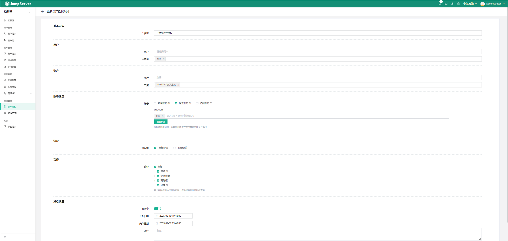

# 29、企业级堡垒机 JumpServer

## JumpServer 生产应用场景


##  JumpServer的优势和功能

- 开源: 零门槛，线上快速获取和安装 
- 分布式: 轻松支持大规模并发访问； 
- 无插件: 仅需浏览器，极致的 Web Terminal 使用体验 
- 多云支持: 一套系统，同时管理不同云上面的资产 
- 云端存储: 审计录像云端存储，永不丢失 
- 多租户: 一套系统，多个子公司和部门同时使


##  JumpServer 组成


- Core 组件是 JumpServer 的核心组件，其他组件依赖此组件启动。 
- Koko 是服务于类 Unix 资产平台的组件，通过 SSH、Telnet 协议提供字符型连接。 
- Lion 是服务于 Windows 资产平台的组件，用于 Web 端访问 Windows 资产。 
- XRDP 是服务于 RDP 协议组件，该组件主要功能是通过 JumpServer Client 方式访问 windows  2000、XP 等系统的资产。 
- Razor 是服务于 RDP 协议组件，JumpServer Client 默认使用 Razor 组件访问 Windows 资产。 
- Magnus 是服务于数据库的组件，用于通过客户端代理访问数据库资产。 
- Kael 是服务于 GPT 资产平台的组件，用于纳管 ChatGPT 资产。 
- Chen 是服务于数据库的组件，用于通过 Web GUI 方式访问数据库资产。 
- Celery 是处理异步任务的组件，用于执行 JumpServer 相关的自动化任务。 
- Video 是专门处理 Razor 组件和 Lion 组件产生录像的格式转换工作，将产生的会话录像转化为  MP4 格式。

##  JumpServer 安装

```
https://docs.jumpserver.org/zh/master/install/setup_by_fast/
https://github.com/jumpserver/Dockerfile/tree/master/allinone
```

### 基于docker部署

**安装 Docker 环境**

```
apt update && apt -y install docker.io
```

**创建自定义网络**

```
[root@ubuntu2404 ~]#docker network create --subnet 172.30.0.0/24 jumpserver-net
aab7dd8f27468e7480f004c9c5031dc55bbe10b3df4f981082c2dc8616f85fe3
```

**安装 MySQL 服务**

```
官方说明:https://docs.jumpserver.org/zh/master/install/prod/distributed_03/
```

MySQL要求

```
create database jumpserver default charset 'utf8';
create user 'jumpserver'@'%' identified by 'nu4x599Wq7u0Bn8EABh3J91G';
grant all on jumpserver.* to 'jumpserver'@'%';
flush privileges;
```

注意： 基于Jumpserver-v3.8.1 支持MySQL8.0 ,但默认MySQL8.0验证插件是caching_sha2_password，不符合要求，需要修改为mysql_native_password 

JumpServer-v2.28.7之前版本默认不支持MySQL8.0，选择MySQL5.7

**下载 MySQL 镜像查看默认配置**

下载MySQL镜像并运行, 查看当前默认配置不符合JumpServer安装要求

```mysql
mysql> SELECT user, host, plugin FROM mysql.user;
+------------------+-----------+-----------------------+
| user             | host      | plugin                |
+------------------+-----------+-----------------------+
| jumpserver       | %         | caching_sha2_password |
| root             | %         | caching_sha2_password |
| mysql.infoschema | localhost | caching_sha2_password |
| mysql.session    | localhost | caching_sha2_password |
| mysql.sys        | localhost | caching_sha2_password |
| root             | localhost | caching_sha2_password |
+------------------+-----------+-----------------------+
6 rows in set (0.00 sec)
```

**MySQL8.0需要修改验证插件**

```bash
[root@ubuntu2404 ~]#cat mysqld.cnf                                                       
default_authentication_plugin=mysql_native_password    
```

**启用容器**

```bash
[root@ubuntu2404 ~]#docker run --name mysql \
  -e MYSQL_ROOT_PASSWORD=123456 \
  -e MYSQL_DATABASE=jumpserver \
  -e MYSQL_USER=jumpserver \
  -e MYSQL_PASSWORD=123456 \
  -d \
  -v ./mysqld.cnf:/etc/mysql/conf.d/mysqld.cnf \
  --restart=always \
  --network jumpserver-net \
  mysql:8.0.29
```

**启动Redis容器**

```bash
#方法一
[root@ubuntu2404 ~]#docker run -d --name redis --restart=always --network jumpserver-net redis:7.2.5
#配置redis连接密码
[root@ubuntu2404 ~]#docker exec -it redis sh
# redis-cli
127.0.0.1:6379> CONFIG GET requirepass
1) "requirepass"
2) ""
127.0.0.1:6379> CONFIG SET requirepass 123456
OK
127.0.0.1:6379> exit
# exit

#方法2：启动并修改密码
[root@ubuntu2404 ~]#docker run -d --name redis --restart=always --network jumpserver-net redis:7.2.5 --requirepass 123456
```

**生成相关key和token**

```bash
[root@ubuntu2404 ~]#vim key.sh
[root@ubuntu2404 ~]#cat key.sh 
#!/bin/bash
#
if [ ! "$SECRET_KEY" ]; then
  SECRET_KEY=`cat /dev/urandom | tr -dc A-Za-z0-9 | head -c 50`;
  echo "SECRET_KEY=$SECRET_KEY" >> ~/.bashrc;
  echo SECRET_KEY=$SECRET_KEY;
else
  echo SECRET_KEY=$SECRET_KEY;
fi  
if [ ! "$BOOTSTRAP_TOKEN" ]; then
  BOOTSTRAP_TOKEN=`cat /dev/urandom | tr -dc A-Za-z0-9 | head -c 30`;
  echo "BOOTSTRAP_TOKEN=$BOOTSTRAP_TOKEN" >> ~/.bashrc;
  echo BOOTSTRAP_TOKEN=$BOOTSTRAP_TOKEN;
else
  echo BOOTSTRAP_TOKEN=$BOOTSTRAP_TOKEN;
fi

[root@ubuntu2404 ~]#bash key.sh 
SECRET_KEY=yRG3DUtaWhZ4HZz1icU56YY2UeoRYThXLBdUTT4MvoOBo5Knnw
BOOTSTRAP_TOKEN=cw7n9FGGdADwCfQOBFzzJAYTTrbsTZ
```

 **启动JumpServer容器**

```bash
[root@ubuntu2404 ~]#docker run --name jms_all -d \
  -p 80:80 \
  -p 2222:2222 \
  --privileged \
  -e SECRET_KEY=nxo7IWHSCBSJFAddeuGtDRlOwrNrmfQ8dnfFpP727RgqUT24jh \
  -e BOOTSTRAP_TOKEN=G59oLRaL4e2a5gvskVfk6o6FYMktkX \
  -e LOG_LEVEL=ERROR \
  -e DB_HOST=mysql \
  -e DB_PORT=3306 \
  -e DB_USER=jumpserver \
  -e DB_PASSWORD=123456 \
  -e DB_NAME=jumpserver \
  -e DB_ENGINE=mysql \
  -e REDIS_HOST=redis \
  -e REDIS_PORT=6379 \
  -e REDIS_PASSWORD=123456 \
  -v /opt/jumpserver/core/data:/opt/jumpserver/data \
  -v /opt/jumpserver/koko/data:/opt/koko/data \
  -v /opt/jumpserver/lion/data:/opt/lion/data \
  -v /opt/jumpserver/magnus/data:/opt/magnus/data \
  -v /opt/jumpserver/kael/data:/opt/kael/data \
  -v /opt/jumpserver/chen/data:/opt/chen/data \
  -v /opt/jumpserver/web/log:/var/log/nginx \
  --network jumpserver-net \
  --restart always \
  jumpserver/jms_all:v4.6.0
15a884b50981bbf3a32e83b366ea63c18395b512aac4de83b3b073f77674ac5b
```

```bash
docker run --name jms_all -d \
  -v /opt/jumpserver/core/data:/opt/jumpserver/data \
  -v /opt/jumpserver/koko/data:/opt/koko/data \
  -v /opt/jumpserver/lion/data:/opt/lion/data \
  -p 80:80 \
  -p 2222:2222 \
  -p 30000-30100:30000-30100 \
  -e SECRET_KEY=yRG3DUtaWhZ4HZz1icU56YY2UeoRYThXLBdUTT4MvoOBo5Knnw \
  -e BOOTSTRAP_TOKEN=cw7n9FGGdADwCfQOBFzzJAYTTrbsTZ \
  -e LOG_LEVEL=ERROR \
  -e DB_HOST=mysql \
  -e DB_PORT=3306 \
  -e DB_USER=jumpserver \
  -e DB_PASSWORD=123456 \
  -e DB_NAME=jumpserver \
  -e DB_USE_SSL=False \
  -e REDIS_HOST=redis \
  -e REDIS_PORT=6379 \
  -e REDIS_PASSWORD=123456 \
  --privileged=true \
  -v /opt/jumpserver/core/data:/opt/jumpserver/data \
  -v /opt/jumpserver/koko/data:/opt/koko/data \
  -v /opt/jumpserver/lion/data:/opt/lion/data \
  -v /opt/jumpserver/kael/data:/opt/kael/data \
  -v /opt/jumpserver/chen/data:/opt/chen/data \
  -v /opt/jumpserver/web/log:/var/log/nginx \
  --network jumpserver-net \
  --restart always \
  jumpserver/jms_all:v4.6.0
```


### docker-compose部署

```
https://github.com/jumpserver/Dockerfile/blob/v4.1.0/allinone/docker-compose.yml
https://github.com/jumpserver/Dockerfile/blob/master/allinone/docker-compose.yml
```

```bash
[root@ubuntu2404 ~]#curl -fsSL https://mirrors.aliyun.com/docker-ce/linux/ubuntu/gpg | sudo apt-key add -
[root@ubuntu2204 ~]#add-apt-repository "deb [arch=amd64] https://mirrors.aliyun.com/docker-ce/linux/ubuntu $(lsb_release -cs) stable"
[root@ubuntu2204 ~]#apt update
[root@ubuntu2204 ~]#apt-get install docker-compose-plugin
[root@ubuntu2204 ~]#docker version
```

```bash
[root@ubuntu2404 apps]#cat docker-compose.yaml 
services:
  mysql:
    image: mariadb:10.6
    container_name: jms_mysql
    restart: always
    environment:
      MARIADB_ROOT_PASSWORD: ${DB_PASSWORD:-123456}
      MARIADB_DATABASE: ${DB_NAME:-jumpserver}
    healthcheck:
      test: "mysql -h127.0.0.1 -uroot -p$$MARIADB_ROOT_PASSWORD -e 'SHOW DATABASES;'"
      interval: 10s
      timeout: 5s
      retries: 3
      start_period: 30s
    volumes:
      - ${VOLUME_DIR:-./data}/mariadb/data:/var/lib/mysql
    networks:
      - net

  redis:
    image: redis:7.0
    container_name: jms_redis
    restart: always
    command: redis-server --requirepass ${REDIS_PASSWORD:-123456}
    environment:
      REDIS_PASSWORD: ${REDIS_PASSWORD:-123456}
    healthcheck:
      test: "redis-cli -h 127.0.0.1 -a $$REDIS_PASSWORD info Replication"
      interval: 10s
      timeout: 5s
      retries: 3
      start_period: 10s
    volumes:
      - ${VOLUME_DIR:-./data}/redis/data:/data
    networks:
      - net

  jumpserver:
    image: jumpserver/jms_all:${VERSION:-latest}
    #build:
    #  context: .
    #  dockerfile: Dockerfile
    container_name: jms_all
    privileged: true
    restart: always
    environment:
      SECRET_KEY: ${SECRET_KEY:-vYneAbsXUhe4BghEeedNL7nfWLwaTTmhnwQMvjYOIG25Ofzghk}
      BOOTSTRAP_TOKEN: ${BOOTSTRAP_TOKEN:-K1ffDfLSIK8SV2PZj6VaxOiv8KuawlJK}
      LOG_LEVEL: ${LOG_LEVEL:-ERROR}
      DB_HOST: ${DB_HOST:-mysql}
      DB_PORT: ${DB_PORT:-3306}
      DB_USER: ${DB_USER:-root}
      DB_PASSWORD: ${DB_PASSWORD:-123456}
      DB_NAME: ${DB_NAME:-jumpserver}
      DB_USE_SSL: False
      DB_ENGINE: mysql
      REDIS_HOST: ${REDIS_HOST:-redis}
      REDIS_PORT: ${REDIS_PORT:-6379}
      REDIS_PASSWORD: ${REDIS_PASSWORD:-123456}
      DOMAINS: ${DOMAINS:-}
    ports:
      - ${HTTP_PORT:-80}:80/tcp
      - ${SSH_PORT:-2222}:2222/tcp
    depends_on:
      mysql:
        condition: service_healthy
      redis:
        condition: service_healthy
    healthcheck:
      test: "curl -fsL http://localhost/api/health/ > /dev/null"
      interval: 10s
      timeout: 5s
      retries: 3
      start_period: 90s
    volumes:
      - ${VOLUME_DIR:-./data}/core/data:/opt/jumpserver/data
      - ${VOLUME_DIR:-./data}/koko/data:/opt/koko/data
      - ${VOLUME_DIR:-./data}/lion/data:/opt/lion/data
      - ${VOLUME_DIR:-./data}/chen/data:/opt/chen/data
      - ${VOLUME_DIR:-./data}/web/data/logs:/var/log/nginx
      - ${VOLUME_DIR:-./data}/web/data/download:/opt/download
    networks:
      - net

networks:
  net:
```


### 官方脚本一键安装

官方脚本实现基于docker安装jumpserver

```
https://docs.jumpserver.org/zh/v3/installation/setup_linux_standalone/online_install/
```

范例：基于jumpserver-v4.6.0

```bash
[root@ubuntu2404 ~]#curl -sSL https://resource.fit2cloud.com/jumpserver/jumpserver/releases/download/v4.6.0/quick_start.sh | bash
```

##  JumpServer 常见功能

### 登录并初始化配置

```
默认账户:admin
默认密码:ChangeMe
```

### ssh 登录

```bash
[root@ubuntu2204 ~]#ssh -p2222 admin@10.0.0.206
```

```bash
                Administrator,  JumpServer

         1) Enter part IP, Hostname, Comment to to search login if unique.
         2) Enter / + IP, Hostname, Comment to to search, such as: /192.168.
         3) Enter p to display the assets you have permission.
         4) Enter g to display the node that you have permission.
         5) Enter h to display the hosts that you have permission.
         6) Enter d to display the databases that you have permission.
         7) Enter k to display the kubernetes that you have permission.
         8) Enter r to refresh your assets and nodes.
         9) Enter s to language switch.
        10) Enter ? to print help.
        11) Enter q to exit.
Opt> 
```

```bash
#英文切换为中文
s
2
```


### 创建JumpServer用户和组

JumpServer 支持三种登录用户角色 

- 系统管理员 
- 普通用户 
- 系统审计员

#### 创建用户

填写用户信息,注意: 邮箱地址不能重复

控制台——>用户列表——>创建


#### 创建组

控制台——>用户组——>创建


#### 禁用和启用用户

**禁用用户**

控制台——>用户列表——>勾选用户——>更多选项——>禁用所选


**启用用户**

控制台——>用户列表——>勾选用户——>更多选项——>启用所选


### 启用用户多因子认证功能

多因子认证Multi-Factor Authentication (MFA) 是一种简单有效的最佳安全实践方法，用户要通过两种 以上的认证机制之后，才能得到授权，使用计算机资源 

JumpServer 启用 MFA 后，用户登录网站时，系统将要求输入用户名和密码（第一安全要素），然后要 求输入来自其 MFA 设备的动态验证码（第二安全要素），双因素的安全认证将为您的账户提供更高的安 全保护

**开启MFA**

控制台——>用户列表——>选择用户——>编辑——>认证——>MFA——>启用


**创建系统审计员**

系统审计员即查看 录像带的人

控制台——>用户列表——>创建——>系统角色——>系统审计员


 **创建资产并关联特权用户和普通用户**

**JumpServer中的三种用户**

- JumpServer的登录用户:  

  分配给用户用于登录JumpServer时使用 

  在Jumpserver上面创建

- 系统用户中的特权用户(旧名：管理用户):  

  对后端服务器具有管理权限的系统帐号 root或administrator 及sudo ALL权限的用户,用于管理后端服务器 

  新版中已取消此名称,改名为系统用户中特权用户 

  在后端服务器上创建的具有系统管理特权的系统用户

  **新版建议在账号管理--账号模版创建，后续无需针对每个后端服务单独创建**

- 系统用户中的普通用户(旧名：系统用户): 

  给登录用户使用ssh连接后端服务器时对应的系统用户 ,一般是后端服务器的普通的系统用户帐号 

  新版中改名为系统用户中普通用户

  在后端服务器上创建的具有一般权限的系统用户

  **新版建议在账号管理---账号模版创建，后续无需针对每个后端服务单独创建，只需要授权后会自动 创建**

### 通过帐号模版创建系统用户中特权用户(管理用户)

jumpserver连接资产的账号密码

控制台——>账号模板——>创建

.png)


### 通过帐号模版创建系统普通用户(系统用户中普通用户)

系统用户是分配给JumpServer用户,用来让JumpServer用户在连接后端服务器和其它资产,一般不会给管理权限

生产环境中,一般都会利用自动化运维工具提前在后端服务器创建好系统用户,在所有后端服务器统一用户 ID信息,而非在jumpserver中创建

**通过帐号模版实现，方便后续重复使用**

密文策略：选择“随机生成”，如果是指定，用户将无法自动创建

.png)

### 创建资产并关联特权用户和普通用户


### 授权用户使用资产

**授权主机**



**授权mysql**

**docker授权**

```bash
[root@ubuntu2204 ~]#apt install docker.io -y
[root@ubuntu2204 ~]#docker run --name mysql   -e MYSQL_ROOT_PASSWORD=123456   -e MYSQL_DATABASE=jumpserver   -e MYSQL_USER=jumpserver   -e MYSQL_PASSWORD=123456   -d  --restart=always  mysql:8.0.29
[root@ubuntu2204 ~]#docker ps -a
CONTAINER ID   IMAGE          COMMAND                  CREATED          STATUS    PORTS     NAMES
38771460e9e3   mysql:8.0.29   "docker-entrypoint.s…"   49 seconds ago   Created             mysql
```

**创建模板账号**


**授权**


**包安装授权**

```bash
[root@ubuntu2204 ~]#apt update && apt install mysql-server
```

跟docker一样


### ssh连接JumpServer

```
ssh -p 2222 jumpserver_user@jumpserver 
```


### 访问控制——命令过滤

创建命令组——>把命令组加入到创建的命令过滤里面

**缺点：可以用脚本删除**


### 会话管理

切换到审计员

绘画记录——操作——监控


**历史会话**

切换到审计员

绘画记录——历史会话——回放


**离线查看录像**

可以将历史会话过程下载再播放,但需要下载相关的播放器

```
https://github.com/jumpserver/VideoPlayer/releases
```


**终端管理**

可以在线监控用户正在进行的操作过程,甚至可以强制中断用户的连接,将其踢出会话


### 资产的批量导出和导入


20250316
