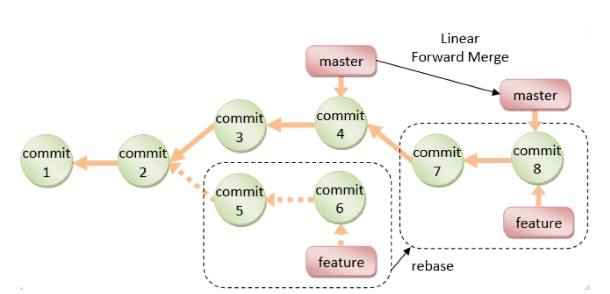

# 31、版本管理系统 Git 和 GitLab


## DevOps 简介

### 传统开发模型

软件开发生命周期SDLC (Software Development Life Cycle)由计划,分析,设计,实现,测试集成和维护组成


- 阶段1: 计划和需求分析 (Planning and Requirement Analysis) 

  每个软件开发生命周期模型都从分析开始，过程的利益相关者讨论对最终产品的要求。此阶段的目 标是系统要求的详细定义。此外，还需要确保所有流程参与者都清楚地了解任务以及每个需求将如 何实施。通常，讨论涉及质量保证专家，如果有必要，他们甚至可以在开发阶段干预过程中的添加。

- 阶段2: 设计项目架构 (Project Architecture) 

  在软件开发生命周期的第二阶段，开发人员实际上正在设计架构。所有利益相关者（包括客户）都 会讨论此阶段可能出现的所有不同技术问题。此外，还定义了项目中使用的技术，团队负载，限 制，时间范围和预算。最合适的项目决策是根据定义的要求做出的。

- 阶段3: 开发和编程 (Development and Coding) 

  在批准要求后，该过程进入下一阶段 - 实际开发。程序员从这里开始编写源代码，同时牢记先前定 义的需求。系统管理员调整软件环境，前端程序员开发程序的用户界面以及与服务器交互的逻辑。 编程本身一般会用四个阶段:算法开发,源代码编写,编译,测试和调试

- 阶段4: 测试 (Testing) 

  测试阶段包括调试过程。开发过程中遗漏的所有代码缺陷都会在此处检测到，记录下来并传回给开 发人员进行修复。重复测试过程，直到删除所有关键问题并且软件工作流程稳定。

- 阶段5: 部署 (Deployment) 

  当程序最终确定并且没有关键问题时 - 是时候为最终用户启动它了。新程序版本发布后，技术支持 团队加入。该部门提供用户反馈; 在利用期间咨询和支持用户。此外，此阶段还包括所选组件的更 新，以确保软件是最新的，并且不会受到安全漏洞的影响。

**SDLC 模型 (Software Development Life cycle Model)**

从第一个也是最古老的“瀑布式”SDLC模型演变而来，其种类不断扩大。比较常见的SDLC模型如下 

- 瀑布模型 (Waterfall Model) 
- 迭代模型 (Iterative Model) 
- 螺旋模型 (Spiral Model) 
- V形模型 (V-Shape Model)： 单元测试，集成测试，系统测试，验收测试 
- 敏捷模型 (Agile Model)

#### 瀑布模型

瀑布模型是早期实现的开发模型,是一个级联SDLC模型，其中开发过程看起来像制造业的流水线，一步 一步地进行分析，预测，实现，测试，实施和支持阶段。 

该SDLC模型包括完全逐步执行每个阶段。该过程严格记录并预定义，具有该软件开发生命周期模型的每 个阶段所期望的功能。 

类似工厂中流水线的传送带，加工的产品只能按照一道一道的工序向下不断前进，不能后退。


| 优点                                    | 缺点                                                         |
| --------------------------------------- | ------------------------------------------------------------ |
| 简单易用和理解                          | 各个阶段的划分完全固定，阶段之间产生大量的文档，极大地增 加了工作量 |
| 当前一阶段完成后，只需要 去关注后续阶段 | 由于开发模型是线性的，用户只有等到整个过程的末期才能见到 开发成果，从而增加了开发风险 |
| 为项目提供了按阶段划分的 检查节点       | 不适应用户需求的变化                                         |


#### V 形模型


#### 敏捷开发

Agile Model 敏捷开发的核心是迭代开发(lterative Development)与增量开发 (IncrementalDevelopment) 。


**迭代开发:** 

对于大型软件项目，传统的开发方式是采用一个大周期(比如一年或数年)进行开发，整个过程就是一 次"大开发"

迭代开发的方式则不一样，它将开发过程拆分成多个小周期，即一次"大开发"变成多次"小开发"，每次小 开发都是同样的流程，所以看上去就好像重复在做同样的步骤

比如: 某米公司生产手机,第一次生产某米1代(比较简陋),逐年再生产某米2代,目前已经到某米1X代

**增量开发:** 

软件的每个版本，都会新增一个可以被用户感知到的完整功能。也就是说，按照新增功能来划分迭代。 

比如:  

房地产公司开发一个小区。如果采用增量开发的模式，该公司第一个迭代就是交付第一期楼盘，第二个 迭代交付第二期楼盘..….每个迭代都是只完成一期完整的楼盘。而不是第一次迭代就挖好所有楼盘的地 基，第二个迭代建好所有楼盘的骨架，第三个迭代架设屋顶.…..... 

虽然敏捷开发将软件开发分成多个迭代，但是也要求，每次迭代都是一个完整的软件开发周期，必须按 照软件工程的方法论，进行正规的流程管理。

**优势**

- 尽早交付,加快资金回笼 
- 降级风险,及时了解市场需求，及时获取问题反馈 
- 提高效率,阶段性功能拆分及快速质量反馈

敏捷开发这种小步快跑的方式，大幅提高了开发团队的工作效率，让版本的更新速度变得更快。 

更新版本的速度快了，风险不是更大了吗？其实，事实并非如此。 

敏捷开发可以帮助更快地发现问题，产品被更快地交付到用户手中，团队可以更快地得到用户的反馈， 从而进行更快地响应。而且，DevOps小步快跑的形式带来的版本变化是比较小的，风险会更小（如下 图所示）。即使出现问题，修复起来也会相对容易一些。


### DevOps介绍


DevOps 即开发 Development 和 Operations运维的缩写。

**DevOps是一组过程、方法与系统的统称，用于促进开发、技术运营和质量保障（QA）部门之间的沟通、协作与整合。**

传统的模式是开发人员只关心开发程序，追求功能的变化和实现  

运维只负责基础环境管理和代码部署及监控等，更看重应用的稳定运行 

双方缺少一个共同的目标

**DevOps组织优先推动的目标** 

- 一组标准化的环境 
- 降低新版本的失败率 
- 缩短版本之间的交付时间 
- 更快的平均版本恢复时间 

**DevOps的关键指标** 

- 平均恢复时间: Mean-time to recovery (MTTR) 
- 平均投产时间: Mean-time to production 
- 平均提前时间:Average lead-time，比计划时间提前 
- 部署速度:Deployment speed 
- 部署频率:Deployment frequency 
- 生产失败率:Production failure rate

**DevOps 涉及的四大相关平台**

- 项目管理：如：Jira,禅道 
- 代码托管：如：Gitlab,SVN 
- 持续交付：如：Jenkins,Gitlab 
- 运维平台：如：腾讯蓝鲸,Spug等

### DevOps 流水线模型

- 第 1 步：需求和用户故事 

  该过程从产品所有者根据业务需求创建用户情景开始。这些用户故事是开发团队工作的基础。 

- 第 2 步：冲刺计划 

  开发团队从待办事项中获取用户故事，并将它们组织到冲刺中，通常遵循敏捷方法。每个冲刺可能跨越 一个固定的时间段，例如两周的开发周期。 

- 第 3 步：源代码提交 

  开发人员将他们的源代码提交到 Git 等版本控制系统中。这可确保跟踪更改，并且可以管理不同版本的 代码。

- 步骤 4：持续集成 （CI） 

  生成过程是使用 CI 工具（如 Jenkins）启动的。源代码经过严格的测试，包括单元测试、代码覆盖率检 查和代码质量门。 SonarQube 等工具有助于维护代码质量标准。 

- 第 5 步：工件管理 

  成功的生成存储在项目存储库中，例如 Artifactory。此存储库允许轻松检索以前的构建和项目。 

- 步骤 6：部署到开发环境 

  新代码将部署到开发环境中进行初始测试和集成。这种环境有助于发现不同开发分支之间的早期问题和 冲突。 

- 第 7 步：隔离测试 

  在多个开发团队处理不同功能的情况下，单独测试这些功能至关重要。因此，代码被部署到单独的 QA1  和 QA2 环境中以避免干扰。 

- 第 8 步：QA 测试 

  质量保证 （QA） 团队接管新的 QA 环境并执行各种测试，包括功能测试、回归测试和性能测试。目标 是在继续操作之前识别并解决任何问题。 

- 步骤 9：用户验收测试 （UAT） 

  QA 测试成功通过后，代码将继续进入用户验收测试 （UAT） 环境。利益干系人验证它是否满足他们的 要求和期望。 

- 第 10 步：准备生产 

  如果 UAT 测试成功，则内部版本将成为候选版本。根据发布计划，计划将它们部署到生产环境。 

- 第 11 步：站点可靠性工程 （SRE） 

  站点可靠性工程 （SRE） 团队承担着监控生产环境的关键责任。他们确保其稳定性和可靠性，并及时响 应任何问题。

总的来说，以上这个流程展示了一个高度自动化、协调一致、质量保障的 DevOps 实践，符合一般的大 厂在软件开发和部署方面的要求。 

这种结构化的发布过程可确保代码更改在到达生产环境之前经过全面测试并满足业务要求。 

虽然具体的工具和方法可能因公司而异，具体的流程可能因组织和项目的不同而有所调整，但在许多软 件开发组织中，发布过程的核心结构保持一致。

### DevOps 和 NoOps


### 持续集成、持续交付和持续部署 CICD

最初是瀑布模型，后来是敏捷开发，现在是DevOps，这是现代开发人员构建出色的产品的技术路线。 随着DevOps的兴起，出现了**持续集成（Continuous Integration）、持续交付（Continuous  Delivery） 、持续部署（Continuous Deployment） 的新方法。** 

传统的软件开发和交付方法正在迅速变得过时。从以前的敏捷时代，大多数公司会每月，每季度，每两 年甚至每年发布部署/发布软件。然而现在在DevOps时代，每周，每天，甚至每天多次是常态。 

当SaaS正在占领世界时，尤其如此，您可以轻松地动态更新应用程序，而无需强迫客户下载新组件。很 多时候，他们甚至都不会意识到正在发生变化。开发团队通过软件交付流水线（Pipeline）实现自动 化，以缩短交付周期，大多数团队都有自动化流程来检查代码并部署到新环境。

CI/CD 是一种通过在应用开发阶段引入自动化来频繁向客户交付应用的方法。CI/CD 的核心概念是持续 集成、持续交付和持续部署。作为一个面向开发和运营团队的解决方案，CI/CD 主要针对在集成新代码时所引发的问题 

具体而言，CI/CD 可让持续自动化和持续监控贯穿于应用的整个生命周期（从集成和测试阶段，到交付 和部署）。这些关联的事务通常被统称为“CI/CD 管道”，由开发和运维团队以敏捷方式协同支持。

****

#### 持续集成 (CI-Continuous Integration)

集成指将多位开发者的开发代码提交后,合并集成在一起,存放在代码库的过程,并且后续还会不断的迭代更新代码 

持续集成是指多名开发者在开发不同功能代码的过程当中，可以频繁的将代码行合并到一起并切相互不 影响工作。很多情况下每天都要进行几次，主要目的是尽早发现集成错误，使团队更加紧密结合，更好地协作。 

CI属于开发人员的自动化流程。成功的 CI 意味着应用代码的新更改会定期构建、测试并合并到共享存储 库中。该解决方案可以解决在一次开发中有太多应用分支，从而导致相互冲突的问题。 

**持续集成强调开发人员提交了新代码之后，立刻进行构建、（单元）测试。** 

根据测试结果，可以确定新代码和原有代码能否正确地集成在一起。通过持续集成可以自动编译、打 包、签名项目，配合单元测试可以实现持续集成+自动化测试。让工程师从重复而又枯燥的手动打包完全 解放出来，让工程师能更加专注于代码本身，最大限度的减少误操作风险，降低修复错误代码的成本， 大幅提高工作效率。


#### 持续交付(CD-Continuous Delivery)

完成 CI 中构建及单元测试和集成测试的自动化流程后，持续交付可以自动的将已验证的代码发布到存储 库。为了实现高效的持续交付流程，务必要确保 CI 已内置于开发管道。持续交付的目标是拥有一个可随 时部署到生产环境的代码库。 

在持续交付中，每个阶段（从代码更改的合并，到生产就绪型构建版本的交付）都涉及测试自动化和代 码发布自动化。在流程结束时，运维团队可以快速、轻松地将应用部署到生产环境中。 

**持续交付完成了构建和测试过程细致的自动化，但是如何发布以及发布什么仍然是需要人工操作，持续部署可以改变这一点。** 

持续集成（CONTINUOUS INTEGRATION，CI）指的是开发人员频繁的（一天多次的）将所有开发者的 工作合并到主干上。这些新提交在最终合并到主线之前，都需要通过编译和自动化测试流进行验证，以保障所有的提交在合并主干之后的质量问题，对可能出现的一些问题进行预警。持续集成的核心在于确 保新增的代码能够与原先代码正确的集成。 

持续交付在持续集成的基础上，将集成后的代码部署到更贴近真实运行环境的「类生产环境」 （production-like environments）中。比如，我们完成单元测试后，可以把代码部署到连接数据库的  Staging 环境中更多的测试。如果代码没有问题，可以继续手动部署到生产环境中。此方式是当前普遍采用的方式


#### 持续部署(CD-Continuous Deployment)

对于一个成熟的 CI/CD 管道来说，最后的阶段是持续部署。作为持续交付(自动将生产就绪型构建版本发 布到代码存储库)的进一步延伸，**持续部署可以自动将应用发布到生产环境**。由于在生产之前的管道阶段 没有手动风控，因此持续部署在很大程度上都得依赖精心设计的测试自动化。 

实际上，持续部署意味着开发人员对应用的更改在编写后的几分钟内就能生效（假设它通过了自动化测 试）。这更加便于持续接收和整合用户反馈。总而言之，所有这些 CI/CD 的关联步骤都有助于降低应用 的部署风险，因此更便于以小件的方式（而非一次性）发布对应用的更改。不过，由于还需要编写自动 化测试以适应 CI/CD 管道中的各种测试和发布阶段，因此前期投资还是会很大。 

持续部署是基于某种工具或平台实现代码自动化的构建、测试和部署到线上环境以实现交付高质量的产 品,持续部署在某种程度上代表了一个开发团队的更新迭代速率。 

与持续集成相比，持续交付（CONTINUOUS DELIVERY）的侧重点在于交付，其核心对象不在于代码， 而在于可交付的产物。由于持续集成仅仅针对于新旧代码的集成过程执行了一定的测试，其变动到持续 交付后还需要一些额外的流程。与持续集成相比较，持续交付添加了测试Test->模拟Staging->生产 Production的流程，也就是为新增的代码添加了一个保证：确保新增的代码在生产环境中是可用的。 

在持续交付的基础上，把部署到生产环境的过程自动化。如果你对比上图持续部署就可以发现持续部署 和持续交付的区别就是最终部署到生产环境是自动化的。因为自动发布存在较大的风险,当前采用此方式较少。


### Agile Model，CI/CD 和 DevOps 关系


**DevOps 与 CICD 的联系与区别** 

- CICD是软件工程实践的方法，需要借助于各种工具来具体实现 
- DevOps是一种文化:也正是容器、容器编排、微服务等技术使得DevOps最终能够以应有的方式得以落地 
- 通常，在开发环境中自动化持续集成和持续交付(CI /CD)是DevOps团队的最终目标


## CICD 流程过程和架构

###  应用部署发展阶段

- 开发人员自行手动上传构建并部署代码 

  早期项目,没有专业的运维人员,运维的工作由开发兼职完成,项目发布很不专业,很容易出错,也是最原始的方式 

- 开发人员先将代码发给运维,再由运维人员手动上传至生产环境 

  专业的运维人员完成应用的部署,每次项目发布都由运维人员一步一步手动实现,效率低下且容易出错 

- 运维利用脚本和自动化运维工具实现部署 

  由运维人员编写Shell,Python等脚本或利用自动化运维工具,如Ansible等实现半自动化应用部署,效 率很高,但对技术专业性有较高要求 

- 通过 Web 等 GUI 界面实现一键自动化部署 

  可以通过开源或自研的运维平台实现方便的应用部署,操作容易,效率高,但需要提前构建运维平台， 比如，Jenkins等

### CICD 流程

#### 传统方式的CICD 流程


- 开发人员不断的进行代码提交到本地，再提交到运程的代码仓库服务器 
- Jenkins作为持续集成工具，使用Git工具到Git仓库拉取代码到集成服务器，代码测试与审查，再配 合JDK，Maven，Go等软件完成代码编译，测试，打包等工作，在这个过程中每一步如果出错，都 需要重新再执行一次整个流程。
- Jenkins把生成的软件jar或war包等分发到测试服务器或者生产服务器，测试人员或用户就可以访问应用。

#### 容器化方式的 CICD 流程


#### Kubernetes 环境的 CICD 流程


### CICD 基础架构


## 版本控制系统 VCS

**关于版本控制** 

- 版本控制（Version control）是维护工程蓝图的标准做法，能追踪工程蓝图从诞生一直到定案的过程 
- 版本控制也是一种软件工程技巧，借此能在软件开发的过程中，确保由不同人所编辑的同一程序文件都得到同步 
- 软件工程师常利用版本控制来跟踪、维护原始码、文档以及配置文件等的改动 

**软件版本控制的方法** 

- 最简单的情况下，软件设计师可以自己保留一个程序的许多不同版本，并且为它们做适当的编号 
  - 这种简单的方法曾被用在很多大型的软件项目中
  - 虽然可行，但效率较低 
  - 必须同时维护很多几乎一样的原始码备份，而且极度依赖软件设计师的自我修养与开发纪律 
- 使用版本控制系统（Version Control System，VCS），实现部分或全部版本控制工作的自动化， 版本控制系统是一种软件，可以帮助软件团队的开发人员协同工作，并存档他们工作的完整历史记录。

**为什么使用 VCS ?**  

在实际开发过程中，经常会有这种需求或问题 

- 代码可能被破坏,比如误删除等,希望还能找回 
- 代码出现了严重的Bug,希望回滚至数周前的旧代码 
- 需要在已经发布的程序中添加新的功能，如果测试验证后没有问题，才会使用新的代码，而在测试 验证期间，不能影响原来的代码 
- 同一个软件需要有多个版本并行开发,满足不同的应用需求 
- 实际项目开发基本都是多个人合作完成，在多个人同时修改同一个源代码文件时可能会发生冲突， 如何跟踪记录这些冲突 
- 异地源代码备份，使用 VCS 时，需要创建一个 VCS 的远程实例，以在开发人员之间共享更改，这 个远程 VCS 实例可以由值得信赖的第三方（如GitHub）进行异地托管；然后，它就会成为安全的异地备份

### 版本控制系统分类

- 本地版本(单机版)控制系统 

  第一代版本控制系统被称为本地版本控制系统。通过加锁将并发执行转换成顺序执行。 一次只能有 一个人处理文件。 

  具体流程如下：首先，应该把文件放在一个服务器上，方便使用者上传或下载文件；其次，任何人 想对文件修改时，需要先把这个文件加锁，通过checkout指令，使得其他人无法修改；最后，当修 改完成之后，需要释放锁，通过checkin指令，形成一个新的版本，存放到服务器端。

  第一代版本控制系统主要有 RCS、SCCS（1972年发布）和 DSEE（被认为是 Atria ClearCase 的前 身）。目前，有些项目还在使用

  ```
  悲观锁
  每次获取数据的时候，都会担心数据被修改，所以每次获取数据的时候都会进行加锁，确保在自己使用的过程中数据不会被别人修改，使用完成后进行数据解锁。由于数据进行加锁，期间对该数据进行读写的其他线程都会进行等待。
  
  乐观锁
  每次获取数据的时候，都不会担心数据被修改，所以每次获取数据的时候都不会进行加锁，但是在更新数据的时候需要判断该数据是否被别人修改过。如果数据被其他线程修改，则不进行数据更新，如果数据没有被其他线程修改，则进行数据更新。由于数据没有进行加锁，期间该数据可以被其他线程进行读写操作。
  乐观锁一般会使用版本号机制或 CAS 算法实现。
  ```

- 集中式版本控制系统

  

  想要完成任何提交和回滚都依赖于连接集中的代码服务器才能实现,如果无法连接至代码的服务器, 比如下班回家后将无法提交代码 

  此外此集中式服务器还存在单点问题，在集中式实例的不可用期间，开发人员就无法推送、合并或回滚代码 

  此方式可以更好的实现软件仓库的安全访问限制和控制

- 分布式版本控制系统

  在每个用户都有一个完整的服务器，用于保存软件的完整版本，然后再部署一个中央服务器 

  用户可以先将代码提交到本地，没有网络也可以先提交到本地，然后在有网络的时候再提交到中央 服务器，这样就大大方便了开发者 

  相比集中式的版本控制系统，工作的时候需要先从中央服务器获取最新的代码，改完之后需要提 交，如果是一个比较大的文件则需要足够快的网络才能快速提交完成 

  而使用分布式的版本控制系统，每个用户都是一个完整的版本库，即使没有中央服务器也可以提交 代码或者回滚，最终再把改好的代码提交至中央服务器进行合并即可。

  此方式不容易实现软件仓库的安全访问限制和控制

  

### 常见的版本控制系统

#### CVS(Concurrent Version System) 集中式版本控制系统

并发版本系统（Concurrent Versions System，CVS）是最初的第二代版本控制系统。大约十年间，它是最为流行的版本控制系统，直到 2000 年被 Subversion 所取代。 

CVS 最早是由一位名叫 Dick Grune 的荷兰科学家于 1986 年 6 月 23 日公开发布了该代码。CVS 最初仅仅只是一个包装了 RCS（ 修订控制系统(Revision Control System)) 的 Shell 脚本集合。最终演变成当前 版本的 CVS 的代码始于 1989 年 4 月的 Brian Berliner 的贡献，后来由 Jeff Polk 和许多其他贡献者提供 帮助。 Brian Berliner 撰写了一篇论文，介绍了他对 CVS 程序的改进 - 该程序描述了该工具是如何在  Prysma 内部扩展和使用的。 1990 年 11 月 19 日，CVS 1.0 版被提交给自由软件基金会进行开发和分发 。

CVS是一个C/S系统，是一个早期常用的代码版本控制软件。多个开发人员通过一个中心版本控制系统来记录文件版本，从而达到保证文件同步的目的。CVS版本控制系统是一种GNU软件包，主要用于在多人 开发环境下的源码的维护。 

由于 CVS 是集中式版本控制系统，所以它有客户端和服务端之区分。但要开始使用 CVS 的话，即使只在 你的本地机器上使用，也必须设置 CVS 的服务端。

#### SVN(Subversion) 集中式版本控制系统

SVN 由 CollabNet 公司于 2000 年资助并发起开发，目的是创建一个更好用的版本控制系统以取代 CVS。 

2000 年 2 月，CollabNet 联系了 Open Source Development with CVS（Coriolis, 1999）的作者 Karl  Fogel，问他是否愿意为这个新项目工作。这时 Karl 已经在和他的朋友 Jim Blandy 讨论一个新的版本控 制系统的设计。他不仅已经起好了名字 “Subversion”，而且有了 Subvesion 资料库的基本设计。 

经过 14 个月的编码，在 2001 年 8 月 31 号，Subversion 可以“自我寄生”了。就是说，Subversion 开 发人员停止使用 CVS 管理 Subversion 的源代码，开始使用 Subversion 代替。 

2009 年 11 月，Subversion 被 Apache Incubator 项目所接收。2010 年 1 月，正式成为 Apache 软件 基金会的一个顶级项目 

SVN 依赖于网络，需要在各个开发主机上安装客户端软件,并且在一台服务器集中进行版本管理和存储. 目前依然有部分公司在使用

**优点：** 

- 管理方便，逻辑明确，符合一般人思维习惯。 
- 易于管理，集中式服务器更能保证安全性。 
- 代码一致性非常高。 适合开发人数不多的项目开发。

**缺点：** 

- 服务器压力太大，数据库容量暴增。 
- 如果不能连接到服务器上，基本上不可以工作，如果服务器不能连接上，就不能提交，还原，对比等等。 
- 不适合开源开发（开发人数非常非常多，但是Google app engine就是用svn的）。但是一般集中式管理的有非常明确的权限管理机制（例如分支访问限制），可以实现分层管理，从而很好的解决开发人数众多的问题。

#### Git

**Git 重要特性:**  

在本地就可以完成提交,因此不需要网络,提交完成后,可以有网络环境时,再同步到远程仓库服务器  

**优点：** 

- 适合分布式开发，强调个体。 
- 公共服务器压力和数据量都不会太大。 
- 速度快、灵活。 
- 任意两个开发者之间可以很容易的解决冲突。 
- 支持离线工作。 

**缺点：** 

- 不符合常规思维。 
- 学习难度大，学习周期相对而言比较长。 
- 代码保密性差，一旦开发者把整个库克隆下来就可以完全公开所有代码和版本信息。 
- 无力支持大型二进制文件。
- 具有大量历史记录的超大型存储库会降低交互速度。

## 常见的软件部署模式

### 蓝绿部署 Blue-green Deployments


蓝绿部署指的是不停止老版本代码(不影响上一个版本访问)，而是在另外一套环境部署新版本然后进行测 试，测试通过后将用户流量切到新版本，其特点为业务无中断，升级风险相对较小。但本方式成本较高, 一般小公司较少使用 

蓝绿色部署是一种部署策略，利用两种相同的环境，即"蓝色"（又名预发布）环境和"绿色"（又名生产） 环境，具有不同版本的应用程序或服务。质量保证和用户接受度测试通常在承载新版本或更改的蓝色环 境中进行。一旦蓝色环境中测试并接受新的变化，用户流量就会从绿色环境切换为蓝色环境。然后，一 旦部署成功，您可以切换到新环境。

具体过程： 

1. 当前版本(V1)业务正常访问 
2. 在另外一套环境部署新代码版本(V2)，代码可能是增加了功能或者是修复了某些bug 
3. 测试通过之后将用户请求流量切到新版本环境 
4. 观察一段时间，如有异常直接切换旧版本 
5. 下次升级，将旧版本(V2)升级到新版本(V3)

蓝绿部署适用的场景： 

1. 不停止老版本，额外部署一套新版本，等测试确认新版本正常后，才将用户请求切换至新版本，如果 有问题，切换回老版本 
2. 蓝绿发布是一种用于升级与更新的发布策略，部署的最小维度是容器，而发布的最小维度是应用。 
3. 蓝绿发布对于增量升级有比较好的支持，但是对于涉及数据表结构变更等等不可逆转的升级，并不完 全合适用蓝绿发布来实现，需要结合一些业务的逻辑以及数据迁移与回滚的策略才可以完全满足需求。

### 金丝雀(灰度)发布 Canary Deployment


**金丝雀/灰度发布步骤组成：** 

1. 准备好部署各个阶段的工件，包括：构建组件，测试脚本，配置文件和部署清单文件。 
2. 从负载均衡列表中移除掉“金丝雀”服务器（选择全部服务器中的一部分）。 
3. 升级“金丝雀”应用（排掉原有流量并进行部署）。 
4. 对应用进行自动化测试。 
5. 将“金丝雀”服务器重新添加到负载均衡列表中（连通性和健康检查）。 
6. 如果“金丝雀”在线使用测试成功，升级剩余的其他服务器。否则就回滚回旧版本

**金丝雀/灰度发布部署适用的场景：** 

1. 不停止老版本，额外搞一套新版本，不同版本应用共存。 
2. 灰度发布中，常常按照用户设置路由权重，例如90%的用户维持使用老版本，10%的用户尝鲜新版 本。 
3. 经常与A/B测试一起使用，用于测试选择多种方案。

**灰度发布可以在发布新版本应用时:** 

- 自定义控制新版本应用流量比重 
- 渐进式完成新版本应用的全量上线
- 最大限度地控制新版本发布带来的业务风险 
- 降低故障带来的影响 
- 同时支持快速回滚

### 滚动发布(更新)

滚动发布即逐步升级服务中的节点 

滚动发布是指每次只升级一个或多个服务实例，升级完成后加入生产环境，不断执行这个过程，直到集 群中的全部旧版本升级新版本。


红色：正在更新的实例，正在升级过程中间状态 

蓝色：更新完成并加入集群的实例,升级完成的新版本

绿色：正在运行的实例，升级前的旧版本

**滚动发布过程** 

1. 先升级1个服务实例，主要做部署验证 
2. 每次升级1个服务实例，自动从LB上摘掉，升级成功后自动加入集群 
3. 事先需要有自动更新策略，分为若干次，每次数量/百分比可配置 
4. 回滚是发布的逆过程，先从LB摘掉新版本，再升级老版本，这个过程一般时间比较长 
5. 自动化要求高

### A/B测试 A/B Testing


- A/B测试即同时对外提供两个APP运行环境，这和蓝绿部署的同时只有一个版本在线是不同的 
- A/B 测试是用来测试应用功能表现的方法，例如可用性、受欢迎程度、可见性等等 
- 蓝绿部署和A/B测试是不同的,蓝绿部署的目的是安全稳定地发布新版本应用，并在必要时回滚
- 即蓝绿部署是同一时间只有一套正式环境在线，而A/B测试是两套正式环境同时在线，一般用于多个产品竟争时使用


## 版本控制系统Git

### Git安装

```
https://git-scm.com/downloads
```

**Debian/Ubuntu**

For the latest stable version for your release of Debian/Ubuntu

```
# apt-get install git
```

For Ubuntu, this PPA provides the latest stable upstream Git version

```
# add-apt-repository ppa:git-core/ppa`
`# apt update; apt install git
```

**Fedora**

`# yum install git` (up to Fedora 21)
`# dnf install git` (Fedora 22 and later)

范例：

```bash
[root@ubuntu2404 ~]#add-apt-repository ppa:git-core/ppa
[root@ubuntu2404 ~]#apt update; apt install git
```


### 数据保存方式

**SVN 与 CVS：**

每次提交的文件都单独保存， 即按照文件的提交时间区分不同的版本， 保存至不同的逻辑存储区域，后期恢复时候直接基于之前版本恢复。 将它们存储的信息看作是一组基本文件和每个文件随时间逐步累积 的差异 （它们通常称作基于差异（delta-based） 的版本控制）


**Git:**

在 Git中，每当你提交更新或保存项目状态时，它基本上就会对当时的全部文件创建一个快照并保存这个 快照的索引。为了效率，如果文件没有修改，Git 不再重新存储该文件，而是只保留一个链接指向之前存 储的文件。 Git 对待数据更像是一个快照流。


**git和SVN区别** 

- git是分布式的,svn是集中式的 
- git是每个历史版本都存储完整的文件,便于恢复,svn是存储差异文件 
- git可离线完成大部分操作,svn则不能 
- git有着更优雅的分支和合并实现 
- git有着更强的撤销修改和修改历史版本的能力 
- git速度更快,效率更高

### Git 相关概念和原理

#### Git 的区域

Git 的数据存储从物理上分为当前项目目录和当前项目目录下的隐藏子目录.git，分别称为工作区和版本库 

Git 版本库逻辑上又分为暂存区和本地仓库


工作区 Workspace： 

- 工作区是你当前正在编辑和修改文件的地方。它是你的项目目录 ，通常是对应于<项目目录>

  在这里你可以添加、修改或删除文件。工作区中的文件可以是已被Git跟踪的文件，也可以是未被跟踪的文件。 

  工作区中的文件的变更不受Git的跟踪和管理，无法实现版本回滚等功能 

  需要将工作的的变更，通过 git add 命令加入暂存区后，才可纳入Git 的版本管理控制的范畴

- 暂存区 Staging Area/Index/Cached：

  也称为索引区,缓存区，用于存储在工作区中对代码进行修改后的文件所保存的地方，只有放入此区 的文件才能被git进行管理,使用 git add添加,对应为<项目目录>/.git/index文件  

  暂存区主要用于临时保存文件少量变更，类似于邮件中的草稿箱 

  当变更累积到一定阶段，希望生成里程碑式的结果时，会使用commit，将暂存区的变更一次性的批量提交到本地仓库

- 本地仓库 Local Repository：  

  用于存储在工作区和暂存区中改过并提交的文件地方，使用 git commit 提交,对应于/<项目目录 >/.git/ 

  每一次commit 会生成一个唯一的ID，通常用于表示一个阶段性的新的版本 

  checkout命令执行了同commit命令相反的操作，它将版本中存储的commit所代表着的某个版本恢复至工作区中 

  checkout命令完成后，工作区中的文件内容与其检出的提交那一刻的状态相同

  若工作区中存储此前未被提交的新文件，这些文件的未被提交的新的更改会被存储仓库的旧内容覆盖 

  当然，用户也可以暂存这些新文件，并将带有新文件的工作区提交到版本库中，这将是新的暂存和提交循环

- 远程仓库 Remote Repository ： 

  多个开发人员共同协作提交代码的仓库，即私有 gitlab 服务器或公有云github,gitee网站等 利用远程仓库，可以实现异地备份和远程协作


### Git 文件的状态变化周期


- untracked: 在工作目录下创建的新文件，这个时候本地git仓库不知道,不能对其进行版本跟踪管理 
- unmodified: 添加到暂存区的文件未修改,把文件从暂存区推动到本地仓库 
- modified: 已经添加到暂存区的文件,在本地工作区的文件被修改了 ,需要重新添加至暂存区 
- staged: 文件添加到了暂存区 
- unstaged: 已被跟踪的工作区的文件发生更新，但还没有存入暂存区中

### Git 提交历史和提交链


版本库上的commit历史组合起来会形成一个提交链 

除了初始commit，每个commit都会都会有一个父commit，也可能会有多个父commit(比如：分支合并) 

除了最新一次的commit，每个commit都会有一个子commit，也可能会有多个子commit(比如：创建新分支) 

这个提交链上的commit还可以使用字符串进行引用 

通常，Git会为默认创建的提交链上的最新一次提交创建一个基于字符串的引用master/main 

而该提交链也称为版本库的一个分支（Branch），master/main 也是分支的名称标识 

另外自动创建的还有一个HEAD引用，它代表提交链的“头”，表示当前工作区所关联到的提交链上的特定提交，通常是最新一次提交 

基于HEAD指向的commit，还能够以相对方式引用历史中的提交，

例如HEAD~表示前一个提交 git show HEAD命令可以查看HEAD当前所指向的commit的信息

### Git 分支和标签

- **branch 分支**

  

  Git 的分支，其实本质上仅仅是指向提交对象的可变指针 

  Git 的默认分支名字是  master/main 。 在多次提交操作之后，你其实已经有一个指向最后那个提交对象的  master/main 分支。  master 分支会在每次提交时自动向前移动。 

  Git的分支实现对文件的多个副本,可以实现多个不同用途的软件版本同时的演进,实现多个开发版本 的隔离

  假设你准备开发一个新功能，但是需要两周才能完成，第一周你写了50%的代码，如果立刻提交， 由于代码还没写完，不完整的代码库会导致别人不能测试等工作。如果等代码全部写完再一次提交，又存在丢失每天进度的巨大风险。 

  现在有了分支，就不用担心了。你创建了一个独立的分支，对其他人是透明的,没有影响,他们还继续在原来的分支上正常工作，而你在自己的分支上工作，想提交就提交，直到开发完毕后，再一次 性合并到原来的分支上，这样既安全，又不影响别人工作。

- tag 标签

  给某个状态打个标签用于记录当前状态,相当于里程碑性的提交 

  tag是git版本库的一个标记，指向某个commit的指针。为某个commit添加一个标签，从而对其完 成特殊标记，例如标记特定的版本信息 

  tag主要用于发布版本的管理，一个版本发布之后，可以为git打上 v1.0.1,v1.0.2 ...这样的类似的标签。 

  通常，用户应该每天下班前提交代码并完成推送，以备份代码；只有待需要发一个版本时，才会基 于tag对相应commit进行标记 

  tag跟branch有点相似，但是本质上和分工上是不同的。

  tag 对应某次commit, 是一个点，是不可移动的。

  branch 对应一系列commit，是很多提交点连成的一根线形成的，有一个HEAD 指针，是可以依靠 HEAD 指针移动的。 

  所以，两者的区别决定了使用方式，改动代码用 branch ,不改动只查看用 tag。 

  tag 和 branch 的相互配合使用，有时候起到非常方便的效果 

  例如：已经发布了 v1.0 v2.0 v3.0 三个版本，这个时候，我突然想不改现有代码的前提下，在 v2.0  的基础上加个新功能，作为 v4.0 发布。就可以检出 v2.0 的代码作为一个 branch ，然后作为开发 分支。 

  **常用的版本标记格式**

  - version-number.release-no.modificaton-no (e.g., v1.3.2) 
  - version-number.release-no.upgrade-no_modificaton-no (e.g., v1.9.3_6)

  **Git支持使用两种标签：轻量标签（lightweight）与附注标签（annotated）**

  - 轻量标签：仅为某个commit的引用 
  - 附注标签：存储在 Git 数据库中的一个完整对象，其中包含打标签者的名字、电子邮件地址、 日期时间， 此外还会包含一个message

### Git 开发分支流程

分支管理是现代版本控制系统在记录版本和变更记录之外的另一个非常重要的功能 

- 团队于同一个项目上协作时，分支管理是不可或缺的重要功能，因为它 隔离不同开发人员的改动，为每个人提供一个相对独立的空间 隔离团队根据布节奏要实现的代码提交、审核、集成和测试等工作 
- “如果说多人软件协作项目中有一个灵魂的话，我认为，这个灵魂就是分支策略。可以说，分支策略就是软件协作模式和发布模式的风向标。选择一种符合 DevOps 开发模式的分支策略，对于  DevOps 的实践落地也会大有帮助。” —— 石雪峰


**几种常见的分支模型**

- master：开发、测试和发布都在master分支上完成 

  简单，但开发、测试和发布彼此影响，仅适用于单feature且无构建过程的场景

- master/develop： 在开发分支开发，完成后合并至master分支，并删除develop分支 

  master 长期分支，记录发布历史 

  develop 短期分支，完成开发后合并至master分支 

  develop分支的开发不会影响到master分支的构建过程，但不利于同时开发多个feature；适用于 单feature，可从master执行构建的场景 

  **工作流程**

  ```bash
  ~$ git checkout -b develop 	# from master
  ~$ git rebase master    	#完成开发、测试
  ~$ git checkout master
  ~$ git merge develop    	#发布 
  ~$ git branch --delete develop
  ```

- master/develop/feature

  

  

master和develop 都是长期分支 

开发人员工作在各自的feature分支上，feature分支经过开发、模块测试后合并到develop分支 

develop分支代码经过系统测试，release之后合并到master分支，release是短期分支 

多个feature有利于更大规模的合作，但release独立分支中的bug修复变更与develop上的变更可能 会导致冲突；因而，适用于多feature，develop在release过程中不会修改的场景 

feature短期分支，保存研发人员研发过程 

开作流程

```bash
git chechout -b feature 		#from develop，完成开发和特性测试
git checkout develop
git merge feature
git branch --delete feature 	#完成集成测试和发布
git checkout master
git merge develop
```

- master/develop/feature/release

  

  在前一分支模型的基础上，使用单独的release分支进行构建和bug修复 

  避免了因发布操作而阻塞了develop分支上的变更，但release分支存在的时间越长，导致develop 合并冲突的可能性越大；因此，适用于多feature开发，但develop功能不受release影响的场景 

  release：短期分支，承载发布过程 

  工作流程

  ```bash
  git chechout -b feature #from develop，完成开发和特性测试
  git checkout develop
  git merge feature
  git branch --delete feature
  git checkout -b release # from develop，完成测试、bug修复和发布
  git checkout develop
  git merge release  #将release合并至develop
  git checkout master
  git merge release #将release合并至master
  git branch --delete release #删除releae分支
  ```

- master/develop/feature/release/hotfix

  

  从master单独拉一个短期的hotfix分支进行问题修复 

  hotfix: 从master拉出来的分支，短期分支 

  解决了前一模型中hotfix和develop冲突的问题 

  适用于多feature开发的场景，release不受线上版本hotfix的影响 

  工作流程

  ```bash
  git checkout -b hotfix # from master,完成修复和测试
  git checkout master 
  git merge hotfix #合并hotfix分支至master
  git checkout develop
  git merge hotfix #合并hotfix分支至develop
  git branch --delete hotfix #删除hotfix分支
  git checkout release # from devclop
  git rebasc develop # releasc分支变基,在release分支上完成测试和发布
  git checkout develop
  git merge relcasc  #将relcasc分支合并至develop
  git checkout master
  git merge release #将releasc分支合并至master
  git branch --delete release #删除relcasc分支
  ```

- git-flow

  master 只能用来存储产品代码，不能直接工作在 master 分支上 ，而是在其他指定的、独立的特 性分支中，避免直接提交改动到 master 分支上也是很多工作流程的一个共同准则 

  develop 是进行任何新的开发的基础分支，develop是任何feature分支的父分支，用于汇集所有 feature上的代码，并在必要时合并至master分支 

  develop分支上的代码来自于 feature、release 和 bugfix 分支 

  master分支上的代码来自于 release 和 bugfix 分支 

  master 和develop都是长期分支，它们会存活在项目的整个生命周期中，而各feature分支、 release分支和bugfix分支均为临时分支，每次的使命完成后即被删除

### Git 分支合并和变基

#### merge 合并

分支合并，即将多个分支合并成一个分支 

利用 git merge   命令将指定的其它分支合并至当前分支 

注意：先切换至需要合并的目标分支，再将其它分支合并至当前的目标分支 

分支合并存在两种情形

- 快进式合并（Fast-Forward Merge） 
- 三路合并（3-Way Merge）

**快进式合并**


**三路合并**

两个分支各自沿着自己的演进路线分别创建了新的提交 

合并时需要共同的祖先提交，以及各分支的最新一次提交进行合并 

如图，它需要commit3、commit4和commit5参与合并操作 

合并时，若某文件存在无法合并的修改，则意味着存在“冲突”的可能，如果冲突，需要用户手动解决冲 突后创建提交完成合并


#### rebase 变基



变基 rebase 表示将当前的基础（父）提交改变为另一个提交，变基操作也能完成分支合并，相对于 merge操作将一个分支上的所有变动一次性完成合并来说，rebase操作可以保留一个线性的变更历史 

命令：git rebase  将指定的分支的提交合并到当前分支，并变基将指定分支的提交做为父提交，此步执 行完后，还需要在切换至此处指定的分支，将当前分支进行merge合并 

如下图：将commit5和commit6将其对应的父提交commit2改变为父提交为commit4,最终commit5 变成commit7,commit6和commit4合并后变为commit8，从而保留中间的其它分支所有提交历史，而合并会导致被合并的分支的提交历史在当前分支中丢失。 

注意：变基可能会存在冲突的可能

变基过程：

- 在图中的commit5和commit6对应的分支上先执行git rebase master 
- 再执行checkout 切换回 master分支 
- 在master分支最后执行git merge ，完成变基和合并

### Git 使用远程仓库

通过远程仓库，基于HTTP、SSH 及 Git 多种传输协议可以实现异地备份和远程协作 

推送代码至远程仓库的步骤 

- 在某个Git托管服务上注册一个账号，比如：GitHub，Gitee，GitLAB 
- 在Git托管服务上创建一个仓库 
- 在本地版本库上，使用git remote add  命令添加关联的远程库 
  - 远程仓库，一般默认名称为origin 
  - 相关的url在远程库上可以直接获取到 
- git push 推送本地仓库到远程仓库，git pull 可以拉取远程仓库代码到本地现在仓库中 
- 没有本地仓库的其它主机通过git clone 可以将远程仓库克隆到本地

**设定远程仓库**

- 添加： git remote add   
- 列出： git remote -v 
- 删除： git remote rm  
- 重命名： git remote rename  

**克隆远程仓库**

- 克隆： git clone  
- 克隆到指定工作目录： git clone

**远程协作**

- 抓取远程仓库所有分支上的变更： git fetch  
- 抓取远程仓库指定分支上的变更： git fetch   
- 列出所有远程分支：git branch -r 
- 将远程分支合并至本地分支，通常应该将存在映射关系（通常为同一个分支名称）的分支进行合并 
  - git checkout  
  - git merge origin/

**拉取远程仓库上的变更**

拉取并合并当前分支映射的远程分支上的变更至本地工作区：git pull  

git pull 相当于如下两个命令生成的结果 

- git fetch  
- git merge 

**推送本地变更到远程仓库**

- 推送指定的分支：git push   
- 推送本地仓库中的所有分支：git push  --all 
- 推送本地仓库中的所有标签：git push  --tag

### Git 引用 reference

引用（reference）是间接指向commit的方式 

直接指向commit的方式是commit对象的40位16进制的 sha1 hash码 

reference也可被认为是commit hash的别名，对用户更友好 

git版本库上的各reference以文本文件的形式存储于.git/refs/目录中下的子目录中

- tags目录：标签引用，内部的文件名为创建的各Tag的名称 
- head目录：HEAD引用，内部的文件名为其指向的分支的名称，内容为相应分支最新一次提交的 hash码 
- remotes/目录： remoteRepoName为远程仓库的名称，默认为origin 

带有引用的commit，也可以直接使用“refs/X/Y”路径的形式引用，例如“refs/heads/main” 

几个特殊的引用 

- HEAD：当前签出的提交/分支 
- FETCH_HEAD：最近从远程仓库中获取的分支 
- MERGE_HEAD：在git merge操作中，要合并到当分支的那个分支的HEAD

**引用规范（refspec）**

全称为Reference Specification，即引用规范 

git通过这种格式来表示本地分支与远程分支的映射关系 

引用规范的格式“+: ”，其中的+可选 

- 是一个模式（pattern），代表远程版本库中的引用，即远程分支 
- 是本地跟踪的远程引用的位置，即本地远程分支 
- +号告诉 Git 即使在不能快进的情况下也要（强制）更新引用 

本地远程分支就像是远程分支的一个本地镜像，在本地版本库与远程版本库之间起到一个桥梁的作用 

列出本地远程分支：git branch -r 

查看分支间的关联关系：git branch -vv


### Git 项目团队协作的工作流模型

常见团队内部的工作流模型： 

- 团队内部共享远程仓库的工作流模型 
- 基于 Fork （派生）的工作流模型

**团队内部共享远程仓库的工作流模型**

- 常见小型的私有团队成员间的协作 
- 所有成员被授权push代码到一个共同的远程仓库 
- 彼此间基于各自专用的feature（或topic）分支进行隔离 
- 因为开发人员负责不同的feature,冲突的可能性比较低

**团队内部共享远程仓库的工作流模型的工作流程**

- 项目维护者在远程仓库上启动master分支 
- 所有开发人员克隆远程master分支至本地仓库
- 每个开发人员创建一个本地feature分支（例如feature/username）进行特性开发，并且push 到远程仓库的feature分支 
- 某位开发人员的特性开发完成后，创建一个PR(pull request，Merge Request)请求进行合并到 master/develop分支 
- 通知其它人review他的代码，所有人都可以提出反馈和建议 
- 一旦被接受，其分支将由项目维护者合并至远程仓库的master/develop分支 
- 后续 feature 分支即可被删除

**基于 Fork （派生）的工作流模型工作流模型**

该模型无须共享的远程版本库，每位开发人员将会fork协作时使用的远程仓库至自己的个人账户下，生成一个个人专有的远程仓库 

开发人员克隆自有的远程仓库至本地，并基于一个feature分支完成feature开发 此模型适合于开源项目

**基于 Fork （派生） 的工作流模型的工作流程**

- 项目维护者将本地仓库推送至远程主机，并授权各贡献者有权读取该仓库 

- 各代码贡献人员fork项目至同一远程主机上的个人账户下 

- 某开发人员克隆自己账户下基于fork生成的仓库至本地 

  本地远程分支将指向自己账户下的远程分支，而非上游（fork的项目）仓库中的远程分支 

- 在本地仓库上添加名为upstream的上游仓库，用以跟踪原始仓库，并拉取原始仓库中的所有变更至本地 

- 在本地仓库创建一个新的feature分支进行feature开发，并日常推送变更至自己的远程仓库 启动编码日常的“编辑、暂存、提交和推送”循环 

- feature开发完成后，通过 Pull Request（Merge Request） 通过项目维护者review代码 创建pull request时，需要明确指定自己的仓库名和分支名，以及上游的仓库名和分支名 

- 项目维护者审核代码 

  如果有问题，打回并要求原作者更正，开发人员启动开发任务修正代码并再次创建PR请求 

  如果没问题，接受代码，项目维护者可通过merge操作完成分支合并 

- 所有的代码贡献者需要拉取上游仓库中的变更至本地版本库

### 对象数据库主要存储的对象类型

Git 仓库中存储了对象数据库，主要存储如下对象类型 

- blob 对象  

  存储文件内容，对象名称为文件内容的SHA1 hash码  

  文件的每个版本都会存储为一个blob  

  blob对象仅包含文件数据，并不会存储文件的任何元数据，包括文件名

  命令git show可用于查看任何blob对象的对象  

  git cat-file blob  可看查看blob对象的内容

- tree 对象 

  存储直接下级目录的结构，即一个目录及其目录中可直接引用到的文件或子目录  

  git show命令也可用于查看tree对象的内容，命令 git ls-tree <tree_Object> 能显示更丰富的信息

- commit 对象 

  指向一个tree对象，它指向的是创建提交时暂存到暂存区的工作树状态的快照 

  包含时间戳、message、username和email等信息  

  还存储有其前一级提交（父提交）的引用  

  有的commit会存在多个父提交，也可能会有多个子提交  

  git show命令或git log --pretty=raw命令可用于查看commit对象

- tag 对象 

  某个特定commit的引用，用于将该commit标记为特殊用途 

  包含对象名称、对象类型、标签名称、创建标签的人的姓名、message等 

  git cat-file tag   命令能查看tag对象的内容

### Git常见用法

```bash
#查看git及子命令的帮助
git help <子命令> #不加<子命令>是查看git命令的帮助
git <子命令> --help #不加<子命令>是查看git命令的帮助
man git-<子命令>

git version  #查看版本
git init  #本地仓库初始化
git init --initial-branch=main  #初始化主分支为main，默认为master,注意:此为新版用法
git init --bare #创建无工作区的祼仓库,适用于充当远程仓库,一般对应的目录以.git为后缀
git clone <repository_url>  [workdir]      #克隆url指定的项目的所有分支和标签对应文件到指定目录（默认为当前目录）,并在本地创建此项目的git仓库，默认只显示master分支，而不晃示其它支支，但可以执行git checkout 分支，即可查看到其它分支的文件
git clone -b develop <repository_url>      #克隆url指定的项目,并切换到develop分支
git clone -b tag <repository_url>          #克隆url指定的项目，并切换到指定的tag
git config --global user.name "hezhaokang" #设置当前用户的git全局用户名,和下面两项都存放在~/.gitconfig文件中
git config --global user.email "2352136389@qq.com" #设置全局邮箱
git config --global color.ui true   #让Git显示颜色，会让命令输出看起来更醒目
git config --global core.editor vim #git默认的编辑器为nano，不常用，需要修改为vim
git config --global --list|-l  #列出用户全局设置,默认保存在~/.gitconfig文件中
git config --global -e #交互编辑配置

#文件操作
git add index.html / . #添加指定文件、目录或当前目录下所有数据到暂存区
git mv file_oldname file_newname    #将已经进入版本仓库的文件改名，注意：不支持在工作区没有存入暂存区的新创建的文件
git rm --cached file   #只删除暂存区的文件,不删除工作区文件,相当于git add 反操作，和git restore --staged 功能相同
git rm  file           #从删除工作目录和暂存区删除文件 
git checkout file      #从暂存区复制文件到工作目录
git restore --staged <file>     #新版EXPERIMENTAL命令,撤销add到暂存区的文件回到工作区，重新成为untracked状态
git restore <file>     #撤消已跟踪但尚未加入暂存区中的文件变更，撤消了工作区中文件的所有新的更改
git restore -s <commitid> <pathspec>  	#从某个提交中恢复文件
										#示例：从前一次提交中恢复README.md文件：git restore -s HEAD~ READEME.md

#查看文件列表和内容
git ls-files           		#查看暂存区文件,选项-s显示mode bits, object name and stage number,-o显示untracked文件 
git cat-file -p <blogid>  	#查看仓库对象的内容,仓库对象存放在.git/objects目录下

#查看文件变化
git diff [<path>...]                            #对比工作区和暂存区的区别
git diff --staged|cached  [<path>...]     		#对比暂存区和本地仓库的前一次提交的区别      
git diff --cached <commit> [<path>...]          #对比暂存区与指定的提交
git diff [<commit>] [--] [<path>...]            #对比工作区和指定提交的文件的区别
git diff <commit>...<commit> [--] [<path>...]   #提交和提交之间的文件的区别

#提交
git commit -m  “comment“        #提交文件到工作区 
git commit -am "comment"        #重新提交,覆盖上次的提交
git show [HEAD]                 #查看最近一次提交的详细信息,即查看HEAD当前所指向的commit的信息

#查看日志
git status #查看工作区的状态
git log #查看提交日志
git log --oneline #查看提交日志的简要信息，一个提交一行，只显示commit id的前七位
git log --oneline -N  #查看最近N条commit日志
git log  --pretty=oneline #查看提交日志的简要信息，一个提交一行，显示commit id 全部位
git log  --pretty=raw     #查看提交信息，包括对应的tree对象，父提交，作者等
git log --stats #查看提交的文件的统计信息
git log -p [commit_id] #查看指定提交和之前提交的变化详细信息
git log --author="<author-name-pattern>" #查看指定作者的提交
git log <file-pattern> #查看指定文件的提交
git log origin/main  #查看远程仓库的日志
git reflog  #查看分支或其它引用在本地仓库的完整历史记录

#回滚提交，本质上是将HEAD和master引用移到指定的commit上，是否基于指定的commit连同重置暂存区和工作区则取决于使用的选项
git reset --hard|soft|minxed HEAD^^  #git版本回滚， HEAD为当前版本，加一个^为上一个，^^为上上一个版本，也可以将^换成~
git reset --hard|soft|minxed HEAD~n  #回滚前n个版本，0表示当前commit，~或者~1表示前一个commit,即相当于HEAD^
git reset --hard|soft|minxed 5ae4b06 #回退到指定id的版本,使用 git reflog 获取每次提交的ID
git reset --hard|soft|minxed v1.0    #支持tag,此处的v1.0为tag

#分支管理
git branch 		   #查看分支及当前所处的分支
git branch -av 	   #查看所有本地和远程分支
git branch <分支名> #创建分支<分支名>
git branch <分支名> <commit_id> #基于指定提交创建新分支
git branch -d <分支名>  #删除分支
git branch -m dev develop #修改分支名dev为develop
git branch -M main #修改当前分支名称为main
git branch -r      #列出所有远程分支

#切换分支
git checkout <分支名>   #切换到已有的分支，HEAD也会自动指向目标分支上的最新提交
git checkout <tag>     #切换至指定标签，检出到标签，会导致分离头指针，且新创建的提交也将处于分离的状态
git checkout -b <分支名> #创建并切换到一个新分支
git checkout -b <分支名> origin/<分支名> #利用服务器远程仓库的分支，同步在本地创建分支
git checkout [<commit>]-- <file> ...   #找回在工作区删除的已存入暂存区或提交的文件
git merge master -m  <message>  #将master分支合并至当前分支,无选项-m, 则为交互式输入信息
git merge orgin/<branch_name>   #将远程分支合并到本地当前分支，通常应该将存在映射关系（通常为同一个分支名称）的分支进行合并
git merge --abort     #取消合并
git switch <branchname>    #切换分支.是Git 2.23 版本引入的新命令,git switch 是一个只专注于分支切换的命令，而 git checkout 则是一个历史更久,有更多的用途。除了切换分支外，git checkout 还可以用于还原文件、切换到特定的提交、创建新的分支等更通用的命令
git switch -c <new-branch> #切抽并创建分支,相当于git branch <new-branch> && git switch <new-branch>

#标签
git tag <tagname>                         #当前commit创建轻量标签
git tag <tagname> <commit_id>             #将指定commit创建轻量标签
git tag -a <tagname>  -m <message>        #将当前commit创建附注标签
git tag -a <tagname>  -m <message> <commit_id>  #将指定commit创建附注标签
git tag -d <tagname>                    #删除标签
git reset --hard <tagname>              #回滚到指定标签
git tag                                 #查看标签
git tag -l [<pattern>]                  #查看指定模式的标签
git show <tagname>                      #查看指定标签详细信息

#远程仓库
git remote -v #查看远程仓库
git remote show <remote_name> #查看远程仓库详细信息，<remote_name>默认origin
git remote add <remote_name> <url> #创建远程仓库，<remote_name> 默认为origin
git remote add origin git@gitlab.example.com:testgroup/testproject.git #建立远程仓库和本地origin关联
git remote rename origin new-origin  #修改默认远程仓库名称origin为新的名称new-origin
git remote remove|rm origin #删除远程仓库的关联

#和远程仓库推和位
git push #将本地仓库提交代码到远程服务器
git push <remote_name> <branch_name> #推送指定分支到指定的远程仓库
git push origin master #将本地master分支推送到远程的 master 分支,和当前分支是否为master分支无关
git push origin dev    #将本地dev分支推送到远程的dev分支,如果远程没有dev会自动创建,和当前分支是否为dev分支无关
git push -u|--set-upstream origin master #将本地master分支推送到远程仓库master,-u表示以后可用git push 代替此命令
git push origin main:dev #将本地main分支推送至远程dev分支
git push origin :dev #将空分支推送到远程dev,即删除远程dev分支
git push <remote_name> --all #推送本地仓库的的所有有分支到远程
git push -u origin --all     #推送所有分支
git push origin <tagname>       #推送本地仓库指定的tag到远程
git push origin --tag <tagname> #推送本地仓库指定的tag到远程
git push <remote_name> --tags          #将本地仓库所有的tag都推送到远程,默认不会推送标签
git push --delete origin <tagname> #删除远程仓库的标签
git pull               #从远程服务器获取所有分支的代码到本地仓库,并自动合并到本地仓库和工作区
git pull <remote_name> #拉取并合并远程分支变更到当前分支，相当于git fetch <remote_name> 和git merge <remote_name>
git pull origin dev    #从远程服务器指定的分支dev拉取代码到本地仓库,并自动合并到本地仓库和工作区
git fetch <remote_name> #获取远程仓库所有分支上的变更
git fetch <remote_name>   <branch_name> #获取远程仓库指定分支上的变更，但不合并
git fetch origin master #从远程仓库origin的master分支获取最新版本到本地仓库,但不合并至工作区，需要手动完成合并

#忽略文件，实现不跟踪指定文件
vim .gitignore #定义忽略文件，即不放在仓库的文件
```

范例：

```bash
#初始化仓库
[root@ubuntu2404 myapp]#git init
hint: Using 'master' as the name for the initial branch. This default branch name
hint: is subject to change. To configure the initial branch name to use in all
hint: of your new repositories, which will suppress this warning, call:
hint:
hint:   git config --global init.defaultBranch <name>
hint:
hint: Names commonly chosen instead of 'master' are 'main', 'trunk' and
hint: 'development'. The just-created branch can be renamed via this command:
hint:
hint:   git branch -m <name>
Initialized empty Git repository in /data/myapp/.git/
[root@ubuntu2404 myapp]#ls -a
.  ..  .git  hello.java  README.md
[root@ubuntu2404 myapp]#tree .git
.git
├── config		#分支
├── description	#git config命令设置的配置信息
├── HEAD		#被git web(Github的原型)用来显示对仓库的描述
├── hooks		#当前分支的标识符号，一般指向refs/heads目录下的分支文件
│   ├── applypatch-msg.sample
│   ├── commit-msg.sample
│   ├── fsmonitor-watchman.sample
│   ├── post-update.sample
│   ├── pre-applypatch.sample
│   ├── pre-commit.sample
│   ├── pre-merge-commit.sample
│   ├── prepare-commit-msg.sample
│   ├── pre-push.sample
│   ├── pre-rebase.sample
│   ├── pre-receive.sample
│   ├── push-to-checkout.sample
│   ├── sendemail-validate.sample
│   └── update.sample
├── info		#一些特殊文件设置目录，比如忽略文件设置，.gitignore是互补的
│   └── exclude
├── objects		#存放git对象，git 核心的文件目录
│   ├── info	
│   └── pack	
└── refs		#各个提交对象的标识(SHA-1)文件
    ├── heads	#分支相关信息的目录
    └── tags	#标签相关信息的目录
```

```bash
#查看当前工作区的状态
[root@ubuntu2404 myapp]#git status
On branch master

No commits yet

Untracked files:
  (use "git add <file>..." to include in what will be committed)
        README.md
        hello.java

nothing added to commit but untracked files present (use "git add" to track)
```

```bash
#设置git，提交commit之前需要先配置git的基本信息
#选项--system 表示针对所有用户的配置,保存在/etc/gitconfig文件中
#选项--global 表示当前用户环境,保存在~/.gitconfig文件中,推荐使用
#选项--local  表示只针对当前目录(项目)的配置,保存在当前目录的.git/config文件中，此为默认值，可省略
#优先级:local > global > system
#配置文件使用ini格式，存在一至多个[section]，各配置参数可以section为前缀引用
#列出已有配置：git config -l | --list

#用户名，另外还可以使用author.name标记作者，以及使用committer.name标记提交者
[root@ubuntu2404 myapp]#git config --global user.name hezhaokang

#用户的邮箱，还可以使用author.email标记作者邮箱和使用committer.email标记提交者邮箱
[root@ubuntu2404 myapp]#git config --global user.email 2352136389@qq.com\

[root@ubuntu2404 myapp]#git config -l
user.name=hezhaokang
user.email=2352136389@qq.com
core.repositoryformatversion=0
core.filemode=true
core.bare=false
core.logallrefupdates=true

[root@ubuntu2404 myapp]#git config --global -l
user.name=hezhaokang
user.email=2352136389@qq.com
[root@ubuntu2404 myapp]#ls ~/.gitconfig 
/root/.gitconfig
[root@ubuntu2404 myapp]#cat ~/.gitconfig
[user]
        name = hezhaokang
        email = 2352136389@qq.com

#工作区目录放入暂存区
[root@ubuntu2404 myapp]#git add .
[root@ubuntu2404 myapp]#git status
On branch master

No commits yet

Changes to be committed:
  (use "git rm --cached <file>..." to unstage)
        new file:   README.md
        new file:   hello.java

[root@ubuntu2404 myapp]#touch test.java
[root@ubuntu2404 myapp]#git status
On branch master

No commits yet

Changes to be committed:
  (use "git rm --cached <file>..." to unstage)
        new file:   README.md
        new file:   hello.java

Untracked files:
  (use "git add <file>..." to include in what will be committed)
        test.java

#查看暂存区的文件
[root@ubuntu2404 myapp]#git ls-files -s
100644 d4d03fb732beac23950fb86f9c5aaf1305fd9e27 0       README.md
100644 ce013625030ba8dba906f756967f9e9ca394464a 0       hello.java
#查看暂存区文件里面的内容
[root@ubuntu2404 myapp]#git cat-file -p ce013625030ba8dba906f756967f9e9ca394464a
hello

#修改暂存区文件查看
[root@ubuntu2404 myapp]#echo hello2 >> hello.java 
[root@ubuntu2404 myapp]#cat hello.java 
hello
hello2
[root@ubuntu2404 myapp]#git status
On branch master

No commits yet

Changes to be committed:
  (use "git rm --cached <file>..." to unstage)
        new file:   README.md
        new file:   hello.java

Changes not staged for commit:
  (use "git add <file>..." to update what will be committed)
  (use "git restore <file>..." to discard changes in working directory)
        modified:   hello.java

Untracked files:
  (use "git add <file>..." to include in what will be committed)
        test.java

#提交暂存区文件
[root@ubuntu2404 myapp]#git commit -m "first commit"
[master (root-commit) dc5d0c9] first commit
 2 files changed, 2 insertions(+)
 create mode 100644 README.md
 create mode 100644 hello.java
[root@ubuntu2404 myapp]#git status
On branch master
Changes not staged for commit:
  (use "git add <file>..." to update what will be committed)
  (use "git restore <file>..." to discard changes in working directory)
        modified:   hello.java

Untracked files:
  (use "git add <file>..." to include in what will be committed)
        test.java

no changes added to commit (use "git add" and/or "git commit -a")

[root@ubuntu2404 myapp]#git add .
[root@ubuntu2404 myapp]#git status
On branch master
Changes to be committed:
  (use "git restore --staged <file>..." to unstage)
        modified:   hello.java
        new file:   test.java

[root@ubuntu2404 myapp]#git ls-files -s
100644 d4d03fb732beac23950fb86f9c5aaf1305fd9e27 0       README.md
100644 97531f3ba85f8e73481ecbaa4ec51b714f4c28a9 0       hello.java
100644 e69de29bb2d1d6434b8b29ae775ad8c2e48c5391 0       test.java

[root@ubuntu2404 myapp]#git commit -m "add test.java;change hello.java"
[master fe426ed] add test.java;change hello.java
 2 files changed, 1 insertion(+)
 create mode 100644 test.java
[root@ubuntu2404 myapp]#git status
On branch master
nothing to commit, working tree clean

#查看提交日志
[root@ubuntu2404 myapp]#git log
commit fe426ed5dde6a95e9449ffe39986121c93048ca2 (HEAD -> master)
Author: hezhaokang <2352136389@qq.com>
Date:   Thu Feb 20 14:59:54 2025 +0800

    add test.java;change hello.java

commit dc5d0c926d561b97deb1383caef5bf859ed43161
Author: hezhaokang <2352136389@qq.com>
Date:   Thu Feb 20 14:49:59 2025 +0800

    first commit
    
[root@ubuntu2404 myapp]#echo hello3 >> hello.java 
[root@ubuntu2404 myapp]#cat hello.java 
hello
hello2
hello3
#修改旧文件可以使用
#git commit -am 'xxx' == git add . + git commit -m 'xxx'
[root@ubuntu2404 myapp]#git commit -am 'add hello3 link'
[master 8e2c538] add hello3 link
 1 file changed, 1 insertion(+)
 
#文件恢复：从暂存区复制文件到工作目录 
#git restore 文件名
#git checkout 文件名
[root@ubuntu2404 myapp]#ls
hello.java  README.md  test.java
[root@ubuntu2404 myapp]#rm -rf hello.java 
[root@ubuntu2404 myapp]#ls
README.md  test.java
[root@ubuntu2404 myapp]#git status
On branch master
Changes not staged for commit:
  (use "git add/rm <file>..." to update what will be committed)
  (use "git restore <file>..." to discard changes in working directory)
        deleted:    hello.java

no changes added to commit (use "git add" and/or "git commit -a")
[root@ubuntu2404 myapp]#git restore hello.java 
[root@ubuntu2404 myapp]#ls
hello.java  README.md  test.java

#同时删除工作区和暂存区的文件
[root@ubuntu2404 myapp]#git rm -f test.java 
rm 'test.java'
[root@ubuntu2404 myapp]#git status 
On branch master
Changes to be committed:
  (use "git restore --staged <file>..." to unstage)
        deleted:    test.java
[root@ubuntu2404 myapp]#ls
hello.java  README.md
[root@ubuntu2404 myapp]#git commit -m 'rm test.java'
[master 57ae1f1] rm test.java
 1 file changed, 0 insertions(+), 0 deletions(-)
 delete mode 100644 test.java
[root@ubuntu2404 myapp]#git status
On branch master
nothing to commit, working tree clean
```

#### 设置忽略文件  

配置.gitignore文件让 Git 不再管理当前目录下的某些文件。 

生产中有如下几类文件可能需要忽略 

- 程序运行时产生的临时文件 
- 程序连接数据库这一类的配置文件 
- 程序本地开发使用的图片文件 
- 其它不想被共享的文件 

```bash
[root@ubuntu2404 myapp]#cat .gitignore 
*.conf
[root@ubuntu2404 myapp]#git add .
[root@ubuntu2404 myapp]#git status
On branch master
Changes to be committed:
  (use "git restore --staged <file>..." to unstage)
        new file:   .gitignore

[root@ubuntu2404 myapp]#ls
app.conf  hello.java  README.md
[root@ubuntu2404 myapp]#git ls-files -s
100644 fee9217083375c48f57012199e41632df2e8e020 0       .gitignore
100644 d4d03fb732beac23950fb86f9c5aaf1305fd9e27 0       README.md
100644 3cea797c26edd92c927e3c2a5c3384d9f669f8a5 0       hello.java
```

#### 回滚缓存区版本-git reset

 git reset 是对本地仓库的项目进行回滚操作的命令，它主要有如下三个参数

```bash
--soft  #工作目录和暂存区都不会被改变，只是本地仓库中的文件回滚到指定的版本，仅移动HEAD和master指针的指向，不会重置暂存区或工作区
--mixed #默认选项。回滚暂存区和本地仓库，但工作目录不受影响
--hard  #本地仓库,暂存区和工作目录都回滚到指定的提交,该选项非常危险
```


**回滚前的状态**


**git reset --soft HEAD~ 执行的效果**


**git reset --mixed HEAD~ 执行的效果**


**git reset --hard HEAD~ 执行的效果**


```bash
[root@ubuntu2404 myapp]#echo line1 >> a.java
[root@ubuntu2404 myapp]#ls
a.java  app.conf  hello.java  README.md
[root@ubuntu2404 myapp]#git add .
[root@ubuntu2404 myapp]#git commit -m 'add newfile a.java'
[master 5770bc7] add newfile a.java
 1 file changed, 1 insertion(+)
 create mode 100644 a.java
[root@ubuntu2404 myapp]#git status
On branch master
nothing to commit, working tree clean
[root@ubuntu2404 myapp]#echo line2 >> a.java
[root@ubuntu2404 myapp]#cat a.java 
line1
line2
[root@ubuntu2404 myapp]#git commit -am 'set a.jave link'
[master 02634a8] set a.jave link
 1 file changed, 1 insertion(+)
[root@ubuntu2404 myapp]#git status
On branch master
nothing to commit, working tree clean
[root@ubuntu2404 myapp]#git log 
commit 02634a8025aa78ee7c017c1da15bc0cefd48e400 (HEAD -> master)
Author: hezhaokang <2352136389@qq.com>
Date:   Thu Feb 20 16:12:37 2025 +0800

    set a.jave link

commit 5770bc734f901611b531b164b17b9200a24f140c
Author: hezhaokang <2352136389@qq.com>
Date:   Thu Feb 20 16:11:26 2025 +0800

    add newfile a.java
    
#回滚本地仓库
[root@ubuntu2404 myapp]#cat a.java 
line1
line2
[root@ubuntu2404 myapp]#git reset --soft HEAD~
[root@ubuntu2404 myapp]#ls
a.java  app.conf  hello.java  README.md
[root@ubuntu2404 myapp]#cat a.java 
line1
line2
[root@ubuntu2404 myapp]#git ls-files -s
100644 fee9217083375c48f57012199e41632df2e8e020 0       .gitignore
100644 d4d03fb732beac23950fb86f9c5aaf1305fd9e27 0       README.md
100644 c0d0fb45c382919737f8d0c20aaf57cf89b74af8 0       a.java
100644 3cea797c26edd92c927e3c2a5c3384d9f669f8a5 0       hello.java
[root@ubuntu2404 myapp]#git cat-file -p c0d0fb45c382919737f8d0c20aaf57cf89b74af8
line1
line2
[root@ubuntu2404 myapp]#git status
On branch master
Changes to be committed:
  (use "git restore --staged <file>..." to unstage)
        modified:   a.java

#回退暂存区
[root@ubuntu2404 ~]#cd /data/myapp/
[root@ubuntu2404 myapp]#ls
a.java  app.conf  hello.java  README.md
[root@ubuntu2404 myapp]#cat a.java 
line1
line2
[root@ubuntu2404 myapp]#git status 
On branch master
nothing to commit, working tree clean
[root@ubuntu2404 myapp]#git log 
commit 02634a8025aa78ee7c017c1da15bc0cefd48e400 (HEAD -> master)
Author: hezhaokang <2352136389@qq.com>
Date:   Thu Feb 20 16:12:37 2025 +0800

    set a.jave link

commit 5770bc734f901611b531b164b17b9200a24f140c
Author: hezhaokang <2352136389@qq.com>
Date:   Thu Feb 20 16:11:26 2025 +0800

    add newfile a.java

[root@ubuntu2404 myapp]#git reset --mixed 5770bc734f90
Unstaged changes after reset:
M       a.java
[root@ubuntu2404 myapp]#git status
On branch master
Changes not staged for commit:
  (use "git add <file>..." to update what will be committed)
  (use "git restore <file>..." to discard changes in working directory)
        modified:   a.java

no changes added to commit (use "git add" and/or "git commit -a")
[root@ubuntu2404 myapp]#cat a.java 
line1
line2
[root@ubuntu2404 myapp]#git ls-files -s
100644 fee9217083375c48f57012199e41632df2e8e020 0       .gitignore
100644 d4d03fb732beac23950fb86f9c5aaf1305fd9e27 0       README.md
100644 a29bdeb434d874c9b1d8969c40c42161b03fafdc 0       a.java
100644 3cea797c26edd92c927e3c2a5c3384d9f669f8a5 0       hello.java
[root@ubuntu2404 myapp]#git cat-file -p a29bdeb434d874c9b1d8969c40c42161b03fafdc
line1

#所有空间都回退
[root@ubuntu2404 ~]#cd /data/myapp/
[root@ubuntu2404 myapp]#ls
a.java  app.conf  hello.java  README.md
[root@ubuntu2404 myapp]#cat a.java 
line1
line2
[root@ubuntu2404 myapp]#git status
On branch master
nothing to commit, working tree clean
[root@ubuntu2404 myapp]#git reset --hard HEAD~
HEAD is now at 5770bc7 add newfile a.java
[root@ubuntu2404 myapp]#cat a.java 
line1
[root@ubuntu2404 myapp]#git ls-files -s
100644 fee9217083375c48f57012199e41632df2e8e020 0       .gitignore
100644 d4d03fb732beac23950fb86f9c5aaf1305fd9e27 0       README.md
100644 a29bdeb434d874c9b1d8969c40c42161b03fafdc 0       a.java
100644 3cea797c26edd92c927e3c2a5c3384d9f669f8a5 0       hello.java
[root@ubuntu2404 myapp]#git cat-file -p a29bdeb434d874c9b1d8969c40c42161b03fafdc
line1
```

```bash
[root@ubuntu2404 myapp]#git log 
commit 5770bc734f901611b531b164b17b9200a24f140c (HEAD -> master)
Author: hezhaokang <2352136389@qq.com>
Date:   Thu Feb 20 16:11:26 2025 +0800

    add newfile a.java

commit 8615ce9ccefb7585a3e34610a70de489c9dff6cf
Author: hezhaokang <2352136389@qq.com>
Date:   Thu Feb 20 16:08:10 2025 +0800

    add newfile

commit 57ae1f1e7183f0de931e75c3ba98dde3a4202fc6
Author: hezhaokang <2352136389@qq.com>
Date:   Thu Feb 20 15:10:32 2025 +0800

    rm test.java

commit 8e2c538aa4d0791bba259055828daad07a389428
Author: hezhaokang <2352136389@qq.com>
Date:   Thu Feb 20 15:03:38 2025 +0800

    add hello3 link

commit fe426ed5dde6a95e9449ffe39986121c93048ca2
Author: hezhaokang <2352136389@qq.com>
Date:   Thu Feb 20 14:59:54 2025 +0800

    add test.java;change hello.java

commit dc5d0c926d561b97deb1383caef5bf859ed43161
Author: hezhaokang <2352136389@qq.com>
Date:   Thu Feb 20 14:49:59 2025 +0800

    first commit
[root@ubuntu2404 myapp]#git reflog 
5770bc7 (HEAD -> master) HEAD@{0}: reset: moving to HEAD~
02634a8 HEAD@{1}: commit: set a.jave link
5770bc7 (HEAD -> master) HEAD@{2}: commit: add newfile a.java
8615ce9 HEAD@{3}: commit: add newfile
57ae1f1 HEAD@{4}: commit: rm test.java
8e2c538 HEAD@{5}: commit: add hello3 link
fe426ed HEAD@{6}: commit: add test.java;change hello.java
dc5d0c9 HEAD@{7}: commit (initial): first commit
```


#### git revert

如果我们修改了某些内容，已经commit到本地仓库，并且push到远程仓库了，这种情况下想把本地和 远程仓库都回退到某个版本，该怎么做呢？ 

前面用git reset只是在本地仓库中回退版本，而远程仓库的版本不会变化，这样，即使本地reset了，但 如果再次git pull，那么，远程仓库的内容又会和本地之前版本的内容进行merge，造成回退失败。 

对于已经把代码push到远程仓库，你退回本地代码其实也想同时退回线上代码，回滚到某个指定的版 本，线上线下代码保持一致。git revert用于撤销某次操作，此次操作之前和之后的commit和history都 会保留，即用一个新提交来消除一个历史提交所做的任何修改。

revert之后你的本地代码会回滚到指定的历史版本，然后再git push。


**git revert 用法**

```bash
git revert HEAD           	#撤销前一次commit,会交互式打开文本编辑器提示输入提交信息
git revert HEAD --no-edit 	#非交互式撤销前一次提交
git revert HEAD^ 			#撤销前前一次commit
git revert <commitid> 		#撤销指定的版本，撤销也会作为一次提交进行保存
```

**reset和revert区别**

```bash
git revert是用一次新的commit来回滚之前的commit，git reset是直接删除指定的commit。
git reset是把HEAD向后移动了一下，而git revert是HEAD继续前进，只是新的commit的内容跟要revert的内容正好相反，能够抵消要被revert的内容。
```

```
[root@ubuntu2404 myapp]#git log 
commit 02634a8025aa78ee7c017c1da15bc0cefd48e400 (HEAD -> master)
Author: hezhaokang <2352136389@qq.com>
Date:   Thu Feb 20 16:12:37 2025 +0800

    set a.jave link

commit 5770bc734f901611b531b164b17b9200a24f140c
Author: hezhaokang <2352136389@qq.com>
Date:   Thu Feb 20 16:11:26 2025 +0800

    add newfile a.java

root@ubuntu2404 myapp]#git revert HEAD
[master e3e63c6] Revert "a.jave line1"
 1 file changed, 1 deletion(-)
[root@ubuntu2404 myapp]#git log 
commit e3e63c66c9e280716aec75f9235735b853d42b4f (HEAD -> master)
Author: hezhaokang <2352136389@qq.com>
Date:   Thu Feb 20 16:16:08 2025 +0800

    Revert "a.jave line1"
    
    This reverts commit 02634a8025aa78ee7c017c1da15bc0cefd48e400.

commit 02634a8025aa78ee7c017c1da15bc0cefd48e400
Author: hezhaokang <2352136389@qq.com>
Date:   Thu Feb 20 16:12:37 2025 +0800

    set a.jave link

commit 5770bc734f901611b531b164b17b9200a24f140c
Author: hezhaokang <2352136389@qq.com>
Date:   Thu Feb 20 16:11:26 2025 +0800

    add newfile a.java
[root@ubuntu2404 myapp]#cat a.java 
line1
```

#### 创建分支和合并分支

```bash
#查看分支,默认只有master分支
[root@ubuntu2404 myapp]#git branch 
* master

#创建分支不切换
[root@ubuntu2404 myapp]#git branch dev
[root@ubuntu2404 myapp]#git branch 
  dev
* master

#创建并切换分支
[root@ubuntu2404 myapp]#git checkout -b ops
Switched to a new branch 'ops'
[root@ubuntu2404 myapp]#git branch 
  dev
  master
* ops

#切换分支
[root@ubuntu2404 myapp]#git checkout master 
Switched to branch 'master'
[root@ubuntu2404 myapp]#git branch 
  dev
* master
  ops
  
[root@ubuntu2404 myapp]#git checkout dev 
Switched to branch 'dev'
[root@ubuntu2404 myapp]#git branch 
* dev
  master
  ops
[root@ubuntu2404 myapp]#echo 'line3 dev v0.1' >> a.java 
[root@ubuntu2404 myapp]#cat a.java 
line1
line3 dev v0.1
[root@ubuntu2404 myapp]#git commit -am 'set a.java link2'
[dev 0d416dd] set a.java link2
 1 file changed, 1 insertion(+)
[root@ubuntu2404 myapp]#git log 
commit 0d416ddb08b69d47bc02fd6deffcbbdcdef0f4fa (HEAD -> dev)
Author: hezhaokang <2352136389@qq.com>
Date:   Thu Feb 20 16:57:58 2025 +0800

    set a.java link2
    
[root@ubuntu2404 myapp]#git checkout master 
Switched to branch 'master'
[root@ubuntu2404 myapp]#git branch 
  dev
* master
  ops
[root@ubuntu2404 myapp]#ls
a.java  app.conf  hello.java  README.md
[root@ubuntu2404 myapp]#cat a.java 
line1
[root@ubuntu2404 myapp]#cat a.java 
line1
[root@ubuntu2404 myapp]#echo 'line3 master v0.1' >> a.java 
[root@ubuntu2404 myapp]#cat a.java 
line1
line3 master v0.1
[root@ubuntu2404 myapp]#git commit -am 'set master v0.1 to a.java'
[master 66410cc] set master v0.1 to a.java
 1 file changed, 1 insertion(+)
[root@ubuntu2404 myapp]#cat a.java 
line1
line3 master v0.1
[root@ubuntu2404 myapp]#git status
On branch master
nothing to commit, working tree clean


#合并 dev合并到master 
1 切换到master分支
2 合并

#合并内容都要
[root@ubuntu2404 myapp]#git merge dev 
Auto-merging a.java
CONFLICT (content): Merge conflict in a.java
Automatic merge failed; fix conflicts and then commit the result.
[root@ubuntu2404 myapp]#cat a.java 
line1
<<<<<<< HEAD
line3 master v0.1
=======
line3 dev v0.1
>>>>>>> dev

[root@ubuntu2404 myapp]#vim a.java 
[root@ubuntu2404 myapp]#cat a.java 
line1
line3 master v0.1
line3 dev v0.1
[root@ubuntu2404 myapp]#git commit -am 'merge dev master'
[master 082edfc] merge dev master
[root@ubuntu2404 myapp]#git status
On branch master
nothing to commit, working tree clean

#合并 新增分支
[root@ubuntu2404 myapp]#git checkout -b hotfix
Switched to a new branch 'hotfix'
[root@ubuntu2404 myapp]#git branch 
  dev
* hotfix
  master
  ops
[root@ubuntu2404 myapp]#ls 
a.java  app.conf  hello.java  README.md
[root@ubuntu2404 myapp]#cat a.java 
line1
line3 master v0.1
line3 dev v0.1
[root@ubuntu2404 myapp]#vim a.java 
[root@ubuntu2404 myapp]#cat a.java 
line1 resolv bug hofix v0.1
line3 master v0.1
line3 dev v0.1
[root@ubuntu2404 myapp]#git branch 
  dev
* hotfix
  master
  ops
[root@ubuntu2404 myapp]#git commit -am 'bug'
[hotfix cb402ef] bug
 1 file changed, 1 insertion(+), 1 deletion(-)
[root@ubuntu2404 myapp]#
[root@ubuntu2404 myapp]#git checkout master 
Switched to branch 'master'
[root@ubuntu2404 myapp]#git branch 
  dev
  hotfix
* master
  ops
[root@ubuntu2404 myapp]#git merge hotfix 
Updating 082edfc..cb402ef
Fast-forward
 a.java | 2 +-
 1 file changed, 1 insertion(+), 1 deletion(-)
[root@ubuntu2404 myapp]#cat a.java 
line1 resolv bug hofix v0.1
line3 master v0.1
line3 dev v0.1
```

#### 删除分支

```bash
[root@ubuntu2404 myapp]#git branch 
  dev
  hotfix
* master
  ops
[root@ubuntu2404 myapp]#git branch -d hotfix 
Deleted branch hotfix (was cb402ef).
[root@ubuntu2404 myapp]#git branch 
  dev
* master
  ops
```

#### 修改分支名称

```bash
[root@gitlab testproject]#git branch
  dev
 * master
[root@gitlab testproject]#git checkout dev
 Switched to branch 'dev'
#修改当前分支名称为devel
[root@gitlab testproject]#git branch -M devel
[root@gitlab testproject]#git branch
 * devel
  master
```

#### 当前状态打 tag 并利用 tag 回滚

```bash
[root@ubuntu2404 myapp]#git tag v1.0
[root@ubuntu2404 myapp]#git log 
commit cb402efba28659998448d1d7f9a0ca670d42ba93 (HEAD -> master, tag: v1.0)
Author: hezhaokang <2352136389@qq.com>
Date:   Thu Feb 20 17:26:21 2025 +0800

    bug
[root@ubuntu2404 myapp]#git tag v0.1 5770bc734f901611b531b164b17b9200a24f140c
[root@ubuntu2404 myapp]#git tag 
v0.1
v1.0

[root@ubuntu2404 myapp]#git log 
commit 5770bc734f901611b531b164b17b9200a24f140c (tag: v0.1)
Author: hezhaokang <2352136389@qq.com>
Date:   Thu Feb 20 16:11:26 2025 +0800

    add newfile a.java
```


### 共有仓库

#### gitee

https

```
https://gitee.com/kang_dev/myapp.git
```

ssh

```
git@gitee.com:kang_dev/myapp.git
```

#### 简易的命令行入门教程:

Git 全局设置:

```
git config --global user.name "kang_dev"
git config --global user.email "2352136389@qq.com"
```

创建 git 仓库:

```
mkdir myapp
cd myapp
git init 
touch README.md
git add README.md
git commit -m "first commit"
git remote add origin https://gitee.com/kang_dev/myapp.git
git push -u origin "master"
```

已有仓库?

```
cd existing_git_repo
git remote add origin https://gitee.com/kang_dev/myapp.git
git push -u origin "master"
```


范例：

```bash
[root@ubuntu2404 myapp]#git remote add origin https://gitee.com/kang_dev/myapp.git
[root@ubuntu2404 myapp]#git remote 
origin
[root@ubuntu2404 myapp]#git remote -v
origin  https://gitee.com/kang_dev/myapp.git (fetch)
origin  https://gitee.com/kang_dev/myapp.git (push)
[root@ubuntu2404 myapp]#git push -u origin master 
Username for 'https://gitee.com': 2352136389@qq.com
Password for 'https://2352136389%40qq.com@gitee.com': 
Enumerating objects: 35, done.
Counting objects: 100% (35/35), done.
Delta compression using up to 2 threads
Compressing objects: 100% (24/24), done.
Writing objects: 100% (35/35), 2.72 KiB | 1.36 MiB/s, done.
Total 35 (delta 9), reused 0 (delta 0), pack-reused 0 (from 0)
remote: Powered by GITEE.COM [1.1.5]
remote: Set trace flag 6d46daa1
To https://gitee.com/kang_dev/myapp.git
 * [new branch]      master -> master
branch 'master' set up to track 'origin/master'.
```


# Gitlab

## gitlab介绍

GitLab 是一个基于Ruby on Rails构建用于仓库管理系统的开源项目，使用Git作为代码管理工具，提供了Web界面进行访问公开的或者私有的项目

**GitLab 特性**

- 开源免费
- 可以作为 Git 代码仓库
- 提供了方便易用的 Web 管理界面
- 支持多租户
- 功能丰富
- 支持离线提交
- 安全性高, 可以对不同的用户设置不同的权限,并且支持不同用户只能访问特定的代码,实现代码部分可见

**Gitlab的服务构成**

- Nginx：静态web服务器
- GitLab shell：用于处理基于ssh会话的Git命令和修改authorized keys列表
- gitlab-workhorse：轻量级的反向代理服务器,它旨在充当智能反向代理，以帮助整个 GitLab 加速
- unicorn：An HTTP server for Rack applications, GitLab Rails应用是托管在这个服务器上面的
- Gitaly：Git RPC service for handing all Git calls made by GitLab
- Puma (GitLab Rails)：处理发往Web接口和API的请求
- postgresql：数据库
- redis：缓存数据库
- sidekiq：用于在后台执行队列任务（异步执行)
- GitLab Exporter：GitLab指标暴露器
- Node Exporter：节点指标暴露器
- GitLab self-monitoring的多个组件：Prometheus、Alertmanager、Grafana、Sentry和Jaeger
- Inbound emails（SMPT）：接收用于更新issue的邮件
- Outbound email (SMTP)：向用户发送邮件通知
- LDAP Authentication：LDAP认证集成
- MinIO：对象存储服务
- Registry：容器注册表，支持Image的push和pull操作
- Runner：执行GitLab的CI/CD作业

## Gitlab安装

```
https://docs.gitlab.com/ee/install/install_methods.html
```

- Linux 安装包：官方的 deb/rpm 安装包（也被称作 Omnibus GitLab）包含极狐GitLab 和依赖的组件，包括PostgreSQL、Redis 和 Sidekiq
- Source：源码安装，在GitLab没有提供适用的安装包的平台上（例如各类BSD系统）只能采用这种安装方式
- Docker：Docker 容器化的极狐GitLab 软件包
- GitLab Operator：Kubernetes Operator风格的部署模式
- Helm Chart：用于在 Kubernetes 上安装极狐GitLab 及其所有组件的云原生 Helm chart
- GitLab Environment Toolkit（GET）：自动化工具集，用于在主流的公有云（Azure、GCP和AWS）上部署GitLab

**Gitlab硬件和软件的环境要求：**

```
https://docs.gitlab.com/ce/install/requirements.html
```

```bash
#安装
[root@ubuntu2404 ~]#wget https://mirrors.tuna.tsinghua.edu.cn/gitlab-ce/ubuntu/pool/noble/main/g/gitlab-ce/gitlab-ce_17.8.2-ce.0_amd64.deb
[root@ubuntu2404 ~]#apt install ./gitlab-ce_17.8.2-ce.0_amd64.deb
```

```bash
Thank you for installing GitLab!
GitLab was unable to detect a valid hostname for your instance.
Please configure a URL for your GitLab instance by setting `external_url`
configuration in /etc/gitlab/gitlab.rb file.
Then, you can start your GitLab instance by running the following command:
  sudo gitlab-ctl reconfigure

For a comprehensive list of configuration options please see the Omnibus GitLab readme
https://gitlab.com/gitlab-org/omnibus-gitlab/blob/master/README.md

Help us improve the installation experience, let us know how we did with a 1 minute survey:
https://gitlab.fra1.qualtrics.com/jfe/form/SV_6kVqZANThUQ1bZb?installation=omnibus&release=17-8

Scanning processes...                                                                                                                                                 
Scanning linux images...                                                                                                                                              

Running kernel seems to be up-to-date.

No services need to be restarted.

No containers need to be restarted.

No user sessions are running outdated binaries.

No VM guests are running outdated hypervisor (qemu) binaries on this host.
N: Download is performed unsandboxed as root as file '/root/gitlab-ce_17.8.2-ce.0_amd64.deb' couldn't be accessed by user '_apt'. - pkgAcquire::Run (13: Permission denied)
```

```bash
Please configure a URL for your GitLab instance by setting `external_url`
configuration in /etc/gitlab/gitlab.rb file.
Then, you can start your GitLab instance by running the following command:
  sudo gitlab-ctl reconfigure
```

```bash
[root@ubuntu2404 gitlab]#vim /etc/gitlab/gitlab.rb 
external_url 'http://gitlab.kang.com'

#可选,实现邮件通知设置,增加下面行(可以和上面行写在一起)
gitlab_rails['smtp_enable'] = true
gitlab_rails['smtp_address'] = "smtp.qq.com"
gitlab_rails['smtp_port'] = 465
gitlab_rails['smtp_user_name'] = "29308620@qq.com"
gitlab_rails['smtp_password'] = "授权码"
gitlab_rails['smtp_domain'] = "qq.com"
gitlab_rails['smtp_authentication'] = "login"
gitlab_rails['smtp_enable_starttls_auto'] = true
gitlab_rails['smtp_tls'] = true
gitlab_rails['gitlab_email_from'] = "29308620@qq.com"


[root@ubuntu2404 gitlab]#gitlab-ctl reconfigure
[root@ubuntu2404 ~]#gitlab-ctl status
run: alertmanager: (pid 33459) 37618s; run: log: (pid 33445) 37618s
run: gitaly: (pid 33463) 37618s; run: log: (pid 33455) 37618s
run: gitlab-exporter: (pid 33447) 37618s; run: log: (pid 33446) 37618s
run: gitlab-kas: (pid 59470) 2s; run: log: (pid 33492) 37618s
run: gitlab-workhorse: (pid 33464) 37618s; run: log: (pid 33452) 37618s
run: logrotate: (pid 58211) 1618s; run: log: (pid 33458) 37618s
run: nginx: (pid 59476) 2s; run: log: (pid 33450) 37618s
run: node-exporter: (pid 33454) 37618s; run: log: (pid 33453) 37618s
run: postgres-exporter: (pid 33483) 37618s; run: log: (pid 33482) 37618s
run: postgresql: (pid 33481) 37618s; run: log: (pid 33479) 37618s
run: prometheus: (pid 33467) 37618s; run: log: (pid 33465) 37618s
run: puma: (pid 59378) 34s; run: log: (pid 33457) 37618s
run: redis: (pid 33449) 37618s; run: log: (pid 33448) 37618s
run: redis-exporter: (pid 33462) 37618s; run: log: (pid 33451) 37618s
run: sidekiq: (pid 59358) 36s; run: log: (pid 33470) 37618s
```


**gitlab相关的目录:**

```bash
/etc/gitlab #配置文件目录，重要
/var/opt/gitlab #数据目录,源代码就存放在此目录,重要
/var/log/gitlab #日志目录
/run/gitlab #运行目录,存放很多的数据库文件
/opt/gitlab #安装目录
```

**初始密码存放路径,默认用户root**

```bash
cat /etc/gitlab/initial_root_password
```

```bash
#或者修改配置文件
[root@ubuntu2404 ~]#grep initial_root_password /etc/gitlab/gitlab.rb 
# gitlab_rails['initial_root_password'] = "password"
```

**进入网页修改密码**

点击图像图标——Edit profile(编辑个人资料)——password


**关闭sign-up账号注册功能**

管理员（admin）——设置（General）——注册限制（sign-up restrictions）——取消选择  已启用注册功能（Sign-up enabled）


**修改英文为中文**

点击图像图标——preferences(偏好设置)——Location(本地化)


## 创建用户

管理员——用户


## 创建组群

使用管理员root 或用户都可以创建group组

一个group组里面可以拥有多个project项目分支，可以将开发的用户添加到组里，再进行设置权限

如果gitlab使用者的组织规模较大,每一个group组可以分别对应一个组织,如:某个分公司或部门

如果gitlab使用者的组织规模较小, 每一个group组也可以对应一个项目或业务,即每一个不同的group组对应同一个组织内部的不同的项目

不同的组中添加不同的开发人员帐号，即可实现对开发者实现权限的管理。


管理员——群组


#### Git 本地设置

本地配置您的 Git 身份，仅在此项目中使用：

```
git config --local user.name "kang"
git config --local user.email "kang@qq.com"
```


## 创建项目

### ssh

#### 创建一个新仓库

```
git clone git@gitlab.hzk.com:devops/myapp.git
cd myapp
git switch --create main
touch README.md
git add README.md
git commit -m "add README"
git push --set-upstream origin main
```

#### 推送现有文件夹

##### Go to your folder

```
cd existing_folder
```

##### Configure the Git repository

```
git init --initial-branch=main
git remote add origin git@gitlab.hzk.com:devops/myapp.git
git add .
git commit -m "Initial commit"
git push --set-upstream origin main
```

#### 推送现有的 Git 仓库

##### Go to your repository

```
cd existing_repo
```

##### Configure the Git repository

```
git remote rename origin old-origin
git remote add origin git@gitlab.hzk.com:devops/myapp.git
git push --set-upstream origin --all
git push --set-upstream origin --tags
```

### http

#### 创建一个新仓库

```
git clone http://gitlab.kang.com/devops/myapp.git
cd myapp
git switch --create main
touch README.md
git add README.md
git commit -m "add README"
git push --set-upstream origin main
```

#### 推送现有文件夹

##### Go to your folder

```
cd existing_folder
```

##### Configure the Git repository

```
git init --initial-branch=main
git remote add origin http://gitlab.kang.com/devops/myapp.git
git add .
git commit -m "Initial commit"
git push --set-upstream origin main
```

#### 推送现有的 Git 仓库

##### Go to your repository

```
cd existing_repo
```

##### Configure the Git repository

```
git remote rename origin old-origin
git remote add origin http://gitlab.kang.com/devops/myapp.git
git push --set-upstream origin --all
git push --set-upstream origin --tags
```


### 范例

```bash
[root@ubuntu2404 myapp]#git config --global user.name kang
[root@ubuntu2404 myapp]#git config --global user.email 2352136389@qq.com
[root@ubuntu2404 myapp]#git remote rename origin old-origin
Renaming remote references: 100% (1/1), done.
[root@ubuntu2404 myapp]#git remote add origin http://gitlab.kang.com/devops/myapp.git
[root@ubuntu2404 myapp]#git push --set-upstream origin --all
[root@ubuntu2404 myapp]#git push --set-upstream origin --tags
```

```bash
#多个分支拉下来就显示一个,切换到分区就显示
[root@ubuntu2404 myapp]#git branch
* master
[root@ubuntu2404 myapp]#git pull
Username for 'http://gitlab.kang.com': xiaoming
Password for 'http://xiaoming@gitlab.kang.com': 
Already up to date.
[root@ubuntu2404 myapp]#git branch
* master
[root@ubuntu2404 myapp]#git pull -all
error: did you mean `--all` (with two dashes)?
[root@ubuntu2404 myapp]#git pull
Username for 'http://gitlab.kang.com': xiaoming
Password for 'http://xiaoming@gitlab.kang.com': 
Already up to date.
[root@ubuntu2404 myapp]#git checkout dev
branch 'dev' set up to track 'origin/dev'.
Switched to a new branch 'dev'
[root@ubuntu2404 myapp]#git branch 
* dev
  master
```

```bash
#默认用户无法修改mast分支内容
[root@ubuntu2404 myapp]#git checkout master 
Switched to branch 'master'
Your branch is up to date with 'origin/master'.
[root@ubuntu2404 myapp]#git branch 
  dev
* master
[root@ubuntu2404 myapp]#ls
a.java  hello.java  README.md
[root@ubuntu2404 myapp]#echo 'line4 xiaoming' >> a.java 
[root@ubuntu2404 myapp]#cat a.java 
line1 resolv bug hofix v0.1
line3 master v0.1
line3 dev v0.1
line4 xiaoming
[root@ubuntu2404 myapp]#git commit -am 'set master'
[master 7ff218e] set master
 1 file changed, 1 insertion(+)
[root@ubuntu2404 myapp]#git push
Username for 'http://gitlab.kang.com': xiaoming
Password for 'http://xiaoming@gitlab.kang.com': 
Enumerating objects: 5, done.
Counting objects: 100% (5/5), done.
Delta compression using up to 2 threads
Compressing objects: 100% (3/3), done.
Writing objects: 100% (3/3), 309 bytes | 309.00 KiB/s, done.
Total 3 (delta 1), reused 0 (delta 0), pack-reused 0
remote: GitLab: You are not allowed to push code to protected branches on this project.
To http://gitlab.kang.com/devops/myapp.git
 ! [remote rejected] master -> master (pre-receive hook declined)
error: failed to push some refs to 'http://gitlab.kang.com/devops/myapp.git'
```

```bash
#普通用户只能在dev分支上传
[root@ubuntu2404 data]#git clone http://gitlab.kang.com/devops/myapp.git
Cloning into 'myapp'...
Username for 'http://gitlab.kang.com': xiaoming
Password for 'http://xiaoming@gitlab.kang.com': 
remote: Enumerating objects: 38, done.
remote: Counting objects: 100% (38/38), done.
remote: Compressing objects: 100% (27/27), done.
remote: Total 38 (delta 11), reused 0 (delta 0), pack-reused 0 (from 0)
Receiving objects: 100% (38/38), done.
Resolving deltas: 100% (11/11), done.
[root@ubuntu2404 data]#ls
myapp
[root@ubuntu2404 data]#cd myapp/
[root@ubuntu2404 myapp]#ls
a.java  hello.java  README.md
[root@ubuntu2404 myapp]#git checkout dev
branch 'dev' set up to track 'origin/dev'.
Switched to a new branch 'dev'
[root@ubuntu2404 myapp]#git branch 
* dev
  master
[root@ubuntu2404 myapp]#echo 'line5 xiaoming' >> a.java 
[root@ubuntu2404 myapp]#cat a.java 
line1
line3 dev v0.1
line5 xiaoming
[root@ubuntu2404 myapp]#git config --global user.name xiaoming
[root@ubuntu2404 myapp]#git config --global user.email xiaoming@qq.com
[root@ubuntu2404 myapp]#git remote add origin http://gitlab.kang.com/devops/myapp.git
error: remote origin already exists.
[root@ubuntu2404 myapp]#git remote 
origin
[root@ubuntu2404 myapp]#git commit -am 'set a.java'
[dev 21b436e] set a.java
 1 file changed, 1 insertion(+)
[root@ubuntu2404 myapp]#git push
Username for 'http://gitlab.kang.com': xiaoming
Password for 'http://xiaoming@gitlab.kang.com': 
Enumerating objects: 5, done.
Counting objects: 100% (5/5), done.
Delta compression using up to 2 threads
Compressing objects: 100% (2/2), done.
Writing objects: 100% (3/3), 277 bytes | 277.00 KiB/s, done.
Total 3 (delta 1), reused 0 (delta 0), pack-reused 0
remote: 
remote: To create a merge request for dev, visit:
remote:   http://gitlab.kang.com/devops/myapp/-/merge_requests/new?merge_request%5Bsource_branch%5D=dev
remote: 
To http://gitlab.kang.com/devops/myapp.git
   0d416dd..21b436e  dev -> dev
```

```bash
#删除创建连接
[root@ubuntu2404 myapp]#git remote -v
origin  http://gitlab.kang.com/devops/myapp.git (fetch)
origin  http://gitlab.kang.com/devops/myapp.git (push)
[root@ubuntu2404 myapp]#git remote remove origin 
[root@ubuntu2404 myapp]#git remote
[root@ubuntu2404 myapp]#git remote -v
```

```bash
#ssh连接
[root@ubuntu2404 ~]#git remote add origin git@gitlab.kang.com:devops/myapp.git
[root@ubuntu2404 ~]#git remote -v
origin  git@gitlab.kang.com:devops/myapp.git (fetch)
origin  git@gitlab.kang.com:devops/myapp.git (push)
[root@ubuntu2404 ~]#ssh-keygen 
[root@ubuntu2404 ~]#cat .ssh/id_ed25519.pub 
ssh-ed25519 AAAAC3NzaC1lZDI1NTE5AAAAINPng0D21r4JYscXALEWMysQjIZp7EsxiqlrKV18qPtV root@ubuntu2404.wang.org
#把公钥贴入到服务器
```

```bash
#上传TAG
[root@ubuntu2404 myapp]#git tag v1.1
[root@ubuntu2404 myapp]#git push --tags
Total 0 (delta 0), reused 0 (delta 0), pack-reused 0 (from 0)
To gitlab.kang.com:devops/myapp.git
 * [new tag]         v1.1 -> v1.1
```


## GitLab 的数据备份和恢复

**备份相关配置文件**

```bash
/etc/gitlab/gitlab.rb
/etc/gitlab/gitlab-secrets.json #双因子验证等使用此文件
```

**备份配置文件命令**

```bash
gitlab-ctl backup-etc --backup-path <DIRECTORY>
#如果不指定--backup-path <DIRECTORY>，则默认备份至/etc/gitlab/config_backup/
```

**备份配置文件命令**

```bash
[root@ubuntu2404 ~]#gitlab-ctl backup-etc
Could not find '/etc/gitlab/config_backup' directory. Creating.
Running configuration backup
Creating configuration backup archive: gitlab_config_1740143474_2025_02_21.tar
/etc/gitlab/
/etc/gitlab/gitlab.rb
/etc/gitlab/gitlab-secrets.json
/etc/gitlab/trusted-certs/
Configuration backup archive complete: /etc/gitlab/config_backup/gitlab_config_1740143474_2025_02_21.tar
Keeping all older configuration backups
[root@ubuntu2404 ~]#ls /etc/gitlab/
config_backup  gitlab.rb  gitlab-secrets.json  trusted-certs
[root@ubuntu2404 ~]#ls /etc/gitlab/config_backup/
gitlab_config_1740143474_2025_02_21.tar
[root@ubuntu2404 ~]#tar tvf /etc/gitlab/config_backup/gitlab_config_1740143474_2025_02_21.tar 
tar: Removing leading `/' from member names
drwxrwxr-x root/root         0 2025-02-21 21:11 /etc/gitlab/
-rw------- root/root    156683 2025-02-20 19:36 /etc/gitlab/gitlab.rb
-rw------- root/root     16316 2025-02-20 19:34 /etc/gitlab/gitlab-secrets.json
drwxr-xr-x root/root         0 2025-02-19 10:04 /etc/gitlab/trusted-certs/
```

**手动备份数据**

不同版本的备份数据命令

```BASH
#GitLab 12.2之后版本
gitlab-backup create

#GitLab 12.1之前旧的版本
gitlab-rake gitlab:backup:create
```

备份相关配置

```BASH
#默认在/etc/gitlab/gitlab.rb文件中指定备份路径，如果目录空间不足，可以修改新的目录
#注意：修改完配置需要执行gitlab-ctl reconfigure
# gitlab_rails['backup_path'] = "/var/opt/gitlab/backups"

#备份的文件权限，所有者和所属组为git
# gitlab_rails['backup_archive_permissions'] = 0644

#默认备份过期时长为7天，单位为s, 之后会被自动删除
# gitlab_rails['backup_keep_time'] = 604800
```

**新版备份**

### 备份数据

```bash
[root@ubuntu2404 ~]#gitlab-backup create
2025-02-21 13:15:17 UTC -- Dumping database ... 
2025-02-21 13:15:17 UTC -- Dumping PostgreSQL database gitlabhq_production ... 
2025-02-21 13:15:21 UTC -- [DONE]
2025-02-21 13:15:21 UTC -- Dumping database ... done
2025-02-21 13:15:21 UTC -- Dumping repositories ... 
{"command":"create","gl_project_path":"devops/myapp","level":"info","msg":"started create","pid":69746,"relative_path":"@hashed/6b/86/6b86b273ff34fce19d6b804eff5a3f5747ada4eaa22f1d49c01e52ddb7875b4b.git","storage_name":"default","time":"2025-02-21T13:15:22.099Z"}
{"command":"create","gl_project_path":"devops/myapp.wiki","level":"info","msg":"started create","pid":69746,"relative_path":"@hashed/6b/86/6b86b273ff34fce19d6b804eff5a3f5747ada4eaa22f1d49c01e52ddb7875b4b.wiki.git","storage_name":"default","time":"2025-02-21T13:15:22.115Z"}
{"command":"create","gl_project_path":"devops/myapp.wiki","level":"info","msg":"completed create","pid":69746,"relative_path":"@hashed/6b/86/6b86b273ff34fce19d6b804eff5a3f5747ada4eaa22f1d49c01e52ddb7875b4b.wiki.git","storage_name":"default","time":"2025-02-21T13:15:22.133Z"}
{"command":"create","gl_project_path":"devops/myapp","level":"info","msg":"completed create","pid":69746,"relative_path":"@hashed/6b/86/6b86b273ff34fce19d6b804eff5a3f5747ada4eaa22f1d49c01e52ddb7875b4b.git","storage_name":"default","time":"2025-02-21T13:15:22.149Z"}
2025-02-21 13:15:22 UTC -- Dumping repositories ... done
2025-02-21 13:15:22 UTC -- Dumping uploads ... 
2025-02-21 13:15:22 UTC -- Dumping uploads ... done
2025-02-21 13:15:22 UTC -- Dumping builds ... 
2025-02-21 13:15:22 UTC -- Dumping builds ... done
2025-02-21 13:15:22 UTC -- Dumping artifacts ... 
2025-02-21 13:15:22 UTC -- Dumping artifacts ... done
2025-02-21 13:15:22 UTC -- Dumping pages ... 
2025-02-21 13:15:22 UTC -- Dumping pages ... done
2025-02-21 13:15:22 UTC -- Dumping lfs objects ... 
2025-02-21 13:15:22 UTC -- Dumping lfs objects ... done
2025-02-21 13:15:22 UTC -- Dumping terraform states ... 
2025-02-21 13:15:22 UTC -- Dumping terraform states ... done
2025-02-21 13:15:22 UTC -- Dumping container registry images ... [DISABLED]
2025-02-21 13:15:22 UTC -- Dumping packages ... 
2025-02-21 13:15:22 UTC -- Dumping packages ... done
2025-02-21 13:15:22 UTC -- Dumping ci secure files ... 
2025-02-21 13:15:22 UTC -- Dumping ci secure files ... done
2025-02-21 13:15:22 UTC -- Dumping external diffs ... 
2025-02-21 13:15:22 UTC -- Dumping external diffs ... done
2025-02-21 13:15:22 UTC -- Creating backup archive: 1740143717_2025_02_21_17.8.2_gitlab_backup.tar ... 
2025-02-21 13:15:22 UTC -- Creating backup archive: 1740143717_2025_02_21_17.8.2_gitlab_backup.tar ... done
2025-02-21 13:15:22 UTC -- Uploading backup archive to remote storage  ... [SKIPPED]
2025-02-21 13:15:22 UTC -- Deleting old backups ... [SKIPPED]
2025-02-21 13:15:22 UTC -- Deleting tar staging files ... 
2025-02-21 13:15:22 UTC -- Cleaning up /var/opt/gitlab/backups/backup_information.yml
2025-02-21 13:15:22 UTC -- Cleaning up /var/opt/gitlab/backups/db
2025-02-21 13:15:22 UTC -- Cleaning up /var/opt/gitlab/backups/repositories
2025-02-21 13:15:22 UTC -- Cleaning up /var/opt/gitlab/backups/uploads.tar.gz
2025-02-21 13:15:22 UTC -- Cleaning up /var/opt/gitlab/backups/builds.tar.gz
2025-02-21 13:15:22 UTC -- Cleaning up /var/opt/gitlab/backups/artifacts.tar.gz
2025-02-21 13:15:22 UTC -- Cleaning up /var/opt/gitlab/backups/pages.tar.gz
2025-02-21 13:15:22 UTC -- Cleaning up /var/opt/gitlab/backups/lfs.tar.gz
2025-02-21 13:15:22 UTC -- Cleaning up /var/opt/gitlab/backups/terraform_state.tar.gz
2025-02-21 13:15:22 UTC -- Cleaning up /var/opt/gitlab/backups/packages.tar.gz
2025-02-21 13:15:22 UTC -- Cleaning up /var/opt/gitlab/backups/ci_secure_files.tar.gz
2025-02-21 13:15:22 UTC -- Cleaning up /var/opt/gitlab/backups/external_diffs.tar.gz
2025-02-21 13:15:22 UTC -- Deleting tar staging files ... done
2025-02-21 13:15:22 UTC -- Deleting backups/tmp ... 
2025-02-21 13:15:22 UTC -- Deleting backups/tmp ... done
2025-02-21 13:15:22 UTC -- Warning: Your gitlab.rb and gitlab-secrets.json files contain sensitive data 
and are not included in this backup. You will need these files to restore a backup.
Please back them up manually.
2025-02-21 13:15:22 UTC -- Backup 1740143717_2025_02_21_17.8.2 is done.
2025-02-21 13:15:22 UTC -- Deleting backup and restore PID file at [/opt/gitlab/embedded/service/gitlab-rails/tmp/backup_restore.pid] ... done

[root@ubuntu2404 ~]#ll -h /var/opt/gitlab/backups/
total 688K
drwx------  2 git  root 4.0K Feb 21 21:15 ./
drwxr-xr-x 21 root root 4.0K Feb 20 19:34 ../
-rw-------  1 git  git  680K Feb 21 21:15 1740143717_2025_02_21_17.8.2_gitlab_backup.tar
[root@ubuntu2404 ~]#tar tvf /var/opt/gitlab/backups/1740143717_2025_02_21_17.8.2_gitlab_backup.tar 
-rw-r--r-- git/git         509 2025-02-21 21:15 backup_information.yml
drwxr-xr-x git/git           0 2025-02-21 21:15 db/
-rw------- git/git      621381 2025-02-21 21:15 db/database.sql.gz
drwx------ git/git           0 2025-02-21 21:15 repositories/
drwxr-xr-x git/git           0 2025-02-21 21:15 repositories/manifests/
drwxr-xr-x git/git           0 2025-02-21 21:15 repositories/manifests/default/
drwxr-xr-x git/git           0 2025-02-21 21:15 repositories/manifests/default/@hashed/
drwxr-xr-x git/git           0 2025-02-21 21:15 repositories/manifests/default/@hashed/6b/
drwxr-xr-x git/git           0 2025-02-21 21:15 repositories/manifests/default/@hashed/6b/86/
drwxr-xr-x git/git           0 2025-02-21 21:15 repositories/manifests/default/@hashed/6b/86/6b86b273ff34fce19d6b804eff5a3f5747ada4eaa22f1d49c01e52ddb7875b4b.wiki.git/
-rw-r--r-- git/git         570 2025-02-21 21:15 repositories/manifests/default/@hashed/6b/86/6b86b273ff34fce19d6b804eff5a3f5747ada4eaa22f1d49c01e52ddb7875b4b.wiki.git/1740143717_2025_02_21_17.8.2.toml
-rw-r--r-- git/git         570 2025-02-21 21:15 repositories/manifests/default/@hashed/6b/86/6b86b273ff34fce19d6b804eff5a3f5747ada4eaa22f1d49c01e52ddb7875b4b.wiki.git/+latest.toml
drwxr-xr-x git/git           0 2025-02-21 21:15 repositories/manifests/default/@hashed/6b/86/6b86b273ff34fce19d6b804eff5a3f5747ada4eaa22f1d49c01e52ddb7875b4b.git/
-rw-r--r-- git/git         558 2025-02-21 21:15 repositories/manifests/default/@hashed/6b/86/6b86b273ff34fce19d6b804eff5a3f5747ada4eaa22f1d49c01e52ddb7875b4b.git/1740143717_2025_02_21_17.8.2.toml
-rw-r--r-- git/git         558 2025-02-21 21:15 repositories/manifests/default/@hashed/6b/86/6b86b273ff34fce19d6b804eff5a3f5747ada4eaa22f1d49c01e52ddb7875b4b.git/+latest.toml
drwxr-xr-x git/git           0 2025-02-21 21:15 repositories/default/
drwxr-xr-x git/git           0 2025-02-21 21:15 repositories/default/@hashed/
drwxr-xr-x git/git           0 2025-02-21 21:15 repositories/default/@hashed/6b/
drwxr-xr-x git/git           0 2025-02-21 21:15 repositories/default/@hashed/6b/86/
drwxr-xr-x git/git           0 2025-02-21 21:15 repositories/default/@hashed/6b/86/6b86b273ff34fce19d6b804eff5a3f5747ada4eaa22f1d49c01e52ddb7875b4b.wiki.git/
drwxr-xr-x git/git           0 2025-02-21 21:15 repositories/default/@hashed/6b/86/6b86b273ff34fce19d6b804eff5a3f5747ada4eaa22f1d49c01e52ddb7875b4b.wiki.git/1740143717_2025_02_21_17.8.2/
-rw-r--r-- git/git           0 2025-02-21 21:15 repositories/default/@hashed/6b/86/6b86b273ff34fce19d6b804eff5a3f5747ada4eaa22f1d49c01e52ddb7875b4b.wiki.git/1740143717_2025_02_21_17.8.2/001.refs
drwxr-xr-x git/git           0 2025-02-21 21:15 repositories/default/@hashed/6b/86/6b86b273ff34fce19d6b804eff5a3f5747ada4eaa22f1d49c01e52ddb7875b4b.git/
drwxr-xr-x git/git           0 2025-02-21 21:15 repositories/default/@hashed/6b/86/6b86b273ff34fce19d6b804eff5a3f5747ada4eaa22f1d49c01e52ddb7875b4b.git/1740143717_2025_02_21_17.8.2/
-rw-r--r-- git/git        4706 2025-02-21 21:15 repositories/default/@hashed/6b/86/6b86b273ff34fce19d6b804eff5a3f5747ada4eaa22f1d49c01e52ddb7875b4b.git/1740143717_2025_02_21_17.8.2/001.bundle
-rw-r--r-- git/git         918 2025-02-21 21:15 repositories/default/@hashed/6b/86/6b86b273ff34fce19d6b804eff5a3f5747ada4eaa22f1d49c01e52ddb7875b4b.git/1740143717_2025_02_21_17.8.2/001.refs
-rw------- git/git       18956 2025-02-21 21:15 uploads.tar.gz
-rw------- git/git         148 2025-02-21 21:15 builds.tar.gz
-rw------- git/git         148 2025-02-21 21:15 artifacts.tar.gz
-rw------- git/git         155 2025-02-21 21:15 pages.tar.gz
-rw------- git/git         149 2025-02-21 21:15 lfs.tar.gz
-rw------- git/git         149 2025-02-21 21:15 terraform_state.tar.gz
-rw------- git/git         149 2025-02-21 21:15 packages.tar.gz
-rw------- git/git         149 2025-02-21 21:15 ci_secure_files.tar.gz
-rw------- git/git         149 2025-02-21 21:15 external_diffs.tar.gz
```

**旧版备份数据**

```bash
#在任意目录即可备份当前gitlab数据
[root@ubuntu1804 ~]#gitlab-rake gitlab:backup:create
[root@ubuntu1804 ~]#ll /var/opt/gitlab/backups/
-rw-------  1 git git 102400 Mar  7 14:34 
1583562898_2020_03_07_11.11.8_gitlab_backup.tar
```


### 恢复数据

```
备份和恢复使用的版本要一致
还原相关配置文件后，执行gitlab-ctl reconfigure 
确保gitlab正在运行状态
```

**新版恢复方法**

```bash
#恢复前先停止两个服务
[root@ubuntu2404 ~]#gitlab-ctl status
run: alertmanager: (pid 33459) 130282s; run: log: (pid 33445) 130282s
run: gitaly: (pid 33463) 130282s; run: log: (pid 33455) 130282s
run: gitlab-exporter: (pid 33447) 130282s; run: log: (pid 33446) 130282s
run: gitlab-kas: (pid 59470) 92666s; run: log: (pid 33492) 130282s
run: gitlab-workhorse: (pid 33464) 130282s; run: log: (pid 33452) 130282s
run: logrotate: (pid 68388) 1997s; run: log: (pid 33458) 130282s
run: nginx: (pid 59476) 92666s; run: log: (pid 33450) 130282s
run: node-exporter: (pid 33454) 130282s; run: log: (pid 33453) 130282s
run: postgres-exporter: (pid 33483) 130282s; run: log: (pid 33482) 130282s
run: postgresql: (pid 33481) 130282s; run: log: (pid 33479) 130282s
run: prometheus: (pid 33467) 130282s; run: log: (pid 33465) 130282s
run: puma: (pid 59378) 92698s; run: log: (pid 33457) 130282s
run: redis: (pid 33449) 130282s; run: log: (pid 33448) 130282s
run: redis-exporter: (pid 33462) 130282s; run: log: (pid 33451) 130282s
run: sidekiq: (pid 59358) 92700s; run: log: (pid 33470) 130282s
[root@ubuntu2404 ~]#gitlab-ctl stop puma
ok: down: puma: 0s, normally up
[root@ubuntu2404 ~]#gitlab-ctl stop sidekiq
ok: down: sidekiq: 0s, normally up

#恢复时指定备份文件的时间部分，不需要指定文件的全名
[root@ubuntu2404 ~]#gitlab-backup restore BACKUP=1740143717_2025_02_21_17.8.2
[root@ubuntu2404 ~]#gitlab-ctl reconfigure
[root@ubuntu2404 ~]#gitlab-ctl restart

```


**旧版恢复方法**

```bash
#恢复前先停止两个服务
[root@ubuntu1804 ~]#gitlab-ctl stop unicorn
[root@ubuntu1804 ~]#gitlab-ctl stop sidekiq 
#恢复时指定备份文件的时间部分，不需要指定文件的全名
[root@ubuntu1804 ~]# gitlab-rake gitlab:backup:restore BACKUP=备份文件名的时间部分
```


## GitLab迁移和升级

在生产中升级往往伴随着服务器的迁移,比如从本地机房迁移到云环境中,而实现升级

迁移流程

- 在原GitLab主机上备份配置文件和数据
- 在目标主机上安装相同的版本的GitLab软件
- 还原配置和数据
- 本质上就是备份和恢复的过程

升级流程

- 如果新主机，需要先安装原版本，并还原配置和数据

- 不能直接跳过中间的版本直接升级,选择最近的大版本进行升级

  比如:12.1想升级到13.0,先升级到12.X最高版,再升级到13.0

- 下载新版本的安装包,直接安装包

- 安装包时可能会提示出错,原因是版本升级后有些配置项会过时,根据提示修改配置即可

- 重新配置: gitlab-ctl reconfigure

- 重启服务: gitlab-ctl restart


### 实现Https

GitLab 如果用于不安全的网络，建议使用 https

**注意：建议使用权威CA颁发的证书，自签名的证书需要加入信任,否则会导致后续git clone等操作失败**

范例：

```bash
#创建证书
[root@ubuntu2404 ~]#mkdir -p /etc/gitlab/ssl && cd /etc/gitlab/ssl
[root@ubuntu2404 ssl]#openssl genrsa -out gitlab.kang.com.key 2048
[root@ubuntu2404 ssl]#openssl req -days 3650 -x509 \
-sha256 -nodes -newkey rsa:2048 -subj "/C=CN/ST=beijing/L=beijing/O=wang/CN=gitlab.kang.com" -keyout gitlab.kang.com.key -out gitlab.kang.com.crt

#修改配置文件的如下内容
[root@gitlab ~]# vim /etc/gitlab/gitlab.rb external_url "https://gitlab.wang.org" 	#此项必须修改为https，必选项，还原为http时，只修改此行即可
nginx['enable'] = true  #可选
nginx['client_max_body_size'] = '1000m' 	#可选
nginx['redirect_http_to_https'] = true  	#必选项，默认值为false，修改为true，实现http自动301跳转至https，，还原为http时，无需修改此行
nginx['redirect_http_to_https_port'] = 80 	#可选,所有请求80的都跳转到443，默认值，可不修改，保持注释状态
nginx['ssl_certificate'] ="/etc/gitlab/ssl/gitlab.kang.com.crt"   #必选项
nginx['ssl_certificate_key'] ="/etc/gitlab/ssl/gitlab.kang.com.key"   #必选项
nginx['ssl_ciphers'] = "ECDHE-RSA-AES256-GCM-SHA384:ECDHE-RSA-AES128-GCM-SHA256"	#可选
nginx['ssl_prefer_server_ciphers'] = "on"  #可选
nginx['ssl_protocols'] = "TLSv1.2"    #可选
nginx['ssl_session_cache'] = "shared:SSL:10m"   #可选
nginx['ssl_session_timeout'] = "1440m"    #可选

#重新初始化
[root@ubuntu2404 ssl]#gitlab-ctl reconfigure

#可选
[root@ubuntu2404 ssl]#gitlab-ctl restart
[root@ubuntu2404 ssl]#gitlab-ctl status

#还登录原来的URL,会自动跳转到 https
```


范例: 解决自签名证书的信任问题

```bash
#由于自签名证书不信息,访问出下面错误
[root@ubuntu2204 ~]#git clone http://gitlab.wang.org/devops/myai.git
正克隆到'myai' ...
fatal:无法访问'http://gitlab.wang.org/ devops/myai.git/ ': server certificate 
verification failed.CAfile: none CRLfile: none

#在使用git客户端的主机上信任自签名证书
[root@ubuntu2204 ~]#scp gitlab-server:/etc/gitlab/ssl/gitlab.wang.org.crt .

#UbuntuCA证书路径
[root@ubuntu2204 ~]#cat gitlab.wang.org.crt >> /etc/ssl/certs/cacertificates.crt
#红帽系统证书路径
[root@rocky8 ~]#cat gitlab.wang.org.crt >> /etc/pki/tls/certs/ca-bundle.crt
```


**重置GitLab忘记的密码**

```bash
[root@ubuntu2404 ~]#gitlab-rails console -e production
--------------------------------------------------------------------------------
 Ruby:         ruby 3.2.5 (2024-07-26 revision 31d0f1a2e7) [x86_64-linux]
 GitLab:       17.8.2 (65237544857) FOSS
 GitLab Shell: 14.39.0
 PostgreSQL:   14.15
------------------------------------------------------------[ booted in 22.13s ]
Loading production environment (Rails 7.0.8.7)
irb(main):001:0> user = User.find_by_username 'root'
=> #<User id:1 @root>
irb(main):002:0> user.password="kang@123"
=> "kang@123"
irb(main):003:0> user.password_confirmation="kang@123"
=> "kang@123"
irb(main):004:0> user.save
=> true
irb(main):005:0> quit
```


## **常见面试题**

- 简述下软件交付（发版）过程？
- 简述什么是版本控制系统（VCS）？
- SVN和GIT的区别
- 简述什么是 DevOps？
- 如何找回 GitLab 密码
- 如何备份还原 GitLab 
- 如何迁移和升级 Gitlab


20250316