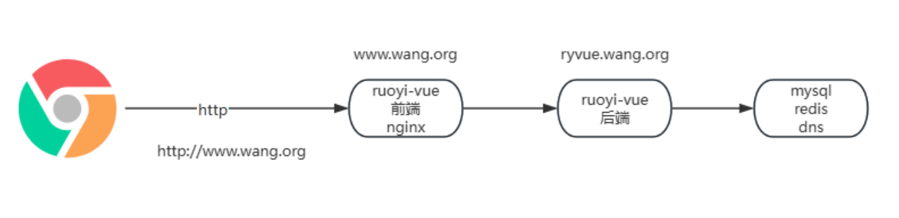

# 33、综合案例

## **若依** **RuoYi** **单体服务项目构建案例**


```
10.0.0.200 mysql DNS
10.0.0.201 ruoyi单体
```


### 下载项目

```bash
[root@ubuntu2404 ~]#git clone https://gitee.com/lbtooth/RuoYi.git
[root@ubuntu2404 ~]#cd RuoYi/
[root@ubuntu2404 RuoYi]#ls
bin  Dockerfile              LICENSE  README.md    ruoyi-common     ruoyi-generator  ruoyi.service  ry.bat  ry.sh.bak     sql
doc  Dockerfile-multi-stage  pom.xml  ruoyi-admin  ruoyi-framework  ruoyi-quartz     ruoyi-system   ry.sh   ry.sh-java17
```

### 准备数据库

```bash
[root@ubuntu2404 ~]#apt update && apt install -y mysql-server
[root@ubuntu2404 ~]#sed -i '/127.0.0.1/s/^/#/' /etc/mysql/mysql.conf.d/mysqld.cnf 
[root@ubuntu2404 ~]#grep 127.0.0.1 /etc/mysql/mysql.conf.d/mysqld.cnf
#bind-address           = 127.0.0.1
#mysqlx-bind-address    = 127.0.0.1
[root@ubuntu2404 ~]#systemctl restart mysql.service 

#在201传sql的脚本
[root@ubuntu2404 RuoYi]#ls sql/
quartz.sql  ruoyi.html  ruoyi.pdm  ry_20240112.sql
[root@ubuntu2404 RuoYi]#scp sql/*.sql 10.0.0.200:/root

#准备数据库表和数据及用户
[root@ubuntu2404 ~]#mysql
mysql> create database ry;
mysql> create user ry@'%' identified by '123456';
mysql> grant all on ry.* to ry@'%';

[root@ubuntu2404 ~]#mysql -ury -p123456 ry < ry_20240112.sql     
[root@ubuntu2404 ~]#mysql -ury -p123456 ry < quartz.sql 

[root@ubuntu2404 ~]#mysql -ury -p123456 ry -e 'show tables;'
mysql: [Warning] Using a password on the command line interface can be insecure.
+--------------------------+
| Tables_in_ry             |
+--------------------------+
| QRTZ_BLOB_TRIGGERS       |
| QRTZ_CALENDARS           |
| QRTZ_CRON_TRIGGERS       |
| QRTZ_FIRED_TRIGGERS      |
| QRTZ_JOB_DETAILS         |
| QRTZ_LOCKS               |
| QRTZ_PAUSED_TRIGGER_GRPS |
| QRTZ_SCHEDULER_STATE     |
| QRTZ_SIMPLE_TRIGGERS     |
| QRTZ_SIMPROP_TRIGGERS    |
| QRTZ_TRIGGERS            |
| gen_table                |
| gen_table_column         |
| sys_config               |
| sys_dept                 |
| sys_dict_data            |
| sys_dict_type            |
| sys_job                  |
| sys_job_log              |
| sys_logininfor           |
| sys_menu                 |
| sys_notice               |
| sys_oper_log             |
| sys_post                 |
| sys_role                 |
| sys_role_dept            |
| sys_role_menu            |
| sys_user                 |
| sys_user_online          |
| sys_user_post            |
| sys_user_role            |
+--------------------------+
```

```bash
#修改连接MySQL的配置
[root@ubuntu2404 RuoYi]#vim ruoyi-admin/src/main/resources/application-druid.yml
# 数据源配置
spring:
    datasource:
        type: com.alibaba.druid.pool.DruidDataSource
        driverClassName: com.mysql.cj.jdbc.Driver
        druid:
            # 主库数据源
            # 主库数据源,修改数据名称和用户密码
            master:
                url: jdbc:mysql://mysql.kang.com:3306/ry?useUnicode=true&characterEncoding=utf8&zeroDateTimeBehavior=convertToNull&useSSL=true&serverTimezone=GMT%2B8
                username: ry
                password: 123456
```

```bash
#配置DNS
[root@ubuntu2404 ~]#cat /etc/bind/kang.com.zone 
$TTL 1D
@       IN SOA  master admin (
                                        1       ; serial
                                        1D      ; refresh
                                        1H      ; retry
                                        1W      ; expire
                                        3H )    ; minimum
        NS       master
master  A        10.0.0.200         
mysql   A        10.0.0.200

[root@ubuntu2404 ~]#cat /etc/bind/named.conf.options
options {
        directory "/var/cache/bind";

        // If there is a firewall between you and nameservers you want
        // to talk to, you may need to fix the firewall to allow multiple
        // ports to talk.  See http://www.kb.cert.org/vuls/id/800113

        // If your ISP provided one or more IP addresses for stable 
        // nameservers, you probably want to use them as forwarders.  
        // Uncomment the following block, and insert the addresses replacing 
        // the all-0's placeholder.

    forwarders {
            223.6.6.6;
        180.76.76.76;
        };

        //========================================================================
        // If BIND logs error messages about the root key being expired,
        // you will need to update your keys.  See https://www.isc.org/bind-keys
        //========================================================================
        dnssec-validation no;

        listen-on-v6 { any; };
};
```

### **构建** **jAVA** **项目**

```bash
[root@ubuntu2404 RuoYi]#apt update && apt -y install maven
[root@ubuntu2404 RuoYi]#mvn -v
Apache Maven 3.8.7
Maven home: /usr/share/maven
Java version: 21.0.6, vendor: Ubuntu, runtime: /usr/lib/jvm/java-21-openjdk-amd64
Default locale: en_US, platform encoding: UTF-8
OS name: "linux", version: "6.8.0-48-generic", arch: "amd64", family: "unix"
#maven加速配置(可选,因为RuoYi本身项目已有配置加速,此步可不做)
[root@ubuntu2404 RuoYi]#vim /etc/maven/settings.xml 
    <mirror>
      <id>nexus-aliyun</id>
      <mirrorOf>*</mirrorOf>
      <name>Nexus aliyun</name>
      <url>http://maven.aliyun.com/nexus/content/groups/public</url>
    </mirror>
    
[root@ubuntu2404 RuoYi]#mvn clean package -Dmaven.test.skip=true
```

**运行**

```
[root@ubuntu2404 RuoYi]#java -jar ruoyi-admin/target/ruoyi-admin.jar
```

```
#添加为service方式管理
[root@ubuntu2404 ~]#cp RuoYi/ry.sh /srv/
[root@ubuntu2404 ~]#cp RuoYi/ruoyi-admin/target/ruoyi-admin.jar /srv/
[root@ubuntu2404 ~]#ls /srv/
ruoyi-admin.jar  ry.sh
[root@ubuntu2404 srv]#chmod +x ry.sh 
[root@ubuntu2404 ~]#vim /lib/systemd/system/ruoyi.service
[Unit]
Description=Ruoyi
After=network.target

[Service]
Type=forking
#Type=notify
#User=ruoyi
#Group=ruoyi
ExecStart=/srv/ry.sh start
ExecStop=/srv/ry.sh stop
LimitNOFILE=10000

[Install]
WantedBy=multi-user.target

[root@ubuntu2404 ~]#systemctl daemon-reload && systemctl enable --now ruoyi.service 
```

### 登录访问


## **若依** **RuoYi** **前后端分离项目**


```
10.0.0.201 ruoyi-vue前端
10.0.0.202 ruoyi-vue后端
10.0.0.200 mysql redis dns
```

```bash
#准备DNS
[root@ubuntu2404 ~]#cat /etc/bind/kang.com.zone
$TTL 1D
@       IN SOA  master admin (
                                        1       ; serial
                                        1D      ; refresh
                                        1H      ; retry
                                        1W      ; expire
                                        3H )    ; minimum
        NS       master
master  A        10.0.0.200         
mysql   A        10.0.0.200
redis   A        10.0.0.200
```

**下载项目**

```
[root@ubuntu2404 ~]#git clone https://gitee.com/lbtooth/RuoYi-Vue.git
```


### 准备MySQL和Redis

```bash
[root@ubuntu2404 ~]#apt update && apt install -y mysql-server redis
[root@ubuntu2404 ~]#sed -i '/127.0.0.1/s/^/#/' /etc/mysql/mysql.conf.d/mysqld.cnf 
[root@ubuntu2404 ~]#grep 127.0.0.1 /etc/mysql/mysql.conf.d/mysqld.cnf
#bind-address           = 127.0.0.1
#mysqlx-bind-address    = 127.0.0.1
[root@ubuntu2404 ~]#systemctl restart mysql.service 

#查看数据库脚本
[root@ubuntu2404 ~]#ls sql/
quartz.sql  ry_20231130.sql

#准备数据库表和数据及用户
[root@ubuntu2404 ~]#mysql
mysql> create database ryvue;
mysql> create user ryvue@'%' identified by '123456';
mysql> grant all on ry.* to ry@'%';
mysql> GRANT ALL PRIVILEGES ON ryvue.* TO 'ryvue'@'%';
mysql> FLUSH PRIVILEGES;

#导入表
mysql> source sql/quartz.sql
mysql> source sql/ry_20231130.sql

#修改连接MySQL的配置
[root@ubuntu2404 RuoYi-Vue]#vim ruoyi-admin/src/main/resources/application-druid.yml 
# 数据源配置
spring:
    datasource:
        type: com.alibaba.druid.pool.DruidDataSource
        driverClassName: com.mysql.cj.jdbc.Driver
        druid:
            # 主库数据源
            master:
                url: jdbc:mysql://mysql.kang.com:3306/ryvue?useUnicode=true&characterEncoding=utf8&zeroDateTimeBehavior=convertToNull&useSSL=true&serverTimezone=GMT%2B8
                username: ryvue
                password: 123456
                
                
                
#修改redis配置
[root@ubuntu2404 ~]#sed -i.bak -e 's/^bind .*/bind 0.0.0.0/' -e '$a requirepass 123456' /etc/redis/redis.conf 
[root@ubuntu2404 ~]#grep bind /etc/redis/redis.conf
bind 0.0.0.0
[root@ubuntu2404 ~]#grep 123456 /etc/redis/redis.conf
requirepass 123456
[root@ubuntu2404 ~]#systemctl restart redis

#修改连接Redis配置和服务启动端口（可选）
[root@ubuntu2404 RuoYi-Vue]#vim ruoyi-admin/src/main/resources/application.yml
  # redis 配置
  redis:
    # 地址
    host: redis.kang.com
    # 端口，默认为6379
    port: 6379
    # 数据库索引
    database: 0
    # 密码
    password: 123456
    # 连接超时时间
    timeout: 10s
    lettuce:
      pool:
        # 连接池中的最小空闲连接
        min-idle: 0
        # 连接池中的最大空闲连接
        max-idle: 8
        # 连接池的最大数据库连接数
        max-active: 8
        # #连接池最大阻塞等待时间（使用负值表示没有限制）
        max-wait: -1ms
```

### **后端项目构建**

```bash
#安装java工具
[root@ubuntu2404 RuoYi-Vue]#apt update && apt install -y openjdk-17-jdk
[root@ubuntu2404 RuoYi-Vue]#apt install -y  maven
[root@ubuntu2404 RuoYi-Vue]#mvn -v
Apache Maven 3.8.7
Maven home: /usr/share/maven
Java version: 17.0.14, vendor: Ubuntu, runtime: /usr/lib/jvm/java-17-openjdk-amd64
Default locale: en_US, platform encoding: UTF-8
OS name: "linux", version: "6.8.0-48-generic", arch: "amd64", family: "unix"

#编译打包,可能因为网络原因失败，重试即可，此步如果网络较慢可能会需要花数十分钟的较长时间
[root@ubuntu2404 RuoYi-Vue]#mvn clean package -Dmaven.test.skip=true
#使用默认端口8080,可以通过--server.port=8888指定端口
[root@ubuntu2404 RuoYi-Vue]#java -jar /opt/ruoyi-admin.jar
```


### **前端项目构建**

```bash
[root@ubuntu2204 ~]#git clone https://gitee.com/lbtooth/RuoYi-Vue     
[root@ubuntu2204 ~]#cd RuoYi-Vue/
[root@ubuntu2204 RuoYi-Vue]#ls
bin  Dockerfile              LICENSE       pom.xml    ruoyi-admin   ruoyi-framework  ruoyi-quartz  ruoyi-ui  ry.sh      sql
doc  Dockerfile-multi-stage  nginx-docker  README.md  ruoyi-common  ruoyi-generator  ruoyi-system  ry.bat    ry.sh.bak
[root@ubuntu2204 RuoYi-Vue]#cd ruoyi-ui/
[root@ubuntu2204 ruoyi-ui]#ls
babel.config.js  bin  build  Dockerfile  package.json  public  README.md  src  vue.config.js
#安装工具
[root@ubuntu2204 ruoyi-ui]#apt update && apt -y install npm
[root@ubuntu2204 ruoyi-ui]#npm -v
8.5.1
[root@ubuntu2204 ruoyi-ui]#node -v
v12.22.9
[root@ubuntu2204 ruoyi-ui]#npm install --registry=https://registry.npmmirror.com

```

### **构建发布**

```
# 构建测试环境
npm run build:stage
# 构建生产环境
npm run build:prod
```

### **反向代理配置**

```bash
[root@ubuntu2204 ~]#apt update && apt -y install nginx
[root@ubuntu2204 ~]#cp -r RuoYi-Vue/ruoyi-ui/dist/* /data/ryvue/

#实现Nginx反向代理配置
[root@ubuntu2204 ~]#cat /etc/nginx/conf.d/ryvue.kang.com.conf
server {
    listen 80;
    server_name ryvue.kang.com;

    location / {
        root /data/ryvue;
        try_files $uri $uri/ /index.html;
        index index.html index.htm;
    }

    location /prod-api/ {
        proxy_pass http://10.0.0.202:8080/;
        proxy_set_header Host $http_host;
        proxy_set_header X-Real-IP $remote_addr;
        proxy_set_header REMOTE-HOST $remote_addr;
        proxy_set_header X-Forwarded-For $proxy_add_x_forwarded_for;
    }
}

```


## **RuoYi** **系统前后端分离项目基于容器化构建案例**



```
10.0.0.200	DNS
10.0.0.201	ruoyi-vue前端		nginx
10.0.0.202	ruoyi-vue后端
```

### **环境准备**

**准备** **DNS** **名称解析**

```bash
[root@ubuntu2404 ~]#cat /etc/bind/kang.com.zone
$TTL 1D
@       IN SOA  master admin (
                                        1       ; serial
                                        1D      ; refresh
                                        1H      ; retry
                                        1W      ; expire
                                        3H )    ; minimum
        NS       master
master  A        10.0.0.200         
mysql   A        10.0.0.200
redis   A        10.0.0.200
harbor  A        10.0.0.203
```

**安装工具和下载源码**

```bash
#所有主机都安装工具
[root@ubuntu2404 ~]#apt update && apt -y install docker.io git
[root@ubuntu2404 ~]#cat /etc/docker/daemon.json 
{
    "insecure-registries": ["harbor.kang.com"]
}
[root@ubuntu2404 ~]#systemctl restart docker.server

#所有主机都下载源码
[root@ubuntu2404 ~]#git clone https://gitee.com/lbtooth/RuoYi-Vue.git
```

**指定若依连接** **MySQL** **和Redis 相关配置信息**

```bash
#在后端服务器修改JAVA的连接 MySQL 和Redis 相关配置信息
[root@ubuntu2404 ~]#cd RuoYi-Vue/
[root@ubuntu2404 RuoYi-Vue]#vim ruoyi-admin/src/main/resources/application-druid.yml 
# 数据源配置
spring:
    datasource:
        type: com.alibaba.druid.pool.DruidDataSource
        driverClassName: com.mysql.cj.jdbc.Driver
        druid:
            # 主库数据源
            master:
                url: jdbc:mysql://mysql.kang.com:3306/ryvue?useUnicode=true&characterEncoding=utf8&zeroDateTimeBehavior=convertToNull&useSSL=true&serverTimezone=GMT%2B8
                username: ryvue
                password: 123456
            # 从库数据源
            slave:
                # 从数据源开关/默认关闭
                enabled: false
                url:
                username:
                password:
#修改Redis连接配置
[root@ubuntu2404 RuoYi-Vue]#vim ruoyi-admin/src/main/resources/application.yml
  # redis 配置
  redis:
    # 地址
    host: redis.kang.com
    # 端口，默认为6379
    port: 6379
    # 数据库索引
    database: 0
    # 密码
    password: 123456
    # 连接超时时间
    timeout: 10s
    lettuce:
      pool:
        # 连接池中的最小空闲连接
        min-idle: 0
        # 连接池中的最大空闲连接
        max-idle: 8
        # 连接池的最大数据库连接数
        max-active: 8
        # #连接池最大阻塞等待时间（使用负值表示没有限制）
        max-wait: -1ms
```

**启动** **MySQL** **和** **Redis** **服务**

```bash
[root@ubuntu2404 ~]#mkdir /data/mysql -p
[root@ubuntu2404 ~]#docker run --name ruoyi-mysql -d -p 3306:3306 -e MYSQL_ROOT_PASSWORD=123456 -e MYSQL_DATABASE=ryvue -e MYSQL_USER=ryvue -e MYSQL_PASSWORD=123456 -v /data/mysql:/var/lib/mysql --restart=always registry.cn-beijing.aliyuncs.com/wangxiaochun/mysql:8.0.29-oracle

#查看数据库脚本
[root@ubuntu2404 ~]#ls RuoYi-Vue/sql/
quartz.sql  ry_20231130.sql

#准备表
[root@ubuntu2404 ~]#apt -y install mysql-client
[root@ubuntu2404 ~]#mysql -uroot -p123456 -hmysql.kang.com

#导入表
mysql> use ryvue
mysql> source RuoYi-Vue/sql/ry_20231130.sql
mysql> source RuoYi-Vue/sql/quartz.sql
mysql> show tables in ryvue;
+--------------------------+
| Tables_in_ryvue          |
+--------------------------+
| QRTZ_BLOB_TRIGGERS       |
| QRTZ_CALENDARS           |
| QRTZ_CRON_TRIGGERS       |
| QRTZ_FIRED_TRIGGERS      |
| QRTZ_JOB_DETAILS         |
| QRTZ_LOCKS               |
| QRTZ_PAUSED_TRIGGER_GRPS |
| QRTZ_SCHEDULER_STATE     |
| QRTZ_SIMPLE_TRIGGERS     |
| QRTZ_SIMPROP_TRIGGERS    |
| QRTZ_TRIGGERS            |
| gen_table                |
| gen_table_column         |
| sys_config               |
| sys_dept                 |
| sys_dict_data            |
| sys_dict_type            |
| sys_job                  |
| sys_job_log              |
| sys_logininfor           |
| sys_menu                 |
| sys_notice               |
| sys_oper_log             |
| sys_post                 |
| sys_role                 |
| sys_role_dept            |
| sys_role_menu            |
| sys_user                 |
| sys_user_post            |
| sys_user_role            |
+--------------------------+
30 rows in set (0.00 sec)
```

```bash
#启动redis服务
[root@ubuntu2404 ~]#docker run --name ruoyi-redis -d -p 6379:6379 --restart always registry.cn-beijing.aliyuncs.com/wangxiaochun/redis:7.2.5 redis-server --requirepass 123456

#测试连接Redis
[root@ubuntu2404 ~]#apt -y install redis-tools
[root@ubuntu2404 ~]#redis-cli -a 123456 PING
Warning: Using a password with '-a' or '-u' option on the command line interface may not be safe.
PONG
```


### **后端项目构建**

```bash
#在后端JAVA服务器上执行
[root@ubuntu2404 ~]#apt update && apt -y install maven
[root@ubuntu2404 ~]#mvn -v
Apache Maven 3.8.7
Maven home: /usr/share/maven
Java version: 17.0.14, vendor: Ubuntu, runtime: /usr/lib/jvm/java-17-openjdk-amd64
Default locale: en_US, platform encoding: UTF-8
OS name: "linux", version: "6.8.0-48-generic", arch: "amd64", family: "unix"

#maven加速配置(可选,因为RuoYi本身项目已有配置加速,此步可不做)
[root@ubuntu2404 ~]#vim /etc/maven/settings.xml
.....
   <mirror>
       <id>nexus-aliyun</id>
       <mirrorOf>*</mirrorOf>
       <name>Nexus aliyun</name>
       <url>http://maven.aliyun.com/nexus/content/groups/public</url>
   </mirror>
......

#下载源码
[root@ubuntu2404 ~]#git clone https://gitee.com/lbtooth/RuoYi-Vue.git
[root@ubuntu2404 ~]#cd RuoYi-Vue/
[root@ubuntu2404 RuoYi-Vue]#mvn clean package -Dmaven.test.skip=true
[root@ubuntu2404 RuoYi-Vue]#cat Dockerfile
# 基础镜像
#FROM adoptopenjdk/openjdk11:alpine-jre
#FROM openjdk:11.0.16
#FROM openjdk:11.0.16-jre-slim
#FROM openjdk:8u212-jre-alpine3.9
FROM registry.cn-beijing.aliyuncs.com/wangxiaochun/openjdk:8u212-jre-alpine3.9


# 作者
LABEL MAINTAINER="kang<root@kang.com>"

ENV APP_NAME=ruoyi APP_PATH=/data/ruoyi  APP_PORT=8080


# 挂载目录
VOLUME ${APP_PATH}

# 创建目录
RUN mkdir -p ${APP_PATH}

# 指定路径
WORKDIR  ${APP_PATH}

# 复制jar文件到路径
COPY ./ruoyi-admin/target/*.jar ${APP_PATH}/${APP_NAME}.jar
#COPY ./target/*.jar ${APP_PATH}/${APP_NAME}.jar

#暴露端口
EXPOSE $APP_PORT

# 启动服务
CMD java -jar ${APP_PATH}/${APP_NAME}.jar --server.port=$APP_PORT

#安装字体相关包，否则无法显示验证码
RUN sed -i 's/dl-cdn.alpinelinux.org/mirrors.aliyun.com/' /etc/apk/repositories && apk update && apk  --no-cache add ttf-dejavu fontconfig


[root@ubuntu2404 RuoYi-Vue]#docker build -t harbor.kang.com/example/ruoyi-vue:v0.1 .

#连接harbor
[root@ubuntu2404 RuoYi-Vue]#docker login harbor.kang.com -u admin
Password: 
WARNING! Your password will be stored unencrypted in /root/.docker/config.json.
Configure a credential helper to remove this warning. See
https://docs.docker.com/engine/reference/commandline/login/#credentials-store

Login Succeeded

#启动容器,如果宿主机配置有DNS的域名解析,可以不用加--add-host
[root@ubuntu2404 RuoYi-Vue]#docker run --name ruoyi-vue -d -p 82:8080 harbor.kang.com/example/ruoyi-vue:v0.1 
8015fd205552bffe089ac4519ff7552e3b26ede8482040e1feffd4f3a67802a8

[root@ubuntu2204 RuoYi-Vue]#docker run --name ruoyi-vue -d -p 82:8080 --add-host mysql.kang.com:10.0.0.100 --add-host redis.kang.com:10.0.0.100 harbor.kang.com/example/ruoyi-vue:v0.1
```

### **前端项目构建**

```bash
[root@ubuntu2404 ~]#cd RuoYi-Vue/ruoyi-ui/
[root@ubuntu2404 ruoyi-ui]#cat Dockerfile 
#FROM registry.cn-beijing.aliyuncs.com/wangxiaochun/node:14.17.6 AS build
FROM registry.cn-beijing.aliyuncs.com/wangxiaochun/node:16.20-bullseye-slim AS build
COPY . /vue
WORKDIR /vue
RUN npm install  --registry=https://registry.npmmirror.com && npm run build:prod

FROM registry.cn-beijing.aliyuncs.com/wangxiaochun/nginx:1.20.0
LABEL maintainer="kang <root@kang.com>"
COPY --from=build /vue/dist /usr/share/nginx/html

#构建镜像
[root@ubuntu2404 ruoyi-ui]#docker build -t harbor.kang.com/example/rouyi-ui:v0.1 .

#启动容器
[root@ubuntu2404 ~]#docker run --name ruoyi-ui -d -p 81:80 harbor.kang.com/example/rouyi-ui:v0.1 
8daa11b66832828361289643ee15629762d62ca844341fd5aaab9c42a520f18e
```

### **反向代理构建**

```bash
[root@ubuntu2404 nginx-docker]#cat Dockerfile 
FROM registry.cn-beijing.aliyuncs.com/wangxiaochun/nginx:1.20.0
LABEL MAINTAINER="kang<root@kang.com>"
COPY *.conf /etc/nginx/conf.d/
[root@ubuntu2404 nginx-docker]#docker build -t harbor.kang.com/example/nginx:v0.1 .
[root@ubuntu2404 nginx-docker]#docker run --name ruoyi-nginx -p 80:80 -d harbor.kang.com/example/nginx:v0.1 
ab7df3dd8963b0e6dcc6781d577f5ff431ed2d54a5622fd69f176b9f34eab31a
```

```bash
#方法1：挂载配置文件到容器内，反向代理和前端合并一个容器
[root@ubuntu2404 nginx-docker]#cat www.kang.com.conf 
server {
    listen 80 ;
    server_name www.kang.com;
    root /usr/share/nginx/html;
    index index.html index.htm ;
    location /prod-api/ {
        proxy_set_header Host $http_host;
        proxy_set_header X-Real-IP $remote_addr;
        proxy_set_header REMOTE-HOST $remote_addr;
        proxy_set_header X-Forwarded-For $proxy_add_x_forwarded_for;
        proxy_pass http://10.0.0.202:82/;
    }
}

[root@ubuntu2404 nginx-docker]#docker run --name ry -p 80:80 -d -v ./www.kang.com.conf:/etc/nginx/conf.d/www.kang.com.conf ry:v0.1 
```

```bash
#方法1：挂载配置文件到容器内，反向代理和前端合并一个容器
[root@ubuntu2404 nginx-docker]#cat Dockerfile 
FROM registry.cn-beijing.aliyuncs.com/wangxiaochun/nginx:1.20.0
LABEL MAINTAINER="kang<root@kang.com>"
COPY *.conf /etc/nginx/conf.d/

[root@ubuntu2404 nginx-docker]#docker build -t nginx:v0.1 .
[root@ubuntu2404 nginx-docker]#cat ryvue.kang.com.conf 
server {
    listen 80 ;
    server_name ryvue.kang.com;
    root /var/www/html;
    index index.html index.htm ;
    location / {
        proxy_pass http://10.0.0.201:81;    
    }
    location /prod-api/ {
        proxy_set_header Host $http_host;
        proxy_set_header X-Real-IP $remote_addr;
        proxy_set_header REMOTE-HOST $remote_addr;
        proxy_set_header X-Forwarded-For $proxy_add_x_forwarded_for;
        proxy_pass http://10.0.0.202:82/;
    }
}

[root@ubuntu2404 nginx-docker]#docker run --name ry -p 81:80 -d ry:v0.1 
[root@ubuntu2404 nginx-docker]#docker run --name nginx -p 80:80 -d -v ./ryvue.kang.com.conf:/etc/nginx/conf.d//ryvue.kang.com.conf nginx:v0.1 
```

