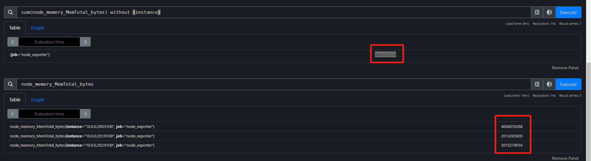
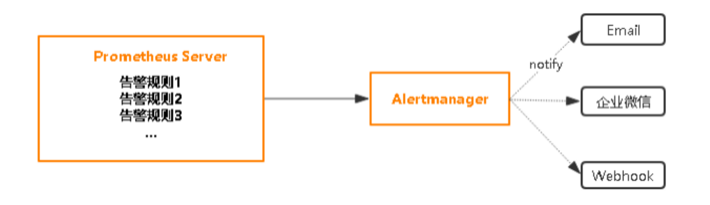

# 34、prometheus

## Prometheus介绍

一个完整的监控系统需要包括如下功能：数据产生、数据采集、数据存储、数据处理、数据展示分析、告警

### 数据采集

- 软件方式：

  agent: 专用的软件的一种应用机制。

  http: 基于http 协议实现数据采集

  ssh: 系统常见的一种应用通信机制，但是并非所有系统都支持。

  SNMP: 简单网络管理协议(Simple Network Management Protocol),是工作在各种网络设备中的一种机制。

- 硬件方式：

  IPMI: 智慧平台管理接口(Intelligent Platform Management Interface)是一种工业标准用于采集硬件设备的各种物理健康状态数据，如温度、电压、风扇工作状态、电源状态等。

注意：由于每个业务场景，需要采集的指标数量是不确定的，有时只是一个业务场景，就需要采集数百个指标，如果按照上述所说的周期性采集的方式来说，数据的采集量是相当大的

### **监控内容和方法**

**资源数据**

- 硬件设备：服务器、路由器、交换机、IO系统等
- 系统资源：OS、网络、容器、VM实例
- 应用软件：Nginx、MySQL、Java应用等

**业务服务**

- 业务状态：服务通信、服务运行、服务下线、性能指标、QPS、DAU(Daily Active User )日活、转化率、业务口(登陆，注册，聊天，留⾔)、产品转化率、充值额度、⽤户投诉等
- 一般故障：访问缓慢、存储空间不足，数据同步延迟，主机宕机、主机不可达
- 严重故障：服务不可用、集群故障

**趋势分析**

- 数据统计：时间序列数据展示历史数据等
- 数据预测：事件什么时候发生、持续时间、发生概率是多大等,比如:电商大促时间

**监控方法**

**Google 的四个黄金指标**

常用于在服务级别帮助衡量终端用户体验、服务中断、业务影响等层面的问题，适用于应用及服务监控

- 延迟(Latency)

  服务请求所需要的时长，例如HTTP请求平均延迟

  应用程序响应时间会受到所有核心系统资源（包括网络、存储、CPU和内存）延迟的影响需要区分失败请求和成功请求

- 流量(Traffic)，也称为吞吐量

  衡量服务的容量需求，例如每秒处理的HTTP请求数QPS或者数据库系统的事务数量TPS

  吞吐量指标包括每秒Web请求、API调用等示例，并且被描述为通常表示为每秒请求数的需求

- 错误(Errors)

  失败的请求（流量)的数量，通常以绝对数量或错误请求占请求总数的百分比表示，请求失败的速率，用于衡量错误发生的情况

  例如：HTTP 500错误数等显式失败，返回错误内容或无效内容等隐式失败，以及由策略原因导致的失败(例如强制要求响应时间超过30毫秒的请求视为错误)

- 饱和度(Saturation)

  衡量资源的使用情况,用于表达应用程序有多"满"

  资源的整体利用率，包括CPU（容量、配额、节流)、内存(容量、分配)、存储（容量、分配和 I/O吞吐量)和网络

  例如：内存、CPU、I/O、磁盘等资源的使用量

### **什么是序列数据**

参考资料：https://db-engines.com/en/ranking/time+series+dbms

时间序列数据(TimeSeries Data) : 按照时间顺序记录系统、设备状态变化的数据被称为时序数据。

时序数据库记录的数据以时间为横座标,纵坐标为数据

时间序列数据库 (Time Series Database , 简称 TSDB) 是一种高性能、低成本、稳定可靠的在线时间序列数据库服务，提供高效读写、高压缩比存储、时序数据插值及聚合计算等服务，广泛应用于物联网（IoT）设备监控系统、企业能源管理系统（EMS）、生产安全监控系统和电力检测系统等行业场景；除此以外，还提供时空场景的查询和分析的能力。

TSDB 具备秒级写入百万级时序数据的性能，提供高压缩比低成本存储、预降采样、插值、多维聚合计算、可视化查询结果等功能，解决由设备采集点数量巨大、数据采集频率高造成的存储成本高、写入和查询分析效率低的问题。

TSDB是一个分布式时间序列数据库，具备多副本高可用能力。同时在高负载大规模数据量的情况下可以方便地进行弹性扩容，方便用户结合业务流量特点进行动态规划与调整。

应用的场景：

- 物联网设备无时无刻不在产生海量的设备状态数据和业务消息数据，这些数据有助于进行设备监控、业务分析预测和故障诊断。
- 传统电力化工以及工业制造行业需要通过实时的监控系统进行设备状态检测，故障发现以及业务趋势分析。
- 系统运维和业务实时监控,通过对大规模应用集群和机房设备的监控，实时关注设备运行状态、资源利用率和业务趋势，实现数据化运营和自动化开发运维。

### **Prometheus** **简介**

Prometheus 本身基于Go语言开发的一套开源的系统监控报警框架和时序列数据库(TSDB)。

Prometheus 的监控功能很完善和全面，性能也足够支撑上万台规模的集群。

网站：https://prometheus.io/

github：https://github.com/prometheus

其特点主要如下：

- 支持多维数据模型：由度量名和键值对组成的时间序列数据
- 内置时间序列数据库TSDB(Time Series Database )
- 支持PromQL(Prometheus Query Language)查询语言，可以完成非常复杂的查询和分析，对图表展示和告警非常有意义
- 支持 HTTP 的 Pull 方式采集时间序列数据
- 支持 PushGateway 采集瞬时任务的数据
- 支持静态配置和服务发现两种方式发现目标
- 多种可视化和仪表盘,支持第三方 Dashboard,比如:Grafana

数据特点

- 监控指标，采用独创的指标格式，我们称之为Prometheus格式，这个格式在监控场景中很常见。
- 数据标签，支持多维度标签，每个独立的标签组合都代表一个独立的时间序列
- 数据处理，Prometheus内部支持多种数据的聚合、切割、切片等功能。
- 数据存储，Prometheus支持双精度浮点型数据存储和字符串

**Prometheus** **不足**

- 不支持集群化
- 被监控集群规模过大后本身性能有一定瓶颈
- 中文支持不好
- 功能不完整，需要结合其它组件实现监控的全部功能

### **Prometheus** **架构**

 Prometheus 同其它TSDB相比有一个非常典型的特性：

它主动从各Target上"拉取（pull)"数据，相当于Zabbix里的被动模式,而非等待被监控端的"推送（push）"

```
zabbix 主动被动模式从agent看
主动：agent主动发数据 （推）
被动：zabbix-server主动拉取数据 （拉） （默认）

prometheus-server 主动拉取数据 （拉）
```

两个方式各有优劣，其中，Pull模型的优势在于：集中控制：有利于将配置集在 Prometheus Server上完成，包括指标及采取速率等,Prometheus的根本目标在于收集在Target上预先完成聚合的聚合型数据，而非一款由事件驱动的存储系统


采集	存储	展示	告警

**Prometheus Server**: （采集、存储）

- Prometheus 的核心组件，负责数据采集、存储和查询。具体流程如下：
  - **Retrieval (数据采集)**：Prometheus 拉取数据的过程，从监控目标或 Pushgateway 获取数据。
  - **TSDB (时间序列数据库)**：Prometheus 将采集到的时间序列数据存储在本地的硬盘（HDD/SSD）中。
  - **HTTP server (HTTP 服务器)**：Prometheus 提供 Web 界面和 API 供用户查询监控数据。

**Grafana**:（展示）

- 用于将 Prometheus 收集的数据可视化。Grafana 提供丰富的图表、仪表盘和监控面板，帮助用户实时查看和分析监控数据。

**Alertmanager**:（告警）

- 用于处理和管理 Prometheus 的告警。Alertmanager 负责接收来自 Prometheus 的告警信息，并根据配置的规则将告警信息推送到不同的通知渠道，如 **PagerDuty、Email** 等。

 **Service Discovery (服务发现)**:

- Prometheus 通过 **Kubernetes** 或 **file_sd**（文件服务发现）等方式自动发现监控目标，避免手动配置目标列表。

**Pushgateway**:

- 用于处理短期作业或临时任务的监控数据。因为 Prometheus 默认使用拉取（pull）方式来抓取监控数据，但短期任务没有长期运行的指标端点可以供 Prometheus 拉取。Pushgateway 允许这些任务在结束时将数据推送到 Prometheus。

**Prometheus Targets (监控目标)**:

- Prometheus 需要监控的目标。通常这些目标是一些运行着应用、服务或机器的节点，它们通过 **jobs/exporters** 暴露出相关的监控数据。常见的 exporter 包括 Node Exporter、Kubernetes Exporter 等。

**PromQL**:

- Prometheus 查询语言（PromQL），允许用户编写查询来获取存储的时间序列数据。这些查询可以通过 Prometheus 的 Web UI 或 Grafana 进行可视化。

**Prometheus Web UI 和 API Clients**:

- Prometheus 提供了一个 Web 界面和 API，用户可以通过这些界面查询、查看和分析存储的数据。

总结来说，Prometheus 通过 **Pull** 方式定期从监控目标获取数据，支持动态的服务发现并将数据存储到本地的 TSDB 中。通过 PromQL 可以查询数据并在 Grafana 等工具中进行可视化，告警信息则通过 Alertmanager 发送到不同的通知渠道。


```
pormetheus通过http拉取数据

APP --> exporter proxy(http server + data) --> http data --> prometheus
```


Prometheus 的主要模块包括：

- prometheus 

  时序数据存储、监控指标管理

- 可视化

  Prometheus web UI : 集群状态管理、promQL 

  Grafana:非常全面的可视化套件

- 数据采集

  Exporter: 为当前的客户端暴露出符合 Prometheus 规格的数据指标,Exporter 以守护进程的模式运行井开始采集数据,Exporter 本身也是一个http_server 可以对http请求作出响应返回数据 (K/V形式的metrics)

  Pushgateway : 拉模式下数据的采集工具

- 监控目标

  服务发现 :文件方式、dns方式、console方式、k8s方式

- 告警: 

  alertmanager 

Prometheus 由几个主要的软件组件组成，其职责概述如下

| 组件               | 解释                                                         |
| ------------------ | ------------------------------------------------------------ |
| Prometheus Server  | 彼此独立运行，仅依靠其本地存储来实现其核心功能：抓取时序数据，规则处理和警报等。 |
| Client Library     | 客户端库，为需要监控的服务生成相应的 metrics 并暴露给 Prometheus server。当 Prometheus server 来 pull 时，直接返回实时状态的 metrics。 |
| Push Gateway       | exporter采集类型已经很丰富，但是依然需要很多自定义的监控数据,用pushgateway可以实现自定义的监控数据,任意灵活想做什么都可以做到 exporter的开发需要使用真正的编程语言，不支持shell这种快速脚本,而 pushgateway开发去容易的多 pushgateway主要用于短期的 jobs。由于这类 jobs 存在时间较短，可能在 Prometheus 来 pull 之前就消失了。为此，这次 jobs 可以直接向 Prometheus server 端推送它们的 metrics。这种方式主要用于服务层面的 metrics，对于机器层 面的 metrices，需要使用 node exporter |
| Exporters          | 部署到第三方软件主机上，用于暴露已有的第三方服务的 metrics 给 Prometheus。 |
| Alertmanager       | 从 Prometheus server 端接收到 alerts 后，会进行去除重复数据，分组，并路由到 对应的接受方式，以高效向用户完成告警信息发送。常见的接收方式有：电子邮件， pagerduty，OpsGenie, webhook 等,一些其他的工具。 |
| Data Visualization | Prometheus Web UI （Prometheus Server内建），及Grafana等     |
| Service Discovery  | 动态发现待监控的Target，从而完成监控配置的重要组件，在容器化环境中尤为有 用；该组件目前由Prometheus Server内建支持； |

**工作流程**

- Prometheus server 定期从配置好的 jobs 或者 exporters 中拉 metrics，或者接收来自 Pushgateway 发过来的 metrics，或者从其他的 Prometheus server 中拉 metrics。
- Prometheus server 在本地存储收集到的 metrics，并运行已定义好的 alert.rules，记录新的时间序列或者向 Alertmanager 推送警报，实现一定程度上的完全冗余功能。
- Alertmanager 根据配置文件，对接收到的警报进行去重分组，根据路由配置，向对应主机发出告警。
- 集成Grafana或其他API作为图形界面，用于可视化收集的数据。

**生态组件**

```
https://prometheus.io/docs/instrumenting/exporters/
```


## **Prometheus** **部署和监控**

| 软件            | 地址                                                         |
| --------------- | ------------------------------------------------------------ |
| prometheus      | https://github.com/prometheus/prometheus/releases/download/v2.53.3/prometheus-2.53.3.linux-amd64.tar.gz |
| alertmanager    | https://github.com/prometheus/alertmanager/releases/download/v0.28.0/alertmanager-0.28.0.linux-amd64.tar.gz |
| node_exporter   | https://github.com/prometheus/node_exporter/releases/download/v1.9.0/node_exporter-1.9.0.linux-amd64.tar.gz |
| mysqld_exporter | https://github.com/prometheus/mysqld_exporter/releases/download/v0.17.2/mysqld_exporter-0.17.2.linux-amd64.tar.gz |
| grafana         | https://dl.grafana.com/enterprise/release/grafana-enterprise_11.5.2_amd64.deb |
| pushgateway     | https://github.com/prometheus/pushgateway/releases/download/v1.11.0/pushgateway-1.11.0.linux-amd64.tar.gz |

### **Prometheus** **部署和配置**

#### 包安装

```
[root@ubuntu2404 ~]#apt list prometheus
Listing... Done
prometheus/noble-security,noble-updates,noble-updates,noble-security 2.45.3+ds-2ubuntu0.2 amd64
N: There is 1 additional version. Please use the '-a' switch to see it
[root@ubuntu2404 ~]#apt update && apt install prometheus -y 
```

### **二进制安装** **Prometheus**

生产建议安装LTS版本

```bash
[root@ubuntu2404 ~]#tar xf prometheus-2.53.3.linux-amd64.tar.gz -C /usr/local/
[root@ubuntu2404 ~]#cd /usr/local/
[root@ubuntu2404 local]#ls
bin  etc  games  include  lib  man  prometheus-2.53.3.linux-amd64  sbin  share  src
[root@ubuntu2404 local]#ln -s prometheus-2.53.3.linux-amd64/ prometheus
[root@ubuntu2404 local]#ls prometheus
console_libraries  consoles  LICENSE  NOTICE  prometheus  prometheus.yml  promtool
[root@ubuntu2404 prometheus]#mkdir conf bin
[root@ubuntu2404 prometheus]#mv prometheus promtool bin       
[root@ubuntu2404 prometheus]#mv prometheus.yml conf/
[root@ubuntu2404 prometheus]#ls
bin  conf  console_libraries  consoles  LICENSE  NOTICE
[root@ubuntu2404 prometheus]#ls bin/
prometheus  promtool
[root@ubuntu2404 prometheus]#ls conf/
prometheus.yml
[root@ubuntu2404 ~]#ln -s /usr/local/prometheus/bin/* /usr/local/bin/
[root@ubuntu2404 ~]#prometheus --config.file="/usr/local/prometheus/conf/prometheus.yml"
```

```bash
#创建启动用户
[root@ubuntu2404 ~]#useradd -r -s /sbin/nologin prometheus
[root@ubuntu2404 ~]#id prometheus 
uid=999(prometheus) gid=989(prometheus) groups=989(prometheus)

#创建server文件
[root@ubuntu2404 ~]#vim /lib/systemd/system/prometheus.service
[root@ubuntu2404 ~]#cat /lib/systemd/system/prometheus.service
[Unit]
Description=Prometheus Server
Documentation=https://prometheus.io/docs/introduction/overview/
After=network.target

[Service]
Restart=on-failure
User=prometheus
Group=prometheus
WorkingDirectory=/usr/local/prometheus/
ExecStart=/usr/local/prometheus/bin/prometheus --config.file=/usr/local/prometheus/conf/prometheus.yml
ExecReload=/bin/kill -HUP $MAINPID
LimitNOFILE=65535

[Install]
WantedBy=multi-user.target

[root@ubuntu2404 ~]#chown -R prometheus:prometheus /usr/local/prometheus/
[root@ubuntu2404 ~]#systemctl daemon-reload 
[root@ubuntu2404 ~]#systemctl enable --now prometheus.service 
```


### **API** **访问**

注意：{ip:port} 是Prometheus所在的IP和端口

- 健康检查

  GET {ip:port}/-/healthy

  该端点始终返回200，应用于检查Prometheus的运行状况。

- 准备检查

  GET {ip:port}/-/ready

  当Prometheus准备服务流量（即响应查询）时，此端点返回200。

- 加载配置

  PUT {ip:port}/-/reload

  POST {ip:port}/-/reload

- 关闭服务

  PUT {ip:port}/-/quit

  POST {ip:port}/-/quit


### Prometheus 选项

```bash
[root@ubuntu2404 ~]#prometheus --help
...
--web.enable-lifecycle #可以支持http方式实现reload和shutdown功能，可以被远程关毕服务，有安全风险，不建议开启，默认关闭
--web.read-timeout=5m  #Maximum duration before timing out read of the request, and closing idle connections. 请求连接的最⼤等待时间,可以防⽌太多的空闲连接占⽤资源
--web.max-connections=512 #Maximum number of simultaneous connections. 最⼤链接数
--storage.tsdb.retention=15d #How long to retain samples in the storage.prometheus开始采集监控数据后 会存在内存中和硬盘中对于保留期限的设置,此值太长会导致硬盘和内存都吃不消,但太短要查历史数据就没有了,企业中一般设置15天为宜,默认值为0
--storage.tsdb.path="data/" #Base path for metrics storage. 存储数据路径,建议独立分区,防止把根⽬录塞满,默认data/目录
--query.timeout=2m #Maximum time a query may take before being aborted.此为默认值2m
--query.max-concurrency=20 #Maximum number of queries executed concurrently.此为默认值20
```


### docker部署

```bash
#简单启动
#默认容器的配置文件路径/etc/prometheus/prometheus.yml。数据存储路径默认为/prometheus
[root@prometheus ~]#docker run -d --name prometheus -p 9090:9090 prom/prometheus
#定制配置，持久化
[root@ubuntu2204 ~]#docker run -d --name prometheus -p 9090:9090 -v ./prometheus.yml:/etc/prometheus/prometheus.yml -v prometheus_data:/prometheus prom/prometheus:v2.53.0
```

```bash
#Docker compose部署


version: '3.6'
volumes:
  prometheus_data: {}
networks:
  monitoring:
    driver: bridge
services:
  prometheus:
    image: prom/prometheus:v2.40.2
    volumes:
      - ./prometheus/:/etc/prometheus/
      - prometheus_data:/prometheus
    command:
      - '--config.file=/etc/prometheus/prometheus.yml'
      - '--storage.tsdb.path=/prometheus'
      - '--web.console.libraries=/usr/share/prometheus/console_libraries'
      - '--web.console.templates=/usr/share/prometheus/consoles'
      - '--web.enable-lifecycle'
    networks:
      - monitoring
    ports:
      - 9090:9090
    restart: always
```


### prometheus配置文件

```bash
[root@ubuntu2404 prometheus]#cat conf/prometheus.yml 
#全局配置块
# my global config
global:
  scrape_interval: 15s # Set the scrape interval to every 15 seconds. Default is every 1 minute.
  evaluation_interval: 15s # Evaluate rules every 15 seconds. The default is every 1 minute.
  # scrape_timeout is set to the global default (10s).

#告警相关
# Alertmanager configuration
alerting:
  alertmanagers:
    - static_configs:
        - targets:
          # - alertmanager:9093

#告警规则
# Load rules once and periodically evaluate them according to the global 'evaluation_interval'.
rule_files:
  # - "first_rules.yml"
  # - "second_rules.yml"

#采集信息配置
# A scrape configuration containing exactly one endpoint to scrape:
# Here it's Prometheus itself.
scrape_configs:
  # The job name is added as a label `job=<job_name>` to any timeseries scraped from this config.
  - job_name: "prometheus"

    # metrics_path defaults to '/metrics'
    # scheme defaults to 'http'.

    static_configs:
      - targets: ["localhost:9090"]
```


### nood-exporter

```bash
https://github.com/prometheus/node_exporter/releases/download/v1.9.0/node_exporter-1.9.0.linux-amd64.tar.gz

[root@ubuntu2404 ~]#ls
node_exporter-1.9.0.linux-amd64.tar.gz
[root@ubuntu2404 ~]#tar xvf node_exporter-1.9.0.linux-amd64.tar.gz -C /usr/local/
[root@ubuntu2404 ~]#cd /usr/local/
[root@ubuntu2404 local]#ls
bin  etc  games  include  lib  man  node_exporter-1.9.0.linux-amd64  sbin  share  src
[root@ubuntu2404 local]#ln -s node_exporter-1.9.0.linux-amd64/ node_exporter
[root@ubuntu2404 local]#cd node_exporter
[root@ubuntu2404 node_exporter]#ls
LICENSE  node_exporter  NOTICE
[root@ubuntu2404 node_exporter]#mkdir bin
[root@ubuntu2404 node_exporter]#mv node_exporter bin/
[root@ubuntu2404 node_exporter]#ln -s /usr/local/node_exporter/bin/node_exporter /usr/local/bin/

#启动
[root@ubuntu2404 ~]#node_exporter 
[root@ubuntu2404 ~]#curl 10.0.0.201:9100/metrics
```

**准备** **service** **文件**

```bash
[root@ubuntu2404 ~]#useradd -s /sbin/nologin -r prometheus
[root@ubuntu2404 ~]#cat /lib/systemd/system/node-exporter.service
[Unit]
Description=Prometheus Node Exporter
After=network.target

[Service]
Type=simple
#no-collector.uname:禁止收集uname信息，会导致grafana无法显示此主机信息
#ExecStart=/usr/local/node_exporter/bin/node_exporter --no-collector.uname --
collector.cgroups
ExecStart=/usr/local/node_exporter/bin/node_exporter --collector.cgroups
ExecReload=/bin/kill -HUP $MAINPID
Restart=on-failure
User=prometheus
Group=prometheus

[Install]
WantedBy=multi-user.target
[root@ubuntu2404 ~]#systemctl daemon-reload 
[root@ubuntu2404 ~]#systemctl enable --now node-exporter.service 
Created symlink /etc/systemd/system/multi-user.target.wants/node-exporter.service → /usr/lib/systemd/system/node-exporter.service.
[root@ubuntu2404 ~]#systemctl status node-exporter.service 
```


**在 prometheus server 中增加监控主机**

```bash
[root@ubuntu2404 prometheus]#cat conf/prometheus.yml
# my global config
global:
  scrape_interval: 15s # Set the scrape interval to every 15 seconds. Default is every 1 minute.
  evaluation_interval: 15s # Evaluate rules every 15 seconds. The default is every 1 minute.
  # scrape_timeout is set to the global default (10s).

# Alertmanager configuration
alerting:
  alertmanagers:
    - static_configs:
        - targets:
          # - alertmanager:9093

# Load rules once and periodically evaluate them according to the global 'evaluation_interval'.
rule_files:
  # - "first_rules.yml"
  # - "second_rules.yml"

# A scrape configuration containing exactly one endpoint to scrape:
# Here it's Prometheus itself.
scrape_configs:
  # The job name is added as a label `job=<job_name>` to any timeseries scraped from this config.
  - job_name: "prometheus"

    # metrics_path defaults to '/metrics'
    # scheme defaults to 'http'.

    static_configs:
      - targets: ["localhost:9090"]

  - job_name: "node_exporter"
    static_configs:
      - targets: ["10.0.0.201:9100"]
[root@ubuntu2404 prometheus]#systemctl reload prometheus.service 
```


**在prometheus server上安装node-exporter**

```bash
#脚本安装
[root@ubuntu2404 ~]#cat install_node_exporter.sh 
#!/bin/bash

#支持在线和离线安装，建议离线安装

NODE_EXPORTER_VERSION=1.9.0
#NODE_EXPORTER_VERSION=1.8.2
#NODE_EXPORTER_VERSION=1.8.1
#NODE_EXPORTER_VERSION=1.7.0
#NODE_EXPORTER_VERSION=1.5.0
#NODE_EXPORTER_VERSION=1.4.0
#NODE_EXPORTER_VERSION=1.3.1
#NODE_EXPORTER_VERSION=1.2.2

NODE_EXPORTER_FILE="node_exporter-${NODE_EXPORTER_VERSION}.linux-amd64.tar.gz"
NODE_EXPORTER_URL=https://github.com/prometheus/node_exporter/releases/download/v${NODE_EXPORTER_VERSION}/${NODE_EXPORTER_FILE}

GITHUB_PROXY=https://mirror.ghproxy.com/

INSTALL_DIR=/usr/local

HOST=`hostname -I|awk '{print $1}'`


. /etc/os-release

msg_error() {
  echo -e "\033[1;31m$1\033[0m"
}

msg_info() {
  echo -e "\033[1;32m$1\033[0m"
}

msg_warn() {
  echo -e "\033[1;33m$1\033[0m"
}


color () {
    RES_COL=60
    MOVE_TO_COL="echo -en \\033[${RES_COL}G"
    SETCOLOR_SUCCESS="echo -en \\033[1;32m"
    SETCOLOR_FAILURE="echo -en \\033[1;31m"
    SETCOLOR_WARNING="echo -en \\033[1;33m"
    SETCOLOR_NORMAL="echo -en \E[0m"
    echo -n "$1" && $MOVE_TO_COL
    echo -n "["
    if [ $2 = "success" -o $2 = "0" ] ;then
        ${SETCOLOR_SUCCESS}
        echo -n $"  OK  "    
    elif [ $2 = "failure" -o $2 = "1"  ] ;then 
        ${SETCOLOR_FAILURE}
        echo -n $"FAILED"
    else
        ${SETCOLOR_WARNING}
        echo -n $"WARNING"
    fi
    ${SETCOLOR_NORMAL}
    echo -n "]"
    echo 
}


install_node_exporter () {
    if [ ! -f  ${NODE_EXPORTER_FILE} ] ;then
        wget ${GITHUB_PROXY}${NODE_EXPORTER_URL} ||  { color "下载失败!" 1 ; exit ; }
    fi
    [ -d $INSTALL_DIR ] || mkdir -p $INSTALL_DIR
    tar xf ${NODE_EXPORTER_FILE} -C $INSTALL_DIR
    cd $INSTALL_DIR &&  ln -s node_exporter-${NODE_EXPORTER_VERSION}.linux-amd64 node_exporter
    mkdir -p $INSTALL_DIR/node_exporter/bin
    cd $INSTALL_DIR/node_exporter &&  mv node_exporter bin/ 
    id prometheus &> /dev/null || useradd -r -s /sbin/nologin prometheus
    chown -R prometheus:prometheus ${INSTALL_DIR}/node_exporter/
      
    cat >  /etc/profile.d/node_exporter.sh <<EOF
export NODE_EXPORTER_HOME=${INSTALL_DIR}/node_exporter
export PATH=\${NODE_EXPORTER_HOME}/bin:\$PATH
EOF

}


node_exporter_service () {
    cat > /lib/systemd/system/node_exporter.service <<EOF
[Unit]
Description=Prometheus Node Exporter
After=network.target

[Service]
Type=simple
ExecStart=$INSTALL_DIR/node_exporter/bin/node_exporter
ExecReload=/bin/kill -HUP \$MAINPID
Restart=on-failure
User=prometheus
Group=prometheus

[Install]
WantedBy=multi-user.target
EOF
    systemctl daemon-reload
    systemctl enable --now node_exporter.service
}


start_node_exporter() { 
    systemctl is-active node_exporter.service
    if [ $?  -eq 0 ];then  
        echo 
        color "node_exporter 安装完成!" 0
        echo "-------------------------------------------------------------------"
        echo -e "访问链接: \c"
        msg_info "http://$HOST:9100/metrics" 
    else
        color "node_exporter 安装失败!" 1
        exit
    fi 
}

install_node_exporter

node_exporter_service

start_node_exporter
```

在prometheus server上监控node-exporter

```bash
[root@ubuntu2404 prometheus]#cat /usr/local/prometheus/conf/prometheus.yml
# my global config
global:
  scrape_interval: 15s # Set the scrape interval to every 15 seconds. Default is every 1 minute.
  evaluation_interval: 15s # Evaluate rules every 15 seconds. The default is every 1 minute.
  # scrape_timeout is set to the global default (10s).

# Alertmanager configuration
alerting:
  alertmanagers:
    - static_configs:
        - targets:
          # - alertmanager:9093

# Load rules once and periodically evaluate them according to the global 'evaluation_interval'.
rule_files:
  # - "first_rules.yml"
  # - "second_rules.yml"

# A scrape configuration containing exactly one endpoint to scrape:
# Here it's Prometheus itself.
scrape_configs:
  # The job name is added as a label `job=<job_name>` to any timeseries scraped from this config.
  - job_name: "prometheus"

    # metrics_path defaults to '/metrics'
    # scheme defaults to 'http'.

    static_configs:
      - targets: ["localhost:9090"]

  - job_name: "node_exporter"
    static_configs:
      - targets: 
        - "10.0.0.201:9100"
        - "10.0.0.200:9100"
      #  - targets: ["10.0.0.200:9100","10.0.0.201:9100"]
#语法检查
[root@ubuntu2404 prometheus]#promtool check config /usr/local/prometheus/conf/prometheus.yml 
Checking /usr/local/prometheus/conf/prometheus.yml
 SUCCESS: /usr/local/prometheus/conf/prometheus.yml is valid prometheus config file syntax
 
[root@ubuntu2404 prometheus]#systemctl reload prometheus.service 
```

#### **容器化启动** **Node Exporter**

```
docker run -d \
  --net="host" \
  --pid="host" \
  -v "/:/host:ro,rslave" \
  quay.io/prometheus/node-exporter:latest \
  --path.rootfs=/host
```

docker compose 方式

```bash
version: '3.6'

networks:
  monitoring:
    driver: bridge

services:
  node-exporter:
    image: prom/node-exporter:v1.4.0
    volumes:
      - /proc:/host/proc:ro
      - /sys:/host/sys:ro
      - /:/rootfs:ro
    command:
      - '--path.procfs=/host/proc'
      - '--path.sysfs=/host/sys'
      - '--collector.filesystem.mount-points-exclude=^/(sys|proc|dev|host|etc)($$|/)'
      - '--path.rootfs=/host'
    ports:
      - "9100:9100"
    networks:
      - monitoring
    restart: always
```


#### **Ansible** **部署** **Node Exporter**

```
https://github.com/prometheus-community/ansible/tree/main/roles/node_exporter
```


### Grafana部署

```bash
https://dl.grafana.com/enterprise/release/grafana-enterprise_11.5.2_amd64.deb
[root@ubuntu2404 ~]#apt install ./grafana-enterprise_11.5.2_amd64.deb
```

登录默认用户名密码：admin/admin

```
模板路径
https://grafana.com/dashboards/
```

模板

导入8919（中文）,1860,11074,13978模板

#### prometheus监控grafana

```bash
[root@ubuntu2404 prometheus]#cat /usr/local/prometheus/conf/prometheus.yml
# my global config
global:
  scrape_interval: 15s # Set the scrape interval to every 15 seconds. Default is every 1 minute.
  evaluation_interval: 15s # Evaluate rules every 15 seconds. The default is every 1 minute.
  # scrape_timeout is set to the global default (10s).

# Alertmanager configuration
alerting:
  alertmanagers:
    - static_configs:
        - targets:
          # - alertmanager:9093

# Load rules once and periodically evaluate them according to the global 'evaluation_interval'.
rule_files:
  # - "first_rules.yml"
  # - "second_rules.yml"

# A scrape configuration containing exactly one endpoint to scrape:
# Here it's Prometheus itself.
scrape_configs:
  # The job name is added as a label `job=<job_name>` to any timeseries scraped from this config.
  - job_name: "prometheus"

    # metrics_path defaults to '/metrics'
    # scheme defaults to 'http'.

    static_configs:
      - targets: ["localhost:9090"]

  - job_name: "node_exporter"
    static_configs:
      - targets: 
        - "10.0.0.201:9100"
        - "10.0.0.200:9100"
      #  - targets: ["10.0.0.200:9100","10.0.0.201:9100"]
  - job_name: "grafana"
    static_configs:
      - targets: 
        - "10.0.0.200:3000"
```


### pushgateway

```bash
https://github.com/prometheus/pushgateway/releases/download/v1.11.0/pushgateway-1.11.0.linux-amd64.tar.gz

[root@ubuntu2404 ~]#tar xfv pushgateway-1.11.0.linux-amd64.tar.gz -C /usr/local/
pushgateway-1.11.0.linux-amd64/
pushgateway-1.11.0.linux-amd64/LICENSE
pushgateway-1.11.0.linux-amd64/pushgateway
pushgateway-1.11.0.linux-amd64/NOTICE
[root@ubuntu2404 ~]#cd /usr/local/
[root@ubuntu2404 local]#ln -s pushgateway-1.11.0.linux-amd64/ pushgateway
[root@ubuntu2404 local]#cd pushgateway
[root@ubuntu2404 pushgateway]#ls
LICENSE  NOTICE  pushgateway
[root@ubuntu2404 pushgateway]#mkdir bin
[root@ubuntu2404 pushgateway]#mv pushgateway bin/
[root@ubuntu2404 pushgateway]#ln -s /usr/local/pushgateway/bin/pushgateway /usr/local/bin/
[root@ubuntu2404 pushgateway]#ll /usr/local/bin/
total 8
drwxr-xr-x  2 root root 4096 Mar  1 19:35 ./
drwxr-xr-x 13 root root 4096 Mar  1 19:34 ../
lrwxrwxrwx  1 root root   36 Mar  1 16:29 prometheus -> /usr/local/prometheus/bin/prometheus*
lrwxrwxrwx  1 root root   34 Mar  1 16:29 promtool -> /usr/local/prometheus/bin/promtool*
lrwxrwxrwx  1 root root   38 Mar  1 19:35 pushgateway -> /usr/local/pushgateway/bin/pushgateway*

#准备server文件
[root@ubuntu2404 pushgateway]#cat /lib/systemd/system/pushgateway.service
[Unit]
Description=Prometheus Pushgateway
After=network.target

[Service]
Type=simple
ExecStart=/usr/local/pushgateway/bin/pushgateway
ExecReload=/bin/kill -HUP $MAINPID
Restart=on-failure
User=prometheus
Group=prometheus

[Install]
WantedBy=multi-user.target

[root@ubuntu2404 pushgateway]#systemctl daemon-reload 
[root@ubuntu2404 pushgateway]#systemctl enable --now pushgateway.service 
Created symlink /etc/systemd/system/multi-user.target.wants/pushgateway.service → /usr/lib/systemd/system/pushgateway.service.
[root@ubuntu2404 pushgateway]#systemctl status pushgateway.service 
```

```
http://10.0.0.200:9091/metrics
```

#### prometheus监控pushgateway

```bash
[root@ubuntu2404 prometheus]#cat /usr/local/prometheus/conf/prometheus.yml
# my global config
global:
  scrape_interval: 15s # Set the scrape interval to every 15 seconds. Default is every 1 minute.
  evaluation_interval: 15s # Evaluate rules every 15 seconds. The default is every 1 minute.
  # scrape_timeout is set to the global default (10s).

# Alertmanager configuration
alerting:
  alertmanagers:
    - static_configs:
        - targets:
          # - alertmanager:9093

# Load rules once and periodically evaluate them according to the global 'evaluation_interval'.
rule_files:
  # - "first_rules.yml"
  # - "second_rules.yml"

# A scrape configuration containing exactly one endpoint to scrape:
# Here it's Prometheus itself.
scrape_configs:
  # The job name is added as a label `job=<job_name>` to any timeseries scraped from this config.
  - job_name: "prometheus"

    # metrics_path defaults to '/metrics'
    # scheme defaults to 'http'.

    static_configs:
      - targets: ["localhost:9090"]

  - job_name: "node_exporter"
    static_configs:
      - targets: 
        - "10.0.0.201:9100"
        - "10.0.0.200:9100"
      #  - targets: ["10.0.0.200:9100","10.0.0.201:9100"]
  - job_name: "grafana"
    static_configs:
      - targets: 
        - "10.0.0.200:3000"
  - job_name: "pushgateway"
    static_configs:
      - targets: 
        - "10.0.0.200:9091"
```

```bash
 - job_name: "pushgateway"
   honor_labels: true    #可选项，设置为true，Prometheus将使用Pushgateway上的job和instance标签。如果设置为false那么它将重命名这些值，在它们前面加上exported_前缀，并在服务器上为这些标签附加新值。
   scrape_interval: 10s  #可选项
   static_configs:
     - targets: #可以写在同一行,比如:["pushgateway.wang.org:9091"]
       - "pushgateway.wang.org:9091"
```


#### **Docker** **安装**

```
docker pull prom/pushgateway
docker run -d -p 9091:9091 prom/pushgateway
```


#### ansible安装

```
https://github.com/prometheus-community/ansible/tree/main/roles/pushgateway
```


#### **配置客户端发送数据给** **Pushgateway**

Examples:

- Push a single sample into the group identified by `{job="some_job"}`:

  ```
    echo "some_metric 3.14" | curl --data-binary @- http://pushgateway.example.org:9091/metrics/job/some_job
  ```

  Since no type information has been provided, `some_metric` will be of type `untyped`.

- Push something more complex into the group identified by `{job="some_job",instance="some_instance"}`:

  ```
    cat <<EOF | curl --data-binary @- http://pushgateway.example.org:9091/metrics/job/some_job/instance/some_instance
    # TYPE some_metric counter
    some_metric{label="val1"} 42
    # TYPE another_metric gauge
    # HELP another_metric Just an example.
    another_metric 2398.283
    EOF
  ```

  Note how type information and help strings are provided. Those lines are optional, but strongly encouraged for anything more complex.

- Delete all metrics in the group identified by `{job="some_job",instance="some_instance"}`:

  ```
    curl -X DELETE http://pushgateway.example.org:9091/metrics/job/some_job/instance/some_instance
  ```

- Delete all metrics in the group identified by `{job="some_job"}` (note that this does not include metrics in the `{job="some_job",instance="some_instance"}` group from the previous example, even if those metrics have the same job label):

  ```
    curl -X DELETE http://pushgateway.example.org:9091/metrics/job/some_job
  ```

- Delete all metrics in all groups (requires to enable the admin API via the command line flag `--web.enable-admin-api`):

  ```
    curl -X PUT http://pushgateway.example.org:9091/api/v1/admin/wipe
  ```

```bash
POST	insert
PUT		update
GET		select
DELECT	delect
```

```bash
[root@ubuntu2404 ~]#echo 'age 18' | curl --data-binary @- http://10.0.0.200:9091/metrics/job/pusggateway/instance/`hostname -I`

[root@ubuntu2404 ~]#echo "login_number `ss -nt|grep -c ESTAB`" | curl --data-binary @- http://10.0.0.200:9091/metrics/job/pusggateway/instance/`hostname -I`
```


#### **数据格式**


Prometheus 对收集的数据有一定的格式要求，本质上就是将收集的数据转化为对应的文本格式，并提供响应给Prometheus Server的 http 请求。

Exporter 收集的数据转化的文本内容以行 (\n) 为单位，空行将被忽略, 文本内容最后一行为空行

文本内容，如果以 # 开头通常表示注释。

以 # HELP 开头表示 metric 帮助说明。

以 # TYPE 开头表示定义 metric 类型，包含 counter, gauge, histogram, summary, 和 untyped 类型。

其他表示一般注释，供阅读使用，将被 Prometheus 忽略。

```bash
[root@ubuntu2404 ~]#cat pushgateway_metric.sh 
#!/bin/bash
#

METRIC_NAME=mem_free
METRIC_VALUE_CMD="free -b  | awk 'NR==2{print \$4}'"
#METRIC_VALUE_CMD="free -b  | awk 'NR==2'| tr  -s ' ' | cut -d' ' -f4"
METRIC_TYPE=gauge
METRIC_HELP="free memory"

PUSHGATEWAY_HOST=10.0.0.200:9091
EXPORTED_JOB=pushgateway_test
INSTANCE=`hostname -I|awk '{print $1}'`
SLEEP_TIME=1


CURL_URL="curl --data-binary @- http://${PUSHGATEWAY_HOST}/metrics/job/${EXPORTED_JOB}/instance/${INSTANCE}"

push_metric()  {
    while true ;do
        VALUE=`eval "$METRIC_VALUE_CMD"`
        echo $VALUE
        cat  <<EOF |  $CURL_URL
# HELP ${METRIC_NAME} ${METRIC_HELP}
# TYPE ${METRIC_NAME} ${METRIC_TYPE}
${METRIC_NAME} ${VALUE}
EOF
        sleep $SLEEP_TIME
    done
}

push_metric
```

 

## **PromQL**

### **指标数据**

时间序列数据：

- 按照时间顺序记录系统、设备状态变化的数据，每个数据称为一个样本
- 数据采集以特定的时间周期进行，随着时间将这些样本数据记录下来，将生成一个离散的样本数据序列,该序列也称为向量（Vector）
- 将多个序列放在同一个坐标系内（以时间为横轴，以序列为纵轴），将形成一个由数据点组成的矩阵

Prometheus基于指标名称（metrics name）以及附属的标签集（labelset）唯一定义一条时间序列

- 指标名称代表着监控目标上某类可测量属性的基本特征标识
- 标签则是这个基本特征上再次细分的多个可测量维度

**数据模型**

Prometheus中，每个时间序列都由指标名称（Metric Name）和标签（Label）来唯一标识

Metric Name的表示方式有下面两种

```powershell
<metric name>{<label name>=<label value>, …}
{__name__="metric name",<label name>=<label value>, …} #通常用于Prometheus内部
```


**指标名称：**

- 通常用于描述系统上要测定的某个特征
- 支持使用字母、数字、下划线和冒号，且必须能匹配RE2规范的正则表达式
- 例如：http_requests_total表示接收到的HTTP请求总数

**标签：**

- 键值型数据，附加在指标名称之上，从而让指标能够支持更多细化的多纬度特征；此为可选项
- 标签名称可使用字母、数字和下划线，且必须能匹配RE2规范的正则表达式
- 注意：以两个下划线 "__" 为前缀的名称为Prometheus系统预留使用

Prometheus的每个数据样本由两部分组成

- key: 包括三部分Metric 名称,Label, Timestamp(毫秒精度的时间戳)
- value: float64格式的数据


PromQL支持基于定义的指标维度进行过滤，统计和聚合

- 指标名称和标签的特定组合代表着一个时间序列
- 不同的指标名称代表着不同的时间序列
- 指标名称相同，但标签不同的组合分别代表着不同的时间序列
- 更改任何标签值，包括添加或删除标签，都会创建一个新的时间序列
- 应该尽可能地保持标签的稳定性，否则，则很可能创建新的时间序列，更甚者会生成一个动态的数据环境，并使得监控的数据源难以跟踪，从而导致建立在该指标之上的图形、告警及记录规则变得无效

### **表达式形式**

每一个PromQL其实都是一个表达式，这些语句表达式或子表达式的计算结果可以为以下四种类型：

- instant vector 即时向量,瞬时数据
  - 具有相同时间戳的一组样本值的集合
  - 在某一时刻，抓取的所有监控项数据。这些度量指标数据放在同一个key中。
  - 一组时间序列，包含每个时间序列的单个样本，所有时间序列共享相同的时间戳
- range vector 范围向量
  - 指定时间范围内的所有时间戳上的数据指标，即在一个时间段内，抓取的所有监控项数据。
  - 一组时间序列，其中包含每个时间序列随时间变化的一系列数据点
- scalar 标量
  - 一个简单的浮点类型数值
- string 字符串
  - 一个简单字符串类型, 当前并没有使用, a simple string value; currently unused

范例: 利用API查询数据

```bash
#查看现在的时间
[root@ubuntu2404 ~]#date +%s
1741001706
查看现在的数据
[root@ubuntu2404 ~]#curl --data 'query=prometheus_http_requests_total' --data time=1741001706 'http://10.0.0.200:9090/api/v1/query' | jq
```

**基本语法**

数值

对于数值来说，主要记住两种类型的数值：字符串和数字。

字符串

```bash
#字符串可以用单引号，双引号或反引号指定为文字，如果字符串内的特殊符号想要生效，可以使用反引号。
"this is a string"
'these are unescaped: n t'
`these are not unescaped: n ' " t`
```

数字

```bash
#对于数据值的表示，可以使用我们平常时候的书写方法 "[-](digits)[.(digits)]"
2、2.43、-2.43等
```

**表达式使用要点**

表达式的返回值类型是即时向量、范围向量、标量或字符串4种数据类型其中之一，但是，有些使用场景要求表达式返回值必须满足特定的条件，例如

- 需要将返回值绘制成图形时,仅支持即时向量类型的数据
- 对于诸如rate一类的速率函数来说，其要求使用的却又必须是范围向量型的数据
- 由于范围向量选择器的返回的是范围向量型数据，它不能用于在浏览器中表达式图形绘制功能，否则，表达式浏览器会返回"Error executing query: invalid expressiontype "range vector" for range query,must be Scalar or instant Vector"一类的错误
- 范围向量选择几乎总是结合速率类的函数rate一同使用


**数据选择器**

所谓的数据选择器，其实指的是获取实时数据或者历史数据的一种方法

样式

```
metrics_name{筛选label=值,...}[<时间范围>] offset <偏移>
y	年
w	周
d	天
h	时
m	分
s	秒
ms	毫秒
```

```bash
#五分钟之前的值
prometheus_http_requests_total{code="200", handler="/api/v1/query", instance="localhost:9090", job="prometheus"} offset 5m

#现在到五分钟之前的所有数据
prometheus_http_requests_total{code="200", handler="/api/v1/query", instance="localhost:9090", job="prometheus"} [5m]

#五分钟之前的前三分钟的全部数据
prometheus_http_requests_total{code="200", handler="/api/v1/query", instance="localhost:9090", job="prometheus"} [3m] offset 5m  
```

```bash
#15s采集一次数据
[root@ubuntu2404 ~]#cat /usr/local/prometheus/conf/prometheus.yml 
# my global config
global:
  scrape_interval: 15s # Set the scrape interval to every 15 seconds. Default is every 1 minute.
  evaluation_interval: 15s # Evaluate rules every 15 seconds. The default is every 1 minute.
```

#### 即时向量选择器由两部分组成

- 指标名称:用于限定特定指标下的时间序列，即负责过滤指标;可选
- 匹配器(Matcher) :或称为标签选择器，用于过滤时间序列上的标签;定义在{}之中;可选
- 定义即时向量选择器时，以上两个部分应该至少给出一个

根据数据的精确度，可以有以下几种使用方法：

- 根据监控项名称获取最新值

  仅给定指标名称，或在标签名称上使用了空值的匹配器

  返回给定的指标下的所有时间序列各自的即时样本

  例如：http_requests_total和http_requests_total{}的功能相同，都是用于返回http_requests_total指标下各时间序列的即时样本

  ```bash
  http_requests_total
  http_requests_total{}
  ```

- 通过 `__name__` 匹配多个监控项的名称

  ```bash
  {__name__="prometheus_http_requests_total"}
  {__name__=~"^prometheus_http_.*"}
  ```

- 通过` __name__ `匹配多个监控项的名称

  ```bash
  {__name__="prometheus_http_requests_total"}
  {__name__=~"^prometheus_http_.*"}
  ```

- 仅给定匹配器

  返回所有符合给定的匹配器的所有时间序列上的即时样本

  注意:这些时间序列可能会有很多的不同的指标名称

  例如：{job=".*", method="get"}

- 指标名称和匹配器的组合

  通过 name{key=value,...}样式获取符合条件的数据值

  返回给定的指定下的，且符合给定的标签过滤器的所有时间序列上的即时样本

  例如： http_requests_total{method="get"}

范例

```bash
{__name__="prometheus_http_requests_total",handler="/-/reload"}
prometheus_http_requests_total{handler="/-/reload"}
```


**匹配器** **Matcher** **使用规则**

**匹配器用于定义标签过滤条件，目前支持如下4种匹配操作符**

```bash
=  #精确匹配
!= #不匹配
=~ #正则匹配,全部匹配，而非包含
!~ #正则不匹配
```

**匹配到空标签值的匹配器时，所有未定义该标签的时间序列同样符合条件**

```
http_requests_total{env=""} 则该指标名称上所有未使用该标签env的时间序列或者env的值为空的都符合条件
比如时间序列http_requests_total {method ="get"}
如果想查询所有 HTTP 请求总数，直接使用 http_requests_total 即可。
想排除 env 为空的数据，可以使用 http_requests_total{env!=""}
```


**正则表达式将执行完全锚定机制，它需要匹配指定的标签的整个值**

```
http_requests_total {method =~"^ge"} 是错误的，应该是http_requests_total {method =~"^ge.*"}
```


**多个条件间可以使用逗号**","**隔开，每个条件内部可以通过多种符号，表示不同含义**

**如果条件中存在多值，可以使用"|"表示或**

```
比如：env=~"staging|testing|development"
```


**向量选择器至少要包含一个指标名称**,**或者条件中至少包含一个非空标签值的选择器**

```bash
#示例：
{__name__=~"http_requests_.*"}
#能够匹配所有以"http_requests_"为前缀的所有指标
```

```bash
#示例
prometheus_http_requests_total{instance="localhost:9090", job="prometheus"}
prometheus_http_requests_total{handler=~".*meta.*"}
node_memory_MemFree_bytes{instance=~"10.0.0.(101|102):9100"} 

#注意：指标 prometheus_http_requests_total 默认情况下，针对的是 localhost:9090 的target，其他无效
```


#### **范围选择器** **Range Vector Selector**

Range Vector Selector 工作方式与瞬时向量选择器一样，区别在于时间范围长一些

返回0个、1个或多个时间序列上在给定时间范围内的各自的一组样本值

主要是在瞬时选择器多了一个[]格式的时间范围后缀

在[]内部可以采用多个单位表示不同的时间范围，比如s(秒)、m(分)、h(时)、d(日)、w(周)、y(年)

必须使用整数时间单位，且能够将多个不同级别的单位进行串联组合，以时间单位由大到小为顺序

例如：1h30m，但不能使用1.5h

```bash
prometheus_http_requests_total{job="prometheus"}[5m]
#属性解析：这表示过去5分钟内的监控数据值，这些数据一般以表格方式展示，而不是列表方式展示
```

注意：

- 范围向量选择器返回的是一定时间范围内的数据样本，虽然不同时间序列的数据抓取时间点相同，但它们的时间戳并不会严格对齐
- 多个Target上的数据抓取需要分散在抓取时间点前后一定的时间范围内，以均衡Prometheus Server的负载
- 因而，Prometheus在趋势上准确，但并非绝对精准

#### **偏移修饰符** **offset**

默认情况下，即时向量选择器和范围向量选择器都以当前时间为基准时间点，而偏移量修改器能够修改该基准

对于某个历史时间段中的数据，需要通过offset时间偏移的方式来进行获取

偏移量修改器的使用方法是紧跟在选择器表达式之后使用"offset"关键字指定

注意：offset与数据选择器是一个整体，不能分割，offset 偏移的是时间基点

```bash
prometheus_http_requests_total offset 5m 
#表示获取以prometheus_http_requests_total为指标名称的所有时间序列在过去5分钟之时的即时样本
prometheus_http_requests_total{code="200"} offset 5m
#如果既有偏移又有范围,先偏移后再取范围,如[5m] offset 3m 表示取当前时间的3分钟前的5m范围的值
http_requests_total[5m] offset 1d 
#表示获取距此刻1天时间之前的5分钟之内的所有样本
http_requests_total{handler="/metrics"}[5m] offset 3m
```


### **指标类型**

Prometheus客户端库提供了四种核心度量标准类型

```
[root@ubuntu2404 ~]#curl -s http://10.0.0.200:9090/metrics |awk '$2=="TYPE"{type[$NF]++}END{for(i in type){print type[i],i}}'
87 gauge
15 histogram
13 summary
102 counter
```

| 类型              | 解析                                                         |
| ----------------- | ------------------------------------------------------------ |
| Counter -计数器   | counter是一个累加的计数器，代表一个从0开始累积单调递增的计数器，其值只能在重 新启动时增加或重置为零。典型的应用如：用户的访问量,请求的总个数，任务的完成数 量或错误的总数量等。不能使用Counter来表示递减值。但可以重置为0，即重新计数 |
| Gauge -计 量器    | Gauge是一种度量标准，只有一个简单的返回值，或者叫瞬时状态，可以代表可以任意 metric的上下波动的数值。通常用于指定时间的测量值，例如，硬盘剩余空间,当前的内 存使用量,一个待处理队列中任务的个数等，还用于可能上升和下降的“计数”，例如, 并发 请求数。 |
| Histogram- 直方图 | Histogram统计数据的分布情况。比如最小值，最大值，中间值，还有中位数，75百分 位,90百分位, 95百分位.98百分位,99百分位,和9.9百分位的值(percenties ,代表着近似的 百分比估算数值  比如: 每天1000万请求,统计http_response_time不同响应时间的分布情况,响应时间在0-0.05s有多少,0.05s到2s有多少,10s以上有多少 每个存储桶都以"_BucketFuncName{...}" 样式来命名.例如 hist_sum、hist_count等 可以基于histogram_quantile()函数对直方图甚至是直方图的聚合来进行各种分析计算。 比如: 统计考试成绩在0-60分之间有多少,60-80之间有多少个,80-100分之间有多少个 示例:prometheus_tsdb_compaction_chunk_range_seconds_bucket histogram中位数由服务端计算完成，对于分位数的计算而言，Histogram则会消耗更多 的资源 |
| Summary- 摘要     | 和Histogram类似，用于表示一段时间内的数据采样结果,典型的应用如：请求持续时 间，响应大小。它直接存储了分位数(将一个随机变量的概率分布范围分为几个等份的数 值点，常用的有中位数即二分位数、四分位数、百分位数等)，而不是通过区间来计算。 类似于直方图，摘要会基于阶段性的采样观察结果进行信息描述。它还提供了观测值的 累计计算、百分位计算等功能，每个摘要的命名与Histogram 类似，例如： summary_sum、summary_count等 示例: go_gc_duration_seconds Sumamry的分位数则是直接在客户端计算完成，对于分位数的计算而言，Summary在 通过PromQL进行查询时有更好的性能表现 |


**Counter和Gauge**

通常情况不会直接使用Counter总数，而是需要借助于rate、topk、incrcase和irate等函数来生成样本数据的变化状况(增长率）

```bash
topk(3, http_requests_total)， #获取该指标下http请求总数排名前3的时间序列
rate(http_requests_total[2h])，#获取2小时内，各时间序列上的http总请求数的增长速率，此为平均值，无法反映近期的精确情况
irate(http_requests_total[2h]) #高灵敏度函数，用于计算指标的瞬时速率，基于样本范围内的最后两个样本进行计算，相较于rate函数来说，irate更适用于精准反映出短期时间范围内的变化速率
```

Gauge用于存储其值可增可减的指标的样本数据，常用于进行求和、取平均值、最小值、最大值等聚合计算

也会经常结合PromQL的predict_linear和delta函数使用

predict_linear(v range-vector, t, scalar)函数可以预测时间序列v在t秒后的值，它通过线性回归的方式来预测样本数据的Gauge变化趋势

delta(v range-vector)函数计算范围向量中每个时间序列元素的第一个值与最后一个值之差，从而展示不同时间点上的样本值的差值

```
delta(cpu_temp_celsius {host="prometheus.wang.org"[2h) #返回该服务器上的CPU温度与2小时之前的差异
```


### **PromQL** **运算**

对于PromQL来说，它的操作符号主要有以下两类：

- 二元运算符
- 聚合运算

#### 二元运算符

是prometheus进行数据可视化或者数据分析操作的时候，应用非常多的一种功能

对于二元运算符来说，它主要包含三类：算术、比较、逻辑

```bash
#算术运算符：
+ (addition)
- (subtraction)
* (multiplication)
/ (division)
% (modulo)
^ (power/exponentiation)

#比较运算符：
== (equal)
!= (not-equal)
> (greater-than)
< (less-than)
>= (greater-or-equal)
<= (less-or-equal)

#逻辑运算符：
and、or、unless 
#目前该运算符仅允许在两个即时向量之间进行操作，不支持标量(标量只有一个数字，没有时序)参与运算

#运算符从高到低的优先级
1 ^ 
2 *, /, %
3 +, -
4 ==, !=, <=, <, >=, >
5 and, unless
6 or

#注意：
#具有相同优先级的运算符满足结合律（左结合)，但幂运算除外，因为它是右结合机制
#可以使用括号()改变运算次序
```

范例：取GC平均值

```
go_gc_duration_seconds_sum{instance="10.0.0.200:9090",job="prometheus"}/go_gc_duration_seconds_count{instance="10.0.0.200:9090",job="prometheus"}
```

范例：

```powershell
#正则表达式
node_memory_MemAvailable_bytes{instance =~ "10.0.0.20.:9100"}
node_memory_MemAvailable_bytes{instance =~ "10.0.0.20[12]:9100"}
node_memory_MemAvailable_bytes{instance =~ "10.0.0.20[1-3]:9100"}
node_memory_MemAvailable_bytes{instance =~ "10.0.0.20.*:9100"}
node_memory_MemAvailable_bytes{instance =~ "10.0.0.20[0-9]:9100"}
node_memory_MemAvailable_bytes{instance =~ "10.0.0.20[^01]:9100"}
node_memory_MemAvailable_bytes{instance !~ "10.0.0.20[12]:9100"}

#单位换算
node_memory_MemFree_bytes / (1024 * 1024)

#可用内存占用率
node_memory_MemAvailable_bytes/node_memory_MemTotal_bytes * 100

#内存使用率
(node_memory_MemTotal_bytes - node_memory_MemFree_bytes) / node_memory_MemTotal_bytes * 100

#磁盘使用率
(node_filesystem_size_bytes{mountpoint="/"} - node_filesystem_free_bytes{mountpoint="/"}) /node_filesystem_size_bytes{mountpoint="/"} * 100

#阈值判断
(node_memory_MemTotal_bytes - node_memory_MemFree_bytes) / node_memory_MemTotal_bytes > 0.95

#内存利用率是否超过80
( 1 - node_memory_MemAvailable_bytes/node_memory_MemTotal_bytes ) * 100 > bool 80

#布尔值,当超过1000为1,否则为0
prometheus_http_requests_total > bool 1000
node_memory_MemAvailable_bytes/node_memory_MemTotal_bytes * 100 > bool 80

#注意：
对于比较运算符来说，条件成立有结果输出，否则没有结果输出
使用bool运算符后，布尔运算不会对时间序列进行过滤，而是直接依次瞬时向量中的各个样本数据与标量的比较结果0或者1。从而形成一条新的时间序列。
```

集合处理

```bash
#并集 or
node_memory_MemTotal_bytes{instance="10.0.0.104:9100"} or node_memory_MemFree_bytes{instance="10.0.0.105:9100" } 

node_memory_MemTotal_bytes{instance=~"10.0.0.(103|104):9100"} 

#交集 and
node_memory_MemTotal_bytes{instance="10.0.0.200:9100"} and node_memory_MemFree_bytes{instance="10.0.0.201:9100" }

#补集 unless：排除
#排除200
node_memory_MemTotal_bytes{job="node_exporter"} unless node_memory_MemTotal_bytes{instance="10.0.0.200:9100", job="node_exporter"}

node_memory_MemTotal_bytes{job="k8s-node"} unless 
node_memory_MemTotal_bytes{instance="10.0.0.104:9100"}
 
#注意：
and、or、unless 主要是针对获取的数据值进行条件选集合用的
and、or、unless 针对的对象是一个完整的表达式
```

向量匹配关健字

```bash
#https://prometheus.io/docs/prometheus/latest/querying/operators/#group-modifiers
ignoring 	#定义匹配检测时要忽略的标签
on  		#定义匹配检测时只使用的标签
```

一对一向量匹配

```bash
#https://prometheus.io/docs/prometheus/latest/querying/operators/#one-to-one-vector-matches
<vector expr> <bin-op> ignoring(<label list>) <vector expr>
<vector expr> <bin-op> on(<label list>) <vector expr>
```

多对一和一对多向量匹配

```
<vector expr> <bin-op> ignoring(<label list>) group_left(<label list>) <vector expr>
<vector expr> <bin-op> ignoring(<label list>) group_right(<label list>) <vector expr>
<vector expr> <bin-op> on(<label list>) group_left(<label list>) <vector expr>
<vector expr> <bin-op> on(<label list>) group_right(<label list>) <vector expr>
```

#### **1. `ignoring()` vs. `on()`**

这两个关键字用于控制**如何匹配时间序列**：

- **`on(<label list>)`**：仅使用 `<label list>` 指定的标签进行匹配，忽略其他标签。
- **`ignoring(<label list>)`**：忽略 `<label list>` 指定的标签，使用**剩余的所有标签**进行匹配。

**示例**

假设有两个指标：

**(1) HTTP 请求总数**

```
plaintext复制编辑http_requests_total{job="api", instance="server1", method="GET"}  100
http_requests_total{job="api", instance="server2", method="POST"} 200
```

**(2) 请求处理时间**

```
plaintext复制编辑request_duration_seconds{job="api", instance="server1"}  0.5
request_duration_seconds{job="api", instance="server2"}  0.7
```

我们希望计算**每个实例的平均请求时间**，即：

```
request_duration_seconds / http_requests_total
```

但是 `http_requests_total` 有 `method` 标签，而 `request_duration_seconds` 没有，因此它们无法直接匹配。

**使用 `on()`**

```
request_duration_seconds on(instance) / http_requests_total
```

**匹配逻辑**：

- 仅使用 `instance` 标签进行匹配，**忽略 `job`、`method`** 等其他标签。
- 这样 `request_duration_seconds{instance="server1"}` 可以匹配 `http_requests_total{instance="server1"}`。

**使用 `ignoring()`**

```
request_duration_seconds ignoring(method) / http_requests_total
```

**匹配逻辑**：

- 忽略 `method` 标签，使用剩下的 `job` 和 `instance` 进行匹配。
- 适用于 **某些标签不同，但可以忽略的情况**。


#### **2.`group_left()` vs. `group_right()`**

如果左右两个向量的标签匹配存在 **一对多（1:N）或多对一（N:1）关系**，需要 `group_left()` 或 `group_right()` 来解决匹配问题。

- **`group_left(<extra_labels>)`**：用于**右侧向量有多个匹配项**，即 **1:N** 匹配。
- **`group_right(<extra_labels>)`**：用于**左侧向量有多个匹配项**，即 **N:1** 匹配。

**示例**

假设：

**(1) HTTP 请求总数**

```
plaintext复制编辑http_requests_total{job="api", instance="server1", method="GET"}  100
http_requests_total{job="api", instance="server1", method="POST"} 200
http_requests_total{job="api", instance="server2", method="GET"}  150
http_requests_total{job="api", instance="server2", method="POST"} 250
```

**(2) 请求错误率**

```
plaintext复制编辑error_rate{job="api", instance="server1"}  0.05
error_rate{job="api", instance="server2"}  0.02
```

我们想计算**按 `method` 统计的错误请求总数**：

```
error_rate * http_requests_total
```

但 `error_rate` **没有 `method` 标签**，而 `http_requests_total` **有 `method` 标签**，导致无法匹配。

**使用 `group_left(method)`**

```
error_rate on(instance) group_left(method) * http_requests_total
```

**匹配逻辑**：

- `error_rate` 只有 `instance`，`http_requests_total` 有 `instance` 和 `method`。
- `group_left(method)` 让 `error_rate` **继承 `method` 标签**，从而正确计算每种方法的错误率。


#### **3. `group_right()` 示例**

假设有：

**(1) 服务 CPU 负载**

```
cpu_usage{job="api", instance="server1"}  80
cpu_usage{job="api", instance="server2"}  70
```

**(2) 实例信息**

```
instance_info{job="api", instance="server1", team="devops"}  1
instance_info{job="api", instance="server2", team="backend"} 1
instance_info{job="api", instance="server2", team="frontend"} 1
```

**问题**：`instance_info` 里 `server2` **有两个 `team` 标签值**，而 `cpu_usage` 只有 `instance`，**1:N 匹配问题**。

**使用 `group_right(team)`**

```
cpu_usage on(instance) group_right(team) * instance_info
```

**匹配逻辑**：

- `cpu_usage` 只有 `instance`，而 `instance_info` 有 `team`。
- `group_right(team)` 让 `cpu_usage` **继承 `team` 标签**，从而生成多个 `team` 维度的 `cpu_usage`。

------

#### **4. 总结**

| 方式                        | 作用                                                   | 适用场景                                |
| --------------------------- | ------------------------------------------------------ | --------------------------------------- |
| `on(labels)`                | 仅按指定的 `labels` 匹配，忽略其他                     | 两个向量标签不同，必须指定关键匹配标签  |
| `ignoring(labels)`          | 忽略指定的 `labels`，使用剩余的进行匹配                | 某些标签不同，但可以忽略                |
| `group_left(extra_labels)`  | 右侧数据多（1:N），让左侧**继承**右侧的 `extra_labels` | 计算 per-label 数据（如 `method` 维度） |
| `group_right(extra_labels)` | 左侧数据多（N:1），让右侧**继承**左侧的 `extra_labels` | 计算 per-group 数据（如 `team` 维度）   |


#### **聚合操作**

常见的11种聚合操作：

```bash
sum、min、max、avg、count、count_values(值计数)stddev(标准差)、stdvar(标准差异)、bottomk(最小取样)、topk(最大取样，即取前几个)、quantile(分布统计)

sum() 		#对样本值求和
avg() 		#对样本值求平均值，这是进行指标数据分析的标准方法
count()		#对分组内的时间序列进行数量统计
min()		#求取样本值中的最小者
max()		#求取样本值中的最大者
topk()		#逆序返回分组内的样本值最大的前k个时间序列及其值
bottomk()	#顺序返回分组内的样本值最小的前k个时间序列及其值
quantile()	#分位数用于评估数据的分布状态，该函数会返回分组内指定的分位数的值，即数值落在小于等于指定的分位区间的比例
count_values()	#对分组内的时间序列的样本值进行数量统计
stddev() 	#对样本值求标准差，以帮助用户了解数据的波动大小(或称之为波动程度) 
stdvar() 	#对样本值求方差，它是求取标准差过程中的中间状态
```

```
聚合操作符(metric表达式) sum、min、max、avg、count等
聚合操作符(描述信息，metric) count_values、bottomk、topk等
```

可以借助于without和by功能获取数据集中的一部分进行分组统计

```
#without 表示显示信息的时候，排除此处指定的标签列表，对以外的标签进行分组统计，即：使用除此标签之外的其它标签进行分组统计
#by表示显示信息的时候，仅显示指定的标签的分组统计，即针对哪些标签分组统计
```




```bash
#显示系统服务版本
#node_os_version
node_os_version{id="ubuntu", id_like="debian", instance="10.0.0.200:9100", job="node_exporter", name="Ubuntu"}
24.04
node_os_version{id="ubuntu", id_like="debian", instance="10.0.0.201:9100", job="node_exporter", name="Ubuntu"}
24.04
node_os_version{id="ubuntu", id_like="debian", instance="10.0.0.202:9100", job="node_exporter", name="Ubuntu"}

#统计Ubuntu系统主机数
#count(node_os_version{id="ubuntu"})

#分别统计不同OS的数量
#按node_os_version返回值value分组统计个数,将不同value加个新标签为os_version
#count_values("os_version",node_os_version)

#内存总量
#sum(node_memory_MemTotal_bytes)

#按instance分组统计内存总量
#sum(node_memory_MemTotal_bytes) by (instance)

#确认所有主机的CPU的总个数
#count(node_cpu_seconds_total{mode='system'})

#确认每个主机的CPU的总个数
#count(node_cpu_seconds_total{mode='system'}) by (instance)

#获取最大的值
#max(prometheus_http_requests_total)

#按handler,instance分组统计
#max(prometheus_http_requests_total) by (handler,instance)

#分组统计计数
count_values("counts",node_filesystem_size_bytes)

#获取前五个最大值
#topk(5, prometheus_http_requests_total)

#获取前5个最小值
#bottomk(5, prometheus_http_requests_total)

#对除了instance和job以外的标签分组求和
#sum(prometheus_http_requests_total) without (instance,job)

#仅对mode标签进行分组求和
#sum(node_cpu_seconds_total) by (mode)

#多个分组统计
#count(prometheus_http_requests_total) by (code,instance)

#查询handler为/metrics占所有handler的百分比
#sum(prometheus_http_requests_total{handler="/metrics",instance="10.0.0.200:9090"})/sum(prometheus_http_requests_total{instance="10.0.0.200:9090"}) * 100 

#查出200响应码占全部的百分比
#sum(prometheus_http_requests_total{code="200",handler="/-/ready",instance="10.0.0.200:9090"})/sum(prometheus_http_requests_total{handler="/-/ready",instance="10.0.0.200:9090"})


#下面语句有问题：
/ 前后两部分并不匹配：左侧的查询表达式 prometheus_http_requests_total{code="200", handler="/-/ready", instance="localhost:9090"} 是一个带有特定标签过滤条件的时间序列。右侧的表达式 sum (prometheus_http_requests_total{handler="/-/ready", instance="localhost:9090"}) by (handler,instance) 是一个汇总操作返回的时间序列矩阵（聚合后的多条时间序列）。
在 PromQL 中，/（除法）操作要求左右两侧的时间序列结构必须兼容，比如必须是相同的标签维度，且数值类型
必须相同。由于左侧是带有过滤条件的单一时间序列，而右侧是按标签聚合的多个时间序列矩阵，这样会导致除法运
算无法匹配。
#prometheus_http_requests_total{code="200", handler="/-/ready", instance="localhost:9090"} / sum (prometheus_http_requests_total{handler="/-/ready", instance="localhost:9090"}) by (handler,instance)
#nginx_http_requests_total{path="/api",method="GET",code="200"}/ sum nginx_http_requests_total{path="/api",method="GET"} by (path,method)

#查出200响应码占全部的百分比
#sum(nginx_http_requests_total{path="/api",method="GET",code="200"})/ sum(nginx_http_requests_total{path="/api",method="GET"})
```

#### **功能函数**

默认prometheus官方提供功能函数有40个,主要有以下几类

计算相关

```powershell
绝对值abs()、导数deriv()、指数exp()、对数ln()、二进制对数log2()、10进制对数log10()、平方根sqrt()
向上取整ceil()、向下取整floor()、四舍五入round()
样本差idelta()、差值delta()、递增值increase()、重置次数resets()
递增率irate()、变化率rate()、平滑值holt_winters()、直方百分位histogram_quantile()
预测值predict_linear()、参数vector()
范围最小值min_over_time()、范围最大值max_over_time()、范围平均值avg_over_time()、范围求和值sum_over_time()、范围计数值count_over_time()、范围分位数quantile_over_time()、范围标准差stddev_over_time()、范围标准方差stdvar_over_time()
```

取样相关

```powershell
获取样本absent()、升序sort()、降序sort_desc()、变化数changes()
即时数据转换为标量scalar()、判断大clamp_max()、判断小clamp_min()
范围采样值absent_over_time()，
```

时间相关

```powershell
day_of_month()、day_of_week()、days_in_month()、hour()、minute()、month()、time()、timestamp()、year()
```

标签相关

```powershell
标签合并label_join()、标签替换labelreplace()
```

实例

```bash
ceil()：向上取整
floor():向下取整
round():四舍五入
#示例 获取 15 分钟平均负载（load average）。
ceil(node_load15 * 10)
floor(node_load15 * 10)
round(node_load15 * 10)

increase(): 增长量,即last值-last前一个值
#示例:最近1分钟内CPU处于空闲状态时间
increase(node_cpu_seconds_total{cpu="0",mode="idle"}[1m])

#实例:CPU利用率
(1-sum(increase(node_cpu_seconds_total{mode="idle"}[1m])) by (instance) / sum(increase(node_cpu_seconds_total[1m])) by (instance)) *100

rate()
#平均变化率,计算在指定时间范围内计数器每秒增加量的平均值,即(last值-first值)/时间差的秒数，常用于counter的数据
#示例:过去一分钟每次磁盘读的变化率
rate(node_disk_read_bytes_total[1m])
#示例:一分钟内网卡传输的字节数(MB)
rate(node_network_transmit_bytes_total{device='eth0'}[1m]) /1024/1024

#判断在过去5分钟内HTTP请求状态码以"5"开头的请求的速率是否大于所有HTTP请求速率的10%。
rate(http_requests_total{status_code=~"5.*"}[5m]) > rate(http_requests_total[5m])*0.1

#每台主机CPU在5分钟内的平均使用率
(1-avg(irate(node_cpu_seconds_total{mode='idle'}[5m])) by (instance)) *100

irate()：查看瞬时变化率,即:(last值-last前一个采样的值)/时间戳差值
#高灵敏度函数，用于计算指标的瞬时速率，常用于counter的数据
#示例:过去一分钟每次磁盘读的瞬时变化率
irate(node_disk_read_bytes_total[1m])

#示例:查看CPU最近5m内最多的增长率
irate(node_cpu_seconds_total{instance='10.0.0.200:9100',mode='idle'}[5m])

#irate和rate都会用于计算某个指标在一定时间间隔内的变化速率。但是它们的计算方法有所不同：irate取的是在指定时间范围内的最近两个数据点来算速率，而rate会取指定时间范围内所有数据点，算出一组速率，然后取平均值作为结果。所以官网文档说：irate适合快速变化的计数器（counter），而rate适合缓慢变化的计数器（counter）。对于快速变化的计数器，如果使用rate，因为使用了平均值，很容易把峰值削平。除非我们把时间间隔设置得足够小，就能够减弱这种效应。
 
 
time(): 获取当前时间值
#示例:计算当前每个主机的运行时间
(time() - node_boot_time_seconds) / 3600

#示例:计算所有主机的总运行时间
sum(time() - node_boot_time_seconds) / 3600

histogram_quantile(): 百分取样值
#示例:计算过去10m内请求持续时间的第90个百分位数
histogram_quantile(0.9 , rate(prometheus_http_request_duration_seconds_bucket[10m]))

#absent 有值返回空,无值返回1,可用于告警判断
absent(node_memory_SwapTotal_byte)
absent(node_memory_SwapTotal_bytes)
```

****

**rate** **和** **irate** **函数**

**`rate()`：计算一段时间的平均速率**

```
rate(http_requests_total[5m])
```

**作用：**

- 计算 `http_requests_total` 在 **最近 5 分钟（[5m]）内的平均请求速率（每秒）**。
- `rate()` 通过 **线性回归（Linear Regression）** 平滑处理短期的波动，适用于 **长时间的趋势分析**。

****

**`irate()`：计算最近两个点的瞬时速率**

```
irate(http_requests_total[5m])
```

**作用：**

- 仅使用 **最近两个数据点** 计算 **瞬时速率**（每秒）。
- 不做平滑处理，能反映最新的突发流量变化，适用于 **短时间告警**。

**`rate()` vs `irate()` 对比**

|                    | `rate()`                             | `irate()`          |
| ------------------ | ------------------------------------ | ------------------ |
| **计算方式**       | 过去时间窗口的所有数据点，做线性回归 | 只看最近两个数据点 |
| **适用于**         | 长时间趋势分析                       | 短期突发检测       |
| **平滑处理**       | 是（减少波动）                       | 否（更敏感）       |
| **典型用途**       | Grafana 监控趋势                     | 短时告警           |
| **计算结果稳定性** | 更稳定                               | 可能波动较大       |


rate函数可以用来求指标的平均变化速率

rate函数=时间区间前后两个点的差 / 时间范围

一般rate函数可以用来求某个时间区间内的请求速率，也就是我们常说的QPS


但是rate函数只是算出来了某个时间区间内的平均速率，没办法反映突发变化，假设在一分钟的时间区间里，前50秒的请求量都是0到10左右，但是最后10秒的请求量暴增到100以上，这时候算出来的值可能无法很好的反映这个峰值变化。这个问题可以通过irate函数解决

irate函数求出来的就是瞬时变化率

```
irate函数=时间区间内最后两个样本点的差 / 最后两个样本点的时间差
```


一般情况下，irate函数的图像峰值变化大，rate函数变化较为平缓。


## **定制开发** **Exporter**

Prometheus 监控的指标可以通过下面方式提供

- Prometheus 内置
- instrumentation 程序仪表: 应用内置的指标功能,比如: Zookeeper,Gitlab,Grafana等
- 额外的exporter,使用第三方开发的功能
- Pushgateway 提供
- 通过自行编程实现的功能代码,需要开发能力

Prometheus对于监控功能的核心要素就是metric的监控项是否正常工作

Metric 本质就是对应的服务启动后自动生成的一个基于http协议URL地址，通过该地址可以获取想要的监控项。

实际生产环境中，想要监控好多指标，但是prometheus 可能并没有提供相应的metric监控项条目，比如: 某业务指标、转化率等，所以就需要实现自定义的metric条目。

开发应用服务的时候，就需要根据metric的数据格式，定制标准的/metric接口。

```
https://github.com/prometheus/client_golang
https://github.com/prometheus/client_python
https://github.com/prometheus/client_java
https://github.com/prometheus/client_rust
```

**定制** **Exporter** **案例: Python实现**

**准备** **Python** **开发** **Web** **环境**

```bash
#安装Python包管理器，默认没有安装
[root@ubuntu2404 ~]#apt update && apt install -y python3-pip
#虚拟环境安装
#############################如何不安装虚拟环境下面不需要执行#################################
#安装虚拟环境软件
~# pip3 install pbr virtualenv
~# pip3 install --no-deps stevedore virtualenvwrapper
#创建用户
~# useradd -m -s /bin/bash python
#准备目录
~# mkdir -p /data/venv
~# chown python.python /data/venv
#修改配置文件(可选)
~# su - python
~# vim .bashrc
force_color_prompt=yes #取消此行注释,清加颜色显示
#配置加速
~# mkdir ~/.pip
~# vim .pip/pip.conf 
[global] 
index-url = https://pypi.tuna.tsinghua.edu.cn/simple
[install] 
trusted-host=pypi.douban.com
#配置虚拟软件
echo 'export WORKON_HOME=/data/venv' >> .bashrc
echo 'export VIRTUALENVWRAPPER_PYTHON=/usr/bin/python3' >> .bashrc
echo 'export VIRTUALENVWRAPPER_VIRTUALENV=/usr/local/bin/virtualenv' >> .bashrc
echo 'source /usr/local/bin/virtualenvwrapper.sh' >> .bashrc
source .bashrc
#注意：virtualenv 和 virtualenvwrapper.sh 的路径位置
#创建新的虚拟环境并自动进入
~# mkvirtualenv -p python3 flask_env
#进入已创建的虚拟环境
~# su - python
~# workon flask_env
#虚拟环境中安装相关模块库
~# pip install flask prometheus_client
~# pip list
```


```bash
#安装Python包管理器，默认没有安装
[root@ubuntu2404 ~]#apt update && apt install -y python3-pip
[root@ubuntu2404 ~]#apt install -y python3-flask python3-prometheus-client
```

```python
[root@ubuntu2404 ~]#cat flask_metric.py 
from prometheus_client import start_http_server,Counter, Summary
from flask import Flask, jsonify
from wsgiref.simple_server import make_server
import time

app = Flask(__name__)

# Create a metric to track time spent and requests made
REQUEST_TIME = Summary('request_processing_seconds', 'Time spent processing request')
COUNTER_TIME  = Counter("request_count", "Total request count of the host")

@app.route("/metrics")
@REQUEST_TIME.time()
def requests_count():
    COUNTER_TIME.inc()
    return jsonify({"return": "success OK!"})

if __name__ == "__main__":
    start_http_server(8000)
    httpd = make_server( '0.0.0.0', 8001, app )
    httpd.serve_forever()
```

```bash
#运行flask_metric.py 
[root@ubuntu2404 ~]#python3 flask_metric.py 
```

```bash
#在prometheus server中添加监控
[root@ubuntu2404 ~]#cat /usr/local/prometheus/conf/prometheus.yml
....
- job_name: "my_metric"
    static_configs:
      - targets: 
        - "10.0.0.200:8000"
        labels: {app: "flask_web"}
```

```bash
[root@ubuntu2404 ~]#while :; do curl 127.0.0.1:8001/metrics;sleep $[RANDOM%3];done
```

**定制** **Exporter** **案例: Golang实现**

基于Golang实现

```bash
#先安装go环境
[root@ubuntu2404 ~]#apt update && apt -y install golang

#准备代码，利用SDK实现
[root@ubuntu2404 code]#vim main.go 

[root@ubuntu2404 code]#export CGO_ENABLED=0
[root@ubuntu2404 code]#export GOARCH=amd64
[root@ubuntu2404 code]#export GOOS=linux
[root@ubuntu2404 code]#go mod init my_metric
go: creating new go.mod: module my_metric
go: to add module requirements and sums:
        go mod tidy
[root@ubuntu2404 code]#ls
go.mod  main.go
[root@ubuntu2404 code]#cat go.mod 
module my_metric

go 1.22.2
[root@ubuntu2404 code]#go env -w GOPROXY=https://goproxy.cn,direct
[root@ubuntu2404 code]#go get github.com/prometheus/client_golang/prometheus/promhttp
go: downloading github.com/prometheus/client_golang v1.21.0
go: downloading github.com/klauspost/compress v1.17.11
go: downloading github.com/prometheus/client_model v0.6.1
go: downloading github.com/prometheus/common v0.62.0
go: downloading github.com/beorn7/perks v1.0.1
go: downloading github.com/cespare/xxhash/v2 v2.3.0
go: downloading github.com/prometheus/procfs v0.15.1
go: downloading golang.org/x/sys v0.28.0
go: downloading google.golang.org/protobuf v1.36.1
go: downloading github.com/munnerz/goautoneg v0.0.0-20191010083416-a7dc8b61c822
go: added github.com/beorn7/perks v1.0.1
go: added github.com/cespare/xxhash/v2 v2.3.0
go: added github.com/klauspost/compress v1.17.11
go: added github.com/munnerz/goautoneg v0.0.0-20191010083416-a7dc8b61c822
go: added github.com/prometheus/client_golang v1.21.0
go: added github.com/prometheus/client_model v0.6.1
go: added github.com/prometheus/common v0.62.0
go: added github.com/prometheus/procfs v0.15.1
go: added golang.org/x/sys v0.28.0
go: added google.golang.org/protobuf v1.36.1
[root@ubuntu2404 code]#go build -o exporter_demo
[root@ubuntu2404 code]#./exporter_demo
```


## **Prometheus** **标签管理**

标签功能: 用于对数据分组和分类,利用标签可以将数据进行过滤筛选

标签管理的常见场景:

- 删除不必要的指标
- 从指标中删除敏感或不需要的标签
- 添加、编辑或修改指标的标签值或标签格式

标签分类：

- 默认标签: Prometheus 自身内置

  形式: __keyname__

- 应用标签: 应用本身内置

  形式: keyname

- 自定义标签: 用户定义

  形式: keyname

范例: 添加主机节点查看默认标签

```bash
[root@ubuntu2404 ~]#cat /usr/local/prometheus/conf/prometheus.yml
....
- job_name: "my_metric"
    static_configs:
      - targets: 
        - "10.0.0.200:8000"
        labels: {app: "flask_web"}	#定义标签

#重启服务  
[root@ubuntu2404 ~]#systemctl reload prometheus.service 
```

范例: 添加主机标签

```bash
#编辑prometheus.yml配置文件
[root@prometheus ~]#vim /usr/local/prometheus/conf/prometheus.yml
scrape_configs:
  - job_name: 'node_exporter'
    static_configs:
      - targets: ['10.0.0.104:9100', '10.0.0.105:9100', '10.0.0.106:9100']
        labels:
          node: "worker node"
          type: "test"

  - job_name: 'zookeeper'
    static_configs:
      - targets: ['10.0.0.105:7000', '10.0.0.106:7000']
        labels:
          app: "zookeeper"
          type: "dev"

#配置解析：labels: 的编写方法，在此处遵循 yaml的字典格式

#重启服务        
[root@prometheus ~]#systemctl reload prometheus.service
#浏览器访问确认
```

**指标的生命周期**

- 私有标签

  ```
  私有标签以"__*"样式存在，用于获取监控目标的默认元数据属性，比如__address__用于获取目标的地址，__scheme__用户获取目标的请求协议方法，__metrics_path__获取请求的url地址等
  ```

- 普通标签

  ```
  对个监控主机节点上的监控指标进行各种灵活的管理操作，常见的操作有，删除不必要|敏感指标，添加、编辑或者修改指标的标签值或者标签格式。
  ```


- 在每个scrape_interval期间，Prometheus都会检查执行的作业 Job

- 这些作业首先会根据Job上指定的发现配置生成target列表，此即服务发现过程

  服务发现会返回一个Target列表，其中包含一组称为元数据的标签，这些标签都以 "`__meta__" 为前缀__`

  服务发现还会根据目标配置来设置其它标签，这些标签带有 "__" 前缀和后缀，包括如下：

  ```
  "__scheme__"  #协议http或https，默认为http
  "__address__"  #target的地址
  "__metrics_path__" #target指标的URI路径（默认为/metrics）
  #若URI路径中存在任何参数，则它们的前缀会设置为 "__param__"
  ```

  这些目标列表和标签会返回给Prometheus，其中的一些标签也可以配置为被覆盖或替换为其它标签

- 配置标签会在抓取的生命周期中被利用以生成其他标签

  例如：指标上的instance标签的默认值就来自于 `__address__ `标签的值

- 对于发现的各个目标，Prometheus提供了可以重新标记(relabel_config) 目标的机会

  它定义在 Job 配置段的relabel_config配置中，常用于实现如下功能

  - 将来自服务发现的元数据标签中的信息附加到指标的标签上

  - 过滤目标

- 数据抓取、以及指标返回的过程

- 抓取而来的指标在保存之前，还允许用户对指标重新打标并过滤的方式

  它定义在job配置段的metric_relabel_configs配置中，常用于实现如下功能

  - 删除不必要的指标

  - 从指标中删除敏感或不需要的标签

  - 添加、编辑或修改指标的标签值或标签格式

**relabel_configs** **和** **metric_relabel_configs**

relabel_config、metric_relabel_configs这两个配置虽然在作用上类似，但是还是有本质上的区别的，这些区别体现在两个方面：执行顺序和数据处理上。


`relabel_configs` 和 `metric_relabel_configs` 是 Prometheus 配置中用于重新标记（relabeling）的两个关键配置项。它们主要用于在抓取指标之前或之后对标签进行修改、过滤或删除。以下是它们的详细说明：

------

### **1. relabel_configs**

`relabel_configs` 用于在抓取指标之前对目标的标签进行重新标记。它通常用于以下场景：

- 动态生成或修改目标的标签。
- 过滤或选择特定的目标。
- 从标签中提取信息并生成新的标签。

#### **常见用途**

- **服务发现**：在 Kubernetes 或其他服务发现机制中，动态生成目标的标签。
- **标签过滤**：根据标签值选择或排除特定的目标。
- **标签修改**：修改或添加标签，例如将 `__meta_kubernetes_pod_name` 转换为 `pod`。

#### **配置示例**

```yaml
scrape_configs:
  - job_name: 'my_job'
    relabel_configs:
      - source_labels: [__meta_kubernetes_pod_name]
        target_label: 'pod'
      - source_labels: [__meta_kubernetes_namespace]
        target_label: 'namespace'
      - action: keep
        source_labels: [__meta_kubernetes_service_label_app]
        regex: 'my_app'
```

#### **常用动作（action）**

- `replace`：默认动作，用 `source_labels` 的值替换 `target_label`。
- `keep`：保留匹配 `regex` 的目标。
- `drop`：丢弃匹配 `regex` 的目标。
- `labelmap`：将 `source_labels` 的键映射到新的标签键。

------

### **2. metric_relabel_configs**

`metric_relabel_configs` 用于在抓取指标之后对指标的标签进行重新标记。它通常用于以下场景：

- 过滤或删除不需要的指标。
- 修改或添加指标的标签。
- 清理或标准化指标标签。

#### **常见用途**

- **指标过滤**：根据指标名称或标签值过滤掉不需要的指标。
- **标签清理**：删除敏感或不必要的标签。
- **标签标准化**：统一标签的命名或格式。

#### **配置示例**

```yaml
scrape_configs:
  - job_name: 'my_job'
    metric_relabel_configs:
      - source_labels: [__name__]
        regex: 'http_requests_total'
        action: keep
      - source_labels: [instance]
        regex: '10.0.0.1:8080'
        action: drop
      - source_labels: [env]
        target_label: 'environment'
```

#### **常用动作（action）**

- `replace`：用 `source_labels` 的值替换 `target_label`。
- `keep`：保留匹配 `regex` 的指标。
- `drop`：丢弃匹配 `regex` 的指标。
- `labeldrop`：删除匹配 `regex` 的标签。
- `labelkeep`：保留匹配 `regex` 的标签。

------

### **主要区别**

| 特性         | `relabel_configs`                     | `metric_relabel_configs`               |
| :----------- | :------------------------------------ | :------------------------------------- |
| **作用阶段** | 在抓取目标之前                        | 在抓取指标之后                         |
| **主要用途** | 动态生成目标标签、过滤目标            | 过滤指标、修改或删除指标标签           |
| **操作对象** | 目标的元数据（如服务发现生成的标签）  | 抓取到的指标及其标签                   |
| **常见动作** | `replace`, `keep`, `drop`, `labelmap` | `replace`, `keep`, `drop`, `labeldrop` |

------

### **总结**

- **`relabel_configs`**：用于在抓取目标之前对目标的标签进行处理，通常与服务发现结合使用。
- **`metric_relabel_configs`**：用于在抓取指标之后对指标的标签进行处理，通常用于指标过滤和标签清理。


常见配置如下

```yaml
scrape_configs:
  - job_name: 'prometheus'

    # 目标重写（Relabel）
    relabel_configs:
      - source_labels: ['__address__']
        separator: ';'
        regex: '(.*)'
        replacement: '$1'
        target_label: 'instance'
        action: 'replace'

    # 指标重写（Metric Relabel）
    metric_relabel_configs:
      - source_labels: ['http_requests_total']
        separator: ';'
        regex: '(.*)'
        replacement: '$1'
        target_label: 'http_requests'
        action: 'replace'
```


```bash
#配置示例如下：
[root@ubuntu2404 ~]#cat a.yaml
scrape_configs:
  - job_name: 'prometheus'
    relabel_configs|metric_relabel_configs:
    - source_labels: [<labelname> [, ...]]
      separater: '<string> | default = ;'
      regex: '<regex> | default = (.*)'
      replacement: '<string> | default = $1'
      target_label: '<labelname>'
      action: '<relabel_action> | default = replace'

#属性解析：
action 			#对标签或指标进行管理，常见的动作有replace|keep|drop|labelmap|labeldrop等,默认为replace
source_labels 	#指定正则表达式匹配成功的Label进行标签管理,此为列表
target_label 	#在进行标签替换的时候，可以将原来的source_labels替换为指定修改后的目标label
separator       #指定用于联接多个source_labels为一个字符串的分隔符,默认为分号
regex 			#表示source_labels对应Label的名称或者值(和action有关)进行匹配此处指定的正则表达式
replacement 	#替换标签时,将 target_label对应的值进行修改成此处的值

#action说明：
#1）替换标签的值: 
replace   	#此为默认值，首先将source labels中指定的各标签的值使用separator指定的字符进行串连,如果串连后的值和regex匹配，则使用replacement指定正则表达式模式或值对target_label字段进行赋值，如果target_label不存在，也可以用于创建新的标签名为target_label
hashmod  	#将target_label的值设置为一个hash值，该hash是由modules字段指定的hash模块算法对source_labels上各标签的串连值进行hash计算生成

#2）保留或删除指标: 该处的每个指标名称对应一个target或metric
keep   		#如果获取指标的source_labels的各标签的值串连后的值与regex匹配时,则保留该指标,反之则删除该指标
drop   		#如果获取指标的source_labels的各标签的值串连后的值与regex匹配时,则删除该指标,反之则保留该指标，即与keep相反

#3）创建或删除标签
labeldrop  	#如果source labels中指定的标签名称和regex相匹配,则删除此标签,相当于标签黑名单
labelkeep  	#如果source labels中指定的标签名称和regex相匹配,则保留,不匹配则删除此标签,相当于标签
白名单
labelmap   	#一般用于生成新标签，将regex对source labels中指定的标签名称进行匹配，而后将匹配到的标签的值赋值给replacement字段指定的标签；通常用于取出匹配的标签名的一部分生成新标签,旧的标签仍会存在

#4）大小写转换
lowercase 	#将串联的 source_labels 映射为其对应的小写字母
uppercase 	#将串联的 source_labels 映射到其对应的大写字母
```

范例:

```yaml
#示例:删除指标名node_network_receive开头的标签
  - job_name: "my_metric"
    static_configs:
      - targets: 
        - "10.0.0.200:8000"
        labels: {app: "flask_web"}
    metric_relabel_configs:
    - source_labels: [__name__]
      regex: 'node_network_receive.*'
      action: drop
#示例:替换 将__name__的值匹配正则表达式'/.*' 替换为123456 标签名为replace_id
    - source_labels: [__name__]
      regex: '/.*'
      replacement: '123456'
      target_label: replace_id
```

```yaml
[root@ubuntu2404 ~]#cat /usr/local/prometheus/conf/prometheus.yml
scrape_configs:
  - job_name: "node_exporter"
    static_configs:
      - targets:
          - "10.0.0.201:9100"
          - "10.0.0.200:9100"
          - "10.0.0.202:9100"
    relabel_configs:
      - source_labels: 
        - "__scheme__"
        - "__address__"
        - "__metrics_path__"
        regex: "(http|https)(.*)"
        separator: ""                 # 将 source_labels 拼接在一起，不加分隔符
        target_label: "endpoint"      # 生成新的 endpoint 标签
        replacement: "${1}://${2}"    # 替换为 http(s)://<地址><路径>
        action: replace
      - source_labels: [endpoint]     # 将endpoint改名为myendpoint
        target_label: myendpoint
```

```yaml
[root@ubuntu2404 ~]#cat /usr/local/prometheus/conf/prometheus.yml
scrape_configs:
  - job_name: "my_metric"
    static_configs:
      - targets: 
        - "10.0.0.200:8000"
        labels: {app: "flask_web"}
    relabel_configs:                   #所有名称为job或app的标签修改其标签名称加后缀_name,但旧的标签还存在
      - regex: "(job|app)"
        replacement: "${1}_name"
        action: labelmap
      - regex: "(job|app)"             #删除名称为job或app的标签
        action: labeldrop
```

范例: 用于在相应的job上，删除发现的各target之上面以"go"为前名称前缀的指标，以前的数据还在，以后的数据不在采集

```yaml
scrape_configs:
  - job_name: "node_exporter"
    static_configs:
      - targets:
          - "10.0.0.201:9100"
          - "10.0.0.200:9100"
          - "10.0.0.202:9100"
    relabel_configs:
      - source_labels:
        - "__scheme__"
        - "__address__"
        - "__metrics_path__"
        regex: "(http|https)(.*)"
        separator: ""                 # 将 source_labels 拼接在一起，不加分隔符
        target_label: "endpoint"      # 生成新的 endpoint 标签
        replacement: "${1}://${2}"    # 替换为 http(s)://<地址><路径>
        action: replace
      - source_labels: [endpoint]
        target_label: myendpoint
    metric_relabel_configs:
      - source_labels: 
      	- "__name__"
        regex: "go.*"
        action: drop
```


## 监控告警

 可以在prometheus.yaml配置文件中通过rule_fies属性进行导入即可，格式如下

```yaml
rule_files:
  - "first_rules.yml"
  - "second_rules.yml"
  - "../rules/*.yml"
  
#注意: 如果用相对路径是指相对于prometheus.yml配置文件的路径
```

### **记录规则说明**

记录规则常用的场景：

- 将预先计算经常需要或计算量大的复杂的PromQL语句指定为一个独立的metric监控项，这样在查询的时候就非常方便，而且查询预计算结果通常比每次需要原始表达式都要快得多，尤其是对于仪表板特别有用，仪表板每次刷新时都需要重复查询相同的表达式。
- 此外在告警规则中也可以引用记录规则
- 记录规则效果与shell中的别名相似

```
#规则文件的语法为：
groups:
 [ - <rule_group> ]
  
#简单的规则文件示   
groups:
  - name: example
    interval: 10s
    limit: <init> | default=0
    rules:
      - record: job:http_inprogress_requests:sum
        expr: sum(http_inprogress_requests) by (job)
        labels:
          [ <labelname>: <labelvalue> ]
```

属性解析

```bash
name 		#规则组名，必须是唯一的
interval 	#定制规则执行的间隔时间,默认值为prometheus.yml配置文件中的global.evaluation_interval
limit:      #限制条件，对于记录规则用于限制其最多可生成序列数量，对于告警规则用于限制最多可生成的告警数量
rules 		#设定规则具体信息
record 		#定制指标的名称
expr 		#执行成功的PromQL
labels 		#为该规则设定标签
```

案例：

```bash
#在Prometheus查询部分指标时需要通过将现有的规则组合成一个复杂的表达式，才能查询到对应的指标结果，比如在查询"自定义的指标请求处理时间"，参考如下
request_processing_seconds_sum{instance="10.0.0.200:8000",job="my_metric"} / request_processing_seconds_count{instance="10.0.0.200:8000",job="my_metric"}
#以上的查询语句写起来非常长，在我们graph绘图的时候，每次输入命令都是非常繁琐,很容易出现问题。
```

```bash
#创建规则记录文件
[root@ubuntu2404 ~]# mkdir /usr/local/prometheus/rules
[root@ubuntu2404 ~]# vim /usr/local/prometheus/rules/prometheus_record_rules.yml
groups:
  - name: myrules
    rules:
    - record: "request_process_per_time"
      expr: request_processing_seconds_sum{job="my_metric"} / request_processing_seconds_count{job="my_metric"}
      labels:
        app: "flask"
        role: "web"
    - record: "request_count_per_minute"
      expr: increase(request_count_total{job="my_metric"}[1m])
      labels:
        app: "flask"
        role: "web"
[root@ubuntu2404 ~]#cat /usr/local/prometheus/conf/prometheus.yml
...
# Load rules once and periodically evaluate them according to the global 'evaluation_interval'.
rule_files:
    - "../rules/*.yml"
  # - "first_rules.yml"
  # - "second_rules.yml"
...

[root@ubuntu2404 ~]#promtool check config /usr/local/prometheus/conf/prometheus.yml
Checking /usr/local/prometheus/conf/prometheus.yml
  SUCCESS: 1 rule files found
 SUCCESS: /usr/local/prometheus/conf/prometheus.yml is valid prometheus config file syntax

Checking /usr/local/prometheus/rules/prometheus_record_rules.yml
  SUCCESS: 2 rules found
  
[root@ubuntu2404 ~]#systemctl reload prometheus.service
```


### **告警说明和** **Alertmanager** **部署**

告警能力在Prometheus的架构中被划分成两个独立的部分。

- 通过在Prometheus中定义AlertRule(告警规则)，Prometheus会周期性的对告警规则进行计算，如果满足告警触发条件就会向Alertmanager发送告警信息。
- 然后，Alertmanager管理这些告警，包括进行重复数据删除，分组和路由，以及告警的静默和抑制



**告警特性**


- 去重

  将多个相同的告警,去掉重复的告警,只保留不同的告警

- 分组 Grouping

  分组机制可以将相似的告警信息合并成一个通知。

  在某些情况下，比如由于系统宕机导致大量的告警被同时触发，在这种情况下分组机制可以将这些被触发的告警合并为一个告警通知，避免一次性接受大量的告警通知，而无法对问题进行快速定位。

  告警分组，告警时间，以及告警的接受方式可以通过Alertmanager的配置文件进行配置。

- 抑制 Inhibition

  系统中某个组件或服务故障，那些依赖于该组件或服务的其它组件或服务可能也会因此而触发告警，抑制便是避免类似的级联告警的一种特性，从而让用户能将精力集中于真正的故障所在

  抑制可以避免当某种问题告警产生之后用户接收到大量由此问题导致的一系列的其它告警通知

  抑制的关键作用在于，同时存在的两组告警条件中，其中一组告警如果生效，能使得另一组告警失效

  同样通过Alertmanager的配置文件进行设置

- 静默 Silent

  静默提供了一个简单的机制可以快速根据标签在一定的时间对告警进行静默处理。

  如果接收到的告警符合静默的配置，Alertmanager则不会发送告警通知。

  比如：通常在系统例行维护期间，需要激活告警系统的静默特性

  静默设置可以在Alertmanager的Web页面上进行设置。

- 路由 Route

  将不同的告警定制策略路由发送至不同的目标，比如：不同的接收人或接收媒介

### **Alertmanager** **部署**

```bash
[root@ubuntu2404 ~]#ls
alertmanager-0.28.0.linux-amd64.tar.gz
[root@ubuntu2404 ~]#tar xf alertmanager-0.28.0.linux-amd64.tar.gz -C /usr/local/
[root@ubuntu2404 ~]#cd /usr/local/
[root@ubuntu2404 local]#ln -s alertmanager-0.28.0.linux-amd64/ alertmanager
[root@ubuntu2404 local]#cd alertmanager
[root@ubuntu2404 alertmanager]#ls
alertmanager  alertmanager.yml  amtool  LICENSE  NOTICE
[root@ubuntu2404 alertmanager]#mkdir bin
[root@ubuntu2404 alertmanager]#mv alertmanager amtool bin/
[root@ubuntu2404 alertmanager]#ls
alertmanager.yml  bin  LICENSE  NOTICE
[root@ubuntu2404 alertmanager]#mkdir conf
[root@ubuntu2404 alertmanager]#mv alertmanager.yml conf/
[root@ubuntu2404 alertmanager]#chown -R prometheus:prometheus /usr/local/alertmanager/
[root@ubuntu2404 alertmanager]#vim /lib/systemd/system/alertmanager.service
[root@ubuntu2404 alertmanager]#cat /lib/systemd/system/alertmanager.service
[Unit]
Description=alertmanager project
After=network.target

[Service]
Type=simple
ExecStart=/usr/local/alertmanager/bin/alertmanager --config.file=/usr/local/alertmanager/conf/alertmanager.yml --storage.path=/usr/local/alertmanager/data --web.listen-address=0.0.0.0:9093
ExecReload=/bin/kill -HUP $MAINPID
Restart=on-failure
User=prometheus
Group=prometheus

[Install]
WantedBy=multi-user.target

#属性解析：最好配置 --web.listen-address ，因为默认的配置是:9093,有可能在启动时候报错
[root@ubuntu2404 alertmanager]#systemctl daemon-reload 
[root@ubuntu2404 alertmanager]#systemctl enable --now alertmanager.service 
Created symlink /etc/systemd/system/multi-user.target.wants/alertmanager.service → /usr/lib/systemd/system/alertmanager.service.
[root@ubuntu2404 alertmanager]#systemctl status alertmanager.service 
```

**Ansible** **方式部署**

```
https://github.com/prometheus-community/ansible/tree/main/roles/alertmanager
```

**容器方式部署**

```dockerfile
version: '3.6'

networks:
  monitoring:
    driver: bridge
    ipam:
      config:
        - subnet: 172.31.0.0/24

services:
  alertmanager:
    image: prom/alertmanager:v0.24.0
    volumes:
      - ./alertmanager/:/etc/alertmanager/
      # - alertmanger_data:/alertmanager
    networks:
      - monitoring
    restart: always
    ports:
      - 9093:9093
    command:
      - '--config.file=/etc/alertmanager/config.yml'
      - '--storage.path=/alertmanager'
      - '--log.level=debug'
```

**脚本部署**

```powershell
[root@ubuntu2404 ~]#cat install_alertmanager.sh 
#!/bin/bash
ALERTMANAGER_VERSION=0.28.0
#ALERTMANAGER_VERSION=0.27.0
#ALERTMANAGER_VERSION=0.25.0
#ALERTMANAGER_VERSION=0.24.0
#ALERTMANAGER_VERSION=0.23.0
ALERTMANAGER_FILE="alertmanager-${ALERTMANAGER_VERSION}.linux-amd64.tar.gz"

ALERTMANAGE_URL="https://github.com/prometheus/alertmanager/releases/download/v${ALERTMANAGER_VERSION}/${ALERTMANAGER_FILE}"

GITHUB_PROXY=https://mirror.ghproxy.com/

INSTALL_DIR=/usr/local

HOST=`hostname -I|awk '{print $1}'`
. /etc/os-release

msg_error() {
  echo -e "\033[1;31m$1\033[0m"
}

msg_info() {
  echo -e "\033[1;32m$1\033[0m"
}

msg_warn() {
  echo -e "\033[1;33m$1\033[0m"
}


color () {
    RES_COL=60
    MOVE_TO_COL="echo -en \\033[${RES_COL}G"
    SETCOLOR_SUCCESS="echo -en \\033[1;32m"
    SETCOLOR_FAILURE="echo -en \\033[1;31m"
    SETCOLOR_WARNING="echo -en \\033[1;33m"
    SETCOLOR_NORMAL="echo -en \E[0m"
    echo -n "$1" && $MOVE_TO_COL
    echo -n "["
    if [ $2 = "success" -o $2 = "0" ] ;then
        ${SETCOLOR_SUCCESS}
        echo -n $"  OK  "    
    elif [ $2 = "failure" -o $2 = "1"  ] ;then 
        ${SETCOLOR_FAILURE}
        echo -n $"FAILED"
    else
        ${SETCOLOR_WARNING}
        echo -n $"WARNING"
    fi
    ${SETCOLOR_NORMAL}
    echo -n "]"
    echo 
}


install_alertmanager () {
    if [ ! -f  ${ALERTMANAGER_FILE} ] ;then
        wget ${GITHUB_PROXY}${ALERTMANAGE_URL}  || { color "下载失败!" 1 ; exit ; }
    fi
    [ -d $INSTALL_DIR ] || mkdir -p $INSTALL_DIR
    tar xf ${ALERTMANAGER_FILE} -C $INSTALL_DIR
    cd $INSTALL_DIR &&  ln -s alertmanager-${ALERTMANAGER_VERSION}.linux-amd64 alertmanager
    mkdir -p $INSTALL_DIR/alertmanager/{bin,conf,data}
    cd $INSTALL_DIR/alertmanager && { mv alertmanager.yml conf/;  mv alertmanager amtool bin/; }
    id prometheus &> /dev/null ||useradd -r -g prometheus -s /sbin/nologin prometheus
    chown -R prometheus.prometheus $INSTALL_DIR/alertmanager/
      
    cat >>  /etc/profile <<EOF
export ALERTMANAGER_HOME=${INSTALL_DIR}/alertmanager
export PATH=\${ALERTMANAGER_HOME}/bin:\$PATH
EOF

}


alertmanager_service () {
    cat > /lib/systemd/system/alertmanager.service <<EOF
[Unit]
Description=Prometheus alertmanager
After=network.target

[Service]
Type=simple
ExecStart=$INSTALL_DIR/alertmanager/bin/alertmanager --config.file=${INSTALL_DIR}/alertmanager/conf/alertmanager.yml --storage.path=${INSTALL_DIR}/alertmanager/data --web.listen-address=0.0.0.0:9093
ExecReload=/bin/kill -HUP \$MAINPID
Restart=on-failure
User=prometheus
Group=prometheus

[Install]
WantedBy=multi-user.target
EOF
    systemctl daemon-reload
    systemctl enable --now alertmanager.service
}


start_alertmanager() { 
    systemctl is-active alertmanager.service
    if [ $?  -eq 0 ];then
        echo
        color "alertmanager 安装完成!" 0
        echo "-------------------------------------------------------------------"
        echo -e "访问链接: \c"
        msg_info "http://$HOST:9093"
    else
        color "alertmanager 安装失败!" 1
        exit
    fi

}

install_alertmanager

alertmanager_service

start_alertmanager
```


### **Prometheus** **集成**

配置修改

```bash
#修改配置文件，加载alertmanager配置属性
#方式1：静态配置
[root@ubuntu2404 ~]#vim /usr/local/prometheus/conf/prometheus.yml
...
# Alertmanager configuration
alerting:
  alertmanagers:
    - static_configs:
        - targets:
          - 10.0.0.200:9093
          # - alertmanager:9093

# Load rules once and periodically evaluate them according to the global 'evaluation_interval'.
rule_files:
    - "../rules/*.yml"
  # - "first_rules.yml"
  # - "second_rules.yml"
...
scrape_configs:
  - job_name: "alertmanager"
    static_configs:
      - targets: 
        - "10.0.0.200:9093"
       
[root@ubuntu2404 ~]#systemctl reload prometheus.service
```

### alertmanager配置文件

```
#配置文件总共定义了五个模块，global、templates、route，receivers，inhibit_rules
```

```yaml
global:
  resolve_timeout: 1m
  smtp_smarthost: 'localhost:25'
  smtp_from: 'ops@example.com'
  smtp_require_tls: false

templates:
  - '/etc/alertmanager/template/*.tmpl'

route:
  receiver: 'admin'  # 指向 receivers 里定义的接收器
  group_by: ['alertname']
  group_wait: 20s
  group_interval: 10m
  repeat_interval: 3h

receivers:
  - name: 'admin'
    email_configs:
      - to: 'admin@example.com'
```

```bash
#说明
global 
#用于定义Alertmanager的全局配置。
#相关配置参数
resolve_timeout 	#定义持续多长时间未接收到告警标记后，就将告警状态标记为resolved
smtp_smarthost  	#指定SMTP服务器地址和端口
smtp_from 			#定义了邮件发件的的地址
smtp_require_tls 	#配置禁用TLS的传输方式

templates
#用于指定告警通知的信息模板，如邮件模板等。由于Alertmanager的信息可以发送到多种接收介质，如邮件、微信等，通常需要能够自定义警报所包含的信息，这个就可以通过模板来实现。

route
#用于定义Alertmanager接收警报的处理方式，根据规则进行匹配并采取相应的操作。路由是一个基于标签匹配规则的树状结构，所有的告警信息都会从配置中的顶级路由(route)进入路由树。从顶级路由开始，根据标签匹配规则进入到不同的子路由，并且根据子路由设置的接收者发送告警。在示例配置中只定义了顶级路由，并且配置的接收者为wang，因此，所有的告警都会发送给到admin的接收者。

#相关参数
group_by        	#用于定义分组规则，使用告警名称做为规则，满足规则的告警将会被合并到一个通知中
group_wait      	#当 Alertmanager 收到一个告警组时，它会在 group_wait 时间内等待是否还有其他属于同一组的告警。如果在这个时间内没有收到其他属于同一组的告警，Alertmanager 将认为该组的告警已经完整，并开始进行通知操作。这样做可以在一定程度上避免频繁发送不完整的告警通知，而是等待一段时间后再一起发送
group_interval 		#用于控制在一段时间内收集这些相同告警规则的实例，并将它们组合成一个告警组。在这个时间间隔内，如果相同的告警规则再次触发，它们将被添加到同一个告警组中。这样做可以避免过于频繁地发送重复的告警通知，从而避免对接收者造成困扰。配置分组等待的时间间隔，在这个时间内收到的告警，会根据前面的规则做合并
repeat_interval 	#参数定义了重复发送告警通知的时间间隔。如果告警状态在 repeat_interval 时间内持续存在（即告警没有被解决），Alertmanager 会定期重复发送相同的告警通知。这样做可以确保接收者持续得到告警的提醒，直到告警状态得到解决为止。

receivers
#用于定义相关接收者的地址信息
#告警的方式支持如下
email_configs  	#配置相关的邮件地址信息
wechat_configs  #指定微信配置
webhook_configs #指定webhook配置,比如:dingtalk
```

alertmanager配置文件语法检查命令

```bash
amtool check-config /usr/local/alertmanager/conf/alertmanager.yml
```

### **Alertmanager** **启用邮件告警**

```yaml
[root@ubuntu2404 ~]#cat /usr/local/alertmanager/conf/alertmanager.yml 
global:
  resolve_timeout: 5m                        
  smtp_smarthost: 'smtp.163.com:25'           #基于全局块指定发件人信息,此处设为25，如果465还需要添加tls相关配置
  smtp_from: 'hzokang@163.com'
  smtp_auth_username: 'hzokang@163.com'
  smtp_auth_password: 'EBgCxViwqvnxxbEu'
  smtp_hello: '163.com'
  smtp_require_tls: false        #启用tls安全,默认true,此处设为false

# 路由配置
route:
  group_by: ['instance', 'cluster']
  group_wait: 10s
  group_interval: 10s
  repeat_interval: 10s
  receiver: 'email'

# 收信人员
receivers:
- name: 'email'
  email_configs:
  - to: 'hzokang@outlook.com'
    send_resolved: true           #问题解决后也会发送恢复通知  
```

```bash
#语法检查
[root@ubuntu2404 ~]#/usr/local/alertmanager/bin/amtool check-config /usr/local/alertmanager/conf/alertmanager.yml
Checking '/usr/local/alertmanager/conf/alertmanager.yml'  SUCCESS
Found:
 - global config
 - route
 - 0 inhibit rules
 - 1 receivers
 - 0 templates
[root@ubuntu2404 ~]#systemctl reload alertmanager.service 
```

### **告警规则**

```
https://prometheus.io/docs/prometheus/latest/configuration/alerting_rules/
```

警报规则可以实现基于Prometheus表达式语言定义警报条件，并将有关触发警报的通知发送到外部服务。只要警报表达式在给定的时间点生成一个或多个动作元素，警报就被视为这些元素的标签集处于活动状态。

告警规则中使用的查询语句较为复杂时，可将其保存为记录规则，而后通过查询该记录规则生成的时间序列来参与比较，从而避免实时查询导致的较长时间延迟

警报规则在Prometheus中的基本配置方式与记录规则基本一致。

在Prometheus中一条告警规则主要由以下几部分组成：

- 告警名称：用户需要为告警规则命名，当然对于命名而言，需要能够直接表达出该告警的主要内容
- 告警规则：告警规则实际上主要由PromQL进行定义，其实际意义是当表达式（PromQL）查询结果持续多长时间（During）后出发告警

在Prometheus中，还可以通过Group（告警组）对一组相关的告警进行统一定义。这些定义都是通过YAML文件来统一管理的

告警规则文件示例

```bash
groups:
  - name: example
    rules:
      - alert: HighRequestLatency
        expr: job:request_latency_seconds:mean5m{job="myjob"} > 0.5
        for: 10m
        labels:
          severity: warning
          project: myproject
        annotations:
          summary: "Instance {{ $labels.instance }} down"
          description: "{{ $labels.instance }} of job {{ $labels.job }} has been down for more than 10 minutes."


#属性解析：
alert       #定制告警的动作名称
expr        #是一个布尔型的条件表达式，一般表示满足此条件时即为需要告警的异常状态
for         #条件表达式被触发后，一直持续满足该条件长达此处时长后才会告警，即发现满足expr表达式后，在告警前的等待时长，默认为0，此时间前为pending状态，之后为firing，此值应该大于抓取间隔时长，避免偶然性的故障
labels      #指定告警规则的标签，若已添加，则每次告警都会覆盖前一次的标签值
labels.severity #自定义的告警级别的标签
annotations     #自定义注释信息，注释信息中的变量需要从模板中或者系统中读取，最终体现在告警通知的信息中
```

**Prometheus** **告警规则**

```
https://samber.github.io/awesome-prometheus-alerts/
```

```yaml
[root@ubuntu2404 ~]#vim /usr/local/prometheus/rules/prometheus_alert_rules.yml 
[root@ubuntu2404 ~]#cat /usr/local/prometheus/rules/prometheus_alert_rules.yml
groups:
  - name: flask_web
    rules:
      - alert: InstanceDown
        expr: up{job="my_metric"} == 0
        # expr: up == 0  # 监控所有 targets
        for: 10s
        labels:
          severity: "1"
        annotations:
          summary: "Instance {{ $labels.instance }} 停止工作"
          description: "{{ $labels.instance }} job {{ $labels.job }} 已经停止 10s 以上"
```

```bash
[root@ubuntu2404 ~]#promtool check config /usr/local/prometheus/conf/prometheus.yml 
[root@ubuntu2404 ~]#systemctl reload prometheus.service 
```

### **静默** **silence**


**取消静默silence**


### **告警模板**

```
https://prometheus.io/docs/alerting/latest/notifications/
https://www.w3school.com.cn/html/html_tables.asp
```

使用流程：

- 分析关键信息
- 定制模板内容
- alertmanager 加载模板文件
- 告警信息使用模板内容属性


```bash
[root@ubuntu2404 alertmanager]#mkdir tmpl
[root@ubuntu2404 alertmanager]#ls
bin  conf  data  LICENSE  NOTICE  tmpl
[root@ubuntu2404 alertmanager]#vim tmpl/email.tml

[root@ubuntu2404 alertmanager]#cat conf/alertmanager.yml
global:
  resolve_timeout: 5m                        
  smtp_smarthost: 'smtp.163.com:25'           #基于全局块指定发件人信息,此处设为25，如果465还需要添加tls相关配置
  smtp_from: 'hzokang@163.com'
  smtp_auth_username: 'hzokang@163.com'
  smtp_auth_password: 'EBgCxViwqvnxxbEu'
  smtp_hello: '163.com'
  smtp_require_tls: false        #启用tls安全,默认true,此处设为false

# 路由配置
route:
  group_by: ['instance', 'cluster']
  group_wait: 10s
  group_interval: 10s
  repeat_interval: 10s
  receiver: 'email'

# 收信人员
receivers:
- name: 'email'
  email_configs:
  - to: 'hzokang@outlook.com'
    send_resolved: true           #问题解决后也会发送恢复通知  
    headers: { Subject: "[WARN] 报警邮件"}   #添加此行,定制邮件标题
    html: '{{ template "email.html" . }}'    #添加此行,调用模板显示邮件正文

#模板配置文件
templates:            #加下面两行加载模板文件
  - '../tmpl/*.tmpl'  #相对路径是相对于altermanager.yml文件的路径
[root@ubuntu2404 alertmanager]#systemctl reload alertmanager.service 
```

**模板一**

```bash
[root@ubuntu2404 alertmanager]#vim /usr/local/alertmanager/tmpl/email.tml
```

```bash
{{ define "email.html" }}
<table border="1">
        <tr>
                <th>报警项</th>
                <th>实例</th>
                <th>报警阀值</th>
                <th>开始时间</th>
        </tr>
        {{ range $i, $alert := .Alerts }}
                <tr>
                        <td>{{ index $alert.Labels "alertname" }}</td>
                        <td>{{ index $alert.Labels "instance" }}</td>
                        <td>{{ index $alert.Annotations "value" }}</td>
                        <td>{{ $alert.StartsAt }}</td>
                </tr>
        {{ end }}
</table>
{{ end }}


#属性解析
{{ define "test.html" }} 表示定义了一个 test.html 模板文件，通过该名称在配置文件中应用上边模板文件就是使用了大量的jinja2模板语言。
$alert.xxx 其实是从默认的告警信息中提取出来的重要信息
```

**模板二**

```bash
[root@ubuntu2404 alertmanager]#vim /usr/local/alertmanager/tmpl/email_template.tmpl
```

```yaml
{{ define "email.html" }}
{{- if gt (len .Alerts.Firing) 0 -}}
{{ range .Alerts }}
=========start==========<br>
告警程序: prometheus_alert <br>
告警级别: {{ .Labels.severity }} <br>
告警类型: {{ .Labels.alertname }} <br>
告警主机: {{ .Labels.instance }} <br>
告警主题: {{ .Annotations.summary }}  <br>
告警详情: {{ .Annotations.description }} <br>
触发时间: {{ .StartsAt.Format "2006-01-02 15:04:05" }} <br>
=========end==========<br>
{{ end }}{{ end -}}
 
{{- if gt (len .Alerts.Resolved) 0 -}}
{{ range .Alerts }}
=========start==========<br>
告警程序: prometheus_alert <br>
告警级别: {{ .Labels.severity }} <br>
告警类型: {{ .Labels.alertname }} <br>
告警主机: {{ .Labels.instance }} <br>
告警主题: {{ .Annotations.summary }} <br>
告警详情: {{ .Annotations.description }} <br>
触发时间: {{ .StartsAt.Format "2006-01-02 15:04:05" }} <br>
恢复时间: {{ .EndsAt.Format "2006-01-02 15:04:05" }} <br>
=========end==========<br>
{{ end }}{{ end -}}
{{- end }}
```


### **告警路由**

Alertmanager的route配置段支持定义"树"状路由表，入口位置称为根节点，每个子节点可以基于匹配条件定义出一个独立的路由分支

- 所有告警都将进入路由根节点，而后进行子节点遍历
- 若路由上的continue字段的值为false，则遇到第一个匹配的路由分支后即终止；否则，将继续匹配后续的子节点


上图所示：Alertmanager中的第一个Route是根节点，每一个match 都是子节点

范例: 路由示例

```yaml
route:
  group_by: ['alertname', 'cluster']
  group_wait: 10s
  group_interval: 10s
  repeat_interval: 10s
  receiver: 'email' 
```

Alertmanager 的相关配置

```bash
# 默认信息的接收者，这一项是必须选项，否则程序启动不成功
[ receiver: <string> ]
# 分组时使用的标签，默认情况下，所有的告警都组织在一起，而一旦指定分组标签，则Alertmanager将按这些标签进行分组
[ group_by: '[' <labelname>, ... ']' ]

# 在匹配成功的前提下，是否继续进行深层次的告警规则匹配
[ continue: <boolean> | default = false ]

# 基于字符串验证，判断当前告警中是否存在标签labelname并且其值等于label value，满足则进行内部的后续处理。
#新版使用指令matchers替换match和match_re
matchers:
  - alertname = Watchdog
  - severity =~ "warning|critical"
#=、!=、=~ 或 !~ 之一。= 表示相等，!= 表示字符串不相等，=~ 用于正则表达式相等，!~ 用于正则表达式不相等。它们具有与 PromQL 选择器中相同的含义。

#旧版用法
match:
  [ <labelname>: <labelvalue>, ... ]

# 基于正则表达式验证，判断当前告警标签的值是否满足正则表达式的内容，满足则进行内部的后续处理
match_re:
  [ <labelname>: <regex>, ... ]

# 发出一组告警通知的初始等待时长；允许等待一个抑制告警到达或收集属于同一组的更多初始告警，通常是0到数分钟
[ group_wait: <duration> | default = 30s ]

# 发送关于新告警的消息之前，需要等待多久；新告警将被添加到已经发送了初始通知的告警组中；一般在5分钟或以上
[ group_interval: <duration> | default = 5m ]

# 成功发送了告警后再次发送告警信息需要等待的时长，一般至少为3个小时
[ repeat_interval: <duration> | default = 4h ]'

# 子路由配置
routes:
  [ - <route> ... ]
  
#注意：每一个告警都会从配置文件中顶级的route进入路由树，需要注意的是顶级的route必须匹配所有告警, 不能有 match 和 match_re
```

配置实例

```
#1) 在prometheus上定制告警规则
groups:
- name: example
  rules:
    ...
- name: nodes_alerts
  rules:
    - alert: DiskWillFillIn12Hours
      expr: predict_linear(node_filesystem_free_bytes{mountpoint="/"}[1h], 12*3600) < 0
      for: 1m
      labels:
        severity: critical
      annotations:
        description: "Disk on {{ $labels.instance }} will fill in approximately 12 hours."
        summary: "磁盘即将在 12 小时内填满"

- name: prometheus_alerts
  rules:
    - alert: PrometheusConfigReloadFailed
      expr: prometheus_config_last_reload_successful == 0
      for: 3m
      labels:
        severity: warning
      annotations:
        description: "Reloading Prometheus configuration has failed on {{ $labels.instance }}."
        summary: "Prometheus 配置重载失败"

#2) 在alertmanager 定制路由
global:
...
templates:
...
route:
  group_by: ['instance']
  ...
  receiver: email-receiver

  routes:
    - match:
        severity: critical
      receiver: leader-team

    - match_re:
        severity: ^(warning)$
      receiver: ops-team

receivers:
  - name: 'leader-team'
    email_configs:
      - to: '2352136389@qq.com'
      - to: 'kang@qq.com'

  - name: 'ops-team'
    email_configs:
      - to: 'hzokang@outlook.com'
      - to: 'kang@outlook.com'

```


案例：

定制的 metric 要求如下

- 如果是每分钟的QPS超过 500 的时候，将告警发给运维团队
- 如果是服务终止的话，发给管理团队

**定制告警规则**

```bash
[root@ubuntu2404 ~]#cat /usr/local/prometheus/conf/prometheus.yml|grep -Ev "^$|^ *#"
global:
  scrape_interval: 15s # Set the scrape interval to every 15 seconds. Default is every 1 minute.
  evaluation_interval: 15s # Evaluate rules every 15 seconds. The default is every 1 minute.
alerting:
  alertmanagers:
    - static_configs:
        - targets:
          - 10.0.0.200:9093		#指定alertmaanager地址
rule_files:
    - "../rules/*.yml"			#指定规则文件路径
scrape_configs:
  - job_name: "prometheus"
    static_configs:
      - targets: ["10.0.0.200:9090"]
  - job_name: "node_exporter"
    static_configs:
      - targets:
          - "10.0.0.201:9100"
          - "10.0.0.200:9100"
          - "10.0.0.202:9100"
  - job_name: "grafana"
    static_configs:
      - targets: 
        - "10.0.0.200:3000"
  - job_name: "pushgateway"
    static_configs:
      - targets: 
        - "10.0.0.200:9091"
  - job_name: "my_metric"
    static_configs:
      - targets: 
        - "10.0.0.200:8000"
        labels: {app: "flask_web"}
  - job_name: "alertmanager"
    static_configs:
      - targets: 
        - "10.0.0.200:9093"	
```

```bash
#配置告警规则
[root@ubuntu2404 ~]#cat /usr/local/prometheus/rules/prometheus_alert_route.yml
groups:
- name: flask_web
  rules:
  - alert: InstanceDown
    expr: up{job="my_metric"} == 0
    for: 1s
    labels:
      severity: critical
    annotations:
      summary: "Instance {{ $labels.instance  }} 停止工作"
      description: "{{ $labels.instance  }} job {{ $labels.job  }} 已经停止1秒钟以上"
      value: "{{$value}}"
- name: flask_QPS
  rules:
  - alert: InstanceQPSIsHight
    expr: increase(request_count_total{job="my_metric"}[1m]) > 500
    for: 1s
    labels:
      severity: warning
    annotations:
      summary: "Instance {{ $labels.instance  }} QPS 持续过高"
      description: "{{ $labels.instance  }} job {{ $labels.job  }} QPS 持续过高"
      value: "{{$value}}"
```

```bash
#指定flask_web规则的labels为 severity: critical
#指定flask_QPS规则的labels为 severity: warning
 
#重启prometheus服务
systemctl reload prometheus.service
```

**定制路由分组**

```bash
#指定路由分组
[root@ubuntu2404 ~]#vim /usr/local/alertmanager/conf/alertmanager.yml 
# 全局配置
global:
  resolve_timeout: 5m                        
  smtp_smarthost: 'smtp.163.com:25'           #基于全局块指定发件人信息,此处设为25，如果465还需要添加tls相关配置
  smtp_from: 'hzokang@163.com'
  smtp_auth_username: 'hzokang@163.com'
  smtp_auth_password: 'EBgCxViwqvnxxbEu'
  smtp_hello: '163.com'
  smtp_require_tls: false        #启用tls安全,默认true,此处设为false

# 模板配置文件
templates:            #加下面两行加载模板文件
  - '../tmpl/*.tmpl'  #相对路径是相对于altermanager.yml文件的路径

# 路由配置
route:
  group_by: ['instance', 'cluster']
  group_wait: 10s
  group_interval: 10s
  repeat_interval: 10s
  receiver: 'email'
# 新版：使用指令matchers替换match和match_re,如下示例
  routes:
  - receiver: 'leader-team'
    matchers:
    - severity = "critical"
  - receiver: 'ops-team'
    matchers:
    - severity =~ "^(warning)$"
# 旧版：使用match和match_ce
#  routes:
#    - match:
#        severity: critical
#      receiver: 'leader-team'
#
#    - match_re:
#        severity: warning  # `warning` 不需要 `^(warning)$`
#      receiver: 'ops-team'

# 收信人员
receivers:
- name: 'email'
  email_configs:
  - to: 'hzokang@outlook.com'
    send_resolved: true           #问题解决后也会发送恢复通知  
    headers: { Subject: "[WARN] 报警邮件"}   #添加此行,定制邮件标题
    html: '{{ template "email.html" . }}'    #添加此行,调用模板显示邮件正文

- name: 'leader-team'
  email_configs:
  - to: '2352136389@qq.com'
    html: '{{ template "test.html" . }}'
    headers: { Subject: "[CRITICAL] 应用服务报警邮件"}
    send_resolved: true

- name: 'ops-team'
  email_configs:
  - to: 'hzokang@outlook.com'
    html: '{{ template "test.html" . }}'
    headers: { Subject: "[WARNNING] QPS负载报警邮件"}
    send_resolved: true
```

```bash
#语法检查
[root@ubuntu2404 ~]#/usr/local/alertmanager/bin/amtool check-config /usr/local/alertmanager/conf/alertmanager.yml
Checking '/usr/local/alertmanager/conf/alertmanager.yml'  SUCCESS
Found:
 - global config
 - route
 - 0 inhibit rules
 - 3 receivers
 - 1 templates
  SUCCESS
```

```bash
#定义邮件模板文件
[root@ubuntu2404 ~]#vim /usr/local/alertmanager/tmpl/email_template.tmpl 
{{ define "test.html" }}
{{- if gt (len .Alerts.Firing) 0 -}}
{{ range .Alerts }}
=========start==========<br>
告警程序: prometheus_alert <br>
告警级别: {{ .Labels.severity }} <br>
告警类型: {{ .Labels.alertname }} <br>
告警主机: {{ .Labels.instance }} <br>
告警主题: {{ .Annotations.summary }}  <br>
告警详情: {{ .Annotations.description }} <br>
触发时间: {{ .StartsAt.Format "2006-01-02 15:04:05" }} <br>
=========end==========<br>
{{ end }}{{ end -}}
 
{{- if gt (len .Alerts.Resolved) 0 -}}
{{ range .Alerts }}
=========start==========<br>
告警程序: prometheus_alert <br>
告警级别: {{ .Labels.severity }} <br>
告警类型: {{ .Labels.alertname }} <br>
告警主机: {{ .Labels.instance }} <br>
告警主题: {{ .Annotations.summary }} <br>
告警详情: {{ .Annotations.description }} <br>
触发时间: {{ .StartsAt.Format "2006-01-02 15:04:05" }} <br>
恢复时间: {{ .EndsAt.Format "2006-01-02 15:04:05" }} <br>
=========end==========<br>
{{ end }}{{ end -}}
{{- end }}
```

```bash
#服务生效
[root@ubuntu2404 ~]#systemctl reload alertmanager.service
[root@ubuntu2404 ~]#systemctl reload prometheus.service 
```

### **告警抑制**


配置解析

```bash
#源告警信息匹配 -- 报警的来源
source_match:
  [ <labelname>: <labelvalue>, ... ]
source_match_re:
  [ <labelname>: <regex>, ... ]

#目标告警信息匹配 - 触发的其他告警
target_match:
  [ <labelname>: <labelvalue>, ... ]
target_match_re:
  [ <labelname>: <regex>, ... ]
  
#目标告警是否是被触发的 - 要保证业务是同一处来源
[ equal: '[' <labelname>, ... ']' ]
#同时告警目标上的标签与之前的告警标签一样，那么就不再告警 
```

```bash
#例如：
集群中的A主机节点异常导致NodeDown告警被触发，该告警会触发一个severity=critical的告警级别。
由于A主机异常导致该主机上相关的服务，会因为不可用而触发关联告警。
根据抑制规则的定义：
如果有新的告警级别为severity=critical，且告警中标签的node值与NodeDown告警的相同
则说明新的告警是由NodeDown导致的，则启动抑制机制,从而停止向接收器发送通知。
  
inhibit_rules:    		# 抑制规则
- source_match:        	# 源标签警报触发时会抑制含有目标标签的警报，被依赖服务A
   alertname: NodeDown 	# 可以针对某一个特定的告警动作规则
   severity: critical 	# 限定源告警规则的等级
 target_match:        	# 定制要被抑制的告警规则的所处位置，依赖服务B
   severity: normal    	# 触发告警目标标签值的正则匹配规则，可以是正则表达式如: 
".*MySQL.*"
 equal:        			# 因为源告警和触发告警必须处于同一业务环境下，确保他们在同一个业务中
    - instance    		# 源告警和触发告警存在于相同的 instance 时，触发告警才会被抑制。
      					# 格式二 equal: ['alertname','operations', 'instance']
#表达式
  up{node="node01.wang.org",...} == 0
      severity: critical
#触发告警
  ALERT{node="node01.wang.org",...,severity=critical}
```

**告警抑制案例**

对于当前的flask应用的监控来说，上面做了两个监控指标：

- 告警级别为 critical 的 服务异常终止
- 告警级别为 warning 的 QPS访问量突然降低为0，这里以服务状态来模拟

```yaml
#准备告警规则
[root@ubuntu2404 ~]#cat /usr/local/prometheus/rules/prometheus_alert_inhibit.yml 
groups:
- name: flask_web
  rules:
  - alert: InstanceDown
    expr: up{job="my_metric"} == 0
    for: 1s
    labels:
      severity: critical
    annotations:
      summary: "Instance {{ $labels.instance  }} 停止工作"
      description: "{{ $labels.instance  }} job {{ $labels.job  }} 已经停止1分钟以上"
      value: "{{$value}}"
- name: flask_QPS
  rules:
  - alert: InstanceQPSIsHight
    expr: increase(request_count_total{job="my_metric"}[1m]) > 500
    for: 1s
    labels:
      severity: warning
    annotations:
      summary: "Instance {{ $labels.instance  }} QPS 持续过高"
      description: "{{ $labels.instance  }} job {{ $labels.job  }} QPS 持续过高"
      value: "{{$value}}"
  - alert: InstanceQPSIsLow                  #判断是否QPS访问为0
    expr: up{job="my_metric"} == 0
    for: 1s
    labels:
      severity: warning
    annotations:
      summary: "Instance {{ $labels.instance  }} QPS 异常为零"
      description: "{{ $labels.instance  }} job {{ $labels.job  }} QPS 异常为0"
      value: "{{$value}}"
```

```bash
#定制告警对象
[root@ubuntu2404 tmpl]#cat /usr/local/alertmanager/conf/alertmanager.yml
# 全局配置
global:
  resolve_timeout: 5m                        
  smtp_smarthost: 'smtp.163.com:25'           #基于全局块指定发件人信息,此处设为25，如果465还需要添加tls相关配置
  smtp_from: ' hzokang@163.com'
  smtp_auth_username: 'hzokang@163.com'
  smtp_auth_password: 'EBgCxViwqvnxxbEu'
  smtp_hello: '163.com'
  smtp_require_tls: false        #启用tls安全,默认true,此处设为false

# 模板配置文件
templates:            #加下面两行加载模板文件
  - '../tmpl/*.tmpl'  #相对路径是相对于altermanager.yml文件的路径

# 路由配置
route:
  group_by: ['instance', 'cluster']
  group_wait: 10s
  group_interval: 10s
  repeat_interval: 10s
  receiver: 'email'
# 新版：使用指令matchers替换match和match_re,如下示例
  routes:
  - receiver: 'leader-team'
    matchers:
    - severity = "critical"
  - receiver: 'ops-team'
    matchers:
    - severity =~ "^(warning)$"
# 旧版：使用match和match_ce
#  routes:
#    - match:
#        severity: critical
#      receiver: 'leader-team'
#
#    - match_re:
#        severity: warning  # `warning` 不需要 `^(warning)$`
#      receiver: 'ops-team'


# 收信人员
receivers:
- name: 'email'
  email_configs:
  - to: 'hzokang@outlook.com'
    send_resolved: true           #问题解决后也会发送恢复通知  
    headers: { Subject: "[WARN] 报警邮件"}   #添加此行,定制邮件标题
    html: '{{ template "email.html" . }}'    #添加此行,调用模板显示邮件正文

- name: 'leader-team'
  email_configs:
  - to: '2352136389@qq.com'
    html: '{{ template "test.html" . }}'
    headers: { Subject: "[CRITICAL] 应用服务报警邮件"}
    send_resolved: true

- name: 'ops-team'
  email_configs:
  - to: 'hzokang@outlook.com'
    html: '{{ template "test.html" . }}'
    headers: { Subject: "[WARNNING] QPS负载报警邮件"}
    send_resolved: true

# 抑制措施
inhibit_rules: 
- source_match: 
    severity: critical     #被依赖的告警服务
  target_match:             
    severity: warning      #依赖的告警服务
  equal:
    - instance
```

```bash
[root@ubuntu2404 ~]#systemctl reload prometheus.service 
[root@ubuntu2404 ~]#systemctl reload alertmanager.service 
```

 


### 微信告警

就目前来说，使用微信告警的方式主要有以下三种：

- 用个人号发送告警 - 一般需要借助于专属的开发工具来实现
- 用公众号发送告警 - 借助于软件本身的机制来实现。
- 用企业号发送告警 - 借助于软件本身的机制来实现。此为推荐方式


实现步骤

- 企业微信后台配置
  - 创建企业微信、自定义告警部门
  - 创建企业应用认证信息

- Alertmanager配置告警通知人和告警模板

- Prometheus配置告警规则


1 企业信息里面的企业ID

2 创建部门有部门ID

3 创建微信应用，里面有 应用的 AgentId值 和 应用的 Secret的值

```
查看到企业ID的值为 ww644a0d95807e476b
注意: 创建的部门的部门ID为2

应用的 AgentId值1000004
应用的 Secret的值qYgLlipdHtZidsd8qAZaTKKkGkzIyWxuQSeQOk9Si0M
```


```bash
#配置文件
[root@ubuntu2404 ~]#vim /usr/local/alertmanager/conf/alertmanager.yml
# 全局配置
global:
  resolve_timeout: 5m                        
  smtp_smarthost: 'smtp.163.com:25'           #基于全局块指定发件人信息,此处设为25，如果465还需要添加tls相关配置
  smtp_from: ' hzokang@163.com'
  smtp_auth_username: 'hzokang@163.com'
  smtp_auth_password: 'EBgCxViwqvnxxbEu'
  smtp_hello: '163.com'
  smtp_require_tls: false        #启用tls安全,默认true,此处设为false
  #必须项
  wechat_api_corp_id: 'ww644a0d95807e476b'
  #此处的微信信息可省略,下面wechat_configs 也提供了相关信息
  wechat_api_url: 'https://qyapi.weixin.qq.com/cgi-bin/'
  wechat_api_secret: 'qYgLlipdHtZidsd8qAZaTKKkGkzIyWxuQSeQOk9Si0M'

# 模板配置文件
templates:            #加下面两行加载模板文件
  - '../tmpl/*.tmpl'  #相对路径是相对于altermanager.yml文件的路径

# 路由配置
route:
  group_by: ['instance', 'cluster']
  group_wait: 10s
  group_interval: 10s
  repeat_interval: 10s
  receiver: 'email'
# 新版：使用指令matchers替换match和match_re,如下示例
  routes:
  - receiver: 'wechat'
    matchers:
    - severity = "critical"
  - receiver: 'ops-team'
    matchers:
    - severity =~ "^(warning)$"
# 旧版：使用match和match_ce
#  routes:
#    - match:
#        severity: critical
#      receiver: 'leader-team'
#
#    - match_re:
#        severity: warning  # `warning` 不需要 `^(warning)$`
#      receiver: 'ops-team'


# 收信人员
receivers:
- name: 'email'
  email_configs:
  - to: 'hzokang@outlook.com'
    send_resolved: true           #问题解决后也会发送恢复通知  
    headers: { Subject: "[WARN] 报警邮件"}   #添加此行,定制邮件标题
    html: '{{ template "email.html" . }}'    #添加此行,调用模板显示邮件正文

- name: 'leader-team'
  email_configs:
  - to: '2352136389@qq.com'
    html: '{{ template "test.html" . }}'
    headers: { Subject: "[CRITICAL] 应用服务报警邮件"}
    send_resolved: true

- name: 'ops-team'
  email_configs:
  - to: 'hzokang@outlook.com'
    html: '{{ template "test.html" . }}'
    headers: { Subject: "[WARNNING] QPS负载报警邮件"}
    send_resolved: true

- name: 'wechat'
  wechat_configs:
  - to_party: '2'
    #to_user: '@all' #支持给企业内所有人发送
    agent_id: '1000004'
    #api_secret: 'qYgLlipdHtZidsd8qAZaTKKkGkzIyWxuQSeQOk9Si0M'
    send_resolved: true
    message: '{{ template "wechat.default.message" . }}'

# 抑制措施
inhibit_rules: 
- source_match: 
    severity: critical     #被依赖的告警服务
  target_match:             
    severity: warning      #依赖的告警服务
  equal:
    - instance
```

```bash
#模板文件
[root@ubuntu2404 tmpl]#vim wechat.tmpl 
{{ define "wechat.default.message" }}
{{- if gt (len .Alerts.Firing) 0 -}}
{{- range $index, $alert := .Alerts -}}
{{- if eq $index 0 }}
========= 监控报警 =========
告警状态：{{   .Status }}
告警级别：{{ .Labels.severity }}
告警类型：{{ $alert.Labels.alertname }}
故障主机: {{ $alert.Labels.instance }}
告警主题: {{ $alert.Annotations.summary }}
告警详情: {{ $alert.Annotations.message }}{{ $alert.Annotations.description}};
触发阀值：{{ .Annotations.value }}
故障时间: {{ ($alert.StartsAt.Add 28800e9).Format "2006-01-02 15:04:05" }}
========= = end =  =========
{{- end }}
{{- end }}
{{- end }}
{{- if gt (len .Alerts.Resolved) 0 -}}
{{- range $index, $alert := .Alerts -}}
{{- if eq $index 0 }}
========= 异常恢复 =========
告警类型：{{ .Labels.alertname }}
告警状态：{{   .Status }}
告警主题: {{ $alert.Annotations.summary }}
告警详情: {{ $alert.Annotations.message }}{{ $alert.Annotations.description}};
故障时间: {{ ($alert.StartsAt.Add 28800e9).Format "2006-01-02 15:04:05" }}
恢复时间: {{ ($alert.EndsAt.Add 28800e9).Format "2006-01-02 15:04:05" }}
{{- if gt (len $alert.Labels.instance) 0 }}
实例信息: {{ $alert.Labels.instance }}
{{- end }}
========= = end =  =========
{{- end }}
{{- end }}
{{- end }}
{{- end }}
```

```
[root@ubuntu2404 ~]#systemctl reload prometheus.service 
[root@ubuntu2404 ~]#systemctl reload alertmanager.service 
```


### 钉钉告警

 添加机器人

```

```


