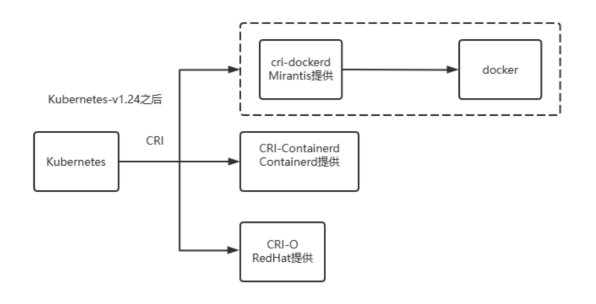
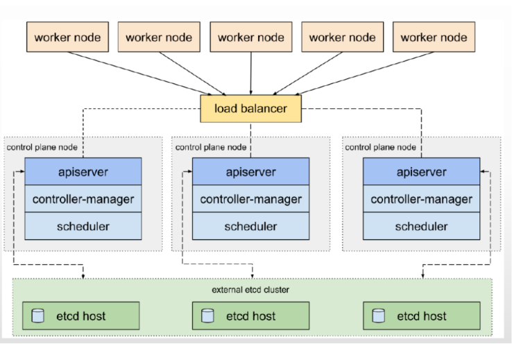

# 37、kubernetes架构和集群部署

## **云原生生态系统**

### **软件架构的演进**


- 单体架色：All in One

  传统架构，都部署在单机系统，一个项目一个工程：比如商品、订单、支付、库存、登录、注册等等，统一部署，一个进程

- MVC：

  JAVA开发中MVC是一种软件设计规范。是将业务逻辑、数据、显示分离的方法来组织代码。MVC主要作用是降低了视图与业务逻辑间的双向偶合。 即模型(Model)、视图(View)、控制器(Controller)的简写

  Python开发中MTV为Model-Template-View(模型-模板-视图）模式

  只是从开发者角度实现了模块化的独立开发，但运维角度还是单体

- RPC： Remote Procedure Call 

  将各个功能拆分为独立的服务和应用，以独立项目分别开发和部署

  各个服务和应用相关通过RPC方式调用

  远程过程调用解决远程调用服务的一种技术，使得调用者像调用本地服务一样方便透明

- SOA： Service Oriented Architecture

  各个服务之间通过**ESB(Enterprise Service Bus)**进行通信

  ESB是一个由大量规则和原则集成的软件架构，可以将一系列不同的应用程序集成到单个基础架构中

  此外ESB属于重量级产品，部署规划异常笨重

  ESB的单点依赖和商业ESB的费用问题反而成为了所有服务的瓶颈

- 微服务: microservices

  微服务架构风格是一种将单个应用程序拆分为多个极至微型的服务的方法

  每个服务都在自己的进程中运行并与轻量级机制（通常是 HTTP 资源 API）进行通信。

  这些服务围绕业务功能构建，并可通过全自动部署机制独立部署。

  对这些服务进行最低限度的集中管理，这些服务可能用不同的编程语言编写并使用不同的数据存储技术。

  开发者需要使用各种开发框架，比如调用 JAVA 的 spring cloud的 SDK 实现功能性和非功能性代码

  非业务性的基础功能仍然需要依赖开发者的能力实现

  传统 Spring Cloud 与 Kubernetes 提供的解决方案对比

  |          | kubernetes              | Spring cloud              |
  | -------- | ----------------------- | ------------------------- |
  | 弹性伸缩 | Autoscaling             | N/A                       |
  | 服务发现 | KubeDNS / CoreDNS       | Spring Cloud Eureka,Nacos |
  | 配置中心 | ConfigMap / Secret      | Spring Cloud Config       |
  | 服务网关 | Ingress Controller      | Spring Cloud Zuul         |
  | 负载均衡 | Load Balancer           | Spring Cloud Ribbon       |
  | 服务安全 | RBAC API                | Spring Cloud Security     |
  | 跟踪监控 | Metrics API / Dashboard | Spring Cloud Turbine      |
  | 降级熔断 | N/A                     | Spring Cloud Hystrix      |

  Kubernetes 成为容器战争胜利者标志着后微服务时代的开端，但 Kubernetes 仍然没有能够完美解决全部的分布式问题

  “不完美”是指，仅从功能上看，单纯的 Kubernetes 反而不如之前的 Spring Cloud 方案。

  这是因为有一些问题处于应用系统与基础设施的边缘，使得完全在基础设施层面中确实很难精细化地处理。

- 服务网格 service Mesh 

  将功能性和非功能代码彻底分离

  把原本程序员需要关注的安全策略、负载均衡。流量控制、路由选择等基础能力下沉到了底层组件边车代理模式”（Sidecar Proxy）中，并提供了自动恢复的能力，让开发人员只需关注业务本身即可

### **云计算**


**技术的发展带来的变迁**

- 基本构建单元的变迁

  应用构建单元的变迁过程：物理机 -> 虚拟机 -> Buildpacks -> 容器

- 隔离方式的变迁

  隔离方式从重量级变为轻量级，速度更快，尺寸更小

- 提供上的变迁

  服务商的变迁也实现了从闭源到开源，从单一开源服务上到多服务商提供服务的过程

**美国国家标准与技术研究院（NIST）定义：**

**云计算是一种按使用量付费的模式，这种模式提供可用的、便捷的、按需的网络访问， 进入可配置的计算资源共享池（资源包括网络，服务器，存储，应用软件，服务），这些资源能够被快速提供，只需投入很少的管理工作，或与服务供应商进行很少的交互**


IaaS（Infrastructure as a Service）：基础设施即服务

PaaS（Platform as a Service）：平台即服务

SaaS（Software as a Service）：软件即服务

| 服务类型 | 提供的内容                           | 用户的控制级别           | 适用用户/场景                                           |
| -------- | ------------------------------------ | ------------------------ | ------------------------------------------------------- |
| **IaaS** | 提供基础硬件资源（计算、存储、网络） | 用户负责操作系统和应用层 | 企业需要灵活的基础设施，如虚拟机和存储。                |
| **PaaS** | 提供开发和部署平台                   | 用户负责应用层           | 开发者希望专注于应用开发，无需管理基础设施。            |
| **SaaS** | 提供完整的软件应用                   | 用户仅使用软件           | 企业和个人需要现成的应用程序，如邮件、CRM、办公软件等。 |

### **CNCF和云原生**

#### CNCF

Cloud Native Computing Foundation，云原生计算基金会（以下简称CNCF）

官方网站: https://www.cncf.io/

**关于CNCF的使命主要包括以下三点：**

- 容器化包装
- 通过中心编排系统的动态资源管理
- 面向微服务

#### 云原生

云原生技术有利于各组织在公有云、私有云和混合云等新型动态环境中，构建和运行可弹性扩展的应用。

**云原生的代表技术包括:容器、服务网格、微服务、不可变基础设施和声明式API。**


#### **CNCF 项目分类**

```
应用开发和管理解决方案集合
 	Database
 	streaming & message
 	Application Definition & image build
 	Continuous Integration & Delivery
编排管理解决方案集合
 	Scheduling & Orchestration
 	Coordination & Service Discovery
 	Remote Procedure Call
 	Service Proxy
 	API Gateway
	Service Mesh
运行时解决方案集合
	Cloud Native Storage
 	Container Runtime
 	Cloud Native Network
基础功能解决方案集合
 	Automation & Configuration
 	Container Registry
 	Security & Compliance
 	Key Management
平台解决方案集合
 	Certified Kubernetes - Distribution
 	Certified Kubernetes - Hosted
 	Certified Kubernetes - Installer
 	PaaS/Container Service
检测和分析解决方案集合
 	Monitoring 
 	Logging
 	Tracing
 	Chaos Engineering
```

#### **CNCF项目成熟度分级**

成熟度级别（ Maturity Level）包括以下三种：

- sandbox 沙箱
- incubating 孵化
- graduated 毕业

CNCF各个项目成熟度查询链接: https://www.cncf.io/projects/

#### **CNCF路线图Trail Map**

步骤1: 容器化

```
方式：虽然容器化可以选择多种方式，一般仍以Docker为主要方式进行容器化。
类型：各种类型应用和依赖（甚至模拟器上运行的代码）都可以进行容器化，容器化的类型得到广泛的支持
演进：对于新的功能，可以进行应用的分割并将其进行微服务化
```

步骤2: CI/CD

```
容器化：创建持续集成CI与持续部署CD环境，从而使得代码的修改可以自动从源码进行容器化的构建和测试，
并可以部署至准生产或者生产环境。
自动化：创建可以用于自动部署、自动回滚和自动测试的方式
```

步骤3: 应用定义与编排

```
应用编排：Kubernetes作为容器化的应用编排的解决方案，在目前的市场上处于领先地位。
管理应用：Helm Charts能帮助使用者对复杂的Kubernetes应用进行定义、安装和升级。
CNCF项目：Kubernetes（已毕业）、HELM（孵化中,当前已毕业）
```

步骤4: 监控&分析

```
范围：解决方案应该包含监控、日志和追踪
工具：推荐的工具可以选择使用Prometheus进行监控和告警，Fluentd用于日志，而Jaeger则用于调用链的跟踪
兼容性：调用链跟踪建议选择诸如Jaeger那样对OpenTracing有兼容性的方案或者工具
CNCF项目：Prometheus（已毕业）、fluentd（孵化中，已毕业）、OPENTRACING（孵化中）、JAEGER（孵化中）
```

注意：步骤4开始为可选内容。

步骤5: 服务代理、服务发现和服务网格

```
服务发现：可以使用CoreDNS进行服务发现，兼具快速和灵活的特点。
服务网格：Envoy和Linkerd都能够提供服务网格的相关能力。
管理功能：提供健康检查、请求陆游以及负载均衡等常用功能。
CNCF项目：envoy（已毕业）、CoreDNS（已毕业）、LINKERD（孵化中）
```

步骤6: 网络&策略

```
网络兼容：为了能够更加灵活地对应网络需求，使用CNI兼容的网络解决方案诸如Calico、Flannel或者Weave Net等。
策略：OPA（Open Policy Agent）秉承着“策略即代码”的原则，完成了一个通用的策略引擎的基本功能，
可以帮助使用者控制策略和权限以保证合规性。
CNCF项目：CNI（孵化中）、Open Policy Agent（孵化中）
```

步骤7: 分布式数据库与存储

```
横向扩展性：当需要获取更多的弹性和横向扩展性时，相较于从单一数据库来获取信息，通过sharding的方式保证MySQL的横向扩展性，Vitess是一个不错的选择。
存储编排：通过集成多种Kubernetes的存储解决方案，可以使用提供了存储的编排方式的Rook进行管理。
数据存储：作为Kubernetes的“大脑”，etcd提供了在集群中以可靠的方式存储数据的能力。
KV存储：当需要key-value存储方案时，可以考虑使用TiKV，TiKV使用Rust编写的高性能的分布式事务级key-value解决方案。
CNCF项目：Vitess（孵化中）、ROOK（孵化中）、etcd（孵化中）、TiKV（孵化中）
```

步骤8: 流与消息处理

```
性能需求：当需要比JSON-RESt更高的性能时，gRPC或者NATS能够助你一臂之力。
通用框架：gRPC时一个通用的RPC框架。而NATS是一个包含了请求/大幅、发布/订阅和负载均衡队列的多模型消息系统。
CNCF项目：gRPC（孵化中）、NATS（孵化中）
```

步骤9: 镜像私库&运行环境

```
镜像私库：可以使用Harbor作为镜像私库进行存储以及对镜像的内容进行扫描。
运行环境：容器并非仅仅Docker一种，容器的运行环境更是如此，可以选择不同的容器运行环境，但需要注意选择具有OCI兼容性的的方案，比如containerd或者cri-o
CNCF项目：containerd（已孵化）、HABOR（孵化中）、cri-o（孵化中）
```

步骤10: 软件分发

```
安全性：TLS能够保护通信的安全，但是当服务器出现问题后，自然就会出现问题。而使用Notary可以解决这
一问题，是的软件的分发和更新更加安全。TUF项目则是Notary所基于的项目，也是针对软件分发和更新的安全性的解决方案。
CNCF项目：Notary（孵化中）、TUF（孵化中）
```

### **容器编排工具**

#### **Docker-Compose**

Docker-Compose 是一个单机版的容器编排工具,用来管理一个主机上的多个容器，即单个主机上容器管家

如果当主机上中有几十成百的容器,而且需要按一定的次序启动时，如果手动执行docker命令去一个一个的启动那将非常麻烦。利用 Docker-Compose后只需要编写一个文件，在这个文件里面声明好要启动的容器和次序，配置相关一些参数，最后只需要执行一下这个文件，Docker就会按照提前声明的配置去把所有的容器启动起来

但是Docker-Compose只能管理当前主机上的Docker容器，即不能去启动和管理其他主机上的Docker容器

#### **Docker Swarm**

Docker Swarm则是由Docker 公司自行研发的一款用来管理多主机上的Docker容器的工具

可以负责帮用户启动容器，监控容器状态，如果容器的状态不正常它自动重新启动一个新的容器，来提供服务，同时也提供服务之间的负载均衡，而这些功能是Docker-Compose 是无法实现的

Swarm 现在与Docker Engine完全集成，并使用标准API和网络。Swarm模式内置于Docker CLI中，无需额外安装，并且易于获取新的Swarm命令。

#### **Kubernetes**

Kubernetes就由Google的内部项目Borg发展而来，用go语言实现，后捐献给CNCF成为开源项目。

它本身的角色定位是和 Docker Swarm 是一样的，也是一个跨主机的容器管理平台。

Kubernetes当前已成为容器编排领域的领导者,甚至是行业标准

## **Kubernetes** **介绍和架构**

### Kubernetes介绍

Kubernetes其实源于希腊语意思（舵手，领航员）。由于名称长所以既不太好读也不太好写，因为首字母k和末尾字母s之间共有8个字母，经常简称为k8s

```
官网：https://kubernetes.io/
github：https://github.com/kubernetes/kubernetes
```

```
https://kubernetes.io/zh-cn/
https://kubernetes.io/zh-cn/docs/concepts/overview/#why-you-need-kubernetes-and-what-can-it-do
```

**[自动化上线和回滚](https://kubernetes.io/zh-cn/docs/concepts/workloads/controllers/deployment/)**

Kubernetes 会分步骤地将针对应用或其配置的更改上线，同时监视应用程序运行状况以确保你不会同时终止所有实例。如果出现问题，Kubernetes 会为你回滚所作更改。你应该充分利用不断成长的部署方案生态系统。

**[服务发现与负载均衡](https://kubernetes.io/zh-cn/docs/concepts/services-networking/service/)**

你无需修改应用来使用陌生的服务发现机制。Kubernetes 为每个 Pod 提供了自己的 IP 地址并为一组 Pod 提供一个 DNS 名称，并且可以在它们之间实现负载均衡。

[自我修复](https://kubernetes.io/zh-cn/docs/concepts/workloads/controllers/replicaset/#replicationcontroller-如何工作)

重新启动失败的容器，在节点死亡时替换并重新调度容器， 杀死不响应用户定义的健康检查的容器， 并且在它们准备好服务之前不会将它们公布给客户端。

**[存储编排](https://kubernetes.io/zh-cn/docs/concepts/storage/persistent-volumes/)**

自动挂载所选存储系统，包括本地存储、公有云提供商所提供的存储或者诸如 iSCSI 或 NFS 这类网络存储系统。

**[Secret 和配置管理](https://kubernetes.io/zh-cn/docs/concepts/configuration/secret/)**

部署和更新 Secret 和应用程序的配置而不必重新构建容器镜像， 且不必将软件堆栈配置中的秘密信息暴露出来。

**[自动装箱](https://kubernetes.io/zh-cn/docs/concepts/configuration/manage-resources-containers/)**

根据资源需求和其他限制自动放置容器，同时避免影响可用性。 将关键性的和尽力而为性质的工作负载进行混合放置，以提高资源利用率并节省更多资源。

**[批量执行](https://kubernetes.io/zh-cn/docs/concepts/workloads/controllers/job/)**

除了服务之外，Kubernetes 还可以管理你的批处理和 CI 工作负载，在期望时替换掉失效的容器。

[IPv4/IPv6 双协议栈](https://kubernetes.io/zh-cn/docs/concepts/services-networking/dual-stack/)

为 Pod 和 Service 分配 IPv4 和 IPv6 地址

[**水平扩缩**](https://kubernetes.io/zh-cn/docs/tasks/run-application/horizontal-pod-autoscale/)

使用一个简单的命令、一个 UI 或基于 CPU 使用情况自动对应用程序进行扩缩。

**[为扩展性设计](https://kubernetes.io/zh-cn/docs/concepts/extend-kubernetes/)**

无需更改上游源码即可扩展你的 Kubernetes 集群。


Kubernetes 为你提供：

- **服务发现和负载均衡**

  Kubernetes 可以使用 DNS 名称或自己的 IP 地址来暴露容器。 如果进入容器的流量很大， Kubernetes 可以负载均衡并分配网络流量，从而使部署稳定。

- **存储编排**

  Kubernetes 允许你自动挂载你选择的存储系统，例如本地存储、公共云提供商等。

- **自动部署和回滚**

  你可以使用 Kubernetes 描述已部署容器的所需状态， 它可以以受控的速率将实际状态更改为期望状态。 例如，你可以自动化 Kubernetes 来为你的部署创建新容器， 删除现有容器并将它们的所有资源用于新容器。

- **自动完成装箱计算**

  你为 Kubernetes 提供许多节点组成的集群，在这个集群上运行容器化的任务。 你告诉 Kubernetes 每个容器需要多少 CPU 和内存 (RAM)。 Kubernetes 可以将这些容器按实际情况调度到你的节点上，以最佳方式利用你的资源。

- **自我修复**

  Kubernetes 将重新启动失败的容器、替换容器、杀死不响应用户定义的运行状况检查的容器， 并且在准备好服务之前不将其通告给客户端。

- **密钥与配置管理**

  Kubernetes 允许你存储和管理敏感信息，例如密码、OAuth 令牌和 SSH 密钥。 你可以在不重建容器镜像的情况下部署和更新密钥和应用程序配置，也无需在堆栈配置中暴露密钥。

- **批处理执行** 除了服务外，Kubernetes 还可以管理你的批处理和 CI（持续集成）工作负载，如有需要，可以替换失败的容器。
- **水平扩缩** 使用简单的命令、用户界面或根据 CPU 使用率自动对你的应用进行扩缩。
- **IPv4/IPv6 双栈** 为 Pod（容器组）和 Service（服务）分配 IPv4 和 IPv6 地址。
- **为可扩展性设计** 在不改变上游源代码的情况下为你的 Kubernetes 集群添加功能。


### **Kubernetes** **架构**


Kubernetes 是一个分布式系统,是由很多主机节点组成,且各个节点的分工不同

**Kubernetes 的主机节点主要有两种类型**

- **Master节点**:

  管理(控制)节点,相当于公司的管理层

  Master 节点主要由 API Server 、Controller-Manager 和Scheduler 三个组件，以及一个用于存储集群状态的 Etcd存储服务组成

- **Node节点**: 

  也称为工作worker节点或者Minion节点,相当于公司具体完成工作的基层员工

  Node节点则主要包含 Kubelet 、Kube Proxy 及容器运行时（ 当前docker 仍是最为常用的实现）三个组件，它们承载运行各类应用容器

**Kubernetes的节点运行逻辑**

- Kubernetes将所有worker工作节点的资源集结在一起形成一台逻辑的更加强大的“服务器”
- 计算和存储接口通过Master之上的API Server暴露
- 客户端通过API提交应用程序的运行请求，而后由Master通过调度算法将其自动指派至某特定的工作节点以Pod对象的形式运行
- Master会自动处理因工作节点的添加、故障或移除等变动对Pod的影响


### **Kubernetes** **组件**

```
https://kubernetes.io/zh/docs/concepts/overview/components/
```


**kubernetes组件分成三种**

Control Plane Components 控制平台组件

Node Components 节点组件

Addons 附件（插件）


```powershell
k8s分布式微服务架构 tls 证书 CA 三套CA
1 管理节点 master节点 control plane
api server
scheduler
controller manager
etcd

2 被管理节点：工作节点 worker / node 节点
kubelet
kube-proxy
container run time: docker containerd cri-o 


3 第三方：插件、附件
网络插件：flannel ,calico,cilium 
域名解析DNS： coredns

存储插件
dashboard 图形管理平台
监控： Prometheus 
```


### **控制平面组件**

控制平面的组件做出有关集群的全局决策（例如，调度），以及检测和响应集群事件（例如，当部署的replicas 无法达到要求时，自动启动新的Pod）。Control Plane组件可以在群集中的任何计算机上运行。但是，为简单起见，通常在同一台计算机上启动所有Control Plane组件，并且不在该计算机上运行用户容器。

#### **kube-apiserver**

Kubernetes API server 是整个集群的访问入口, 为 API 对象验证并配置数据，包括 pods、 services、replication controllers和其它 api 对象 ,API Server 提供 REST 操作和到集群共享状态的前端，所有其他组件通过它进行交互

API server 对应的程序为**kube-apiserver**,利用6443/tcp对外提供服务

API server 相当于公司的前台接待,是整个Kubernetes集群的唯一入口

客户端和API Server需要通过基于 https 协议连接,如果使用前端使用LB, 需要使用四层负载均衡

注意: API Server 本身无状态,集群数据存储在ETCD中

#### **kube-controller-manager**

Controller Manager作为集群内部的管理控制中心，负责集群内的 NodeNode、PodPod副本、服务端点（ Endpoint）、命名空间（Namespace）、 服务账号（ tServiceAccount）、资源定额（ResourceQuota）的管理，当某个 Node异常宕机时， Controller Manager会及时发现并执行自动化修复流程，确保kubernetes集群尽可以处于预期的工作状态。

Controller Manager 负责实现客户端通过API提交的终态声明，由相关代码通过一系列步骤驱动API对象的“实际状态”接近或等同“期望状态”

Controller Manager 对应的程序为**kube-controller-manager**

Kubernetes 控制器管理器是一个守护进程，内嵌随 Kubernetes 一起发布的核心控制回路。 在机器人和自动化的应用中，控制回路是一个永不休止的循环，用于调节系统状态。 在 Kubernetes 中，每个控制器是一个控制回路，通过 API 服务器监视集群的共享状态， 并尝试进行更改以将当前状态转为期望状态。 目前，Kubernetes 自带的控制器例子包括副本控制器、节点控制器、命名空间控制器和服务账号控制器等。

Controller Manager 相当于公司的管理层或大管家,负责管理kubernetes所有资源


#### **kube-scheduler**

kube-scheduler 调度器，负责为Pod挑选出评估这一时刻相应的最合适的运行节点

kube-scheduler 对应的程序为 **kube-scheduler**

kube-scheduler 相当于公交系统的调度室,负责分配工作给相应的worker节点

**调度程序如何分配这些Pod？**

调度程序会查看每个 Pod，并尝试为其找到最佳节点。例如


在上图中，Pod 具有 CPU 和内存要求。调度程序将经历 2 个阶段来确定 Pod 的最佳节点。

**在第一阶段，调度程序尝试筛选出不符合此** **Pod** **要求的节点。**

例如，没有 Pod 请求的足够 CPU 和内存资源的节点。因此，前 2 个小节点被过滤掉。


因此，我们现在只剩下 2 个节点，可以放置 pod。现在，调度程序如何从 2 个节点中选择一个节点。

**在第二阶段,调度程序尝试筛选出符合此Pod要求的最优节点**

Kube 调度程序对节点进行排名，以确定最适合 Pod 的节点。它使用优先级函数将分数分配给节点，范围为 0 到 10。

例如，调度程序计算放置 Pod 后节点上可用的资源数。


在这种情况下，第 3 个节点将有 2 个 CPU，第 4 个节点有 6 个可用 CPU。因此，与第3个节点相比，第4个节点的排名更好。现在 Kube 调度程序会将 pod 放在第 4 个节点中。


我们可以自定义 Kube 调度程序。您也可以编写自己的计划程序。

#### **Cluster Store (etcd)**

Kubernetes 需要使用 key/value数据存储系统 Clustrer Store， 用于保存所有集群状态数据， 支持分布式集群功能

通常为奇数个节点实现,如3,5,7等,通过节点间通过 raft 协议进行选举

Kubernetes 当前使用etcd来实现集群数据存储功能,生产环境使用时需要为 etcd数据提供定期备份机制。

etcd 由CoreOS公司用GO语言开发,仅会同API Server交互

etcd 对应的程序为 **etcd**

Etcd 硬件要求

```
https://etcd.io/docs/v3.5/op-guide/hardware/
```


#### **cloud-controller-manager (可选)**

cloud-controller-manager运行与基础云提供商交互的控制器。

cloud-controller-manager二进制文件是Kubernetes 1.6版中引入的alpha功能。

cloud-controller-manager允许云供应商的代码和Kubernetes代码彼此独立地发展。在以前的版本中，核心的Kubernetes代码依赖于特定于云提供商的代码来实现功能。在将来的版本中，云供应商专用的代码应由云供应商自己维护，并在运行Kubernetes时链接到云控制器管理器。

以下控制器具有云提供程序依赖性：

节点控制器：用于检查云提供程序以确定节点停止响应后是否已在云中删除该节点

路由控制器：用于在基础云基础架构中设置路由

服务控制器：用于创建，更新和删除云提供商负载平衡器

卷控制器：用于创建，附加和安装卷，以及与云提供商交互以编排卷


****

#### **1. API Server**

##### **作用：**

Kubernetes 的 **API Server** 是集群的 **入口点**，所有的操作（无论是对集群资源的查询、创建、更新还是删除）都会通过 API Server 来执行。它提供了一组 RESTful API，用于与 Kubernetes 集群交互。

##### **主要功能：**

- 接受来自用户（例如 `kubectl` 或客户端）和其他 Kubernetes 组件的请求。
- 处理对集群资源的所有操作（如 Pods、Services、Deployments 等）并将这些操作存储在 **etcd** 中。
- API Server 通过 **认证、授权、准入控制和操作管理**，确保请求合法且安全。
- API Server 作为 **Master 节点**的一部分，负责与 **controller manager**、**scheduler** 和其他组件进行通信。

##### **相关概念：**

- **Kube-API**：Kubernetes 提供的 API 接口，所有操作都通过这些 API 进行。
- **kubectl**：与 API Server 通信的命令行工具，用户通过它与 Kubernetes 集群交互。

------

#### **2. Scheduler**

##### **作用：**

Kubernetes **Scheduler** 负责为集群中的 **Pod** 分配合适的 **Node**（节点）。它根据多个因素（如资源要求、节点资源情况、调度策略等）来决定将 Pod 调度到哪个 Node 上运行。

##### **主要功能：**

- **选择合适的 Node**：根据 Pod 的资源需求（CPU、内存等）以及节点的负载情况选择最合适的节点。
- **调度策略**：可以根据 Pod 的调度策略进行调度（例如亲和性、污点和容忍度、资源限制等）。
- **预留资源**：确保调度的 Pod 不会超出节点的资源容量。

##### **调度流程：**

1. **监听 API Server**：Scheduler 会监听 API Server 上未分配 Node 的 Pods（称为待调度 Pod）。
2. **选择合适的 Node**：根据集群的资源状态选择一个合适的 Node。
3. **更新 Pod**：Scheduler 将选择的 Node 信息写入 Pod 的 spec 中，Pod 便会开始在该 Node 上运行。

------

#### **3. Controller Manager**

##### **作用：**

**Controller Manager** 负责管理 Kubernetes 控制循环（control loops），例如维护 Pod、副本、服务等的状态。它不断地检测集群的当前状态，并确保资源的状态符合预期。

##### **主要功能：**

- 控制器：Kubernetes 包含多种控制器，如：
  - **Deployment Controller**：确保部署的 Pod 副本数符合期望。
  - **ReplicaSet Controller**：确保 Pod 副本集的副本数符合预期。
  - **StatefulSet Controller**：管理 StatefulSet 的 Pod。
  - **Job Controller**：确保 Job 的 Pod 完成。
  - **Node Controller**：处理节点的生命周期和健康状态。
  - **Service Controller**：管理服务的创建、删除和更新。
- **维护资源的期望状态**：例如，当某个 Pod 宕机时，Deployment Controller 会创建新的 Pod 来替代它。

##### **控制器作用**：

- 确保集群中的资源（如 Pods、Nodes、Deployments 等）始终保持在所需的状态，自动修复不符合要求的状态。
- 自动执行某些常见操作，如 Pod 失败时重启，或在 Node 故障时迁移 Pod。

------

#### **4. etcd**

##### **作用：**

**etcd** 是一个强一致性的分布式键值存储数据库，Kubernetes 使用它作为 **集群数据的存储后端**。它存储着 Kubernetes 的所有集群状态信息，包括 **Pod、Service、ConfigMap、Secrets 等资源的状态**。

##### **主要功能：**

- **存储集群的状态信息**：etcd 存储了集群所有资源对象的状态，并且这些状态会在集群中发生变化时实时更新。
- **持久化存储**：当集群中的资源发生更改时，API Server 会将更改同步到 etcd 中，这样即使集群重启，之前的状态也可以恢复。
- **高可用性和一致性**：etcd 提供强一致性保证，确保所有集群成员都能够读取到一致的数据状态。

##### **应用场景：**

- 存储集群的所有配置数据和状态。
- 在集群管理和调度时提供所需的配置信息。
- 支持高可用性部署和容错功能，确保数据的可靠性。

****

#### 总结

| 组件                   | 主要功能                                                     | 相关依赖                         |
| ---------------------- | ------------------------------------------------------------ | -------------------------------- |
| **API Server**         | 提供 RESTful API 接口，处理集群资源的操作，作为集群的管理入口。 | 所有组件都需要与 API Server 通信 |
| **Scheduler**          | 负责将 Pod 调度到合适的 Node 上。                            | 依赖 API Server 提供的 Pod 信息  |
| **Controller Manager** | 管理集群中各种控制器，确保资源的实际状态符合期望的目标状态。 | 依赖 API Server 提供的资源信息   |
| **etcd**               | 存储集群的所有配置信息和状态数据，提供持久化存储。           | 由 API Server 访问和更新         |

****


### **节点组件(工作平面组件)**


节点组件在每个worker节点上运行，维护运行中的Pod，并提供Kubernetes运行时环境。

#### **kubelet**


kubelet是运行worker节点的集群代理

它会监视已分配给worker 节点的 pod,主要负责监听节点上 Pod的状态,同时负责上报节点和节点上面Pod的状态

负责与Master节点通信，并管理节点上面的Pod。

具体功能如下：

- 向 master 节点报告 node 节点的状态
- 接受master的指令并在 Pod 中创建容器
- 在 node 节点执行容器的健康性检查
- 返回 Pod 运行状态
- 准备 Pod 所需的数据卷

kubelet 支持三个主要标准接口

- CRI: Container Runtime Interface, 当前使用 Containerd 实现容器管理
- CNI: Container Network Interface,Network Plugin通过此接口提供Pod 网络功能
- CSI: Container Storage Interface, 提供存储服务标准接口

kubelet 对应的程序为**kubelet**

#### **kube-proxy**

kube-proxy 是运行在每个 node 上的集群的网络代理，通过在主机上维护网络规则并执行连接转发来实现 Kubernetes 服务访问 。

kube-proxy 专用于负责将Service资源的定义转为node本地的实现,是打通Pod网络在Service网络的关键所在

Kube-proxy 即负责Pod之间的通信和负载均衡，将指定的流量分发到后端正确的机器

有两种模式实现

- iptables模式：将Service资源的定义转为适配当前节点视角的iptables规则
- ipvs模式：将Service资源的定义转为适配当前节点视角的ipvs和少量iptables规则

查看当前的模式

```
[root@master1 ~]#curl 127.0.0.1:10249/proxyMode
iptables
```

#### **Container Runtime**

容器运行时是负责运行容器的软件

Kubernetes支持几种容器运行时：Docker， containerd，CRI-O专为Kubernetes以及Kubernetes CRI（容器运行时接口）的任何实现而设计的轻量级容器运行时


------

#### **1. Kubelet**

##### **作用：**

**kubelet** 是每个节点上的 **主要代理**，它负责确保 **Pod** 和 **容器** 在节点上按预期运行。kubelet 会与 API Server 通信，并根据集群的状态执行操作，确保每个节点上的容器始终处于 **期望的状态**。

##### **主要功能：**

- **管理 Pod 生命周期**：kubelet 确保在每个节点上运行的 Pod 达到所需状态。如果容器失败，它会尝试重新启动容器，确保容器在节点上的健康。
- **容器运行时的管理**：kubelet 与容器运行时（如 Docker、containerd、CRI-O）交互，确保容器被正确启动和停止。
- **健康检查**：kubelet 会定期执行健康检查，检查容器和 Pod 的状态。如果 Pod 或容器不健康，它会报告给 API Server。
- **与 API Server 通信**：kubelet 定期向 API Server 更新节点状态和 Pod 状态，确保集群的状态是一致的。

##### **工作流程：**

1. **kubelet 与 API Server 通信**：kubelet 从 API Server 获取待调度的 Pods，并根据 Pod 的规格启动容器。
2. **监控容器状态**：kubelet 监控容器的运行状态，如果容器崩溃或失败，它会根据设定的重启策略进行容器重启。
3. **健康检查**：kubelet 执行容器和 Pod 的健康检查，如 Liveness Probes、Readiness Probes。

##### **相关依赖：**

- 需要与 **API Server**、**容器运行时** 和 **kube-proxy** 协作，保持节点和容器的状态同步。

------

#### **2. Kube-Proxy**

##### **作用：**

**kube-proxy** 是 Kubernetes 集群中的网络代理，它运行在每个节点上，负责实现 Kubernetes 中的 **Service 代理**功能。它通过管理节点上的网络规则来控制流量的路由和负载均衡，确保服务能够按预期正常访问。

##### **主要功能：**

- **服务发现和负载均衡**：kube-proxy 确保集群内的服务能够正确路由流量，并进行负载均衡。它通过管理 iptables 或 ipvs（基于不同的代理模式）来实现这一功能。

- **流量转发**：当客户端请求某个 Service 时，kube-proxy 会根据服务的 IP 和端口将请求路由到正确的 Pod（后端容器）。

- 支持多种代理模式

  ：

  - **iptables 模式**：通过 iptables 规则来实现流量转发和负载均衡。
  - **ipvs 模式**：基于 Linux 内核的 IPVS (IP Virtual Server)，更高效地进行负载均衡。

##### **工作流程：**

1. **服务发现**：kube-proxy 监听 Kubernetes API Server 中关于 Service 和 Endpoint 的信息。
2. **流量路由**：当请求到达 Service IP 时，kube-proxy 会根据已定义的规则，将流量路由到实际的 Pod。

##### **相关依赖：**

- 依赖 **API Server** 来获取 Service 和 Endpoint 信息。
- 与 **容器网络插件** 配合，确保 Pod 网络的正确性和通信。

------

#### **3. 容器运行时 (Container Runtime)**

##### **作用：**

容器运行时是 Kubernetes 集群中的 **底层组件**，它负责实际的容器创建、运行和管理。Kubernetes 不直接运行容器，而是通过容器运行时来执行容器化应用。

##### **主要功能：**

- **创建和管理容器**：容器运行时负责从镜像创建容器并启动它们。它提供了容器的基本功能，如启动、停止、删除容器。
- **镜像管理**：容器运行时也管理容器镜像的拉取、推送和存储。
- **与 kubelet 协作**：kubelet 与容器运行时通信，确保容器被正确启动、停止和健康检查。
- **支持不同的容器标准**：Kubernetes 通过 **Container Runtime Interface (CRI)** 与容器运行时进行交互。常见的容器运行时包括 Docker、containerd 和 CRI-O。

##### **常见的容器运行时：**

- **Docker**：最早的、最广泛使用的容器运行时，虽然 Kubernetes 未来会逐步弃用 Docker，但 Docker 仍然是许多环境中的默认选择。
- **containerd**：一个高效的容器运行时，专注于容器生命周期管理，Kubernetes 官方推荐使用它作为容器运行时。
- **CRI-O**：Kubernetes 官方支持的容器运行时，专为 Kubernetes 设计，符合 CRI 标准。

##### **工作流程：**

1. **容器镜像拉取**：容器运行时通过镜像仓库拉取镜像。
2. **容器启动**：运行时启动容器并为其分配资源。
3. **容器生命周期管理**：容器运行时负责容器的生命周期管理，包括健康检查、资源限制等。

##### **相关依赖：**

- 依赖 **kubelet** 来启动和管理容器。
- 使用 **Container Runtime Interface (CRI)** 与 kubelet 进行通信，确保容器运行和管理。


#### **总结**

| 组件           | 主要功能                                               | 相关依赖                     |
| -------------- | ------------------------------------------------------ | ---------------------------- |
| **kubelet**    | 管理节点上的 Pod 和容器，确保容器按预期运行。          | 依赖 API Server 和容器运行时 |
| **kube-proxy** | 提供服务负载均衡和网络代理，将请求路由到后端的 Pod。   | 依赖 API Server 和网络插件   |
| **容器运行时** | 管理容器的生命周期，负责容器的创建、启动、停止等操作。 | 与 kubelet 交互，支持 CRI    |


### **附件** **Addons**

插件负责扩展Kubernetes集群的功能的应用程序，通常以Pod形式托管运行于Kubernetes集群之上

插件使用Kubernetes资源来实现集群功能。因为它们提供了集群级功能，所以插件的命名空间资源属于kube-system命名空间。

以下 Network 和DNS 插件是必选插件,其余是可选的重要插件

#### **Network** **附件**

网络插件，经由CNI(Container Network Interface)接口，负责为Pod提供专用的通信网络

当前网络插件有多种实现,目前常用的CNI网络插件有calico和flannel

**DNS** **域名解析**

虽然并非严格要求其他附加组件，但是所有Kubernetes群集都应具有群集DNS，因为许多示例都依赖它。

除了传统IT环境中的DNS服务器之外，Kubernetes集群DNS 也是一个专用DNS服务器，它为Kubernetes服务提供DNS记录。

由Kubernetes启动的容器会在其DNS搜索中自动包括此DNS服务器，目前常用DNS应用：CoreDNS，kube-dns

#### **外网入口**

为服务提供外网入口，如：Ingress Controller，nginx，Contour等

#### **Web UI（Dashboard）**

Dashboard仪表板是Kubernetes集群的通用基于Web的UI。它允许用户管理集群中运行的应用程序以及集群本身并进行故障排除

#### **Container Resource Monitoring** **容器资源监控**

容器资源监视在中央数据库中记录有关容器的一般时间序列指标，并提供用于浏览该数据的用户界面UI。

常用的监控系统: Prometheus

#### **Cluster-level Logging** **集群级日志**

一个集群级别的日志记录机制是负责保存容器日志到提供有搜索和浏览接口的中央日志存储，如：Fluentd-elasticsearch,PLG等

#### **负载均衡器**

OpenELB 是适用于非云端部署的Kubernetes环境的负载均衡器，可利用BGP和ECMP协议达到性能最优和高可用性


### **Kubernetes** **组件间安全通信**


Kubernetes集群中有三套CA机制

- etcd-ca ETCD集群内部的 TLS 通信
- kubernetes-ca kubernetes集群内部节点间的双向 TLS 通信
- front-proxy-ca Kubernetes集群与外部扩展服务简单双向 TLS 通信


### **Kubernetes** **相关术语**

#### **Pod**


Pod是其运行应用及应用调度的最小逻辑单元

本质上是共享Network、IPC和UTS名称空间以及存储资源的容器集

可将其想象成一台物理机或虚拟机，各容器就是该主机上的进程

各容器共享网络协议栈、网络设备、路由、IP地址和端口等，但Mount、PID和USER仍隔离

每个Pod上还可附加一个存储卷（Volume）作为该主机的外部存储，独立于Pod的生命周期，可由Pod内的各容器共享

模拟“不可变基础设施”，删除后可通过资源清单重建

具有动态性，可容忍误删除或主机故障等异常

存储卷可以确保数据能超越Pod的生命周期

在设计上，仅应该将具有“超亲密”关系的应用分别以不同容器的形式运行于同一Pod内部


#### **Service**


Pod具有动态性，其IP地址也会在基于配置清单重构后重新进行分配，因而需要服务发现机制的支撑

Kubernetes使用Service资源和DNS服务（CoreDNS）进行服务发现

Service能够为一组提供了相同服务的Pod提供负载均衡机制，其IP地址（Service IP，也称为Cluster IP）即为客户端流量入口

一个Service对象存在于集群中的各节点之上，不会因个别节点故障而丢失，可为Pod提供固定的前端入口

Service使用标签选择器（Label Selector）筛选并匹配Pod对象上的标签（Label），从而发现Pod仅具有符合其标签选择器筛选条件的标签的Pod才可

由Service对象作为后端端点使用

#### **Workloads**


Pod虽然是运行应用的原子单元，并不需要我们直接管理每个 Pod。

可以使用负载资源 workload resources 来替你管理一组 Pods。 这些资源配置 控制器 来确保合适类型的、处于运行状态的 Pod 个数是正确的，与你所指定的状态相一致。

其生命周期管理和健康状态监测由kubelet负责完成，而诸如更新、扩缩容和重建等应用编排功能需要由专用的控制器实现，这类控制器即工作负载型控制器

Kubernetes 提供若干种内置的工作负载资源：

- ReplicaSet和Deployment
- DaemonSet
- StatefulSet
- Job和CronJob

工作负载型控制器也通过标签选择器筛选Pod标签从而完成关联

工作负载型控制器的主要功能

- 确保选定的Pod精确符合期望的数量,数量不足时依据Pod模板创建，超出时销毁多余的对象
- 按配置定义进行扩容和缩容
- 依照策略和配置进行应用更新

在 Kubernetes 中，**Workloads**（工作负载）是指运行在集群中的应用程序的控制和管理机制。它们定义了 Kubernetes 如何安排、调度、扩展和管理容器化应用。通过 Workloads，用户可以以声明性方式管理应用程序的生命周期。


#### **常见的 Kubernetes Workloads：**

##### **1. Pod**

**Pod** 是 Kubernetes 中最小的调度单位，一个 Pod 代表一个或多个容器的集合。通常，一个 Pod 中只会运行一个容器，但也可以运行多个紧密关联的容器，这些容器共享存储、网络和其他资源。

- **Pod 的特点**：
  - 每个 Pod 中的容器共享一个网络命名空间、存储卷等资源。
  - 当 Pod 中的容器失败时，Kubernetes 可以重启该 Pod，确保容器的健康。
  - Pod 可以水平扩展，即创建多个副本来满足负载需求。
- **使用场景**：
  - 当你需要运行单一应用的容器时，Pod 是最基础的工作负载。
  - 如果你需要运行多个容器并且它们之间需要共享资源和网络，Pod 也是合适的选择。

##### **2. ReplicaSet**

**ReplicaSet** 是用于确保指定数量的 Pod 副本在集群中运行的控制器。如果 Pod 发生故障或被删除，ReplicaSet 会自动创建新的 Pod 来恢复到期望的副本数。

- **ReplicaSet 的特点**：
  - 主要功能是 **保证 Pod 副本数**，确保始终有指定数量的 Pod 在运行。
  - 是 **Deployment** 的基础组件，通常不会单独使用，而是通过 **Deployment** 来管理。
- **使用场景**：
  - 确保高可用性，避免单点故障，ReplicaSet 自动扩缩容来维护集群的稳定性。

##### **3. Deployment**

**Deployment** 是 Kubernetes 中最常用的工作负载类型之一，它基于 ReplicaSet，负责管理 **Pod 的副本**，并提供 **无中断部署**、**回滚**、**版本管理**等功能。

- Deployment 的特点：
  - 支持 **滚动更新**，可以将新版本的应用逐步替换旧版本，而不影响应用的可用性。
  - 支持 **回滚**，如果新版本出现问题，可以迅速回滚到上一个稳定版本。
  - 管理 **Pod 的副本数**，通过 ReplicaSet 确保 Pods 的数量满足需求。
- 使用场景：
  - 适用于 **无状态应用**，如 Web 服务、API 服务等，确保应用的 **可扩展性** 和 **高可用性**。

##### **4. StatefulSet**

**StatefulSet** 是为有状态应用（如数据库、分布式缓存等）设计的工作负载类型，能够管理 **Pod 的稳定标识**、**有序部署和滚动更新**。

- **StatefulSet 的特点**：
  - 提供 **持久化存储**：每个 Pod 可以有一个独立的持久化存储卷，Pod 被销毁后，数据不会丢失。
  - 保证 **Pod 的顺序部署和滚动更新**，例如，Pod 会按顺序启动和终止。
  - 每个 Pod 会有一个 **稳定的网络标识**（DNS 名称），方便有状态应用使用。
- **使用场景**：
  - 适用于需要 **稳定身份和持久存储** 的应用，如 **数据库、消息队列、分布式存储**。

##### **5. DaemonSet**

**DaemonSet** 确保 **每个 Node** 上运行一个 Pod 副本。这在需要确保集群中的每个 Node 都运行某些特定任务时非常有用。

- **DaemonSet 的特点**：
  - 每个节点都会运行一个 Pod，可以确保集群中每个节点都能够处理特定的任务。
  - 适用于 **日志收集**、**监控代理**、**网络代理** 等场景。
  - 如果新节点加入集群，DaemonSet 会自动在新节点上启动一个 Pod。
- **使用场景**：
  - 部署 **集群级别的代理** 或 **监控工具**，如 **Fluentd**、**Prometheus Node Exporter** 等。

##### **6. Job**

**Job** 是用于批处理作业的工作负载。Job 确保指定数量的 Pod 完成某个任务，并在任务完成后终止。

- **Job 的特点**：
  - 确保任务的 **执行成功**，如果 Pod 执行失败，Job 会重新创建 Pod 来重新执行任务。
  - 支持并发执行多个 Pod，以加快任务完成。
  - 适用于一次性任务，如数据迁移、批量处理等。
- **使用场景**：
  - 适用于 **批处理任务**，如定时任务、数据备份、数据导入等。

##### **7. CronJob**

**CronJob** 是 Job 的扩展，支持 **定时任务**。CronJob 会按照指定的时间表定期执行任务。

- **CronJob 的特点**：
  - 类似于 Linux 中的 cron，可以设置定时任务，按指定时间运行 Job。
  - 支持定期执行 **批处理任务**，如每天、每小时、每月执行某些操作。
- **使用场景**：
  - 定期执行 **数据库备份**、**日志清理**、**定时任务** 等。

------

##### **总结：**

| 工作负载类型    | 主要功能                                             | 使用场景                            |
| --------------- | ---------------------------------------------------- | ----------------------------------- |
| **Pod**         | Kubernetes 中最小的调度单位，管理一个或多个容器。    | 单一应用或共享资源的容器。          |
| **ReplicaSet**  | 确保指定数量的 Pod 副本运行，维护 Pod 副本数。       | 确保应用高可用性，自动扩容和容错。  |
| **Deployment**  | 管理无状态应用的副本，支持滚动更新和回滚。           | 无状态应用，如 Web 服务、API 服务。 |
| **StatefulSet** | 管理有状态应用，提供持久化存储、稳定身份和顺序部署。 | 数据库、分布式存储、消息队列等。    |
| **DaemonSet**   | 确保每个节点上运行一个 Pod，适用于节点级别的任务。   | 集群级别代理，如日志收集、监控等。  |
| **Job**         | 用于一次性任务，确保任务成功完成并终止。             | 批处理任务，如数据迁移、备份等。    |
| **CronJob**     | 定期执行任务，类似 Linux 中的 cron。                 | 定时任务，如定期备份、日志清理等。  |

### **Network Model**


- Kubernetes集群上默认会存在三个分别用于Node、Pod和Service的网络
- 三个网络 于worker节点上完成交汇
- 由node内核中的路由模块，以及iptables/netfilter和ipvs等完成网络间的流量转发
- 安装Kubernetes时,需要分别指定三个网络的网段地址

**三个网络功能**

- 节点网络

  集群节点间的通信网络，并负责打通与集群外部端点间的通信

  节点网络的IP地址配置在集群节点主机的物理接口上

  网络及各节点地址需要于Kubernetes部署前完成配置，非由Kubernetes管理

  因而，需要由**管理员或借助于主机虚拟化管理程序实现**

- Pod网络

  为集群上的Pod对象提供的网络

  Pod网络 IP地址配置在Pod的虚拟网络接口上

  每个pod 从此网络动态获取地址,且每次重启pod后IP地址可能会变化

  虚拟网络，需要经**由CNI网络插件实现**，例如Flannel、Calico、Cilium等

  **使用某此CNI插件也可以支持和节点网络使用相同的网络**

- Service网络

  主要用于解决 pod 使用动态地址问题

  在部署Kubernetes集群时指定，各Service对象使用的地址将从该网络中分配

  Service网络的IP地址并不配置在任何物理接口,而是存在于每个节点内核中其相关的iptables或ipvs规则中

  **由Kubernetes集群自行管理**

```
1 主机网络，网络运维管理
2 容器网络，CNI 组件提供 flannel ,calico,cilium 
3 service 网络 kube-proxy
```

#### **1. 容器网络（Pod 网络）**

##### **作用：**

容器网络，也称为 **Pod 网络**，是 Kubernetes 中最基础的网络层，负责 **Pod 内部和 Pod 之间的通信**。

- 每个 Pod 都有一个独立的 **IP 地址**，即使同一个 Node 上的不同 Pod 也有不同的 IP 地址。
- Kubernetes 要求 **Pod 之间可以直接通信**，无论它们是否位于同一 Node 上。
- Pod 网络支持 **跨节点通信**，这意味着一个 Node 上的 Pod 可以和另一个 Node 上的 Pod 直接通信，而无需经过 NAT 转换。

##### **主要特点：**

- **每个 Pod 一个 IP 地址**：Kubernetes 要求每个 Pod 都有一个唯一的 IP 地址，这样容器可以像普通主机一样进行通信。
- **跨节点通信**：Pod 能够直接和其他 Node 上的 Pod 通信，Kubernetes 不要求使用代理或 NAT。
- **Overlay 网络**：通常，Kubernetes 使用 Overlay 网络（例如 Flannel、Calico、Weave）来实现跨节点的 Pod 网络通信。

##### **常见的网络插件：**

- **Flannel**：简化网络配置，支持不同的网络后端（例如 VXLAN、host-gw）。
- **Calico**：提供高级网络功能，如网络策略、安全性和高性能。
- **Weave**：一个简单的网络解决方案，支持自动化的网络发现。

------

#### **2. 服务网络（Service 网络）**

##### **作用：**

**Service 网络**用于提供对一组 Pod 的 **抽象访问**，无论这些 Pod 实际运行在哪个节点上。Service 通过为一组 Pod 提供统一的虚拟 IP 地址和端口来进行负载均衡。

- Service 的目标是为 Pod 提供 **负载均衡**，将请求分发到同一个 **Service** 下的多个 Pod。
- Kubernetes 通过一个虚拟 IP 地址（ClusterIP）来暴露 Service，而 Service 后面可以有多个 Pod 实际承载服务。

##### **主要特点：**

- **ClusterIP**：默认的服务类型，提供集群内部的虚拟 IP 地址，使集群内的服务可以通过这个 IP 地址访问。
- **DNS 解析**：Kubernetes 自动为每个 Service 提供 DNS 名称，可以通过 DNS 进行访问。
- **负载均衡**：Service 会在多个 Pod 之间进行负载均衡，确保请求均匀分配。

##### **常见的 Service 类型：**

- **ClusterIP**：默认类型，仅在集群内部可访问。
- **NodePort**：暴露端口，让外部流量通过节点的指定端口访问 Service。
- **LoadBalancer**：将流量通过外部负载均衡器引入集群，适用于云平台。
- **ExternalName**：通过 CNAME 将外部服务映射到 Kubernetes 内部。

------

#### **3. 外部网络（外部访问）**

##### **作用：**

**外部网络**指的是 **Pod**、**Service** 等资源如何从集群外部访问，或集群外部的资源如何访问集群中的服务。

- Kubernetes 通过 **Ingress** 和 **NodePort** 等方式来实现集群与外部的通信。
- 这种通信通常需要对集群进行 **暴露**，即通过特定的网络配置将集群内部的服务暴露给外部客户端或用户。

##### **主要特点：**

- **NodePort**：通过节点的固定端口暴露 Service，允许外部流量通过集群节点的指定端口访问服务。
- **Ingress**：为 HTTP 和 HTTPS 流量提供路由规则，允许对集群内部的服务进行反向代理。它可以通过 **Ingress Controller** 来管理。
- **LoadBalancer**：通过云服务商的负载均衡器将外部流量转发到 Kubernetes 集群中指定的 Service。

##### **常见的外部访问方式：**

- **NodePort**：将服务暴露在每个 Node 上的固定端口上。
- **LoadBalancer**：在云平台上使用负载均衡器暴露服务，支持外部流量访问。
- **Ingress**：HTTP 或 HTTPS 路由规则，可以通过反向代理实现更复杂的路由控制。

------

#### **总结**

| 网络类型         | 作用                                                         | 示例工具 / 组件                            |
| ---------------- | ------------------------------------------------------------ | ------------------------------------------ |
| **Pod 网络**     | 使 Pod 之间能够直接通信，跨节点的 Pod 也能互相访问           | Calico, Flannel, Weave                     |
| **Service 网络** | 通过 Service 提供统一的访问方式，并进行负载均衡，供外部访问使用 | ClusterIP, NodePort, LoadBalancer, Ingress |
| **外部网络**     | 允许 Kubernetes 集群暴露服务给集群外部的客户端或系统访问     | NodePort, Ingress, LoadBalancer            |

1. **Pod 网络**：确保集群内所有的 Pod 能够直接互通，不依赖 NAT。
2. **Service 网络**：为集群中的一组 Pod 提供负载均衡的访问方式，并可以通过 ClusterIP、NodePort 或 LoadBalancer 进行暴露。
3. **外部网络**：管理集群与外部世界的连接，包括通过 NodePort、Ingress 和 LoadBalancer 等方式将服务暴露给外部访问。


#### **Kubernetes网络中主要存在4种类型的通信流量**

- 同一Pod内的容器间通信
- Pod间的通信
- Pod与Service间的通信
- 集群外部流量与Service间的通信

#### **Pod网络需要借助于第三方兼容CNI规范的网络插件完成，这些插件需要满足以下功能要求**

- 所有Pod间均可不经NAT机制而直接通信
- 所有节点均可不经NAT机制直接与所有Pod通信
- 所有Pod对象都位于同一平面网络中

#### **Kubernetes中应用部署一般流程**

- 依照编排需求，选定合适类型的工作负载型控制器
- 创建工作负载型控制器对象，由其确保运行合适数量的Pod对象
- 创建Service对象，为该组Pod对象提供固定的访问入口

### **Kubernetes** **分层架构**


- 核心层：对应上图的最下面的黄色部分,Kubernetes最核心的功能，对外提供API构建高层的应用，对内提供插件式应用执行环境

- 应用层：部署（无状态应用、有状态应用、批处理任务、集群应用等）和路由（服务发现、DNS解析等）

- 管理层：系统度量（如基础设施、容器和网络的度量），自动化（如自动扩展、动态Provision等）以及策略管理RBAC、Quota、PSP、NetworkPolicy等）

- 接口层：kubectl命令行工具、客户端SDK以及集群联邦

- 生态系统：在接口层之上的庞大容器集群管理调度的生态系统，可以划分为两个范畴

  - Kubernetes外部：日志、监控、配置管理、CI、CD、Workflow、FaaS、OTS应用、ChatOps等

  - Kubernetes内部：CRI、CNI、CSI、镜像仓库、Cloud Provider、集群自身的配置和管理等


### **Kubernetes** **扩展接口**

Kubernetes的设计初衷是支持可插拔架构，从而利于扩展kubernetes的功能。


Kubernetes提供了三个特定功能的接口,kubernetes通过调用这几个接口，来完成相应的功能。

- 容器运行时接口CRI: Container Runtime Interface

  CRI 首次发布于2016年12月的Kubernetes 1.5 版本。

  在此版本之前，Kubernetes 直接与 Docker 通信，没有标准化的接口。

  从 Kubernetes 1.5 开始，CRI 成为 Kubernetes 与容器运行时交互的标准接口，使得 Kubernetes 可以与各种容器运行时进行通信，从而增加了灵活性和可移植性。

  kubernetes 对于容器的解决方案，只是预留了容器接口，只要符合CRI标准的解决方案都可以使用

- 容器网络接口CNI: Container Network Interface

  kubernetes 对于网络的解决方案，只是预留了网络接口，只要符合CNI标准的解决方案都可以使用

- 容器存储接口CSI: Container Storage Interface

  kubernetes 对于存储的解决方案，只是预留了存储接口，只要符合CSI标准的解决方案都可以使用此接口非必须

### **容器运行时接口（CRI）**

CRI是kubernetes定义的一组gRPC服务。Kubelet作为客户端，基于gRPC协议通过Socket和容器运行时通信。

CRI 是一个插件接口，它使 kubelet 能够使用各种容器运行时，无需重新编译集群组件。

Kubernetes 集群中需要在每个节点上都有一个可以正常工作的容器运行时， 这样 kubelet 能启动 Pod 及其容器。

容器运行时接口（CRI）是 kubelet 和容器运行时之间通信的主要协议。

CRI 包括两类服务：

- 镜像服务（Image Service）

  镜像服务提供下载、检查和删除镜像的远程程序调用。

- 运行时服务（Runtime Service）

  运行时服务包含用于管理容器生命周期，以及与容器交互的调用的远程程序调用。


**Kubernetes** **和容器运行时通信的方式**

```
unix:///var/run/dockershim.sock   #基于docker,k8s-v1.23前
unix:///var/run/cri-dockerd.sock  #基于docker,k8s-v1.24后
unix:///run/containerd/containerd.sock #基于containerd
unix:///var/run/crio/crio.sock             #基于cri-o
```




**Docker 的运行机制**


**Kubernetes的CRI方案**


- 方式1: Containerd

  默认情况下,Kubernetes在创建集群的时候,使用的就是Containerd 方式。

- 方式2: Docker

  Docker Engine 没有实现 CRI， 而这是容器运行时在 Kubernetes 中工作所需要的。

  因此必须安装一个额外的服务,早期使用由k8s提供的dockershim,但它在 1.24 版本从 kubelet 中被移除

  还可以借助于Mirantis维护的cri-dockerd插件方式来实现Kubernetes集群的创建。

  cri-dockerd 项目站点: https://github.com/Mirantis/cri-dockerd

- 方式3: CRI-O

  2016年成立,2019年4月8号加入CNCF孵化。

  CRI-O的方式是Kubernetes创建容器最直接的一种方式

  在创建集群的时候,需要借助于cri-o插件的方式来实现Kubernetes集群的创建。


## **Kubernetes 集群部署**

### **Kubernetes** **集群组件运行模式**

- **独立组件模式**

  **各关键组件都以二进制方式部署于主机节点上，并以守护进程形式运行**

  各附件Add-ons 则以Pod形式运行

  需要实现各种证书的申请颁发

  部署过程繁琐复杂

  

- **静态Pod模式**

  **kubelet和容器运行时docker以二进制部署，运行为守护进程**

  **除此之外所有组件为Pod方式运行**

  控制平台各组件以静态Pod对象运行于Master主机之上

  静态Pod由kubelet所控制实现创建管理,而无需依赖kube-apiserver等控制平台组件

  kube-proxy等则以Pod形式运行

  相关pod早期是从仓库k8s.gcr.io下载镜像，新版改为仓库registry.k8s.io

  使用kubernetes官方提供的kubeadm工具实现kubernetes集群方便快速的部署

  

### **部署方法介绍和架构**

Kubernetes 部署方式有很多,建议使用CNCF认证的安装方法进行安装,当前有23钟安装方式通过了CNCF认证

```
https://www.cncf.io/certification/software-conformance/
```

常见的安装方法如下:

- Minukube：

  是一个工具，可以在本地快速运行一个单点的kubernetes，用于体验和初步了解

  官方链接：https://kubernetes.io/docs/setup/learning-environment/minikube/

- kubeadm：

  Kubeadm 是在 Kubernetes 1.4 版本中首次引入的，于2016年9月发布。它的目的是提供一个简单

  易用的方式来初始化和管理 Kubernetes 集群。随着 Kubernetes 的不断发展，kubeadm 也在不

  断更新和改进，成为了 Kubernetes 官方推荐的集群初始化工具之一。

  Kubeadm 只需要两个简单命令 kubeadm init和kubeadm join即可方便的实现安装，但不利于了

  解kubenetes的底层细节，适合初学者入门学习使用，早期版本在开发或测试环境使用较多,当前已

  经生产可用

  官方链接：https://kubernetes.io/docs/reference/setup-tools/kubeadm/kubeadm/

  官方安装链接：https://kubernetes.io/docs/setup/production-environment/tools/kubeadm/in

  stall-kubeadm/

  **当前有很多kubernetes的安装方法都是kubeadm二次封装,比如:kubespray,kubekey,Sealos,Rancher Kubernetes Engine,Kops,Kubicorn,kind等**

- 二进制安装：

  从官方下载发行版的二进制相关包，手动部署安装每个组件，最终实现kubernetes集群，部署过程

  复杂，后期维护对技术要求高，必须对kubernetes有较深入的理解才可实现，对于初学者不推荐，

  适合于生产环境使用

  官方下载链接：

  https://github.com/kubernetes/kubernetes/releases

  https://github.com/kubernetes/kubernetes/blob/master/CHANGELOG/CHANGELOG-1.18.md#downloads-for-v1182

- yum/apt 源安装：

  利用 yum 和 apt 源进行安装

  官方源：

  https://packages.cloud.google.com/apt/

  https://packages.cloud.google.com/yum

  阿里源：

  https://developer.aliyun.com/mirror/kubernetes?spm=a2c6h.13651102.0.0.3e221b11na6DDC

  https://mirrors.aliyun.com/kubernetes/

- 使用批量部署工具

  使用自动化运维工具，如：ansible/saltstack实现快速kubernetes的部署，部署快，要求较低，后期维护方便

  参考链接：

  https://github.com/easzlab/kubeasz

  https://landscape.cncf.io/

  Readme (kubespray.io)

### **部署架构**

```
测试环境：不高可用
master节点 1 个

生产环境
master节点：3，5，7 etcd 要求 raft CP 强一致性 CAP
api-server 2个
scheduler  2个
controller-manager 2个
```

**HA topology - stacked etcd**


**HA topology - external etcd**




### **基于Kubeadm和Docker部署kubernetes高可用集群**

kubeadm是Kubernetes社区提供的集群构建工具

- 负责执行构建一个最小化可用集群并将其启动等必要的基本步骤

- Kubernetes集群全生命周期管理工具，可用于实现集群的部署、升级/降级及卸载等

- kubeadm仅关心如何初始化并拉起一个集群，其职责仅限于下图中背景蓝色的部分

- 蓝色的部分以外的其它组件还需要自行部署

  

```
https://kubernetes.io/docs/setup/production-environment/tools/kubeadm/install-kubeadm/
```

**部署环境：**


| IP         | 主机名           | 角色                                      |
| ---------- | ---------------- | ----------------------------------------- |
| 10.0.0.101 | master1.kang.org | K8s 集群主节点 1，Master和etcd            |
| 10.0.0.102 | master2.kang.org | K8s 集群主节点 2，Master和etcd            |
| 10.0.0.103 | master3.kang.org | K8s 集群主节点 3，Master和etcd            |
| 10.0.0.104 | node1.kang.org   | K8s 集群工作节点 1                        |
| 10.0.0.105 | node2.kang.org   | K8s 集群工作节点 2                        |
| 10.0.0.106 | node3.kang.org   | K8s 集群工作节点 3                        |
| 10.0.0.107 | ha1.kang.org     | K8s 主节点访问入口 1,提供高可用及负载均衡 |
| 10.0.0.108 | ha2.kang.org     | K8s 主节点访问入口 2,提供高可用及负载均衡 |
| 10.0.0.10  | kubeapi.kang.org | VIP，在ha1和ha2主机实现                   |

**网络地址规划**

```
物理主机网络			10.0.0.0/24 
集群pod网络   		 --pod-network-cidr=10.244.0.0/16
应用service网络 	 --service-cidr=10.96.0.0/12
```


#### **基于kubeadm和Docker实现Kubernetes集群流程说明**

- 每个节点主机的初始环境准备
- 准备代理服务,以便访问k8s.gcr.io，或根据部署过程提示的方法获取相应的I国内镜像的image（可选）
- Kubernetes集群API访问入口的高可用和harbor（可选）
- **在所有Master和Node节点都安装容器运行时Docker**
- **在所有节点安装和配置cri-dockerd(kubernetes-v1.24版本以后需要)**
- **在所有Master和Node节点都安装kubeadm、kubelet、kubectl(集群管理工具,在node节点可不安装**
- **在第一个master节点运行kubeadm init初始化命令 ,并验证 master节点状态**
- **在第一个master节点安装配置CNI规范的网络插件flannel,calico等**
- 在其它master节点运行kubeadm join 命令加入到控制平面集群中实现高可用(测试环境可选)
- **在所有** **node** **节点使用** **kubeadm join** **命令加入集群** **,** **并验证** **node** **节点状态**
- 创建 pod 并启动容器测试访问 ，并测试网络通信

#### **初始环境准备**

- 硬件准备环境: 每个主机至少2G以上内存,CPU2核以上
- 操作系统: 最小化安装支持Kubernetes的Linux系统
- 唯一的主机名，MAC地址以及product_uuid和主机名解析
- 保证各个节点网络配置正确,并且保证通信正常
- 禁用 swap 
- 禁用 SELinux
- 放行Kubernetes使用到的相关端口或禁用firewalld/iptables
- 配置正确的时区和时间同步
- 内核参数优化
- 所有节点实现基于 ssh key 验证(可选)

```bash
#DMI（Desktop Management Interface）是一种由 Intel 制定的系统管理的硬件标准,定义了一组在计算机系统中获取有关硬件和系统配置的方法
#查看product_uuid
[root@ubuntu2204 ~]#cat /sys/class/dmi/id/product_uuid

#修改主机名
[root@ubuntu2204 ~]#hostnamectl hostname master1.kang.com
[root@ubuntu2204 ~]#hostnamectl hostname master2.kang.com
[root@ubuntu2204 ~]#hostnamectl hostname master3.kang.com
[root@ubuntu2204 ~]#hostnamectl hostname node1.kang.com
[root@ubuntu2204 ~]#hostnamectl hostname node2.kang.com
[root@ubuntu2204 ~]#hostnamectl hostname node3.kang.com
[root@ubuntu2204 ~]#hostnamectl hostname ha1.kang.com
[root@ubuntu2204 ~]#hostnamectl hostname ha2.kang.com

#配置hosts文件

[root@master1 ~]#vim /etc/hosts

127.0.0.1 localhost
127.0.1.1 ubuntu2204

# The following lines are desirable for IPv6 capable hosts
::1     ip6-localhost ip6-loopback
fe00::0 ip6-localnet
ff00::0 ip6-mcastprefix
ff02::1 ip6-allnodes
ff02::2 ip6-allrouters

10.0.0.10 kubeapi.kang.org kubeapi
10.0.0.101 master1.kang.org master1
10.0.0.102 master2.kang.org master2
10.0.0.103 master3.kang.org master3
10.0.0.104 node1.kang.org node1
10.0.0.104 node2.kang.org node2
10.0.0.104 node3.kang.org node3
10.0.0.107 ha1.kang.org ha1
10.0.0.108 ha2.kang.org ha2


#同步到其他节点
[root@master1 ~]#for i in {102..108};do scp /etc/hosts 10.0.0.$i:/etc/hosts;done

#注意;网卡配置中不要加search指令
[root@ubuntu2204 ~]#cat /etc/netplan/01-netcfg.yaml
[root@master1 ~]#cat /etc/netplan/01-netcfg.yaml
# This file describes the network interfaces available on your system
# For more information, see netplan(5).
network:
  version: 2
  renderer: networkd
  ethernets:
    eth0:
      addresses: 
      - 10.0.0.101/24
      gateway4: 10.0.0.2
      nameservers:
        addresses: [180.76.76.76, 223.6.6.6]

```

**控制面**

| 协议 | 方向 | 端口范围  | 目的                    | 使用者               |
| ---- | ---- | --------- | ----------------------- | -------------------- |
| TCP  | 入站 | 6443      | Kubernetes API 服务器   | 所有                 |
| TCP  | 入站 | 2379-2380 | etcd 服务器客户端 API   | kube-apiserver、etcd |
| TCP  | 入站 | 10250     | kubelet API             | 自身、控制面         |
| TCP  | 入站 | 10259     | kube-scheduler          | 自身                 |
| TCP  | 入站 | 10257     | kube-controller-manager | 自身                 |

尽管 etcd 的端口也列举在控制面的部分，但你也可以在外部自己托管 etcd 集群或者自定义端口。

**工作节点**

| 协议 | 方向 | 端口范围  | 目的                    | 使用者               |
| ---- | ---- | ---- | ---- | ---- |
| TCP | 入站 | 10250 | kubelet API  	| 自身、控制面 |
| TCP | 入站 | 10256 | kube-proxy | 自身、负载均衡器 |
| TCP | 入站 | 30000-32767 | NodePort Services† | 所有 |

#### **主机时间同步**

在集群的 Master 和各 node 同步时间

```bash
[root@master1 ~]#timedatectl set-timezone Asia/Shanghai
[root@master1 ~]#apt update
[root@master1 ~]#apt install chrony -y
[root@master1 ~]#vim /etc/chrony/chrony.conf
#加下面一行
pool ntp.aliyun.com       iburst maxsources 2
pool ntp.ubuntu.com       iburst maxsources 4
pool 0.ubuntu.pool.ntp.org iburst maxsources 1
pool 1.ubuntu.pool.ntp.org iburst maxsources 1
pool 2.ubuntu.pool.ntp.org iburst maxsources 2
[root@master1 ~]#systemctl enable chrony
[root@master1 ~]#systemctl restart chrony
[root@master1 ~]#chronyc   sources  
```

#### **禁用** **SELinux**

```bash
~# setenforce 0
~# sed -i 's#^\(SELINUX=\).*#\1disabled#' /etc/sysconfig/selinux
```

**关闭防火墙**

```bash
#RHEL/CentOS/Rocky系统
~# systemctl disable --now firewalld

#Ubuntu系统
#如果安装ufw
~# ufw disable
#确认关闭
~# ufw status 

#如果安装firewalld
~# systemctl disable --now firewalld
```

#### **禁用** **Swap** **设备**

```bash
#方法1
~# swapoff -a
~# sed -i '/swap/s/^/#/' /etc/fstab
~# for i in {101..106};do ssh 10.0.0.$i "sed -i '/swap/s/^/#/' /etc/fstab"; ssh 
10.0.0.$i swapoff -a ; done
#方法2
~# systemctl stop swap.img.swap
~# systemctl mask swap.img.swap 或者 systemctl mask swap.target
#方法3
~# systemctl mask swap.img.swap 或者 systemctl mask swap.target
~# reboot

#确认是否禁用swap
~# systemctl -t swap 
~# swapon -s
```

#### **实现高可用的反向代理**

```bash
[root@ha1 ~]#apt update && apt -y install keepalived haproxy
[root@ha2 ~]#apt update && apt -y install keepalived haproxy
```

```bash
[root@ha1 ~]#vim /etc/keepalived/keepalived.conf

global_defs {
  router_id ha1.kang.org      # 当前节点的唯一标识符，在 ha2 上为 ha2.wang.org
}

# 定义 VRRP 脚本，用于检查 HAProxy 服务状态
vrrp_script check_haproxy {
  script "killall -0 haproxy"  # 检查 HAProxy 进程是否存在
  interval 1                   # 检查间隔时间（秒）
  weight -30                   # 如果检查失败，优先级降低 30
  fall 3                       # 连续失败 3 次后认为服务不可用
  rise 2                       # 连续成功 2 次后认为服务恢复
  timeout 2                    # 脚本执行超时时间（秒）
}

# 定义 VRRP 实例
vrrp_instance VI_1 {
  state MASTER                 # 当前节点为主节点，在 ha2 上为 BACKUP
  interface eth0               # 绑定的网络接口
  garp_master_delay 10         # 主节点切换后，延迟发送 GARP 报文的时间（秒）
  smtp_alert                   # 启用状态变化时发送邮件通知
  virtual_router_id 66         # 虚拟路由器 ID，ha1 和 ha2 必须相同
  priority 100                 # 当前节点优先级，在 ha2 上为 80
  advert_int 1                 # VRRP 通告间隔时间（秒）
  authentication {
    auth_type PASS             # 认证类型为密码认证
    auth_pass 123456           # 认证密码，ha1 和 ha2 必须相同
  }
  virtual_ipaddress {
    10.0.0.10/24 dev eth0 label eth0:1  # 指定虚拟 IP 地址（VIP），ha1 和 ha2 必须相同
  }
  track_script {
    check_haproxy              # 绑定 VRRP 脚本，用于监控 HAProxy 服务状态
  }
}
```

```bash
[root@ha2 ~]#vim /etc/keepalived/keepalived.conf 

global_defs {
  router_id ha2.kang.org      # 当前节点的唯一标识符，在 ha1 上为 ha1.kang.org
}

# 定义 VRRP 实例
vrrp_instance VI_1 {
  state backup                 # 当前节点为主节点，在 ha2 上为 master
  interface eth0               # 绑定的网络接口
  garp_master_delay 10         # 主节点切换后，延迟发送 GARP 报文的时间（秒）
  smtp_alert                   # 启用状态变化时发送邮件通知
  virtual_router_id 66         # 虚拟路由器 ID，ha1 和 ha2 必须相同
  priority 80                 # 当前节点优先级，在 ha1 上为 10
  advert_int 1                 # VRRP 通告间隔时间（秒）
  authentication {
    auth_type PASS             # 认证类型为密码认证
    auth_pass 123456           # 认证密码，ha1 和 ha2 必须相同
  }
  virtual_ipaddress {
    10.0.0.10/24 dev eth0 label eth0:1  # 指定虚拟 IP 地址（VIP），ha1 和 ha2 必须相同
  }
}
```

```bash
[root@ha1 ~]#systemctl restart keepalived.service 
[root@ha2 ~]#systemctl restart keepalived.service 
```

```bash
#在两台主机ha1和ha2都执行下面操作
[root@ha1 ~]#cat >> /etc/sysctl.conf <<EOF
net.ipv4.ip_nonlocal_bind = 1
EOF
[root@ha1 ~]#sysctl -p

[root@ha2 ~]#cat >> /etc/sysctl.conf <<EOF
net.ipv4.ip_nonlocal_bind = 1
EOF
[root@ha2 ~]#sysctl -p
```

```bash
[root@ha1 ~]#vim /etc/haproxy/haproxy.cfg 
# 配置 HAProxy 监控页面
listen stats
  mode http
  bind 0.0.0.0:8888        # 监控页面绑定地址和端口
  stats enable             # 启用监控页面
  log global               # 使用全局日志配置
  stats uri /status        # 监控页面的访问路径
  stats auth admin:123456  # 监控页面的认证信息（用户名:密码）

# 配置 Kubernetes API 负载均衡
listen kubernetes-api-6443
  bind 10.0.0.10:6443     # 绑定虚拟 IP 地址和端口
  mode tcp                 # 使用 TCP 模式
  server master1 10.0.0.101:6443 check inter 3s fall 3 rise 3  # 后端服务器 master1
  # 先暂时禁用 master2 和 master3，等 Kubernetes 安装完成后，再启用
  # server master2 10.0.0.102:6443 check inter 3s fall 3 rise 3  # 后端服务器 master2
  # server master3 10.0.0.103:6443 check inter 3s fall 3 rise 3  # 后端服务器 master3
```

```bash
[root@ha1 ~]#scp /etc/haproxy/haproxy.cfg 10.0.0.108:/etc/haproxy/haproxy.cfg
```

```bash
[root@ha1 ~]#systemctl reload haproxy.service
[root@ha2 ~]#systemctl reload haproxy.service
```

```
http://10.0.0.10:8888/status
```

**实现** **Nginx**

```bash
[root@ha1 ~]#apt -y install nginx
[root@ha1 ~]#vim /etc/nginx/nginx.conf
#在最后添加下面行
stream {
  # 定义 Kubernetes API 服务器的上游组
  upstream apiservers {
    server master1.kang.org:6443 max_fails=2 fail_timeout=30s;  # 后端服务器 master1
    # server master2.kang.org:6443 max_fails=2 fail_timeout=30s;  # 后端服务器 master2（暂时禁用）
    # server master3.kang.org:6443 max_fails=2 fail_timeout=30s;  # 后端服务器 master3（暂时禁用）
  }

  # 定义监听端口和代理配置
  server {
    listen 6443;          # 监听 6443 端口
    proxy_pass apiservers;  # 将请求转发到 apiservers 上游组
  }
}
[root@ha1 ~]#systemctl restart nginx
```


#### **所有master和node节点安装和配置docker**

```bash
#在所有master和worker上安装系统内置版本docker
[root@master1 ~]#apt install docker.io -y
```

```bash
#因为国内无法访问docker官方镜像，需要配置docker访问docker官方镜像
[root@master1 ~]#cat /etc/docker/daemon.json 
{
  "registry-mirrors": [
    "https://docker.m.daocloud.io",  # 使用 DaoCloud 的 Docker 镜像加速
    "https://docker.1panel.live"     # 使用 1Panel 的 Docker 镜像加速
  ],
  "insecure-registries": [
    "harbor.kang.org"                # 添加私有镜像仓库，允许使用 HTTP 协议
  ]
}
[root@master1 ~]#systemctl restart docker
```


#### **修改Cgroup Driver为systemd(新版无需执行)**

Kubernetes v1.22版本开始，未明确设置kubelet的cgroup driver时，则默认即会将其设置为systemd。

从 Docker 20.03 版本开始，默认使用 systemd 作为 Cgroup 驱动程序。如果系统没有安装 systemd，Docker 会自动切换到 cgroupfs 驱动程序。因此 Docker 20.03 版本之后此步无需再执行此步

```bash
#新版现在支持，无需修改
[root@master1 ~]#docker info | grep Cgroup
 Cgroup Driver: systemd
 Cgroup Version: 2
```

```bash
[root@master1 ~]#vim /etc/docker/daemon.json
{
  "registry-mirrors": [
    "https://si7y70hh.mirror.aliyuncs.com"  # 使用阿里云的 Docker 镜像加速
  ],
  "insecure-registries": [
    "harbor.kang.org"  # 添加私有镜像仓库，允许使用 HTTP 协议
  ],
  "exec-opts": [
    "native.cgroupdriver=systemd"  # 设置 cgroup 驱动为 systemd
  ]
}
#或者
[root@master1 ~]#vim /usr/lib/systemd/system/docker.service
...
ExecStart=/usr/bin/dockerd --exec-opt native.cgroupdriver=systemd -H fd:// --containerd=/run/containerd/containerd.sock


[root@master1 ~]#systemctl daemon-reload
[root@master1 ~]#systemctl restart docker


#检查效果
[root@master1 ~]#docker info | grep Cgroup
Cgroup Driver: systemd
```

**所有主机安装cri-dockerd(v1.24以后版本)**

```
https://github.com/Mirantis/cri-dockerd
```

```bash
[root@master1 ~]#ls
cri-dockerd_0.3.16.3-0.ubuntu-jammy_amd64.deb
[root@master1 ~]#for i in {102..106};do scp ./cri-dockerd_0.3.16.3-0.ubuntu-jammy_amd64.deb 10.0.0.$i:;done

#每个节点上都安装
dpkg -i ./cri-dockerd_0.3.16.3-0.ubuntu-jammy_amd64.deb
```

```bash
#修改service文件，使用国内阿里云下载
[root@master1 ~]#vim /lib/systemd/system/cri-docker.service
ExecStart=/usr/bin/cri-dockerd --container-runtime-endpoint fd:// --pod-infra-container-image registry.aliyuncs.com/google_containers/pause:3.10

#同步到其他节点
[root@master1 ~]#for i in {102..106};do scp /lib/systemd/system/cri-docker.service 10.0.0.$i:/lib/systemd/system/cri-docker.service;done

#所有节点重启
systemctl daemon-reload;systemctl restart  cri-docker.service
```

#### **所有master和node节点安装kubeadm等相关包**

```
https://kubernetes.io/zh-cn/docs/setup/production-environment/tools/kubeadm/install-kubeadm/#installing-kubeadm-kubelet-and-kubectl
https://developer.aliyun.com/mirror/kubernetes
https://mirrors.tuna.tsinghua.edu.cn/help/kubernetes/
```

```bash
apt-get update && apt-get install -y apt-transport-https
curl -fsSL https://mirrors.aliyun.com/kubernetes-new/core/stable/v1.32/deb/Release.key | gpg --dearmor -o /etc/apt/keyrings/kubernetes-apt-keyring.gpg

echo "deb [signed-by=/etc/apt/keyrings/kubernetes-apt-keyring.gpg] https://mirrors.aliyun.com/kubernetes-new/core/stable/v1.32/deb/ /" > /etc/apt/sources.list.d/kubernetes.list

apt-get update

#在master上安装这三个包
apt-get install -y kubelet kubeadm kubectl

#在master上安装这两个包
apt-get install -y kubelet kubeadm
```


#### **实现** **kubeadm** **命令补全**

```
echo 'source <(kubeadm completion bash)' >> ~/.bashrc
exec /bin/bash
```

#### **在第一个** **master** **节点运行** **kubeadm init** **初始化命令**

```bash
kubeadm init \
  --kubernetes-version=v${K8S_RELEASE_VERSION} \  # 指定 Kubernetes 版本
  --control-plane-endpoint kubeapi.kang.org \     # 指定控制平面的访问地址（高可用场景）
  --pod-network-cidr 10.244.0.0/16 \              # 指定 Pod 网络的 CIDR（需与 CNI 插件匹配）
  --service-cidr 10.96.0.0/12 \                  # 指定 Service 网络的 CIDR
  --image-repository registry.aliyuncs.com/google_containers \  # 指定镜像仓库（国内加速）
  --token-ttl=0 \                                # 设置 token 永不过期
  --upload-certs \                               # 自动上传证书（高可用场景）
  --cri-socket=unix:///run/cri-dockerd.sock      # 指定 CRI 套接字路径（使用 cri-dockerd）
```

```bash
K8S_RELEASE_VERSION=1.32.3

kubeadm init --kubernetes-version=v${K8S_RELEASE_VERSION} --control-plane-endpoint kubeapi.kang.org --pod-network-cidr 10.244.0.0/16 --service-cidr 10.96.0.0/12 --image-repository registry.aliyuncs.com/google_containers --token-ttl=0 --upload-certs --cri-socket=unix:///run/cri-dockerd.sock
```

```
Your Kubernetes control-plane has initialized successfully!

To start using your cluster, you need to run the following as a regular user:

  mkdir -p $HOME/.kube
  sudo cp -i /etc/kubernetes/admin.conf $HOME/.kube/config
  sudo chown $(id -u):$(id -g) $HOME/.kube/config

Alternatively, if you are the root user, you can run:

  export KUBECONFIG=/etc/kubernetes/admin.conf

You should now deploy a pod network to the cluster.
Run "kubectl apply -f [podnetwork].yaml" with one of the options listed at:
  https://kubernetes.io/docs/concepts/cluster-administration/addons/

You can now join any number of control-plane nodes running the following command on each as root:

  kubeadm join kubeapi.kang.org:6443 --token m25f7f.jo7u2kncu4llmn7w \
	--discovery-token-ca-cert-hash sha256:27afe6a2e7d85b408438ec40d15b705d4bf4a2538ec3caf3a3740ee33c4bbbb6 \
	--control-plane --certificate-key 9d43f21994ddb31b59e0dc57df78b9499da64c99879bdbbda212a50de188e01b --cri-socket=unix:///run/cri-dockerd.sock

Please note that the certificate-key gives access to cluster sensitive data, keep it secret!
As a safeguard, uploaded-certs will be deleted in two hours; If necessary, you can use
"kubeadm init phase upload-certs --upload-certs" to reload certs afterward.

Then you can join any number of worker nodes by running the following on each as root:

kubeadm join kubeapi.kang.org:6443 --token m25f7f.jo7u2kncu4llmn7w \
	--discovery-token-ca-cert-hash sha256:27afe6a2e7d85b408438ec40d15b705d4bf4a2538ec3caf3a3740ee33c4bbbb6 --cri-socket=unix:///run/cri-dockerd.sock

```

```bash
#如果执行失败，可以执行下面命令恢复后，再执上面命令
[root@master1 ~]#kubeadm reset
```

```bash
[root@master1 ~]#mkdir -p $HOME/.kube
[root@master1 ~]#cp -i /etc/kubernetes/admin.conf $HOME/.kube/config
[root@master1 ~]#kubectl get nodes
NAME               STATUS     ROLES           AGE    VERSION
master1.kang.com   NotReady   control-plane   107s   v1.32.3
```

```bash
[root@master2 ~]#kubeadm join kubeapi.kang.org:6443 --token m25f7f.jo7u2kncu4llmn7w \
        --discovery-token-ca-cert-hash sha256:27afe6a2e7d85b408438ec40d15b705d4bf4a2538ec3caf3a3740ee33c4bbbb6 \
        --control-plane --certificate-key 9d43f21994ddb31b59e0dc57df78b9499da64c99879bdbbda212a50de188e01b --cri-socket=unix:///run/cri-dockerd.sock
[root@master2 ~]#mkdir -p $HOME/.kube
        sudo cp -i /etc/kubernetes/admin.conf $HOME/.kube/config


[root@master3 ~]#kubeadm join kubeapi.kang.org:6443 --token m25f7f.jo7u2kncu4llmn7w \
        --discovery-token-ca-cert-hash sha256:27afe6a2e7d85b408438ec40d15b705d4bf4a2538ec3caf3a3740ee33c4bbbb6 \
        --control-plane --certificate-key 9d43f21994ddb31b59e0dc57df78b9499da64c99879bdbbda212a50de188e01b --cri-socket=unix:///run/cri-dockerd.sock
[root@master3 ~]#mkdir -p $HOME/.kube
        sudo cp -i /etc/kubernetes/admin.conf $HOME/.kube/config 
```

```bash
#可以修改haproxy代理到所有服务器
[root@ha1 ~]#vim /etc/haproxy/haproxy.cfg 
  # 先暂时禁用 master2 和 master3，等 Kubernetes 安装完成后，再启用
  server master2 10.0.0.102:6443 check inter 3s fall 3 rise 3  # 后端服务器 master2
  server master3 10.0.0.103:6443 check inter 3s fall 3 rise 3  # 后端服务器 master3
[root@ha1 ~]#systemctl reload haproxy.service 
[root@ha2 ~]#vim /etc/haproxy/haproxy.cfg 
  # 先暂时禁用 master2 和 master3，等 Kubernetes 安装完成后，再启用
  server master2 10.0.0.102:6443 check inter 3s fall 3 rise 3  # 后端服务器 master2
  server master3 10.0.0.103:6443 check inter 3s fall 3 rise 3  # 后端服务器 master3
[root@ha2 ~]#systemctl reload haproxy.service 
```

```bash
[root@node1 ~]#kubeadm join kubeapi.kang.org:6443 --token m25f7f.jo7u2kncu4llmn7w \
        --discovery-token-ca-cert-hash sha256:27afe6a2e7d85b408438ec40d15b705d4bf4a2538ec3caf3a3740ee33c4bbbb6 --cri-socket=unix:///run/cri-dockerd.sock
[root@node2 ~]#kubeadm join kubeapi.kang.org:6443 --token m25f7f.jo7u2kncu4llmn7w \
        --discovery-token-ca-cert-hash sha256:27afe6a2e7d85b408438ec40d15b705d4bf4a2538ec3caf3a3740ee33c4bbbb6 --cri-socket=unix:///run/cri-dockerd.sock
[root@node3 ~]#kubeadm join kubeapi.kang.org:6443 --token m25f7f.jo7u2kncu4llmn7w \
        --discovery-token-ca-cert-hash sha256:27afe6a2e7d85b408438ec40d15b705d4bf4a2538ec3caf3a3740ee33c4bbbb6 --cri-socket=unix:///run/cri-dockerd.sock
```

```bash
#没有网络插件，显示无法连接
[root@master1 ~]#kubectl get nodes
NAME               STATUS     ROLES           AGE     VERSION
master1.kang.com   NotReady   control-plane   10m     v1.32.3
master2.kang.com   NotReady   control-plane   4m55s   v1.32.3
master3.kang.com   NotReady   control-plane   3m47s   v1.32.3
node1.kang.com     NotReady   <none>          54s     v1.32.3
node2.kang.com     NotReady   <none>          50s     v1.32.3
node3.kang.com     NotReady   <none>          47s     v1.32.3
```

#### 安装网络插件flannel

```
https://github.com/flannel-io/flannel#deploying-flannel-manually
```

```bash
[root@master1 ~]#wget https://github.com/flannel-io/flannel/releases/latest/download/kube-flannel.yml
[root@master1 ~]#kubectl apply -f kube-flannel.yml 
```

```bash
[root@master1 ~]#kubectl get pod -A
NAMESPACE      NAME                                       READY   STATUS     RESTARTS   AGE
kube-flannel   kube-flannel-ds-6h6sq                      0/1     Init:0/2   0          73s
kube-flannel   kube-flannel-ds-gf877                      0/1     Init:0/2   0          73s
kube-flannel   kube-flannel-ds-nh2xc                      0/1     Init:0/2   0          73s
kube-flannel   kube-flannel-ds-r8f5r                      0/1     Init:0/2   0          73s
kube-flannel   kube-flannel-ds-vfqk8                      0/1     Init:0/2   0          73s
kube-flannel   kube-flannel-ds-wm888                      0/1     Init:0/2   0          73s
kube-system    coredns-6766b7b6bb-pnw7b                   0/1     Pending    0          18m
kube-system    coredns-6766b7b6bb-tfm24                   0/1     Pending    0          18m
kube-system    etcd-master1.kang.com                      1/1     Running    0          18m
kube-system    etcd-master2.kang.com                      1/1     Running    0          12m
kube-system    etcd-master3.kang.com                      1/1     Running    0          11m
kube-system    kube-apiserver-master1.kang.com            1/1     Running    0          18m
kube-system    kube-apiserver-master2.kang.com            1/1     Running    0          12m
kube-system    kube-apiserver-master3.kang.com            1/1     Running    0          11m
kube-system    kube-controller-manager-master1.kang.com   1/1     Running    0          18m
kube-system    kube-controller-manager-master2.kang.com   1/1     Running    0          12m
kube-system    kube-controller-manager-master3.kang.com   1/1     Running    0          11m
kube-system    kube-proxy-blf5q                           1/1     Running    0          12m
kube-system    kube-proxy-gzpdz                           1/1     Running    0          8m28s
kube-system    kube-proxy-l49nt                           1/1     Running    0          8m31s
kube-system    kube-proxy-lddlh                           1/1     Running    0          11m
kube-system    kube-proxy-vswvq                           1/1     Running    0          8m35s
kube-system    kube-proxy-vtxdm                           1/1     Running    0          18m
kube-system    kube-scheduler-master1.kang.com            1/1     Running    0          18m
kube-system    kube-scheduler-master2.kang.com            1/1     Running    0          12m
kube-system    kube-scheduler-master3.kang.com            1/1     Running    0          11m
```


### **基于Kubeadm和Containerd部署Kubernetes高可用集群**

```
https://kubernetes.io/docs/setup/production-environment/tools/kubeadm/
https://kubernetes.io/docs/setup/production-environment/tools/kubeadm/install-kubeadm/
https://kubernetes.io/zh-cn/docs/setup/production-environment/tools/kubeadm/create-cluster-kubeadm/
```

| IP         | 主机名           | 角色                                      |
| ---------- | ---------------- | ----------------------------------------- |
| 10.0.0.201 | master1.kang.org | K8s 集群主节点 1，Master和etcd            |
| 10.0.0.202 | master2.kang.org | K8s 集群主节点 2，Master和etcd            |
| 10.0.0.203 | master3.kang.org | K8s 集群主节点 3，Master和etcd            |
| 10.0.0.204 | node1.kang.org   | K8s 集群工作节点 1                        |
| 10.0.0.205 | node2.kang.org   | K8s 集群工作节点 2                        |
| 10.0.0.206 | node3.kang.org   | K8s 集群工作节点 3                        |
| 10.0.0.107 | ha1.kang.org     | K8s 主节点访问入口 1,提供高可用及负载均衡 |
| 10.0.0.108 | ha2.kang.org     | K8s 主节点访问入口 2,提供高可用及负载均衡 |
| 10.0.0.10  | kubeapi.kang.org | VIP，在ha1和ha2主机实现                   |

**实现流程**

- Kubernetes集群API访问入口的高可用(可选)
- 每个节点主机的初始环境准备
- 在所有Master和Node节点都安装配置容器运行时 Containerd
- 在所有Master和Node节点安装kubeadm 、kubelet、kubectl(集群管理工具,在node节点可不安装)
- 在第一个 master 节点运行 kubeadm init 初始化命令 ,并验证 master 节点状态
- 在第一个 master 节点安装配置网络插件
- 在其它master节点运行kubeadm join 命令加入到控制平面集群中实现高可用(测试环境可选)
- 在所有 node 节点使用 kubeadm join 命令加入集群
- 创建 pod 并启动容器测试访问 ，并测试网络通信

#### 部署 Kubernetes 集群 API 访问入口的高可用 ( 可选 )

参考上面的实现该可用反向代理


#### **所有主机初始化**

##### 修改主机名

```bash
[root@ubuntu2404 ~]#hostnamectl hostname master1.kang.com
[root@ubuntu2404 ~]#hostnamectl hostname master2.kang.com
[root@ubuntu2404 ~]#hostnamectl hostname master3.kang.com
[root@ubuntu2404 ~]#hostnamectl hostname node1.kang.com
[root@ubuntu2404 ~]#hostnamectl hostname node2.kang.com
[root@ubuntu2404 ~]#hostnamectl hostname node3.kang.com
[root@ubuntu2204 ~]#hostnamectl hostname ha1.kang.com
[root@ubuntu2204 ~]#hostnamectl hostname ha2.kang.com
```


##### 配置 ssh key 验证(可选)

```bash
[root@ubuntu2404 ~]#cat ssh_key_push.sh 
#!/bin/bash

#当前用户密码
PASS=centos1
#设置网段最小和最大的地址的尾数
BEGIN=3
END=254

IP=`hostname -I|awk '{print $1}'`
#IP=`ip a s eth0 | awk -F'[ /]+' 'NR==3{print $3}'`
NET=${IP%.*}.

. /etc/os-release

color () {
    RES_COL=60
    MOVE_TO_COL="echo -en \\033[${RES_COL}G"
    SETCOLOR_SUCCESS="echo -en \\033[1;32m"
    SETCOLOR_FAILURE="echo -en \\033[1;31m"
    SETCOLOR_WARNING="echo -en \\033[1;33m"
    SETCOLOR_NORMAL="echo -en \E[0m"
    echo -n "$1" && $MOVE_TO_COL
    echo -n "["
    if [ $2 = "success" -o $2 = "0" ] ;then
        ${SETCOLOR_SUCCESS}
        echo -n $"  OK  "    
    elif [ $2 = "failure" -o $2 = "1"  ] ;then 
        ${SETCOLOR_FAILURE}
        echo -n $"FAILED"
    else
        ${SETCOLOR_WARNING}
        echo -n $"WARNING"
    fi
    ${SETCOLOR_NORMAL}
    echo -n "]"
    echo 
}

#安装sshpass
install_sshpass() {
    if [[ $ID =~ centos|rocky|rhel ]];then
        rpm -q sshpass &> /dev/null || yum -y install sshpass
    else
        dpkg -l|grep -q sshpass || { sudo apt update;sudo apt -y install sshpass; }
    fi
    if [ $? -ne 0 ];then 
        color '安装 sshpass 失败!' 1
        exit 1
    fi
}

scan_host() {
    [ -e ./SCANIP.log ] && rm -f SCANIP.log
    for((i=$BEGIN;i<="$END";i++));do
        ping -c 1 -w 1  ${NET}$i &> /dev/null  && echo "${NET}$i" >> SCANIP.log &
    done
    wait
}

push_ssh_key() {
    #生成ssh key 
    [ -e ~/.ssh/id_rsa ] || ssh-keygen -P "" -f ~/.ssh/id_rsa
    sshpass -p $PASS ssh-copy-id -o StrictHostKeyChecking=no ${USER}@$IP  &>/dev/null

    ip_list=(`sort -t . -k 4 -n  SCANIP.log`)
    for ip in ${ip_list[*]};do
        sshpass -p $PASS scp -o StrictHostKeyChecking=no -r ~/.ssh ${USER}@${ip}: &>/dev/null
    done

    #把.ssh/known_hosts拷贝到所有主机，使它们第一次互相访问时不需要输入yes回车
    for ip in ${ip_list[*]};do
        scp ~/.ssh/known_hosts ${USER}@${ip}:.ssh/   &>/dev/null
        color "$ip" 0
    done
}


install_sshpass

scan_host

push_ssh_key

```

##### **设置主机名和解析**

```bash
[root@ubuntu2404 ~]#cat /etc/hosts
127.0.0.1 localhost
127.0.1.1 ubuntu204

# The following lines are desirable for IPv6 capable hosts
::1     ip6-localhost ip6-loopback
fe00::0 ip6-localnet
ff00::0 ip6-mcastprefix
ff02::1 ip6-allnodes
ff02::2 ip6-allrouters


10.0.0.10 kubeapi.kang.org kubeapi
10.0.0.201 master1.kang.org master1
10.0.0.202 master2.kang.org master2
10.0.0.203 master3.kang.org master3
10.0.0.204 node1.kang.org node1
10.0.0.205 node2.kang.org node2
10.0.0.206 node3.kang.org node3
10.0.0.107 ha1.kang.org ha1
10.0.0.108 ha2.kang.org ha2
```

```bash
#同步到其他节点
[root@ubuntu2404 ~]#for i in {202..206};do scp /etc/hosts  10.0.0.$i:/etc/hosts;done
```

##### **禁用** **swap**

```bash
swapoff -a
sed -i '/swap/s/^/#/' /etc/fstab
#或者
systemctl disable --now swap.img.swap;systemctl mask swap.target
```

##### **时间同步**

如果已同步可以不做

```bash
#借助于chronyd服务（程序包名称chrony）设定各节点时间精确同步
apt -y install chrony
chronyc sources -v
```

##### 禁用防火墙和SELinux

```
#禁用默认配置的iptables防火墙服务
ufw disable
ufw status
```

##### **内核参数调整**

如果是安装 Docker 会自动配置以下的内核参数，而无需手动实现

但是如果安装Contanerd，还需手动配置

允许 iptables 检查桥接流量,若要显式加载此模块，需运行 modprobe br_netfilter

为了让 Linux 节点的 iptables 能够正确查看桥接流量，还需要确认net.bridge.bridge-nf-call-iptables 设置为 1。

```bash
#方法1: 安装docker,自动修改内核参数,并自动安装containerd
[root@ubuntu2404 ~]#apt update && apt -y install docker.io

#方法2
#加载模块
modprobe overlay
modprobe br_netfilter
[root@master1 ~]#lsmod |grep -E 'overlay|br_netfilter'
br_netfilter           32768  0
bridge                421888  1 br_netfilter
overlay               212992  0

#开机加载
cat <<EOF | tee /etc/modules-load.d/k8s.conf
overlay
br_netfilter
EOF

#设置所需的 sysctl 参数，参数在重新启动后保持不变
cat <<EOF | sudo tee /etc/sysctl.d/k8s.conf
net.bridge.bridge-nf-call-iptables  = 1
net.bridge.bridge-nf-call-ip6tables = 1
net.ipv4.ip_forward                 = 1
EOF

#应用 sysctl 参数生效而不重新启动
sysctl --system
sysctl -p

#查看是否生效
sysctl net.bridge.bridge-nf-call-iptables
sysctl net.bridge.bridge-nf-call-ip6tables
sysctl net.ipv4.ip_forward
```

#### **所有主机安装** **Containerd**

```bash
#Ubuntu22.04、Ubuntu24.04、Ubuntu20.04可以利用内置仓库安装containerd
[root@node1 ~]#apt update && apt -y install containerd
#确认服务启动
[root@node1 ~]#systemctl status containerd

#ubuntu24.04
[root@master1 ~]#containerd -v
containerd github.com/containerd/containerd 1.7.24
[root@master1 ~]#runc -v
runc version 1.1.12-0ubuntu3.1
spec: 1.0.2-dev
go: go1.22.2
libseccomp: 2.5.5

#利用containerd的客户端工具ctr验证修改是否成功
[root@ubuntu2204 ~]#ctr version

#修改containerd配置基于toml(Tom's Obvious Minimal Language)格式：toml.io
[root@node1 ~]#mkdir /etc/containerd/
[root@node1 ~]#containerd config default > /etc/containerd/config.toml

#将 sandbox_image 镜像源设置为阿里云google_containers镜像源（国内网络需要）
[root@node1 ~]#grep sandbox_image /etc/containerd/config.toml

#新版k8s-v1.32.3
[root@node1 ~]#sed -i "s#registry.k8s.io/pause:3.8#registry.aliyuncs.com/google_containers/pause:3.10#g" /etc/containerd/config.toml

#配置containerd cgroup 驱动程序systemd,ubuntu22.04/24.04较新内核必须修改,ubuntu20.04更旧的内核版本可不做修改
[root@node1 ~]#sed -i 's#SystemdCgroup = false#SystemdCgroup = true#g' /etc/containerd/config.toml
[root@node1 ~]#grep SystemdCgroup /etc/containerd/config.toml
           SystemdCgroup = true
           
#镜像加速(建议，可选)
[root@node1 ~]#vim /etc/containerd/config.toml
...
      [plugins."io.containerd.grpc.v1.cri".registry.mirrors]
#在此行下面加行
      [plugins."io.containerd.grpc.v1.cri".registry.mirrors."docker.io"]
          endpoint = ["https://docker.m.daocloud.io", "https://docker.1panel.live"]  # 配置 Docker Hub 镜像加速
      [plugins."io.containerd.grpc.v1.cri".registry.mirrors."harbor.kang.org"]
          endpoint = ["https://harbor.kang.org"]  # 配置 Harbor 私有仓库的镜像地址
      [plugins."io.containerd.grpc.v1.cri".registry.configs."harbor.kang.org".tls]
          insecure_skip_verify = true  # 跳过 TLS 证书验证（适用于自签名证书）
      [plugins."io.containerd.grpc.v1.cri".registry.configs."harbor.kang.org".auth]
          username = "admin"  # Harbor 仓库的用户名
          password = "123456"  # Harbor 仓库的密码
#文件同步到其他节点
[root@master1 ~]#for i in {202..206};do scp /etc/containerd/config.toml  10.0.0.$i:/etc/containerd/config.toml;done
#重启containerd
systemctl restart containerd
```

#### 所有主机安装 kubeadm、kubelet 和 kubectl

```
https://developer.aliyun.com/mirror/kubernetes
```

```
https://mirrors.tuna.tsinghua.edu.cn/help/kubernetes/
```

```bash
curl -fsSL https://pkgs.k8s.io/core:/stable:/v1.32/deb/Release.key | gpg --dearmor -o /etc/apt/keyrings/kubernetes-apt-keyring.gpg
```

```bash
echo 'deb [signed-by=/etc/apt/keyrings/kubernetes-apt-keyring.gpg] https://mirrors.tuna.tsinghua.edu.cn/kubernetes/core:/stable:/v1.32/deb/ /' > /etc/apt/sources.list.d/kubernetes.list
```

```bash
apt update
```

```bash

#apt install -y kubeadm kubelet kubectl

#work节点上可以不装kubectl
```

#### 配置kubeadm自动补全

```bash
[root@master1 ~]#kubeadm completion --help
[root@master1 ~]#echo 'source <(kubeadm completion bash)' >> .bashrc 
```


#### **在第一个** **master** **节点初始化** **Kubernetes** **集群**

```bash
[root@master1 ~]#K8S_RELEASE_VERSION=1.32.3

[root@master1 ~]#kubeadm init \
  --kubernetes-version=v${K8S_RELEASE_VERSION} \
  --control-plane-endpoint="kubeapi.kang.org" \
  --pod-network-cidr=10.244.0.0/16 \
  --service-cidr=10.96.0.0/12 \
  --token-ttl=0 \
  --image-repository registry.aliyuncs.com/google_containers \
  --upload-certs


```

```
Your Kubernetes control-plane has initialized successfully!

To start using your cluster, you need to run the following as a regular user:

  mkdir -p $HOME/.kube
  sudo cp -i /etc/kubernetes/admin.conf $HOME/.kube/config
  sudo chown $(id -u):$(id -g) $HOME/.kube/config

Alternatively, if you are the root user, you can run:

  export KUBECONFIG=/etc/kubernetes/admin.conf

You should now deploy a pod network to the cluster.
Run "kubectl apply -f [podnetwork].yaml" with one of the options listed at:
  https://kubernetes.io/docs/concepts/cluster-administration/addons/

You can now join any number of control-plane nodes running the following command on each as root:

  kubeadm join kubeapi.kang.org:6443 --token c37uil.guexu5xt58v4z9m3 \
	--discovery-token-ca-cert-hash sha256:ed1553fdbfb3758a294dc9cb8e841acf1f6da840c1e4bc993aaf425eb800457b \
	--control-plane --certificate-key 423d19e980b30f842f77699c0fc1d9d85c53c0fb9cc6039a27861db4ce1d8a7b

Please note that the certificate-key gives access to cluster sensitive data, keep it secret!
As a safeguard, uploaded-certs will be deleted in two hours; If necessary, you can use
"kubeadm init phase upload-certs --upload-certs" to reload certs afterward.

Then you can join any number of worker nodes by running the following on each as root:

kubeadm join kubeapi.kang.org:6443 --token c37uil.guexu5xt58v4z9m3 \
	--discovery-token-ca-cert-hash sha256:ed1553fdbfb3758a294dc9cb8e841acf1f6da840c1e4bc993aaf425eb800457b 

```

```
[root@master1 ~]#mkdir -p $HOME/.kube
  sudo cp -i /etc/kubernetes/admin.conf $HOME/.kube/config
```

#### 剩余节点加入集群

```bash
[root@master2 ~]#kubeadm join kubeapi.kang.org:6443 --token c37uil.guexu5xt58v4z9m3 \
        --discovery-token-ca-cert-hash sha256:ed1553fdbfb3758a294dc9cb8e841acf1f6da840c1e4bc993aaf425eb800457b \
        --control-plane --certificate-key 423d19e980b30f842f77699c0fc1d9d85c53c0fb9cc6039a27861db4ce1d8a7b
[root@master2 ~]#mkdir -p $HOME/.kube
        sudo cp -i /etc/kubernetes/admin.conf $HOME/.kube/confi
        
[root@master3 ~]#kubeadm join kubeapi.kang.org:6443 --token c37uil.guexu5xt58v4z9m3 \
        --discovery-token-ca-cert-hash sha256:ed1553fdbfb3758a294dc9cb8e841acf1f6da840c1e4bc993aaf425eb800457b \
        --control-plane --certificate-key 423d19e980b30f842f77699c0fc1d9d85c53c0fb9cc6039a27861db4ce1d8a7b
[root@master3 ~]#mkdir -p $HOME/.kube
        sudo cp -i /etc/kubernetes/admin.conf $HOME/.kube/config

[root@node1 ~]#kubeadm join kubeapi.kang.org:6443 --token c37uil.guexu5xt58v4z9m3 \
        --discovery-token-ca-cert-hash sha256:ed1553fdbfb3758a294dc9cb8e841acf1f6da840c1e4bc993aaf425eb800457b

[root@node2 ~]#kubeadm join kubeapi.kang.org:6443 --token c37uil.guexu5xt58v4z9m3 \
        --discovery-token-ca-cert-hash sha256:ed1553fdbfb3758a294dc9cb8e841acf1f6da840c1e4bc993aaf425eb800457b
        
[root@node3 ~]#kubeadm join kubeapi.kang.org:6443 --token c37uil.guexu5xt58v4z9m3 \
        --discovery-token-ca-cert-hash sha256:ed1553fdbfb3758a294dc9cb8e841acf1f6da840c1e4bc993aaf425eb800457b

```


#### 安装网络插件flannel

```
https://github.com/flannel-io/flannel#deploying-flannel-manually
```

```bash
#方法一
wget https://github.com/flannel-io/flannel/releases/latest/download/kube-flannel.yml
kubectl apply -f kube-flannel.yml

#方法二
kubectl apply -f https://github.com/flannel-io/flannel/releases/latest/download/kube-flannel.yml
```

```bash
[root@master1 ~]#kubectl get nodes
NAME               STATUS   ROLES           AGE     VERSION
master1.kang.com   Ready    control-plane   9m57s   v1.32.3
master2.kang.com   Ready    control-plane   7m31s   v1.32.3
master3.kang.com   Ready    control-plane   5m54s   v1.32.3
node1.kang.com     Ready    <none>          4m5s    v1.32.3
node2.kang.com     Ready    <none>          4m2s    v1.32.3
node3.kang.com     Ready    <none>          3m58s   v1.32.3

[root@master1 ~]#kubectl get pod -A
NAMESPACE      NAME                                       READY   STATUS    RESTARTS   AGE
kube-flannel   kube-flannel-ds-6bl6w                      1/1     Running   0          95s
kube-flannel   kube-flannel-ds-6zrxx                      1/1     Running   0          95s
kube-flannel   kube-flannel-ds-hbjqd                      1/1     Running   0          95s
kube-flannel   kube-flannel-ds-hw5qb                      1/1     Running   0          95s
kube-flannel   kube-flannel-ds-w4lm7                      1/1     Running   0          95s
kube-flannel   kube-flannel-ds-wbh5d                      1/1     Running   0          95s
kube-system    coredns-6766b7b6bb-4hr9k                   1/1     Running   0          9m31s
kube-system    coredns-6766b7b6bb-99kq2                   1/1     Running   0          9m31s
kube-system    etcd-master1.kang.com                      1/1     Running   0          9m32s
kube-system    etcd-master2.kang.com                      1/1     Running   0          7m6s
kube-system    etcd-master3.kang.com                      1/1     Running   0          5m28s
kube-system    kube-apiserver-master1.kang.com            1/1     Running   0          9m32s
kube-system    kube-apiserver-master2.kang.com            1/1     Running   0          7m6s
kube-system    kube-apiserver-master3.kang.com            1/1     Running   0          5m28s
kube-system    kube-controller-manager-master1.kang.com   1/1     Running   0          9m32s
kube-system    kube-controller-manager-master2.kang.com   1/1     Running   0          7m6s
kube-system    kube-controller-manager-master3.kang.com   1/1     Running   0          5m28s
kube-system    kube-proxy-5226s                           1/1     Running   0          3m33s
kube-system    kube-proxy-7tmjm                           1/1     Running   0          3m40s
kube-system    kube-proxy-cdxl5                           1/1     Running   0          9m31s
kube-system    kube-proxy-j7c26                           1/1     Running   0          3m37s
kube-system    kube-proxy-jhjvz                           1/1     Running   0          5m29s
kube-system    kube-proxy-nhbwx                           1/1     Running   0          7m6s
kube-system    kube-scheduler-master1.kang.com            1/1     Running   0          9m32s
kube-system    kube-scheduler-master2.kang.com            1/1     Running   0          7m6s
kube-system    kube-scheduler-master3.kang.com            1/1     Running   0          5m28s
```


#### **Containerd** **客户端工具**

containerd 的客户端工具有ctr,crictl和 nerdctl

```
https://kubernetes.io/docs/tasks/debug/debug-cluster/crictl/
```

##### **nerdctl** **安装和使用**

```bash
#https://github.com/containerd/nerdctl/releases
#在新主机使用nerdctl/代替docker
[root@ubuntu2004 ~]#wget https://github.com/containerd/nerdctl/releases/download/v0.22.2/nerdctl-full-0.22.2-linux-amd64.tar.gz

[root@ubuntu2004 ~]#tar Cxvf /usr/local nerdctl-full-0.22.2-linux-amd64.tar.gz
```

|       **命令**       |    **Docker**    |  **CTR (Containerd)**  | **CRICTL (Kubernetes)** |
| :------------------: | :--------------: | :--------------------: | :---------------------: |
|     **查看镜像**     | `docker images`  |     `ctr image ls`     |     `crictl images`     |
|     **拉取镜像**     |  `docker pull`   |    `ctr image pull`    |      `crictl pull`      |
|     **推送镜像**     |  `docker push`   |    `ctr image push`    |           无            |
|     **删除镜像**     |   `docker rmi`   |     `ctr image rm`     |      `crictl rmi`       |
|     **导入镜像**     |  `docker load`   |   `ctr image import`   |           无            |
|     **导出镜像**     |  `docker save`   |   `ctr image export`   |           无            |
|   **修改镜像标签**   |   `docker tag`   |    `ctr image tag`     |           无            |
|     **创建容器**     | `docker create`  | `ctr container create` |     `crictl create`     |
|     **运行容器**     |   `docker run`   |       `ctr run`        |  无（最小单元为 Pod）   |
|     **删除容器**     |   `docker rm`    |   `ctr container rm`   |       `crictl rm`       |
|  **查看运行的容器**  |   `docker ps`    |     `ctr task ls`      |       `crictl ps`       |
|     **启动容器**     |  `docker start`  |    `ctr task start`    |     `crictl start`      |
|     **停止容器**     |  `docker stop`   |    `ctr task kill`     |      `crictl stop`      |
| **在容器内执行命令** |  `docker exec`   |           无           |      `crictl exec`      |
|   **查看容器信息**   | `docker inspect` |  `ctr container info`  |    `crictl inspect`     |
|   **查看容器日志**   |  `docker logs`   |           无           |      `crictl logs`      |
| **查看容器资源使用** |  `docker stats`  |           无           |     `crictl stats`      |


### Kubeasz 利用 Ansible 部署二进制 Kubernetes 高可用集群

```
https://github.com/easzlab/kubeasz
```

```
https://github.com/easzlab/kubeasz/blob/master/docs/setup/00-planning_and_overall_intro.md
```

### HA architecture


[](https://github.com/easzlab/kubeasz/blob/master/pics/ha-3x.svg)

- 注意1：确保各节点时区设置一致、时间同步。 如果你的环境没有提供NTP 时间同步，推荐集成安装[chrony](https://github.com/easzlab/kubeasz/blob/master/docs/guide/chrony.md)
- 注意2：确保在干净的系统上开始安装，不要使用曾经装过kubeadm或其他k8s发行版的环境
- 注意3：建议操作系统升级到新的稳定内核，请结合阅读[内核升级文档](https://github.com/easzlab/kubeasz/blob/master/docs/guide/kernel_upgrade.md)
- 注意4：在公有云上创建多主集群，请结合阅读[在公有云上部署 kubeasz](https://github.com/easzlab/kubeasz/blob/master/docs/setup/kubeasz_on_public_cloud.md)

**高可用集群所需节点配置如下**

| 角色       | 数量 | 描述                                                    |
| ---------- | ---- | ------------------------------------------------------- |
| 部署节点   | 1    | 运行ansible/ezctl命令，一般复用第一个master节点         |
| etcd节点   | 3    | 注意etcd集群需要1,3,5,...奇数个节点，一般复用master节点 |
| master节点 | 2    | 高可用集群至少2个master节点                             |
| node节点   | n    | 运行应用负载的节点，可根据需要提升机器配置/增加节点数   |

#### 在每个节点安装依赖工具

推荐使用ansible in docker 容器化方式运行，无需安装额外依赖。

#### 准备ssh免密登陆

```bash
[root@ubuntu2404 ~]#cat ssh_key_push.sh 
#!/bin/bash

#当前用户密码
PASS=centos1
#设置网段最小和最大的地址的尾数
BEGIN=3
END=254

IP=`hostname -I|awk '{print $1}'`
#IP=`ip a s eth0 | awk -F'[ /]+' 'NR==3{print $3}'`
NET=${IP%.*}.

. /etc/os-release

color () {
    RES_COL=60
    MOVE_TO_COL="echo -en \\033[${RES_COL}G"
    SETCOLOR_SUCCESS="echo -en \\033[1;32m"
    SETCOLOR_FAILURE="echo -en \\033[1;31m"
    SETCOLOR_WARNING="echo -en \\033[1;33m"
    SETCOLOR_NORMAL="echo -en \E[0m"
    echo -n "$1" && $MOVE_TO_COL
    echo -n "["
    if [ $2 = "success" -o $2 = "0" ] ;then
        ${SETCOLOR_SUCCESS}
        echo -n $"  OK  "    
    elif [ $2 = "failure" -o $2 = "1"  ] ;then 
        ${SETCOLOR_FAILURE}
        echo -n $"FAILED"
    else
        ${SETCOLOR_WARNING}
        echo -n $"WARNING"
    fi
    ${SETCOLOR_NORMAL}
    echo -n "]"
    echo 
}

#安装sshpass
install_sshpass() {
    if [[ $ID =~ centos|rocky|rhel ]];then
        rpm -q sshpass &> /dev/null || yum -y install sshpass
    else
        dpkg -l|grep -q sshpass || { sudo apt update;sudo apt -y install sshpass; }
    fi
    if [ $? -ne 0 ];then 
        color '安装 sshpass 失败!' 1
        exit 1
    fi
}

scan_host() {
    [ -e ./SCANIP.log ] && rm -f SCANIP.log
    for((i=$BEGIN;i<="$END";i++));do
        ping -c 1 -w 1  ${NET}$i &> /dev/null  && echo "${NET}$i" >> SCANIP.log &
    done
    wait
}

push_ssh_key() {
    #生成ssh key 
    [ -e ~/.ssh/id_rsa ] || ssh-keygen -P "" -f ~/.ssh/id_rsa
    sshpass -p $PASS ssh-copy-id -o StrictHostKeyChecking=no ${USER}@$IP  &>/dev/null

    ip_list=(`sort -t . -k 4 -n  SCANIP.log`)
    for ip in ${ip_list[*]};do
        sshpass -p $PASS scp -o StrictHostKeyChecking=no -r ~/.ssh ${USER}@${ip}: &>/dev/null
    done

    #把.ssh/known_hosts拷贝到所有主机，使它们第一次互相访问时不需要输入yes回车
    for ip in ${ip_list[*]};do
        scp ~/.ssh/known_hosts ${USER}@${ip}:.ssh/   &>/dev/null
        color "$ip" 0
    done
}


install_sshpass

scan_host

push_ssh_key

```


| IP         | 主机名           | 角色                                      |
| ---------- | ---------------- | ----------------------------------------- |
| 10.0.0.101 | master1.kang.org | K8s 集群主节点 1，Master和etcd            |
| 10.0.0.102 | master2.kang.org | K8s 集群主节点 2，Master和etcd            |
| 10.0.0.103 | master3.kang.org | K8s 集群主节点 3，Master和etcd            |
| 10.0.0.104 | node1.kang.org   | K8s 集群工作节点 1                        |
| 10.0.0.105 | node2.kang.org   | K8s 集群工作节点 2                        |
| 10.0.0.106 | node3.kang.org   | K8s 集群工作节点 3                        |
#### 在部署节点编排k8s安装

下载项目源码、二进制及离线镜像

下载工具脚本ezdown，举例使用kubeasz版本

```bash
[root@ubuntu2404 ~]#export release=3.6.5
[root@ubuntu2404 ~]#wget https://github.com/easzlab/kubeasz/releases/download/${release}/ezdown
[root@ubuntu2404 ~]#chmod +x ./ezdown
```

下载kubeasz代码、二进制、默认容器镜像（更多关于ezdown的参数，运行./ezdown 查看）

```bash
[root@ubuntu2404 ~]#./ezdown -D
```

\#上面脚本执行，第一次失败，因为官方镜像从国内无法访问，需要修改docker配置

```bash
[root@ubuntu2204 ~]#vim /etc/docker/daemon.json
  "registry-mirrors": [
    "https://docker.m.daocloud.io",
    "https://docker.1panel.live"
  ],
  
[root@ubuntu2204 ~]#systemctl restart docker.service 
```

```bash
[root@ubuntu2404 ~]#./ezdown -D

[root@ubuntu2204 ~]#du -sh /etc/kubeasz/
2.6G	/etc/kubeasz/
```

创建集群配置实例

```bash
# 容器化运行kubeasz
[root@ubuntu2404 ~]#./ezdown -S
```

```bash
[root@ubuntu2204 ~]#tail -n1 .bashrc
alias dk='docker exec -it kubeasz'  # generated by kubeasz
[root@ubuntu2204 ~]#. .bashrc
```

```BASH
#创建集群的初始的配置信息,指定集群名称k8s-mycluster-01
[root@ubuntu2204 ~]#dk ezctl new k8s-mycluster-01
#生成集群相关配置文件
[root@ubuntu2204 ~]#tree /etc/kubeasz/clusters/
/etc/kubeasz/clusters/
└── k8s-mycluster-01
    ├── config.yml
    └── hosts
```

```bash
[root@ubuntu2204 ~]#vim /etc/kubeasz/clusters/k8s-mycluster-01/hosts

# 'etcd' cluster should have odd member(s) (1,3,5,...)
[etcd]
10.0.0.101
10.0.0.102
10.0.0.103

# master node(s), set unique 'k8s_nodename' for each node
# CAUTION: 'k8s_nodename' must consist of lower case alphanumeric characters, '-' or '.',
# and must start and end with an alphanumeric character
[kube_master]
10.0.0.101 k8s_nodename='master-01'
10.0.0.102 k8s_nodename='master-02'
10.0.0.103 k8s_nodename='master-03'

# work node(s), set unique 'k8s_nodename' for each node
# CAUTION: 'k8s_nodename' must consist of lower case alphanumeric characters, '-' or '.',
# and must start and end with an alphanumeric character
[kube_node]
10.0.0.104 k8s_nodename='worker-01'
10.0.0.105 k8s_nodename='worker-02'
10.0.0.106 k8s_nodename='worker-03'

```

然后根据提示配置'/etc/kubeasz/clusters/k8s-01/hosts' 和 '/etc/kubeasz/clusters/k8s-01/config.yml'：根据前面节点规划修改hosts 文件和其他集群层面的主要配置选项；其他集群组件等配置项可以在config.yml 文件中修改。


```bash
# 一键安装，等价于执行docker exec -it kubeasz ezctl setup k8s-01 all
dk ezctl setup k8s-mycluster-01 all

# 或者分步安装，具体使用 dk ezctl help setup 查看分步安装帮助信息
# dk ezctl setup k8s-mycluster-01 01
# dk ezctl setup k8s-mycluster-01 02
# dk ezctl setup k8s-mycluster-01 03
# dk ezctl setup k8s-mycluster-01 04
```


### 脚本部署基于containerd部署

```bash
[root@master1 ~]#cat install_kubernetes_containerd.sh 
#!/bin/bash
#

#执行前准备:
#必须确保安装Kubernetes的主机内存至少2G
#必须指定KUBE_VERSION变量版本
#必须在变量中指定集群中各节点的IP信息
#必须在HOSTS变量中指定集群各节点的主机名称和IP的对应关系
#其它配置可选

. /etc/os-release

KUBE_VERSION="1.32.3"
#KUBE_VERSION="1.30.0"
KUBE_RELEASE=${KUBE_VERSION}-1.1

#v1.28以后需要此变量
KUBE_MAJOR_VERSION=`echo ${KUBE_VERSION}| cut -d . -f 1,2`
#KUBE_VERSION="1.29.3"
#KUBE_VERSION="1.25.0"
#KUBE_VERSION="1.24.4"
#KUBE_VERSION="1.24.3"
#KUBE_VERSION="1.24.0"

KUBE_VERSION2=$(echo $KUBE_VERSION |awk -F. '{print $2}')

PAUSE_VERSION=3.9

#####################指定修改集群各节点的地址,必须按环境修改###################
KUBEAPI_IP=10.0.0.201
MASTER1_IP=10.0.0.201
MASTER2_IP=10.0.0.202
MASTER3_IP=10.0.0.203
NODE1_IP=10.0.0.204
NODE2_IP=10.0.0.205
NODE3_IP=10.0.0.206
#HARBOR_IP=10.0.0.200
DOMAIN=kang.org

##########参考上面变量,修改HOST变量指定hosts文件中主机名和IP对应关系###########
HOSTS="
$KUBEAPI_IP    kubeapi.$DOMAIN kubeapi
$MASTER1_IP    master1.$DOMAIN master1
$MASTER2_IP    master2.$DOMAIN master2
$MASTER3_IP    master3.$DOMAIN master3
$NODE1_IP    node1.$DOMAIN node1
$NODE2_IP    node2.$DOMAIN node2
$NODE3_IP    node3.$DOMAIN node3
"


POD_NETWORK="10.244.0.0/16"
SERVICE_NETWORK="10.96.0.0/12"

IMAGES_URL="registry.aliyuncs.com/google_containers"


LOCAL_IP=`hostname -I|awk '{print $1}'`


COLOR_SUCCESS="echo -e \\033[1;32m"
COLOR_FAILURE="echo -e \\033[1;31m"
END="\033[m"


color () {
    RES_COL=60
    MOVE_TO_COL="echo -en \\033[${RES_COL}G"
    SETCOLOR_SUCCESS="echo -en \\033[1;32m"
    SETCOLOR_FAILURE="echo -en \\033[1;31m"
    SETCOLOR_WARNING="echo -en \\033[1;33m"
    SETCOLOR_NORMAL="echo -en \E[0m"
    echo -n "$1" && $MOVE_TO_COL
    echo -n "["
    if [ $2 = "success" -o $2 = "0" ] ;then
        ${SETCOLOR_SUCCESS}
        echo -n $"  OK  "    
    elif [ $2 = "failure" -o $2 = "1"  ] ;then 
        ${SETCOLOR_FAILURE}
        echo -n $"FAILED"
    else
        ${SETCOLOR_WARNING}
        echo -n $"WARNING"
    fi
    ${SETCOLOR_NORMAL}
    echo -n "]"
    echo 
}

check () {
    if [ $ID = 'ubuntu' ] && [[ ${VERSION_ID} =~ 2[024].04 ]];then
        true
    else
        color "不支持此操作系统，退出!" 1
        exit
    fi
    if [ $KUBE_VERSION2 -le 24 ] ;then 
        color "当前kubernetes版本过低，Containerd要求不能低于v1.24.0版，退出!" 1
        exit
    fi
}


install_prepare () {
    echo "$HOSTS" >> /etc/hosts
    hostnamectl set-hostname $(awk -v ip=$LOCAL_IP '{if($1==ip && $2 !~ "kubeapi")print $2}' /etc/hosts)
    swapoff -a
    sed -i '/swap/s/^/#/' /etc/fstab
    color "安装前准备完成!" 0
    sleep 1
}


config_kernel () {
    cat <<EOF | tee /etc/modules-load.d/k8s.conf
    overlay
    br_netfilter
EOF

    modprobe overlay
    modprobe br_netfilter

    cat <<EOF | tee /etc/sysctl.d/k8s.conf
net.bridge.bridge-nf-call-iptables  = 1
net.bridge.bridge-nf-call-ip6tables = 1
net.ipv4.ip_forward                 = 1
EOF
    sysctl --system    
}

install_containerd () {
    apt update
    apt -y install containerd || { color "安装Containerd失败!" 1; exit 1; }
    mkdir /etc/containerd/
    containerd config default > /etc/containerd/config.toml
    sed -i "s#registry.k8s.io/pause:3.8#${IMAGES_URL}/pause:$PAUSE_VERSION#g"  /etc/containerd/config.toml
    #sed -i "s#registry.k8s.io/pause:3.8#${IMAGES_URL}/pause:$PAUSE_VERSION#g"  /etc/containerd/config.toml
    #sed -i "s#k8s.gcr.io#${IMAGES_URL}#g"  /etc/containerd/config.toml
    sed -i 's#SystemdCgroup = false#SystemdCgroup = true#g' /etc/containerd/config.toml
    systemctl restart containerd.service
    [ $? -eq 0 ] && { color "安装Containerd成功!" 0; sleep 1; } || { color "安装Containerd失败!" 1 ; exit 2; }
}

install_kubeadm () {
    apt-get update && apt-get install -y apt-transport-https
    curl -fsSL https://mirrors.aliyun.com/kubernetes-new/core/stable/v${KUBE_MAJOR_VERSION}/deb/Release.key | gpg --dearmor -o /etc/apt/keyrings/kubernetes-apt-keyring.gpg
    echo "deb [signed-by=/etc/apt/keyrings/kubernetes-apt-keyring.gpg] https://mirrors.aliyun.com/kubernetes-new/core/stable/v${KUBE_MAJOR_VERSION}/deb/ /" > /etc/apt/sources.list.d/kubernetes.list 
   #curl https://mirrors.aliyun.com/kubernetes/apt/doc/apt-key.gpg | apt-key add - 
    #cat <<EOF >/etc/apt/sources.list.d/kubernetes.list
#deb https://mirrors.aliyun.com/kubernetes/apt/ kubernetes-xenial main
#EOF
    apt-get update
    apt-cache madison kubeadm |head
    ${COLOR_FAILURE}"5秒后即将安装: kubeadm-"${KUBE_VERSION}" 版本....."${END}
    ${COLOR_FAILURE}"如果想安装其它版本，请按ctrl+c键退出，修改版本再执行"${END}
    sleep 6

    #安装指定版本
     apt install -y  kubeadm=${KUBE_RELEASE} kubelet=${KUBE_RELEASE} kubectl=${KUBE_RELEASE}
    [ $? -eq 0 ] && { color "安装kubeadm成功!" 0;sleep 1; } || { color "安装kubeadm失败!" 1 ; exit 2; }
    
    #实现kubectl命令自动补全功能    
    kubectl completion bash > /etc/profile.d/kubectl_completion.sh
}

#只有Kubernetes集群的第一个master节点需要执行下面初始化函数
kubernetes_init () {
    kubeadm init --control-plane-endpoint="kubeapi.$DOMAIN" \
                 --kubernetes-version=v${KUBE_VERSION}  \
                 --pod-network-cidr=${POD_NETWORK} \
                 --service-cidr=${SERVICE_NETWORK} \
                 --token-ttl=0  \
                 --upload-certs \
                 --image-repository=${IMAGES_URL} 
    [ $? -eq 0 ] && color "Kubernetes集群初始化成功!" 0 || { color "Kubernetes集群初始化失败!" 1 ; exit 3; }
    mkdir -p $HOME/.kube
    cp -i /etc/kubernetes/admin.conf $HOME/.kube/config
    chown $(id -u):$(id -g) $HOME/.kube/config
}

reset_kubernetes() {
    kubeadm reset -f 
    rm -rf  /etc/cni/net.d/  $HOME/.kube/config
}

config_crictl () {
    cat > /etc/crictl.yaml <<EOF
runtime-endpoint: unix:///run/containerd/containerd.sock
image-endpoint: unix:///run/containerd/containerd.sock
EOF

}

check 

PS3="请选择编号(1-4): "
ACTIONS="
初始化新的Kubernetes集群
加入已有的Kubernetes集群
退出Kubernetes集群
退出本程序
"
select action in $ACTIONS;do
    case $REPLY in 
    1)
        install_prepare
        config_kernel
        install_containerd
        install_kubeadm
        kubernetes_init
        config_crictl
        break
        ;;
    2)
        install_prepare
        config_kernel
        install_containerd
        install_kubeadm
        $COLOR_SUCCESS"加入已有的Kubernetes集群已准备完毕,还需要执行最后一步加入集群的命令 kubeadm join ... "${END}
        break
        ;;
    3)
        reset_kubernetes
        break
        ;;
    4)
        exit
        ;;
    esac
done
exec bash

```


### 脚本部署基于docker部署

```bash
[root@master1 ~]#cat install_kubernetes_docker.sh 
#!/bin/bash

#执行前准备:
#必须确保安装Kubernetes的主机内存至少2G
#建议先下载cri-dockerd_<version>-0.ubuntu-<version>_amd64.deb文件，放在当前目录下,也支持在线下载(可能下载失败)
#必须在变量中指定集群中各节点的IP信息
#必须在HOSTS变量中指定集群各节点的主机名称和IP的对应关系
#其它配置可选

. /etc/os-release

KUBE_VERSION="1.32.3"
#KUBE_VERSION="1.32.0"
#KUBE_VERSION="1.31.2"
#KUBE_VERSION="1.31.1"
#KUBE_VERSION="1.30.2"
#KUBE_VERSION="1.30.0"
#KUBE_VERSION="1.29.3"
#KUBE_VERSION="1.27.3"
#KUBE_VERSION="1.26.2"
#KUBE_VERSION="1.25.3"
#KUBE_VERSION="1.25.0"
#KUBE_VERSION="1.24.4"
#KUBE_VERSION="1.24.3"
#KUBE_VERSION="1.24.0"
#KUBE_VERSION="1.22.1"
#KUBE_VERSION="1.17.2"


KUBE_RELEASE=${KUBE_VERSION}-1.1

#v1.28以后需要此变量
KUBE_MAJOR_VERSION=`echo ${KUBE_VERSION}| cut -d . -f 1,2`


CRI_DOCKER_VERSION=0.3.16
#CRI_DOCKER_VERSION=0.3.15
#CRI_DOCKER_VERSION=0.3.14
#CRI_DOCKER_VERSION=0.3.13
#CRI_DOCKER_VERSION=0.3.11
#CRI_DOCKER_VERSION=0.3.12 此版本有bug
#CRI_DOCKER_VERSION=0.3.4
#CRI_DOCKER_VERSION=0.3.1
#CRI_DOCKER_VERSION=0.2.6

GITHUB_PROXY=https://mirror.ghproxy.com/
CRI_DOCKER_FILE="cri-dockerd_${CRI_DOCKER_VERSION}.3-0.ubuntu-${UBUNTU_CODENAME}_amd64.deb"
CRI_DOCKER_URL="https://github.com/Mirantis/cri-dockerd/releases/download/v${CRI_DOCKER_VERSION}/${CRI_DOCKER_FILE}"


PAUSE_VERSION=3.10
#PAUSE_VERSION=3.9
#PAUSE_VERSION=3.7

IMAGES_URL="registry.aliyuncs.com/google_containers"

KUBE_VERSION2=$(echo $KUBE_VERSION |awk -F. '{print $2}')


#####################指定修改集群各节点的地址,必须按环境修改###################

#单主架构(二选1)
KUBEAPI_IP=10.0.0.100
MASTER1_IP=10.0.0.100
NODE1_IP=10.0.0.101
NODE2_IP=10.0.0.102
NODE3_IP=10.0.0.103


#三主架构(二选1)
#KUBEAPI_IP=10.0.0.101
#MASTER1_IP=10.0.0.101
#MASTER2_IP=10.0.0.102
#MASTER3_IP=10.0.0.103
#NODE1_IP=10.0.0.104
#NODE2_IP=10.0.0.105
#NODE3_IP=10.0.0.106


#HARBOR_IP=10.0.0.100


DOMAIN=kang.org


##########参考上面变量,修改HOST变量指定hosts文件中主机名和IP对应关系###########

#单主架构(二选1)
HOSTS="
$KUBEAPI_IP    kubeapi.$DOMAIN kubeapi
$MASTER1_IP    master1.$DOMAIN master1
$NODE1_IP    node1.$DOMAIN node1
$NODE2_IP    node2.$DOMAIN node2
$NODE3_IP    node3.$DOMAIN node3
"

#三主架构(二选1)
#HOSTS="
#$KUBEAPI_IP    kubeapi.$DOMAIN kubeapi
#$MASTER1_IP    master1.$DOMAIN master1
#$MASTER2_IP    master2.$DOMAIN master2
#$MASTER3_IP    master3.$DOMAIN master3
#$NODE1_IP    node1.$DOMAIN node1
#$NODE2_IP    node2.$DOMAIN node2
#$NODE3_IP    node3.$DOMAIN node3
#"

#网络配置，默认即可
POD_NETWORK="10.244.0.0/16"
SERVICE_NETWORK="10.96.0.0/12"


LOCAL_IP=`hostname -I|awk '{print $1}'`

COLOR_SUCCESS="echo -e \\033[1;32m"
COLOR_FAILURE="echo -e \\033[1;31m"
END="\033[m"


color () {
    RES_COL=80
    MOVE_TO_COL="echo -en \\033[${RES_COL}G"
    SETCOLOR_SUCCESS="echo -en \\033[1;32m"
    SETCOLOR_FAILURE="echo -en \\033[1;31m"
    SETCOLOR_WARNING="echo -en \\033[1;33m"
    SETCOLOR_NORMAL="echo -en \E[0m"
    echo -n "$1" && $MOVE_TO_COL
    echo -n "["
    if [ $2 = "success" -o $2 = "0" ] ;then
        ${SETCOLOR_SUCCESS}
        echo -n $"  OK  "    
    elif [ $2 = "failure" -o $2 = "1"  ] ;then 
        ${SETCOLOR_FAILURE}
        echo -n $"FAILED"
    else
        ${SETCOLOR_WARNING}
        echo -n $"WARNING"
    fi
    ${SETCOLOR_NORMAL}
    echo -n "]"
    echo 
}

check () {
    if [ $ID = 'ubuntu' ] && [[ ${VERSION_ID} =~ 2[02].04  ]];then
        return
    else
        color "不支持此操作系统，退出!" 1
        exit
    fi
}

download_cri_dockerd () {
    if [ ! -f "${CRI_DOCKER_FILE}"  ];then
       color "${CRI_DOCKER_FILE} 文件不存在!在线下载中....." 1
       curl -LO ${GITHUB_PROXY}$CRI_DOCKER_URL && color "下载cri-dockerd成功!" 0  || { color "下载cri-dockerd失败!" 1 ; exit 2; }
    fi
}

install_prepare () {
    echo "$HOSTS" | grep -q $LOCAL_IP || { color "当前主机的IP不存在，检查脚本中的IP地址信息!" 1 ; exit 1; }
    grep -q $LOCAL_IP //etc/hosts || echo "$HOSTS" >> /etc/hosts
    HOST_NAME=$(awk -v ip=$LOCAL_IP '{if($1==ip && $2 !~ "kubeapi")print $2}' /etc/hosts)
    hostnamectl set-hostname $HOST_NAME || { color "主机名配置失败，检查/etc/hosts文件!" 1 ; exit 1; } 
    swapoff -a
    sed -i '/swap/s/^/#/' /etc/fstab
    color "安装前准备完成!" 0
    sleep 1
}

install_docker () {
    apt update
    apt -y install docker.io || { color "安装Docker失败!" 1; exit 1; }
    cat > /etc/docker/daemon.json <<EOF
{
"registry-mirrors": ["https://docker.m.daocloud.io", "https://docker.1panel.live"],
"insecure-registries":["harbor.wang.org"],
 "exec-opts": ["native.cgroupdriver=systemd"] 
}
EOF
    systemctl restart docker.service
    docker info && { color "安装Docker成功!" 0; sleep 1; } || { color "安装Docker失败!" 1 ; exit 2; }
}

#Kubernetes-v1.24之前版本无需安装cri-dockerd
install_cri_dockerd () {
    [ $KUBE_VERSION2 -lt 24 ] && return
    dpkg -i ${CRI_DOCKER_FILE}
    [ $? -eq 0 ] && color "安装cri-dockerd成功!" 0 || { color "安装cri-dockerd失败!" 1 ; exit 2; }
    sed -i '/^ExecStart/s#$# --pod-infra-container-image registry.aliyuncs.com/google_containers/pause:'$PAUSE_VERSION#   /lib/systemd/system/cri-docker.service
    systemctl daemon-reload 
    systemctl restart cri-docker.service
    [ $? -eq 0 ] && { color "配置cri-dockerd成功!" 0 ; sleep 1; } || { color "配置cri-dockerd失败!" 1 ; exit 2; }
}

install_kubeadm () {
    apt-get update && apt-get install -y apt-transport-https
    #kubernetes-v1.29版本之后的新版
    curl -fsSL https://mirrors.aliyun.com/kubernetes-new/core/stable/v${KUBE_MAJOR_VERSION}/deb/Release.key | gpg --dearmor -o /etc/apt/keyrings/kubernetes-apt-keyring.gpg
    echo "deb [signed-by=/etc/apt/keyrings/kubernetes-apt-keyring.gpg] https://mirrors.aliyun.com/kubernetes-new/core/stable/v${KUBE_MAJOR_VERSION}/deb/ /" > /etc/apt/sources.list.d/kubernetes.list
    
    #kubernetes-v1.29版本之前旧版
    #curl https://mirrors.aliyun.com/kubernetes/apt/doc/apt-key.gpg | apt-key add - 
    #cat <<EOF >/etc/apt/sources.list.d/kubernetes.list
#deb https://mirrors.aliyun.com/kubernetes/apt/ kubernetes-xenial main
#EOF


    apt-get update
    apt-cache madison kubeadm |head
    ${COLOR_FAILURE}"5秒后即将安装: kubeadm-"${KUBE_VERSION}" 版本....."${END}
    ${COLOR_FAILURE}"如果想安装其它版本，请按ctrl+c键退出，修改版本再执行"${END}
    sleep 6

    #安装指定版本
    apt install -y  kubeadm=${KUBE_RELEASE} kubelet=${KUBE_RELEASE} kubectl=${KUBE_RELEASE}
  
    [ $? -eq 0 ] && { color "安装kubeadm成功!" 0;sleep 1; } || { color "安装kubeadm失败!" 1 ; exit 2; }
    
    #实现kubectl命令自动补全功能    
    kubectl completion bash > /etc/profile.d/kubectl_completion.sh
}

#只有Kubernetes集群的第一个master节点需要执行下面初始化函数
kubernetes_init () {
    if [ $KUBE_VERSION2 -lt 24 ] ;then
        kubeadm init --control-plane-endpoint="kubeapi.$DOMAIN" \
                 --kubernetes-version=v${KUBE_VERSION}  \
                 --pod-network-cidr=${POD_NETWORK} \
                 --service-cidr=${SERVICE_NETWORK} \
                 --token-ttl=0  \
                 --upload-certs \
                 --image-repository=${IMAGES_URL} 
    else
    #Kubernetes-v1.24版本前无需加选项 --cri-socket=unix:///run/cri-dockerd.sock
        kubeadm init --control-plane-endpoint="kubeapi.$DOMAIN" \
                 --kubernetes-version=v${KUBE_VERSION}  \
                 --pod-network-cidr=${POD_NETWORK} \
                 --service-cidr=${SERVICE_NETWORK} \
                 --token-ttl=0  \
                 --upload-certs \
                 --image-repository=${IMAGES_URL} \
                 --cri-socket=unix:///run/cri-dockerd.sock
    fi
    [ $? -eq 0 ] && color "Kubernetes集群初始化成功!" 0 || { color "Kubernetes集群初始化失败!" 1 ; exit 3; }
    mkdir -p $HOME/.kube
    cp -i /etc/kubernetes/admin.conf $HOME/.kube/config
    chown $(id -u):$(id -g) $HOME/.kube/config
}

reset_kubernetes() {
    kubeadm reset -f --cri-socket unix:///run/cri-dockerd.sock
    rm -rf  /etc/cni/net.d/  $HOME/.kube/config
}


check 

PS3="请选择编号(1-4): "
ACTIONS="
初始化新的Kubernetes集群
加入已有的Kubernetes集群
退出Kubernetes集群
退出本程序
"
select action in $ACTIONS;do
    case $REPLY in 
    1)
        download_cri_dockerd
        install_docker
        install_cri_dockerd
        install_prepare
        install_kubeadm
        kubernetes_init
        $COLOR_SUCCESS"Kubernetes集群初始化完毕,还需要在集群中其它主机节点执行加入集群命令：kubeadm join ... --cri-socket=unix:///run/cri-dockerd.sock"${END}
        break
        ;;
    2)
        download_cri_dockerd
        install_docker
        install_cri_dockerd
        install_prepare
        install_kubeadm
        $COLOR_SUCCESS"加入已有的Kubernetes集群已准备完毕,还需要执行最后一步加入集群的命令 kubeadm join ... --cri-socket=unix:///run/cri-dockerd.sock"${END}
        break
        ;;
    3)
        reset_kubernetes
        break
        ;;
    4)
        exit
        ;;
    esac
done
exec bash

```

### 安装网络插件

```

```

```
https://github.com/flannel-io/flannel#deploying-flannel-manually
```

```
kubectl apply -f https://github.com/flannel-io/flannel/releases/latest/download/kube-flannel.yml
```

