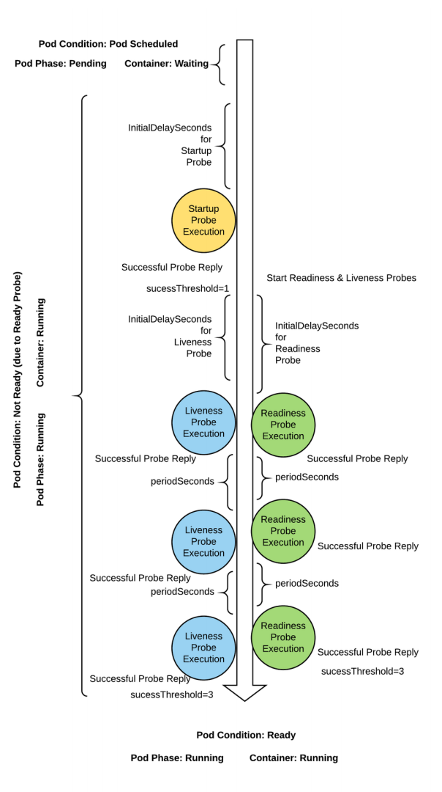

# Kubernetes 资源对象 和 Pod 资源


## **Kubernetes 集群管理工具 kubectl 命令**

对于kubectl主要有8组命令，分别是：基本命令、部署命令、集群管理命令排障调试命令、高级命令、设置命令、其他命令等

**命令格式**

```bash
kubectl [command] [TYPE] [NAME] [flags]

#参数说明
command 	#操作Kubernetes资源对象的子命令，常见的有create、delete、describe、get等
create 		#创建资源对象 
delete 		#删除资源对象
describe 	#查找资源的详细信息
get 		#获取资源基本信息

TYPE	#Kubernetes资源类型，举例：节点的资源类型是nodes，缩写no
NAME	#Kubernetes资源对象的名称，可以省略。
flags	#可选参数
```

**常见资源缩写**

**最基础资源对象**

| **资源对象全称** | **缩写** |
| :--------------: | :------: |
|     Pod/Pods     |   `po`   |
|    Node/Nodes    |   `no`   |

**最常见资源对象**

|      **资源对象全称**      | **缩写** |
| :------------------------: | :------: |
|  Replication Controllers   |   `rc`   |
| Horizontal Pod Autoscalers |  `hpa`   |
|        Replica Sets        |   `rs`   |
|     Persistent Volume      |   `pv`   |
|         Deployment         |  `dep`   |
|  Persistent Volume Claims  |  `pvc`   |
|          Services          |  `svc`   |

### **其他资源对象**

| **资源对象全称** | **缩写** |
| :--------------: | :------: |
|    Namespaces    |   `ns`   |
| Storage Classes  |   `sc`   |
|   Config Maps    |   `cm`   |
|   Daemon Sets    |   `ds`   |
|  Stateful Sets   |  `sts`   |
|    Endpoints     |   `ep`   |
|     Secrets      |          |
|      Events      |   `ev`   |
|       Jobs       |          |
|    Ingresses     |  `ing`   |


```bash
#命令来查看,默认有56种资源
[root@master1 ~]#kubectl api-resources 
#查看组
[root@master1 ~]#kubectl api-versions 
```


**查看帮助**

```bash
#kubectl命令帮助
kubectl --help

#查看子命令的格式
kubectl <command> --help

#查看命令的通用选项
kubectl options
```

```bash
[root@master1 ~]#kubectl --help
kubectl controls the Kubernetes cluster manager.

 Find more information at: https://kubernetes.io/docs/reference/kubectl/

基本命令 (Beginner):
  create       	  #从文件或标准输入创建资源
  expose     	#将复制控制器、服务、部署或 pod 公开为新的 Kubernetes 服务
  run         	   # 在集群上运行特定映像
  set              # 设置对象上的特定特征

基本命令 (Intermediate):
  explain         #获取资源的文档
  get              #显示一个或多个资源
  edit             #编辑服务器上的资源
  delete          #通过文件名、标准输入、资源和名称或通过资源和标签选择器删除资源

部署 Commands:
  rollout         #管理资源的推出
  scale            #为部署、副本集或复制控制器设置新大小
  autoscale     #自动扩展部署、副本集、状态集或复制控制器

集群管理命令:
  certificate    	# 修改证书资源
  cluster-info     # 显示集群信息
  top                  #显示资源（CPU/内存）使用情况
  cordon            #将节点标记为不可调度
  uncordon        # 将节点标记为可调度
  drain               # 清空节点以准备维护
  taint                #更新一个或多个节点上的污点

故障排除和调试命令:

 describe 		   #显示特定资源或资源组的详细信息
 logs 				  #打印 pod 中容器的日志
 attachment     # 附加到正在运行的容器
 exec 			      #在容器中执行命令
 port-forward 	 #将一个或多个本地端口转发到 pod
 proxy 				 #运行 Kubernetes API 服务器的代理
 cp 					#将文件和目录复制到容器和从容器复制文件和目录
 auth 				 #检查授权
 debug 				#创建调试会话以排除工作负载和节点故障
 events 			#列出事件


高级命令：
diff 				#将当前版本与将要应用的版本进行比较
apply 			 #通过文件名或标准输入将配置应用于资源
patch            #更新资源的字段
replace         # 通过文件名或标准输入替换资源
wait               #实验：等待一个或多个资源上的特定条件
kustomize     #从目录或 URL 构建 kustomization 目标

设置命令：
label 					#更新资源上的标签
annotate 			#更新资源上的注释
completion 			#输出指定 shell（bash、zsh、fish 或 powershell）的 shell 完成代码

Subcommands provided by plugins:

其他命令：
api-resources 		#打印服务器上支持的 API 资源
api-versions 		#打印服务器上支持的 API 版本，格式为“group/version”
config 				    #修改 kubeconfig 文件
plugin 					#提供与插件交互的实用程序
version    				#打印客户端和服务端版本信息

Usage:
  kubectl [flags] [options]

```


### **常见用法**

#### 自动补全

```bash
[root@master1 ~]#kubectl completion --help
source <(kubectl completion bash)
[root@master1 ~]#cat 'source <(kubectl completion bash)' >> /root/.bashrc
```

#### **查看资源对象**

```bash
kubectl get TYPE/NAME ... [-o yaml/json/wide | -w]
kubectl get TYPE NAME ... [-o yaml/json/wide | -w]

#参数解析：
-w 		#是实时查看资源的状态。
-o 		#是以多种格式查看资源的属性信息
--raw 	#从api地址中获取相关资源信息
```

#### 描述资源对象

```
kubectl describe TYPE NAME
kubectl describe TYPE/NAME
```

#### 范例

```bash
#查看当前主机的工作节点
[root@master1 ~]#kubectl get nodes 
NAME               STATUS   ROLES           AGE   VERSION
master1.kang.org   Ready    control-plane   49m   v1.32.3
node1.kang.org     Ready    <none>          40m   v1.32.3
node2.kang.org     Ready    <none>          39m   v1.32.3
node3.kang.org     Ready    <none>          40m   v1.32.3

#获取节点的基本信息
[root@master1 ~]#kubectl describe nodes master1.kang.org 

#查看指定的多个不同类型的资源
[root@master1 ~]#kubectl get svc/myapp deployments/myapp

#获取特定的信息
[root@master1 ~]#kubectl -n kube-system get pods etcd-master1.kang.org -o go-template={{.status.podIP}}
10.0.0.100

[root@master1 ~]#kubectl -n kube-system get pods kube-apiserver-master1.kang.org -o go-template={{.status.podIP}}
10.0.0.100

[root@master1 ~]#kubectl -n kube-system get pods kube-proxy-4zl7h -o go-template={{.status.podIP}}
10.0.0.100
```


#### **创建应用**


## **资源对象**


 

Kubernetes 的API 资源分为两种: 

- 内置API 资源: Kubernetes 安装后自身具有的
- 自定义的API 资源: 用户自定义的API,称为CRD(Custom Resource Definition),可以通过安装一些组件生成


从资源的主要功能上Kubernetes 的资源对象分为：

- Workloads(工作负载)
- Service,LoadBalancing and Networking(服务发现和负载均衡)
- 存储和配置(Storage&Configuration)
- Cluster Admin(集群管理)
- Policies&Scheduling(策略和调度)
- Metadata(元数据)

### 查看资源类型

```bash
[root@master1 ~]#kubectl api-resources 
[root@master1 ~]#kubectl api-versions 
[root@master1 ~]#kubectl api-resources --api-group=apps
[root@master1 ~]#kubectl api-resources | awk '{print $1}'
[root@master1 ~]#kubectl api-resources | awk '{print $1}'|wc -l
[root@master1 ~]#kubectl get all -A
```

### **名称空间级别资源**

**工作负载型资源( workload )：**

- Pod：这是我们K8S 中最小的组成部分，特点就是和我们的 pause 共享我们的网络栈、共享存储卷。
- replicaset：也就是 RS ，这是我们的调度器控制器，负责管理 pod 的创建，通过我们标签的选择去控制pod 的副本数
- Deployment：控制器，通过控制 RS 的创建去创建 pod 。
- statefulset：主要是为了我们的有状态服务去建立的这么一个管理器。
- Daemonset：可以在我们每个节点都运行一个 pod 的组件。
- job：我们的工作，为了批处理任务。
- cronjob：我们的轮询工作，为了批处理任务。

**服务发现及负载均衡型资源( ServiceDiscovery LoadBalance ):**

- Service（简称为svc）：为了把我们的服务暴露出去
- Ingress：为了把我们的服务暴露出去,由此接受外部的访问

**配置与存储型资源：**

- Volume： 存储卷，为了给 pod 提供一个持久化的能力
- CSI（容器存储接口）：,可以扩展各种各样的第三方存储卷，在K8S中很多资源需要灵活的提供给我们的容器去运行，但是在K8S中定义了 CSI 接口只要存储资源符合这个接口的规范，那我这个 K8S 集群中 pod 就能够去调用这个存储，这种接口就叫做CSI ，基本上现在市面上能够见到的存储都是支持 CSI 的。

**特殊类型的存储卷：**

- ConfigMap（当配置中心来使用的资源来型）：一般来说用来存储配置文件，达到热更新的状态。
- Secret：加密的方案去存储数据的，所以可以通过它来保存一些密码文件、密钥等等
- DownwardAPI：把外部环境中的信息输出给容器、这个和CSI也比较像，也就意味着可以通过一个下载文件的接口，通过这个接口可以去调用里面的数据，存储和上传等等

### **集群级资源**

集群级资源：

- Namespace（名称空间）
- Node（工作节点）、Role（角色）
- ClusterRole（集群角色）
- RoleBinding（重新链接）
- ClusterRoleBinding（集群重新链接）

### **元数据型资源**

元数据型资源（根据一些指标去进行对应的操作）：

- HPA
- PodTemplate（pod模板）
- LimitRange（资源限制）


```bash
[root@master1 ~]#kubectl api-resources 
NAME                                SHORTNAMES   APIVERSION                        NAMESPACED   KIND
bindings                                         v1                                true         Binding
componentstatuses                   cs           v1                                false        ComponentStatus
configmaps                          cm           v1                                true         ConfigMap
endpoints                           ep           v1                                true         Endpoints
events                              ev           v1                                true         Event
limitranges                         limits       v1                                true         LimitRange
namespaces                          ns           v1                                false        Namespace
nodes                               no           v1                                false        Node
persistentvolumeclaims              pvc          v1                                true         PersistentVolumeClaim
persistentvolumes                   pv           v1                                false        PersistentVolume
pods                                po           v1                                true         Pod
podtemplates                                     v1                                true         PodTemplate
replicationcontrollers              rc           v1                                true         ReplicationController
resourcequotas                      quota        v1                                true         ResourceQuota
secrets                                          v1                                true         Secret
serviceaccounts                     sa           v1                                true         ServiceAccount
services                            svc          v1                                true         Service
mutatingwebhookconfigurations                    admissionregistration.k8s.io/v1   false        MutatingWebhookConfiguration
validatingadmissionpolicies                      admissionregistration.k8s.io/v1   false        ValidatingAdmissionPolicy
validatingadmissionpolicybindings                admissionregistration.k8s.io/v1   false        ValidatingAdmissionPolicyBinding
validatingwebhookconfigurations                  admissionregistration.k8s.io/v1   false        ValidatingWebhookConfiguration
customresourcedefinitions           crd,crds     apiextensions.k8s.io/v1           false        CustomResourceDefinition
apiservices                                      apiregistration.k8s.io/v1         false        APIService
controllerrevisions                              apps/v1                           true         ControllerRevision
daemonsets                          ds           apps/v1                           true         DaemonSet
deployments                         deploy       apps/v1                           true         Deployment
replicasets                         rs           apps/v1                           true         ReplicaSet
statefulsets                        sts          apps/v1                           true         StatefulSet
selfsubjectreviews                               authentication.k8s.io/v1          false        SelfSubjectReview
tokenreviews                                     authentication.k8s.io/v1          false        TokenReview
localsubjectaccessreviews                        authorization.k8s.io/v1           true         LocalSubjectAccessReview
selfsubjectaccessreviews                         authorization.k8s.io/v1           false        SelfSubjectAccessReview
selfsubjectrulesreviews                          authorization.k8s.io/v1           false        SelfSubjectRulesReview
subjectaccessreviews                             authorization.k8s.io/v1           false        SubjectAccessReview
horizontalpodautoscalers            hpa          autoscaling/v2                    true         HorizontalPodAutoscaler
cronjobs                            cj           batch/v1                          true         CronJob
jobs                                             batch/v1                          true         Job
certificatesigningrequests          csr          certificates.k8s.io/v1            false        CertificateSigningRequest
leases                                           coordination.k8s.io/v1            true         Lease
endpointslices                                   discovery.k8s.io/v1               true         EndpointSlice
events                              ev           events.k8s.io/v1                  true         Event
flowschemas                                      flowcontrol.apiserver.k8s.io/v1   false        FlowSchema
prioritylevelconfigurations                      flowcontrol.apiserver.k8s.io/v1   false        PriorityLevelConfiguration
ingressclasses                                   networking.k8s.io/v1              false        IngressClass
ingresses                           ing          networking.k8s.io/v1              true         Ingress
networkpolicies                     netpol       networking.k8s.io/v1              true         NetworkPolicy
runtimeclasses                                   node.k8s.io/v1                    false        RuntimeClass
poddisruptionbudgets                pdb          policy/v1                         true         PodDisruptionBudget
clusterrolebindings                              rbac.authorization.k8s.io/v1      false        ClusterRoleBinding
clusterroles                                     rbac.authorization.k8s.io/v1      false        ClusterRole
rolebindings                                     rbac.authorization.k8s.io/v1      true         RoleBinding
roles                                            rbac.authorization.k8s.io/v1      true         Role
priorityclasses                     pc           scheduling.k8s.io/v1              false        PriorityClass
csidrivers                                       storage.k8s.io/v1                 false        CSIDriver
csinodes                                         storage.k8s.io/v1                 false        CSINode
csistoragecapacities                             storage.k8s.io/v1                 true         CSIStorageCapacity
storageclasses                      sc           storage.k8s.io/v1                 false        StorageClass
volumeattachments                                storage.k8s.io/v1                 false        VolumeAttachment
```

```powershell
true 名称空间级
false 集群级
```

```bash
[root@master1 ~]#kubectl api-versions 
admissionregistration.k8s.io/v1
apiextensions.k8s.io/v1
apiregistration.k8s.io/v1
apps/v1
authentication.k8s.io/v1
authorization.k8s.io/v1
autoscaling/v1
autoscaling/v2
batch/v1
certificates.k8s.io/v1
coordination.k8s.io/v1
discovery.k8s.io/v1
events.k8s.io/v1
flowcontrol.apiserver.k8s.io/v1
networking.k8s.io/v1
node.k8s.io/v1
policy/v1
rbac.authorization.k8s.io/v1
scheduling.k8s.io/v1
storage.k8s.io/v1
v1

[root@master1 ~]#kubectl api-resources --api-group='storage.k8s.io'
NAME                   SHORTNAMES   APIVERSION          NAMESPACED   KIND
csidrivers                          storage.k8s.io/v1   false        CSIDriver
csinodes                            storage.k8s.io/v1   false        CSINode
csistoragecapacities                storage.k8s.io/v1   true         CSIStorageCapacity
storageclasses         sc           storage.k8s.io/v1   false        StorageClass
volumeattachments                   storage.k8s.io/v1   false        VolumeAttachment

[root@master1 ~]#kubectl api-resources --api-group='apps'
NAME                  SHORTNAMES   APIVERSION   NAMESPACED   KIND
controllerrevisions                apps/v1      true         ControllerRevision
daemonsets            ds           apps/v1      true         DaemonSet
deployments           deploy       apps/v1      true         Deployment
replicasets           rs           apps/v1      true         ReplicaSet
statefulsets          sts          apps/v1      true         StatefulSet

```

### **资源及其在** **API** **中的组织形式**

- Kubernetes 利用标准的 RESTful 术语来描述其 API 概念。
- 资源类型：是指在 URL 中使用的名称，如 Pod、Namespace 和 Service 等，其 URL 格式为"/GROUP/VERSION/RESOURCE"，示例：/apps/v1/deployment
- 所有资源类型都有一个对应的 JSON 表示格式：kind(种类)，在 K8s 中用户创建对象必须以 JSON格式提交对象的配置信息。
- 隶属于同一资源类型的对象组成的列表称为 collection(集合)，如 PodList
- 某种类型的单个实例称为"resource"(资源)或"object"(对象)，如运行的名为 pod-test 的 Pod 对象


kind 代表了资源对象所属的类型，如 Namespace、Deployment、Service 等类型，这些类型又可以分为三个类别：

- Object 类：对象表示 K8s 系统上的持久化实体，Namespace、Deployment、Service 和 Pod 都属于该类别
- List 列表类：列表是指同一类型资源的集合，如 PodList、NodeList 等。
- Simple 简单类：常用于子对象上执行某种特殊操作，或者管理非持久的实体，如/binding 或/status 等

Kubernetes 将 API 分割为多个逻辑组合，称为**API** **群组**，不同的群组支持单独启用或禁用，并可以再次

分解。群组化管理的 API 使得其可以更轻松的进行扩展。当前 K8s 集群系统上的 API server 上的相关信

息可以使用 `kubectl api-versions` 获取。

#### 访问 Kubernetes REST API

```bash
#默认无法访问
[root@master1 ~]#curl -sk https://kubeapi.kang.org:6443
{
  "kind": "Status",
  "apiVersion": "v1",
  "metadata": {},
  "status": "Failure",
  "message": "forbidden: User \"system:anonymous\" cannot get path \"/\"",
  "reason": "Forbidden",
  "details": {},
  "code": 403
}
```

#### 用代理访问

```bash
[root@master1 ~]#kubectl proxy --port=8081
Starting to serve on 127.0.0.1:8081

[root@master1 ~]#curl -s 127.0.0.1:8081
{
  "paths": [
    "/.well-known/openid-configuration",
    "/api",
    "/api/v1",
    "/apis",
    "/apis/",
    "/apis/admissionregistration.k8s.io",
    "/apis/admissionregistration.k8s.io/v1",
    "/apis/apiextensions.k8s.io",
    "/apis/apiextensions.k8s.io/v1",
    "/apis/apiregistration.k8s.io",
    "/apis/apiregistration.k8s.io/v1",

```

```bash
[root@master1 ~]#kubectl create ns demo-ns

[root@master1 ~]#curl -s 127.0.0.1:8081/api/v1/namespaces/demo-ns
{
  "kind": "Namespace",
  "apiVersion": "v1",
  "metadata": {
    "name": "demo-ns",
    "uid": "aaaccb69-c49f-4d69-b282-2afaab4ec11b",
    "resourceVersion": "20521",
    "creationTimestamp": "2025-03-22T11:31:43Z",
    "labels": {
      "kubernetes.io/metadata.name": "demo-ns"
    },
    "managedFields": [
      {
        "manager": "kubectl-create",
        "operation": "Update",
        "apiVersion": "v1",
        "time": "2025-03-22T11:31:43Z",
        "fieldsType": "FieldsV1",
        "fieldsV1": {
          "f:metadata": {
            "f:labels": {
              ".": {},
              "f:kubernetes.io/metadata.name": {}
            }
          }
        }
      }
    ]
  },
  "spec": {
    "finalizers": [
      "kubernetes"
    ]
  },
  "status": {
    "phase": "Active"
  }
}
```

#### **Kubernetes API** **设计理念**

Kubernetes设计理念与分布式系统

分析和理解Kubernetes的设计理念可以使我们更深入地了解Kubernetes系统，更好地利用它管理分布式部署的云原生应用，另一方面也可以让我们借鉴其在分布式系统设计方面的经验。


- **命令式API**

  也称为指令式API，用户需要一步步地告诉机器该如何做(How) ，机器自身不具有任何“智能”，只被动接受指令

- 高度依赖用户自身理解和达成目标的能力和处理各类异常问题的经验，实现的是“命令式编程Imperative Programming

  **声明式API**

  也称为申明式API，用户只需要告诉机器想要的结果(What)，机器自身需要确定如何达成该目标

  机器需要一定的“智能”，但通常只能支持事先预设和可被其理解的特定任务

  实现的是“声明式编程 Declarative Programming

  相较于命令式编程，声明式编程是一个更高的层次上的编程

  声明式API允许用户以给出最终期望目标的方式编写代码，但具体的执行过程（即机器智能的那部分代码），最终仍然需要以命令式编程实现，只不过，它们可由不同的人群完成

  类比来说，声明式编程的用户类似于企业的高管，只用关心和交待最终目标;而命令式编程的用户类似于企业部门经理，他需要理解目标的达成路径，并组织人力完成目标


### **资源清单格式**

大部分的对象或类别类型的资源还需要有三个嵌套的字段：metadata、spec 和 status 字段。

- metadata为资源提供元数据，如名称、隶属的名称空间和标签等；
- spec 字段则用于定义用户期望的状态，不同的资源类型，其状态的意义也各有不同，如 Pod 资源最为核心的功能在于运行容器；
- status 字段则记录着活动对象的当前状态信息，它由 Kubernetes 系统自行维护，对用户来说为只读字段。

在Kubernetes集群中，资源对象产生流程

- 根据业务应用架构的分析，确定我们要使用的资源对象(Kubernetes中的)
- 使用描述性语言，编写资源对象的定义文件
- 基于资源对象定义文件进行对象初始化，形成资源对象。

资源定义文件：

- 用来初始化kubernetes资源对象的
- 定义文件的格式根据其编写语言的种类，一般分为两种：YAML和json，
- 工作中我们常用的就是YAML

**YAML格式说明**

- 大小写敏感
- 使用缩进表示层级关系
- 缩进时不允许使用Tab键，只允许使用空格。
- 缩进的空格数目不重要，只要相同层级的元素左侧对齐即可
- 以#开始的内容表示注释，从这个字符一直到行尾，都会被解析器忽略

#### apiVersion和kind

- apiVersion和kind 描述类型的元数据

  apiVersion：API版本,用于对同一资源对象的不同版本进行并行管理，主要有 alpha、betal、stable

  格式：组名/版本

  查看命令：`**kubectl api-versions**`，可以看到当前共有27+个分组和版本

- kind：资源类型,kubernetes的专用资源对象

  查看命令： `**kubectl api-resources [--api-group=]**`，可以看到当前共有50+种资源对象和对应的APIVERSION 版本信息

#### **metadata** **嵌套字段**

metadata 字段用于描述对象的元数据,即属性信息，其内嵌多个用于定义资源的元数据，如 name 和labels 等。这些字段可以分为必选字段和可选字段

必选字段：

- name: 设定当前对象的名称，名称空间间级的资源在其所属的名称空间的同一类型中必须唯一
- namespace: 指定当前对象隶属的名称空间，默认值为 default，实现资源隔离
- uid: 当前对象的唯一标识符，用于区别"已删除"和"重新创建"的同一个名称的对象,系统可以自动生成

可选字段通常是指有 Kubernetes 系统自行维护和设置，或者存在默认，或允许使用空值的字段。

有以下可选字段：

- labels: 设定用于标识当前对象的标签，键值数据，格式：key1: value1 ,常用作标签选择器的挑选条件
- annotation: 非标识型键值数据，格式：key1: value1,用来作为挑选条件，用于 labels 的补充，不支持标签选择器的选择
- resourceVersion:当前对象的内部版本标识，用来让客户端确定对象的变动与否
- generation: 标识当前对象目标状态的代别
- creationTimestamp: 当前对象创建日期的时间戳
- deletionTimestamp: 当前对象删除日期的时间戳

#### **spec** **和** **status** **字段**

定义资源配置清单时，spec 是必须的字段。用于描述对象的目标状态，也就是用户期望对象所表现出来的特征。

- spec 字段

  Specification 规格字段

  此字段对于不同的对象类型来说各不相同，具体字段含义及所接受的数据类型需要参照 Kubernets API 手册中的说明进行获取。可通过命令 kubectl explain KIND.spec 获取具体帮助

- status 字段

  此字段记录对象的当前实际运行的状态，由 Kubernetes 系统负责更新，用户不能手动定义。

  Master 节点的 controller manager 通过相应的控制器组件动态管理并确保对象的实际转态匹配用户所期望的状态。比如:Deployment 是一种描述集群中运行应用的资源对象，因此，创建

  Deployment 类型对象时，需要为目标 Deployment 对象设定 spec，指定期望需要运行的 Pod 副本数量、使用的标签选择器以及 Pod 模板等。在创建时，Kubernetes 相关组件读取待创建的

  Deployment 对象的 spec以及系统上相应的活动对象的当前状态，必要时对活动的对象更新以确保 status 字段吻合 spec 字段中期望的状态

注意：数据类的资源对象无spec, Status 字段，比如：configmaps，secrets ， endpoints 等

**注意：字段名一般为小驼峰命名法，字段值为大驼峰命名法**

**通过** **kubectl explain** **查看帮助生成新的清单文件**

```bash
#格式
kubectl explain TYPE_NAME [--api-verion=GROUP_NAME/VERSION]
```

```bash
[root@master1 ~]#kubectl explain namespace
KIND:       Namespace
VERSION:    v1

DESCRIPTION:
    Namespace provides a scope for Names. Use of multiple namespaces is
    optional.
    
FIELDS:
  apiVersion	<string>
    APIVersion defines the versioned schema of this representation of an object.
    Servers should convert recognized schemas to the latest internal value, and
    may reject unrecognized values. More info:
    https://git.k8s.io/community/contributors/devel/sig-architecture/api-conventions.md#resources

  kind	<string>
    Kind is a string value representing the REST resource this object
    represents. Servers may infer this from the endpoint the client submits
    requests to. Cannot be updated. In CamelCase. More info:
    https://git.k8s.io/community/contributors/devel/sig-architecture/api-conventions.md#types-kinds

  metadata	<ObjectMeta>
    Standard object's metadata. More info:
    https://git.k8s.io/community/contributors/devel/sig-architecture/api-conventions.md#metadata

  spec	<NamespaceSpec>
    Spec defines the behavior of the Namespace. More info:
    https://git.k8s.io/community/contributors/devel/sig-architecture/api-conventions.md#spec-and-status

  status	<NamespaceStatus>
    Status describes the current status of a Namespace. More info:
    https://git.k8s.io/community/contributors/devel/sig-architecture/api-conventions.md#spec-and-status

```

### **创建资源清单文件**

#### 利用dry-run模拟运行指令式命令生成清单文件

```bash
#生成清单文件
[root@master1 ~]#kubectl create ns demo --dry-run=client -o yaml > demo.yaml
[root@master1 ~]#cat demo.yaml 
apiVersion: v1
kind: Namespace
metadata:
  creationTimestamp: null
  name: demo
spec: {}
status: {}

[root@master1 ~]#kubectl get ns
NAME              STATUS   AGE
default           Active   115m
demo              Active   2m51s
kube-flannel      Active   101m
kube-node-lease   Active   115m
kube-public       Active   115m
kube-system       Active   115m
```

#### **利用现有资源生成清单文件再修改为新的清单文件**

```bash
kubectl get TYPE NAME -o yaml > /path/export-resourcelist.yaml
kubectl get TYPE/NAME -o yaml > /path/export-resourcelist.yaml
```

```bash
[root@master1 ~]#kubectl get pod kube-flannel-ds-9p7x2 -n kube-flannel -o yaml
[root@master1 ~]#kubectl get pod kube-flannel-ds-9p7x2 -n kube-flannel -o yaml > test.yaml
```

#### 将 Docker Compose 文件转换为 Kubernetes 资源

```
https://kubernetes.io/zh-cn/docs/tasks/configure-pod-container/translate-compose-kubernetes/
```

Kompose 官网 http://kompose.io

### **资源对象的管理方式**

**kubectl** **命令可分为三类命令：**

指令式命令(imperative command): 

指令式命令包括**kubectl run/expose/delete/get**等命令

适合完成一次性的操作任务

指令式对象配置(imperative object configuration): 

指令式对象配置管理包括**kubectl create/delete/get/replace/edit**等

基于资源配置文件执行对象管理操作，但只能独立引用每个配置清单文件

指令式管理配置与指令式命令的区别是，其需要用户提供资源清单文件，通过资源清单来读取需要管理的目标资源对象。指令式对象配置管理的管理操作直接作用于活动对象，会导致用户丢失活动对象的当前状态。

**此方式没有幂等性,重复执行可能会出错,生产不推荐使用**

声明式对象配置(declarative object configration): 

基于资源配置文件执行对象管理操作

可直接引用目录下的所有配置清单文件，也可直接作用于单个配置文件

声明式对象配置并不直接指明要进行的对象管理操作，而是提供配置清单文件给 Kubernetes 系统，并委托系统跟踪活动对象的状态变动。

资源对象的创建、删除及修改操作全部通过命令**kubectl apply/patch等**来完成，并且每次操作时，提供给命令的配置信息都将保存于对象的注释信息(kubectl.kubernetes.io/last-appliedconfiguration)中，并且通过对比检查活动对象的当前状态、注解中的配置信息和资源清单中的配置三方的变更来实现仅修改变动字段的高级补丁机制。

```bash
kubectl apply -f /path/file -f ..... #加载指定文件
kubectl apply -f /path  #加载指定目录下的所有以.yaml,.yml,.json后缀的文件
kubectl apply -f URL    #加载URL的文件
```

```bash
#方式一：指令式
[root@master1 ~]#kubectl create 
clusterrolebinding   (Create a cluster role binding for a particular cluster role)
clusterrole          (Create a cluster role)
configmap            (Create a config map from a local file, directory or literal value)
cronjob              (Create a cron job with the specified name)
deployment           (Create a deployment with the specified name)
ingress              (Create an ingress with the specified name)
job                  (Create a job with the specified name)
namespace            (Create a namespace with the specified name)
poddisruptionbudget  (Create a pod disruption budget with the specified name)
priorityclass        (Create a priority class with the specified name)
quota                (Create a quota with the specified name)
rolebinding          (Create a role binding for a particular role or cluster role)
role                 (Create a role with single rule)
secret               (Create a secret using a specified subcommand)
serviceaccount       (Create a service account with the specified name)
service              (Create a service using a specified subcommand)
token                (Request a service account token)

[root@master1 ~]#kubectl create ns demo

#方式二：指令式调用清单文件
#清单文件
#yaml、yml、json 格式
#五个字段
apiVersion: v1  
kind: Namespace
metadata:
	name: demo
spec
status

[root@master1 ~]#kubectl create -f test.yaml
#没有幂等性

#方式三：声明式调用清单文件
[root@master1 ~]#kubectl create -f test.yaml
#具有幂等性
```


**如果文件里有多个资源清单比如：**

```bash
[root@master1 ~]#ls data
a.yaml  c.yaml  e.yaml  g.yaml  i.yaml  k.yaml  m.yaml  o.yaml  q.yaml  s.yaml  u.yaml  w.yaml  y.yaml
b.yaml  d.yaml  f.yaml  h.yaml  j.yaml  l.yaml  n.yaml  p.yaml  r.yaml  t.yaml  v.yaml  x.yaml  z.yaml
[root@master1 ~]#cd data
[root@master1 data]#kubectl apply -f .
[root@master1 ~]#kubectl apply -f data/
```

```bash
#不执行模拟执行
[root@master1 ~]#kubectl create ns demo --dry-run=client -o yaml

#删除资源
[root@master1 ~]#kubectl delete ns demo
[root@master1 ~]#kubectl delete -f demo.yaml 
```

## **名称空间**

```
https://kubernetes.io/docs/tasks/administer-cluster/namespaces/
```


Kubernetes 的资源工作的有效范围分成两种级别:

- 集群级别: 针对整个Kubernetes集群内都有效
- 名称空间级别: 只针对指定名称空间内有效,而不属于任务名称空间

名称空间 Namespace 用于将集群分隔为多个隔离的逻辑分区以配置给不同的用户、租户、环境或者项目使用。

名称空间限定了资源对象工作在指定的名称范围内的作用域

例如，可以为 development、Quality Assurance和 production 应用环境分别创建各自的名称空间。

注意: 名称空间本身是 Kubernetes 集群级别的资源

Kubernetes 的大多数资源都属于名称空间级别,除此还有全局性的集群级别的资源。

也因此这些集群级别的资源对象的名称必须在集群中全局唯一

比如: Node、Namespace、clusterrole 和 PersistentVolume 等资源不属于任何名称空间

需要使用名称空间的场景

- 环境管理: 

  需要在同一Kubernetes集群上隔离研发、预发和生产等一类的环境时，可以通过名称空间进行

- 隔离:

  多个项目团队的不同产品线需要部署于同一Kubernetes集群时，可以使用名称空间进行隔离

- 资源控制:

  名称空间可用作资源配额的承载单位，从而限制其内部所有应用可以使用的CPU/Memory/PV各自的资源总和

  需要在产品线或团队等隔离目标上分配各自总体可用的系统资源时，可通过名称空间实现

- 权限控制:

  基于RBAC鉴权体系，能够在名称空间级别进行权限配置

- 提高集群性能:

  进行资源搜索时，名称空间有利于Kubernetes API缩小查找范围，从而对减少搜索延迟和提升性能有一定的帮助

**Kubernetes的名称空间可以划分为两种类型**

- 系统级名称空间:

  由Kubernetes集群默认创建，主要用来隔离系统级的资源对象

  所有的系统级名称空间均不能进行删除操作（即使删除也会自动重建）

  除default外，其它三个系统级名称空间不应该用作业务应用的部署目标

- 自定义名称空间

  由用户按需创建

  比如: 根据项目和场景, 分别创建对应不同的名称空间

**系统级名称空间**

- default：为任何名称空间级别的资源提供的默认的名称空间

- kuhe-system：Kubernetes集群自身组件及其它系统级组件使用的名称空间，Kubernetes自身的关键组件均部署在该名称空间中

- kube-public：公众开放的名称空间，所有用户（包括Anonymous）都可以读取内部的资源,通常为空

- kube-node-lease：节点租约资源所用的名称空间

  分布式系统通常使用“租约(Leqse)”机制来锁定共享资源并协调集群成员之间的活动

  Kubernetes上的租约概念由API群组coordination.k8s.io群组下的Lease资源所承载，以支撑系统级别的功能需求，例如节点心跳( node heartbeats)和组件级的领导选举等

  Kubernetes集群的每个管理组件在该名称空间下都有一个与同名的Iease资源对象

  ```bash
  ~# kubectl -n kube-node-lease get lease
  ```

  

kubernetes 和Docker的名称空间的区别

- kubernetes的名称空间, 用户根据需要可以自行创建删除,属于用户级别
- Docker的名称空间是内核内置,用户不能创建删除,属于内核级别

```bash
#查询所有名称空间
[root@master1 ~]#kubectl get namespaces 
NAME              STATUS   AGE
default           Active   94m
kube-flannel      Active   80m
kube-node-lease   Active   94m
kube-public       Active   94m
kube-system       Active   94m

#查看名称空间里的所有容器（不写-n，查看默认的名称空间）
[root@master1 ~]#kubectl get pod -n kube-flannel 
NAME                    READY   STATUS    RESTARTS   AGE
kube-flannel-ds-9p7x2   1/1     Running   0          81m
kube-flannel-ds-bd6wq   1/1     Running   0          81m
kube-flannel-ds-nwbkm   1/1     Running   0          81m
kube-flannel-ds-tl4vb   1/1     Running   0          81m

#查看所有的名称空间的容器
[root@master1 ~]#kubectl get pod -A
NAMESPACE      NAME                                       READY   STATUS    RESTARTS   AGE
kube-flannel   kube-flannel-ds-9p7x2                      1/1     Running   0          82m
kube-flannel   kube-flannel-ds-bd6wq                      1/1     Running   0          82m
kube-flannel   kube-flannel-ds-nwbkm                      1/1     Running   0          82m
kube-flannel   kube-flannel-ds-tl4vb                      1/1     Running   0          82m
kube-system    coredns-6766b7b6bb-f4fwb                   1/1     Running   0          97m
kube-system    coredns-6766b7b6bb-msq4t                   1/1     Running   0          97m
kube-system    etcd-master1.kang.org                      1/1     Running   0          97m
kube-system    kube-apiserver-master1.kang.org            1/1     Running   0          97m
kube-system    kube-controller-manager-master1.kang.org   1/1     Running   0          97m
kube-system    kube-proxy-4zl7h                           1/1     Running   0          97m
kube-system    kube-proxy-6bzvc                           1/1     Running   0          86m
kube-system    kube-proxy-ldx66                           1/1     Running   0          88m
kube-system    kube-proxy-v96pf                           1/1     Running   0          88m
kube-system    kube-scheduler-master1.kang.org            1/1     Running   0          97m

```

### 创建 Namespace 资源

```bash
[root@master1 ~]#kubectl create ns demo --dry-run=client -o yaml > demo.yaml
[root@master1 ~]#kubectl apply -f demo.yaml 
namespace/demo created

```

```bash
[root@master1 ~]#kubectl get ns
NAME              STATUS   AGE
default           Active   4h17m
demo              Active   24s
kube-flannel      Active   4h3m
kube-node-lease   Active   4h17m
kube-public       Active   4h17m
kube-system       Active   4h17m

[root@master1 ~]#kubectl get ns default -o yaml
apiVersion: v1
kind: Namespace
metadata:
  creationTimestamp: "2025-03-22T08:03:25Z"
  labels:
    kubernetes.io/metadata.name: default
  name: default
  resourceVersion: "34"
  uid: 3a373edd-7788-4bf3-94f4-84e0ce001d2a
spec:
  finalizers:
  - kubernetes
status:
  phase: Active

#删除资源
[root@master1 ~]#kubectl delete ns demo
[root@master1 ~]#kubectl delete -f demo.yaml 

#范例
[root@master1 ~]#kubectl delete svc,deployment --all -n demo
```

## **Pod** **资源**

```
pod				花生壳
container	 花生米
```

Pod 是一个或多个容器的集合，因而也可称为容器集，但却是Kubernetes调度、部署和运行应用的原子单元

同一Pod内的所有容器都将运行于由Scheduler选定的同一个worker节点上

在同一个pod内的容器共享的存储资源、网络协议栈及容器的运行控制策略等

每个Pod中的容器依赖于一个特殊名为pause容器事先创建出可被各应用容器共享的基础环境，包括Network、IPC和UTS名称空间共享给Pod中各个容器，PID名称空间也可以共享，但需要用户显式定义,Mount和User是不共享的,每个容器有独立的Mount,User的名称空间

Docker 容器主要有六个名称空间实现容器间的资源隔离: User,Mount,Pid,IPC,Network,UTS


Pod的组成形式有两种

- 单容器Pod：除Pause容器外,仅含有一个容器
- 多容器Pod：除Pause容器外，含有多个具有“超亲密”关系的容器，一般由主容器和辅助容器（比如：sidecar容器）构成

Pod 资源分类：

- 自主式 Pod

  由用户直接定义并提交给API Server创建的Pods

  **节点故障后不具有自动调度至其它节点的故障自愈能力**

- 由Workload Controller 管控的 Pod

  比如: 由Deployment控制器管理的Pod

  **节点故障后具有自动调度至其它节点的故障自愈能力**

- 静态 Pod

  由kubelet加载配置信息后，自动在对应的节点上创建的Pod

  用于实现Master节点上的系统组件API Server 、Controller-Manager 、Scheduler 和Etcd功能的Pod

  相关配置存放在控制节点的 `/etc/kubernetes/manifests` 目录下
  
  `/etc/kubernetes/manifests` 这个路径可以修改 `[root@master1 ~]#cat /var/lib/kubelet/config.yaml`
  
  

### 指令式命令创建 Pod

```bash
kubectl run NAME --image=image [--port=port] [--replicas=replicas] 
kubectl run NAME --image=image [--env="key=value"] [--port=port] [--dry-run=server|client] [--overrides=inline-json] [--command] -- [COMMAND] [args...] [options]

#参数详解
--image='' 		#指定容器要运行的镜像
--port=''		  #设定容器暴露的端口
--dry-run=true #以模拟的方式来进行执行命令
--env=[] 		 #执行的时候，向对象中传入一些变量
--labels='' 	 #设定pod对象的标签
--limits='cpu=200m,memory=512Mi' 		#设定容器启动后的资源配置
--replicas=n 		#设定pod的副本数量,新版不再支持
--command=false    		 #设为true，将 -- 后面的字符串做为命令代替容器默认的启动命令，而非做为默认启动命令的参数
-it            		#打开交互终端
--rm          	 #即出即删除容器
--restart=Never 		#不会重启
```

### 查看pod详细信息

```bash
#查看pod详细信息，相当于docker inspect
[root@master1 ~]#kubectl describe pod -n kube-system etcd-master1.kang.org

#查看当前名称空间的所有pod
[root@master1 ~]#kubectl get pod

#查看所有空间的所有pod
[root@master1 ~]#kubectl get pod -A

#查看指定空间的所有pod
[root@master1 ~]#kubectl get pod -n kube-system

#查看指定pod当前状态信息
[root@master1 ~]#kubectl get -f pod-test1.yaml 
[root@master1 ~]#kubectl get pod pod-test1 
[root@master1 ~]#kubectl get po pod-test1

#持续查看pod状态
[root@master1 ~]#kubectl get pods pod-test1 -w

#查看扩展信息
[root@master1 ~]#kubectl get pod pod-test1 -o wide

#通过 -o yaml 的方式来进行查看yaml格式的详细信息
[root@master1 ~]#kubectl get pod pod-test -o yaml

#查看pod上面的label
[root@master1 ~]#kubectl get pod pod-test1 --show-labels

#定制化显示
#定制格式的语法：自定义字段名:属性获取命令
#多个自定义字段显示的时候，可以使用逗号","隔开
[root@master1 ~]#kubectl get pod pod-test1 -o custom-columns=NAME:metadata.name,STATUS:status.phase

#查看指定pod的详细信息
[root@master1 ~]#kubectl describe pod pod-test1

#按Json格式查看Pod 信息
[root@master1 ~]#kubectl get pod pod-test-5558f75445-9mhrt -o jsonpath={.metadata.name}
pod-test-5558f75445-9mhrt

[root@master1 ~]#kubectl get pod pod-test-5558f75445-9mhrt -o jsonpath={.spec.containers[0].name}
pod-test

[root@master1 ~]#kubectl get pod mynginx -o yaml -o jsonpath={.spec.containers[0].image}
registry.cn-beijing.aliyuncs.com/wangxiaochun/nginx:1.26.0

[root@master1 ~]#kubectl get pod myapp -o jsonpath={.status.podIP}
10.244.4.6
```

### 查看 Pod 中指定容器应用的日志

```bash
kubectl logs [-f] (POD | TYPE/NAME) [-c CONTAINER] [options]

# 选项
-f, --follow=true    		#跟踪日志
-p , --previous=true 	#默认只能查看到当前容器此次重启后生成的日志，此选项可以查看前一个已退出的容器的日志
--all-containers=true  #所有容器
--tail=N 					   #最后N个日志
```

```bash
[root@master1 ~]#kubectl get pod -A
NAMESPACE      NAME                                       READY   STATUS    RESTARTS      AGE
kube-flannel   kube-flannel-ds-9p7x2                      1/1     Running   1 (16h ago)   21h
kube-flannel   kube-flannel-ds-bd6wq                      1/1     Running   1 (16h ago)   21h
kube-flannel   kube-flannel-ds-nwbkm                      1/1     Running   1 (16h ago)   21h
kube-flannel   kube-flannel-ds-tl4vb                      1/1     Running   1 (16h ago)   21h
kube-system    coredns-6766b7b6bb-f4fwb                   1/1     Running   1 (16h ago)   21h
kube-system    coredns-6766b7b6bb-msq4t                   1/1     Running   1 (16h ago)   21h
kube-system    etcd-master1.kang.org                      1/1     Running   1 (16h ago)   21h
kube-system    kube-apiserver-master1.kang.org            1/1     Running   1 (16h ago)   21h
kube-system    kube-controller-manager-master1.kang.org   1/1     Running   1 (16h ago)   21h
kube-system    kube-proxy-4zl7h                           1/1     Running   1 (16h ago)   21h
kube-system    kube-proxy-6bzvc                           1/1     Running   1 (16h ago)   21h
kube-system    kube-proxy-ldx66                           1/1     Running   1 (16h ago)   21h
kube-system    kube-proxy-v96pf                           1/1     Running   1 (16h ago)   21h
kube-system    kube-scheduler-master1.kang.org            1/1     Running   1 (16h ago)   21h
[root@master1 ~]#kubectl logs -n kube-flannel kube-flannel-ds-9p7x2 
```

范例

```bash
[root@master1 ~]#kubectl run mysql --image registry.cn-beijing.aliyuncs.com/wangxiaochun/mysql:8.0.29-oracle
pod/mysql created
[root@master1 ~]#kubectl logs mysql 
2025-03-24 11:30:21+00:00 [Note] [Entrypoint]: Entrypoint script for MySQL Server 8.0.29-1.el8 started.
2025-03-24 11:30:21+00:00 [Note] [Entrypoint]: Switching to dedicated user 'mysql'
2025-03-24 11:30:21+00:00 [Note] [Entrypoint]: Entrypoint script for MySQL Server 8.0.29-1.el8 started.
2025-03-24 11:30:21+00:00 [ERROR] [Entrypoint]: Database is uninitialized and password option is not specified
    You need to specify one of the following:
    - MYSQL_ROOT_PASSWORD
    - MYSQL_ALLOW_EMPTY_PASSWORD
    - MYSQL_RANDOM_ROOT_PASSWORD
[root@master1 ~]#kubectl logs --tail=3 mysql 
    - MYSQL_ROOT_PASSWORD
    - MYSQL_ALLOW_EMPTY_PASSWORD
    - MYSQL_RANDOM_ROOT_PASSWORD
[root@master1 ~]#kubectl run mysql --env='MYSQL_ROOT_PASSWORD=123456' --image registry.cn-beijing.aliyuncs.com/wangxiaochun/mysql:8.0.29-oracle
pod/mysql created
[root@master1 ~]#kubectl get pod
NAME    READY   STATUS    RESTARTS   AGE
mysql   1/1     Running   0          8s
```

### 进入Pod 执行命令

```bash
#格式
kubectl exec (POD | TYPE/NAME) [-c CONTAINER] [flags] -- COMMAND [args...] [options]
```

范例

```bash
#容器外执行命令
[root@master1 ~]#kubectl run mysql --image registry.cn-beijing.aliyuncs.com/wangxiaochun/mysql:8.0.29-oracle
pod/mysql created
[root@master1 ~]#kubectl run mysql2 --env='MYSQL_ROOT_PASSWORD=123456' --env="TZ=Asia/Shanghai" --image registry.cn-beijing.aliyuncs.com/wangxiaochun/mysql:8.0.29-oracle
pod/mysql2 created 
[root@master1 ~]#kubectl exec mysql -- date
Mon Mar 24 11:38:32 UTC 2025
[root@master1 ~]#kubectl exec mysql2 -- date
Mon Mar 24 19:38:28 CST 2025

#进入容器
[root@master1 ~]#kubectl exec -it mysql -- bash
bash-4.4# mysql -uroot -p123456
```

### 删除 Pod

删除资源对象推荐使用指令式管理命令 `kubectl delete`

```bash
#格式
kubectl delete ([-f FILENAME] | [-k DIRECTORY] | TYPE [(NAME | -l label | --all)]) [options]
```

范例

```bash
[root@master1 ~]#kubectl delete pod mysql2 
pod "mysql2" deleted

#强制删除不等待宽限期
[root@master1 ~]#kubectl delete pod mysql --grace-period=0 --force 
Warning: Immediate deletion does not wait for confirmation that the running resource has been terminated. The resource may continue to run on the cluster indefinitely.
pod "mysql" force deleted

#删除多个资源
[root@master1 ~]#kubectl delete -f pod-test1.yaml -f pod-test2.yaml

#删除指定目录下的资源
[root@master1 ~]#kubectl delete -f /data/kubernetes/yaml/

#删除demo名称空间的所有Pod
[root@master1 ~]#kubectl delete pod --all -n demo

#快速删除所有pod
[root@master1 ~]#kubectl get pod|awk 'NR!=1{print $1}'|xargs -i kubectl delete pod {} --force --grace-period=0
[root@master1 ~]#vim .bashrc 
alias rmpod="kubectl get pod -o custom-columns=:metadata.name | tail -n +2 | xargs -I{} kubectl delete pod {} --force --grace-period=0"
[root@master1 ~]#. .bashrc
```

### 创建定制的 Pod

kubernets 支持多种定制 Pod 的实现方法

- 对于不同应用的Pod,重新定制对应的镜像
- 启动容器时指定env环境变量
- 启动容器的指定command和args
- 将配置信息基于卷资源对象，再将其加载到容器，比如：configMap和secret等

#### **利用环境变量实现容器传参**

在容器上嵌套使用env字段

- 每个环境变量需要通过pod.spec.containers.env.name给出指定的名称
- 传递的值则定义在pod.spec.containers.env.value字段上

```bash
[root@master1 ~]#kubectl run mynginx --env="name=hzk" --image registry.cn-beijing.aliyuncs.com/wangxiaochun/nginx:1.26.0
pod/mynginx created
[root@master1 ~]#kubectl exec mynginx -- env
PATH=/usr/local/sbin:/usr/local/bin:/usr/sbin:/usr/bin:/sbin:/bin
HOSTNAME=mynginx
name=hzk
```

范例: 实现 LAMP的应用wordpress

```mysql
#mysql
[root@master1 wordpress]#vim pod-mysql.yaml
apiVersion: v1
kind: Pod
metadata:
  name: mydb                # Pod 名称
  namespace: default        # 命名空间，默认为 default
spec:
  containers:
    - name: mysql           # 容器名称
      image: registry.cn-beijing.aliyuncs.com/wangxiaochun/mysql:8.0.29-oracle  # MySQL 镜像地址
      env:                  # 环境变量配置
        - name: MYSQL_ROOT_PASSWORD
          value: "654321"   # MySQL root 用户密码，数字需要用引号包裹
        - name: MYSQL_DATABASE
          value: wordpress  # 初始化创建的数据库名称
        - name: MYSQL_USER
          value: wpuser     # 初始化创建的用户名
        - name: MYSQL_PASSWORD
          value: "123456"   # 初始化用户的密码，数字需要用引号包裹

[root@master1 wordpress]#kubectl apply -f pod-mysql.yaml 
pod/mydb created
[root@master1 wordpress]#kubectl get pod -o wide 
NAME      READY   STATUS    RESTARTS   AGE     IP           NODE             NOMINATED NODE   READINESS GATES
mydb      1/1     Running   0          26s     10.244.4.9   node2.kang.org   <none>           <none>

#wordpress
#方法一：使用宿主机网络
[root@master1 wordpress]#vim pod-wordpress.yaml
apiVersion: v1
kind: Pod
metadata:
  name: wordpress              # Pod 名称
  namespace: default           # 命名空间，默认为 default
spec:
  hostNetwork: true            # 使用宿主机的网络（共享宿主机 IP 和端口）
  containers:
    - name: wordpress          # 容器名称
      image: registry.cn-beijing.aliyuncs.com/wangxiaochun/wordpress:php8.2-apache  # WordPress 镜像地址
      env:                     # 环境变量配置
        - name: TZ
          value: Asia/Shanghai  # 设置时区为上海
        - name: WORDPRESS_DB_HOST
          value: 10.244.4.9     # MySQL 数据库的 IP 地址（指向前面部署的 MySQL Pod）
        - name: WORDPRESS_DB_NAME
          value: wordpress      # 数据库名称
        - name: WORDPRESS_DB_USER
          value: wpuser         # 数据库用户名
        - name: WORDPRESS_DB_PASSWORD
          value: "123456"       # 数据库用户密码，数字需要用引号包裹

#方法二：使用端口映射
[root@master1 wordpress]#vim pod-wordpress.yaml 
apiVersion: v1
kind: Pod
metadata:
  name: wordpress              # Pod 名称
  namespace: default           # 命名空间，默认为 default
spec:
  #hostNetwork: true            # 使用宿主机的网络（共享宿主机 IP 和端口）
  containers:
    - name: wordpress          # 容器名称
      image: registry.cn-beijing.aliyuncs.com/wangxiaochun/wordpress:php8.2-apache  # WordPress 镜像地址
      ports:
      - name: http
        containerPort: 80
        hostPort: 8888
      env:                     # 环境变量配置
        - name: TZ
          value: Asia/Shanghai  # 设置时区为上海
        - name: WORDPRESS_DB_HOST
          value: 10.244.4.9     # MySQL 数据库的 IP 地址（指向前面部署的 MySQL Pod）
        - name: WORDPRESS_DB_NAME
          value: wordpress      # 数据库名称
        - name: WORDPRESS_DB_USER
          value: wpuser         # 数据库用户名
        - name: WORDPRESS_DB_PASSWORD
          value: "123456"       # 数据库用户密码，数字需要用引号包裹

[root@master1 wordpress]#kubectl apply -f pod-wordpress.yaml 
pod/wordpress created

[root@master1 wordpress]#kubectl get pod -o wide
NAME        READY   STATUS    RESTARTS   AGE     IP           NODE             NOMINATED NODE   READINESS GATES
mydb        1/1     Running   0          2m49s   10.244.4.9   node2.kang.org   <none>           <none>
wordpress   1/1     Running   0          82s     10.0.0.101   node1.kang.org   <none>           <none>

[root@master1 wordpress]#kubectl get pod -o wide 
NAME        READY   STATUS    RESTARTS   AGE   IP           NODE             NOMINATED NODE   READINESS GATES
mydb        1/1     Running   0          15m   10.244.4.9   node2.kang.org   <none>           <none>
wordpress   1/1     Running   0          81s   10.244.1.3   node1.kang.org   <none>           <none>

#ss 看不到8888的端口，因为映射在iptables的nat表中，ss查看的是程序进程监听的端口，而iptables是在内核空间运行的。
[root@node1 ~]#ss -tnulp
[root@node1 ~]#iptables -vnL -t nat | grep 8888
    0     0 CNI-HOSTPORT-SETMARK  tcp  --  *      *       10.244.1.0/24        0.0.0.0/0            tcp dpt:8888
    0     0 CNI-HOSTPORT-SETMARK  tcp  --  *      *       127.0.0.1            0.0.0.0/0            tcp dpt:8888
    6   312 DNAT       tcp  --  *      *       0.0.0.0/0            0.0.0.0/0            tcp dpt:8888 to:10.244.1.3:80
    6   312 CNI-DN-6673f4cbc30d2b66d8804  tcp  --  *      *       0.0.0.0/0            0.0.0.0/0            /* dnat name: "cbr0" id: "e5e333d4f90b22c5c42be831c880845330dc0adadeb09ff1d92cc3256553c11f" */ multiport dports 8888
```

#### 利用command和args字段传递容器的启动命令和参数

Pod配置中，spec.containers[].command字段能够在容器上指定替代镜像默认运行的应用程序，且可同时使用spec.containers[].args字段进行参数传递，它们将覆盖镜像中的默认定义的参数。

若仅定义了command字段时，其值将覆盖镜像中定义的程序及参数。

若仅是定义了args字段，该字段值将作为参数传递给镜像中默认指定运行的应用程序

**注意: args中使用环境变量,需要使用格式: $(环境变量名)**

```bash
#busybox使用的是CMD，可以覆盖
#nginx使用的是ENTRYPOINT不可以覆盖，CMD可以覆盖，这两个共存时，CMD作为ENTRYPOINT的参数
[root@node1 ~]#docker history registry.cn-beijing.aliyuncs.com/wangxiaochun/busybox:1.32.0 
IMAGE          CREATED       CREATED BY                                      SIZE      COMMENT
219ee5171f80   4 years ago   /bin/sh -c #(nop)  CMD ["sh"]                   0B        
<missing>      4 years ago   /bin/sh -c #(nop) ADD file:85e5bcb27fcc24f6a…   1.23MB    
[root@node1 ~]#docker history registry.cn-beijing.aliyuncs.com/wangxiaochun/nginx:1.26.0 
IMAGE          CREATED         CREATED BY                                      SIZE      COMMENT
94543a6c1aef   10 months ago   CMD ["nginx" "-g" "daemon off;"]                0B        buildkit.dockerfile.v0
<missing>      10 months ago   STOPSIGNAL SIGQUIT                              0B        buildkit.dockerfile.v0
<missing>      10 months ago   EXPOSE map[80/tcp:{}]                           0B        buildkit.dockerfile.v0
<missing>      10 months ago   ENTRYPOINT ["/docker-entrypoint.sh"]            0B        buildkit.dockerfile.v0
<missing>      10 months ago   COPY 30-tune-worker-processes.sh /docker-ent…   4.62kB    buildkit.dockerfile.v0
<missing>      10 months ago   COPY 20-envsubst-on-templates.sh /docker-ent…   3.02kB    buildkit.dockerfile.v0
<missing>      10 months ago   COPY 15-local-resolvers.envsh /docker-entryp…   336B      buildkit.dockerfile.v0
<missing>      10 months ago   COPY 10-listen-on-ipv6-by-default.sh /docker…   2.12kB    buildkit.dockerfile.v0
<missing>      10 months ago   COPY docker-entrypoint.sh / # buildkit          1.62kB    buildkit.dockerfile.v0
<missing>      10 months ago   RUN /bin/sh -c set -x     && groupadd --syst…   113MB     buildkit.dockerfile.v0
<missing>      10 months ago   ENV PKG_RELEASE=1~bookworm                      0B        buildkit.dockerfile.v0
<missing>      10 months ago   ENV NJS_RELEASE=2~bookworm                      0B        buildkit.dockerfile.v0
<missing>      10 months ago   ENV NJS_VERSION=0.8.4                           0B        buildkit.dockerfile.v0
<missing>      10 months ago   ENV NGINX_VERSION=1.26.0                        0B        buildkit.dockerfile.v0
<missing>      10 months ago   LABEL maintainer=NGINX Docker Maintainers <d…   0B        buildkit.dockerfile.v0
<missing>      10 months ago   /bin/sh -c #(nop)  CMD ["bash"]                 0B        
<missing>      10 months ago   /bin/sh -c #(nop) ADD file:5aaace706aa00ff97…   74.8MB    
```

```bash
#busybox:1.32.0 使用的是sh，默认起不起来
[root@master1 ~]#kubectl run mybusybox --image registry.cn-beijing.aliyuncs.com/wangxiaochun/busybox:1.32.0
pod/mybusybox created
[root@master1 ~]#kubectl get pod
NAME        READY   STATUS             RESTARTS      AGE
mybusybox   0/1     CrashLoopBackOff   1 (13s ago)   16s

#用自定义的命令代替sh
[root@master1 yaml]#vim pod-with-cmd-admin-box.yaml
apiVersion: v1
kind: Pod
metadata:
  name: admin-box  # Pod 名称
spec:
  containers:
    - image: registry.cn-beijing.aliyuncs.com/wangxiaochun/busybox:1.32.0
      # 备选镜像，可以取消注释使用不同的容器镜像
      # image: registry.cn-beijing.aliyuncs.com/wangxiaochun/admin-box:v0.1
      name: admin-box  # 容器名称
      command: ['sleep', '36000']  # 运行 `sleep 36000`，保持容器运行
      # 另一种写法命令+参数，等效于 command: ['sleep', '36000'] 
      # command: ['sleep']
      # args: ['36000']

[root@master1 yaml]#kubectl apply -f pod-with-cmd-admin-box.yaml
pod/admin-box created
[root@master1 yaml]#kubectl get pod
NAME        READY   STATUS    RESTARTS   AGE
admin-box   1/1     Running   0          31s
[root@master1 yaml]#kubectl exec admin-box -- ps aux
PID   USER     TIME  COMMAND
    1 root      0:00 sleep 36000
```

```bash
#参数启动命令
[root@master1 yaml]#docker history registry.cn-beijing.aliyuncs.com/wangxiaochun/pod-test:v0.1 | grep ENTRYPOINT
<missing>      5 years ago   /bin/sh -c #(nop)  ENTRYPOINT ["/bin/sh" "-c…   0B        
#--no-trunc 展示全部
[root@master1 yaml]#docker history --no-trunc registry.cn-beijing.aliyuncs.com/wangxiaochun/pod-test:v0.1 | grep ENTRYPOINT
<missing>                                                                 5 years ago   /bin/sh -c #(nop)  ENTRYPOINT ["/bin/sh" "-c" "python3 /usr/local/bin/demo.py"]                                           0B    


[root@master1 yaml]#vim pod-with-cmd-and-args.yaml
apiVersion: v1
kind: Pod
metadata:
  name: pod-with-cmd-and-args  # Pod 名称
spec:
  containers:
    - name: pod-test           # 容器名称
      image: registry.cn-beijing.aliyuncs.com/wangxiaochun/pod-test:v0.1  # 容器镜像地址
      imagePullPolicy: IfNotPresent  # 镜像拉取策略：如果本地存在则不拉取
      command: ['/bin/sh', '-c']  # 容器启动时执行的命令
      args: ['python3 /usr/local/bin/demo.py -p 8080']  # 命令的参数

[root@master1 yaml]#kubectl get pod -o wide 
NAME                    READY   STATUS    RESTARTS   AGE   IP           NODE             NOMINATED NODE   READINESS GATES
pod-with-cmd-and-args   1/1     Running   0          31s   10.244.3.5   node3.kang.org   <none>           <none>
[root@master1 yaml]#curl 10.244.3.5
curl: (7) Failed to connect to 10.244.3.5 port 80 after 0 ms: Connection refused
[root@master1 yaml]#curl 10.244.3.5:8080
kubernetes pod-test v0.1!! ClientIP: 10.244.0.0, ServerName: pod-with-cmd-and-args, ServerIP: 10.244.3.5!
```


### 使用宿主机网络实现容器的外部访问

默认容器使用私有的独立网段，无法从集群外直接访问，可以通过下面两种方式实现外部访问

- 让容器直接使用宿主机的网络地址，即容器使用host的网络模型
- 让容器通过窬主机的端口映射实现，即DNAT

```bash
[root@master1 yaml]#vim pod-hostnetwork.yaml
apiVersion: v1
kind: Pod
metadata:
  name: pod-hostnetwork-demo  # Pod 名称
spec:
  # nodeName: node2.wang.org  # 指定节点名称（可选）
  hostNetwork: true           # 使用宿主机的网络（共享宿主机 IP 和端口）
  containers:
    - name: demo-env          # 容器名称
      image: registry.cn-beijing.aliyuncs.com/wangxiaochun/pod-test:v0.1  # 容器镜像地址
      env:                    # 环境变量配置
        - name: PORT
          value: "9999"       # 设置端口为 9999，确保宿主机上该端口未被占用
          
[root@master1 yaml]#kubectl apply -f pod-hostnetwork.yaml
pod/pod-hostnetwork-demo created
[root@master1 yaml]#kubectl get pod -o wide 
NAME                    READY   STATUS    RESTARTS   AGE     IP           NODE             NOMINATED NODE   READINESS GATES
pod-hostnetwork-demo    1/1     Running   0          45s     10.0.0.102   node2.kang.org   <none>           <none>

[root@master1 yaml]#kubectl get pod -o wide 
NAME                    READY   STATUS    RESTARTS   AGE     IP           NODE             NOMINATED NODE   READINESS GATES
pod-hostnetwork-demo    1/1     Running   0          45s     10.0.0.102   node2.kang.org   <none>           <none>
pod-with-cmd-and-args   1/1     Running   0          4m13s   10.244.3.5   node3.kang.org   <none>           <none>
[root@master1 yaml]#curl 10.0.0.102:9999
kubernetes pod-test v0.1!! ClientIP: 10.0.0.100, ServerName: node2.kang.org, ServerIP: 10.0.0.102!
```

### 使用临时容器

当由于容器崩溃或容器镜像不包含调试工具而导致 kubectl exec 无用时， 临时容器对于交互式故障排查很有用。

尤其是，Distroless 镜像允许用户部署最小的容器镜像，从而减少攻击面并减少故障和漏洞的暴露。 由于 distroless 镜像不包含 Shell 或任何的调试工具，因此很难单独使用 kubectl exec 命令进行故障排查。

```bash
#如果是v1.22版前需要手动开启EphemeralContainers
#在所有节点修改相关的sevice文件,包括,api-server,controller-manger,scheduler等
[root@master1 ~]#vim /lib/systemd/system/kubelet.service
[Service]
ExecStart=/usr/bin/kubelet --featrue-gates="EphemeralContainers=true"  #修改此行
[root@master1 ~]#vim /lib/systemd/system/kubelet.service
[root@master1 ~]#systemctl daemon-reload 
[root@master1 ~]#systemctl restart kubelet.service
```

范例：调试nginx服务

```bash
[root@master1 yaml]#kubectl run mynginx --image=registry.cn-beijing.aliyuncs.com/wangxiaochun/nginx:1.22.0
pod/mynginx created
[root@master1 yaml]#kubectl get pod
NAME                    READY   STATUS    RESTARTS   AGE
mynginx                 1/1     Running   0          10s
[root@master1 yaml]#kubectl exec -it mynginx -- sh
# ip a
sh: 1: ip: not found

[root@master1 yaml]#kubectl debug -it mynginx --image=registry.cn-beijing.aliyuncs.com/wangxiaochun/busybox:1.32.0 --target=mynginx
Targeting container "mynginx". If you don't see processes from this container it may be because the container runtime doesn't support this feature.
--profile=legacy is deprecated and will be removed in the future. It is recommended to explicitly specify a profile, for example "--profile=general".
Defaulting debug container name to debugger-ph8zp.
If you don't see a command prompt, try pressing enter.
/ # ip a
1: lo: <LOOPBACK,UP,LOWER_UP> mtu 65536 qdisc noqueue qlen 1000
    link/loopback 00:00:00:00:00:00 brd 00:00:00:00:00:00
    inet 127.0.0.1/8 scope host lo
       valid_lft forever preferred_lft forever
    inet6 ::1/128 scope host 
       valid_lft forever preferred_lft forever
2: eth0@if10: <BROADCAST,MULTICAST,UP,LOWER_UP,M-DOWN> mtu 1450 qdisc noqueue qlen 1000
    link/ether 82:f7:8a:69:8a:09 brd ff:ff:ff:ff:ff:ff
    inet 10.244.1.6/24 brd 10.244.1.255 scope global eth0
       valid_lft forever preferred_lft forever
    inet6 fe80::80f7:8aff:fe69:8a09/64 scope link 
       valid_lft forever preferred_lft forever
```


### **Pod** **工作机制**

**Pod** **结构和特点**

Kubernetes本质上是“以应用为中心”的现代应用基础设施，Pod是其运行应用及应用调度的最小逻辑单元

Kubernetes是通过组合容器将应用放置到一个个的逻辑单元Pod中，达到快速管理业务应用的效果

Pod是Kubernetes中最重要也最基本的概念。

交付单元

- 传统主机阶段 - 单台主机
- 容器环境阶段 - 单个容器
- 任务编排阶段 - Pod(容器集合)


**关于Pause容器**

Pause容器 全称 infrastucture container（又叫infra）基础容器

每个Pod包含了一个Pause容器,作为init pod存在，其他pod都会从pause 容器中fork出来,即Pause容器是Pod的父容器,主要负责僵尸进程的回收管理,通过Pause容器可以使同一个Pod里面的多个容器共享存储、网络、UTS、IPC 等。

- 每个Pod里运行着一个Pause的容器，其他容器则为业务容器，这些业务容器共享Pause容器的网络栈和Volume挂载卷
- 每个Pod内的容器之间通信和数据交换更为高效，在设计时可以充分利用这一特性将一组密切相关的服务进程放入同一个Pod中。
- 同一个Pod里的容器之间仅需通过localhost就能互相通信。
- Pod的IP是pause容器的地址
- Pod内部所有的应用容器，继承Pause容器的信息

pause容器主要为每个业务容器提供以下功能

- 网络命名空间：Pod中的多个容器能够访问同一个IP和端口范围
- IPC命名空间：Pod中的多个容器能够使用SystemV IPC或POSIX消息队列进行通信
- UTS命名空间：Pod中的多个容器共享一个主机名和域名
- Volumes（共享存储卷）:Pod中的各个容器可以访问在Pod级别定义的Volumes
- PID命名空间：默认PID是每个容器是隔离的，但是 Pod中的不同应用程序可以看到其他应用程序的进程ID

注意: 存储卷隶属于 Pod，而非容器

```bash
[root@master1 ~]#kubectl get pod -A -o wide | grep node1
kube-flannel   kube-flannel-ds-bd6wq                      1/1     Running   0          4h28m   10.0.0.101   node1.kang.org     <none>           <none>
kube-system    kube-proxy-ldx66                           1/1     Running   0          4h34m   10.0.0.101   node1.kang.org     <none>           <none>

[root@node1 ~]#docker ps
CONTAINER ID   IMAGE                                                COMMAND                  CREATED       STATUS       PORTS     NAMES
19a0c6d716d5   30ea53e25933                                         "/opt/bin/flanneld -…"   4 hours ago   Up 4 hours             k8s_kube-flannel_kube-flannel-ds-bd6wq_kube-flannel_653feefa-6e5a-4f47-a864-4fc1d080ecdd_0
a6196155144f   registry.aliyuncs.com/google_containers/pause:3.10   "/pause"                 4 hours ago   Up 4 hours             k8s_POD_kube-flannel-ds-bd6wq_kube-flannel_653feefa-6e5a-4f47-a864-4fc1d080ecdd_0
7f8a284431db   registry.aliyuncs.com/google_containers/kube-proxy   "/usr/local/bin/kube…"   5 hours ago   Up 5 hours             k8s_kube-proxy_kube-proxy-ldx66_kube-system_0b696636-bfcd-4e25-b074-e3741a6f5a00_0
dc53a4e1d13f   registry.aliyuncs.com/google_containers/pause:3.10   "/pause"                 5 hours ago   Up 5 hours             k8s_POD_kube-proxy-ldx66_kube-system_0b696636-bfcd-4e25-b074-e3741a6f5a00_0
```

**pause 容器的主要作用：**

1. **持有** **Pod** **的网络命名空间**

- **网络命名空间的创建与保持**： pause 容器是 Kubernetes 中每个 Pod 启动的第一个容器。它负责创建并持有 Pod 的网络命名空间。这意味着它为 Pod 内的其他所有容器提供了一个共享的网络环境。无论 Pod 中其他容器如何变化（如重启或停止），网络命名空间依然保持稳定，因为 pause容器一直在运行。
- **IP** **地址的持久性**：通过 pause 容器持有网络命名空间，Pod 的 IP 地址在整个 Pod 的生命周期内保持不变，即使其中的应用容器被销毁或重新启动。

2. **持有** **Pod** **的其他命名空间**

- **共享命名空间的持有者**：除了网络命名空间外， pause 容器还持有 Pod 的其他命名空间，如 PID 命名空间、IPC 命名空间、用户命名空间等。这使得 Pod 内的所有容器可以共享这些命名空间，实现进程间通信、共享内存等操作。
- **进程命名空间**： pause 容器持有 Pod 的进程命名空间，使得所有 Pod 中的容器可以看到彼此的进程 ID，允许某些容器管理或监控其他容器的进程。

3. **管理** **Pod** **生命周期**

- **生命周期的基础容器**： pause 容器的生命周期与整个 Pod 的生命周期绑定。只要 Pod 存在，pause 容器就会持续运行，确保 Pod 的命名空间和网络环境持续存在。这使得 Pod 内的容器可以在 pause 容器的基础上启动、停止或重启，而不会影响到 Pod 本身的网络和命名空间。
- **Pod** **的退出信号**：当 pause 容器终止时，整个 Pod 也会终止。这意味着 pause 容器充当了 Pod 生命周期的一个基准点，其存在与否直接决定了 Pod 的状态。

4. **轻量级资源占用**

- **低资源消耗**： pause 容器运行一个几乎空闲的进程（通常是一个简单的 sleep 或等待循环），因此它的资源占用非常低。尽管它始终运行，但几乎不消耗 CPU 和内存资源，这使得它能够高效地承担起命名空间的持有任务。

5. **支持多种** **CNI** **插件**

- **兼容性和扩展性**：Docker的容器默认不直接支持CNI, pause 容器能够与 Kubernetes 支持的各种CNI（Container Network Interface）插件配合工作，不论是 Calico、Flannel、Weave，还是其他网络插件。它为这些网络插件提供了一个稳定的网络命名空间，使得 Pod 内容器的网络配置更为一致和可靠。

**Pod 通信机制**

- Pod内多容器通信 - 容器间通信(容器模型)借助于pause容器实现
- 单节点内多Pod通信 - 主机间容器通信(host模型),利用kube-proxy实现
- 多节点内多Pod通信 - 跨主机网络解决方案(overlay模型),利用网络插件flannel,calico等实现

#### **静态和动态 Pod**

基于控制的特性Pod 主要有两类：静态pod和动态pod

- 动态Pod

  之前创建管理的pod都是动态pod，也是应用最广泛的pod

  动态Pod 直接被集群中的API Server 进行管理

- 静态pod

  由特定节点上的kubelet进程来管理,对于API Server 只能查看，而不能管理。

  在本质上与动态pod没有区别，只是在于静态pod只能在特定的节点上运行

  常用于某些节点上的一些隐私操作或者核心操作，而且这些操作往往受到特定节点的场景约束，比如某些定向监控、特定操作。

  kubeadm部署的集群中控制平面中组件对应的都是动态Pod,包括:etcd,kube-apiserver,kubescheduler,kube-controller-manager

  kubelet 默认会加载/etc/kubernetes/manifests/*.yaml 从而生成的静态Pod

静态pod实现方式主要有两种：配置文件或者http方式。

配置文件：

所谓的配置文件的方式，其实就是在特定的目录下存放我们定制好的资源对象文件，然后节点上的kubelet服务周期性的检查该目录下的所有内容，对静态pod进行增删改查。其配置方式主要有两步

1.  定制kubelet服务定期检查配置目录
2.  增删定制资源文件 

http方式：

1. 准备http方式提供资源文件的web站点
2. 工作节点的kubelet配置–manifest-url=<资源文件的url下载地址>

这两种方式实现的原理基本上是一致的，只不过一个是在本地设置资源对象文件，一个是在网络设置，我们通过http的方式来获取。

#### Pod管理机制

而Kubernetes 也提供了大量的资源对象来对pod进行管理：

- 通过控制器比如deployment来确保 pod的运行和数量符合用户的期望状态
- 通过网络资源比如service来确保pod的应用服务可以被外部的服务来进行访问


**Pod** **相关的资源对象**


- 工作负载型资源: Pod、Deployment、DaemonSet、Replica、StatefulSet、Job、Cronjob、Operator
- 服务发现和负载均衡资源: Service、Ingress
- 配置和存储: configMap、Secret、PersistentVolume、PersistentVolumeChain、DownwardAPI
- 资源隔离权限控制资源: namespace、nodes、clusterroles、Roles
- 动态调整资源: HPA、VPA

### **Pod工作流程**

#### **Pod** **创建流程**


**Pod 创建流程** 

- 用户可以通过多种方式向 Master节点上的 API Server 发起创建一个 Pod 的请求,检查权限通过后才允许继续
- API Server 将该信息写入 etcd 后,并同步到其它etcd数据库
- etcd 通过Watch机制发现数据变化则主动通知给所有API Server，API Server再返回成功结果给用户
- Scheduler 通过Watch检测到 API Server上有建立Pod请求更新，开始通知 API Server 调度该Pod请求到合适的Node,这期间存在选择哪个合适节点的复杂过程，
- Scheduler 通知API Server 更新信息到所有 etcd，etcd 返回结果给API Server
- API Server 通知 kubelet 有新的 Pod 调度，kubelet 通过容器引擎运行该 Pod 对象
- kubelet 通过 container runtime 取到 Pod 状态，并同步信息到 API Server，最终由 API Server更新信息到 etcd

#### **Pod** **生命周期**

##### Pod生命周期流程


1. 创建指令到送到 api server

2. 通知 scheduler 调度此请求到合适的节点

3. init 容器

   初始化容器，独立于主容器之外，即和主容器是隔离的

   Pod可以拥有任意数量的init容器，init顺序执行。最后一个执行完成后，才启动主容器。

   init 容器不支持探针检测功能

   它主要是为了主容器准备运行环境的功能，比如: 给主容器准备配置文件,向主容器的存储卷写入数据，然后将存储卷挂载到主容器上,下载相关资源,监测主容器依赖服务等

4. 启动后钩子PostStart: 与主容器同时启动
5. 状态监测

- Startup probe : 启动探针。一次性的。
- Liveiness probe: 存活探针。判断当前pod是否处于存活状态,是Readiness存活的前提,对应READY状态的m/n的n值
- Readiness probe: 就绪探针。判断当前pod的主应用容器是否可以正常的对外提供服务,只有Liveniss 为存活,Readiness才有可能存活,对应READY状态的m/n的m值

6. Service 关联 Pod

7. 接收用户请求

##### **关闭** **Pod** **流程**


1. 你使用 `kubectl` 工具手动删除某个特定的 Pod，而该 Pod 的体面终止限期是默认值（30 秒）。

2. API 服务器中的 Pod 对象被更新，记录涵盖体面终止限期在内 Pod 的最终死期，超出所计算时间点则认为 Pod 已死（dead）。 如果你使用 `kubectl describe` 来查验你正在删除的 Pod，该Pod 会显示为 "Terminating" （正在终止）。 在 Pod 运行所在的节点上： kubelet 一旦看到 Pod 被标记为正在终止（已经设置了体面终止限期）， kubelet 即开始本地的 Pod 关闭过程。

   - 如果 Pod 中的容器之一定义了 preStop 回调， kubelet 开始在容器内运行该回调逻辑。如果超出体面终止限期时， preStop 回调逻辑 仍在运行， kubelet 会请求给予该 Pod 的宽限期一次性增加 2 秒钟。

     **说明：** 如果 preStop 回调所需要的时间长于默认的体面终止限期，你必须修改`terminationGracePeriodSeconds` 属性值来使其正常工作。

   - kubelet 接下来触发容器运行时发送 TERM 信号给每个容器中的进程 1。

     **说明：** Pod 中的容器会在不同时刻收到 TERM 信号，接收顺序也是不确定的。 如果关闭的顺序很重要，可以考虑使用 preStop 回调逻辑来协调。

3. 与此同时， kubelet 启动体面关闭逻辑，控制面会将 Pod 从对应的端点列表（以及端点切片列表， 如果启用了的话）中移除，过滤条件是 Pod 被对应的服务和其他工作负载资源 不再将关闭进程中的 Pod 视为合法的、能够提供服务的副本。关闭动作很慢的 Pod 也无法继续处理请求数据，因为负载均衡器（例如服务代理）已经在终止宽限期开始的时候将其从端点列表中移除。

4. 超出终止宽限期限时， kubelet 会触发强制关闭过程。容器运行时会向 Pod 中所有容器内仍在运行的进程发送 SIGKILL 信号。 kubelet 也会清理隐藏的 pause 容器，如果容器运行时使用了这种容器的话。

5. kubelet 触发强制从 API 服务器上删除 Pod 对象的逻辑，并将体面终止限期设置为 0 （这意味着马上删除）

6. API 服务器删除 Pod 的 API 对象，从任何客户端都无法再看到该对象


**设置终止宽限期**

```bash
spec.terminationGracePeriod，
#默认为30s,此值为优雅终止宽限期
#如果程序的关闭时间和在Pod配置的preStop Hook之和超过30秒，应将terminationGracePeriodSeconds重新设置，调整为大于30秒，确保容器优雅退出。

#删除命令：kubectl delete pod mypod --grace-period=5
#强制删除：kubectl delete pod mypod --grace-period=0 --force
```

**Pod终止流程和网络规则更新流程**

在删除Pod时K8s会同时进行Pod终止和网络规则更新两个主要的流程。Pod终止流程和网络更新流程如下。

**Pod 终止流程**

1. kube-apiserver收到Pod删除请求，将Pod标记为 Terminating 状态。

2. 如果Pod定义了preStop Hook，将执行preStop Hook。

3. K8s集群向容器发送SIGTERM信号。

4. 等待容器停止，或等待Pod删除宽限期超时。

   **说明**

   Pod中容器删除宽限期 terminationGracePeriodSeconds 默认为30秒。

5. 超时Pod删除宽限期后容器仍未终止，K8s发送SIGKILL信号给容器。

6. Pod被完全删除。

**网络规则更新流程**

1. kube-apiserver收到Pod删除请求，将Pod标记为 Terminating 状态。

2. Endpoint Controller从Endpoint对象中删除Pod的IP。

范例：增加优雅终止宽限期

```bash
spec:
  terminationGracePeriodSeconds: 3600  # Pod 级别设置，优雅终止的宽限期为 3600 秒
  containers:
    - name: test                       # 容器名称
      image: ...                       # 容器镜像
      ports:
        - name: liveness-port          # 端口名称
          containerPort: 8080          # 容器监听的端口
          hostPort: 8080               # 宿主机映射的端口
      livenessProbe:                   # 存活探针配置
        httpGet:                       # 使用 HTTP GET 请求进行健康检查
          path: /healthz               # 健康检查路径
          port: liveness-port          # 健康检查端口
        failureThreshold: 1            # 失败阈值，超过后标记为不健康
        periodSeconds: 60              # 检查间隔时间，每 60 秒检查一次
        # 重载 Pod 级别的 terminationGracePeriodSeconds
        terminationGracePeriodSeconds: 60  # 容器级别设置，优雅终止的宽限期为 60 秒
```


##### 两种钩子PostStart和PreStop

根据上面Pod的启动流程，当容器中的进程启动前或者容器中的进程终止之前都会有一些额外的动作执行，这是由kubelet所设置的，在这里，我们称之为 pod hook。

对于Pod的流程启动，主要有两种钩子：

- postStart，容器创建完成后立即运行，不保证一定会于容器中ENTRYPOINT之前运行,而Init Container可以实现
- preStop，容器终止操作之前立即运行，在其完成前会阻塞删除容器的操作调用

关于钩子函数的执行主要有两种方式：

- Exec，在钩子事件触发时，直接在当前容器中运行由用户定义的命令,用于执行一段特定的命令，不过要注意的是该命令消耗的资源会被计入容
- HTTP，在当前容器中向某URL发起HTTP请求

**PostStart**

```bash
[root@master1 ~]#kubectl explain pods.spec.containers.lifecycle.postStart
KIND:       Pod
VERSION:    v1

FIELD: postStart <LifecycleHandler>


DESCRIPTION:
    PostStart is called immediately after a container is created. If the handler
    fails, the container is terminated and restarted according to its restart
    policy. Other management of the container blocks until the hook completes.
    More info:
    https://kubernetes.io/docs/concepts/containers/container-lifecycle-hooks/#container-hooks
    LifecycleHandler defines a specific action that should be taken in a
    lifecycle hook. One and only one of the fields, except TCPSocket must be
    specified.
    
FIELDS:
  exec	<ExecAction>
    Exec specifies a command to execute in the container.

  httpGet	<HTTPGetAction>
    HTTPGet specifies an HTTP GET request to perform.

  sleep	<SleepAction>
    Sleep represents a duration that the container should sleep.

  tcpSocket	<TCPSocketAction>
    Deprecated. TCPSocket is NOT supported as a LifecycleHandler and kept for
    backward compatibility. There is no validation of this field and lifecycle
    hooks will fail at runtime when it is specified.
```

范例

```bash
apiVersion: v1
kind: Pod
metadata:
  name: pod-poststart  # Pod 名称
spec:
  containers:
    - name: busybox    # 容器名称
      # image: busybox:1.32.0  # 使用官方 busybox 镜像（注释掉）
      image: registry.cn-beijing.aliyuncs.com/wangxiaochun/busybox:1.32.0  # 使用自定义 busybox 镜像
      lifecycle:
        postStart:     # 容器启动后执行的生命周期钩子
          exec:
            command: ["/bin/sh", "-c", "echo lifecycle poststart at $(date) > /tmp/poststart.log"]  # 执行命令
      command: ['sh', '-c', 'echo The app is running at $(date) && sleep 3600']  # 容器启动命令
```

**Prestop**

功能：实现pod对象移除之前，需要做一些清理工作，比如:释放资源，解锁等

实现方式：

- exec 
- httpGet 
- tcpSocket

```bash
[root@master1 ~]#kubectl explain pods.spec.containers.lifecycle.preStop
KIND:       Pod
VERSION:    v1

FIELD: preStop <LifecycleHandler>


DESCRIPTION:
    PreStop is called immediately before a container is terminated due to an API
    request or management event such as liveness/startup probe failure,
    preemption, resource contention, etc. The handler is not called if the
    container crashes or exits. The Pod's termination grace period countdown
    begins before the PreStop hook is executed. Regardless of the outcome of the
    handler, the container will eventually terminate within the Pod's
    termination grace period (unless delayed by finalizers). Other management of
    the container blocks until the hook completes or until the termination grace
    period is reached. More info:
    https://kubernetes.io/docs/concepts/containers/container-lifecycle-hooks/#container-hooks
    LifecycleHandler defines a specific action that should be taken in a
    lifecycle hook. One and only one of the fields, except TCPSocket must be
    specified.
    
FIELDS:
  exec	<ExecAction>
    Exec specifies a command to execute in the container.

  httpGet	<HTTPGetAction>
    HTTPGet specifies an HTTP GET request to perform.

  sleep	<SleepAction>
    Sleep represents a duration that the container should sleep.

  tcpSocket	<TCPSocketAction>
    Deprecated. TCPSocket is NOT supported as a LifecycleHandler and kept for
    backward compatibility. There is no validation of this field and lifecycle
    hooks will fail at runtime when it is specified.
```

范例：

```bash
apiVersion: v1
kind: Pod
metadata:
  name: pod-prestop  # Pod 名称
spec:
  volumes:
    - name: vol-prestop  # 卷名称
      hostPath:          # 使用宿主机的路径作为卷
        path: /tmp       # 宿主机的路径
  containers:
    - name: prestop-pod-container  # 容器名称
      image: registry.cn-beijing.aliyuncs.com/wangxiaochun/busybox:1.32.0  # 容器镜像
      volumeMounts:                 # 挂载卷
        - name: vol-prestop         # 卷名称
          mountPath: /tmp           # 容器内的挂载路径
      command: ['sh', '-c', 'echo The app is running at $(date) && sleep 3600']  # 容器启动命令
      lifecycle:
        postStart:  # 容器启动后执行的生命周期钩子
          exec:
            command: ['/bin/sh', '-c', 'echo lifecycle poststart at $(date) > /tmp/poststart.log']  # 执行命令
        preStop:    # 容器停止前执行的生命周期钩子
          exec:
            command: ['/bin/sh', '-c', 'echo lifecycle prestop at $(date) > /tmp/prestop.log']  # 执行命令
```

**liunx中启动后和推出前执行**

启动后执行可以写在`.bashrc` `.bash_profile`

退出前执行可以写在`.bash_logout`

### **Pod** **状态**

```
https://kubernetes.io/zh-cn/docs/concepts/workloads/pods/pod-lifecycle/
```


`phase` 可能的值：

| 取值                | 描述                                                         |
| :------------------ | :----------------------------------------------------------- |
| `Pending`（悬决）   | Pod 已被 Kubernetes 系统接受，但有一个或者多个容器尚未创建亦未运行。此阶段包括等待 Pod 被调度的时间和通过网络下载镜像的时间。 |
| `Running`（运行中） | Pod 已经绑定到了某个节点，Pod 中所有的容器都已被创建。至少有一个容器仍在运行，或者正处于启动或重启状态。 |
| `Succeeded`（成功） | Pod 中的所有容器都已成功结束，并且不会再重启。               |
| `Failed`（失败）    | Pod 中的所有容器都已终止，并且至少有一个容器是因为失败终止。也就是说，容器以非 0 状态退出或者被系统终止，且未被设置为自动重启。 |
| `Unknown`（未知）   | 因为某些原因无法取得 Pod 的状态。这种情况通常是因为与 Pod 所在主机通信失败。 |

#### 出现pending的原因

 **1. 资源不足**

- **CPU / 内存不足**：节点上可用的 CPU 或内存资源不足，无法调度 Pod。
  - 解决方案：
    - 执行 `kubectl describe pod <POD_NAME>` 查看详细信息。
    - 执行 `kubectl get nodes -o wide` 检查节点资源状态。
    - 增加节点或调整 Pod 资源请求 (`requests`) 以匹配可用资源。

 **2. 调度策略导致无法分配**

- **NodeSelector 限制**：
  - Pod 指定了 `nodeSelector`，但没有匹配的节点。
  - 解决方案：检查 Pod 配置 `nodeSelector`，确保存在符合条件的节点。
- **Taints & Tolerations（污点和容忍度）**
  - 节点设置了 Taints，但 Pod 没有相应的 Tolerations。
  - 解决方案：
    - 运行 `kubectl describe node <NODE_NAME>` 查看污点。
    - 修改 Pod 规格增加 Tolerations，或者移除节点的污点。
- **Node Affinity 规则冲突**
  - Pod 使用了 `nodeAffinity`，但没有匹配的节点。
  - 解决方案：检查 `affinity` 规则，并确保有符合条件的节点。

 **3. 存储 (PVC) 相关问题**

- **PersistentVolumeClaim (PVC) 未绑定**：
  - Pod 依赖的 PVC 还未绑定到可用的 PV，可能是 PV 不存在或存储类未正确设置。
  - 解决方案：
    - `kubectl get pvc` 检查 PVC 状态是否为 `Bound`。
    - 检查存储类 `kubectl get sc`，确保集群支持所需的存储类。

**4. 节点不可用**

- **节点 NotReady**：
  - 由于节点宕机、网络问题、组件故障等原因，调度器无法将 Pod 分配到节点。
  - 解决方案：
    - `kubectl get nodes` 查看节点状态。
    - 若节点 `NotReady`，检查 `kubectl describe node <NODE_NAME>` 找到具体原因。
- **Pod 被驱逐 (Evicted)**
  - 可能由于节点磁盘压力 (`DiskPressure`)、内存压力 (`MemoryPressure`)、网络故障等。
  - 解决方案：
    - `kubectl describe pod <POD_NAME>` 查看事件日志，排查 `Evicted` 原因。

**5. 其他问题**

- **API Server 访问异常**
  - `kube-apiserver` 异常，导致调度器无法正常分配 Pod。
  - 解决方案：
    - 检查 `kubectl get componentstatuses` 或 `kubectl get pods -n kube-system`，查看 `kube-apiserver` 是否正常。
- **网络插件问题**
  - CNI (如 Calico、Flannel) 未正常运行，导致 Pod 无法调度。
  - 解决方案：
    - `kubectl get pods -n kube-system` 查看 CNI 相关组件是否正常运行。


范例：node节点全部关闭

```bash
 [root@master1 ~]#kubectl get pod
3.NAME                    READY   STATUS    RESTARTS      AGE
mynginx1                0/1     Pending   0             29s

 [root@master1 ~]#kubectl describe pod mynginx1
 ...
 Warning  FailedScheduling  51s   default-scheduler  0/4 nodes are available: 1 node(s) had untolerated taint {node-role.kubernetes.io/control-plane: }, 3 node(s) had untolerated taint {node.kubernetes.io/unreachable: }. preemption: 0/4 nodes are available: 4 Preemption is not helpful for scheduling.
 
 [root@master1 ~]#kubectl describe nodes | grep Taints
Taints:             node-role.kubernetes.io/control-plane:NoSchedule		#控制平面污点
Taints:             node.kubernetes.io/unreachable:NoExecute				#不可达污点
Taints:             node.kubernetes.io/unreachable:NoSchedule				#不可达污点
Taints:             node.kubernetes.io/unreachable:NoSchedule				#不可达污点
```


#### **Pod** **内容器状态**


一旦[调度器](https://kubernetes.io/zh-cn/docs/reference/command-line-tools-reference/kube-scheduler/)将 Pod 分派给某个节点，`kubelet` 就通过[容器运行时](https://kubernetes.io/zh-cn/docs/setup/production-environment/container-runtimes)开始为 Pod 创建容器。容器的状态有三种：`Waiting`（等待）、`Running`（运行中）和 `Terminated`（已终止）。

要检查 Pod 中容器的状态，你可以使用 `kubectl describe pod <pod 名称>`。 其输出中包含 Pod 中每个容器的状态。

 `Waiting`（等待）

如果容器并不处在 `Running` 或 `Terminated` 状态之一，它就处在 `Waiting` 状态。 处于 `Waiting` 状态的容器仍在运行它完成启动所需要的操作：例如， 从某个容器镜像仓库拉取容器镜像，或者向容器应用 [Secret](https://kubernetes.io/zh-cn/docs/concepts/configuration/secret/) 数据等等。 当你使用 `kubectl` 来查询包含 `Waiting` 状态的容器的 Pod 时，你也会看到一个 Reason 字段，其中给出了容器处于等待状态的原因。

 `Running`（运行中）

`Running` 状态表明容器正在执行状态并且没有问题发生。 如果配置了 `postStart` 回调，那么该回调已经执行且已完成。 如果你使用 `kubectl` 来查询包含 `Running` 状态的容器的 Pod 时， 你也会看到关于容器进入 `Running` 状态的信息。

 `Terminated`（已终止）

处于 `Terminated` 状态的容器开始执行后，或者运行至正常结束或者因为某些原因失败。 如果你使用 `kubectl` 来查询包含 `Terminated` 状态的容器的 Pod 时， 你会看到容器进入此状态的原因、退出代码以及容器执行期间的起止时间。

如果容器配置了 `preStop` 回调，则该回调会在容器进入 `Terminated` 状态之前执行。

| 容器状态   | 描述                                         |
| ---------- | -------------------------------------------- |
| Waiting    | 容器处于 Running 和Terminated 状态之前的状态 |
| Running    | 容器能够正常的运行状态                       |
| Terminated | 容器已经被成功的关闭了                       |


#### Pod 的启动流程状态

| 流程状态        | 描述                              |
| --------------- | --------------------------------- |
| PodScheduled    | Pod被调度到某一个节点             |
| Ready           | 准备就绪，Pod可以处理请求         |
| initialized     | Pod中所有初始init容器启动完毕     |
| Unschedulable   | 由于资源等限制，导致pod无法被调度 |
| ContainersReady | Pod中所有的容器都启动完毕了       |

#### 容器重启策略

Pod 的 `spec` 中包含一个 `restartPolicy` 字段，其可能取值包括 Always、OnFailure 和 Never。默认值是 Always。

`restartPolicy` 应用于 Pod 中的[应用容器](https://kubernetes.io/zh-cn/docs/reference/glossary/?all=true#term-app-container)和常规的 [Init 容器](https://kubernetes.io/zh-cn/docs/concepts/workloads/pods/init-containers/)。 [Sidecar 容器](https://kubernetes.io/zh-cn/docs/concepts/workloads/pods/sidecar-containers/)忽略 Pod 级别的 `restartPolicy` 字段：在 Kubernetes 中，Sidecar 被定义为 `initContainers` 内的一个条目，其容器级别的 `restartPolicy` 被设置为 `Always`。 对于因错误而退出的 Init 容器，如果 Pod 级别 `restartPolicy` 为 `OnFailure` 或 `Always`， 则 kubelet 会重新启动 Init 容器。

- `Always`：只要容器终止就自动重启容器。
- `OnFailure`：只有在容器错误退出（退出状态非零）时才重新启动容器。
- `Never`：不会自动重启已终止的容器。

当 kubelet 根据配置的重启策略处理容器重启时，仅适用于同一 Pod 内替换容器并在同一节点上运行的重启。当 Pod 中的容器退出时，`kubelet` 会以指数级回退延迟机制（10 秒、20 秒、40 秒......）重启容器， 上限为 300 秒（5 分钟）。一旦容器顺利执行了 10 分钟， kubelet 就会重置该容器的重启延迟计时器。 [Sidecar 容器和 Pod 生命周期](https://kubernetes.io/zh-cn/docs/concepts/workloads/pods/sidecar-containers/#sidecar-containers-and-pod-lifecycle)中解释了 `init containers` 在指定 `restartpolicy` 字段时的行为。

**注意：同一个 Pod 内所有容器只能使用统一的重启策略**

范例：

```bash
apiVersion: v1
kind: Pod
metadata:
  labels:
    run: myapp  # Pod 标签
  name: myapp    # Pod 名称
  namespace: default  # 命名空间，默认为 default
spec:
  containers:
    - image: registry.cn-beijing.aliyuncs.com/wangxiaochun/busybox:1.32.0  # 容器镜像
      name: myapp  # 容器名称
  restartPolicy: OnFailure  # 重启策略，默认为 Always
```

#### **Pod** **镜像拉取状态**

| 拉取策略     | 描述                                                         |
| ------------ | ------------------------------------------------------------ |
| Always       | 总是拉取新镜像，注意：如果镜像的Tag为`latest`，拉取策略为`always`或`ifNotPresent` 都会重新拉取镜像 |
| IfNotPresent | 此为默认值，如果本地不存在的话，再拉取新镜像，例外情况:如果镜像的Tag为`latest`，仍会重新拉取镜像 |
| Never        | 只使用本地的镜像，从不获取新镜像                             |

```yaml
...
spec:
  containers:
  - image: registry.cn-beijing.aliyuncs.com/wangxiaochun/busybox:1.32.0
    imagePullPolicy: IfNotPresent
...
```

范例：本地没有不会去互联网上拉取-ErrImageNeverPull

```bash
[root@master1 yaml]#cat Never.yaml 
apiVersion: v1
kind: Pod
metadata:
  name: myapp    # Pod 名称
spec:
  containers:
    - name: myapp
      image: registry.cn-beijing.aliyuncs.com/wangxiaochun/pod-test:0.2  # 容器镜像
      imagePullPolicy: Never  # 镜像拉取策略，设置为 Never（不拉取镜像）
[root@master1 yaml]#kubectl apply -f Never.yaml
[root@master1 yaml]#kubectl get pod
NAME    READY   STATUS              RESTARTS   AGE
myapp   0/1     ErrImageNeverPull   0          4s
```

范例：本地和互联网上都没有-ErrImagePull

```bash
[root@master1 yaml]#cat IfNotPresent.yaml
apiVersion: v1
kind: Pod
metadata:
  name: myapp    # Pod 名称
spec:
  containers:
    - name: myapp
      image: registry.cn-beijing.aliyuncs.com/wangxiaochun/pod-test:0.5  # 容器镜像
      imagePullPolicy: IfNotPresent  # 镜像拉取策略，设置为 IfNotPresent（默认值，如果本地不存在的话，再拉取新镜像）
[root@master1 yaml]#kubectl apply -f IfNotPresent.yaml
pod/myapp created
[root@master1 yaml]#kubectl get pod
NAME    READY   STATUS         RESTARTS   AGE
myapp   0/1     ErrImagePull   0          9s
```

#### **可配置的容器重启延迟**

**特性状态：** `Kubernetes v1.32 [alpha]` (enabled by default: false)

启用 Alpha 特性门控 `KubeletCrashLoopBackOffMax` 后， 你可以重新配置容器启动重试之间的最大延迟，默认值为 300 秒（5 分钟）。 此配置是针对每个节点使用 kubelet 配置进行设置的。 在你的 [kubelet 配置](https://kubernetes.io/zh-cn/docs/tasks/administer-cluster/kubelet-config-file/)中， 在 `crashLoopBackOff` 下设置 `maxContainerRestartPeriod` 字段，取值范围在 `"1s"` 到 `"300s"` 之间。 如上文[容器重启策略](https://kubernetes.io/zh-cn/docs/concepts/workloads/pods/pod-lifecycle/#restart-policy)所述，该节点上的延迟仍将从 10 秒开始，并在每次重启后以指数方式增加 2 倍，但现在其上限将被限制为你所配置的最大值。如果你配置的 `maxContainerRestartPeriod` 小于默认初始值 10 秒， 则初始延迟将被设置为配置的最大值。

参见以下 kubelet 配置示例：

```yaml
# 容器重启延迟将从 10 秒开始，每次重启增加 2 倍
# 最高达到 100 秒
kind: KubeletConfiguration
crashLoopBackOff:
    maxContainerRestartPeriod: "100s"
# 容器重启之间的延迟将始终为 2 秒
kind: KubeletConfiguration
crashLoopBackOff:
    maxContainerRestartPeriod: "2s"
```

#### **Pod 状况**

Pod 有一个 PodStatus 对象，其中包含一个 [PodConditions](https://kubernetes.io/docs/reference/generated/kubernetes-api/v1.32/#podcondition-v1-core) 数组。Pod 可能通过也可能未通过其中的一些状况测试。 Kubelet 管理以下 PodCondition：

- `PodScheduled`：Pod 已经被调度到某节点；
- `PodReadyToStartContainers`：Pod 沙箱被成功创建并且配置了网络（Beta 特性，[默认](https://kubernetes.io/zh-cn/docs/concepts/workloads/pods/pod-lifecycle/#pod-has-network)启用）；
- `ContainersReady`：Pod 中所有容器都已就绪；
- `Initialized`：所有的 [Init 容器](https://kubernetes.io/zh-cn/docs/concepts/workloads/pods/init-containers/)都已成功完成；
- `Ready`：Pod 可以为请求提供服务，并且应该被添加到对应服务的负载均衡池中。

| 字段名称             | 描述                                                         |
| :------------------- | :----------------------------------------------------------- |
| `type`               | Pod 状况的名称                                               |
| `status`             | 表明该状况是否适用，可能的取值有 "`True`"、"`False`" 或 "`Unknown`" |
| `lastProbeTime`      | 上次探测 Pod 状况时的时间戳                                  |
| `lastTransitionTime` | Pod 上次从一种状态转换到另一种状态时的时间戳                 |
| `reason`             | 机器可读的、驼峰编码（UpperCamelCase）的文字，表述上次状况变化的原因 |
| `message`            | 人类可读的消息，给出上次状态转换的详细信息                   |

#### **Pod** **状态汇总**

|            **状态**            |                           **描述**                           |
| :----------------------------: | :----------------------------------------------------------: |
|          **Pending**           | API Server 已经创建该 Pod，但是 Pod 因为某些原因无法调度到合适的节点运行。 |
|          **Running**           | Pod 内所有的容器已创建，且至少有一个容器处于运行状态，正在启动或重启状态。 |
|          **Waiting**           |                       Pod 等待启动中。                       |
|        **Terminating**         |   Pod 正在删除，若超过终止宽限期仍无法删除，可以强制删除。   |
|         **Succeeded**          |            所有容器均成功执行退出，且不会再重启。            |
|           **Ready**            |                Pod 已经准备好，可以提供服务。                |
|           **Failed**           |     Pod 内所有容器都已退出，其中至少有一个容器退出失败。     |
|          **Unknown**           |   由于某种原因 kubelet 无法获取 Pod 的状态，比如网络不通。   |
|      **CrashLoopBackOff**      | Pod 回避算法：第 1 次 0 秒立刻重启，第二次 10 秒后重启，第三次 20 秒后重启，第 6 次 160 秒后重启，第 7 次 300 秒后重启，如仍然重启失败，则为 CrashLoopBackOff 状态。 |
|           **Error**            | 因为集群配置、安全限制、资源等原因导致 Pod 启动过程中发生了错误。 |
|          **Evicted**           |      集群节点系统内存或硬盘资源不足导致 Pod 出现异常。       |
|         **Completed**          | 表示 Pod 已经执行完成，比如：一次性的 Job 或周期性的 CronJob 中的 Pod 执行完成后，会显示此状态。 |
|        **Unscheduled**         |    Pod 不能调度到节点，一般可能是因为没有合适的节点主机。    |
|        **PodScheduled**        |           Pod 正在被调度过程，但此状态的时间很短。           |
|        **Initialized**         |                Pod 中所有初始化容器启动完毕。                |
|      **ImagePullBackOff**      |                   Pod 对应的镜像拉取失败。                   |
|      **InvalidImageName**      |               镜像名称无效，导致镜像无法下载。               |
|     **ImageInspectError**      |              镜像检查错误，通常因为镜像不完整。              |
|     **ErrImageNeverPull**      |     拉取镜像因策略禁止错误，镜像仓库权限拒绝或私有导致。     |
|    **RegistryUnavailable**     |     镜像仓库服务不可用，比如：网络原因或仓库服务器宕机。     |
|        **ErrImagePull**        | 镜像拉取错误，可能是镜像地址错误，因为超时或拉取被强行终止。 |
|     **NetworkPluginReady**     |    网络插件异常，会导致新建容器出错，但旧的容器不受影响。    |
|          **NodeLost**          |                    Pod 所在节点无法联系。                    |
| **CreateContainerConfigError** |                      创建容器配置错误。                      |

|           **状态**           |                           **描述**                           |
| :--------------------------: | :----------------------------------------------------------: |
|   **CreateContainerError**   |                     创建容器时发生错误。                     |
|    **RunContainerError**     | 运行容器时发生错误，例如容器中没有 PID 为 1 的前台进程等原因。 |
| **ContainersNotInitialized** |                     容器没有初始化完成。                     |
|    **ContainersNotReady**    |                       容器没有准备好。                       |
|    **ContainerCreating**     |                     容器正在创建过程中。                     |
|     **PodInitializing**      |                      容器正在初始化中。                      |
|   **DockerDaemonNotReady**   |                   节点的 Docker 服务异常。                   |

### **Pod** **的健康状态监测**


```bash
process health 		#状态健康检测接口
readiness 			#容器可读状态的接口
liveness 			#容器存活状态的接口
metrics 			#监控指标接口
tracing 			#全链路监控的埋点(探针)接口
logs 				#容器日志接口
```

#### **探测类型**

针对运行中的容器，`kubelet` 可以选择是否执行以下三种探针，以及如何针对探测结果作出反应：

- `livenessProbe`

  指示容器是否正在运行。如果存活态探测失败，则 kubelet 会杀死容器， 并且容器将根据其[重启策略](https://kubernetes.io/zh-cn/docs/concepts/workloads/pods/pod-lifecycle/#restart-policy)决定未来。如果容器不提供存活探针， 则默认状态为 `Success`。

- `readinessProbe`

  指示容器是否准备好为请求提供服务。如果就绪态探测失败， 端点控制器将从与 Pod 匹配的所有服务的端点列表中删除该 Pod 的 IP 地址。 初始延迟之前的就绪态的状态值默认为 `Failure`。 如果容器不提供就绪态探针，则默认状态为 `Success`。

- `startupProbe`

  指示容器中的应用是否已经启动。如果提供了启动探针，则所有其他探针都会被 禁用，直到此探针成功为止。如果启动探测失败，`kubelet` 将杀死容器， 而容器依其[重启策略](https://kubernetes.io/zh-cn/docs/concepts/workloads/pods/pod-lifecycle/#restart-policy)进行重启。 如果容器没有提供启动探测，则默认状态为 `Success`。

#### Pod健康状态检测的三种探针

**Pod** **支持的监测探针类型如下**



- **StartupProbe：**

  启动探针,Pod 在启动时只进行一次,主要用于一些启动较慢的应用

  指示容器中的应用是否已经启动。如果提供了启动探针，则所有其他探针都会被禁用，直到此探针成功为止。

  如果启动探测失败，kubelet 将杀死容器， 而容器依其重启策略进行重启。

  **检测失败后，默认先删除Pod中容器，并且重新创建容器，但Pod的ID名称不变，如果继续失败，重复此过程**

  检测失败后，重启此Pod时，如果配置对应的Service，其后端endpoint也会删除此Pod的地址，但Pod重启后会再添加进endpoint

  未定义时，Kubelet认为只要容器未终止，即为健康

- **LivenessProbe：**

  指示容器是否正在运行。如果存活态探测失败，则 kubelet 会杀死容器， 并且容器将根据其重启策略决定未来。如果容器不提供存活探针， 则默认状态为 Success

  存活探针,周期性检测,用于持继跟踪探测容器是否运行,即只探测容器是否活着,但活着不一定能正常工作

  检测未通过时，kubelet会关闭容器,并根据restartPolicy的定义来决定是否会重启该容器，默认会重置Pod（重新还原镜像）并重启，但Pod名称，UID，IP及内核配置保持不变

  检测失败后,会在kubectl get pod 显示的STATUS状态为CrashLoopBackOff,

  **检测失败后，默认先删除Pod中容器，并且重新创建容器，但Pod的ID名称不变，如果继续失败，重复此过程**

  检测失败后，重启此Pod时，如果配置对应的Service，其后端endpoint也会删除此Pod的地址，但Pod重启后会再添加进endpoint

  未定义时，Kubelet认为只要容器未终止，即为健康

- **ReadinessProbe：**

  就绪探针,周期性检测,一般用于持继跟踪探测容器内应用是否健康,即探测容器不仅活着,而且可以正常工作

  指示容器是否准备好为请求提供服务。如果就绪态探测失败， 端点控制器将从与 Pod 匹配的所有服务的端点列表中删除该 Pod 的 IP 地址。 初始延迟之前的就绪态的状态值默认为 Failure 。 如果容器不提供就绪态探针，则默认状态为 Success 。

  **检测检测失败，与该Pod关联的Service，会将该Pod从Service的后端可用端点列表中删除；直至再次就绪，重新添加回来。**

  如果检测失败，kubectl get pod 显示STATUS状态仍为Running，但是READY状态为0/1，此外重启Pod与否需要看情况

  初始延迟前的就绪状态默认为Failure

  未定义时，只要容器未终止，即为就绪

范例：

```yaml
[root@master1 yaml]#kubectl get pod -n kube-system kube-apiserver-master1.kang.org -o yaml |grep -A10 Probe
    livenessProbe:
      failureThreshold: 8
      httpGet:
        host: 10.0.0.100
        path: /livez
        port: 6443
        scheme: HTTPS
      initialDelaySeconds: 10
      periodSeconds: 10
      successThreshold: 1
      timeoutSeconds: 15
--
    readinessProbe:
      failureThreshold: 3
      httpGet:
        host: 10.0.0.100
        path: /readyz
        port: 6443
        scheme: HTTPS
      periodSeconds: 1
      successThreshold: 1
      timeoutSeconds: 15
    resources:
--
    startupProbe:
      failureThreshold: 24
      httpGet:
        host: 10.0.0.100
        path: /livez
        port: 6443
        scheme: HTTPS
      initialDelaySeconds: 10
      periodSeconds: 10
      successThreshold: 1
      timeoutSeconds: 15
--
```


#### 配置探针

[Probe](https://kubernetes.io/docs/reference/generated/kubernetes-api/v1.32/#probe-v1-core) 有很多配置字段，可以使用这些字段精确地控制启动、存活和就绪检测的行为：

- `initialDelaySeconds`：容器启动后要等待多少秒后才启动启动、存活和就绪探针。 如果定义了启动探针，则存活探针和就绪探针的延迟将在启动探针已成功之后才开始计算。 如果 `periodSeconds` 的值大于 `initialDelaySeconds`，则 `initialDelaySeconds` 将被忽略。默认是 0 秒，最小值是 0。
- `periodSeconds`：执行探测的时间间隔（单位是秒）。默认是 10 秒。最小值是 1。 当容器未就绪时，`ReadinessProbe` 可能会在除配置的 `periodSeconds` 间隔以外的时间执行。这是为了让 Pod 更快地达到可用状态。
- `timeoutSeconds`：探测的超时后等待多少秒。默认值是 1 秒。最小值是 1。
- `successThreshold`：探针在失败后，被视为成功的最小连续成功数。默认值是 1。 存活和启动探测的这个值必须是 1。最小值是 1。

- `failureThreshold`：探针连续失败了 `failureThreshold` 次之后， Kubernetes 认为总体上检查已失败：容器状态未就绪、不健康、不活跃。 默认值为 3，最小值为 1。 对于启动探针或存活探针而言，如果至少有 `failureThreshold` 个探针已失败， Kubernetes 会将容器视为不健康并为这个特定的容器触发重启操作。 kubelet 遵循该容器的 `terminationGracePeriodSeconds` 设置。 对于失败的就绪探针，kubelet 继续运行检查失败的容器，并继续运行更多探针； 因为检查失败，kubelet 将 Pod 的 `Ready` [状况](https://kubernetes.io/zh-cn/docs/concepts/workloads/pods/pod-lifecycle/#pod-conditions)设置为 `false`。

- `terminationGracePeriodSeconds`：为 kubelet 配置从为失败的容器触发终止操作到强制容器运行时停止该容器之前等待的宽限时长。 默认值是继承 Pod 级别的 `terminationGracePeriodSeconds` 值（如果不设置则为 30 秒），最小值为 1。 更多细节请参见[探针级别](https://kubernetes.io/zh-cn/docs/tasks/configure-pod-container/configure-liveness-readiness-startup-probes/#probe-level-terminationgraceperiodseconds)


```yaml
spec:
  containers:
    - name: <container_name>  # 容器名称
      image: <image_name>     # 容器镜像
      
      livenessProbe:          # 存活探针
        httpGet:              # 使用 HTTP GET 请求
          path: /healthz      # 健康检查路径
          port: 8080          # 健康检查端口
        initialDelaySeconds: 10  # 首次探测延迟时间
        periodSeconds: 10         # 探测间隔时间
        timeoutSeconds: 1         # 探测超时时间
        successThreshold: 1       # 连续成功次数
        failureThreshold: 3       # 连续失败次数
      
      readinessProbe:         # 就绪探针
        tcpSocket:            # 使用 TCP 连接
          port: 8080          # 健康检查端口
        initialDelaySeconds: 5   # 首次探测延迟时间
        periodSeconds: 10        # 探测间隔时间
        timeoutSeconds: 1        # 探测超时时间
        successThreshold: 1      # 连续成功次数
        failureThreshold: 3      # 连续失败次数
      
      startupProbe:           # 启动探针
        exec:                 # 使用命令检测
          command:            # 执行的命令
            - sh
            - -c
            - echo "startup check"
        initialDelaySeconds: 5   # 首次探测延迟时间
        periodSeconds: 10        # 探测间隔时间
        timeoutSeconds: 1        # 探测超时时间
        successThreshold: 1      # 连续成功次数
        failureThreshold: 3      # 连续失败次数
```

### **实现探针的三种方式**

#### 检查机制[ ](https://kubernetes.io/zh-cn/docs/concepts/workloads/pods/pod-lifecycle/#probe-check-methods)

使用探针来检查容器有四种不同的方法。 每个探针都必须准确定义为这四种机制中的一种：

- `exec`

  在容器内执行指定命令。如果命令退出时返回码为 0 则认为诊断成功。

- `grpc`

  使用 [gRPC](https://grpc.io/) 执行一个远程过程调用。 目标应该实现 [gRPC 健康检查](https://grpc.io/grpc/core/md_doc_health-checking.html)。 如果响应的状态是 "SERVING"，则认为诊断成功。

- `httpGet`

  对容器的 IP 地址上指定端口和路径执行 HTTP `GET` 请求。如果响应的状态码大于等于 200 且小于 400，则诊断被认为是成功的。

- `tcpSocket`

  对容器的 IP 地址上的指定端口执行 TCP 检查。如果端口打开，则诊断被认为是成功的。 如果远程系统（容器）在打开连接后立即将其关闭，这算作是健康的。

**注意：**

和其他机制不同，`exec` 探针的实现涉及每次执行时创建/复制多个进程。 因此，在集群中具有较高 pod 密度、较低的 `initialDelaySeconds` 和 `periodSeconds` 时长的时候， 配置任何使用 exec 机制的探针可能会增加节点的 CPU 负载。 这种场景下，请考虑使用其他探针机制以避免额外的开销。

#### **探测结果**

每次探测都将获得以下三种结果之一：

- `Success`（成功）

  容器通过了诊断。

- `Failure`（失败）

  容器未通过诊断。

- `Unknown`（未知）

  诊断失败，因此不会采取任何行动。


**注意：每种探针都支持这三种探针实现方式**

#### **Exec** **方式案例**

exec 其实就是尝试通过在容器内部来执行一个命令，看看能不能执行成功，如果成功，那么说明该对象是正常的，否则就是失败的。

##### startupprobe的exec探针

```bash
[root@master1 yaml]#cat pod-startup-exec.yaml .
apiVersion: v1
kind: Pod
metadata:
  name: pod-startup-exec
  namespace: default
  labels:
    app: pod-startup-exec
spec:
  containers:
    - name: pod-startup-exec-container
      image: registry.cn-beijing.aliyuncs.com/wangxiaochun/pod-test:v0.1
      imagePullPolicy: IfNotPresent
      startupProbe:
        exec:
          command: ['/bin/sh', '-c', 'curl -sSf http://127.0.0.1/livez | grep -q "OK"']  # 更健壮的检查命令
        initialDelaySeconds: 60  # 首次探测延迟（根据服务启动时间调整）
        timeoutSeconds: 1        # 超时时间为1秒
        periodSeconds: 5         # 探测间隔
        successThreshold: 1      # 成功阈值（startupProbe必须为1）
        failureThreshold: 1      # 失败阈值
```

##### liveness的exec探针

```bash

apiVersion: v1
kind: Pod
metadata:
  name: pod-liveness-exec-cmd
  namespace: default
spec:
  containers:
    - name: pod-liveness-exec-cmd-container
      image: registry.cn-beijing.aliyuncs.com/wangxiaochun/busybox:1.32.0
      imagePullPolicy: IfNotPresent
      command: ["/bin/sh", "-c", "touch /tmp/healthy; sleep 30; rm -f /tmp/healthy; sleep 3600"]  # 模拟健康状态变化
      livenessProbe:
        exec:
          command: ["test", "-e", "/tmp/healthy"]  # 检查文件是否存在
        initialDelaySeconds: 1      # 首次探测延迟（建议大于容器启动时间）
        periodSeconds: 3            # 探测间隔（默认10秒）
```

##### **exec+curl方式**

```yaml
apiVersion: v1
kind: Pod
metadata:
  name: pod-liveness-exec-http
  namespace: default
spec:
  containers:
    - name: pod-test
      image: registry.cn-beijing.aliyuncs.com/wangxiaochun/pod-test:v0.1
      imagePullPolicy: IfNotPresent
      livenessProbe:
        exec:  # 使用 exec 执行命令方式检查
          command: 
            - '/bin/sh'
            - '-c'
            - '[ "$(curl -s 127.0.0.1/livez)" == "OK" ]'  # 通过 curl 检查端点
        initialDelaySeconds: 5  # 容器启动后5秒开始探测
        timeoutSeconds: 1       # 命令执行超时时间1秒
        periodSeconds: 5       # 每5秒执行一次探测
```

##### **原生 `httpGet` 探针**

```yaml
apiVersion: v1
kind: Pod
metadata:
  name: pod-liveness-exec-http
  namespace: default
spec:
  containers:
    - name: pod-test
      image: registry.cn-beijing.aliyuncs.com/wangxiaochun/pod-test:v0.1
      imagePullPolicy: IfNotPresent
      livenessProbe:
        httpGet:                  # 推荐使用 httpGet 而非 exec + curl
          path: /livez            # 健康检查端点
          port: 80                # 服务端口
          scheme: HTTP            # HTTP/HTTPS
          httpHeaders:            # 自定义请求头（可选）
            - name: Custom-Header
              value: HealthCheck
        initialDelaySeconds: 5     # 适当延长初始延迟
        periodSeconds: 5           # 检查间隔调大
        timeoutSeconds: 1          # 超时时间放宽
      readinessProbe:              # 建议同时配置就绪探针
        httpGet:
          path: /readyz
          port: 80
        initialDelaySeconds: 5
        periodSeconds: 5
```


##### 基于`exec`监测 Redis 服务

```bash
apiVersion: apps/v1
kind: Deployment
metadata:
  name: redis-deployment
spec:
  replicas: 1
  selector:
    matchLabels: 
      app: redis-6379
  template:
    metadata:
      labels:
        app: redis-6379
    spec:
      containers:
      - name: redis
        image: registry.cn-beijing.aliyuncs.com/wangxiaochun/redis:6.2.5
        ports:
        - containerPort: 6379
        livenessProbe:
        #readinessProbe
          exec:
            command: ['/bin/sh', '-c', 'redis-cli info']  # 通过执行redis-cli检查
          initialDelaySeconds: 10
          periodSeconds: 3
          timeoutSeconds: 3
          successThreshold: 1
          failureThreshold: 3

---
apiVersion: v1
kind: Service
metadata:
  name: redis-svc 
spec:
  ports:
  - name: redis
    port: 6379
    targetPort: 6379
    protocol: TCP
  selector:
    app: redis-6379
```

#### **Tcpsocket方式案例**

使用此配置， kubelet 将尝试在指定端口上打开容器的套接字。如果可以建立连接，容器被认为是健康的，如果不能就认为是失败的，实际上就是检查端口。

##### Liveness 的 Tcpsocket 探针

```yaml
apiVersion: v1
kind: Pod
metadata:
  name: pod-liveness-tcpsocket
  namespace: default
spec:
  containers:
    - name: pod-liveness-tcpsocket-container
      image: registry.cn-beijing.aliyuncs.com/wangxiaochun/pod-test:v0.1
      imagePullPolicy: IfNotPresent
      ports:
        - name: http           # 给指定端口定义别名
          containerPort: 80    # 容器暴露的端口
      securityContext:         # 添加特权，否则添加iptables规则会提示权限不足
        capabilities:
          add:
            - NET_ADMIN        # 添加网络管理权限
      livenessProbe:
        tcpSocket:             # TCP Socket 探针类型
          port: http           # 引用上面端口的定义
        periodSeconds: 5       # 每5秒探测一次
        initialDelaySeconds: 5 # 容器启动后5秒开始探测3
#注意：由于此镜像应用对外暴露的端口是80端口，所以要探测80端口
```

##### Readiness 的 Tcpsocket 探针

```yaml
apiVersion: v1
kind: Pod
metadata:
  name: pod-readiness-tcpsocket
  labels:
    app: pod-readiness-tcpsocket
spec:
  containers:
    - name: pod-readiness-tcpsocket-container
      image: registry.cn-beijing.aliyuncs.com/wangxiaochun/nginx:1.20.0
      readinessProbe:
        tcpSocket:
          port: 80
        initialDelaySeconds: 5
        periodSeconds: 10
      #livenessProbe:
      #  tcpSocket:
      #    port: 80
      #  initialDelaySeconds: 15
      #  periodSeconds: 20

---
apiVersion: v1
kind: Service
metadata:
  name: pod-readiness-tcpsocket-svc
spec:
  ports:
    - name: http
      port: 80
      protocol: TCP
      targetPort: 80
  selector:
    app: pod-readiness-tcpsocket  # 匹配Pod的标签
```


#### HttpGet 方式案例

HTTP 探测通过对容器内容开放的web服务，进行http方法的请求探测，如果探测成功(状态码为2XX和3XX)，那么表示http服务是正常的，否则就是失败的。

HTTP Probes 允许针对 httpGet 配置额外的字段：

```bash
https://kubernetes.io/zh-cn/docs/tasks/configure-pod-container/configure-liveness-readiness-startupprobes/#http-probes
host：连接使用的主机名，默认是 Pod 的 IP。也可以在 HTTP 头中设置 “Host” 来代替。一般不配置此项
scheme ：用于设置连接主机的方式（HTTP 还是 HTTPS）。默认是 "HTTP"。一般不配置此项
path：访问 HTTP 服务的路径。默认值为 "/"。一般会配置此项
port：访问容器的端口号或者端口名。如果数字必须在 1～65535 之间。一般会配置此项
httpHeaders：请求中自定义的 HTTP 头。HTTP 头字段允许重复。一般不配置此项

#示例:
httpHeaders:
  - name: user_agent
    value: curl
```

##### **Liveness** **的** **httpGet** **探针**


```yaml
apiVersion: v1
kind: Pod
metadata:
  name: pod-liveness-http
spec:
  containers:
    - name: pod-liveness-http-container
      image: registry.cn-beijing.aliyuncs.com/wangxiaochun/busybox:1.32.0
      imagePullPolicy: IfNotPresent
      ports:
        - name: http
          containerPort: 80
      livenessProbe:
        httpGet:
          port: http       # 使用端口别名
          path: /index.html
        initialDelaySeconds: 1    # 延长初始延迟
        periodSeconds: 3          # 调整检查间隔
```

```yaml
apiVersion: v1
kind: Pod
metadata:
  name: pod-liveness-httpget
  namespace: default
spec:
  containers:
    - name: pod-liveness-httpget-container
      image: registry.cn-beijing.aliyuncs.com/wangxiaochun/pod-test:v0.1
      imagePullPolicy: IfNotPresent
      livenessProbe:
        httpGet:
          path: '/livez'
          port: 80
          scheme: HTTP
        initialDelaySeconds: 5
```

##### **Readiness** **的** **httpGet** **探针**

通过readiness的属性，尝试判断资源对象是否准备好了相关服务，来接受用户请求。

如果readiness检测失败,相关的service会将此pod从Endpoints中移除,但不会重启pod

```yaml
apiVersion: v1  # 使用 Kubernetes API 的 v1 版本
kind: Pod       # 定义资源类型为 Pod
metadata:
  name: pod-readiness-http  # Pod 名称
spec:
  containers:
    - name: pod-readiness-http-container  # 容器名称
      # 注意：busybox 镜像默认不提供 HTTP 服务
      image: registry.cn-beijing.aliyuncs.com/wangxiaochun/busybox:1.32.0  
      ports:
        - name: http       # 定义端口别名（方便引用）
          containerPort: 80  # 容器暴露的端口号
      readinessProbe:      # 就绪探针配置（控制流量路由）
        httpGet:          # 使用 HTTP GET 方式检查
          port: http      # 引用上面定义的端口别名
          path: /index.html  # 检查的 HTTP 路径
        initialDelaySeconds: 1  # 容器启动后1秒开始首次探测
        periodSeconds: 3     # 每3秒执行一次探测

        # 以下是未显式声明但使用默认值的参数：
        # timeoutSeconds: 1    (探测超时时间)
        # successThreshold: 1 (成功阈值)
        # failureThreshold: 3  (失败阈值)
```

```yaml
apiVersion: v1  # Kubernetes API 版本
kind: Pod       # 资源类型为 Pod
metadata:
  name: pod-readiness-httpget  # Pod 名称
  namespace: default           # 部署到 default 命名空间
  labels:
    app: pod-readiness-httpget  # Pod 标签，用于 Service 选择器匹配
spec:
  containers:
    - name: pod-readiness-httpget-container  # 容器名称
      image: registry.cn-beijing.aliyuncs.com/wangxiaochun/pod-test:v0.1  # 容器镜像
      imagePullPolicy: IfNotPresent  # 镜像拉取策略（本地存在则不拉取）
      readinessProbe:                # 就绪探针配置
        httpGet:                     # HTTP GET 检查方式
          path: '/readyz'            # 健康检查端点路径
          port: 80                   # 检查端口
          scheme: HTTP               # 使用 HTTP 协议
        initialDelaySeconds: 15       # 容器启动后15秒开始首次检查
        timeoutSeconds: 2            # 探测超时时间2秒
        periodSeconds: 5             # 每5秒检查一次
        failureThreshold: 3           # 连续失败3次后标记为未就绪
  restartPolicy: Always              # 容器退出时总是重启

---
# Service 资源配置文件
apiVersion: v1
kind: Service
metadata:
  name: pod-readiness-httpget-svc  # Service 名称
spec:
  ports:
    - name: http                   # 端口名称
      port: 80                     # Service 暴露的端口
      protocol: TCP                # 使用 TCP 协议
      targetPort: 80               # 转发到 Pod 的端口
  selector:
    app: pod-readiness-httpget     # 选择器匹配 Pod 的标签
```


## **Pod 资源限制**

### 说明

Kubernetes是分布式的容器管理平台，所有资源都有Node节点提供，而Node节点上运行着很多Pod业务有很多，在一个项目中，有的业务占用的资源比重大，有的小，想要高效的利用Node资源，必须进行资源限制，那么Pod的资源限制应该如何处理？

kubernetes 可以支持在容器级及namespace级分别实现资源限制

Kubernetes 已经对Pod做了相应的资源配额设置，这些资源主要体现在：CPU和内存、存储，因为存储在k8s中有专门的资源对象来进行管控，所以当前的pod资源限制，主要指的计算资源，即CPU和内存。

为了方便与k8s的其他单独的资源对象区分开来，一般将CPU和内存其称为计算资源。

Kubernetes是分布式的容器管理平台，所有资源都有Node节点提供，而Node节点上运行着很多Pod业

务有很多，在一个项目中，有的业务占用的资源比重大，有的小，想要高效的利用Node资源，必须进行

资源限制，那么Pod的资源限制应该如何处理？

kubernetes 可以支持在容器级及namespace级分别实现资源限制

Kubernetes 已经对Pod做了相应的资源配额设置，这些资源主要体现在：CPU和内存、存储，因为存储

在k8s中有专门的资源对象来进行管控，所以当前的pod资源限制，主要指的计算资源，即CPU和内存。

为了方便与k8s的其他单独的资源对象区分开来，一般将CPU和内存其称为计算资源。

```
https://kubernetes.io/zh-cn/docs/tasks/configure-pod-container/assign-cpu-resource/
https://kubernetes.io/zh-cn/docs/tasks/configure-pod-container/assign-memory-resource/
```

```yaml
apiVersion: v1
kind: Pod
metadata:
  name: cpu-demo
  namespace: cpu-example
spec:
  containers:
  - name: cpu-demo-ctr
    image: vish/stress
    resources:
      limits:
        cpu: "1"
      requests:
        cpu: "0.5"
    args:
    - -cpus
    - "2"
```

```yaml
apiVersion: v1
kind: Pod
metadata:
  name: memory-demo
  namespace: mem-example
spec:
  containers:
  - name: memory-demo-ctr
    image: polinux/stress
    resources:
      requests:
        memory: "100Mi"
      limits:
        memory: "200Mi"
    command: ["stress"]
    args: ["--vm", "1", "--vm-bytes", "150M", "--vm-hang", "1"]
```

### **可限制的资源单位**

- CPU

  特点：是一种可压缩资源，cpu资源是支持抢占的并共享的

  单位：CPU的资源单位是CPU(Core)的数量,是一个绝对值

  大小：在Kubernetes中通常以千分之一的CPU(Core)为最小单位，用毫 m 表示,即一个CPU核心表示为1000m

  经验：一个资源占用不多的容器占用的CPU通常在100~300m，即0.1-0.3个CPU

  注意：mi 代表是1024进制的

- 内存

  特点：是不可压缩资源，当pod资源扩展的时候，如果node上资源不够，那么就会发生资源抢占，或者OOM问题

  单位：内存的资源以字节数为单位，是一个绝对值

  大小：内存配额对于绝大多数容器来说很重要，在Kubernetes中通常以Mi,Gi为单位来分配。通常

  分配置1G,2G,最多16G或32G

  注意：如果内存分配不足,可能会出现OOM现象

注意：

- CPU属于可压缩（compressible）型资源，即资源额度可按需收缩
- 内存（当前）则是不可压缩型资源，对其执行收缩操作可能会导致某种程度的问题，例如进程崩溃等。

Extended Resources 扩展资源限制

- 所有不属于kubernetes.io域的资源,为扩展资源,如:"nvidia.com/gpu"
- kubernetes 也支持针到扩展资源限制

### **配额限制参数**

Kubernetes中，对于每种资源的配额限定都需要两个参数：Requests（最低要求）和Limits（最大限制）


- 资源需求Requests

  业务运行时资源预留的最小使用量，即所需资源的最低**下限**，该参数的值必须满足，若不满足，业务无法运行。

  容器运行时可能用不到这些额度的资源，但用到时必须确保有相应数量的资源可用

  这意味着即使此部分资源当前不使用，也不能分配给它人

  资源需求的定义会影响调度器的决策,只会将Pod调度至满足所有容器总的资源需求的节点

  当资源不足时，实际使用的资源超出 Requests 的部分，可能会被回收

  不能超过对应的limits值

  不能超过物理节点可用分配的资源值

  相当于最低工资标准

- 资源限制 Limits

  运行时资源允许使用最大可用量，即所需资源的最高**上限**，该参数的值不能被突破，超出该额度的

  资源使用请求通常会被拒绝

  如果因为特殊原因突破此限制，该业务的资源对象会被重启或删除等意外操作

  该限制需要大于等于requests的值，但系统在其某项资源紧张时，会从容器那里回收其使用的超出

  其requests值的那部分

  针对内存而言,为防止上面回收情况的发生,一般建议将内存的 Requests 和 Limits 设为相同

  资源限制的定义不影响调度器的决策

  不能低于对应的limits值

  可以超过物理节点可用分配的资源值

  相当于公路上的限高杆，或者NBA球队的工资帽

**提示:为保证性能,生产推荐Requests和Limits设置为相同的值**

要实现资源限制,需要先安装metrics-server

```
https://github.com/kubernetes-sigs/metrics-server
```

### 安装部署metrics-server

```bash
#没有安装metrics-server时会提示
[root@master1 ~]#kubectl top pod 
error: Metrics API not available

[root@master1 ~]#kubectl apply -f https://github.com/kubernetes-sigs/metrics-server/releases/latest/download/components.yaml

#下载yaml文件
[root@master1 ~]#wget https://github.com/kubernetes-sigs/metrics-server/releases/latest/download/components.yaml
#修改yaml文件
[root@master1 ~]#vim components.yaml
...
spec:
  selector:
    matchLabels:
      k8s-app: metrics-server
  strategy:
    rollingUpdate:
      maxUnavailable: 0
  template:
    metadata:
      labels:
        k8s-app: metrics-server
    spec:
      containers:
      - args:
        - --cert-dir=/tmp
        - --secure-port=10250
        - --kubelet-preferred-address-types=InternalIP,ExternalIP,Hostname
        - --kubelet-use-node-status-port
        - --metric-resolution=15s
        - --kubelet-insecure-tls			#添加此行和下面一行
        image: registry.cn-hangzhou.aliyuncs.com/google_containers/metrics-server:v0.7.2
        #image: registry.k8s.io/metrics-server/metrics-server:v0.7.2dd		#注释此行
        imagePullPolicy: IfNotPresent
...

[root@master1 ~]#kubectl apply -f components.yaml

[root@master1 ~]#kubectl get pod -A
NAMESPACE      NAME                                       READY   STATUS    RESTARTS        AGE
kube-system    metrics-server-57cf6f86bf-hdncf            1/1     Running   0               2m

[root@master1 ~]#kubectl top node 
NAME               CPU(cores)   CPU(%)   MEMORY(bytes)   MEMORY(%)   
master1.kang.org   122m         6%       1095Mi          59%         
node1.kang.org     35m          1%       533Mi           29%         
node2.kang.org     45m          2%       718Mi           39%         
node3.kang.org     30m          1%       745Mi           40%   
```

### **资源限制实现**

limits和requests值大小

```yaml
apiVersion: v1  # 使用 Kubernetes API 的 v1 版本
kind: Pod       # 定义资源类型为 Pod
metadata:
  name: pod-limit-request  # Pod 名称
spec:
  containers:
    - name: pod-limit-request-container  # 容器名称
      image: registry.cn-beijing.aliyuncs.com/wangxiaochun/nginx:1.20.0  # 使用 nginx 1.20.0 镜像
      imagePullPolicy: IfNotPresent  # 镜像拉取策略：如果本地存在则不拉取
      resources:  # 资源请求和限制配置
        requests:  # 资源请求量（调度依据）
          memory: "500Mi"  # 请求 500MB 内存
          cpu: "250m"      # 请求 250 毫核CPU（0.25核）
        limits:    # 资源使用上限
          memory: "200Mi"  # 内存限制为 200MB（注意：此处 limits < requests 是异常配置）
          cpu: "500m"      # CPU 限制为 500 毫核（0.5核）
```

```bash
#运行后错误提示
[root@master1 yaml]#kubectl apply -f pod-limit-request.yaml
The Pod "pod-limit-request" is invalid: spec.containers[0].resources.requests: Invalid value: "500Mi": must be less than or equal to memory limit of 200Mi
```

```yaml
#修改属性
apiVersion: v1  # 使用 Kubernetes API 的 v1 版本
kind: Pod       # 定义资源类型为 Pod
metadata:
  name: pod-limit-request  # Pod 名称
spec:
  containers:
    - name: pod-limit-request-container  # 容器名称
      image: registry.cn-beijing.aliyuncs.com/wangxiaochun/nginx:1.20.0  # 使用 nginx 1.20.0 镜像
      imagePullPolicy: IfNotPresent  # 镜像拉取策略：如果本地存在则不拉取
      resources:  # 资源请求和限制配置
        requests:  # 资源请求量（调度依据）
          memory: "200Mi"  # 请求 200MB 内存
          cpu: "250m"      # 请求 250 毫核CPU（0.25核）
        limits:    # 资源使用上限
          memory: "500Mi"  # 内存限制为 500MB
          cpu: "500m"      # CPU 限制为 500 毫核（0.5核）
```

```bash
[root@master1 yaml]#kubectl apply -f pod-limit-request.yaml
pod/pod-limit-request created
```

**说明limits必须大于等于requests值**

```yaml
#再次修改属性
apiVersion: v1  # 使用 Kubernetes API 的 v1 版本
kind: Pod       # 定义资源类型为 Pod
metadata:
  name: pod-limit-request  # Pod 名称
spec:
  containers:
    - name: pod-limit-request-container  # 容器名称
      image: registry.cn-beijing.aliyuncs.com/wangxiaochun/nginx:1.20.0  # 使用 nginx 1.20.0 镜像
      imagePullPolicy: IfNotPresent  # 镜像拉取策略：如果本地存在则不拉取
      resources:  # 资源请求和限制配置
        requests:  # 资源请求量（调度依据）
          memory: "2000Mi"  # 请求 2000MB 内存
          cpu: "250m"      # 请求 250 毫核CPU（0.25核）
        limits:    # 资源使用上限
          memory: "5000Mi"  # 内存限制为 5000MB
          cpu: "500m"      # CPU 限制为 500 毫核（0.5核）
```

```bash
[root@master1 yaml]#kubectl apply -f pod-limit-request.yaml
pod/pod-limit-request created
[root@master1 yaml]#kubectl get pod
NAME                READY   STATUS    RESTARTS   AGE
pod-limit-request   0/1     Pending   0          8s
```

**说明requests不可以超过物理节点可用的资源,而limits可以超过**

范例：压力测试

```yaml
apiVersion: v1  # Kubernetes API 版本
kind: Pod       # 资源类型为 Pod
metadata:
  name: pod-stress  # Pod 名称（用于压力测试）
spec:
  containers:
    - name: pod-stress  # 容器名称
      # 压力测试专用镜像（包含 stress-ng 工具）
      image: registry.cn-beijing.aliyuncs.com/wangxiaochun/stress-ng:v0.03.11
      imagePullPolicy: IfNotPresent  # 镜像拉取策略（本地存在则不拉取）
      
      # stress-ng 命令参数说明：
      # -c 2        : 生成 2 个 CPU 压力测试进程
      # --metrics-brief: 输出简要的测试指标
      # 注释掉的 -m 3 参数表示内存测试（3个进程，每个默认256MB）
      #command: ["/usr/bin/stress-ng","-m 3","-c 2","--metrics-brief"]
      command: ["/usr/bin/stress-ng","-c 2","--metrics-brief"]
      
      # 资源配额配置
      resources:
        requests:  # 资源请求量（调度依据）
          memory: "128Mi"  # 申请 128MB 内存
          cpu: "200m"      # 申请 200 毫核（0.2 CPU核心）
        limits:    # 资源使用上限
          memory: "256Mi"  # 内存使用上限 256MB
          cpu: "500m"      # CPU 使用上限 500 毫核（0.5 CPU核心）
```

### **LimitRange** **实现使用资源限制**

默认情况下， Kubernetes 集群上的容器运行使用的计算资源没有限制。

使用资源配额，集群管理员可以以名字空间为单位，限制其资源的使用与创建。

在命名空间中，一个 Pod 或 Container 最多能够使用命名空间的资源配额所定义的 CPU 和内存用量。

有人担心，一个 Pod 或 Container 会垄断所有可用的资源。

LimitRange 是在命名空间内限制资源分配（给多个 Pod 或 Container）的策略对象。

一个 **LimitRange（限制范围）** 对象提供的限制能够做到：

- 在一个命名空间中实施对每个 Pod 或 Container 最小和最大的资源使用量的限制。
- 在一个命名空间中实施对每个 PersistentVolumeClaim 能申请的最小和最大的存储空间大小的限制。
- 在一个命名空间中实施对一种资源的申请值和限制值的比值的控制。
- 设置一个命名空间中对计算资源的默认申请/限制值，并且自动的在运行时注入到多个 Container 中。

能够使用限制范围创建的策略示例有：

- 在一个有两个节点，8 GiB 内存与16个核的集群中，限制一个命名空间的 Pod 申请 100m 单位，最大 500m 单位的 CPU，以及申请 200Mi，最大 600Mi 的内存。
- 为 spec 中没有 cpu 和内存需求值的 Container 定义默认 CPU 限制值与需求值 150m，内存默认需求值 300Mi。

```
https://kubernetes.io/zh-cn/docs/concepts/policy/limit-range/
https://kubernetes.io/zh-cn/docs/tasks/administer-cluster/manage-resources/
https://kubernetes.io/zh-cn/docs/tasks/administer-cluster/manage-resources/cpu-default-namespace/
https://kubernetes.io/zh-cn/docs/tasks/administer-cluster/manage-resources/cpu-constraint-namespace/
https://kubernetes.io/zh-cn/docs/tasks/administer-cluster/manage-resources/memory-default-namespace/
https://kubernetes.io/zh-cn/docs/tasks/administer-cluster/manage-resources/memory-constraint-namespace/
```

## **Pod 安全**

容器一般是基于6个命名空间实现资源的隔离，而一个 Pod 就是一个容器集合，包含多个容器

这个命名空间是按照下面方式来使用的：

- Pod内部的所有容器共享底层 pause容器的 UTS，Network，IPC 三个名称空间资源
- 可选共享命名空间：PID
- MNT和USER 两个命名空间通常没有共享,从而实现应用的隔离。


### **容器安全上下文context**

pod在其生命周期中，涉及到多种场景(多容器的关联关系)，将这种相关的作用关系称为容器上下文，其中有一些涉及到权限、限制等安全相关的内容，称其为安全上下文。

安全上下文是一组用于决定容器是如何创建和运行的约束条件，它们代表着创建和运行容器时使用的运行时参数。

它根据约束的作用范围主要包括三个级别：

- Pod级别：针对pod范围内的所有容器
- 容器级别：仅针对pod范围内的指定容器
- PSP级别：PodSecurityPolicy，全局级别的Pod安全策略，涉及到准入控制相关知识

Pod和容器的安全上下文设置主要包括以下几个方面

容器进程运行身份及资源访问权限

- Linux Capabilities
- 自主访问控制DAC
- seccomp：securecomputing mode，实现限制程序使用某些系统调用
- AppArmor：Application Armor 与SELinux类似，可以限制程序的功能，比如程序可以读、写或运
- 行哪些文件，是否可以打开端口等
- SELinux
- Privilege Mode
- Privilege Escalation 特权提升

```bash
#Pod级安全上下文
[root@master1 yaml]#kubectl explain pod.spec.securityContext
#容器级安全上下文
[root@master1 yaml]#kubectl explain pod.spec.containers.securityContext
```

```yaml
apiVersion: v1
kind: Pod
metadata:
  name: secured-pod
  labels:
    app: security-demo
spec:
  # ====================== Pod级别安全上下文（影响所有容器） ======================
  securityContext:
    runAsUser: 1000           # 指定运行用户UID（覆盖镜像默认用户）
    runAsGroup: 3000          # 指定运行主组GID
    supplementalGroups: [2000, 2001]  # 附加组GID列表
    fsGroup: 2000             # 数据卷挂载组（类似SGID权限）
    runAsNonRoot: true        # 强制以非root用户运行
    seLinuxOptions:           # SELinux配置
      level: "s0:c123,c456"
    sysctls:                  # 内核参数调整
      - name: net.core.somaxconn
        value: "1024"
  
  # ====================== 容器定义 ======================
  containers:
  - name: secured-container
    image: nginx:1.21
    imagePullPolicy: IfNotPresent
    
    # ================= 容器级别安全上下文（覆盖Pod级别设置） =================
    securityContext:
      runAsUser: 1001         # 覆盖Pod级别的用户UID
      runAsGroup: 3001        # 覆盖Pod级别的主组GID
      allowPrivilegeEscalation: false  # 禁止权限提升
      privileged: false       # 非特权模式运行
      readOnlyRootFilesystem: true  # 根文件系统只读
      capabilities:           # 内核能力管理
        add: ["NET_ADMIN", "SYS_TIME"]  # 添加的网络和时间权限
        drop: ["CHOWN"]       # 移除的权限
      procMount: "Default"    # /proc挂载模式
      seLinuxOptions:         # 容器专属SELinux配置
        level: "s0:c123,c789"
        
#注意：上面的属性仅是最常用的属性，而不是所有的属性
```

### 关键配置说明

1. **层级关系**：

   - Pod级配置适用于所有容器
   - 容器级配置会覆盖Pod级配置

2. **核心安全策略**：

   ```yaml
   runAsNonRoot: true       # 必须配置（防止root运行）
   privileged: false        # 必须配置（禁用特权容器）
   allowPrivilegeEscalation: false  # 必须配置（防止提权）
   readOnlyRootFilesystem: true  # 建议配置（根文件系统只读）
   ```

3. **能力管理示例**：

   ```yaml
   capabilities:
     add: ["NET_RAW"]     # 允许原始网络访问
     drop: ["ALL"]        # 移除所有非必要能力
   ```

4. **生产环境建议**：

   - 配合PSP（PodSecurityPolicy）或PSA（PodSecurity Admission）使用

   - 重要目录通过emptyDir挂载实现可写：

     ```yaml
     volumeMounts:
     - name: tmp-vol
       mountPath: /tmp
     volumes:
     - name: tmp-vol
       emptyDir: {}
     ```

5. **验证命令**：

   ```bash
   # 检查安全上下文生效情况
   kubectl exec secured-pod -- id
   kubectl exec secured-pod -- cat /proc/self/status | grep Cap
   
   # 检查只读文件系统
   kubectl exec secured-pod -- touch /testfile
   ```

### **用户身份**

默认Pod的容器进程是以root身份运行，可以通过下面属性指定其它用户

但此root用户只具有对容器内的相关资源比如文件系统等有管理权限，对于宿主机的内核不具有管理权限，即是个“伪"root用户

相关的属性: 

- runAsUser
- runAsGroup

范例: 默认为root身份运行pod内的进程

```yaml
[root@master1 yaml]#vim pod-test.yaml
apiVersion: v1
kind: Pod
metadata:
  name: pod-test
  labels:
    app: pod-test  # 推荐添加标签便于管理
spec:
  # 容器定义部分
  containers:
  - name: pod-test  # 容器名称
    image: registry.cn-beijing.aliyuncs.com/wangxiaochun/pod-test:v0.1
    imagePullPolicy: IfNotPresent  # 镜像拉取策略
    
    # 基础资源限制示例（建议添加）
    #resources:
    #  requests:
    #    cpu: "100m"
    #    memory: "128Mi"
    #  limits:
    #    cpu: "500m"
    #    memory: "512Mi"
    
    # 端口声明示例（如有需要）
    # ports:
    # - containerPort: 8080
    #   protocol: TCP

  # 安全上下文示例（建议添加）
  # securityContext:
  #   runAsNonRoot: true
  #   runAsUser: 1000
  #   fsGroup: 2000

  # 数据卷示例（如有需要）
  # volumes:
  # - name: data
  #   emptyDir: {}
```

```bash
#加载资源
[root@master1 yaml]#kubectl apply -f pod-test.yaml
pod/pod-test created

#查看资源
[root@master1 yaml]#kubectl exec pod-test -- id
uid=0(root) gid=0(root) groups=0(root),1(bin),2(daemon),3(sys),4(adm),6(disk),10(wheel),11(floppy),20(dialout),26(tape),27(video)

#删除资源
[root@master1 yaml]#kubectl delete pod pod-test 

#注意：默认情况下一旦pod创建好后，是不允许对用户归属权限进行任意修改的，所以需要修改的话，必须先关闭，再开启
```

范例: 添加安全上下属性实现指定用户身份运行Pod内的进程（1-1023特权端口 ）

```yaml
[root@master1 yaml]#vim pod-test.yaml 
apiVersion: v1
kind: Pod
metadata:
  name: pod-securitycontext-runasuser
  namespace: default
spec:
  containers:
    - name: pod-test
      image: registry.cn-beijing.aliyuncs.com/wangxiaochun/pod-test:v0.1
      imagePullPolicy: IfNotPresent
      
      # 环境变量示例（已注释）
      # env:
      # - name: PORT
      #   value: "8080"
      
      # ============= 容器安全上下文配置 =============
      securityContext:
        runAsUser: 1001    # 强制以UID 1001运行（覆盖镜像默认用户）
        runAsGroup: 1001   # 强制以GID 1001运行
        
        # 以下是建议补充的安全配置（根据实际需求启用）：
        # runAsNonRoot: true       # 强制非root运行
        # allowPrivilegeEscalation: false  # 禁止权限提升
        # capabilities:
        #   add: ["NET_ADMIN"]    # 添加的网络管理能力
        #   drop: ["CHOWN"]       # 移除的能力
        # readOnlyRootFilesystem: true  # 根文件系统只读
```

```bash
[root@master1 yaml]#kubectl apply -f pod-test.yaml

#查看运行用户
[root@master1 yaml]#kubectl exec pod-securitycontext-runasuser -- id
uid=1001 gid=1001 groups=1001

#查看监听80端口
[root@master1 yaml]#kubectl exec pod-securitycontext-runasuser -- ss -tnulp
Netid  State   Recv-Q  Send-Q   Local Address:Port   Peer Address:Port Process  
tcp    LISTEN  0       128            0.0.0.0:80          0.0.0.0:*     users:(("python3",pid=1,fd=3))
```

```bash
#查看特权端口范围
[root@master1 yaml]#sysctl net.ipv4.ip_unprivileged_port_start 
net.ipv4.ip_unprivileged_port_start = 1024

#容器内的内核参数修改过了，所有端口都是普通端口
[root@master1 yaml]#kubectl exec pod-securitycontext-runasuser -- cat /proc/sys/net/ipv4/ip_unprivileged_port_start
0
[root@master1 yaml]#kubectl exec pod-securitycontext-runasuser -- sysctl -a |grep net.ipv4.ip_unprivileged_port_start
net.ipv4.ip_unprivileged_port_start = 0
```

### 资源能力

Liunx的资源能力

```bash
CAP_CHOWN 			#改变文件的所有者和所属组
CAP_MKNOD 			#mknod()，创建设备文件
CAP_NET_ADMIN 		#网络管理权限
CAP_SYS_TIME 		#更改系统的时钟
CAP_SYS_MODULE 		#装载卸载内核模块
CAP_NET_BIND_SERVER：#允许普通用户绑定1024以内的特权端口
CAP_SYS_ADMIN 		#大部分的管理权限,基本相当于root权限
```

范例：flannel的Pod中添加了Linux 中相关的资源能力

```bash
[root@master1 yaml]#kubectl get pod -n kube-flannel kube-flannel-ds-9p7x2 -o yaml |grep -A10 securityContext:
    securityContext:
      capabilities:
        add:
        - NET_ADMIN
        - NET_RAW
      privileged: false
    terminationMessagePath: /dev/termination-log
    terminationMessagePolicy: File
    volumeMounts:
    - mountPath: /run/flannel
      name: run
--
  securityContext: {}
  serviceAccount: flannel
  serviceAccountName: flannel
  terminationGracePeriodSeconds: 30
  tolerations:
  - effect: NoSchedule
    operator: Exists
  - effect: NoExecute
    key: node.kubernetes.io/not-ready
    operator: Exists
  - effect: NoExecute
```

范例: 默认能力无法直接创建iptables规


```bash
[root@master1 yaml]#vim pod-securitycontext-capabilities.yaml

apiVersion: v1
kind: Pod
metadata:
  name: pod-securitycontext-capabilities
  namespace: default
spec:
  containers:
    - name: pod-test
      image: registry.cn-beijing.aliyuncs.com/wangxiaochun/pod-test:v0.1
      imagePullPolicy: IfNotPresent
      
      # 容器启动命令（需要NET_ADMIN权限）
      command: ["/bin/sh", "-c"]
      args:
        - "/sbin/iptables -t nat -A PREROUTING -p tcp --dport 8080 -j REDIRECT --to-port 80 && /usr/bin/python3 /usr/local/bin/demo.py"
[root@master1 yaml]#kubectl apply -f pod-securitycontext-capabilities.yaml
[root@master1 yaml]#kubectl get pod pod-securitycontext-capabilities 
NAME                               READY   STATUS   RESTARTS      AGE
pod-securitycontext-capabilities   0/1     Error    2 (18s ago)   20s
```

```yaml
#修改为
apiVersion: v1
kind: Pod
metadata:
  name: pod-securitycontext-capabilities
  namespace: default
spec:
  containers:
    - name: pod-test
      image: registry.cn-beijing.aliyuncs.com/wangxiaochun/pod-test:v0.1
      imagePullPolicy: IfNotPresent
      
      # 容器启动命令（需要NET_ADMIN权限）
      command: ["/bin/sh", "-c"]
      args:
        - "/sbin/iptables -t nat -A PREROUTING -p tcp --dport 8080 -j REDIRECT --to-port 80 && /usr/bin/python3 /usr/local/bin/demo.py"

      # ============= 安全上下文配置 =============
      securityContext:
        capabilities:
          add: ["NET_ADMIN"]  # 添加网络管理能力（iptables所需）
      # 注意：add后面的权限能力使用单引号(''),也可以使用双引号("")
      #    drop: ["ALL"]       # 移除所有默认能力（最小权限原则）
      #  runAsNonRoot: true    # 强制非root运行
      #  allowPrivilegeEscalation: false  # 禁止权限提升

      # 建议添加资源限制（示例）
      #resources:
      #  limits:
      #    cpu: "500m"
      #    memory: "512Mi"
      #  requests:
      #    cpu: "100m"
      #    memory: "128Mi"

      # 端口声明（建议添加）
      #ports:
      #  - containerPort: 80
      #    name: http
      #    protocol: TCP
      #  - containerPort: 8080
      #    name: http-alt
      #    protocol: TCP

#注意：可以在容器内部通过 command + args 运行一个自定义的容器启动命令
```

```bash
#加载资源
[root@master1 yaml]#kubectl apply -f pod-securitycontext-capabilities.yaml
pod/pod-securitycontext-capabilities created
[root@master1 yaml]#kubectl get pod pod-securitycontext-capabilities 
NAME                               READY   STATUS    RESTARTS   AGE
pod-securitycontext-capabilities   1/1     Running   0          4s

#显示修改成功
[root@master1 yaml]#kubectl exec pod-securitycontext-capabilities -- iptables -nvL PREROUTING -t nat
Chain PREROUTING (policy ACCEPT 0 packets, 0 bytes)
 pkts bytes target     prot opt in     out     source               destination         
    0     0 REDIRECT   tcp  --  *      *       0.0.0.0/0            0.0.0.0/0            tcp dpt:8080 redir ports 80
    
[root@master1 yaml]#curl 10.244.3.25
kubernetes pod-test v0.1!! ClientIP: 10.244.0.0, ServerName: pod-securitycontext-capabilities, ServerIP: 10.244.3.25!
[root@master1 yaml]#curl 10.244.3.25:8080
kubernetes pod-test v0.1!! ClientIP: 10.244.0.0, ServerName: pod-securitycontext-capabilities, ServerIP: 10.244.3.25!
```

范例: 使用 drop 指令删除特权

```yaml
apiVersion: v1
kind: Pod
metadata:
  name: pod-securitycontext-capabilities
  namespace: default
spec:
  containers:
    - name: pod-test
      image: registry.cn-beijing.aliyuncs.com/wangxiaochun/pod-test:v0.1
      imagePullPolicy: IfNotPresent
      command: ["/bin/sh","-c"]
      args: ["/sbin/iptables -t nat -A PREROUTING -p tcp --dport 8080 -j REDIRECT --to-port 80 && /usr/bin/python3 /usr/local/bin/demo.py"]
      securityContext:
        capabilities:
          add: ['NET_ADMIN']
          drop: ['CHOWN']  # 添加此行移除CHOWN能力
```

### **内核参数**

默认情况下，Pod中的容器在启动的时候是具备了一定的特权用户权限的。

比如我们知道 kube-proxy 会将pod启动时候的一些规则转换成对应的iptable或者ipvs规则,这就涉及到宿主机内核级别的操作。

Pod 安全上下文级别默认只支持为数不多的内核安全参数,比如下面

```
net.ipv4.ip_local_port_range
net.ipv4.ip_unprivileged_port_start
net.ipv4.tcp_syncookies
kernel.shm_rmid_forced
```

上面几个内核参数可以在pod内部的容器自已独立的名称空间的内核级别进行调整，视为安全参数

但其它的绝大部分内核参数则不支持直接修改,视为不安全参数

如果想对其它不安全内核参数的修改，必须要所有的node节点上修改kubelet 的配置才能支持

注意：以上只能Pod级别修改，不支持在container级别设置

格式如下:

```bash
KUBELET_EXTRA_ARGS='--allowed-unsafe-sysctls=net.core.somaxconn,net.ipv4.ip_nonlocal_bind'
```

范例

```bash
apiVersion: v1
kind: Pod
metadata:
  name: pod-sysctl
spec:
  # Pod级别的安全上下文（影响所有容器）
  securityContext:
    sysctls:
      - name: kernel.shm_rmid_forced        # 强制删除共享内存段
        value: "1"                          # 启用该功能
      - name: net.ipv4.ip_unprivileged_port_start  # 非特权用户可用的起始端口
        value: "60"                         # 设置为60（默认是1024）
      # 以下是注释掉的示例配置
      # - name: net.core.somaxconn          # 最大连接队列长度
      #   value: "6666"                     # 设置为6666

  # 容器定义
  containers:
    - name: pod-sysctl
      image: registry.cn-beijing.aliyuncs.com/wangxiaochun/pod-test:v0.1
      # 容器级别的安全上下文
      securityContext:
        runAsUser: 1001     # 以UID 1001运行容器进程
        runAsGroup: 1001    # 以GID 1001运行容器进程
```

### **特权**

```yaml
apiVersion: v1
kind: Pod
metadata:
  name: pod-privileged-demo  # Pod名称
spec:
  # 初始化容器（在应用容器前运行）
  initContainers:
    - name: set-sysctl  # 初始化容器名称
      # 使用包含sysctl工具的管理镜像
      image: registry.cn-beijing.aliyuncs.com/wangxiaochun/admin-box:v0.1
      # 执行的命令：修改内核参数
      command: ["sysctl", "-w", "vm.max_map_count=6666666"]
      # 安全上下文配置
      securityContext:
        privileged: true  # 启用特权模式（可修改主机系统参数）
  
  # 主应用容器
  containers:
    - name: pod-privileged-demo  # 容器名称
      # 使用普通应用镜像
      image: registry.cn-beijing.aliyuncs.com/wangxiaochun/pod-test:v0.1
      # 注意：主容器未设置特权模式，保持默认安全限制

      # 以下是建议补充的安全配置（实际未修改原内容）：
      # securityContext:
      #   runAsNonRoot: true
      #   capabilities:
      #     drop: ["ALL"]
```


## **Pod 服务质量 QoS**

### **服务质量分类**

QoS（服务质量等级）是作用在 Pod 上的一个配置

当 Kubernetes 创建一个 Pod 时，它就会给这个 Pod 自动的分配一个 QoS 等级

**QoS** **三个等级**


- 低优先级BestEffort

  没有任何一个容器设置了requests或limits的属性。（最低优先级）

  **oom_score_adj**: 1000

  适用于可容忍型,要求不高的业务

- 中优先级Burstable 可爆破

  Pod至少有一个容器设置了cpu或内存的requests和limits，且不相同

  **oom_score_adj**: 2--999

  适用于一般敏感型,需要弹性的业务

- 高优先级Guaranteed 保证

  Pod内的每个容器同时设置了CPU和内存的requests和limits 而且所有值必须相等

  **oom_score_adj**:-997

  适用于敏感型,需要保障的业务

当主机出现OOM时,优先删除服务质量为BestEffort的Pod，然后在删除Burstable，Quaranteed最后被删除

如果所有Pod都设为最高优化级Guaranteed时,可能会导致资源浪费,一般只针对要求较高的特定应用才配置

### 案例

**案例：高优先级**

```yaml
[root@master1 yaml]#vim pod-qos-guaranteed.yaml
apiVersion: v1  # 使用 Kubernetes API 的 v1 版本
kind: Pod       # 定义资源类型为 Pod
metadata:
  name: pod-qos-guaranteed  # Pod 名称
spec:
  containers:
    - name: pod-qos-guaranteed-container  # 容器名称
      image: registry.cn-beijing.aliyuncs.com/wangxiaochun/nginx:1.20.0  # 使用 nginx 1.20.0 镜像
      imagePullPolicy: IfNotPresent  # 镜像拉取策略：如果本地存在则不拉取
      resources:  # 资源请求和限制配置
        requests:  # 资源请求量（调度依据）
          memory: "200Mi"  # 请求 500MB 内存
          cpu: "500m"      # 请求 500 毫核CPU（0.5核）
        limits:    # 资源使用上限
          memory: "200Mi"  # 内存限制为 200MB
          cpu: "500m"      # CPU 限制为 500 毫核（0.5核）
```

```bash
[root@master1 yaml]#kubectl apply -f  pod-qos-guaranteed.yaml
pod/pod-qos-guaranteed created
[root@master1 yaml]#kubectl get pod
NAME                 READY   STATUS    RESTARTS   AGE
pod-qos-guaranteed   1/1     Running   0          10s
[root@master1 yaml]#kubectl describe pod pod-qos-guaranteed 
...
QoS Class:                   Guaranteed
...
[root@master1 yaml]#kubectl exec -it pod-qos-guaranteed -- bash
root@pod-qos-guaranteed:/# cat /proc/1/oom_score_adj
-997
```

**示例: 中优先级**

```yaml
[root@master1 yaml]#vim pod-qos-burstable.yaml
apiVersion: v1  # 使用 Kubernetes API 的 v1 版本
kind: Pod       # 定义资源类型为 Pod
metadata:
  name: pod-qos-burdtable  # Pod 名称
spec:
  containers:
    - name: pod-qos-burdtable-container  # 容器名称
      image: registry.cn-beijing.aliyuncs.com/wangxiaochun/nginx:1.20.0  # 使用 nginx 1.20.0 镜像
      imagePullPolicy: IfNotPresent  # 镜像拉取策略：如果本地存在则不拉取
      resources:  # 资源请求和限制配置
        requests:  # 资源请求量（调度依据）
          memory: "200Mi"  # 请求 500MB 内存
          cpu: "300m"      # 请求 300 毫核CPU（0.3核）
        limits:    # 资源使用上限
          memory: "200Mi"  # 内存限制为 200MB
          cpu: "500m"      # CPU 限制为 500 毫核（0.5核）
```

```bash
[root@master1 yaml]#kubectl apply -f pod-qos-burstable.yaml 
pod/pod-qos-burdtable created
[root@master1 yaml]#kubectl get pod
NAME                READY   STATUS    RESTARTS   AGE
pod-qos-burdtable   1/1     Running   0          6s
[root@master1 yaml]#kubectl describe pod pod-qos-burdtable 
...
QoS Class:                   Burstable
...

[root@master1 yaml]#kubectl exec -it pod-qos-burdtable -- bash 
root@pod-qos-burdtable:/# cat /proc/1/oom_score_adj
897
```

**示例: 低优先级**

```yaml
[root@master1 yaml]#vim pod-qos-besteffort.yaml
apiVersion: v1  # 使用 Kubernetes API 的 v1 版本
kind: Pod       # 定义资源类型为 Pod
metadata:
  name: pod-qos-besteffort  # Pod 名称
spec:
  containers:
    - name: pod-qos-besteffort-container  # 容器名称
      image: registry.cn-beijing.aliyuncs.com/wangxiaochun/nginx:1.20.0  # 使用 nginx 1.20.0 镜像
      imagePullPolicy: IfNotPresent  # 镜像拉取策略：如果本地存在则不拉取
```

```bash
[root@master1 yaml]#kubectl apply -f pod-qos-besteffort.yaml
pod/pod-qos-besteffort created
[root@master1 yaml]#kubectl get pod
NAME                 READY   STATUS    RESTARTS   AGE
pod-qos-besteffort   1/1     Running   0          9s
[root@master1 yaml]#kubectl describe pod pod-qos-besteffort
...
QoS Class:                   BestEffort
...
[root@master1 yaml]#kubectl exec -it pod-qos-besteffort -- bash
root@pod-qos-besteffort:/#  cat /proc/1/oom_score_adj
1000
```

## **Pod** **设计模式**

基于容器的分布式系统中常用三类设计模式

- 单容器模式：单一容器形式运行的应用,此模式应用最为广泛,相当于一个人
- 单节点多容器模式：由强耦合的多个容器协同共生,容器之间关系密切,通常需要工作在同一个worker主机上,相当于一个多成员的家庭,Pod就是此模式的代表
- 多节点多容器模式：基于特定部署单元（ Pod）实现分布式算法,通常容器间需要跨网络通信,相当于多个家庭此模式依赖于应用自身的实现, 例如: MySQL主从复制集群分布在不同节点的Pod

### **单节点多容器模式**

注意:此处的节点指一个pod,而非worker节点主机

一种跨容器的设计模式

目的是在单个Pod之上同时运行多个共生关系的容器，因而容器管理系统需要由将它们作为一个原子单位进行统一调度

Pod概念就是这个设计模式的实现之一

一个容器有多个容器,分为两类

- 主容器: 完成主要核心业务
- 辅助容器: 提供辅助功能,比如监控,内核优化,代理等

### **单节点多容器模式的常见实现**

辅助容器跟据和主容器的关系,可以由下面几种模式

- Init Container 模式

  Init Container模式只会出现在容器初始化阶段

  Init容器负责以不同于主容器的生命周期来完成那些必要的初始化任务，包括在文件系统上设置必要的特殊权限、数据库模式设置或为主应用程序提供初始数据等，但这些初始化逻辑无法包含在应用程序的镜像文件中，或者出于安全原因，应用程序镜像没有执行初始化活动的权限等等

  一个Pod中可以同时定义多个Init容器

  Init容器需要串行运行，且在所有Init容器均正常终止后，才能运行主容器

  注意: 此模式用kubectl get pods 显示一个Pod只有一个容器

- Sidecar 模式

  Sidecar模式即边车(摩托车的挎斗)模式

  Pod中的应用由主应用程序（通常是基于HTTP协议的应用程序）以及一个Sidecar的辅助容器组成

  Sidecar做为辅助容器用于为主容器提供辅助服务以增强主容器的功能，是主应用程序是必不可少的一部分，但却未必非得运行为应用的一部分,比如：服务网格的Envoy代理, filebeat 日志收集

  Sidecar容器可以对客户端和主容器之间的所有流量进行干预和监控

  常见应用场景: 为主容器提供代理服务

- Ambassador 模式

  Ambassador模式即大使模式,功能类似一国的大使

  Pod中的应用由主应用程序和一个Ambassador容器组成

  Ambassador辅助容器代表主容器发送网络请求至特定的外部环境中，因此可以将其视作主容器应用的“大使”

  利用pod内多容器共享数据的特性，代理后端容器和外部的其他应用进行交流,有限的代理主容器做一些事情

  Ambassador辅助容器通常对应用实现一些专用功能

  比如:实现Redis smart 客户端功能从而代理普通Redis客户端可以访问Redis集群

  典型应用场景：云原生应用程序需要诸如断路、路由、计量和监视等功能，但更新已有的应用程序或现有代码库以添加这些功能可能很困难，使用Ambassador模式可以在进程外添加代理便成为一种有效的解决方案

  相当于对主容器的正向代理

- Adapter 模式

  Adapter模式即适配器模式

  Pod中的应用由主应用程序和一个Adapter容器组成，主要为从外部应用向主应用容器访问提供支持，和Ambassador 模式方向相反

  Adapter容器为主应用程序提供一致的接口，实现模块重用，支持主容器应用程序的标准化和规范化输出以便于从外部服务进行访问

  Adapter容器帮助主容器通信过程中的信息格式修正,将客户端的数据格式转换成主容器能够识别的数据格式

  常见应用场景: 外部prometheus服务通过Adapter 模式的Exporter容器抓取nginx容器的日志,中间

  Exporter需要转换两者之间的格式

  相当于对主容器的反向代理

### **init** **模式案例**

主容器启动之前要运行的容器，常用于执行一些预置和初始化操作


初始化init容器必须运行完成并成功后，主容器才能启动运行

如果有多个初始化容器,每个初始化容器都必须按定义顺序串行运行,并且全部成功退出后,主容器才能启动运行

```bash
#执行 kubectl logs <pod_name>,可以看到如下提示
Error from server (BadRequest): container "<container_name>" in pod "<pod_name>"is waiting to start: PodInitializing
```

```bash
#属性信息
kubectl explain pods.spec.initContainers
```

```bash
#通过init模式实现iptables规则的端口重定向

[root@master1 yaml]#vim pod-init-container.yaml
apiVersion: v1
kind: Pod
metadata:
  name: pod-init-container  # Pod名称
  namespace: default        # 部署到默认命名空间
spec:
  # ====================== 初始化容器 ======================
  initContainers:
    - name: iptables-init   # 初始化容器名称
      image: registry.cn-beijing.aliyuncs.com/wangxiaochun/admin-box:v0.1  # 管理工具镜像
      imagePullPolicy: IfNotPresent  # 镜像拉取策略
      command: ['/bin/sh','-c']      # 执行shell命令
      args: ['iptables -t nat -A PREROUTING -p tcp --dport 8080 -j REDIRECT --to-port 80']  # 设置端口转发规则
      securityContext:
        capabilities:
          add: [NET_ADMIN]  # 添加网络管理权限（iptables命令必需）

  # ====================== 主容器 ======================
  containers:
    - name: demo            # 主容器名称
      image: registry.cn-beijing.aliyuncs.com/wangxiaochun/pod-test:v0.1  # 应用镜像
      imagePullPolicy: IfNotPresent
      ports:
        - name: http        # 端口名称
          containerPort: 80 # 容器暴露端口

      # 以下是建议补充的安全配置（实际未修改原内容）：
      # securityContext:
      #   runAsNonRoot: true
      #   capabilities:
      #     drop: ["ALL"]
```

```bash
[root@master1 yaml]#kubectl apply -f pod-init-container.yaml
pod/pod-init-container created
[root@master1 yaml]#kubectl get pod pod-init-container -o wide 
NAME                 READY   STATUS    RESTARTS   AGE   IP            NODE             NOMINATED NODE   READINESS GATES
pod-init-container   1/1     Running   0          24s   10.244.1.25   node1.kang.org   <none>           <none>
[root@master1 yaml]#curl 10.244.1.25
kubernetes pod-test v0.1!! ClientIP: 10.244.0.0, ServerName: pod-init-container, ServerIP: 10.244.1.25!
[root@master1 yaml]#curl 10.244.1.25:8080
kubernetes pod-test v0.1!! ClientIP: 10.244.0.0, ServerName: pod-init-container, ServerIP: 10.244.1.25!
```

范例: Init 容器的Pod

```bash
[root@master1 yaml]#vim pod-init-container.yaml
apiVersion: v1
kind: Pod
metadata:
  name: init-pod          # Pod名称
  labels:
    app: init             # 用于标识应用的标签
spec:
  # ====================== 主容器 ======================
  containers:
    - name: busybox       # 主容器名称
      # 使用busybox镜像（轻量级Linux工具集）
      image: registry.cn-beijing.aliyuncs.com/wangxiaochun/busybox:1.32.0
      # 容器启动命令
      command: ['sh', '-c', 'echo The app is running! && sleep 3600']
      # 注意：busybox默认不持续运行，需要sleep保持容器不退出

  # ====================== 初始化容器 ======================
  initContainers:
    - name: init-myservice  # 初始化容器名称
      # 使用自定义镜像（包含nslookup工具）
      image: registry.cn-beijing.aliyuncs.com/wangxiaochun/pod-test:v0.1
      # 以下是注释掉的备用镜像（同样可用）：
      # image: registry.cn-beijing.aliyuncs.com/wangxiaochun/busybox:1.32.0
      
      # 初始化命令：循环检测DNS解析
      command: ['sh', '-c', 
        'until nslookup myservice; do 
           echo waiting for myservice; 
           sleep 2; 
         done;']
      # 功能说明：
      # 1. 每2秒检测myservice的DNS解析
      # 2. 直到解析成功才退出
      # 3. 主容器会等待所有initContainers完成才启动
```

```bash
[root@master1 yaml]#kubectl apply -f pod-init-test.yaml 
pod/init-pod created
[root@master1 yaml]#kubectl get pod
NAME                 READY   STATUS     RESTARTS   AGE
init-pod             0/1     Init:0/1   0          36s
```

```bash
#创建所需要的service

[root@master1 yaml]#vim pod-init-service.yaml
apiVersion: v1
kind: Service
metadata:
  name: myservice  # Service名称（与initContainer中的检测名称对应）
spec:
  ports:
    - protocol: TCP       # 使用TCP协议
      port: 80            # Service对外暴露的端口
      targetPort: 9527     # 转发到后端Pod的端口

  # 以下是未显式声明的重要默认值：
  # selector: {}          # 未配置选择器（需补充才能关联Pod）
  # type: ClusterIP       # 默认服务类型（集群内访问）
  # clusterIP: auto       # 自动分配虚拟IP

  # 生产环境建议补充：
  # selector:
  #   app: myapp          # 关联指定标签的Pod
  # sessionAffinity: None # 会话保持策略
```

```bash
[root@master1 yaml]#kubectl apply -f pod-init-service.yaml 
service/myservice created

#查看pod，启动成功
[root@master1 yaml]#kubectl get pod init-pod 
NAME       READY   STATUS    RESTARTS   AGE
init-pod   1/1     Running   0          3m49s
#注意：这一步，有可能会因为dns的原因导致需要很长时间才会生效
```

### **sidecar** **模式案例**

在一个pod内启动两个容器，访问B容器的时候，都需要经过A容器，只有通过A处理后的数据才会发送给B容器。

在整个过程中，A容器就是B容器应用的代理服务器

```bash
#定制配置文件
[root@master1 yaml]#cat envoy.yaml 
admin:
  access_log_path: /tmp/admin_access.log
  address:
    socket_address: { address: 0.0.0.0, port_value: 9901 }

static_resources:
  listeners:
  - name: listener_0
    address:
      socket_address: { address: 0.0.0.0, port_value: 80 }
    filter_chains:
    - filters:
      - name: envoy.http_connection_manager
        config:
          stat_prefix: ingress_http
          codec_type: AUTO
          route_config:
            name: local_route
            virtual_hosts:
            - name: local_service
              domains: ["*"]
              routes:
              - match: { prefix: "/" }
                route: { cluster: local_service }
          http_filters:
          - name: envoy.router

  clusters:
  - name: local_service
    connect_timeout: 0.25s
    type: STATIC
    lb_policy: ROUND_ROBIN
    load_assignment:
      cluster_name: local_service
      endpoints:
      - lb_endpoints:
        - endpoint:
            address:
              socket_address:
                address: 127.0.0.1
                port_value: 8080
```

```bash
[root@master1 yaml]#vim pod-sidecar-test.yaml
apiVersion: v1
kind: Pod
metadata:
  name: sidecar-test  # Pod名称
spec:
  containers:
    # ====================== Sidecar容器（Envoy代理） ======================
    - name: proxy  # Sidecar容器名称
      # 使用自定义的Envoy镜像（基于官方envoyproxy/envoy-alpine:v1.14.1）
      image: registry.cn-beijing.aliyuncs.com/wangxiaochun/envoy-alpine:v1.14.1
      # 启动命令：等待5秒后启动Envoy
      command: ['sh', '-c', 'sleep 5 && envoy -c /etc/envoy/envoy.yaml']
      # 生命周期钩子
      lifecycle:
        postStart:  # 容器启动后立即执行
          exec:
            # 下载Envoy配置文件（从远程服务器获取）
            command: ["/bin/sh","-c","wget -O /etc/envoy/envoy.yaml http://www.wangxiaochun.com:8888/kubernetes/yaml/envoy.yaml"]

    # ====================== 主应用容器 ======================
    - name: pod-test  # 主容器名称
      image: registry.cn-beijing.aliyuncs.com/wangxiaochun/pod-test:v0.1
      # 环境变量配置
      env:
        - name: HOST  # 服务监听地址
          value: "127.0.0.1"
        - name: PORT  # 服务监听端口
          value: "8080"

  # 以下是建议补充的配置（实际未修改原内容）：
  # volumes:
  # - name: envoy-config
  #   configMap:
  #     name: envoy-config
```

```bash
[root@master1 yaml]#kubectl apply -f pod-sidecar-test.yaml
pod/sidecar-test created
[root@master1 yaml]#kubectl get pod
NAME           READY   STATUS    RESTARTS   AGE
sidecar-test   2/2     Running   0          93s
[root@master1 yaml]#kubectl get pod -o wide 
NAME           READY   STATUS    RESTARTS   AGE    IP            NODE             NOMINATED NODE   READINESS GATES
sidecar-test   2/2     Running   0          111s   10.244.4.33   node2.kang.org   <none>           <none>
[root@master1 yaml]#curl 10.244.4.33
kubernetes pod-test v0.1!! ClientIP: 127.0.0.1, ServerName: sidecar-test, ServerIP: 10.244.4.33!
[root@master1 yaml]#curl 10.244.4.33:8080
curl: (7) Failed to connect to 10.244.4.33 port 8080 after 0 ms: Connection refused

[root@master1 ~]#kubectl exec -it sidecar-test -- sh
Defaulted container "proxy" out of: proxy, pod-test
/ # ps aux
PID   USER     TIME  COMMAND
    1 root      0:00 envoy -c /etc/envoy/envoy.yaml
   36 root      0:00 sh
   42 root      0:00 ps aux
[root@master1 yaml]#kubectl exec -it sidecar-test -c pod-test -- sh
[root@sidecar-test /]# ps aux
PID   USER     TIME  COMMAND
    1 root      0:00 python3 /usr/local/bin/demo.py
    8 root      0:00 sh
   15 root      0:00 ps aux
[root@sidecar-test /]# ss -tnulp
Netid     State      Recv-Q     Send-Q         Local Address:Port           Peer Address:Port     Process                             
tcp       LISTEN     0          128                  0.0.0.0:80                  0.0.0.0:*                                            
tcp       LISTEN     0          128                127.0.0.1:8080                0.0.0.0:*         users:(("python3",pid=1,fd=3))     
tcp       LISTEN     0          128                  0.0.0.0:9901                0.0.0.0:*           
```

