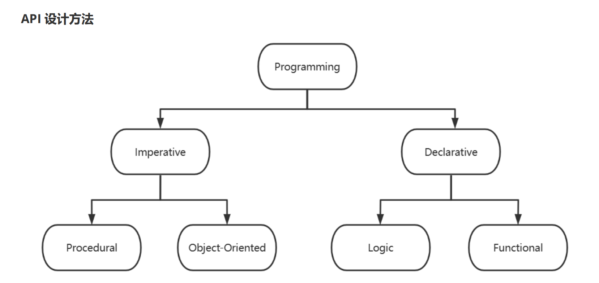

# Kubernetes 资源对象 和 Pod 资源

## **Kubernetes 集群管理工具 kubectl 命令**

对于kubectl主要有8组命令，分别是：基本命令、部署命令、集群管理命令排障调试命令、高级命令、设置命令、其他命令等

**命令格式**

```bash
kubectl [command] [TYPE] [NAME] [flags]

#参数说明
command 	#操作Kubernetes资源对象的子命令，常见的有create、delete、describe、get等
create 		#创建资源对象 
delete 		#删除资源对象
describe 	#查找资源的详细信息
get 		#获取资源基本信息

TYPE	#Kubernetes资源类型，举例：节点的资源类型是nodes，缩写no
NAME	#Kubernetes资源对象的名称，可以省略。
flags	#可选参数
```

**常见资源缩写**

**最基础资源对象**

| **资源对象全称** | **缩写** |
| :--------------: | :------: |
|     Pod/Pods     |   `po`   |
|    Node/Nodes    |   `no`   |

**最常见资源对象**

|      **资源对象全称**      | **缩写** |
| :------------------------: | :------: |
|  Replication Controllers   |   `rc`   |
| Horizontal Pod Autoscalers |  `hpa`   |
|        Replica Sets        |   `rs`   |
|     Persistent Volume      |   `pv`   |
|         Deployment         |  `dep`   |
|  Persistent Volume Claims  |  `pvc`   |
|          Services          |  `svc`   |

### **其他资源对象**

| **资源对象全称** | **缩写** |
| :--------------: | :------: |
|    Namespaces    |   `ns`   |
| Storage Classes  |   `sc`   |
|   Config Maps    |   `cm`   |
|   Daemon Sets    |   `ds`   |
|  Stateful Sets   |  `sts`   |
|    Endpoints     |   `ep`   |
|     Secrets      |          |
|      Events      |   `ev`   |
|       Jobs       |          |
|    Ingresses     |  `ing`   |


```bash
#命令来查看,默认有56种资源
[root@master1 ~]#kubectl api-resources 
#查看组
[root@master1 ~]#kubectl api-versions 
```


**查看帮助**

```bash
#kubectl命令帮助
kubectl --help

#查看子命令的格式
kubectl <command> --help

#查看命令的通用选项
kubectl options
```

```bash
[root@master1 ~]#kubectl --help
kubectl controls the Kubernetes cluster manager.

 Find more information at: https://kubernetes.io/docs/reference/kubectl/

基本命令 (Beginner):
  create       	  #从文件或标准输入创建资源
  expose     	#将复制控制器、服务、部署或 pod 公开为新的 Kubernetes 服务
  run         	   # 在集群上运行特定映像
  set              # 设置对象上的特定特征

基本命令 (Intermediate):
  explain         #获取资源的文档
  get              #显示一个或多个资源
  edit             #编辑服务器上的资源
  delete          #通过文件名、标准输入、资源和名称或通过资源和标签选择器删除资源

部署 Commands:
  rollout         #管理资源的推出
  scale            #为部署、副本集或复制控制器设置新大小
  autoscale     #自动扩展部署、副本集、状态集或复制控制器

集群管理命令:
  certificate    	# 修改证书资源
  cluster-info     # 显示集群信息
  top                  #显示资源（CPU/内存）使用情况
  cordon            #将节点标记为不可调度
  uncordon        # 将节点标记为可调度
  drain               # 清空节点以准备维护
  taint                #更新一个或多个节点上的污点

故障排除和调试命令:

 describe 		   #显示特定资源或资源组的详细信息
 logs 				  #打印 pod 中容器的日志
 attachment     # 附加到正在运行的容器
 exec 			      #在容器中执行命令
 port-forward 	 #将一个或多个本地端口转发到 pod
 proxy 				 #运行 Kubernetes API 服务器的代理
 cp 					#将文件和目录复制到容器和从容器复制文件和目录
 auth 				 #检查授权
 debug 				#创建调试会话以排除工作负载和节点故障
 events 			#列出事件


高级命令：
diff 				#将当前版本与将要应用的版本进行比较
apply 			 #通过文件名或标准输入将配置应用于资源
patch            #更新资源的字段
replace         # 通过文件名或标准输入替换资源
wait               #实验：等待一个或多个资源上的特定条件
kustomize     #从目录或 URL 构建 kustomization 目标

设置命令：
label 					#更新资源上的标签
annotate 			#更新资源上的注释
completion 			#输出指定 shell（bash、zsh、fish 或 powershell）的 shell 完成代码

Subcommands provided by plugins:

其他命令：
api-resources 		#打印服务器上支持的 API 资源
api-versions 		#打印服务器上支持的 API 版本，格式为“group/version”
config 				    #修改 kubeconfig 文件
plugin 					#提供与插件交互的实用程序
version    				#打印客户端和服务端版本信息

Usage:
  kubectl [flags] [options]

```


### **常见用法**

#### 自动补全

```bash
[root@master1 ~]#kubectl completion --help
source <(kubectl completion bash)
[root@master1 ~]#cat 'source <(kubectl completion bash)' >> /root/.bashrc
```

#### **查看资源对象**

```bash
kubectl get TYPE/NAME ... [-o yaml/json/wide | -w]
kubectl get TYPE NAME ... [-o yaml/json/wide | -w]

#参数解析：
-w 		#是实时查看资源的状态。
-o 		#是以多种格式查看资源的属性信息
--raw 	#从api地址中获取相关资源信息
```

#### 描述资源对象

```
kubectl describe TYPE NAME
kubectl describe TYPE/NAME
```

#### 范例

```bash
#查看当前主机的工作节点
[root@master1 ~]#kubectl get nodes 
NAME               STATUS   ROLES           AGE   VERSION
master1.kang.org   Ready    control-plane   49m   v1.32.3
node1.kang.org     Ready    <none>          40m   v1.32.3
node2.kang.org     Ready    <none>          39m   v1.32.3
node3.kang.org     Ready    <none>          40m   v1.32.3

#获取节点的基本信息
[root@master1 ~]#kubectl describe nodes master1.kang.org 

#查看指定的多个不同类型的资源
[root@master1 ~]#kubectl get svc/myapp deployments/myapp

#获取特定的信息
[root@master1 ~]#kubectl -n kube-system get pods etcd-master1.kang.org -o go-template={{.status.podIP}}
10.0.0.100

[root@master1 ~]#kubectl -n kube-system get pods kube-apiserver-master1.kang.org -o go-template={{.status.podIP}}
10.0.0.100

[root@master1 ~]#kubectl -n kube-system get pods kube-proxy-4zl7h -o go-template={{.status.podIP}}
10.0.0.100
```


#### **创建应用**


## **资源对象**


 

Kubernetes 的API 资源分为两种: 

- 内置API 资源: Kubernetes 安装后自身具有的
- 自定义的API 资源: 用户自定义的API,称为CRD(Custom Resource Definition),可以通过安装一些组件生成


从资源的主要功能上Kubernetes 的资源对象分为：

- Workloads(工作负载)
- Service,LoadBalancing and Networking(服务发现和负载均衡)
- 存储和配置(Storage&Configuration)
- Cluster Admin(集群管理)
- Policies&Scheduling(策略和调度)
- Metadata(元数据)

### 查看资源类型

```bash
[root@master1 ~]#kubectl api-resources 
[root@master1 ~]#kubectl api-versions 
[root@master1 ~]#kubectl api-resources --api-group=apps
[root@master1 ~]#kubectl api-resources | awk '{print $1}'
[root@master1 ~]#kubectl api-resources | awk '{print $1}'|wc -l
[root@master1 ~]#kubectl get all -A
```

### **名称空间级别资源**

**工作负载型资源( workload )：**

- Pod：这是我们K8S 中最小的组成部分，特点就是和我们的 pause 共享我们的网络栈、共享存储卷。
- replicaset：也就是 RS ，这是我们的调度器控制器，负责管理 pod 的创建，通过我们标签的选择去控制pod 的副本数
- Deployment：控制器，通过控制 RS 的创建去创建 pod 。
- statefulset：主要是为了我们的有状态服务去建立的这么一个管理器。
- Daemonset：可以在我们每个节点都运行一个 pod 的组件。
- job：我们的工作，为了批处理任务。
- cronjob：我们的轮询工作，为了批处理任务。

**服务发现及负载均衡型资源( ServiceDiscovery LoadBalance ):**

- Service（简称为svc）：为了把我们的服务暴露出去
- Ingress：为了把我们的服务暴露出去,由此接受外部的访问

**配置与存储型资源：**

- Volume： 存储卷，为了给 pod 提供一个持久化的能力
- CSI（容器存储接口）：,可以扩展各种各样的第三方存储卷，在K8S中很多资源需要灵活的提供给我们的容器去运行，但是在K8S中定义了 CSI 接口只要存储资源符合这个接口的规范，那我这个 K8S 集群中 pod 就能够去调用这个存储，这种接口就叫做CSI ，基本上现在市面上能够见到的存储都是支持 CSI 的。

**特殊类型的存储卷：**

- ConfigMap（当配置中心来使用的资源来型）：一般来说用来存储配置文件，达到热更新的状态。
- Secret：加密的方案去存储数据的，所以可以通过它来保存一些密码文件、密钥等等
- DownwardAPI：把外部环境中的信息输出给容器、这个和CSI也比较像，也就意味着可以通过一个下载文件的接口，通过这个接口可以去调用里面的数据，存储和上传等等

### **集群级资源**

集群级资源：

- Namespace（名称空间）
- Node（工作节点）、Role（角色）
- ClusterRole（集群角色）
- RoleBinding（重新链接）
- ClusterRoleBinding（集群重新链接）

### **元数据型资源**

元数据型资源（根据一些指标去进行对应的操作）：

- HPA
- PodTemplate（pod模板）
- LimitRange（资源限制）


```bash
[root@master1 ~]#kubectl api-resources 
NAME                                SHORTNAMES   APIVERSION                        NAMESPACED   KIND
bindings                                         v1                                true         Binding
componentstatuses                   cs           v1                                false        ComponentStatus
configmaps                          cm           v1                                true         ConfigMap
endpoints                           ep           v1                                true         Endpoints
events                              ev           v1                                true         Event
limitranges                         limits       v1                                true         LimitRange
namespaces                          ns           v1                                false        Namespace
nodes                               no           v1                                false        Node
persistentvolumeclaims              pvc          v1                                true         PersistentVolumeClaim
persistentvolumes                   pv           v1                                false        PersistentVolume
pods                                po           v1                                true         Pod
podtemplates                                     v1                                true         PodTemplate
replicationcontrollers              rc           v1                                true         ReplicationController
resourcequotas                      quota        v1                                true         ResourceQuota
secrets                                          v1                                true         Secret
serviceaccounts                     sa           v1                                true         ServiceAccount
services                            svc          v1                                true         Service
mutatingwebhookconfigurations                    admissionregistration.k8s.io/v1   false        MutatingWebhookConfiguration
validatingadmissionpolicies                      admissionregistration.k8s.io/v1   false        ValidatingAdmissionPolicy
validatingadmissionpolicybindings                admissionregistration.k8s.io/v1   false        ValidatingAdmissionPolicyBinding
validatingwebhookconfigurations                  admissionregistration.k8s.io/v1   false        ValidatingWebhookConfiguration
customresourcedefinitions           crd,crds     apiextensions.k8s.io/v1           false        CustomResourceDefinition
apiservices                                      apiregistration.k8s.io/v1         false        APIService
controllerrevisions                              apps/v1                           true         ControllerRevision
daemonsets                          ds           apps/v1                           true         DaemonSet
deployments                         deploy       apps/v1                           true         Deployment
replicasets                         rs           apps/v1                           true         ReplicaSet
statefulsets                        sts          apps/v1                           true         StatefulSet
selfsubjectreviews                               authentication.k8s.io/v1          false        SelfSubjectReview
tokenreviews                                     authentication.k8s.io/v1          false        TokenReview
localsubjectaccessreviews                        authorization.k8s.io/v1           true         LocalSubjectAccessReview
selfsubjectaccessreviews                         authorization.k8s.io/v1           false        SelfSubjectAccessReview
selfsubjectrulesreviews                          authorization.k8s.io/v1           false        SelfSubjectRulesReview
subjectaccessreviews                             authorization.k8s.io/v1           false        SubjectAccessReview
horizontalpodautoscalers            hpa          autoscaling/v2                    true         HorizontalPodAutoscaler
cronjobs                            cj           batch/v1                          true         CronJob
jobs                                             batch/v1                          true         Job
certificatesigningrequests          csr          certificates.k8s.io/v1            false        CertificateSigningRequest
leases                                           coordination.k8s.io/v1            true         Lease
endpointslices                                   discovery.k8s.io/v1               true         EndpointSlice
events                              ev           events.k8s.io/v1                  true         Event
flowschemas                                      flowcontrol.apiserver.k8s.io/v1   false        FlowSchema
prioritylevelconfigurations                      flowcontrol.apiserver.k8s.io/v1   false        PriorityLevelConfiguration
ingressclasses                                   networking.k8s.io/v1              false        IngressClass
ingresses                           ing          networking.k8s.io/v1              true         Ingress
networkpolicies                     netpol       networking.k8s.io/v1              true         NetworkPolicy
runtimeclasses                                   node.k8s.io/v1                    false        RuntimeClass
poddisruptionbudgets                pdb          policy/v1                         true         PodDisruptionBudget
clusterrolebindings                              rbac.authorization.k8s.io/v1      false        ClusterRoleBinding
clusterroles                                     rbac.authorization.k8s.io/v1      false        ClusterRole
rolebindings                                     rbac.authorization.k8s.io/v1      true         RoleBinding
roles                                            rbac.authorization.k8s.io/v1      true         Role
priorityclasses                     pc           scheduling.k8s.io/v1              false        PriorityClass
csidrivers                                       storage.k8s.io/v1                 false        CSIDriver
csinodes                                         storage.k8s.io/v1                 false        CSINode
csistoragecapacities                             storage.k8s.io/v1                 true         CSIStorageCapacity
storageclasses                      sc           storage.k8s.io/v1                 false        StorageClass
volumeattachments                                storage.k8s.io/v1                 false        VolumeAttachment
```

```powershell
true 名称空间级
false 集群级
```

```bash
[root@master1 ~]#kubectl api-versions 
admissionregistration.k8s.io/v1
apiextensions.k8s.io/v1
apiregistration.k8s.io/v1
apps/v1
authentication.k8s.io/v1
authorization.k8s.io/v1
autoscaling/v1
autoscaling/v2
batch/v1
certificates.k8s.io/v1
coordination.k8s.io/v1
discovery.k8s.io/v1
events.k8s.io/v1
flowcontrol.apiserver.k8s.io/v1
networking.k8s.io/v1
node.k8s.io/v1
policy/v1
rbac.authorization.k8s.io/v1
scheduling.k8s.io/v1
storage.k8s.io/v1
v1

[root@master1 ~]#kubectl api-resources --api-group='storage.k8s.io'
NAME                   SHORTNAMES   APIVERSION          NAMESPACED   KIND
csidrivers                          storage.k8s.io/v1   false        CSIDriver
csinodes                            storage.k8s.io/v1   false        CSINode
csistoragecapacities                storage.k8s.io/v1   true         CSIStorageCapacity
storageclasses         sc           storage.k8s.io/v1   false        StorageClass
volumeattachments                   storage.k8s.io/v1   false        VolumeAttachment

[root@master1 ~]#kubectl api-resources --api-group='apps'
NAME                  SHORTNAMES   APIVERSION   NAMESPACED   KIND
controllerrevisions                apps/v1      true         ControllerRevision
daemonsets            ds           apps/v1      true         DaemonSet
deployments           deploy       apps/v1      true         Deployment
replicasets           rs           apps/v1      true         ReplicaSet
statefulsets          sts          apps/v1      true         StatefulSet

```

### **资源及其在** **API** **中的组织形式**

- Kubernetes 利用标准的 RESTful 术语来描述其 API 概念。
- 资源类型：是指在 URL 中使用的名称，如 Pod、Namespace 和 Service 等，其 URL 格式为"/GROUP/VERSION/RESOURCE"，示例：/apps/v1/deployment
- 所有资源类型都有一个对应的 JSON 表示格式：kind(种类)，在 K8s 中用户创建对象必须以 JSON格式提交对象的配置信息。
- 隶属于同一资源类型的对象组成的列表称为 collection(集合)，如 PodList
- 某种类型的单个实例称为"resource"(资源)或"object"(对象)，如运行的名为 pod-test 的 Pod 对象


kind 代表了资源对象所属的类型，如 Namespace、Deployment、Service 等类型，这些类型又可以分为三个类别：

- Object 类：对象表示 K8s 系统上的持久化实体，Namespace、Deployment、Service 和 Pod 都属于该类别
- List 列表类：列表是指同一类型资源的集合，如 PodList、NodeList 等。
- Simple 简单类：常用于子对象上执行某种特殊操作，或者管理非持久的实体，如/binding 或/status 等

Kubernetes 将 API 分割为多个逻辑组合，称为**API** **群组**，不同的群组支持单独启用或禁用，并可以再次

分解。群组化管理的 API 使得其可以更轻松的进行扩展。当前 K8s 集群系统上的 API server 上的相关信

息可以使用 `kubectl api-versions` 获取。

#### 访问 Kubernetes REST API

```bash
#默认无法访问
[root@master1 ~]#curl -sk https://kubeapi.kang.org:6443
{
  "kind": "Status",
  "apiVersion": "v1",
  "metadata": {},
  "status": "Failure",
  "message": "forbidden: User \"system:anonymous\" cannot get path \"/\"",
  "reason": "Forbidden",
  "details": {},
  "code": 403
}
```

#### 用代理访问

```bash
[root@master1 ~]#kubectl proxy --port=8081
Starting to serve on 127.0.0.1:8081

[root@master1 ~]#curl -s 127.0.0.1:8081
{
  "paths": [
    "/.well-known/openid-configuration",
    "/api",
    "/api/v1",
    "/apis",
    "/apis/",
    "/apis/admissionregistration.k8s.io",
    "/apis/admissionregistration.k8s.io/v1",
    "/apis/apiextensions.k8s.io",
    "/apis/apiextensions.k8s.io/v1",
    "/apis/apiregistration.k8s.io",
    "/apis/apiregistration.k8s.io/v1",

```

```bash
[root@master1 ~]#kubectl create ns demo-ns

[root@master1 ~]#curl -s 127.0.0.1:8081/api/v1/namespaces/demo-ns
{
  "kind": "Namespace",
  "apiVersion": "v1",
  "metadata": {
    "name": "demo-ns",
    "uid": "aaaccb69-c49f-4d69-b282-2afaab4ec11b",
    "resourceVersion": "20521",
    "creationTimestamp": "2025-03-22T11:31:43Z",
    "labels": {
      "kubernetes.io/metadata.name": "demo-ns"
    },
    "managedFields": [
      {
        "manager": "kubectl-create",
        "operation": "Update",
        "apiVersion": "v1",
        "time": "2025-03-22T11:31:43Z",
        "fieldsType": "FieldsV1",
        "fieldsV1": {
          "f:metadata": {
            "f:labels": {
              ".": {},
              "f:kubernetes.io/metadata.name": {}
            }
          }
        }
      }
    ]
  },
  "spec": {
    "finalizers": [
      "kubernetes"
    ]
  },
  "status": {
    "phase": "Active"
  }
}
```

#### **Kubernetes API** **设计理念**

Kubernetes设计理念与分布式系统

分析和理解Kubernetes的设计理念可以使我们更深入地了解Kubernetes系统，更好地利用它管理分布式部署的云原生应用，另一方面也可以让我们借鉴其在分布式系统设计方面的经验。




- **命令式API**

  也称为指令式API，用户需要一步步地告诉机器该如何做(How) ，机器自身不具有任何“智能”，只被动接受指令

- 高度依赖用户自身理解和达成目标的能力和处理各类异常问题的经验，实现的是“命令式编程Imperative Programming

  **声明式API**

  也称为申明式API，用户只需要告诉机器想要的结果(What)，机器自身需要确定如何达成该目标

  机器需要一定的“智能”，但通常只能支持事先预设和可被其理解的特定任务

  实现的是“声明式编程 Declarative Programming

  相较于命令式编程，声明式编程是一个更高的层次上的编程

  声明式API允许用户以给出最终期望目标的方式编写代码，但具体的执行过程（即机器智能的那部分代码），最终仍然需要以命令式编程实现，只不过，它们可由不同的人群完成

  类比来说，声明式编程的用户类似于企业的高管，只用关心和交待最终目标;而命令式编程的用户类似于企业部门经理，他需要理解目标的达成路径，并组织人力完成目标


### **资源清单格式**

大部分的对象或类别类型的资源还需要有三个嵌套的字段：metadata、spec 和 status 字段。

- metadata为资源提供元数据，如名称、隶属的名称空间和标签等；
- spec 字段则用于定义用户期望的状态，不同的资源类型，其状态的意义也各有不同，如 Pod 资源最为核心的功能在于运行容器；
- status 字段则记录着活动对象的当前状态信息，它由 Kubernetes 系统自行维护，对用户来说为只读字段。

在Kubernetes集群中，资源对象产生流程

- 根据业务应用架构的分析，确定我们要使用的资源对象(Kubernetes中的)
- 使用描述性语言，编写资源对象的定义文件
- 基于资源对象定义文件进行对象初始化，形成资源对象。

资源定义文件：

- 用来初始化kubernetes资源对象的
- 定义文件的格式根据其编写语言的种类，一般分为两种：YAML和json，
- 工作中我们常用的就是YAML

**YAML格式说明**

- 大小写敏感
- 使用缩进表示层级关系
- 缩进时不允许使用Tab键，只允许使用空格。
- 缩进的空格数目不重要，只要相同层级的元素左侧对齐即可
- 以#开始的内容表示注释，从这个字符一直到行尾，都会被解析器忽略

#### apiVersion和kind

- apiVersion和kind 描述类型的元数据

  apiVersion：API版本,用于对同一资源对象的不同版本进行并行管理，主要有 alpha、betal、stable

  格式：组名/版本

  查看命令：`**kubectl api-versions**`，可以看到当前共有27+个分组和版本

- kind：资源类型,kubernetes的专用资源对象

  查看命令： `**kubectl api-resources [--api-group=]**`，可以看到当前共有50+种资源对象和对应的APIVERSION 版本信息

#### **metadata** **嵌套字段**

metadata 字段用于描述对象的元数据,即属性信息，其内嵌多个用于定义资源的元数据，如 name 和labels 等。这些字段可以分为必选字段和可选字段

必选字段：

- name: 设定当前对象的名称，名称空间间级的资源在其所属的名称空间的同一类型中必须唯一
- namespace: 指定当前对象隶属的名称空间，默认值为 default，实现资源隔离
- uid: 当前对象的唯一标识符，用于区别"已删除"和"重新创建"的同一个名称的对象,系统可以自动生成

可选字段通常是指有 Kubernetes 系统自行维护和设置，或者存在默认，或允许使用空值的字段。

有以下可选字段：

- labels: 设定用于标识当前对象的标签，键值数据，格式：key1: value1 ,常用作标签选择器的挑选条件
- annotation: 非标识型键值数据，格式：key1: value1,用来作为挑选条件，用于 labels 的补充，不支持标签选择器的选择
- resourceVersion:当前对象的内部版本标识，用来让客户端确定对象的变动与否
- generation: 标识当前对象目标状态的代别
- creationTimestamp: 当前对象创建日期的时间戳
- deletionTimestamp: 当前对象删除日期的时间戳

#### **spec** **和** **status** **字段**

定义资源配置清单时，spec 是必须的字段。用于描述对象的目标状态，也就是用户期望对象所表现出来的特征。

- spec 字段

  Specification 规格字段

  此字段对于不同的对象类型来说各不相同，具体字段含义及所接受的数据类型需要参照 Kubernets API 手册中的说明进行获取。可通过命令 kubectl explain KIND.spec 获取具体帮助

- status 字段

  此字段记录对象的当前实际运行的状态，由 Kubernetes 系统负责更新，用户不能手动定义。

  Master 节点的 controller manager 通过相应的控制器组件动态管理并确保对象的实际转态匹配用户所期望的状态。比如:Deployment 是一种描述集群中运行应用的资源对象，因此，创建

  Deployment 类型对象时，需要为目标 Deployment 对象设定 spec，指定期望需要运行的 Pod 副本数量、使用的标签选择器以及 Pod 模板等。在创建时，Kubernetes 相关组件读取待创建的

  Deployment 对象的 spec以及系统上相应的活动对象的当前状态，必要时对活动的对象更新以确保 status 字段吻合 spec 字段中期望的状态

注意：数据类的资源对象无spec, Status 字段，比如：configmaps，secrets ， endpoints 等

**注意：字段名一般为小驼峰命名法，字段值为大驼峰命名法**

**通过** **kubectl explain** **查看帮助生成新的清单文件**

```bash
#格式
kubectl explain TYPE_NAME [--api-verion=GROUP_NAME/VERSION]
```

```bash
[root@master1 ~]#kubectl explain namespace
KIND:       Namespace
VERSION:    v1

DESCRIPTION:
    Namespace provides a scope for Names. Use of multiple namespaces is
    optional.
    
FIELDS:
  apiVersion	<string>
    APIVersion defines the versioned schema of this representation of an object.
    Servers should convert recognized schemas to the latest internal value, and
    may reject unrecognized values. More info:
    https://git.k8s.io/community/contributors/devel/sig-architecture/api-conventions.md#resources

  kind	<string>
    Kind is a string value representing the REST resource this object
    represents. Servers may infer this from the endpoint the client submits
    requests to. Cannot be updated. In CamelCase. More info:
    https://git.k8s.io/community/contributors/devel/sig-architecture/api-conventions.md#types-kinds

  metadata	<ObjectMeta>
    Standard object's metadata. More info:
    https://git.k8s.io/community/contributors/devel/sig-architecture/api-conventions.md#metadata

  spec	<NamespaceSpec>
    Spec defines the behavior of the Namespace. More info:
    https://git.k8s.io/community/contributors/devel/sig-architecture/api-conventions.md#spec-and-status

  status	<NamespaceStatus>
    Status describes the current status of a Namespace. More info:
    https://git.k8s.io/community/contributors/devel/sig-architecture/api-conventions.md#spec-and-status

```

### **创建资源清单文件**

#### 利用dry-run模拟运行指令式命令生成清单文件

```bash
#生成清单文件
[root@master1 ~]#kubectl create ns demo --dry-run=client -o yaml > demo.yaml
[root@master1 ~]#cat demo.yaml 
apiVersion: v1
kind: Namespace
metadata:
  creationTimestamp: null
  name: demo
spec: {}
status: {}

[root@master1 ~]#kubectl get ns
NAME              STATUS   AGE
default           Active   115m
demo              Active   2m51s
kube-flannel      Active   101m
kube-node-lease   Active   115m
kube-public       Active   115m
kube-system       Active   115m
```

#### **利用现有资源生成清单文件再修改为新的清单文件**

```bash
kubectl get TYPE NAME -o yaml > /path/export-resourcelist.yaml
kubectl get TYPE/NAME -o yaml > /path/export-resourcelist.yaml
```

```bash
[root@master1 ~]#kubectl get pod kube-flannel-ds-9p7x2 -n kube-flannel -o yaml
[root@master1 ~]#kubectl get pod kube-flannel-ds-9p7x2 -n kube-flannel -o yaml > test.yaml
```

#### 将 Docker Compose 文件转换为 Kubernetes 资源

```
https://kubernetes.io/zh-cn/docs/tasks/configure-pod-container/translate-compose-kubernetes/
```

Kompose 官网 http://kompose.io

### **资源对象的管理方式**

**kubectl** **命令可分为三类命令：**

指令式命令(imperative command): 

指令式命令包括**kubectl run/expose/delete/get**等命令

适合完成一次性的操作任务

指令式对象配置(imperative object configuration): 

指令式对象配置管理包括**kubectl create/delete/get/replace/edit**等

基于资源配置文件执行对象管理操作，但只能独立引用每个配置清单文件

指令式管理配置与指令式命令的区别是，其需要用户提供资源清单文件，通过资源清单来读取需要管理的目标资源对象。指令式对象配置管理的管理操作直接作用于活动对象，会导致用户丢失活动对象的当前状态。

**此方式没有幂等性,重复执行可能会出错,生产不推荐使用**

声明式对象配置(declarative object configration): 

基于资源配置文件执行对象管理操作

可直接引用目录下的所有配置清单文件，也可直接作用于单个配置文件

声明式对象配置并不直接指明要进行的对象管理操作，而是提供配置清单文件给 Kubernetes 系统，并委托系统跟踪活动对象的状态变动。

资源对象的创建、删除及修改操作全部通过命令**kubectl apply/patch等**来完成，并且每次操作时，提供给命令的配置信息都将保存于对象的注释信息(kubectl.kubernetes.io/last-appliedconfiguration)中，并且通过对比检查活动对象的当前状态、注解中的配置信息和资源清单中的配置三方的变更来实现仅修改变动字段的高级补丁机制。

```bash
kubectl apply -f /path/file -f ..... #加载指定文件
kubectl apply -f /path  #加载指定目录下的所有以.yaml,.yml,.json后缀的文件
kubectl apply -f URL    #加载URL的文件
```

```bash
#方式一：指令式
[root@master1 ~]#kubectl create 
clusterrolebinding   (Create a cluster role binding for a particular cluster role)
clusterrole          (Create a cluster role)
configmap            (Create a config map from a local file, directory or literal value)
cronjob              (Create a cron job with the specified name)
deployment           (Create a deployment with the specified name)
ingress              (Create an ingress with the specified name)
job                  (Create a job with the specified name)
namespace            (Create a namespace with the specified name)
poddisruptionbudget  (Create a pod disruption budget with the specified name)
priorityclass        (Create a priority class with the specified name)
quota                (Create a quota with the specified name)
rolebinding          (Create a role binding for a particular role or cluster role)
role                 (Create a role with single rule)
secret               (Create a secret using a specified subcommand)
serviceaccount       (Create a service account with the specified name)
service              (Create a service using a specified subcommand)
token                (Request a service account token)

[root@master1 ~]#kubectl create ns demo

#方式二：指令式调用清单文件
#清单文件
#yaml、yml、json 格式
#五个字段
apiVersion: v1  
kind: Namespace
metadata:
	name: demo
spec
status

[root@master1 ~]#kubectl create -f test.yaml
#没有幂等性

#方式三：声明式调用清单文件
[root@master1 ~]#kubectl create -f test.yaml
#具有幂等性
```


**如果文件里有多个资源清单比如：**

```bash
[root@master1 ~]#ls data
a.yaml  c.yaml  e.yaml  g.yaml  i.yaml  k.yaml  m.yaml  o.yaml  q.yaml  s.yaml  u.yaml  w.yaml  y.yaml
b.yaml  d.yaml  f.yaml  h.yaml  j.yaml  l.yaml  n.yaml  p.yaml  r.yaml  t.yaml  v.yaml  x.yaml  z.yaml
[root@master1 ~]#cd data
[root@master1 data]#kubectl apply -f .
[root@master1 ~]#kubectl apply -f data/
```

```bash
#不执行模拟执行
[root@master1 ~]#kubectl create ns demo --dry-run=client -o yaml

#删除资源
[root@master1 ~]#kubectl delete ns demo
[root@master1 ~]#kubectl delete -f demo.yaml 
```

## **名称空间**

```
https://kubernetes.io/docs/tasks/administer-cluster/namespaces/
```


Kubernetes 的资源工作的有效范围分成两种级别:

- 集群级别: 针对整个Kubernetes集群内都有效
- 名称空间级别: 只针对指定名称空间内有效,而不属于任务名称空间

名称空间 Namespace 用于将集群分隔为多个隔离的逻辑分区以配置给不同的用户、租户、环境或者项目使用。

名称空间限定了资源对象工作在指定的名称范围内的作用域

例如，可以为 development、Quality Assurance和 production 应用环境分别创建各自的名称空间。

注意: 名称空间本身是 Kubernetes 集群级别的资源

Kubernetes 的大多数资源都属于名称空间级别,除此还有全局性的集群级别的资源。

也因此这些集群级别的资源对象的名称必须在集群中全局唯一

比如: Node、Namespace、clusterrole 和 PersistentVolume 等资源不属于任何名称空间

需要使用名称空间的场景

- 环境管理: 

  需要在同一Kubernetes集群上隔离研发、预发和生产等一类的环境时，可以通过名称空间进行

- 隔离:

  多个项目团队的不同产品线需要部署于同一Kubernetes集群时，可以使用名称空间进行隔离

- 资源控制:

  名称空间可用作资源配额的承载单位，从而限制其内部所有应用可以使用的CPU/Memory/PV各自的资源总和

  需要在产品线或团队等隔离目标上分配各自总体可用的系统资源时，可通过名称空间实现

- 权限控制:

  基于RBAC鉴权体系，能够在名称空间级别进行权限配置

- 提高集群性能:

  进行资源搜索时，名称空间有利于Kubernetes API缩小查找范围，从而对减少搜索延迟和提升性能有一定的帮助

**Kubernetes的名称空间可以划分为两种类型**

- 系统级名称空间:

  由Kubernetes集群默认创建，主要用来隔离系统级的资源对象

  所有的系统级名称空间均不能进行删除操作（即使删除也会自动重建）

  除default外，其它三个系统级名称空间不应该用作业务应用的部署目标

- 自定义名称空间

  由用户按需创建

  比如: 根据项目和场景, 分别创建对应不同的名称空间

**系统级名称空间**

- default：为任何名称空间级别的资源提供的默认的名称空间

- kuhe-system：Kubernetes集群自身组件及其它系统级组件使用的名称空间，Kubernetes自身的关键组件均部署在该名称空间中

- kube-public：公众开放的名称空间，所有用户（包括Anonymous）都可以读取内部的资源,通常为空

- kube-node-lease：节点租约资源所用的名称空间

  分布式系统通常使用“租约(Leqse)”机制来锁定共享资源并协调集群成员之间的活动

  Kubernetes上的租约概念由API群组coordination.k8s.io群组下的Lease资源所承载，以支撑系统级别的功能需求，例如节点心跳( node heartbeats)和组件级的领导选举等

  Kubernetes集群的每个管理组件在该名称空间下都有一个与同名的Iease资源对象

  ```bash
  ~# kubectl -n kube-node-lease get lease
  ```

  

kubernetes 和Docker的名称空间的区别

- kubernetes的名称空间, 用户根据需要可以自行创建删除,属于用户级别
- Docker的名称空间是内核内置,用户不能创建删除,属于内核级别

```bash
#查询所有名称空间
[root@master1 ~]#kubectl get namespaces 
NAME              STATUS   AGE
default           Active   94m
kube-flannel      Active   80m
kube-node-lease   Active   94m
kube-public       Active   94m
kube-system       Active   94m

#查看名称空间里的所有容器（不写-n，查看默认的名称空间）
[root@master1 ~]#kubectl get pod -n kube-flannel 
NAME                    READY   STATUS    RESTARTS   AGE
kube-flannel-ds-9p7x2   1/1     Running   0          81m
kube-flannel-ds-bd6wq   1/1     Running   0          81m
kube-flannel-ds-nwbkm   1/1     Running   0          81m
kube-flannel-ds-tl4vb   1/1     Running   0          81m

#查看所有的名称空间的容器
[root@master1 ~]#kubectl get pod -A
NAMESPACE      NAME                                       READY   STATUS    RESTARTS   AGE
kube-flannel   kube-flannel-ds-9p7x2                      1/1     Running   0          82m
kube-flannel   kube-flannel-ds-bd6wq                      1/1     Running   0          82m
kube-flannel   kube-flannel-ds-nwbkm                      1/1     Running   0          82m
kube-flannel   kube-flannel-ds-tl4vb                      1/1     Running   0          82m
kube-system    coredns-6766b7b6bb-f4fwb                   1/1     Running   0          97m
kube-system    coredns-6766b7b6bb-msq4t                   1/1     Running   0          97m
kube-system    etcd-master1.kang.org                      1/1     Running   0          97m
kube-system    kube-apiserver-master1.kang.org            1/1     Running   0          97m
kube-system    kube-controller-manager-master1.kang.org   1/1     Running   0          97m
kube-system    kube-proxy-4zl7h                           1/1     Running   0          97m
kube-system    kube-proxy-6bzvc                           1/1     Running   0          86m
kube-system    kube-proxy-ldx66                           1/1     Running   0          88m
kube-system    kube-proxy-v96pf                           1/1     Running   0          88m
kube-system    kube-scheduler-master1.kang.org            1/1     Running   0          97m

```

### 创建 Namespace 资源

```bash
[root@master1 ~]#kubectl create ns demo --dry-run=client -o yaml > demo.yaml
[root@master1 ~]#kubectl apply -f demo.yaml 
namespace/demo created

```

```bash
[root@master1 ~]#kubectl get ns
NAME              STATUS   AGE
default           Active   4h17m
demo              Active   24s
kube-flannel      Active   4h3m
kube-node-lease   Active   4h17m
kube-public       Active   4h17m
kube-system       Active   4h17m

[root@master1 ~]#kubectl get ns default -o yaml
apiVersion: v1
kind: Namespace
metadata:
  creationTimestamp: "2025-03-22T08:03:25Z"
  labels:
    kubernetes.io/metadata.name: default
  name: default
  resourceVersion: "34"
  uid: 3a373edd-7788-4bf3-94f4-84e0ce001d2a
spec:
  finalizers:
  - kubernetes
status:
  phase: Active

#删除资源
[root@master1 ~]#kubectl delete ns demo
[root@master1 ~]#kubectl delete -f demo.yaml 

#范例
[root@master1 ~]#kubectl delete svc,deployment --all -n demo
```

## **Pod** **资源**

```
pod				花生壳
container	 花生米
```

Pod 是一个或多个容器的集合，因而也可称为容器集，但却是Kubernetes调度、部署和运行应用的原子单元

同一Pod内的所有容器都将运行于由Scheduler选定的同一个worker节点上

在同一个pod内的容器共享的存储资源、网络协议栈及容器的运行控制策略等

每个Pod中的容器依赖于一个特殊名为pause容器事先创建出可被各应用容器共享的基础环境，包括Network、IPC和UTS名称空间共享给Pod中各个容器，PID名称空间也可以共享，但需要用户显式定义,Mount和User是不共享的,每个容器有独立的Mount,User的名称空间

Docker 容器主要有六个名称空间实现容器间的资源隔离: User,Mount,Pid,IPC,Network,UTS


Pod的组成形式有两种

- 单容器Pod：除Pause容器外,仅含有一个容器
- 多容器Pod：除Pause容器外，含有多个具有“超亲密”关系的容器，一般由主容器和辅助容器（比如：sidecar容器）构成

Pod 资源分类：

- 自主式 Pod

  由用户直接定义并提交给API Server创建的Pods

  **节点故障后不具有自动调度至其它节点的故障自愈能力**

- 由Workload Controller 管控的 Pod

  比如: 由Deployment控制器管理的Pod

  **节点故障后具有自动调度至其它节点的故障自愈能力**

- 静态 Pod

  由kubelet加载配置信息后，自动在对应的节点上创建的Pod

  用于实现Master节点上的系统组件API Server 、Controller-Manager 、Scheduler 和Etcd功能的Pod

  相关配置存放在控制节点的 `/etc/kubernetes/manifests` 目录下
  
  `/etc/kubernetes/manifests` 这个路径可以修改 `[root@master1 ~]#cat /var/lib/kubelet/config.yaml`
  
  

### 指令式命令创建 Pod

```bash
kubectl run NAME --image=image [--port=port] [--replicas=replicas] 
kubectl run NAME --image=image [--env="key=value"] [--port=port] [--dry-run=server|client] [--overrides=inline-json] [--command] -- [COMMAND] [args...] [options]

#参数详解
--image='' 		#指定容器要运行的镜像
--port=''		  #设定容器暴露的端口
--dry-run=true #以模拟的方式来进行执行命令
--env=[] 		 #执行的时候，向对象中传入一些变量
--labels='' 	 #设定pod对象的标签
--limits='cpu=200m,memory=512Mi' 		#设定容器启动后的资源配置
--replicas=n 		#设定pod的副本数量,新版不再支持
--command=false    		 #设为true，将 -- 后面的字符串做为命令代替容器默认的启动命令，而非做为默认启动命令的参数
-it            		#打开交互终端
--rm          	 #即出即删除容器
--restart=Never 		#不会重启
```

### 查看pod详细信息

```bash
#查看pod详细信息，相当于docker inspect
[root@master1 ~]#kubectl describe pod -n kube-system etcd-master1.kang.org

#查看当前名称空间的所有pod
[root@master1 ~]#kubectl get pod

#查看所有空间的所有pod
[root@master1 ~]#kubectl get pod -A

#查看指定空间的所有pod
[root@master1 ~]#kubectl get pod -n kube-system

#查看指定pod当前状态信息
[root@master1 ~]#kubectl get -f pod-test1.yaml 
[root@master1 ~]#kubectl get pod pod-test1 
[root@master1 ~]#kubectl get po pod-test1

#持续查看pod状态
[root@master1 ~]#kubectl get pods pod-test1 -w

#查看扩展信息
[root@master1 ~]#kubectl get pod pod-test1 -o wide

#通过 -o yaml 的方式来进行查看yaml格式的详细信息
[root@master1 ~]#kubectl get pod pod-test -o yaml

#查看pod上面的label
[root@master1 ~]#kubectl get pod pod-test1 --show-labels

#定制化显示
#定制格式的语法：自定义字段名:属性获取命令
#多个自定义字段显示的时候，可以使用逗号","隔开
[root@master1 ~]#kubectl get pod pod-test1 -o custom-columns=NAME:metadata.name,STATUS:status.phase

#查看指定pod的详细信息
[root@master1 ~]#kubectl describe pod pod-test1

#按Json格式查看Pod 信息
[root@master1 ~]#kubectl get pod pod-test-5558f75445-9mhrt -o jsonpath={.metadata.name}
pod-test-5558f75445-9mhrt

[root@master1 ~]#kubectl get pod pod-test-5558f75445-9mhrt -o jsonpath={.spec.containers[0].name}
pod-test

[root@master1 ~]#kubectl get pod mynginx -o yaml -o jsonpath={.spec.containers[0].image}
registry.cn-beijing.aliyuncs.com/wangxiaochun/nginx:1.26.0

[root@master1 ~]#kubectl get pod myapp -o jsonpath={.status.podIP}
10.244.4.6
```

### 查看 Pod 中指定容器应用的日志

```bash
kubectl logs [-f] (POD | TYPE/NAME) [-c CONTAINER] [options]

# 选项
-f, --follow=true    		#跟踪日志
-p , --previous=true 	#默认只能查看到当前容器此次重启后生成的日志，此选项可以查看前一个已退出的容器的日志
--all-containers=true  #所有容器
--tail=N 					   #最后N个日志
```

```bash
[root@master1 ~]#kubectl get pod -A
NAMESPACE      NAME                                       READY   STATUS    RESTARTS      AGE
kube-flannel   kube-flannel-ds-9p7x2                      1/1     Running   1 (16h ago)   21h
kube-flannel   kube-flannel-ds-bd6wq                      1/1     Running   1 (16h ago)   21h
kube-flannel   kube-flannel-ds-nwbkm                      1/1     Running   1 (16h ago)   21h
kube-flannel   kube-flannel-ds-tl4vb                      1/1     Running   1 (16h ago)   21h
kube-system    coredns-6766b7b6bb-f4fwb                   1/1     Running   1 (16h ago)   21h
kube-system    coredns-6766b7b6bb-msq4t                   1/1     Running   1 (16h ago)   21h
kube-system    etcd-master1.kang.org                      1/1     Running   1 (16h ago)   21h
kube-system    kube-apiserver-master1.kang.org            1/1     Running   1 (16h ago)   21h
kube-system    kube-controller-manager-master1.kang.org   1/1     Running   1 (16h ago)   21h
kube-system    kube-proxy-4zl7h                           1/1     Running   1 (16h ago)   21h
kube-system    kube-proxy-6bzvc                           1/1     Running   1 (16h ago)   21h
kube-system    kube-proxy-ldx66                           1/1     Running   1 (16h ago)   21h
kube-system    kube-proxy-v96pf                           1/1     Running   1 (16h ago)   21h
kube-system    kube-scheduler-master1.kang.org            1/1     Running   1 (16h ago)   21h
[root@master1 ~]#kubectl logs -n kube-flannel kube-flannel-ds-9p7x2 
```


### **Pod** **工作机制**

**Pod** **结构和特点**

Kubernetes本质上是“以应用为中心”的现代应用基础设施，Pod是其运行应用及应用调度的最小逻辑单元

Kubernetes是通过组合容器将应用放置到一个个的逻辑单元Pod中，达到快速管理业务应用的效果

Pod是Kubernetes中最重要也最基本的概念。

交付单元

- 传统主机阶段 - 单台主机
- 容器环境阶段 - 单个容器
- 任务编排阶段 - Pod(容器集合)


**关于Pause容器**

Pause容器 全称 infrastucture container（又叫infra）基础容器

每个Pod包含了一个Pause容器,作为init pod存在，其他pod都会从pause 容器中fork出来,即Pause容器是Pod的父容器,主要负责僵尸进程的回收管理,通过Pause容器可以使同一个Pod里面的多个容器共享存储、网络、UTS、IPC 等。

- 每个Pod里运行着一个Pause的容器，其他容器则为业务容器，这些业务容器共享Pause容器的网络栈和Volume挂载卷
- 每个Pod内的容器之间通信和数据交换更为高效，在设计时可以充分利用这一特性将一组密切相关的服务进程放入同一个Pod中。
- 同一个Pod里的容器之间仅需通过localhost就能互相通信。
- Pod的IP是pause容器的地址
- Pod内部所有的应用容器，继承Pause容器的信息

pause容器主要为每个业务容器提供以下功能

- 网络命名空间：Pod中的多个容器能够访问同一个IP和端口范围
- IPC命名空间：Pod中的多个容器能够使用SystemV IPC或POSIX消息队列进行通信
- UTS命名空间：Pod中的多个容器共享一个主机名和域名
- Volumes（共享存储卷）:Pod中的各个容器可以访问在Pod级别定义的Volumes
- PID命名空间：默认PID是每个容器是隔离的，但是 Pod中的不同应用程序可以看到其他应用程序的进程ID


```bash
[root@master1 ~]#kubectl get pod -A -o wide | grep node1
kube-flannel   kube-flannel-ds-bd6wq                      1/1     Running   0          4h28m   10.0.0.101   node1.kang.org     <none>           <none>
kube-system    kube-proxy-ldx66                           1/1     Running   0          4h34m   10.0.0.101   node1.kang.org     <none>           <none>

[root@node1 ~]#docker ps
CONTAINER ID   IMAGE                                                COMMAND                  CREATED       STATUS       PORTS     NAMES
19a0c6d716d5   30ea53e25933                                         "/opt/bin/flanneld -…"   4 hours ago   Up 4 hours             k8s_kube-flannel_kube-flannel-ds-bd6wq_kube-flannel_653feefa-6e5a-4f47-a864-4fc1d080ecdd_0
a6196155144f   registry.aliyuncs.com/google_containers/pause:3.10   "/pause"                 4 hours ago   Up 4 hours             k8s_POD_kube-flannel-ds-bd6wq_kube-flannel_653feefa-6e5a-4f47-a864-4fc1d080ecdd_0
7f8a284431db   registry.aliyuncs.com/google_containers/kube-proxy   "/usr/local/bin/kube…"   5 hours ago   Up 5 hours             k8s_kube-proxy_kube-proxy-ldx66_kube-system_0b696636-bfcd-4e25-b074-e3741a6f5a00_0
dc53a4e1d13f   registry.aliyuncs.com/google_containers/pause:3.10   "/pause"                 5 hours ago   Up 5 hours             k8s_POD_kube-proxy-ldx66_kube-system_0b696636-bfcd-4e25-b074-e3741a6f5a00_0
```

