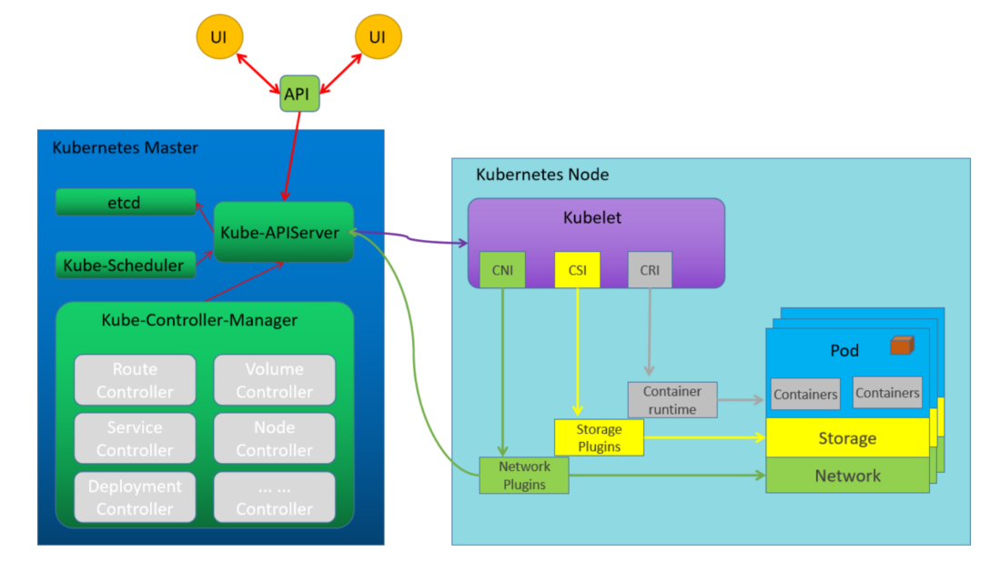
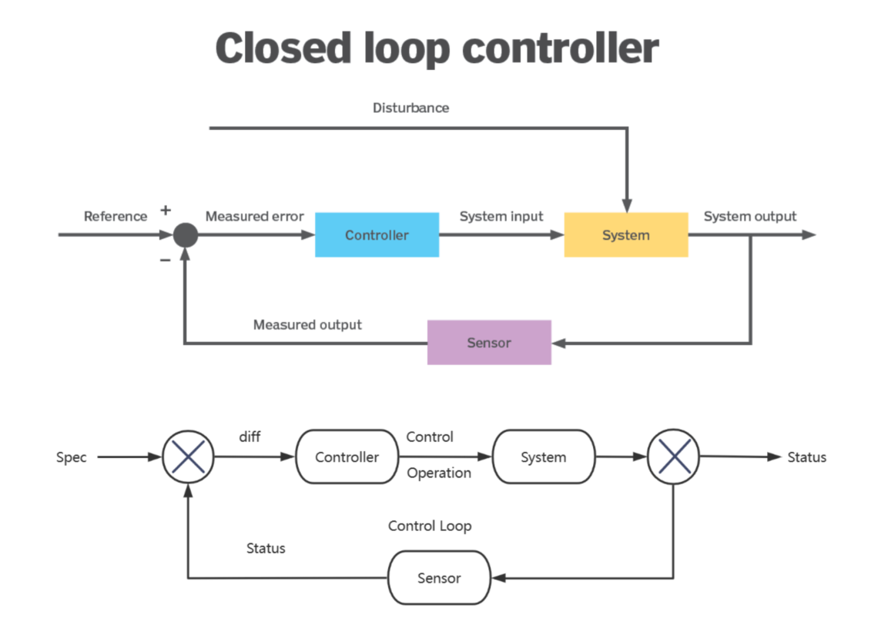

# 39、kubernetus工作负载


## **控制器原理**

### 集群结构


Kubernetes集群通过 master 角色主机 和 node角色主机实现集群的环境搭建，所有的资源对象都是以pod为单元进行管理的。

Pod内部都是一个个相互关联的容器对象。这些容器对象是来源于镜像仓库的镜像文件创建出来的。

Kubernetes主要有控制平面和工作平面来组成：

控制层面组件

- API Server - 提供数据的注册和监视各种资源对象的功能
- Scheduler - 将资源对象调度到合适的节点中
- Controller - 大量控制功能的集合,他是与API Server结合起来完成控制层面操作的最重要的组成部分
- Etcd - 数据存储功能

工作平面组件

- kubelet
- kube-proxy
- Container Runtime

Kubernetes 组件基本流程图



Kubernetes 集群中的所有资源对象都是

- 通过 master 角色主机上的各种组件进行统一管理

- 基于 node 角色上的kubelet组件实现信息的交流

- pod内部的应用对象

  - 基于CRI让应用本身是运行在容器内部

  - 基于CSI实现各种持久化数据的保存

  - 基于CNI实现多个pod应用程序之间的通信交流。

### 资源对象


对于Kubernetes 集群应用来说，所有的程序应用都是

- 运行在 Pod 资源对象里面
- 借助于service资源对象向外提供服务访问
- 借助于各种存储资源对象实现数据的可持久化
- 借助于各种配置资源对象实现配置属性、敏感信息的管理操作

### **应用编排**

在工作中为了完成大量的业务目标，首先会根据业务应用内部的关联关系，把业务拆分成多个子任务，然后对这些子任务进行顺序组合，当子任务按照方案执行完毕后，就完成了业务目标。

任务编排实现就是对多个子任务的执行顺序进行确定的过程。

对于Kubernetes 有一些常见的需求:

- 对于紧密相关的多个子任务，把它们放到同一个pod内部
- 对于非紧密关联的多个任务，分别放到不同的pod中
- 然后借助于 endpoint+service的方式实现彼此之间的相互调用。
- 为了让这些纷乱繁杂的任务能够互相发现，通过集群的 CoreDNS组件实现服务注册发现功能。

对于Kubernetes场景中的应用任务，主要存在部署、扩容、缩容、更新、回滚等常见编排操作。

虽然基于pod的方式实现了应用任务的部署功能操作，但是对于自主式的pod来说，它并不能实现其他的更多编排任务。

因此在Kubernetes集群的核心功能之上，有一群非常重要的组件专用于对pod实现所谓的任务编排功能，这些组件统统将其称为控制器Controller。

Kubernetes的声明式API

- 用户能够以声明式定义资源对象的目标状态，即spec字段
- 由控制器代码（机器智能组件）负责确保实际状态，即status字段与期望状态spec字段一致
- 控制器相当于“人工智能机器人”，负责确保各项具体任务得以落地，而控制器通常由API的提供者负责开发编写
- 用户需要做的是根据资源类型及其控制器提供的DSL（领域特定语言）进行声明式编程

Kubernetes的控制器类型

- Kubernetes内置控制器：

  Kubernetes默认就提供的实现基础型、核心型的控制器

  Controller Manager中内置提供了许多的控制器，例如Service Controller、DeploymentController等

  以kube-controller-manager组件的程序方式运行实现

- 第三方控制器

  实现高级控制器，通常需要借助于基础型控制器完成其功能

  例如Ingress插件ingress-nginx的Controller，网络插件Project Calico的Controller等

  通常以Pod形式托管运行于Kubernetes之上，而且这些Pod再由内置的控制器所控制

控制器有很多种类:

- 节点控制器(Node Controller): 负责在节点出现故障时进行通知和响应
- 任务控制器(Job controller): 监测代表一次性任务的 Job 对象，然后创建 Pods 来运行这些任务直至完成
- 端点控制器(Endpoints Controller): 填充端点(Endpoints)对象(即加入 Service 与 Pod)
- 服务帐户和令牌控制器(Service Account & Token Controllers): 为新的命名空间创建默认帐户和API 访问令牌

### **控制原理**

```
https://kubernetes.io/zh-cn/docs/concepts/architecture/controller/
```

在机器人技术和自动化领域，控制回路（Control Loop）是一个非终止回路，用于调节系统状态。




- Controller根据Spec，控制Systems生成当前实际Status
- Controller借助于Sensor持续监视System的Spec和Status，在每一次控制回路中都会对二者进行比较
- 确保System的Status不断逼近或完全等同Spec


- 用户向 APIserver中插入一个应用资源对象的请求

- 这个请求包含的数据形态中定义了该资源对象的 "期望"状态

- 数据经由 APIserver 保存到 ETCD 中

- kube-controller-manager 中的各种控制器会监视 Apiserver上与自己相关的资源对象的变动

  比如 Pod Controller只负责Pod资源的控制，Service Controller只负责Service资源的控制等。

- 一旦API Server中的资源对象发生变动，对应的Controller执行相关的配置代码，到对应的node节点上运行

- 该资源对象会在当前节点上，按照用户的"期望"进行运行

- 这些实体对象的运行状态称为 "实际状态"

- 即控制器的作用就是确保 "期望状态" 与 "实际状态" 相一致

- Controller将这些实际的资源对象状态，通过APIServer存储到ETCD的同一个数据条目的status的字段中

- 资源对象在运行过程中，Controller 会循环的方式向 APIServer 监控 spec 和 status 的值是否一致

- 如果两个状态不一致，那么就指挥node节点的资源进行修改，保证两个状态一致

- 状态一致后，通过APIServer同步更新当前资源对象在ETCD上的数据

### 副本维护型控制器

|               控制器               |                           核心特性                           |               典型场景               |
| :--------------------------------: | :----------------------------------------------------------: | :----------------------------------: |
| **ReplicationController** (已废弃) | 最早期Pod副本控制器，仅支持等式选择器（如`environment=prod`） | 传统副本维护（建议用ReplicaSet替代） |
|           **ReplicaSet**           | 支持集合选择器（如`environment in (prod,dev)`），Deployment的底层实现 |    需要精确控制Pod副本数量的场景     |
|           **Deployment**           |      提供滚动更新、版本回滚能力，通过ReplicaSet管理Pod       |     无状态应用部署（如Web服务）      |

### 节点级任务型控制器

|    控制器     |                核心特性                |                    典型场景                    |
| :-----------: | :------------------------------------: | :--------------------------------------------: |
| **DaemonSet** | 每个节点运行1个Pod副本，适合系统级服务 | 日志收集（Fluentd）、节点监控（Node Exporter） |

### 任务型控制器

|   控制器    |              核心特性              |           典型场景            |
| :---------: | :--------------------------------: | :---------------------------: |
|   **Job**   |    一次性任务，运行到完成即退出    | 数据处理任务、CI/CD流水线作业 |
| **CronJob** | 周期性调度的Job，类似Linux Crontab | 每日报表生成、定时数据库备份  |

### 有状态应用控制器

|     控制器      |                           核心特性                           |           典型场景            |
| :-------------: | :----------------------------------------------------------: | :---------------------------: |
| **StatefulSet** | Pod具有稳定网络标识（hostname/域名）、持久化存储、有序部署/扩展 | 数据库（MySQL）、消息队列（Ka |

### 关键对比记忆点：

1. **更新机制差异**
   - Deployment：滚动更新（无状态）
   - StatefulSet：顺序更新（有状态）
2. **选择器演进**
   `RC（等式） → ReplicaSet（集合） → Deployment（声明式更新）`
3. **标识稳定性**
   - 无状态控制器：Pod随机名称（web-7dfd644cb6）
   - StatefulSet：Pod固定名称（mysql-0, mysql-1）
4. **存储特性**
   - Deployment：共享存储（所有Pod挂载相同PVC）
   - StatefulSet：独立存储（每个Pod有专属PVC）

建议结合具体场景选择控制器：Web服务用Deployment，分布式存储用StatefulSet，节点监控用DaemonSet。

### 有状态和无状态

#### **1. 无状态（Stateless）**

无状态应用**不存储任何会话数据**，每次请求都被视为独立的事务，**不依赖于先前的请求或特定节点**。
 无状态应用更容易横向扩展（Scaling），因为任何副本都可以处理请求。

##### **特点**

- **不依赖本地存储**，应用运行在哪个节点都可以。
- **请求之间没有关联**，例如 HTTP 请求。
- **适合负载均衡**，流量可以分发到任意 Pod。
- **易于扩展**，可以自由增加/减少 Pod 数量。

##### **典型应用**

- **Web 服务器**（如 Nginx、Apache）
- **API 网关**
- **微服务（Stateless 部分）**
- **前端应用（如 React、Vue）**

##### **无状态应用的 Kubernetes 资源**

无状态应用一般使用 **Deployment**：

```yaml
 apiVersion: apps/v1
kind: Deployment
metadata:
  name: stateless-app
spec:
  replicas: 3
  selector:
    matchLabels:
      app: stateless-app
  template:
    metadata:
      labels:
        app: stateless-app
    spec:
      containers:
      - name: nginx
        image: nginx:latest
```

这里的 `replicas: 3` 说明可以随时扩展或缩减实例数，而不影响服务运行。

------

#### **2. 有状态（Stateful）**

有状态应用依赖于**持久存储**，通常需要保证**数据一致性**，请求可能需要定向到特定实例。

##### **特点**

- **Pod 有固定的标识（hostname 不变）**，不同于 Deployment。
- **有持久化存储（Persistent Volume，PV）**，数据不会因 Pod 重启丢失。
- **顺序启动/终止**，保证应用依赖顺序（如数据库主从同步）。
- **需要保证会话持久化**，如用户认证、数据缓存等。

##### **典型应用**

- **数据库**（MySQL、PostgreSQL、MongoDB）
- **消息队列**（Kafka、RabbitMQ）
- **缓存服务**（Redis Cluster、Etcd）
- **大数据存储**（HDFS、MinIO）

##### **有状态应用的 Kubernetes 资源**

有状态应用通常使用 **StatefulSet**，例如 MySQL：

```yaml
apiVersion: apps/v1
kind: StatefulSet
metadata:
  name: mysql
spec:
  serviceName: "mysql"
  replicas: 2
  selector:
    matchLabels:
      app: mysql
  template:
    metadata:
      labels:
        app: mysql
    spec:
      containers:
      - name: mysql
        image: mysql:8.0
        env:
        - name: MYSQL_ROOT_PASSWORD
          value: "mypassword"
        volumeMounts:
        - name: mysql-data
          mountPath: /var/lib/mysql
  volumeClaimTemplates:
  - metadata:
      name: mysql-data
    spec:
      accessModes: [ "ReadWriteOnce" ]
      resources:
        requests:
          storage: 10Gi
```

- `StatefulSet` 保证 **Pod 名称稳定**（如 `mysql-0`、`mysql-1`）。
- 使用 **PersistentVolumeClaim (PVC)** 持久化数据，Pod 重启后数据仍然存在。

------

#### **3. 无状态 vs. 有状态 对比**

| 特性               | 无状态（Stateless）           | 有状态（Stateful）           |
| ------------------ | ----------------------------- | ---------------------------- |
| **存储需求**       | 不需要本地存储                | 需要持久化存储（PV）         |
| **Pod 之间的关系** | 互相独立                      | Pod 可能依赖特定顺序         |
| **扩展方式**       | 轻松扩展/缩减                 | 扩展较复杂，需要数据一致性   |
| **负载均衡**       | 任意 Pod 处理请求             | 需要定向到特定 Pod           |
| **适合场景**       | Web 服务器、API、无状态微服务 | 数据库、缓存、队列、存储系统 |

------

#### **4. 什么时候选择有状态还是无状态？**

- **如果应用可以随意扩展，并且不依赖本地存储 → 选择无状态**
- **如果应用需要持久化数据，并且实例有顺序或固定身份 → 选择有状态**

例如：

- **Nginx 反向代理 → 无状态**
- **Redis 单机模式 → 无状态**
- **Redis Cluster（有持久化） → 有状态**
- **MySQL 数据库 → 有状态**
- **Elasticsearch → 有状态**


### **控制器和** **Pod**


- 节点控制器每间隔5秒检查一次 Worker 节点的状态
- 如果节点控制器没有收到来自Worker 节点的心跳，则将该Worker 节点被标记为不可达
- 如果该Worker节点被标记为不可达后,节点控制器再等待40秒后仍无法得到此节点的心跳,将该节点标记为无法访问
- 如果该Worker 节点被标记为无法访问后,再等待5分钟后,还没有心跳, 节点控制器会删除当前Worker节点上面的所有pod,并在其它可用的Worker节点重建这些 pod

## **工作负载资源**

### 标签

Kubernetes通过标签来管理对应或者相关联的各种资源对象，Label是kubernetes中的核心概念之一。

Label 不是一个独立的API 资源类型,但Label对象可以关联到各种资源对象上

通过对Label的管理从而达到对相同Label的资源进行分组管理、分配、调度、配置、部署等。

标签Label 是可以附加在任何资源对象上的键值型元数据,即Label本质上是一个key/value键值对，其中key与value由用户自己指定

key键标识由键前缀和键名组成,格式为 [key_prefix/]key_name

常用标签使用场景：

- 版本标签："release" : "stable"，"release" : "canary"，"release" : "beta"
- 环境标签："environment" : "dev"，"environment" : "qa"，"environment" : "prod"
- 应用标签："app" : "ui"，"app" : "as"，"app" : "pc"，"app" : "sc"
- 架构层级标签："tier" : "frontend"，"tier" : "backend", "tier" : "cache"
- 分区标签："partition" : "customerA"，"partition" : "customerB"
- 品控级别标签："track" : "daily"，"track" : "weekly"

### **管理标签**

#### **命令行方法**

```bash
kubectl label [--overwrite] (-f FILENAME | TYPE NAME) KEY_1=VAL_1 ... KEY_N=VAL_N [--resource-version=version]
[options]
```

 

```bash
#添加标签
kubectl label 资源类型 资源名称 label_name=label_value [label_name=label_value] ...
#修改标签
kubectl label 资源类型 资源名称 label_name=label_value [label_name=label_value] ... 
--overwrite[=true]
#删除标签
kubectl label 资源类型 资源名称 label_name- [label_name-] ...
#参数说明
同时增加多个标签，只需要在后面多写几个就可以了，使用空格隔开
默认情况下，已存在的标签是不能修改的，使用 --overwrite=true 表示强制覆盖
label_name=label_value样式写成 label_name- 即表示删除label

#查看所有标签
kubectl get 资源类型 [资源名称] --show-labels
#示例:
kubectl get pods --show-labels
#查看指定标签的资源
kubectl get pods -l label_name[=label_value]
#参数：
-l #指定标签条件，获取指定资源对象，=表示匹配，!= 表示不匹配, 如果后面的选择标签有多个的话，使用逗号隔开
#如果针对标签的值进行范围过滤的话，可以使用如下格式：
-l 'label_name in (value1, value2, value3, ...)'      #包括其中一个label
-l 'label_name notin (value1, value2, value3, ...)'   #不包括其中任何一个label的值或者没有label_name
#是否存在label的判断
-l 'label_name'    #存在label
-l '!label_name'   #不存在label,注意使用单引号.不支持双引号
```


```bash
#查看节点标签
[root@master1 ~]#kubectl get nodes node1.kang.org --show-labels 
NAME             STATUS   ROLES    AGE   VERSION   LABELS
node1.kang.org   Ready    <none>   7d    v1.32.3   beta.kubernetes.io/arch=amd64,beta.kubernetes.io/os=linux,kubernetes.io/arch=amd64,kubernetes.io/hostname=node1.kang.org,kubernetes.io/os=linux

#添加标签
[root@master1 ~]#kubectl label nodes node1.kang.org name=hzk
node/node1.kang.org labeled
[root@master1 ~]#kubectl get nodes node1.kang.org --show-labels 
NAME             STATUS   ROLES    AGE   VERSION   LABELS
node1.kang.org   Ready    <none>   7d    v1.32.3   beta.kubernetes.io/arch=amd64,beta.kubernetes.io/os=linux,kubernetes.io/arch=amd64,kubernetes.io/hostname=node1.kang.org,kubernetes.io/os=linux,name=hzk

#修改标签
[root@master1 ~]#kubectl label nodes node1.kang.org name=zs --overwrite
node/node1.kang.org labeled
[root@master1 ~]#kubectl get nodes node1.kang.org --show-labels 
NAME             STATUS   ROLES    AGE   VERSION   LABELS
node1.kang.org   Ready    <none>   7d    v1.32.3   beta.kubernetes.io/arch=amd64,beta.kubernetes.io/os=linux,kubernetes.io/arch=amd64,kubernetes.io/hostname=node1.kang.org,kubernetes.io/os=linux,name=zs

#删除标签
[root@master1 ~]#kubectl label nodes node1.kang.org name-
node/node1.kang.org unlabeled
[root@master1 ~]#kubectl get nodes node1.kang.org --show-labels 
NAME             STATUS   ROLES    AGE   VERSION   LABELS
node1.kang.org   Ready    <none>   7d    v1.32.3   beta.kubernetes.io/arch=amd64,beta.kubernetes.io/os=linux,kubernetes.io/arch=amd64,kubernetes.io/hostname=node1.kang.org,kubernetes.io/os=linux

#查看指定标签的pod
[root@master1 ~]#kubectl get pod -l name=hzk
NAME           READY   STATUS    RESTARTS      AGE
sidecar-test   2/2     Running   3 (20h ago)   22h

#创建pod指定标签
[root@master1 ~]#kubectl run pod-label-nginx --image=wangxiaochun/nginx:1.20.0 -l 'app=nginx'
pod/pod-label-nginx created
[root@master1 ~]#kubectl get pod --show-labels 
NAME              READY   STATUS              RESTARTS      AGE   LABELS
pod-label-nginx   0/1     ContainerCreating   0             17s   app=nginx

```

#### **yaml方法**

```bash
metadata:
 labels:
   key1: value1
   key2: value2
   .....
    
#注意：labels复数
```

```yaml
[root@master1 ~]#kubectl get nodes node1.kang.org -o yaml
apiVersion: v1
kind: Node
metadata:
 ...
  labels:
    beta.kubernetes.io/arch: amd64
    beta.kubernetes.io/os: linux
    kubernetes.io/arch: amd64
    kubernetes.io/hostname: node1.kang.org
    kubernetes.io/os: linux
...
```

### **标签选择器 Label Selector**

标签选择器的主要应用场景：

监控具体的Pod、负载均衡调度、定向调度，常用于 Pod、Node等资源对象


#### 等值和不等值

```bash
#等值：
name = nginx			#匹配所有具有标签 name = nginx 的资源对象
name == nginx			#同上
name					#表示匹配存在name标签的资源对象
#不等值
!name					#表示匹配不存在name标签的资源对象
name != nginx			#匹配所有没有name标签或者标签name的值不等于nginx的资源对象
```

范例

```yaml
apiVersion: v1
kind: Pod
metadata:
  name: cuda-test  # Pod名称（GPU测试任务）
spec:
  containers:
    - name: cuda-test  # 容器名称
      # 官方K8s提供的CUDA示例镜像（向量加法计算）
      image: "registry.k8s.io/cuda-vector-add:v0.1"
      resources:
        limits:
          # 申请1个NVIDIA GPU资源（需预先安装GPU设备插件）
          nvidia.com/gpu: 1
          # 建议同时设置CPU/内存限制（示例）：
          # cpu: "1"
          # memory: "2Gi"
      
      # 安全上下文建议（实际未修改原内容）：
      # securityContext:
      #   capabilities:
      #     add: ["IPC_LOCK"]  # 某些CUDA应用需要

  # 节点选择器：指定带NVIDIA Tesla P100的节点
  nodeSelector:
    accelerator: nvidia-tesla-p100  # 需与节点标签匹配

  # 建议补充的亲和性配置（示例）：
  # affinity:
  #   nodeAffinity:
  #     requiredDuringSchedulingIgnoredDuringExecution:
  #       nodeSelectorTerms:
  #       - matchExpressions:
  #         - key: accelerator
  #           operator: In
  #           values: [nvidia-tesla-p100, nvidia-tesla-v100]
```

```yaml
apiVersion: v1
kind: Service
metadata:
  name: service-loadbalancer-lbaas  # 服务名称（建议符合DNS命名规范）
  annotations:
    # 云提供商特定参数示例（根据实际环境调整）：
    # service.beta.kubernetes.io/aws-load-balancer-type: "nlb"
    # service.beta.kubernetes.io/azure-load-balancer-internal: "true"
    # cloud.google.com/load-balancer-type: "Internal"
spec:
  type: LoadBalancer  # 服务类型（由云提供商自动创建外部负载均衡器）
  
  # 流量策略配置（关键网络优化参数）
  externalTrafficPolicy: Local  # 保留客户端源IP，避免额外网络跳转
  # 可选值：
  # - Cluster: 默认值，可能丢失客户端IP但实现负载均衡
  # - Local: 保留客户端IP，但可能导致负载不均

  # Pod选择器（必须与目标Pod的labels匹配）
  selector:
    app: myapp  # 选择包含标签 app=myapp 的Pod

  # 端口映射配置
  ports:
    - name: http       # 端口名称（用于多端口区分）
      protocol: TCP    # 协议类型（支持TCP/UDP/SCTP）
      port: 80         # 服务暴露端口（外部访问端口）
      targetPort: 80   # 容器监听端口（Pod内容器的端口）

  # 生产环境建议补充配置：
  # loadBalancerIP: "1.2.3.4"  # 指定静态IP（部分云提供商支持）
  # healthCheckNodePort: 30000 # 自定义健康检查端口
  # sessionAffinity: ClientIP  # 会话保持（需要时启用）
```

#### 集合

```bash
#示例：
env in (dev, test)				#匹配所有具有标签 env = dev 或者 env = test 的资源对象
name notin (frontend,backent)	#匹配所有不具有标签name=frontend或者name=backend或者没有name标签的资源对象
```

#### 匹配标签 matchLabels

```bash
#匹配标签：
    matchLabels:
      name: nginx
      app: myapp
#当 matchLabels 中有多个标签时，它们之间的关系是逻辑与（AND）关系

#如下所示：
matchLabels:
 app: frontend
 environment: production
#那么只有那些标签中同时包含 app=frontend 和 environment=production 的资源才会被选中。
```

#### 匹配表达式 matchExpressions

```bash
#匹配表达式：
   matchExpressions:
      - {key: name, operator: NotIn, values: [frontend,backend]}
#当 matchExpressions 中包含多个标签表达式时，它们之间的关系是逻辑与（AND）关系。

#常见的operator操作属性值有：
   In、NotIn、Exists、NotExists等
   Exists和NotExist时，values必须为空，即 { key: environment, opetator: Exists,values:}
#注意：这些表达式一般应用在RS、RC、Deployment等其它管理对象中。
#示例
matchExpressions:
  - key: environment
   operator: In
   values:
      - production
      - staging
  - key: app
   operator: NotIn
   values:
      - test

#那么只有那些标签满足以下两个条件的资源才会被选中：
- 标签中 environment 的值是 production 或 staging
- 标签中 app 的值不是 test
```

|   操作符    |           作用描述            |       适用场景        |           示例值格式           |
| :---------: | :---------------------------: | :-------------------: | :----------------------------: |
|    `In`     |   标签值 **在** 指定列表中    |    选择特定节点组     | `values: ["value1", "value2"]` |
|   `NotIn`   |  标签值 **不在** 指定列表中   |     排除某些节点      |       `values: ["test"]`       |
|  `Exists`   | 标签 **存在**（无论值是什么） | 选择有某种标签的节点  |       无需 `values` 字段       |
| `NotExists` |        标签 **不存在**        | 排除有某种标签的节点  |       无需 `values` 字段       |
|  `Gt`/`Lt`  |     数值比较（大于/小于）     | 资源调度（如GPU数量） |        `values: ["2"]`         |

### **标签选择器操作方式**

#### **命令方式**

```bash
#多个SELECTOR表示并且的关系
kubectl get TYPE -l SELECTOR1[,SELECTOR2,...]
kubectl get TYPE -l SELECTOR1 [-l SELECTOR2] ...

#额外针对指定的每一个标签单独一列来显示对应的值
kubectl get TYPE -L label_name
```

#### **配置文件**

```bash
#基于等值,多个为与关系
selector:
  component: redis
#基于集合
selector:
  matchLabels:
    component: redis
  matchExpressions:
    - { key: tier, operator: In, values: [cache] }
    - { key: environment, operator: NotIn, values: [dev] }
```

## **Replica Set**

### **Replica Set** **工作机制**

Replica Set 是Pod 最常用的控制器

Replica Set 其实是定义了一个期望的场景，RS有以下特点：

由于Replication Controller与Kubernetes代码中的模块Replication Controller同名，而且这个名称无法准确表达它的本意，即Pod副本的控制，所以从kubernetes v1.2开始，它就升级成了一个新的概念：Replica Set（RS）。

**控制创建pod的副本数量**

RS和RC两者功能上没有太大的区别，只不过是表现形式上不一样：

- RC中的Label Selector是基于等式的
- RS中的Label Selector是基于等式和集合的,因为集合的特点，这就使得Replica Set的功能更强大。

负责编排无状态应用的基础控制器是ReplicaSet，定义编排一个无状态应用相应的资源类型主要的三个关键属性如下

- replicas：Pod期待的副本数量
- selector：筛选目标Pod的标签选择器,支持matchExpressions和matchLabels
- template：如果Pod数量不满足预期值，自动创建Pod时候用到的模板(template)，清单文件格式和自主式Pod一样

意义：自动监控Pod运行的副本数目符合预期，保证Pod高可用的核心组件，常用于Pod的生命周期管理

**工作机制**

当通过"资源定义文件"定义好了一个RS资源对象，把它提交到Kubernetes集群

Master节点上的Controller Manager组件就得到通知

Controller Manager 根据 ReplicaSet Control Loop 管理 ReplicaSet Object

由该对象向API Server请求管理Pod对象(标签选择器选定的)

如果没有pod：以Pod模板向API Server请求创建Pod对象，由Scheduler调度并绑定至某节点，由相应节点kubelet负责运行。

定期巡检系统中当前存活的Pod，并确保Pod实例数量刚到满足RC的期望值。

如果Pod数量大于RS定义的期望值，那么就杀死一些Pod

如果Pod数量小于RS定义的期望值，那么就创建一些Pod

所以通过RS资源对象，Kubernetes实现了业务应用集群的高可用性，大大减少了人工干预，提高了管理的自动化。

如果后续想要扩充Pod副本的数量，可以直接修改replicas的值即可

当其中一个Node的Pod意外终止，根据RS的定义，Pod的期望值是2，所以会随机找一个Node结点重新再创建一个新的Pod，来保证整个集群中始终存在两个Pod运行


注意：

- 删除RS并不会影响通过该RS资源对象创建好的Pod。
- 如果要删除所有的Pod那么可以设置RS的replicas的值为0，然后更新该RS。
- 另外kubectl提供了stop和delete命令来一次性删除RS和RS控制的Pod。
- Pod提供的如果无状态服务，不会影响到客户的访问效果。

RS可以实现应用的部署，扩缩容和卸载，但一般很少单独使用

它主要是被Deployment这个更高层的资源对象所使用，从而形成了一整套Pod的创建、删除、更新的编排机制。

Replica Set 与Deployment这两个重要资源对象已经替换了RC的作用,所以当前一般直接使用Deployment

```yaml
apiVersion: apps/v1
kind: ReplicaSet
metadata:
  name: frontend-rs  # ReplicaSet名称（生成的Pod名称格式：frontend-rs-xxxxx）
  namespace: default  # 命名空间（可选）
spec:
  # ====================== 核心配置 ======================
  minReadySeconds: 30  # Pod就绪后需稳定运行30秒才视为可用（默认0）
  replicas: 3         # 维持3个Pod副本（默认1）
  
  # ====================== 标签选择器 ======================
  selector:
    # 方式1：精确匹配标签（推荐）
    matchLabels:
      app: frontend
      tier: web
    
    # 方式2：表达式匹配（复杂场景使用）
    matchExpressions:
      - {key: environment, operator: In, values: [production, staging]}
      - {key: !beta.kubernetes.io/arch, operator: NotIn, values: [arm64]}

  # ====================== Pod模板 ======================
  template:
    metadata:
      labels:  # 必须匹配selector中的条件
        app: frontend
        tier: web
        environment: production
      annotations:  # 可选注解
        monitor: "true"
    
    spec:
      # --------------------- 容器配置 ---------------------
      containers:
      - name: nginx
        image: nginx:1.21
        ports:
        - containerPort: 80
        resources:
          requests:
            cpu: "100m"
            memory: "128Mi"
      
      # --------------------- 调度配置 ---------------------
      affinity:
        podAntiAffinity:  # Pod反亲和性（避免集中部署）
          preferredDuringSchedulingIgnoredDuringExecution:
          - weight: 100
            podAffinityTerm:
              labelSelector:
                matchExpressions:
                - {key: app, operator: In, values: [frontend]}
              topologyKey: kubernetes.io/hostname
```

扩容和缩容

```bash
#基于对象调整副本数：
kubectl scale [--resource-version=version] [--current-replicas=count] --replicas=COUNT (-f FILENAME | TYPE NAME)
kubectl scale --replicas=5 rc/rc_name
#基于文件调整副本数：
kubectl scale --replicas=3 -f rc_name.yaml
```

更新镜像

```bash
kubectl set image (-f FILENAME | TYPE NAME) CONTAINER_NAME_1=CONTAINER_IMAGE_1 ... CONTAINER_NAME_N=CONTAINER_IMAGE_N
kubectl set image 资源类型/资源名称 容器名1=容器镜像1 ... 容器名N=容器镜像N

#注意:更新镜，Pod不会自动更新。原因是RC和RS都是删除式更新，即只有手动删除老的Pod，新生成的pod才会使用新的模板信息,而Deployment是自动式更新,所以Deployment更加高级
```

范例

```yaml
[root@master1 replicaset]#vim controller-replicaset.yaml

apiVersion: apps/v1
kind: ReplicaSet
metadata:
  name: controller-replicaset-test  # ReplicaSet名称（生成的Pod名称前缀）
spec:
  # ====================== 副本控制参数 ======================
  minReadySeconds: 10  # 建议设置10-30秒（等待Pod完全就绪）
  replicas: 3          # 维持3个完全相同的Pod副本

  # ====================== 标签选择器 ======================
  selector:
    matchLabels:  # 必须与template.metadata.labels完全匹配
      app: rs-test
      release: stable
      version: v1.0

  # ====================== Pod模板 ======================
  template:
    metadata:
      labels:  # 必须与selector.matchLabels一致
        app: rs-test
        release: stable
        version: v1.0
      # 建议添加注解（示例）：
      # annotations:
      #   monitor: "true"
      #   owner: "team-devops"

    spec:
      containers:
      - name: rs-test  # 容器名称
        image: registry.cn-beijing.aliyuncs.com/wangxiaochun/pod-test:v0.1
        # 建议添加的配置：
        # resources:
        #   requests:
        #     cpu: "100m"
        #     memory: "128Mi"
        #   limits:
        #     memory: "256Mi"
        # ports:
        # - containerPort: 8080
        #   protocol: TCP
```

```bash
#加载配置
[root@master1 replicaset]#kubectl apply -f controller-replicaset.yaml
replicaset.apps/controller-replicaset-test unchanged

#查看
[root@master1 replicaset]#kubectl get pod
NAME                               READY   STATUS    RESTARTS   AGE
controller-replicaset-test-6495c   1/1     Running   0          59s
controller-replicaset-test-f7w4c   1/1     Running   0          59s
controller-replicaset-test-hg567   1/1     Running   0          59s
[root@master1 replicaset]#kubectl get pod -o wide 
NAME                               READY   STATUS    RESTARTS   AGE   IP            NODE             NOMINATED NODE   READINESS GATES
controller-replicaset-test-6495c   1/1     Running   0          68s   10.244.3.32   node3.kang.org   <none>           <none>
controller-replicaset-test-f7w4c   1/1     Running   0          68s   10.244.4.36   node2.kang.org   <none>           <none>
controller-replicaset-test-hg567   1/1     Running   0          68s   10.244.1.28   node1.kang.org   <none>           <none>
[root@master1 replicaset]#kubectl get replicasets.apps 
NAME                         DESIRED   CURRENT   READY   AGE
controller-replicaset-test   3         3         3       7m35s


#调整副本数
[root@master1 replicaset]#kubectl scale replicaset controller-replicaset-test --replicas=5
replicaset.apps/controller-replicaset-test scaled
[root@master1 replicaset]#kubectl get pod -o wide 
NAME                               READY   STATUS    RESTARTS   AGE     IP            NODE             NOMINATED NODE   READINESS GATES
controller-replicaset-test-6495c   1/1     Running   0          6m43s   10.244.3.32   node3.kang.org   <none>           <none>
controller-replicaset-test-djcc9   1/1     Running   0          2s      10.244.1.29   node1.kang.org   <none>           <none>
controller-replicaset-test-f7w4c   1/1     Running   0          6m43s   10.244.4.36   node2.kang.org   <none>           <none>
controller-replicaset-test-gjt4k   1/1     Running   0          2s      10.244.4.37   node2.kang.org   <none>           <none>
controller-replicaset-test-hg567   1/1     Running   0          6m43s   10.244.1.28   node1.kang.org   <none>           <none>
[root@master1 replicaset]#kubectl get replicasets.apps 
NAME                         DESIRED   CURRENT   READY   AGE
controller-replicaset-test   5         5         5       10m
```

### 更新Pod镜像的版本

```bash
#升级镜像版本
[root@master1 replicaset]#vim controller-replicaset.yaml 
apiVersion: apps/v1
kind: ReplicaSet
metadata:
  name: controller-replicaset-test  # ReplicaSet名称（生成的Pod名称前缀）
spec:
  # ====================== 副本控制参数 ======================
  minReadySeconds: 10  # 建议设置10-30秒（等待Pod完全就绪）
  replicas: 3          # 维持3个完全相同的Pod副本

  # ====================== 标签选择器 ======================
  selector:
    matchLabels:  # 必须与template.metadata.labels完全匹配
      app: rs-test
      release: stable
      version: v1.0

  # ====================== Pod模板 ======================
  template:
    metadata:
      labels:  # 必须与selector.matchLabels一致
        app: rs-test
        release: stable
        version: v1.0
      # 建议添加注解（示例）：
      # annotations:
      #   monitor: "true"
      #   owner: "team-devops"

    spec:
      containers:
      - name: rs-test  # 容器名称
        image: registry.cn-beijing.aliyuncs.com/wangxiaochun/pod-test:v0.2
        # 建议添加的配置：
        # resources:
        #   requests:
        #     cpu: "100m"
        #     memory: "128Mi"
        #   limits:
        #     memory: "256Mi"
        # ports:
        # - containerPort: 8080
        #   protocol: TCP

#应用资源对象
[root@master1 replicaset]#kubectl apply -f controller-replicaset.yaml
replicaset.apps/controller-replicaset-test configured
#查看pod
[root@master1 replicaset]#kubectl get pod -o wide 
NAME                               READY   STATUS    RESTARTS   AGE     IP            NODE             NOMINATED NODE   READINESS GATES
controller-replicaset-test-dd74f   1/1     Running   0          3m24s   10.244.4.38   node2.kang.org   <none>           <none>
controller-replicaset-test-h7h57   1/1     Running   0          3m24s   10.244.3.33   node3.kang.org   <none>           <none>
controller-replicaset-test-nqrwm   1/1     Running   0          3m24s   10.244.1.30   node1.kang.org   <none>           <none>
#验证，发现没有修改，仍为旧版本
[root@master1 replicaset]#curl 10.244.4.38
kubernetes pod-test v0.1!! ClientIP: 10.244.0.0, ServerName: controller-replicaset-test-dd74f, ServerIP: 10.244.4.38!

#手动删除pod
[root@master1 replicaset]#kubectl delete pod -l app=rs-test
#自动重新生成新pod
#验证版本更新，修改为新版本
[root@master1 replicaset]#curl 10.244.4.39
kubernetes pod-test v0.2!! ClientIP: 10.244.0.0, ServerName: controller-replicaset-test-2ljnj, ServerIP: 10.244.4.39!
```

### **Replica Set** **版本发布**

- 直接发布

  直接将新的版本覆盖掉老的版本。这种方式简单而粗暴

  其优点就是简单而且成本较低，但缺点同样很明显，就是发布过程中通常会导致服务中断进而导致用户受到影响

  这种方式比较适应于开发环境或者测试环境或者是公司内部系统这种对可用性要求不高的场景

  有些小的公司资源稀缺(服务器资源，基础设施等)的时候也会采用这种方式


- 金丝雀发布

  金丝雀发布过程中，先将一台或者一小部分比例的机器作为金丝雀，用于流量验证。

  如果金丝雀验证通过则把剩余机器全部发布。

  如果金丝雀验证失败，则直接回退金丝雀。

  金丝雀发布的优势在于可以用少量用户来验证新版本功能，这样即使有问题所影响的也是很小的一部分客户。

  如果对新版本功能或性能缺乏足够信心那么就可以采用这种方式。

  这种方式也有其缺点，金丝雀发布本质上仍然是一次性的全量发布，发布过程中用户体验并不平滑，有些隐藏深处的bug少量用户可能并不能验证出来问题，需要逐步扩大流量才可以。


- 滚动发布

  滚动发布是在金丝雀发布基础上进行改进的一种发布方式。

  相比于金丝雀发布，先发金丝雀，然后全发的方式，滚动发布则是整个发布过程中按批次进行发布。

  每个批次拉入后都可作为金丝雀进行验证，这样流量逐步放大直至结束。

  滚动更新加快了更新的效率，其特点在于：

  - 一次只更新一小部分副本

  - 上次更新成功后，再更新更多的副本
  - 最终完成所有副本的更新

  这个过程中，新旧版本同时存在，并不会导致大量的资源浪费。


- 蓝绿部署

  蓝绿部署是一种应用发布模式，可将用户流量从先前版本的应用或微服务逐渐转移到几乎相同的新版本中（两者均保持在生产环境中运行）。

  旧版本可以称为蓝色环境，而新版本则可称为绿色环境。

  一旦生产流量从蓝色完全转移到绿色，蓝色就可以在回滚或退出生产的情况下保持待机，也可以更新成为下次更新的模板。

  这种持续部署模式原本存在不足之处

  并非所有环境都具有相同的正常运行时间要求或正确执行 CI/CD 流程（如蓝绿部署）所需的资源。

  在部署过程中，可能导致大量资源占用，适用于小业务


#### 利用RS实现版本滚动发布

```bash
#准备service文件
[root@master1 replicaset]#vim svc-controller-replicaset.yaml

apiVersion: v1
kind: Service
metadata:
  name: svc-replicaset  # Service名称（DNS域名：svc-replicaset.<namespace>.svc.cluster.local）
  # 建议添加的标签（可选）：
  # labels:
  #   app: rs-test
  #   tier: backend
spec:
  type: ClusterIP  # 服务类型（默认值，集群内访问）
  # 可选值：
  # - ClusterIP : 仅集群内访问
  # - NodePort  : 通过节点端口暴露
  # - LoadBalancer: 云提供商负载均衡器
  
  # ====================== 关键选择器配置 ======================
  selector:
    app: rs-test  # 必须匹配ReplicaSet中Pod的标签
    # 注意：建议与ReplicaSet的matchLabels完全一致
    # 可添加更多标签选择条件（如版本控制）：
    # version: v1.0
  
  # ====================== 端口配置 ======================
  ports:
    - name: http       # 端口名称（多端口时必须唯一）
      port: 80         # Service暴露的端口（集群内访问端口）
      protocol: TCP    # 支持TCP/UDP/SCTP
      targetPort: 80   # 目标Pod的端口（必须与Pod中containerPort一致）
  
  # 生产环境建议配置（可选）：
  # sessionAffinity: ClientIP  # 会话保持（默认None）
  # ipFamilyPolicy: PreferDualStack  # 双栈支持
  # externalTrafficPolicy: Local  # 当type=LoadBalancer时保留客户端IP
```

```bash
#准备旧版本的replicaset清单文件
[root@master1 replicaset]#vim controller-replicaset-1.yaml

# ====================== 旧版本ReplicaSet (v0.1) ======================
apiVersion: apps/v1
kind: ReplicaSet
metadata:
  name: replicaset-test-1  # 明确包含版本标识
spec:
  # ====================== 副本控制 ======================
  minReadySeconds: 0       # 建议从0调整为10秒（生产环境）
  replicas: 3              # 副本数
  
  # ====================== 标签选择器 ======================
  selector:
    matchLabels:
      app: rs-test
      release: stable
      version: v0.1        # 旧版本标识
  
  # ====================== Pod模板 ======================
  template:
    metadata:
      labels:
        app: rs-test
        release: stable
        version: v0.1      # 必须与selector匹配
    
    spec:
      containers:
      - name: rs-test
        image: registry.cn-beijing.aliyuncs.com/wangxiaochun/pod-test:v0.1
        # ===== 强烈建议添加的配置 =====
        #resources:
        #  requests:
        #    cpu: "100m"
        #    memory: "128Mi"
        #readinessProbe:    # 就绪检查
        #  httpGet:
        #    path: /healthz
        #    port: 8080
        #  initialDelaySeconds: 5
        #  periodSeconds: 10
```

```bash
#准备新版本的replicaset清单文件

apiVersion: apps/v1
kind: ReplicaSet
metadata:
  name: replicaset-test-2
  annotations:
    purpose: "Standby deployment"  # 标注此RS的特殊用途
spec:
  # ====================== 核心配置 ======================
  minReadySeconds: 0     # 即使replicas为0也建议保留合理值
  replicas: 0            # 关键配置：当前不创建任何Pod
  
  # ====================== 标签选择器 ======================
  selector:
    matchLabels:
      app: rs-test
      release: stable
      version: v0.2      # 标识新版本
  
  # ====================== Pod模板 ======================
  template:
    metadata:
      labels:
        app: rs-test
        release: stable
        version: v0.2    # 必须与selector完全匹配
      # 建议添加的注解：
      # owner: "team-devops"
      # backup: "true"
    
    spec:
      containers:
      - name: rs-test
        image: registry.cn-beijing.aliyuncs.com/wangxiaochun/pod-test:v0.2
        # ===== 强烈建议补充的配置 =====
        #resources:
        #  requests:
        #    cpu: "100m"
        #    memory: "128Mi"
        #readinessProbe:
        #  httpGet:
        #    path: /healthz
        #    port: 8080
        #  initialDelaySeconds: 5
        #  periodSeconds: 10
```

```bash
#先创建service
[root@master1 ~]#kubectl apply -f svc-controller-replicaset.yaml
[root@master1 replicaset]#kubectl get svc
NAME             TYPE        CLUSTER-IP    EXTERNAL-IP   PORT(S)   AGE
kubernetes       ClusterIP   10.96.0.1     <none>        443/TCP   7d2h
svc-replicaset   ClusterIP   10.98.72.89   <none>        80/TCP    64s

#执行旧版本的RS清单文件,生成旧版本的pod
[root@master1 replicaset]#kubectl apply -f controller-replicaset-1.yaml -f controller-replicaset-2.yaml
replicaset.apps/replicaset-test-1 created
replicaset.apps/replicaset-test-2 created

#开启测试pod访问service,持续观察结果
[root@master1 replicaset]#kubectl get ep
NAME             ENDPOINTS                                      AGE
kubernetes       10.0.0.100:6443                                7d2h
svc-replicaset   10.244.1.36:80,10.244.3.39:80,10.244.4.45:80   3m35s

#开启测试pod访问service,持续观察结果
[root@master1 ~]#while true; do curl 10.98.72.89; sleep 1;done
kubernetes pod-test v0.1!! ClientIP: 10.244.0.0, ServerName: replicaset-test-1-rcm8n, ServerIP: 10.244.4.45!
kubernetes pod-test v0.1!! ClientIP: 10.244.0.0, ServerName: replicaset-test-1-rrbzn, ServerIP: 10.244.1.36!
kubernetes pod-test v0.1!! ClientIP: 10.244.0.0, ServerName: replicaset-test-1-h6ssl, ServerIP: 10.244.3.39!

#修改旧版本的副本为2，新版本的副本为1
[root@master1 replicaset]#kubectl scale --replicas=2 rs/replicaset-test-1;kubectl scale --replicas=1 rs/replicaset-test-2
replicaset.apps/replicaset-test-1 scaled
replicaset.apps/replicaset-test-2 scaled

#开启测试pod访问service,持续观察结果
[root@master1 ~]#while true; do curl 10.98.72.89; sleep 1;done
kubernetes pod-test v0.2!! ClientIP: 10.244.0.0, ServerName: replicaset-test-2-qptzb, ServerIP: 10.244.3.40!
kubernetes pod-test v0.1!! ClientIP: 10.244.0.0, ServerName: replicaset-test-1-rrbzn, ServerIP: 10.244.1.36!
kubernetes pod-test v0.1!! ClientIP: 10.244.0.0, ServerName: replicaset-test-1-rrbzn, ServerIP: 10.244.1.36!
```

#### 利用RS实现版本蓝绿发布

```yaml
[root@master1 replicaset]#vim controller-replicaset-bule-green.yaml

# ====================== 蓝绿部署服务配置 ======================
apiVersion: v1
kind: Service
metadata:
  name: svc-replicaset-blue-green
  annotations:
    strategy: "blue-green"  # 明确标注部署策略
spec:
  type: ClusterIP
  # 动态选择器（需通过环境变量注入）：
  # - ${DEPLOY}: 部署标识（blue/green）
  # - ${VERSION}: 语义化版本（如v1.2.3）
  selector:
    app: rs-test
    ctr: rs-${DEPLOY}      # 部署通道标识
    version: ${VERSION}    # 精确版本控制
  
  ports:
    - name: http
      port: 80
      protocol: TCP
      targetPort: 80

---
# ====================== 副本集配置模板 ======================
apiVersion: apps/v1
kind: ReplicaSet
metadata:
  name: rs-${DEPLOY}       # 动态命名（如rs-blue/rs-green）
  labels:
    deploy-track: ${DEPLOY} # 便于分组管理
spec:
  minReadySeconds: 5       # 就绪等待时间（建议5-30秒）
  replicas: 2              # 初始副本数
  
  # 标签选择器（必须匹配template中的labels）
  selector:
    matchLabels:
      app: rs-test
      ctr: rs-${DEPLOY}
      version: ${VERSION}

  # Pod模板  
  template:
    metadata:
      labels:
        app: rs-test
        ctr: rs-${DEPLOY}  # 部署通道
        version: ${VERSION} # 镜像版本
      annotations:
        buildTimestamp: "${TIMESTAMP}" # 建议注入构建时间戳
    
    spec:
      containers:
        - name: pod-test
          image: registry.cn-beijing.aliyuncs.com/wangxiaochun/pod-test:${VERSION}
          # ===== 必须添加的配置 =====
          #resources:
          #  requests:
          #    cpu: "100m"
          #    memory: "128Mi"
          #readinessProbe:
          #  httpGet:
          #    path: /healthz
          #    port: 8080
          #  initialDelaySeconds: 3
          #  periodSeconds: 5
          # ===== 可选增强配置 =====
          #env:
          #  - name: APP_VERSION
          #    value: "${VERSION}"
```

```bash
#envsubst 是一个 Linux 命令，用于在文本文件或字符串中替换环境变量。它通常用于模板文件的处理，特别是在 shell 脚本、Docker、Kubernetes 配置等场景中。

[root@master1 replicaset]#A=1 B=2 envsubst 
$A
1
$B
2
```

```bash
#蓝色发布旧版本
[root@master1 replicaset]#DEPLOY=blue VERSION=v0.1 envsubst < controller-replicaset-bule-green.yaml | kubectl apply -f -
service/svc-replicaset-blue-green created
replicaset.apps/rs-blue created

[root@master1 replicaset]#kubectl get pod -o wide 
NAME            READY   STATUS    RESTARTS   AGE   IP            NODE             NOMINATED NODE   READINESS GATES
rs-blue-7g6np   1/1     Running   0          40s   10.244.3.41   node3.kang.org   <none>           <none>
rs-blue-r5k4x   1/1     Running   0          40s   10.244.4.47   node2.kang.org   <none>           <none>
[root@master1 replicaset]#kubectl get svc
NAME                        TYPE        CLUSTER-IP       EXTERNAL-IP   PORT(S)   AGE
kubernetes                  ClusterIP   10.96.0.1        <none>        443/TCP   7d3h
svc-replicaset-blue-green   ClusterIP   10.102.188.116   <none>        80/TCP    55s

[root@master1 ~]#while true; do curl 10.102.188.116; sleep 1;done
kubernetes pod-test v0.1!! ClientIP: 10.244.0.0, ServerName: rs-blue-r5k4x, ServerIP: 10.244.4.47!
kubernetes pod-test v0.1!! ClientIP: 10.244.0.0, ServerName: rs-blue-7g6np, ServerIP: 10.244.3.41!

#绿色发布新版本
[root@master1 replicaset]#DEPLOY=green VERSION=v0.2 envsubst < controller-replicaset-bule-green.yaml | kubectl apply -f -
service/svc-replicaset-blue-green configured
replicaset.apps/rs-green created

[root@master1 replicaset]#kubectl get pod -o  wide 
NAME             READY   STATUS    RESTARTS   AGE     IP            NODE             NOMINATED NODE   READINESS GATES
rs-blue-7g6np    1/1     Running   0          3m34s   10.244.3.41   node3.kang.org   <none>           <none>
rs-blue-r5k4x    1/1     Running   0          3m34s   10.244.4.47   node2.kang.org   <none>           <none>
rs-green-cwx2v   1/1     Running   0          30s     10.244.1.38   node1.kang.org   <none>           <none>
rs-green-mrsrg   1/1     Running   0          30s     10.244.3.42   node3.kang.org   <none>           <none>


[root@master1 ~]#while true; do curl 10.102.188.116; sleep 1;done
kubernetes pod-test v0.2!! ClientIP: 10.244.0.0, ServerName: rs-green-cwx2v, ServerIP: 10.244.1.38!
kubernetes pod-test v0.2!! ClientIP: 10.244.0.0, ServerName: rs-green-mrsrg, ServerIP: 10.244.3.42!


#回滚到0.1
[root@master1 replicaset]#DEPLOY=blue VERSION=v0.1 envsubst < controller-replicaset-bule-green.yaml | kubectl apply -f -
service/svc-replicaset-blue-green configured
replicaset.apps/rs-blue unchanged

[root@master1 ~]#while true; do curl 10.102.188.116; sleep 1;done
kubernetes pod-test v0.1!! ClientIP: 10.244.0.0, ServerName: rs-blue-7g6np, ServerIP: 10.244.3.41!
kubernetes pod-test v0.1!! ClientIP: 10.244.0.0, ServerName: rs-blue-r5k4x, ServerIP: 10.244.4.47!
```


## **Deployment**

### deployment工作机制

```
https://kubernetes.io/zh-cn/docs/concepts/workloads/controllers/deployment/
```

Deployment资源对象一般用于部署无状态服务,比如 java应用，Web等，这也是最常用的控制器

可以管理多个副本的Pod, 实现无缝迁移、自动扩容缩容、自动灾难恢复、一键回滚等功能

Deployment资源对象在作用、文件定义格式、具体操作等方面都可以看做RC的一次升级

**Deployment相对于RC或RS的一个主要升级是:支持动态更新和滚动发布策略,其它功能几乎一样**

Deployment资源对象在内部使用Replica Set来实现Pod的自动化编排

通过Deployment 可以随时知道当前Pod的"部署"进度，即Pod创建--调度--绑定Node--在目标Node上启动容器。

Deployment的使用场景非常多,基本上只要是涉及到Pod资源对象的自动化管理都是它的应用场景

**Deployment** **工作流程**

- 创建Deployment资源对象，自动生成对应的Replicas Set并完成Pod的自动管理，而无需人为显示

  创建 Replicas Set

- 检查Deployment对象状态，检查Pod自动管理效果

- 扩展Deployment资源对象，以应对应用业务的高可用


**Deployment 本质上是依赖并调用 Replica Set 的完成来基本的编排功能，并额外提供了滚动更新，回滚的功能**


- 先由Deployment 创建 Replica Set 资源对象并进行编排
- 再由Replica Set 创建并对 Pod 的编排
- Deployment是建立在ReplicaSet控制器上层的更高级的控制器
- Deployment 位于ReplicaSet更上面一层，基于ReplieaSet，提供了滚动更新、回滚等更为强大的应用编排功能
- Deployment是 Replica Set 的编排工具，Deployment编排ReplicaSet，ReplicaSet编排Pod
- Replica Set的名称由Deployment名称-Template的Hash值生成
- Deployment 并不直接管理 Pod，必须间接的利用 Replica Set 来完成对Pod的编排
- 通常应该直接通过定义Deployment资源来编排Pod应用，而ReplicaSet无须显式配置
- Deployment 依赖 Replica Set 的存在

### **Deployment** **的资源定义**


```bash
apiVersion: apps/v1
kind: Deployment
metadata:
  name: nginx-deployment  # 部署名称（命名规则：<应用名>-deployment）
  namespace: production   # 建议明确指定命名空间
  labels:
    app: nginx            # 推荐添加标签便于管理
    tier: frontend

spec:
  # ====================== 副本控制 ======================
  minReadySeconds: 10     # 生产环境建议10-30秒（默认0）
  replicas: 3             # Pod副本数（根据负载调整）
  revisionHistoryLimit: 5 # 保留的历史版本数（节省etcd空间）

  # ====================== 选择器配置 ======================
  selector:
    matchLabels:          # 必须与template.metadata.labels匹配
      app: nginx
      tier: frontend

  # ====================== 更新策略 ======================
  strategy:
    type: RollingUpdate   # 可选值：RollingUpdate（默认）/Recreate
    rollingUpdate:
      maxSurge: 25%       # 最大激增Pod数（建议20%-30%）
      maxUnavailable: 1   # 最大不可用Pod数（建议0-1）

  # ====================== Pod模板 ======================
  template:
    metadata:
      labels:            # 必须匹配selector.matchLabels
        app: nginx
        tier: frontend
      annotations:       # 推荐添加的注解
        commit-id: "${CI_COMMIT_SHA}"  # 注入构建信息
        deploy-time: "${TIMESTAMP}"

    spec:
      # ===== 容器配置 =====
      containers:
      - name: nginx      # 容器名称
        image: nginx:1.23.1  # 生产环境必须指定确定版本
        imagePullPolicy: IfNotPresent
        ports:
        - containerPort: 80
          protocol: TCP
          name: http

        # ===== 资源限制 =====
        resources:
          requests:
            cpu: "100m"  # 0.1核
            memory: "128Mi"
          limits:
            memory: "256Mi"  # 内存必须设置上限

        # ===== 健康检查 =====
        readinessProbe:   # 就绪检查（必须配置）
          httpGet:
            path: /
            port: 80
          initialDelaySeconds: 5
          periodSeconds: 10
          failureThreshold: 3
        livenessProbe:    # 存活检查（建议配置）
          httpGet:
            path: /healthz
            port: 80
          initialDelaySeconds: 15
          periodSeconds: 20

      # ===== 调度策略 =====
      affinity:
        podAntiAffinity:  # Pod反亲和性（避免集中部署）
          preferredDuringSchedulingIgnoredDuringExecution:
          - weight: 100
            podAffinityTerm:
              labelSelector:
                matchExpressions:
                - key: app
                  operator: In
                  values: [nginx]
              topologyKey: kubernetes.io/hostname

      # ===== 安全配置 =====
      securityContext:
        runAsNonRoot: true
        runAsUser: 1000
        fsGroup: 2000
```

### **Deployment** **实现**

#### Deployment 命令创建

```bash
[root@master1 replicaset]#kubectl create deployment deployment-pod-test --image wangxiaochun/pod-test:v0.1 -r 3
deployment.apps/deployment-pod-test created

[root@master1 replicaset]#kubectl get deployments.apps 
NAME                  READY   UP-TO-DATE   AVAILABLE   AGE
deployment-pod-test   3/3     3            3           8s
[root@master1 replicaset]#kubectl get rs
NAME                             DESIRED   CURRENT   READY   AGE
deployment-pod-test-75f8b987bf   3         3         3       14s
[root@master1 replicaset]#kubectl get pod -o wide 
NAME                                   READY   STATUS    RESTARTS   AGE   IP            NODE             NOMINATED NODE   READINESS GATES
deployment-pod-test-75f8b987bf-g8zgt   1/1     Running   0          32s   10.244.1.39   node1.kang.org   <none>           <none>
deployment-pod-test-75f8b987bf-qjfw5   1/1     Running   0          32s   10.244.4.48   node2.kang.org   <none>           <none>
deployment-pod-test-75f8b987bf-s6jlm   1/1     Running   0          32s   10.244.3.43   node3.kang.org   <none>           <none>

#注意:创建deployment会自动创建相应的RS和POD
#RS的名称=deployment名称+template_hash值
#Pod的名称=deployment名称+replcaset_id+pod_id

#扩缩容
[root@master1 ~]#kubectl scale deployment deployment-pod-test --replicas 2
deployment.apps/deployment-pod-test scaled

#注意:Pod名=Deployment名+RS名的随机字符+Pod名的随机字符,如下图所示
```


**扩缩容**

```bash
#基于资源对象调整：
kubectl scale [--current-replicas=<当前副本数>] --replicas=<新副本数>
deployment/deploy_name
#基于资源文件调整:
kubectl scale --replicas=<新副本数> -f deploy_name.yaml
```


#### 资源定义文件创建对象

```yaml
[root@master1 ~]#kubectl create deployment deployment-pod-test --image wangxiaochun/pod-test:v0.1 -r 3 --dry-run=client -o yaml
apiVersion: apps/v1
kind: Deployment
metadata:
  creationTimestamp: null
  labels:
    app: deployment-pod-test
  name: deployment-pod-test
spec:
  replicas: 3
  selector:
    matchLabels:
      app: deployment-pod-test
  strategy: {}
  template:
    metadata:
      creationTimestamp: null
      labels:
        app: deployment-pod-test
    spec:
      containers:
      - image: wangxiaochun/pod-test:v0.1
        name: pod-test
        resources: {}
status: {}

```

```yaml
apiVersion: apps/v1
kind: Deployment
metadata:
  name: nginx-deployment  # 部署名称（命名规则：<应用名>-deployment）
  namespace: production   # 建议明确指定命名空间
  labels:
    app: nginx            # 推荐添加标签便于管理
    tier: frontend

spec:
  # ====================== 副本控制 ======================
  minReadySeconds: 10     # 生产环境建议10-30秒（默认0）
  replicas: 3             # Pod副本数（根据负载调整）
  revisionHistoryLimit: 5 # 保留的历史版本数（节省etcd空间）

  # ====================== 选择器配置 ======================
  selector:
    matchLabels:          # 必须与template.metadata.labels匹配
      app: nginx
      tier: frontend

  # ====================== 更新策略 ======================
  strategy:
    type: RollingUpdate   # 可选值：RollingUpdate（默认）/Recreate
    rollingUpdate:
      maxSurge: 25%       # 最大激增Pod数（建议20%-30%）
      maxUnavailable: 1   # 最大不可用Pod数（建议0-1）

  # ====================== Pod模板 ======================
  template:
    metadata:
      labels:            # 必须匹配selector.matchLabels
        app: nginx
        tier: frontend
      annotations:       # 推荐添加的注解
        commit-id: "${CI_COMMIT_SHA}"  # 注入构建信息
        deploy-time: "${TIMESTAMP}"

    spec:
      # ===== 容器配置 =====
      containers:
      - name: nginx      # 容器名称
        image: nginx:1.23.1  # 生产环境必须指定确定版本
        imagePullPolicy: IfNotPresent
        ports:
        - containerPort: 80
          protocol: TCP
          name: http

        # ===== 资源限制 =====
        resources:
          requests:
            cpu: "100m"  # 0.1核
            memory: "128Mi"
          limits:
            memory: "256Mi"  # 内存必须设置上限

        # ===== 健康检查 =====
        readinessProbe:   # 就绪检查（必须配置）
          httpGet:
            path: /
            port: 80
          initialDelaySeconds: 5
          periodSeconds: 10
          failureThreshold: 3
        livenessProbe:    # 存活检查（建议配置）
          httpGet:
            path: /healthz
            port: 80
          initialDelaySeconds: 15
          periodSeconds: 20

      # ===== 调度策略 =====
      affinity:
        podAntiAffinity:  # Pod反亲和性（避免集中部署）
          preferredDuringSchedulingIgnoredDuringExecution:
          - weight: 100
            podAffinityTerm:
              labelSelector:
                matchExpressions:
                - key: app
                  operator: In
                  values: [nginx]
              topologyKey: kubernetes.io/hostname

      # ===== 安全配置 =====
      securityContext:
        runAsNonRoot: true
        runAsUser: 1000
        fsGroup: 2000
```

### Deployment 动态更新和回滚

```bash
#更新命令1：
kubectl set SUBCOMMAND [options] 资源类型 资源名称
SUBCOMMAND：子命令,常用的子命令就是image

#参数详解：
--record=true #更改时，会将信息增加到历史记录中,k8s-v1.32.0不再支持

#更新命令2：
kubectl patch (-f FILENAME | TYPE NAME) -p PATCH [options]

#参数详解：
--patch='' #设定对象属性内容

#回滚命令：
kubectl rollout SUBCOMMAND [options] 资源类型 资源名称
SUBCOMMAND 子命令：
history #显示 rollout 历史,默认只保留最近的10个版本
pause 	#标记resource为中止状态，配合resume可实现灰度发布，pause目前仅支持deployment,可配合kubectl set实现批量更新
restart #重启一个 resource
resume 	#继续一个停止的 resource
status 	#显示 rollout 的状态
undo 	#撤销上一次的 rollout
--revision=n 	#查看指定版本的详细信息
--to-revision=0 #rollback至指定版本,默认为0,表示前一个版本
```

范例：

```bash
#更新
[root@master1 yaml]#kubectl set image deployments deployment-pod-test pod-test=registry.cn-beijing.aliyuncs.com/wangxiaochun/pod-test:v0.2
deployment.apps/deployment-pod-test image updated
[root@master1 yaml]#kubectl get pod
NAME                                   READY   STATUS        RESTARTS   AGE
deployment-pod-test-68f876d949-c6pjz   1/1     Running       0          29s
deployment-pod-test-68f876d949-rf4cw   1/1     Running       0          27s
deployment-pod-test-68f876d949-t49jl   1/1     Running       0          28s
deployment-pod-test-75f8b987bf-4t96z   1/1     Terminating   0          5m57s
deployment-pod-test-75f8b987bf-bmw64   1/1     Terminating   0          12m
deployment-pod-test-75f8b987bf-fdtdb   1/1     Terminating   0          12m
[root@master1 yaml]#kubectl get rs
NAME                             DESIRED   CURRENT   READY   AGE
deployment-pod-test-58576b8cd    0         0         0       46s
deployment-pod-test-68f876d949   3         3         3       37s
deployment-pod-test-75477dd49c   0         0         0       14m
deployment-pod-test-75f8b987bf   0         0         0       16h
[root@master1 yaml]#kubectl get deployments.apps 
NAME                  READY   UP-TO-DATE   AVAILABLE   AGE
deployment-pod-test   3/3     3            3           16h
[root@master1 yaml]#kubectl get pod -o wide 
NAME                                   READY   STATUS    RESTARTS   AGE   IP            NODE             NOMINATED NODE   READINESS GATES
deployment-pod-test-68f876d949-c6pjz   1/1     Running   0          73s   10.244.3.48   node3.kang.org   <none>           <none>
deployment-pod-test-68f876d949-rf4cw   1/1     Running   0          71s   10.244.4.53   node2.kang.org   <none>           <none>
deployment-pod-test-68f876d949-t49jl   1/1     Running   0          72s   10.244.1.44   node1.kang.org   <none>           <none>
[root@master1 yaml]#curl 10.244.3.48
kubernetes pod-test v0.2!! ClientIP: 10.244.0.0, ServerName: deployment-pod-test-68f876d949-c6pjz, ServerIP: 10.244.3.48!
```

```bash
[root@master1 yaml]#kubectl set image deployments deployment-pod-test pod-test=registry.cn-beijing.aliyuncs.com/wangxiaochun/pod-test:v0.3 --record=true
Flag --record has been deprecated, --record will be removed in the future
deployment.apps/deployment-pod-test image updated
[root@master1 yaml]#kubectl rollout history deployment deployment-pod-test 
deployment.apps/deployment-pod-test 
REVISION  CHANGE-CAUSE
2         <none>
3         <none>
4         <none>
5         <none>
6         kubectl set image deployments deployment-pod-test pod-test=registry.cn-beijing.aliyuncs.com/wangxiaochun/pod-test:v0.3 --record=true

[root@master1 yaml]#kubectl get pod -o wide 
NAME                                   READY   STATUS    RESTARTS   AGE   IP            NODE             NOMINATED NODE   READINESS GATES
deployment-pod-test-68b8968ccb-f8b9s   1/1     Running   0          94s   10.244.3.49   node3.kang.org   <none>           <none>
deployment-pod-test-68b8968ccb-l2gdk   1/1     Running   0          96s   10.244.4.54   node2.kang.org   <none>           <none>
deployment-pod-test-68b8968ccb-p44dg   1/1     Running   0          92s   10.244.1.45   node1.kang.org   <none>           <none>
[root@master1 yaml]#curl 10.244.3.49
kubernetes pod-test v0.3!! ClientIP: 10.244.0.0, ServerName: deployment-pod-test-68b8968ccb-f8b9s, ServerIP: 10.244.3.49!
```

```bash
#回滚
[root@master1 yaml]#kubectl rollout undo deployment deployment-pod-test 
deployment.apps/deployment-pod-test rolled back
[root@master1 yaml]#kubectl rollout history deployment deployment-pod-test 
deployment.apps/deployment-pod-test 
REVISION  CHANGE-CAUSE
2         <none>
3         <none>
4         kubectl set image deployments deployment-pod-test pod-test=registry.cn-beijing.aliyuncs.com/wangxiaochun/pod-test:v0.1 --record=true
6         kubectl set image deployments deployment-pod-test pod-test=registry.cn-beijing.aliyuncs.com/wangxiaochun/pod-test:v0.3 --record=true
7         kubectl set image deployments deployment-pod-test pod-test=registry.cn-beijing.aliyuncs.com/wangxiaochun/pod-test:v0.2 --record=true


[root@master1 yaml]#kubectl rollout undo deployment deployment-pod-test 
deployment.apps/deployment-pod-test rolled back
[root@master1 yaml]#kubectl rollout history deployment deployment-pod-test 
deployment.apps/deployment-pod-test 
REVISION  CHANGE-CAUSE
2         <none>
3         <none>
4         kubectl set image deployments deployment-pod-test pod-test=registry.cn-beijing.aliyuncs.com/wangxiaochun/pod-test:v0.1 --record=true
7         kubectl set image deployments deployment-pod-test pod-test=registry.cn-beijing.aliyuncs.com/wangxiaochun/pod-test:v0.2 --record=true
8         kubectl set image deployments deployment-pod-test pod-test=registry.cn-beijing.aliyuncs.com/wangxiaochun/pod-test:v0.3 --record=true

#回滚到指定版本
[root@master1 yaml]#kubectl rollout undo --to-revision=4 deployment deployment-pod-test 
deployment.apps/deployment-pod-test rolled back
[root@master1 yaml]#kubectl rollout history deployment deployment-pod-test 
deployment.apps/deployment-pod-test 
REVISION  CHANGE-CAUSE
2         <none>
3         <none>
7         kubectl set image deployments deployment-pod-test pod-test=registry.cn-beijing.aliyuncs.com/wangxiaochun/pod-test:v0.2 --record=true
8         kubectl set image deployments deployment-pod-test pod-test=registry.cn-beijing.aliyuncs.com/wangxiaochun/pod-test:v0.3 --record=true
9         kubectl set image deployments deployment-pod-test pod-test=registry.cn-beijing.aliyuncs.com/wangxiaochun/pod-test:v0.1 --record=true
```

范例：批量更新

默认只更改一次就会触发重新生成新Pod可能会影响业务的稳定,可以将多次批量更新合并为只触发一次重新创建Pod,从而保证业务的稳定

```bash
[root@master1 yaml]#kubectl apply -f deployment-pod-test.yaml 
deployment.apps/deployment-pod-test created

#暂停更新
[root@master1 yaml]#kubectl rollout pause deployment deployment-pod-test 
deployment.apps/deployment-pod-test paused

#第一次更改
[root@master1 yaml]#kubectl set image deployments deployment-pod-test pod-test=registry.cn-beijing.aliyuncs.com/wangxiaochun/pod-test:v0.3 --record
Flag --record has been deprecated, --record will be removed in the future
deployment.apps/deployment-pod-test image updated
#查看没有更新
[root@master1 yaml]#kubectl rollout history deployment deployment-pod-test 
deployment.apps/deployment-pod-test 
REVISION  CHANGE-CAUSE
1         <none>

[root@master1 yaml]#kubectl get pod
NAME                                   READY   STATUS    RESTARTS   AGE
deployment-pod-test-75f8b987bf-4k7mx   1/1     Running   0          114s
deployment-pod-test-75f8b987bf-b6q4n   1/1     Running   0          114s
deployment-pod-test-75f8b987bf-h2vz8   1/1     Running   0          114s

#第二次更改
[root@master1 yaml]#kubectl set resources deployment deployment-pod-test -c pod-test --limits=cpu=200m,memory=128Mi --requests=cpu=100m,memory=64Mi
deployment.apps/deployment-pod-test resource requirements updated

#查看没有更新
[root@master1 yaml]#kubectl get pod
NAME                                   READY   STATUS    RESTARTS   AGE
deployment-pod-test-75f8b987bf-4k7mx   1/1     Running   0          4m28s
deployment-pod-test-75f8b987bf-b6q4n   1/1     Running   0          4m28s
deployment-pod-test-75f8b987bf-h2vz8   1/1     Running   0          4m28s

#查看状态
[root@master1 yaml]#kubectl get deployments.apps deployment-pod-test -o yaml 
...
    spec:
      containers:
      - image: registry.cn-beijing.aliyuncs.com/wangxiaochun/pod-test:v0.3
        imagePullPolicy: IfNotPresent
        name: pod-test
        resources:
          limits:
            cpu: 200m
            memory: 128Mi
          requests:
            cpu: 100m
            memory: 64Mi
...

#恢复批量更新
[root@master1 yaml]#kubectl rollout resume deployment deployment-pod-test 
deployment.apps/deployment-pod-test resumed

#查看更新
[root@master1 yaml]#kubectl get pod
NAME                                   READY   STATUS        RESTARTS   AGE
deployment-pod-test-5687bc75b7-d29ml   1/1     Running       0          5s
deployment-pod-test-5687bc75b7-kkxdz   1/1     Running       0          6s
deployment-pod-test-5687bc75b7-zq8q7   1/1     Running       0          4s
deployment-pod-test-75f8b987bf-4k7mx   1/1     Terminating   0          6m31s
deployment-pod-test-75f8b987bf-b6q4n   1/1     Terminating   0          6m31s
deployment-pod-test-75f8b987bf-h2vz8   1/1     Terminating   0          6m31s
[root@master1 yaml]#kubectl get rs
NAME                             DESIRED   CURRENT   READY   AGE
deployment-pod-test-5687bc75b7   3         3         3       23s
deployment-pod-test-75f8b987bf   0         0         0       6m48s
```

### Deployment 实现滚动更新策略

- Deployment 控制器支持两种更新策略

  重建式更新 recreate

  当使用Recreate策略时，Deployment会直接删除全部的旧的Pod，然后创建新的Pod。

  这意味着在部署新版本时，整个应用会停止服务一段时间，直到所有旧的Pod都被删除并且新的

  Pod被创建并运行起来。

  这可能会导致一段时间内的服务中断，因为旧版本的Pod被直接替换掉了。

  当Pod资源被删除后，再使用新的模板定义新建Pod来补足缺失的Pod数量，从而完成更新

  此方式可以防止端口冲突

  触发条件:现有Pod先被删除

- 滚动式更新 rolling updates

  此为默认策略

  RollingUpdate策略允许在部署新版本时逐步更新Pod。

  它会先创建新版本的Pod，然后逐步替换旧版本的Pod，直到所有Pod都已经更新为新版本。

  这种方式可以确保应用一直处于可用状态，因为在整个更新过程中，至少有一部分Pod一直在运行。

  逐批次更新Pod的方式，支持按百分比或具体的数量定义批次规模

  触发条件:

  - podTemplate的hash码变动，即仅podTemplate的配置变动才会导致hash码改变

  - replicas和selector的变更不会导致podTemplate的hash变动

属性解析

```bash
kubectl explain deployment.spec.strategy
type <string> #主要有两种类型："Recreate"、"RollingUpdate-默认"
Recreate #重建,先删除旧Pod,再创建新Pod,比如可以防止端口冲突
kubectl explain deployment.spec.strategy.rollingUpdate
rollingUpdate <Object>
maxSurge <string> #更新时允许超过期望值的最大Pod数量或百分比,默认为25%,如果为0,表示先减再加，此时maxUnavaible不能为0
maxUnavailable <string> #更新时允许最大多少个或百分比的Pod不可用,默认为25%,如果为0,表示先加后减，此时maxSurge不能为0
#如果maxSurge为正整数, maxUnavailabel为0,表示先添加新版本的Pod,再删除旧版本的Pod，即先加再减
#如果maxSurge为0, maxUnavaiLabel为正整数,表示先删除旧版本的Pod,再添加新版本的Pod，即先减再加
#如果maxSurge为100%，maxUnavaiLabel为100%，实现蓝绿发布，注意：资源要足够
```

|      **属性**       |                           **解析**                           | **默认值** |                      **示例/规则**                      |                         **生产建议**                         |
| :-----------------: | :----------------------------------------------------------: | :--------: | :-----------------------------------------------------: | :----------------------------------------------------------: |
| **minReadySeconds** | Kubernetes等待该时间（秒）后，才认为Pod已就绪并可接收流量。若未设置，容器启动即被视为可用，可能导致服务异常。 |    `0`     |      `minReadySeconds: 30` → 等待30秒确认Pod就绪。      |       根据应用启动时间设置（如Java应用建议30-60秒）。        |
|    **maxSurge**     | 升级期间允许超出预期副本数的最大Pod数量（绝对值或百分比）。控制新Pod的创建速度。 |   `25%`    | `maxSurge: 1` + `replicas: 5` → 最多6个Pod（5旧+1新）。 |  高流量服务：设为20%-30%；资源敏感场景：设为固定值（如1）。  |
| **maxUnavailable**  | 升级期间允许不可用Pod的最大数量（绝对值或百分比）。若设为0，需确保所有新Pod就绪后才删除旧Pod（需配合`maxSurge`）。 |   `25%`    |  `maxUnavailable: 1` → 整个升级过程最多1个Pod不可用。   | 关键业务：设为10%或1；测试环境：可设为更高（如50%）以加速更新。 |


资源清单文件基本样式

```yaml
spec:
  minReadySeconds: 5			#等待5秒确认新Pod就绪后再继续升级
  strategy:
    type: RollingUpdate
    rollingUpdate:
      maxSurge: 1				#允许超出预期副本数的最大Pod数量（绝对值）
      maxUnavailable: 1			#允许同时不可用的Pod数量（绝对值）
```

#### 滚动更新

```yaml
[root@master1 yaml]#vim controller-deployment-rollupdate.yaml

apiVersion: apps/v1
kind: Deployment
metadata:
  name: deployment-rolling-update
spec:
  replicas: 6  # 预期维持的Pod副本数量
  minReadySeconds: 5  # Kubernetes在等待设置的时间（5秒）后才进行升级
                     # 如果没有设置该值，Kubernetes会假设该容器启动起来后就提供服务了
                     # 在某些情况下可能会造成服务不正常运行

  strategy:
    type: RollingUpdate  # 使用滚动更新策略
    rollingUpdate:
      maxSurge: 1  # 升级过程中Pod最多可比预期值多出的Pod数量
                  # 值可以是0或正整数，或者相对预期值的百分比（默认25%）
                  # 当前配置表示：先启动1个新Pod后才删掉旧Pod，整个升级过程最多会有6+1=7个Pod
      
      maxUnavailable: 1  # 升级过程中最多有多少个Pod处于无法提供服务的状态
                        # 默认是25%
                        # 当maxSurge不为0时，该值也不能为0
                        # 当前配置表示：整个升级过程中最多会有1个Pod处于无法服务的状态

  selector:
    matchLabels:
      app: pod-test  # 标签选择器，匹配具有app=pod-test标签的Pod

  template:
    metadata:
      labels:
        app: pod-test  # 为Pod模板设置标签
    spec:
      containers:
      - name: pod-rolling-update
        image: registry.cn-beijing.aliyuncs.com/wangxiaochun/pod-test:v0.1  # 使用的容器镜像
```

```bash
[root@master1 yaml]#kubectl apply -f controller-deployment-rollupdate.yaml
deployment.apps/deployment-rolling-update created
[root@master1 yaml]# kubectl get pod
NAME                                         READY   STATUS    RESTARTS   AGE
deployment-rolling-update-6f7d748687-5p8s7   1/1     Running   0          8s
deployment-rolling-update-6f7d748687-8kpqz   1/1     Running   0          8s
deployment-rolling-update-6f7d748687-h2phd   1/1     Running   0          8s
deployment-rolling-update-6f7d748687-m5f5r   1/1     Running   0          8s
deployment-rolling-update-6f7d748687-m6vbk   1/1     Running   0          8s
deployment-rolling-update-6f7d748687-ntmk7   1/1     Running   0          8s

[root@master1 yaml]#sed -i 's/v0.1/v0.2/g' controller-deployment-rollupdate.yaml && kubectl apply -f controller-deployment-rollupdate.yaml
deployment.apps/deployment-rolling-update configured

[root@master1 yaml]#kubectl get pod -o wide 
NAME                                         READY   STATUS    RESTARTS   AGE   IP            NODE             NOMINATED NODE   READINESS GATES
deployment-rolling-update-69d58494cb-6ztm8   1/1     Running   0          51s   10.244.3.60   node3.kang.org   <none>           <none>
deployment-rolling-update-69d58494cb-9cshn   1/1     Running   0          65s   10.244.4.63   node2.kang.org   <none>           <none>
deployment-rolling-update-69d58494cb-cd94x   1/1     Running   0          58s   10.244.1.54   node1.kang.org   <none>           <none>
deployment-rolling-update-69d58494cb-h5zmg   1/1     Running   0          65s   10.244.3.59   node3.kang.org   <none>           <none>
deployment-rolling-update-69d58494cb-q8wjh   1/1     Running   0          51s   10.244.1.55   node1.kang.org   <none>           <none>
deployment-rolling-update-69d58494cb-wgdmv   1/1     Running   0          58s   10.244.4.64   node2.kang.org   <none>           <none>
[root@master1 yaml]#kubectl get deployments.apps 
NAME                        READY   UP-TO-DATE   AVAILABLE   AGE
deployment-rolling-update   6/6     6            6           2m53s
[root@master1 yaml]#kubectl get rs
NAME                                   DESIRED   CURRENT   READY   AGE
deployment-rolling-update-69d58494cb   6         6         6       83s
deployment-rolling-update-6f7d748687   0         0         0       2m57s
```

#### **金丝雀发布**

```yaml
[root@master1 yaml]#vim controller-deployment-rollupdate-canary.yaml

apiVersion: apps/v1
kind: Deployment
metadata:
  name: deployment-rolling-update-canary
spec:
  replicas: 3  # 维持3个Pod副本运行
  selector:
    matchLabels:
      app: pod-test  # 选择器匹配标签
  template:
    metadata:
      labels:
        app: pod-test  # Pod模板标签
    spec:
      containers:
      - name: pod-rolling-update-canary
        image: registry.cn-beijing.aliyuncs.com/wangxiaochun/pod-test:v0.1  # 容器镜像
  strategy:
    type: RollingUpdate  # 使用滚动更新策略
    rollingUpdate:
      maxSurge: 1  # [图片注释] 升级过程中Pod最多可比预期值多出的Pod数量
                  # 值可以是0或正整数，或者相对预期值的百分比（默认25%）
                  # 当前配置表示：先启动1个新Pod后才删掉旧Pod，整个升级过程最多会有3+1=4个Pod
      maxUnavailable: 0  # [图片注释] 升级过程中最多有多少个Pod处于无法提供服务的状态
                        # 默认是25%
                        # 当maxSurge不为0时，该值也不能为0
                        # 当前配置表示：不允许任何Pod不可用，实现零宕机更新

---
apiVersion: v1
kind: Service
metadata:
  labels:
    app: pod-test  # 服务标签
  name: pod-test  # 服务名称
spec:
  ports:
  - name: "80"
    port: 80  # 服务暴露端口
    protocol: TCP  # 协议类型
    targetPort: 80  # 容器目标端口
  selector:
    app: pod-test  # 选择器匹配标签
  type: ClusterIP  # 服务类型
```

```bash
[root@master1 yaml]#kubectl apply -f controller-deployment-rollupdate-canary.yaml 
deployment.apps/deployment-rolling-update-canary created
service/pod-test created
[root@master1 yaml]#kubectl get pod
NAME                                                READY   STATUS    RESTARTS   AGE
deployment-rolling-update-canary-57bd46c6c8-hgdfb   1/1     Running   0          6s
deployment-rolling-update-canary-57bd46c6c8-nvdfz   1/1     Running   0          6s
deployment-rolling-update-canary-57bd46c6c8-wxq86   1/1     Running   0          6s
[root@master1 yaml]#kubectl get rs
NAME                                          DESIRED   CURRENT   READY   AGE
deployment-rolling-update-canary-57bd46c6c8   3         3         3       18s
[root@master1 yaml]#kubectl get deployments.apps 
NAME                               READY   UP-TO-DATE   AVAILABLE   AGE
deployment-rolling-update-canary   3/3     3            3           24s
[root@master1 yaml]#kubectl get svc
NAME         TYPE        CLUSTER-IP       EXTERNAL-IP   PORT(S)   AGE
kubernetes   ClusterIP   10.96.0.1        <none>        443/TCP   7d22h
pod-test     ClusterIP   10.107.206.108   <none>        80/TCP    4m9s

```

```bash
[root@master1 yaml]#sed -i 's/pod-test:v0.1/pod-test:v0.2/' controller-deployment-rollupdate-canary.yaml 
[root@master1 yaml]#kubectl apply -f controller-deployment-rollupdate-canary.yaml && kubectl rollout pause deployment deployment-rolling-update-canary 
deployment.apps/deployment-rolling-update-canary configured
service/pod-test unchanged
deployment.apps/deployment-rolling-update-canary paused
[root@master1 yaml]#kubectl get pod -o wide 
NAME                                                READY   STATUS    RESTARTS   AGE     IP            NODE             NOMINATED NODE   READINESS GATES
deployment-rolling-update-canary-57bd46c6c8-hgdfb   1/1     Running   0          3m49s   10.244.1.56   node1.kang.org   <none>           <none>
deployment-rolling-update-canary-57bd46c6c8-nvdfz   1/1     Running   0          3m49s   10.244.4.65   node2.kang.org   <none>           <none>
deployment-rolling-update-canary-57bd46c6c8-wxq86   1/1     Running   0          3m49s   10.244.3.61   node3.kang.org   <none>           <none>
deployment-rolling-update-canary-77c4bdbbd9-2b662   1/1     Running   0          20s     10.244.3.62   node3.kang.org   <none>           <none>
[root@master1 yaml]#curl 10.107.206.108
kubernetes pod-test v0.1!! ClientIP: 10.244.0.0, ServerName: deployment-rolling-update-canary-57bd46c6c8-nvdfz, ServerIP: 10.244.4.65!
[root@master1 yaml]#curl 10.107.206.108
kubernetes pod-test v0.1!! ClientIP: 10.244.0.0, ServerName: deployment-rolling-update-canary-57bd46c6c8-wxq86, ServerIP: 10.244.3.61!
[root@master1 yaml]#curl 10.107.206.108
kubernetes pod-test v0.1!! ClientIP: 10.244.0.0, ServerName: deployment-rolling-update-canary-57bd46c6c8-nvdfz, ServerIP: 10.244.4.65!
[root@master1 yaml]#curl 10.107.206.108
kubernetes pod-test v0.2!! ClientIP: 10.244.0.0, ServerName: deployment-rolling-update-canary-77c4bdbbd9-2b662, ServerIP: 10.244.3.62!
```

```bash
#继续恢复
[root@master1 yaml]#kubectl rollout resume deployment deployment-rolling-update-canary && kubectl rollout pause deployment deployment-rolling-update-canary 
deployment.apps/deployment-rolling-update-canary resumed
deployment.apps/deployment-rolling-update-canary paused
[root@master1 yaml]#kubectl get pod
NAME                                                READY   STATUS    RESTARTS   AGE
deployment-rolling-update-canary-57bd46c6c8-hgdfb   1/1     Running   0          7m33s
deployment-rolling-update-canary-57bd46c6c8-nvdfz   1/1     Running   0          7m33s
deployment-rolling-update-canary-77c4bdbbd9-2b662   1/1     Running   0          4m4s
deployment-rolling-update-canary-77c4bdbbd9-ppvq9   1/1     Running   0          41s
[root@master1 yaml]#curl 10.107.206.108
kubernetes pod-test v0.1!! ClientIP: 10.244.0.0, ServerName: deployment-rolling-update-canary-57bd46c6c8-hgdfb, ServerIP: 10.244.1.56!
[root@master1 yaml]#curl 10.107.206.108
kubernetes pod-test v0.2!! ClientIP: 10.244.0.0, ServerName: deployment-rolling-update-canary-77c4bdbbd9-2b662, ServerIP: 10.244.3.62!
[root@master1 yaml]#curl 10.107.206.108
kubernetes pod-test v0.1!! ClientIP: 10.244.0.0, ServerName: deployment-rolling-update-canary-57bd46c6c8-hgdfb, ServerIP: 10.244.1.56!
[root@master1 yaml]#curl 10.107.206.108
kubernetes pod-test v0.2!! ClientIP: 10.244.0.0, ServerName: deployment-rolling-update-canary-77c4bdbbd9-ppvq9, ServerIP: 10.244.4.66!
```

```bash
#全部恢复
[root@master1 yaml]#kubectl rollout resume deployment deployment-rolling-update-canary
deployment.apps/deployment-rolling-update-canary resumed
```

#### 蓝绿发布

```yaml
[root@master1 yaml]#vim controller-deployment-rollupdate-bluegreen.yaml

apiVersion: apps/v1
kind: Deployment
metadata:
  name: deployment-rolling-update-bluegreen  # 蓝绿发布专用Deployment
spec:
  replicas: 3  # 预期副本数
  selector:
    matchLabels:
      app: pod-test  # 标签选择器
  template:
    metadata:
      labels:
        app: pod-test  # Pod标签
    spec:
      containers:
      - name: pod-rolling-update-bluegreen  # 容器名称标识蓝绿策略
        image: registry.cn-beijing.aliyuncs.com/wangxiaochun/pod-test:v0.1
  strategy:
    type: RollingUpdate  # 虽然使用滚动更新类型，但通过参数实现蓝绿效果
    rollingUpdate:
      maxSurge: 100%  # [关键配置] 允许瞬间创建100%的新Pod（即3个）
                     # 实现全量新版本Pod并行启动
      maxUnavailable: 100%  # [关键配置] 允许100%旧Pod不可用
                          # 配合maxSurge实现先全量启动新版本，再全量删除旧版本

---
apiVersion: v1
kind: Service
metadata:
  labels:
    app: pod-test
  name: pod-test  # 服务名称（建议增加版本标识）
spec:
  ports:
  - name: "80"
    port: 80
    protocol: TCP
    targetPort: 80
  selector:
    app: pod-test  # 通过修改此选择器切换蓝绿版本
  type: ClusterIP
```

```bash
[root@master1 yaml]#kubectl apply -f controller-deployment-rollupdate-bluegreen.yaml
deployment.apps/deployment-rolling-update-bluegreen created
service/pod-test unchanged
[root@master1 yaml]#kubectl get pod
NAME                                                   READY   STATUS    RESTARTS   AGE
deployment-rolling-update-bluegreen-6c999488df-7hqmq   1/1     Running   0          5s
deployment-rolling-update-bluegreen-6c999488df-8sw82   1/1     Running   0          5s
deployment-rolling-update-bluegreen-6c999488df-xk99p   1/1     Running   0          5s
[root@master1 yaml]#kubectl get svc
NAME         TYPE        CLUSTER-IP       EXTERNAL-IP   PORT(S)   AGE
kubernetes   ClusterIP   10.96.0.1        <none>        443/TCP   7d22h
pod-test     ClusterIP   10.107.206.108   <none>        80/TCP    14m
[root@master1 yaml]#kubectl get rs
NAME                                             DESIRED   CURRENT   READY   AGE
deployment-rolling-update-bluegreen-6c999488df   3         3         3       54s
[root@master1 yaml]#
[root@master1 yaml]#kubectl get deployments.apps 
NAME                                  READY   UP-TO-DATE   AVAILABLE   AGE
deployment-rolling-update-bluegreen   3/3     3            3           58s
```

```bash
#升级
#方法一
[root@master1 yaml]#sed -i 's/pod-test:v0.1/pod-test:v0.2/' controller-deployment-rollupdate-bluegreen.yaml 
[root@master1 yaml]#kubectl apply -f controller-deployment-rollupdate-bluegreen.yaml
deployment.apps/deployment-rolling-update-bluegreen configured
service/pod-test unchanged

#方法二
[root@master1 yaml]#kubectl set image deployments deployment-rolling-update-bluegreen pod-rolling-update-bluegreen=registry.cn-beijing.aliyuncs.com/wangxiaochun/pod-test:v0.2


[root@master1 ~]#while true;do curl 10.107.206.108;sleep 1;done
kubernetes pod-test v0.2!! ClientIP: 10.244.0.0, ServerName: deployment-rolling-update-bluegreen-7b66cf5b66-kbbnk, ServerIP: 10.244.4.68!
kubernetes pod-test v0.2!! ClientIP: 10.244.0.0, ServerName: deployment-rolling-update-bluegreen-7b66cf5b66-8gfms, ServerIP: 10.244.3.64!
kubernetes pod-test v0.2!! ClientIP: 10.244.0.0, ServerName: deployment-rolling-update-bluegreen-7b66cf5b66-6mtx4, ServerIP: 10.244.1.59!
```

```bash
#回滚
[root@master1 yaml]#kubectl rollout history deployment deployment-rolling-update-bluegreen 
deployment.apps/deployment-rolling-update-bluegreen 
REVISION  CHANGE-CAUSE
1         <none>
2         <none>

[root@master1 yaml]#kubectl rollout undo deployment deployment-rolling-update-bluegreen 
deployment.apps/deployment-rolling-update-bluegreen rolled back
```

## DaemonSet

### DaemonSet 工作机制

```
https://kubernetes.io/zh-cn/docs/concepts/workloads/controllers/daemonset/
```


DaemonSet 的一些典型用法：

- 在每个节点上运行集群守护进程
- 在每个节点上运行日志收集守护进程
- 在每个节点上运行监控守护进程
- 常用于后台支撑服务

Kubernetes集群的系统级应用: kube-proxy,flannel,calico

- 集群存储守护进程，如：ceph，glusterd
- 日志收集服务，如：filebeat，fluentd，logstash
- 监控服务，如：Prometheus，Node-exporter，collectd
- 暴露服务: 如: Ingress nginx

```
#查看DaemonSet
[root@master1 yaml]#kubectl get ds -A
NAMESPACE      NAME              DESIRED   CURRENT   READY   UP-TO-DATE   AVAILABLE   NODE SELECTOR            AGE
kube-flannel   kube-flannel-ds   4         4         4       4            4           <none>                   7d22h
kube-system    kube-proxy        4         4         4       4            4           kubernetes.io/os=linux   7d22h
```

```bash
apiVersion: apps/v1  # API群组及版本（必须为apps/v1）
kind: DaemonSet      # 资源类型特有标识
metadata:
  name: <string>     # 【必填】资源名称，在命名空间中必须唯一
  namespace: <string> # 【可选】名称空间；DaemonSet资源隶属名称空间级别
spec:
  minReadySeconds: <integer>  # 【可选】Pod就绪后需稳定运行的秒数（任一容器无crash）
  selector:                  # 【必填】标签选择器
    matchLabels:             # 必须匹配template中Pod模板的标签
      <key>: <value>
  template:                 # 【必填】Pod模板对象
    metadata:
      labels:
        <key>: <value>      # 必须与selector.matchLabels匹配
    spec:
      containers:           # 容器定义（此处省略具体配置）
      - name: <string>
        image: <string>
  
  revisionHistoryLimit: <integer> # 【可选】保留的滚动更新历史记录数量，默认为10
  updateStrategy:        # 【可选】更新策略配置
    type: <string>       # 更新类型：OnDelete 或 RollingUpdate（默认）
    rollingUpdate:       # 【type=RollingUpdate时生效】滚动更新参数
      maxUnavailable: <string>  # 【必填】更新期间允许缺少的Pod数量/比例（默认1）
      # 图片说明：更新期间可比期望的Pod数量缺少的数量或比例
      # 可接受值示例：1（绝对数）或 "20%"（百分比）
```

### 案例

范例：

```yaml
[root@master1 yaml]#cat daemonset.yaml 
apiVersion: apps/v1
kind: DaemonSet
metadata:
  labels:
    app: daemonset-pod-test
  name: daemonset-pod-test
spec:
  selector:
    matchLabels:
      app: daemonset-pod-test
  template:
    metadata:
      labels:
        app: daemonset-pod-test
    spec:
      containers:
      - image: registry.cn-beijing.aliyuncs.com/wangxiaochun/pod-test:v0.1
        name: pod-test

```

```bash
[root@master1 yaml]#kubectl apply -f daemonset.yaml
daemonset.apps/daemonset-pod-test created
[root@master1 yaml]#kubectl get ds
NAME                 DESIRED   CURRENT   READY   UP-TO-DATE   AVAILABLE   NODE SELECTOR   AGE
daemonset-pod-test   3         3         3       3            3           <none>          4m27s
```

官方示例: 利用daemonset 实现fluentd日志收集

```yaml
[root@master1 yaml]#vim fluentd-log.yaml
apiVersion: apps/v1  # 必须使用 apps/v1 API 版本
kind: DaemonSet
metadata:
  name: fluentd-elasticsearch
  namespace: kube-system  # 通常部署在kube-system命名空间
  labels:
    k8s-app: fluentd-logging  # Kubernetes官方推荐的标签格式
spec:
  selector:
    matchLabels:
      name: fluentd-elasticsearch  # 必须与template.metadata.labels匹配
  template:
    metadata:
      labels:
        name: fluentd-elasticsearch
    spec:
      # ========== 关键调度配置 ==========
      tolerations:
        - key: node-role.kubernetes.io/control-plane
          operator: Exists
          effect: NoSchedule  # 允许调度到控制平面节点
        - key: node-role.kubernetes.io/master
          operator: Exists
          effect: NoSchedule  # 兼容旧版本master标签
      
      # ========== 容器配置 ==========
      containers:
      - name: fluentd-elasticsearch
        image: quay.io/fluentd_elasticsearch/fluentd:v2.5.2
        resources:
          limits:
            memory: 200Mi  # 内存硬限制
          requests:
            cpu: 100m       # 0.1核CPU
            memory: 200Mi   # 保证最小内存
        volumeMounts:
        - name: varlog
          mountPath: /var/log  # 收集宿主机日志

      # ========== 高级配置 ==========
      terminationGracePeriodSeconds: 30  # 优雅终止等待时间
      volumes:
      - name: varlog
        hostPath:
          path: /var/log  # 挂载宿主机日志目录
          type: Directory  # 显式声明类型更安全

  # ========== DaemonSet特有配置 ==========
  updateStrategy:
    type: RollingUpdate  # 默认滚动更新策略
    rollingUpdate:
      maxUnavailable: 1  # 图片中注明的默认值，允许1个Pod不可用
  minReadySeconds: 30    # 建议设置，确保新Pod稳定后再继续更新
  revisionHistoryLimit: 3 # 保留的历史版本数量
```

```bash
[root@master1 yaml]#kubectl apply -f fluentd-log.yaml
daemonset.apps/fluentd-elasticsearch created

```


范例: 在所有节点上部署监控软件prometheus采集指标数据

```yaml
apiVersion: apps/v1
kind: DaemonSet
metadata:
  name: daemonset-demo
  namespace: default
  labels:
    app: prometheus
    component: node-exporter  # 符合Prometheus官方标签规范
spec:
  selector:
    matchLabels:
      app: prometheus
      component: node-exporter  # 必须与template中的labels匹配
  template:
    metadata:
      # 注意：DaemonSet Pod的metadata.name会被自动生成
      labels:
        app: prometheus
        component: node-exporter
      annotations:
        prometheus.io/scrape: "true"  # 自动发现标记
        prometheus.io/port: "9100"    # 指标暴露端口
    spec:
      # ====== 关键安全配置 ======
      hostNetwork: true    # 使用主机网络命名空间（采集主机指标必需）
      hostPID: true        # 访问主机进程树（采集进程指标必需）
      dnsPolicy: ClusterFirstWithHostNetwork  # 特殊DNS策略
      
      # ====== 容器定义 ======
      containers:
      - name: prometheus-node-exporter
        image: prom/node-exporter:v1.2.2  # 建议使用固定版本号
        imagePullPolicy: IfNotPresent    # 显式声明拉取策略
        ports:
        - name: prom-node-exp
          containerPort: 9100  # 指标暴露端口
          # hostPort: 9100     # 使用hostNetwork时无需单独声明hostPort
          
        # ====== 健康检查 ======
        livenessProbe:
          tcpSocket:
            port: prom-node-exp
          initialDelaySeconds: 30  # 适当延长初始化时间
          periodSeconds: 10
        readinessProbe:
          httpGet:
            path: /metrics  # 通过/metrics端点检查
            port: prom-node-exp
            scheme: HTTP
          initialDelaySeconds: 5
          timeoutSeconds: 3

        # ====== 资源约束 ======
        resources:
          limits:
            cpu: 500m
            memory: 200Mi
          requests:
            cpu: 100m
            memory: 100Mi

        # ====== 安全上下文 ======
        securityContext:
          runAsNonRoot: true
          runAsUser: 65534  # 通常使用nobody用户(65534)
          readOnlyRootFilesystem: true  # 根文件系统只读
          capabilities:
            drop: ["ALL"]
            add: ["SYS_TIME"]  # 按需添加必要权限

      # ====== 调度控制 ======
      tolerations:  # 建议取消注释以覆盖所有节点
        - key: "node-role.kubernetes.io/control-plane"
          operator: "Exists"
          effect: "NoSchedule"
        - key: "node-role.kubernetes.io/master"
          operator: "Exists"
          effect: "NoSchedule"

  # ====== DaemonSet特有配置 ======
  updateStrategy:
    type: RollingUpdate
    rollingUpdate:
      maxUnavailable: 1  # 控制节点更新并发度
  minReadySeconds: 30    # 新Pod稳定时间
  revisionHistoryLimit: 3 # 保留的历史版本数
```


范例: 仅在指定标签的每个主机上运行一个Pod

```bash
#在指定的节点打上便签
[root@master1 ~]#kubectl label node node1.kang.org node2.kang.org ds=true
node/node1.kang.org labeled
node/node2.kang.org labeled

```

```yaml
[root@master1 yaml]#vim controller-daemonset-label-test.yaml

apiVersion: apps/v1
kind: DaemonSet
metadata:
  name: controller-daemonset-label-test  # DaemonSet 名称
spec:
  selector:
    matchLabels:
      app: pod-test  # 必须与 template.metadata.labels 匹配
  template:
    metadata:
      labels:
        app: pod-test  # Pod 标签（用于 Service 选择）
    spec:
      # ====== 节点选择策略 ======
      nodeSelector:    # 仅在有 ds=true 标签的节点上运行
        ds: "true"     # 需提前给目标节点打标签：kubectl label nodes <node-name> ds=true

      # ====== 容器定义 ======
      containers:
      - name: pod-test
        image: registry.cn-beijing.aliyuncs.com/wangxiaochun/pod-test:v0.1
        imagePullPolicy: IfNotPresent  # 显式声明镜像拉取策略
```

```bash
#加载配置
[root@master1 yaml]#kubectl apply -f controller-daemonset-label-test.yaml 
daemonset.apps/controller-daemonset-label-test created

#查看只有node1和node2节点运行pod
[root@master1 yaml]#kubectl get pod -o wide 
NAME                                    READY   STATUS    RESTARTS   AGE   IP            NODE             NOMINATED NODE   READINESS GATES
controller-daemonset-label-test-nttf6   1/1     Running   0          9s    10.244.1.64   node1.kang.org   <none>           <none>
controller-daemonset-label-test-xfnzw   1/1     Running   0          9s    10.244.4.73   node2.kang.org   <none>           <none>

#给node3节点增加标签
[root@master1 yaml]#kubectl label nodes node3.kang.org ds=true
node/node3.kang.org labeled
[root@master1 yaml]#kubectl get pod -o wide 
NAME                                    READY   STATUS    RESTARTS   AGE   IP            NODE             NOMINATED NODE   READINESS GATES
controller-daemonset-label-test-gb2hr   1/1     Running   0          4s    10.244.3.69   node3.kang.org   <none>           <none>
controller-daemonset-label-test-nttf6   1/1     Running   0          58s   10.244.1.64   node1.kang.org   <none>           <none>
controller-daemonset-label-test-xfnzw   1/1     Running   0          58s   10.244.4.73   node2.kang.org   <none>           <none>
```

## Job

### 工作机制


在日常的工作中，经常会遇到临时执行一个任务，但是这个任务必须在某个时间点执行才可以

前面的Deployment和DaemonSet主要负责编排始终持续运行的守护进程类的应用，并不适合此场景

针对于这种场景，一般使用job的方式来完成任务

Job负责编排运行有结束时间的“一次性”任务

- 控制器要确保Pod内的进程“正常（成功完成任务)”退出
- 非正常退出的Pod可以根据需要重启，并在重试指定的次数后终止
- Job 可以是单次任务，也可以是在多个Pod分别各自运行一次，实现运行多次（次数通常固定)
- Job 支持同时创建及并行运行多个Pod以加快任务处理速度，Job控制器支持用户自定义其并行度

关于job的执行主要有两种并行度的类型：

- 串行 job：即所有的job任务都在上一个job执行完毕后，再开始执行
- 并行 job：如果存在多个 job，可以设定并行执行的 job 数量。

Job资源同样需要标签选择器和Pod模板，但它不需要指定replicas，且需要给定completions，即需要完成的作业次数，默认为1次

- Job资源会为其Pod对象自动添加“job-name=JOB_NAME”和“controller-uid=UID”标签，并使用标签选择器完成对controller-uid标签的关联，因此，selector并非必选字段
- Pod的命名格式：$(job-name)-$(index)-$(random-string)，其中的$(index)字段取值与completions和completionMode有关

注意

- Job 资源是标准的API资源类型
- Job 资源所在群组为“batch/v1”
- Job 资源中，Pod的RestartPolicy的取值只能为Never或OnFailure

### Job 属性解析

```yaml
apiVersion: batch/v1  # API群组及版本（必须为batch/v1）
kind: Job             # 资源类型特有标识
metadata:
  name: <string>      # 【必填】资源名称，在命名空间中必须唯一
  namespace: <string> # 【可选】名称空间；Job资源隶属名称空间级别
spec:
  # ====== 核心作业配置 ======
  completions: <integer>  # 【可选】期望的成功完成次数（默认1）
                        # 图片说明：成功运行结束的Pod数量
  parallelism: <integer> # 【可选】最大并行Pod数（默认1）
                        # 图片说明：作业的最大并行度
  backoffLimit: <integer> # 【可选】失败前的重试次数（默认6）
                         # 图片说明：将作业标记为Failed之前的重试次数
  
  # ====== 高级控制 ======
  completionMode: <string> # 【可选】完成模式：
                          # - NonIndexed（默认）：无序完成
                          # - Indexed：有序完成（需要StatefulSet式Pod）
  suspend: <boolean>      # 【可选】是否挂起作业执行（默认false）
                        # 图片说明：挂起会重置StartTime字段
  activeDeadlineSeconds: <integer> # 【可选】作业最大运行时长（秒）
                                 # 图片说明：作业启动后可处于活动状态的时长
  ttlSecondsAfterFinished: <integer> # 【可选】完成后自动删除延迟（秒）
                                   # 图片说明：Completed状态的生存时长

  # ====== Pod模板 ======
  template:             # 【必填】Pod模板（需包含spec）
    metadata:
      labels:           # 必须与selector.matchLabels匹配（如果指定selector）
        <key>: <value>
    spec:
      containers:      # 【必填】至少一个容器定义
      - name: <string>
        image: <string>
      restartPolicy: OnFailure # Job必须设置为Never或OnFailure
```

并行配置示例

```yaml
#串行运行共5次任务
spec
  parallelism: 1
  completion: 5

#并行2个队列，总共运行6次任务
spec
  parallelism: 2
  completion: 6
```


### job案例

范例：单个任务

```yaml
[root@master1 yaml]#vim controller-job-single.yaml

apiVersion: batch/v1
kind: Job
metadata:
  name: job-single  # Job名称（需唯一）
spec:
  # ====== Pod模板 ======
  template:
    metadata:
      name: job-single-pod  # 注意：实际Pod名称会被追加随机后缀
    spec:
      restartPolicy: Never    # Job必须为Never或OnFailure
      containers:
      - name: job-single
        image: registry.cn-beijing.aliyuncs.com/wangxiaochun/busybox:1.32.0
        imagePullPolicy: IfNotPresent  # 显式声明拉取策略
        command: 
          - "/bin/sh"
          - "-c"
          - "for i in `seq 10 -1 1`; do echo $i; sleep 2; done"
```

```bash
[root@master1 yaml]#kubectl apply -f controller-job-single.yaml
job.batch/job-single created
[root@master1 yaml]#kubectl get pod
NAME               READY   STATUS    RESTARTS   AGE
job-single-j8wq7   1/1     Running   0          6s

#执行完成后退出
[root@master1 yaml]#kubectl get pod
NAME               READY   STATUS      RESTARTS   AGE
job-single-j8wq7   0/1     Completed   0          84s

[root@master1 yaml]#kubectl logs job-single-j8wq7 --timestamps=true
2025-03-30T07:40:00.080614396Z 10
2025-03-30T07:40:02.081018072Z 9
2025-03-30T07:40:04.081565406Z 8
2025-03-30T07:40:06.082391213Z 7
2025-03-30T07:40:08.083216170Z 6
2025-03-30T07:40:10.084119105Z 5
2025-03-30T07:40:12.085697142Z 4
2025-03-30T07:40:14.086750625Z 3
2025-03-30T07:40:16.087693048Z 2
2025-03-30T07:40:18.088194389Z 1
```

范例: 多个串行任务

```yaml
[root@master1 yaml]#vim controller-job-multi-serial.yaml

apiVersion: batch/v1
kind: Job
metadata:
  name: job-multi-serial  # 作业名称（需唯一）
spec:
  # ====== 串行任务核心配置 ======
  completions: 5         # 需要5个Pod成功完成（图片字段）
  parallelism: 1        # 串行执行（图片字段：parallelism为1表示串行）

  # ====== Pod模板 ======
  template:
    spec:
      containers:
      - name: job-multi-serial
        image: registry.cn-beijing.aliyuncs.com/wangxiaochun/busybox:1.32.0
        command: 
          - "/bin/sh"
          - "-c"
          - "echo 'serial job'; sleep 3"

      restartPolicy: OnFailure  # Job必须为Never或OnFailure
```

```bash
[root@master1 yaml]#kubectl apply -f controller-job-multi-serial.yaml
job.batch/job-multi-serial created

[root@master1 yaml]#kubectl get pod -o wide 
NAME                     READY   STATUS      RESTARTS   AGE   IP            NODE             NOMINATED NODE   READINESS GATES
job-multi-serial-5ppzs   0/1     Completed   0          56s   10.244.3.77   node3.kang.org   <none>           <none>
job-multi-serial-fh9dk   0/1     Completed   0          81s   10.244.4.77   node2.kang.org   <none>           <none>
job-multi-serial-h6dcs   0/1     Completed   0          68s   10.244.3.76   node3.kang.org   <none>           <none>
job-multi-serial-h9gg4   0/1     Completed   0          62s   10.244.4.78   node2.kang.org   <none>           <none>
job-multi-serial-tqd86   0/1     Completed   0          75s   10.244.3.75   node3.kang.org   <none>           <none>
```

修改yaml

```yaml
apiVersion: batch/v1
kind: Job
metadata:
  name: job-multi-serial  # 作业名称（需唯一）
spec:
  # ====== 串行任务核心配置 ======
  completions: 5         # 需要5个Pod成功完成（图片字段）
  parallelism: 1        # 串行执行（图片字段：parallelism为1表示串行）
  completionMode: Indexed

  # ====== Pod模板 ======
  template:
    spec:
      containers:
      - name: job-multi-serial
        image: registry.cn-beijing.aliyuncs.com/wangxiaochun/busybox:1.32.0
        command:
          - "/bin/sh"
          - "-c"
          - "echo 'serial job'; sleep 3"

      restartPolicy: OnFailure  # Job必须为Never或OnFailure
```

```bash
[root@master1 yaml]#kubectl apply -f controller-job-multi-serial.yaml
job.batch/job-multi-serial created
[root@master1 yaml]#kubectl get pod 
NAME                       READY   STATUS      RESTARTS   AGE
job-multi-serial-0-dxx2c   0/1     Completed   0          116s
job-multi-serial-1-d2rt2   0/1     Completed   0          111s
job-multi-serial-2-2s8jr   0/1     Completed   0          104s
job-multi-serial-3-84t9j   0/1     Completed   0          99s
job-multi-serial-4-ncg57   0/1     Completed   0          93s
```

范例：并行任务

```yaml
[root@master1 yaml]#vim controller-job-multi-parallel.yaml

apiVersion: batch/v1
kind: Job
metadata:
  name: job-multi-parallel  # 并行任务名称
spec:
  # ====== 并行任务控制 ======
  completions: 6           # 需成功完成的总Pod数
  parallelism: 2          # 最大并行Pod数
                          # 若completions/parallelism不能整除，最后一次运行剩余任务数
  ttlSecondsAfterFinished: 3600  # 完成后1小时自动删除
  backoffLimit: 3         # 失败前最大重试次数
  activeDeadlineSeconds: 1200  # 任务最长运行时间（秒）

  # ====== Pod模板 ======
  template:
    spec:
      containers:
      - name: job-multi-parallel
        image: registry.cn-beijing.aliyuncs.com/wangxiaochun/busybox:1.32.0
        command: ["/bin/sh","-c","echo parallel job; sleep 3"]
      restartPolicy: OnFailure  # 失败时自动重启容器
```

```bash
[root@master1 yaml]#kubectl apply -f controller-job-multi-parallel.yaml
job.batch/job-multi-parallel created
[root@master1 yaml]#kubectl get pod
NAME                       READY   STATUS      RESTARTS   AGE
job-multi-parallel-5f2tm   0/1     Completed   0          28s
job-multi-parallel-vwk72   0/1     Completed   0          28s
job-multi-parallel-bxjtl   0/1     Completed   0          34s
job-multi-parallel-cscxx   0/1     Completed   0          34s
job-multi-parallel-87hb8   0/1     Completed   0          40s
job-multi-parallel-wb2lh   0/1     Completed   0          40s
#可以看到分为三组，两个两个执行
```

## CronJob

### CronJob 工作机制


对于周期性的定时任务，kubernetes提供了 Cronjob控制器实现任务的编排

CronJob 建立在Job的功能之上，是更高层级的控制器

```
# ┌───────────── 分钟 (0 - 59)
# │ ┌───────────── 小时 (0 - 23)
# │ │ ┌───────────── 月的某天 (1 - 31)
# │ │ │ ┌───────────── 月份 (1 - 12)
# │ │ │ │ ┌───────────── 周的某天 (0 - 6)（周日到周一；在某些系统上，7 也是星期日）
# │ │ │ │ │ 或者是 sun，mon，tue，web，thu，fri，sat
# │ │ │ │ │
# │ │ │ │ │
# * * * * *
```

|         输入格式         |        描述         | Cron表达式  |        执行时间示例         |
| :----------------------: | :-----------------: | :---------: | :-------------------------: |
| `@yearly` 或 `@annually` | 每年1月1日午夜运行  | `0 0 1 1 *` |     2025-01-01 00:00:00     |
|        `@monthly`        |  每月第1天午夜运行  | `0 0 1 * *` |     2025-06-01 00:00:00     |
|        `@weekly`         |   每周日午夜运行    | `0 0 * * 0` | 2025-06-04 00:00:00（周日） |
| `@daily` 或 `@midnight`  |    每天午夜运行     | `0 0 * * *` |     2025-06-15 00:00:00     |
|        `@hourly`         | 每小时的第0分钟运行 | `0 * * * *` |     2025-06-15 14:00:00     |

```yaml
apiVersion: batch/v1  # 必须使用 batch/v1 API（早期版本为 batch/v1beta1）
kind: CronJob
metadata:
  name: <string>      # 【必填】CronJob名称（命名空间内唯一）
  namespace: <string> # 【可选】命名空间，默认default
spec:
  # ====== 核心调度配置 ======
  schedule: "<string>" # 【必填】crontab格式的时间表达式
                      # 示例："*/5 * * * *" 表示每5分钟
  
  concurrencyPolicy: <string> # 【可选】并发策略：
                            # - Allow（默认）：允许并发执行
                            # - Forbid：禁止并发
                            # - Replace：替换未完成的任务
  
  # ====== 作业记录控制 ======
  successfulJobsHistoryLimit: <integer> # 【可选】保留的成功作业记录数（默认3）
  failedJobsHistoryLimit: <integer>    # 【可选】保留的失败作业记录数（默认1）
  
  # ====== 高级控制 ======
  startingDeadlineSeconds: <integer> # 【可选】允许延迟执行的秒数
  suspend: <boolean>                # 【可选】暂停调度（默认false）

  # ====== 作业模板 ======
  jobTemplate:          # 【必填】Job模板
    metadata:           # 模板元数据（可选）
      labels:
        <key>: <value>
    spec:               # Job规格（必填）
      template:
        spec:
          containers:
          - name: <string>
            image: <string>
          restartPolicy: OnFailure
```

```yaml
#官方实例
apiVersion: batch/v1
kind: CronJob
metadata:
  name: hello
spec:
  schedule: "* * * * *"
  jobTemplate:
	spec:
	  template:
		spec:
		  containers:
		  - name: hello
		  	image: busybox:1.28
			imagePullPolicy: IfNotPresent
			command:
			- /bin/sh
			- -c
			- date; echo Hello from the Kubernetes cluster
		  restartPolicy: OnFailure
```

### Cronjob案例

范例: 单周期任务

```yaml
[root@master1 yaml]#vim controller-cronjob-simple.yaml
apiVersion: batch/v1  # 定义使用的Kubernetes API版本
kind: CronJob         # 资源类型为定时任务
metadata:
  name: cronjob       # 该CronJob的名称
spec:
  schedule: "*/2 * * * *"  # Cron表达式：每2分钟执行一次
  jobTemplate:        # 任务模板定义
    spec:
      #parallelism: 2 # 注释项：最大并行Pod数（当前未启用）
      #completions: 2 # 注释项：需要成功完成的Pod数（当前未启用）
      template:       # Pod模板定义
        spec:
          restartPolicy: OnFailure  # 失败时自动重启容器
          containers:
          - name: cronjob  # 容器名称
            #image: busybox:1.30.0  # 注释项：备用镜像（当前未使用）
            image: registry.cn-beijing.aliyuncs.com/wangxiaochun/busybox:1.32.0  # 实际使用的镜像地址
            command: ["/bin/sh","-c","echo Cron Job"]  # 容器启动命令：输出"Cron Job"
```

```bash
[root@master1 yaml]#kubectl apply -f controller-cronjob-simple.yaml
cronjob.batch/cronjob created
[root@master1 yaml]#kubectl get cj
NAME      SCHEDULE      TIMEZONE   SUSPEND   ACTIVE   LAST SCHEDULE   AGE
cronjob   */2 * * * *   <none>     False     0        63s             92s

#时间没有到时,pod不会创建,时间到了后创建
[root@master1 yaml]#kubectl get pod
NAME                     READY   STATUS      RESTARTS   AGE
cronjob-29055390-fkz9f   0/1     Completed   0          2m23s
cronjob-29055392-88s6x   0/1     Completed   0          23s
```

范例：秒级周期任务

```yaml
[root@master1 yaml]#vim controller-cronjob-sencond.yaml

apiVersion: batch/v1  # Kubernetes API 版本（Batch/V1）
kind: CronJob         # 资源类型：定时任务（CronJob）
metadata:
  name: cronjob-second  # CronJob 名称（用于区分不同任务）
spec:
  schedule: "* * * * *"  # Cron 表达式：每分钟执行一次（* * * * *）
  jobTemplate:        # Job 模板定义
    spec:
      template:       # Pod 模板定义
        spec:
          restartPolicy: OnFailure  # 重启策略：仅在容器失败时重启
          containers:
          - name: cronjob  # 容器名称
            #image: busybox:1.30.0  # 注释项：备用镜像（未启用）
            image: registry.cn-beijing.aliyuncs.com/wangxiaochun/busybox:1.32.0  # 实际使用的镜像（阿里云仓库）
            command: ["/bin/sh", "-c", "i=0; until [ $i -eq 60 ]; do sleep 10; let i=i+10; echo $i sencond job; done"]  
            # 容器启动命令：
            #   1. 初始化计数器 i=0
            #   2. 循环直到 i=60（每次 sleep 10 秒，i+=10）
            #   3. 每 10 秒打印一次当前时间（如 "10 sencond job"）
```

```bash
[root@master1 yaml]#kubectl apply -f controller-cronjob-sencond.yaml

[root@master1 ~]#kubectl logs pod/cronjob-second-29055396-47z8r 
10 sencond job
20 sencond job
30 sencond job
```

