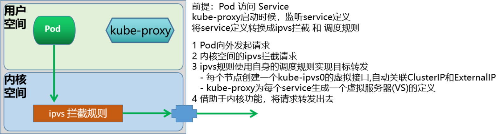

# 40、Kubernetes服务发现和名称解析


```powershell
nacos 服务发现，适合业务
服务名——》 IP:Port

k8s	服务发现，适合系统服务
服务名 ——》 IP

coredns
```


# 服务访问

## service

### service说明

说到外部用户来访问集群内部的场景，肯定能想到传统的负载均衡的案例：

比如：nginx的upstream,Haproxy的Backend 或者 LVS的RS 功能


Service 本质上就是一个四层的反向代理，集群内和外的客户端可以通过如下流程最终实现访问Pod应用

```
集群内部Client --> service网络 -->Pod网络 -->容器应用
集群外部Client --> 主机节点网络--> service网络 -->Pod网络 -->容器应用
```

Service 资源在master端的Controller组件中，由 Service Controller 来进行统一管理。

service是Kubernetes里最核心的API资源对象之一，它是由coredns或者kube-dns组件提供的功能。

每一个Service通常都是对应一个完整的业务服务，之前的Pod、RC、Deployment等资源对象都是为Service服务的。

Service 是基于名称空间的资源


Kubernetes 的 Service定义了一个服务的访问入口地址，前端的应用Pod通过Service访问其背后一组有Pod副本组成的集群实例，Service通过Label Selector访问指定的后端Pod，RC保证Service的服务能力和服务质量处于预期状态。

Service是Kubernetes中最高一级的抽象资源对象，每个Service提供一个独立的服务，集群Service彼此间使用TCP/IP进行通信，将不同的服务组合在一起运行起来，就形成了所谓的"系统"，效果如下图


Pod是工作在不同的Node节点上，而Node节点上有一个kube-proxy组件，它就是一个软件负载均衡器，在内部有一套专有的负载均衡与会话保持机制，可以达到接收到所有对Service请求，进而通过RANDOM算法调度转发到后端的某个具体的Pod实例上来处理该请求。

kube-proxy 本质就是 Service Controller位于各节点上的agent。

根据Pod所处的Node场景，有两种情况：

所有Pod副本都在同一Node节点上：对于这种情况，将Node物理节点专用的IP，作为负载均衡器的VIP，即可实现负载均衡后端服务的效果。

所有Pod副本不在同一Node节点上：Node节点的物理ip就没有办法作为负载均衡器的VIP了，这也是更为常见的情况。

而Kubernetes是一个分布式的资源管理平台，所以Kubernetes集群资源对象肯定不能保证在同一台Node节点，所以就不能使用Node节点的物理ip地址作为负载均衡器VIP地址了。

那么应该怎么解决这种问题呢？

Kubernetes发明了一种设计，给Service分配一个全局唯一的虚拟ip地址--cluster IP，它不存在任何网络设备上，Service通过内部的标签选择器，指定相应该Service的Pod资源，当请求发给cluster IP，后端的Pod资源收到请求后，就会响应请求。

这种情况下，每个Service都有一个全局唯一通信地址，整个系统的内部服务间调用就变成了最基础的

TCP/IP网络通信问题。如果我们的集群内部的服务想要和外部的网络进行通信，可以有多种方法，比如：

- NodePort类型，通过在所有节点上增加一个对外的端口，用于接入集群外部请求
- ingress类型，通过集群附加服务功能，将外部的域名流量转交到集群内部。

Service 核心功能

- 服务发现: 利用标签选择器，在同一个namespace中筛选符合条件的Pod, 从面实现发现一组提供了相同服务的Pod，可以结合readiness探针实现健康性检查
- 负载均衡: Service作为流量入口和负载均衡器，其入口为ClusterIP, 这组筛选出的Pod的IP地址，将作为该Service的后端服务器
- 名称解析: 利用Cluster DNS，为该组Pod所代表的服务提供一个名称, 在DNS中 对于每个Service，自动生成一个A、PTR和SRV记录

**service资源查看**

```bash
[root@master1 ~]#kubectl get svc
NAME         TYPE        CLUSTER-IP   EXTERNAL-IP   PORT(S)   AGE
kubernetes   ClusterIP   10.96.0.1    <none>        443/TCP   8d
[root@master1 ~]#kubectl get svc -n default kubernetes -o yaml 
apiVersion: v1
kind: Service
metadata:
  creationTimestamp: "2025-03-22T08:03:27Z"
  labels:
    component: apiserver
    provider: kubernetes
  name: kubernetes
  namespace: default
  resourceVersion: "211"
  uid: a7a1a124-8539-4d29-8d75-cb2ded1149a6
spec:
  clusterIP: 10.96.0.1
  clusterIPs:
  - 10.96.0.1
  internalTrafficPolicy: Cluster
  ipFamilies:
  - IPv4
  ipFamilyPolicy: SingleStack
  ports:
  - name: https
    port: 443
    protocol: TCP
    targetPort: 6443
  sessionAffinity: None
  type: ClusterIP
status:
  loadBalancer: {}
```

**endpoint资源查看**

```bash
[root@master1 ~]#kubectl get endpoints
NAME         ENDPOINTS         AGE
kubernetes   10.0.0.100:6443   8d
[root@master1 ~]#kubectl get endpoints -A
NAMESPACE     NAME         ENDPOINTS                                                  AGE
default       kubernetes   10.0.0.100:6443                                            8d
kube-system   kube-dns     10.244.0.16:53,10.244.0.17:53,10.244.0.16:53 + 3 more...   8d
```

**endpointslices资源查看**

```bash
[root@master1 ~]#kubectl get endpointslices.discovery.k8s.io 
NAME         ADDRESSTYPE   PORTS   ENDPOINTS    AGE
kubernetes   IPv4          6443    10.0.0.100   8d
[root@master1 ~]#kubectl get endpointslices.discovery.k8s.io  -A
NAMESPACE     NAME             ADDRESSTYPE   PORTS        ENDPOINTS                 AGE
default       kubernetes       IPv4          6443         10.0.0.100                8d
kube-system   kube-dns-tvgvs   IPv4          9153,53,53   10.244.0.17,10.244.0.16   8d
```

### Endpoints

当创建 Service资源的时候，最重要的就是为Service指定能够提供服务的标签选择器


- 每创建一个Service ,自动创建一个和之同名的API 资源类型 Endpoints
- Endpoints负责维护由相关Service标签选择器匹配的Pod对象
- Endpoints对象上保存Service匹配到的所有Pod的IP和Port信息,称之为端点
- ETCD是K/V数据库, 而一个Endpoints对象对应一个Key,所有后端Pod端点信息为其Value
- 当一个Endpoints对象对应后端每个Pod的每次变动，都需更新整个Endpoints对象，并将新的Endpoints对象重新保存至API Server和ETCD
- 此外还需要将该对象同步至每个节点的kube-proxy
- 在ETCD中的对象默认最大为1.5MB,一个Endpoints对象至多可以存储5000个左右的端点信息,这意味着平均每端点占300KB

### EndpointSlice


- 基于Endpoints机制，即便只有一个Pod的IP等信息发生变动，就需要向集群中的每个节点上的kube-proxy发送整个endpoints对象

- 比如: 一个由2000个节点组成的集群中，更新一个有5000个Pod IP占用1.5MB空间的Endpoints 对象，就需要发送3GB的数据

  若以滚动更新机制，一次只升级更新一个Pod的信息，这将导致更新这个Endpoints对象需要发送15T的数据

- EndpointSlice资源通过将Endpoints切分为多片来解决上述问题

- 自Kubernetes v1.16引入EndpointSlice

- 每个端点信息的变动，仅需要更新和发送一个EndpontSlice对象,而非整个Endpoints对象

- 每个EndpointSlice默认存储100个端点信息，不会超过 etcd对单个对象的存储限制

- 可在kube-controller-manager程序上使用 --max-endpoints-per-slice 选项进行配置

- EndpointSlice并未取代Endpoints，二者同时存在

### Service 的访问流程


## Service 工作模型

### 代理模型

kube-proxy 将请求代理至相应端点的实现方式有五种：

- userspace 早期k8s实现
- iptables：较旧的内核，iptables工具
- nftables: 依赖较新的内核，从kubernetes-v1.29.0 之后版本支持,nft 工具
- ipvs
- kernelspace: 仅Windows使用

#### Userspace


userspace模型是Kubernetes最早的一种工作模型，从kubernetes v1.1版本之前使用,在kubernetes v1.2以后淘汰

userspace模式早由 Kube-proxy 自已来负责将service 策略转换成iptables规则

这些iptables规则仅做请求的拦截，而不对请求进行调度处理。

流量处理过程

- Pod向外的请求流量先到达内核空间后，经过Iptables的规则后，再由套接字送往用户空间的kube-proxy
- 之后由kube-proxy将流量送回内核空间，并调度至后端Pod。因为涉及到来回转发，效率低下

#### Iptables


Iptables模式在kubernetes v1.1版本开始使用。 kubernetes v1.2 版本 iptables 成为默认代理模式

Kube-proxy 自动为Service创建iptables规则

将由iptables规则直接捕获Pod向外发往ClusterIP和Port的请求流量，并重定向至当前Service的后端

对每个Endpoints对象，Service资源会为其创建iptables规则并关联至挑选的后端Pod资源

优点：性能比userspace更加高效和可靠

**缺点**：

- 不会在后端Pod无响应时自动重定向，而userspace可以
- 一个service一般对应生成20条左右iptables规则
- 中等规模的Kubernetes集群(几百个service)能够承受，但是大规模的Kubernetes集群(几千个service)可达几万条规则，性能较差
- 集群节点数少于50个,服务数量少于2000个,可以使用此模式,否则使用IPVS模式性能更好
- iptables 默认基于random算法调度
- kube-proxy在 iptables模式下的复杂度程度为O(n)，即规模越大，性能越差

#### IPVS



kubernetes v1.8 引入 ipvs 代理模块

kubernetes v1.9 ipvs 代理模块成为 beta 版本

kubernetes v1.11 ipvs 代理模式 GA，成为默认设置

请求流量的调度功能由ipvs实现，余下的其他功能仍由iptables完成

ipvs流量转发速度快，规则同步性能好

IPVS默认基于rr算法调度，同时也支持众多调度算法，如rr/lc/dh/sh/sed/nq等

二进制Kubernetes的安装方式修改模式：

```
echo 'KUBE_PROXY_MODE=ipvs' >> /etc/sysconfig/kubelet
```

优点：

- 每条ipvs规则包含了两个功能：转发功能和调度功能
- kube-proxy在IPVS模式下是使用hash表作为底层数据结构，复杂度程度为O(1)，所以当服务很多时，性能更优
- 据测试，当后端服务达到5000以上且不使用保持连接keepalive时的往返响应时间，和iptables模式性能相对已经有较大优势，当达到服务达到10000时，甚至可以达到iptables模式的性能两倍，此外iptables模式的CPU也会消耗更多

注意：对于kubeadm方式安装Kubernetes集群来说，它会首先检测当前主机上是否已经包含了ipvs模块，如果加载了，就直接用ipvs中NAT模式，如果没有加载ipvs模块的话，会自动使用iptables模式。

范例：kubeadm方式将默认的iptables模式修改为IPVS模式

```bash
#查看当前模式,默认为iptables
[root@master1 ~]#curl 127.0.0.1:10249/proxyMode
iptables

#安装ipvs工具
[root@master1 ~]#apt install -y ipvsadm
[root@master1 ~]#ipvsadm -Ln
IP Virtual Server version 1.2.1 (size=4096)
Prot LocalAddress:Port Scheduler Flags
  -> RemoteAddress:Port           Forward Weight ActiveConn InActConn


[root@master1 ~]#kubectl edit configmap kube-proxy -n kube-system
mode: "ipvs" #修改此行,默认为""

#删除所有kube-proxy对应的Pod,建议reboot生效
[root@master1 ~]#kubectl delete pod -n kube-system -l k8s-app=kube-proxy

#验证结果
[root@master1 ~]#curl 127.0.0.1:10249/proxyMode
ipvs

#每个节点都生成kube-ipvs0的虚拟网卡
[root@master1 yaml]#ip a
...
9: kube-ipvs0: <BROADCAST,NOARP> mtu 1500 qdisc noop state DOWN group default 
    link/ether 02:01:44:76:7b:65 brd ff:ff:ff:ff:ff:ff
    inet 10.96.0.1/32 scope global kube-ipvs0
       valid_lft forever preferred_lft forever
    inet 10.96.0.10/32 scope global kube-ipvs0
       valid_lft forever preferred_lft forever

[root@master1 yaml]#ipvsadm -Ln
IP Virtual Server version 1.2.1 (size=4096)
Prot LocalAddress:Port Scheduler Flags
  -> RemoteAddress:Port           Forward Weight ActiveConn InActConn
TCP  10.96.0.1:443 rr
  -> 10.0.0.100:6443              Masq    1      0          0         
TCP  10.96.0.10:53 rr
  -> 10.244.0.16:53               Masq    1      0          0         
  -> 10.244.0.17:53               Masq    1      0          0         
TCP  10.96.0.10:9153 rr
  -> 10.244.0.16:9153             Masq    1      0          0         
  -> 10.244.0.17:9153             Masq    1      0          0         
UDP  10.96.0.10:53 rr
  -> 10.244.0.16:53               Masq    1      0          0         
  -> 10.244.0.17:53               Masq    1      0          0  
```

### Service 和 kube-proxy 关联关系


- Service作为一个独立的API资源对象，它会在在API Service服务中定义出来的
- 在创建任何存在标签选择器的Service时，都会被自动创建一个同名的Endpoints资源，Endpoints对象会使用Label Selector自动发现后端端点，并各端点的IP配置为可用地址列表的元素
- Service Controller 触发每个节点上的kube-proxy，由kube-proxy实时的转换为本地节点上面的ipvs/iptables规则。
- 默认情况下，内核中的ipvs或iptables规则，仅仅是负责本地节点用户空间pod客户端发出请求时的拦截或者转发规则
- 如果Pod客户端向Service发出请求,客户端向内核发出请求，根据ipvs或iptables规则，匹配目标service
- 如果service匹配，会返回当前service随对应的后端endpoint有哪些
- iptables或ipvs会根据情况挑选一个合适的endpoint地址
  - 如果endpoint是本机上的，则会转发给本机的endpoint
  - 如果endpoint是其他主机上的，则转发给其他主机上的endpoint

```powershell
kube-proxy ————》 service 网络 （iptable/nftable,ipvs）

host	
service	网络插件 cilume kube-proxy(可选)
pod		网络插件 flannel,cilume
```

### Service 类型


|                 类型                 |                        核心功能                         |                           访问方式                           |                        依赖条件/限制                         |          示例场景          |
| :----------------------------------: | :-----------------------------------------------------: | :----------------------------------------------------------: | :----------------------------------------------------------: | :------------------------: |
|      **ClusterIP** （默认类型）      |  为集群内部（节点、Pod）提供访问，外部网络无法直接访问  |       `客户端 → ClusterIP:ServicePort → PodIP:PodPort`       |                          无特殊依赖                          | 内部微服务通信（如数据库） |
|  **NodePort** （ClusterIP 增强版）   | 通过节点 IP 和固定端口（30000~32767）暴露服务到外部网络 | `外部客户端 → NodeIP:NodePort` `→ ClusterIP:ServicePort → PodIP:PodPort` |    需节点开放端口 （所有 `kube-proxy` 节点启用相同端口）     |    开发测试环境临时访问    |
| **LoadBalancer** （NodePort 增强版） |        基于云厂商负载均衡器（LBaaS）对外提供服务        | `外部客户端 → 云厂商LB → NodeIP:NodePort` `→ ClusterIP:ServicePort → PodIP:PodPort` | 依赖云平台 LBaaS 支持 （无云服务时降级为 `NodePort`，`EXTERNAL-IP` 显示 `Pending`） |  生产环境高可用 Web 服务   |
|           **ExternalName**           |   通过 DNS CNAME 将外部服务（如云数据库）引入集群内部   | `集群内客户端 → Service名称 → CNAME → 外部服务域名（如 mysql.wang.org）` | 依赖 CoreDNS 解析 （无 ClusterIP/NodePort，不创建 Endpoints） | 访问外部托管服务（如 RDS） |

| 类型         | 解析                                                         |
| ------------ | ------------------------------------------------------------ |
| ClusterIP    | 此为Service的默认类型<br/>为集群内部的客户端访问,包括节点和Pod等，外部网络无法访问<br/>In client --> clusterIP: ServicePort (Service) --> PodIP: PodPort |
| NodePort     | 本质上在ClusterIP模式基础上,再多加了一层端口映射的封装,相当于增强版的ClusterIP<br/>通过NodeIP:NodePort对外部网络提供服务，默认随机端口范围30000~32767, 可指定为固定端口<br/>NodePort是一个随机的端口，以防止端口冲突,在所有安装kube-proxy的节点上都会打开此相同的端口<br/>可通过访问ClusterIP实现集群内部访问,也可以通过NodeIP:NortPort的方式实现从集群外部至内部的访问<br/>Ex Client --> NodeIP:NodePort (Service) --> PodIP:PodPort |
| LoadBalancer | 基于NodePort基础之上，使用集群外部的运营商负载均衡器方式实现对外提供服务,增强版的NodePort<br/>基于云运营商IaaS云创建一个Kubernetes云，云平台也支持LBaaS(LoadBalance as a Service)产品服务<br/>Master 借助cloud-manager向LBaaS的API请求动态创建软件LB,即支持和Kubernetes API Server 进行交互<br/>如果没有云服务,将无法获取EXTERNAL-IP,显示Pending状态,则降级为NodePort类型<br/>Ex Client --> LB_IP:LB_PORT --> NodeIP:NodePort(Service)-->PodIP:PodPort |
| ExternalName | 当Kubernetes集群需要访问集群外部服务时，需要通过externalName将外部主机引入到集群内部<br/>外部主机名以 DNS方式解析为一个 CNAME记录给Kubernetes集群的其他主机来使用<br/>这种Service既没有ClusterIP，也没有NodePort.而且依赖于内部的CoreDNS功能<br/>In client -->Cluster ServiceName --> CName --> External Service Name<br/>本方式的service没有selector,所以也不会创建同名的Endpoints资源对象<br/>示例：<br/>Service名称：MySQL服务内部域名 mysql.default.svc.cluster.local<br/>MySQL服务外部域名：mysql.wang.org<br/>In Client --> mysql.default.svc.cluster.local --> mysql.wang.org --> MYSQL IP |

```
clusterIP
nodeport=clusterIP+nodeIP:Port
LoadBalancer=nodeport+集群外的IP:Port
ExternalName:集群内访问集群外，款名称空间之间的Pod访问
```

### ExternalIP

从外部访问 Kubernetes的Pod,除了使用 NodePort 和 LoadBalancer 的Service 类型,也可以使用ExternalIP 实现

如果有外部 IP 能够路由到一个或多个集群节点上，则 Kubernetes 可以通过 externalIPs 将Service公开出去。

在下面的例子中，名为 my-service 的服务可以在 " 198.51.100.32:80 " （根据.spec.externalIPs[] 和 .spec.ports[].port 得出）上被客户端使用 TCP 协议访问。

还需要在某个节点绑定此IP 1.2.3.4 到网卡上

```bash
apiVersion: v1
kind: Service
metadata:
  name: my-service
spec:
  selector:
	app.kubernetes.io/name: MyApp
  ports:
	- name: http
	  protocol: TCP
	  port: 80
	  targetPort: 49152
	externalIPs:
	  - 1.2.3.4
```

## Service 管理

对于Service的创建有两种方法：

- 命令行方法
- YAML 文件方法

命令方法

```bash
#创建命令1：
kubectl create service [flags] NAME [--tcp=port:targetPort] [--dry-run]
#作用：单独创建一个service服务
flags 参数详解：
clusterip 		#Create a ClusterIP service.将集群专用服务接口
nodeport 		#创建一个 NodePort service.将集群内部服务以端口形式对外提供
loadbalancer 	#创建一个 LoadBalancer service.主要针对公有云服务
externalname 	#Create an ExternalName service.将集群外部服务引入集群内部

#创建命令2：
kubectl expose (-f FILENAME | TYPE NAME) [--port=port] [--protocol=TCP|UDP|SCTP] [--target-port=number-or-name] [--name=name] [--external-ip=external-ip-of-service] [--type=type] [options]
#作用：针对一个已存在的deployment、pod、ReplicaSet等创建一个service
#参数详解：
--port='' 			#设定service对外的端口信息
--target-port='' 	#设定容器的端口,默认和service的端口相同
--type='' 			#设定类型，支持四种：ClusterIP(默认), NodePort,LoadBalancer,ExternalName
--cluster-ip='' 	#设定对外的ClusterIP地址
--name='' 			#创建service对外的svc名称

#创建命令3：创建自主式Pod时动创建Service
kubectl run <Pod_name> --image 镜像 --expose --port <容器端口>
#查看命令：
kubectl get svc
#查看更多信息的命令是一个通用的命令，一般常用两种方法显示更多的内容：yaml和json
#语法：
kubectl get 资源类型 [类型名称] -o yaml
kubectl get 资源类型 [类型名称] -o json
#yaml格式查看更多Service的信息
kubectl get svc <service-name> -o yaml
#注意：
#在spec.ports的定义中，targetPort属性就是用来确定提供该服务的容器所暴露(EXPORT)的端口号，即通过targetPort端口来访问业务进程在容器。
#默认情况下targetPort跟我们容器定义的port一致。

#删除 service
kubectl delete svc <svc_name> [ -n <namespace>[] [--all]
```

### 命令行方式

#### **基于自主式Pod自动创建Service**

```bash
[root@master1 yaml]#kubectl run myapp2 --image registry.cn-beijing.aliyuncs.com/wangxiaochun/pod-test:v0.1 --expose --port 80
service/myapp2 created
pod/myapp2 created
[root@master1 yaml]#kubectl get pod
NAME                     READY   STATUS    RESTARTS   AGE
myapp2                   1/1     Running   0          8s
[root@master1 yaml]#kubectl get svc
NAME         TYPE        CLUSTER-IP      EXTERNAL-IP   PORT(S)   AGE
kubernetes   ClusterIP   10.96.0.1       <none>        443/TCP   8d
myapp2       ClusterIP   10.101.97.233   <none>        80/TCP    12s
[root@master1 yaml]#kubectl get ep
NAME         ENDPOINTS                         AGE
kubernetes   10.0.0.100:6443                   8d
myapp2       10.244.4.150:80                   15s
[root@master1 yaml]#curl 10.101.97.233
kubernetes pod-test v0.1!! ClientIP: 10.244.0.0, ServerName: myapp2, ServerIP: 10.244.4.150!
```


#### **kubectl create 创建 service**

```bash
[root@master1 yaml]#kubectl create deployment myapp --image registry.cn-beijing.aliyuncs.com/wangxiaochun/pod-test:v0.1 --replicas 2
deployment.apps/myapp created
[root@master1 yaml]#kubectl get pod
NAME                     READY   STATUS    RESTARTS   AGE
myapp-6d67457cf5-59ffs   1/1     Running   0          86s
myapp-6d67457cf5-zn57k   1/1     Running   0          86s

#注意这里的clusteripName必须和上面的deploymentName一样
[root@master1 yaml]#kubectl create svc clusterip myapp --tcp=88:80
service/myapp created
[root@master1 yaml]#kubectl get svc
NAME         TYPE        CLUSTER-IP      EXTERNAL-IP   PORT(S)   AGE
kubernetes   ClusterIP   10.96.0.1       <none>        443/TCP   8d
myapp        ClusterIP   10.98.220.225   <none>        88/TCP    10s
[root@master1 yaml]#kubectl get ep
NAME         ENDPOINTS                         AGE
kubernetes   10.0.0.100:6443                   8d
myapp        10.244.1.124:80,10.244.3.153:80   13s
```

```bash
[root@master1 yaml]#kubectl get pod --show-labels 
NAME                     READY   STATUS    RESTARTS   AGE     LABELS
myapp-6d67457cf5-59ffs   1/1     Running   0          6m22s   app=myapp,pod-template-hash=6d67457cf5
myapp-6d67457cf5-zn57k   1/1     Running   0          6m22s   app=myapp,pod-template-hash=6d67457cf5

[root@master1 yaml]#kubectl create svc clusterip myapp --tcp=88:80 --dry-run=client -o yaml
apiVersion: v1
kind: Service
metadata:
  creationTimestamp: null
  labels:
    app: myapp
  name: myapp
spec:
  ports:
  - name: 88-80
    port: 88
    protocol: TCP
    targetPort: 80
  selector:
    app: myapp
  type: ClusterIP
status:
  loadBalancer: {}
```

```bash
[root@master1 yaml]#curl 10.98.220.225:88
kubernetes pod-test v0.1!! ClientIP: 10.244.0.0, ServerName: myapp-6d67457cf5-59ffs, ServerIP: 10.244.3.153!
[root@master1 yaml]#curl 10.98.220.225:88
kubernetes pod-test v0.1!! ClientIP: 10.244.0.0, ServerName: myapp-6d67457cf5-zn57k, ServerIP: 10.244.1.124!
```

#### kubectl expose 创建 service

```bash
#对已存在Deployment创建service
[root@master1 yaml]#kubectl create deployment myweb01 --image registry.cn-beijing.aliyuncs.com/wangxiaochun/pod-test:v0.1 --replicas 3
deployment.apps/myweb01 created
[root@master1 yaml]#kubectl create deployment myweb02 --image registry.cn-beijing.aliyuncs.com/wangxiaochun/pod-test:v0.2 --replicas 3
deployment.apps/myweb02 created
[root@master1 yaml]#kubectl get pod -o wide 
NAME                       READY   STATUS    RESTARTS   AGE     IP             NODE             NOMINATED NODE   READINESS GATES
myweb01-548f474957-n4x4b   1/1     Running   0          8m52s   10.244.3.154   node3.kang.org   <none>           <none>
myweb01-548f474957-sjj8s   1/1     Running   0          8m52s   10.244.4.151   node2.kang.org   <none>           <none>
myweb01-548f474957-vqdmc   1/1     Running   0          8m52s   10.244.1.126   node1.kang.org   <none>           <none>
myweb02-846759744c-czbkp   1/1     Running   0          8m9s    10.244.1.127   node1.kang.org   <none>           <none>
myweb02-846759744c-fpfjm   1/1     Running   0          8m9s    10.244.3.155   node3.kang.org   <none>           <none>
myweb02-846759744c-x7jkq   1/1     Running   0          8m9s    10.244.4.152   node2.kang.org   <none>           <none>

[root@master1 yaml]#kubectl expose deployment myweb01 --port=81 --target-port=80
service/myweb01 exposed
[root@master1 yaml]#kubectl expose deployment myweb02 --port=82 --target-port=80
service/myweb02 exposed

[root@master1 yaml]#kubectl get svc
NAME         TYPE        CLUSTER-IP       EXTERNAL-IP   PORT(S)   AGE
kubernetes   ClusterIP   10.96.0.1        <none>        443/TCP   8d
myweb01      ClusterIP   10.100.113.210   <none>        81/TCP    5m37s
myweb02      ClusterIP   10.110.47.235    <none>        82/TCP    15s

#自动生成同名的Endpoint
[root@master1 yaml]#kubectl get ep
NAME         ENDPOINTS                                         AGE
kubernetes   10.0.0.100:6443                                   8d
myweb01      10.244.1.126:80,10.244.3.154:80,10.244.4.151:80   6m42s
myweb02      10.244.1.127:80,10.244.3.155:80,10.244.4.152:80   27s
```

```bash
[root@master1 yaml]#curl 10.100.113.210:81
kubernetes pod-test v0.1!! ClientIP: 10.244.0.0, ServerName: myweb01-548f474957-vqdmc, ServerIP: 10.244.1.126!
kubernetes pod-test v0.1!! ClientIP: 10.244.0.0, ServerName: myweb01-548f474957-sjj8s, ServerIP: 10.244.4.151!
kubernetes pod-test v0.1!! ClientIP: 10.244.0.0, ServerName: myweb01-548f474957-n4x4b, ServerIP: 10.244.3.154!

[root@master1 yaml]#curl 10.110.47.235:82
kubernetes pod-test v0.2!! ClientIP: 10.244.0.0, ServerName: myweb02-846759744c-fpfjm, ServerIP: 10.244.3.155!
kubernetes pod-test v0.2!! ClientIP: 10.244.0.0, ServerName: myweb02-846759744c-x7jkq, ServerIP: 10.244.4.152!
kubernetes pod-test v0.2!! ClientIP: 10.244.0.0, ServerName: myweb02-846759744c-czbkp, ServerIP: 10.244.1.127!
```

### 文件方式

```yaml
# Kubernetes Service 资源配置文件
# API版本声明
apiVersion: v1  
# 资源类型为Service
kind: Service  

# 元数据部分
metadata:
  # 服务名称（需替换实际值）
  name: …  
  # 所属命名空间（需替换实际值）
  namespace: …  
  # 标签集合
  labels:
    # 标签键值对1
    key1: value1  
    # 标签键值对2
    key2: value2  

# 规格定义
spec:
  # Service类型，可选值：ClusterIP/NodePort/LoadBalancer/ExternalName
  type: <string>  
  # Pod选择器（键值对映射）
  selector: <map[string]string>  

  # 端口配置列表
  ports:
    # 端口配置项1
    - name: <string>  
      # 网络协议：TCP/UDP/SCTP
      protocol: <string>  
      # Service暴露端口
      port: <integer>  
      # 目标Pod端口（支持数字或名称）
      targetPort: <string>  
      # 节点端口（30000-32768）
      nodePort: <integer>  

    # 端口配置项2（保留原始省略格式）
    - name: <string>  
      .......
  
  # 集群内部IP地址
  clusterIP: <string>  

  # 内部流量策略
  internalTrafficPolicy: <string>  

  # 外部流量策略（注意保留原始换行）
  externalTrafficPolicy: <string>  

  # 负载均衡器IP（仅LoadBalancer类型）
  loadBalancerIP: <string>  

  # 外部服务DNS名称（CNAME记录）
  externalName: <string>  

  # 外部IP地址列表（非K8S托管）
  externalIPs: <[]string>  
```

```yaml
apiVersion: v1
kind: Service
metadata:
  name: …  # 服务名称（需替换实际值）
  namespace: …  # 所属命名空间（需替换实际值）
  labels:
    key1: value1  # 标签键值对1
    key2: value2  # 标签键值对2
spec:
  type: <string>  # Service类型，默认为ClusterIP
  selector: <map[string]string>  # 指定用于过滤出servic所代理的后端Pod的标签,只支持等值类型的标签选择器，多个条件内含"与"逻辑
  ports:  # Service的端口对象列表
    - name: <string>  # 端口名称,需要保证唯一性
      protocol: <string>  # 协议，目前仅支持TCP、UDP和SCTP，默认为TCP
      port: <integer>  # Service的端口号
      targetPort: <string>  # 后端Pod的端口号或名称，名称需由Pod中的规范定义
      nodePort: <integer>  # 节点端口号，仅适用NodePort和LoadBalancer类型,范围：30000-32768，建议不指定而由系统自动分配
    - name: <string>
      .......
  clusterIP: <string>  # 指定Service的集群IP，建议不指定而由系统自动分配
  internalTrafficPolicy: <string>  # 内部流量策略处理方式，Local表示由当前节点处理，Cluster表示向集群范围调度，默认值为Cluster
  externalTrafficPolicy: <string>  # 外部流量策略处理方式，默认为Cluster，当为Local时，表示由当前节点处理，性能较好，但无负载均衡功能，且可以看到真实客户端IP，Cluster表示向集群范围调度，和Local相反，基于性能原因，生产更建议Local，此方式只支持type是NodePort和LoadBlancer类型或者ExternalIPs
  loadBalancerIP: <string>  # 外部负载均衡器使用的IP地址，仅适用于LoadBlancer,此字段未来可能被删除
  externalName: <string>  # 外部服务名称，该名称将作为Service的DNS CNAME值
  externalIPs: <[]string>  # 群集中的节点将接受此服务的流量的 IP 地址列表。这些IP不由 Kubernetes管理。用户负责确保流量到达具有此 IP 的节点。常见的是不属于 Kubernetes 系统的外部负载均衡器，注意：此IP和Type类型无关
```

### ClusterIP Service 实现

范例：单端口应用

```bash
#如果基于资源配置文件创建资源，依赖于后端pod的标签，才可以关联后端的资源
#准备多个后端pod对象
[root@master1 yaml]#kubectl create deployment myweb --image=registry.cn-beijing.aliyuncs.com/wangxiaochun/pod-test:v0.1 --replicas=3
deployment.apps/myweb created

[root@master1 yaml]#kubectl get pod --show-labels -o wide
NAME                    READY   STATUS    RESTARTS   AGE   IP             NODE             NOMINATED NODE   READINESS GATES   LABELS
myweb-8744dbf98-7pwlz   1/1     Running   0          20s   10.244.1.128   node1.kang.org   <none>           <none>            app=myweb,pod-template-hash=8744dbf98
myweb-8744dbf98-jqtjh   1/1     Running   0          20s   10.244.4.153   node2.kang.org   <none>           <none>            app=myweb,pod-template-hash=8744dbf98
myweb-8744dbf98-m6w6b   1/1     Running   0          20s   10.244.3.156   node3.kang.org   <none>           <none>            app=myweb,pod-template-hash=8744dbf98

#创建service对象
[root@master1 service]#vim service-clusterip-test.yaml

kind: Service
apiVersion: v1
metadata:
  name: service-clusterip-test
spec:
  #type: ClusterIP #默认即为ClusterIP，此行可省略
  #clusterIP: 192.168.64.100 #可以手动指定IP，但一般都是系统自动指定而无需添加此行
  selector:
    app: myweb #引用上面deloyment的名称，同时也是Pod的Label中app的值,实现service代理指定Pod的功能
    #version: v1.0 #可以添加多个label与关系，即只过滤出有此处label匹配的pod，而非deployment的名称
  ports:
    - name: http
      protocol: TCP
      port: 80 #Service的端口
      targetPort: 80 #后端Pod对应的端口
      
[root@master1 service]#kubectl apply -f service-clisterip-test.yaml 
service/service-clusterip-test created
[root@master1 service]#kubectl get all
NAME                        READY   STATUS    RESTARTS   AGE
pod/myweb-8744dbf98-7pwlz   1/1     Running   0          2m28s
pod/myweb-8744dbf98-jqtjh   1/1     Running   0          2m28s
pod/myweb-8744dbf98-m6w6b   1/1     Running   0          2m28s

NAME                             TYPE        CLUSTER-IP      EXTERNAL-IP   PORT(S)   AGE
service/kubernetes               ClusterIP   10.96.0.1       <none>        443/TCP   8d
service/service-clusterip-test   ClusterIP   10.107.68.109   <none>        80/TCP    9s

NAME                    READY   UP-TO-DATE   AVAILABLE   AGE
deployment.apps/myweb   3/3     3            3           2m28s

NAME                              DESIRED   CURRENT   READY   AGE
replicaset.apps/myweb-8744dbf98   3         3         3       2m28s

[root@master1 service]#kubectl get ep
NAME                     ENDPOINTS                                         AGE
kubernetes               10.0.0.100:6443                                   8d
service-clusterip-test   10.244.1.128:80,10.244.3.156:80,10.244.4.153:80   39s
```

```bash
[root@master1 service]#while true; do curl 10.107.68.109;sleep 1; done
kubernetes pod-test v0.1!! ClientIP: 10.244.0.0, ServerName: myweb-8744dbf98-7pwlz, ServerIP: 10.244.1.128!
kubernetes pod-test v0.1!! ClientIP: 10.244.0.0, ServerName: myweb-8744dbf98-m6w6b, ServerIP: 10.244.3.156!
```

#### 多端口实现

有很多服务都会同时开启多个端口，典型的比如：tomcat三个端口，接下来实现创建多端口的Service

```yaml
kind: Service
apiVersion: v1
metadata:
  name: service-clusterip-test
spec:
  #type: ClusterIP #默认即为ClusterIP，此行可省略
  #clusterIP: 192.168.64.100 #可以手动指定IP，但一般都是系统自动指定而无需添加此行
  selector:
    app: myweb #引用上面deloyment的名称，同时也是Pod的Label中app的值,实现service代理指定Pod的功能
    #version: v1.0 #可以添加多个label与关系，即只过滤出有此处label匹配的pod，而非deployment的名称
  ports:
    - name: http
      protocol: TCP
      port: 80 #Service的端口
      targetPort: 80 #后端Pod对应的端口
    - name: http
      protocol: TCP
      port: 443 #Service的端口
      targetPort: 443 #后端Pod对应的端口
      
#关键点：只能有一个ports属性，多了会覆盖,每一个子port必须有一个name属性,由于service是基于标签的方式来管理pod的，所以必须有标签选择器
```

#### ClusterIP 类型同时指定externalIPs

ClusterIP 类型只能支持集群内容访问，如何想从集群外部访问，可以使用 externalIPs实现

注意：externalIPs 可以应用在所有的service模式下的

```bash
#在集群中的某个节点添加一个公网ip
[root@node1 ~]#ip a a 10.0.0.66/24 dev eth0 label eth0:1

[root@master1 service]#vim service-clisterip-test.yaml 
kind: Service
apiVersion: v1
metadata:
  name: service-clusterip-test
spec:
  #type: ClusterIP #默认即为ClusterIP，此行可省略
  #clusterIP: 192.168.64.100 #可以手动指定IP，但一般都是系统自动指定而无需添加此行
  selector:
    app: myweb #引用上面deloyment的名称，同时也是Pod的Label中app的值,实现service代理指定Pod的功能
    #version: v1.0 #可以添加多个label与关系，即只过滤出有此处label匹配的pod，而非deployment的名称
  ports:
    - name: http
      protocol: TCP
      port: 80 #Service的端口
      targetPort: 80 #后端Pod对应的端口
  externalIPs:
  - 10.0.0.66

#注意：这里的externalIPs对于使用哪种Service类型，其实关联度不大。

#创建
[root@master1 service]#kubectl apply -f service-clusterip-test.yaml 
service/service-clusterip-test configured

[root@master1 service]#kubectl get svc
NAME                     TYPE        CLUSTER-IP      EXTERNAL-IP   PORT(S)   AGE
kubernetes               ClusterIP   10.96.0.1       <none>        443/TCP   8d
service-clusterip-test   ClusterIP   10.107.68.109   10.0.0.66     80/TCP    22m

[root@master1 service]#curl 10.0.0.66
kubernetes pod-test v0.1!! ClientIP: 10.244.0.0, ServerName: myweb-8744dbf98-m6w6b, ServerIP: 10.244.3.157!

C:\Users\zhaok>curl 10.0.0.66
kubernetes pod-test v0.1!! ClientIP: 10.244.3.0, ServerName: myweb-8744dbf98-7pwlz, ServerIP: 10.244.1.129!
```

### NodePort Service 实现

NodePort会在所有节点主机上，向外暴露一个指定或者随机的端口，供集群外部的应用能够访问

Kubernetes集群内部的Pod资源。

注意：nodePort 属性范围为 30000-32767，且type 类型只支持 NodePort或LoadBalancer

注意: 此方式有安全风险，端口为非标端口,而且性能一般,生产一般较少使用

生产中建议使用Ingress方式向外暴露集群内的服务

范例：修改NodePort端口范围

```bash
[root@master1 ~]#kubectl exec -it -n kube-system kube-apiserver-master1.kang.org -- kube-apiserver --help |grep port-range
      --service-node-port-range portRange         A port range to reserve for services with NodePort visibility.  This must not overlap with the ephemeral port range on nodes.  Example: '30000-32767'. Inclusive at both ends of the range. (default 30000-32767)
[root@master1 ~]#cp /etc/kubernetes/manifests/kube-apiserver.yaml .
[root@master1 ~]#vim /etc/kubernetes/manifests/kube-apiserver.yaml
...
    - --tls-private-key-file=/etc/kubernetes/pki/apiserver.key
    - --service-node-port-range=40000-42767
    image: registry.aliyuncs.com/google_containers/kube-apiserver:v1.32.3
...
[root@master1 ~]#reboot
```

```bash
[root@master1 ~]#kubectl edit svc service-clusterip-test
...
spec:
...
  selector:
    app: myweb
  sessionAffinity: None
  type: NodePort
...

[root@master1 ~]#kubectl get svc
NAME                     TYPE        CLUSTER-IP      EXTERNAL-IP   PORT(S)        AGE
kubernetes               ClusterIP   10.96.0.1       <none>        443/TCP        8d
service-clusterip-test   NodePort    10.107.68.109   <none>        80:32363/TCP   47m

C:\Users\zhaok>curl 10.0.0.101:32363
kubernetes pod-test v0.1!! ClientIP: 10.244.1.0, ServerName: myweb-8744dbf98-m6w6b, ServerIP: 10.244.3.159!
C:\Users\zhaok>curl 10.0.0.101:32363
kubernetes pod-test v0.1!! ClientIP: 10.244.1.1, ServerName: myweb-8744dbf98-7pwlz, ServerIP: 10.244.1.131!
C:\Users\zhaok>curl 10.0.0.101:32363
kubernetes pod-test v0.1!! ClientIP: 10.244.1.0, ServerName: myweb-8744dbf98-jqtjh, ServerIP: 10.244.4.156!
```


#### externaltrafficpolicy 有两种策略


- cluster 模式

  此为默认模式

  集群外的请求报文从某节点的NodePort进入,该节点的Service 可以将请求流量调度到其他节点上的Pod,无需关心Pod在哪个节点上

  **Kube-proxy转发外部请求时会替换掉报文的源IP和目标IP,相当于FULLNAT**

  返回时需要从原路返回,可能会产生跨节点的跃点转发流量

  此模式负载均衡效果好，因为无论容器实例怎么分布在多个节点上，它都会转发过去。

  但是由于多了一次转发，性能会损失

  如果是NodePort类型,Pod无法获取外部客户端真实客户端IP

  如果从集群内的Pod访问SVC,可以看到Pod源地址，但本Pod访问SVC调度至到自身时例外

  

- local 模式

  集群外的请求报文从某节点的NodePort进入,该节点的Service 只会将请求流量调度到当前节点上的Pod

  **外部请求流量只发给本机的Pod, Kube-proxy转发时只会替换掉报文的目标IP,即只实现DNAT**

  例外：当从Pod所在集群节点访问时，也是通过FULLNAT来实现的

  即：容器收到的报文，看到源IP地址还是用户的原有 IP

  如果从集群内的Pod访问SVC,可以看到Pod源地址，但本Pod访问SVC调度至到自身时例外

  此模式的负载均衡效果不是很好，因为一旦容器实例分布在多个节点上，它只转发给本机，不产生跨节点的跃点转发流量。

  但是少了一次转发，性能会相对好

  由于本机不会跨节点转发报文，所以要想对所有节点上的容器实现负载均衡，就需要借助外部的Loadbalancer来实现

  因此使用Local 模式,一般会使用 LoadBalancer Service 类型结合 Loadbalancer 实现


如果使用Local模式，仍然转发至其它节点的Pod，因为是DNAT，会导致如下图示的通信异常


范例: nodePort 类型

```yaml
[root@master1 service]#vim service-nodeport.yaml

kind: Service
apiVersion: v1
metadata:
  name: service-nodeprot
spec:
  type: NodePort #指定service的类型,默认值为ClusterIP 
  #clusterIP: 192.168.64.100 #可以手动指定IP，但一般都是系统自动指定而无需添加此行
  selector:
    app: myweb #引用上面deloyment的名称，同时也是Pod的Label中app的值,实现service代理指定Pod的功能
    #version: v1.0 #可以添加多个label与关系，即只过滤出有此处label匹配的pod，而非deployment的名称
  ports:
    - name: http
      protocol: TCP
      port: 80 #Service的端口
      targetPort: 80 #后端Pod对应的端口
      nodePort: 30066 #指定固定端口（30000-32767）,使用NodePort类型且不指定nodeport，会自动分配随机端口向外暴露
```

```bash
[root@master1 service]#kubectl apply -f service-nodeport.yaml
service/service-nodeprot created
[root@master1 service]#kubectl get svc
NAME               TYPE        CLUSTER-IP     EXTERNAL-IP   PORT(S)        AGE
kubernetes         ClusterIP   10.96.0.1      <none>        443/TCP        8d
service-nodeprot   NodePort    10.110.36.18   <none>        80:30066/TCP   41s
[root@master1 service]#curl 10.110.36.18
kubernetes pod-test v0.1!! ClientIP: 10.244.0.0, ServerName: myweb-8744dbf98-7pwlz, ServerIP: 10.244.1.131!
[root@master1 service]#curl 10.110.36.18
kubernetes pod-test v0.1!! ClientIP: 10.244.0.0, ServerName: myweb-8744dbf98-m6w6b, ServerIP: 10.244.3.159!
[root@master1 service]#curl 10.110.36.18
kubernetes pod-test v0.1!! ClientIP: 10.244.0.0, ServerName: myweb-8744dbf98-jqtjh, ServerIP: 10.244.4.156!

#默认externalTrafficPolicy: Cluster，所以使用访问集群中任意一个物理节点的地址都可以
[root@master1 service]#curl 10.0.0.101:30066
kubernetes pod-test v0.1!! ClientIP: 10.244.1.1, ServerName: myweb-8744dbf98-7pwlz, ServerIP: 10.244.1.131!
[root@master1 service]#curl 10.0.0.102:30066
kubernetes pod-test v0.1!! ClientIP: 10.244.4.1, ServerName: myweb-8744dbf98-jqtjh, ServerIP: 10.244.4.156!
[root@master1 service]#curl 10.0.0.103:30066
kubernetes pod-test v0.1!! ClientIP: 10.244.3.0, ServerName: myweb-8744dbf98-7pwlz, ServerIP: 10.244.1.131!

#访问指定主机的指定端口，还会跳转到其他主机

externalTrafficPolicy <string> #外部流量策略处理方式，Local表示由当前节点处理，Cluster表示向集群范围调度，默认的外部流量调度策略是 cluster
#限制：Local 将外网访问的请求都转发到当前主机节点上，但是依赖于当前主机必须有对应的pod资源，否则会出现问题
#注意:如果当前节点有多个pod,仍然还会负载均衡

#从集群外访问，如果是externalTrafficPolicy为cluster，则Pod不能看到真实客户端IP
[root@master1 service]#kubectl logs myweb-8744dbf98-jqtjh 
 * Running on http://0.0.0.0:80/ (Press CTRL+C to quit)
10.244.1.0 - - [30/Mar/2025 12:53:27] "GET / HTTP/1.1" 200 -
10.244.1.0 - - [30/Mar/2025 12:53:29] "GET / HTTP/1.1" 200 -
10.244.1.0 - - [30/Mar/2025 12:53:30] "GET / HTTP/1.1" 200 -

#新版使用nft規則
[root@master1 service]#nft list ruleset | grep 30066
		meta l4proto tcp ip daddr 127.0.0.0/8  tcp dport 30066 # nfacct-name  localhost_nps_accepted_pkts counter packets 0 bytes 0 jump KUBE-EXT-HOBIJJ5M3MRP5VM7
		meta l4proto tcp  tcp dport 30066 counter packets 0 bytes 0 jump KUBE-EXT-HOBIJJ5M3MRP5VM7

#查看生成的iptables规则，旧版
[root@master1 ~]#echo 'obase=16;30066'|bc
7572
[root@master1 ~]#iptables -vnL -t nat | grep -iE "30066|7572"
```

范例: 流量调度策略 Local

```yaml
[root@master1 service]#vim service-nodeport-local.yaml 

kind: Service
apiVersion: v1
metadata:
  name: service-nodeprot
spec:
  type: NodePort #指定service的类型,默认值为ClusterIP 
  externalTrafficPolicy: Local	#指定Local
  selector:
    app: myweb #引用上面deloyment的名称，同时也是Pod的Label中app的值,实现service代理指定Pod的功能
  ports:
    - name: http
      protocol: TCP
      port: 80 #Service的端口
      targetPort: 80 #后端Pod对应的端口
      nodePort: 30066 #指定固定端口（30000-32767）,使用NodePort类型且不指定nodeport，会自动分配随机端口向外暴露
```

```bash
[root@master1 service]#kubectl apply -f service-nodeport-local.yaml 
service/service-nodeprot created
[root@master1 service]#kubectl get svc
NAME               TYPE        CLUSTER-IP      EXTERNAL-IP   PORT(S)        AGE
kubernetes         ClusterIP   10.96.0.1       <none>        443/TCP        8d
service-nodeprot   NodePort    10.96.181.255   <none>        80:30066/TCP   5s

#发现node1节点无法访问
[root@master1 service]#curl 10.0.0.101:30066
^C
[root@master1 service]#curl 10.0.0.102:30066
kubernetes pod-test v0.1!! ClientIP: 10.0.0.100, ServerName: myweb-8744dbf98-jqtjh, ServerIP: 10.244.4.156!
[root@master1 service]#curl 10.0.0.103:30066
kubernetes pod-test v0.1!! ClientIP: 10.0.0.100, ServerName: myweb-8744dbf98-m6w6b, ServerIP: 10.244.3.159!

[root@master1 service]#curl 10.0.0.103:30066
kubernetes pod-test v0.1!! ClientIP: 10.0.0.100, ServerName: myweb-8744dbf98-m6w6b, ServerIP: 10.244.3.159!
[root@master1 service]#curl 10.0.0.103:30066
kubernetes pod-test v0.1!! ClientIP: 10.0.0.100, ServerName: myweb-8744dbf98-m6w6b, ServerIP: 10.244.3.159!
[root@master1 service]#curl 10.0.0.103:30066
kubernetes pod-test v0.1!! ClientIP: 10.0.0.100, ServerName: myweb-8744dbf98-m6w6b, ServerIP: 10.244.3.159!
[root@master1 service]#curl 10.0.0.103:30066
kubernetes pod-test v0.1!! ClientIP: 10.0.0.100, ServerName: myweb-8744dbf98-m6w6b, ServerIP: 10.244.3.159!
#结果显示：外部流量定向到当前主机，而且不影响当前主机级别的负载均衡策略

#从集群外访问，如果是externalTrafficPolicy为Local，则Pod可以看到真实客户端IP
C:\Users\zhaok>curl 10.0.0.102:30066
kubernetes pod-test v0.1!! ClientIP: 10.0.0.1, ServerName: myweb-8744dbf98-jqtjh, ServerIP: 10.244.4.156!
C:\Users\zhaok>curl 10.0.0.103:30066
kubernetes pod-test v0.1!! ClientIP: 10.0.0.1, ServerName: myweb-8744dbf98-m6w6b, ServerIP: 10.244.3.159!
C:\Users\zhaok>curl 10.0.0.101:30066
^C

[root@master1 service]#kubectl logs myweb-8744dbf98-jqtjh 
10.0.0.100 - - [30/Mar/2025 13:55:49] "GET / HTTP/1.1" 200 -
10.0.0.1 - - [30/Mar/2025 13:57:36] "GET / HTTP/1.1" 200 -
```


### LoadBalancer Service 实现


只有Kubernetes集群是部署在一个LBaaS平台上且指供有一个集群外部的LB才适合使用LoadBalancer

一般的公有云都提供了此功能,但可能会有费用产生

如果在一个非公用云的普通的Kubernetes集群上，创建了一个LoadBalancer类型的Service，一般情况默认环境中是没有LBaaS的，所以会导致由于找不到指定的服务，状态会一直处于 Pending 状态

如果在私有云环境中使用 LoadBalancer Service，可以使用云原生的开源项目实现负载均衡器，比如OpenELB, MetalLB 实现

Loadbalancer 可以获取用户访问的Service对应的Pod在哪个节点上,因此支持externaltrafficpolicy为Local模式的流量转发

#### LoadBalancer 类型但没有 loadBalancerIP

范例: LoadBalancer 类型默认无法获取loadBalancerIP

```yaml
[root@master1 service]#vim service-loadbalancer.yaml 
apiVersion: v1
kind: Service
metadata:
  name: service-loadbalancer
spec:
  type: LoadBalancer
  externalTrafficPolicy: Local
  selector:
    app: myweb
  ports:
  - name: http
    protocol: TCP
    port: 80
    targetPort: 80
  #loadBalancerIP: 6.6.6.6 #指定地址后，还需要连接云服务商的LBaaS服务才能真正获得此地址，否则为pending状态
```

```bash
[root@master1 service]#kubectl apply -f service-loadbalancer.yaml 
service/service-loadbalancer created
[root@master1 service]#kubectl get svc
NAME                   TYPE           CLUSTER-IP      EXTERNAL-IP   PORT(S)        AGE
kubernetes             ClusterIP      10.96.0.1       <none>        443/TCP        8d
service-loadbalancer   LoadBalancer   10.107.241.48   <pending>     80:32156/TCP   17s
[root@master1 service]#kubectl get ep
NAME                   ENDPOINTS                         AGE
kubernetes             10.0.0.100:6443                   8d
service-loadbalancer   10.244.3.159:80,10.244.4.156:80   27s
[root@master1 service]#kubectl get pod -o wide 
NAME                    READY   STATUS    RESTARTS      AGE    IP             NODE             NOMINATED NODE   READINESS GATES
myweb-8744dbf98-jqtjh   1/1     Running   3 (74m ago)   107m   10.244.4.156   node2.kang.org   <none>           <none>
myweb-8744dbf98-m6w6b   1/1     Running   3 (74m ago)   107m   10.244.3.159   node3.kang.org   <none>           <none>

C:\Users\zhaok>curl 10.0.0.101:32156
^C
C:\Users\zhaok>curl 10.0.0.102:32156
kubernetes pod-test v0.1!! ClientIP: 10.0.0.1, ServerName: myweb-8744dbf98-jqtjh, ServerIP: 10.244.4.156!
C:\Users\zhaok>curl 10.0.0.103:32156
kubernetes pod-test v0.1!! ClientIP: 10.0.0.1, ServerName: myweb-8744dbf98-m6w6b, ServerIP: 10.244.3.159!
```

#### externalIPs

如果当前底层没有Iaas服务，也没有LBaaS服务，但是想直接通过众所周知的服务端口地址来进行访问，可以通过 externalIPs 实现


当前的Kubernetes集群，假如只有某个节点上绑定了一个对外的公网ip，其他主机则没有，那么我们可以通过指定的此主机上的公网ip使用标准端口来接入外部流量。可以借助于 externalIPs 属性来为当前的service指定公网ip地址即可

范例: LoadBalancer 类型同时指定externalIPs

```bash
#为局域网内的某台主机添加一个公网ip
[root@node3 ~]#ip a a 10.0.0.66/24 dev eth0 label eth0:1
#注意：这里的模拟的外网ip，必须被宿主机能够访问，而且与Kubernetes的集群Pod网段不一样

#配置清单文件
[root@master1 service]#vim service-loadbalancer.yaml

apiVersion: v1
kind: Service
metadata:
  name: service-loadbalancer-externalip
spec:
  type: LoadBalancer
  externalTrafficPolicy: Local
  selector:
    app: myweb
  ports:
  - name: http
    protocol: TCP
    port: 80
    targetPort: 80
  #loadBalancerIP: 6.6.6.6 #指定地址后，还需要连接云服务商的LBaaS服务才能真正获得此地址，否则为pending状态
  externalIPs:
  - 10.0.0.66
  #注意：这里的externalIPs对于使用哪种Service类型无关
```

```bash
[root@master1 service]#kubectl apply -f service-loadbalancer.yaml
service/service-loadbalancer created
[root@master1 service]#kubectl get svc
NAME                   TYPE           CLUSTER-IP      EXTERNAL-IP   PORT(S)        AGE
kubernetes             ClusterIP      10.96.0.1       <none>        443/TCP        8d
service-loadbalancer   LoadBalancer   10.110.89.224   10.0.0.66     80:31235/TCP   7s
#结果显示：EXTERNAL-IP 已经指定了公网能够正常访问的ip地址

#使用externalIPs和标准端口即可访问
[root@master1 service]#curl 10.0.0.66
kubernetes pod-test v0.1!! ClientIP: 10.244.0.0, ServerName: myweb-8744dbf98-m6w6b, ServerIP: 10.244.3.159!
[root@master1 service]#curl 10.0.0.66
kubernetes pod-test v0.1!! ClientIP: 10.244.0.0, ServerName: myweb-8744dbf98-jqtjh, ServerIP: 10.244.4.156!
#结果显示：对于EXTERNAL-IP来说，可以直接通过该ip和容器端口来进行服务访问，而无需通过其他端口
```

#### OpenELB 实现 LBaaS 服务

官网:

```
https://openelb.io/docs/overview/
```

```
https://openelb.io/
https://github.com/openelb/openelb
```

核心功能

- BGP模式和二层网络模式下的负载均衡
- ECMP路由和负载均衡
- IP地址池管理
- 基于CRD来管理BGP配置

注意: 此应用可能不支持 Openstack 等云环境

范例: 部署和使用 OpenELB

```bash
#使用kubectl部署OpenELB至Kubernetes集群
[root@master1 service]#wget https://raw.githubusercontent.com/openelb/openelb/master/deploy/openelb.yaml

#查看创建的资源类型
[root@master1 service]#grep ^kind openelb.yaml 
kind: Namespace
kind: CustomResourceDefinition
kind: CustomResourceDefinition
kind: CustomResourceDefinition
kind: ServiceAccount
kind: ServiceAccount
kind: ServiceAccount
kind: Role
kind: ClusterRole
kind: ClusterRole
kind: ClusterRole
kind: RoleBinding
kind: ClusterRoleBinding
kind: ClusterRoleBinding
kind: ClusterRoleBinding
kind: Secret
kind: Service
kind: Deployment
kind: DaemonSet
kind: Job
kind: Job
kind: ValidatingWebhookConfiguration

#查看镜像地址,有些镜像国内可能无法下载，可以通过代理服务https://dockerproxy.com/下载镜像
[root@master1 service]#grep image: openelb.yaml
        image: kubesphere/openelb-controller:master
        image: kubesphere/openelb-speaker:master
        image: registry.k8s.io/ingress-nginx/kube-webhook-certgen:v1.1.1
        image: registry.k8s.io/ingress-nginx/kube-webhook-certgen:v1.1.1

[root@master1 service]#kubectl apply -f openelb.yaml
namespace/openelb-system unchanged
customresourcedefinition.apiextensions.k8s.io/bgpconfs.network.kubesphere.io unchanged
customresourcedefinition.apiextensions.k8s.io/bgppeers.network.kubesphere.io unchanged
customresourcedefinition.apiextensions.k8s.io/eips.network.kubesphere.io unchanged
serviceaccount/openelb-admission unchanged
serviceaccount/openelb-controller unchanged
serviceaccount/openelb-speaker unchanged
role.rbac.authorization.k8s.io/openelb-admission unchanged
clusterrole.rbac.authorization.k8s.io/openelb-admission unchanged
clusterrole.rbac.authorization.k8s.io/openelb-controller unchanged
clusterrole.rbac.authorization.k8s.io/openelb-speaker unchanged
rolebinding.rbac.authorization.k8s.io/openelb-admission unchanged
clusterrolebinding.rbac.authorization.k8s.io/openelb-admission unchanged
clusterrolebinding.rbac.authorization.k8s.io/openelb-controller unchanged
clusterrolebinding.rbac.authorization.k8s.io/openelb-speaker unchanged
secret/memberlist unchanged
service/openelb-controller unchanged
deployment.apps/openelb-controller unchanged
daemonset.apps/openelb-speaker unchanged
job.batch/openelb-admission-create unchanged
job.batch/openelb-admission-patch unchanged
validatingwebhookconfiguration.admissionregistration.k8s.io/openelb-admission configured

#查看创建的CRD自定义资源类型
[root@master1 service]#kubectl get crd
NAME                             CREATED AT
bgpconfs.network.kubesphere.io   2025-03-30T14:26:14Z
bgppeers.network.kubesphere.io   2025-03-30T14:26:14Z
eips.network.kubesphere.io       2025-03-30T14:26:14Z

#确认openelb-manager Pod已经处于Running状态，且容器已经Ready
[root@master1 service]#kubectl get pods -n  openelb-system 
NAME                                  READY   STATUS      RESTARTS   AGE
openelb-admission-create-jxs42        0/1     Completed   0          3m30s
openelb-admission-patch-z2l6l         0/1     Completed   0          3m30s
openelb-controller-7fd888655f-qnjjh   1/1     Running     0          3m30s
openelb-speaker-662hn                 1/1     Running     0          3m30s
openelb-speaker-chn6h                 1/1     Running     0          3m30s
openelb-speaker-dmkxs                 1/1     Running     0          3m30s
openelb-speaker-sj545                 1/1     Running     0          3m30s

#创建了一个Eip资源对象，它提供了一个地址池给LoadBalancer Service使用。
[root@master1 service]#vim service-loadbalancer-eip-pool.yaml

apiVersion: network.kubesphere.io/v1alpha2
kind: Eip
metadata:
  name: eip-pool
  annotations:
    eip.openelb.kubesphere.io/is-default-eip: "true"  # 指定当前Eip作为向LoadBalancer Server分配地址时使用默认的eip对象
spec:
  address: 10.0.0.10-10.0.0.50  # 指定排除了主机节点之外的地址范围，可以使用单个IP或者带有掩码长度的网络地址
  protocol: layer2  # 指定OpenELB模式，支持bgp、layer2和vip三种，默认为bgp
  interface: eth0  # OpenELB侦听ARP或NDP请求时使用的网络接口名称，仅layer2模式下有效
  disable: false
  
#创建资源
[root@master1 service]#kubectl apply -f service-loadbalancer-eip-pool.yaml 
eip.network.kubesphere.io/eip-pool created
[root@master1 service]#kubectl get eip
NAME       CIDR                  USAGE   TOTAL
eip-pool   10.0.0.10-10.0.0.50           41

#创建Deployment和LoadBalancer类型的Service，测试地址池是否能给Service分配LoadBalancerIP
[root@master1 service]#kubectl create deployment myapp --image=registry.cn-beijing.aliyuncs.com/wangxiaochun/pod-test:v0.1 --replicas=3
deployment.apps/myapp created

#方法1
#清单文件
[root@master1 service]#vim service-loadbalancer-lbaas.yaml

apiVersion: v1
kind: Service
metadata:
  name: service-loadbalancer-lbaas
spec:
  type: LoadBalancer
  externalTrafficPolicy: Local
  selector:
    app: myapp
  ports:
  - name: http
    protocol: TCP
    port: 80
    targetPort: 80

[root@master1 service]#kubectl apply -f service-loadbalancer-lbaas.yaml
service/service-loadbalancer-lbaas created

#方法2
[root@master1 ~]#kubectl create service loadbalancer myapp --tcp=80:80

#查看service资源对象myapp是否自动获得了External IP

```

#### MetalLB 实现 LBaaS 服务

```
https://github.com/metallb/metallb
https://metallb.universe.tf/
```

MetalLB 功能实现依赖于两种机制

- Address Allocation 地址分配：基于用户配置的地址池，为用户创建的LoadBalancer分配IP地址,并配置在节点上
- External Announcement 对外公告：让集群外部的网络了解新分配的P地址，MetalLB使用ARP、NDP或BGP实现

MetallB 可配置为在二层模式或BGP模式下运行

- 二层模式(ARP/NDP)

  LoadBalancer IP地址配置在某一个节点上，并使用ARP(IPv4)或NDP(IPv6)对外公告

  拥有LoadBalancer IP 地址的节点将成为Service流量的惟一入口，并在节点故障时自动进行故障转移

  并未真正实现负载均衡，存在性能瓶颈，且故障转移存在秒级的延迟

- BGP模式

  集群中的所有节点与本地网络中的BGP Router建立BGP对等会话，通告LoadBalancer IP，从而告知Router如何进行流量

  路由

  可以实现跨多个节点的真正意义上的负载均衡

注意: 此应用可能不支持 Openstack 等云环境

安装说明

```
https://metallb.universe.tf/installation/
https://metallb.io/installation/
```

```bash
#下载MetalLB
[root@master1 service]#wget https://raw.githubusercontent.com/metallb/metallb/v0.14.9/config/manifests/metallb-native.yaml

[root@master1 service]#kubectl apply -f metallb-native.yaml
namespace/metallb-system created
customresourcedefinition.apiextensions.k8s.io/bfdprofiles.metallb.io created
customresourcedefinition.apiextensions.k8s.io/bgpadvertisements.metallb.io created
customresourcedefinition.apiextensions.k8s.io/bgppeers.metallb.io created
customresourcedefinition.apiextensions.k8s.io/communities.metallb.io created
customresourcedefinition.apiextensions.k8s.io/ipaddresspools.metallb.io created
customresourcedefinition.apiextensions.k8s.io/l2advertisements.metallb.io created
customresourcedefinition.apiextensions.k8s.io/servicel2statuses.metallb.io created
serviceaccount/controller created
serviceaccount/speaker created
role.rbac.authorization.k8s.io/controller created
role.rbac.authorization.k8s.io/pod-lister created
clusterrole.rbac.authorization.k8s.io/metallb-system:controller created
clusterrole.rbac.authorization.k8s.io/metallb-system:speaker created
rolebinding.rbac.authorization.k8s.io/controller created
rolebinding.rbac.authorization.k8s.io/pod-lister created
clusterrolebinding.rbac.authorization.k8s.io/metallb-system:controller created
clusterrolebinding.rbac.authorization.k8s.io/metallb-system:speaker created
configmap/metallb-excludel2 created
secret/metallb-webhook-cert created
service/metallb-webhook-service created
deployment.apps/controller created
daemonset.apps/speaker created
validatingwebhookconfiguration.admissionregistration.k8s.io/metallb-webhook-configuration created

[root@master1 service]#kubectl get po -A
NAMESPACE        NAME                                       READY   STATUS    RESTARTS       AGE
...
metallb-system   controller-bb5f47665-xkvgt                 1/1     Running   0              63s
metallb-system   speaker-7smt9                              0/1     Running   0              63s
metallb-system   speaker-dsvw5                              0/1     Running   0              63s
metallb-system   speaker-rvxvf                              1/1     Running   0              63s
metallb-system   speaker-wzsv2                              0/1     Running   0              63s

[root@master1 service]#kubectl get ds -A
NAMESPACE        NAME              DESIRED   CURRENT   READY   UP-TO-DATE   AVAILABLE   NODE SELECTOR            AGE
kube-flannel     kube-flannel-ds   4         4         4       4            4           <none>                   8d
kube-system      kube-proxy        4         4         4       4            4           kubernetes.io/os=linux   8d
metallb-system   speaker           4         4         4       4            4           kubernetes.io/os=linux   92s

#查看创建CRD
[root@master1 service]#kubectl get crd
NAME                           CREATED AT
bfdprofiles.metallb.io         2025-03-31T02:50:04Z
bgpadvertisements.metallb.io   2025-03-31T02:50:04Z
bgppeers.metallb.io            2025-03-31T02:50:04Z
communities.metallb.io         2025-03-31T02:50:04Z
ipaddresspools.metallb.io      2025-03-31T02:50:04Z
l2advertisements.metallb.io    2025-03-31T02:50:04Z
servicel2statuses.metallb.io   2025-03-31T02:50:04Z

#指定IP地址池
[root@master1 service]#vim service-metallb-IPAddressPool.yaml

apiVersion: metallb.io/v1beta1
kind: IPAddressPool
metadata:
  name: localip-pool
  namespace: metallb-system
spec:
  addresses:
  - 10.0.0.10-10.0.0.50
  autoAssign: true
  avoidBuggyIPs: true

[root@master1 service]#vim service-metallb-L2Advertisement.yaml

apiVersion: metallb.io/v1beta1
kind: L2Advertisement
metadata:
  name: localip-pool-l2a
  namespace: metallb-system
spec:
  ipAddressPools:
  - localip-pool
  interfaces:
  - eth0


[root@master1 service]#kubectl apply -f service-metallb-IPAddressPool.yaml -f service-metallb-L2Advertisement.yaml 
ipaddresspool.metallb.io/localip-pool created
l2advertisement.metallb.io/localip-pool-l2a created


[root@master1 service]#kubectl get all -n metallb-system
NAME                             READY   STATUS    RESTARTS   AGE
pod/controller-bb5f47665-xkvgt   1/1     Running   0          5m18s
pod/speaker-7smt9                1/1     Running   0          5m18s
pod/speaker-dsvw5                1/1     Running   0          5m18s
pod/speaker-rvxvf                1/1     Running   0          5m18s
pod/speaker-wzsv2                1/1     Running   0          5m18s

NAME                              TYPE        CLUSTER-IP     EXTERNAL-IP   PORT(S)   AGE
service/metallb-webhook-service   ClusterIP   10.98.57.161   <none>        443/TCP   5m18s

NAME                     DESIRED   CURRENT   READY   UP-TO-DATE   AVAILABLE   NODE SELECTOR            AGE
daemonset.apps/speaker   4         4         4       4            4           kubernetes.io/os=linux   5m18s

NAME                         READY   UP-TO-DATE   AVAILABLE   AGE
deployment.apps/controller   1/1     1            1           5m18s

NAME                                   DESIRED   CURRENT   READY   AGE
replicaset.apps/controller-bb5f47665   1         1         1       5m18s

[root@master1 service]#kubectl get IPAddressPool -n metallb-system 
NAME           AUTO ASSIGN   AVOID BUGGY IPS   ADDRESSES
localip-pool   true          true              ["10.0.0.10-10.0.0.50"]

#创建Deployment和LoadBalancer类型的Service，测试地址池是否能给Service分配LoadBalancerIP
[root@master1 service]#kubectl create deployment myapp --image=registry.cn-beijing.aliyuncs.com/wangxiaochun/pod-test:v0.1 --replicas=3
deployment.apps/myapp created

[root@master1 service]#vim service-loadbalancer-lbaas.yaml

apiVersion: v1
kind: Service
metadata:
  name: service-loadbalancer-lbaas
spec:
  type: LoadBalancer
  externalTrafficPolicy: Local
  selector:
    app: myapp
  ports:
  - name: http
    protocol: TCP
    port: 80
    targetPort: 80

[root@master1 service]#kubectl apply -f service-loadbalancer-lbaas.yaml 
service/service-loadbalancer-lbaas created

[root@master1 service]#kubectl get ep
NAME                         ENDPOINTS                                         AGE
kubernetes                   10.0.0.100:6443                                   8d
service-loadbalancer-lbaas   10.244.1.142:80,10.244.3.166:80,10.244.4.165:80   8s

#查看到分配了外部IP：10.0.0.10
[root@master1 service]#kubectl get svc
NAME                         TYPE           CLUSTER-IP      EXTERNAL-IP   PORT(S)        AGE
kubernetes                   ClusterIP      10.96.0.1       <none>        443/TCP        8d
service-loadbalancer-lbaas   LoadBalancer   10.106.22.139   10.0.0.10     80:30104/TCP   16s

#从集群外可以访问
C:\Users\zhaok>curl 10.0.0.10
kubernetes pod-test v0.1!! ClientIP: 10.0.0.1, ServerName: myapp-6d67457cf5-lsnff, ServerIP: 10.244.4.165!
```

范例：wordpress

```bash
[root@master1 wordpress]#kubectl create namespace demo 
namespace/demo created

[root@master1 wordpress]#cat mysql-deployment-service.yaml 
# ====================== MySQL服务配置 ======================
apiVersion: v1
kind: Service
metadata:
  name: mysql
  namespace: demo
spec:
  ports:
    - port: 3306      # 服务端口
      protocol: TCP  
      targetPort: 3306
  selector:
    app: mysql  # 选择器标签

---
# ====================== MySQL部署配置 ======================
apiVersion: apps/v1
kind: Deployment
metadata:
  name: mysql
  namespace: demo
spec:
  replicas: 1  # 单副本
  selector:
    matchLabels:
      app: mysql  # 必须匹配template中的labels
  template:
    metadata:
      labels:
        app: mysql  # Pod标签
    spec:
      containers:
      - image: registry.cn-beijing.aliyuncs.com/wangxiaochun/mysql:8.0.29-oracle
        name: mysql
        env:  # MySQL配置
          - name: MYSQL_ROOT_PASSWORD
            value: "123456"  # root密码（建议使用Secret）
          - name: MYSQL_DATABASE
            value: "wordpress"  # 初始化数据库
          - name: MYSQL_USER
            value: wordpress    # 创建用户
          - name: MYSQL_PASSWORD
            value: "123456"     # 用户密码
[root@master1 wordpress]#kubectl apply -f mysql-deployment-service.yaml
service/mysql created
deployment.apps/mysql created

[root@master1 wordpress]#kubectl get all -n demo
NAME                         READY   STATUS    RESTARTS   AGE
pod/mysql-668bd8f7ff-9xj98   1/1     Running   0          40s

NAME            TYPE        CLUSTER-IP       EXTERNAL-IP   PORT(S)    AGE
service/mysql   ClusterIP   10.111.225.156   <none>        3306/TCP   40s

NAME                    READY   UP-TO-DATE   AVAILABLE   AGE
deployment.apps/mysql   1/1     1            1           40s

NAME                               DESIRED   CURRENT   READY   AGE
replicaset.apps/mysql-668bd8f7ff   1         1         1       40s

[root@master1 wordpress]#apt install mysql-client-core-8.0 

[root@master1 wordpress]#mysql -uwordpress -p123456 -h 10.111.225.156 -e 'show databases;'
mysql: [Warning] Using a password on the command line interface can be insecure.
+--------------------+
| Database           |
+--------------------+
| information_schema |
| wordpress          |
+--------------------+

[root@master1 wordpress]#cat wordpress-deployment-service.yaml
# ====================== WordPress服务配置 ======================
apiVersion: v1
kind: Service
metadata:
  name: wordpress
  namespace: demo
spec:
  ports:
    - port: 80        # 服务端口
      protocol: TCP   # 使用TCP协议
      targetPort: 80  # 容器端口
  selector:
    app: wordpress   # 选择器标签
  type: LoadBalancer # 负载均衡类型（需集群支持）

---
# ====================== WordPress部署配置 ======================
apiVersion: apps/v1
kind: Deployment
metadata:
  name: wordpress
  namespace: demo
spec:
  replicas: 1  # 单副本
  selector:
    matchLabels:
      app: wordpress  # 必须匹配template中的labels
  template:
    metadata:
      labels:
        app: wordpress  # Pod标签
    spec:
      containers:
      - image: registry.cn-beijing.aliyuncs.com/wangxiaochun/wordpress:php8.2-apache
        name: wordpress
        env:  # 数据库连接配置
          - name: WORDPRESS_DB_HOST
            value: 10.111.225.156
          - name: WORDPRESS_DB_USER
            value: wordpress  # 数据库用户名
          - name: WORDPRESS_DB_PASSWORD
            value: "123456"   # 数据库密码（建议使用Secret）
          - name: WORDPRESS_DB_NAME
            value: wordpress  # 数据库名

[root@master1 wordpress]#kubectl apply -f wordpress-deployment-service.yaml
service/wordpress created
deployment.apps/wordpress created

[root@master1 wordpress]#kubectl get all -n demo
NAME                            READY   STATUS    RESTARTS   AGE
pod/mysql-668bd8f7ff-9xj98      1/1     Running   0          8m36s
pod/wordpress-b6fbbd6b9-hbtwq   1/1     Running   0          30s

NAME                TYPE           CLUSTER-IP       EXTERNAL-IP   PORT(S)        AGE
service/mysql       ClusterIP      10.111.225.156   <none>        3306/TCP       8m36s
service/wordpress   LoadBalancer   10.111.81.62     10.0.0.11     80:31218/TCP   30s

NAME                        READY   UP-TO-DATE   AVAILABLE   AGE
deployment.apps/mysql       1/1     1            1           8m36s
deployment.apps/wordpress   1/1     1            1           30s

NAME                                  DESIRED   CURRENT   READY   AGE
replicaset.apps/mysql-668bd8f7ff      1         1         1       8m36s
replicaset.apps/wordpress-b6fbbd6b9   1         1         1       30s

#浏览器访问 10.0.0.11
```


### ExternalName Service 实现

Service 不仅可以实现Kubernetes集群内Pod应用之间的相互访问以及从集群外部访问集群中的Pod

ExternalName Service 可以支持做为外部服务的代理实现集群中Pod访问集群外的服务或者另一个集群内的Service

因此也可以称为其它服务的“别名”服务


Service代理Kubernetes外部应用的使用场景

- 在生产环境中Pod 希望使用某个固定的名称而非IP地址进行访问集群外部的服务
- 使用Service指向另一个Namespace中或其它Kubernetes集群中的服务
- 某个项目正在迁移至Kubernetes集群，但是一部分服务仍然在集群外部，此时可以使用service代理至k8s集群外部的服务

范例：使用 ExternalName Service 实现代理外部服务

```bash
[root@master1 service]#cat service-externalname-web.yaml
kind: Service
apiVersion: v1
metadata:
  name: svc-externalname-web
  namespace: default
spec:
  type: ExternalName
  externalName: www.baidu.com #外部服务的FQDN,不支持IP
  #externalName: myapp.demo.svc.cluster.local #也可以是另一个Service的名称
  ports: #以下行都可选
  - protocol: TCP
    port: 80
    targetPort: 80 #外部服务端口
    nodePort: 0
  selector: {} #没有标签选择器，表示不关联任何Pod
[root@master1 service]#kubectl apply  -f service-externalname-web.yaml
service/svc-externalname-web created

#注意: service没有Cluster-IP,即为无头服务Headless Service
[root@master1 service]#kubectl get svc
NAME                   TYPE           CLUSTER-IP   EXTERNAL-IP     PORT(S)   AGE
kubernetes             ClusterIP      10.96.0.1    <none>          443/TCP   8d
svc-externalname-web   ExternalName   <none>       www.baidu.com   80/TCP    77s

#注意：ExternalName没有对应同名的Endpoints
[root@master1 service]#kubectl get ep
NAME         ENDPOINTS         AGE
kubernetes   10.0.0.100:6443   8d
```

```powershell
service 域名全称
servicename.名称空间.svc.cluster.local ==>> cluster IP

kubectl run pod-$RANDOM --image=registry.cn-beijing.aliyuncs.com/wangxiaochun/admin-box:v0.1 -it --rm --command -- /bin/bash
```

```bash
root@pod-27245 /# host svc-externalname-web.default.svc.cluster.local
svc-externalname-web.default.svc.cluster.local is an alias for www.baidu.com.
www.baidu.com is an alias for www.a.shifen.com.
www.a.shifen.com has address 220.181.111.232
www.a.shifen.com has address 220.181.111.1
www.a.shifen.com has IPv6 address 240e:83:205:381:0:ff:b00f:96a2
www.a.shifen.com has IPv6 address 240e:83:205:1cd:0:ff:b0b8:dee9
```

范例：

```bash
[root@master1 service]#cat service-nodeport.yaml
kind: Service
apiVersion: v1
metadata:
  name: service-nodeprot
spec:
  type: NodePort #指定service的类型,默认值为ClusterIP 
  #clusterIP: 192.168.64.100 #可以手动指定IP，但一般都是系统自动指定而无需添加此行
  selector:
    app: myweb #引用上面deloyment的名称，同时也是Pod的Label中app的值,实现service代理指定Pod的功能
    #version: v1.0 #可以添加多个label与关系，即只过滤出有此处label匹配的pod，而非deployment的名称
  ports:
    - name: http
      protocol: TCP
      port: 80 #Service的端口
      targetPort: 80 #后端Pod对应的端口
      nodePort: 30066 #指定固定端口（30000-32767）,使用NodePort类型且不指定nodeport，会自动分配随机端口向外暴露
[root@master1 service]#kubectl apply -f service-nodeport.yaml
service/service-nodeprot created
[root@master1 service]#kubectl get svc
NAME                   TYPE           CLUSTER-IP     EXTERNAL-IP     PORT(S)        AGE
kubernetes             ClusterIP      10.96.0.1      <none>          443/TCP        8d
myweb                  NodePort       10.96.122.60   <none>          80:30066/TCP   8s

[root@master1 service]#kubectl create deployment myweb --image=registry.cn-beijing.aliyuncs.com/wangxiaochun/pod-test:v0.1 --replicas=3
deployment.apps/myweb created
[root@master1 service]#kubectl get endpoints
NAME         ENDPOINTS                                         AGE
kubernetes   10.0.0.100:6443                                   8d
myweb        10.244.1.145:80,10.244.3.168:80,10.244.4.166:80   5m8s
[root@master1 service]#kubectl get pod
NAME                     READY   STATUS    RESTARTS   AGE
myweb-8744dbf98-7k52p    1/1     Running   0          3s
myweb-8744dbf98-7qmhr    1/1     Running   0          3s
myweb-8744dbf98-7vw45    1/1     Running   0          3s

root@pod-27245 /# curl myweb.default.svc.cluster.local:80
kubernetes pod-test v0.1!! ClientIP: 10.244.3.167, ServerName: myweb-8744dbf98-7vw45, ServerIP: 10.244.4.166!
root@pod-27245 /# curl myweb.default.svc.cluster.local:80
kubernetes pod-test v0.1!! ClientIP: 10.244.3.167, ServerName: myweb-8744dbf98-7k52p, ServerIP: 10.244.1.145!
root@pod-27245 /# curl myweb.default.svc.cluster.local:80
kubernetes pod-test v0.1!! ClientIP: 10.244.3.167, ServerName: myweb-8744dbf98-7qmhr, ServerIP: 10.244.3.168!
```

```
servicename ——》 clusterIP ——》 endpoint ——》 pod
```

范例

```bash
[root@master1 service]#vim service-externalname-web.yaml

kind: Service
apiVersion: v1
metadata:
  name: svc-externalname-web
  namespace: default
spec:
  type: ExternalName
  externalName: myweb.default.svc.cluster.local #外部服务的FQDN,不支持IP
  ports: #以下行都可选
  - protocol: TCP
    port: 80
    targetPort: 80 #外部服务端口
    nodePort: 0
  selector: {} #没有标签选择器，表示不关联任何Pod

[root@master1 service]#kubectl apply -f service-externalname-web.yaml
service/svc-externalname-web configured

[root@master1 service]#kubectl get svc
NAME                   TYPE           CLUSTER-IP     EXTERNAL-IP                       PORT(S)        AGE
kubernetes             ClusterIP      10.96.0.1      <none>                            443/TCP        8d
myweb                  NodePort       10.96.122.60   <none>                            80:30066/TCP   8m53s
svc-externalname-web   ExternalName   <none>         myweb.default.svc.cluster.local   80/TCP         57m

root@pod-27245 /# curl svc-externalname-web.default.svc.cluster.local
kubernetes pod-test v0.1!! ClientIP: 10.244.3.167, ServerName: myweb-8744dbf98-7k52p, ServerIP: 10.244.1.145!
root@pod-27245 /# curl svc-externalname-web.default.svc.cluster.local
kubernetes pod-test v0.1!! ClientIP: 10.244.3.167, ServerName: myweb-8744dbf98-7qmhr, ServerIP: 10.244.3.168!
root@pod-27245 /# curl svc-externalname-web.default.svc.cluster.local
kubernetes pod-test v0.1!! ClientIP: 10.244.3.167, ServerName: myweb-8744dbf98-7vw45, ServerIP: 10.244.4.166!

#直接解析到后端IP
root@pod-27245 /# host svc-externalname-web
svc-externalname-web.default.svc.cluster.local is an alias for myweb.default.svc.cluster.local.
myweb.default.svc.cluster.local has address 10.96.122.60
```

```
servicename ——》 endpoint ————》 pod
```

范例: 使用自建的Endpoint实现基于ClusterIP类型的Service代理集群外部服务

手动创建一个Endpoints资源对象，直接把外部端点的IP地址，放入可用地址列表

额外创建一个不带selector的同名的Service对象

```
集群内访问集群外服务
1） ExternalName
2）手动创建一个Endpoints资源对象
```

```bash
#在K8s集群外安装redis
[root@node1 ~]#apt install redis -y
[root@node1 ~]#vim /etc/redis/redis.conf 
bind 0.0.0.0
requirepass 123456	#因为保护模式，需要设置密码

[root@node1 ~]#systemctl restart redis

[root@node1 ~]#vim service-endpoints.yaml

# ====================== Endpoints配置 ======================
kind: Endpoints
apiVersion: v1
metadata:
  name: service-redis  # 必须与Service同名
  namespace: default   # 必须与Service同命名空间
subsets:
  - addresses:
      - ip: 10.0.0.101  # 外部Redis服务器IP（可配置多个地址）
      # - ip: 10.0.0.102  # 多节点示例（注释状态）
    ports:
      - name: redis     # 端口名称（与Service对应）
        port: 6379      # 外部服务实际端口
        protocol: TCP   # 使用TCP协议

---
# ====================== Service配置 ======================
apiVersion: v1
kind: Service
metadata:
  name: service-redis  # 必须与Endpoints同名
  namespace: default   # 必须与Endpoints同命名空间
spec:
  # 注意：此处没有selector字段（这是关联外部服务的关键特征）
  type: ClusterIP      # 集群内访问类型
  # clusterIP: "None"  # 无头服务模式（注释状态）
  ports:
    - name: redis      # 端口名称（与Endpoints对应）
      port: 6379       # Service暴露端口
      protocol: TCP    # 使用TCP协议
      targetPort: 6379 # 目标端口（与Endpoints端口一致）
	 
[root@master1 service]#kubectl apply -f service-endpoints.yaml
endpoints/service-redis created
service/service-redis created

[root@master1 service]#kubectl get svc
NAME                   TYPE           CLUSTER-IP      EXTERNAL-IP                       PORT(S)        AGE
kubernetes             ClusterIP      10.96.0.1       <none>                            443/TCP        8d
service-redis          ClusterIP      10.109.77.176   <none>                            6379/TCP       12s

[root@master1 service]#kubectl get ep
NAME            ENDPOINTS                                         AGE
kubernetes      10.0.0.100:6443                                   8d
service-redis   10.0.0.101:6379                                   40s

```

```bash
#测试，使用servicename访问
[root@master1 service]#kubectl run pod-$RANDOM --image=registry.cn-beijing.aliyuncs.com/wangxiaochun/admin-box:v0.1 -it --rm --command -- /bin/bash
If you don't see a command prompt, try pressing enter.
root@pod-26631 /# nc service-redis 6379
auth 123456
+OK
info
$3644
# Server
redis_version:6.0.16
redis_git_sha1:00000000
redis_git_dirty:0
redis_build_id:a3fdef44459b3ad6
redis_mode:standalone
os:Linux 5.15.0-135-generic x86_64
arch_bits:64
```


```bash
#发现分配了一个 CLUSTER-IP 但是没有用上
[root@master1 service]#kubectl get svc
NAME                   TYPE           CLUSTER-IP      EXTERNAL-IP                       PORT(S)        AGE
kubernetes             ClusterIP      10.96.0.1       <none>                            443/TCP        8d
service-redis          ClusterIP      10.109.77.176   <none>                            6379/TCP       6m22s

#修改为无头服务
[root@master1 service]#vim service-endpoints.yaml

# ====================== 原始Endpoints配置 ======================
kind: Endpoints
apiVersion: v1
metadata:
  name: service-redis  # 必须与Service同名
  namespace: default   # 必须与Service同命名空间
subsets:
  - addresses:
      - ip: 10.0.0.101  # 外部Redis服务器IP（可配置多个地址）
      # - ip: 10.0.0.102  # 多节点示例（注释状态）
    ports:
      - name: redis     # 端口名称（与Service对应）
        port: 6379      # 外部服务实际端口
        protocol: TCP   # 使用TCP协议

---
# ====================== 原始Service配置 ======================
apiVersion: v1
kind: Service
metadata:
  name: service-redis  # 必须与Endpoints同名
  namespace: default   # 必须与Endpoints同命名空间
spec:
  # 注意：此处没有selector字段（这是关联外部服务的关键特征）
  type: ClusterIP      # 集群内访问类型
  clusterIP: "None"  # 无头服务模式（注释状态）
  ports:
    - name: redis      # 端口名称（与Endpoints对应）
      port: 6379       # Service暴露端口
      protocol: TCP    # 使用TCP协议
      targetPort: 6379 # 目标端口（与Endpoints端口一致）
```

```bash
[root@master1 service]#kubectl apply -f service-endpoints.yaml
endpoints/service-redis created
service/service-redis created
[root@master1 service]#kubectl get svc
NAME                   TYPE           CLUSTER-IP     EXTERNAL-IP                       PORT(S)        AGE
kubernetes             ClusterIP      10.96.0.1      <none>                            443/TCP        8d
myweb                  NodePort       10.96.122.60   <none>                            80:30066/TCP   86m
service-redis          ClusterIP      None           <none>                            6379/TCP       12s

#测试
[root@master1 service]#kubectl run pod-$RANDOM --image=registry.cn-beijing.aliyuncs.com/wangxiaochun/admin-box:v0.1 -it --rm --command -- /bin/bash
If you don't see a command prompt, try pressing enter.
root@pod-13311 /# nc service-redis 6379
auth 123456
+OK
info
$3649
# Server
redis_version:6.0.16
redis_git_sha1:00000000
redis_git_dirty:0
redis_build_id:a3fdef44459b3ad6
redis_mode:standalone
os:Linux 5.15.0-135-generic x86_64
```

### 会话粘滞

kubernetes的Service默认是按照轮询机制进行转发至后端的多个pod

```
会话保持方法
1 会话绑定	ClenterIP Cookie
2 会话复制
3 会话服务共享
```

```bash
#属性信息
service.spec.sessionAffinity，#定义粘性会话的类型，可为 None 和 ClientIP,默认值为None即不开启会话沾滞
service.spec.sessionAffinityConfig.clientIP.timeoutSeconds #配置会话保持时长，默认10800s 范围 1-86400
#配置格式
  # 会话保持配置
  sessionAffinity: ClientIP  # 基于客户端IP的会话保持
  sessionAffinityConfig:
    clientIP:
      timeoutSeconds: 10800  # 会话保持时间(3小时)
```

范例: 实现会话粘滞

```bash
[root@master1 service]#vim service-session.yaml

apiVersion: v1
kind: Service
metadata:
  name: service-session
spec:
  type: LoadBalancer
  ports:
  - port: 80
  selector:
    app: myweb
  sessionAffinity: ClientIP #客户端IP的亲缘性,实现1800s内的会话保持
  sessionAffinityConfig:
    clientIP:
      timeoutSeconds: 1800 #默认值为10800，即3小时
[root@master1 service]#kubectl apply -f service-session.yaml
service/service-session created

[root@master1 service]#kubectl get svc
NAME                   TYPE           CLUSTER-IP     EXTERNAL-IP                       PORT(S)        AGE
kubernetes             ClusterIP      10.96.0.1      <none>                            443/TCP        8d
service-session        LoadBalancer   10.107.90.21   10.0.0.10                         80:30944/TCP   34s

[root@master1 service]#kubectl run pod-$RANDOM --image=registry.cn-beijing.aliyuncs.com/wangxiaochun/admin-box:v0.1 -it --rm --command -- /bin/bash
If you don't see a command prompt, try pressing enter.
root@pod-26050 /# curl service-session
kubernetes pod-test v0.1!! ClientIP: 10.244.3.172, ServerName: myweb-8744dbf98-7vw45, ServerIP: 10.244.4.166!
root@pod-26050 /# curl service-session
kubernetes pod-test v0.1!! ClientIP: 10.244.3.172, ServerName: myweb-8744dbf98-7vw45, ServerIP: 10.244.4.166!
root@pod-26050 /# curl service-session
kubernetes pod-test v0.1!! ClientIP: 10.244.3.172, ServerName: myweb-8744dbf98-7vw45, ServerIP: 10.244.4.166!
```

### 综合案例：wordpress 

结合MetalLB案例

```yaml
[root@master1 wordpress]#vim wordpress-mysql-svc-deployment.yaml

# ====================== 命名空间配置 ======================
apiVersion: v1
kind: Namespace
metadata:
  name: demo  # 创建名为demo的命名空间

---
# ====================== WordPress 服务 ======================
apiVersion: v1
kind: Service
metadata:
  name: wordpress
  namespace: demo
spec:
  ports:
    - port: 80        # 服务暴露端口
      protocol: TCP   # 使用TCP协议
      targetPort: 80  # 容器监听端口
  selector:
    app: wordpress   # 选择标签为app=wordpress的Pod
  type: LoadBalancer # 需要集群支持LoadBalancer控制器
  # 备选方案（本地测试用）：
  # type: NodePort
  # nodePort: 30000-32767

---
# ====================== WordPress 部署 ======================
apiVersion: apps/v1
kind: Deployment
metadata:
  name: wordpress
  namespace: demo
spec:
  replicas: 1  # 单副本（生产环境建议至少2个）
  selector:
    matchLabels:
      app: wordpress  # 必须匹配template中的标签
  template:
    metadata:
      labels:
        app: wordpress  # Pod标签
    spec:
      containers:
      - image: registry.cn-beijing.aliyuncs.com/wangxiaochun/wordpress:php8.2-apache
        name: wordpress
        env:
          # 数据库连接配置（生产环境建议使用Secret）
          - name: WORDPRESS_DB_HOST
            value: mysql  # 使用Kubernetes服务发现
            #value: mysql.demo.svc.cluster.local
          - name: WORDPRESS_DB_USER
            value: wordpress
          - name: WORDPRESS_DB_PASSWORD
            value: "123456"  # 明文密码（不安全）
          - name: WORDPRESS_DB_NAME
            value: wordpress
        # 建议添加的资源限制示例（注释状态）：
        # resources:
        #   limits:
        #     cpu: "1"
        #     memory: "1Gi"
        #   requests:
        #     cpu: "500m"
        #     memory: "512Mi"

---
# ====================== MySQL 服务 ======================
apiVersion: v1
kind: Service
metadata:
  name: mysql
  namespace: demo
spec:
  ports:
    - port: 3306      # 服务暴露端口
      protocol: TCP
      targetPort: 3306  # 容器监听端口
  selector:
    app: mysql  # 选择标签为app=mysql的Pod
  # 生产环境建议：
  # clusterIP: None  # 使用Headless Service

---
# ====================== MySQL 部署 ======================
apiVersion: apps/v1
kind: Deployment
metadata:
  name: mysql
  namespace: demo
spec:
  replicas: 1  # 单副本（生产环境建议使用StatefulSet）
  selector:
    matchLabels:
      app: mysql
  template:
    metadata:
      labels:
        app: mysql
    spec:
      containers:
      - image: registry.cn-beijing.aliyuncs.com/wangxiaochun/mysql:8.0.29-oracle
        name: mysql
        env:
          # 数据库配置（生产环境建议使用Secret）
          - name: MYSQL_ROOT_PASSWORD
            value: "123456"  # root密码（不安全）
          - name: MYSQL_DATABASE
            value: "wordpress"  # 初始化数据库
          - name: MYSQL_USER
            value: wordpress    # 创建用户
          - name: MYSQL_PASSWORD
            value: "123456"     # 用户密码（不安全）
        # 建议添加的持久化配置（注释状态）：
        # volumeMounts:
        # - name: mysql-data
        #   mountPath: /var/lib/mysql
      # volumes:
      # - name: mysql-data
      #   persistentVolumeClaim:
      #     claimName: mysql-pvc
```

```bash
[root@master1 wordpress]#kubectl apply -f wordpress-mysql-svc-deployment.yaml
namespace/demo created
service/wordpress created
deployment.apps/wordpress created
service/mysql created
deployment.apps/mysql created
[root@master1 wordpress]#kubectl get -n demo pod
NAME                         READY   STATUS    RESTARTS   AGE
mysql-668bd8f7ff-dbdcr       1/1     Running   0          81s
wordpress-769f695f86-cf2wt   1/1     Running   0          81s
[root@master1 wordpress]#kubectl get -n demo svc
NAME        TYPE           CLUSTER-IP      EXTERNAL-IP   PORT(S)        AGE
mysql       ClusterIP      10.99.238.209   <none>        3306/TCP       84s
wordpress   LoadBalancer   10.97.222.30    10.0.0.10     80:32490/TCP   84s

#浏览器访问 10.0.0.10 
```


# 域名解析

```
servicename.namespace.svc.cluster.local
```

## 服务发现机制

在传统的系统部署中，服务运行在一个固定的已知的 IP 和端口上，如果一个服务需要调用另外一个服务，可以通过地址直接调用

在Kubernetes 集群中，基于clusterip地址来访问每service是很不方便的

虽然通过配置DNS可以实现名称解析来访问，但是在Kubernetes集群中，服务实例的启动和销毁是很频繁的，服务地址在动态的变化，所以传统的方式配置DNS解析记录就很不友好了。

将请求发送到动态变化的服务实例上，可以通过以下两个步骤来实现：

- 服务注册 — 创建服务实例后，主动将当前服务实例的信息，存储到一个集中式的服务管理中心。
- 服务发现 — 当A服务需要找未知的B服务时，先去服务管理中心查找B服务地址，然后根据该地址找到B服务

对于docker本身来说，可以基于自定义网络，或者--link参数方式实现有限的发现功能

Kubernetes主要有两种服务发现机制：

- 环境变量
- DNS解析

## 环境变量

对于环境变量来说，它主要有两种实现方式：

- Kubernetes Service 环境变量

  Kubernetes为每个Service资源生成包括以下形式的环境变量在内一系列环境变量

  在同一名称空间中后续创建的Pod对象都会自动拥有这些变量

  注意：此方式不支持Service的动态变化，即在创建Pod对象以后，Service的变化不会生成相关的环境变量，生产此方式不太常见

  Service 相关的环境变量形式如下：

  ```
  {SVCNAME}_SERVICE_HOST、{SVCNAME}_PORT
  ```

  比如：default名称空间创建名为test的Service，default名称空间下的每个Pod内部会被自动注入和service相关的变量

  ```
  TEST_SERVICE_HOST=ClusterIP
  TEST_PORT=tcp://ClusterIP:80
  #注意：如果先创建pod然后关联到service是不生效的
  ```

  范例：

  ```bash
  [root@master1 wordpress]#kubectl get -n demo all
  NAME                             READY   STATUS    RESTARTS   AGE
  pod/mysql-668bd8f7ff-dbdcr       1/1     Running   0          20m
  pod/wordpress-769f695f86-cf2wt   1/1     Running   0          20m
  
  NAME                TYPE           CLUSTER-IP      EXTERNAL-IP   PORT(S)        AGE
  service/mysql       ClusterIP      10.99.238.209   <none>        3306/TCP       20m
  service/wordpress   LoadBalancer   10.97.222.30    10.0.0.10     80:32490/TCP   20m
  
  NAME                        READY   UP-TO-DATE   AVAILABLE   AGE
  deployment.apps/mysql       1/1     1            1           20m
  deployment.apps/wordpress   1/1     1            1           20m
  
  NAME                                   DESIRED   CURRENT   READY   AGE
  replicaset.apps/mysql-668bd8f7ff       1         1         1       20m
  replicaset.apps/wordpress-769f695f86   1         1         1       20m
  
  [root@master1 wordpress]#kubectl run pod-$RANDOM -n demo --image=registry.cn-beijing.aliyuncs.com/wangxiaochun/admin-box:v0.1 -it --rm --command -- /bin/bash
  If you don't see a command prompt, try pressing enter.
  root@pod-8130 /# env
  KUBERNETES_SERVICE_PORT_HTTPS=443
  MYSQL_PORT=tcp://10.99.238.209:3306
  MYSQL_PORT_3306_TCP_ADDR=10.99.238.209
  KUBERNETES_SERVICE_PORT=443
  MYSQL_PORT_3306_TCP_PORT=3306
  HOSTNAME=pod-8130
  WORDPRESS_PORT_80_TCP_ADDR=10.97.222.30
  DEPLOYENV=Production
  MYSQL_PORT_3306_TCP=tcp://10.99.238.209:3306
  PWD=/
  HOME=/root
  KUBERNETES_PORT_443_TCP=tcp://10.96.0.1:443
  WORDPRESS_SERVICE_PORT=80
  TERM=xterm
  MYSQL_SERVICE_PORT=3306
  MYSQL_SERVICE_HOST=10.99.238.209
  WORDPRESS_PORT=tcp://10.97.222.30:80
  MYSQL_PORT_3306_TCP_PROTO=tcp
  SHLVL=1
  WORDPRESS_PORT_80_TCP=tcp://10.97.222.30:80
  KUBERNETES_PORT_443_TCP_PROTO=tcp
  KUBERNETES_PORT_443_TCP_ADDR=10.96.0.1
  WORDPRESS_PORT_80_TCP_PORT=80
  PS1=\u@\h \W\$ 
  KUBERNETES_SERVICE_HOST=10.96.0.1
  KUBERNETES_PORT=tcp://10.96.0.1:443
  KUBERNETES_PORT_443_TCP_PORT=443
  WORDPRESS_SERVICE_HOST=10.97.222.30
  PATH=/usr/local/sbin:/usr/local/bin:/usr/sbin:/usr/bin:/sbin:/bin
  RELEASE=Stable
  WORDPRESS_PORT_80_TCP_PROTO=tcp
  _=/usr/bin/env
  ```

  缺点：

  - 重建service，变量不会更新

  - 新建service，变量不会增加
  - 删除service，变量不会删除

  ```bash
  #新建service
  [root@master1 service]#kubectl create svc clusterip mysvc -n demo --tcp=80:80
  service/mysvc created
  [root@master1 service]#kubectl get svc -n demo
  NAME        TYPE           CLUSTER-IP      EXTERNAL-IP   PORT(S)        AGE
  mysql       ClusterIP      10.99.238.209   <none>        3306/TCP       30m
  mysvc       ClusterIP      10.96.119.20    <none>        80/TCP         9s
  wordpress   LoadBalancer   10.97.222.30    10.0.0.10     80:32490/TCP   30m
  ```

  ```bash
  root@pod-8130 /# env | grep -i 'mysvc'
  ```

  ```bash
  #删除service
  [root@master1 wordpress]#kubectl delete -n demo svc mysql 
  service "mysql" deleted
  
  [root@master1 wordpress]#kubectl get -n demo svc
  NAME        TYPE           CLUSTER-IP      EXTERNAL-IP   PORT(S)        AGE
  mysvc       ClusterIP      10.107.190.61   <none>        80/TCP         1s
  wordpress   LoadBalancer   10.100.125.3    10.0.0.10     80:31638/TCP   63s
  
  root@pod-14847 /# env | grep -i mysql
  MYSQL_PORT=tcp://10.98.37.123:3306
  MYSQL_PORT_3306_TCP_ADDR=10.98.37.123
  MYSQL_PORT_3306_TCP_PORT=3306
  MYSQL_PORT_3306_TCP=tcp://10.98.37.123:3306
  MYSQL_SERVICE_PORT=3306
  MYSQL_SERVICE_HOST=10.98.37.123
  MYSQL_PORT_3306_TCP_PROTO=tcp
  
  #重建service
  [root@master1 wordpress]#kubectl apply -f wordpress-mysql-svc-deployment.yaml
  [root@master1 wordpress]#kubectl get -n demo svc
  NAME        TYPE           CLUSTER-IP      EXTERNAL-IP   PORT(S)        AGE
  mysql       ClusterIP      10.105.67.239   <none>        3306/TCP       14s
  mysvc       ClusterIP      10.107.190.61   <none>        80/TCP         3m53s
  wordpress   LoadBalancer   10.100.125.3    10.0.0.10     80:31638/TCP   4m55s
  
  root@pod-14847 /# env | grep -i mysql
  MYSQL_PORT=tcp://10.98.37.123:3306
  MYSQL_PORT_3306_TCP_ADDR=10.98.37.123
  MYSQL_PORT_3306_TCP_PORT=3306
  MYSQL_PORT_3306_TCP=tcp://10.98.37.123:3306
  MYSQL_SERVICE_PORT=3306
  MYSQL_SERVICE_HOST=10.98.37.123
  MYSQL_PORT_3306_TCP_PROTO=tcp
  ```

- Docker Link形式的环境变量

  Docker使用--link选项实现容器连接时所设置的环境变量形式

  在创建Pod对象时，kubernetes也会把与此形式兼容的一系列环境变量注入到Pod对象中。

  由于Kubernetes v1.24版本禁用dockershim，所以后续的Kubernetes环境中，可能不再支持这种方式


## CoreDNS

CoreDNS 官方网站

```
https://coredns.io/
https://github.com/coredns/coredns
```


CoreDNS 通过访问名为 kubernetes 的 Service,找到 API Server 进而连接到 ETCD，从而实现Kubernetess集群中的Service，Endpoint，Pod 等资源的查找


```bash
[root@master1 wordpress]#kubectl get pod -A
NAMESPACE        NAME                                       READY   STATUS    RESTARTS        AGE
kube-system      coredns-6766b7b6bb-f4fwb                   1/1     Running   12 (5h1m ago)   8d
kube-system      coredns-6766b7b6bb-msq4t                   1/1     Running   12 (5h1m ago)   8d

[root@master1 wordpress]#kubectl get deployments.apps -n kube-system 
NAME      READY   UP-TO-DATE   AVAILABLE   AGE
coredns   2/2     2            2           8d

[root@master1 wordpress]#kubectl get endpoints -n kube-system 
NAME       ENDPOINTS                                                  AGE
kube-dns   10.244.0.27:53,10.244.0.28:53,10.244.0.27:53 + 3 more...   8d
[root@master1 wordpress]#kubectl get pod -n kube-system -o wide 
NAME                                       READY   STATUS    RESTARTS        AGE   IP            NODE               NOMINATED NODE   READINESS GATES
coredns-6766b7b6bb-f4fwb                   1/1     Running   12 (5h7m ago)   8d    10.244.0.27   master1.kang.org   <none>           <none>
coredns-6766b7b6bb-msq4t                   1/1     Running   12 (5h7m ago)   8d    10.244.0.28   master1.kang.org   <none>           <none>
[root@master1 wordpress]#kubectl get endpoints -n kube-system -o yaml 
apiVersion: v1
items:
- apiVersion: v1
  kind: Endpoints
  metadata:
    annotations:
      endpoints.kubernetes.io/last-change-trigger-time: "2025-03-22T08:03:28Z"
    creationTimestamp: "2025-03-22T08:03:33Z"
    labels:
      k8s-app: kube-dns
      kubernetes.io/cluster-service: "true"
      kubernetes.io/name: CoreDNS
    name: kube-dns
    namespace: kube-system
    resourceVersion: "302518"
    uid: 75e46bce-97ca-4223-ba03-0dfc3dceaa96
  subsets:
  - addresses:
    - ip: 10.244.0.27
      nodeName: master1.kang.org
      targetRef:
        kind: Pod
        name: coredns-6766b7b6bb-f4fwb
        namespace: kube-system
        uid: 1852ae72-e923-4656-b854-78c59849ff3d
    - ip: 10.244.0.28
      nodeName: master1.kang.org
      targetRef:
        kind: Pod
        name: coredns-6766b7b6bb-msq4t
        namespace: kube-system
        uid: ea13cdda-3963-434d-8b53-26b54c4d6db2
    ports:
    - name: dns-tcp
      port: 53
      protocol: TCP
    - name: dns
      port: 53
      protocol: UDP
    - name: metrics
      port: 9153
      protocol: TCP
kind: List
metadata:
  resourceVersion: ""

[root@master1 wordpress]#kubectl run pod-$RANDOM -n demo --image=registry.cn-beijing.aliyuncs.com/wangxiaochun/admin-box:v0.1 -it --rm --command -- /bin/bash
If you don't see a command prompt, try pressing enter.
root@pod-21286 /# cat /etc/resolv.conf
nameserver 10.96.0.10
search demo.svc.cluster.local svc.cluster.local cluster.local
options ndots:5

[root@master1 wordpress]#kubectl get svc -A
NAMESPACE        NAME                      TYPE           CLUSTER-IP      EXTERNAL-IP   PORT(S)                  AGE
default          kubernetes                ClusterIP      10.96.0.1       <none>        443/TCP                  8d
demo             mysql                     ClusterIP      10.105.67.239   <none>        3306/TCP                 25m
demo             mysvc                     ClusterIP      10.107.190.61   <none>        80/TCP                   28m
demo             wordpress                 LoadBalancer   10.100.125.3    10.0.0.10     80:31638/TCP             29m
kube-system      kube-dns                  ClusterIP      10.96.0.10      <none>        53/UDP,53/TCP,9153/TCP   8d
metallb-system   metallb-webhook-service   ClusterIP      10.98.57.161    <none>        443/TCP                  4h40m

[root@master1 wordpress]#kubectl get svc
NAME         TYPE        CLUSTER-IP       EXTERNAL-IP   PORT(S)   AGE
kubernetes   ClusterIP   10.96.0.1        <none>        443/TCP   8d
myapp        ClusterIP   10.109.148.235   <none>        80/TCP    102s


root@pod-27915 /# host myapp.default.svc.cluster.local
myapp.default.svc.cluster.local has address 10.109.148.235
```

- Client Pod 查询自身的/etc/resolv.conf 文件中指向的DNS服务器地址,此地址为kube-dns service的地址,即将解析请求转发给名为 kube-dns的 service
- kube-dns service会将请求转发到后端CoreDNS Pod,为了DNS的高可用,通常有两个CoreDNS Pod,并位于kube-system名称空间
- Coredns Pod 根据Corefile的配置会连接到在default名称空间的名为kubernetes的service,而kubernetes service对应的Endpoints为所有kube-apiserver:6443的地址
- kubernetes service 监视service IP的变动，维护DNS解析记录,并将变化发送至ETCD实现DNS记录的存储
- CoreDNS查询到service name对应的IP后返回给客户端
- 如果查询的是外部域名，CoreDNS无法解析，就转发给指定的域名服务器，一般是宿主机节点上/etc/resolv.conf中的服务器解析

### CoreDNS 工作机制

#### CoreDNS 域名解析


Cluster DNS（CoreDNS）是Kubernetes集群的必备附件，负责为Kubernetes提供名称解析和服务发现

每个Service资源对象，在CoreDNS上都会自动生成如下格式的名称，结合该名称会生成对应的一些不同类型的DNS资源记录

```
servicename.namespace.svc.cluster.local
```

范例：kubeadm安装方式时查看默认Zone名称

```
[root@master1 wordpress]#kubeadm config print init-defaults |grep dns
dns: {}
  dnsDomain: cluster.local
```

#### Service 资源对应的DNS资源记录

基于DNS的服务发现，对于每个Service对象，都会具有以下3个类型的DNS资源记录A/AAAA，PTR和SRV

- 根据ClusterIP的地址类型，为IPv4生成固定格式的 A记录，为IPv6生成AAAA记录

  ```bash
  <service>.<ns>.svc.<zone>. <ttl> IN A <cluster-ip>
  <service>.<ns>.svc.<zone>. <ttl> IN AAAA <cluster-ip>
  
  #示例：
  service-test.default.svc.cluster.local.
  
  #注意：cluster.local 是默认zone名称，在初始化Kubernetes集群中，自己通过dnsDomain属性定制的
  ```

- 对于每个给定的A记录或AAAA记录都要生成PTR记录，格式如下所示：

  ```
  <d>.<c>.<b>.<a>.in-addr.arpa. <ttl> IN PTR <service>.<ns>.svc.<zone>.
  h4.h3.h2.h1.g4.g3.g2.g1.f4.f3.f2.f1.e4.e3.e2.e1.d4.d3.d2.d1.c4.c3.c2.c1.b4.b3.b2.b1.a4.a3.a2.a1.ip6.arpa <ttl> IN PTR <service>.<ns>.svc.<zone>.
  ```

- 为每个定义了名称的端口生成一个SRV记录，未命名的端口号则不具有该记录

  ```
  _<port_name>._<proto>.<service>.<ns>.svc.<zone>. <ttl> IN SRV <weight> <priority> <port-number> <service>.<ns>.svc.<zone>.
  ```

**测试解析**

```bash
[root@master1 wordpress]#kubectl get svc
NAME         TYPE        CLUSTER-IP       EXTERNAL-IP   PORT(S)   AGE
kubernetes   ClusterIP   10.96.0.1        <none>        443/TCP   9d
myapp        ClusterIP   10.109.148.235   <none>        80/TCP    36m
```

```bash
#反向解析
[root@master1 wordpress]#kubectl run pod-$RANDOM -n demo --image=registry.cn-beijing.aliyuncs.com/wangxiaochun/admin-box:v0.1 -it --rm --command -- /bin/bash

root@pod-27915 /# dig -t ptr 235.148.109.10.in-addr.arpa.
...
235.148.109.10.in-addr.arpa. 30	IN	PTR	myapp.default.svc.cluster.local.

root@pod-27915 /# host -t ptr 235.148.109.10.in-addr.arpa.
235.148.109.10.in-addr.arpa domain name pointer myapp.default.svc.cluster.local.

#正向解析
root@pod-27915 /# dig -x 10.109.148.235
...
235.148.109.10.in-addr.arpa. 30	IN	PTR	myapp.default.svc.cluster.local.

root@pod-27915 /# host 10.109.148.235
235.148.109.10.in-addr.arpa domain name pointer myapp.default.svc.cluster.local.
```

```bash
[root@master1 wordpress]#kubectl create svc clusterip -n demo myapp --tcp=80:80
service/myapp created
[root@master1 wordpress]#kubectl get svc
NAME         TYPE        CLUSTER-IP       EXTERNAL-IP   PORT(S)   AGE
kubernetes   ClusterIP   10.96.0.1        <none>        443/TCP   9d
myapp        ClusterIP   10.109.148.235   <none>        80/TCP    43m
[root@master1 wordpress]#kubectl get svc -n demo 
NAME        TYPE           CLUSTER-IP       EXTERNAL-IP   PORT(S)        AGE
myapp       ClusterIP      10.107.142.121   <none>        80/TCP         51s
mysql       ClusterIP      10.105.67.239    <none>        3306/TCP       70m
mysvc       ClusterIP      10.107.190.61    <none>        80/TCP         74m
wordpress   LoadBalancer   10.100.125.3     10.0.0.10     80:31638/TCP   75m

root@pod-27915 /# host myapp.demo
myapp.demo.svc.cluster.local has address 10.107.142.121
```

#### Pod的 DNS 解析策略和配置

Kubernetes支持在单个Pod资源规范上自定义DNS解析策略和配置，并组合生效

- pod.spec.dnsPolicy：解析策略
- pod.spec.dnsConfig：名称解析机制

DNS解析策略：pod.spec.dnsPolicy

- Default：从当前**Pod运行的所在宿主机节点**/etc/resolv.conf继承DNS名称解析相关的配置
- ClusterFirst：此为默认值，优先使用**K8s集群内DNS服务上解析集群域内**的名称，其他域名的解析则交由**coreDNS的Pod所在宿主机节点**/etc/resolv.conf的名称服务器即使用Default策略（注意：和Default不同在于，使用是CoreDNS的Pod的所在宿主机节的/etc/resolv.conf文件）
- ClusterFirstWithHostNet：专用于在设置了hostNetwork（使用宿主机的网络）的Pod对象上并不会使用宿主机节点网络的DNS，仍然使用ClusterFirst策略
- None：用于忽略Kubernetes集群的默认设定，而仅使用由dnsConfig自定义的配置

DNS解析机制：pod.spec.dnsConfig

- nameservers <[]string>：DNS名称服务器列表，附加于由dnsPolicy生成的DNS名称服务器之后
- searches <[]string>：DNS名称解析时的搜索域，附加由于dnsPolicy生成的搜索域之后
- options <[]Object>：DNS解析选项列表，同dnsPolicy生成的解析选项合并成最终生效的定义

**部署dns服务**

```bash
[root@master1 ~]#cat install_dns.sh 
#!/bin/bash

#在HOST_LIST输入FQDN和IP的对应关系
HOST_LIST="
www 10.0.0.200"

DOMAIN=kang.org

LOCALHOST=`hostname -I | awk '{print $1}'`

. /etc/os-release


color () {
    RES_COL=60
    MOVE_TO_COL="echo -en \\033[${RES_COL}G"
    SETCOLOR_SUCCESS="echo -en \\033[1;32m"
    SETCOLOR_FAILURE="echo -en \\033[1;31m"
    SETCOLOR_WARNING="echo -en \\033[1;33m"
    SETCOLOR_NORMAL="echo -en \E[0m"
    echo -n "$1" && $MOVE_TO_COL
    echo -n "["
    if [ $2 = "success" -o $2 = "0" ] ;then
        ${SETCOLOR_SUCCESS}
        echo -n $"  OK  "    
    elif [ $2 = "failure" -o $2 = "1"  ] ;then 
        ${SETCOLOR_FAILURE}
        echo -n $"FAILED"
    else
        ${SETCOLOR_WARNING}
        echo -n $"WARNING"
    fi
    ${SETCOLOR_NORMAL}
    echo -n "]"
    echo 
}


install_dns () {
    if [ $ID = 'centos' -o $ID = 'rocky' ];then
        yum install -y  bind bind-utils
    elif [ $ID = 'ubuntu' ];then
        apt update
        apt install -y bind9 bind9-utils bind9-host bind9-dnsutils
    else
        color "不支持此操作系统，退出!" 1
        exit
    fi
    
}

config_dns () {
    if [ $ID = 'centos' -o $ID = 'rocky' ];then
        sed -i -e '/listen-on/s/127.0.0.1/localhost/' -e '/allow-query/s/localhost/any/' -e 's/dnssec-enable yes/dnssec-enable no/' -e 's/dnssec-validation yes/dnssec-validation no/'  /etc/named.conf
        cat >> 	/etc/named.rfc1912.zones <<EOF
zone "$DOMAIN" IN {
    type master;
    file  "$DOMAIN.zone";
};
EOF
        cat > /var/named/$DOMAIN.zone <<EOF
\$TTL 1D
@	IN SOA	master admin (
					1	; serial
					1D	; refresh
					1H	; retry
					1W	; expire
					3H )	; minimum
        NS       master
master  A        ${LOCALHOST}         
EOF
        echo "$HOST_LIST" | while read line; do 
            awk '{print $1,"\tA\t",$2}' 
        done >> /etc/bind/$DOMAIN.zone

        chmod 640 /var/named/$DOMAIN.zone
        chgrp named /var/named/$DOMAIN.zone
    elif [ $ID = 'ubuntu' ];then
        sed -i 's/dnssec-validation auto/dnssec-validation no/' /etc/bind/named.conf.options
        cat >> 	/etc/bind/named.conf.default-zones <<EOF
zone "$DOMAIN" IN {
    type master;
    file  "/etc/bind/$DOMAIN.zone";
};
EOF
        cat > /etc/bind/$DOMAIN.zone <<EOF
\$TTL 1D
@	IN SOA	master admin (
					1	; serial
					1D	; refresh
					1H	; retry
					1W	; expire
					3H )	; minimum
        NS       master
master  A        ${LOCALHOST}         
EOF
        echo "$HOST_LIST" | while read line; do
            awk '{print $1,"\tA\t",$2}' 
        done >> /etc/bind/$DOMAIN.zone

        chgrp bind  /etc/bind/$DOMAIN.zone
    else
        color "不支持此操作系统，退出!" 1
        exit
    fi
}

start_service () {
    systemctl enable named
    systemctl restart named
    systemctl is-active named.service
    if [ $? -eq 0 ] ;then 
        color "DNS 服务安装成功!" 0  
    else
        color "DNS 服务安装失败!" 1
    exit 1
    fi   
}

install_dns

config_dns

start_service

```

**集群的节点全部指向DNS服务器**

范例：

node2，node3指向本机的DNS

```bash
#DNS配置
[root@master1 ~]#cat /etc/bind/kang.org.zone
$TTL 1D
@	IN SOA	master admin (
					1	; serial
					1D	; refresh
					1H	; retry
					1W	; expire
					3H )	; minimum
        NS       master
master  A        10.0.0.100         
www 	A	     10.0.0.200
harbor  A        10.0.0.200
```

```bash
[root@master1 ~]#kubectl get pod -A -o wide 
kube-system      coredns-6766b7b6bb-hfpzt                   1/1     Running   0              7m59s   10.244.3.179   node3.kang.org     <none>           <none>
kube-system      coredns-6766b7b6bb-ppmzj                   1/1     Running   0              7m59s   10.244.4.171   node2.kang.org     <none>           <none>

[root@master1 ~]#kubectl get pod -n demo  -o wide 
NAME        READY   STATUS    RESTARTS   AGE   IP             NODE             NOMINATED NODE   READINESS GATES
pod-11152   1/1     Running   0          20s   10.244.3.181   node3.kang.org   <none>           <none>
pod-15162   1/1     Running   0          17s   10.244.1.152   node1.kang.org   <none>           <none>
```

```bash
[root@master1 ~]#kubectl get -n demo svc
NAME    TYPE        CLUSTER-IP       EXTERNAL-IP   PORT(S)   AGE
myweb   ClusterIP   10.101.159.213   <none>        80/TCP    59s
[root@master1 ~]#kubectl get svc
NAME         TYPE        CLUSTER-IP      EXTERNAL-IP   PORT(S)   AGE
kubernetes   ClusterIP   10.96.0.1       <none>        443/TCP   9d
myapp        ClusterIP   10.108.206.51   <none>        80/TCP    25s
```

```bash
root@pod-15162 /# dig myapp.default.svc.cluster.local
...
myapp.default.svc.cluster.local. 30 IN	A	10.108.206.51

root@pod-15162 /# dig myweb.demo.svc.cluster.local
...
myweb.demo.svc.cluster.local. 30 IN	A	10.101.159.213

#解析本地DNS配置的harbor
#宿主机没有配置DNS的主机
root@pod-15162 /# host harbor.kang.org
harbor.kang.org has address 174.129.25.170

#宿主机配置DNS的主机
root@pod-11152 /# host harbor.kang.org
harbor.kang.org has address 10.0.0.200

```

范例：dnsPolicy 的ClusterFirst的解析策略

```bash
[root@master1 ~]#cat /etc/bind/kang.org.zone
master  A        10.0.0.100         
www 	A	     6.6.6.6
harbor  A        10.0.0.200

#node2的节点指向本地DNS
#指定节点使用批定的DNS地址
[root@master1 dns]#cat service-pod-with-dnspolicy-clusterfirst.yaml
apiVersion: v1
kind: Pod
metadata:
  name: service-pod-with-dnspolicy-clusterfirst
  namespace: default
spec:
  nodeName: node2.kang.org #指定面上的节点地址
  containers:
  - name: demo
    image: registry.cn-beijing.aliyuncs.com/wangxiaochun/pod-test:v0.1
    imagePullPolicy: IfNotPresent
  #dnsPolicy: ClusterFirst #使用默认的策略
  
[root@master1 dns]#kubectl apply -f service-pod-with-dnspolicy-clusterfirst.yaml
pod/service-pod-with-dnspolicy-clusterfirst created

#确认
[root@master1 dns]#kubectl get pod service-pod-with-dnspolicy-clusterfirst -o yaml | grep dnsPolicy
  dnsPolicy: ClusterFirst
```

范例：dnsPolicy 的 default 的解析策略

```
[root@master1 dns]#cat /etc/bind/kang.org.zone
master  A        10.0.0.100         
www 	A	     6.6.6.6
harbor  A        10.0.0.200
test    A        6.6.6.6
```

```bash
[root@master1 dns]#vim service-pod-with-dnspolicy-default.yaml
apiVersion: v1
kind: Pod
metadata:
  name: service-pod-with-dnspolicy-default
  namespace: default
spec:
  nodeName: node2.wang.org
  containers:
  - name: demo
    image: registry.cn-beijing.aliyuncs.com/wangxiaochun/pod-test:v0.1
    imagePullPolicy: IfNotPresent
  dnsPolicy: Default #指定dns策略，默认为ClusterFirst

[root@master1 dns]#kubectl apply  -f service-pod-with-dnspolicy-default.yaml
pod/service-pod-with-dnspolicy-default created
[root@master1 dns]#kubectl exec -it service-pod-with-dnspolicy-default -- cat /etc/resolv.conf
nameserver 10.0.0.100
[root@master1 dns]#kubectl exec -it service-pod-with-dnspolicy-default -- host test.kang.org
test.kang.org has address 6.6.6.6
```

范例：dnsPolicy 的 None 的解析策略

```yaml
[root@master1 ~]#vim service-pod-with-dnspolicy-none.yaml
apiVersion: v1
kind: Pod
metadata:
  name: service-pod-with-dnspolicy  # Pod名称
  namespace: default               # 部署到default命名空间
spec:
  containers:
    - name: demo  # 容器名称
      image: registry.cn-beijing.aliyuncs.com/wangxiaochun/pod-test:v0.1
      imagePullPolicy: IfNotPresent  # 镜像拉取策略

      # ============== 自定义DNS配置 ==============
  dnsPolicy: None  # 禁用默认DNS策略，启用自定义配置
      
  dnsConfig:
        # 自定义DNS服务器列表（按顺序查询）
    nameservers:
      - 10.96.0.10       # Kubernetes集群默认DNS（CoreDNS地址）
      - 180.76.76.76    # 百度公共DNS
      - 223.6.6.6       # 阿里云公共DNS
    
    # 搜索域列表（按顺序尝试）
    searches:
      - svc.cluster.local  # Kubernetes服务默认域
      - cluster.local     # Kubernetes集群默认域
      - kang.org          # 自定义域名后缀
    
    # DNS解析选项配置
    options:
      - name: ndots       # 点号数量阈值
        value: "5"        # 当域名中的点少于5个时自动尝试添加搜索域
        # 示例：访问"db"会依次尝试：
        # 1. db.svc.cluster.local
        # 2. db.cluster.local  
        # 3. db.wang.org
        # 4. 原始域名db
```

```bash
[root@master1 dns]#kubectl apply  -f service-pod-with-dnspolicy-none.yaml
pod/service-pod-with-dnspolicy created
[root@master1 dns]#kubectl exec service-pod-with-dnspolicy -- cat /etc/resolv.conf
nameserver 10.96.0.10
nameserver 180.76.76.76
nameserver 223.6.6.6
search svc.cluster.local cluster.local kang.org
options ndots:5	#意味着如果域名中只有5个或更少的点，则系统会尝试在其末尾添加搜索域。
```


### CoreDNS 配置

CoreDNS的配置都存储在名为coredns的ConfigMap对象中，该对象位于kube-system名称空间中

服务器配置段(Server Blocks)，用于定义负责解析的权威区域，配置段放置于其后的花括号{}中

服务器配置段也可以指定要监听的端口号,端口号之前需要使用一个冒号，默认为53

若在同一端口上配置了多个区域，CoreDNS将使用最长匹配机制来评估并挑出最适配的服务器配置段;

随后，请求将由该服务器配置段中的插件链按特定顺序（在构建CoreDNS程序时由plugin.cfg文件指定)进行路由;

针对一个DNS查询，相应配置段插件链中的每个插件都会检查并确定是否应该对其进行处理

CoreDNS查询路由概述CoreDNS处理DNS查询的方式

- 针对每个套接字，CoreDNS会生成一个服务器(dnsserver.Server)
- 一个套接字上存在多个配置段(Server Block)时，CoreDNS将组合这些配置段生成单个服务器上的多个独立配置段，并将发往该套接字的DNS查询请求路由到最佳匹配的目标配置段
- 若不存在匹配的服务器配置段，则返回SERVERFAIL

CoreDNS的支持丰富的插件

```
https://coredns.io/plugins
```

CoreDNS的插件可大致分为两类

- 负责处理请求的常规插件(Normal Plugin)，这些插件才是插件链中的有效组成部分，例如:errors、kubernetes和forward等
- 不处理请求的特殊插件，它们仅用来修改Server或Server Block中的配置，例如:health、tls、startup、 shutdown和root等插件，这类插件不会作为服务器配置段的插件链中的有效组成部署

常规插件可再划分为两种类型

- 负责以某种方式处理请求的插件

  这类插件不是区域数据源，它们的运行方式是在自身处理完成后，会将查询传递给下一个插件

- 后端插件

  用于配置区域数据的来源，例如etcd、file和kubernetes等

  这类插件通常要为其负责的区域生成最终结果，它要么能正常响应查询，要么返回NXDOMAIN

  但也可以使用fallthrough改变这种响应行为:未发现查询的目标资源记录时，将DNS查询请求转交给插件链中的下一个插件，随后终结于另一个后端插件，或再次由fallthrought改变这种行为

```
[root@master1 dns]#kubectl get configmaps 
NAME               DATA   AGE
kube-root-ca.crt   1      9d
[root@master1 dns]#kubectl get configmaps  -A
NAMESPACE         NAME                                                   DATA   AGE
default           kube-root-ca.crt                                       1      9d
demo              kube-root-ca.crt                                       1      82m
kube-flannel      kube-flannel-cfg                                       2      9d
kube-flannel      kube-root-ca.crt                                       1      9d
kube-node-lease   kube-root-ca.crt                                       1      9d
kube-public       cluster-info                                           2      9d
kube-public       kube-root-ca.crt                                       1      9d
kube-system       coredns                                                1      9d
kube-system       extension-apiserver-authentication                     6      9d
kube-system       kube-apiserver-legacy-service-account-token-tracking   1      9d
kube-system       kube-proxy                                             2      9d
kube-system       kube-root-ca.crt                                       1      9d
kube-system       kubeadm-config                                         1      9d
kube-system       kubelet-config                                         1      9d
metallb-system    kube-root-ca.crt                                       1      7h28m
metallb-system    metallb-excludel2                                      1      7h28m
```

```bash
[root@master1 dns]#kubectl get configmaps -n kube-system coredns -o yaml 
apiVersion: v1
data:
  Corefile: |
    .:53 {
        errors
        health {
           lameduck 5s
        }
        ready
        kubernetes cluster.local in-addr.arpa ip6.arpa {
           pods insecure
           fallthrough in-addr.arpa ip6.arpa
           ttl 30
        }
        prometheus :9153
        forward . /etc/resolv.conf {
           max_concurrent 1000
        }
        cache 30 {
           disable success cluster.local
           disable denial cluster.local
        }
        loop
        reload
        loadbalance
    }
kind: ConfigMap
metadata:
  creationTimestamp: "2025-03-22T08:03:28Z"
  name: coredns
  namespace: kube-system
  resourceVersion: "262"
  uid: bb3d8583-4e93-444b-9a95-d0a932c87aba
```

```yaml
.:53 {  # 监听 53 端口，处理所有 DNS 解析请求
    errors    # 记录解析错误日志，便于排查问题
    
    # ========== 健康检查与监控 ==========
    health {        
        lameduck 5s  # 优雅关闭等待 5 秒，确保 CoreDNS 能够安全退出
    }
    ready  # 提供就绪检查端点，Kubernetes 可用于探测 CoreDNS 是否可用
    prometheus :9153  # 暴露 Prometheus 监控指标，监听 9153 端口
    
    # ========== Kubernetes 内部解析 ==========
    kubernetes cluster.local in-addr.arpa ip6.arpa {
        pods insecure  # 允许 Pod 直接使用主机名解析
        ttl 30  # 设置 DNS 记录的缓存时间为 30 秒
        fallthrough in-addr.arpa ip6.arpa  # 如果当前插件无法解析 in-addr.arpa 或 ip6.arpa，交给后续插件
    }

    # ========== 上游 DNS 配置 ==========
    forward . /etc/resolv.conf {  # 解析外部域名时，转发到宿主机的 DNS
        max_concurrent 1000  # 允许最多 1000 个并发查询，提升解析性能
    }

    # ========== 缓存、循环检测与负载均衡 ==========
    cache 30      # 全局 DNS 解析结果缓存 30 秒，减少对上游 DNS 服务器的请求
    loop          # 防止 DNS 查询进入无限循环，防止 DNS 放大攻击
    reload        # CoreDNS 配置文件变更后，自动重新加载
    loadbalance   # 在多个上游 DNS 之间进行负载均衡，提高解析稳定性

    # ========== 企业级 DNS 解决方案 ==========
    forward <域名> <转发至外部DNS的地址> { #转发配置，如果集群内部无法解析,交由宿主机文件或外部DNS的IP解析
        max_concurrent #最大连接配置
        except 排除的域名
    }
    
    #示例：转发域名解析至集群外的DNS服务器
    forward . 10.0.0.10 10.0.0.20 {
        prefer_udp  # 优先使用 UDP
        except cluster.local  # 避免 Kubernetes 内部域名误转发
    }
    
    # ========== 自定义域名转发 ==========
    forward kang.org 10.0.0.200 {  # 当请求 kang.org 时，转发到 10.0.0.200 解析
        prefer_udp  # 优先使用 UDP 进行查询，减少 TCP 开销，多个forward谁在前谁优先生效
    }
#注意：如果仅仅对某个域名进行转发的话，只需要将 <域名> 部分设置为指定的域名即可。
#生产中不推荐直接将 "." 的转发地址使用公网的dns地址，推荐在当前主机的/etc/resolv.conf中配置外网，实现间接的效果

# 添加特定主机的正向解析记录，类似于/etc/hosts文件功能，此优先级比上面的forward高

    # ========== 静态主机记录（类似 /etc/hosts） ==========
    hosts {
        192.168.10.100 www.example.com  # 解析 www.example.com 到 192.168.10.100
        10.0.0.101 gitlab.kang.org nfs.kang.org  # 解析 GitLab 和 NFS 服务器的域名
        10.0.0.102 jenkins.kang.org  # 解析 Jenkins 服务器域名
        10.0.0.100 harbor.kang.org  # 解析 Harbor 镜像仓库域名
        fallthrough #它的作用是当某个插件无法解析查询请求时，让请求继续传递给下一个插件，而不是直接返回 NXDOMAIN（域名不存在）。
    }
}
```

范例：指定域名解析服务器

```
#在10.0.0.104上面安装dns
[root@ubuntu2204 ~]#cat /etc/bind/hzk.org.zone
master  A        10.0.0.104         
www 	A	 1.1.1.1
harbor 	A	 2.2.2.2
ftp     A    3.3.3.3
```

```yaml
[root@master1 dns]#kubectl edit cm coredns -n kube-system

        ready
        kubernetes cluster.local in-addr.arpa ip6.arpa {
           pods insecure
           fallthrough in-addr.arpa ip6.arpa
           ttl 30
        }
        prometheus :9153
        #增加下面3行内容,注意前后位置
        forward hzk.org 10.0.0.104 {
            prefer_udp  # 优先使用 UDP，多个forward谁在前谁优先生效
        }
        
        forward . /etc/resolv.conf {
           max_concurrent 1000
        }

        cache 30 {
           disable success cluster.local
           disable denial cluster.local
        }
        
        loop
        reload
        loadbalance
    }
```

```bash
#删除coredns服务器,重新加载
[root@master1 dns]#kubectl delete pod -A -l k8s-app=kube-dns
pod "coredns-6766b7b6bb-h4rnf" deleted
pod "coredns-6766b7b6bb-w2mwj" deleted

root@pod-18156 /# host www.hzk.org
www.hzk.org has address 1.1.1.1
root@pod-18156 /# host harbor.hzk.org
harbor.hzk.org has address 2.2.2.2
root@pod-18156 /# host ftp.hzk.org
ftp.hzk.org has address 3.3.3.3
```

# Headless Service

## 无头服务机制

用户访问service资源对象的流程如下


- kube-proxy其实是将用户访问的域名解析给了service对象所对应的ClusterIP
- 然后再由ClusterIP根据Label 选择器将请求转发给后端的pod
- 然后在交给pod内部的容器

Client --> ServiceName --> ClusterIP --> 所有Pod的IP地址,这样一个请求经过了两层转发才到容器里面的服务，流程有些繁琐。

Service中 ClusterIP、NodePort和LoadBalancer 三种类型都为其Service配置一个ClusterIP

在CoreDNS上将这些Service对象的A记录最终解析为对应的ClusterIP,此CLusterIP 称为头Head

目前集群的资源调度主要是针对的是无状态的服务，但是对于一些特定场景的状态服务，虽然可以基于会话粘滞来实现，但是毕竟需要经过两层跳转，如果转发量太大，性能不太好。

可以使用如下方式可以减少中间的流程

Client --> ServiceName --> 所有Pod的IP地址

在有状态的Pod都有专有的名称,那么可以无需经过ClusterIP，直接利用Pod名称解析到Pod_ip即可，那么和普通Service相比，这种没有配置ClusterIP项的Service，称之为Headless Service。


无头服务场景下，Kubernetes会将一个集群内部的所有Pod成员提供唯一的DNS域名来作为每个成员的网络标识，集群内部成员之间使用域名通信，这个时候，就特别依赖service的selector属性配置了。

广义上Headless Service，它们又可以为分两种情形

- 有标签选择器，或者没有标签选择器,但有着与Service对象同名的Endpoint资源

  Service的DNS名称直接解析为后端各就绪状态的Pod的IP地址

  调度功能也将由DNS完成

  各Pod IP相关PTR记录将解析至Pod名称，假设Pod IP为a.b.c.d，则其Pod名称为a-b-c-d...SVC.

  这种类型也就是狭义上的Headless Service

  主要应用于有状态服务的statefulSet资源对象

- 无标签选择器且也没有与Service对象同名的Endpoint资源

  用于集群外部 ExternalName 类型的Service

  Service的DNS名称将会生成一条CNAME记录，对应值由Service对象上的spec.externalName字段指定

注意: headless service是一个四层调度，因为iptatbles/ipvs都是四层的，所以如果要建立一个https服

务的话，每一个服务都必须配置一个https的主机，因为四层调度是无法卸载https会话的

主要的应用场景

- ServiceName --> (label Selector，Pod) --> 所有Pod的IP地址，此方式又称为狭义的Headless Service，主要应用在 StatefulSet
- ServiceName --> CName （ExternalServiceName） --> ExternalService IP，此方式称为狭义的 External Service

```
clusterIP
nodeport 30000-32767
loadbanlancer
externalName 服务 （集群外或集群内）别名 没有clusterIP headless service
```

```bash
[root@master1 dns]#kubectl get svc -n demo 
NAME    TYPE        CLUSTER-IP       EXTERNAL-IP   PORT(S)   AGE
myweb   ClusterIP   10.101.159.213   <none>        80/TCP    179m
[root@master1 dns]#kubectl create deployment -n demo myweb --image registry.cn-beijing.aliyuncs.com/wangxiaochun/pod-test:v0.1 --replicas 3
deployment.apps/myweb created
[root@master1 dns]#kubectl get pod -n demo 
NAME                    READY   STATUS    RESTARTS   AGE
myweb-8744dbf98-h5lqw   1/1     Running   0          14s
myweb-8744dbf98-p9klx   1/1     Running   0          14s
myweb-8744dbf98-sp5rm   1/1     Running   0          14s
[root@master1 dns]#kubectl get svc -n demo myweb 
NAME    TYPE        CLUSTER-IP       EXTERNAL-IP   PORT(S)   AGE
myweb   ClusterIP   10.101.159.213   <none>        80/TCP    3h2m
[root@master1 dns]#kubectl get ep -n demo myweb 
NAME    ENDPOINTS                                         AGE
myweb   10.244.1.155:80,10.244.3.185:80,10.244.4.175:80   3h2m


[root@master1 ~]#kubectl run pod-$RANDOM -n demo --image=registry.cn-beijing.aliyuncs.com/wangxiaochun/admin-box:v0.1 -it --rm --command -- /bin/bash
root@pod-29622 /# curl myweb.demo
kubernetes pod-test v0.1!! ClientIP: 10.244.3.186, ServerName: myweb-8744dbf98-sp5rm, ServerIP: 10.244.1.155!
```

```
有头服务
myweb.demo.svc.cluster.local
client ——》 myweb.demo.svc.cluster.local ——》 coredns ——》 10.101.159.213 ——》 svc （endpoints） ——》 pod

无头服务
client ——》 myweb.demo.svc.cluster.local ——》 svc （endpoints） ——》 pod
```

```bash
#关闭clusterIP，变成无头服务

[root@master1 yaml]#vim svc-headless-myweb.yaml
[root@master1 yaml]#cat svc-headless-myweb.yaml 
apiVersion: v1
items:
- apiVersion: v1
  kind: Service
  metadata:
    creationTimestamp: "2025-03-31T09:03:21Z"
    labels:
      app: myweb
    name: myweb
    namespace: demo
    resourceVersion: "344224"
    uid: c26abc96-575f-40cd-b785-505aa045a22e
  spec:
    clusterIP: "None"
    internalTrafficPolicy: Cluster
    ipFamilies:
    - IPv4
    ipFamilyPolicy: SingleStack
    ports:
    - name: 80-80
      port: 80
      protocol: TCP
      targetPort: 80
    selector:
      app: myweb
    sessionAffinity: None
    type: ClusterIP
  status:
    loadBalancer: {}
kind: List
metadata:
  resourceVersion: ""
  
[root@master1 yaml]#kubectl apply  -f svc-headless-myweb.yaml
service/myweb created

[root@master1 yaml]#kubectl get svc -n demo 
NAME    TYPE        CLUSTER-IP   EXTERNAL-IP   PORT(S)   AGE
myweb   ClusterIP   None         <none>        80/TCP    60s

[root@master1 yaml]#kubectl get ep -n demo 
NAME    ENDPOINTS                                         AGE
myweb   10.244.1.155:80,10.244.3.185:80,10.244.4.175:80   96s
[root@master1 yaml]#kubectl get pod -n demo  -o wide 
NAME                    READY   STATUS    RESTARTS   AGE   IP             NODE             NOMINATED NODE   READINESS GATES
myweb-8744dbf98-h5lqw   1/1     Running   0          24m   10.244.3.185   node3.kang.org   <none>           <none>
myweb-8744dbf98-p9klx   1/1     Running   0          24m   10.244.4.175   node2.kang.org   <none>           <none>
myweb-8744dbf98-sp5rm   1/1     Running   0          24m   10.244.1.155   node1.kang.org   <none>           <none>
pod-29622               1/1     Running   0          22m   10.244.3.186   node3.kang.org   <none>           <none>

root@pod-29622 /# curl myweb.demo
kubernetes pod-test v0.1!! ClientIP: 10.244.3.186, ServerName: myweb-8744dbf98-h5lqw, ServerIP: 10.244.3.185!
root@pod-29622 /# curl myweb.demo
kubernetes pod-test v0.1!! ClientIP: 10.244.3.186, ServerName: myweb-8744dbf98-p9klx, ServerIP: 10.244.4.175!
root@pod-29622 /# curl myweb.demo
kubernetes pod-test v0.1!! ClientIP: 10.244.3.186, ServerName: myweb-8744dbf98-sp5rm, ServerIP: 10.244.1.155!

#直接解析为podIP
root@pod-29622 /# host myweb.demo
myweb.demo.svc.cluster.local has address 10.244.1.155
myweb.demo.svc.cluster.local has address 10.244.3.185
myweb.demo.svc.cluster.local has address 10.244.4.175
```

范例：externalName 服务

```bash
[root@master1 service]#vim  service-externalname-web.yaml

kind: Service
apiVersion: v1
metadata:
  name: svc-externalname-web
  namespace: default
spec:
  type: ExternalName
  externalName: www.baidu.com  #外部服务的FQDN,不支持IP
  #externalName: myapp.demo.svc.cluster.local #也可以是另一个Service的名称
  ports: #以下行都可选
  - protocol: TCP
    port: 80
    targetPort: 80 #外部服务端口
    nodePort: 0
  selector: {} #没有标签选择器，表示不关联任何Pod
  # 会话保持配置
  sessionAffinity: ClientIP  # 基于客户端IP的会话保持
  sessionAffinityConfig:
    clientIP:
      timeoutSeconds: 10800  # 会话保持时间(3小时)
[root@master1 service]#kubectl apply -f service-externalname-web.yaml
service/svc-externalname-web created

[root@master1 service]#kubectl get svc
NAME                   TYPE           CLUSTER-IP      EXTERNAL-IP     PORT(S)   AGE
kubernetes             ClusterIP      10.96.0.1       <none>          443/TCP   9d
myapp                  ClusterIP      10.108.206.51   <none>          80/TCP    3h29m
svc-externalname-web   ExternalName   <none>          www.baidu.com   80/TCP    20s

root@pod-29622 /# host svc-externalname-web.default.svc.cluster.local
svc-externalname-web.default.svc.cluster.local is an alias for www.baidu.com.
www.baidu.com is an alias for www.a.shifen.com.
www.a.shifen.com has address 220.181.111.232
www.a.shifen.com has address 220.181.111.1
www.a.shifen.com has IPv6 address 240e:83:205:1cd:0:ff:b0b8:dee9
www.a.shifen.com has IPv6 address 240e:83:205:381:0:ff:b00f:96a2

[root@master1 service]#kubectl get svc -n demo 
NAME    TYPE        CLUSTER-IP   EXTERNAL-IP   PORT(S)   AGE
myweb   ClusterIP   None         <none>        80/TCP    6m30s
```

范例：通过ExternalName 和无头服务结合CoreDNS及外部DNS实现集群内访问集群外的服务

```bash
[root@master1 ~]#apt install redis -y
[root@master1 yaml]#vim service-externalname-redis.yaml

kind: Service
apiVersion: v1
metadata:
  name: svc-externalname-redis
  namespace: default
spec:
  type: ExternalName
  externalName: redis.kang.org
  ports:
  - protocol: TCP
    port: 6379
    targetPort: 6379
    nodePort: 0
  selector: {}

#在DNS服务器上增加到redis的DNS
[root@master1 yaml]#vim /etc/bind/kang.org.zone 
[root@master1 yaml]#cat /etc/bind/kang.org.zone
$TTL 1D
@	IN SOA	master admin (
					1	; serial
					1D	; refresh
					1H	; retry
					1W	; expire
					3H )	; minimum
        NS       master
master  A        10.0.0.100         
www 	A	     6.6.6.6
harbor  A        10.0.0.200
test    A        6.6.6.6
redis   A        10.0.0.101
[root@master1 yaml]#rndc reload
server reload successful

[root@master1 yaml]#kubectl apply -f service-externalname-redis.yaml
service/svc-externalname-redis created
[root@master1 yaml]#kubectl get svc
NAME                     TYPE           CLUSTER-IP      EXTERNAL-IP      PORT(S)    AGE
kubernetes               ClusterIP      10.96.0.1       <none>           443/TCP    9d
svc-externalname-redis   ExternalName   <none>          redis.kang.org   6379/TCP   16s

[root@master1 ~]#kubectl run pod-$RANDOM --image=registry.cn-beijing.aliyuncs.com/wangxiaochun/admin-box:v0.1 -it --rm --command -- /bin/bash
If you don't see a command prompt, try pressing enter.
root@pod-27335 /# host redis.kang.org
redis.kang.org has address 10.0.0.101

root@pod-27335 /# nc redis.kang.org 6379
auth 123456
+OK
info
$3648
# Server
redis_version:6.0.16
redis_git_sha1:00000000
redis_git_dirty:0
redis_build_id:a3fdef44459b3ad6
redis_mode:standalone
os:Linux 5.15.0-135-generic x86_64
```

