# 41、Kubernetes 数据存储


```
k8s：生态 第三方
interface
1） CRI 容器运行时接口
2） CNI 容器网络接口 flannel,calico,cilium
3） CSI 容器存储接口
```

```
存储解决方案
1 树内：默认支持常见的存储方案 nfs,hostpath
2 树外：默认不支持，额外
```

```
管理不同资源，通过对应 controller —— controller manager
deployment controller
service controller

声明式API yaml
kubectl apply -f xxx.yaml  期望的状态
```

# 数据存储

## 存储机制

### Docker 存储

Docker的两种文件存储机制：

- host机制

  通过数据卷或者数据卷容器，将当前宿主机上面的文件系统目录与容器里面的工作目录进行一一的关联。

  即使我们对本地是磁盘做 raid等冗余功能，但是这种等级的安全并不理想。

- 网络存储机制

  通过网络的方式，将外部的存储空间挂载到当前宿主机，然后借助于host机制实现容器数据的可持久化。

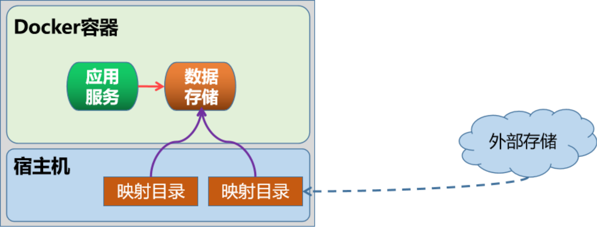

### Kubernetes 存储机制

Container 中的文件在磁盘上是临时存放的，这给 Container 中运行的较重要的应用程序带来一些问题。

- 当容器崩溃时。 kubelet 可能会重新创建容器，可能会导致容器漂移至新的宿主机，容器会以干净的状态重建。导致数据丢失
- 在同一 Pod 中运行多个容器需要共享数据

Kubernetes 卷（Volume） 这一抽象概念能够解决这两个问题。

Kubernetes 集群中的容器数据存储

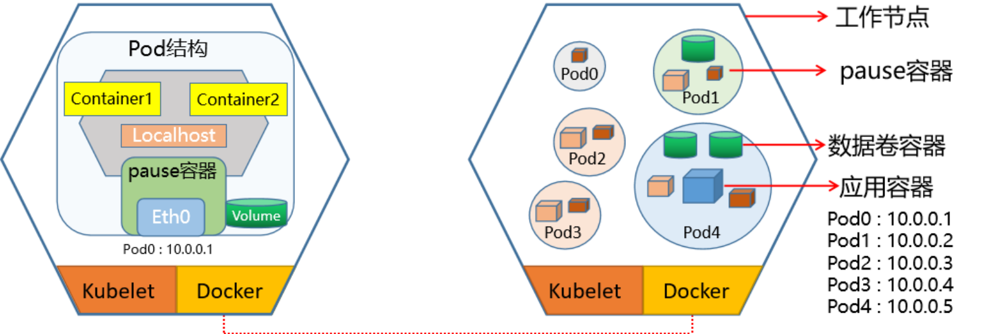

**Kubernetes支持丰富的存储类型，可以分为树内和树外两种**

**树内 In-Tree 存储卷插件**

Kubernetes 内置的插件,可以直接支持,无需安装

| 类型         | 举例                                                         |
| ------------ | ------------------------------------------------------------ |
| 临时存储卷   | emptyDir                                                     |
| 本地数据卷   | hostPath、local                                              |
| 文件系统     | NFS、CephFS、GlusterFS、fastdfs、Cinder、gitRepo(DEPRECATED) |
| 块设备       | iSCSI、FC、rdb(块设备)、vSphereVolume                        |
| 存储平台     | Quobyte、PortworxVolume、StorageOS、ScaleIO                  |
| 云存储数据卷 | Aliyun OSS、Amazon S3、AWS Elastic Block Store、Google gcePersistentDisk 等 |
| 特殊存储卷   | ConfigMap、Secret、DownwardAPI、Projected、flocker           |

**树外 Out-of_Tree 存储卷插件**

经由容器存储接口CSI或FlexVolume接口扩展出的外部的存储系统称为Out-of-Trec类的存储插件

以前，所有卷插件都是“树内（In-Tree）”的。 “树内”插件是与 Kubernetes 的核心组件一同构建、链接、编译和交付的。

这意味着向 Kubernetes 添加新的存储系统（卷插件）需要将代码合并到 Kubernetes 核心代码库中。

后来出现的CSI 和 FlexVolume 都允许独立于 Kubernetes 代码库开发卷插件，并作为扩展部署（安装）在 Kubernetes 集群上。

- CSI 插件

  Container Storage Interface 是当前Kubernetes社区推荐的插件实现方案

  CSI 不仅支持Kubernetes平台存储插件接口，而且也作为云原生生态中容器存储接口的标准,公用云对其有更好的支持

  Kubernetes 支持 CSI 的接口方式实现更大范围的存储功能扩展,更为推荐使用

  ```
  https://github.com/container-storage-interface/spec/blob/master/spec.md
  ```

CSI 有多种实现,比如：

Rancher 是为使用容器的公司打造的容器管理平台。Rancher 简化了使用 Kubernetes 的流程，开发者可以随处运行 Kubernetes，满足 IT 需求规范，赋能 DevOps 团队。这个团队研发的Longhorn就是要给非常好的存储平台。

Longhorn是一个轻量级且功能强大的云原生Kubernetes分布式存储平台，可以在任意基础设施上运行。Longhorn与Rancher结合使用，将帮助用户在Kubernetes环境中轻松、快速和可靠地部署高可用性持久化块存储。

CSI 主要包含两个部分：CSI Controller Server 与 CSI Node Server，分别对应Controller Server Pod和Node Server Pod

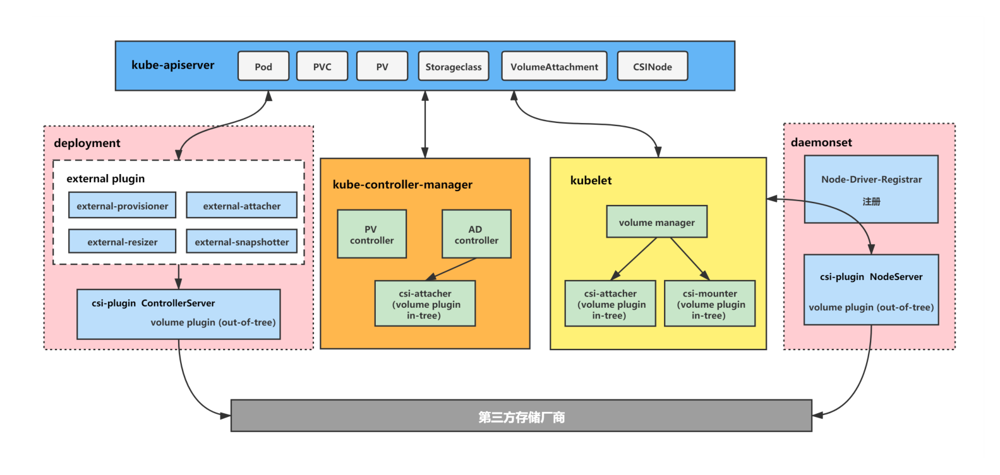

- Controller Server

  也称为CSI Controller

  在集群中只需要部署一个 Controller Server，以 deployment 或者 StatefulSet 的形式运行

  主要负责与存储服务API通信完成后端存储的管理操作，比如 provision 和 attach 工作。

- Node Server

  也称为CSI Node 或 Node Plugin

  保证每一个节点会有一个 Pod 部署出来，负责在节点级别完成存储卷管理，和 CSI Controller 一起完成 volume 的 mount 操作。

  Node Server Pod 是个 DaemonSet，它会在每个节点上进行注册。

  Kubelet 会直接通过 Socket 的方式直接和 CSI Node Server 进行通信、调用Attach/Detach/Mount/Unmount 等。

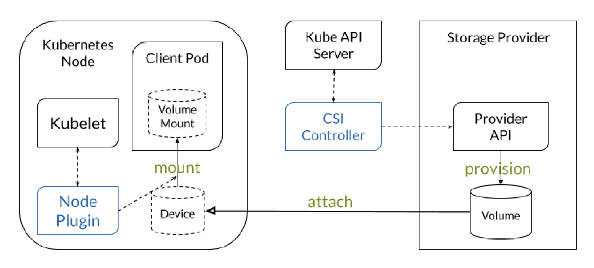

CSI 插件包括以下两部分:

- CSI-Plugin:实现数据卷的挂载、卸载功能。
- CSI-Provisioner: 制备器（Provisioner）实现数据卷的自动创建管理能力，即驱动程序，比如: 支持云盘、NAS等存储卷创建能力

**Kubernetes 存储架构**

存储的组件主要有：attach/detach controller、pv controller、volume manager、volume plugins、scheduler

每个组件分工明确

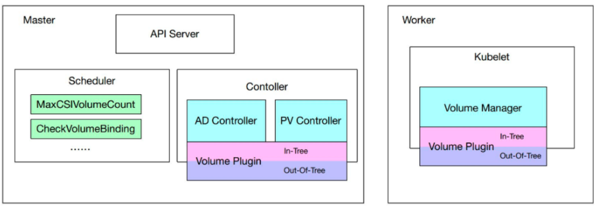

**Master（控制平面）**

1. **API Server**
   - 负责处理所有存储相关的 API 请求，如 PersistentVolume（PV）和 PersistentVolumeClaim（PVC）。
2. **Scheduler（调度器）**
   - **MaxCSIVolumeCount**：检查一个节点上能挂载的最大 CSI 卷数。
   - **CheckVolumeBinding**：确保 PVC 能正确绑定到 PV，决定 Pod 是否可以调度到某个节点。
3. **Controller（控制器）**
   - **AD Controller（Attach-Detach Controller）**
      负责在节点上挂载（Attach）和卸载（Detach）存储卷。
   - **PV Controller（Persistent Volume Controller）**
      负责管理 PV 和 PVC 的生命周期，例如绑定、回收、删除等。
   - **Volume Plugin（存储插件）**
     - **In-Tree（内置存储插件）**：Kubernetes 内置存储驱动，如 NFS、AWS EBS、GCE Persistent Disk。
     - **Out-Of-Tree（外部存储插件）**：使用 CSI（Container Storage Interface）扩展存储，如 Ceph、NetApp、vSphere。

------

**🌟 Worker（工作节点）**

1. **Kubelet**
   - 负责管理 Pod 生命周期，同时管理 Volume 的挂载、卸载等存储操作。
2. **Volume Manager（卷管理器）**
   - 负责管理 Pod 运行时的存储，调用不同的 Volume Plugin 进行存储操作。
3. **Volume Plugin（存储插件）**
   - **In-Tree（内置存储插件）**
   - **Out-Of-Tree（外部存储插件）**

------

**📌 关键存储流程**

1. **PVC 申请存储**
   - 用户创建 PVC，API Server 处理 PVC 绑定请求。
2. **PV 绑定**
   - PV Controller 负责绑定 PVC 到合适的 PV。
3. **存储调度**
   - Scheduler 通过 `CheckVolumeBinding` 确保存储能正确绑定，并决定 Pod 运行在哪个节点。
4. **存储挂载**
   - Attach-Detach Controller 在 Master 处理存储的 Attach/Detach。
   - Worker 端的 Kubelet 通过 Volume Manager 进行存储的挂载和管理。
5. **数据读写**
   - Pod 通过 Volume Plugin 访问存储，实现数据持久化。

------

**✅ 总结**

- **Master 负责存储调度和管理**，包括 API 处理、调度检查、Attach/Detach 逻辑。
- **Worker 负责实际的存储挂载和数据管理**，确保 Pod 可以正确访问存储。
- **支持 In-Tree（内置存储）和 Out-Of-Tree（CSI 存储扩展）**，提供更灵活的存储选项。

- AD控制器：负责存储设备的Attach/Detach操作
  - Attach：将设备附加到目标节点
  - Detach：将设备从目标节点上卸载
- Volume Manager：存储卷管理器，负责完成卷的Mount/Umount操作，以及设备的格式化操作等
- PV Controller ：负责PV/PVC的绑定、生命周期管理，以及存储卷的Provision/Delete操作
- volume plugins：包含k8s原生的和各厂商的的存储插件，扩展各种存储类型的卷管理能力
  - 原生的包括：emptydir、hostpath、csi等
  - 各厂商的包括：aws-ebs、azure等
- scheduler：实现Pod的调度，涉及到volume的调度。比如ebs、csi关于单node最大可attach磁盘数量的predicate策略，scheduler的调度至哪个指定目标节点也会受到存储插件的影响

### Pod的存储卷 volume

Kubernetes 支持在Pod上创建不同类型的任意数量的卷来实现不同数据的存储

单节点存储

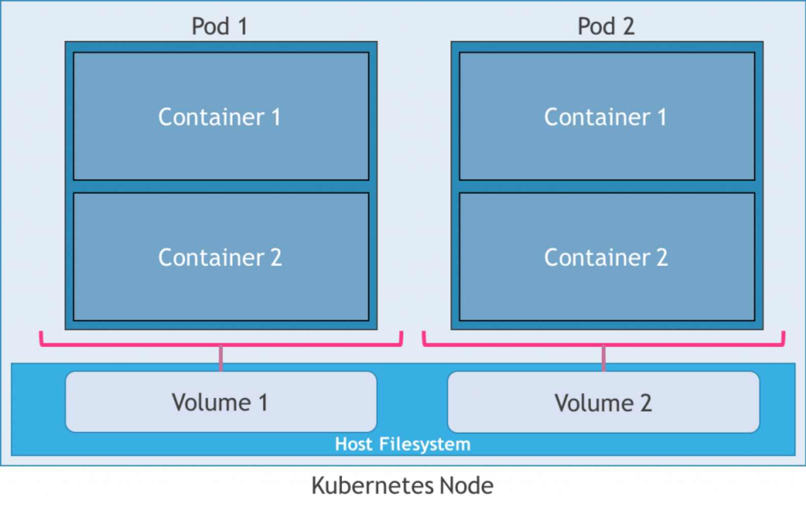

多节点存储

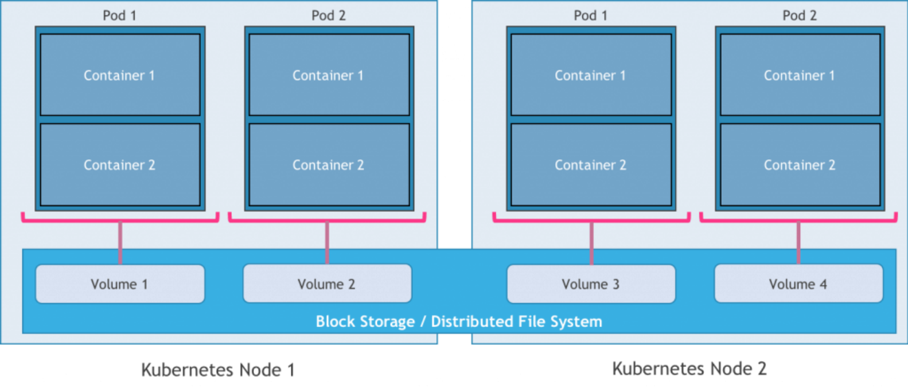

存储卷可以分为：临时卷和持久卷

- 临时卷类型的生命周期与 Pod 相同， 当 Pod 不再存在时，Kubernetes 也会销毁临时卷。

  ```
  https://kubernetes.io/zh-cn/docs/concepts/storage/ephemeral-volumes/
  ```

- 持久卷可以比 Pod 的存活期长。当 Pod 不再存在时，Kubernetes 不会销毁持久卷。

  ```
  https://kubernetes.io/zh-cn/docs/concepts/storage/persistent-volumes/
  ```

- 但对于给定 Pod 中任何类型的卷，在容器重启期间数据都不会丢失。

**临时卷的类型**

Kubernetes 为了不同的用途，支持几种不同类型的临时卷：

- [emptyDir](https://kubernetes.io/zh-cn/docs/concepts/storage/volumes/#emptydir)： Pod 启动时为空，存储空间来自本地的 kubelet 根目录（通常是根磁盘）或内存
- [configMap](https://kubernetes.io/zh-cn/docs/concepts/storage/volumes/#configmap)、 [downwardAPI](https://kubernetes.io/zh-cn/docs/concepts/storage/volumes/#downwardapi)、 [secret](https://kubernetes.io/zh-cn/docs/concepts/storage/volumes/#secret)： 将不同类型的 Kubernetes 数据注入到 Pod 中
- [镜像](https://kubernetes.io/zh-cn/docs/concepts/storage/volumes/#image)： 允许将容器镜像文件或制品直接挂载到 Pod。
- [CSI 临时卷](https://kubernetes.io/zh-cn/docs/concepts/storage/ephemeral-volumes/#csi-ephemeral-volumes)： 类似于前面的卷类型，但由专门[支持此特性](https://kubernetes-csi.github.io/docs/ephemeral-local-volumes.html) 的指定 [CSI](https://kubernetes.io/zh-cn/docs/concepts/storage/volumes/#csi) 驱动程序提供
- [通用临时卷](https://kubernetes.io/zh-cn/docs/concepts/storage/ephemeral-volumes/#generic-ephemeral-volumes)： 它可以由所有支持持久卷的存储驱动程序提供

`emptyDir`、`configMap`、`downwardAPI`、`secret` 是作为 [本地临时存储](https://kubernetes.io/zh-cn/docs/concepts/configuration/manage-resources-containers/#local-ephemeral-storage) 提供的。它们由各个节点上的 kubelet 管理。

CSI 临时卷 **必须** 由第三方 CSI 存储驱动程序提供。

通用临时卷 **可以** 由第三方 CSI 存储驱动程序提供，也可以由支持动态制备的任何其他存储驱动程序提供。 一些专门为 CSI 临时卷编写的 CSI 驱动程序，不支持动态制备：因此这些驱动程序不能用于通用临时卷。

使用第三方驱动程序的优势在于，它们可以提供 Kubernetes 本身不支持的功能， 例如，与 kubelet 管理的磁盘具有不同性能特征的存储，或者用来注入不同的数据。

**Pod中卷使用**

- 一个Pod可以添加任意个卷
- 同一个Pod内每个容器可以在不同位置按需挂载Pod上的任意个卷，或者不挂载任何卷
- 同一个Pod上的某个卷，也可以同时被该Pod内的多个容器同时挂载，以共享数据
- 如果支持，多个Pod也可以通过卷接口访问同一个后端存储单元

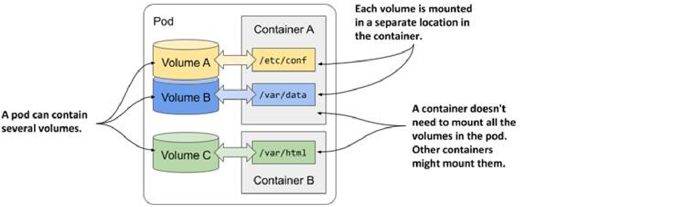

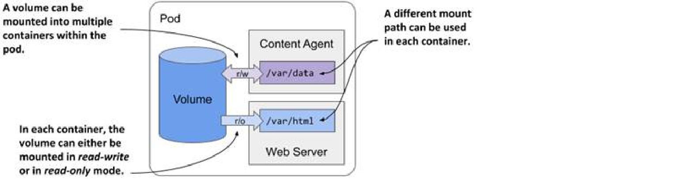

存储卷的配置由两部分组成

- 通过pod.spec.volumes字段定义在Pod之上的存储卷列表，它经由特定的存储卷插件并结合特定的存储供给方的访问接口进行定义
- 嵌套定义在容器的pod.spec.containers.volumeMounts字段上的存储卷挂载列表，它只能挂载当前Pod对象中定义的存储卷

Pod 内部容器使用存储卷有两步：

- 在Pod上定义存储卷，并关联至目标存储服务上

  volumes

- 在需要用到存储卷的容器上，挂载其所属的Pod中pause的存储卷

  volumesMount

容器引擎对共享式存储设备的支持类型：

- 单路读写 - 多个容器内可以通过同一个中间容器对同一个存储设备进行读写操作，比如： 本地磁盘文件
- 多路并行读写 - 多个容器内可以同时对同一个存储设备进行读写操作，比如：NFS
- 多路只读 - 多个容器内可以同时对同一个存储设备进行只读操作，比如：CDROM

Pod的卷资源对象属性

```bash
apiVersion: v1
kind: Pod
metadata:
  name: <string>        # Pod名称（需符合DNS子域名规范）
  namespace: <string>   # 命名空间（默认default）
spec:
  volumes:             # 存储卷定义列表
    - name: <string>   # 卷名称（当前Pod内唯一）
      VOL_TYPE: <Object>  # 存储卷类型配置（见下方示例）

  containers:
    - name: <container-name>  # 容器名称
      image: <image>
      volumeMounts:          # 挂载配置
        - name: <string>     # 要挂载的卷名称（需匹配volumes.name）
          mountPath: <string>  # 容器内挂载路径（绝对路径）
          readOnly: <boolean>  # 可选，默认false（可读写）
          subPath: <string>    # 可选，挂载卷的子目录
          subPathExpr: <string> # 可选，支持环境变量扩展的路径

# ====================== 存储卷类型示例 ======================
# 1. 临时存储卷（emptyDir）
volumes:
  - name: cache-volume
    emptyDir: {}  # 随Pod删除而销毁

# 2. 本地存储卷（hostPath）
volumes:
  - name: host-data
    hostPath:
      path: /data  # 节点主机路径
      type: DirectoryOrCreate  # 目录不存在时自动创建

# 3. NFS文件系统
volumes:
  - name: nfs-vol
    nfs:
      server: 10.0.0.100  # NFS服务器地址
      path: /share       # 共享路径
      readOnly: false

# 4. ConfigMap特殊卷
volumes:
  - name: config
    configMap:
      name: app-config  # 已存在的ConfigMap名称
      items:
        - key: app.conf
          path: app.conf  # 挂载为单独文件
```

|           参数           |  类型   | 必填 |                  说明                  |
| :----------------------: | :-----: | :--: | :------------------------------------: |
|      `volumes.name`      | string  |  是  |    必须符合DNS标签规范（a-z,0-9,-）    |
| `volumeMounts.mountPath` | string  |  是  | 容器内有效路径（如`/usr/share/nginx`） |
|        `readOnly`        | boolean |  否  |       控制写入权限（默认false）        |
|        `subPath`         | string  |  否  |  支持嵌套目录挂载（如`logs/app.log`）  |
|      `subPathExpr`       | string  |  否  |        支持`$(ENV_VAR)`变量扩展        |

| 类型       | 配置字段示例            | 典型用途         |
| ---------- | ----------------------- | ---------------- |
| 临时存储卷 | `emptyDir: {}`          | 容器间共享缓存   |
| 本地数据卷 | `hostPath:`             | 访问节点文件系统 |
| 文件系统   | `nfs:` / `cephfs:`      | 共享文件存储     |
| 块设备     | `iscsi:`                | 数据库持久化存储 |
| 云存储     | `awsElasticBlockStore:` | 云平台动态卷     |
| 特殊存储卷 | `configMap:`            | 配置注入         |

虽然这种借助于Kubernetes存储插件的方式，为pod应用引入各种存储机制直接挂载使用，但是这种方案有天然的劣势：

- 要保证所有的pod节点支持后端的指定类型的存储服务。
- 所有的后端指定服务的配置都要在pod上自定义，不方便其它Pod复用
- 这些卷插件将pod定制的配置属性传递给kubelet，然后实现对应的效果。

以上说明，意味着一个开发者要开发一个pod对象，必须首先是一个存储专家，这使得Kubernetes的使用门槛过高。

Kubernetes为了解决上述问题，引入了两个非常重要的存储资源类型: PV 和 PVC

### PV和PVC

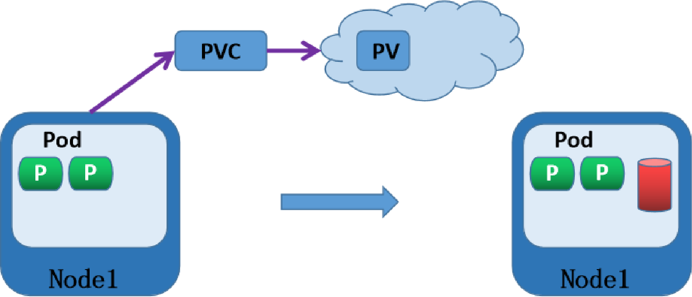

- 由专业的存储管理员来管理所有的存储后端：
  - 在专用的存储设备上，创建各种类型级别的PV(Persistent Volume)
  - 或者通过存储模板文件SC(storageclasses)来自动创建大量不同类型的PV对象。
- 由开发人员定制需要的PVC(Persistent Volume Claim)，然后关联到pod上
- Pod通过PVC到PV上请求一块独立大小的网络存储空间，然后直接使用

通过这种分层的管理机制，让开发人员和存储人员专人做专事，大大的减轻工作的负载。

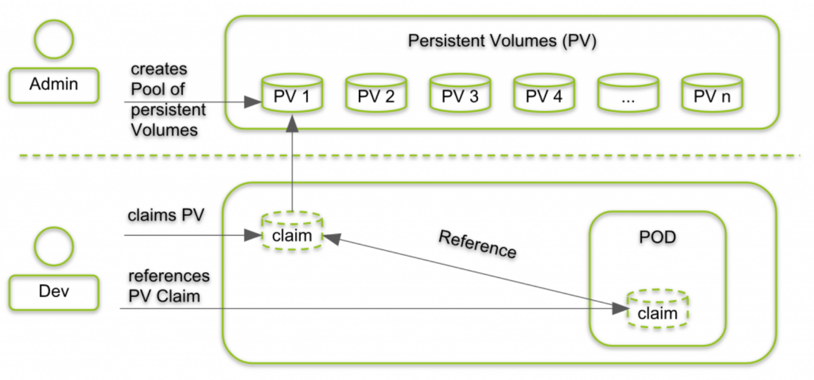

## emptyDir

```powershell
1 不支持持久化
2 数据共享
```

```
https://kubernetes.io/zh-cn/docs/concepts/storage/volumes/#emptydir
```

对于定义了 `emptyDir` 卷的 Pod，在 Pod 被指派到某节点时此卷会被创建。 就像其名称所表示的那样，`emptyDir` 卷最初是空的。尽管 Pod 中的容器挂载 `emptyDir` 卷的路径可能相同也可能不同，但这些容器都可以读写 `emptyDir` 卷中相同的文件。 当 Pod 因为某些原因被从节点上删除时，`emptyDir` 卷中的数据也会被永久删除。

### 说明：

容器崩溃并不会导致 Pod 被从节点上移除，因此容器崩溃期间 `emptyDir` 卷中的数据是安全的。

`emptyDir` 的一些用途：

- 缓存空间，例如基于磁盘的归并排序。
- 为耗时较长的计算任务提供检查点，以便任务能方便地从崩溃前状态恢复执行。
- 在 Web 服务器容器服务数据时，保存内容管理器容器获取的文件。

`emptyDir.medium` 字段用来控制 `emptyDir` 卷的存储位置。 默认情况下，`emptyDir` 卷存储在该节点所使用的介质上； 此处的介质可以是磁盘、SSD 或网络存储，这取决于你的环境。 你可以将 `emptyDir.medium` 字段设置为 `"Memory"`， 以告诉 Kubernetes 为你挂载 tmpfs（基于 RAM 的文件系统）。 虽然 tmpfs 速度非常快，但是要注意它与磁盘不同， 并且你所写入的所有文件都会计入容器的内存消耗，受容器内存限制约束。

你可以通过为默认介质指定大小限制，来限制 `emptyDir` 卷的存储容量。 此存储是从[节点临时存储](https://kubernetes.io/zh-cn/docs/concepts/configuration/manage-resources-containers/#setting-requests-and-limits-for-local-ephemeral-storage)中分配的。 如果来自其他来源（如日志文件或镜像分层数据）的数据占满了存储，`emptyDir` 可能会在达到此限制之前发生存储容量不足的问题。

如果未指定大小，内存支持的卷将被设置为节点可分配内存的大小。

### 注意：

使用内存作为介质的 `emptyDir` 卷时， 请查阅[此处](https://kubernetes.io/zh-cn/docs/concepts/configuration/manage-resources-containers/#memory-backed-emptydir)， 了解有关资源管理方面的注意事项。

### emptyDir 配置示例

```yaml
apiVersion: v1
kind: Pod
metadata:
  name: test-pd
spec:
  containers:
  - image: registry.k8s.io/test-webserver
    name: test-container
    volumeMounts:
    - mountPath: /cache
      name: cache-volume
  volumes:
  - name: cache-volume
    emptyDir:
      sizeLimit: 500Mi
```

### emptyDir 内存配置示例

```yaml
apiVersion: v1
kind: Pod
metadata:
  name: test-pd
spec:
  containers:
  - image: registry.k8s.io/test-webserver
    name: test-container
    volumeMounts:
    - mountPath: /cache
      name: cache-volume
  volumes:
  - name: cache-volume
    emptyDir:
      sizeLimit: 500Mi
      medium: Memory
```


一个emptyDir volume在pod被调度到某个Node时候自动创建的，无需指定宿主机上对应的目录。

适用于在一个Pod中不同容器间的临时数据的共享

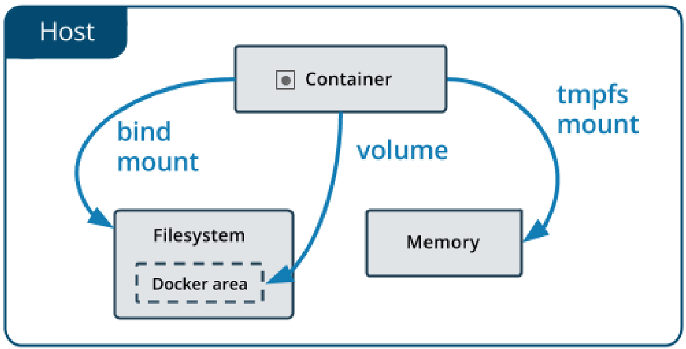

emptyDir 数据默认存放在宿主机的路径如下

```bash
/var/lib/kubelet/pods/<pod_id>/volumes/kubernetes.io~empty-dir/<volume_name>/<FILE>

#注意：此目录随着Pod删除，也会随之删除，不能实现持久化
```

emptyDir 特点如下：

- 此为默认存储类型
- 此方式只能临时存放数据，不能实现数据持久化
- 跟随Pod初始化而来，开始是空数据卷
- Pod 被删除，emptyDir对应的宿主机目录也被删除，当然目录内的数据随之永久消除
- emptyDir 数据卷介质种类跟当前主机的磁盘一样。
- emptyDir 主机可以为同一个Pod内多个容器共享
- emptyDir 容器数据的临时存储目录主要用于数据缓存和同一个Pod内的多个容器共享使用

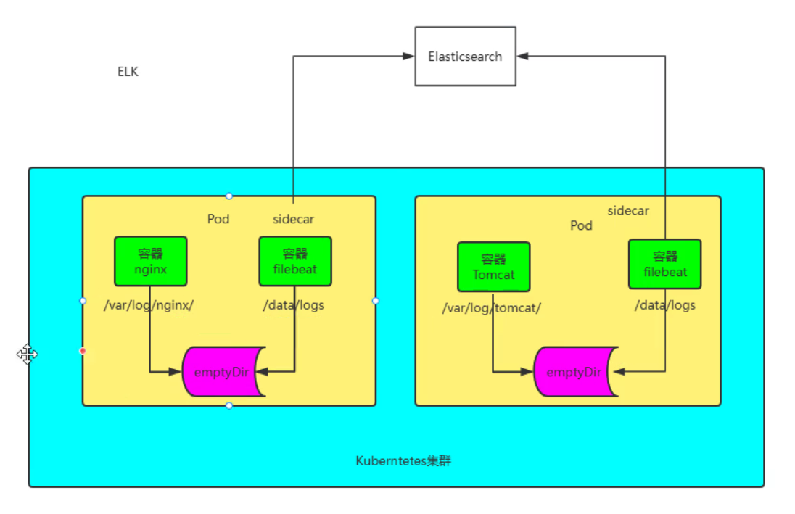

```bash
#定义卷
kubectl explain pod.spec.volumes.emptyDir
	medium 		#指定媒介类型，主要有 default(默认为宿主机的本地磁盘，The default is "" which means to use the node's default medium)和Memory两种,默认情况下，emptyDir卷支持节点上的任何介质，SSD、磁盘或网络存储，具体取决于自身的环境。也可以将emptyDir.medium,字段设置为Memory，让 Kubernetes使用tmpfs(内存支持的文件系统)，虽然tmpfs非常快，但是tmpfs在节点重启时，数据同样会被清除，并且设置的大小会被计入到Container的内存限制当中。
	sizeLimit 	#当前存储卷的空间限额，默认值为nil表示不限制

#使用卷
kubectl explain pod.spec.containers.volumeMounts
	mountPath 	#挂载到容器中的路径,此目录会自动生成
	name 		#指定挂载的volumes名称
	readOnly 	#是否只读挂载
	subPath 	#指定挂载卷的子目录路径,默认挂载卷的根目录
```

### 范例

配置示例

```bash
# Volume 定义部分
volumes:  # 定义卷列表
- name: volume_name  # 卷名称标识
  emptyDir: {}       # 使用临时空目录卷类型，生命周期与Pod相同

# Volume 挂载部分
containers:  # 容器定义
- volumeMounts:  # 容器卷挂载配置
  - name: volume_name  # 引用已定义的卷名称
    mountPath: /path/to/container/  # 指定容器内的挂载路径（必须以/结尾）
    
#注意：关于volume和容器的关系，每个容器都可以单独挂载多个volume，每种volume都可以被多个容器挂载

#示例1
# Pod 基本配置
apiVersion: v1          # Kubernetes API 版本
kind: Pod               # 资源类型为 Pod
metadata:               # 元数据部分
  name: test-pod        # Pod 名称
spec:                   # Pod 规格定义
  containers:           # 容器列表
  - image: registry.k8s.io/test-webserver  # 容器镜像地址
    name: test-container                   # 容器名称
    volumeMounts:                          # 容器卷挂载配置
    - mountPath: /cache                    # 容器内挂载路径
      name: cache-volume                   # 引用的卷名称
  
  volumes:              # 卷定义列表
  - name: cache-volume  # 卷名称标识
    emptyDir: {}        # 使用临时空目录卷类型（Pod删除时自动清理）
    
#示例2
# Pod 基本配置
apiVersion: v1          # Kubernetes API 版本
kind: Pod               # 资源类型为 Pod
metadata:               # 元数据部分
  name: test-pd         # Pod 名称（注意：原配置中可能是拼写错误，应为 test-pod）
spec:                   # Pod 规格定义
  containers:           # 容器列表
  - image: registry.k8s.io/test-webserver  # 容器镜像地址
    name: test-container                   # 容器名称
    volumeMounts:                          # 容器卷挂载配置
    - mountPath: /cache                    # 容器内挂载路径
      name: cache-volume                   # 引用的卷名称
  
  volumes:              # 卷定义列表
  - name: cache-volume  # 卷名称标识
    emptyDir:           # 使用临时空目录卷类型
      medium: Memory    # 指定使用内存作为存储介质（tmpfs）
      sizeLimit: 500Mi  # 设置卷大小限制为500MB
```

范例: emptydir 使用

```yaml
[root@master1 storage]#vim strage-emptydir-1.yaml

apiVersion: v1
kind: Pod
metadata:
  name: storage-emptydir
  labels:
    name: storage-emptydir  # 标签与Pod名称一致
spec:
  volumes:
    - name: empty-volume
      emptyDir: {}  # 默认使用节点磁盘存储
      # 以下是可选的进阶配置（当前被注释）
      # emptyDir:
      #   medium: Memory   # 使用内存而非磁盘
      #   sizeLimit: 500Mi # 限制存储大小

  containers:
    - name: storage-emptydir-container
      image: registry.cn-beijing.aliyuncs.com/wangxiaochun/nginx:1.20.0
      volumeMounts:
        - name: empty-volume
          mountPath: /nginx/www/empty/  # 挂载到容器内的路径
```

```bash
[root@master1 storage]#kubectl apply -f strage-emptydir-1.yaml
pod/storage-emptydir created
[root@master1 storage]#kubectl get pod
NAME               READY   STATUS    RESTARTS   AGE
storage-emptydir   1/1     Running   0          31s

[root@master1 storage]#kubectl exec -it storage-emptydir -- bash
root@storage-emptydir:/# ls /nginx/www/empty/
root@storage-emptydir:/# echo 'hello' > /nginx/www/empty/test.log
root@storage-emptydir:/# ls /nginx/www/empty/
test.log

[root@master1 storage]#kubectl get pod -o wide 
NAME               READY   STATUS    RESTARTS   AGE    IP             NODE             NOMINATED NODE   READINESS GATES
storage-emptydir   1/1     Running   0          3m5s   10.244.3.190   node3.kang.org   <none>           <none>

[root@master1 storage]#kubectl describe pod
Name:             storage-emptydir
...
    Mounts:
      /nginx/www/empty/ from empty-volume (rw)
      /var/run/secrets/kubernetes.io/serviceaccount from kube-api-access-gxk7v (ro)
Conditions:
  Type                        Status
  PodReadyToStartContainers   True 
  Initialized                 True 
  Ready                       True 
  ContainersReady             True 
  PodScheduled                True 
Volumes:
  empty-volume:
    Type:       EmptyDir (a temporary directory that shares a pod's lifetime)
    Medium:     
    SizeLimit:  <unset>
  kube-api-access-gxk7v:
    Type:                    Projected (a volume that contains injected data from multiple sources)
    TokenExpirationSeconds:  3607
    ConfigMapName:           kube-root-ca.crt
    ConfigMapOptional:       <nil>
    DownwardAPI:             true
QoS Class:                   BestEffort
Node-Selectors:              <none>
Tolerations:                 node.kubernetes.io/not-ready:NoExecute op=Exists for 300s
                             node.kubernetes.io/unreachable:NoExecute op=Exists for 300s                         
                             
[root@node3 ~]#find / -name test.log
/var/lib/kubelet/pods/f7343d25-5cde-4f52-8baf-2e5516cebc14/volumes/kubernetes.io~empty-dir/empty-volume/test.log
[root@node3 ~]#cat /var/lib/kubelet/pods/f7343d25-5cde-4f52-8baf-2e5516cebc14/volumes/kubernetes.io~empty-dir/empty-volume/test.log
hello  

#删除pod，目录也删除，只可以做数据共享
[root@master1 storage]#kubectl get pod
NAME               READY   STATUS    RESTARTS   AGE
storage-emptydir   1/1     Running   0          11m
[root@master1 storage]#kubectl delete pod storage-emptydir 
pod "storage-emptydir" deleted

[root@node3 ~]#cat /var/lib/kubelet/pods/f7343d25-5cde-4f52-8baf-2e5516cebc14/volumes/kubernetes.io~empty-dir/empty-volume/test.log
cat: /var/lib/kubelet/pods/f7343d25-5cde-4f52-8baf-2e5516cebc14/volumes/kubernetes.io~empty-dir/empty-volume/test.log: No such file or directory
```

范例：在一个Pod中定义多个容器通过 emptyDir 共享数据

```yaml
[root@master1 storage]#vim strage-emptydir-2.yaml

apiVersion: v1
kind: Pod
metadata:
  name: storage-emptydir
spec:
  volumes:
    - name: nginx-data
      emptyDir: {}  # 创建临时共享存储卷
      # 可选高级配置：
      # emptyDir:
      #   medium: Memory    # 使用内存代替磁盘
      #   sizeLimit: 100Mi  # 限制存储大小

  containers:
    # ====================== Nginx 容器 ======================
    - name: storage-emptydir-nginx
      image: registry.cn-beijing.aliyuncs.com/wangxiaochun/nginx:1.20.0
      volumeMounts:
        - name: nginx-data
          mountPath: /usr/share/nginx/html/  # Nginx默认站点目录
          readOnly: true  # 建议设置为只读，防止Nginx意外修改
      ports:
        - containerPort: 80  # 暴露端口（建议添加）

    # ====================== BusyBox 容器 ======================
    - name: storage-emptydir-busybox
      image: registry.cn-beijing.aliyuncs.com/wangxiaochun/busybox:1.32.0
      volumeMounts:
        - name: nginx-data
          mountPath: /data/  # 与Nginx共享的目录
      command:  # 每秒更新index.html文件
        - "/bin/sh"
        - "-c"
        - "while true; do date > /data/index.html; sleep 1; done"

  # 建议添加的配置：
  # restartPolicy: OnFailure  # 定义Pod重启策略
```

```bash
[root@master1 storage]#kubectl apply -f strage-emptydir-2.yaml
pod/storage-emptydir created
[root@master1 storage]#kubectl get pod -o wide 
NAME               READY   STATUS    RESTARTS   AGE   IP             NODE             NOMINATED NODE   READINESS GATES
storage-emptydir   2/2     Running   0          53s   10.244.1.160   node1.kang.org   <none>           <none>


[root@master1 storage]#curl  10.244.1.160
Tue Apr  1 02:01:34 UTC 2025
[root@master1 storage]#curl  10.244.1.160
Tue Apr  1 02:01:35 UTC 2025
[root@master1 storage]#curl  10.244.1.160
Tue Apr  1 02:01:36 UTC 2025
[root@master1 storage]#curl  10.244.1.160
Tue Apr  1 02:01:37 UTC 2025
[root@master1 storage]#curl  10.244.1.160
Tue Apr  1 02:01:38 UTC 2025

[root@master1 storage]#kubectl exec -it storage-emptydir -c storage-emptydir-busybox -- sh
/ # ls
bin   data  dev   etc   home  proc  root  sys   tmp   usr   var
/ # ls /data/
index.html
/ # echo 'hello' > /data/index2.html
/ # cat /data/index2.html 
hello

[root@master1 storage]#kubectl exec -it storage-emptydir -c storage-emptydir-nginx -- sh
# ls /usr/share/nginx/html/
index.html  index2.html
# cat /usr/share/nginx/html/index2.html
hello

[root@master1 storage]#curl 10.244.1.160/index2.html
hello

#结果显示：两个容器间实现了数据卷的共享操作，在busybox中定制信息，然后在nginx容器中获取信息。
```


## hostPath

```powershell
1 支持持久化
2 不支持数据漫游
```

### hostPath

`hostPath` 卷能将主机节点文件系统上的文件或目录挂载到你的 Pod 中。 虽然这不是大多数 Pod 需要的，但是它为一些应用提供了强大的逃生舱。

#### 警告：

使用 `hostPath` 类型的卷存在许多安全风险。如果可以，你应该尽量避免使用 `hostPath` 卷。 例如，你可以改为定义并使用 [`local` PersistentVolume](https://kubernetes.io/zh-cn/docs/concepts/storage/volumes/#local)。

如果你通过准入时的验证来限制对节点上特定目录的访问，这种限制只有在你额外要求所有 `hostPath` 卷的挂载都是**只读**的情况下才有效。如果你允许不受信任的 Pod 以读写方式挂载任意主机路径， 则该 Pod 中的容器可能会破坏可读写主机挂载卷的安全性。

------

无论 `hostPath` 卷是以只读还是读写方式挂载，使用时都需要小心，这是因为：

- 访问主机文件系统可能会暴露特权系统凭证（例如 kubelet 的凭证）或特权 API（例如容器运行时套接字）， 这些可以被用于容器逃逸或攻击集群的其他部分。
- 具有相同配置的 Pod（例如基于 PodTemplate 创建的 Pod）可能会由于节点上的文件不同而在不同节点上表现出不同的行为。
- `hostPath` 卷的用量不会被视为临时存储用量。 你需要自己监控磁盘使用情况，因为过多的 `hostPath` 磁盘使用量会导致节点上的磁盘压力。

`hostPath` 的一些用法有：

- 运行一个需要访问节点级系统组件的容器 （例如一个将系统日志传输到集中位置的容器，使用只读挂载 `/var/log` 来访问这些日志）
- 让存储在主机系统上的配置文件可以被[静态 Pod](https://kubernetes.io/zh-cn/docs/tasks/configure-pod-container/static-pod/) 以只读方式访问；与普通 Pod 不同，静态 Pod 无法访问 ConfigMap。

#### `hostPath` 卷类型

除了必需的 `path` 属性外，你还可以选择为 `hostPath` 卷指定 `type`。

`type` 的可用值有：

| 取值                | 行为                                                         |
| :------------------ | :----------------------------------------------------------- |
| `‌""`                | 空字符串（默认）用于向后兼容，这意味着在安装 hostPath 卷之前不会执行任何检查。 |
| `DirectoryOrCreate` | 如果在给定路径上什么都不存在，那么将根据需要创建空目录，权限设置为 0755，具有与 kubelet 相同的组和属主信息。 |
| `Directory`         | 在给定路径上必须存在的目录。                                 |
| `FileOrCreate`      | 如果在给定路径上什么都不存在，那么将在那里根据需要创建空文件，权限设置为 0644，具有与 kubelet 相同的组和所有权。 |
| `File`              | 在给定路径上必须存在的文件。                                 |
| `Socket`            | 在给定路径上必须存在的 UNIX 套接字。                         |
| `CharDevice`        | **（仅 Linux 节点）** 在给定路径上必须存在的字符设备。       |
| `BlockDevice`       | **（仅 Linux 节点）** 在给定路径上必须存在的块设备。         |

#### 注意：

`FileOrCreate` 模式**不会**创建文件的父目录。如果挂载文件的父目录不存在，Pod 将启动失败。 为了确保这种模式正常工作，你可以尝试分别挂载目录和文件，如 `hostPath` 的 [`FileOrCreate` 示例](https://kubernetes.io/zh-cn/docs/concepts/storage/volumes/#hostpath-fileorcreate-example)所示。

下层主机上创建的某些文件或目录只能由 root 用户访问。 此时，你需要在[特权容器](https://kubernetes.io/zh-cn/docs/tasks/configure-pod-container/security-context/)中以 root 身份运行进程，或者修改主机上的文件权限，以便能够从 `hostPath` 卷读取数据（或将数据写入到 `hostPath` 卷）。

#### hostPath 配置示例

- [Linux 节点](https://kubernetes.io/zh-cn/docs/concepts/storage/volumes/#hostpath-examples-0)

```yaml
---
# 此清单将主机上的 /data/foo 挂载为 hostpath-example-linux Pod 中运行的单个容器内的 /foo
#
# 容器中的挂载是只读的
apiVersion: v1
kind: Pod
metadata:
  name: hostpath-example-linux
spec:
  os: { name: linux }
  nodeSelector:
    kubernetes.io/os: linux
  containers:
  - name: example-container
    image: registry.k8s.io/test-webserver
    volumeMounts:
    - mountPath: /foo
      name: example-volume
      readOnly: true
  volumes:
  - name: example-volume
    # 挂载 /data/foo，但仅当该目录已经存在时
    hostPath:
      path: /data/foo # 主机上的目录位置
      type: Directory # 此字段可选
```

#### hostPath FileOrCreate 配置示例

以下清单定义了一个 Pod，将 `/var/local/aaa` 挂载到 Pod 中的单个容器内。 如果节点上还没有路径 `/var/local/aaa`，kubelet 会创建这一目录，然后将其挂载到 Pod 中。

如果 `/var/local/aaa` 已经存在但不是一个目录，Pod 会失败。 此外，kubelet 还会尝试在该目录内创建一个名为 `/var/local/aaa/1.txt` 的文件（从主机的视角来看）； 如果在该路径上已经存在某个东西且不是常规文件，则 Pod 会失败。

以下是清单示例：

```yaml
apiVersion: v1
kind: Pod
metadata:
  name: test-webserver
spec:
  os: { name: linux }
  nodeSelector:
    kubernetes.io/os: linux
  containers:
  - name: test-webserver
    image: registry.k8s.io/test-webserver:latest
    volumeMounts:
    - mountPath: /var/local/aaa
      name: mydir
    - mountPath: /var/local/aaa/1.txt
      name: myfile
  volumes:
  - name: mydir
    hostPath:
      # 确保文件所在目录成功创建。
      path: /var/local/aaa
      type: DirectoryOrCreate
  - name: myfile
    hostPath:
      path: /var/local/aaa/1.txt
      type: FileOrCreate
```

### image

**特性状态：** `Kubernetes v1.31 [alpha]` (enabled by default: false)

`image` 卷源代表一个在 kubelet 主机上可用的 OCI 对象（容器镜像或工件）。

使用 `image` 卷源的一个例子是：

[`pods/image-volumes.yaml`](https://raw.githubusercontent.com/kubernetes/website/main/content/zh-cn/examples/pods/image-volumes.yaml)

```yaml
apiVersion: v1
kind: Pod
metadata:
  name: image-volume
spec:
  containers:
  - name: shell
    command: ["sleep", "infinity"]
    image: debian
    volumeMounts:
    - name: volume
      mountPath: /volume
  volumes:
  - name: volume
    image:
      reference: quay.io/crio/artifact:v1
      pullPolicy: IfNotPresent
```

此卷在 Pod 启动时基于提供的 `pullPolicy` 值进行解析：

- `Always`

  kubelet 始终尝试拉取此引用。如果拉取失败，kubelet 会将 Pod 设置为 `Failed`。

- `Never`

  kubelet 从不拉取此引用，仅使用本地镜像或工件。 如果本地没有任何镜像层存在，或者该镜像的清单未被缓存，则 Pod 会变为 `Failed`。

- `IfNotPresent`

  如果引用在磁盘上不存在，kubelet 会进行拉取。 如果引用不存在且拉取失败，则 Pod 会变为 `Failed`。

如果 Pod 被删除并重新创建，此卷会被重新解析，这意味着在 Pod 重新创建时将可以访问新的远程内容。 在 Pod 启动期间解析或拉取镜像失败将导致容器无法启动，并可能显著增加延迟。 如果失败，将使用正常的卷回退进行重试，并输出 Pod 失败的原因和相关消息。

此卷可以挂载的对象类型由主机上的容器运行时实现负责定义，至少必须包含容器镜像字段所支持的所有有效类型。 OCI 对象将以只读方式被挂载到单个目录（`spec.containers[*].volumeMounts.mountPath`）中。 在 Linux 上，容器运行时通常还会挂载阻止文件执行（`noexec`）的卷。

此外：

- 不支持容器使用子路径挂载（`spec.containers[*].volumeMounts.subpath`）。
- `spec.securityContext.fsGroupChangePolicy` 字段对这种卷没有效果。
- [`AlwaysPullImages` 准入控制器](https://kubernetes.io/zh-cn/docs/reference/access-authn-authz/admission-controllers/#alwayspullimages)也适用于此卷源， 就像适用于容器镜像一样。

`image` 类型可用的字段如下：

- `reference`

  要使用的工件引用。例如，你可以指定 `registry.k8s.io/conformance:v1.32.0` 来加载 Kubernetes 合规性测试镜像中的文件。其行为与 `pod.spec.containers[*].image` 相同。 拉取 Secret 的组装方式与容器镜像所用的方式相同，即通过查找节点凭据、服务账户镜像拉取 Secret 和 Pod 规约镜像拉取 Secret。此字段是可选的，允许更高层次的配置管理在 Deployment 和 StatefulSet 这类工作负载控制器中默认使用或重载容器镜像。 参阅[容器镜像更多细节](https://kubernetes.io/zh-cn/docs/concepts/containers/images)。

- `pullPolicy`

  拉取 OCI 对象的策略。可能的值为：`Always`、`Never` 或 `IfNotPresent`。 如果指定了 `:latest` 标记，则默认为 `Always`，否则默认为 `IfNotPresent`。


### 使用场景

hostPath 可以将宿主机上的目录挂载到 Pod 中作为数据的存储目录

hostPath 一般用在如下场景：

- 容器应用程序中某些文件需要永久保存
- Pod删除，hostPath数据对应在宿主机文件不受影响,即hostPath的生命周期和Pod不同,而和节点相同
- 宿主机和容器的目录都会自动创建
- 某些容器应用需要用到容器的自身的内部数据，可将宿主机的/var/lib/[docker|containerd]挂载到Pod中

hostPath 使用注意事项：

- 不支持数据的漫游，hostpath只有在其所在宿主机可用，其它节点不可用
- 不同宿主机的目录和文件内容不一定完全相同，所以Pod迁移前后的访问效果不一样
- 不适合Deployment这种分布式的资源，更适合于DaemonSet
- 宿主机的目录不属于独立的资源对象的资源，所以对资源设置的资源配额限制对hostPath目录无

### 范例

```yaml
#配置格式
  volumes:
  - name: volume_name
    hostPath:
      path: /path/to/host
```

```yaml
#示例一
apiVersion: v1
kind: Pod
metadata:
  name: test-pod
spec:
  containers:
    - image: registry.k8s.io/test-webserver
      name: test-container
      volumeMounts:
        - mountPath: /test-pod  # 容器内挂载路径
          name: test-volume     # 必须与volumes.name匹配
  volumes:
    - name: test-volume
      hostPath:
        path: /data            # 节点主机绝对路径
        type: Directory        # 确保路径是目录类型
        
        
#示例二
apiVersion: v1
kind: Pod
metadata:
  name: hostpath-pod
  labels:
    app: hostpath-demo
spec:
  securityContext:
    runAsNonRoot: true      # 禁止root运行
    fsGroup: 2000          # 文件系统组权限
  containers:
    - name: app-container
      image: registry.k8s.io/test-webserver:v1.2.3  # 建议带版本标签
      securityContext:
        readOnlyRootFilesystem: true  # 根文件系统只读
      volumeMounts:
        - name: hostpath-vol
          mountPath: /mnt/data
          readOnly: true             # 强制只读
  volumes:
    - name: hostpath-vol
      hostPath:
        path: /data/non-sensitive   # 专用非敏感路径
        type: DirectoryOrCreate     # 自动创建目录
```

范例: 使用主机的时区配置

```yaml
[root@master1 storage]#vim storage-hostpath-timezone.yaml

apiVersion: v1
kind: Pod
metadata:
  name: pod-hostpath-timezone
spec:
  volumes:
    - name: timezone
      hostPath:
        path: /etc/timezone  # 挂载主机时区配置文件
        type: File
    - name: localtime
      hostPath:
        path: /etc/localtime  # 挂载主机本地时间文件（通常是软链接）
        type: File
  containers:
    - name: c01
      image: registry.cn-beijing.aliyuncs.com/wangxiaochun/nginx:1.20.0
    - name: c02
      image: registry.cn-beijing.aliyuncs.com/wangxiaochun/nginx:1.20.0
      command: ["sh","-c","sleep 3600"]
      volumeMounts:
        - name: timezone
          mountPath: /etc/timezone  # 容器此为文件是普通文件，挂载节点目录成功
        - name: localtime
          mountPath: /etc/localtime  # 容器此为文件是软链接，此处挂载节失败
```

```bash
[root@master1 storage]#kubectl apply -f storage-hostpath-timezone.yaml
pod/pod-hostpath-timezone created
[root@master1 storage]#kubectl get pod -o wide 
NAME                    READY   STATUS    RESTARTS   AGE   IP             NODE             NOMINATED NODE   READINESS GATES
pod-hostpath-timezone   2/2     Running   0          96s   10.244.3.191   node3.kang.org   <none>           <none>

[root@node3 ~]#date 
Tue Apr  1 10:37:54 AM CST 2025
[root@node3 ~]#cat /etc/timezone 
Asia/Shanghai

[root@master1 storage]#kubectl exec pod-hostpath-timezone -c c01 -- date
Tue Apr  1 02:38:44 UTC 2025
[root@master1 storage]#kubectl exec pod-hostpath-timezone -c c01 -- cat /etc/timezone
Etc/UTC
[root@master1 storage]#kubectl exec pod-hostpath-timezone -c c01 -- ls -l /etc/localtime
lrwxrwxrwx 1 root root 27 May 11  2021 /etc/localtime -> /usr/share/zoneinfo/Etc/UTC

[root@master1 storage]#kubectl exec pod-hostpath-timezone -c c02 -- date
Tue Apr  1 10:38:52 CST 2025
[root@master1 storage]#kubectl exec pod-hostpath-timezone -c c02 -- cat /etc/timezone
Asia/Shanghai
[root@master1 storage]#kubectl exec pod-hostpath-timezone -c c02 -- ls -l /etc/localtime
lrwxrwxrwx 1 root root 27 May 11  2021 /etc/localtime -> /usr/share/zoneinfo/Etc/UTC
```

范例: 实现 Redis 数据的持久化

```yaml
[root@master1 storage]#vim strage-hostpath-redis.yaml

apiVersion: v1
kind: Pod
metadata:
  name: hostpath-redis
spec:
  nodeName: node1.kang.org  # 硬性指定节点
  volumes:
    - name: redis-backup
      hostPath:
        path: /backup/redis  # 节点数据目录
  containers:
    - name: hostpath-redis
      image: registry.cn-beijing.aliyuncs.com/wangxiaochun/redis:6.2.5
      volumeMounts:
        - name: redis-backup
          mountPath: /data  # Redis持久化目录
          
#关键点：spec.containers.volumeMounts的name属性和spec.volumes的那么属性完全一致,因为他们是基于name来关联的。
#注意：redis的镜像将数据保存到了容器的/data 目录下。
```

```bash
[root@master1 storage]#kubectl apply  -f strage-hostpath-redis.yaml
pod/hostpath-redis created
[root@master1 storage]#kubectl get pod -o wide 
NAME             READY   STATUS    RESTARTS   AGE   IP             NODE             NOMINATED NODE   READINESS GATES
hostpath-redis   1/1     Running   0          7s    10.244.1.161   node1.kang.org   <none>           <none>

[root@node1 ~]#ls -d /backup/redis
/backup/redis

#在redis中存储数据
[root@master1 storage]#kubectl exec -it hostpath-redis -- bash
root@hostpath-redis:/data# redis-cli 
127.0.0.1:6379> set a 1
OK
127.0.0.1:6379> set b 2
OK
127.0.0.1:6379> get a
"1"
127.0.0.1:6379> get b
"2"
127.0.0.1:6379> SAVE
OK

#查看宿主机文件
[root@node1 ~]#ls /backup/redis
dump.rdb

#删除pod
[root@master1 storage]#kubectl delete pod hostpath-redis 
pod "hostpath-redis" deleted
#查看数据没有丢失
[root@node1 ~]#ls /backup/redis -l
total 4
-rw-r--r-- 1 lxd 999 107 Apr  1 10:52 dump.rdb

#再重新创建pod
[root@master1 storage]#kubectl apply -f strage-hostpath-redis.yaml
pod/hostpath-redis created

#查看数据自动加载到pod,前提规定在同一个宿主机运行
[root@master1 storage]#kubectl exec hostpath-redis -- redis-cli get a
1
[root@master1 storage]#kubectl exec hostpath-redis -- redis-cli get b
2
```

### 部署集群内 NFS 服务

```
https://github.com/kubernetes-csi/csi-driver-nfs/blob/master/deploy/example/nfs-provisioner/README.md
```

```yaml
# 创建名称空间
apiVersion: v1
kind: Namespace
metadata:
  name: nfs
  labels:
    app: nfs-server
---
# ====================== NFS 服务定义 ======================
apiVersion: v1
kind: Service
metadata:
  name: nfs-server
  namespace: nfs  # 确保服务在 nfs 命名空间中
  labels:
    app: nfs-server  # 服务标签，用于选择器匹配
spec:
  type: ClusterIP  # 服务类型，ClusterIP表示仅在集群内部访问
  selector:
    app: nfs-server  # 选择器，匹配具有相同标签的Pod
  ports:
    - name: tcp-2049  # NFS主服务端口（TCP协议）
      port: 2049      # 服务暴露的端口号
      protocol: TCP   # 协议类型
    - name: udp-111   # RPC端口（UDP协议）
      port: 111       # 端口映射
      protocol: UDP   # 协议类型
---
# ====================== NFS 服务器部署 ======================
apiVersion: apps/v1
kind: Deployment
metadata:
  name: nfs-server
  namespace: nfs  # 确保部署在 nfs 命名空间
spec:
  replicas: 1  # 副本数量，NFS通常单实例即可
  selector:
    matchLabels:
      app: nfs-server  # 必须与 template.metadata.labels 匹配
  template:
    metadata:
      labels:
        app: nfs-server  # Pod标签，用于Service选择
    spec:
      nodeSelector:  # 节点选择约束
        "kubernetes.io/os": linux  # 仅调度到Linux节点
        "server": nfs             # 自定义节点标签，需提前给节点打标签
      containers:
        - name: nfs-server
          image: registry.cn-beijing.aliyuncs.com/wangxiaochun/nfs-server-alpine:12
          env:
            - name: SHARED_DIRECTORY  # 容器内共享目录环境变量
              value: "/exports"       # 对应 volumeMounts.mountPath
          volumeMounts:
            - mountPath: /exports     # NFS共享目录挂载点
              name: nfs-vol           # 对应 volumes.name
          securityContext:
            privileged: true  # 必须开启特权模式（NFS服务需要）
          ports:
            - name: tcp-2049
              containerPort: 2049
              protocol: TCP
            - name: udp-111
              containerPort: 111
              protocol: UDP
      volumes:
        - name: nfs-vol  # 存储卷定义
          hostPath:
            path: /nfs-vol  # 节点主机上的存储路径
            type: DirectoryOrCreate  # 自动创建目录（如果不存在）

```

```bash
#给NFS运行的节点指定标签
[root@master1 storage]#kubectl label nodes node1.kang.org server=nfs
node/node1.kang.org labeled

[root@master1 storage]#kubectl apply -f storage-nfs-service.yaml
namespace/nfs-server created
service/nfs-server created
deployment.apps/nfs-server created

[root@master1 storage]#kubectl get pod -n nfs 
NAME                          READY   STATUS    RESTARTS   AGE
nfs-server-5f4db9978c-4vp7j   1/1     Running   0          9s

[root@master1 storage]#kubectl get pod -n nfs -o wide 
NAME                          READY   STATUS    RESTARTS   AGE    IP             NODE             NOMINATED NODE   READINESS GATES
nfs-server-5f4db9978c-4vp7j   1/1     Running   0          109s   10.244.1.164   node1.kang.org   <none>           <none>
[root@master1 storage]#kubectl get svc -n nfs 
NAME         TYPE        CLUSTER-IP       EXTERNAL-IP   PORT(S)            AGE
nfs-server   ClusterIP   10.103.253.101   <none>        2049/TCP,111/UDP   2m32s

[root@node1 ~]#ls -ld /nfs-vol
drwxr-xr-x 2 root root 4096 Apr  1 14:31 /nfs-vol

[root@master1 storage]#kubectl exec -it -n nfs nfs-server-5f4db9978c-4vp7j -- sh
/ # exportfs -v
/exports      	<world>(async,wdelay,hide,no_subtree_check,insecure_locks,fsid=0,sec=sys,rw,insecure,no_root_squash,no_all_squash)
/ # cat /etc/exports 
/exports *(rw,fsid=0,async,no_subtree_check,no_auth_nlm,insecure,no_root_squash)

#安装nfs客户端
[root@master1 storage]#apt install nfs-common -y

#但是支持挂载NFS服务的伪根
[root@master1 storage]#mount 10.103.253.101:/ /mnt/

[root@master1 storage]#df
10.103.253.101:/                  101590016 9955840  86427392  11% /mnt

#创建文件
[root@master1 storage]#echo 'hello' > /mnt/abc.log
#在NFS服务所在节点查看文件生成
[root@node1 ~]#ls  /nfs-vol
abc.log

#取消挂载
[root@master1 storage]#umount /mnt

```

## 网络共享存储

```powershell
1 支持持久化
2 支持漫游
```

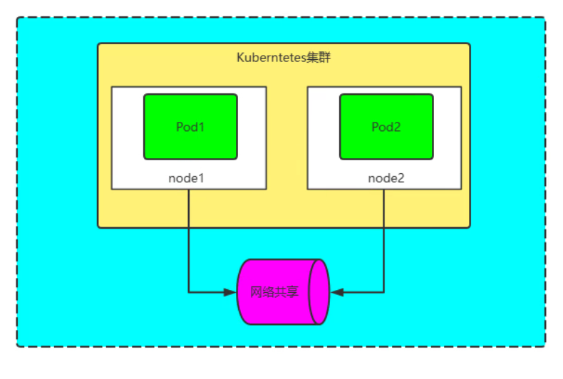

和传统的方式一样, 通过 NFS 网络文件系统可以实现Kubernetes数据的网络存储共享

使用NFS提供的共享目录存储数据时，需要在系统中部署一个NFS环境，通过volume的配置，实现pod内的容器间共享NFS目录。

### 部署集群外nfs服务器

```bash
[root@ubuntu2204 ~]#apt install nfs-server -y

#创建一个目录
[root@ubuntu2204 ~]#mkdir /nfsdata

#修改配置文件，把这个目录共享出去
[root@ubuntu2204 ~]#cat /etc/exports
# /etc/exports: the access control list for filesystems which may be exported
#		to NFS clients.  See exports(5).
#
# Example for NFSv2 and NFSv3:
# /srv/homes       hostname1(rw,sync,no_subtree_check) hostname2(ro,sync,no_subtree_check)
#
# Example for NFSv4:
# /srv/nfs4        gss/krb5i(rw,sync,fsid=0,crossmnt,no_subtree_check)
# /srv/nfs4/homes  gss/krb5i(rw,sync,no_subtree_check)
#
/nfsdata *(rw,all_squash,anonuid=0,anongid=0)

#如果使用默认权限，会提示Pod下面错误
[root@master1 ~]#echo '/nfsdata *(rw)' >> /etc/exports
[root@master1 ~]#kubectl get pod
NAME READY STATUS RESTARTS AGE
volumes-nfs 0/1 CrashLoopBackOff 2 (14s ago) 30s
[root@master1 ~]#kubectl logs volumes-nfs
chown: changing ownership of '.': Operation not permitted
#说明：
*：表示允许所有连接，该值可以是一个网段|IP|域名的形式
rw 表示读写共享权限
no_root_squash 表示root登录nfs资源的时候，不压缩其权限
sync 所有操作数据会同时写入硬盘和内存

#重启服务
[root@ubuntu2204 ~]#exportfs -r
[root@ubuntu2204 ~]#exportfs -v
/nfsdata      	<world>(sync,wdelay,hide,no_subtree_check,anonuid=0,anongid=0,sec=sys,rw,secure,root_squash,all_squash)

#在所有kubernetes的worker节点充当NFS客户端，都需要安装NFS客户端软件
apt update && apt -y install nfs-client

#测试访问
[root@master1 ~]#showmount -e 10.0.0.104
Export list for 10.0.0.104:
/nfsdata *

#注意：如果所有客户端想要使用nfs的功能，必须提前安装软件，否则会发生找不到资源的报错。
```

```yaml
#编写资源配置文件
[root@master1 storage]#vim storage-nfs-1.yaml

apiVersion: v1
kind: Pod
metadata:
  name: volumes-nfs
spec:
  #nodeName: node1.kang.org #指定在node1节点运行pod,节点的/etc/hosts文件或DNS解析此域名
  volumes:
  - name: redisdatapath
    nfs:
      server: nfs.kang.org #注意:需要宿主机节点/etc/hosts文件或DNS解析此域名,而不是由Pod通过coreDNS完成解析
      path: /nfsdata
  containers:
  - name: redis
    #image: redis:6.2.5
    image: registry.cn-beijing.aliyuncs.com/wangxiaochun/redis:6.2.5
    volumeMounts:
    - name: redisdatapath
      mountPath: /data
```

```bash
#修改各个节点的DNS解析 nfs.kang.org
```

```bash
[root@master1 storage]#kubectl apply -f storage-nfs-1.yaml
pod/volumes-nfs created
[root@master1 storage]#kubectl get pod
NAME          READY   STATUS    RESTARTS   AGE
volumes-nfs   1/1     Running   0          11s

[root@master1 storage]#kubectl exec -it volumes-nfs -- bash
root@volumes-nfs:/data# redis-cli 
127.0.0.1:6379> set year 2025
OK
127.0.0.1:6379> get year
"2025"
127.0.0.1:6379> save
OK

[root@ubuntu2204 ~]#ls /nfsdata/
dump.rdb

#删除重新创建发现数据被持久保存
[root@master1 storage]#kubectl delete pod volumes-nfs 
pod "volumes-nfs" deleted
[root@master1 storage]#kubectl apply  -f storage-nfs-1.yaml
pod/volumes-nfs created
[root@master1 storage]#kubectl exec -it volumes-nfs -- bash
root@volumes-nfs:/data# redis-cli 
127.0.0.1:6379> get year
"2025"

#再创建一个pod
[root@master1 storage]#vim storage-nfs-2.yaml

apiVersion: v1
kind: Pod
metadata:
  name: volumes-nfs-2
spec:
  nodeName: node2.kang.org #指定在node1节点运行pod,节点的/etc/hosts文件或DNS解析此域名
  volumes:
  - name: redisdatapath
    nfs:
      server: nfs.kang.org #注意:需要宿主机节点/etc/hosts文件或DNS解析此域名,而不是由Pod通过coreDNS完成解析
      path: /nfsdata
  containers:
  - name: redis
    #image: redis:6.2.5
    image: registry.cn-beijing.aliyuncs.com/wangxiaochun/redis:6.2.5
    volumeMounts:
    - name: redisdatapath
      mountPath: /data

[root@master1 storage]#kubectl get pod -o wide 
NAME            READY   STATUS    RESTARTS   AGE     IP             NODE             NOMINATED NODE   READINESS GATES
volumes-nfs     1/1     Running   0          3m52s   10.244.1.168   node1.kang.org   <none>           <none>
volumes-nfs-2   1/1     Running   0          8s      10.244.4.180   node2.kang.org   <none>           <none>

[root@master1 ~]#kubectl exec -it volumes-nfs-2 -- bash
root@volumes-nfs-2:/data# redis-cli 
127.0.0.1:6379> get year
"2025"
127.0.0.1:6379> set month 3
OK
127.0.0.1:6379> get month
"3"
#注意这里不保存（save），另一个pod，不会加载新数据

[root@master1 storage]#kubectl exec -it volumes-nfs -- bash
root@volumes-nfs:/data# redis-cli 
127.0.0.1:6379> get year
"2025"
127.0.0.1:6379> get mouth
(nil)

#回到volumes-nfs-2保存
[root@master1 ~]#kubectl exec -it volumes-nfs-2 -- bash
root@volumes-nfs-2:/data# redis-cli 
127.0.0.1:6379> save
OK

#发现volumes-nfs也不会重新加载数据，新建pod后会重新读取数据
[root@master1 storage]#kubectl exec -it volumes-nfs -- bash
root@volumes-nfs:/data# redis-cli 
127.0.0.1:6379> get mouth
(nil)
```

#### 范例: 利用NFS共享实现nginx页面同步

```bash
[root@ubuntu2204 ~]#mkdir -p /nfsdata/nginx
[root@ubuntu2204 ~]#vim /etc/exports 

# /etc/exports: the access control list for filesystems which may be exported
#		to NFS clients.  See exports(5).
#
# Example for NFSv2 and NFSv3:
# /srv/homes       hostname1(rw,sync,no_subtree_check) hostname2(ro,sync,no_subtree_check)
#
# Example for NFSv4:
# /srv/nfs4        gss/krb5i(rw,sync,fsid=0,crossmnt,no_subtree_check)
# /srv/nfs4/homes  gss/krb5i(rw,sync,no_subtree_check)
#
#/nfsdata *(rw,all_squash,anonuid=0,anongid=0)
/nfsdata 10.0.0.0/24(rw,no_root_squash)

[root@ubuntu2204 ~]#exportfs -r
[root@ubuntu2204 ~]#exportfs -v
/nfsdata      	10.0.0.0/24(sync,wdelay,hide,no_subtree_check,sec=sys,rw,secure,no_root_squash,no_all_squash)
```

```yaml
---
# ========================== 创建 Namespace（存储命名空间） ==========================
apiVersion: v1
kind: Namespace
metadata:
  name: storage  # 命名空间名称，所有相关资源都属于这个命名空间
---
# ========================== 部署 Nginx（使用 NFS 共享存储） ==========================
apiVersion: apps/v1
kind: Deployment
metadata:
  name: nginx-nfs  # 部署名称
  namespace: storage  # 作用域限定在 storage 命名空间
  labels:
    app: nginx-nfs  # 统一标签，方便 Service 选择
spec:
  replicas: 3  # 创建 3 个 Nginx 副本
  selector:
    matchLabels:
      app: nginx-nfs  # 选择标签匹配的 Pod
  template:
    metadata:
      labels:
        app: nginx-nfs  # Pod 的标签，需与 selector 匹配
    spec:
      # -------- 定义 NFS 存储卷 ----------
      volumes:
        - name: html  # 存储卷名称
          nfs:
            server: nfs.kang.org  # NFS 服务器地址（必须解析得到 IP）
            path: /nfsdata/nginx  # 共享存储的路径

      # -------- 定义 Nginx 容器 ----------
      containers:
        - name: nginx  # 容器名称
          image: registry.cn-beijing.aliyuncs.com/wangxiaochun/nginx:1.20.0  # 指定 Nginx 镜像
          volumeMounts:
            - name: html  # 挂载上面定义的 NFS 存储卷
              mountPath: /usr/share/nginx/html  # 挂载到 Nginx 默认站点目录
---
# ========================== 定义 Service（暴露 Nginx 服务） ==========================
apiVersion: v1
kind: Service
metadata:
  name: service-nginx-nfs  # Service 名称
  namespace: storage  # 作用域限定在 storage 命名空间
spec:
  ports:
    - name: http  # 端口名称（可选）
      port: 80  # Service 监听的端口
      protocol: TCP  # 采用 TCP 协议
      targetPort: 80  # 转发到 Pod 的 80 端口
  selector:
    app: nginx-nfs  # 选择带有此标签的 Pod
  type: LoadBalancer  # 负载均衡模式（适用于云环境）

```

```bash
[root@master1 storage]#kubectl apply -f storage-nfs-nginx.yaml
namespace/storage created
deployment.apps/nginx-nfs created
service/service-nginx-nfs created

[root@master1 storage]#kubectl get all -n storage 
NAME                             READY   STATUS    RESTARTS   AGE
pod/nginx-nfs-7ff885f8dc-dqshp   1/1     Running   0          27s
pod/nginx-nfs-7ff885f8dc-drxk6   1/1     Running   0          27s
pod/nginx-nfs-7ff885f8dc-k7vvn   1/1     Running   0          27s

NAME                        TYPE           CLUSTER-IP    EXTERNAL-IP   PORT(S)        AGE
service/service-nginx-nfs   LoadBalancer   10.98.76.27   10.0.0.10     80:31403/TCP   27s

NAME                        READY   UP-TO-DATE   AVAILABLE   AGE
deployment.apps/nginx-nfs   3/3     3            3           27s

NAME                                   DESIRED   CURRENT   READY   AGE
replicaset.apps/nginx-nfs-7ff885f8dc   3         3         3       27s

[root@master1 storage]#kubectl get pod -o wide -n storage 
NAME                         READY   STATUS    RESTARTS   AGE   IP             NODE             NOMINATED NODE   READINESS GATES
nginx-nfs-7ff885f8dc-dqshp   1/1     Running   0          51s   10.244.1.169   node1.kang.org   <none>           <none>
nginx-nfs-7ff885f8dc-drxk6   1/1     Running   0          51s   10.244.4.181   node2.kang.org   <none>           <none>
nginx-nfs-7ff885f8dc-k7vvn   1/1     Running   0          51s   10.244.3.192   node3.kang.org   <none>           <none>

#在nfs服务器上创建页面文件
[root@ubuntu2204 ~]#echo 'My Nginx website' > /nfsdata/nginx/index.html

#访问测试
[root@master1 storage]#curl 10.0.0.10
My Nginx website
[root@master1 storage]#curl 10.244.1.169
My Nginx website
[root@master1 storage]#curl 10.244.3.192
My Nginx website
[root@master1 storage]#curl 10.244.4.181
My Nginx website
```

### 实现其他的网络共享存储

#### CephFS 配置

```yaml
apiVersion: v1
kind: Pod
metadata:
  name: volumes-cephfs-demo  # Pod 名称
spec:
  containers:
    - name: redis  # 容器名称
      image: redis:alpine  # 使用轻量级 Redis 镜像
      volumeMounts:
        - mountPath: "/data"  # 挂载到容器内的 /data 目录
          name: redis-cephfs-vol  # 对应 volumes 里定义的存储卷

  volumes:
    - name: redis-cephfs-vol  # 存储卷名称
      cephfs:
        monitors:  # CephFS 监视器（Mon 地址，提供 Ceph 存储服务）
          - 10.0.0.201:6789
          - 10.0.0.202:6789
          - 10.0.0.203:6789
        path: /kube/namespaces/default/redis1  # CephFS 中的共享目录
        user: fsclient  # CephFS 用户
        secretFile: "/etc/ceph/fsclient.key"  # 认证密钥文件路径（Ceph 认证）

```

#### GlusterFS 配置

```yaml
apiVersion: v1
kind: Pod
metadata:
  name: volumes-glusterfs-demo  # Pod 名称
  labels:
    app: redis  # Pod 标签
spec:
  containers:
    - name: redis  # 容器名称
      image: redis:alpine  # 使用轻量级 Redis 镜像
      ports:
        - containerPort: 6379  # Redis 监听的端口
          name: redisport  # 端口名称（可选）
      volumeMounts:
        - mountPath: /data  # 挂载到容器内的 /data 目录
          name: redisdata  # 对应 volumes 里定义的存储卷

  volumes:
    - name: redisdata  # 存储卷名称
      glusterfs:
        endpoints: glusterfs-endpoints  # GlusterFS 服务的 Endpoint 名称
        path: kube-redis  # GlusterFS 共享存储的目录
        readOnly: false  # 允许写入
```

#### Cinder 配置

Cinder接口提供了一些标准功能，允许创建和附加块设备到虚拟机，如“创建卷”，“删除卷”和“附加卷”。

```yaml
apiVersion: v1
kind: Pod
metadata:
  name: volume-cinder-demo  # Pod 名称
spec:
  containers:
    - image: mysql  # 运行 MySQL 容器
      name: mysql
      args:
        - "--ignore-db-dir"
        - "lost+found"  # 避免 MySQL 误识别 lost+found 目录
      env:
        - name: MYSQL_ROOT_PASSWORD  # 设置 MySQL root 密码
          value: "YOUR_PASS"
      ports:
        - containerPort: 3306  # MySQL 监听端口
          name: mysqlport
      volumeMounts:
        - name: mysqldata
          mountPath: /var/lib/mysql  # 挂载 Cinder 卷到 MySQL 数据目录

  volumes:
    - name: mysqldata
      cinder:
        volumeID: e2b8d2f7-wece-90d1-a505-4acf607a90bc  # Cinder 卷 ID，需确认已创建
        fsType: ext4  # 使用 ext4 文件系统
```

## PV 和 PVC

**持久卷（PersistentVolume，PV）** 是集群中的一块存储，可以由管理员事先制备， 或者使用[存储类（Storage Class）](https://kubernetes.io/zh-cn/docs/concepts/storage/storage-classes/)来动态制备。 持久卷是集群资源，就像节点也是集群资源一样。PV 持久卷和普通的 Volume 一样， 也是使用卷插件来实现的，只是它们拥有独立于任何使用 PV 的 Pod 的生命周期。 此 API 对象中记述了存储的实现细节，无论其背后是 NFS、iSCSI 还是特定于云平台的存储系统。

**持久卷申领（PersistentVolumeClaim，PVC）** 表达的是用户对存储的请求，概念上与 Pod 类似。 Pod 会耗用节点资源，而 PVC 申领会耗用 PV 资源。Pod 可以请求特定数量的资源（CPU 和内存）。同样 PVC 申领也可以请求特定的大小和访问模式 （例如，可以挂载为 ReadWriteOnce、ReadOnlyMany、ReadWriteMany 或 ReadWriteOncePod， 请参阅[访问模式](https://kubernetes.io/zh-cn/docs/concepts/storage/persistent-volumes/#access-modes)）。

### PV 和 PVC 说明

```
https://kubernetes.io/zh-cn/docs/concepts/storage/persistent-volumes/
https://github.com/kubernetes/examples/tree/master/volumes/storageos
https://github.com/kubernetes/examples/tree/master/staging/volumes/nfs
```

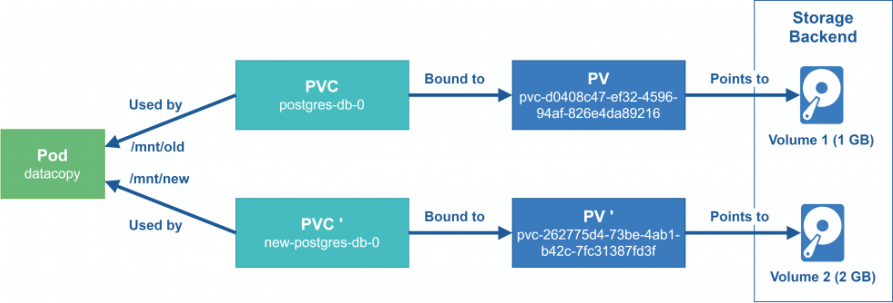

```bash
[root@master1 storage]#kubectl api-resources 

persistentvolumeclaims              pvc          v1                                true         PersistentVolumeClaim				#名称空间级
persistentvolumes                   pv           v1                                false        PersistentVolume					#非名称空间级 集群级
```

**PV Persistent Volume**

工作中的存储资源一般都是独立于Pod的，将之称为资源对象Persistent Volume(PV)，是由管理员设置的存储，它是kubernetes集群的一部分，PV 是 Volume 之类的卷插件，但具有独立于使用 PV 的 Pod的生命周期。

Persistent Volume 跟 Volume类似，区别就是：

- PV 是集群级别的资源，负责将存储空间引入到集群中，通常由管理员定义
- PV 就是Kubernetes集群中的网络存储，不属于Namespace、Node、Pod等资源，但可以被它们访问
- PV 属于Kubernetes 整个集群,即可以被所有集群的Pod访问
- PV是独立的网络存储资源对象，有自己的生命周期
- PV 支持很多种volume类型,PV对象可以有很多常见的类型：本地磁盘、NFS、分布式文件系统

```
https://kubernetes.io/zh-cn/docs/concepts/storage/persistent-volumes/#persistent-volumes
```

#### 持久卷的类型

PV 持久卷是用插件的形式来实现的。Kubernetes 目前支持以下插件：

- [`csi`](https://kubernetes.io/zh-cn/docs/concepts/storage/volumes/#csi) - 容器存储接口（CSI）
- [`fc`](https://kubernetes.io/zh-cn/docs/concepts/storage/volumes/#fc) - Fibre Channel（FC）存储
- [`hostPath`](https://kubernetes.io/zh-cn/docs/concepts/storage/volumes/#hostpath) - HostPath 卷 （仅供单节点测试使用；不适用于多节点集群；请尝试使用 `local` 卷作为替代）
- [`iscsi`](https://kubernetes.io/zh-cn/docs/concepts/storage/volumes/#iscsi) - iSCSI（IP 上的 SCSI）存储
- [`local`](https://kubernetes.io/zh-cn/docs/concepts/storage/volumes/#local) - 节点上挂载的本地存储设备
- [`nfs`](https://kubernetes.io/zh-cn/docs/concepts/storage/volumes/#nfs) - 网络文件系统（NFS）存储

以下的持久卷已被弃用但仍然可用。 如果你使用除 `flexVolume`、`cephfs` 和 `rbd` 之外的卷类型，请安装相应的 CSI 驱动程序。

- [`awsElasticBlockStore`](https://kubernetes.io/zh-cn/docs/concepts/storage/volumes/#awselasticblockstore) - AWS Elastic 块存储（EBS） （从 v1.23 开始**默认启用迁移**）
- [`azureDisk`](https://kubernetes.io/zh-cn/docs/concepts/storage/volumes/#azuredisk) - Azure 磁盘 （从 v1.23 开始**默认启用迁移**）
- [`azureFile`](https://kubernetes.io/zh-cn/docs/concepts/storage/volumes/#azurefile) - Azure 文件 （从 v1.24 开始**默认启用迁移**）
- [`cinder`](https://kubernetes.io/zh-cn/docs/concepts/storage/volumes/#cinder) - Cinder（OpenStack 块存储） （从 v1.21 开始**默认启用迁移**）
- [`flexVolume`](https://kubernetes.io/zh-cn/docs/concepts/storage/volumes/#flexVolume) - FlexVolume （从 v1.23 开始**弃用**，没有迁移计划，没有移除支持的计划）
- [`gcePersistentDisk`](https://kubernetes.io/zh-cn/docs/concepts/storage/volumes/#gcePersistentDisk) - GCE 持久磁盘 （从 v1.23 开始**默认启用迁移**）
- [`portworxVolume`](https://kubernetes.io/zh-cn/docs/concepts/storage/volumes/#portworxvolume) - Portworx 卷 （从 v1.31 开始**默认启用迁移**）
- [`vsphereVolume`](https://kubernetes.io/zh-cn/docs/concepts/storage/volumes/#vspherevolume) - vSphere VMDK 卷 （从 v1.25 开始**默认启用迁移**）

旧版本的 Kubernetes 仍支持这些“树内（In-Tree）”持久卷类型：

- [`cephfs`](https://kubernetes.io/zh-cn/docs/concepts/storage/volumes/#cephfs) （v1.31 之后**不可用**）
- `flocker` - Flocker 存储。 （v1.25 之后**不可用**）
- `glusterfs` - GlusterFS 存储。 （v1.26 之后**不可用**）
- `photonPersistentDisk` - Photon 控制器持久化盘 （v1.15 之后**不可用**）
- `quobyte` - Quobyte 卷。 （v1.25 之后**不可用**）
- [`rbd`](https://kubernetes.io/zh-cn/docs/concepts/storage/volumes/#rbd) - Rados 块设备 (RBD) 卷 （v1.31 之后**不可用**）
- `scaleIO` - ScaleIO 卷 （v1.21 之后**不可用**）
- `storageos` - StorageOS 卷 （v1.25 之后**不可用**）

**PVC Persistent Volume Claim**

Persistent Volume Claim(PVC) 是一个网络存储服务的请求。

PVC 属于名称空间级别的资源，只能被同一个名称空间的Pod引用

由用户定义，用于在空闲的PV中申请使用符合过滤条件的PV之一，与选定的PV是“一对一”的关系

用户在Pod上通过pvc插件请求绑定使用定义好的PVC资源

Pod能够申请特定的CPU和MEM资源，但是Pod只能通过PVC到PV上请求一块独立大小的网络存储空间，而PVC 可以动态的根据用户请求去申请PV资源，不仅仅涉及到存储空间，还有对应资源的访问模式，对于真正使用存储的用户不需要关心底层的存储实现细节，只需要直接使用 PVC 即可。

**Pod、PV、PVC 关系**

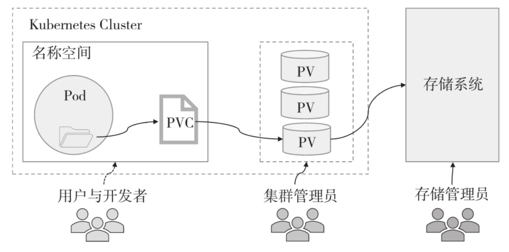

前提：

- 存储管理员配置各种类型的PV对象
- Pod、PVC 必须在同一个命名空间

用户需要存储资源的时候：

- 用户根据资源需求创建PVC，由PVC自动匹配(权限、容量)合适的PV对象
- PVC 允许用户按需指定期望的存储特性，并以之为条件，按特定的条件顺序进行PV的过滤VolumeMode → LabelSelector → StorageClassName → AccessMode → Size
- 在Pod内部通过 PVC 将 PV 绑定到当前的空间，进行使用
- 如果用户不再使用存储资源，解绑 PVC 和 Pod 即可

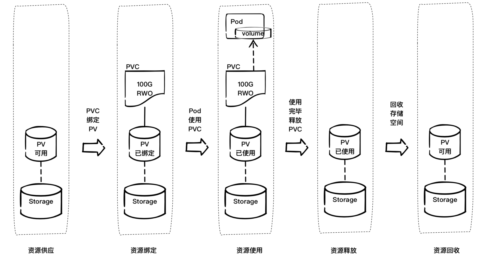

**PV和PVC的配置流程**

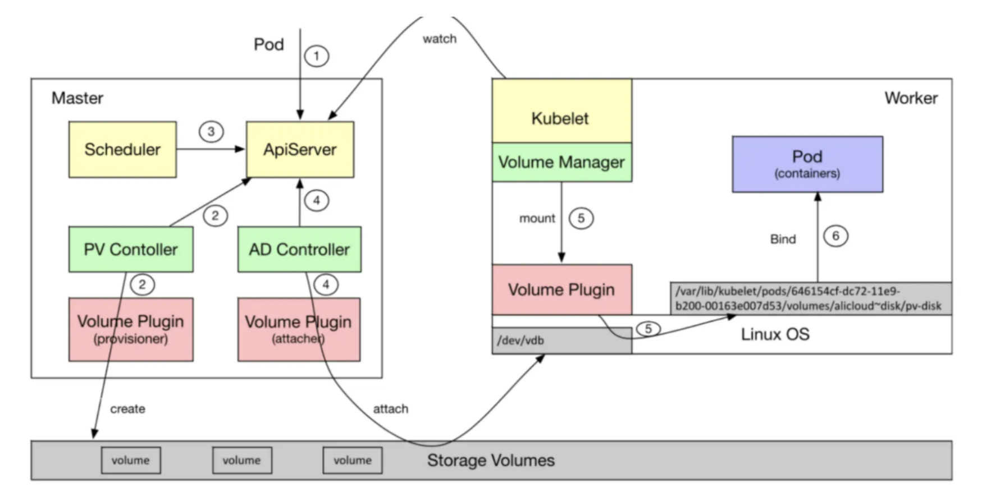


- 用户创建了一个包含 PVC 的 Pod，该 PVC 要求使用动态存储卷
- Scheduler 根据 Pod 配置、节点状态、PV 配置等信息，把 Pod 调度到一个合适的 Worker 节点上
- PV 控制器 watch 到该 Pod 使用的 PVC 处于 Pending 状态，于是调用 Volume Plugin(in-tree)创建存储卷，并创建 PV 对象(out-of-tree 由 External Provisioner 来处理)
- AD 控制器发现 Pod 和 PVC 处于待挂接状态，于是调用 Volume Plugin 挂接存储设备到目标Worker 节点上
- 在 Worker 节点上，Kubelet 中的 Volume Manager 等待存储设备挂接完成，并通过 VolumePlugin 将设备挂载到全局目录：/var/lib/kubelet/pods/[poduid]/volumes/kubernetes.io~iscsi/[PVname] (以iscsi为例)
- Kubelet 通过 Docker 启动 Pod 的 Containers，用 bind mount 方式将已挂载到本地全局目录的卷映射到容器中

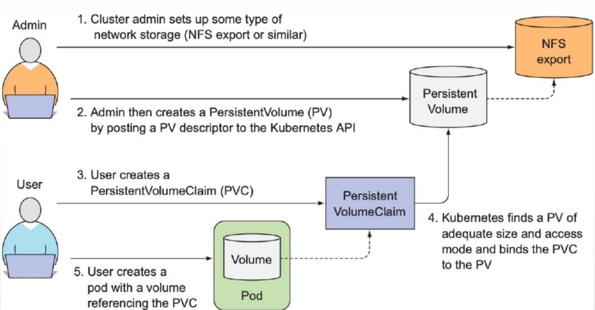

1. 群集管理员设置某种类型的网络存储(NFS导出或类似)
2. 管理员然后通过将PV描述符发布到KubernetesAPI来创建持久性卷(PV)。
3. 用户创建一个持久卷声明（PVC)
4. Kubernetes找到足够大小和访问模式的PV，并将PVC绑定到PV
5. 用户创建一个具有PVC参考卷的Pod
   

### PV 和 PVC 管理

PV的Provison 置备（创建）方法


- 静态：集群管理员预先手动创建一些 PV。它们带有可供群集用户使用的实际存储的细节。
- 动态：集群尝试根据用户请求动态地自动完成创建卷。此配置基于 StorageClasses：PVC 必须请求存储类，并且管理员必须预先创建并配置该 StorageClasses才能进行动态创建。声明该类为空字符串 ""， 可以有效地禁用其动态配置。

**PV 属性**

```bash
#PV 作为存储资源，主要包括存储能力、访问模式、存储类型、回收策略等关键信息,注意:PV的名称不支持大写
#https://kubernetes.io/zh-cn/docs/concepts/storage/persistent-volumes/#persistent-volumes
kubectl explain pv.spec
		capacity 		#定义pv使用多少资源，仅限于空间的设定
		accessModes 	#访问模式,支持单路读写，多路读写，多路只读，单Pod读写，可同时支持多种模式
		volumeMode 		#文件系统或块设备,默认文件系统
		mountOptions 	#挂载选项,比如:["ro", "soft"]
		persistentVolumeReclaimPolicy 	#资源回收策略，主要三种Retain、Delete、Recycle
		存储类型 		 #每种存储类型的样式的属性名称都是专有的。
		storageClassName	 #存储类的名称,如果配置必须和PVC的storageClassName相同才能绑定

#注意:PersistentVolume 对象的名称必须是合法的 DNS 子域名.
```

```yaml
#示例
apiVersion: v1
kind: PersistentVolume
metadata:
  name: pv0003  # PersistentVolume 名称
  labels:
    release: "stable"  # 便签可以支持匹配 PVC
spec:
  capacity:
    storage: 5Gi  # 该 PV 提供 5Gi 的存储空间
  volumeMode: Filesystem  # 存储类型，Filesystem 适用于文件存储
  accessModes:
    - ReadWriteOnce  # 仅允许单个节点读写
  persistentVolumeReclaimPolicy: Recycle  # 释放后自动清空数据（适用于 NFS）
  storageClassName: slow  # 必须和 PVC 相同，PVC 通过 StorageClass 绑定
  mountOptions:
    - hard
    - nfsvers=4.1  # 采用 NFS 4.1 版本
  nfs:
    path: /tmp  # 共享的 NFS 目录路径
    server: 172.17.0.2  # NFS 服务器 IP
```

**PVC 属性**

```bash
#PVC属性信息,与所有空间都能使用的PV不一样，PVC是属于名称空间级别的资源对象，即只有特定的资源才能使用
#https://kubernetes.io/zh-cn/docs/concepts/storage/persistent-volumes/#persistentvolumeclaims
#定义PVC
kubectl explain pvc.spec
		accessModes 	#访问模式 *
		resources 		#资源限制 *
		volumeMode 		#后端存储卷的模式,文件系统或块,默认为文件系统
		volumeName 		#指定绑定的卷(pv)的名称
		
#Pod引用PVC
kubectl explain pods.spec.volumes.persistentVolumeClaim
		claimName #定义pvc的名称,PersistentVolumeClaim 对象的名称必须是合法的 DNS 子域名.
		readOnly #设定pvc是否只读
		storageClassName #存储类的名称,如果配置必须和PV的storageClassName相同才能绑定
		selector #标签选择器实现选择绑定PV

#合法的 DNS 子域名.
https://kubernetes.io/zh-cn/docs/concepts/overview/working-with-objects/names/#dns-subdomain-names

#storageClassName类
PVC可以通过为 storageClassName 属性设置 StorageClass 的名称来请求特定的存储类。只有所请求
的类的PV的storageClassName 值与 PVC 设置相同，才能绑定
#selector 选择算符
PVC可以设置标签选择算符,来进一步过滤卷集合。只有标签与选择算符相匹配的卷能够绑定到PVC上。选择算
符包含两个字段：
	matchLabels - 卷必须包含带有此值的标签
	matchExpressions - 通过设定键（key）、值列表和操作符（operator） 来构造的需求。合法的操作符有 In、NotIn、Exists 和 DoesNotExist。
	来自 matchLabels 和 matchExpressions 的所有需求都按逻辑与的方式组合在一起。 这些需求都必须被满足才被视为匹配。
```

```yaml
示例
apiVersion: v1
kind: PersistentVolumeClaim
metadata:
  name: myclaim  # PVC 名称
spec:
  accessModes:
    - ReadWriteOnce  # 仅允许单个节点读写
  volumeMode: Filesystem  # 存储类型，Filesystem 适用于文件存储
  resources:
    requests:
      storage: 8Gi  # 申请 8Gi 存储空间
  storageClassName: slow  # 必须和 PV 的 storageClassName 一致
  selector:
    matchLabels:
      release: "stable"  # 绑定具有该 label 的 PV
    matchExpressions:
      - key: environment
        operator: In
        values:
          - dev  # 仅匹配 environment=dev 的 PV
      #- {key: environment, operator: In, values: [dev]}
```

#### 属性进阶

**PV 状态**

PV 有生命周期,自然也有自己特定的状态

注意：这个过程是单向过程，不能逆向

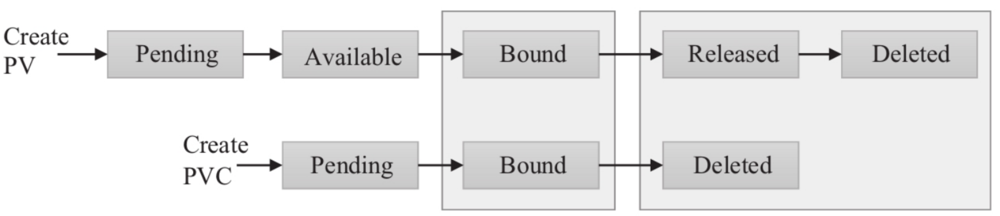

| 状态 (Status) |                解析 (Description)                |
| :-----------: | :----------------------------------------------: |
| **Available** |    空闲状态，表示 PV 没有被任何 PVC 绑定使用     |
|   **Bound**   |      绑定状态，表示 PV 已成功关联到某个 PVC      |
| **Released**  | 未回收状态，PVC 已被删除但 PV 资源尚未被集群回收 |
|  **Failed**   |   资源回收失败状态，通常因自动回收过程出错导致   |

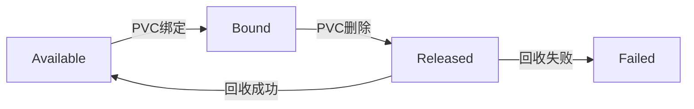
```mermaid
graph LR
  A[Available] -->|PVC绑定| B[Bound]
  B -->|PVC删除| C[Released]
  C -->|回收成功| A
  C -->|回收失败| D[Failed]
```


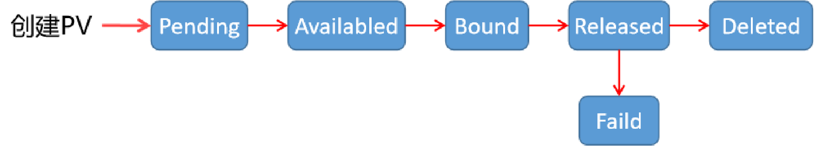

通过 kubectl patch 命令可以直接修改 PV 的状态，使其从 Released 状态变为 Available 状态。

```
kubectl patch persistentvolume <pv-name> -p '{"spec":{"claimRef": null}}'
```

#### AccessMode 访问模式

AccessModes 是用来对 PV 进行访问模式的设置，用于描述用户应用对存储资源的访问权限，访问权限包括

```
https://kubernetes.io/zh-cn/docs/concepts/storage/persistent-volumes/#access-modes
```

|        访问模式类型         |                           解析说明                           |
| :-------------------------: | :----------------------------------------------------------: |
|   **ReadWriteOnce (RWO)**   | 单节点读写，卷可以被一个节点以读写方式挂载。 • 允许同一节点上的多个Pod访问 • 不支持并行写入（非并发） |
|   **ReadOnlyMany (ROX)**    |         多节点只读，卷可被多个节点同时以只读方式挂载         |
|   **ReadWriteMany (RWX)**   |           多节点读写，卷可被多个节点同时挂载并读写           |
| **ReadWriteOncePod (RWOP)** | 单Pod读写（v1.22+ alpha，v1.29 stable） • 确保整个集群中只有一个Pod可读写该PVC • 比RWO更严格，限制为单个Pod而非单个节点访问 |

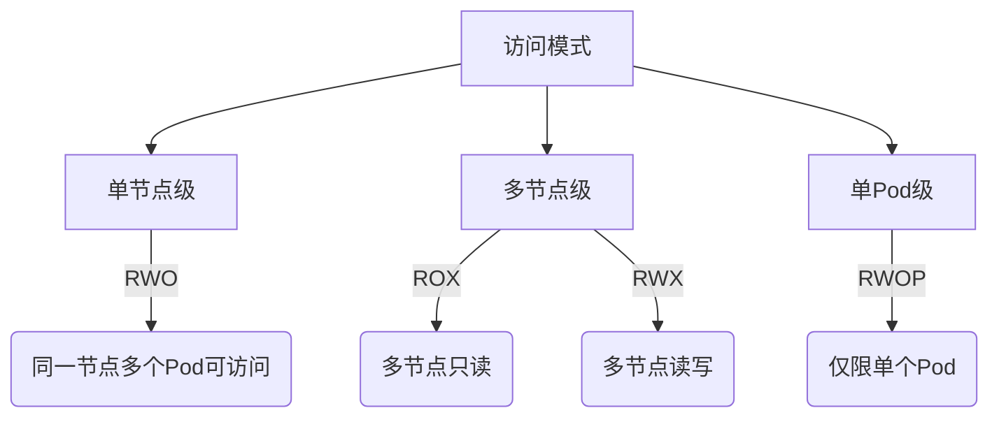
```mermaid
graph TD
    A[访问模式] --> B[单节点级]
    A --> C[多节点级]
    A --> D[单Pod级]
    B -->|RWO| B1(同一节点多个Pod可访问)
    C -->|ROX| C1(多节点只读)
    C -->|RWX| C2(多节点读写)
    D -->|RWOP| D1(仅限单个Pod)
```

注意：

- 不同的后端存储支持不同的访问模式，所以要根据后端存储类型来设置访问模式。
- 一些 PV 可能支持多种访问模式，但是在挂载的时候只能使用一种访问模式，多种访问模式是不会生效的

> **重要提醒！** 每个卷同一时刻只能以一种访问模式挂载，即使该卷能够支持多种访问模式。

| 卷插件            | ReadWriteOnce | ReadOnlyMany |          ReadWriteMany          | ReadWriteOncePod |
| :---------------- | :-----------: | :----------: | :-----------------------------: | ---------------- |
| AzureFile         |       ✓       |      ✓       |                ✓                | -                |
| CephFS            |       ✓       |      ✓       |                ✓                | -                |
| CSI               |  取决于驱动   |  取决于驱动  |           取决于驱动            | 取决于驱动       |
| FC                |       ✓       |      ✓       |                -                | -                |
| FlexVolume        |       ✓       |      ✓       |           取决于驱动            | -                |
| GCEPersistentDisk |       ✓       |      ✓       |                -                | -                |
| Glusterfs         |       ✓       |      ✓       |                ✓                | -                |
| HostPath          |       ✓       |      -       |                -                | -                |
| iSCSI             |       ✓       |      ✓       |                -                | -                |
| NFS               |       ✓       |      ✓       |                ✓                | -                |
| RBD               |       ✓       |      ✓       |                -                | -                |
| VsphereVolume     |       ✓       |      -       | -（Pod 运行于同一节点上时可行） | -                |
| PortworxVolume    |       ✓       |      -       |                ✓                | -                |

#### PV 资源回收策略

**PV 三种资源回收策略**

当 Pod 结束 volume 后可以回收资源对象并删除PVC，而PVC和PV绑定关系就不存在了，当绑定关系不存在后对应的PV需要怎么处理，而PersistentVolume 的回收策略告诉集群在存储卷声明释放后应如何处理该PV卷。目前，volume 的处理策略有保留、回收或删除。

当PVC被删除后, Kubernetes 会自动生成一个recycler-for-<PV_NAME>的Pod实现回收工作,但Retain策略除外

回收完成后,PV的状态变为Release,如果其它处于Pending状态的PVC和此PV条件匹配,则可以再次此PV进行绑定

| 删除策略类型 |                    核心机制                     |                         适用场景                         |                    注意事项                     |
| :----------: | :---------------------------------------------: | :------------------------------------------------------: | :---------------------------------------------: |
|  **Retain**  |    PVC删除后保留PV和数据 需人工清理存储空间     |        • 关键数据保护 • 手动创建的PV（默认策略）         | 需定期清理残留PV（`kubectl delete pv <name>`）  |
|  **Delete**  |            自动删除PV及底层存储数据             |         • 动态存储卷（默认策略） • 临时测试环境          | 需存储插件支持删除功能（如AWS EBS/Azure Disk）  |
| **Recycle**  | （已废弃）仅清空数据但保留PV 仅支持NFS/hostPath | • 历史版本兼容（K8s 1.15+已移除） • 开发测试环境复用存储 | 替代方案：使用Dynamic Provisioning + Delete策略 |


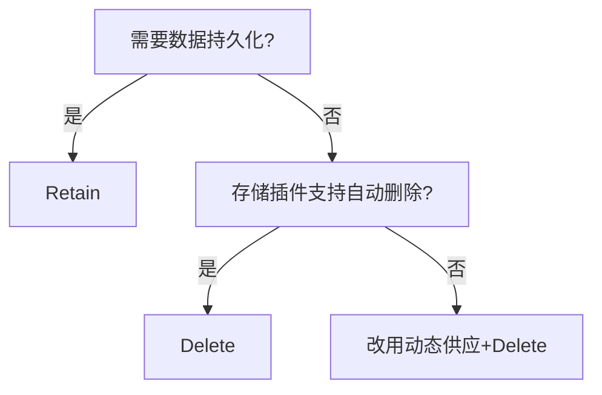
```mermaid
graph TD
    A[需要数据持久化?] -->|是| B[Retain]
    A -->|否| C[存储插件支持自动删除?]
    C -->|是| D[Delete]
    C -->|否| E[改用动态供应+Delete]
```

#### 各策略操作示例

1. **Retain策略配置**：

   ```yaml
   apiVersion: v1
   kind: PersistentVolume
   metadata:
     name: pv-retain-example
   spec:
     persistentVolumeReclaimPolicy: Retain  # 显式声明
     capacity:
       storage: 10Gi
     accessModes:
       - ReadWriteOnce
   ```

2. **Delete策略触发效果**：

   ```bash
   # 删除PVC后自动触发
   kubectl delete pvc my-pvc
   # 验证PV是否被删除
   kubectl get pv
   ```

3. **Recycle废弃说明**：

   ```bash
   # 旧版本使用示例（现已无效）
   kubectl create -f - <<EOF
   apiVersion: v1
   kind: PersistentVolume
   metadata:
     name: pv-recycle-example
   spec:
     persistentVolumeReclaimPolicy: Recycle  # 现代集群会报错
   EOF
   ```


### PV 和 PVC 使用流程

实现方法

- 准备存储
- 基于存储创建PV
- 根据需求创建PVC: PVC会根据capacity和accessModes及其它条件自动找到相匹配的PV进行绑定,一个PVC对应一个PV
- 创建Pod
  - 在Pod中的 volumes 指定调用上面创建的 PVC 名称
  - 在Pod中的容器中的volumeMounts指定PVC挂载容器内的目录路径

**故障排错**

创建PVC之后，一直绑定不上PV,导致PVC一直处于Pending状态,主要原因如下:

- PVC 的空间申请大小大于 PV 的大小
- PVC 的 accessModes 和 PV 的不一致
- PVC 的 storageClassName 和 PV的不一致

创建挂载了PVC的Pod之后一直处于Pending状态主要原因如下

- PVC 没有创建
- PVC 创建失败
- PVC 和 Pod 不在同一个Namespace

### PV 和 PVC 使用

#### 范例: 以NFS类型创建一个3G大小的存储资源对象PV

```bash
#准备NFS共享存储
[root@ubuntu2204 ~]#apt install -y nfs-service
[root@ubuntu2204 ~]#mkdir /nfsdata
[root@ubuntu2204 ~]#cd /nfsdata/
[root@ubuntu2204 nfsdata]#mkdir www

[root@ubuntu2204 nfsdata]#echo '/nfsdata 10.0.0.0/24(rw,no_root_squash)' >> /etc/exports
[root@ubuntu2204 nfsdata]#cat /etc/exports
# /etc/exports: the access control list for filesystems which may be exported
#		to NFS clients.  See exports(5).
#
# Example for NFSv2 and NFSv3:
# /srv/homes       hostname1(rw,sync,no_subtree_check) hostname2(ro,sync,no_subtree_check)
#
# Example for NFSv4:
# /srv/nfs4        gss/krb5i(rw,sync,fsid=0,crossmnt,no_subtree_check)
# /srv/nfs4/homes  gss/krb5i(rw,sync,no_subtree_check)
#
#/nfsdata *(rw,all_squash,anonuid=0,anongid=0)
/nfsdata 10.0.0.0/24(rw,no_root_squash)

[root@ubuntu2204 nfsdata]#exportfs -r
[root@ubuntu2204 nfsdata]#exportfs -v
/nfsdata      	10.0.0.0/24(sync,wdelay,hide,no_subtree_check,sec=sys,rw,secure,no_root_squash,no_all_squash)


#在所有worker节点安装nfs软件
[root@node1 ~]#apt -y install nfs-client

#准备PV,定制一个具体空间大小的存储对象
[root@master1 storage]#vim storage-pv.yaml

apiVersion: v1
kind: PersistentVolume
metadata:
  name: pv-test # PV 名称，需小写
spec:
  capacity:
    storage: 3Gi # 指定存储容量 3Gi
  accessModes:
    - ReadWriteMany  # 允许多个节点同时读写 (适用于 NFS)
    - ReadOnlyMany   # 允许多个节点只读访问 (适用于 NFS)
    - ReadWriteOnce  # 只能被一个节点同时读写 
  #persistentVolumeReclaimPolicy: Retain # 当 PVC 释放 PV 后，保留数据，需手动清理
  nfs:
    path: /nfsdata/www   # NFS 服务器上的共享目录路径
    server: nfs.kang.org # NFS 服务器地址，确保 K8s 能解析此域名
  #mountOptions:
  #  - hard         # 挂载方式，硬挂载，防止连接中断导致 I/O 失败
  #  - nfsvers=4    # 指定 NFS 版本，推荐使用 NFSv4

#如果该pv的使用方式支持多个，可以使用格式：accessModes:["ReadWriteMany","ReadWriteOnce"]
#如果nfs提供的目录空间个数多的话，可以同样的方式写多个。
	Pv的资源对象类型：PersistentVolume
	存储空间大小设定：capacity
	存储空间的访问模式：accessModes
		ReadWriteOnce (RWO): 允许单个节点以读写方式挂载。
		ReadWriteMany (RWX): 允许多个节点以读写方式挂载。
		ReadOnlyMany (ROX): 允许多个节点以只读方式挂载。
#可以指定回收策略：persistentVolumeReclaimPolicy: Recycle
```

```bash
[root@master1 storage]#kubectl apply -f storage-pv.yaml
persistentvolume/pv-test created
[root@master1 storage]#kubectl get pv
NAME      CAPACITY   ACCESS MODES   RECLAIM POLICY   STATUS      CLAIM   STORAGECLASS   VOLUMEATTRIBUTESCLASS   REASON   AGE
pv-test   3Gi        RWO,ROX,RWX    Retain           Available                          <unset>                          6s
#结果显示：虽然我们在创建pv的时候没有指定回收策略，而其策略自动帮我们配置了Retain

#准备PVC,定义一个资源对象，请求空间1Gi
[root@master1 storage]#vim strage-pvc.yaml

apiVersion: v1
kind: PersistentVolumeClaim
metadata:
  name: pvc-test  # PVC 名称，必须小写
spec:
  accessModes:
    - ReadWriteOnce  # 仅允许单个节点挂载并读写
  resources:
    requests:
      storage: 1Gi  # 请求 1Gi 存储空间

#注意：请求的资源大小必须在 pv资源的范围内

[root@master1 storage]#kubectl apply -f strage-pvc.yaml
persistentvolumeclaim/pvc-test created

[root@master1 storage]#kubectl get pv
NAME      CAPACITY   ACCESS MODES   RECLAIM POLICY   STATUS   CLAIM              STORAGECLASS   VOLUMEATTRIBUTESCLASS   REASON   AGE
pv-test   3Gi        RWO,ROX,RWX    Retain           Bound    default/pvc-test                  <unset>                          2m50s
[root@master1 storage]#kubectl get pvc
NAME       STATUS   VOLUME    CAPACITY   ACCESS MODES   STORAGECLASS   VOLUMEATTRIBUTESCLASS   AGE
pvc-test   Bound    pv-test   3Gi        RWO,ROX,RWX                   <unset>                 26s

#结果显示：一旦启动pvc会自动去搜寻合适的可用的pv，然后绑定在一起
#如果pvc找不到对应的pv资源，状态会一直处于pending

#准备pod
[root@master1 storage]#vim strage-nginx-pvc.yaml

[root@master1 storage]#cat strage-nginx-pvc.yaml
apiVersion: v1
kind: Pod
metadata:
  name: pod-nginx  # Pod 名称，需小写
spec:
  volumes:
    - name: volume-nginx  # 定义一个名为 volume-nginx 的存储卷
      persistentVolumeClaim:
        claimName: pvc-test  # 绑定到 PVC "pvc-test"
  containers:
    - name: pvc-nginx-container  # 容器名称
      image: registry.cn-beijing.aliyuncs.com/wangxiaochun/nginx:1.20.0  # 指定 Nginx 1.20.0 版本
      volumeMounts:
        - name: volume-nginx  # 关联的卷名称，需要与 `volumes` 中的名称匹配
          mountPath: "/usr/share/nginx/html"  # 挂载到 Nginx 的网站目录

#属性解析：
#spec.volumes 是针对pod资源申请的存储资源来说的，这里使用的主要是pvc的方式。
#spec.containers.volumeMounts 是针对pod资源对申请的存储资源的信息。将pvc挂载的容器目录

[root@master1 storage]#kubectl apply -f strage-nginx-pvc.yaml
pod/pod-nginx created
[root@master1 storage]#kubectl get pod -o wide
NAME        READY   STATUS    RESTARTS   AGE   IP             NODE             NOMINATED NODE   READINESS GATES
pod-nginx   1/1     Running   0          15s   10.244.1.170   node1.kang.org   <none>           <none>

#默认页面无法访问,如果不准备首页的话，会导致 403 报错
[root@master1 storage]#curl 10.244.1.170
<html>
<head><title>403 Forbidden</title></head>
<body>
<center><h1>403 Forbidden</h1></center>
<hr><center>nginx/1.20.0</center>
</body>
</html>

#添加网页文件
[root@ubuntu2204 nfsdata]#echo 'My app' > /nfsdata/www/index.html
[root@ubuntu2204 nfsdata]#cat /nfsdata/www/index.html
My app

#注意:删除时,要按顺序删除,先删除应用pod,再删除pvc,最后删除pv,否则会出现卡死现象
#删除pod
[root@master1 storage]#kubectl delete -f strage-nginx-pvc.yaml 
pod "pod-nginx" deleted

#删除PVC
[root@master1 storage]#kubectl delete -f strage-pvc.yaml 
persistentvolumeclaim "pvc-test" deleted

#显示PV状态Released
[root@master1 storage]#kubectl get pv
NAME      CAPACITY   ACCESS MODES   RECLAIM POLICY   STATUS     CLAIM              STORAGECLASS   VOLUMEATTRIBUTESCLASS   REASON   AGE
pv-test   3Gi        RWO,ROX,RWX    Retain           Released   default/pvc-test                  <unset>                          14m
#最后删除PV
[root@master1 storage]#kubectl delete -f strage-pv.yaml 
persistentvolume "pv-test" deleted
```

```bash
[root@master1 storage]#kubectl apply -f strage-pv.yaml
persistentvolume/pv-test created
[root@master1 storage]#kubectl apply -f strage-pvc.yaml 
persistentvolumeclaim/pvc-test created
[root@master1 storage]#kubectl apply -f strage-nginx-pvc.yaml 
pod/pod-nginx created
[root@master1 storage]#
[root@master1 storage]#kubectl get pod -o wide 
NAME        READY   STATUS    RESTARTS   AGE   IP             NODE             NOMINATED NODE   READINESS GATES
pod-nginx   1/1     Running   0          7s    10.244.1.171   node1.kang.org   <none>           <none>
[root@master1 storage]#curl 10.244.1.171
My app
```

**创建流程**

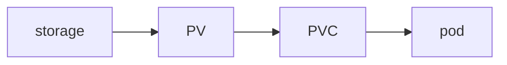
```mermaid
graph LR
    storage -->B[PV]
    B --> C[PVC]
    C --> D[pod]

```

**删除流程**


```mermaid
graph LR
    pod -->B[PVC]
    B --> C[PV]
    C --> D[storage]
```


#### 范例: 创建使用PVC的deployment实现多个Pod共享数据

```bash
[root@master1 storage]#kubectl apply -f storage-pv.yaml
persistentvolume/pv-test created
[root@master1 storage]#kubectl apply -f storage-pvc.yaml
persistentvolumeclaim/pvc-test created

[root@master1 storage]#kubectl get pv
NAME      CAPACITY   ACCESS MODES   RECLAIM POLICY   STATUS   CLAIM              STORAGECLASS   VOLUMEATTRIBUTESCLASS   REASON   AGE
pv-test   3Gi        RWO,ROX,RWX    Retain           Bound    default/pvc-test                  <unset>                          33s
[root@master1 storage]#kubectl get pvc
NAME       STATUS   VOLUME    CAPACITY   ACCESS MODES   STORAGECLASS   VOLUMEATTRIBUTESCLASS   AGE
pvc-test   Bound    pv-test   3Gi        RWO,ROX,RWX                   <unset>                 30s


[root@master1 storage]#vim storage-deployment-nginx-pvc.yaml

apiVersion: apps/v1
kind: Deployment
metadata:
  name: deployment-nginx-pvc  # Deployment 名称
spec:
  replicas: 3  # 副本数，创建 3 个 Pod
  selector:
    matchLabels:
      app: nginx-pvc  # 选择 app=nginx-pvc 的 Pod
  template:
    metadata:
      labels:
        app: nginx-pvc  # Pod 需要匹配这个标签，确保被 Deployment 管理
    spec:
      volumes:
        - name: volume-nginx  # 定义存储卷
          persistentVolumeClaim:
            claimName: pvc-test  # 绑定 PVC
      containers:
        - name: nginx-pvc
          image: registry.cn-beijing.aliyuncs.com/wangxiaochun/nginx:1.20.0
          volumeMounts:
            - name: volume-nginx  # 需要和 `volumes` 里的 `name` 一致
              mountPath: "/usr/share/nginx/html"  # 挂载到 Nginx 的网站目录
              
---
apiVersion: v1
kind: Service
metadata:
  name: service-nginx-pvc  # Service 名称
spec:
  type: LoadBalancer  # 暴露外部访问（如果在云环境中）
  selector:
    app: nginx-pvc  # 选择 Deployment 里的 Pod
  ports:
    - name: http
      port: 80        # Service 端口（对外暴露的端口）
      targetPort: 80  # Pod 内部的端口
      protocol: TCP


#创建deployment
root@master1 storage]#kubectl apply -f storage-deployment-nginx-pvc.yaml
deployment.apps/deployment-nginx-pvc created
service/service-nginx-pvc created

[root@master1 storage]#kubectl apply -f storage-deployment-nginx-pvc.yaml
deployment.apps/deployment-nginx-pvc created
service/service-nginx-pvc created
[root@master1 storage]#kubectl get pod -o wide 
NAME                                    READY   STATUS    RESTARTS   AGE   IP             NODE             NOMINATED NODE   READINESS GATES
deployment-nginx-pvc-546f44fb95-8bd2x   1/1     Running   0          18s   10.244.3.193   node3.kang.org   <none>           <none>
deployment-nginx-pvc-546f44fb95-cd2jj   1/1     Running   0          18s   10.244.1.172   node1.kang.org   <none>           <none>
deployment-nginx-pvc-546f44fb95-gh75l   1/1     Running   0          18s   10.244.4.182   node2.kang.org   <none>           <none>
[root@master1 storage]#kubectl get svc
NAME                TYPE           CLUSTER-IP       EXTERNAL-IP   PORT(S)        AGE
kubernetes          ClusterIP      10.96.0.1        <none>        443/TCP        10d
service-nginx-pvc   LoadBalancer   10.103.119.120   10.0.0.11     80:31112/TCP   29s
[root@master1 storage]#curl 10.244.3.193
My app
[root@master1 storage]#curl 10.244.1.172
My app
[root@master1 storage]#curl 10.244.4.182
My app
[root@master1 storage]#curl 10.0.0.11
My app

#修改nfs服务器数据
[root@ubuntu2204 nfsdata]#echo 'v0.1' >> /nfsdata/www/index.html

[root@master1 storage]#curl 10.0.0.11
My app
v0.1
```

#### 范例: PVC自动绑定相匹配的PV,PVC和 PV 是自动关联的，而且会匹配容量和权限

```bash
[root@ubuntu2204 nfsdata]#mkdir -p data{1..3}
[root@ubuntu2204 nfsdata]#ls
data1  data2  data3
[root@ubuntu2204 nfsdata]#exportfs -v
/nfsdata      	10.0.0.0/24(sync,wdelay,hide,no_subtree_check,sec=sys,rw,secure,no_root_squash,no_all_squash)

#PV清单文件
apiVersion: v1
kind: PersistentVolume
metadata:
  name: pv-nfs-1  # 第一个 NFS PV
spec:
  capacity:
    storage: 5Gi  # PV 容量
  volumeMode: Filesystem
  accessModes:
    - ReadWriteMany  # 多个 Pod 可以同时读写
  persistentVolumeReclaimPolicy: Retain  # 回收策略，保留数据
  nfs:
    path: "/nfsdata/data1"  # NFS 共享目录
    server: nfs.kang.org  # NFS 服务器地址
---
apiVersion: v1
kind: PersistentVolume
metadata:
  name: pv-nfs-2  # 第二个 NFS PV
spec:
  capacity:
    storage: 5Gi
  volumeMode: Filesystem
  accessModes:
    - ReadOnlyMany  # 只能多个 Pod 只读访问
  persistentVolumeReclaimPolicy: Retain
  nfs:
    path: "/nfsdata/data2"
    server: nfs.kang.org
---
apiVersion: v1
kind: PersistentVolume
metadata:
  name: pv-nfs-3  # 第三个 NFS PV
spec:
  capacity:
    storage: 1Gi
  volumeMode: Filesystem
  accessModes:
    - ReadWriteOnce  # 只能单个 Pod 读写
  persistentVolumeReclaimPolicy: Retain
  nfs:
    path: "/nfsdata/data3"
    server: nfs.kang.org

[root@master1 storage]#kubectl apply -f storage-mult-pv.yaml
persistentvolume/pv-nfs-1 created
persistentvolume/pv-nfs-2 created
persistentvolume/pv-nfs-3 created

[root@master1 storage]#kubectl get pv
NAME       CAPACITY   ACCESS MODES   RECLAIM POLICY   STATUS      CLAIM              STORAGECLASS   VOLUMEATTRIBUTESCLASS   REASON   AGE
pv-nfs-1   5Gi        RWX            Retain           Available                                     <unset>                          15s
pv-nfs-2   5Gi        ROX            Retain           Available                                     <unset>                          15s
pv-nfs-3   1Gi        RWO            Retain           Available                                     <unset>                          15s

#PVC清单文件
apiVersion: v1
kind: PersistentVolumeClaim
metadata:
  name: pvc-demo-1  # PVC 名称
  namespace: default  # 所属命名空间
spec:
  accessModes:
    - ReadWriteMany  # 允许多个 Pod 读写
  volumeMode: Filesystem  # 使用文件系统模式
  resources:
    requests:
      storage: 3Gi  # 申请 3Gi 存储

[root@master1 storage]#kubectl apply -f storage-mult-pvc.yaml
persistentvolumeclaim/pvc-demo-1 creat

[root@master1 storage]#kubectl get pvc
NAME         STATUS   VOLUME     CAPACITY   ACCESS MODES   STORAGECLASS   VOLUMEATTRIBUTESCLASS   AGE
pvc-demo-1   Bound    pv-nfs-1   5Gi        RWX                           <unset>                 13s

#自动绑定PVC至容器和权限都匹配的PV
[root@master1 storage]#kubectl get pv
NAME       CAPACITY   ACCESS MODES   RECLAIM POLICY   STATUS      CLAIM                STORAGECLASS   VOLUMEATTRIBUTESCLASS   REASON   AGE
pv-nfs-1   5Gi        RWX            Retain           Bound       default/pvc-demo-1                  <unset>                          82s
pv-nfs-2   5Gi        ROX            Retain           Available                                       <unset>                          82s
pv-nfs-3   1Gi        RWO            Retain           Available                                       <unset>                          82s
```

#### 案例: 运行一个单实例有状态应用MySQL

```
https://kubernetes.io/zh-cn/docs/tasks/run-application/run-single-instance-stateful-application/
```

```bash
[root@ubuntu2204 nfsdata]#ls
mysql
[root@ubuntu2204 nfsdata]#cat /etc/exports 
/nfsdata 10.0.0.0/24(rw,no_root_squash)

[root@ubuntu2204 nfsdata]#exportfs -r
[root@ubuntu2204 nfsdata]#exportfs -v
/nfsdata      	10.0.0.0/24(sync,wdelay,hide,no_subtree_check,sec=sys,rw,secure,no_root_squash,no_all_squash)

#注意：要在所有worker节点上安装nfs客户端
apt install -y nfs-client

#清单文件

# 1️⃣ 创建 Kubernetes 命名空间 `demo`
apiVersion: v1
kind: Namespace
metadata:
  name: demo  # 确保所有资源都在 `demo` 命名空间下
---
# 2️⃣ 定义 PersistentVolume (PV)
apiVersion: v1
kind: PersistentVolume
metadata:
  name: mysql-pv-volume  # PV 名称
  labels:
    type: local  # 自定义标签，可用于 PVC 选择 PV
spec:
  storageClassName: manual  # 手动创建的存储类（未使用动态存储）
  capacity:
    storage: 20Gi  # 存储容量 20Gi
  accessModes:
    - ReadWriteOnce  # 只能被单个节点挂载为读写（适用于 NFS）
  persistentVolumeReclaimPolicy: Retain  # 删除 PVC 时，PV 保留数据
  nfs:
    server: nfs.kang.org  # NFS 服务器地址（注意：节点需能解析该域名）
    path: /nfsdata/mysql  # NFS 共享目录
---
# 3️⃣ 定义 PersistentVolumeClaim (PVC)
apiVersion: v1
kind: PersistentVolumeClaim
metadata:
  name: mysql-pv-claim  # PVC 名称
  namespace: demo  # 绑定到 `demo` 命名空间
spec:
  storageClassName: manual  # 绑定手动创建的 PV
  accessModes:
    - ReadWriteOnce  # 只能被单个 Pod 挂载为读写
  resources:
    requests:
      storage: 20Gi  # 申请 20Gi 存储空间
---
# 4️⃣ 定义 MySQL Service（用于 Pod 内部通信）
apiVersion: v1
kind: Service
metadata:
  name: mysql  # Service 名称
  namespace: demo
spec:
  clusterIP: None  # 无需负载均衡，使用 Headless Service 直接连接 Pod
  ports:
    - port: 3306  # MySQL 监听端口
  selector:
    app: mysql  # 关联的 Pod 标签
---
# 5️⃣ 部署 MySQL Deployment
apiVersion: apps/v1
kind: Deployment
metadata:
  name: mysql  # Deployment 名称
  namespace: demo
spec:
  selector:
    matchLabels:
      app: mysql  # 选择 `app=mysql` 的 Pod
  strategy:
    type: Recreate  # 确保 Pod 重新创建时不会导致数据冲突
  template:
    metadata:
      labels:
        app: mysql  # Pod 选择器
    spec:
      containers:
        - name: mysql  # 容器名称
          image: registry.cn-beijing.aliyuncs.com/wangxiaochun/mysql:8.0.29-oracle  # MySQL 8.0.29 镜像
          env:
            - name: MYSQL_ROOT_PASSWORD  # MySQL root 用户密码（建议用 Secret 替换）
              value: "123456"  
          ports:
            - containerPort: 3306  # 容器内部 MySQL 端口
              name: mysql
          volumeMounts:
            - name: mysql-persistent-storage  # 关联的存储卷
              mountPath: /var/lib/mysql  # MySQL 数据存储路径
      volumes:
        - name: mysql-persistent-storage
          persistentVolumeClaim:
            claimName: mysql-pv-claim  # 绑定 PVC

[root@master1 storage]#kubectl apply -f storage-mysql-pv-pvc.yaml
namespace/demo created
persistentvolume/mysql-pv-volume created
persistentvolumeclaim/mysql-pv-claim created
service/mysql created
deployment.apps/mysql created
[root@master1 storage]#kubectl get pv,pvc -n demo 
NAME                               CAPACITY   ACCESS MODES   RECLAIM POLICY   STATUS   CLAIM                 STORAGECLASS   VOLUMEATTRIBUTESCLASS   REASON   AGE
persistentvolume/mysql-pv-volume   20Gi       RWO            Retain           Bound    demo/mysql-pv-claim   manual         <unset>                          15s

NAME                                   STATUS   VOLUME            CAPACITY   ACCESS MODES   STORAGECLASS   VOLUMEATTRIBUTESCLASS   AGE
persistentvolumeclaim/mysql-pv-claim   Bound    mysql-pv-volume   20Gi       RWO            manual         <unset>                 15s

[root@master1 storage]#kubectl get pod -n demo -o wide 
NAME                     READY   STATUS    RESTARTS   AGE   IP             NODE             NOMINATED NODE   READINESS GATES
mysql-6887c4b7c4-bw6dh   1/1     Running   0          83s   10.244.1.177   node1.kang.org   <none>           <none>

#测试
[root@master1 storage]#kubectl exec -it -n demo mysql-6887c4b7c4-bw6dh -- bash
bash-4.4# mysql -uroot -p123456 -hmysql
mysql> show databases;
+--------------------+
| Database           |
+--------------------+
| information_schema |
| mysql              |
| performance_schema |
| sys                |
+--------------------+
4 rows in set (0.00 sec)


#查看nfs服务器数据
[root@ubuntu2204 nfsdata]#ls mysql/
 auto.cnf        binlog.index   client-cert.pem     '#ib_16384_1.dblwr'   ib_logfile0  '#innodb_temp'   mysql.sock           public_key.pem    sys
 binlog.000001   ca-key.pem     client-key.pem       ib_buffer_pool       ib_logfile1   mysql           performance_schema   server-cert.pem   undo_001
 binlog.000002   ca.pem        '#ib_16384_0.dblwr'   ibdata1              ibtmp1        mysql.ibd       private_key.pem      server-key.pem    undo_002

#创建数据库
mysql> create database mydb;
Query OK, 1 row affected (0.01 sec)

[root@ubuntu2204 nfsdata]#ls mysql/
 auto.cnf        ca-key.pem       '#ib_16384_0.dblwr'   ib_logfile0     mydb         performance_schema   server-key.pem
 binlog.000001   ca.pem           '#ib_16384_1.dblwr'   ib_logfile1     mysql        private_key.pem      sys
 binlog.000002   client-cert.pem   ib_buffer_pool       ibtmp1          mysql.ibd    public_key.pem       undo_001
 binlog.index    client-key.pem    ibdata1             '#innodb_temp'   mysql.sock   server-cert.pem      undo_002


#删除pod重建pod数据也不会丢失
[root@master1 storage]#kubectl delete deployments.apps -n demo mysql 
deployment.apps "mysql" deleted
[root@master1 storage]#kubectl apply -f storage-mysql-pv-pvc.yaml
namespace/demo unchanged
persistentvolume/mysql-pv-volume unchanged
persistentvolumeclaim/mysql-pv-claim unchanged
service/mysql unchanged
deployment.apps/mysql created
[root@master1 storage]#kubectl get pod -n demo 
NAME                     READY   STATUS    RESTARTS   AGE
mysql-6887c4b7c4-jts2j   1/1     Running   0          16s
[root@master1 storage]#kubectl exec -it -n demo mysql-6887c4b7c4-jts2j -- bash
bash-4.4# show databases;
bash: show: command not found
bash-4.4# mysql -uroot -p123456 -hmysql
mysql> show databases;
+--------------------+
| Database           |
+--------------------+
| information_schema |
| mydb               |
| mysql              |
| performance_schema |
| sys                |
+--------------------+
5 rows in set (0.01 sec)
```

### 强制删除

```bash
#正常删除
[root@master1 ~]#kubectl delete -f storage-multi-pv.yaml
persistentvolume "pv-nfs-1" deleted
persistentvolume "pv-nfs-2" deleted
persistentvolume "pv-nfs-3" deleted
#它会一直处于这种卡死状态

#显示正在使用PV无法删除
[root@master1 ~]#kubectl get pv
NAME CAPACITY ACCESS MODES RECLAIM POLICY STATUS CLAIM STORAGECLASS REASON AGE
pv-nfs-1 5Gi RWX Retain Terminating default/pvc-demo-1 

#对于这种无论何种方法都无法删除的时候，我们可以通过修改配置属性的方式，从记录中删除该信息
[root@master1 ~]#kubectl patch pv pv-nfs-1 -p '{"metadata":{"finalizers":null}}'
#该属性的含义就是，当我们确定一个pv资源无用且内容为空的时候，我们可以从注册表中删除该信息
```

### subPath

上面范例中的nginx首页存放在/nfsdata的一级目录中，但是生产中，一个NFS共享资源通常是给多个应用来使用的，比如需要定制每个app的分配单独的子目录存放首页资源，但是如果我们采用PV实现定制的方式，就需要多个PV,此方式有些太繁琐了

可以通过subPath实现针对不同的应用对应同一个PVC下不同子目录的挂载

`volumeMounts.subPath` 属性可用于指定所引用的卷内的子路径，而不是其根路径。

范例：同一个PVC下基于不同的subpath子目录存储不同Pod数据

```bash
[root@master1 storage]#cat storage-pv.yaml 
apiVersion: v1
kind: PersistentVolume
metadata:
  name: pv-test # PV 名称，需小写
spec:
  capacity:
    storage: 3Gi # 指定存储容量 3Gi
  accessModes:
    - ReadWriteMany  # 允许多个节点同时读写 (适用于 NFS)
    - ReadOnlyMany   # 允许多个节点只读访问 (适用于 NFS)
    - ReadWriteOnce  # 只能被一个节点同时读写 
  #persistentVolumeReclaimPolicy: Retain # 当 PVC 释放 PV 后，保留数据，需手动清理
  nfs:
    path: /nfsdata/www   # NFS 服务器上的共享目录路径
    server: nfs.kang.org # NFS 服务器地址，确保 K8s 能解析此域名
  #mountOptions:
  #  - hard         # 挂载方式，硬挂载，防止连接中断导致 I/O 失败
  #  - nfsvers=4    # 指定 NFS 版本，推荐使用 NFSv4
[root@master1 storage]#cat storage-pvc.yaml 
.apiVersion: v1
kind: PersistentVolumeClaim
metadata:
  name: pvc-test  # PVC 名称，必须小写
spec:
  accessModes:
    - ReadWriteOnce  # 仅允许单个节点挂载并读写
  resources:
    requests:
      storage: 1Gi  # 请求 1Gi 存储空间


[root@master1 ~]#kubectl apply -f storage-pv.yaml -f storage-pvc.yaml
persistentvolume/pv-test created
persistentvolumeclaim/pvc-test created


#清单文件
# 1️⃣ Pod `pod-nginx-1`
apiVersion: v1
kind: Pod
metadata:
  name: pod-nginx-1  # Pod 名称
spec:
  volumes:
    - name: nginx-volume  # 定义存储卷
      persistentVolumeClaim:
        claimName: pvc-test  # 绑定 PVC
  containers:
    - name: nginx-pv  # 容器名称
      image: registry.cn-beijing.aliyuncs.com/wangxiaochun/nginx:1.20.0  # Nginx 镜像
      volumeMounts:
        - name: nginx-volume  # 绑定存储卷
          mountPath: "/usr/share/nginx/html"  # 容器内挂载路径
          subPath: web1  # 只挂载 PVC 中 `web1` 目录
---
# 2️⃣ Pod `pod-nginx-2`
apiVersion: v1
kind: Pod
metadata:
  name: pod-nginx-2  # Pod 名称
spec:
  volumes:
    - name: nginx-volume  # 定义存储卷
      persistentVolumeClaim:
        claimName: pvc-test  # 绑定 PVC
  containers:
    - name: nginx-flask  # 容器名称
      image: registry.cn-beijing.aliyuncs.com/wangxiaochun/nginx:1.20.0  # Nginx 镜像
      volumeMounts:
        - name: nginx-volume  # 绑定存储卷
          mountPath: "/usr/share/nginx/html"  # 容器内挂载路径
          subPath: web2  # 只挂载 PVC 中 `web2` 目录
```

```bash
[root@master1 storage]#kubectl apply -f storage-nginx-pvc.subdir.yaml
pod/pod-nginx-1 created
pod/pod-nginx-2 created

[root@ubuntu2204 nfsdata]#ls www/
web1  web2

#修改nfs文件
[root@ubuntu2204 nfsdata]#echo 'web1' > www/web1/index.html
[root@ubuntu2204 nfsdata]#echo 'web2' > www/web2/index.html

[root@master1 storage]#kubectl get pv,pvc
NAME                       CAPACITY   ACCESS MODES   RECLAIM POLICY   STATUS   CLAIM              STORAGECLASS   VOLUMEATTRIBUTESCLASS   REASON   AGE
persistentvolume/pv-test   3Gi        RWO,ROX,RWX    Retain           Bound    default/pvc-test                  <unset>                          2m46s

NAME                             STATUS   VOLUME    CAPACITY   ACCESS MODES   STORAGECLASS   VOLUMEATTRIBUTESCLASS   AGE
persistentvolumeclaim/pvc-test   Bound    pv-test   3Gi        RWO,ROX,RWX                   <unset>                 2m46s
[root@master1 storage]#kubectl get pod -o wide 
NAME          READY   STATUS    RESTARTS   AGE   IP             NODE             NOMINATED NODE   READINESS GATES
pod-nginx-1   1/1     Running   0          80s   10.244.1.179   node1.kang.org   <none>           <none>
pod-nginx-2   1/1     Running   0          80s   10.244.3.195   node3.kang.org   <none>           <none>

[root@master1 storage]#curl 10.244.1.179
web1
[root@master1 storage]#curl 10.244.3.195
web2
```

## StorageClass

### StorageClass

#### 说明

```powershell
1） 静态置备：存储资源的自定义属性，附加在PV和PVC上的属性字段，标签功能，通常不是一个独立创建的资源，但是也可以是一个独立资源
2） 动态置备：创建独立的sc资源，根据用户PVC自动创建PV

不是独立资源：静态置备

独立的sc资源：指定配置器软件（内置，额外安装）
	静态置配：pv需要手动创建
	动态置配：根据用户PVC，自动创建PV
```

```
https://kubernetes.io/zh-cn/docs/concepts/storage/storage-classes/
```

能建立绑定关系的PVC和PV一定满足如下条件：

- 二者隶属于同个SC
- 二者都不属于任何SC

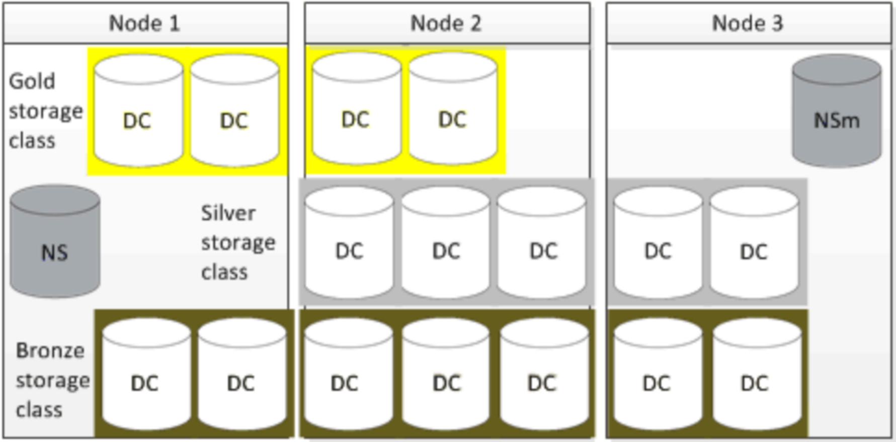

StorageClass这个API对象可以自动创建PV的机制,即:Dynamic Provisioning

StorageClass对象会定义下面两部分内容:

- PV的属性.比如,存储类型,Volume的大小等
- 创建这种PV需要用到的存储插件

##### StorageClass 对象[ ](https://kubernetes.io/zh-cn/docs/concepts/storage/storage-classes/#storageclass-objects)

每个 StorageClass 都包含 `provisioner`、`parameters` 和 `reclaimPolicy` 字段， 这些字段会在 StorageClass 需要动态制备 PersistentVolume 以满足 PersistentVolumeClaim (PVC) 时使用到。

StorageClass 对象的命名很重要，用户使用这个命名来请求生成一个特定的类。 当创建 StorageClass 对象时，管理员设置 StorageClass 对象的命名和其他参数。

范例：

```yaml
apiVersion: storage.k8s.io/v1  # 指定 API 版本
kind: StorageClass  # 资源类型，表示存储类
metadata:
  name: standard  # 存储类名称
provisioner: kubernetes.io/aws-ebs  # 由 Kubernetes 使用的存储提供者 (AWS EBS)
parameters:
  type: gp2  # AWS EBS 卷的类型 (可选 gp2, gp3, io1, io2)
reclaimPolicy: Retain  # PVC 删除后，PV 保留 (可选 Retain, Delete, Recycle)
allowVolumeExpansion: true  # 允许 PVC 扩容
mountOptions:
  - debug  # 允许存储在挂载时启用调试模式
volumeBindingMode: Immediate | WaitForFirstConsumer  # 立即绑定 | 延迟绑定模式，仅当 Pod 需要时才分配存储

#管理员可以为没有申请绑定到特定 StorageClass 的 PVC 指定一个默认的存储类
apiVersion: v1
kind: PersistentVolumeClaim
metadata:
  name: myclaim  # PVC 的名称
spec:
  accessModes:
    - ReadWriteOnce  # 访问模式，仅允许单个节点挂载 (适用于 AWS EBS, GCE PD)
  volumeMode: Filesystem  # 存储卷模式 (可选 Filesystem 或 Block)
  resources:
    requests:
      storage: 8Gi  # 申请 8GB 存储空间
  storageClassName: standard  # 绑定到 StorageClass "standard"
  selector:
    matchLabels:
      release: "stable"  # 匹配 PV 具有 label "release=stable"
    matchExpressions:
      - key: environment
        operator: In
        values: [dev]  # 只匹配 environment=dev 的 PV
      #- {key: environment, operator: In, values: [dev]}
```

##### 默认 StorageClass

你可以将某个 StorageClass 标记为集群的默认存储类。 关于如何设置默认的 StorageClass， 请参见[更改默认 StorageClass](https://kubernetes.io/zh-cn/docs/tasks/administer-cluster/change-default-storage-class/)。

当一个 PVC 没有指定 `storageClassName` 时，会使用默认的 StorageClass。

如果你在集群中的多个 StorageClass 上将 [`storageclass.kubernetes.io/is-default-class`](https://kubernetes.io/zh-cn/docs/reference/labels-annotations-taints/#storageclass-kubernetes-io-is-default-class) 注解设置为 true，然后创建一个未设置 `storageClassName` 的 PersistentVolumeClaim (PVC)， Kubernetes 将使用最近创建的默认 StorageClass。

**说明：**

你应该尝试在集群中只将一个 StorageClass 标记为默认的存储类。 Kubernetes 允许你拥有多个默认 StorageClass 的原因是为了无缝迁移。

你可以在创建新的 PVC 时不指定 `storageClassName`，即使在集群中没有默认 StorageClass 的情况下也可以这样做。 在这种情况下，新的 PVC 会按照你定义的方式进行创建，并且该 PVC 的 `storageClassName` 将保持不设置， 直到有可用的默认 StorageClass 为止。

你可以拥有一个没有任何默认 StorageClass 的集群。 如果你没有将任何 StorageClass 标记为默认（例如，云服务提供商还没有为你设置默认值），那么 Kubernetes 将无法为需要 StorageClass 的 PersistentVolumeClaim 应用默认值。

当默认 StorageClass 变得可用时，控制平面会查找所有未设置 `storageClassName` 的现有 PVC。 对于那些 `storageClassName` 值为空或没有此键的 PVC，控制平面将更新它们， 将 `storageClassName` 设置为匹配新的默认 StorageClass。如果你有一个现成的 PVC，其 `storageClassName` 为 `""`， 而你配置了默认的 StorageClass，那么该 PVC 将不会被更新。

（当默认的 StorageClass 存在时）为了继续绑定到 `storageClassName` 为 `""` 的 PV， 你需要将关联 PVC 的 `storageClassName` 设置为 `""`。

每个 StorageClass 都有一个制备器（Provisioner），用于提供存储驱动，用来决定使用哪个卷插件制备 PV。 该字段必须指定。

| 卷插件         | 内置制备器 |                           配置示例                           |
| :------------- | :--------: | :----------------------------------------------------------: |
| AzureFile      |     ✓      | [Azure File](https://kubernetes.io/zh-cn/docs/concepts/storage/storage-classes/#azure-file) |
| CephFS         |     -      |                              -                               |
| FC             |     -      |                              -                               |
| FlexVolume     |     -      |                              -                               |
| iSCSI          |     -      |                              -                               |
| Local          |     -      | [Local](https://kubernetes.io/zh-cn/docs/concepts/storage/storage-classes/#local) |
| NFS            |     -      | [NFS](https://kubernetes.io/zh-cn/docs/concepts/storage/storage-classes/#nfs) |
| PortworxVolume |     ✓      | [Portworx Volume](https://kubernetes.io/zh-cn/docs/concepts/storage/storage-classes/#portworx-volume) |
| RBD            |     ✓      | [Ceph RBD](https://kubernetes.io/zh-cn/docs/concepts/storage/storage-classes/#ceph-rbd) |
| VsphereVolume  |     ✓      | [vSphere](https://kubernetes.io/zh-cn/docs/concepts/storage/storage-classes/#vsphere) |


#### 范例：基于 StorageClass 属性字段实现PV和PVC的绑定

创建三个pv，两个5G容量，ReadWriteMany（RWX），和一个1G容量，ReadWriteOnce（RWO）的PV，第二个5G容量的pv添加存储类名称`storageClassName: hzk`

创建一个PVC，申请 3Gi 存储，允许多个 Pod 读写，添加存储类的名称`storageClassName: hzk`

```bash
[root@master1 storage]#vim storage-mult-pv.yaml
apiVersion: v1
kind: PersistentVolume
metadata:
  name: pv-nfs-1  # 第一个 NFS PV
spec:
  capacity:
    storage: 5Gi  # PV 容量
  volumeMode: Filesystem
  accessModes:
    - ReadWriteMany  # 多个 Pod 可以同时读写
  persistentVolumeReclaimPolicy: Retain  # 回收策略，保留数据
  nfs:
    path: "/nfsdata/data1"  # NFS 共享目录
    server: nfs.kang.org  # NFS 服务器地址
---
apiVersion: v1
kind: PersistentVolume
metadata:
  name: pv-nfs-2  # 第二个 NFS PV
spec:
  storageClassName: hzk		#添加存储类名称	
  capacity:
    storage: 5Gi
  volumeMode: Filesystem
  accessModes:
    - ReadWriteMany  # 多个 Pod 可以同时读写
  persistentVolumeReclaimPolicy: Retain
  nfs:
    path: "/nfsdata/data2"
    server: nfs.kang.org
---
apiVersion: v1
kind: PersistentVolume
metadata:
  name: pv-nfs-3  # 第三个 NFS PV
spec:
  capacity:
    storage: 1Gi
  volumeMode: Filesystem
  accessModes:
    - ReadWriteOnce  # 只能单个 Pod 读写
  persistentVolumeReclaimPolicy: Retain
  nfs:
    path: "/nfsdata/data3"
    server: nfs.kang.org

[root@master1 storage]#vim storage-mult-pvc.yaml

apiVersion: v1
kind: PersistentVolumeClaim
metadata:
  name: pvc-demo-1  # PVC 名称
  namespace: default  # 所属命名空间
spec:
  storageClassName: hzk		#添加存储类的名称，必须和上面pv设置的一致
  accessModes:
    - ReadWriteMany  # 允许多个 Pod 读写
  volumeMode: Filesystem  # 使用文件系统模式
  resources:
    requests:
      storage: 3Gi  # 申请 3Gi 存储

```

```bash
[root@master1 storage]#kubectl apply -f storage-mult-pvc.yaml -f storage-mult-pv.yaml
persistentvolumeclaim/pvc-demo-1 unchanged
persistentvolume/pv-nfs-1 created
persistentvolume/pv-nfs-2 created
persistentvolume/pv-nfs-3 created

[root@master1 storage]#kubectl get pv
NAME       CAPACITY   ACCESS MODES   RECLAIM POLICY   STATUS      CLAIM                STORAGECLASS   VOLUMEATTRIBUTESCLASS   REASON   AGE
pv-nfs-1   5Gi        RWX            Retain           Available                                       <unset>                          14s
pv-nfs-2   5Gi        RWX            Retain           Bound       default/pvc-demo-1   hzk            <unset>                          14s
pv-nfs-3   1Gi        RWO            Retain           Available                                       <unset>                          14s
[root@master1 storage]#kubectl get pvc
NAME         STATUS   VOLUME     CAPACITY   ACCESS MODES   STORAGECLASS   VOLUMEATTRIBUTESCLASS   AGE
pvc-demo-1   Bound    pv-nfs-2   5Gi        RWX            hzk            <unset>                 76s

#查看pvc绑定到同一个存储类名称的pv上面

[root@master1 storage]#kubectl get sc
No resources found
```


### Local Volume

```
https://kubernetes.io/zh-cn/docs/concepts/storage/storage-classes/#local
https://kubernetes.io/zh-cn/docs/concepts/storage/volumes/#local
```

#### hostPath 存在的问题

过去我们经常会通过hostPath volume让Pod能够使用本地存储，将Node文件系统中的文件或者目录挂载到容器内，但是hostPath volume的使用是很不方便的，并不适合在生产环境中使用。

- 由于集群内每个节点的差异化，要使用hostPath Volume，我们需要通过NodeSelector等方式进行精确调度，比较繁琐。
- 注意DirectoryOrCreate和FileOrCreate两种类型的hostPath，当Node上没有对应的File/Directory时，你需要保证kubelet有在 Node上Create File/Directory的权限。
- 另外，如果Node上的文件或目录是由root创建的，挂载到容器内之后，你通常还要保证容器内进程有权限对该文件或者目录进行写入，比如你需要以root用户启动进程并运行于privileged容器，或者你需要事先修改好Node上的文件权限配置。
- Scheduler并不会考虑hostPath volume的大小，hostPath也不能申明需要的storagesize，这样调度时存储的考虑，就需要人为检查并保证。

#### Local PV 使用场景

Local Persistent Volume 并不适用于所有应用。它的适用范围非常固定，比如：高优先级的系统应用，需要在多个不同节点上存储数据，而且对 I/O 要求较高。Kubernetes 直接使用宿主机的本地磁盘目录，来持久化存储容器的数据。它的读写性能相比于大多数远程存储来说，要好得多，尤其是 SSD 盘。

典型的应用包括：分布式数据存储比如 MongoDB，分布式文件系统比如 GlusterFS、Ceph 等，以及需要在本地磁盘上进行大量数据缓存的分布式应用，其次使用 Local Persistent Volume 的应用必须具备数据备份和恢复的能力，允许你把这些数据定时备份在其他位置。

#### Local PV 实现

LocalPV 的实现可以理解为我们前面使用的 hostpath 加上 nodeAffinity ，比如：在宿主机 NodeA 上提前创建好目录 ，然后在定义 Pod 时添加 nodeAffinity=NodeA ，指定 Pod 在我们提前创建好目录的主机上运行。但是我们绝不应该把一个宿主机上的目录当作 PV 使用，因为本地目录的磁盘随时都可能被应用写满，甚至造成整个宿主机宕机。而且，不同的本地目录之间也缺乏哪怕最基础的 I/O 隔离机制。所以，一个 Local Persistent Volume 对应的存储介质，一定是一块额外挂载在宿主机的磁盘或者块设备（“额外” 的意思是，它不应该是宿主机根目录所使用的主硬盘）。这个原则，我们可以称为 “一个PV 一块盘”。

#### Local PV 和常规 PV 的区别

**local Volume 默认不支持动态配置，只能用作静态创建的持久卷。但可以采有第三方方案实现动态配置**

#### Local PV 优势

- 支持指定PV的存储大小，而HostPath不支持
- Pod调度至哪个节点由PV所在的节点决定，HostPath是由Pod决定HostPath所在节点
- 由存储管理员指定PV所在的节点做为Pod运行的节点，而非由用户决定

#### 创建 Local PV

**用 Local 卷流程**

- 创建PV，使用 nodeAffinity 指定绑定的节点提供存储
- 创建 PVC，绑定PV的存储条件
- 创建Pod，引用前面的PVC和PV实现Local 存储

下面是一个使用 `local` 卷和 `nodeAffinity` 的持久卷示例：

```yaml
# StorageClass 配置：定义本地存储，不支持动态创建 PV
apiVersion: storage.k8s.io/v1
kind: StorageClass
metadata:
  name: local-storage  # 存储类名称
provisioner: kubernetes.io/no-provisioner  # 本地存储，无自动 provisioner
volumeBindingMode: WaitForFirstConsumer  # 延迟绑定，仅当 Pod 需要时才分配存储
---
# PersistentVolume (PV) 配置：手动创建本地 PV
apiVersion: v1
kind: PersistentVolume
metadata:
  name: example-pv  # PV 名称
spec:
  capacity:
    storage: 100Gi  # PV 提供的存储容量
  volumeMode: Filesystem  # 使用文件系统存储模式
  accessModes:
    - ReadWriteOnce  # 仅允许单节点读写
  persistentVolumeReclaimPolicy: Delete  # 当 PVC 删除时，PV 也会被删除
  storageClassName: local-storage  # 关联的 StorageClass
  local:
    path: /mnt/disks/ssd1  # 物理存储路径，Pod 只能在这个节点访问
  nodeAffinity:  # 仅允许指定的节点使用该 PV
    required:
      nodeSelectorTerms:
        - matchExpressions:
            - key: kubernetes.io/hostname
              operator: In
              values:
                - example-node  # 该 PV 只能绑定到 "example-node"
---
# PersistentVolumeClaim (PVC) 配置：申请 10Gi 存储
apiVersion: v1
kind: PersistentVolumeClaim
metadata:
  name: local-pvc  # PVC 名称
spec:
  accessModes:
    - ReadWriteOnce  # 仅允许单节点读写
  resources:
    requests:
      storage: 10Gi  # 申请 10GB 存储
  storageClassName: local-storage  # 绑定到 local-storage StorageClass
  # selector:  # 可选，手动匹配 PV
  #   matchLabels:
  #     pv: example-pv
```

使用 local 卷时，你需要设置 PersistentVolume 对象的 nodeAffinity 字段。 Kubernetes 调度器使用 PersistentVolume 的 nodeAffinity 信息来将使用 local 卷的 Pod 调度到正确的节点。

PersistentVolume 对象的 volumeMode 字段可被设置为 "Block" （而不是默认值 "Filesystem"），以将 local 卷作为原始块设备暴露出来。

使用 local 卷时，建议创建一个 StorageClass 并将其 volumeBindingMode 设置为WaitForFirstConsumer 。要了解更多详细信息，请参考 local StorageClass 示例。 延迟卷绑定的操作可以确保 Kubernetes 在为 PersistentVolumeClaim 作出绑定决策时，会评估 Pod 可能具有的其他节点约束，例如：如节点资源需求、节点选择器、Pod 亲和性和 Pod 反亲和性。

#### 范例：基于 StorageClass 实现 Local 卷

```yaml
#事先在PV所在的目标节点上准备目录，对于本地存储Kubernetes本身并不会自动创建路径，这是因为Kubernetes不能控制节点上的本地存储，因此无法自动创建路径

[root@node3 ~]#mkdir -p /data/mysql
[root@master1 storage]#vim storage-sc-local-pc-pvc-mysql-pod.yaml

---
# StorageClass 配置：定义本地存储，不支持动态创建 PV
apiVersion: storage.k8s.io/v1
kind: StorageClass
metadata:
  name: local-storage  # 存储类名称
provisioner: kubernetes.io/no-provisioner  # 不使用动态存储，必须手动创建 PV
volumeBindingMode: WaitForFirstConsumer  # 延迟绑定，只有 Pod 运行时才分配 PV
---
# PersistentVolume (PV) 配置：手动创建本地 PV
apiVersion: v1
kind: PersistentVolume
metadata:
  name: pv-sc-local  # PV 名称
spec:
  capacity:
    storage: 100Gi  # PV 提供的存储容量
  volumeMode: Filesystem  # 使用文件系统存储模式
  accessModes:
    - ReadWriteOnce  # 仅允许单节点读写
  persistentVolumeReclaimPolicy: Retain  # 保留 PV，防止数据丢失
  storageClassName: local-storage  # 关联 StorageClass
  local:
    path: /data/mysql  # 物理存储路径，Pod 只能在该节点访问
  nodeAffinity:  # 限制 PV 只能绑定到特定节点
    required:
      nodeSelectorTerms:
        - matchExpressions:
            - key: kubernetes.io/hostname
              operator: In
              values:
                - node3.kang.org  # PV 只能在 node3.kang.org 这个节点上
---
# PersistentVolumeClaim (PVC) 配置：申请 100Gi 存储
apiVersion: v1
kind: PersistentVolumeClaim
metadata:
  name: pvc-sc-local  # PVC 名称
spec:
  storageClassName: local-storage  # 绑定到 local-storage StorageClass
  accessModes:
    - ReadWriteOnce  # 仅允许单节点读写
  resources:
    requests:
      storage: 100Gi  # 申请 100GB 存储
```

```bash
#只创建pv、pvc和StorageClass，不创建MySQL Deployment，不会直接绑定
[root@master1 storage]#kubectl get pv
NAME          CAPACITY   ACCESS MODES   RECLAIM POLICY   STATUS      CLAIM   STORAGECLASS    VOLUMEATTRIBUTESCLASS   REASON   AGE
pv-sc-local   100Gi      RWO            Retain           Available           local-storage   <unset>                          6s
[root@master1 storage]#kubectl get pvc
NAME           STATUS    VOLUME   CAPACITY   ACCESS MODES   STORAGECLASS    VOLUMEATTRIBUTESCLASS   AGE
pvc-sc-local   Pending                                      local-storage   <unset>                 8s
```

```yaml
#配置文件里面追加 pod 的配置
[root@master1 storage]#vim storage-sc-local-pc-pvc-mysql-pod.yaml

---
# MySQL Deployment 配置
apiVersion: apps/v1
kind: Deployment
metadata:
  name: mysql  # 部署名称
spec:
  selector:
    matchLabels:
      app: mysql  # 选择器匹配 Pod
  strategy:
    type: Recreate  # 采用 Recreate 策略，确保 MySQL 不会有多个实例
  template:
    metadata:
      labels:
        app: mysql  # Pod 具有 app=mysql 标签
    spec:
      containers:
        - name: mysql
          image: registry.cn-beijing.aliyuncs.com/wangxiaochun/mysql:8.0.29-oracle
          env:
            # 在生产环境中，建议使用 Secret 存储密码
            - name: MYSQL_ROOT_PASSWORD
              value: "123456"
          ports:
            - containerPort: 3306
              name: mysql
          volumeMounts:
            - name: mysql-persistent-storage
              mountPath: /var/lib/mysql  # MySQL 数据存储路径
      volumes:
        - name: mysql-persistent-storage
          persistentVolumeClaim:
            claimName: pvc-sc-local  # 绑定 PVC
```

```bash
[root@master1 storage]#kubectl apply -f storage-sc-local-pc-pvc-mysql-pod.yaml
storageclass.storage.k8s.io/local-storage created
persistentvolume/pv-sc-local created
persistentvolumeclaim/pvc-sc-local created
deployment.apps/mysql created
[root@master1 storage]#kubectl get pod
NAME                     READY   STATUS              RESTARTS   AGE
mysql-6bf485d5cd-l8p6t   0/1     ContainerCreating   0          7s
[root@master1 storage]#kubectl get pv
NAME          CAPACITY   ACCESS MODES   RECLAIM POLICY   STATUS   CLAIM                  STORAGECLASS    VOLUMEATTRIBUTESCLASS   REASON   AGE
pv-sc-local   100Gi      RWO            Retain           Bound    default/pvc-sc-local   local-storage   <unset>                          10s
[root@master1 storage]#kubectl get pvc
NAME           STATUS   VOLUME        CAPACITY   ACCESS MODES   STORAGECLASS    VOLUMEATTRIBUTESCLASS   AGE
pvc-sc-local   Bound    pv-sc-local   100Gi      RWO            local-storage   <unset>                 12s
[root@master1 storage]#kubectl get sc
NAME            PROVISIONER                    RECLAIMPOLICY   VOLUMEBINDINGMODE      ALLOWVOLUMEEXPANSION   AGE
local-storage   kubernetes.io/no-provisioner   Delete          WaitForFirstConsumer   false                  15s
```

范例：

```yaml
#事先在PV所在的目标节点上准备目录，对于本地存储Kubernetes本身并不会自动创建路径，这是因为Kubernetes不能控制节点上的本地存储，因此无法自动创建路径

[root@node2 ~]#mkdir -p /data/www
[root@node2 ~]#ls /data/
www

#准备清单文件
#kubernetes内置了Local的置备器，所以下面StorageClass资源可以不创建


---
# StorageClass 配置：定义本地存储，不支持动态创建 PV
apiVersion: storage.k8s.io/v1
kind: StorageClass
metadata:
  name: local-storage  # 存储类名称
provisioner: kubernetes.io/no-provisioner  # 不使用动态存储，必须手动创建 PV
volumeBindingMode: WaitForFirstConsumer  # 延迟绑定，只有 Pod 运行时才分配 PV
---
# PersistentVolume (PV) 配置：手动创建本地 PV
apiVersion: v1
kind: PersistentVolume
metadata:
  name: pv-sc-local  # PV 名称
spec:
  capacity:
    storage: 100Gi  # PV 提供的存储容量
  volumeMode: Filesystem  # 使用文件系统存储模式
  accessModes:
    - ReadWriteOnce  # 仅允许单节点读写
  persistentVolumeReclaimPolicy: Retain  # 防止误删数据，避免 PV 失效
  storageClassName: local-storage  # 关联 StorageClass
  local:
    path: /data/www/  # 物理存储路径，Pod 只能在该节点访问
  nodeAffinity:  # 限制 PV 只能绑定到特定节点
    required:
      nodeSelectorTerms:
        - matchExpressions:
            - key: kubernetes.io/hostname
              operator: In
              values:
                - node2.kang.org  # PV 只能在 node2.kang.org 这个节点上
---
# PersistentVolumeClaim (PVC) 配置：申请 100Mi 存储
apiVersion: v1
kind: PersistentVolumeClaim
metadata:
  name: pvc-sc-local  # PVC 名称
spec:
  storageClassName: local-storage  # 绑定到 local-storage StorageClass
  accessModes:
    - ReadWriteOnce  # 仅允许单节点读写
  resources:
    requests:
      storage: 100Mi  # 申请 100Mi 存储 (但 PV 提供 100Gi，可能导致 PVC 处于 Pending)
---
# Pod 配置：测试使用 PVC 挂载存储
apiVersion: v1
kind: Pod
metadata:
  name: pod-sc-local-demo  # Pod 名称
spec:
  restartPolicy: Never  # 仅运行一次，不自动重启
  containers:
    - name: pod-sc-local-demo
      image: registry.cn-beijing.aliyuncs.com/wangxiaochun/nginx:1.20.0
      volumeMounts:
        - name: pvc-sc-local
          mountPath: "/usr/share/nginx/html/"  # 挂载到 Nginx 静态页面目录
  volumes:
    - name: pvc-sc-local
      persistentVolumeClaim:
        claimName: pvc-sc-local  # 绑定 PVC
```

```bash
[root@master1 storage]#kubectl apply -f storage-sc-local-pc-pvc-pod.yaml
storageclass.storage.k8s.io/local-storage created
persistentvolume/pv-sc-local created
persistentvolumeclaim/pvc-sc-local created
pod/pod-sc-local-demo created

[root@master1 storage]#kubectl get pv
NAME          CAPACITY   ACCESS MODES   RECLAIM POLICY   STATUS   CLAIM                  STORAGECLASS    VOLUMEATTRIBUTESCLASS   REASON   AGE
pv-sc-local   100Gi      RWO            Retain           Bound    default/pvc-sc-local   local-storage   <unset>                          26s
[root@master1 storage]#kubectl get pvc
NAME           STATUS   VOLUME        CAPACITY   ACCESS MODES   STORAGECLASS    VOLUMEATTRIBUTESCLASS   AGE
pvc-sc-local   Bound    pv-sc-local   100Gi      RWO            local-storage   <unset>                 28s
[root@master1 storage]#kubectl get sc
NAME            PROVISIONER                    RECLAIMPOLICY   VOLUMEBINDINGMODE      ALLOWVOLUMEEXPANSION   AGE
local-storage   kubernetes.io/no-provisioner   Delete          WaitForFirstConsumer   false                  31s
[root@master1 storage]#kubectl get pod
NAME                READY   STATUS    RESTARTS   AGE
pod-sc-local-demo   1/1     Running   0          35s
[root@master1 storage]#kubectl get pod -o wide 
NAME                READY   STATUS    RESTARTS   AGE   IP             NODE             NOMINATED NODE   READINESS GATES
pod-sc-local-demo   1/1     Running   0          77s   10.244.4.187   node2.kang.org   <none>           <none>
[root@master1 storage]#curl 10.244.4.187
<html>
<head><title>403 Forbidden</title></head>
<body>
<center><h1>403 Forbidden</h1></center>
<hr><center>nginx/1.20.0</center>
</body>
</html>

[root@node2 ~]#hostname > /data/www/index.html
[root@node2 ~]#cat /data/www/index.html
node2.kang.org

[root@master1 storage]#curl 10.244.4.187
node2.kang.org
```

### NFS StorageClass

NFS的存储制备器方案

NFS 的自动配置程序 Provisioner 可以通过不同的项目实现,比如

```
https://kubernetes.io/zh-cn/docs/concepts/storage/storage-classes/#nfs
```

- csi-driver-nfs

  ```
  https://github.com/kubernetes-csi/csi-driver-nfs
  ```

- nfs-client-provisioner

  nfs-client-provisioner 是一个自动配置卷程序，它使用现有的和已配置的 NFS 服务器来支持通过PVC动态配置 PV

  nfs-client-provisioner 目前已经不提供更新，nfs-client-provisioner 的 Github 仓库当前已经迁移到 NFS-Subdir-External-Provisioner的仓库

  ```
  https://github.com/kubernetes-retired/external-storage/tree/master/nfs-client
  https://github.com/kubernetes-sigs/sig-storage-lib-external-provisioner
  ```

- NFS-Subdir-External-Provisioner

  此组件是由Kubernetes SIGs 社区开发,也是Kubernetes官方推荐实现是对 nfs-client-provisioner 组件的扩展

  ```
  https://kubernetes.io/docs/concepts/storage/storage-classes/#nfs
  ```

  ```
  https://github.com/kubernetes-sigs/nfs-subdir-external-provisioner
  https://github.com/kubernetes-sigs/sig-storage-lib-external-provisioner
  ```

  NFS-Subdir-External-Provisioner 是一个自动配置卷程序，可以在 NFS 服务器上通过PVC动态创建和配置 Kubernetes 持久卷

  PV命名规则如下

  ```
  自动创建的 PV 以${namespace}-${pvcName}-${pvName} 命名格式创建在 NFS 服务器上的共享数据目录中
  当这个 PV 被回收后会以 archieved-${namespace}-${pvcName}-${pvName} 命名格式存在NFS 服务器中
  ```

- NFS Ganesha server and external provisioner

  ```
  https://github.com/kubernetes-sigs/nfs-ganesha-server-and-external-provisioner
  ```

  `nfs-ganesha-server-and-external-provisioner` 是 Kubernetes 1.14+ 的树外动态配置程序。您可以使用它快速轻松地部署几乎可以在任何地方使用的共享存储。

#### 案例: 基于 nfs-subdir-external-provisioner 创建 NFS 共享存储的storageclass

```
https://github.com/kubernetes-sigs/nfs-subdir-external-provisioner
https://github.com/kubernetes-sigs/nfs-subdir-external-provisioner/tree/master/deploy
https://github.com/kubernetes-sigs/nfs-subdir-external-provisioner?tab=readme-ov-file#manually
```

创建 NFS 共享存储的 storageclass步骤如下：

- 创建 NFS 共享
- 创建 Service Account 并授予管控NFS provisioner在k8s集群中运行的权限
- 部署 NFS-Subdir-External-Provisioner 对应的 Deployment
- 创建 StorageClass 负责建立PVC并调用NFS provisioner进行预定的工作,并让PV与PVC建立联系
- 创建 PVC 时自动调用SC创建PV
- 创建Pod 使用 PVC

**创建 NFS 服务**

```bash
[root@ubuntu2204 ~]#apt update && apt -y install nfs-server
[root@ubuntu2204 ~]#mkdir -p /data/sc-nfs
[root@ubuntu2204 ~]#echo '/data/sc-nfs *(rw,no_root_squash)' >> /etc/exports 
[root@ubuntu2204 ~]#cat /etc/exports
# /etc/exports: the access control list for filesystems which may be exported
#		to NFS clients.  See exports(5).
#
# Example for NFSv2 and NFSv3:
# /srv/homes       hostname1(rw,sync,no_subtree_check) hostname2(ro,sync,no_subtree_check)
#
# Example for NFSv4:
# /srv/nfs4        gss/krb5i(rw,sync,fsid=0,crossmnt,no_subtree_check)
# /srv/nfs4/homes  gss/krb5i(rw,sync,no_subtree_check)
#
#/nfsdata *(rw,all_squash,anonuid=0,anongid=0)
/data/sc-nfs *(rw,no_root_squash)

[root@ubuntu2204 ~]#exportfs -r
[root@ubuntu2204 ~]#exportfs -v
/data/sc-nfs  	<world>(sync,wdelay,hide,no_subtree_check,sec=sys,rw,secure,no_root_squash,no_all_squash)

#在所有node节点安装NFS客户端
apt update && apt -y install nfs-common 或者 nfs-client
```

**创建 ServiceAccount 并授权**

```yaml
#创建名称空间
[root@master1 storageclass]#vim namespace.yaml
# namespace.yaml
apiVersion: v1
kind: Namespace
metadata:
  name: sc-nfs
```

```yaml
#创建权限分配
[root@master1 storageclass]#vim rbac.yaml
apiVersion: v1
kind: ServiceAccount
metadata:
  name: nfs-client-provisioner
  # replace with namespace where provisioner is deployed
  namespace: sc-nfs
---
kind: ClusterRole
apiVersion: rbac.authorization.k8s.io/v1
metadata:
  name: nfs-client-provisioner-runner
rules:
  - apiGroups: [""]
    resources: ["nodes"]
    verbs: ["get", "list", "watch"]
  - apiGroups: [""]
    resources: ["persistentvolumes"]
    verbs: ["get", "list", "watch", "create", "delete"]
  - apiGroups: [""]
    resources: ["persistentvolumeclaims"]
    verbs: ["get", "list", "watch", "update"]
  - apiGroups: ["storage.k8s.io"]
    resources: ["storageclasses"]
    verbs: ["get", "list", "watch"]
  - apiGroups: [""]
    resources: ["events"]
    verbs: ["create", "update", "patch"]
---
kind: ClusterRoleBinding
apiVersion: rbac.authorization.k8s.io/v1
metadata:
  name: run-nfs-client-provisioner
subjects:
  - kind: ServiceAccount
    name: nfs-client-provisioner
    # replace with namespace where provisioner is deployed
    namespace: sc-nfs
roleRef:
  kind: ClusterRole
  name: nfs-client-provisioner-runner
  apiGroup: rbac.authorization.k8s.io
---
kind: Role
apiVersion: rbac.authorization.k8s.io/v1
metadata:
  name: leader-locking-nfs-client-provisioner
  # replace with namespace where provisioner is deployed
  namespace: sc-nfs
rules:
  - apiGroups: [""]
    resources: ["endpoints"]
    verbs: ["get", "list", "watch", "create", "update", "patch"]
---
kind: RoleBinding
apiVersion: rbac.authorization.k8s.io/v1
metadata:
  name: leader-locking-nfs-client-provisioner
  # replace with namespace where provisioner is deployed
  namespace: sc-nfs
subjects:
  - kind: ServiceAccount
    name: nfs-client-provisioner
    # replace with namespace where provisioner is deployed
    namespace: sc-nfs
roleRef:
  kind: Role
  name: leader-locking-nfs-client-provisioner
  apiGroup: rbac.authorization.k8s.io
```

```bash
[root@master1 storageclass]#kubectl apply -f namespace.yaml 
namespace/sc-nfs created
[root@master1 storageclass]#kubectl apply -f rbac.yaml 
serviceaccount/nfs-client-provisioner created
clusterrole.rbac.authorization.k8s.io/nfs-client-provisioner-runner created
clusterrolebinding.rbac.authorization.k8s.io/run-nfs-client-provisioner created
role.rbac.authorization.k8s.io/leader-locking-nfs-client-provisioner created
rolebinding.rbac.authorization.k8s.io/leader-locking-nfs-client-provisioner created
```

**部署 NFS-Subdir-External-Provisioner 对应的 Deployment**

```yaml
#提定名空间
[root@master1 ~]#vim nfs-client-deployment.yaml

apiVersion: apps/v1
kind: Deployment
metadata:
  name: nfs-client-provisioner
  labels:
    app: nfs-client-provisioner
  # replace with namespace where provisioner is deployed
  namespace: sc-nfs
spec:
  replicas: 1
  strategy:
    type: Recreate
  selector:
    matchLabels:
      app: nfs-client-provisioner
  template:
    metadata:
      labels:
        app: nfs-client-provisioner
    spec:
      serviceAccountName: nfs-client-provisioner
      containers:
        - name: nfs-client-provisioner
          #image: registry.k8s.io/sig-storage/nfs-subdir-external-provisioner:v4.0.2
          image: registry.cn-beijing.aliyuncs.com/wangxiaochun/nfs-subdir-external-provisioner:v4.0.2
          imagePullPolicy: IfNotPresent
          volumeMounts:
            - name: nfs-client-root
              mountPath: /persistentvolumes
          env:
            - name: PROVISIONER_NAME
              value: k8s-sigs.io/nfs-subdir-external-provisioner	# 名称确保与 nfs-StorageClass.yaml文件中的provisioner名称保持一致
            - name: NFS_SERVER
              value: nfs.kang.org	# 指定NFS服务器地址,如果是域名,需要宿主机节点能解析此域名
            - name: NFS_PATH
              value: /data/sc-nfs	# NFS 共享目录
      volumes:
        - name: nfs-client-root
          nfs:
            server: nfs.kang.org	# 指定NFS服务器地址,如果是域名,需要宿主机节点能解析此域名
            path: /data/sc-nfs 	# NFS 共享目录
```

```bash
[root@master1 storageclass]#kubectl apply -f nfs-client-deployment.yaml 
deployment.apps/nfs-client-provisioner created
[root@master1 storageclass]#kubectl get deployments.apps -n sc-nfs 
NAME                     READY   UP-TO-DATE   AVAILABLE   AGE
nfs-client-provisioner   1/1     1            1           12s
[root@master1 storageclass]#kubectl get pod -n sc-nfs 
NAME                                     READY   STATUS    RESTARTS   AGE
nfs-client-provisioner-99794c6bb-jr9nm   1/1     Running   0          30s

#注意:如果失败,检查是否worker节点安装了nfs-client
```

**创建 NFS 资源的 StorageClass**

```yaml
[root@master1 ~]#vim nfs-StorageClass.yaml
apiVersion: storage.k8s.io/v1
kind: StorageClass
metadata:
  name: sc-nfs
  annotations:
    storageclass.kubernetes.io/is-default-class: "false" 	# 是否设置为默认的
provisioner: k8s-sigs.io/nfs-subdir-external-provisioner 	#名称确保与 nfs-client-deployment.yaml文件中的PROVISIONER_NAME.value名称保持一致
parameters:
  archiveOnDelete: "true"		# 设置为"false"时删除PVC不会保留数据,"true"则保留数据,基于安全原因建议设为"true"
```

```bash
[root@master1 storageclass]#kubectl apply -f nfs-StorageClass.yaml
[root@master1 storageclass]#kubectl get sc
NAME     PROVISIONER                                   RECLAIMPOLICY   VOLUMEBINDINGMODE   ALLOWVOLUMEEXPANSION   AGE
sc-nfs   k8s-sigs.io/nfs-subdir-external-provisioner   Delete          Immediate           false                  11s
```

##### 范例：运用NFS StorageClass创建pod

**创建 PVC**

```yaml
[root@master1 storageclass]#vim pvc.yaml

apiVersion: v1
kind: PersistentVolumeClaim
metadata:
  name: pvc-nfs-sc
spec:
  storageClassName: sc-nfs 	#需要和前面创建的storageClass名称相同
  accessModes: ["ReadWriteMany","ReadOnlyMany"]
  resources:
    requests:
      storage: 100Mi
```

```bash
[root@master1 storageclass]#kubectl apply -f pvc.yaml 
persistentvolumeclaim/pvc-nfs-sc created
[root@master1 storageclass]#kubectl get pvc
NAME         STATUS   VOLUME                                     CAPACITY   ACCESS MODES   STORAGECLASS   VOLUMEATTRIBUTESCLASS   AGE
pvc-nfs-sc   Bound    pvc-0d244ceb-b4cc-4593-9608-311c920288d2   100Mi      ROX,RWX        sc-nfs         <unset>                 11s

#自动生成pv
[root@master1 storageclass]#kubectl get pv
NAME                                       CAPACITY   ACCESS MODES   RECLAIM POLICY   STATUS   CLAIM                STORAGECLASS   VOLUMEATTRIBUTESCLASS   REASON   AGE
pvc-0d244ceb-b4cc-4593-9608-311c920288d2   100Mi      ROX,RWX        Delete           Bound    default/pvc-nfs-sc   sc-nfs         <unset>                          39s

#查看nfs服务器
[root@ubuntu2204 ~]#ls /data/sc-nfs/
default-pvc-nfs-sc-pvc-0d244ceb-b4cc-4593-9608-311c920288d2

```

**创建 Pod**

```yaml
[root@master1 storageclass]#vim pod-test.yaml

apiVersion: v1
kind: Pod
metadata:
  name: pod-nfs-sc-test
spec:
  containers:
  - name: pod-nfs-sc-test
    image: registry.cn-beijing.aliyuncs.com/wangxiaochun/nginx:1.20.0
    volumeMounts:
    - name: nfs-pvc
      mountPath: "/usr/share/nginx/html/"
  restartPolicy: Never
  volumes:
  - name: nfs-pvc
    persistentVolumeClaim:
      claimName: pvc-nfs-sc # 指定前面创建的 PVC 名称
```

```bash
#注意这里pvc和pod必须为同一个名称空间
[root@master1 storageclass]#kubectl apply -f pod-test.yaml
pod/pod-nfs-sc-test created
[root@master1 storageclass]#kubectl get pod -o wide 
NAME              READY   STATUS    RESTARTS   AGE   IP             NODE             NOMINATED NODE   READINESS GATES
pod-nfs-sc-test   1/1     Running   0          54s   10.244.3.200   node3.kang.org   <none>           <none>
[root@master1 storageclass]#kubectl exec -it pod-nfs-sc-test -- bash
root@pod-nfs-sc-test:/# df | grep nfs.kang.org
nfs.kang.org:/data/sc-nfs/default-pvc-nfs-sc-pvc-0d244ceb-b4cc-4593-9608-311c920288d2 101590016 6837248  89545984   8% /usr/share/nginx/html

#在NFS服务器创建页面文件
[root@ubuntu2204 ~]#echo 'NFS-SC Website' > /data/sc-nfs/default-pvc-nfs-sc-pvc-0d244ceb-b4cc-4593-9608-311c920288d2/index.html
[root@ubuntu2204 ~]#cat /data/sc-nfs/default-pvc-nfs-sc-pvc-0d244ceb-b4cc-4593-9608-311c920288d2/index.html
NFS-SC Website

[root@master1 storageclass]#curl 10.244.3.200
NFS-SC Website
```

```bash
#新建一个pod
[root@master1 storageclass]#cp pod-test.yaml pod-test2.yaml 
[root@master1 storageclass]#vim pod-test2.yaml 

apiVersion: v1
kind: Pod
metadata:
  name: pod-nfs-sc-test2
spec:
  containers:
  - name: pod-nfs-sc-test
    image: registry.cn-beijing.aliyuncs.com/wangxiaochun/nginx:1.20.0
    volumeMounts:
    - name: nfs-pvc
      mountPath: "/usr/share/nginx/html/"
  restartPolicy: Never
  volumes:
  - name: nfs-pvc
    persistentVolumeClaim:
      claimName: pvc-nfs-sc # 指定前面创建的 PVC 名称

#查看pvc为多路读写
[root@master1 storageclass]#cat pvc.yaml 
apiVersion: v1
kind: PersistentVolumeClaim
metadata:
  name: pvc-nfs-sc
spec:
  storageClassName: sc-nfs 	#需要和前面创建的storageClass名称相同
  accessModes: ["ReadWriteMany","ReadOnlyMany"]
  resources:
    requests:
      storage: 100Mi

#查看pvc名称空间
[root@master1 storageclass]#kubectl describe pvc pvc-nfs-sc 
Name:          pvc-nfs-sc
Namespace:     default
...

#注意这里pvc和两个pod必须为同一个名称空间，default名称空间可以不加
[root@master1 storageclass]#kubectl apply -f pod-test2.yaml 
pod/pod-nfs-sc-test2 created

#这时两个pod对应同一个pvc，所以访问的页面应该一样
[root@master1 storageclass]#kubectl get pod -o wide 
NAME               READY   STATUS    RESTARTS   AGE     IP             NODE             NOMINATED NODE   READINESS GATES
pod-nfs-sc-test    1/1     Running   0          8m33s   10.244.3.201   node3.kang.org   <none>           <none>
pod-nfs-sc-test2   1/1     Running   0          3m17s   10.244.1.184   node1.kang.org   <none>           <none>

[root@master1 storageclass]#curl 10.244.3.201
NFS-SC Website
[root@master1 storageclass]#curl 10.244.1.184
NFS-SC Website

#修改nfs文件
[root@ubuntu2204 ~]#echo 'v0.2' >> /data/sc-nfs/default-pvc-nfs-sc-pvc-807d3453-c028-45e3-b6a7-47c5db138f17/index.html 
[root@ubuntu2204 ~]#cat /data/sc-nfs/default-pvc-nfs-sc-pvc-807d3453-c028-45e3-b6a7-47c5db138f17/index.html
NFS-SC Website
v0.2

[root@master1 storageclass]#curl 10.244.3.201
NFS-SC Website
v0.2
[root@master1 storageclass]#curl 10.244.1.184
NFS-SC Website
v0.2
```

**新建一个pvc，也会自动创建一个pv**

```bash
[root@master1 storageclass]#kubectl get pv
NAME                                       CAPACITY   ACCESS MODES   RECLAIM POLICY   STATUS   CLAIM                STORAGECLASS   VOLUMEATTRIBUTESCLASS   REASON   AGE
pvc-807d3453-c028-45e3-b6a7-47c5db138f17   100Mi      ROX,RWX        Delete           Bound    default/pvc-nfs-sc   sc-nfs         <unset>                          12m
[root@master1 storageclass]#kubectl get pvc
NAME         STATUS   VOLUME                                     CAPACITY   ACCESS MODES   STORAGECLASS   VOLUMEATTRIBUTESCLASS   AGE
pvc-nfs-sc   Bound    pvc-807d3453-c028-45e3-b6a7-47c5db138f17   100Mi      ROX,RWX        sc-nfs         <unset>                 12m

[root@master1 storageclass]#cp pvc.yaml pvc2.yaml 
[root@master1 storageclass]#vim pvc2.yaml 
[root@master1 storageclass]#cat pvc2.yaml
apiVersion: v1
kind: PersistentVolumeClaim
metadata:
  name: pvc-nfs-svc2
spec:
  storageClassName: sc-nfs 	#需要和前面创建的storageClass名称相同
  accessModes: ["ReadWriteMany","ReadOnlyMany"]
  resources:
    requests:
      storage: 200Mi

[root@master1 storageclass]#kubectl create namespace demo
namespace/demo created

[root@master1 storageclass]#kubectl apply -f pvc2.yaml -n demo 
persistentvolumeclaim/pvc-nfs-svc2 created

#查看这里两个pv和两个pvc
[root@master1 storageclass]#kubectl get pv
NAME                                       CAPACITY   ACCESS MODES   RECLAIM POLICY   STATUS   CLAIM                STORAGECLASS   VOLUMEATTRIBUTESCLASS   REASON   AGE
pvc-807d3453-c028-45e3-b6a7-47c5db138f17   100Mi      ROX,RWX        Delete           Bound    default/pvc-nfs-sc   sc-nfs         <unset>                          13m
pvc-c6af7ecf-7e56-4c9e-b1b3-254e0b68e621   200Mi      ROX,RWX        Delete           Bound    demo/pvc-nfs-svc2    sc-nfs         <unset>                          10s
[root@master1 storageclass]#kubectl get pvc -n demo
NAME           STATUS   VOLUME                                     CAPACITY   ACCESS MODES   STORAGECLASS   VOLUMEATTRIBUTESCLASS   AGE
pvc-nfs-svc2   Bound    pvc-c6af7ecf-7e56-4c9e-b1b3-254e0b68e621   200Mi      ROX,RWX        sc-nfs         <unset>                 20s
[root@master1 storageclass]#kubectl get pvc
NAME         STATUS   VOLUME                                     CAPACITY   ACCESS MODES   STORAGECLASS   VOLUMEATTRIBUTESCLASS   AGE
pvc-nfs-sc   Bound    pvc-807d3453-c028-45e3-b6a7-47c5db138f17   100Mi      ROX,RWX        sc-nfs         <unset>                 14m
```

##### **范例：改变默认 StorageClass**

**不指定storageClassName，使用默认的storageClass**

```
https://kubernetes.io/zh-cn/docs/tasks/administer-cluster/change-default-storage-class/
```

1. 列出你的集群中的 StorageClass：

   ```shell
   kubectl get storageclass
   ```

   输出类似这样：

   ```bash
   NAME                 PROVISIONER               AGE
   standard (default)   kubernetes.io/gce-pd      1d
   gold                 kubernetes.io/gce-pd      1d
   ```

   默认 StorageClass 以 `(default)` 标记。

2. 标记默认 StorageClass 非默认：

   默认 StorageClass 的注解 `storageclass.kubernetes.io/is-default-class` 设置为 `true`。 注解的其它任意值或者缺省值将被解释为 `false`。

   要标记一个 StorageClass 为非默认的，你需要改变它的值为 `false`：

   ```bash
   kubectl patch storageclass standard -p '{"metadata": {"annotations":{"storageclass.kubernetes.io/is-default-class":"false"}}}'
   ```

   这里的 `standard` 是你选择的 StorageClass 的名字。

3. 标记一个 StorageClass 为默认的：

   和前面的步骤类似，你需要添加/设置注解 `storageclass.kubernetes.io/is-default-class=true`。

   ```bash
   kubectl patch storageclass <your-class-name> -p '{"metadata": {"annotations":{"storageclass.kubernetes.io/is-default-class":"true"}}}'
   ```

   请注意，你可以将多个 `StorageClass` 标记为默认值。 如果存在多个被标记为默认的 `StorageClass`，对于未明确指定 `storageClassName` 的 `PersistentVolumeClaim`，将使用最近创建的默认 `StorageClass` 进行创建。 当带有指定 `volumeName` 的 `PersistentVolumeClaim` 被创建时，如果静态卷的 `storageClassName` 与 `PersistentVolumeClaim` 上的 `StorageClass` 不匹配， 则该 `PersistentVolumeClaim` 将保持在待处理状态。

4. 验证你选用的 StorageClass 为默认的：

   ```bash
   kubectl get storageclass
   ```

   输出类似这样：

   ```
   NAME             PROVISIONER               AGE
   standard         kubernetes.io/gce-pd      1d
   gold (default)   kubernetes.io/gce-pd      1d
   ```

范例：

```bash
#查看没有默认存储类
[root@master1 storageclass]#kubectl get sc
NAME     PROVISIONER                                   RECLAIMPOLICY   VOLUMEBINDINGMODE   ALLOWVOLUMEEXPANSION   AGE
sc-nfs   k8s-sigs.io/nfs-subdir-external-provisioner   Delete          Immediate           false                  66m

[root@master1 storageclass]#cp pvc.yaml pvc3.yaml
[root@master1 storageclass]#vim pvc3.yaml 

apiVersion: v1
kind: PersistentVolumeClaim
metadata:
  name: pvc-nfs-sc3
spec:
  #storageClassName: sc-nfs 	#需要和前面创建的storageClass名称相同
  accessModes: ["ReadWriteMany","ReadOnlyMany"]
  resources:
    requests:
      storage: 100Mi

[root@master1 storageclass]#kubectl apply  -f pvc3.yaml
persistentvolumeclaim/pvc-nfs-sc3 created
[root@master1 storageclass]#kubectl get pvc
NAME          STATUS    VOLUME                                     CAPACITY   ACCESS MODES   STORAGECLASS   VOLUMEATTRIBUTESCLASS   AGE
pvc-nfs-sc3   Pending   

#注意这里显示pending状态
#把 sc-nfs 设为默认的 storageclass（存储类）

#方法一
[root@master1 storageclass]#kubectl edit sc sc-nfs 
# Please edit the object below. Lines beginning with a '#' will be ignored,
# and an empty file will abort the edit. If an error occurs while saving this file will be
# reopened with the relevant failures.
#
apiVersion: storage.k8s.io/v1
kind: StorageClass
metadata:
  annotations:
    kubectl.kubernetes.io/last-applied-configuration: |
      {"apiVersion":"storage.k8s.io/v1","kind":"StorageClass","metadata":{"annotations":{"storageclass.kubernetes.io/is-default-class":"false"},"name":"sc-nfs"},"parameters":{"archiveOnDelete":"true"},"provisioner":"k8s-sigs.io/nfs-subdir-external-provisioner"}
    storageclass.kubernetes.io/is-default-class: "true"		#把这里原来的false改为true
  creationTimestamp: "2025-04-02T07:39:10Z"
  name: sc-nfs
  resourceVersion: "472062"
  uid: 6fda9d68-7828-489d-8663-7f3a206086f2
parameters:
  archiveOnDelete: "true"
provisioner: k8s-sigs.io/nfs-subdir-external-provisioner
reclaimPolicy: Delete
volumeBindingMode: Immediate

#方法二
#修改yaml文件
[root@master1 storageclass]#vim nfs-StorageClass.yaml 
apiVersion: storage.k8s.io/v1
kind: StorageClass
metadata:
  name: sc-nfs
  annotations:
    storageclass.kubernetes.io/is-default-class: "true" 	# 这里修改为ture
provisioner: k8s-sigs.io/nfs-subdir-external-provisioner 	# or choose another name, must match deployment's env PROVISIONER_NAME'
parameters:
  archiveOnDelete: "true"		# 设置为"false"时删除PVC不会保留数据,"true"则保留数据,基于安全原因建议设为"true"

[root@master1 storageclass]#kubectl apply -f nfs-StorageClass.yaml

#方法三
#官方文档中的打补丁方法
[root@master1 storageclass]#kubectl patch storageclass sc-nfs -p '{"metadata": {"annotations":{"storageclass.kubernetes.io/is-default-class":"true"}}}'

#查看验证
[root@master1 storageclass]#kubectl get sc
NAME               PROVISIONER                                   RECLAIMPOLICY   VOLUMEBINDINGMODE   ALLOWVOLUMEEXPANSION   AGE
sc-nfs (default)   k8s-sigs.io/nfs-subdir-external-provisioner   Delete          Immediate           false                  72m

[root@master1 storageclass]#kubectl get pvc
NAME          STATUS   VOLUME                                     CAPACITY   ACCESS MODES   STORAGECLASS   VOLUMEATTRIBUTESCLASS   AGE
pvc-nfs-sc3   Bound    pvc-4e21e89e-d311-438b-9f58-7d3e5b9ccb6e   100Mi      ROX,RWX        sc-nfs         <unset>                 16m

[root@master1 storageclass]#kubectl get pv
NAME                                       CAPACITY   ACCESS MODES   RECLAIM POLICY   STATUS   CLAIM                 STORAGECLASS   VOLUMEATTRIBUTESCLASS   REASON   AGE
pvc-4e21e89e-d311-438b-9f58-7d3e5b9ccb6e   100Mi      ROX,RWX        Delete           Bound    default/pvc-nfs-sc3   sc-nfs         <unset>                          5m32s

```

**删除pod和pvc**

```bash
#先删除pod
[root@master1 storageclass]#kubectl delete -f pod-test.yaml -f pod-test2.yaml 
pod "pod-nfs-sc-test" deleted
pod "pod-nfs-sc-test2" deleted

#再删除PVC
[root@master1 storageclass]#kubectl delete -f pvc.yaml 
persistentvolumeclaim "pvc-nfs-sc" deleted


#自动删除对应的PV
[root@master1 storageclass]#kubectl get pv
No resources found

#查看对应的数据不会删除,仍保留
[root@ubuntu2204 ~]#ls /data/sc-nfs/
archived-default-pvc-nfs-sc-pvc-0d244ceb-b4cc-4593-9608-311c920288d2
[root@ubuntu2204 ~]#ls /data/sc-nfs/archived-default-pvc-nfs-sc-pvc-0d244ceb-b4cc-4593-9608-311c920288d2/
index.html
```

##### 范例：基于sc-nfs 实现MySQL的动态置备

```
运用这个案例: 基于 nfs-subdir-external-provisioner 创建 NFS 共享存储的storageclass
```

```yaml
---
# 定义 PersistentVolumeClaim (PVC)，用于申请存储资源
apiVersion: v1
kind: PersistentVolumeClaim
metadata:
  name: mysql-pv-claim  # PVC 名称
spec:
  storageClassName: sc-nfs  # 关联的存储类，使用 NFS 作为存储
  accessModes:
    - ReadWriteOnce  # 访问模式，仅允许单个节点挂载
  resources:
    requests:
      storage: 20Gi  # 请求 20Gi 的存储空间
---
# 定义 MySQL 服务 (Service)，用于在集群内部提供 MySQL 访问
apiVersion: v1
kind: Service
metadata:
  name: mysql  # 服务名称
spec:
  ports:
    - port: 3306  # MySQL 端口
  selector:
    app: mysql  # 选择匹配的 Pod
  clusterIP: None  # 无固定 ClusterIP，适用于 StatefulSet 或 Headless Service
---
# 部署 MySQL 的 Deployment 资源
apiVersion: apps/v1
kind: Deployment
metadata:
  name: mysql  # Deployment 名称
spec:
  selector:
    matchLabels:
      app: mysql  # 选择匹配的 Pod 标签
  strategy:
    type: Recreate  # 重新创建 Pod，而不是滚动更新
  template:
    metadata:
      labels:
        app: mysql  # Pod 关联的标签
    spec:
      containers:
        - image: registry.cn-beijing.aliyuncs.com/wangxiaochun/mysql:8.0.29-oracle  # 指定 MySQL 镜像
          name: mysql  # 容器名称
          env:
            # 在生产环境中，建议使用 Kubernetes Secret 来存储敏感信息
            - name: MYSQL_ROOT_PASSWORD  # MySQL root 用户密码
              value: "123456"  # 明文密码（不安全，建议用 Secret）
          ports:
            - containerPort: 3306  # 容器内部 MySQL 端口
              name: mysql
          volumeMounts:
            - name: mysql-persistent-storage  # 关联存储卷
              mountPath: /var/lib/mysql  # 数据存放路径
      volumes:
        - name: mysql-persistent-storage  # 定义存储卷
          persistentVolumeClaim:
            claimName: mysql-pv-claim  # 绑定前面定义的 PVC
```

#### 案例：通过 Helm 部署 nfs-subdir-external-provisioner

```
https://github.com/kubernetes-sigs/nfs-subdir-external-provisioner
https://github.com/kubernetes-sigs/nfs-subdir-external-provisioner/blob/master/charts/nfs-subdir-external-provisioner/README.md
```


#### 案例: 基于 csi-driver-nfs 项目实现

```bash
https://github.com/kubernetes-csi/csi-driver-nfs
#此项目中的镜像需要科学上网才能下载
```

```powershell
#方法1:部署至kubernetes
数据存储 --》 hostPash --》 部署集群内nfs服务

#方法2:手动部署在集群外
数据存储 --》 网络共享存储 ——》 部署集群外nfs服务
```

**1 准备nfs服务器**

**2 在 kubernetes 集群上安装 NFS CSI 驱动程序**

```
https://github.com/kubernetes-csi/csi-driver-nfs/blob/master/docs/install-csi-driver-v4.6.0.md
```

- 选项#1. 远程安装

```
curl -skSL https://raw.githubusercontent.com/kubernetes-csi/csi-driver-nfs/v4.6.0/deploy/install-driver.sh | bash -s v4.6.0 --
```

- 选项#2. 本地安装

```
git clone https://github.com/kubernetes-csi/csi-driver-nfs.git
cd csi-driver-nfs
./deploy/install-driver.sh v4.6.0 local
```

```bash
[root@master1 csi-driver-nfs]#git clone https://github.com/kubernetes-csi/csi-driver-nfs.git
Cloning into 'csi-driver-nfs'...
remote: Enumerating objects: 41009, done.
remote: Counting objects: 100% (485/485), done.
remote: Compressing objects: 100% (167/167), done.
remote: Total 41009 (delta 400), reused 318 (delta 317), pack-reused 40524 (from 2)
Receiving objects: 100% (41009/41009), 41.32 MiB | 12.09 MiB/s, done.
Resolving deltas: 100% (23463/23463), done.
[root@master1 csi-driver-nfs]#
[root@master1 csi-driver-nfs]#ls
csi-driver-nfs
[root@master1 csi-driver-nfs]#cd csi-driver-nfs/
[root@master1 csi-driver-nfs]#ls
CHANGELOG  cloudbuild.yaml  code-of-conduct.md  deploy      docs    go.sum  LICENSE   OWNERS          pkg        RELEASE.md     SECURITY_CONTACTS  test
charts     cmd              CONTRIBUTING.md     Dockerfile  go.mod  hack    Makefile  OWNERS_ALIASES  README.md  release-tools  support.md         vendor
[root@master1 csi-driver-nfs]#cd deploy/
[root@master1 deploy]#ls 
crd-csi-snapshot.yaml    csi-nfs-node.yaml             install-driver.sh              snapshotclass.yaml   v3.0.0  v4.1.0   v4.2.0  v4.5.0  v4.8.0
csi-nfs-controller.yaml  csi-snapshot-controller.yaml  rbac-csi-nfs.yaml              storageclass.yaml    v3.1.0  v4.10.0  v4.3.0  v4.6.0  v4.9.0
csi-nfs-driverinfo.yaml  example                       rbac-snapshot-controller.yaml  uninstall-driver.sh  v4.0.0  v4.11.0  v4.4.0  v4.7.0
[root@master1 deploy]#ls v4.6.0/
crd-csi-snapshot.yaml    csi-nfs-driverinfo.yaml  csi-snapshot-controller.yaml  rbac-snapshot-controller.yaml
csi-nfs-controller.yaml  csi-nfs-node.yaml        rbac-csi-nfs.yaml
```

```bash
#镜像需要科学上网才能下载
[root@master1 deploy]#grep -R image: v4.6.0/
v4.6.0/csi-nfs-controller.yaml:          image: registry.k8s.io/sig-storage/csi-provisioner:v4.0.0
v4.6.0/csi-nfs-controller.yaml:          image: registry.k8s.io/sig-storage/csi-snapshotter:v6.3.3
v4.6.0/csi-nfs-controller.yaml:          image: registry.k8s.io/sig-storage/livenessprobe:v2.12.0
v4.6.0/csi-nfs-controller.yaml:          image: registry.k8s.io/sig-storage/nfsplugin:v4.6.0
v4.6.0/csi-snapshot-controller.yaml:          image: registry.k8s.io/sig-storage/snapshot-controller:v6.3.3
v4.6.0/csi-nfs-node.yaml:          image: registry.k8s.io/sig-storage/livenessprobe:v2.12.0
v4.6.0/csi-nfs-node.yaml:          image: registry.k8s.io/sig-storage/csi-node-driver-registrar:v2.10.0
v4.6.0/csi-nfs-node.yaml:          image: registry.k8s.io/sig-storage/nfsplugin:v4.6.0
```

```bash
[root@master1 deploy]#kubectl apply -f v4.6.0/
customresourcedefinition.apiextensions.k8s.io/volumesnapshots.snapshot.storage.k8s.io created
customresourcedefinition.apiextensions.k8s.io/volumesnapshotclasses.snapshot.storage.k8s.io created
customresourcedefinition.apiextensions.k8s.io/volumesnapshotcontents.snapshot.storage.k8s.io created
deployment.apps/csi-nfs-controller created
csidriver.storage.k8s.io/nfs.csi.k8s.io created
daemonset.apps/csi-nfs-node created
deployment.apps/snapshot-controller created
serviceaccount/csi-nfs-controller-sa created
serviceaccount/csi-nfs-node-sa created
clusterrole.rbac.authorization.k8s.io/nfs-external-provisioner-role created
clusterrolebinding.rbac.authorization.k8s.io/nfs-csi-provisioner-binding created
serviceaccount/snapshot-controller created
clusterrole.rbac.authorization.k8s.io/snapshot-controller-runner created
clusterrolebinding.rbac.authorization.k8s.io/snapshot-controller-role created
role.rbac.authorization.k8s.io/snapshot-controller-leaderelection created
rolebinding.rbac.authorization.k8s.io/snapshot-controller-leaderelection created

```

```bash
#生成相关CRD
[root@master1 deploy]#kubectl get crd
NAME                                             CREATED AT
bfdprofiles.metallb.io                           2025-03-31T02:50:04Z
bgpadvertisements.metallb.io                     2025-03-31T02:50:04Z
bgppeers.metallb.io                              2025-03-31T02:50:04Z
communities.metallb.io                           2025-03-31T02:50:04Z
ipaddresspools.metallb.io                        2025-03-31T02:50:04Z
l2advertisements.metallb.io                      2025-03-31T02:50:04Z
servicel2statuses.metallb.io                     2025-03-31T02:50:04Z
volumesnapshotclasses.snapshot.storage.k8s.io    2025-04-02T09:21:20Z
volumesnapshotcontents.snapshot.storage.k8s.io   2025-04-02T09:21:20Z
volumesnapshots.snapshot.storage.k8s.io          2025-04-02T09:21:20Z
[root@master1 deploy]#kubectl api-resources --api-group storage.k8s.io
NAME                   SHORTNAMES   APIVERSION          NAMESPACED   KIND
csidrivers                          storage.k8s.io/v1   false        CSIDriver
csinodes                            storage.k8s.io/v1   false        CSINode
csistoragecapacities                storage.k8s.io/v1   true         CSIStorageCapacity
storageclasses         sc           storage.k8s.io/v1   false        StorageClass
volumeattachments                   storage.k8s.io/v1   false        VolumeAttachment

#确认相关Pod正常工作
[root@master1 deploy]#kubectl get pod -A |grep -E 'csi|snapshot'
kube-system      csi-nfs-controller-779c7795cd-89m5h        4/4     Running   1 (2m12s ago)   2m55s
kube-system      csi-nfs-node-hj2q8                         3/3     Running   0               2m55s
kube-system      csi-nfs-node-s4dwm                         3/3     Running   0               2m55s
kube-system      csi-nfs-node-svfjq                         3/3     Running   0               2m55s
kube-system      csi-nfs-node-xsql5                         3/3     Running   0               2m55s
kube-system      snapshot-controller-6d96d96cb4-4v4sl       1/1     Running   0               2m55s
kube-system      snapshot-controller-6d96d96cb4-frql4       1/1     Running   0               2m55s
```

**3 创建 Storage Class**

```
https://github.com/kubernetes-csi/csi-driver-nfs/blob/master/deploy/example/README.md
https://github.com/kubernetes-csi/csi-driver-nfs/blob/master/deploy/example/README.md#storage-class-usage-dynamic-provisioning
```

```yaml
[root@master1 csi-driver-nfs]#vim storageclass-csi-nfs.yaml
---
apiVersion: storage.k8s.io/v1
kind: StorageClass
metadata:
  name: sc-nfs2  # StorageClass 名称，PVC 申请存储时可引用此名称
  annotations:
    storageclass.kubernetes.io/is-default-class: "true"  # 设为默认 StorageClass
provisioner: nfs.csi.k8s.io  # 使用 NFS CSI 驱动进行存储管理
parameters:
  server: nfs.kang.org  # NFS 服务器地址，需保证 K8s 节点能访问
  share: /data/sc-nfs2  # NFS 共享目录，存储数据的实际路径
reclaimPolicy: Delete  # PVC 删除时，PV 也会删除（不会删除 NFS 上的数据）
volumeBindingMode: Immediate  # 立即绑定 PV，适用于远程存储（如 NFS）
#allowVolumeExpansion: true  # 允许 PVC 申请存储扩容
#mountOptions:  # NFS 挂载选项，优化性能与兼容性
#  - nfsvers=4.1  # 指定 NFS 版本，建议使用 4.1 以提高性能
#  - async  # 启用异步模式，提高读写性能
#  - hard  # 挂载失败时尝试重新连接，避免数据丢失
#  - noatime  # 关闭访问时间记录，减少磁盘 I/O
#  - nodiratime  # 关闭目录访问时间记录，进一步优化性能
```

```bash
[root@master1 csi-driver-nfs]#kubectl apply -f storageclass-csi-nfs.yaml
storageclass.storage.k8s.io/cs-nfs2 create
```

##### 范例

```yaml
[root@master1 csi-driver-nfs]#vim storage-pvc-nfs-csi-dynamic.yaml

---
apiVersion: v1
kind: PersistentVolumeClaim
metadata:
  name: pvc-nfs-dynamic  # PVC 名称
spec:
  accessModes:
    - ReadWriteMany  # 允许多个 Pod 共享访问（适用于 NFS）
  resources:
    requests:
      storage: 10Gi  # 申请 10Gi 存储空间
  storageClassName: sc-nfs2  # 指定 StorageClass，动态申请 NFS 存储
```

```bash
[root@master1 csi-driver-nfs]#kubectl apply -f storage-pvc-nfs-csi-dynamic.yaml 
persistentvolumeclaim/pvc-nfs-dynamic created
```


### CNS 的存储方案 OpenEBS

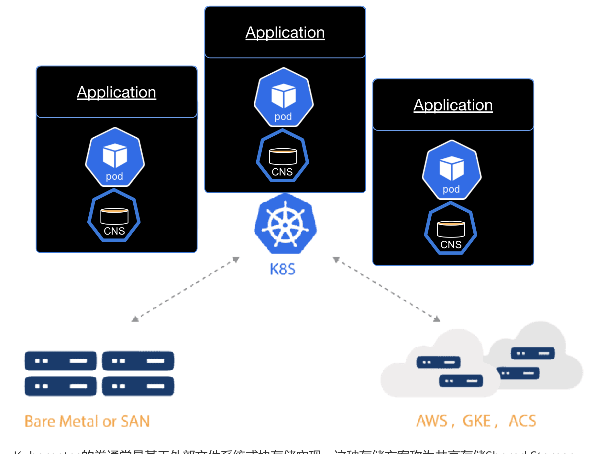

Kubernetes的卷通常是基于外部文件系统或块存储实现，这种存储方案称为共享存储Shared Storage

容器原生存储 CNS (Container Attached Storage，早期称为Container Attached Storage CAS) 则是将存储系统自身部署为Kubermetes集群上的一种较新的存储解决方案

- 存储系统自身(包括存储控制器)在Kubernetes上以容器化微服务的方式运行
- 使得工作负载更易于移植，且更容易根据应用程序的需求改动使用的存储
- 通常基于工作负载或者按集群部署，因此消除了共享存储的跨工作负载甚至是跨集群的爆炸半径
- 存储在CAS中的数据可以直接从集群内的容器访问，从而能显著减少读/写时间

基于CNS的存储解决方案，通常包含两类组件

- 控制平面

  负责配置卷以及其他同存储相关任务

  由存储控制器、存储策略以及如何配置数据平面的指令组成

- 数据平面

  接收并执行来自控制平面的有关如何保存和访问容器信息的指令

  实现池化存储的存储引擎是数据平面的主要组件

  存储引擎本质上负责输入/输出卷路径

```
https://openebs.io/
```


