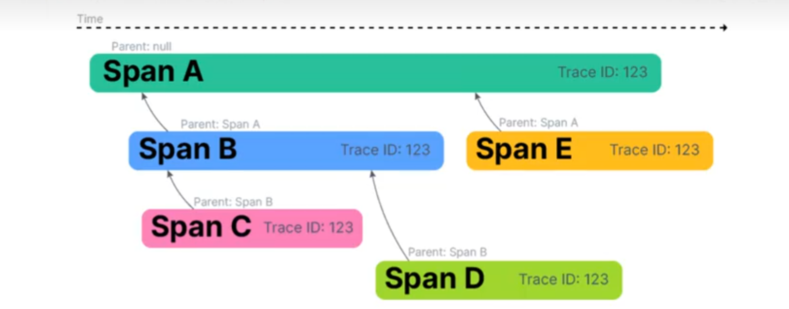
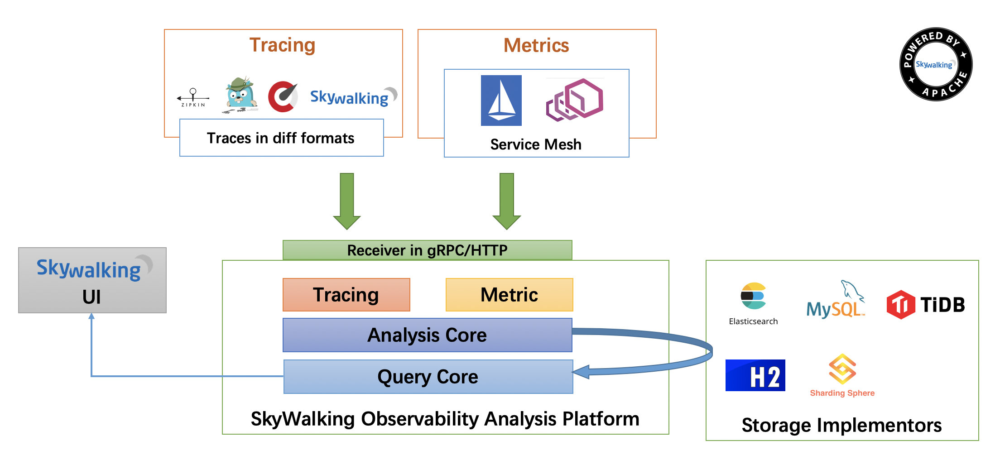

# 44、分布式链路追踪 SkyWalking

```
https://skywalking.apache.org/
```

## Sykwalking介绍

可观测监控领域

- 基于Metrics（指标）监控
- 基于Logging（日志）监控
- 基于Tracing（调用链）监控


 

分布式链路追踪的主流产品

Skywalking、OpenTelemetry、OpenCensus、CAT(大众点评)、Jaeger(Uber)、Zipkin(Twitter)、Pinpoint(韩国)

##  分布式链路追踪的原理

分布式链路追踪的核心原理是**追踪**和**关联**

- 追踪：指的是跟踪一个请求在分布式系统中的完整路径。
- 关联：值得是将同一个请求的不同部分关联起来。

------

#### 1. 背景

在微服务架构或分布式系统中，一个请求往往会经过多个服务节点。如果出现性能问题或者错误，传统的日志很难快速还原完整的调用链路。分布式链路追踪（Distributed Tracing）就是为了解决这个问题而诞生的。

------

#### 2. 核心思想

> 通过“请求打标”和“全链路数据采集”，来实现跨服务、跨节点的调用链跟踪。

------

### 3. 核心概念（四大核心数据） 

| 名称            | 作用                              | 举例                                    |
| --------------- | --------------------------------- | --------------------------------------- |
| TraceId         | 整个请求的唯一ID                  | 同一次请求的所有日志都会有相同的TraceId |
| SpanId          | 每个调用单元（方法/服务）的唯一ID | 每个服务处理自己的SpanId                |
| ParentSpanId    | 上一级的SpanId                    | 用来确定上下级关系                      |
| Baggage（可选） | 自定义的上下文数据                | 例如用户ID、订单号等                    |

------

### 4. 工作流程（执行原理）

#### ① 请求进入第一个服务（A服务）

- 生成 TraceId
- 生成 SpanId（比如：A-1）
- 开始记录日志
- 调用下游服务（B）

#### ② A服务调用B服务

- 通过Header传递 TraceId、ParentSpanId（A-1）、新的 SpanId（B-1）
- B服务接收到请求，继续记录
- 如果B再调用C，就传递相同的TraceId，更新ParentSpanId，生成新的SpanId

------

### 5. 数据采集方式

一般有两种方式：

| 方式      | 特点                 | 案例                                |
| --------- | -------------------- | ----------------------------------- |
| 代码埋点  | 手动在代码中添加埋点 | Spring Cloud Sleuth、Zipkin         |
| Agent探针 | 不改代码，自动探测   | SkyWalking、Pinpoint、OpenTelemetry |

------

### 6. 数据上报 & 存储

> 各服务节点采集的 Trace 数据最终会统一上报到 Trace Server，比如：

- ElasticSearch
- Jaeger Storage
- SkyWalking OAP
- Zipkin Storage





 

## Skywalking 介绍

Skywalking是一个功能强大的分布式系统的**可观测性分析平台**Observability Analysis Platfrom（OAP）和**应用性能管理系统 Application Performance Management （APM）。

**APM** (Application Performance Management)即应用性能管理系统，是对企业系统进行实时监控，以实现对应用程序性能管理和故障管理的系统化的解决方案。

```bash
https://skywalking.apache.org/

#在线demo网站，用户名密码都是skywalking
https://demo.skywalking.apache.org/General-Service/Services
```

**SkyWalking 功能**

- 多种监控手段。可以通过语言探针和 service mesh 获得监控,。
- 多个语言自动探针。包括Java，.NET Core和Node.JS。
- 轻量高效。无需大数据平台，和大量的服务器资源。
- 模块化。UI、存储、集群管理都有多种机制可选
- 支持告警
- 优秀的可视化解决方案

**SkyWalking 优势**

- 基于java 主流生态，功能丰富，支持各种语言。
- 插件丰富，探针无侵入
- 探针性能优秀，相对其它如 Pinpoint 性能表现更加优秀
- 社区活跃，迭代迅速
- 采用先进的**流式拓扑分析**设计


## SkyWalking组成

```
https://skywalking.apache.org/zh/2020-04-19-skywalking-quick-start/
```



整个架构，分成上、下、左、右四部分：

> 考虑到让描述更简单，我们舍弃掉 Metric 指标相关，而着重在 Tracing 链路相关功能。

- 上部分 **Agent** ：负责从应用中，收集链路信息，发送给 SkyWalking OAP 服务器。目前支持 SkyWalking、Zikpin、Jaeger 等提供的 Tracing 数据信息。而我们目前采用的是，SkyWalking Agent 收集 SkyWalking Tracing 数据，传递给服务器。
- 下部分 **SkyWalking OAP** ：负责接收 Agent 发送的 Tracing 数据信息，然后进行分析(Analysis Core) ，存储到外部存储器( Storage )，最终提供查询( Query )功能。
- 右部分 **Storage** ：Tracing 数据存储。目前支持 ES、MySQL、Sharding Sphere、TiDB、H2 多种存储器。而我们目前采用的是 ES ，主要考虑是 SkyWalking 开发团队自己的生产环境采用 ES 为主。
- 左部分 **SkyWalking UI** ：负责提供控台，查看链路等等。

 

 

SkyWalking 分成四个组成部分:

**SkyWalking OAP**:即 Observation Application Platform,负责接收 Agent 发送的Tracing,数据信息，然后进行分析Analysis Core，存储到外部存储器 Storage，最终提供查询Query功能

**Storage**:Tracing数据存储。目前支持ES、MySQL、Sharding sphere、TiDB、H2 多种存储器。SkyWalking 默认用H2内存存储，但无法持久化，Skywalking开发团队自己的生产环境采用 ES 为主,生产建议采用的是 ES

**SkyWalkingUl**:负责提供控台，查看链路等等

**Agent**:负责从应用中，收集链路信息，发送给 SkyWalkingOAP 服务器。目前支持 SkyWalking、zikpin、jaeger 等提供的Tracing 数据信息


 


**Service 服务**:即一个应用，6.0后改名为服务Service

**Endpoint 端点**:即一个API接口，表示传入请求的服务中的路径，例如 HTTP URI路径或 gRPC 服务类+方法签名。比如:/Order/queryAll

**Instance 实例**:即一个进程或者一个Pod 容器,通常表现为一个应用对应的 IP:Port

**Segment**:是Skywalking中提出的概念，表示一次请求在某个服务内的执行链路片段的合集，一个请求在多个服务中先后产生的Segment串起来构成一个完整的Trace，如下图所示


##  Skywalking 部署

### 二进制部署

```
https://skywalking.apache.org/docs/skywalking-showcase/next/readme/
https://skywalking.apache.org/downloads/
```

```bash
#安装java-jdk （支持11、17、21）
[root@ubuntu2204 ~]#apt install openjdk-21-jdk
#下载二进制文件
[root@ubuntu2204 ~]#wget https://mirrors.tuna.tsinghua.edu.cn/apache/skywalking/9.7.0/apache-skywalking-apm-9.7.0.tar.gz
#解压缩
[root@ubuntu2204 ~]#tar xf apache-skywalking-apm-9.7.0.tar.gz -C /usr/local/
[root@ubuntu2204 local]#ln -s apache-skywalking-apm-bin/ skywalking
[root@ubuntu2204 local]#cd skywalking
[root@ubuntu2204 skywalking]#ls
bin  config  config-examples  LICENSE  licenses  LICENSE.tpl  NOTICE  oap-libs  README.txt  tools  webapp  zipkin-LICENSE

[root@ubuntu2204 skywalking]#cat webapp/application.yml 
# Licensed to the Apache Software Foundation (ASF) under one or more
# contributor license agreements.  See the NOTICE file distributed with
# this work for additional information regarding copyright ownership.
# The ASF licenses this file to You under the Apache License, Version 2.0
# (the "License"); you may not use this file except in compliance with
# the License.  You may obtain a copy of the License at
#
#     http://www.apache.org/licenses/LICENSE-2.0
#
# Unless required by applicable law or agreed to in writing, software
# distributed under the License is distributed on an "AS IS" BASIS,
# WITHOUT WARRANTIES OR CONDITIONS OF ANY KIND, either express or implied.
# See the License for the specific language governing permissions and
# limitations under the License.


serverPort: ${SW_SERVER_PORT:-8080}

# Comma seperated list of OAP addresses.
oapServices: ${SW_OAP_ADDRESS:-http://localhost:12800}

zipkinServices: ${SW_ZIPKIN_ADDRESS:-http://localhost:9412}

#启动脚本
[root@ubuntu2204 bin]#vim startup.sh 

# Licensed to the Apache Software Foundation (ASF) under one
# or more contributor license agreements.  See the NOTICE file
# distributed with this work for additional information
# regarding copyright ownership.  The ASF licenses this file
# to you under the Apache License, Version 2.0 (the
# "License"); you may not use this file except in compliance
# with the License.  You may obtain a copy of the License at
#
#     http://www.apache.org/licenses/LICENSE-2.0
#
# Unless required by applicable law or agreed to in writing, software
# distributed under the License is distributed on an "AS IS" BASIS,
# WITHOUT WARRANTIES OR CONDITIONS OF ANY KIND, either express or implied.
# See the License for the specific language governing permissions and
# limitations under the License.

#!/usr/bin/env sh

PRG="$0"
PRGDIR=`dirname "$PRG"`
OAP_EXE=oapService.sh
WEBAPP_EXE=webappService.sh

"$PRGDIR"/"$OAP_EXE" &

"$PRGDIR"/"$WEBAPP_EXE" &
```

```bash
#启动
[root@ubuntu2204 bin]#bash startup.sh

[root@ubuntu2204 bin]#ss -tnulp | grep java
udp   UNCONN 0      0                                              *:41868            *:*    users:(("java",pid=3287,fd=22))                         
udp   UNCONN 0      0                                              *:47193            *:*    users:(("java",pid=3287,fd=23))                         
tcp   LISTEN 0      4096                                           *:3100             *:*    users:(("java",pid=34252,fd=2695))                      
tcp   LISTEN 0      4096                                           *:11800            *:*    users:(("java",pid=34252,fd=2686))                      
tcp   LISTEN 0      4096                                           *:8080             *:*    users:(("java",pid=3287,fd=27))                         
tcp   LISTEN 0      4096                                           *:12801            *:*    users:(("java",pid=34252,fd=2704))                      
tcp   LISTEN 0      4096                                           *:12800            *:*    users:(("java",pid=34252,fd=2690))                      
tcp   LISTEN 0      4096                                           *:9090             *:*    users:(("java",pid=34252,fd=2700))  
```


## 实现JAVA应用RuoYi

### 编译RuoYi

```bash
[root@ubuntu2204 ~]#git clone https://gitee.com/y_project/RuoYi.git
[root@ubuntu2204 ~]#apt update && apt install mysql-server openjdk-8-jdk maven -y

mysql> create database ry;
Query OK, 1 row affected (0.00 sec)

mysql> create user ry@'localhost' identified by '123456';
Query OK, 0 rows affected (0.02 sec)

mysql> user ru
    -> ^C
mysql> use ry
Database changed
mysql> source RuoYi/sql/ry_20240601.sql
mysql> source RuoYi/sql/quartz.sql

#修改配置
[root@ubuntu2204 RuoYi]#vim ruoyi-admin/src/main/resources/application-druid.yml 

# 数据源配置
spring:
    datasource:
        type: com.alibaba.druid.pool.DruidDataSource
        driverClassName: com.mysql.cj.jdbc.Driver
        druid:
            # 主库数据源
            master:
                url: jdbc:mysql://localhost:3306/ry?useUnicode=true&characterEncoding=utf8&zeroDateTimeBehavior=convertToNull&useSSL=true&serverTimezone=GMT%2B8
                username: ry
                password: 123456

 
#编译
[root@ubuntu2204 RuoYi]#mvn clean package -Dmaven.test.skip=true

[root@ubuntu2204 RuoYi]#ls ruoyi-admin/target/
classes  generated-sources  maven-archiver  maven-status  ruoyi-admin.jar  ruoyi-admin.jar.original

```

### 部署JAVA agent

```
https://mirrors.tuna.tsinghua.edu.cn/apache/skywalking/java-agent/9.4.0/
https://skywalking.apache.org/downloads/
```


```bash
[root@ubuntu2204 ~]#wget  https://mirrors.tuna.tsinghua.edu.cn/apache/skywalking/java-agent/9.4.0/apache-skywalking-java-agent-9.4.0.tgz
[root@ubuntu2204 ~]#tar xf apache-skywalking-java-agent-9.4.0.tgz -C java
[root@ubuntu2204 java]#ls
skywalking-agent
[root@ubuntu2204 java]#ls
skywalking-agent
[root@ubuntu2204 java]#ls skywalking-agent/
activations        config           LICENSE   logs    optional-plugins           plugins
bootstrap-plugins  expired-plugins  licenses  NOTICE  optional-reporter-plugins  skywalking-agent.jar
```

方法1: 通过配置文件实现
1. Agent is available for jDK 8 -21.
2. Find `agent` folder in SkyWalking release package
3. Set `agent.service_name` in `config/agent.config`. Could be any String in English.
4. Set `co1lector.backend_service` in `config/agent.config`. Default point to `127.0.0.1:11800`, only works for local backend
5. Add `-javaagent: /path/to/skywalking-package/agent/skywalking-agent.jar` to JVM argument. And make sure to add it
  before the `-jar` argument.

方法二：通过java选项实现

JAVA应用使用Agent的格式

```bash
java -javaagent:/usr/1oca1/skywalking-agent/skywalking-agent.jar \
     -Dskywalking.agent.service_name=Myservice \
     -Dskywalking.1ogging.file_name=Mysservice-api.1og \
     -DSW_AGENT NAMESPACE=myproject \
     -DSWAGENT_COLLECTOR_BACKEND_SERVICEs=skywaking.k ang.org:11800 \
     -jar Myservice.jar \
```

方法3: 通过环境变量实现

```bash
export SW_AGENT_NAME=myapp
expOrt SW_AGENT_NAMESPACE=myproject
expOrt SW_AGENT_COLLECTOR_BACKEND_SERVICEs=skywalking.kang.org:11800
```


```bash
java -javaagent:/root/java/skywalking-agent/skywalking-agent.jar \
     -DSW_AGENT_NAMESPACE=ruoyi \
     -DSW_AGENT_COLLECTOR_BACKEND_SERVICES=10.0.0.104:11800 \
     -jar /root/RuoYi/ruoyi-admin/target/ruoyi-admin.jar

```


```
java -javaagent:/root/java/skywalking-agent/skywalking-agent.jar -DSW_AGENT_NAME=ruiyi -DSW_AGENT_COLLECTOR_BACKEND_SERVICES=10.0.0.104:11800 -jar /root/RuoYi/ruoyi-admin/target/ruoyi-admin.jar
```

