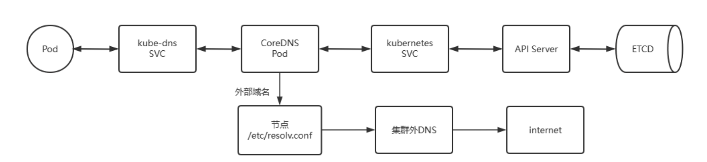

# kubernetes

## 工作负载控制器

### Replica Set(RS)

**不支持动态更新**

负责编排无状态应用的基础控制器是ReplicaSet，定义编排一个无状态应用相应的资源类型主要的三个关键属性如下

- replicas：Pod期待的副本数量
- selector：筛选目标Pod的标签选择器,支持matchExpressions和matchLabels
- template：如果Pod数量不满足预期值，自动创建Pod时候用到的模板(template)，清单文件格式和自主式Pod一样

意义：自动监控Pod运行的副本数目符合预期，保证Pod高可用的核心组件，常用于Pod的生命周期管理


当通过"资源定义文件"定义好了一个RS资源对象，把它提交到Kubernetes集群

Master节点上的Controller Manager组件就得到通知

Controller Manager 根据 ReplicaSet Control Loop 管理 ReplicaSet Object

由该对象向API Server请求管理Pod对象(标签选择器选定的)

如果没有pod：以Pod模板向API Server请求创建Pod对象，由Scheduler调度并绑定至某节点，由相应节点kubelet负责运行。

定期巡检系统中当前存活的Pod，并确保Pod实例数量刚到满足RC的期望值。

如果Pod数量大于RS定义的期望值，那么就杀死一些Pod

如果Pod数量小于RS定义的期望值，那么就创建一些Pod

所以通过RS资源对象，Kubernetes实现了业务应用集群的高可用性，大大减少了人工干预，提高了管理的自动化。

如果后续想要扩充Pod副本的数量，可以直接修改replicas的值即可

当其中一个Node的Pod意外终止，根据RS的定义，Pod的期望值是2，所以会随机找一个Node结点重新再创建一个新的Pod，来保证整个集群中始终存在两个Pod运行

注意：

- 删除RS并不会影响通过该RS资源对象创建好的Pod。
- 如果要删除所有的Pod那么可以设置RS的replicas的值为0，然后更新该RS。
- 另外kubectl提供了stop和delete命令来一次性删除RS和RS控制的Pod。
- Pod提供的如果无状态服务，不会影响到客户的访问效果。

RS可以实现应用的部署，扩缩容和卸载，但一般很少单独使用


### **Deployment**

Deployment资源对象一般用于部署无状态服务

**Deployment相对于RC或RS的一个主要升级是:支持动态更新和滚动发布策略,其它功能几乎一样**

Deployment资源对象在内部使用Replica Set来实现Pod的自动化编排

通过Deployment 可以随时知道当前Pod的"部署"进度，即Pod创建--调度--绑定Node--在目标Node上启动容器。

Deployment的使用场景非常多,基本上只要是涉及到Pod资源对象的自动化管理都是它的应用场景

**Deployment** **工作流程**

- 创建Deployment资源对象，自动生成对应的Replicas Set并完成Pod的自动管理，而无需人为显示

  创建 Replicas Set

- 检查Deployment对象状态，检查Pod自动管理效果

- 扩展Deployment资源对象，以应对应用业务的高可用

**Deployment 本质上是依赖并调用 Replica Set 的完成来基本的编排功能，并额外提供了滚动更新，回滚的功能**

- 先由Deployment 创建 Replica Set 资源对象并进行编排
- 再由Replica Set 创建并对 Pod 的编排
- Deployment是建立在ReplicaSet控制器上层的更高级的控制器
- Deployment 位于ReplicaSet更上面一层，基于ReplieaSet，提供了滚动更新、回滚等更为强大的应用编排功能
- Deployment是 Replica Set 的编排工具，Deployment编排ReplicaSet，ReplicaSet编排Pod
- Replica Set的名称由Deployment名称-Template的Hash值生成
- Deployment 并不直接管理 Pod，必须间接的利用 Replica Set 来完成对Pod的编排
- 通常应该直接通过定义Deployment资源来编排Pod应用，而ReplicaSet无须显式配置
- Deployment 依赖 Replica Set 的存在

```yaml
apiVersion: apps/v1
kind: Deployment
metadata:
  name: nginx-deployment  # 部署名称（命名规则：<应用名>-deployment）
  namespace: production   # 建议明确指定命名空间
  labels:
    app: nginx            # 推荐添加标签便于管理
    tier: frontend

spec:
  # ====================== 副本控制 ======================
  minReadySeconds: 10     # 生产环境建议10-30秒（默认0）
  replicas: 3             # Pod副本数（根据负载调整）
  revisionHistoryLimit: 5 # 保留的历史版本数（节省etcd空间）

  # ====================== 选择器配置 ======================
  selector:
    matchLabels:          # 必须与template.metadata.labels匹配
      app: nginx
      tier: frontend

  # ====================== 更新策略 ======================
  strategy:
    type: RollingUpdate   # 可选值：RollingUpdate（默认）/Recreate
    rollingUpdate:
      maxSurge: 25%       # 最大激增Pod数（建议20%-30%）
      maxUnavailable: 1   # 最大不可用Pod数（建议0-1）

  # ====================== Pod模板 ======================
  template:
    metadata:
      labels:            # 必须匹配selector.matchLabels
        app: nginx
        tier: frontend
      annotations:       # 推荐添加的注解
        commit-id: "${CI_COMMIT_SHA}"  # 注入构建信息
        deploy-time: "${TIMESTAMP}"

    spec:
      # ===== 容器配置 =====
      containers:
      - name: nginx      # 容器名称
        image: nginx:1.23.1  # 生产环境必须指定确定版本
        imagePullPolicy: IfNotPresent
        ports:
        - containerPort: 80
          protocol: TCP
          name: http

        # ===== 资源限制 =====
        resources:
          requests:
            cpu: "100m"  # 0.1核
            memory: "128Mi"
          limits:
            memory: "256Mi"  # 内存必须设置上限

        # ===== 健康检查 =====
        readinessProbe:   # 就绪检查（必须配置）
          httpGet:
            path: /
            port: 80
          initialDelaySeconds: 5
          periodSeconds: 10
          failureThreshold: 3
        livenessProbe:    # 存活检查（建议配置）
          httpGet:
            path: /healthz
            port: 80
          initialDelaySeconds: 15
          periodSeconds: 20

      # ===== 调度策略 =====
      affinity:
        podAntiAffinity:  # Pod反亲和性（避免集中部署）
          preferredDuringSchedulingIgnoredDuringExecution:
          - weight: 100
            podAffinityTerm:
              labelSelector:
                matchExpressions:
                - key: app
                  operator: In
                  values: [nginx]
              topologyKey: kubernetes.io/hostname

      # ===== 安全配置 =====
      securityContext:
        runAsNonRoot: true
        runAsUser: 1000
        fsGroup: 2000
```


### daemonset

每个主机运行一个pod

DaemonSet 的一些典型用法：

- 在每个节点上运行集群守护进程
- 在每个节点上运行日志收集守护进程
- 在每个节点上运行监控守护进程
- 常用于后台支撑服务

```yaml
apiVersion: apps/v1  # API群组及版本（必须为apps/v1）
kind: DaemonSet      # 资源类型特有标识
metadata:
  name: <string>     # 【必填】资源名称，在命名空间中必须唯一
  namespace: <string> # 【可选】名称空间；DaemonSet资源隶属名称空间级别
spec:
  minReadySeconds: <integer>  # 【可选】Pod就绪后需稳定运行的秒数（任一容器无crash）
  selector:                  # 【必填】标签选择器
    matchLabels:             # 必须匹配template中Pod模板的标签
      <key>: <value>
  template:                 # 【必填】Pod模板对象
    metadata:
      labels:
        <key>: <value>      # 必须与selector.matchLabels匹配
    spec:
      containers:           # 容器定义（此处省略具体配置）
      - name: <string>
        image: <string>
  
  revisionHistoryLimit: <integer> # 【可选】保留的滚动更新历史记录数量，默认为10
  updateStrategy:        # 【可选】更新策略配置
    type: <string>       # 更新类型：OnDelete 或 RollingUpdate（默认）
    rollingUpdate:       # 【type=RollingUpdate时生效】滚动更新参数
      maxUnavailable: <string>  # 【必填】更新期间允许缺少的Pod数量/比例（默认1）
      # 图片说明：更新期间可比期望的Pod数量缺少的数量或比例
      # 可接受值示例：1（绝对数）或 "20%"（百分比）
```


### Job

在日常的工作中，经常会遇到临时执行一个任务，但是这个任务必须在某个时间点执行才可以

前面的Deployment和DaemonSet主要负责编排始终持续运行的守护进程类的应用，并不适合此场景

针对于这种场景，一般使用job的方式来完成任务

Job负责编排运行有结束时间的“一次性”任务

- 控制器要确保Pod内的进程“正常（成功完成任务)”退出
- 非正常退出的Pod可以根据需要重启，并在重试指定的次数后终止
- Job 可以是单次任务，也可以是在多个Pod分别各自运行一次，实现运行多次（次数通常固定)
- Job 支持同时创建及并行运行多个Pod以加快任务处理速度，Job控制器支持用户自定义其并行度

关于job的执行主要有两种并行度的类型：

- 串行 job：即所有的job任务都在上一个job执行完毕后，再开始执行
- 并行 job：如果存在多个 job，可以设定并行执行的 job 数量。

Job资源同样需要标签选择器和Pod模板，但它不需要指定replicas，且需要给定completions，即需要完成的作业次数，默认为1次

- Job资源会为其Pod对象自动添加“job-name=JOB_NAME”和“controller-uid=UID”标签，并使用标签选择器完成对controller-uid标签的关联，因此，selector并非必选字段
- Pod的命名格式：$(job-name)-$(index)-$(random-string)，其中的$(index)字段取值与completions和completionMode有关

注意

- Job 资源是标准的API资源类型
- Job 资源所在群组为“batch/v1”
- Job 资源中，Pod的RestartPolicy的取值只能为Never或OnFailure

```yaml
apiVersion: batch/v1  # API群组及版本（必须为batch/v1）
kind: Job             # 资源类型特有标识
metadata:
  name: <string>      # 【必填】资源名称，在命名空间中必须唯一
  namespace: <string> # 【可选】名称空间；Job资源隶属名称空间级别
spec:
  # ====== 核心作业配置 ======
  completions: <integer>  # 【可选】期望的成功完成次数（默认1）
                        # 图片说明：成功运行结束的Pod数量
  parallelism: <integer> # 【可选】最大并行Pod数（默认1）
                        # 图片说明：作业的最大并行度
  backoffLimit: <integer> # 【可选】失败前的重试次数（默认6）
                         # 图片说明：将作业标记为Failed之前的重试次数
  
  # ====== 高级控制 ======
  completionMode: <string> # 【可选】完成模式：
                          # - NonIndexed（默认）：无序完成
                          # - Indexed：有序完成（需要StatefulSet式Pod）
  suspend: <boolean>      # 【可选】是否挂起作业执行（默认false）
                        # 图片说明：挂起会重置StartTime字段
  activeDeadlineSeconds: <integer> # 【可选】作业最大运行时长（秒）
                                 # 图片说明：作业启动后可处于活动状态的时长
  ttlSecondsAfterFinished: <integer> # 【可选】完成后自动删除延迟（秒）
                                   # 图片说明：Completed状态的生存时长

  # ====== Pod模板 ======
  template:             # 【必填】Pod模板（需包含spec）
    metadata:
      labels:           # 必须与selector.matchLabels匹配（如果指定selector）
        <key>: <value>
    spec:
      containers:      # 【必填】至少一个容器定义
      - name: <string>
        image: <string>
      restartPolicy: OnFailure # Job必须设置为Never或OnFailure
```

### CronJob

对于周期性的定时任务，kubernetes提供了 Cronjob控制器实现任务的编排

CronJob 建立在Job的功能之上，是更高层级的控制器

```
# ┌───────────── 分钟 (0 - 59)
# │ ┌───────────── 小时 (0 - 23)
# │ │ ┌───────────── 月的某天 (1 - 31)
# │ │ │ ┌───────────── 月份 (1 - 12)
# │ │ │ │ ┌───────────── 周的某天 (0 - 6)（周日到周一；在某些系统上，7 也是星期日）
# │ │ │ │ │ 或者是 sun，mon，tue，web，thu，fri，sat
# │ │ │ │ │
# │ │ │ │ │
# * * * * *
```

```yaml
apiVersion: batch/v1  # 必须使用 batch/v1 API（早期版本为 batch/v1beta1）
kind: CronJob
metadata:
  name: <string>      # 【必填】CronJob名称（命名空间内唯一）
  namespace: <string> # 【可选】命名空间，默认default
spec:
  # ====== 核心调度配置 ======
  schedule: "<string>" # 【必填】crontab格式的时间表达式
                      # 示例："*/5 * * * *" 表示每5分钟
  
  concurrencyPolicy: <string> # 【可选】并发策略：
                            # - Allow（默认）：允许并发执行
                            # - Forbid：禁止并发
                            # - Replace：替换未完成的任务
  
  # ====== 作业记录控制 ======
  successfulJobsHistoryLimit: <integer> # 【可选】保留的成功作业记录数（默认3）
  failedJobsHistoryLimit: <integer>    # 【可选】保留的失败作业记录数（默认1）
  
  # ====== 高级控制 ======
  startingDeadlineSeconds: <integer> # 【可选】允许延迟执行的秒数
  suspend: <boolean>                # 【可选】暂停调度（默认false）

  # ====== 作业模板 ======
  jobTemplate:          # 【必填】Job模板
    metadata:           # 模板元数据（可选）
      labels:
        <key>: <value>
    spec:               # Job规格（必填）
      template:
        spec:
          containers:
          - name: <string>
            image: <string>
          restartPolicy: OnFailure
```


## 服务访问Service

**四层代理**

实现方式

- userspace
- iptables/nftables
- ipvs

### Service 和 kube-proxy 关联关系


```powershell
kube-proxy ————》 service 网络 （iptable/nftable,ipvs）

host	
service	网络插件 cilume kube-proxy(可选)
pod		网络插件 flannel,cilume
```

### **service类型**


|                 类型                 |                        核心功能                         |                           访问方式                           |                        依赖条件/限制                         |          示例场景          |
| :----------------------------------: | :-----------------------------------------------------: | :----------------------------------------------------------: | :----------------------------------------------------------: | :------------------------: |
|      **ClusterIP** （默认类型）      |  为集群内部（节点、Pod）提供访问，外部网络无法直接访问  |       `客户端 → ClusterIP:ServicePort → PodIP:PodPort`       |                          无特殊依赖                          | 内部微服务通信（如数据库） |
|  **NodePort** （ClusterIP 增强版）   | 通过节点 IP 和固定端口（30000~32767）暴露服务到外部网络 | `外部客户端 → NodeIP:NodePort` `→ ClusterIP:ServicePort → PodIP:PodPort` |    需节点开放端口 （所有 `kube-proxy` 节点启用相同端口）     |    开发测试环境临时访问    |
| **LoadBalancer** （NodePort 增强版） |        基于云厂商负载均衡器（LBaaS）对外提供服务        | `外部客户端 → 云厂商LB → NodeIP:NodePort` `→ ClusterIP:ServicePort → PodIP:PodPort` | 依赖云平台 LBaaS 支持 （无云服务时降级为 `NodePort`，`EXTERNAL-IP` 显示 `Pending`） |  生产环境高可用 Web 服务   |
|           **ExternalName**           |   通过 DNS CNAME 将外部服务（如云数据库）引入集群内部   | `集群内客户端 → Service名称 → CNAME → 外部服务域名（如 mysql.wang.org）` | 依赖 CoreDNS 解析 （无 ClusterIP/NodePort，不创建 Endpoints） | 访问外部托管服务（如 RDS） |

| 类型         | 解析                                                         |
| ------------ | ------------------------------------------------------------ |
| ClusterIP    | 此为Service的默认类型<br/>为集群内部的客户端访问,包括节点和Pod等，外部网络无法访问<br/>In client --> clusterIP: ServicePort (Service) --> PodIP: PodPort |
| NodePort     | 本质上在ClusterIP模式基础上,再多加了一层端口映射的封装,相当于增强版的ClusterIP<br/>通过NodeIP:NodePort对外部网络提供服务，默认随机端口范围30000~32767, 可指定为固定端口<br/>NodePort是一个随机的端口，以防止端口冲突,在所有安装kube-proxy的节点上都会打开此相同的端口<br/>可通过访问ClusterIP实现集群内部访问,也可以通过NodeIP:NortPort的方式实现从集群外部至内部的访问<br/>Ex Client --> NodeIP:NodePort (Service) --> PodIP:PodPort |
| LoadBalancer | 基于NodePort基础之上，使用集群外部的运营商负载均衡器方式实现对外提供服务,增强版的NodePort<br/>基于云运营商IaaS云创建一个Kubernetes云，云平台也支持LBaaS(LoadBalance as a Service)产品服务<br/>Master 借助cloud-manager向LBaaS的API请求动态创建软件LB,即支持和Kubernetes API Server 进行交互<br/>如果没有云服务,将无法获取EXTERNAL-IP,显示Pending状态,则降级为NodePort类型<br/>Ex Client --> LB_IP:LB_PORT --> NodeIP:NodePort(Service)-->PodIP:PodPort |
| ExternalName | 当Kubernetes集群需要访问集群外部服务时，需要通过externalName将外部主机引入到集群内部<br/>外部主机名以 DNS方式解析为一个 CNAME记录给Kubernetes集群的其他主机来使用<br/>这种Service既没有ClusterIP，也没有NodePort.而且依赖于内部的CoreDNS功能<br/>In client -->Cluster ServiceName --> CName --> External Service Name<br/>本方式的service没有selector,所以也不会创建同名的Endpoints资源对象<br/>示例：<br/>Service名称：MySQL服务内部域名 mysql.default.svc.cluster.local<br/>MySQL服务外部域名：mysql.wang.org<br/>In Client --> mysql.default.svc.cluster.local --> mysql.wang.org --> MYSQL IP |

```
clusterIP
nodeport=clusterIP+nodeIP:Port
LoadBalancer=nodeport+集群外的IP:Port
ExternalName:集群内访问集群外，款名称空间之间的Pod访问
```


## 域名解析

Kubernetes主要有两种服务发现机制：

- 环境变量
- DNS解析


### 环境变量

环境变量缺点：

- 重建service，变量不会更新

- 新建service，变量不会增加
- 删除service，变量不会删除


### DNS解析

#### CoreDNS

CoreDNS 通过访问名为 kubernetes 的 Service,找到 API Server 进而连接到 ETCD，从而实现Kubernetess集群中的Service，Endpoint，Pod 等资源的查找



#### pod的DNSSpolicy

- Default：从当前**Pod运行的所在宿主机节点**/etc/resolv.conf继承DNS名称解析相关的配置
- ClusterFirst：此为默认值，优先使用**K8s集群内DNS服务上解析集群域内**的名称，其他域名的解析则交由**coreDNS的Pod所在宿主机节点**/etc/resolv.conf的名称服务器即使用Default策略（注意：和Default不同在于，使用是CoreDNS的Pod的所在宿主机节的/etc/resolv.conf文件）
- ClusterFirstWithHostNet：专用于在设置了hostNetwork（使用宿主机的网络）的Pod对象上并不会使用宿主机节点网络的DNS，仍然使用ClusterFirst策略
- None：用于忽略Kubernetes集群的默认设定，而仅使用由dnsConfig自定义的配置

#### dnsconfig


#### service域名


