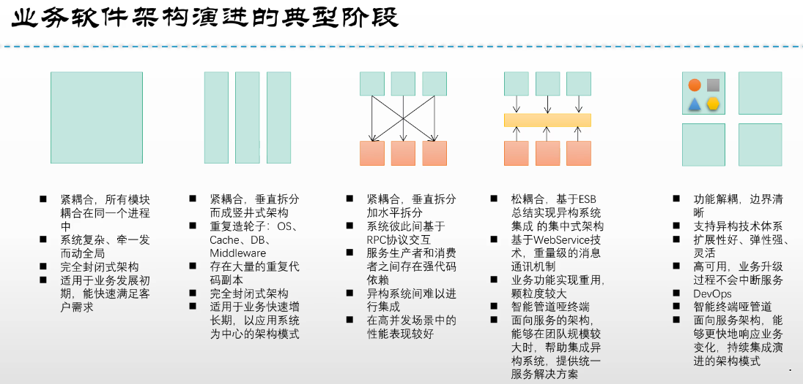
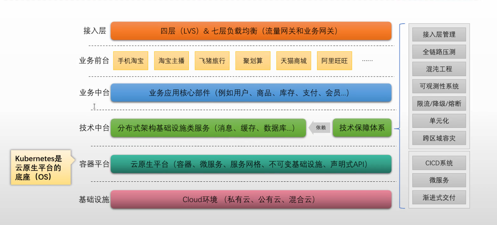
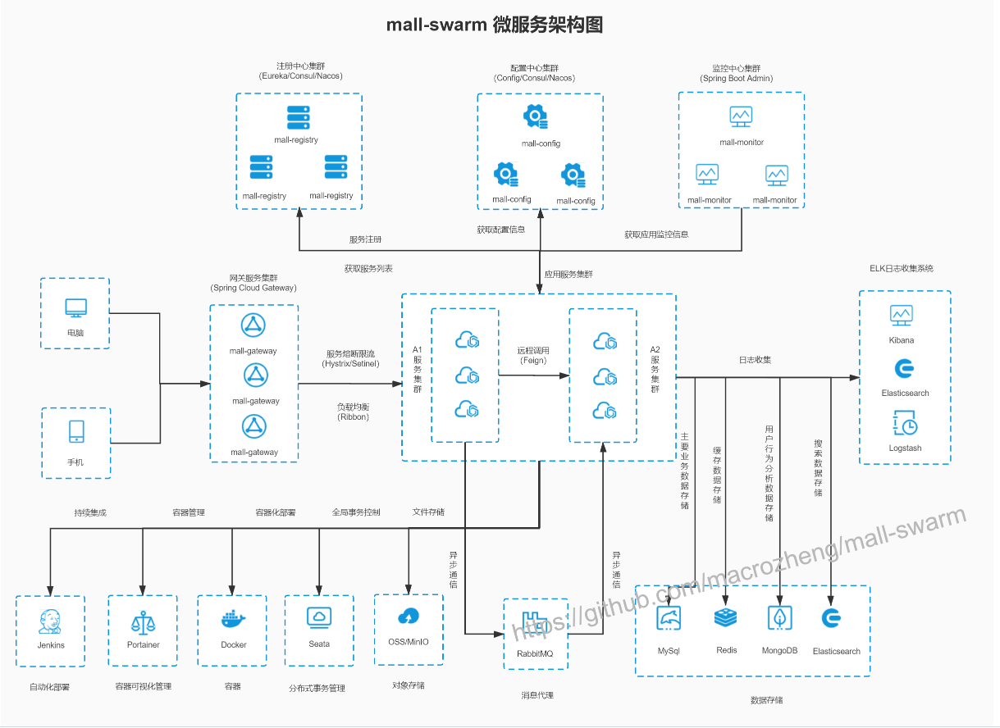

# kubernetes综合项目







# Mall-swarm

```
https://github.com/macrozheng/mall-swarm
```



```
https://github.com/iKubernetes/learning-k8s/tree/master/Mall-MicroService
```

**部署mysql主从**

```
helm repo add bitnami https://charts.bitnami.com/bitnami

helm install mysql  \
        --set auth.rootPassword=MagEdu \
        --set global.storageClass=openebs-hostpath \
        --set architecture=replication \
        --set auth.database=nacosdb \
        --set auth.username=nacos \
        --set auth.password='magedu.com' \
        --set secondary.replicaCount=2 \
        --set auth.replicationPassword='replpass' \
        bitnami/mysql \
        -n nacos --create-namespace
```

